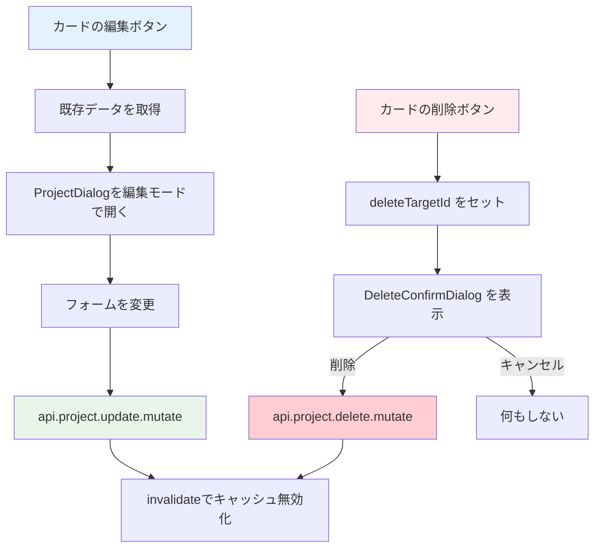
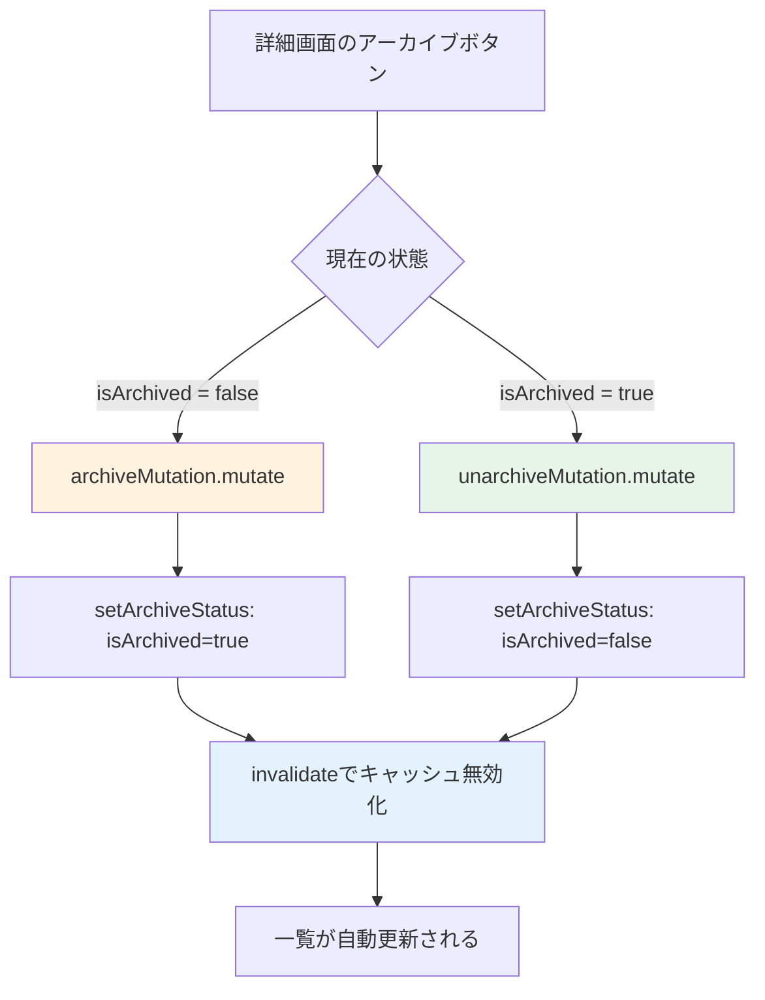

# Day 11: プロジェクト編集・削除を実装しよう

## 🔙 前回の振り返り

Day 10 では react-hook-form・zod・tRPC の `useMutation` を組み合わせて、ダイアログ形式のプロジェクト新規作成機能を実装しました。CRUDの「Create」ができたので、今日は同じダイアログを再利用して「Update」と「Delete」を実装します。

---

## 🎯 今日のゴール

Day 10 で作った ProjectDialog を「編集モード」で再利用し、プロジェクトの更新と削除を実装します。既存データをフォームに反映する方法と、削除前の確認ダイアログも学びます。

📸 スクリーンショット: 編集モードの ProjectDialog が表示されている画面


## 🤔 なぜこれを作るのか？

Day 10 で「プロジェクト作成」ができるようになりました。しかし、名前の間違いを直したいときや、不要になったプロジェクトを整理したいときはどうすればよいでしょうか？

今日は「編集」と「削除」を追加して、プロジェクト管理を完成させます。今日の作業が終わると、プロジェクトの作成・編集・削除・アーカイブという一連の管理操作が全て揃います。

> 💡 **例え話**: Day 10 で作ったダイアログは「万能な注文用紙」です。新規注文にも注文変更にも使え、変更時は元の内容を用紙に書いておくだけです。このように1つのコンポーネントで両方に対応する設計を「再利用性の高い設計」と言います。

### 📐 編集・削除の処理フロー



### やること / やらないこと

| やること | やらないこと |
|---------|-------------|
| 編集ダイアログに既存データを渡す | 新しい編集ページを作る |
| `api.project.update` で更新 | フォームの作り直し |
| `DeleteConfirmDialog` で削除確認 | `window.confirm()` の使用 |
| キャッシュ無効化で一覧更新 | 手動リロード |
| アーカイブ mutation の実装 | アーカイブUIの詳細カスタマイズ |

## 🆕 新しく学ぶ概念

| 概念 | 説明 |
|------|------|
| 編集モード（Edit Mode） | 1つのフォームコンポーネントを新規作成と更新の両方に使い回す設計パターン |
| initialData | コンポーネントに既存データを渡して初期値として表示する props |
| キャッシュ無効化（invalidate） | 更新・削除後に tRPC のキャッシュを破棄して最新データを再取得させる処理 |
| アーカイブ | データを削除せずに非表示にする方法。復元が可能 |

> 💡 **補足**: 「楽観的更新（Optimistic Update）」という手法もありますが、今回は使いません。楽観的更新はサーバーの応答を待たず先にUIを更新し、失敗したらロールバックする高度な手法です。今回はよりシンプルな `invalidate()`（キャッシュ無効化）で一覧を更新します。

### 📂 今日の作業ファイル

```
src/
├── app/
│   └── project/
│       └── page.tsx          ← 編集・削除・アーカイブのハンドラーを追加
├── component/
│   └── ui/
│       └── delete-confirm-dialog.tsx  ← 削除確認ダイアログ（既存・変更なし）
└── server/
    └── api/
        └── routers/
            └── project.ts    ← archive/unarchiveルーター（既存・変更なし）
```

## 📊 実装ステップ一覧

| ステップ | 作業内容 | 所要時間 |
|---------|---------|---------|
| Step 1 | インポートと編集ボタンのハンドラーを作る | 7分 |
| Step 2 | 削除の state と mutation を実装する | 5分 |
| Step 3 | 送信ハンドラーを作る | 7分 |
| Step 4 | ProjectDialog を配置する | 5分 |
| Step 5 | DeleteConfirmDialog を配置する | 5分 |
| Step 6 | 削除 vs アーカイブの違いを理解する | 5分 |
| Step 7 | アーカイブ mutation を定義する | 5分 |
| Step 8 | アーカイブハンドラーを作る | 3分 |
| Step 9 | ProjectDetailView にアーカイブを渡す | 4分 |
| Step 10 | 動作確認 | 7分 |

**合計時間**: 約53分

---

### Step 1: インポートと編集ボタンのハンドラーを作る（7分）

🎯 **ゴール**: 必要なインポートを追加し、カードの編集ボタンで既存データを取得します。

💻 **実装**:

まず、Day 10 で作成した `ProjectFormData` 型と、削除確認用の `DeleteConfirmDialog` をインポートします。
既に `useState` や `Suspense` の import がある場合は、
重複させずに以下の形へ揃えてください。

```typescript
// filepath: src/app/project/page.tsx
import {
  useRouter,
  useSearchParams,
} from 'next/navigation';
import {
  Suspense,
  useEffect,
  useState,
} from 'react';
// Day 10のProjectFormData型をインポート
import {
  ProjectDialog,
  type ProjectFormData,
} from '@/component/project/project-dialog';
import {
  dateOnlyFromValue,
  dateOnlyToUtcStartIso,
} from '@/lib/date';
// 削除確認ダイアログ（shadcn/uiベース）
import { DeleteConfirmDialog }
  from '@/component/ui/delete-confirm-dialog';
```

✅ **確認ポイント**:
- インポート文を追加してエラーが出ていない
- `ProjectFormData` と `DeleteConfirmDialog` が正しくインポートされた

次に、詳細表示と編集用の state を追加します。
`ProjectPageContent` 関数の先頭にある state 一覧
（`const [dialogOpen, ...]` の並び）に追加してください。

```typescript
// filepath: src/app/project/page.tsx
const [selectedProject, setSelectedProject] =
  useState<string | null>(null);
const [editingProject, setEditingProject] =
  useState<ProjectFormData | undefined>(
    undefined
  );
```

✅ **確認ポイント**:
- `selectedProject` が `string | null` で定義されている
- `editingProject` の型が `ProjectFormData | undefined` になっている
- 保存時にエラーが出ていない

URL の `?projectId=...` と state を同期するコードも追加します。
`utils = api.useUtils()` より前に置くと読みやすいです。

```typescript
// filepath: src/app/project/page.tsx
const searchParams = useSearchParams();
const projectIdParam =
  searchParams.get('projectId');
const router = useRouter();

useEffect(() => {
  if (projectIdParam) {
    setSelectedProject(projectIdParam);
  } else {
    setSelectedProject(null);
  }
}, [projectIdParam]);
```

✅ **確認ポイント**:
- `router.push(...)` を使う準備ができている
- URL に `projectId` があると `selectedProject` に入る

次に、Day 10 で定義済みの `handleCreate` の直下に `handleEdit` を追加します。実際のコードでは `handleCreate` → `handleEdit` の順番で並んでいます。

日付は `dateOnlyFromValue()` で `"2024-12-31"` 形式に変換します。保存済みの ISO 文字列から `<input type="date">` 用の date-only 値を安全に取り出せます。

```typescript
// filepath: src/app/project/page.tsx
// handleCreateの直下に追加: 編集ボタンのハンドラー
const handleEdit = (projectId: string) => {
  const project = projects?.find(
    (p) => p.id === projectId
  );
  if (!project) return;
  const startDate = project.startDate
    ? dateOnlyFromValue(project.startDate)
    : undefined;
  const endDate = project.endDate
    ? dateOnlyFromValue(project.endDate)
    : undefined;
  setEditingProject({
    id: project.id,
    name: project.name,
    description: project.description || '',
    color: project.color,
    ...(startDate && { startDate }),
    ...(endDate && { endDate }),
  });
  setDialogOpen(true);
};
```

✅ **確認ポイント**:
- `handleEdit` が `handleCreate` の直下に配置されている
- `description` に `|| ''` を使って null を空文字に変換している
- 日付変換のロジックが正しく書けた

#### 条件付きスプレッド構文

`...(startDate && { startDate })` という書き方は、「値が存在する場合のみオブジェクトに追加する」パターンです。なぜ `startDate: startDate` とそのまま書かないのでしょうか？

| 書き方 | `startDate` が `undefined` の場合 | 結果 |
|--------|----------------------------------|------|
| ❌ `{ startDate: startDate }` | `{ startDate: undefined }` | `undefined` がオブジェクトに入る |
| ✅ `...(startDate && { startDate })` | `{}` | プロパティ自体が存在しない |

`undefined` がプロパティに入ると、サーバー（Prisma）が「日付を空にする」と解釈する場合があります。プロパティ自体を含めなければ「日付は変更しない」という意味になります。

> 💡 **注文書の例え**: 注文変更で「お届け日」欄に「指定なし」と書くのと、そもそも欄を空白にするのでは意味が違います。「指定なし」は配送日をリセット、空白は変更しないという意味です。

---

### Step 2: 削除の state と mutation を実装する（5分）

🎯 **ゴール**: 削除確認ダイアログ用の state と mutation を実装します。

💻 **実装**:

削除フローでは、2つの state で「どのプロジェクトを削除するか」「確認ダイアログを表示するか」を管理します。`ProjectPageContent` 関数の先頭にある state 一覧（`const [showArchived, ...]` の直下）に追加してください。

```typescript
// filepath: src/app/project/page.tsx
// showArchivedの直下に追加
const [deleteDialogOpen, setDeleteDialogOpen]
  = useState(false);
const [deleteTargetId, setDeleteTargetId]
  = useState<string | null>(null);
```

✅ **確認ポイント**:
- `deleteDialogOpen` と `deleteTargetId` の2つの state が追加された
- `deleteTargetId` の型が `string | null` になっている

次に、削除用の mutation を定義します。実際のコードでは mutation の定義順は `createMutation` → `updateMutation` → `deleteMutation` です。`updateMutation` の直下に追加してください。

```typescript
// filepath: src/app/project/page.tsx
// updateMutationの直下に追加
const deleteMutation =
  api.project.delete.useMutation({
    onSuccess: () => {
      utils.project.getAll.invalidate();
      router.push('/project');
    },
  });
```

✅ **確認ポイント**:
- `deleteMutation` が `updateMutation` の直下に定義できた
- 成功時に `invalidate()` で一覧を更新し、`router.push` で一覧画面に戻る

`handleDelete` は **state を設定するだけ** で、削除の実行は確認ダイアログ内で行います。`handleEdit` の直下に追加してください。実際のコードでは `handleCreate` → `handleEdit` → `handleDelete` の順番です。

```typescript
// filepath: src/app/project/page.tsx
// handleEditの直下に追加
const handleDelete = (projectId: string) => {
  setDeleteTargetId(projectId);
  setDeleteDialogOpen(true);
};
```

✅ **確認ポイント**:
- `handleDelete` は `setDeleteTargetId` と `setDeleteDialogOpen` を呼ぶだけ
- まだ削除は実行されない（確認ダイアログで実行する）

> 💡 `handleDelete` では直接削除を実行しません。まず「どのプロジェクトを削除するか」を記録し、確認ダイアログを開きます。実際の削除は Step 5 で配置するダイアログの `onConfirm` で行います。

---

### Step 3: 送信ハンドラーを作る（7分）

🎯 **ゴール**: 更新用の mutation を定義し、1つの `handleSubmit` で新規作成と更新を分岐します。

💻 **実装**:

まず、更新用の mutation を追加します。
`createMutation` の直下に `updateMutation` を定義してください。

```typescript
// filepath: src/app/project/page.tsx
// createMutationの直下に追加
const updateMutation =
  api.project.update.useMutation({
    onSuccess: () => {
      utils.project.getAll.invalidate();
      if (selectedProject) {
        utils.project.getById.invalidate(
          { id: selectedProject }
        );
      }
      setDialogOpen(false);
    },
  });
```

✅ **確認ポイント**:
- `updateMutation` が `createMutation` の直下に定義されている
- `onSuccess` で `invalidate()` を呼んでいる

次に送信ハンドラーを作ります。実際のコードでは `handleDelete` の直下に `handleSubmit` が定義されています。`data.id` の有無で更新と新規作成を `if/else` で分岐します。

> 📝 **配置の注意**: `handleSubmit` は `handleDelete` の直下に配置してください。コードの並び順は `handleCreate` → `handleEdit` → `handleDelete` → `handleSubmit` です。

更新の場合（`data.id` がある場合）のコードです。

```typescript
// filepath: src/app/project/page.tsx
// handleDeleteの直下に追加: 送信ハンドラー
const handleSubmit = (
  data: ProjectFormData
) => {
  if (data.id) {
    updateMutation.mutate({
      id: data.id,
      name: data.name,
      description:
        data.description ?? null,
      color: data.color,
      startDate: data.startDate
        ? dateOnlyToUtcStartIso(
            data.startDate
          )
        : null,
      endDate: data.endDate
        ? dateOnlyToUtcStartIso(
            data.endDate
          )
        : null,
    });
```

✅ **確認ポイント**:
- `data.id` がある場合に `updateMutation.mutate` を呼んでいる
- `description` に `?? null` を使って `undefined` のみ `null` に変換している

同じ `handleSubmit` 関数の `else` 分岐です。`data.id` がない場合（新規作成）は Day 10 の `createMutation` を呼びます。

```typescript
// filepath: src/app/project/page.tsx
// handleSubmit関数のelse分岐（続き）
  } else {
    if (!currentUser?.id) return;
    createMutation.mutate({
      name: data.name,
      description: data.description,
      color: data.color,
      startDate: data.startDate
        ? dateOnlyToUtcStartIso(
            data.startDate
          )
        : undefined,
      endDate: data.endDate
        ? dateOnlyToUtcStartIso(
            data.endDate
          )
        : undefined,
    });
  }
};
```

✅ **確認ポイント**:
- `data.id` がない場合に `createMutation.mutate` を呼んでいる
- `currentUser?.id` のガードがある

#### 更新 vs 新規作成: `null` と `undefined` の使い分け

| 操作 | 日付が空の場合 | サーバーへの意味 |
|------|--------------|----------------|
| 更新 | `null` を送信 | 「既存の日付を消す」 |
| 新規作成 | `undefined`（= プロパティを含めない） | 「日付は指定しない」 |

> 💡 **注文書の例え**: 注文変更で「お届け日: なし」と書けば配送日をキャンセルする意味。新規注文でお届け日欄に何も書かなければ「指定なし」の意味。Prisma はこの2つを区別するため、使い分けが必要です。

#### `??`（Null合体演算子）と `||`（論理OR）の違い

プロジェクト編集では `description ?? null` と `description || null` の違いに注意してください。完成版 source では `description ?? null` を使い、空文字はそのまま残します。

| 式 | `description` が `''`（空文字）の場合 | 結果 |
|-----|--------------------------------------|------|
| `description ?? null` | `''`（空文字をそのまま返す） | ✅ 正しい |
| `description \|\| null` | `null`（空文字をfalsyとして扱う） | ❌ 意図しない |

`??` は `null` と `undefined` のみを判定し、`||` は `''`・`0`・`false` もfalsyとして扱います。空文字を有効な値として保持したい場合は `??` を使います。

📸 スクリーンショット: 編集後に一覧が更新された画面


---

### Step 4: ProjectDialog を配置する（5分）

🎯 **ゴール**: ProjectDialog をJSXに配置し、新規作成・編集の両モードで動作させます。

💻 **実装**:

Day 10 の `handleCreate` はダイアログを開くだけでした。
編集機能を追加したので、「新規作成」では
`editingProject` を必ず `undefined` に戻すように更新します。

```typescript
// filepath: src/app/project/page.tsx
const handleCreate = () => {
  setEditingProject(undefined);
  setDialogOpen(true);
};
```

✅ **確認ポイント**:
- `handleCreate` で `setEditingProject(undefined)` を呼んでいる
- 新規作成ボタンでダイアログが空の状態で開く

JSX 内のプロジェクトカード一覧グリッド（`<div className="grid gap-6 sm:grid-cols-2 ...">...</div>`）の閉じタグ直後に `ProjectDialog` を配置します。

```typescript
// filepath: src/app/project/page.tsx
// グリッドの閉じ</div>直後に配置
<ProjectDialog
  open={dialogOpen}
  onClose={() => setDialogOpen(false)}
  onSubmit={handleSubmit}
  initialData={editingProject}
/>
```

✅ **確認ポイント**:
- 編集ボタンでダイアログを開くと既存の名前が入っている
- 新規作成ボタンで空のダイアログが開く

#### 新規作成 vs 編集の違い

| 項目 | 新規作成 | 編集 |
|------|---------|------|
| `initialData` | `undefined` | 既存データ（`id` を含む） |
| タイトル | 「プロジェクト作成」 | 「プロジェクト編集」 |
| ボタン文言 | 「作成」 | 「更新」 |

> 💡 `handleCreate` で `setEditingProject(undefined)` を呼ぶことで、フォームが空の状態（新規作成モード）になります。`ProjectDialog` は `initialData` の `id` 有無でタイトルとボタン文言を自動切替します。

---

### Step 5: DeleteConfirmDialog を配置する（5分）

🎯 **ゴール**: shadcn/ui ベースの確認ダイアログを配置し、削除フローを完成させます。

💻 **実装**:

`DeleteConfirmDialog` は `</AppLayout>` の直前に配置します。`ProjectDialog` よりも後ろの位置です。

```typescript
// filepath: src/app/project/page.tsx
// </AppLayout>の直前に配置
<DeleteConfirmDialog
  open={deleteDialogOpen}
  onOpenChange={setDeleteDialogOpen}
  onConfirm={() => {
    if (deleteTargetId) {
      deleteMutation.mutate({
        id: deleteTargetId,
      });
    }
  }}
  isPending={deleteMutation.isPending}
  title="プロジェクトを削除しますか？"
/>
```

✅ **確認ポイント**:
- 削除ボタンでshadcn/uiスタイルの確認ダイアログが出る
- 「キャンセル」で削除されない
- 「削除」で削除が実行される

#### DeleteConfirmDialog の props

| prop | 型 | 説明 |
|------|----|------|
| `open` | `boolean` | ダイアログの表示状態 |
| `onOpenChange` | `(open: boolean) => void` | 表示状態の変更ハンドラー |
| `onConfirm` | `() => void` | 「削除」ボタンの処理 |
| `isPending` | `boolean` | 削除処理中のローディング状態 |
| `title?` | `string` | ダイアログのタイトル（省略時:「本当に削除しますか？」） |
| `description?` | `string` | 補足説明文（省略時:「この操作は取り消せません。」） |

> 💡 `DeleteConfirmDialog` は shadcn/ui の `AlertDialog` を使った共通コンポーネントです。`window.confirm()` と違い、アプリ全体のデザインと統一されたUIで確認ダイアログを表示できます。`isPending` を渡すことで、削除中にボタンが無効化され「削除中...」と表示されます。

📸 スクリーンショット: 削除確認ダイアログが表示されている画面


---

### Step 6: 削除 vs アーカイブの違いを理解する（5分）

🎯 **ゴール**: 完全削除ではなく「アーカイブ」する方法を理解し、実務での使い分けを学びます。

> ⚠️ **このステップのコードは既存実装です。今日は編集しません。** 仕組みを理解するために確認するだけです。

#### なぜアーカイブが必要か

実務のWebアプリでは、ユーザーが「削除」を選んでも内部的にはデータを残す設計が一般的です。その理由を表にまとめます。

| 観点 | 完全削除 | アーカイブ |
|------|---------|-----------|
| データの状態 | DBから完全に消える | DBに残る（`isArchived = true`） |
| 復元可能性 | 不可能 | 可能（`isArchived = false` に戻す） |
| 用途 | 本当に不要なデータ | 終了したプロジェクト |
| 実務での頻度 | まれ | よく使う |

> 💡 実務では「削除」より「アーカイブ」が好まれます。間違えて消してもデータは残っているからです。GitHubのリポジトリも「Archive」機能がありますね。

### 📐 アーカイブの処理フロー



バックエンドでは `setArchiveStatus` ヘルパー関数でアーカイブを処理しています。権限チェック（`canArchive`）も含まれています。

```typescript
// filepath: src/server/api/routers/project.ts
// 既存実装（確認のみ・編集不要）
const setArchiveStatus = async (
  userId: string,
  projectId: string,
  isArchived: boolean
) => {
  const userMember =
    await prisma.projectMember.findUnique({
      where: {
        userId_projectId: {
          userId, projectId,
        },
      },
    });
  assertMemberPermission(
    userMember ? [userMember] : [],
    'canArchive'
  );
  return await prisma.project.update({
    where: { id: projectId },
    data: { isArchived },
  });
};
```

✅ **確認ポイント**:
- アーカイブは `isArchived` フラグで管理されている
- 権限チェック（`canArchive`）が含まれている
- `archive` と `unarchive` の2つのルーターがこの関数を呼んでいる

---

### Step 7: アーカイブ mutation を定義する（5分）

🎯 **ゴール**: フロントエンドでアーカイブ・解除用の mutation を2つ定義します。

💻 **実装**:

`deleteMutation` の直下にアーカイブ用の mutation を2つ追加してください。実際のコードでは `deleteMutation` → `addMemberMutation` の間にいくつか mutation がありますが、`deleteMutation` の直後に配置します。

```typescript
// filepath: src/app/project/page.tsx
// deleteMutationの直下に追加
const archiveMutation =
  api.project.archive.useMutation({
    onSuccess: () => {
      utils.project.getAll.invalidate();
      router.push('/project');
    },
  });
```

✅ **確認ポイント**:
- `archiveMutation` が定義できた
- 成功時に `invalidate()` と `router.push('/project')` で一覧画面に戻る

```typescript
// filepath: src/app/project/page.tsx
// archiveMutationの直下に追加
const unarchiveMutation =
  api.project.unarchive.useMutation({
    onSuccess: () => {
      utils.project.getAll.invalidate();
      router.push('/project');
    },
  });
```

✅ **確認ポイント**:
- `unarchiveMutation` が定義できた
- `archiveMutation` と同じく `invalidate()` と `router.push` を呼んでいる

---

### Step 8: アーカイブハンドラーを作る（3分）

🎯 **ゴール**: アーカイブと解除を1つのハンドラーで切り替えます。

💻 **実装**:

実際のコードでは、ハンドラーの並び順は `handleCreate` → `handleEdit` → `handleDelete` → `handleSubmit` → ... → `handleArchive` です。`handleRemoveMember`（Day 12 で追加予定）の直下、または現時点のハンドラー一覧の末尾に `handleArchive` を追加してください。

```typescript
// filepath: src/app/project/page.tsx
// ハンドラー一覧の末尾に追加
const handleArchive = (
  projectId: string,
  isArchived: boolean
) => {
  const mutation = isArchived
    ? unarchiveMutation
    : archiveMutation;
  mutation.mutate({ id: projectId });
};
```

✅ **確認ポイント**:
- `handleArchive` がアーカイブと解除の両方に対応している
- `isArchived` が `true` なら解除、`false` ならアーカイブを実行

> 💡 `isArchived` は「現在アーカイブされているか」を表します。アーカイブ済みのプロジェクトでボタンを押したら「解除」、アクティブなプロジェクトなら「アーカイブ」です。三項演算子で切り替えることで、1つのハンドラーで両方に対応できます。

---

### Step 9: ProjectDetailView にアーカイブを渡す（4分）

🎯 **ゴール**: `ProjectDetailView` に `onArchive` props を渡して、アーカイブ機能を有効にします。Day 12 で追加するメンバー管理の土台も、この Step でプレースホルダーとして用意します。

💻 **実装**:

まず、Day 12 で本実装するハンドラー・state・クエリのプレースホルダーを追加します。これらは **Day 12 の Step 1〜3 で本実装に置き換えます**。TypeScript エラーを出さずに Day 11 を完了させるための一時定義です。

> ⚠️ **Day 12 で置き換えるコードです。** Day 12 の Step 1 で `handleProjectClick` と `handleDetailClose` を本実装したとき、Step 2 で `handleRemoveMember` を本実装したとき、Step 3 で `memberDialogOpen` state を追加したときに、それぞれこの仮定義を削除してください。

```typescript
// filepath: src/app/project/page.tsx
// ── Day 12 で本実装する仮定義（Day 12 完了後に削除） ──
const projectDetail = undefined; // Day 12 Step 1 で useQuery に置き換え
const handleDetailClose = () => {
  router.push('/project'); // Day 12 Step 1 で本実装に置き換え
};
const [memberDialogOpen, setMemberDialogOpen] =
  useState(false); // Day 12 Step 3 で本実装に置き換え
const handleRemoveMember = (_userId: string) => {
  // Day 12 Step 6 で本実装に置き換え
};
// ── ここまで Day 12 仮定義 ──
```

✅ **確認ポイント**:
- `npm run dev` でTypeScript エラーが出ていない
- これらは仮定義なので、Day 12 で削除することを覚えておく

次に、`ProjectDetailView` コンポーネントのインポートを追加します。

```typescript
// filepath: src/app/project/page.tsx
// ProjectDetailViewのインポートを追加
import { ProjectDetailView } from
  '@/component/project/project-detail-view';
```

✅ **確認ポイント**:
- `@/component/project/project-detail-view` からインポートしている

プロジェクト詳細はダイアログではなく、URLパラメータ `?projectId=xxx` でページ内にインライン表示します。`ProjectPageContent` 関数の return 直前（`if` 分岐の形）に以下を追加してください。

```typescript
// filepath: src/app/project/page.tsx
// return の直前に追加: projectIdParam が存在する場合の表示
if (projectIdParam && selectedProject) {
  return (
    <AppLayout>
      <ProjectDetailView
        projectDetail={projectDetail}
        onBack={handleDetailClose}
        onAddMemberClick={
          () => setMemberDialogOpen(true)
        }
        onRemoveMember={handleRemoveMember}
        onArchive={handleArchive}
      />
    </AppLayout>
  );
}
```

✅ **確認ポイント**:
- `onArchive={handleArchive}` が渡されている
- `ProjectDetailView` はダイアログではなくページ内にインライン表示される
- `onBack` で一覧画面に戻る

#### ProjectDetailView に渡している props

| prop | 由来 | Day 11 時点 | Day 12 で本実装 |
|------|------|-------------|----------------|
| `projectDetail` | `api.project.getById.useQuery` | `undefined`（仮） | Step 1 で `useQuery` に置換 |
| `onBack` | `handleDetailClose` | `/project` に戻るだけ（仮） | Step 1 で本実装に置換 |
| `onAddMemberClick` | `setMemberDialogOpen(true)` | state は仮定義済み | Step 3 で本実装に置換 |
| `onRemoveMember` | `handleRemoveMember` | 何もしない（仮） | Step 6 で本実装に置換 |
| `onArchive` | `handleArchive` | ✅ 今日完成 | 変更なし |

📸 スクリーンショット: プロジェクト詳細画面のアーカイブボタン


---

### Step 10: 動作確認（7分）

🎯 **ゴール**: 編集・削除・アーカイブの全フローを確認します。

```bash
# filepath: ターミナル
# 開発サーバーを起動して動作確認
PORT=3001 npm run dev
```

✅ **確認ポイント**:
- 開発サーバーが起動した
- ブラウザで `http://localhost:3001` にアクセスできる

#### 編集フローの確認

1. プロジェクト一覧画面を開く
2. カードの編集ボタン（ペンアイコン）をクリック
3. ダイアログに既存のプロジェクト名が入っていることを確認
4. タイトルが「プロジェクト編集」になっていることを確認
5. 名前を変更して「更新」をクリック
6. 一覧が自動的に更新されることを確認

> 📸 スクリーンショット: 編集ダイアログに既存のプロジェクト名が表示されている画面

> 

#### 削除フローの確認

1. 別のプロジェクトの削除ボタン（ゴミ箱アイコン）をクリック
2. shadcn/ui スタイルの確認ダイアログが表示されることを確認
3. 「キャンセル」をクリック → 何も削除されない
4. 再度削除ボタンをクリック → 「削除」をクリック
5. 一覧からプロジェクトが消えることを確認

> 📸 スクリーンショット: 削除確認ダイアログが表示されている画面

> 

#### アーカイブフローの確認

1. プロジェクト詳細画面でアーカイブボタンをクリック
2. 一覧からプロジェクトが非表示になることを確認
3. 「アーカイブ表示」スイッチをONにする
4. アーカイブしたプロジェクトが表示されることを確認

> 📸 スクリーンショット: アーカイブ表示を切り替えた後の一覧画面

> 

✅ **確認ポイント**:
- 編集で既存データが反映される
- 更新後に一覧が自動更新される（`invalidate()` が動作している）
- 削除前にshadcn/uiの確認ダイアログが表示される
- アーカイブと解除が正しく動作する


---

### 💡 Pro パターンで書こう — 編集フォームの optional な値は `?.` と `??` で整える

ここまでで動くコードは書けた。でもプロの現場ではもう一段上の書き方をする。
なぜ上の書き方をするのか、**Before/After** で見比べてみよう。

### ❌ Before（動くけど、プロは書かない）

```typescript
type ProjectFromApi = {
  id: string;
  name: string;
  description: string | null;
  color: string | null;
  startDate: Date | null;
  endDate: Date | null;
  owner: {
    name: string | null;
    email: string;
  } | null;
};

type ProjectEditFormData = {
  id: string;
  name: string;
  description: string;
  color: string;
  ownerLabel: string;
  startDate?: string;
  endDate?: string;
};

function toDateInputValue(value: Date): string {
```

✅ **確認ポイント**: ここまで写経できた。次のブロックを続けて書く。

```typescript
// filepath: 続き
  return value.toISOString().slice(0, 10);
}

export function buildProjectEditForm(
  project: ProjectFromApi | null | undefined,
): ProjectEditFormData | undefined {
  if (project === null || project === undefined) {
    return undefined;
  }

  let description = '';
  if (project.description !== null && project.description !== undefined) {
    description = project.description;
  }

  let color = '#3b82f6';
  if (project.color !== null && project.color !== undefined) {
    color = project.color;
  }

  let ownerLabel = '担当者未設定';
  if (project.owner !== null && project.owner !== undefined) {
    if (project.owner.name !== null && project.owner.name !== undefined) {
      ownerLabel = project.owner.name;
```

✅ **確認ポイント**: ここまで写経できた。次のブロックを続けて書く。

```typescript
// filepath: 続き
    } else {
      ownerLabel = project.owner.email;
    }
  }

  const formData: ProjectEditFormData = {
    id: project.id,
    name: project.name,
    description,
    color,
    ownerLabel,
  };

  if (project.startDate !== null && project.startDate !== undefined) {
    formData.startDate = toDateInputValue(project.startDate);
  }

  if (project.endDate !== null && project.endDate !== undefined) {
    formData.endDate = toDateInputValue(project.endDate);
  }

  return formData;
}

```

✅ **確認ポイント**: ここまで写経できた。次のブロックを続けて書く。

```typescript
// filepath: 続き
console.log(
  buildProjectEditForm({
    id: 'project_001',
    name: '教材制作',
    description: null,
    color: null,
    startDate: new Date('2026-05-01T00:00:00.000Z'),
    endDate: null,
    owner: { name: null, email: 'owner@example.com' },
  }),
);
```

**このコードの問題点**:

- `null` と `undefined` の確認が何度も出てきて、編集フォームに必要な値が見えづらい
- optional な項目が増えるほど `let` と `if` が増え、変換処理の見通しが悪くなる
- `owner.name` のようなネストした値を読むたびに、同じ形の null チェックが増えやすい

### ✅ After（プロが書くコード）

```typescript
type ProjectFromApi = {
  id: string;
  name: string;
  description: string | null;
  color: string | null;
  startDate: Date | null;
  endDate: Date | null;
  owner: {
    name: string | null;
    email: string;
  } | null;
};

type ProjectEditFormData = {
  id: string;
  name: string;
  description: string;
  color: string;
  ownerLabel: string;
  startDate?: string;
  endDate?: string;
};

function toDateInputValue(value: Date): string {
```

✅ **確認ポイント**: ここまで写経できた。次のブロックを続けて書く。

```typescript
// filepath: 続き
  return value.toISOString().slice(0, 10);
}

export function buildProjectEditForm(
  project: ProjectFromApi | null | undefined,
): ProjectEditFormData | undefined {
  if (!project) {
    return undefined;
  }

  const startDate = project.startDate
    ? toDateInputValue(project.startDate)
    : undefined;
  const endDate = project.endDate
    ? toDateInputValue(project.endDate)
    : undefined;

  return {
    id: project.id,
    name: project.name,
    description: project.description ?? '',
    color: project.color ?? '#3b82f6',
    ownerLabel: project.owner?.name ?? project.owner?.email ?? '担当者未設定',
    ...(startDate ? { startDate } : {}),
```

✅ **確認ポイント**: ここまで写経できた。次のブロックを続けて書く。

```typescript
// filepath: 続き
    ...(endDate ? { endDate } : {}),
  };
}

console.log(
  buildProjectEditForm({
    id: 'project_001',
    name: '教材制作',
    description: null,
    color: null,
    startDate: new Date('2026-05-01T00:00:00.000Z'),
    endDate: null,
    owner: { name: null, email: 'owner@example.com' },
  }),
);
```

**このコードの強み**:

- `??` で空欄時の初期値をその場で書けるので、フォームに渡す値が読みやすい
- `project.owner?.name ?? project.owner?.email` のように、ネストした値も安全に辿れる
- optional な日付が増えても、変換した値を条件付きスプレッドで自然に足せる

#### 🎓 覚えておきたいエッセンス

編集画面では「値がないかもしれない」が何度も出てくる。
多段の null チェックで守るより、**`?.` で辿って `??` で決める** と読みやすいコードになるで。

## 📋 今日のまとめ

- [ ] 必要なインポート（`ProjectFormData`, `DeleteConfirmDialog`）を追加できた
- [ ] 既存データをダイアログに渡して編集モードにできた
- [ ] `??`（Null合体演算子）で `null`/`undefined` を適切に処理できた
- [ ] `api.project.update` で更新、`api.project.delete` で削除できた
- [ ] `DeleteConfirmDialog` で誤操作を防止できた
- [ ] 削除とアーカイブの違いを理解し、適切に使い分けられた
- [ ] アーカイブ mutation とハンドラーを実装できた

## ⚠️ つまずきポイント

| エラー / 問題 | 原因 | 解決方法 |
|--------------|------|---------|
| 編集ダイアログに古いデータが残る | `useForm` の `values` プロパティが `initialData` と連動していない | `ProjectDialog` 側で `values`（`defaultValues` ではない）に `initialData` の値を渡しているか確認 |
| 更新後に一覧が変わらない | `invalidate()` の呼び忘れ | `onSuccess` で `utils.project.getAll.invalidate()` を呼ぶ |
| 「権限がありません」エラー（削除） | OWNER/ADMIN 以外で削除操作 | OWNER か ADMIN アカウントで操作する（`canDelete` 権限が必要） |
| 「権限がありません」エラー（アーカイブ） | OWNER 以外でアーカイブ操作 | OWNER アカウントで操作する（`canArchive` 権限が必要） |
| 削除後にエラーが残る | 詳細画面が表示されたまま | 削除の `onSuccess` で `router.push('/project')` を呼んで一覧に戻る |
| 削除確認ダイアログが出ない | `deleteDialogOpen` の state が定義されていない | Step 2 の `useState` を確認 |
| アーカイブボタンが反応しない | `handleArchive` が `ProjectDetailView` に渡されていない | Step 9 で `onArchive={handleArchive}` を確認 |
| Step 9 追加後に TypeScript エラーが出る | 仮定義の変数名が重複している | 同名の `const` を2つ定義していないか確認する。仮定義ブロックをまとめて1か所に配置する |
| `ProjectDetailView` が表示されない | `projectIdParam && selectedProject` の条件が false になっている | URLに `?projectId=xxx` が付いているか、`selectedProject` の state が正しく更新されているか確認 |

## 📝 今日学んだ用語

| 用語 | 意味 |
|------|------|
| 再利用 | 1つのコンポーネントを複数の用途で使うこと |
| initialData | コンポーネントに渡す初期データ |
| Null合体演算子（`??`） | `null` と `undefined` のみを判定して代替値を返す演算子 |
| DeleteConfirmDialog | shadcn/ui の AlertDialog をベースにした削除確認コンポーネント |
| アーカイブ | データを削除せずに非表示にすること。復元が可能 |
| キャッシュ無効化（invalidate） | tRPC のキャッシュを破棄して最新データを再取得させること |
| assertMemberPermission | サーバー側で権限をチェックするヘルパー関数 |

## 🔜 次回予告

Day 12 では、プロジェクトにメンバーを追加・管理する機能を実装します。複数のユーザーが同じプロジェクトで共同作業できるようにします。
