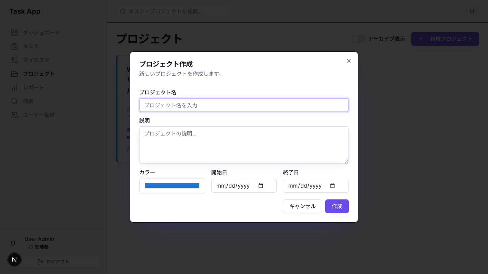
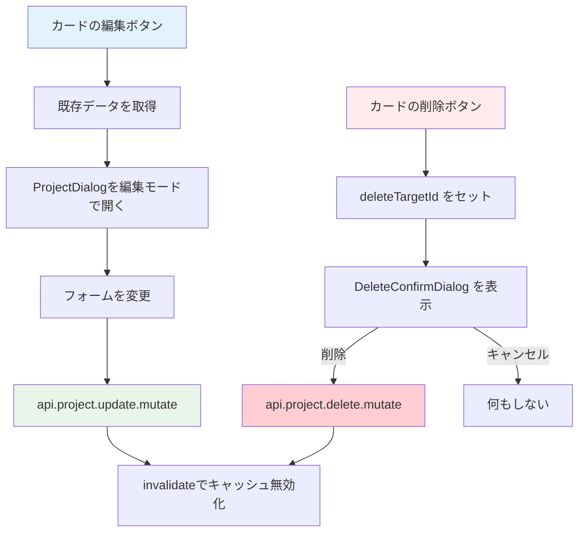

# Day 11: プロジェクト編集・削除を実装しよう

## 🔙 前回の振り返り

Day 10 では react-hook-form・zod・tRPC の `useMutation` を組み合わせて、ダイアログ形式のプロジェクト新規作成機能を実装しました。CRUDの「Create」ができたので、今日は同じダイアログを再利用して「Update」と「Delete」を実装します。

---

## 🎯 今日のゴール

Day 10 で作った ProjectDialog を「編集モード」で再利用し、プロジェクトの更新と削除を実装します。既存データをフォームに反映する方法と、削除前の確認ダイアログも学びます。

📸 スクリーンショット: 編集モードの ProjectDialog が表示されている画面


## 🤔 なぜこれを作るのか？

Day 10 で「プロジェクト作成」ができるようになりました。しかし、名前の間違いを直したいときや、不要になったプロジェクトを整理したいときはどうすればよいでしょうか？

今日は「編集」と「削除」を追加して、プロジェクト管理を完成させます。今日の作業が終わると、プロジェクトの作成・編集・削除・アーカイブという一連の管理操作が全て揃います。

> 💡 **例え話**: Day 10 で作ったダイアログは「万能な注文用紙」です。新規注文にも注文変更にも使え、変更時は元の内容を用紙に書いておくだけです。このように1つのコンポーネントで両方に対応する設計を「再利用性の高い設計」と言います。

### 📐 編集・削除の処理フロー



### やること / やらないこと

| やること | やらないこと |
|---------|-------------|
| 編集ダイアログに既存データを渡す | 新しい編集ページを作る |
| `api.project.update` で更新 | フォームの作り直し |
| `DeleteConfirmDialog` で削除確認 | `window.confirm()` の使用 |
| キャッシュ無効化で一覧更新 | 手動リロード |
| アーカイブ mutation の実装 | アーカイブUIの詳細カスタマイズ |

## 🆕 新しく学ぶ概念

| 概念 | 説明 |
|------|------|
| 編集モード（Edit Mode） | 1つのフォームコンポーネントを新規作成と更新の両方に使い回す設計パターン |
| initialData | コンポーネントに既存データを渡して初期値として表示する props |
| キャッシュ無効化（invalidate） | 更新・削除後に tRPC のキャッシュを破棄して最新データを再取得させる処理 |

> 💡 **補足**: 「楽観的更新（Optimistic Update）」という手法もありますが、今回は使いません。楽観的更新はサーバーの応答を待たず先にUIを更新し、失敗したらロールバックする高度な手法です。今回はよりシンプルな `invalidate()`（キャッシュ無効化）で一覧を更新します。

### 📂 今日の作業ファイル

```
src/
├── app/
│   └── project/
│       └── page.tsx          ← 編集・削除ハンドラーを追加
├── component/
│   └── ui/
│       └── delete-confirm-dialog.tsx  ← 削除確認ダイアログ（既存）
└── server/
    └── api/
        └── routers/
            └── project.ts    ← archive/unarchiveルーター（既存）
```

## 📊 実装ステップ一覧

| ステップ | 作業内容 | 所要時間 |
|---------|---------|---------|
| Step 1 | インポートと編集ボタンのハンドラーを作る | 7分 |
| Step 2 | 新規作成ハンドラーとDialogのJSXを配置する | 5分 |
| Step 3 | 更新 mutation と送信ハンドラーを作る | 7分 |
| Step 4 | 削除の state と mutation を実装する | 5分 |
| Step 5 | DeleteConfirmDialog を配置する | 5分 |
| Step 6 | サーバー側の既存実装を確認する | 5分 |
| Step 7 | アーカイブ mutation とハンドラーを追加する | 7分 |
| Step 8 | 動作確認 | 7分 |

**合計時間**: 約48分

---

### Step 1: インポートと編集ボタンのハンドラーを作る（7分）

🎯 **ゴール**: 必要なインポートを追加し、カードの編集ボタンで既存データを取得します。

💻 **実装**:

まず、Day 10 で作成した `ProjectFormData` 型と、削除確認用の `DeleteConfirmDialog` をインポートします。

```typescript
// filepath: src/app/project/page.tsx
// Day 10のProjectFormData型をインポート
import {
  ProjectDialog,
  type ProjectFormData,
} from '@/component/project/project-dialog';
// 削除確認ダイアログ（shadcn/uiベース）
import { DeleteConfirmDialog }
  from '@/component/ui/delete-confirm-dialog';
```

✅ **確認ポイント**:
- インポート文を追加してエラーが出ていない
- `ProjectFormData` と `DeleteConfirmDialog` が正しくインポートされた

Day 10 で `editingProject` を `ProjectFormData | undefined` 型で定義済みですが、改めて確認しておきましょう。`ProjectPageContent` 関数の先頭にある state 一覧で、以下の行があることを確認してください。

```typescript
// filepath: src/app/project/page.tsx
// Day 10で定義済みのeditingProject state
const [editingProject, setEditingProject] =
  useState<ProjectFormData | undefined>(
    undefined
  );
```

✅ **確認ポイント**:
- `editingProject` の型が `ProjectFormData | undefined` になっている
- 保存時にエラーが出ていない

次に編集ハンドラーを追加します。`handleCreate` 関数のすぐ下に `handleEdit` を追加してください。日付は `toISOString().split('T')[0]` で `"2024-12-31"` 形式に変換します。`<input type="date">` はこの形式を期待するためです。

```typescript
// filepath: src/app/project/page.tsx
// handleCreateの下に追加（前半）
const handleEdit = (projectId: string) => {
  const project = projects?.find(
    (p) => p.id === projectId
  );
  if (project) {
    const startDate = project.startDate
      ? new Date(project.startDate)
          .toISOString().split('T')[0]
      : undefined;
    const endDate = project.endDate
      ? new Date(project.endDate)
          .toISOString().split('T')[0]
      : undefined;
```

```typescript
// filepath: src/app/project/page.tsx
// handleEdit続き（後半）
    setEditingProject({
      id: project.id,
      name: project.name,
      description:
        project.description || '',
      color: project.color,
      ...(startDate && { startDate }),
      ...(endDate && { endDate }),
    });
    setDialogOpen(true);
  }
};
```

✅ **確認ポイント**:
- `handleEdit` が `projectId: string` を引数に取る
- 日付変換のロジックが追加できた

#### 条件付きスプレッド構文

`...(startDate && { startDate })` という書き方は、「値が存在する場合のみオブジェクトに追加する」パターンです。なぜ `startDate: startDate` とそのまま書かないのでしょうか？

| 書き方 | `startDate` が `undefined` の場合 | 結果 |
|--------|----------------------------------|------|
| ❌ `{ startDate: startDate }` | `{ startDate: undefined }` | `undefined` がオブジェクトに入る |
| ✅ `...(startDate && { startDate })` | `{}` | プロパティ自体が存在しない |

`undefined` がプロパティに入ると、サーバー（Prisma）が「日付を空にする」と解釈する場合があります。プロパティ自体を含めなければ「日付は変更しない」という意味になります。

> 💡 **注文書の例え**: 注文変更で「お届け日」欄に「指定なし」と書くのと、そもそも欄を空白にするのでは意味が違います。「指定なし」は配送日をリセット、空白は変更しないという意味です。

✅ **確認ポイント**:
- 日付データが正しく `"YYYY-MM-DD"` 形式に変換される
- `editingProject` に `id` が含まれている（編集モードの識別に必要）

---

### Step 2: 新規作成ハンドラーとDialogのJSXを配置する（5分）

🎯 **ゴール**: 新規作成ハンドラーと ProjectDialog を配置し、編集モードにも対応します。

💻 **実装**:

`handleEdit` の直上に `handleCreate` を配置します。このハンドラーは `editingProject` を `undefined` にリセットすることで「新規作成モード」にします。

```typescript
// filepath: src/app/project/page.tsx
// handleEditの直上に配置する
const handleCreate = () => {
  setEditingProject(undefined);
  setDialogOpen(true);
};
```

✅ **確認ポイント**:
- `handleCreate` で `setEditingProject(undefined)` を呼んでいる
- 新規作成ボタンでダイアログが空の状態で開く

次に、JSX 内の `<div className="grid gap-6 ...">` の閉じタグ `</div>` の直後に `ProjectDialog` を配置します。

```typescript
// filepath: src/app/project/page.tsx
// グリッドの閉じタグ直後に配置
<ProjectDialog
  open={dialogOpen}
  onClose={() => setDialogOpen(false)}
  onSubmit={handleSubmit}
  initialData={editingProject}
/>
```

✅ **確認ポイント**:
- 編集ボタンでダイアログを開くと既存の名前が入っている
- 新規作成ボタンで空のダイアログが開く

#### 新規作成 vs 編集の違い

| 項目 | 新規作成 | 編集 |
|------|---------|------|
| `initialData` | `undefined` | 既存データ |
| タイトル | 「プロジェクト作成」 | 「プロジェクト編集」 |
| ボタン文言 | 「作成」 | 「更新」 |

> 💡 `handleCreate` で `setEditingProject(undefined)` を呼ぶことで、フォームが空の状態（新規作成モード）になります。`ProjectDialog` は `initialData` の `id` 有無でタイトルとボタン文言を自動切替します。

---

### Step 3: 更新 mutation と送信ハンドラーを作る（7分）

🎯 **ゴール**: 更新用の mutation を定義し、1つの `handleSubmit` で新規作成と更新を分岐します。

💻 **実装**:

まず、更新用の mutation を定義します。`createMutation` の直下に追加してください。成功時にキャッシュを無効化してダイアログを閉じます。

```typescript
// filepath: src/app/project/page.tsx
// createMutationの直下に追加
const updateMutation =
  api.project.update.useMutation({
    onSuccess: () => {
      utils.project.getAll.invalidate();
      if (selectedProject) {
        utils.project.getById.invalidate(
          { id: selectedProject }
        );
      }
      setDialogOpen(false);
    },
  });
```

✅ **確認ポイント**:
- `updateMutation` が定義できた
- `onSuccess` で `invalidate()` を呼んでいる

次に送信ハンドラーを作ります。`data.id` の有無で更新と新規作成を `if/else` で分岐します。`handleEdit` の下に追加してください。

```typescript
// filepath: src/app/project/page.tsx
// handleEditの下に追加: 送信ハンドラー
const handleSubmit = (
  data: ProjectFormData
) => {
  if (data.id) {
    updateMutation.mutate({
      id: data.id,
      name: data.name,
      description:
        data.description || null,
      color: data.color,
      startDate: data.startDate
        ? new Date(data.startDate)
            .toISOString()
        : null,
      endDate: data.endDate
        ? new Date(data.endDate)
            .toISOString()
        : null,
    });
```

✅ **確認ポイント**:
- `data.id` がある場合に `updateMutation.mutate` を呼んでいる
- 日付は `toISOString()` で ISO 形式に変換している

同じ `handleSubmit` 関数の `else` 分岐です。`data.id` がない場合（新規作成）は Day 10 の `createMutation` を呼びます。

```typescript
// filepath: src/app/project/page.tsx
// handleSubmit関数のelse分岐（続き）
  } else {
    if (!currentUser?.id) return;
    createMutation.mutate({
      name: data.name,
      description: data.description,
      color: data.color,
      startDate: data.startDate
        ? new Date(data.startDate)
            .toISOString()
        : undefined,
      endDate: data.endDate
        ? new Date(data.endDate)
            .toISOString()
        : undefined,
    });
  }
};
```

✅ **確認ポイント**:
- `data.id` がない場合に `createMutation.mutate` を呼んでいる
- `currentUser?.id` のガードがある

#### 更新 vs 新規作成の `null` / `undefined` の使い分け

| 操作 | 日付が空の場合 | サーバーへの意味 |
|------|--------------|----------------|
| 更新 | `null` を送信 | 「既存の日付を消す」 |
| 新規作成 | `undefined`（= プロパティを含めない） | 「日付は指定しない」 |

> 💡 **注文書の例え**: 注文変更で「お届け日: なし」と書けば配送日をキャンセルする意味。新規注文でお届け日欄に何も書かなければ「指定なし」の意味。Prisma はこの2つを区別するため、使い分けが必要です。

📸 スクリーンショット: 編集後に一覧が更新された画面


---

### Step 4: 削除の state と mutation を実装する（5分）

🎯 **ゴール**: 削除確認ダイアログ用の state と mutation を実装します。

💻 **実装**:

削除フローでは、2つの state で「どのプロジェクトを削除するか」「確認ダイアログを表示するか」を管理します。`ProjectPageContent` 関数の先頭にある state 一覧に追加してください。

```typescript
// filepath: src/app/project/page.tsx
// 既存のstate一覧の末尾に追加
const [deleteDialogOpen, setDeleteDialogOpen]
  = useState(false);
const [deleteTargetId, setDeleteTargetId]
  = useState<string | null>(null);
```

✅ **確認ポイント**:
- `deleteDialogOpen` と `deleteTargetId` の2つの state が追加された
- `deleteTargetId` の型が `string | null` になっている

次に、削除用の mutation を定義します。`updateMutation` の直下に追加してください。

```typescript
// filepath: src/app/project/page.tsx
// updateMutationの直下に追加
const deleteMutation =
  api.project.delete.useMutation({
    onSuccess: () => {
      utils.project.getAll.invalidate();
      setDetailOpen(false);
    },
  });
```

✅ **確認ポイント**:
- `deleteMutation` が定義できた
- 成功時に `invalidate()` で一覧を更新している

`handleDelete` は **state を設定するだけ** で、削除の実行は確認ダイアログ内で行います。`handleSubmit` の下に追加してください。

```typescript
// filepath: src/app/project/page.tsx
// handleSubmitの下に追加
const handleDelete = (projectId: string) => {
  setDeleteTargetId(projectId);
  setDeleteDialogOpen(true);
};
```

✅ **確認ポイント**:
- `handleDelete` は `setDeleteTargetId` と `setDeleteDialogOpen` を呼ぶだけ
- まだ削除は実行されない（確認ダイアログで実行する）

> 💡 `handleDelete` では直接削除を実行しません。まず「どのプロジェクトを削除するか」を記録し、確認ダイアログを開きます。実際の削除は次の Step 5 で配置するダイアログの `onConfirm` で行います。

---

### Step 5: DeleteConfirmDialog を配置する（5分）

🎯 **ゴール**: shadcn/ui ベースの確認ダイアログを配置し、削除フローを完成させます。

💻 **実装**:

JSX の `</AppLayout>` の直前（`AppLayout` 内の一番最後）に `DeleteConfirmDialog` を配置します。

```typescript
// filepath: src/app/project/page.tsx
// </AppLayout>の直前に配置
<DeleteConfirmDialog
  open={deleteDialogOpen}
  onOpenChange={setDeleteDialogOpen}
  onConfirm={() => {
    if (deleteTargetId) {
      deleteMutation.mutate({
        id: deleteTargetId,
      });
    }
  }}
  isPending={deleteMutation.isPending}
  title="プロジェクトを削除しますか？"
/>
```

✅ **確認ポイント**:
- 削除ボタンでshadcn/uiスタイルの確認ダイアログが出る
- 「キャンセル」で削除されない
- 「削除」で削除が実行される

#### DeleteConfirmDialog の props

| prop | 型 | 説明 |
|------|----|------|
| `open` | `boolean` | ダイアログの表示状態 |
| `onOpenChange` | `(open: boolean) => void` | 表示状態の変更ハンドラー |
| `onConfirm` | `() => void` | 「削除」ボタンの処理 |
| `isPending` | `boolean` | 削除処理中のローディング状態 |
| `title?` | `string` | ダイアログのタイトル（省略時:「本当に削除しますか？」） |
| `description?` | `string` | 補足説明文（省略時:「この操作は取り消せません。」） |

> 💡 `DeleteConfirmDialog` は shadcn/ui の `AlertDialog` を使った共通コンポーネントです。`window.confirm()` と違い、アプリ全体のデザインと統一されたUIで確認ダイアログを表示できます。`isPending` を渡すことで、削除中にボタンが無効化され「削除中...」と表示されます。

📸 スクリーンショット: 削除確認ダイアログが表示されている画面


---

### Step 6: サーバー側の既存実装を確認する（5分）

🎯 **ゴール**: 完全削除ではなく「アーカイブ」する方法を理解します。

> ⚠️ **このステップのコードは既存実装です。今日は編集しません。** 仕組みを理解するために確認するだけです。

#### 削除 vs アーカイブ

| 操作 | データ | 復元 | 用途 |
|------|--------|------|------|
| 削除 | DBから完全に消える | 不可能 | 本当に不要なプロジェクト |
| アーカイブ | DBに残る（非表示） | 可能 | 終了したプロジェクト |

> 💡 実務では「削除」より「アーカイブ」が好まれます。間違えて消してもデータは残っているからです。

バックエンドでは `setArchiveStatus` ヘルパー関数でアーカイブを処理しています。権限チェック（`canArchive`）も含まれています。以下は確認用のコードです。

```typescript
// filepath: src/server/api/routers/project.ts
// 既存実装（確認のみ・編集不要）
const setArchiveStatus = async (
  userId: string,
  projectId: string,
  isArchived: boolean
) => {
  const userMember =
    await prisma.projectMember.findUnique({
      where: {
        userId_projectId: {
          userId, projectId,
        },
      },
    });
  assertMemberPermission(
    userMember ? [userMember] : [],
    'canArchive'
  );
  return await prisma.project.update({
    where: { id: projectId },
    data: { isArchived },
  });
};
```

✅ **確認ポイント**:
- アーカイブは `isArchived` フラグで管理されている
- 権限チェック（`canArchive`）が含まれている

---

### Step 7: アーカイブ mutation とハンドラーを追加する（7分）

🎯 **ゴール**: フロントエンドのアーカイブ mutation とハンドラーを追加し、`ProjectDetailDialog` に渡します。

💻 **実装**:

`deleteMutation` の直下にアーカイブ用の mutation を2つ追加してください。

```typescript
// filepath: src/app/project/page.tsx
// deleteMutationの直下に追加
const archiveMutation =
  api.project.archive.useMutation({
    onSuccess: () => {
      utils.project.getAll.invalidate();
      setDetailOpen(false);
    },
  });
const unarchiveMutation =
  api.project.unarchive.useMutation({
    onSuccess: () => {
      utils.project.getAll.invalidate();
      setDetailOpen(false);
    },
  });
```

✅ **確認ポイント**:
- `archiveMutation` と `unarchiveMutation` が定義できた
- 両方とも成功時に `invalidate()` を呼んでいる

次にアーカイブ切替ハンドラーを追加します。`handleDelete` の下に追加してください。

```typescript
// filepath: src/app/project/page.tsx
// handleDeleteの下に追加
const handleArchive = (
  projectId: string,
  isArchived: boolean
) => {
  const mutation = isArchived
    ? unarchiveMutation
    : archiveMutation;
  mutation.mutate({ id: projectId });
};
```

✅ **確認ポイント**:
- `handleArchive` がアーカイブと解除の両方に対応している
- `isArchived` の値で呼び出す mutation を切り替えている

最後に `ProjectDetailDialog` の JSX に `onArchive` を渡します。`ProjectDialog` の直下に配置してください。

```typescript
// filepath: src/app/project/page.tsx
// ProjectDialogの直下に配置
<ProjectDetailDialog
  projectDetail={
    detailOpen ? projectDetail : null
  }
  onClose={handleDetailClose}
  onAddMemberClick={
    () => setMemberDialogOpen(true)
  }
  onRemoveMember={handleRemoveMember}
  onArchive={handleArchive}
/>
```

✅ **確認ポイント**:
- `onArchive={handleArchive}` が渡されている
- アーカイブボタンをクリックすると動作する

---

### Step 8: 動作確認（7分）

🎯 **ゴール**: 編集・削除・アーカイブの全フローを確認します。

```bash
# filepath: ターミナル
# 開発サーバーを起動して動作確認
npm run dev
```

✅ **確認ポイント**:
- 開発サーバーが起動した
- ブラウザで `http://localhost:3000` にアクセスできる

#### 編集フローの確認

1. プロジェクト一覧画面を開く
2. カードの編集ボタン（ペンアイコン）をクリック
3. ダイアログに既存のプロジェクト名が入っていることを確認
4. タイトルが「プロジェクト編集」になっていることを確認
5. 名前を変更して「更新」をクリック
6. 一覧が自動的に更新されることを確認

> 📸 スクリーンショット: 編集ダイアログに既存のプロジェクト名が表示されている画面

> 
#### 削除フローの確認

1. 別のプロジェクトの削除ボタン（ゴミ箱アイコン）をクリック
2. shadcn/ui スタイルの確認ダイアログが表示されることを確認
3. 「キャンセル」をクリック → 何も削除されない
4. 再度削除ボタンをクリック → 「削除」をクリック
5. 一覧からプロジェクトが消えることを確認

> 📸 スクリーンショット: 削除確認ダイアログが表示されている画面

> 
#### アーカイブフローの確認

1. プロジェクト詳細画面でアーカイブボタンをクリック
2. 一覧からプロジェクトが非表示になることを確認
3. 「アーカイブ表示」スイッチをONにする
4. アーカイブしたプロジェクトが表示されることを確認

> 📸 スクリーンショット: アーカイブ表示を切り替えた後の一覧画面

> 
✅ **確認ポイント**:
- 編集で既存データが反映される
- 更新後に一覧が自動更新される（`invalidate()` が動作している）
- 削除前にshadcn/uiの確認ダイアログが表示される
- アーカイブと解除が正しく動作する

## 📋 今日のまとめ

- [ ] 必要なインポート（`ProjectFormData`, `DeleteConfirmDialog`）を追加できた
- [ ] 既存データをダイアログに渡して編集モードにできた
- [ ] `api.project.update` で更新できた
- [ ] `api.project.delete` で削除できた
- [ ] `DeleteConfirmDialog` で誤操作を防止できた
- [ ] `currentUser?.id` ガードで安全チェックを実装できた
- [ ] アーカイブと削除の違いを理解し、mutation を実装できた

## ⚠️ つまずきポイント

| エラー / 問題 | 原因 | 解決方法 |
|--------------|------|---------|
| 編集ダイアログに古いデータが残る | `useForm` の `values` が `initialData` と連動していない | `ProjectDialog` 側で `values` プロパティに `initialData` を渡しているか確認 |
| 更新後に一覧が変わらない | `invalidate()` の呼び忘れ | `onSuccess` で `utils.project.getAll.invalidate()` を呼ぶ |
| 「権限がありません」エラー（削除） | OWNER/ADMIN 以外で削除操作 | OWNER か ADMIN アカウントで操作する（`canDelete` 権限が必要） |
| 「権限がありません」エラー（アーカイブ） | OWNER 以外でアーカイブ操作 | OWNER アカウントで操作する（`canArchive` 権限が必要） |
| 削除後にエラーが残る | 詳細ダイアログが開いたまま | 削除の `onSuccess` で `setDetailOpen(false)` も呼ぶ |
| 削除確認ダイアログが出ない | `deleteDialogOpen` の state が定義されていない | Step 4 の `useState` を確認 |
| アーカイブボタンが反応しない | `handleArchive` が `ProjectDetailDialog` に渡されていない | `onArchive={handleArchive}` を確認 |

## 📝 今日学んだ用語

| 用語 | 意味 |
|------|------|
| 再利用 | 1つのコンポーネントを複数の用途で使うこと |
| initialData | コンポーネントに渡す初期データ |
| DeleteConfirmDialog | shadcn/ui の AlertDialog をベースにした削除確認コンポーネント |
| アーカイブ | データを削除せずに非表示にすること |
| キャッシュ無効化（invalidate） | tRPC のキャッシュを破棄して最新データを再取得させること |
| assertMemberPermission | サーバー側で権限をチェックするヘルパー関数 |

## 🔜 次回予告

Day 12 では、プロジェクトにメンバーを追加・管理する機能を実装します。複数のユーザーが同じプロジェクトで共同作業できるようにします。
