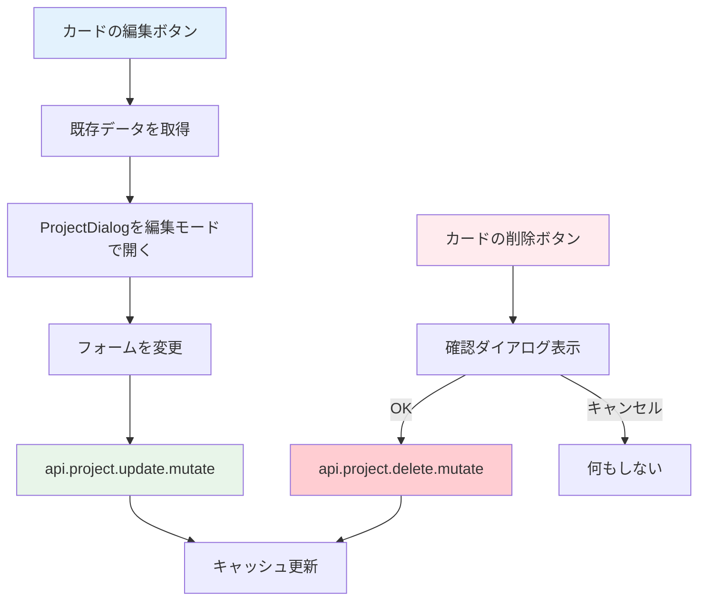

# Day 11: プロジェクト編集・削除を実装しよう

## 🔙 前回の振り返り

Day 10 では react-hook-form・zod・tRPC の `useMutation` を組み合わせて、ダイアログ形式のプロジェクト新規作成機能を実装しました。CRUDの「Create」ができたので、今日は同じダイアログを再利用して「Update」と「Delete」を実装します。

---

## 🎯 今日のゴール

Day 10 で作った ProjectDialog を「編集モード」で再利用し、プロジェクトの更新と削除を実装します。既存データをフォームに反映する方法と、削除前の確認ダイアログも学びます。


## 🤔 なぜこれを作るのか？

プロジェクト名の変更や不要なプロジェクトの削除は、運用に必須の機能です。Day 10 のダイアログを再利用することで、コードの重複を防ぎます。

> 💡 **例え話**: Day 10 で作ったダイアログは「万能な注文用紙」です。新規注文にも注文変更にも使え、変更時は元の内容を用紙に書いておくだけです。このように1つのコンポーネントで両方に対応する設計を「再利用性の高い設計」と言います。

### 📐 編集・削除の処理フロー



### やること / やらないこと

| やること | やらないこと |
|---------|-------------|
| 編集ダイアログに既存データを渡す | 新しい編集ページを作る |
| `api.project.update` で更新 | フォームの作り直し |
| 削除前の確認ダイアログ | 確認なしの即時削除 |
| キャッシュ無効化で一覧更新 | 手動リロード |

## 🆕 新しく学ぶ概念

| 概念 | 説明 |
|------|------|
| 編集モード（Edit Mode） | 1つのフォームコンポーネントを新規作成と更新の両方に使い回す設計パターン |
| initialData | コンポーネントに既存データを渡して初期値として表示する props |
| 楽観的更新（Optimistic Update） | サーバーの応答を待たず先に UI を更新し、失敗したらロールバックする手法 |
| 削除確認ダイアログ | 誤操作を防ぐために削除前にユーザーの意思を確認するUXパターン |
| アーカイブ | データを物理削除せず `isArchived` フラグで非表示にすることで復元を可能にする手法 |
| キャッシュ無効化（invalidate） | 更新・削除後に tRPC のキャッシュを破棄して最新データを再取得させる処理 |

## 📊 実装ステップ一覧

| ステップ | 作業内容 | 所要時間 |
|---------|---------|---------|
| Step 1 | 編集ボタンのハンドラーを作る | 5分 |
| Step 2 | 編集データをDialogに渡す | 5分 |
| Step 3 | 送信ハンドラーで作成・更新を分岐する | 7分 |
| Step 4 | 削除のmutationを実装する | 5分 |
| Step 5 | 確認ダイアログを追加する | 5分 |
| Step 6 | アーカイブ機能を理解する | 5分 |
| Step 7 | 動作確認 | 3分 |

**合計時間**: 約35分

---

### Step 1: 編集ボタンのハンドラーを作る（5分）

🎯 **ゴール**: カードの編集ボタンで既存データを取得します。

💻 **実装**:

Day 09 Step 7 で仮置きした `editingProject`（`Record<string, unknown>`型）を、正式な `ProjectFormData` 型に差し替えます。

```typescript
// filepath: src/app/project/page.tsx
// Day 09のプレースホルダーを差し替え
const [editingProject, setEditingProject] =
  useState<ProjectFormData | undefined>(
    undefined
  );

// 編集ハンドラー: 対象プロジェクトを一覧から検索する
const handleEdit = (projectId: string) => {
  const project = projects?.find(
    (p) => p.id === projectId
  );
  if (project) {
    const startDate = project.startDate
      ? new Date(project.startDate)
          .toISOString().split('T')[0]
      : undefined;
    const endDate = project.endDate
      ? new Date(project.endDate)
          .toISOString().split('T')[0]
      : undefined;
```

日付変換が終わったら、取得した値を `editingProject` にまとめてセットしてダイアログを開きます。

```typescript
// filepath: src/app/project/page.tsx
    setEditingProject({
      id: project.id,
      name: project.name,
      description:
        project.description || '',
      color: project.color,
      ...(startDate && { startDate }),
      ...(endDate && { endDate }),
    });
    setDialogOpen(true);
  }
};
```

> 💡 日付は `toISOString().split('T')[0]` で `"2024-12-31"` 形式に変換します。`<input type="date">` はこの形式の文字列を期待しているためです。`...(startDate && { startDate })` は「startDate が存在する場合のみオブジェクトに追加」する書き方です。

✅ **確認ポイント**:
- 編集ボタンをクリックすると `editingProject` が設定される
- 日付データが正しく変換される

---

### Step 2: 編集データをDialogに渡す（5分）

🎯 **ゴール**: ProjectDialog に初期データを渡して編集モードにします。

💻 **実装**:

```typescript
// filepath: src/app/project/page.tsx
// 新規作成ハンドラー
const handleCreate = () => {
  setEditingProject(undefined);
  setDialogOpen(true);
};

// JSX内: ProjectDialogの呼び出し
<ProjectDialog
  open={dialogOpen}
  onClose={() => setDialogOpen(false)}
  onSubmit={handleSubmit}
  initialData={editingProject}
/>
```

✅ **確認ポイント**:
- 編集ボタンでダイアログを開くと既存の名前が入っている
- タイトルが「プロジェクト編集」になっている

#### 新規作成 vs 編集の違い

| 項目 | 新規作成 | 編集 |
|------|---------|------|
| `initialData` | undefined | 既存データ |
| タイトル | 「プロジェクト作成」 | 「プロジェクト編集」 |
| ボタン文言 | 「作成」 | 「更新」 |

> 💡 `handleCreate` で `setEditingProject(undefined)` を呼ぶことで、フォームが空の状態（新規作成モード）になります。`onClose` には `setDialogOpen(false)` を渡して、ダイアログを閉じます。

✅ **確認ポイント**:
- 編集ボタンでダイアログを開くと既存の名前が入っている
- タイトルが「プロジェクト編集」になっている

---

### Step 3: 送信ハンドラーで作成・更新を分岐する（7分）

🎯 **ゴール**: 1つの `handleSubmit` で新規作成と更新を分岐します。

💻 **実装**:

```typescript
// filepath: src/app/project/page.tsx
// 更新用のmutation
const updateMutation =
  api.project.update.useMutation({
    onSuccess: () => {
      utils.project.getAll.invalidate();
      if (selectedProject) {
        utils.project.getById.invalidate(
          { id: selectedProject }
        );
      }
      setDialogOpen(false);
    },
  });
```

送信ハンドラーで `data.id` の有無で作成と更新を分岐します。

```typescript
// filepath: src/app/project/page.tsx
// 統合された送信ハンドラー: data.idの有無で分岐
const handleSubmit = (
  data: ProjectFormData
) => {
  if (data.id) {
    // 更新: idがある場合はupdateMutationを呼ぶ
    updateMutation.mutate({
      id: data.id,
      name: data.name,
      description:
        data.description || null,
      color: data.color,
      startDate: data.startDate
        ? new Date(data.startDate)
            .toISOString()
        : null,
      endDate: data.endDate
        ? new Date(data.endDate)
            .toISOString()
        : null,
    });
```

`data.id` がない場合（新規作成）は Day 10 で実装済みの `createMutation` を呼びます。

```typescript
// filepath: src/app/project/page.tsx
  } else {
    // 新規作成（Day 10で実装済み）
    createMutation.mutate({
      name: data.name,
      description: data.description,
      color: data.color,
      startDate: data.startDate
        ? new Date(data.startDate)
            .toISOString()
        : undefined,
      endDate: data.endDate
        ? new Date(data.endDate)
            .toISOString()
        : undefined,
    });
  }
};
```

> 💡 `data.id` がある場合は編集、ない場合は新規作成です。日付文字列は `new Date(...).toISOString()` で ISO 形式に変換してからサーバーに送ります。

✅ **確認ポイント**:
- プロジェクト名を変更して保存できる
- 一覧のカードが更新された情報で表示される


---

### Step 4: 削除のmutationを実装する（5分）

🎯 **ゴール**: プロジェクトの削除処理を実装します。

💻 **実装**:

```typescript
// filepath: src/app/project/page.tsx
// 削除用のmutation
const deleteMutation =
  api.project.delete.useMutation({
    onSuccess: () => {
      utils.project.getAll.invalidate();
      setDetailOpen(false);
    },
  });
```

> 💡 削除成功時に `setDetailOpen(false)` を呼んで、詳細ダイアログが開いている場合は閉じます。

✅ **確認ポイント**:
- 削除後に一覧が自動更新される
- 詳細ダイアログが閉じる

---

### Step 5: 確認ダイアログを追加する（5分）

🎯 **ゴール**: 削除前に確認を求めるダイアログを実装します。

💻 **実装**:

```typescript
// filepath: src/app/project/page.tsx
// 削除ハンドラー
const handleDelete =
  (projectId: string) => {
    if (confirm(
      'このプロジェクトを削除してもよろしいですか？'
    )) {
      deleteMutation.mutate({
        id: projectId,
      });
    }
  };
```

> 💡 `confirm` はブラウザ標準の確認ダイアログです。「OK」を押した場合のみ `true` が返ります。

✅ **確認ポイント**:
- 削除ボタンで確認ダイアログが出る
- 「キャンセル」で削除されない
- 「OK」で削除が実行される

> 📸 ここでブラウザの確認ダイアログ（`window.confirm`）が表示されます。「OK」で削除、「キャンセル」で中止できます。

---

### Step 6: アーカイブ機能を理解する（5分）

🎯 **ゴール**: 完全削除ではなく「アーカイブ」する方法を理解します。

💻 **コードを読む**:

```typescript
// filepath: src/server/api/routers/project.ts
// アーカイブ処理
archive: protectedProcedure
  .input(z.object({ id: z.string().cuid() }))
  .mutation(async ({ ctx, input }) => {
    return prisma.project.update({
      where: { id: input.id },
      // isArchivedフラグを立てるだけ
      data: { isArchived: true },
    });
  }),
```

✅ **確認ポイント**:
- アーカイブは `isArchived` フラグで管理されていることを理解した
- 削除とアーカイブの違いを理解した

#### 削除 vs アーカイブ

| 操作 | データ | 復元 | 用途 |
|------|--------|------|------|
| 削除 | DBから完全に消える | 不可能 | 本当に不要なプロジェクト |
| アーカイブ | DBに残る（非表示） | 可能 | 終了したプロジェクト |

> 💡 実務では「削除」より「アーカイブ」が好まれます。間違えて消してもデータは残っているからです。

✅ **確認ポイント**:
- アーカイブは `isArchived` フラグで管理されていることを理解した
- 削除とアーカイブの違いを理解した

---

### Step 7: 動作確認（3分）

🎯 **ゴール**: 編集・削除の全フローを確認します。

1. プロジェクトカードの編集ボタンをクリック
2. ダイアログに既存データが表示されることを確認
3. 名前を変更して「更新」をクリック
4. 一覧が更新されることを確認
5. 別のプロジェクトの削除ボタンをクリック
6. 確認ダイアログで「OK」をクリック
7. 一覧から削除されることを確認

✅ **確認ポイント**:
- 編集で既存データが反映される
- 更新後に一覧が自動更新される
- 削除前に確認が表示される

---

```bash
# filepath: ターミナル
# 開発サーバーを起動して動作確認
npm run dev
```

## 📋 今日のまとめ

- [ ] 既存データをダイアログに渡して編集モードにできた
- [ ] `api.project.update` で更新できた
- [ ] `api.project.delete` で削除できた
- [ ] 確認ダイアログで誤操作を防止できた
- [ ] アーカイブと削除の違いを理解した

## ⚠️ つまずきポイント

| エラー / 問題 | 原因 | 解決方法 |
|--------------|------|---------|
| 編集ダイアログに古いデータが残る | useEffect で formData がリセットされていない | `initialData` の変更を確認 |
| 更新後に一覧が変わらない | `invalidate()` の呼び忘れ | `onSuccess` で `invalidate()` を呼ぶ |
| 「権限がありません」エラー | OWNER/ADMIN 以外で操作 | プロジェクトの OWNER アカウントで操作する |
| 削除後にエラーが残る | 詳細ダイアログが開いたまま | 削除時に `setDetailOpen(false)` も呼ぶ |

## 📝 今日学んだ用語

| 用語 | 意味 |
|------|------|
| 再利用 | 1つのコンポーネントを複数の用途で使うこと |
| initialData | コンポーネントに渡す初期データ |
| window.confirm | ブラウザ標準の確認ダイアログ |
| アーカイブ | データを削除せずに非表示にすること |

## 🔜 次回予告

Day 12 では、プロジェクトにメンバーを追加・管理する機能を実装します。複数のユーザーが同じプロジェクトで共同作業できるようにします。
