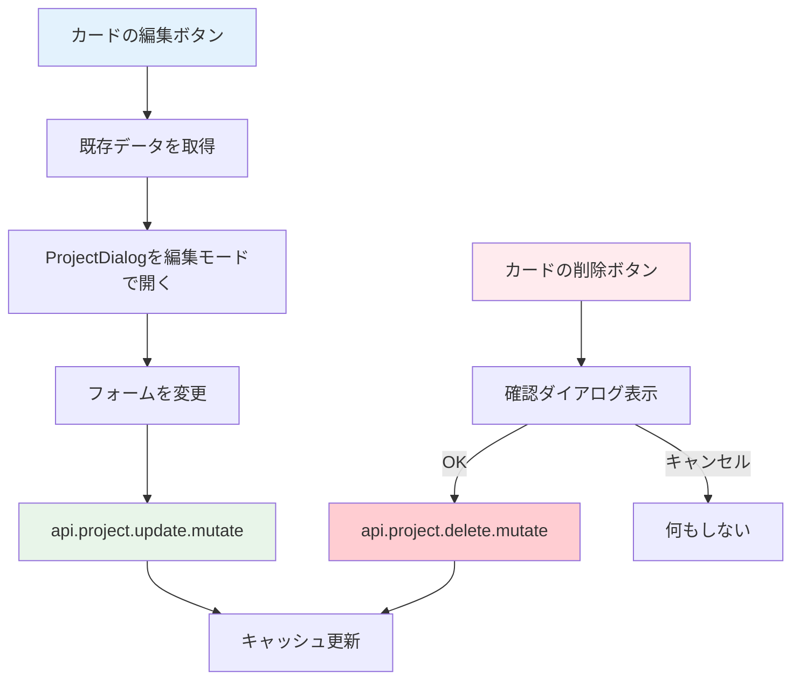

# Day 11: プロジェクト編集・削除を実装しよう

## 🎯 今日のゴール

Day 10 で作った ProjectDialog を「編集モード」で再利用し、プロジェクトの更新と削除を実装します。既存データをフォームに反映する方法と、削除前の確認ダイアログも学びます。

【スクリーンショット: 編集モードのProjectDialog】

## 🤔 なぜこれを作るのか？

プロジェクト名の変更や不要なプロジェクトの削除は、運用に必須の機能です。Day 10 のダイアログを再利用することで、コードの重複を防ぎます。

> 💡 **例え話**: Day 10 で作ったダイアログは「万能な注文用紙」です。新規注文にも注文変更にも使え、変更時は元の内容を用紙に書いておくだけです。このように1つのコンポーネントで両方に対応する設計を「再利用性の高い設計」と言います。

### 📐 編集・削除の処理フロー



### やること / やらないこと

| やること | やらないこと |
|---------|-------------|
| 編集ダイアログに既存データを渡す | 新しい編集ページを作る |
| `api.project.update` で更新 | フォームの作り直し |
| 削除前の確認ダイアログ | 確認なしの即時削除 |
| キャッシュ無効化で一覧更新 | 手動リロード |

## 📊 実装ステップ一覧

| ステップ | 作業内容 | 所要時間 |
|---------|---------|---------|
| Step 1 | 編集ボタンのハンドラーを作る | 5分 |
| Step 2 | 編集データをDialogに渡す | 5分 |
| Step 3 | 更新のmutationを実装する | 7分 |
| Step 4 | 削除のmutationを実装する | 5分 |
| Step 5 | 確認ダイアログを追加する | 5分 |
| Step 6 | アーカイブ機能を理解する | 5分 |
| Step 7 | 動作確認 | 3分 |

**合計時間**: 約35分

---

### Step 1: 編集ボタンのハンドラーを作る（5分）

🎯 **ゴール**: カードの編集ボタンで既存データを取得します。

💻 **実装**:

```typescript
// filepath: src/app/project/page.tsx
// ProjectPageContent内にstateを追加
const [editingProject, setEditingProject] =
  useState<ProjectFormData | undefined>();

// 編集ハンドラー
const handleEdit = (projectId: string) => {
  const project = projects?.find(
    (p) => p.id === projectId
  );
  if (!project) return;
  setEditingProject({
    id: project.id,
    name: project.name,
    description: project.description || '',
    color: project.color,
  });
  setDialogOpen(true);
};
```

> 💡 `find` で対象プロジェクトを見つけ、`setEditingProject` に渡します。このデータがダイアログの初期値になります。

✅ **確認ポイント**:
- 編集ボタンをクリックすると `editingProject` が設定される
- ダイアログが開く

---

### Step 2: 編集データをDialogに渡す（5分）

🎯 **ゴール**: ProjectDialog に初期データを渡して編集モードにします。

💻 **実装**:

```typescript
// filepath: src/app/project/page.tsx
// ProjectDialogの呼び出しを更新
<ProjectDialog
  open={dialogOpen}
  onOpenChange={(open) => {
    setDialogOpen(open);
    // ダイアログを閉じたら編集状態をリセット
    if (!open) setEditingProject(undefined);
  }}
  onSubmit={
    editingProject
      ? handleUpdate
      : handleCreate
  }
  initialData={editingProject}
/>
```

#### 新規作成 vs 編集の違い

| 項目 | 新規作成 | 編集 |
|------|---------|------|
| `initialData` | undefined | 既存データ |
| タイトル | 「プロジェクト作成」 | 「プロジェクト編集」 |
| 送信ハンドラー | `handleCreate` | `handleUpdate` |
| ボタン文言 | 「作成」 | 「更新」 |

✅ **確認ポイント**:
- 編集ボタンでダイアログを開くと既存の名前が入っている
- タイトルが「プロジェクト編集」になっている

---

### Step 3: 更新のmutationを実装する（7分）

🎯 **ゴール**: フォームの送信でプロジェクトを更新します。

💻 **実装**:

```typescript
// filepath: src/app/project/page.tsx
// 更新用のmutation
const updateMutation =
  api.project.update.useMutation({
    onSuccess: () => {
      utils.project.getAll.invalidate();
      setDialogOpen(false);
      setEditingProject(undefined);
    },
  });

// 更新ハンドラー
const handleUpdate = (
  data: ProjectFormData
) => {
  if (!editingProject?.id) return;
  updateMutation.mutate({
    id: editingProject.id,
    name: data.name,
    description: data.description,
    color: data.color,
  });
};
```

> 💡 更新成功時にも `invalidate()` を呼ぶことで、一覧のカードが最新の情報に自動更新されます。

✅ **確認ポイント**:
- プロジェクト名を変更して保存できる
- 一覧のカードが更新された情報で表示される

【スクリーンショット: 編集後に一覧が更新された画面】

---

### Step 4: 削除のmutationを実装する（5分）

🎯 **ゴール**: プロジェクトの削除処理を実装します。

💻 **実装**:

```typescript
// filepath: src/app/project/page.tsx
import toast from 'react-hot-toast';

// 削除用のmutation
const deleteMutation =
  api.project.delete.useMutation({
    onSuccess: () => {
      utils.project.getAll.invalidate();
      toast.success('プロジェクトを削除しました');
    },
    onError: (err) => {
      toast.error(
        err.message || '削除に失敗しました'
      );
    },
  });
```

> 💡 `react-hot-toast` でユーザーに成功・失敗を通知します。削除はやり直せない操作なので、フィードバックが重要です。

✅ **確認ポイント**:
- 削除後にトースト通知が表示される
- 一覧からプロジェクトが消える

---

### Step 5: 確認ダイアログを追加する（5分）

🎯 **ゴール**: 削除前に確認を求めるダイアログを実装します。

💻 **実装**:

```typescript
// filepath: src/app/project/page.tsx
// 削除ハンドラー
const handleDelete = (projectId: string) => {
  const project = projects?.find(
    (p) => p.id === projectId
  );
  if (!project) return;
  // 確認ダイアログ
  const confirmed = window.confirm(
    `「${project.name}」を削除しますか？`
    + '\nこの操作は取り消せません。'
  );
  if (confirmed) {
    deleteMutation.mutate({ id: projectId });
  }
};
```

> 💡 `window.confirm` はブラウザ標準の確認ダイアログです。「OK」を押した場合のみ `true` が返ります。

✅ **確認ポイント**:
- 削除ボタンで確認ダイアログが出る
- 「キャンセル」で削除されない
- 「OK」で削除が実行される

【スクリーンショット: 削除確認ダイアログ】

---

### Step 6: アーカイブ機能を理解する（5分）

🎯 **ゴール**: 完全削除ではなく「アーカイブ」する方法を理解します。

💻 **コードを読む**:

```typescript
// filepath: src/server/api/routers/project.ts
// アーカイブ処理
archive: protectedProcedure
  .input(z.object({ id: z.string().cuid() }))
  .mutation(async ({ input }) => {
    return prisma.project.update({
      where: { id: input.id },
      // isArchivedフラグを立てるだけ
      data: { isArchived: true },
    });
  }),
```

#### 削除 vs アーカイブ

| 操作 | データ | 復元 | 用途 |
|------|--------|------|------|
| 削除 | DBから完全に消える | 不可能 | 本当に不要なプロジェクト |
| アーカイブ | DBに残る（非表示） | 可能 | 終了したプロジェクト |

> 💡 実務では「削除」より「アーカイブ」が好まれます。間違えて消してもデータは残っているからです。

✅ **確認ポイント**:
- アーカイブは `isArchived` フラグで管理されていることを理解した
- 削除とアーカイブの違いを理解した

---

### Step 7: 動作確認（3分）

🎯 **ゴール**: 編集・削除の全フローを確認します。

1. プロジェクトカードの編集ボタンをクリック
2. ダイアログに既存データが表示されることを確認
3. 名前を変更して「更新」をクリック
4. 一覧が更新されることを確認
5. 別のプロジェクトの削除ボタンをクリック
6. 確認ダイアログで「OK」をクリック
7. 一覧から削除されることを確認

✅ **確認ポイント**:
- 編集で既存データが反映される
- 更新後に一覧が自動更新される
- 削除前に確認が表示される

---

## 📋 今日のまとめ

- [ ] 既存データをダイアログに渡して編集モードにできた
- [ ] `api.project.update` で更新できた
- [ ] `api.project.delete` で削除できた
- [ ] 確認ダイアログで誤操作を防止できた
- [ ] アーカイブと削除の違いを理解した

## ⚠️ つまずきポイント

| エラー / 問題 | 原因 | 解決方法 |
|--------------|------|---------|
| 編集ダイアログに古いデータが残る | `reset` が呼ばれていない | `useEffect` で `reset(initialData)` を追加 |
| 更新後に一覧が変わらない | `invalidate()` の呼び忘れ | `onSuccess` で `invalidate()` を呼ぶ |
| 「権限がありません」エラー | OWNER/ADMIN 以外で操作 | プロジェクトの OWNER アカウントで操作する |
| 削除後にエラーが残る | 詳細ダイアログが開いたまま | 削除時に詳細ダイアログも閉じる |

## 📝 今日学んだ用語

| 用語 | 意味 |
|------|------|
| 再利用 | 1つのコンポーネントを複数の用途で使うこと |
| initialData | コンポーネントに渡す初期データ |
| window.confirm | ブラウザ標準の確認ダイアログ |
| アーカイブ | データを削除せずに非表示にすること |

## 🔗 次回予告

Day 12 では、プロジェクトにメンバーを追加・管理する機能を実装します。複数のユーザーが同じプロジェクトで共同作業できるようにします。
