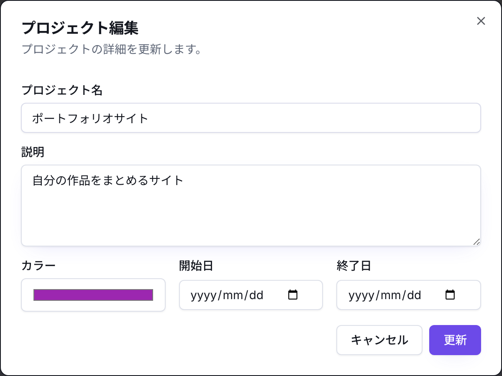
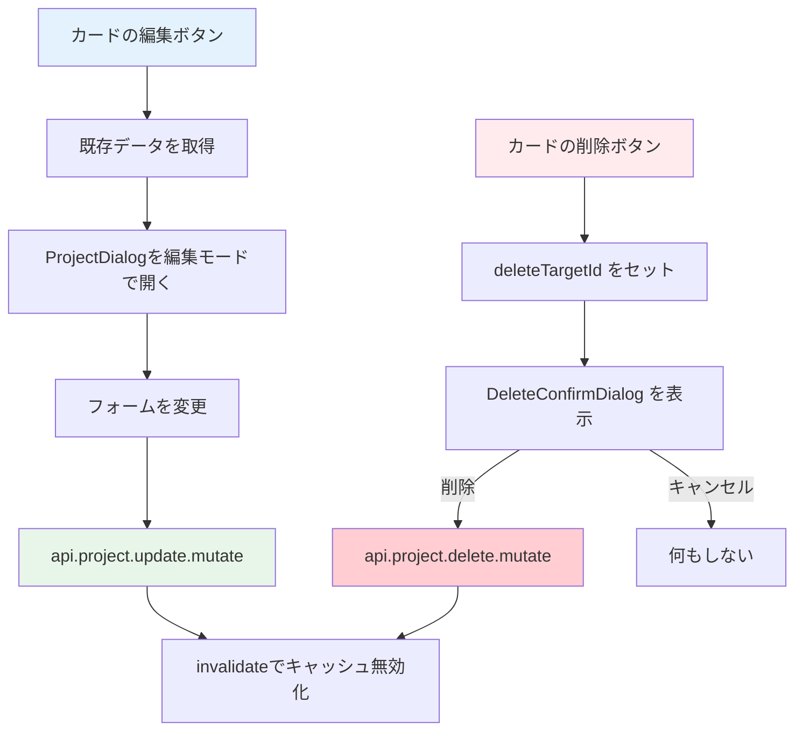
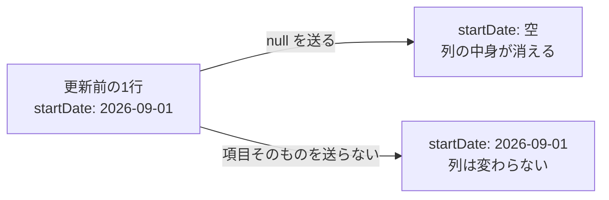
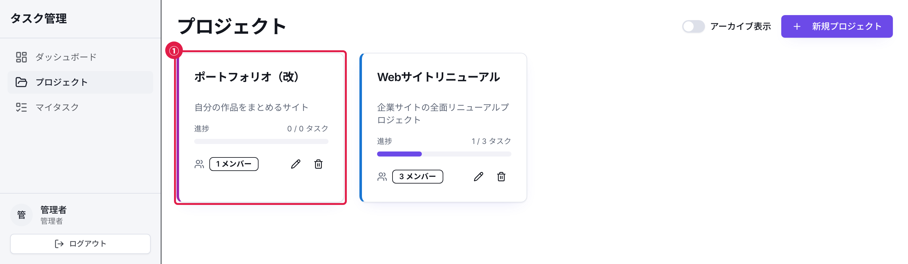
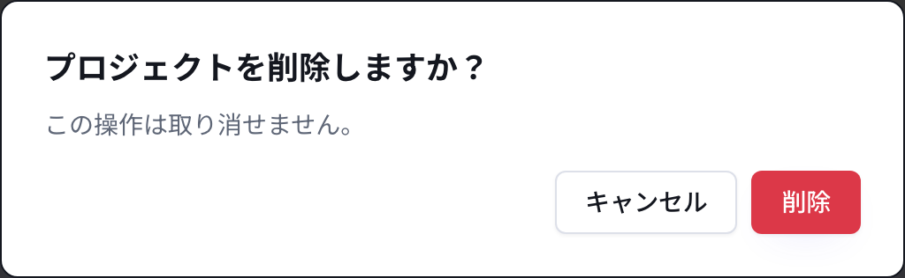
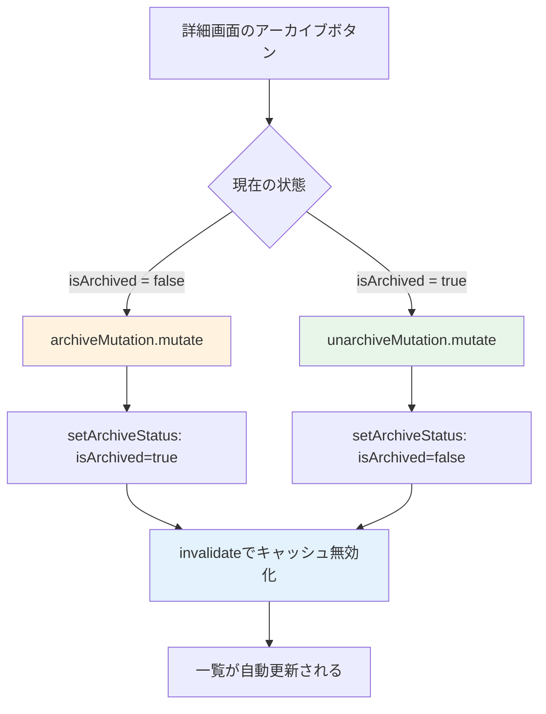
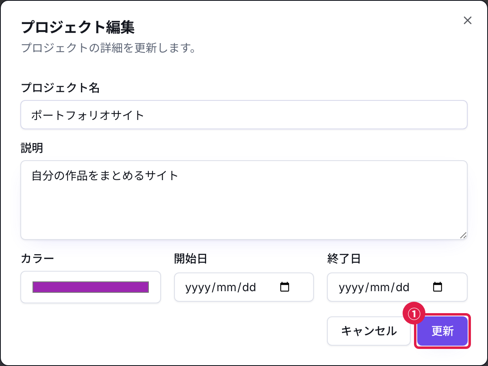
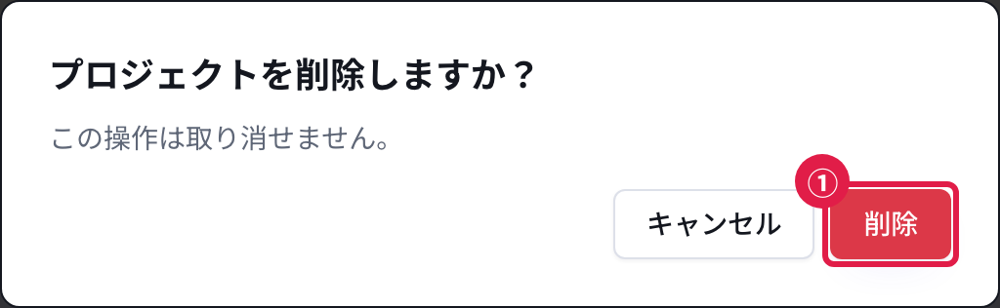

# Day 11: プロジェクト編集・削除を実装しよう

## 前回の振り返り

Day 10 では react-hook-form・zod・tRPC の `useMutation`（データ変更API呼び出しのフック）を組み合わせてダイアログ形式のプロジェクト新規作成機能を実装しました。CRUD（作成 Create・読み取り Read・更新 Update・削除 Delete の4操作をまとめた呼び名）の「Create」ができたので今日は「Update」と「Delete」に進みます。

---

## 今日のゴール

Day 10 で作った ProjectDialog を「編集モード」で再利用してプロジェクトの更新と削除を実装します。既存データをフォームに反映する方法と削除前の確認ダイアログも学びます。

この日はまずサーバー側に `update` / `delete` / `archive` / `unarchive` と詳細取得用の `getById` の5つを自分で書きます。そのあと編集・削除・アーカイブと詳細画面の表示をつなぎます。

スクリーンショット: 今日の最後に目指す編集モードの表示です。まだ自分の画面には出せません。



## なぜこれを作るのか

Day 10 で「プロジェクト作成」ができるようになりました。名前の間違いを直したいときや不要になったプロジェクトを整理したいときには編集と削除の機能が必要です。

今日は「編集」と「削除」を追加します。今日の作業が終わるとプロジェクトの作成・編集・削除・アーカイブという一連の管理操作がすべて揃います。

> **例え話**: Day 10 で作ったダイアログは「万能な注文用紙」です。新規注文にも注文変更にも使えます。変更時は元の内容を用紙に書いておくだけです。このように1つのコンポーネントで両方に対応する設計を「再利用性の高い設計」と言います。

### 編集・削除の処理フロー


```mermaid
flowchart TD
    A[カードの編集ボタン] --> B[既存データを取得]
    B --> C[ProjectDialogを編集モードで開く]
    C --> D[フォームを変更]
    D --> E[api.project.update.mutate]
    E --> F[invalidateでキャッシュ無効化]

    G[カードの削除ボタン] --> H[deleteTargetId をセット]
    H --> I[DeleteConfirmDialog を表示]
    I -->|削除| J[api.project.delete.mutate]
    I -->|キャンセル| K[何もしない]
    J --> F

    style A fill:#e3f2fd
    style E fill:#e8f5e9
    style G fill:#ffebee
    style J fill:#ffcdd2
```

図には道が2本あります。上の編集ボタンはダイアログを開きます。サーバーを呼ぶのは保存ボタンを押した後です。下の削除ボタンは `deleteTargetId` に「どれを消すか」を控えます。サーバーを呼ぶのは確認ダイアログの「削除」を押した後です。

削除前の確認は押し間違いを防ぐためです。編集なら名前を書き直せば元の状態に戻せます。削除済みのプロジェクトを戻す機能はありません。

Day 09 ではプロジェクト一覧を作りました。今日は編集と削除の後で一覧を更新する処理を追加します。

編集と削除の最後に `invalidate` を呼んでキャッシュを無効にすると一覧に変更が反映されます。

### やること / やらないこと

| やること | やらないこと |
|---------|-------------|
| 編集ダイアログに既存データを渡す | 新しい編集ページを作る |
| `api.project.update` で更新 | フォームの作り直し |
| `DeleteConfirmDialog` で削除確認 | `window.confirm()` の使用 |
| キャッシュ無効化で一覧更新 | 手動リロード |
| アーカイブ mutation の実装 | アーカイブUIの詳細カスタマイズ |

## 新しく学ぶ概念

| 概念 | 説明 |
|------|------|
| 編集モード（Edit Mode） | 1つのフォームコンポーネントを新規作成と更新の両方に使い回す設計パターン |
| initialData | コンポーネントに既存データを渡して初期値として表示する props |
| キャッシュ無効化（invalidate） | 更新・削除後に tRPC のキャッシュを破棄して最新データを再取得させる処理 |
| アーカイブ | データを削除せずに非表示にする方法。復元が可能 |

> 「楽観的更新（Optimistic Update）」という手法もあります。今回は使いません。楽観的更新はサーバーの応答を待たず先にUIを更新して失敗したらロールバックする高度な手法です。今回はよりシンプルな `invalidate()`（キャッシュ無効化）で一覧を更新します。

### 今日の作業ファイル

```
src/
├── app/
│   └── project/
│       └── page.tsx          ← 編集・削除・アーカイブの処理
├── lib/
│   └── query-error.ts        ← 取得エラーと再試行の判定
├── component/
│   └── ui/
│       └── delete-confirm-dialog.tsx  ← 削除確認ダイアログ
└── server/
    └── api/
        └── routers/
            └── project.ts    ← Step 0 で手続きを5本追加
```

今日コードを書き足すのは `project.ts`、`page.tsx`、`query-error.ts` の3つです。`delete-confirm-dialog.tsx` は配布済みです。中身には手を入れません。

作業はサーバー側の `project.ts` から始めます。カードの編集ボタンと削除ボタンはプロジェクトを見られる人全員の画面に表示されます。操作する権限があるかをサーバー側で確認してから画面をつなぎます。ボタンを表示する条件だけでは不正なAPI呼び出しを防げないためです。

## 実装ステップ一覧

| ステップ | 作業内容 | 所要時間 |
|---------|---------|---------|
| Step 0 | project.ts に update/delete/archive/unarchive/getById を自分で書く | 18分 |
| Step 1 | インポートと編集ボタンのハンドラーを作る | 7分 |
| Step 2 | 削除の state と mutation を実装する | 5分 |
| Step 3 | 送信ハンドラーを作る | 7分 |
| Step 4 | ProjectDialog を配置する | 5分 |
| Step 5 | DeleteConfirmDialog を配置する | 5分 |
| Step 6 | 削除 vs アーカイブの違いを理解する | 5分 |
| Step 7 | アーカイブ mutation を定義する | 5分 |
| Step 8 | アーカイブハンドラーを作る | 3分 |
| Step 9 | 詳細の取得状態とエラー表示を実装する | 18分 |
| Step 10 | 動作確認 | 7分 |

**合計時間**: 約85分です。

この時間はコードを読んで理解する目安です。写経して打ち込む時間、詰まって調べる時間は別に見てください。

---

### Step 0: project.ts に update/delete/archive/unarchive/getById を自分で書く（18分）

**ゴール**: プロジェクトの更新・削除・アーカイブ・アーカイブ解除・詳細取得の5つの手続きを追加します。`api.project.update` / `api.project.delete` / `api.project.archive` / `api.project.unarchive` / `api.project.getById` を呼べる状態にします。

#### 0-1. update（送られてきた項目だけ更新する）

今日書く `update` / `delete` / `archive` / `unarchive` はどれも「自分にその操作をする権限があるか」を確認してから実行します。基本の判定をまとめるのが `assertMemberPermission` という関数です。渡されたメンバー情報と権限名（`canManageMembers` 等）を照合して権限が無ければその場でエラーを発生させます。OWNER だけに許す `delete` は、この関数を使わずロールを直接比較します。まず `project.ts` の import 群に追加します。

```typescript
// filepath: src/server/api/routers/project.ts（import群を修正）
import { assertMemberPermission } from './_helpers/permission';
```

これは `_helpers/permission.ts` にまとまっている権限チェックの共通関数です。Day 07 で作った `_helpers/select.ts` と同じ場所にあります。こちらは配布済みの既存ファイルです。ここから先の手続きはこれを何度も呼びます。

続けて更新用の入力スキーマを書きます。`project.ts` の `projectCreateSchema` の下に追加します。

```typescript
// filepath: src/server/api/routers/project.ts（続き）
const projectUpdateSchema = z.object({
  id: z.string().cuid(),
  name: z.string().min(1).optional(),
  description: z.string().optional().nullable(),
  color: z
    .string()
    .regex(/^#[0-9A-F]{6}$/i)
    .optional(),
  isArchived: z.boolean().optional(),
  startDate: z.string().datetime().optional().nullable(),
  endDate: z.string().datetime().optional().nullable(),
});
```

`create` のスキーマとの違いは `id` 以外の全項目が `.optional()` になっていることです。更新は「送られてきた項目だけ書き換える」のが基本なので名前だけ変えたいときに `description` や `color` まで毎回送る必要はありません。

`startDate` と `endDate` に付けた `.datetime()`（ISO日時文字列の検証）は`"2024-12-31T00:00:00Z"` のような形式の文字列だけを通します。日付として解釈できない値が入ってきたらその時点でエラーにして弾けます。

続けて `update` の手続き本体です。`getAll` の下に追加します。まず対象のプロジェクトを探します。無ければ止めます。

ここから先の「（続き）」のブロックは`project.ts` の**末尾にある `});` の1行上**へ貼ります。ファイルの一番下に足すとルーターの外に出てしまいます。その場合は構文エラーになります。`});` は増やしません。

```typescript
// filepath: src/server/api/routers/project.ts（続き）
  update: protectedProcedure.input(projectUpdateSchema).mutation(async ({ ctx, input }) => {
    const { id, ...data } = input;

    const project = await prisma.project.findUnique({
      where: { id },
      include: {
        members: {
          where: { userId: ctx.session.userId },
        },
      },
    });

    if (!project) {
      throw new TRPCError({
        code: 'NOT_FOUND',
        message: 'プロジェクトが見つかりません',
      });
    }
```

`{ id, ...data }` は `input` から `id` だけを取り出し、残りをまとめて `data` に入れる分割代入です。`id` は「どのプロジェクトを更新するか」を探すために使い、それ以外の項目（`data`）は更新内容として使います。

対象は `findUnique`（条件に合う1件を取得）で1件だけ引きます。あわせてメンバー一覧を `ctx.session.userId`（サーバーが持つログインユーザーID）で絞り込みます。ログイン本人の情報だけを取り出してこの後の権限チェックに使います。

続けて権限チェックと更新データの組み立てを書きます。

```typescript
// filepath: src/server/api/routers/project.ts（続き）
    assertMemberPermission(project.members, 'canManageMembers');

    const updateData: Prisma.ProjectUpdateInput = {};
    if (data.name !== undefined) {
      updateData.name = data.name;
    }
    if (data.description !== undefined) {
      updateData.description = data.description;
    }
    if (data.color !== undefined) {
      updateData.color = data.color;
    }
    if (data.isArchived !== undefined) {
      assertMemberPermission(project.members, 'canArchive');
      updateData.isArchived = data.isArchived;
    }
    if (data.startDate !== undefined) {
      updateData.startDate = data.startDate ? new Date(data.startDate) : null;
    }
    if (data.endDate !== undefined) {
      updateData.endDate = data.endDate ? new Date(data.endDate) : null;
    }
```

権限を先に求めてから候補一覧を取得します。閲覧だけできるメンバーが詳細を開いた際に、不要な候補取得で403を発生させないためです。

`isArchived` の変更には `canArchive` も確認します。名前や説明を変更できる ADMIN でもアーカイブは許可されていないためです。

`assertMemberPermission(project.members, 'canManageMembers')` は自分がこのプロジェクトのメンバーで管理権限（`canManageMembers`）を持っているかを確認します。権限が無ければここで処理が止まります。

`updateData` を空のオブジェクトから始めて`data.name !== undefined` のように「送られてきた項目だけ」を1つずつ足しています。Day 10 の `create` で書いた `description` の条件付き代入と同じ考え方を6項目すべてに広げた形です。

最後に組み立てた `updateData` で実際に更新します。

```typescript
// filepath: src/server/api/routers/project.ts（続き）
    return await prisma.project.update({
      where: { id },
      data: updateData,
      include: {
        members: {
          include: {
            user: {
              select: USER_SELECT,
            },
          },
        },
      },
    });
  }),
```

`include`（関連データを一緒に取る指定）のうちメンバー情報を `user` 付きで取る部分は `getAll` / `create` と共通です。`getAll` は一覧表示用にタスクの `id` と `status` も取ります。`update` の返り値では不要なので付けていません。このあとの 0-4 で書く `getById` は詳細画面用なので、メンバーに加えてタスクと担当者まで取ります。

#### 0-2. delete（プロジェクト削除は OWNER 限定）

`update` の下に `delete` を追加します。まずは `update` と同じく対象を探すところからです。

```typescript
// filepath: src/server/api/routers/project.ts（続き）
  delete: protectedProcedure
    .input(z.object({ id: z.string().cuid() }))
    .mutation(async ({ ctx, input }) => {
      const project = await prisma.project.findUnique({
        where: { id: input.id },
        include: {
          members: {
            where: { userId: ctx.session.userId },
          },
        },
      });

      if (!project) {
        throw new TRPCError({
          code: 'NOT_FOUND',
          message: 'プロジェクトが見つかりません',
        });
      }
```

`delete` でもいきなり `prisma.project.delete` を呼ばずに `findUnique` で対象を1件引いています。狙いは2つです。存在しない `id` が届いたときは `NOT_FOUND` で止めます。また `members` をログイン本人の1件だけに絞って次の権限チェックで使います。

この「探す → 権限を見る → 実行する」という3段の並びは `update` と共通です。同じ形を繰り返しているのでDay 12 で書く `addMember` も同じ順番で組み立てられます。

続けて権限チェックと削除の処理を書きます。ここが `delete` で一番大事な部分です。

```typescript
// filepath: src/server/api/routers/project.ts（続き）
      // canDeleteはタスク削除の権限でADMINにも付与されているため、
      // プロジェクト削除はOWNER限定で明示チェック
      const userMember = project.members[0];
      if (!userMember || userMember.role !== PROJECT_MEMBER_ROLE.OWNER) {
        throw new TRPCError({
          code: 'FORBIDDEN',
          message: 'この操作を実行する権限がありません',
        });
      }

      await prisma.project.delete({
        where: { id: input.id },
      });
      return { success: true };
    }),
```

他の手続きは `assertMemberPermission(..., 'canManageMembers')` のような共通の権限チェック関数を使っています。しかし `delete` だけは `userMember.role !== PROJECT_MEMBER_ROLE.OWNER` と明示的に比べています。

理由はコードのコメントの通りです。`canDelete` という権限名はタスク削除にも使われていて ADMIN 権限にも与えられています。それをそのまま使うとプロジェクト自体の削除まで ADMIN に許可されてしまいます。このアプリではプロジェクト削除を OWNER に限定します。そのためここではロールを直接確認します。

#### 0-3. archive / unarchive（同じ処理をヘルパー関数にまとめる）

アーカイブとアーカイブ解除は「`isArchived` を true にするか false にするか」の違いしかありません。同じ処理を2回書かずに共通のヘルパー関数にまとめます。`project.ts` の `projectUpdateSchema` の直後に追加します。`export const projectRouter` より前に置いてください。

```typescript
// filepath: src/server/api/routers/project.ts（続き）
const setArchiveStatus = async (userId: string, projectId: string, isArchived: boolean) => {
  const userMember = await prisma.projectMember.findUnique({
    where: {
      userId_projectId: { userId, projectId },
    },
  });

  assertMemberPermission(userMember ? [userMember] : [], 'canArchive');

  return await prisma.project.update({
    where: { id: projectId },
    data: { isArchived },
  });
};
```

`isArchived` を引数で受け取ります。操作する権限を確認してからその値を DB に書き込みます。呼び出す側が `true` を渡せばアーカイブになります。`false` を渡せば解除になります。`delete` の下にこの関数を呼ぶ2つの手続きを追加します。このブロックだけは最後の `});` を含みます。ファイルの一番下にある `});` の1行を先に消してからその場所へ貼ってください。

```typescript
// filepath: src/server/api/routers/project.ts（続き）
  archive: protectedProcedure
    .input(z.object({ id: z.string().cuid() }))
    .mutation(async ({ ctx, input }) => {
      return await setArchiveStatus(ctx.session.userId, input.id, true);
    }),

  unarchive: protectedProcedure
    .input(z.object({ id: z.string().cuid() }))
    .mutation(async ({ ctx, input }) => {
      return await setArchiveStatus(ctx.session.userId, input.id, false);
    }),
});
```

`archive` は `true` を渡します。`unarchive` は `false` を渡します。どちらも処理は同じ関数に任せています。同じロジックを2か所に書き写すと片方だけ直して片方を直し忘れるバグが起きやすくなります。関数にまとめておくと権限チェックのルールを直すときも1か所を直すだけで済みます。最後の `});` で `projectRouter` 全体を閉じます。

#### 0-4. getById（1件だけ取得する）

Step 9 で詳細画面を出すときに使う「1件だけ取得する」手続きを先に用意します。`getAll` は複数件を `findMany` で取っていましたが`getById` は1件だけを `findUnique` で取ります。`unarchive` を書いたときと同じ要領で、ファイルの一番下にある `});` の1行を先に消してからその場所へ貼ってください。

```typescript
// filepath: src/server/api/routers/project.ts（続き）
  getById: protectedProcedure
    .input(z.object({ id: z.string().cuid() }))
    .query(async ({ ctx, input }) => {
      const project = await prisma.project.findUnique({
        where: { id: input.id },
        include: {
          members: {
            include: {
              user: {
                select: { ...USER_SELECT, role: true },
              },
            },
          },
          tasks: {
            include: {
              assignee: {
                select: USER_SELECT,
              },
            },
            orderBy: [{ position: 'asc' }, { createdAt: 'desc' }],
          },
        },
      });
```

先頭の `protectedProcedure` に `.mutation` ではなく `.query`（読み取り用の手続き）をつなげています。データを書き換えないので読み取り専用の入口で十分です。`include` に `members` と `tasks` を並べているのは詳細画面がこの2つを同じ画面に出すからです。別々のAPIで取ると通信が2回になり、片方だけ古い内容のまま表示される瞬間ができます。`tasks` の中の `assignee`（担当者）も一緒に取るのは、詳細画面がタスクの担当者名を表示するためです。

続けて見つからなかったときのチェックです。

```typescript
// filepath: src/server/api/routers/project.ts（続き）
      if (!project) {
        throw new TRPCError({
          code: 'NOT_FOUND',
          message: 'プロジェクトが見つかりません',
        });
      }
```

`getAll` は一覧なので「見つからない」というケースがありませんでした。`getById` は違います。指定した `id` のプロジェクトは存在しないこともあるため`NOT_FOUND` チェックが必要です。

続けて権限チェックと戻り値です。`ctx.session`（サーバーが持つログイン情報）にはいまログインしているユーザーの `userId` が入っています。

```typescript
// filepath: src/server/api/routers/project.ts（続き）
      assertMemberPermission(
        project.members.filter((m) => m.userId === ctx.session.userId),
        'canView',
      );

      return project;
    }),
});
```

`getAll` では `where` で「自分がメンバーのものだけ」を絞り込んでいましたが`getById` は先にプロジェクトを取得してから、取得した `members` の中に自分がいるかを `filter` で確認しています。他人のプロジェクトの `id` を直接指定されてもメンバーでなければ `canView` の権限チェックで弾かれます。最後の `});` で再び `projectRouter` 全体を閉じます。

#### 今日書いた4つの操作群で使う権限チェック

Step 0 では4つの操作群に権限チェックを入れました。表にすると選び方が見えます。

| 操作 | 権限チェックの書き方・選んだ理由 |
|------|----------------------------------|
| `update` | **権限チェックの書き方**: `assertMemberPermission(..., 'canManageMembers')`<br>**選んだ理由**: 権限名を指定して共通の判定関数を使う |
| `delete` | **権限チェックの書き方**: `role !== PROJECT_MEMBER_ROLE.OWNER` を直接比較<br>**選んだ理由**: ADMIN にも付与された `canDelete` では OWNER 限定の条件を表せないため |
| `archive` / `unarchive` | **権限チェックの書き方**: `setArchiveStatus` にまとめて`assertMemberPermission(..., 'canArchive')`を1か所に<br>**選んだ理由**: まったく同じ処理を2つの手続きが呼ぶので関数化して重複を消す |
| `getById` | **権限チェックの書き方**: `assertMemberPermission(..., 'canView')`<br>**選んだ理由**: URLへ他人のプロジェクトIDを直接入れられても、メンバーでなければ詳細を返さないため |

権限名で条件を表せる操作には `assertMemberPermission` を使います。プロジェクト削除は OWNER かどうかを直接比較します。同じ処理を2手続き以上が呼ぶ場合は関数にまとめます。この判断は Day 12 の `addMember` / `removeMember` でも使います。

**確認ポイント**:
- `projectUpdateSchema` と `update` / `delete` / `setArchiveStatus` / `archive` / `unarchive` / `getById` を追加した
- `delete` の権限チェックが `assertMemberPermission` ではなく `role !== PROJECT_MEMBER_ROLE.OWNER` の直接比較になっている
- `npx tsc --noEmit` で型エラーが出ていない

---

### Step 1: インポートと編集ボタンのハンドラーを作る（7分）

**ゴール**: 必要なインポートを追加してカードの編集ボタンで既存データを取得します。

**実装**:

まずDay 10 で作成した `ProjectFormData` 型と削除確認用の `DeleteConfirmDialog` をインポートします。
すでに `useState` や `Suspense`（準備中に仮表示へ差し替える仕組み）の import がある場合は
重複させずに以下の形へ揃えてください。

```typescript
// filepath: src/app/project/page.tsx
import {
  useRouter,
  useSearchParams,
} from 'next/navigation';
import {
  Suspense,
  useState,
} from 'react';
// Day 10のProjectFormData型をインポート
import {
  ProjectDialog,
  type ProjectFormData,
} from '@/component/project/project-dialog';
import {
  dateOnlyFromValue,
  dateOnlyToUtcStartIso,
} from '@/lib/date';
// 削除確認ダイアログ（shadcn/uiベース）
import { DeleteConfirmDialog }
  from '@/component/ui/delete-confirm-dialog';
```

この2つは Day 10 で作った資産を編集機能に持ち込むための import です。`ProjectFormData` 型を取り込むとフォームに渡す値の形をコンパイラが検査してくれます。`DeleteConfirmDialog` は削除確認のUIを毎回書かずに済ませるための共通部品です。

**確認ポイント**:
- インポート文を追加してエラーが出ていない
- `ProjectFormData` と `DeleteConfirmDialog` が正しくインポートされた

次に編集用の state を追加します。詳細表示の対象はこのあと URL から直接読みます。
`ProjectPageContent` 関数の先頭にある state 一覧
（`const [dialogOpen, ...]` の並び）に追加してください。

```typescript
// filepath: src/app/project/page.tsx
const [editingProject, setEditingProject] =
  useState<ProjectFormData | undefined>(
    undefined
  );
```

`editingProject` は編集ダイアログに流し込む既存データを覚えておくための state です。詳細表示の対象は URL の `projectId` をそのまま使うため、別の state は作りません。

**確認ポイント**:
- `editingProject` の型が `ProjectFormData | undefined` になっている
- 保存時にエラーが出ていない

URL の `?projectId=...` を詳細表示の対象として読むコードも追加します。
`utils = api.useUtils()` より前に置くと読みやすいです。

```typescript
// filepath: src/app/project/page.tsx
const searchParams = useSearchParams();
const projectIdParam =
  searchParams.get('projectId');
const router = useRouter();

const selectedProject = projectIdParam;
```

`selectedProject` は URL の値そのものです。ブラウザの戻る操作で URL が変わると同じ描画で値も変わるため、同期用の `useEffect` は要りません。詳細URLを直接開いた初回から取得中と判定できます。

**確認ポイント**:
- `router.push(...)` を使う準備ができている
- URL に `projectId` があると `selectedProject` に入る

ログイン中のユーザー情報も取得しておきます。この後の作成分岐でユーザーIDを確認するのに使います。`utils` の並びに追加してください。

```typescript
// filepath: src/app/project/page.tsx
// ログインユーザーを取得（画面の表示切り替えに使う）
const { data: currentUser } =
  api.auth.getCurrentUser.useQuery();
```

**確認ポイント**:
- `currentUser` でログイン中のユーザーを取得できた

`getCurrentUser` はサーバーが持つログイン情報を返します。ここで取った `currentUser` は画面の表示やボタンの出し分けに使います。サーバー側の各手続きはセッションから取得した `ctx.session.userId` でログイン本人を識別します。Day 12 ではプロジェクト内のロールを調べてボタンの表示可否も決めます。

次にDay 09 で置いた受け皿の `handleEdit` を中身のある処理に書き換えます。`const handleEdit = (projectId: string) => {` からその2行下の `};` までの3行を消してください。消した場所へ次のコードを貼ります。位置は動かしません。Day 09 の Step 5 で `handleEdit` → `handleDelete` → `handleProjectClick` の順に3つ並べたので `handleEdit` はその先頭のままです。

日付は `dateOnlyFromValue()` で `"2024-12-31"` 形式に変換します。保存済みの ISO 文字列から `<input type="date">` 用の date-only 値を安全に取り出せます。

```typescript
// filepath: src/app/project/page.tsx
// 消した受け皿と同じ場所: 中身を入れた編集ボタンのハンドラー
const handleEdit = (projectId: string) => {
  const project = projects?.find(
    (p) => p.id === projectId
  );
  if (!project) return;
  const startDate = project.startDate
    ? dateOnlyFromValue(project.startDate)
    : undefined;
  const endDate = project.endDate
    ? dateOnlyFromValue(project.endDate)
    : undefined;
  setEditingProject({
    id: project.id,
    name: project.name,
    description: project.description || '',
    color: project.color,
    ...(startDate && { startDate }),
    ...(endDate && { endDate }),
  });
  setDialogOpen(true);
};
```

`handleEdit` はサーバーを呼びません。Day 09 の `getAll` で受け取り済みの `projects` から一致する1件を探してその値を `editingProject` へ写すだけです。押すたびに通信を挟むとダイアログが開くまでの待ち時間が毎回発生します。

`description` に `|| ''` を付けるのは DB 上の `null` をそのまま `<input>` へ渡せないからです。`null` のまま渡すと最初の描画の時点で「value に null を渡さないでください」という警告が出ます。空文字へ寄せておけば最初から空欄の入力欄として扱えます。

日付の変換を飛ばすと名前と色は埋まっているのに開始日と終了日だけが空のダイアログになります。`2026-05-01T00:00:00.000Z` は `<input type="date">` が読める形式に合わないためブラウザで日付として表示できません。

**確認ポイント**:
- `handleEdit` が Day 09 の受け皿と同じ場所にあって `handleDelete` の直上にある
- `description` に `|| ''` を使って null を空文字に変換している
- 日付変換のロジックが正しく書けた

#### 条件付きスプレッド構文

`...(startDate && { startDate })` という書き方は「値が存在する場合のみオブジェクトに追加する」パターンです。`startDate: startDate` とそのまま書かない理由を見ていきます。

| 書き方 | `startDate` が `undefined` の場合・結果 |
|--------|-----------------------------------------|
| ❌ `{ startDate: startDate }` | `{ startDate: undefined }`。`undefined` がオブジェクトに入る |
| ✅ `...(startDate && { startDate })` | `{}`。プロパティ自体が存在しない |

`{ startDate: undefined }` と書くとキーは残ったまま中身が `undefined` になります。Day 01 で生成される `tsconfig.json` は `exactOptionalPropertyTypes` を有効にしていません。そのため `startDate?: string` は3つの形を受け取ります。「キーが無い」「文字列が入っている」「キーはあって中身が `undefined`」の3つです。この書き方でも型エラーは出ません。

それでも条件付きスプレッドにそろえるのは `editingProject` へ入れる形を「日付が入っている」「項目そのものが無い」の2つに決めておくためです。型が許す形とこちらが作ると決めた形は別物です。日付が無い場合は項目を作らないと決めておけば `editingProject` に値が `undefined` のキーは入りません。

> **注文書の例え**: 注文書の「お届け日」欄は日付を書くか欄そのものを使わないかのどちらかです。「未定」とだけ書かれた欄は受け取った側がどう扱うか迷います。`editingProject` の日付も値を入れるか項目ごと作らないかの2つにそろえます。

---

### Step 2: 削除の state と mutation を実装する（5分）

**ゴール**: 削除確認ダイアログ用の state と mutation を実装します。

**実装**:

削除フローでは2つの state で「どのプロジェクトを削除するか」「確認ダイアログを表示するか」を管理します。`ProjectPageContent` 関数の先頭にある state 一覧（`const [showArchived, ...]` の直下）に追加してください。

```typescript
// filepath: src/app/project/page.tsx
// showArchivedの直下に追加
const [deleteDialogOpen, setDeleteDialogOpen]
  = useState(false);
const [deleteTargetId, setDeleteTargetId]
  = useState<string | null>(null);
```

**確認ポイント**:
- `deleteDialogOpen` と `deleteTargetId` の2つの state が追加された
- `deleteTargetId` の型が `string | null` になっている

次に削除用の mutation を定義します。Day 10 で書いた `createMutation` の直下に追加してください。`updateMutation` は Step 3 でこの2つの間に足すので最終的な並びは `createMutation` → `updateMutation` → `deleteMutation` になります。

```typescript
// filepath: src/app/project/page.tsx
// createMutationの直下に追加
const deleteMutation =
  api.project.delete.useMutation({
    onSuccess: () => {
      void utils.project.getAll.invalidate();
      router.push('/project');
    },
  });
```

**確認ポイント**:
- `deleteMutation` が `createMutation` の直下に定義できた
- 成功時に `invalidate()` で一覧を更新して `router.push` で一覧画面に戻る

`handleDelete` は state を設定します。実際に削除するのは確認ダイアログの削除ボタンを押したときです。これも Day 09 で置いた受け皿があるので`const handleDelete = (projectId: string) => {` から2行下の `};` までの3行を消してから貼ってください。位置は動かしません。`handleDelete` は `handleEdit` の直下にあります。後ろには `handleProjectClick` が続きます。

```typescript
// filepath: src/app/project/page.tsx
// handleEditの直下: 受け皿を書き換えた削除ボタンのハンドラー
const handleDelete = (projectId: string) => {
  setDeleteTargetId(projectId);
  setDeleteDialogOpen(true);
};
```

**確認ポイント**:
- `handleDelete` は `setDeleteTargetId` と `setDeleteDialogOpen` を呼ぶだけ
- まだ削除は実行されない（確認ダイアログで実行する）

> `handleDelete` では直接削除を実行しません。まず「どのプロジェクトを削除するか」を記録して確認ダイアログを開きます。実際の削除は Step 5 で配置するダイアログの `onConfirm` で行います。

---

### Step 3: 送信ハンドラーを作る（7分）

**ゴール**: 更新用の mutation を定義して1つの `handleSubmit` で新規作成と更新を分岐します。

**実装**:

まず更新用の mutation を追加します。
`createMutation` の直下に `updateMutation` を定義してください。

```typescript
// filepath: src/app/project/page.tsx
// createMutationの直下に追加
const updateMutation =
  api.project.update.useMutation({
    onSuccess: () => {
      void utils.project.getAll.invalidate();
      void utils.project.getById.invalidate();
      setDialogOpen(false);
    },
  });
```

`getById` も取り直しているのは、Step 9 で出す詳細画面がこの手続きの結果で描かれるためです。一覧（`getAll`）だけ取り直すと、詳細画面を開いている最中に名前を変えても古い表示のまま残ります。`invalidate` に引数を渡さないので開いている詳細があるときだけ効き、無駄な再取得は起きません。

**確認ポイント**:
- `updateMutation` が `createMutation` の直下に定義されている
- `onSuccess` で `getAll` と `getById` の `invalidate()` を呼んでいる
- このファイルの実装が終わったら、`npx tsc --noEmit` で型エラーがないことを確認する

次に送信ハンドラーを作ります。Day 10 で書いた `handleSubmit` を `data.id` の有無で更新と新規作成を `if/else` で分岐する形に書き換えます。

> **配置の注意**: Day 10 の `const handleSubmit = (` から対応する閉じの `};` までをまるごと消してください。消した跡へこの後の2つのブロックを続けて貼ります。位置は動かしません。Day 10 で `createMutation` の下に置いた場所がそのまま `handleSubmit` の位置です。

更新の場合（`data.id` がある場合）のコードです。

```typescript
// filepath: src/app/project/page.tsx
// 消した handleSubmit と同じ場所: Day 10 から書き換えた送信ハンドラー
const handleSubmit = (
  data: ProjectFormData
) => {
  if (data.id) {
    updateMutation.mutate({
      id: data.id,
      name: data.name,
      description:
        data.description || null,
      color: data.color,
      startDate: data.startDate
        ? dateOnlyToUtcStartIso(
            data.startDate
          )
        : null,
      endDate: data.endDate
        ? dateOnlyToUtcStartIso(
            data.endDate
          )
        : null,
    });
```

**確認ポイント**:
- `data.id` がある場合に `updateMutation.mutate` を呼んでいる
- `description` に `|| null` を使って空欄のときは `null` に変換している

同じ `handleSubmit` 関数の `else` 分岐です。`data.id` がない場合（新規作成）は Day 10 の `createMutation` を呼びます。

```typescript
// filepath: src/app/project/page.tsx
// handleSubmit関数のelse分岐（続き）
  } else {
    if (!currentUser?.id) return;
    createMutation.mutate({
      name: data.name,
      description: data.description,
      color: data.color,
      startDate: data.startDate
        ? dateOnlyToUtcStartIso(
            data.startDate
          )
        : undefined,
      endDate: data.endDate
        ? dateOnlyToUtcStartIso(
            data.endDate
          )
        : undefined,
    });
  }
};
```

`if (!currentUser?.id) return;` はログイン情報の取得前に送信しないための条件です。`getCurrentUser` は通信で取得するので画面を開いた直後は `undefined` の場合があります。

`project.create` はサーバー側のセッションから持ち主を決めます。画面から送るデータには持ち主を含めません。この条件は画面側でログイン情報を取得できるまで送信を止めます。取得に失敗するとボタンを押しても送信されません。利用者向けに公開する際は取得失敗の表示も必要です。

日付が空のときに更新は `null` を送ります。新規作成は `undefined` を渡します。同じ「空」でもサーバーへの伝わり方が変わるので次の表で確認します。

**確認ポイント**:
- `data.id` がない場合に `createMutation.mutate` を呼んでいる
- `currentUser?.id` のガードがある

#### 更新 vs 新規作成: `null` と `undefined` の使い分け

| 操作 | 日付が空の場合 | サーバーへの意味 |
|------|--------------|----------------|
| 更新 | `null` を送信 | 「既存の日付を消す」 |
| 新規作成 | `undefined`（= プロパティを含めない） | 「日付は指定しない」 |

> **注文書の例え**: 注文変更で「お届け日: なし」と書けば配送日をキャンセルする意味になります。新規注文でお届け日欄を空けたままなら「指定なし」の意味です。Prisma はこの2つを区別するので使い分けが必要です。


```mermaid
flowchart LR
    BEFORE["更新前の1行<br/>startDate: 2026-09-01"]
    BEFORE -->|"null を送る"| AFTER1["startDate: 空<br/>列の中身が消える"]
    BEFORE -->|"項目そのものを送らない"| AFTER2["startDate: 2026-09-01<br/>列は変わらない"]
```

日付を消したい場合は `null` を送ります。図の左側は変更前のデータです。右側で更新結果を比較しています。`undefined` を渡して項目が送信されなかった場合は既存の日付が残ります。

#### `??`（Null合体演算子）と `||`（論理OR）の違い

プロジェクト編集では `description ?? null` と `description || null` の違いに注意してください。Step 3 の更新ハンドラー（`src/app/project/page.tsx`）で `description || null` を使ったのは説明欄を空にして保存したときに `null` を送るためです。

| 式 | `description` が `''`（空文字）の場合 | このアプリでの結果 |
|-----|--------------------------------------|------|
| <code>description &#124;&#124; null</code> | `null`（空文字もfalsyとして扱う） | ✅ 説明を消したことが DB に残る |
| `description ?? null` | `''`（空文字をそのまま返す） | 空文字が保存されるため今回の「説明なし」を表す `null` とは異なる |

`??` は `null` と `undefined` だけを判定します。`||` は `''`・`0`・`false` もfalsyとして扱います。ここでは空欄を「説明なし」として保存したいので `||` を使います。空文字そのものを意味のある値として残したい場面なら`??` の方が合います。

---

### Step 4: ProjectDialog を配置する（5分）

**ゴール**: ProjectDialog をJSXに配置して新規作成・編集の両モードで動作させます。

**実装**:

Day 09 の `handleCreate` はダイアログを開くだけでした。
編集機能を追加したので「新規作成」では
`editingProject` を必ず `undefined` に戻すように更新します。
`const handleCreate = () => {` から2行下の `};` までの3行を消して
同じ場所へ次の4行を貼ってください。位置は動かしません。

```typescript
// filepath: src/app/project/page.tsx
const handleCreate = () => {
  setEditingProject(undefined);
  setDialogOpen(true);
};
```

**確認ポイント**:
- `handleCreate` で `setEditingProject(undefined)` を呼んでいる
- 新規作成ボタンでダイアログが空の状態で開く

`ProjectDialog` は Day 10 で JSX 内へ置いてあります。プロジェクトカード一覧グリッド（`<div className="grid gap-6 sm:grid-cols-2 ...">...</div>`）の閉じタグ直後を見てください。そこにある `<ProjectDialog` のタグへ `initialData` の1行を足します。新しくもう1つ置くのではありません。

```typescript
{/* filepath: src/app/project/page.tsx */}
{/* グリッドの閉じ</div>直後にある既存タグへ initialData を追加 */}
<ProjectDialog
  open={dialogOpen}
  onClose={() => setDialogOpen(false)}
  onSubmit={handleSubmit}
  initialData={editingProject}
/>
```

`initialData` に `editingProject` を渡しているので同じ `ProjectDialog` が新規作成と編集の両方で動きます。`editingProject` が `undefined` なら空のフォームになります。既存データが入っていればその値を表示します。

**確認ポイント**:
- 編集ボタンでダイアログを開くと既存の名前が入っている
- 新規作成ボタンで空のダイアログが開く
- 名前を変えて「更新」を押すと一覧のカードの見出しが変わる

Step 3 で書いた分岐は `initialData` がそろったここで初めて `updateMutation` の側へ入ります。Step 3 の時点では `data.id` が `undefined` のままなので新規作成の分岐に進みます。

スクリーンショット: 編集後に更新された一覧の表示を確認してください。下の画像はDay 10 で作ったプロジェクトの名前を「ポートフォリオ（改）」へ変えて「更新」を押したあとの一覧です。変更後の名前は本文で指定していないので自分で付けた名前がそのまま出ていれば正しい状態です。




#### 新規作成 vs 編集の違い

| 項目 | 新規作成 | 編集 |
|------|---------|------|
| `initialData` | `undefined` | 既存データ（`id` を含む） |
| タイトル | 「プロジェクト作成」 | 「プロジェクト編集」 |
| ボタン文言 | 「作成」 | 「更新」 |

> `handleCreate` で `setEditingProject(undefined)` を呼ぶとフォームが空の状態（新規作成モード）になります。`ProjectDialog` は `initialData` の `id` 有無でタイトルとボタン文言を自動で切り替えます。

---

### Step 5: DeleteConfirmDialog を配置する（5分）

**ゴール**: shadcn/ui ベースの確認ダイアログを配置して削除フローを完成させます。

**実装**:

`DeleteConfirmDialog` は `</AppLayout>` の直前に配置します。`ProjectDialog` よりも後ろの位置です。

```typescript
{/* filepath: src/app/project/page.tsx */}
{/* </AppLayout>の直前に配置 */}
<DeleteConfirmDialog
  open={deleteDialogOpen}
  onOpenChange={setDeleteDialogOpen}
  onConfirm={() => {
    if (deleteTargetId) {
      deleteMutation.mutate({
        id: deleteTargetId,
      });
    }
  }}
  isPending={deleteMutation.isPending}
  title="プロジェクトを削除しますか？"
/>
```

`onConfirm` の中で `deleteTargetId` が入っているかを先に確かめてから `mutate` を呼びます。ダイアログを開いたまま state が空に戻っても`id` の無いリクエストをサーバーへ送らずに済みます。

配布済みの `DeleteConfirmDialog` は `AlertDialogAction` を使っています。「削除」を押すと `onConfirm` を呼んだ直後に `onOpenChange(false)` が働くため、成功時の `onSuccess` に閉じる処理は要りません。サーバーが削除を拒否した場合もダイアログはいったん閉じ、一覧には対象が残ります。

ゴミ箱ボタンはカードを見られる人全員の画面に出ます。役割による出し分けはしていません。それでも OWNER 以外がプロジェクトを消せないのはStep 0 の `delete` が `role !== PROJECT_MEMBER_ROLE.OWNER` をサーバー側で毎回見直すからです。ADMIN のアカウントで押すと `FORBIDDEN` が返ります。一覧からプロジェクトは消えません。ボタンの表示を制限すると誤操作を減らせます。APIを直接呼び出された場合にも拒否できるよう権限はサーバーで確認します。

プロジェクトを削除すると所属するタスクも削除されます。`prisma/schema.prisma` の `Task` はプロジェクトへ `onDelete: Cascade` でつながっています。そのため `prisma.project.delete` を呼ぶとDBが関連するタスク行とメンバー行も削除します。このアプリには削除したデータを戻す機能がありません。データを残して非表示にしたい場合はStep 6のアーカイブを使います。

**確認ポイント**:
- 削除ボタンでshadcn/uiスタイルの確認ダイアログが出る
- 「キャンセル」で削除されない
- 「削除」で削除が実行される

#### DeleteConfirmDialog の props

| prop | 型 | 説明 |
|------|----|------|
| `open` | `boolean` | ダイアログの表示状態 |
| `onOpenChange` | `(open: boolean) => void` | 表示状態の変更ハンドラー |
| `onConfirm` | `() => void` | 「削除」ボタンの処理 |
| `isPending` | `boolean` | 削除処理中のローディング状態 |
| `title?` | `string` | ダイアログのタイトル（省略時は `本当に削除しますか？`） |
| `description?` | `string` | 補足説明文（省略時:「この操作は取り消せません。」） |

> `DeleteConfirmDialog` は shadcn/ui の `AlertDialog` を使った共通コンポーネントです。`window.confirm()` と違ってアプリ全体のデザインと統一されたUIで確認ダイアログを表示できます。`isPending`（mutation実行中フラグ）は通信中のボタン表示に使う値です。ただし今日の `AlertDialogAction` はクリック直後にダイアログを閉じるため「削除中...」は通常は見えません。

スクリーンショット: 削除確認ダイアログの表示を確認してください。



---

### Step 6: 削除 vs アーカイブの違いを理解する（5分）

**ゴール**: データを残して一覧から非表示にする「アーカイブ」と削除の使い分けを学びます。

`archive` / `unarchive` の中身は Step 0 で書きました。ここではコードを追加せずにアーカイブと解除を使う場面を確認します。

#### なぜアーカイブが必要か

終了したプロジェクトを普段の一覧から隠しておきたい場合はアーカイブを使います。このアプリでは削除とアーカイブを次のように区別しています。

| 観点 | 完全削除 | アーカイブ |
|------|---------|-----------|
| データの状態 | DBから消える | DBに残る（`isArchived = true`） |
| アプリからの復元 | 復元機能なし | `isArchived = false` に戻す |
| 用途 | 本当に不要なデータ | 終了したプロジェクト |

> 後からタスクの記録を見返したいプロジェクトはアーカイブしてください。このアプリの「削除」はデータを消す操作です。アーカイブと同じ意味ではありません。

### アーカイブの処理フロー


```mermaid
flowchart TD
    A[詳細画面のアーカイブボタン] --> B{現在の状態}
    B -->|isArchived = false| C[archiveMutation.mutate]
    B -->|isArchived = true| D[unarchiveMutation.mutate]
    C --> E[setArchiveStatus: isArchived=true]
    D --> F[setArchiveStatus: isArchived=false]
    E --> G[invalidateでキャッシュ無効化]
    F --> G
    G --> H[一覧が自動更新される]

    style C fill:#fff3e0
    style D fill:#e8f5e9
    style G fill:#e3f2fd
```

バックエンドでは `setArchiveStatus` ヘルパー関数でアーカイブを処理しています。権限チェック（`canArchive`）も含まれています。Step 0 で書いた `setArchiveStatus` を見比べながら`archive` と `unarchive` がなぜ同じ関数を呼んでいるかを振り返ってください。

**確認ポイント**:
- Step 0 で書いた `setArchiveStatus` を見てアーカイブが `isArchived` フラグで管理されていることを確認した
- 権限チェック（`canArchive`）が含まれていることを確認した
- `archive` と `unarchive` の2つのルーターがこの関数を呼んでいる

---

### Step 7: アーカイブ mutation を定義する（5分）

**ゴール**: フロントエンドでアーカイブ・解除用の mutation を2つ定義します。

**実装**:

`deleteMutation` の直下にアーカイブ用の mutation を2つ追加してください。`archiveMutation` と `unarchiveMutation` の順に配置します。メンバー用の mutation は Day 12 で追加します。

```typescript
// filepath: src/app/project/page.tsx
// deleteMutationの直下に追加
const archiveMutation =
  api.project.archive.useMutation({
    onSuccess: () => {
      void utils.project.getAll.invalidate();
      router.push('/project');
    },
  });
```

`onSuccess` で `invalidate()` を呼ぶと一覧のキャッシュが無効になって最新の状態を取得します。`router.push('/project')` で詳細画面から一覧へ戻ります。アーカイブ表示がOFFならそのプロジェクトは一覧に表示されません。

**確認ポイント**:
- `archiveMutation` が定義できた
- 成功時に `invalidate()` と `router.push('/project')` で一覧画面に戻る

```typescript
// filepath: src/app/project/page.tsx
// archiveMutationの直下に追加
const unarchiveMutation =
  api.project.unarchive.useMutation({
    onSuccess: () => {
      void utils.project.getAll.invalidate();
      router.push('/project');
    },
  });
```

解除も成功後に `invalidate()` で一覧を取り直します。アーカイブとは呼び出すAPIが異なります。成功時にはどちらも一覧を更新して詳細画面から戻ります。

**確認ポイント**:
- `unarchiveMutation` が定義できた
- `archiveMutation` と同じ流れで `invalidate()` / `router.push` を呼んでいる

---

### Step 8: アーカイブハンドラーを作る（3分）

**ゴール**: アーカイブと解除を1つのハンドラーで切り替えます。

**実装**:

`handleArchive` は Step 3 で書き換えた `handleSubmit` の閉じ `};` の直下に追加してください。

```typescript
// filepath: src/app/project/page.tsx
// handleSubmit の直下に追加
const handleArchive = (
  projectId: string,
  isArchived: boolean
) => {
  const mutation = isArchived
    ? unarchiveMutation
    : archiveMutation;
  mutation.mutate({ id: projectId });
};
```

**確認ポイント**:
- `handleArchive` がアーカイブと解除の両方に対応している
- `isArchived` が `true` なら解除、`false` ならアーカイブを実行
- このファイルの実装が終わったら、`npx tsc --noEmit` で型エラーがないことを確認する

> `isArchived` は「現在アーカイブされているか」を表します。アーカイブ済みのプロジェクトでボタンを押したら「解除」、アクティブなプロジェクトなら「アーカイブ」です。三項演算子で切り替えることで、1つのハンドラーで両方に対応できます。

---

### Step 9: 詳細の取得状態とエラー表示を実装する（18分）

**ゴール**: `ProjectDetailView` に詳細データと `onArchive` props を渡して詳細画面とアーカイブ機能を有効にします。Day 12 で追加するメンバー管理の props は、ボタンを出さない設定のまま空の関数で埋めます。

**実装**:

取得エラーを表示へ変える前に、エラーのHTTP状態を読む小さな共通ファイルを作ります。`src/lib/query-error.ts` を新規作成し、まず値がオブジェクトかを確かめてから状態番号を取り出します。

```typescript
// filepath: src/lib/query-error.ts
function isRecord(
  value: unknown,
): value is Record<string, unknown> {
  return typeof value === 'object'
    && value !== null;
}

export function httpStatusOf(
  error: unknown,
): number | null {
  if (!isRecord(error)
    || !isRecord(error['data'])) return null;
  const status = error['data']['httpStatus'];
  return typeof status === 'number'
    ? status
    : null;
}
```

`unknown` のまま `error.data` を読むと型エラーになるため、`isRecord` を通してから段階的に調べます。状態番号が無い通信失敗では `null` を返します。

```typescript
// filepath: src/lib/query-error.ts（同じファイルの続き）
export function isAuthError(
  error: unknown,
): boolean {
  return httpStatusOf(error) === 401;
}

export function isForbiddenError(
  error: unknown,
): boolean {
  return httpStatusOf(error) === 403;
}

export function isUnknownResult(
  error: unknown,
): boolean {
  return isRecord(error)
    && error['data'] == null;
}
```

401と403を分けると、再ログインと一覧へ戻る操作を選べます。`isUnknownResult` は後の日に更新結果が分からない通信失敗を扱うときにも使います。

```typescript
// filepath: src/lib/query-error.ts（同じファイルの続き）
export function shouldRetryQuery(
  failureCount: number,
  error: unknown,
): boolean {
  return !isAuthError(error)
    && !isForbiddenError(error)
    && failureCount < 3;
}
```

認証と権限のエラーは同じ要求を送っても解決しません。通信失敗だけを最大3回まで試す条件として各クエリから共通利用します。


取得エラーを判定する関数もインポートし、コンポーネントの外に再試行条件を置きます。404は削除済みや誤ったURLなので繰り返しません。

```typescript
// filepath: src/app/project/page.tsx
import {
  httpStatusOf,
  isAuthError,
  isForbiddenError,
  shouldRetryQuery,
} from '@/lib/query-error';

const shouldRetryProjectQuery = (
  failureCount: number,
  error: unknown,
) => httpStatusOf(error) !== 404
  && shouldRetryQuery(failureCount, error);
```

この条件を共通化すると、一覧・詳細・ログイン情報で再試行の基準がずれません。認証や権限のエラーを何度も送らず、通信失敗だけを決めた回数まで試せます。


まずDay 09 の受け皿 `handleProjectClick` を元の場所から消します。完成コードと同じ並びになるよう、mutation 群の下かつ `handleEdit` の直前へ `handleProjectClick`、`handleDetailClose`、`projectDetail` のクエリをこの順番でまとめます。次のブロックは最終的な順番と異なる順に説明するため、各コメントの位置へ入れてください。

```typescript
// filepath: src/app/project/page.tsx
// handleEditの直前: handleProjectClickの下に追加
const handleDetailClose = () => {
  router.push('/project');
};
```

詳細画面の「戻る」は一覧のURLへ戻すだけです。`?projectId=xxx` が付いたURLを `/project` へ書き換えます。

```typescript
// filepath: src/app/project/page.tsx
// handleDetailCloseの直下に追加
const {
  data: projectDetail,
  isLoading: projectDetailLoading,
  isError: projectDetailError,
  isFetching: projectDetailFetching,
  error: projectDetailQueryError,
  refetch: refetchProjectDetail,
} = api.project.getById.useQuery(
  { id: selectedProject ?? '' },
  {
    enabled: !!selectedProject,
    retry: shouldRetryProjectQuery,
  },
);
```

詳細のデータ・待機・失敗・再取得を別々に受け取ります。まだ応答が無い状態を「見つかりません」と誤って扱わないためです。

`enabled: !!selectedProject` は詳細を開いた場合だけAPIを呼ぶ設定です。`isLoading` と `isError` を別に受け取るため、応答待ちを「見つかりません」と誤表示しません。`retry` は 401・403・404 を繰り返さず、通信失敗だけを再試行します。

一覧・詳細・ログインユーザーの各クエリでも `isLoading` / `isError` / `isFetching` / `error` / `refetch` を受け取り、次の表示分岐を `handleArchive` の後へ追加します。

```typescript
// filepath: src/app/project/page.tsx
const {
  data: currentUser,
  isLoading: currentUserLoading,
  isError: currentUserError,
  isFetching: currentUserFetching,
  error: currentUserQueryError,
  refetch: refetchCurrentUser,
} = api.auth.getCurrentUser.useQuery(
  undefined,
  { retry: shouldRetryProjectQuery },
);
```

ログイン情報の取得状態も表示判定に含めます。本人の確認が終わる前に詳細や操作ボタンを描かず、認証失敗時のデータ露出を防ぐためです。

```typescript
// filepath: src/app/project/page.tsx
const {
  data: projects,
  isLoading: projectsLoading,
  isError: projectsError,
  isFetching: projectsFetching,
  error: projectsQueryError,
  refetch: refetchProjects,
} = api.project.getAll.useQuery(
  { isArchived: showArchived },
  {
    enabled: !selectedProject,
    retry: shouldRetryProjectQuery,
  },
);
```

一覧の取得状態をデータと分けて受け取ります。0件と通信待ちを区別し、失敗時には空の一覧ではなく再読み込みの入口を示すためです。

**表示に必要な取得状態**

```typescript
// filepath: src/app/project/page.tsx
  const viewingDetail = Boolean(selectedProject);
  const queryErrors = viewingDetail
    ? [
        currentUserError ? currentUserQueryError : null,
        projectDetailError
          ? projectDetailQueryError
          : null,
      ]
    : [
        currentUserError ? currentUserQueryError : null,
        projectsError ? projectsQueryError : null,
      ];
  const authFailed = queryErrors.some(isAuthError);
  const forbidden = queryErrors.some(isForbiddenError);
  const notFound = viewingDetail
    && projectDetailError
    && httpStatusOf(projectDetailQueryError) === 404;
```

URLに詳細IDがあるかで対象の問い合わせを選びます。401・403・404を先に判定し、保護されたキャッシュや誤った内容を表示しないためです。

```typescript
// filepath: src/app/project/page.tsx
  const hasFetchError = viewingDetail
    ? currentUserError || projectDetailError
    : currentUserError || projectsError;
  const hasRequiredData =
    (!currentUserError || currentUser != null)
    && (viewingDetail
      ? !projectDetailError || projectDetail != null
      : !projectsError || projects != null);
  const requiredLoading = currentUserLoading
    || (viewingDetail
      ? projectDetailLoading
      : projectsLoading);
  const requiredFetching = currentUserFetching
    || (viewingDetail
      ? projectDetailFetching
      : projectsFetching);
```

エラーの有無と利用できるデータの有無を別々に判定します。初回失敗ではエラー画面を出し、再取得失敗では既存データを残すためです。

```typescript
// filepath: src/app/project/page.tsx
  const refetchRequiredData = () => {
    void refetchCurrentUser();
    if (viewingDetail) {
      void refetchProjectDetail();
      return;
    }
    void refetchProjects();
  };

  if (requiredLoading
    && !authFailed && !forbidden && !notFound) {
    return (
      <AppLayout>
        <PageLoadingSpinner />
      </AppLayout>
    );
  }
```

表示中の画面に必要な問い合わせだけを取り直します。一覧と詳細を分けることで、関係のない通信を増やさず待機状態も正しく表示できます。

`viewingDetail` によって一覧と詳細のどちらを判定対象にするかを切り替えます。詳細取得中は `ProjectDetailView` へ進まないため、「見つかりません」という誤表示は出ません。

エラー表示は見出し・説明・移動先が一体になった分岐です。途中で分けると三項演算子と閉じタグの対応を確認できないため、ここは完成したコピー単位で載せます。

<!-- code-block-length-exception: complete-copy-unit -->
```tsx
// filepath: src/app/project/page.tsx
  if (authFailed || forbidden || notFound
    || (hasFetchError && !hasRequiredData)) {
    return (
      <AppLayout>
        <div className="flex flex-col items-center justify-center py-24 text-center">
          <p className="mb-2 text-base font-semibold text-foreground">
            {authFailed
              ? 'ログインの有効期限が切れました'
              : forbidden
                ? 'このプロジェクトを見る権限がありません'
                : notFound
                  ? 'プロジェクトが見つかりません'
                  : 'プロジェクトを取得できませんでした'}
          </p>
          <p className="mb-6 text-sm text-muted-foreground">
            {authFailed
              ? 'もう一度ログインしてください。'
              : forbidden
                ? '権限が必要です。プロジェクトの管理者に確認してください。'
                : notFound
                  ? '削除されたか、URLが正しくない可能性があります。'
                  : '通信状況を確認して、再読み込みしてください。'}
          </p>
          <Button
            type="button"
            onClick={() => {
              if (authFailed) {
                router.push('/login');
                return;
              }
              if (forbidden || notFound) {
                router.push('/project');
                return;
              }
              refetchRequiredData();
            }}
            disabled={requiredFetching}
          >
            {authFailed
              ? 'ログイン画面へ'
              : forbidden || notFound
                ? 'プロジェクト一覧へ'
                : '再読み込み'}
          </Button>
        </div>
      </AppLayout>
    );
  }
```

表示中の画面に必要な問い合わせだけを取り直します。一覧と詳細を分けることで、関係のない通信を増やさず待機状態も正しく表示できます。

401・403・404では取得済みデータも隠します。初回の通信失敗には再読み込みを出します。

```tsx
// filepath: src/app/project/page.tsx
  const staleDataWarning = hasFetchError ? (
    <div
      role="alert"
      className="flex items-center justify-between gap-4 rounded-lg border border-amber-300/60 bg-amber-50 px-4 py-3 text-sm text-amber-900 dark:border-amber-500/40 dark:bg-amber-950/40 dark:text-amber-200"
    >
      <span>
        最新のプロジェクト情報を取得できませんでした。前回取得時の内容です。
      </span>
      <Button
        type="button"
        variant="outline"
        size="sm"
        onClick={refetchRequiredData}
        disabled={requiredFetching}
      >
        再試行
      </Button>
    </div>
  ) : null;
```

この警告は再取得に失敗しても以前のデータが残る場合だけ作ります。内容を消さず、古い可能性と再試行の入口を同時に示すためです。

再取得だけが失敗して以前のデータが残っている場合は、内容を消さず警告と再試行を添えます。


**確認ポイント**:
- `handleDetailClose` は `/project` に戻る（URLパラメータなし）
- `useQuery` に `enabled` オプションを設定した
- 未選択時はAPIを呼ばない設定になっている

カードを押して詳細画面へ進む入口も今日のうちに本実装します。Day 09 で置いた受け皿 `const handleProjectClick = (id: string) => { void id; };` をまるごと消し、mutation 群の下かつ `handleEdit` の直前へ次を書いてください。直後には上で説明した `handleDetailClose` と `projectDetail` のクエリが続きます。

```typescript
// filepath: src/app/project/page.tsx
// Day 09 の受け皿を消し、mutation群の下・handleEditの直前へ移す
const handleProjectClick = (
  projectId: string
) => {
  router.push(
    `/project?projectId=${projectId}`
  );
};
```

受け皿は `void id` で引数を捨てるだけでした。本実装はカードの `id` をURLパラメータへ乗せて遷移します。カード側の `onClick={handleProjectClick}` は Day 10 で接続済みなので、中身を本実装に変えるだけで一覧から詳細へ進めるようになります。

次に`ProjectDetailView` コンポーネントのインポートを追加します。

```typescript
// filepath: src/app/project/page.tsx
// ProjectDetailViewのインポートを追加
import { ProjectDetailView } from
  '@/component/project/project-detail-view';
```

この部品の型は `project.getById` の戻り値を参照しています。`getById` は Step 0 で追加済みなので型は解決します。型の整合性は `npx tsc --noEmit` で確認します。エラーが出る場合は Step 0 の `getById` がルーターの内側に入っているか（最後の `});` の1行上に貼ったか）を確認してください。

**確認ポイント**:
- `@/component/project/project-detail-view` からインポートしている
- 型エラーが出ていない

プロジェクト詳細はダイアログではなく URLパラメータ `?projectId=xxx` でページ内にインライン表示します。`ProjectPageContent` 関数の return 直前（`if` 分岐の形）に以下を追加してください。

```typescript
// filepath: src/app/project/page.tsx
// return の直前に追加: projectIdParam が存在する場合の表示
if (viewingDetail) {
  return (
    <AppLayout>
      <div className="space-y-4">
        {staleDataWarning}
        <ProjectDetailView
          projectDetail={projectDetail}
          onBack={handleDetailClose}
          onAddMemberClick={() => {}}
          onRemoveMember={() => {}}
          onUpdateMemberRole={() => {}}
          onArchive={handleArchive}
          canManageMembers={false}
          canArchive={true}
        />
      </div>
    </AppLayout>
  );
}
```

この警告は再取得に失敗しても以前のデータが残る場合だけ作ります。内容を消さず、古い可能性と再試行の入口を同時に示すためです。

`ProjectDetailView` が求める props は8つでどれも省略できません。今日の主役は `onArchive` と `projectDetail` です。メンバー管理に関する3つのコールバックは Day 12 の機能なので、今日は何もしない関数 `() => {}` を渡しています。`canManageMembers={false}` で追加・削除ボタン自体が出ないため、これらの関数が呼ばれることもありません。引数を書かない関数を渡せるのは、受け取る側が求める形より引数の少ない関数なら TypeScript が受け付けるからです。おかげで `ProjectMemberRole` 型を今日わざわざ読み込まずに済みます。

`canArchive={true}` は今日作ったアーカイブボタンを出すためです。本来はログイン中の人のロールから計算する値でその計算は Day 12 で書きます。今日ログインしているのは初期データのプロジェクトの OWNER なので計算しても結果は `true` になります。だから今日は答えを直接書いておき、Day 12 で計算に置き換えます。

`selectedProject` は URL の値そのものなので、詳細URLを直接開いた初回から取得中の分岐へ入れます。取得中はスピナー、401はログイン画面、403と404は一覧、初回の通信失敗は再読み込みへ案内します。取得済みデータの再取得だけが失敗した場合は内容を残して警告を出します。

この分岐を一覧の `return` 文の直前に置くのは詳細を表示するときは一覧を描かないためです。あとに置くと一覧を組み立ててから捨てることになります。

**確認ポイント**:
- `projectDetail={projectDetail}` と `onArchive={handleArchive}` が渡されている
- `ProjectDetailView` はダイアログではなくページ内にインライン表示される
- `onBack` で一覧画面に戻る

#### ProjectDetailView に渡している props

| prop | 由来・Day 11 時点・Day 12 で本実装 |
|------|----------------------------------------|
| `projectDetail` | **由来**: `api.project.getById.useQuery`<br>**Day 11 時点**: ✅ 今日完成<br>**Day 12 で本実装**: 変更なし |
| `onBack` | **由来**: `handleDetailClose`<br>**Day 11 時点**: ✅ 今日完成<br>**Day 12 で本実装**: 変更なし |
| `onAddMemberClick` | **由来**: その場に書いた空の関数<br>**Day 11 時点**: 何もしない（仮）<br>**Day 12 で本実装**: Step 3 で `setMemberDialogOpen(true)` に置換 |
| `onRemoveMember` | **由来**: その場に書いた空の関数<br>**Day 11 時点**: 何もしない（仮）<br>**Day 12 で本実装**: Step 6 で `handleRemoveMember` に置換 |
| `onUpdateMemberRole` | **由来**: その場に書いた空の関数<br>**Day 11 時点**: 何もしない（仮）<br>**Day 12 で本実装**: Step 6 で `handleUpdateMemberRole` に置換 |
| `onArchive` | **由来**: `handleArchive`<br>**Day 11 時点**: ✅ 今日完成<br>**Day 12 で本実装**: 変更なし |
| `canManageMembers` | **由来**: `false` を直接指定（仮）<br>**Day 11 時点**: ボタンを出さない<br>**Day 12 で本実装**: Step 2 で `hasPermission` の計算に置換 |
| `canArchive` | **由来**: `true` を直接指定（仮）<br>**Day 11 時点**: ボタンを出す<br>**Day 12 で本実装**: Step 2 で `hasPermission` の計算に置換 |

---

### Step 10: 動作確認（7分）

**ゴール**: 編集・削除・アーカイブの全フローを確認します。

```bash
# filepath: ターミナル
# 開発サーバーを起動して動作確認
PORT=3001 npm run dev
```

`PORT=3001` を付けるのは3000 番を別の作業で開いたままでも確認を始められるようにするためです。ここから先の3つのフローはすべてこの起動中のサーバーを通ります。押したボタンが通るか弾かれるかを決めるのはブラウザではなく Step 0 で書いた権限チェックです。

**確認ポイント**:
- 開発サーバーが起動した
- ブラウザで `http://localhost:3001` にアクセスできる

#### 編集フローの確認

1. プロジェクト一覧画面を開く
2. カードの編集ボタン（ペンアイコン）をクリック
3. ダイアログに既存のプロジェクト名が入っていることを確認
4. タイトルが「プロジェクト編集」になっていることを確認
5. 名前を変更して「更新」をクリック
6. 一覧が自動的に更新されることを確認

> スクリーンショット: 編集ダイアログに既存のプロジェクト名が表示されている画面
>
> 

#### アーカイブフローの確認

詳細画面は今日から本物のデータで開きます。一覧でプロジェクトカードをクリックすると
`?projectId=xxx` のURLへ移り、メンバーとタスクを含む詳細が表示されます。

1. プロジェクト一覧で「Webサイトリニューアル」のカードをクリック
2. メンバーとタスクを含む詳細画面が表示されることを確認
3. 右上のアーカイブボタンをクリック
4. 一覧画面へ戻り、そのプロジェクトが一覧から消えていることを確認
5. 一覧右上の「アーカイブ表示」スイッチをONにすると、アーカイブしたプロジェクトが再び表示されることを確認

アーカイブ済みのプロジェクトをもう一度開いて「アーカイブ解除」ボタンを押すと通常の状態へ戻ります。解除するとアーカイブ表示中の一覧からは消えます。スイッチを OFF に戻すと通常の一覧に再び表示されます。
試したあとは解除しておいてください。アーカイブしたままだと Day 13 以降で使うプロジェクトが
一覧に出なくなります。

#### 削除フローの確認

消すのはDay 10 で自分が作った練習用のプロジェクトです。
初期データの「Webサイトリニューアル」は Day 13 以降でも使います。
このプロジェクトを消すと中のタスクとコメントも一緒に消えて元に戻せません。

1. Day 10 で自分が作ったプロジェクトの削除ボタン（ゴミ箱アイコン）をクリック
2. shadcn/ui スタイルの確認ダイアログが表示されることを確認
3. 「キャンセル」をクリック → 何も削除されない
4. 再度削除ボタンをクリック → 「削除」をクリック
5. 一覧からプロジェクトが消えて「Webサイトリニューアル」の1件だけになることを確認

> スクリーンショット: 削除確認ダイアログが表示されている画面
>
> 

**確認ポイント**:
- 編集で既存データが反映される
- 更新後に一覧が自動更新される（`invalidate()` が動作している）
- 削除前にshadcn/uiの確認ダイアログが表示される
- 削除後の一覧が「Webサイトリニューアル」の1件だけになる

最後に型の状態を確認します。Day 04 で「公開する前に必ず `npm run build`」と決めました。
今日のコードはそのまま公開できる状態まで来ているはずなので、開発サーバーとは別のターミナルで実行してください。

```bash
# filepath: ターミナル
# 型エラーが無いことをビルドで確認
npm run build
```

`npm run dev` は型を検査しないので動いていても型エラーが残っていることがあります。
`build` は型を検査するのでここで初めて分かるエラーがあります。今日の終わりに
`✓ Compiled successfully` と出れば、型エラーが0件の状態で明日へ進めます。
エラーが出たときは「つまずきポイント」に対応表があります。

### Day 11 終了時点の完成コード

Day 11 終了時点の `src/app/project/page.tsx` は編集・削除・アーカイブ・詳細表示の各ハンドラーがそろっていれば正解です。最終版の `src/app/project/page.tsx` は Day 27 時点の姿です。以下に載せる「完成版」は Day 11 終了時点のコードであり、メンバー管理の部分はまだ入っていません。メンバー管理に関わる state・ハンドラー・ダイアログは Day 12 で追加します。

`src/server/api/routers/project.ts` は Day 11 終了時点で `getAll` / `create` / `update` / `delete` が揃った状態です。`archive` / `unarchive` / `getById` もこの日に加わります。`getAvailableUsers` / `addMember` / `removeMember` / `updateMemberRole` は Day 12 で追加するのでまだ存在しません。


---

### Pro パターンで書こう（編集フォームの optional な値は `?.` と `??` で整える）

`?.` と `??` を使うと null チェックと代替値の指定が1行に収まり、変換の意図が読みやすくなります。
この書き方を選ぶ理由は **Before/After** で見比べると分かります。

### Before（改善前のコード）

```typescript
type ProjectFromApi = {
  id: string;
  name: string;
  description: string | null;
  color: string | null;
  startDate: Date | null;
  endDate: Date | null;
  owner: {
    name: string | null;
    email: string;
  } | null;
};

type ProjectEditFormData = {
  id: string;
  name: string;
  description: string;
  color: string;
  ownerLabel: string;
  startDate?: string;
  endDate?: string;
};

function toDateInputValue(value: Date): string {
```

**読み比べ用**: ここは写経しません。続けてコードを読み進めましょう。

ここまでは型の宣言だけで後に出てくる After 版とまったく同じ内容です。目を留めてほしいのは`ProjectFromApi` 側の `string | null` と `ProjectEditFormData` 側の `string` のずれです。API から届く「無いかもしれない値」をフォームが扱える「必ずある値」へ寄せる作業がこの後の関数本体で始まります。

```typescript
// filepath: 読み比べ用サンプル（続き・実ファイルには対応しません）
  return value.toISOString().slice(0, 10);
}

export function buildProjectEditForm(
  project: ProjectFromApi | null | undefined,
): ProjectEditFormData | undefined {
  if (project === null || project === undefined) {
    return undefined;
  }

  let description = '';
  if (project.description !== null && project.description !== undefined) {
    description = project.description;
  }

  let color = '#3b82f6';
  if (project.color !== null && project.color !== undefined) {
    color = project.color;
  }

  let ownerLabel = '担当者未設定';
  if (project.owner !== null && project.owner !== undefined) {
    if (project.owner.name !== null && project.owner.name !== undefined) {
      ownerLabel = project.owner.name;
```

**読み比べ用**: ここは写経しません。続けてコードを読み進めましょう。

`description` と `color` で `let` に初期値を置いてから `if` で上書きする形が2回続いています。扱う項目が増えるたびにこの塊も増えるのでフォームへ何が渡るのかは関数を最後まで読まないと分かりません。

```typescript
// filepath: 読み比べ用サンプル（続き・実ファイルには対応しません）
    } else {
      ownerLabel = project.owner.email;
    }
  }

  const formData: ProjectEditFormData = {
    id: project.id,
    name: project.name,
    description,
    color,
    ownerLabel,
  };

  if (project.startDate !== null && project.startDate !== undefined) {
    formData.startDate = toDateInputValue(project.startDate);
  }

  if (project.endDate !== null && project.endDate !== undefined) {
    formData.endDate = toDateInputValue(project.endDate);
  }

  return formData;
}

```

**読み比べ用**: ここは写経しません。続けてコードを読み進めましょう。

`startDate` と `endDate` でも判定が2回続きます。返す値は `formData` へ少しずつ足してから最後にまとめて返します。空欄だったときの初期値がどこで決まったのかを確かめるには関数の先頭まで読み戻ることになります。

```typescript
// filepath: 読み比べ用サンプル（続き・実ファイルには対応しません）
console.log(
  buildProjectEditForm({
    id: 'project_001',
    name: '教材制作',
    description: null,
    color: null,
    startDate: new Date('2026-05-01T00:00:00.000Z'),
    endDate: null,
    owner: { name: null, email: 'owner@example.com' },
  }),
);
```

**このコードの問題点**:

- `null` と `undefined` の確認が何度も出てきて編集フォームに必要な値が見えづらい
- optional な項目が増えるほど `let` と `if` が増え、変換処理の見通しが悪くなる
- `owner.name` のようなネストした値を読むたびに同じ形の null チェックが増えやすい

### After（プロが書くコード）

```typescript
type ProjectFromApi = {
  id: string;
  name: string;
  description: string | null;
  color: string | null;
  startDate: Date | null;
  endDate: Date | null;
  owner: {
    name: string | null;
    email: string;
  } | null;
};

type ProjectEditFormData = {
  id: string;
  name: string;
  description: string;
  color: string;
  ownerLabel: string;
  startDate?: string;
  endDate?: string;
};

function toDateInputValue(value: Date): string {
```

**読み比べ用**: ここは写経しません。続けてコードを読み進めましょう。

型の宣言は Before から1文字も変えていません。書き換えるのは型ではなく値を詰め替える手続きの側です。入り口と出口をそろえてあるので途中の書き方だけを読み比べられます。

```typescript
// filepath: 読み比べ用サンプル（続き・実ファイルには対応しません）
  return value.toISOString().slice(0, 10);
}

export function buildProjectEditForm(
  project: ProjectFromApi | null | undefined,
): ProjectEditFormData | undefined {
  if (!project) {
    return undefined;
  }

  const startDate = project.startDate
    ? toDateInputValue(project.startDate)
    : undefined;
  const endDate = project.endDate
    ? toDateInputValue(project.endDate)
    : undefined;

  return {
    id: project.id,
    name: project.name,
    description: project.description ?? '',
    color: project.color ?? '#3b82f6',
    ownerLabel: project.owner?.name ?? project.owner?.email ?? '担当者未設定',
    ...(startDate ? { startDate } : {}),
```

**読み比べ用**: ここは写経しません。続けてコードを読み進めましょう。

日付を条件付きスプレッドで足すのはStep 1 の `handleEdit` と同じ考え方です。`undefined` を代入せずプロパティごと省くので`startDate?` は「未設定」のまま残ります。

```typescript
// filepath: 読み比べ用サンプル（続き・実ファイルには対応しません）
    ...(endDate ? { endDate } : {}),
  };
}

console.log(
  buildProjectEditForm({
    id: 'project_001',
    name: '教材制作',
    description: null,
    color: null,
    startDate: new Date('2026-05-01T00:00:00.000Z'),
    endDate: null,
    owner: { name: null, email: 'owner@example.com' },
  }),
);
```

**このコードの強み**:

- `??` で空欄時の初期値をその場で書けるのでフォームに渡す値が読みやすい
- `project.owner?.name ?? project.owner?.email` のようにネストした値も安全に辿れる
- optional な日付が増えても変換した値を条件付きスプレッドで自然に足せる

#### 覚えておきたいエッセンス

編集画面では「値がないかもしれない」が何度も出てきます。
多段の null チェックで守るより **`?.` で辿って `??` で決める** と読みやすいコードになります。

## 完成コード全体

今日は3つのファイルを触りました。断片を貼り重ねる作業が続いたので途中でどこへ貼ったか分からなくなった場合は以下のコードを上から順に貼り付けて各ファイルを置き換えてください。1つのファイルが複数のブロックに分かれている場合はそのファイルの見出しの下にあるブロックを出てくる順につなげたものが全文です。どちらも Day 09 と Day 10 で書き始めたファイルなので前の日に書いた部分もあわせて載せています。`delete-confirm-dialog.tsx` は配布済みで中身に手を入れていないためここには載せていません。

| ファイル | 役割 | 対応する Step |
|---------|------|--------------|
| `src/server/api/routers/project.ts` | 更新・削除・アーカイブを受け持つサーバー側の手続き | Step 0（Day 09 と Day 10 の分を含む） |
| `src/app/project/page.tsx` | 編集・削除・アーカイブの配線 | Step 1 から Step 9（Day 09 と Day 10 の分を含む） |
| `src/lib/query-error.ts` | 取得エラーと再試行の共通判定 | Step 9 |

### `src/server/api/routers/project.ts`

**import**:

```typescript
// filepath: src/server/api/routers/project.ts
// 完成版: import
import type { Prisma } from '@prisma/client';
import { TRPCError } from '@trpc/server';
import { z } from 'zod';
import { DEFAULT_PROJECT_COLOR } from '@/lib/constant/project';
import { PROJECT_MEMBER_ROLE, USER_ROLE } from '@/lib/constant/roles';
import { prisma } from '@/lib/prisma';
import { createTRPCRouter, protectedProcedure } from '../trpc';
import { assertMemberPermission } from './_helpers/permission';
import { USER_SELECT } from './_helpers/select';
```

今日足したのは最後から2行目の `assertMemberPermission` だけです。権限の判定をこのファイルへ書かず外から取り込んでいるのは同じ判定を `update` と `setArchiveStatus` の2か所から呼ぶからです。判定の中身を直したいときに直す場所が1つで済みます。

**作成用スキーマ**:

```typescript
// filepath: src/server/api/routers/project.ts
// 完成版: 作成用スキーマ
const projectCreateSchema = z.object({
  name: z.string().min(1, 'プロジェクト名は必須です'),
  description: z.string().optional(),
  color: z
    .string()
    .regex(/^#[0-9A-F]{6}$/i)
    .default(DEFAULT_PROJECT_COLOR),
  startDate: z.string().datetime().optional(),
  endDate: z.string().datetime().optional(),
});
```

これは Day 10 で書いたスキーマで今日は手を入れていません。載せてあるのは次の更新用スキーマと並べて読むためです。作成では `name` に `.min(1, ...)` が付いていて名前の無いプロジェクトを作れません。

**更新用スキーマ**:

```typescript
// filepath: src/server/api/routers/project.ts
// 完成版: 更新用スキーマ
const projectUpdateSchema = z.object({
  id: z.string().cuid(),
  name: z.string().min(1).optional(),
  description: z.string().optional().nullable(),
  color: z
    .string()
    .regex(/^#[0-9A-F]{6}$/i)
    .optional(),
  isArchived: z.boolean().optional(),
  startDate: z.string().datetime().optional().nullable(),
  endDate: z.string().datetime().optional().nullable(),
});
```

`description` と日付の2つに `.nullable()` を足してあるのは「値を消す」という指示を受け取るためです。`.optional()` だけでは項目を送らないという選び方しかできません。項目そのものを送らないと Prisma は「この項目には何もしない」と読みます。すでに入っている説明文を空へ戻したいときに`null` を送れる形が必要です。

**アーカイブ切り替えの共通関数**:

```typescript
// filepath: src/server/api/routers/project.ts
// 完成版: アーカイブ切り替えの共通関数
const setArchiveStatus = async (userId: string, projectId: string, isArchived: boolean) => {
  const userMember = await prisma.projectMember.findUnique({
    where: {
      userId_projectId: { userId, projectId },
    },
  });

  assertMemberPermission(userMember ? [userMember] : [], 'canArchive');

  return await prisma.project.update({
    where: { id: projectId },
    data: { isArchived },
  });
};
```

`assertMemberPermission` は配列を受け取る形なので1件だけ引いた `userMember` を `[userMember]` に包んで渡します。見つからなかったときは空の配列を渡します。空の配列は「このプロジェクトのメンバーではない」を表すので権限の判定はそこで断ります。ルーターの外へ出してあるのは`archive` と `unarchive` の両方から呼ぶためです。

**getAll の入口と権限チェック**:

```typescript
// filepath: src/server/api/routers/project.ts
// 完成版: getAll の入口と権限チェック
export const projectRouter = createTRPCRouter({
  getAll: protectedProcedure
    .input(
      z
        .object({
          userId: z.string().cuid().optional(),
          isArchived: z.boolean().optional(),
        })
        .optional(),
    )
    .query(async ({ ctx, input }) => {
      const where: Prisma.ProjectWhereInput = {};

      if (input?.userId && input.userId !== ctx.session.userId) {
        if (ctx.session.role !== USER_ROLE.ADMIN) {
          throw new TRPCError({
            code: 'FORBIDDEN',
            message: '管理者権限が必要です',
          });
        }
      }
```

Day 09 で書いた部分で今日は変更していません。今日の `update` や `delete` と読み比べれば守り方の違いが見えます。`getAll` は誰の一覧かを `ctx.session` と突き合わせるだけですが更新と削除は先にプロジェクトを1件引いてその中の自分のメンバー情報を見ます。読むだけの手続きと書き換える手続きで確かめる材料が違うためです。

**getAll の検索条件**:

```typescript
// filepath: src/server/api/routers/project.ts
// 完成版: getAll の検索条件
      if (!input?.userId) {
        where.members = {
          some: { userId: ctx.session.userId },
        };
      } else {
        where.members = {
          some: { userId: input.userId },
        };
      }

      if (input?.isArchived !== undefined) {
        where.isArchived = input.isArchived;
      }
```

今日のアーカイブ機能が効くのはこの最後の3行があるからです。`archive` が `isArchived` を `true` に書き換えるとスイッチを切っている画面の `where.isArchived` は `false` なので、そのプロジェクトは一覧から外れます。アーカイブが「消えたように見えて残っている」のはこの条件のおかげです。

**getAll が返すデータ**:

```typescript
// filepath: src/server/api/routers/project.ts
// 完成版: getAll が返すデータ
      return await prisma.project.findMany({
        where,
        include: {
          members: {
            include: {
              user: {
                select: USER_SELECT,
              },
            },
          },
          tasks: {
            select: {
              id: true,
              status: true,
            },
          },
        },
        orderBy: { createdAt: 'desc' },
      });
    }),
```

今日の Step 1 の `handleEdit` がサーバーを呼ばずに済むのはこの戻り値に名前・色・日付がそろっているからです。編集ボタンを押した時点で必要な値は手元にあるので探すのは配列の中だけです。取ってくる項目を絞りすぎると編集のたびに追加の通信が必要になります。

**create の作成データ**:

```typescript
// filepath: src/server/api/routers/project.ts
// 完成版: create の作成データ
  create: protectedProcedure.input(projectCreateSchema).mutation(async ({ ctx, input }) => {
    const createData: Prisma.ProjectCreateInput = {
      name: input.name,
      color: input.color,
      startDate: input.startDate ? new Date(input.startDate) : null,
      endDate: input.endDate ? new Date(input.endDate) : null,
      members: {
        create: {
          userId: ctx.session.userId,
          role: PROJECT_MEMBER_ROLE.OWNER,
        },
      },
    };
```

Day 10 で書いた部分です。ここで `role: PROJECT_MEMBER_ROLE.OWNER` を付けていたことが今日の `delete` につながります。作成者にオーナー権限が入っているので自分で作ったプロジェクトは自分で消せます。この1行が抜けたプロジェクトはあとから誰も削除できません。

**create の保存と戻り値**:

```typescript
// filepath: src/server/api/routers/project.ts
// 完成版: create の保存と戻り値
    if (input.description) {
      createData.description = input.description;
    }

    return await prisma.project.create({
      data: createData,
      include: {
        members: {
          include: {
            user: {
              select: USER_SELECT,
            },
          },
        },
      },
    });
  }),
```

説明文を値があるときだけ足す書き方も Day 10 のままです。今日の `update` ではこの判定が `if (data.description !== undefined)` という別の形になります。作成では「空欄なら入れない」で足りますが更新では「空欄にした」という指示そのものを届ける必要があるためです。

**update の入口と存在チェック**:

```typescript
// filepath: src/server/api/routers/project.ts
// 完成版: update の入口と存在チェック
  update: protectedProcedure.input(projectUpdateSchema).mutation(async ({ ctx, input }) => {
    const { id, ...data } = input;

    const project = await prisma.project.findUnique({
      where: { id },
      include: {
        members: {
          where: { userId: ctx.session.userId },
        },
      },
    });

    if (!project) {
      throw new TRPCError({
        code: 'NOT_FOUND',
        message: 'プロジェクトが見つかりません',
      });
    }
```

`members` を `where: { userId: ctx.session.userId }` で絞っているのは必要なのが自分の1件だけだからです。全メンバーを取ると100人のプロジェクトでは100行を運んで1行だけ使う形になります。存在しない `id` をここで止めておくとこの先の権限チェックは「プロジェクトは実在する」という前提で書けます。

**update の権限チェックと更新データ**:

```typescript
// filepath: src/server/api/routers/project.ts
// 完成版: update の権限チェックと更新データ
    assertMemberPermission(project.members, 'canManageMembers');

    const updateData: Prisma.ProjectUpdateInput = {};
    if (data.name !== undefined) {
      updateData.name = data.name;
    }
    if (data.description !== undefined) {
      updateData.description = data.description;
    }
    if (data.color !== undefined) {
      updateData.color = data.color;
    }
    if (data.isArchived !== undefined) {
      assertMemberPermission(project.members, 'canArchive');
      updateData.isArchived = data.isArchived;
    }
    if (data.startDate !== undefined) {
      updateData.startDate = data.startDate ? new Date(data.startDate) : null;
    }
    if (data.endDate !== undefined) {
      updateData.endDate = data.endDate ? new Date(data.endDate) : null;
    }
```

権限を先に求めてから候補一覧を取得します。閲覧だけできるメンバーが詳細を開いた際に、不要な候補取得で403を発生させないためです。

判定を `!== undefined` にしてあるのは`null` を素通りさせるためです。`if (data.description)` と書くと `null` と空文字がどちらも偽として扱われて説明を消す指示が消えます。日付だけ `? ... : null` の三項演算子が入っているのは届く値が文字列なので `new Date(...)` へ通す必要があり、`null` はそのまま `null` として書き込むためです。

**update の保存と戻り値**:

```typescript
// filepath: src/server/api/routers/project.ts
// 完成版: update の保存と戻り値
    return await prisma.project.update({
      where: { id },
      data: updateData,
      include: {
        members: {
          include: {
            user: {
              select: USER_SELECT,
            },
          },
        },
      },
    });
  }),
```

`tasks` を取っていないのは更新の返り値を使う場面が一覧の再取得ではないからです。画面側は `onSuccess` で `invalidate()` を呼び、一覧を別の通信で取り直します。更新の返り値までタスク付きで運ぶと使われないデータを毎回送ることになります。

**delete の入口と存在チェック**:

```typescript
// filepath: src/server/api/routers/project.ts
// 完成版: delete の入口と存在チェック
  delete: protectedProcedure
    .input(z.object({ id: z.string().cuid() }))
    .mutation(async ({ ctx, input }) => {
      const project = await prisma.project.findUnique({
        where: { id: input.id },
        include: {
          members: {
            where: { userId: ctx.session.userId },
          },
        },
      });

      if (!project) {
        throw new TRPCError({
          code: 'NOT_FOUND',
          message: 'プロジェクトが見つかりません',
        });
      }
```

入力が `id` の1項目だけなのでスキーマを外へ出さずその場に書いてあります。使う場所が1か所なら名前を付けて離れた場所へ置くより近くにあるほうが読みやすいためです。`.cuid()` を付けてあるので`id` の形をしていない文字列は手続きの中へ入る前に弾かれます。

**delete の権限チェックと実行**:

```typescript
// filepath: src/server/api/routers/project.ts
// 完成版: delete の権限チェックと実行
      // canDeleteはタスク削除の権限でADMINにも付与されているため、
      // プロジェクト削除はOWNER限定で明示チェック
      const userMember = project.members[0];
      if (!userMember || userMember.role !== PROJECT_MEMBER_ROLE.OWNER) {
        throw new TRPCError({
          code: 'FORBIDDEN',
          message: 'この操作を実行する権限がありません',
        });
      }

      await prisma.project.delete({
        where: { id: input.id },
      });
      return { success: true };
    }),
```

`!userMember` の判定を先に置いてあるのはメンバーではない相手が `project.members[0]` で `undefined` を受けるからです。この確認を飛ばして `userMember.role` を読むと権限の判定へ進む前に実行が止まります。戻り値を `{ success: true }` にしてあるのは消えたデータそのものを返せないためです。

**archive と unarchive**:

```typescript
// filepath: src/server/api/routers/project.ts
// 完成版: archive と unarchive
  archive: protectedProcedure
    .input(z.object({ id: z.string().cuid() }))
    .mutation(async ({ ctx, input }) => {
      return await setArchiveStatus(ctx.session.userId, input.id, true);
    }),

  unarchive: protectedProcedure
    .input(z.object({ id: z.string().cuid() }))
    .mutation(async ({ ctx, input }) => {
      return await setArchiveStatus(ctx.session.userId, input.id, false);
    }),
```

2つを1つの手続きにまとめず、名前を分けてあるのは画面側から見て何をするのかがはっきりするからです。`setArchive({ id, value: true })` の形にすると呼ぶ側が毎回 `true` か `false` を書くことになり、書き間違いが起きます。

**getById**:

取得条件、存在確認、閲覧権限の判定が1つの手続きです。途中だけ貼ると閉じ括弧が合わない状態になるため、`getById` 全体を1つのコピー単位にします。

<!-- code-block-length-exception: complete-copy-unit -->
```typescript
// filepath: src/server/api/routers/project.ts
// 完成版: getById
  getById: protectedProcedure
    .input(z.object({ id: z.string().cuid() }))
    .query(async ({ ctx, input }) => {
      const project = await prisma.project.findUnique({
        where: { id: input.id },
        include: {
          members: {
            include: {
              user: {
                select: { ...USER_SELECT, role: true },
              },
            },
          },
          tasks: {
            include: {
              assignee: {
                select: USER_SELECT,
              },
            },
            orderBy: [{ position: 'asc' }, { createdAt: 'desc' }],
          },
        },
      });

      if (!project) {
        throw new TRPCError({
          code: 'NOT_FOUND',
          message: 'プロジェクトが見つかりません',
        });
      }

      assertMemberPermission(
        project.members.filter((m) => m.userId === ctx.session.userId),
        'canView',
      );

      return project;
    }),
});
```

1件だけを取る読み取り専用の手続きなので `.query` を使います。見つからない `id` には `NOT_FOUND` を返し、メンバー以外が直指定しても `canView` の権限チェックで弾きます。最後の `});` で `projectRouter` 全体を閉じます。

### `src/lib/query-error.ts`

表示と再試行の判断で使う共通関数です。Step 9で作成した3ブロックを順につなげたものが全文です。

```typescript
// filepath: src/lib/query-error.ts
function isRecord(
  value: unknown,
): value is Record<string, unknown> {
  return typeof value === 'object'
    && value !== null;
}

export function httpStatusOf(
  error: unknown,
): number | null {
  if (!isRecord(error)
    || !isRecord(error['data'])) return null;
  const status = error['data']['httpStatus'];
  return typeof status === 'number'
    ? status
    : null;
}
```

`unknown` のまま `error.data` を読むと型エラーになるため、`isRecord` を通してから段階的に調べます。状態番号が無い通信失敗では `null` を返します。

```typescript
// filepath: src/lib/query-error.ts（同じファイルの続き）
export function isAuthError(
  error: unknown,
): boolean {
  return httpStatusOf(error) === 401;
}

export function isForbiddenError(
  error: unknown,
): boolean {
  return httpStatusOf(error) === 403;
}

export function isUnknownResult(
  error: unknown,
): boolean {
  return isRecord(error)
    && error['data'] == null;
}
```

401と403を分けると、再ログインと一覧へ戻る操作を選べます。`isUnknownResult` は後の日に更新結果が分からない通信失敗を扱うときにも使います。

```typescript
// filepath: src/lib/query-error.ts（同じファイルの続き）
export function shouldRetryQuery(
  failureCount: number,
  error: unknown,
): boolean {
  return !isAuthError(error)
    && !isForbiddenError(error)
    && failureCount < 3;
}
```

認証と権限のエラーは同じ要求を送っても解決しません。通信失敗だけを最大3回まで試す条件として各クエリから共通利用します。


### `src/app/project/page.tsx`

**React と画面の部品の import**:

```typescript
// filepath: src/app/project/page.tsx
// 完成版: React と画面の部品の import
'use client';

import { Plus } from 'lucide-react';
import {
  useRouter, useSearchParams,
} from 'next/navigation';
import {
  Suspense, useState,
} from 'react';
import { AppLayout }
  from '@/component/layout/app-layout';
import { ProjectCard }
  from '@/component/project/project-card';
import { ProjectDetailView } from
  '@/component/project/project-detail-view';
import {
  ProjectDialog,
  type ProjectFormData,
} from
  '@/component/project/project-dialog';
```

今日足したのは `useRouter`、`useSearchParams`、`ProjectDetailView` の3つです。`useRouter` と `useSearchParams` を `next/navigation` から取っているのはURL を読む側と書き換える側で担当が分かれているためです。読むのが `useSearchParams`、書き換えるのが `useRouter` です。

**UI部品と定数の import**:

```typescript
// filepath: src/app/project/page.tsx
// 完成版: UI部品と定数の import
import { Button }
  from '@/component/ui/button';
import { DeleteConfirmDialog }
  from '@/component/ui/delete-confirm-dialog';
import { Label }
  from '@/component/ui/label';
import { PageLoadingSpinner }
  from '@/component/ui/loading-spinner';
import { Switch }
  from '@/component/ui/switch';
import { TASK_STATUS }
  from '@/lib/constant/status';
import {
  dateOnlyFromValue,
  dateOnlyToUtcStartIso,
} from '@/lib/date';
```

画面部品と日付変換を先に読み込みます。保存用と表示用の変換を両方そろえ、編集で日付が空になる状態を防ぎます。

エラー種別の判定と再試行条件も同じ import 群へ続けます。認証・権限・存在しないIDを通信失敗と分けるためです。

```typescript
// filepath: src/app/project/page.tsx（同じファイルの続き）
import {
  httpStatusOf,
  isAuthError,
  isForbiddenError,
  shouldRetryQuery,
} from '@/lib/query-error';
import { api } from '@/trpc/react';

const shouldRetryProjectQuery = (
  failureCount: number,
  error: unknown,
) => httpStatusOf(error) !== 404
  && shouldRetryQuery(failureCount, error);
```

`@/lib/date` から2つ取り込んでいるのは日付を運ぶ向きが今日から2方向になったからです。`dateOnlyFromValue` は保存済みの値を入力欄が読める形へ戻す向き、`dateOnlyToUtcStartIso` は入力欄の値を保存できる形へ送る向きです。片方だけだと編集ダイアログの日付欄が空のまま開きます。

**画面が覚えておく値**:

```typescript
// filepath: src/app/project/page.tsx
// 完成版: 画面が覚えておく値
function ProjectPageContent() {
  const [showArchived, setShowArchived] =
    useState(false);
  const [deleteDialogOpen, setDeleteDialogOpen]
    = useState(false);
  const [deleteTargetId, setDeleteTargetId]
    = useState<string | null>(null);
  const [dialogOpen, setDialogOpen] =
    useState(false);
  const [editingProject, setEditingProject] =
    useState<ProjectFormData | undefined>(
      undefined
    );
```

削除の状態を `deleteDialogOpen` と `deleteTargetId` の2つに分けてあるのは確認ダイアログを開くこととどれを消すかを覚えることが別の話だからです。1つにまとめて `deleteTargetId` の有無で開閉を決めると削除が終わって `null` へ戻した瞬間にダイアログが消え、処理中の表示を出せません。

**URL の値と選択状態の対応**:

```typescript
// filepath: src/app/project/page.tsx
// 完成版: URL の値と選択状態の対応
  const searchParams = useSearchParams();
  const projectIdParam =
    searchParams.get('projectId');
  const router = useRouter();

  const selectedProject = projectIdParam;
```

`selectedProject` は `projectIdParam` の別名です。URL が変わった描画で値も同時に変わるため、同期処理は要りません。

**一覧・詳細・ログインユーザーの取得**

```typescript
// filepath: src/app/project/page.tsx（同じファイルの続き）
  const utils = api.useUtils();
  const {
    data: currentUser,
    isLoading: currentUserLoading,
    isError: currentUserError,
    isFetching: currentUserFetching,
    error: currentUserQueryError,
    refetch: refetchCurrentUser,
  } = api.auth.getCurrentUser.useQuery(
    undefined,
    { retry: shouldRetryProjectQuery },
  );
```

ログイン情報の取得状態も表示判定に含めます。本人の確認が終わる前に詳細や操作ボタンを描かず、認証失敗時のデータ露出を防ぐためです。

```typescript
// filepath: src/app/project/page.tsx（同じファイルの続き）
  const {
    data: projects,
    isLoading: projectsLoading,
    isError: projectsError,
    isFetching: projectsFetching,
    error: projectsQueryError,
    refetch: refetchProjects,
  } = api.project.getAll.useQuery(
    { isArchived: showArchived },
    {
      enabled: !selectedProject,
      retry: shouldRetryProjectQuery,
    },
  );
```

一覧の取得状態をデータと分けて受け取ります。0件と通信待ちを区別し、失敗時には空の一覧ではなく再読み込みの入口を示すためです。

詳細の `getById` は後ろの「詳細画面のハンドラーとクエリ」にあります。一覧と詳細のうち、いま表示する側だけを取得します。`currentUser` はどちらの画面でも必要です。


**作成と更新の mutation**:

```typescript
// filepath: src/app/project/page.tsx
// 完成版: 作成と更新の mutation
  const createMutation =
    api.project.create.useMutation({
      onSuccess: () => {
        void utils.project.getAll.invalidate();
        setDialogOpen(false);
      },
    });

  const updateMutation =
    api.project.update.useMutation({
      onSuccess: () => {
        void utils.project.getAll.invalidate();
        void utils.project.getById.invalidate();
        setDialogOpen(false);
      },
    });
```

`createMutation` との違いは `getById` の取り直しです。Step 9 で出す詳細画面が更新結果で描かれるため、一覧（`getAll`）だけ取り直すと開いている詳細に古い名前が残ります。1つの mutation にまとめられないのは呼ぶサーバー側の手続きが別で送る項目の形も違うためです。

**削除とアーカイブの mutation**:

```typescript
// filepath: src/app/project/page.tsx
// 完成版: 削除とアーカイブの mutation
  const deleteMutation =
    api.project.delete.useMutation({
      onSuccess: () => {
        void utils.project.getAll.invalidate();
        router.push('/project');
      },
    });

  const archiveMutation =
    api.project.archive.useMutation({
      onSuccess: () => {
        void utils.project.getAll.invalidate();
        router.push('/project');
      },
    });

  const unarchiveMutation =
    api.project.unarchive.useMutation({
      onSuccess: () => {
        void utils.project.getAll.invalidate();
        router.push('/project');
      },
    });
```

この3つが `setDialogOpen(false)` ではなく `router.push('/project')` を呼ぶのは操作の起点が詳細画面だからです。削除とアーカイブは対象のプロジェクトを開いた状態から実行します。`?projectId=...` を付けたまま残るともう見られないプロジェクトの詳細を開こうとします。一覧の URL へ戻せばその状態を作らずに済みます。

**詳細画面のハンドラーとクエリ**:

```typescript
// filepath: src/app/project/page.tsx
// 完成版: 詳細画面のハンドラーとクエリ
  const handleProjectClick = (
    projectId: string
  ) => {
    router.push(
      `/project?projectId=${projectId}`
    );
  };
  const handleDetailClose = () => {
    router.push('/project');
  };
```

カードから詳細へ進む操作と一覧へ戻る操作をURLの変更にそろえます。表示対象を別の state に複製せず、ブラウザの戻る操作とも食い違わないようにするためです。

URLを変えるハンドラーと取得処理を分けると、どの操作が通信を始めるかを追いやすくなります。

```typescript
// filepath: src/app/project/page.tsx（同じファイルの続き）
  const {
    data: projectDetail,
    isLoading: projectDetailLoading,
    isError: projectDetailError,
    isFetching: projectDetailFetching,
    error: projectDetailQueryError,
    refetch: refetchProjectDetail,
  } = api.project.getById.useQuery(
    { id: selectedProject ?? '' },
    {
      enabled: !!selectedProject,
      retry: shouldRetryProjectQuery,
    },
  );
```

詳細のデータ・待機・失敗・再取得を別々に受け取ります。まだ応答が無い状態を「見つかりません」と誤って扱わないためです。

`handleProjectClick` は一覧のカードから詳細URLへ進む入口、`handleDetailClose` はその逆です。`projectDetail` のクエリは `enabled` で未選択時の通信を止めています。

**編集開始のハンドラー**:

```typescript
// filepath: src/app/project/page.tsx
// 完成版: 編集開始のハンドラー
  const handleEdit = (projectId: string) => {
    const project = projects?.find(
      (p) => p.id === projectId
    );
    if (!project) return;
    const startDate = project.startDate
      ? dateOnlyFromValue(project.startDate)
      : undefined;
    const endDate = project.endDate
      ? dateOnlyFromValue(project.endDate)
      : undefined;
```

`handleEdit` が `find` で手元の配列を探しているので押した瞬間の通信は起きません。Day 09 で置いた受け皿と同じ場所にあり、中身だけが入れ替わっています。

**編集ダイアログへ渡す値の組み立て**:

```typescript
// filepath: src/app/project/page.tsx
// 完成版: 編集ダイアログへ渡す値の組み立て
    setEditingProject({
      id: project.id,
      name: project.name,
      description: project.description || '',
      color: project.color,
      ...(startDate && { startDate }),
      ...(endDate && { endDate }),
    });
    setDialogOpen(true);
  };

  const handleDelete = (projectId: string) => {
    setDeleteTargetId(projectId);
    setDeleteDialogOpen(true);
  };
```

`description` に `|| ''` を付けているのはデータベースの `null` をそのまま入力欄へ渡せないからです。日付の2つを条件付きスプレッドで足しているのは`editingProject` へ入れる値を「値があるか、項目が無いか」のどちらかにそろえるためです。`handleDelete` が state を置くだけなのは実際の削除を確認ダイアログの `onConfirm` に任せるからです。

**新規作成のハンドラー**:

```typescript
// filepath: src/app/project/page.tsx
// 完成版: 新規作成のハンドラー
  const handleCreate = () => {
    setEditingProject(undefined);
    setDialogOpen(true);
  };
```

`handleCreate` の1行目で `setEditingProject(undefined)` を呼んでいるのは直前に編集を開いていた場合の値を捨てるためです。この1行が無いと編集ダイアログを閉じたあとに「新規プロジェクト」を押したとき前のプロジェクトの名前が入ったまま開きます。

**送信ハンドラーの更新側**:

```typescript
// filepath: src/app/project/page.tsx
// 完成版: 送信ハンドラーの更新側
  const handleSubmit = (
    data: ProjectFormData
  ) => {
    if (data.id) {
      updateMutation.mutate({
        id: data.id,
        name: data.name,
        description:
          data.description || null,
        color: data.color,
        startDate: data.startDate
          ? dateOnlyToUtcStartIso(
              data.startDate
            )
          : null,
        endDate: data.endDate
          ? dateOnlyToUtcStartIso(
              data.endDate
            )
          : null,
      });
```

分岐の目印を `data.id` にしてあるのは保存済みのデータだけが ID を持つからです。ダイアログの側は自分が作成なのか編集なのかを知らず、預かった値をそのまま返してきます。空欄に `null` を送っているので説明や日付を消す操作もサーバーへ届きます。

**送信ハンドラーの新規作成側**:

```typescript
// filepath: src/app/project/page.tsx
// 完成版: 送信ハンドラーの新規作成側
    } else {
      if (!currentUser?.id) return;
      createMutation.mutate({
        name: data.name,
        description: data.description,
        color: data.color,
        startDate: data.startDate
          ? dateOnlyToUtcStartIso(
              data.startDate
            )
          : undefined,
        endDate: data.endDate
          ? dateOnlyToUtcStartIso(
              data.endDate
            )
          : undefined,
      });
    }
  };
```

こちらが `undefined` を渡しているのは作成用スキーマの日付に `.nullable()` を付けていないからです。`null` を送ると検証で落ちて作成そのものが断られます。同じ「空」を表す値でも、手続きごとに受け取れる形が違います。

**アーカイブのハンドラー**

```typescript
// filepath: src/app/project/page.tsx（同じファイルの続き）
  const handleArchive = (projectId: string, isArchived: boolean) => {
    const mutation = isArchived ? unarchiveMutation : archiveMutation;
    mutation.mutate({ id: projectId });
  };
```

現在のアーカイブ状態で呼ぶ mutation を切り替えます。成功後の一覧更新と移動は各 mutation に任せ、ハンドラーでは送信先の選択だけを担当します。

**表示に必要な取得状態**

```typescript
// filepath: src/app/project/page.tsx（同じファイルの続き）
  const viewingDetail = Boolean(selectedProject);
  const queryErrors = viewingDetail
    ? [
        currentUserError ? currentUserQueryError : null,
        projectDetailError
          ? projectDetailQueryError
          : null,
      ]
    : [
        currentUserError ? currentUserQueryError : null,
        projectsError ? projectsQueryError : null,
      ];
  const authFailed = queryErrors.some(isAuthError);
  const forbidden = queryErrors.some(isForbiddenError);
  const notFound = viewingDetail
    && projectDetailError
    && httpStatusOf(projectDetailQueryError) === 404;
```

URLに詳細IDがあるかで対象の問い合わせを選びます。401・403・404を先に判定し、保護されたキャッシュや誤った内容を表示しないためです。

```typescript
// filepath: src/app/project/page.tsx（同じファイルの続き）
  const hasFetchError = viewingDetail
    ? currentUserError || projectDetailError
    : currentUserError || projectsError;
  const hasRequiredData =
    (!currentUserError || currentUser != null)
    && (viewingDetail
      ? !projectDetailError || projectDetail != null
      : !projectsError || projects != null);
  const requiredLoading = currentUserLoading
    || (viewingDetail
      ? projectDetailLoading
      : projectsLoading);
  const requiredFetching = currentUserFetching
    || (viewingDetail
      ? projectDetailFetching
      : projectsFetching);
```

エラーの有無と利用できるデータの有無を別々に判定します。初回失敗ではエラー画面を出し、再取得失敗では既存データを残すためです。

```typescript
// filepath: src/app/project/page.tsx（同じファイルの続き）
  const refetchRequiredData = () => {
    void refetchCurrentUser();
    if (viewingDetail) {
      void refetchProjectDetail();
      return;
    }
    void refetchProjects();
  };

  if (requiredLoading
    && !authFailed && !forbidden && !notFound) {
    return (
      <AppLayout>
        <PageLoadingSpinner />
      </AppLayout>
    );
  }
```

表示中の画面に必要な問い合わせだけを取り直します。一覧と詳細を分けることで、関係のない通信を増やさず待機状態も正しく表示できます。

`viewingDetail` によって一覧と詳細のどちらを判定対象にするかを切り替えます。詳細取得中は `ProjectDetailView` へ進まないため、「見つかりません」という誤表示は出ません。

エラー表示は見出し・説明・移動先が一体になった分岐です。途中で分けると三項演算子と閉じタグの対応を確認できないため、ここは完成したコピー単位で載せます。

<!-- code-block-length-exception: complete-copy-unit -->
```tsx
// filepath: src/app/project/page.tsx（同じファイルの続き）
  if (authFailed || forbidden || notFound
    || (hasFetchError && !hasRequiredData)) {
    return (
      <AppLayout>
        <div className="flex flex-col items-center justify-center py-24 text-center">
          <p className="mb-2 text-base font-semibold text-foreground">
            {authFailed
              ? 'ログインの有効期限が切れました'
              : forbidden
                ? 'このプロジェクトを見る権限がありません'
                : notFound
                  ? 'プロジェクトが見つかりません'
                  : 'プロジェクトを取得できませんでした'}
          </p>
          <p className="mb-6 text-sm text-muted-foreground">
            {authFailed
              ? 'もう一度ログインしてください。'
              : forbidden
                ? '権限が必要です。プロジェクトの管理者に確認してください。'
                : notFound
                  ? '削除されたか、URLが正しくない可能性があります。'
                  : '通信状況を確認して、再読み込みしてください。'}
          </p>
          <Button
            type="button"
            onClick={() => {
              if (authFailed) {
                router.push('/login');
                return;
              }
              if (forbidden || notFound) {
                router.push('/project');
                return;
              }
              refetchRequiredData();
            }}
            disabled={requiredFetching}
          >
            {authFailed
              ? 'ログイン画面へ'
              : forbidden || notFound
                ? 'プロジェクト一覧へ'
                : '再読み込み'}
          </Button>
        </div>
      </AppLayout>
    );
  }
```

表示中の画面に必要な問い合わせだけを取り直します。一覧と詳細を分けることで、関係のない通信を増やさず待機状態も正しく表示できます。

401・403・404では取得済みデータも隠します。初回の通信失敗には再読み込みを出します。

```tsx
// filepath: src/app/project/page.tsx（同じファイルの続き）
  const staleDataWarning = hasFetchError ? (
    <div
      role="alert"
      className="flex items-center justify-between gap-4 rounded-lg border border-amber-300/60 bg-amber-50 px-4 py-3 text-sm text-amber-900 dark:border-amber-500/40 dark:bg-amber-950/40 dark:text-amber-200"
    >
      <span>
        最新のプロジェクト情報を取得できませんでした。前回取得時の内容です。
      </span>
      <Button
        type="button"
        variant="outline"
        size="sm"
        onClick={refetchRequiredData}
        disabled={requiredFetching}
      >
        再試行
      </Button>
    </div>
  ) : null;
```

この警告は再取得に失敗しても以前のデータが残る場合だけ作ります。内容を消さず、古い可能性と再試行の入口を同時に示すためです。

再取得だけが失敗して以前のデータが残っている場合は、内容を消さず警告と再試行を添えます。


**詳細表示への分岐**:

```typescript
// filepath: src/app/project/page.tsx
// 完成版: 詳細表示への分岐
  if (viewingDetail) {
    return (
      <AppLayout>
        <div className="space-y-4">
          {staleDataWarning}
          <ProjectDetailView
            projectDetail={projectDetail}
            onBack={handleDetailClose}
            onAddMemberClick={() => {}}
            onRemoveMember={() => {}}
            onUpdateMemberRole={() => {}}
            onArchive={handleArchive}
            canManageMembers={false}
            canArchive={true}
          />
        </div>
      </AppLayout>
    );
  }
```

この警告は再取得に失敗しても以前のデータが残る場合だけ作ります。内容を消さず、古い可能性と再試行の入口を同時に示すためです。

`viewingDetail` は `Boolean(selectedProject)` です。URL を直接開いた初回も詳細の読み込みとして扱います。この分岐を一覧の `return` より前へ置くため、詳細を出すときに一覧を組み立てません。

**ページ見出しと操作エリア**:

見出し・警告・操作ボタンは1つの JSX として閉じる必要があるため、26行の完成したコピー単位で載せます。

<!-- code-block-length-exception: complete-copy-unit -->
```typescript
// filepath: src/app/project/page.tsx
// 完成版: ページ見出しと操作エリア
  return (
    <AppLayout>
      <div className="flex flex-col gap-6">
        {staleDataWarning}
        <div className="flex items-center
          justify-between">
          <h1 className="text-3xl font-bold
            tracking-tight">
            プロジェクト
          </h1>
          <div className="flex items-center
            gap-4">
            <div className="flex
              items-center space-x-2">
              <Switch
                id="show-archived"
                checked={showArchived}
                onCheckedChange={
                  setShowArchived} />
              <Label
                htmlFor="show-archived">
                アーカイブ表示
              </Label>
            </div>
```

この警告は再取得に失敗しても以前のデータが残る場合だけ作ります。内容を消さず、古い可能性と再試行の入口を同時に示すためです。

Day 09 で作った部分です。今日は変更していません。このスイッチが今日から意味を持ちます。アーカイブしたプロジェクトを見たいときはここを入れて一覧を取り直します。スイッチを `showArchived` につないであるので切り替えるだけで `getAll` の条件が変わります。

**新規作成ボタンとグリッドの開始**:

```typescript
            {/* filepath: src/app/project/page.tsx */}
            {/* 完成版: 新規作成ボタンとグリッドの開始 */}
            <Button onClick={handleCreate}>
              <Plus
                className="mr-2 h-4 w-4" />
              新規プロジェクト
            </Button>
          </div>
        </div>

        <div className="grid gap-6
          sm:grid-cols-2 lg:grid-cols-3
          xl:grid-cols-4">
          {projects && projects.length > 0
            ? (projects.map((project) => {
              const taskCount =
                project.tasks?.length ?? 0;
              const doneCount =
                project.tasks?.filter(
                  (t) => t.status ===
                    TASK_STATUS.DONE
                ).length ?? 0;
```

`handleCreate` の中身が今日変わったのでこのボタンの動きも変わります。押すと編集用の値を捨ててからダイアログを開くため必ず空のフォームが出ます。グリッドの中身は Day 09 のままで件数の数え方にも手を入れていません。

**プロジェクトカードの描画**:

```typescript
// filepath: src/app/project/page.tsx
// 完成版: プロジェクトカードの描画
              return (
                <ProjectCard
                  key={project.id}
                  id={project.id}
                  name={project.name}
                  description={
                    project.description}
                  color={project.color}
                  memberCount={
                    project.members?.length
                      ?? 0}
                  taskStats={{
                    total: taskCount,
                    done: doneCount }}
                  onEdit={handleEdit}
                  onDelete={handleDelete}
                  onClick={
                    handleProjectClick}
                  isArchived={
                    project.isArchived}
                />);
            })
```

`onEdit` と `onDelete` に渡す関数の中身が今日から本物になりました。Day 09 では `void projectId` と書いた受け皿だったので押しても何も起きませんでした。カードの側は渡された関数を呼ぶだけなのでこの部分のコードは1文字も変えずに動きが変わります。

**空状態と2つのダイアログ**:

```typescript
// filepath: src/app/project/page.tsx
// 完成版: 空状態と2つのダイアログ
            ) : (
              <div className="col-span-full
                flex flex-col items-center
                justify-center py-12
                text-center
                text-muted-foreground">
                <p>プロジェクトが見つかりません。</p>
                <p>最初のプロジェクトを作成しましょう！</p>
              </div>
            )}
        </div>

        <ProjectDialog
          open={dialogOpen}
          onClose={() => setDialogOpen(false)}
          onSubmit={handleSubmit}
          initialData={editingProject}
        />
      </div>
```

`initialData={editingProject}` の1行が今日ダイアログへ足した唯一の変更です。`editingProject` が `undefined` なら空のフォーム、値が入っていれば埋まったフォームになります。ダイアログの中身を書き換えずに編集へ使い回せるのはDay 10 の時点で `initialData` を受け取れる形にしておいたからです。

**削除確認ダイアログと閉じタグ**:

```typescript
      {/* filepath: src/app/project/page.tsx */}
      {/* 完成版: 削除確認ダイアログと閉じタグ */}
      <DeleteConfirmDialog
        open={deleteDialogOpen}
        onOpenChange={setDeleteDialogOpen}
        onConfirm={() => {
          if (deleteTargetId) {
            deleteMutation.mutate({
              id: deleteTargetId,
            });
          }
        }}
        isPending={deleteMutation.isPending}
        title="プロジェクトを削除しますか？"
      />
    </AppLayout>
  );
}
```

`onConfirm` の中で `deleteTargetId` を確かめてから `mutate` を呼んでいるのは`id` の無いリクエストをサーバーへ送らないためです。`isPending` を渡してあるので削除中はボタンが押せなくなります。この指定が無いと通信が終わる前に何度も押せて同じ削除が重なって飛びます。

**ページのエクスポート**:

```typescript
// filepath: src/app/project/page.tsx
// 完成版: ページのエクスポート
export default function ProjectPage() {
  return (
    <Suspense
      fallback={<PageLoadingSpinner />}>
      <ProjectPageContent />
    </Suspense>
  );
}
```

`Suspense` で包む形は Day 09 から変わっていません。今日 `useSearchParams` を使ったのでこの包みがいっそう要ります。Next.js では、このフックを使う部分を `Suspense` の内側へ置きます。外へ出すとビルド時のエラーで処理が失敗します。

## 今日のまとめ

- [ ] 必要なインポート（`ProjectFormData`, `DeleteConfirmDialog`）を追加できた
- [ ] 既存データをダイアログに渡して編集モードにできた
- [ ] `??`（Null合体演算子）で `null`/`undefined` を適切に処理できた
- [ ] `api.project.update` で更新、`api.project.delete` で削除できた
- [ ] `DeleteConfirmDialog` で誤操作を防止できた
- [ ] 削除とアーカイブの違いを理解し、適切に使い分けられた
- [ ] アーカイブ mutation とハンドラーを実装できた

## つまずきポイント

#### 編集ダイアログに古いデータが残る

**原因**

`initialData` がフォームへ反映されていません。

**解決方法**

`ProjectDialog` 側で `defaultValues` と `useEffect` の `reset(...)` が `initialData` を見ているか確認します。

#### 更新後に一覧が変わらない

**原因**

`invalidate()` の呼び出しを忘れています。

**解決方法**

`onSuccess` で `void utils.project.getAll.invalidate()` を呼びます。

#### 削除ボタンを押しても消えない

**原因**

OWNER 以外で削除操作をしています。

**解決方法**

OWNER アカウントで操作します。

#### アーカイブボタンを押しても変わらない

**原因**

OWNER 以外でアーカイブ操作をしています。

**解決方法**

OWNER アカウントで操作します。

#### 削除後にエラーが残る

**原因**

詳細画面が表示されたままです。

**解決方法**

削除の `onSuccess` で `router.push('/project')` を呼んで一覧に戻ります。

#### 削除確認ダイアログが出ない

**原因**

`deleteDialogOpen` の state が定義されていません。

**解決方法**

Step 2 の `useState` を確認します。

#### アーカイブボタンが反応しない

**原因**

`handleArchive` が `ProjectDetailView` に渡されていません。

**解決方法**

Step 9 で `onArchive={handleArchive}` を確認します。

#### Step 9 追加後に `getById` が無いというエラーが出る

**原因**

Step 0 の `getById` がルーターの外に貼られています。

**解決方法**

`project.ts` の最後の `});` の1行上に `getById` があるか確認します。

#### `api.project` の手続きが存在しないと型エラーになる

**原因**

呼び出す手続きの名前が違うか、Step 0 の手続きが未追加です。追加先が `projectRouter` の外になっている場合もあります。

**解決方法**

エラー文に出ている手続き名を読み、Step 0 の完成コードと同じ名前で呼んでいるか確認してください。名前が違えば呼び出し側を直します。手続きが不足している場合は、Step 0 に戻って該当する完成コードを確認してください。

`src/server/api/routers/project.ts` の `export const projectRouter = createTRPCRouter({` から対応する `});` までの内側に、不足している手続きだけを補います。位置が分からない場合は、「完成コード全体」の `project.ts` で手続きの並びと閉じ括弧の位置を確認してください。

#### `ProjectDetailView` が表示されない

**原因**

URL に `projectId` がありません。

**解決方法**

URL に `?projectId=xxx` が付いているか確認します。

表の3行目と4行目はサーバーが `この操作を実行する権限がありません` を返しています。
ただし今日の時点ではそのエラーは画面に何も出しません。
この操作のエラー表示は今日のコードには含まれていません。
失敗した理由は DevTools の Network タブで対象の通信を選んで Response のメッセージを確認してください。
「押しても何も起きない」ときは権限で弾かれている場合があると覚えておいてください。

## 今日学んだ用語

| 用語 | 意味 |
|------|------|
| 再利用 | 1つのコンポーネントを複数の用途で使うこと |
| initialData | コンポーネントに渡す初期データ |
| Null合体演算子（`??`） | `null` と `undefined` のみを判定して代替値を返す演算子 |
| DeleteConfirmDialog | shadcn/ui の AlertDialog をベースにした削除確認コンポーネント |
| アーカイブ | データを削除せずに非表示にすること。復元が可能 |
| キャッシュ無効化（invalidate） | tRPC のキャッシュを破棄して最新データを再取得させること |
| assertMemberPermission | サーバー側で権限をチェックするヘルパー関数 |

## 理解チェック

今日書いたコードを見ながら答えてみてください。答えは各問のすぐ下にあります。

**Q1. `update` の `updateData` を空のオブジェクトから始めて `if (data.name !== undefined)` で1つずつ足しているのは何をしている処理ですか。**

A. 送られてきた項目だけを更新の対象にしています。送られなかった項目は `updateData` に入りません。Prisma は受け取ったオブジェクトに書いてある列しか触らないので残りの列は元の値のままになります。全項目をまとめて渡す書き方だと変えるつもりのない列まで上書きしてしまいます。

**Q2. `delete` の権限チェックを `assertMemberPermission(project.members, 'canDelete')` に書き換えると何が起きますか。**

A. ADMIN のメンバーがプロジェクトごと削除できるようになります。`canDelete` はタスクを削除するための権限で、ADMIN にも与えてあるからです。プロジェクトの削除は中のタスクとコメントまで消える操作です。だから `delete` だけは共通の関数を使わず、OWNER かどうかを直接比べています。

**Q3. `handleDelete` が `deleteMutation.mutate` を直接呼ばないのはなぜですか。**

A. 削除は取り消せない操作だからです。押した瞬間に消えると間違えた人に打つ手が残りません。そこで `deleteTargetId` にどれを消すかだけ控えて確認ダイアログを開きます。実際に実行する合図は `onConfirm` に預けます。押す動作を2回に分けることで、1回目と2回目のあいだに考え直す余地が生まれます。

## 追加課題：削除前に対象の名前を表示する

削除するプロジェクトを名前で確かめられるようにしましょう。理解チェック Q3 の確認ダイアログを応用します。

前提は今日の Step 10 まで終わり、プロジェクト一覧を開けることです。Day 10 の作成操作で名前の違う課題用プロジェクトを2件用意してください。

`src/app/project/page.tsx` の `DeleteConfirmDialog` に対象の名前を含む `description` を渡してください。Step 1 の `projects?.find` と `deleteTargetId` を使って対象を探します。見つからない場合は元の「この操作は取り消せません。」を表示します。

1件目のゴミ箱を押して説明にその名前が出るか確かめてキャンセルします。2件目でも名前が切り替わるか確認してください。

画面を再読み込みしてキャンセルした2件が残っていれば成功です。名前が違う場合は比較している ID が `deleteTargetId` かを確認します。

確認後は追加した `description` を外します。課題用の2件は今日の削除操作で1件ずつ消してください。確認の表示と実際の削除がどのタイミングで分かれるかも説明してみましょう。

## 次回予告

Day 12 ではプロジェクトにメンバーを追加・管理する機能を実装します。複数のユーザーが同じプロジェクトで共同作業できるようにします。

---

## 次に読むもの

- 前の日: [Day 10](./day10_プロジェクト新規作成.md)
- 次の日: [Day 12](./day12_メンバー追加.md)
- 全体の地図: [学びのロードマップ](./00-1_学びのロードマップ.md)
- 目次: [カリキュラム目次](./00_カリキュラム目次.md)
- 詰まったとき: [トラブルシューティング](./appendix_トラブルシューティング.md)
- 言葉の意味: [用語集](./appendix_用語集.md)
