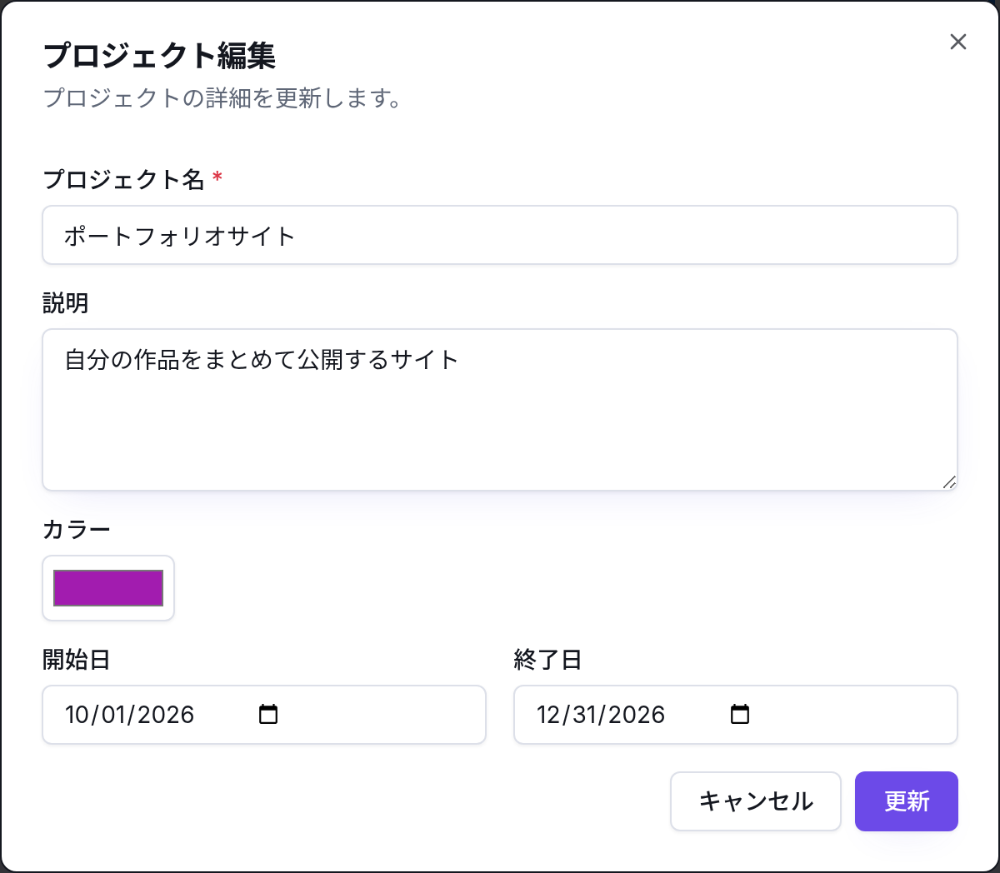
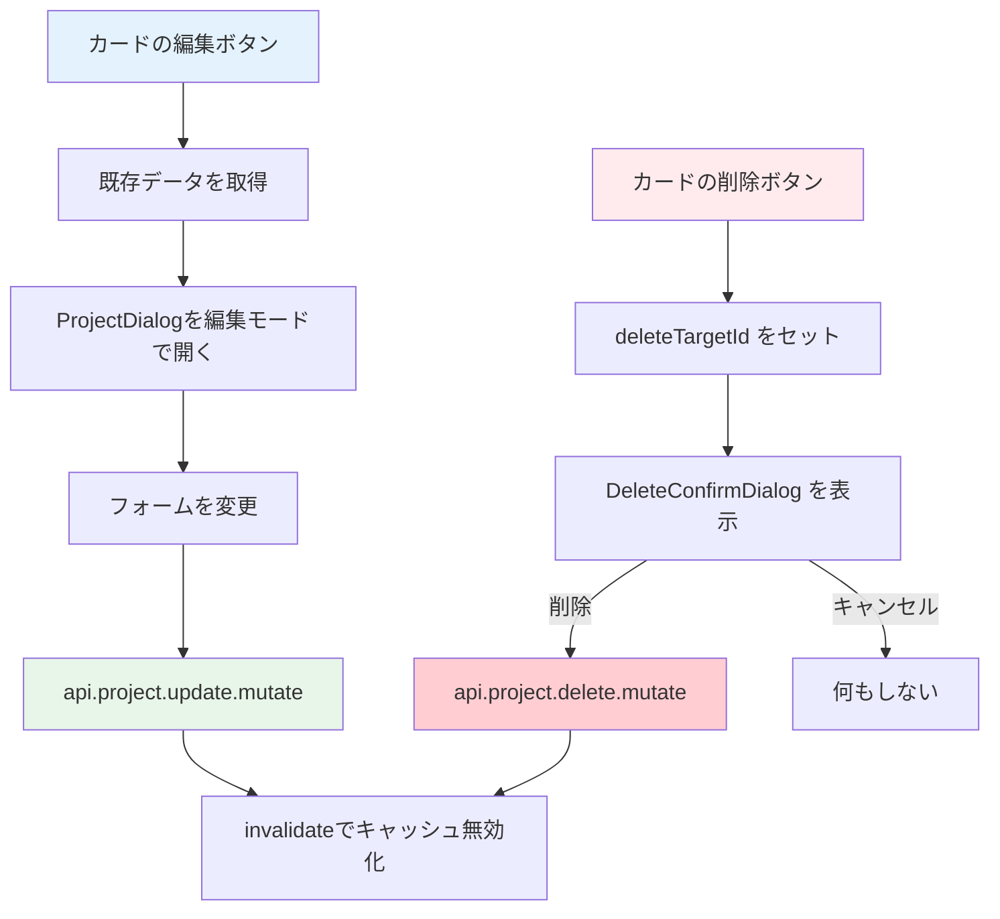
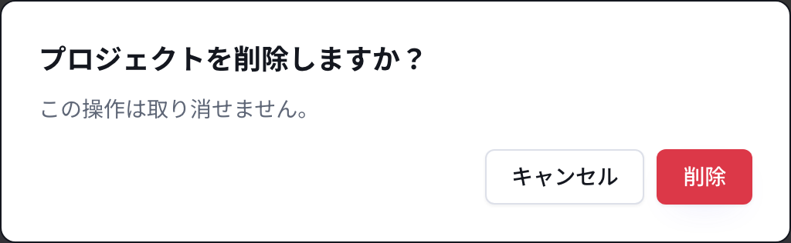
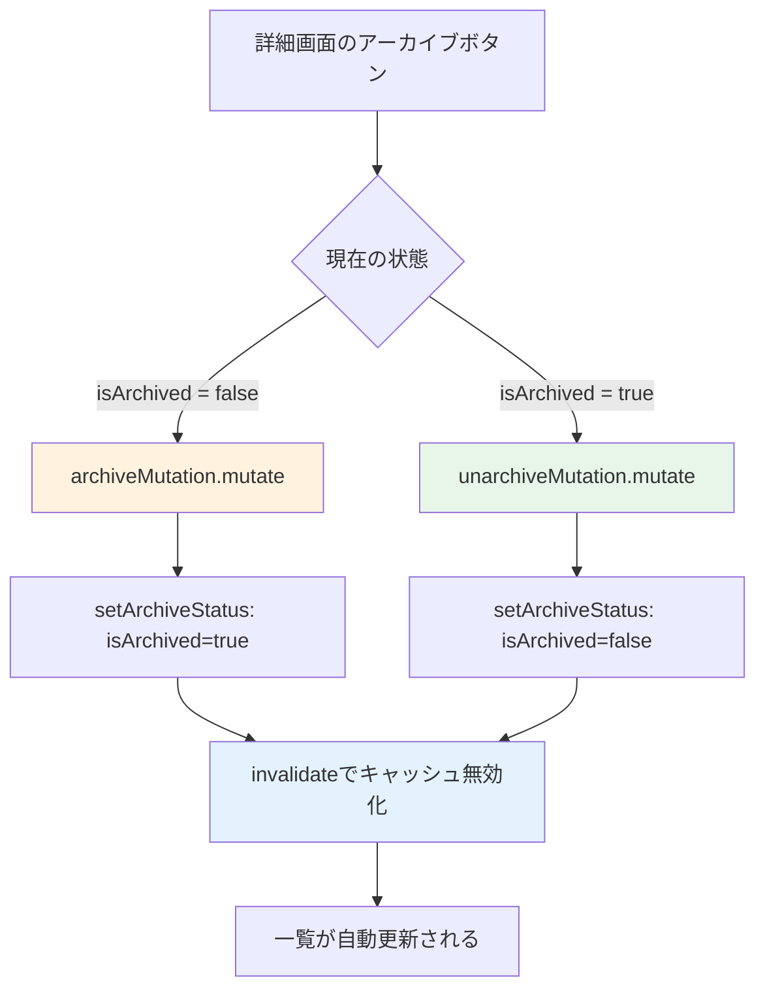
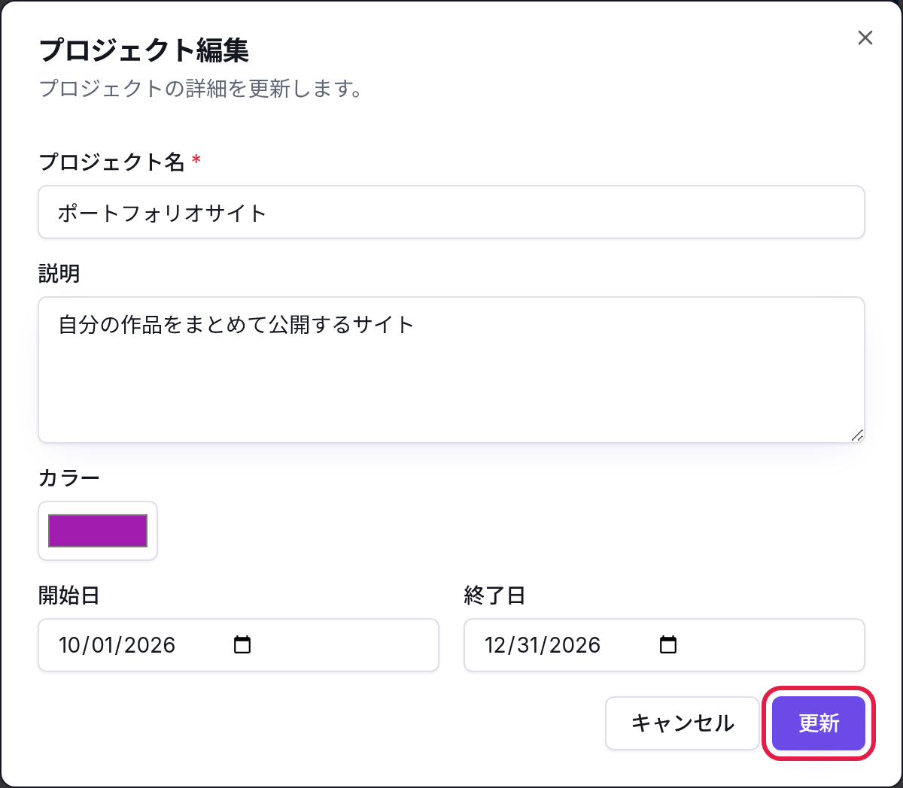
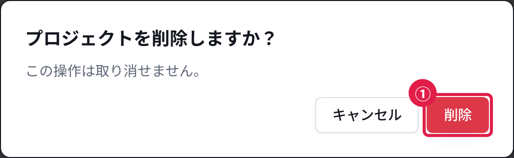

# Day 11: プロジェクト編集・削除を実装しよう

## 前回の振り返り

Day 10 では react-hook-form・zod・tRPC の `useMutation`（データ変更API呼び出しのフック）を組み合わせてダイアログ形式のプロジェクト新規作成機能を実装しました。CRUD（作成 Create・読み取り Read・更新 Update・削除 Delete の4操作をまとめた呼び名）の「Create」ができたので今日は「Update」と「Delete」に進みます。

---

## 今日のゴール

Day 10 で作った ProjectDialog を「編集モード」で再利用してプロジェクトの更新と削除を実装します。既存データをフォームに反映する方法と削除前の確認ダイアログも学びます。

この日はまずサーバー側に `update` / `delete` / `archive` / `unarchive` と詳細取得用の `getById` の5つを自分で書きます。そのあと編集・削除・アーカイブと詳細画面の表示をつなぎます。

スクリーンショット: 今日の最後に目指す編集モードの表示です。まだ自分の画面には出せません。



## なぜこれを作るのか

Day 10 で「プロジェクト作成」ができるようになりました。名前の間違いを直したいときや不要になったプロジェクトを整理したいときには編集と削除の機能が必要です。

今日は「編集」と「削除」を追加します。今日の作業が終わるとプロジェクトの作成・編集・削除・アーカイブという一連の管理操作がすべて揃います。

> **例え話**: Day 10 で作ったダイアログは「万能な注文用紙」です。新規注文にも注文変更にも使えます。変更時は元の内容を用紙に書いておくだけです。このように1つのコンポーネントで両方に対応する設計を「再利用性の高い設計」と言います。

### 編集・削除の処理フロー


```mermaid
flowchart TD
    A[カードの編集ボタン] --> B[既存データを取得]
    B --> C[ProjectDialogを編集モードで開く]
    C --> D[フォームを変更]
    D --> E[api.project.update.mutate]
    E --> F[invalidateでキャッシュ無効化]

    G[カードの削除ボタン] --> H[deleteTargetId をセット]
    H --> I[DeleteConfirmDialog を表示]
    I -->|削除| J[api.project.delete.mutate]
    I -->|キャンセル| K[何もしない]
    J --> F

    style A fill:#e3f2fd
    style E fill:#e8f5e9
    style G fill:#ffebee
    style J fill:#ffcdd2
```

図には道が2本あります。上の編集ボタンはダイアログを開きます。サーバーを呼ぶのは保存ボタンを押した後です。下の削除ボタンは `deleteSession.current.target` に「どれを消すか」を控えます。サーバーを呼ぶのは確認ダイアログの「削除」を押した後です。

削除前の確認は押し間違いを防ぐためです。編集なら名前を書き直せば元の状態に戻せます。削除済みのプロジェクトを戻す機能はありません。

Day 09 ではプロジェクト一覧を作りました。今日は編集と削除の後で一覧を更新する処理を追加します。

編集と削除の最後に `invalidate` を呼んでキャッシュを無効にすると一覧に変更が反映されます。

### やること / やらないこと

| やること | やらないこと |
|---------|-------------|
| 編集ダイアログに既存データを渡す | 新しい編集ページを作る |
| `api.project.update` で更新 | フォームの作り直し |
| `DeleteConfirmDialog` で削除確認 | `window.confirm()` の使用 |
| キャッシュ無効化で一覧更新 | 手動リロード |
| アーカイブ mutation の実装 | アーカイブUIの詳細カスタマイズ |

## 新しく学ぶ概念

| 概念 | 説明 |
|------|------|
| 編集モード（Edit Mode） | 1つのフォームコンポーネントを新規作成と更新の両方に使い回す設計パターン |
| initialData | コンポーネントに既存データを渡して初期値として表示する props |
| キャッシュ無効化（invalidate） | 更新・削除後に tRPC のキャッシュを破棄して最新データを再取得させる処理 |
| アーカイブ | データを削除せずに非表示にする方法。復元が可能 |

> 「楽観的更新（Optimistic Update）」という手法もあります。今回は使いません。楽観的更新はサーバーの応答を待たず先にUIを更新して失敗したらロールバックする高度な手法です。今回はよりシンプルな `invalidate()`（キャッシュ無効化）で一覧を更新します。

### 今日の作業ファイル

```
src/
├── app/
│   └── project/
│       └── page.tsx          ← 編集・削除・アーカイブの処理
├── lib/
│   └── query-error.ts        ← 取得エラーと再試行の判定
├── component/
│   └── ui/
│       └── delete-confirm-dialog.tsx  ← 削除確認ダイアログ
└── server/
    └── api/
        └── routers/
            └── project.ts    ← Step 0 で手続きを5本追加
```

今日コードを書き足すのは `project.ts` と `page.tsx` の2つです。配布済みの `query-error.ts` は、掲載した抜粋と照合します。`delete-confirm-dialog.tsx` は配布済みです。中身には手を入れません。

作業はサーバー側の `project.ts` から始めます。カードの編集ボタンはプロジェクトの OWNER と ADMIN、削除ボタンは OWNER の画面に表示します。APIでも操作する権限を確認してから画面をつなぎます。ボタンを隠しても、APIを直接呼び出す操作は防げないためです。

開発サーバーは前の Day から動かしたまま使います。止めてあるときは `npm run dev` で起動してから `http://localhost:3000` を開きます。

## 実装ステップ一覧

| ステップ | 作業内容 | 読む時間の目安 |
|---------|---------|---------|
| Step 0 | project.ts に update/delete/archive/unarchive/getById を自分で書く | 25分 |
| Step 1 | インポートと編集ボタンのハンドラーを作る | 18分 |
| Step 2 | 削除の state と mutation を実装する | 5分 |
| Step 3 | 送信ハンドラーを作る | 10分 |
| Step 4 | ProjectDialog を配置する | 5分 |
| Step 5 | DeleteConfirmDialog を配置する | 5分 |
| Step 6 | 削除 vs アーカイブの違いを理解する | 5分 |
| Step 7 | アーカイブ mutation を定義する | 5分 |
| Step 8 | アーカイブハンドラーを作る | 3分 |
| Step 9 | 詳細の取得状態とエラー表示を実装する | 18分 |
| Step 10 | 動作確認 | 7分 |

**読む時間の合計（仮）**: 約106分です。

表と各 Step に記した時間は、説明とコードを読む時間の仮の目安です。実測した値ではありません。コードの入力、動作確認、ダウンロードや起動の待ち時間、調べものには別に時間を取ってください。

---

### Step 0: project.ts に update/delete/archive/unarchive/getById を自分で書く（読む目安: 25分）

**ゴール**: プロジェクトの更新・削除・アーカイブ・アーカイブ解除・詳細取得の5つの手続きを追加します。`api.project.update` / `api.project.delete` / `api.project.archive` / `api.project.unarchive` / `api.project.getById` を呼べる状態にします。

#### 0-1. update（ロック後の現在の権限で更新する）

更新とメンバー降格が同時に来た場合、先に読んだ権限だけで保存すると降格後にも更新できる時間差が残ります。Day 12 のメンバー変更と同じ project 行をロックし、ロック後の所属と権限で判断します。

`Prisma.sql` を実行時に使うため、ファイル先頭の型専用 import は値の import にします。Day 12 で初めて直すのでは遅く、今日の update と delete を書く前に必要です。

```typescript
// filepath: src/server/api/routers/project.ts（import群を修正）
import { Prisma } from '@prisma/client';
```

この import は型だけでなく `Prisma.sql` という値も読み込みます。`import type` のままでは、次の行ロック用 SQL を実行できません。

Day 10 のルーターには、権限確認の import と更新入力の schema（API が受け取る値の形）がまだありません。`update` より前へ順に追加します。

```typescript
// filepath: src/server/api/routers/project.ts（import群に追加）
import { assertMemberPermission }
  from './_helpers/permission';
```

`assertMemberPermission` はロック後に読み直した所属へ権限表を適用します。画面のボタン表示だけでは API の直接呼び出しを止められないため、サーバーでも確認します。

```typescript
// filepath: src/server/api/routers/project.ts
const projectUpdateSchema = z.object({
  id: z.string().cuid(),
  name: z.string().min(1).optional(),
  description: z.string().optional().nullable(),
  color: z
    .string()
    .regex(/^#[0-9A-F]{6}$/i)
    .optional(),
  isArchived: z.boolean().optional(),
  startDate: z.string().datetime().optional().nullable(),
  endDate: z.string().datetime().optional().nullable(),
});
```

この区切りは、更新入力で受け取る項目と `optional`・`nullable` の違いを定義する部分です。全 1 区切りのうち 1 番目なので、前後を入れ替えず同じファイルへ続けてください。

`optional` はその項目を送らず変更しない場合を許します。`nullable` は説明や日付を空へ戻す `null` も許します。schema は `export const projectRouter` の外側、`update` より前に置きます。 日付のどちらかを変更するときは、ロック後に読み直したもう一方の日付と比較します。日付を送らない名前だけの更新は、保存済み期間の順序では止めません。

`update` は `export const projectRouter = createTRPCRouter({ ... })` の内側へ追加します。Day 10 の `create` を閉じる `}),` の直後、ルーター末尾の `});` より前に置いてください。

```typescript
// filepath: src/server/api/routers/project.ts
  update: protectedProcedure.input(projectUpdateSchema).mutation(async ({ ctx, input }) => {
    const { id, ...data } = input;

    return await prisma.$transaction(async (tx) => {
      // メンバーの降格・削除と同じ行を先にロックして、更新直前の権限を判定する。
      await tx.$queryRaw<Array<{ id: string }>>(
        Prisma.sql`SELECT "id" FROM "projects" WHERE "id" = ${id} FOR UPDATE`,
      );
      const project = await tx.project.findUnique({
        where: { id },
        include: {
          members: {
            where: { userId: ctx.session.userId },
          },
        },
      });

      if (!project) {
        throw new TRPCError({
          code: 'NOT_FOUND',
```

この区切りは、プロジェクト更新をトランザクションへ入れ、対象 ID と変更項目を分ける部分です。全 4 区切りのうち 1 番目なので、前後を入れ替えず同じファイルへ続けてください。

```typescript
// filepath: src/server/api/routers/project.ts（同じファイルの続き）
          message: 'プロジェクトが見つかりません',
        });
      }

      assertMemberPermission(project.members, 'canManageMembers');

      const updateData: Prisma.ProjectUpdateInput = {};
      if (data.name !== undefined) {
        updateData.name = data.name;
      }
      if (data.description !== undefined) {
        updateData.description = data.description;
      }
      if (data.color !== undefined) {
        updateData.color = data.color;
      }
      if (data.isArchived !== undefined) {
        assertMemberPermission(project.members, 'canArchive');
        updateData.isArchived = data.isArchived;
      }
```

この区切りは、送られた項目だけを更新データへ移し、アーカイブ権限も分けて確かめる部分です。全 4 区切りのうち 2 番目なので、前後を入れ替えず同じファイルへ続けてください。

```typescript
// filepath: src/server/api/routers/project.ts（同じファイルの続き）
      const startDate =
        data.startDate === undefined
          ? project.startDate
          : data.startDate
            ? new Date(data.startDate)
            : null;
      const endDate =
        data.endDate === undefined ? project.endDate : data.endDate ? new Date(data.endDate) : null;
      if (data.startDate !== undefined || data.endDate !== undefined) {
        assertProjectDateOrder(startDate, endDate);
      }
      if (data.startDate !== undefined) {
        updateData.startDate = startDate;
      }
      if (data.endDate !== undefined) {
        updateData.endDate = endDate;
      }

```

片方の日付だけが送られた場合も、保存済みのもう片方と比較します。日付が送られていなければ検査を追加しないため、名前だけの変更は従来どおり保存できます。確認が済んだら、更新する処理を続けます。

```typescript
// filepath: src/server/api/routers/project.ts（同じファイルの続き）
      return await tx.project.update({
        where: { id },
        data: updateData,
        include: {
          members: {
            include: {
              user: {
                select: USER_SELECT,
              },
            },
          },
        },
      });
```

日付は未指定なら触らず、`null` なら消し、文字列なら `Date` へ変換します。同じトランザクションでプロジェクトを更新し、メンバーの表示情報も返します。全 4 区切りのうち 3 番目なので、前後を入れ替えず同じファイルへ続けてください。

```typescript
// filepath: src/server/api/routers/project.ts（同じファイルの続き）
    });
  }),
```

この2行で、`$transaction` に渡した関数と `update` の手続きを閉じます。権限確認と保存は前の3区切りで書きました。全 4 区切りのうち 4 番目なので、前後を入れ替えず同じファイルへ続けてください。

更新データの組み立てだけをトランザクション外へ出しません。権限を読み直した後、そのまま `tx.project.update` まで進むため、途中の降格を古い権限で追い越さない形になります。

#### 0-2. delete（ロック後も OWNER の場合だけ削除する）

削除も「最初に OWNER だった」だけでは足りません。project 行をロックした後で現在の membership を読み直し、OWNER のままなら同じトランザクションで削除します。`delete` は今追加した `update` を閉じる `}),` の直後へ続け、ルーター末尾の `});` より前に置いてください。

```typescript
// filepath: src/server/api/routers/project.ts
  delete: protectedProcedure
    .input(z.object({ id: z.string().cuid() }))
    .mutation(async ({ ctx, input }) => {
      await prisma.$transaction(async (tx) => {
        // 降格が先に確定した場合に古いOWNER権限で削除しないよう、
        // メンバー変更と同じプロジェクト行を先にロックする。
        const projects = await tx.$queryRaw<Array<{ id: string }>>(
          Prisma.sql`SELECT "id" FROM "projects" WHERE "id" = ${input.id} FOR UPDATE`,
        );
        if (projects.length === 0) {
          throw new TRPCError({
            code: 'NOT_FOUND',
            message: 'プロジェクトが見つかりません',
          });
        }
        const currentMember = await tx.projectMember.findUnique({
          where: {
            userId_projectId: { userId: ctx.session.userId, projectId: input.id },
          },
          select: { role: true },
```

この区切りは、削除対象のプロジェクト行を先にロックし、存在を確かめる部分です。全 2 区切りのうち 1 番目なので、前後を入れ替えず同じファイルへ続けてください。

```typescript
// filepath: src/server/api/routers/project.ts（同じファイルの続き）
        });
        // canDeleteはADMINのタスク削除も含むため、プロジェクトはOWNERだけに限る。
        if (!currentMember || currentMember.role !== PROJECT_MEMBER_ROLE.OWNER) {
          throw new TRPCError({
            code: 'FORBIDDEN',
            message: 'この操作を実行する権限がありません',
          });
        }
        await tx.project.delete({ where: { id: input.id } });
      });
      return { success: true };
    }),
```

この区切りは、ロック後の現在のロールを読み、OWNER だけにプロジェクト削除を許す部分です。全 2 区切りのうち 2 番目なので、前後を入れ替えず同じファイルへ続けてください。

`canDelete` はタスク削除を許す ADMIN にも付いています。プロジェクト自体の削除は現在の `PROJECT_MEMBER_ROLE.OWNER` と直接比較します。

#### 0-3. archive / unarchive（同じ処理をヘルパー関数にまとめる）

アーカイブとアーカイブ解除は「`isArchived` を true にするか false にするか」の違いしかありません。同じ処理を2回書かずに共通のヘルパー関数にまとめます。`project.ts` の `projectUpdateSchema` の直後に追加します。`export const projectRouter` より前に置いてください。

```typescript
// filepath: src/server/api/routers/project.ts
const setArchiveStatus = async (userId: string, projectId: string, isArchived: boolean) => {
  return await prisma.$transaction(async (tx) => {
    // メンバー変更と同じ行を先にロックし、待機中に確定した現在の権限を確認する。
    await tx.$queryRaw(
      Prisma.sql`SELECT "id" FROM "projects"
        WHERE "id" = ${projectId}
        FOR UPDATE`,
    );
    const userMember = await tx.projectMember.findUnique({
      where: {
        userId_projectId: { userId, projectId },
      },
    });

    assertMemberPermission(userMember ? [userMember] : [], 'canArchive');

    return await tx.project.update({
      where: { id: projectId },
      data: { isArchived },
    });
  });
};
```

この区切りは、ロックと現在の権限を保った同じトランザクションで更新を確定する部分です。全 1 区切りのうち 1 番目なので、前後を入れ替えず同じファイルへ続けてください。

`isArchived` を引数で受け取ります。トランザクションを使うだけでは、処理の順番が決まりません。Day 12 のメンバー変更と同じ project 行を先にロックし、その後で現在の所属と `canArchive` を読み直してから値を書き込みます。呼び出す側が `true` を渡せばアーカイブになります。`false` を渡せば解除になります。`delete` の下にこの関数を呼ぶ2つの手続きを追加します。このブロックだけは最後の `});` を含みます。ファイルの一番下にある `});` の1行を先に消してからその場所へ貼ってください。

```typescript
// filepath: src/server/api/routers/project.ts（続き）
  archive: protectedProcedure
    .input(z.object({ id: z.string().cuid() }))
    .mutation(async ({ ctx, input }) => {
      return await setArchiveStatus(ctx.session.userId, input.id, true);
    }),

  unarchive: protectedProcedure
    .input(z.object({ id: z.string().cuid() }))
    .mutation(async ({ ctx, input }) => {
      return await setArchiveStatus(ctx.session.userId, input.id, false);
    }),
});
```

`archive` は `true` を渡します。`unarchive` は `false` を渡します。どちらも処理は同じ関数に任せています。同じロジックを2か所に書き写すと片方だけ直して片方を直し忘れるバグが起きやすくなります。関数にまとめておくと権限チェックのルールを直すときも1か所を直すだけで済みます。最後の `});` で `projectRouter` 全体を閉じます。

#### 0-4. getById（1件だけ取得する）

Step 9 で詳細画面を出すときに使う「1件だけ取得する」手続きを先に用意します。`getAll` は複数件を `findMany` で取っていましたが`getById` は1件だけを `findUnique` で取ります。`unarchive` を書いたときと同じ要領で、ファイルの一番下にある `});` の1行を先に消してからその場所へ貼ってください。

```typescript
// filepath: src/server/api/routers/project.ts（続き）
  getById: protectedProcedure
    .input(z.object({ id: z.string().cuid() }))
    .query(async ({ ctx, input }) => {
      const project = await prisma.project.findUnique({
        where: { id: input.id },
        include: {
          members: {
            include: {
              user: {
                select: { ...USER_SELECT, role: true },
              },
            },
          },
          tasks: {
            include: {
              assignee: {
                select: USER_SELECT,
              },
            },
            orderBy: [{ position: 'asc' }, { createdAt: 'desc' }],
          },
        },
      });
```

先頭の `protectedProcedure` に `.mutation` ではなく `.query`（読み取り用の手続き）をつなげています。データを書き換えないので読み取り専用の入口で十分です。`include` に `members` と `tasks` を並べているのは詳細画面がこの2つを同じ画面に出すからです。別々のAPIで取ると通信が2回になり、片方だけ古い内容のまま表示される瞬間ができます。`tasks` の中の `assignee`（担当者）も一緒に取るのは、詳細画面がタスクの担当者名を表示するためです。

続けて見つからなかったときのチェックです。

```typescript
// filepath: src/server/api/routers/project.ts（続き）
      if (!project) {
        throw new TRPCError({
          code: 'NOT_FOUND',
          message: 'プロジェクトが見つかりません',
        });
      }
```

`getAll` は一覧なので「見つからない」というケースがありませんでした。`getById` は違います。指定した `id` のプロジェクトは存在しないこともあるため`NOT_FOUND` チェックが必要です。

続けて権限チェックと戻り値です。`ctx.session`（サーバーが持つログイン情報）にはいまログインしているユーザーの `userId` が入っています。

```typescript
// filepath: src/server/api/routers/project.ts（続き）
      assertMemberPermission(
        project.members.filter((m) => m.userId === ctx.session.userId),
        'canView',
      );

      return project;
    }),
});
```

`getAll` では `where` で「自分がメンバーのものだけ」を絞り込んでいましたが`getById` は先にプロジェクトを取得してから、取得した `members` の中に自分がいるかを `filter` で確認しています。他人のプロジェクトの `id` を直接指定されてもメンバーでなければ `canView` の権限チェックで弾かれます。最後の `});` で再び `projectRouter` 全体を閉じます。

#### 今日書いた4つの操作群で使う権限チェック

Step 0 では4つの操作群に権限チェックを入れました。表にすると選び方が見えます。

| 操作 | 権限チェックの書き方・選んだ理由 |
|------|----------------------------------|
| `update` | **権限チェックの書き方**: `assertMemberPermission(..., 'canManageMembers')`<br>**選んだ理由**: 権限名を指定して共通の判定関数を使う |
| `delete` | **権限チェックの書き方**: `role !== PROJECT_MEMBER_ROLE.OWNER` を直接比較<br>**選んだ理由**: ADMIN にも付与された `canDelete` では OWNER 限定の条件を表せないため |
| `archive` / `unarchive` | **権限チェックの書き方**: `setArchiveStatus` にまとめて`assertMemberPermission(..., 'canArchive')`を1か所に<br>**選んだ理由**: まったく同じ処理を2つの手続きが呼ぶので関数化して重複を消す |
| `getById` | **権限チェックの書き方**: `assertMemberPermission(..., 'canView')`<br>**選んだ理由**: URLへ他人のプロジェクトIDを直接入れられても、メンバーでなければ詳細を返さないため |

権限名で条件を表せる操作には `assertMemberPermission` を使います。プロジェクト削除は OWNER かどうかを直接比較します。同じ処理を2手続き以上が呼ぶ場合は関数にまとめます。この判断は Day 12 の `addMember` / `removeMember` でも使います。

**確認ポイント**:
- `projectUpdateSchema` と `update` / `delete` / `setArchiveStatus` / `archive` / `unarchive` / `getById` を追加しました。
- `delete` の権限チェックが `assertMemberPermission` ではなく `role !== PROJECT_MEMBER_ROLE.OWNER` の直接比較になっています。
- `npx tsc --noEmit` で型エラーが出ていません。

---

### Step 1: インポートと編集ボタンのハンドラーを作る（読む目安: 18分）

**ゴール**: 編集対象とダイアログを開いた回を記録し、遅れた応答で新しい入力を消さないようにします。

Day 10 の `src/app/project/page.tsx` を開きます。以下のコードは同名の宣言があればその宣言全体を置き換え、無ければ指定位置へ追加します。Step 9 までの途中では未定義の名前が残ります。画面の動作確認は Step 10 で行います。

`src/lib/project-write-error.ts` と `src/lib/query-error.ts` は Day 10 で確認した配布ファイルを使います。今日は `ProjectWriteOperation`（表示する操作名の型）も取り込みます。

既存の import 群と `shouldRetryProjectQuery` を次の内容へそろえてください。重複した import は残しません。

```typescript
// filepath: src/app/project/page.tsx
'use client';

import { Plus } from 'lucide-react';
import {
  useRouter, useSearchParams,
} from 'next/navigation';
import {
  Suspense, useEffect, useRef, useState,
} from 'react';
import { AppLayout }
  from '@/component/layout/app-layout';
import { ProjectCard }
  from '@/component/project/project-card';
import { ProjectDetailView } from
  '@/component/project/project-detail-view';
import {
  ProjectDialog,
  type ProjectFormData,
} from
  '@/component/project/project-dialog';
import { Button }
  from '@/component/ui/button';
import { DeleteConfirmDialog }
```

一覧の部品に加え、詳細表示と削除確認の部品を取り込みます。既存の import を置き換えて1つにそろえることで、同じ名前を二重に宣言するエラーを防ぎます。

```typescript
// filepath: src/app/project/page.tsx
  from '@/component/ui/delete-confirm-dialog';
import { Label } from '@/component/ui/label';
import { PageLoadingSpinner } from '@/component/ui/loading-spinner';
import { Switch } from '@/component/ui/switch';
import { hasPermission, isProjectMemberRole,
  PROJECT_MEMBER_ROLE } from '@/lib/constant/roles';
import { TASK_STATUS }
  from '@/lib/constant/status';
import {
  dateOnlyFromValue,
  dateOnlyToUtcStartIso,
} from '@/lib/date';
import {
  httpStatusOf,
  isAuthError,
  isForbiddenError,
  shouldRetryQuery,
} from '@/lib/query-error';
import { api } from '@/trpc/react';

const shouldRetryProjectQuery = (
  failureCount: number,
```

表示用と保存用の日付変換を両方取り込みます。読み取りエラーの判定も共通関数へそろえるため、一覧と詳細でログイン切れの扱いや再試行の条件が食い違いません。

```typescript
// filepath: src/app/project/page.tsx
  error: unknown,
) => httpStatusOf(error) !== 404
  && shouldRetryQuery(failureCount, error);
import toast from 'react-hot-toast';
import { classifyProjectWriteError, type ProjectWriteOperation } from '@/lib/project-write-error';
```

`useSearchParams` は表示対象を URL から読み、`useRouter` は移動先を書き換えます。エラー判定の関数を取り込むため、メッセージの文字列に頼らず認証切れを区別できます。

`ProjectPageContent` の先頭から `utils = api.useUtils()` の直前までにある state と ref の宣言を、次の順に置き換えます。Day 10 の `projects` の取得処理がこの範囲にあれば、Step 9 で書き直すためいったん取り除きます。

```typescript
// filepath: src/app/project/page.tsx
const [dialogOpen, setDialogOpen] = useState(false);
const [editingProject, setEditingProject] = useState<ProjectFormData | undefined>(undefined);
const [showArchived, setShowArchived] = useState(false);
const [deleteDialogOpen, setDeleteDialogOpen] = useState(false);
const searchParams = useSearchParams();
const projectIdParam = searchParams.get('projectId');
const selectedProject = projectIdParam;
const router = useRouter();
const previousProject = useRef(selectedProject);
const viewRef = useRef(selectedProject);
useEffect(() => {
    viewRef.current = selectedProject;
  }, [selectedProject]);
const authExpiredRef = useRef(false);
const [authExpired, setAuthExpired] = useState(false);
const formSession = useRef({ generation: 0, target: null as string | null });
const deleteSession = useRef({ generation: 0, target: null as string | null });
const notifiedWriteErrors = useRef(new Set<unknown>());
const formSubmitting = useRef(false);
const deleteSubmitting = useRef(false);
```

`ref` は再描画を待たずに読む記録です。`generation`（世代番号）はダイアログを開閉するたびに増やします。同じプロジェクトを開き直しても番号が変わるため、古い成功応答と区別できます。`target` には対象の ID を覚えます。

`viewRef` は画面へ反映された ID を effect で記録します。React が表示準備だけして取りやめた画面の ID を記録しないためです。`authExpiredRef` は通信の callback からすぐ読む値、`authExpired` は表示を切り替える値です。

続けて、開閉と URL 変更時の処理を書きます。Day 10 の `closeProjectDialog` は置き換え、残りをその下へ追加します。

```typescript
// filepath: src/app/project/page.tsx
const closeProjectDialog = () => {
    formSession.current = { generation: formSession.current.generation + 1, target: null };
    setDialogOpen(false);
  };
```

閉じたフォームの成功が後から届いても、新しく開いたフォームには適用しません。その区別を ID だけに頼ると同じプロジェクトを開き直した場合を見分けられないため、世代も進めます。

```typescript
// filepath: src/app/project/page.tsx
const closeDeleteDialog = () => {
    deleteSession.current = { generation: deleteSession.current.generation + 1, target: null };
    setDeleteDialogOpen(false);
  };
```

削除の確認も開閉した回を記録します。送信後にキャンセルして同じ対象をもう一度開いた場合、前の成功で新しい確認画面が消えることを世代の比較で防ぎます。

```typescript
// filepath: src/app/project/page.tsx
useEffect(() => {
    if (previousProject.current === selectedProject) return;
    previousProject.current = selectedProject;
    formSession.current = { generation: formSession.current.generation + 1, target: null };
    deleteSession.current = { generation: deleteSession.current.generation + 1, target: null };
    setDialogOpen(false);
    setDeleteDialogOpen(false);
  }, [selectedProject]);
```

URL の対象 ID が変わったときは、開いているフォームと削除確認を閉じます。対象を切り替える前の応答で、切り替え後のダイアログを閉じないため、両方の世代も進めます。

`utils = api.useUtils()` は1つだけ残します。その直後の `refreshProject` を置き換え、続けて `reportWriteError` と `leaveSubmittedDetail` を追加します。

```typescript
// filepath: src/app/project/page.tsx
const refreshProject = async (projectId?: string) => {
    // 認証切れの後に届いた成功はキャッシュだけを無効にし、再通信しません。
    const filters = {
      refetchType: authExpiredRef.current ? ('none' as const) : ('active' as const),
    };
    try {
      const updates = [utils.project.getAll.invalidate(undefined, filters)];
      if (projectId) {
        updates.push(utils.project.getById.invalidate({ id: projectId }, filters));
      }
      await Promise.all(updates);
    } catch (error) {
      // 表示更新の失敗を、書き込みの失敗として通知しないためです。
      console.error('プロジェクトの表示更新に失敗しました。', error);
      if (!authExpiredRef.current)
        toast.error(('最新の表示を取得できませんでした。' +
          '再表示して' +
          '操作結果を確認してください。'));
    }
  };
```

一覧と送信対象の詳細を取り直します。認証切れのあとは `refetchType: 'none'` で通信を始めず、キャッシュが古いことだけを記録します。

```typescript
// filepath: src/app/project/page.tsx
const reportWriteError = (
    error: unknown,
    operation: ProjectWriteOperation,
    projectId?: string,
  ) => {
    if (['create', 'update', 'delete'].includes(operation)) {
      notifiedWriteErrors.current.add(error);
    }
    const result = classifyProjectWriteError(error, operation);
    if (result.kind === 'auth') {
      authExpiredRef.current = true;
      setAuthExpired(true);
      return;
    }
    toast.error(result.message);
    refreshProject(projectId);
  };
```

エラー表示をこの関数へ集めます。401だけが認証切れを固定します。書き込みの403では表示中の詳細を隠さず、取り直した結果で閲覧可否を判断します。

```typescript
// filepath: src/app/project/page.tsx
const leaveSubmittedDetail = (projectId: string) => {
    if (authExpiredRef.current || viewRef.current !== projectId) return;
    try {
      router.push('/project');
    } catch (error) {
      console.error('プロジェクト一覧への移動に失敗しました。', error);
      toast.error('一覧へ移動できませんでした。再表示して操作結果を確認してください。');
    }
  };
```

操作中に別のプロジェクトへ移った場合は移動しません。成功した ID と現在の表示対象が一致するときだけ一覧へ戻します。

`notifiedWriteErrors` は Set（同じ値を重複して入れない集合）です。表示処理を通ったエラーを記録し、送信側ではそのエラーだけを受け止めます。

最後に `handleEdit` を次の内容へ置き換えます。

```typescript
// filepath: src/app/project/page.tsx
const handleEdit = (projectId: string) => {
    const project = projects?.find((p) => p.id === projectId);
    if (project && !authExpiredRef.current) {
      formSession.current = { generation: formSession.current.generation + 1, target: projectId };
      const startDate = project.startDate ? dateOnlyFromValue(project.startDate) : undefined;
      const endDate = project.endDate ? dateOnlyFromValue(project.endDate) : undefined;

      setEditingProject({
        id: project.id,
        name: project.name,
        description: project.description || '',
        color: project.color,
        ...(startDate && { startDate }),
        ...(endDate && { endDate }),
      });
      setDialogOpen(true);
    }
  };
```

編集ボタンを押した時点の一覧データをフォームへ写します。日付だけの形式へ戻してから渡すため、保存済みの日時文字列を渡して日付欄が空白になることを防ぎます。

保存済みの日付を入力欄用に変換し、編集対象の ID と新しい世代を記録します。

**確認ポイント**:
- `formSession` と `deleteSession` に世代と対象 ID があります。
- 401を記録する ref と state があり、falseへ戻す処理を追加していません。
- `handleEdit` が既存データと ID を `editingProject` へ渡します。

---

### Step 2: 削除の state と mutation を実装する（読む目安: 5分）

**ゴール**: 削除開始前に対象を記録し、応答では送信した ID のデータを更新します。

削除の state は Step 1 で追加しました。`createMutation` の直下に次の `deleteMutation` を追加します。

```typescript
// filepath: src/app/project/page.tsx
const deleteMutation = api.project.delete.useMutation({
    retry: false,
    onSuccess: (_data, variables) => {
      refreshProject(variables.id);
      leaveSubmittedDetail(variables.id);
    },
    onError: (error, variables) => reportWriteError(error, 'delete', variables.id),
  });
```

`variables.id` は送信時の ID です。応答時の URL で対象を選ぶと、待っている間に移動した別のプロジェクトを取り直してしまいます。

既存の `handleDelete` は次の宣言へ置き換えます。

```typescript
// filepath: src/app/project/page.tsx
const handleDelete = (projectId: string) => {
    if (authExpiredRef.current) return;
    deleteSession.current = { generation: deleteSession.current.generation + 1, target: projectId };
    setDeleteDialogOpen(true);
  };
```

ここでは削除対象を控えて確認画面を出します。保存手続きを呼ぶのは確認後の別ハンドラーなので、カードのゴミ箱を押しただけでデータが消えることはありません。

ここでは削除せず、確認ダイアログを開くだけです。Day 10 の受け皿が残っていないか確認してください。

**確認ポイント**:
- `deleteMutation` が送信時の ID を使っています。
- `handleDelete` は ID と世代を記録してダイアログを開きます。

---

### Step 3: 送信ハンドラーを作る（読む目安: 10分）

**ゴール**: 作成と編集を分け、成功した送信と開いたままのダイアログが対応するときだけ閉じます。

Day 10 の `createMutation` を置き換え、その直後へ `updateMutation` を追加します。

```typescript
// filepath: src/app/project/page.tsx
const createMutation = api.project.create.useMutation({
    retry: false,
    onSuccess: () => {
      refreshProject();
    },
    onError: (error) => reportWriteError(error, 'create'),
  });
```

作成成功では一覧を更新し、フォームを閉じる判断は送信側へ残します。応答待ちの間にフォームを開き直すこともあるため、成功した事実だけでは閉じると決めません。

```typescript
// filepath: src/app/project/page.tsx
const updateMutation = api.project.update.useMutation({
    retry: false,
    onSuccess: (_data, variables) => {
      refreshProject(variables.id);
    },
    onError: (error, variables) => reportWriteError(error, 'update', variables.id),
  });
```

保存結果とダイアログの開閉を分けます。成功でキャッシュを更新し、開閉は送信時の記録と照合できる `handleSubmit` が担当します。

Day 10 の `handleSubmit` 宣言全体を次のコードへ置き換えます。

```typescript
// filepath: src/app/project/page.tsx
const handleSubmit = async (data: ProjectFormData) => {
    if (authExpiredRef.current || formSubmitting.current) return;
    if (!data.id && !currentUser?.id) return;
    const session = { ...formSession.current };
    if (session.target !== (data.id ?? null)) return;
    const payload = {
      name: data.name,
      description: data.description,
      color: data.color,
      startDate: data.startDate ? dateOnlyToUtcStartIso(data.startDate) : undefined,
      endDate: data.endDate ? dateOnlyToUtcStartIso(data.endDate) : undefined,
    };
    formSubmitting.current = true;
    try {
      if (data.id) {
        await updateMutation.mutateAsync({
          ...payload,
          id: data.id,
          description: data.description || null,
          startDate: payload.startDate ?? null,
          endDate: payload.endDate ?? null,
        });
      } else {
```

入力値を送信用に組み立ててから通信を待ちます。編集中に消した説明や日付は null で送り、作成時の空欄には undefined を使うことで、それぞれの入力スキーマに合わせます。

```typescript
// filepath: src/app/project/page.tsx
        await createMutation.mutateAsync(payload);
      }
    } catch (error) {
      if (!notifiedWriteErrors.current.delete(error)) throw error;
      return;
    } finally {
      formSubmitting.current = false;
    }
    if (
      !authExpiredRef.current &&
      formSession.current.generation === session.generation &&
      formSession.current.target === session.target
    ) {
      closeProjectDialog();
      setEditingProject(undefined);
    }
  };
```

`await` は保存の応答を待ちます。`finally` は成功と失敗のどちらでも送信中の記録を解除します。失敗時は入力を残します。閉じて同じ ID を開き直した場合も世代が違うので、前の成功では閉じません。

編集の空欄は `null` で既存値を消します。作成の日付未入力は `undefined` です。作成のスキーマは `null` を受け取らないため、この違いを残します。

**確認ポイント**:
- 日付変換は通信の `try` より前にあります。
- 作成と編集が `data.id` で分かれます。
- 成功後も世代と対象 ID が一致した場合だけ閉じます。

---

### Step 4: ProjectDialog を配置する（読む目安: 5分）

**ゴール**: 作成と編集の両方で、保存中の二重送信を止めます。

`handleCreate` を次の宣言へ置き換えます。

```typescript
// filepath: src/app/project/page.tsx
const handleCreate = () => {
    if (authExpiredRef.current) return;
    formSession.current = { generation: formSession.current.generation + 1, target: null };
    setEditingProject(undefined);
    setDialogOpen(true);
  };
```

編集した直後の新規作成へ、前の ID や名前を持ち込まないためです。

一覧グリッドの直後にある `ProjectDialog` を次のタグへ置き換えます。

```typescript
{/* filepath: src/app/project/page.tsx */}
<ProjectDialog
  open={dialogOpen}
  onClose={closeProjectDialog}
  onSubmit={handleSubmit}
  initialData={editingProject}
  isPending={createMutation.isPending || updateMutation.isPending}
/>
```

`initialData` は編集時の初期値です。`isPending` は作成か更新のどちらかが通信中なら true になります。Day 10 のダイアログ内の ref も、画面が描き直される前の連続送信を止めます。

**確認ポイント**:
- `onClose` が世代を進める `closeProjectDialog` を呼びます。
- `isPending` に作成と更新の両方を含めます。
- 画面上での確認は Step 10 で行います。

---

### Step 5: DeleteConfirmDialog を配置する（読む目安: 5分）

**ゴール**: 削除を拒否されたときに、対象を残したまま理由を表示します。

`handleDelete` の下へ次の `confirmDeleteProject` を追加します。

```typescript
// filepath: src/app/project/page.tsx
const confirmDeleteProject = async () => {
    const session = { ...deleteSession.current };
    if (authExpiredRef.current || deleteSubmitting.current || !session.target) return;
    deleteSubmitting.current = true;
    try {
      await deleteMutation.mutateAsync({ id: session.target });
    } catch (error) {
      if (!notifiedWriteErrors.current.delete(error)) throw error;
      return;
    } finally {
      deleteSubmitting.current = false;
    }
    if (
      !authExpiredRef.current &&
      deleteSession.current.generation === session.generation &&
      deleteSession.current.target === session.target
    )
      closeDeleteDialog();
  };
```

キャンセル後に開き直した確認画面は別の世代です。前の成功で新しい確認画面を閉じません。送信直前に対象 ID があるかも確認します。

一覧側の `</AppLayout>` の直前へ、次のタグを追加します。

```typescript
{/* filepath: src/app/project/page.tsx */}
<DeleteConfirmDialog
  open={deleteDialogOpen}
  onOpenChange={(open) => { if (!open) closeDeleteDialog(); }}
  onConfirm={confirmDeleteProject}
  closeOnConfirm={false}
  isPending={deleteMutation.isPending}
  title="プロジェクトを削除しますか？"
/>
```

`closeOnConfirm={false}` は削除ボタンを押した直後の自動閉じを止めます。配布部品はクリックの既定動作を止め、`confirmDeleteProject` が成功と世代を確認して閉じます。他のページではこの指定を省くと従来の自動閉じになります。

保存待ちでもキャンセルと Escape キーで閉じられます。閉じても送信済みの削除は取り消されません。画面には「削除中...」が出て、削除ボタンの連打を止めます。

削除できるのは OWNER だけです。403では権限の案内を表示します。通信切断や500では削除済みの可能性もあるため、一覧で結果を確認してから必要な場合だけ再実行します。

**確認ポイント**:
- `closeOnConfirm={false}` を指定しました。
- 拒否されたときは確認画面を残します。
- キャンセルしても送信済みの処理は取り消さないと説明できます。



---

### Step 6: 削除 vs アーカイブの違いを理解する（読む目安: 5分）

**ゴール**: データを残して一覧から非表示にする「アーカイブ」と削除の使い分けを学びます。

`archive` / `unarchive` の中身は Step 0 で書きました。ここではコードを追加せずにアーカイブと解除を使う場面を確認します。

#### なぜアーカイブが必要か

終了したプロジェクトを普段の一覧から隠しておきたい場合はアーカイブを使います。このアプリでは削除とアーカイブを次のように区別しています。

| 観点 | 完全削除 | アーカイブ |
|------|---------|-----------|
| データの状態 | DBから消える | DBに残る（`isArchived = true`） |
| アプリからの復元 | 復元機能なし | `isArchived = false` に戻す |
| 用途 | 本当に不要なデータ | 終了したプロジェクト |

> 後からタスクの記録を見返したいプロジェクトはアーカイブしてください。このアプリの「削除」はデータを消す操作です。アーカイブと同じ意味ではありません。

### アーカイブの処理フロー


```mermaid
flowchart TD
    A[詳細画面のアーカイブボタン] --> B{現在の状態}
    B -->|isArchived = false| C[archiveMutation.mutate]
    B -->|isArchived = true| D[unarchiveMutation.mutate]
    C --> E[setArchiveStatus: isArchived=true]
    D --> F[setArchiveStatus: isArchived=false]
    E --> G[invalidateでキャッシュ無効化]
    F --> G
    G --> H[一覧が自動更新される]

    style C fill:#fff3e0
    style D fill:#e8f5e9
    style G fill:#e3f2fd
```

バックエンドでは `setArchiveStatus` ヘルパー関数でアーカイブを処理しています。権限チェック（`canArchive`）も含まれています。Step 0 で書いた `setArchiveStatus` を見比べながら`archive` と `unarchive` がなぜ同じ関数を呼んでいるかを振り返ってください。

**確認ポイント**:
- Step 0 で書いた `setArchiveStatus` を見てアーカイブが `isArchived` フラグで管理されていることを確認しました。
- 権限チェック（`canArchive`）が含まれていることを確認しました。
- `archive` と `unarchive` の2つのルーターがこの関数を呼んでいます。

---

### Step 7: アーカイブ mutation を定義する（読む目安: 5分）

**ゴール**: データを残したまま非表示にし、応答を待つ間に別の詳細へ移ったときはその画面に残ります。

`deleteMutation` の下へ次の2つを追加します。

```typescript
// filepath: src/app/project/page.tsx
const archiveMutation = api.project.archive.useMutation({
    retry: false,
    onSuccess: (_data, variables) => {
      refreshProject(variables.id);
      leaveSubmittedDetail(variables.id);
    },
    onError: (error, variables) => reportWriteError(error, 'archive', variables.id),
  });
```

アーカイブ成功では送信した ID のデータを更新します。応答時に別の詳細を開いていれば移動しないため、今見ているプロジェクトから突然一覧へ戻されることを防ぎます。

```typescript
// filepath: src/app/project/page.tsx
const unarchiveMutation = api.project.unarchive.useMutation({
    retry: false,
    onSuccess: (_data, variables) => {
      refreshProject(variables.id);
      leaveSubmittedDetail(variables.id);
    },
    onError: (error, variables) => reportWriteError(error, 'unarchive', variables.id),
  });
```

どちらも送信時の ID を取り直します。現在の表示対象がその ID と一致する場合だけ一覧へ戻ります。401を観測したあとには、古い成功応答でも自動移動しません。

**確認ポイント**:
- `variables.id` を `refreshProject` と `leaveSubmittedDetail` に渡します。
- `onError` に操作名を渡しています。

---

### Step 8: アーカイブハンドラーを作る（読む目安: 3分）

**ゴール**: 現在のアーカイブ状態で呼び出す手続きを切り替えます。

`handleSubmit` の下へ次のハンドラーを追加します。

```typescript
// filepath: src/app/project/page.tsx
const handleArchive = (projectId: string, isArchived: boolean) => {
    if (authExpiredRef.current) return;
    const mutation = isArchived ? unarchiveMutation : archiveMutation;
    mutation.mutate({ id: projectId });
  };
```

`isArchived` が true なら解除し、false ならアーカイブします。表示の更新は各 mutation の応答処理に任せます。

**確認ポイント**:
- 解除とアーカイブの2つへ分岐します。
- 認証切れを記録したあとには送信しません。

---

### Step 9: 詳細の取得状態とエラー表示を実装する（読む目安: 18分）

**ゴール**: `ProjectDetailView` に詳細データと `onArchive` props を渡して詳細画面とアーカイブ機能を有効にします。Day 12 で追加するメンバー管理の props は、ボタンを出さない設定のまま空の関数で埋めます。

**実装**:

Day 10 のページから、古い認証判定と取得状態の表示を先に取り除きます。`const queryAuthFailed = isAuthError(projectsError);` と、その直後の `useEffect` を削除してください。`projectAccessDenied` の宣言も削除します。

次の3つの `if` は、それぞれ対応する閉じ括弧まで削除します。この節の表示判定へ置き換えるためです。

- `if (authExpired || queryAuthFailed)`
- `if (projectsLoading)`
- `if (projectsError && (!projects || projectAccessDenied))`

一覧ヘッダーとグリッドの間にある `{projectsError && projects && !projectAccessDenied && (` から始まる注意表示も、対応する `)}` まで削除します。この節では再取得ボタン付きの表示へ置き換えます。

`getAll.useQuery` の宣言は後掲の一覧取得コードへ置き換えます。Day 10 の `projectsError` はエラー本体でしたが、ここからは失敗したかを示す真偽値です。エラー本体は `projectsQueryError` という別の名前で受け取ります。古い参照を上の手順で取り除いてから変更してください。`getCurrentUser` と `getById` の取得は新しく追加します。これらを二重に宣言しないでください。以下で追加する表示用の変数と分岐は `handleArchive` の後へ置きます。


Day 10 で確認した配布済みの `src/lib/query-error.ts` を読みます。次の3ブロックは内容を確かめるための抜粋です。既存ファイルへ重複して追記しません。

```typescript
// filepath: src/lib/query-error.ts
function isRecord(
  value: unknown,
): value is Record<string, unknown> {
  return typeof value === 'object'
    && value !== null;
}

export function httpStatusOf(
  error: unknown,
): number | null {
  if (!isRecord(error)
    || !isRecord(error['data'])) return null;
  const status = error['data']['httpStatus'];
  return typeof status === 'number'
    ? status
    : null;
}
```

`unknown` のまま `error.data` を読むと型エラーになるため、`isRecord` を通してから段階的に調べます。状態番号が無い通信失敗では `null` を返します。

```typescript
// filepath: src/lib/query-error.ts（同じファイルの続き）
export function isAuthError(
  error: unknown,
): boolean {
  return httpStatusOf(error) === 401;
}

export function isForbiddenError(
  error: unknown,
): boolean {
  return httpStatusOf(error) === 403;
}

export function isUnknownResult(
  error: unknown,
): boolean {
  return isRecord(error)
    && error['data'] == null;
}
```

401と403を分けると、再ログインと一覧へ戻る操作を選べます。`isUnknownResult` は後の日に更新結果が分からない通信失敗を扱うときにも使います。

```typescript
// filepath: src/lib/query-error.ts（同じファイルの続き）
export function shouldRetryQuery(
  failureCount: number,
  error: unknown,
): boolean {
  return !isAuthError(error)
    && !isForbiddenError(error)
    && failureCount < 3;
}
```

認証と権限のエラーは同じ要求を送っても解決しません。通信失敗だけを最大3回まで試す条件として各クエリから共通利用します。


Step 1 でそろえた import とコンポーネント外の再試行条件を確かめます。次の内容を重複して追記しません。404は削除済みや誤ったURLなので繰り返しません。

```typescript
// filepath: src/app/project/page.tsx
import {
  httpStatusOf,
  isAuthError,
  isForbiddenError,
  shouldRetryQuery,
} from '@/lib/query-error';

const shouldRetryProjectQuery = (
  failureCount: number,
  error: unknown,
) => httpStatusOf(error) !== 404
  && shouldRetryQuery(failureCount, error);
```

この条件を共通化すると、一覧・詳細・ログイン情報で再試行の基準がずれません。認証や権限のエラーを何度も送らず、通信失敗だけを決めた回数まで試せます。


まずDay 09 の受け皿 `handleProjectClick` を元の場所から消します。完成コードと同じ並びになるよう、mutation 群の下かつ `handleEdit` の直前へ `handleProjectClick`、`handleDetailClose`、`projectDetail` のクエリをこの順番でまとめます。次のブロックは最終的な順番と異なる順に説明するため、各コメントの位置へ入れてください。

```typescript
// filepath: src/app/project/page.tsx
// handleEditの直前: handleProjectClickの下に追加
const handleDetailClose = () => {
  router.push('/project');
};
```

詳細画面の「戻る」は一覧のURLへ戻すだけです。`?projectId=xxx` が付いたURLを `/project` へ書き換えます。

```typescript
// filepath: src/app/project/page.tsx
// handleDetailCloseの直下に追加
const {
  data: projectDetail,
  isLoading: projectDetailLoading,
  isError: projectDetailError,
  isFetching: projectDetailFetching,
  error: projectDetailQueryError,
  refetch: refetchProjectDetail,
} = api.project.getById.useQuery(
  { id: selectedProject ?? '' },
  {
    enabled: !authExpired && !!selectedProject,
    retry: shouldRetryProjectQuery,
  },
);
```

詳細のデータ・待機・失敗・再取得を別々に受け取ります。まだ応答が無い状態を「見つかりません」と誤って扱わないためです。

`enabled: !authExpired && !!selectedProject` は詳細を開いた場合だけAPIを呼ぶ設定です。`isLoading` と `isError` を別に受け取るため、応答待ちを「見つかりません」と誤表示しません。`retry` は 401・403・404 を繰り返さず、通信失敗だけを再試行します。

一覧・詳細・ログインユーザーの各クエリでも `isLoading` / `isError` / `isFetching` / `error` / `refetch` を受け取り、次の表示分岐を `handleArchive` の後へ追加します。

```typescript
// filepath: src/app/project/page.tsx
const {
  data: currentUser,
  isLoading: currentUserLoading,
  isError: currentUserError,
  isFetching: currentUserFetching,
  error: currentUserQueryError,
  refetch: refetchCurrentUser,
} = api.auth.getCurrentUser.useQuery(
  undefined,
  { enabled: !authExpired, retry: shouldRetryProjectQuery },
);
```

ログイン情報の取得状態も表示判定に含めます。本人の確認が終わる前に詳細や操作ボタンを描かず、認証失敗時のデータ露出を防ぐためです。

```typescript
// filepath: src/app/project/page.tsx
const {
  data: projects,
  isLoading: projectsLoading,
  isError: projectsError,
  isFetching: projectsFetching,
  error: projectsQueryError,
  refetch: refetchProjects,
} = api.project.getAll.useQuery(
  { isArchived: showArchived },
  {
    enabled: !authExpired && !selectedProject,
    retry: shouldRetryProjectQuery,
  },
);
```

一覧の取得状態をデータと分けて受け取ります。0件と通信待ちを区別し、失敗時には空の一覧ではなく再読み込みの入口を示すためです。

問い合わせで401が判明した場合も、書き込みと同じ記録へ保存します。あとから別の URL を開いても保護された内容は表示し直しません。

**表示に必要な取得状態**

```typescript
// filepath: src/app/project/page.tsx
  const viewingDetail = Boolean(selectedProject);
  const queryErrors = viewingDetail
    ? [
        currentUserError ? currentUserQueryError : null,
        projectDetailError
          ? projectDetailQueryError
          : null,
      ]
    : [
        currentUserError ? currentUserQueryError : null,
        projectsError ? projectsQueryError : null,
      ];
  const queryAuthFailed = queryErrors.some(isAuthError);
  useEffect(() => {
    if (!queryAuthFailed) return;
    authExpiredRef.current = true;
    setAuthExpired(true);
  }, [queryAuthFailed]);
  const authFailed = authExpired || queryAuthFailed;
  const forbidden = queryErrors.some(isForbiddenError);
  const notFound = viewingDetail
    && projectDetailError
    && httpStatusOf(projectDetailQueryError) === 404;
```

URLに詳細IDがあるかで対象の問い合わせを選びます。401・403・404を先に判定し、保護されたキャッシュや誤った内容を表示しないためです。

```typescript
// filepath: src/app/project/page.tsx
  const hasFetchError = viewingDetail
    ? currentUserError || projectDetailError
    : currentUserError || projectsError;
  const hasRequiredData =
    (!currentUserError || currentUser != null)
    && (viewingDetail
      ? !projectDetailError || projectDetail != null
      : !projectsError || projects != null);
  const requiredLoading = currentUserLoading
    || (viewingDetail
      ? projectDetailLoading
      : projectsLoading);
  const requiredFetching = currentUserFetching
    || (viewingDetail
      ? projectDetailFetching
      : projectsFetching);
```

エラーの有無と利用できるデータの有無を別々に判定します。初回失敗ではエラー画面を出し、再取得失敗では既存データを残すためです。

```typescript
// filepath: src/app/project/page.tsx
  const refetchRequiredData = () => {
    void refetchCurrentUser();
    if (viewingDetail) {
      void refetchProjectDetail();
      return;
    }
    void refetchProjects();
  };

  if (requiredLoading
    && !authFailed && !forbidden && !notFound) {
    return (
      <AppLayout>
        <PageLoadingSpinner />
      </AppLayout>
    );
  }
```

表示中の画面に必要な問い合わせだけを取り直します。一覧と詳細を分けることで、関係のない通信を増やさず待機状態も正しく表示できます。

`viewingDetail` によって一覧と詳細のどちらを判定対象にするかを切り替えます。詳細取得中は `ProjectDetailView` へ進まないため、「見つかりません」という誤表示は出ません。

エラー表示の分岐を次の順に結合して書きます。見出しと説明を選んでから、対応する移動ボタンを配置します。


```typescript
// filepath: src/app/project/page.tsx
  if (authFailed || forbidden || notFound
    || (hasFetchError && !hasRequiredData)) {
    return (
      <AppLayout>
        <div className="flex flex-col items-center justify-center py-24 text-center">
          <p className="mb-2 text-base font-semibold text-foreground">
            {authFailed
              ? 'ログインの有効期限が切れました'
              : forbidden
                ? 'このプロジェクトを見る権限がありません'
                : notFound
                  ? 'プロジェクトが見つかりません'
                  : 'プロジェクトを取得できませんでした'}
          </p>
          <p className="mb-6 text-sm text-muted-foreground">
            {authFailed
              ? 'もう一度ログインしてください。'
              : forbidden
                ? '権限が必要です。プロジェクトの管理者に確認してください。'
                : notFound
                  ? '削除されたか、URLが正しくない可能性があります。'
                  : '通信状況を確認して、再読み込みしてください。'}
          </p>
```

状態番号に応じて見出しと説明を切り替えます。認証切れと閲覧権限の不足を分けて表示するため、権限が無いだけの利用者をログインし直す操作へ誘導せずに済みます。

```typescript
{/* filepath: src/app/project/page.tsx */}
          <Button
            type="button"
            onClick={() => {
              if (authFailed) {
                router.push('/login');
                return;
              }
              if (forbidden || notFound) {
                router.push('/project');
                return;
              }
              refetchRequiredData();
            }}
            disabled={!authFailed && requiredFetching}
          >
            {authFailed
              ? 'ログイン画面へ'
              : forbidden || notFound
                ? 'プロジェクト一覧へ'
                : '再読み込み'}
          </Button>
        </div>
      </AppLayout>
```

エラーの種類に合わせてボタンの行き先を変えます。ログイン切れの場合は古い通信の待機状態に左右されずボタンを押せるため、再ログインの操作が止まりません。

```typescript
// filepath: src/app/project/page.tsx
    );
  }
```


表示中の画面に必要な問い合わせだけを取り直します。一覧と詳細を分けることで、関係のない通信を増やさず待機状態も正しく表示できます。

401・403・404では取得済みデータも隠します。初回の通信失敗には再読み込みを出します。

```tsx
// filepath: src/app/project/page.tsx
  const staleDataWarning = hasFetchError ? (
    <div
      role="alert"
      className="flex items-center justify-between gap-4 rounded-lg border border-amber-300/60 bg-amber-50 px-4 py-3 text-sm text-amber-900 dark:border-amber-500/40 dark:bg-amber-950/40 dark:text-amber-200"
    >
      <span>
        最新のプロジェクト情報を取得できませんでした。前回取得時の内容です。
      </span>
      <Button
        type="button"
        variant="outline"
        size="sm"
        onClick={refetchRequiredData}
        disabled={!authFailed && requiredFetching}
      >
        再試行
      </Button>
    </div>
  ) : null;
```

この警告は再取得に失敗しても以前のデータが残る場合だけ作ります。内容を消さず、古い可能性と再試行の入口を同時に示すためです。

一覧の `return` 内では、ヘッダーを閉じるタグとカードのグリッドの間に `{staleDataWarning}` を追加します。Step 9 の冒頭で削除した Day 10 の注意表示と同じ場所です。詳細画面にも、後掲のコードでこの警告を渡します。

再取得だけが失敗して以前のデータが残っている場合は、内容を消さず警告と再試行を添えます。


**確認ポイント**:
- `handleDetailClose` は `/project` に戻ります（URLパラメータなし）。
- `useQuery` に `enabled` オプションを設定しました。
- 未選択時はAPIを呼ばない設定になっています。

カードを押して詳細画面へ進む入口も今日のうちに本実装します。Day 09 で置いた受け皿 `const handleProjectClick = (id: string) => { void id; };` をまるごと消し、mutation 群の下かつ `handleEdit` の直前へ次を書いてください。直後には上で説明した `handleDetailClose` と `projectDetail` のクエリが続きます。

```typescript
// filepath: src/app/project/page.tsx
// Day 09 の受け皿を消し、mutation群の下・handleEditの直前へ移す
const handleProjectClick = (
  projectId: string
) => {
  router.push(
    `/project?projectId=${projectId}`
  );
};
```

受け皿は `void id` で引数を捨てるだけでした。本実装はカードの `id` をURLパラメータへ乗せて遷移します。カード側の `onClick={handleProjectClick}` は Day 10 で接続済みなので、中身を本実装に変えるだけで一覧から詳細へ進めるようになります。

Step 1 の import 群に `ProjectDetailView` があるか確認します。次の行と一致していれば追加しません。

```typescript
// filepath: src/app/project/page.tsx
// ProjectDetailViewのインポートを追加
import { ProjectDetailView } from
  '@/component/project/project-detail-view';
```

この部品の型は `project.getById` の戻り値を参照しています。`getById` は Step 0 で追加済みなので型は解決します。型の整合性は `npx tsc --noEmit` で確認します。エラーが出る場合は Step 0 の `getById` がルーターの内側に入っているか（最後の `});` の1行上に貼ったか）を確認してください。

**確認ポイント**:
- `@/component/project/project-detail-view` からインポートしています。
- 型エラーが出ていません。

プロジェクト詳細はダイアログではなく URLパラメータ `?projectId=xxx` でページ内にインライン表示します。`ProjectPageContent` 関数の return 直前（`if` 分岐の形）に以下を追加してください。

```typescript
// filepath: src/app/project/page.tsx
// return の直前に追加: projectIdParam が存在する場合の表示
if (viewingDetail) {
  return (
    <AppLayout>
      <div className="space-y-4">
        {staleDataWarning}
        <ProjectDetailView
          projectDetail={projectDetail}
          onBack={handleDetailClose}
          onAddMemberClick={() => {}}
          onRemoveMember={() => {}}
          onUpdateMemberRole={() => {}}
          onArchive={handleArchive}
          canManageMembers={false}
          canArchive={true}
        />
      </div>
    </AppLayout>
  );
}
```

この警告は再取得に失敗しても以前のデータが残る場合だけ作ります。内容を消さず、古い可能性と再試行の入口を同時に示すためです。

`ProjectDetailView` が求める props は8つでどれも省略できません。今日の主役は `onArchive` と `projectDetail` です。メンバー管理に関する3つのコールバックは Day 12 の機能なので、今日は何もしない関数 `() => {}` を渡しています。`canManageMembers={false}` で追加・削除ボタン自体が出ないため、これらの関数が呼ばれることもありません。引数を書かない関数を渡せるのは、受け取る側が求める形より引数の少ない関数なら TypeScript が受け付けるからです。おかげで `ProjectMemberRole` 型を今日わざわざ読み込まずに済みます。

`canArchive={true}` は今日作ったアーカイブボタンを出すためです。本来はログイン中の人のロールから計算する値でその計算は Day 12 で書きます。今日ログインしているのは初期データのプロジェクトの OWNER なので計算しても結果は `true` になります。だから今日は答えを直接書いておき、Day 12 で計算に置き換えます。

`selectedProject` は URL の値そのものなので、詳細URLを直接開いた初回から取得中の分岐へ入れます。取得中はスピナー、401はログイン画面、403と404は一覧、初回の通信失敗は再読み込みへ案内します。取得済みデータの再取得だけが失敗した場合は内容を残して警告を出します。

この分岐を一覧の `return` 文の直前に置くのは、詳細を表示するときは一覧を描かないためです。あとに置くと一覧の `return` で処理が終わり、詳細の分岐へ進みません。

**確認ポイント**:
- `projectDetail={projectDetail}` と `onArchive={handleArchive}` が渡されています。
- `ProjectDetailView` はダイアログではなくページ内にインライン表示されます。
- `onBack` で一覧画面に戻ります。

#### ProjectDetailView に渡している props

| prop | 由来・Day 11 時点・Day 12 で本実装 |
|------|----------------------------------------|
| `projectDetail` | **由来**: `api.project.getById.useQuery`<br>**Day 11 時点**: ✅ 今日完成<br>**Day 12 で本実装**: 変更なし |
| `onBack` | **由来**: `handleDetailClose`<br>**Day 11 時点**: ✅ 今日完成<br>**Day 12 で本実装**: 変更なし |
| `onAddMemberClick` | **由来**: その場に書いた空の関数<br>**Day 11 時点**: 何もしない（仮）<br>**Day 12 で本実装**: Step 3 で `setMemberDialogOpen(true)` に置換 |
| `onRemoveMember` | **由来**: その場に書いた空の関数<br>**Day 11 時点**: 何もしない（仮）<br>**Day 12 で本実装**: Step 6 で `handleRemoveMember` に置換 |
| `onUpdateMemberRole` | **由来**: その場に書いた空の関数<br>**Day 11 時点**: 何もしない（仮）<br>**Day 12 で本実装**: Step 6 で `handleUpdateMemberRole` に置換 |
| `onArchive` | **由来**: `handleArchive`<br>**Day 11 時点**: ✅ 今日完成<br>**Day 12 で本実装**: 変更なし |
| `canManageMembers` | **由来**: `false` を直接指定（仮）<br>**Day 11 時点**: ボタンを出さない<br>**Day 12 で本実装**: Step 2 で `hasPermission` の計算に置換 |
| `canArchive` | **由来**: `true` を直接指定（仮）<br>**Day 11 時点**: ボタンを出す<br>**Day 12 で本実装**: Step 2 で `hasPermission` の計算に置換 |

---


最後に「完成コード全体」の `src/app/project/page.tsx` と、宣言の重複や抜けを照合してください。販売用 ZIP に完成版の `src/` は入っていません。参照先はこの教材内のコードです。`createMutation` などの宣言は各1つです。

### Step 10: 動作確認（読む目安: 7分）

**ゴール**: 編集・削除・アーカイブの全フローを確認します。

開発サーバーが動いていればそのまま使います。止めてあるときだけ次のコマンドで起動します。

```bash
# filepath: ターミナル
# 停止している場合だけ起動する
npm run dev
```

開発サーバーは前の Day から使っている3000番のものを続けて使います。ここから先の3つのフローはすべてこの起動中のサーバーを通ります。押したボタンが通るか弾かれるかを決めるのはブラウザではなく Step 0 で書いた権限チェックです。

**確認ポイント**:
- 開発サーバーが起動しました。
- ブラウザで `http://localhost:3000` にアクセスできます。

#### 編集フローの確認

編集するのは Day 10 で自分が作った練習用プロジェクトです。初期データの「Webサイトリニューアル」は、後の確認で使うため名前を変えません。

1. プロジェクト一覧画面を開きます。
2. Day 10 で作ったカードの編集ボタン（ペンアイコン）をクリック
3. ダイアログに既存のプロジェクト名が入っていることを確認
4. タイトルが「プロジェクト編集」になっていることを確認
5. 名前を変更して「更新」をクリック
6. 一覧が自動的に更新されることを確認

> スクリーンショット: 編集ダイアログに既存のプロジェクト名が表示されている画面
>
> 

#### アーカイブフローの確認

詳細画面は今日から本物のデータで開きます。一覧でプロジェクトカードをクリックすると
`?projectId=xxx` のURLへ移り、メンバーとタスクを含む詳細が表示されます。

1. プロジェクト一覧で「Webサイトリニューアル」のカードをクリック
2. メンバーとタスクを含む詳細画面が表示されることを確認
3. 右上のアーカイブボタンをクリック
4. 一覧画面へ戻り、そのプロジェクトが一覧から消えていることを確認
5. 一覧右上の「アーカイブ表示」スイッチをONにすると、アーカイブしたプロジェクトが再び表示されることを確認

アーカイブ済みのプロジェクトをもう一度開いて「アーカイブ解除」ボタンを押すと通常の状態へ戻ります。解除するとアーカイブ表示中の一覧からは消えます。スイッチを OFF に戻すと通常の一覧に再び表示されます。
試したあとは解除しておいてください。アーカイブしたままだと Day 13 以降で使うプロジェクトが
一覧に出なくなります。

#### 削除フローの確認

消すのはDay 10 で自分が作った練習用のプロジェクトです。
初期データの「Webサイトリニューアル」は Day 13 以降でも使います。
このプロジェクトを消すと中のタスクとコメントも一緒に消えて元に戻せません。

1. Day 10 で自分が作ったプロジェクトの削除ボタン（ゴミ箱アイコン）をクリック
2. shadcn/ui スタイルの確認ダイアログが表示されることを確認
3. 「キャンセル」をクリック → 何も削除されません。
4. 再度削除ボタンをクリック → 「削除」をクリック
5. 一覧からプロジェクトが消えて「Webサイトリニューアル」の1件だけになることを確認

> スクリーンショット: 削除確認ダイアログが表示されている画面
>
> 

**確認ポイント**:
- 編集で既存データが反映されます。
- 更新後に一覧が自動更新されます（`invalidate()` が動作しています）。
- 削除前にshadcn/uiの確認ダイアログが表示されます。
- 削除後の一覧が「Webサイトリニューアル」の1件だけになります。

最後に型の状態を確認します。Day 04 で「公開する前に必ず `npm run build`」と決めました。
開発サーバーを動かしているターミナルで `Ctrl+C` を押して停止してから、同じターミナルで実行してください。開発サーバーとビルドが同じ `.next` を同時に書き換える状態を避けます。

```bash
# filepath: ターミナル
# 型エラーが無いことをビルドで確認
npm run build
```

`npm run dev` は型を検査しないので、動いていても型エラーが残っていることがあります。`✓ Compiled successfully` はビルド途中の表示です。コマンドが最後まで終わり、`Failed to compile` や `Type error` が出ず、`Route (app)` の表が表示されてプロンプトへ戻れば成功です。エラーが出たときは「つまずきポイント」の対応表を確認します。動作確認を続ける場合は、ビルド後に `npm run dev` を起動し直してください。

### Day 11 終了時点の完成コード

Day 11 終了時点の `src/app/project/page.tsx` は編集・削除・アーカイブ・詳細表示の各ハンドラーがそろっていれば正解です。最終版の `src/app/project/page.tsx` は Day 27 時点の姿です。以下に載せる「完成版」は Day 11 終了時点のコードであり、メンバー管理の部分はまだ入っていません。メンバー管理に関わる state・ハンドラー・ダイアログは Day 12 で追加します。

`src/server/api/routers/project.ts` は Day 11 終了時点で `getAll` / `create` / `update` / `delete` が揃った状態です。`archive` / `unarchive` / `getById` もこの日に加わります。`getAvailableUsers` / `addMember` / `removeMember` / `updateMemberRole` は Day 12 で追加するのでまだ存在しません。


---

### Pro パターンで書こう（編集フォームの optional な値は `?.` と `??` で整える）

`?.` と `??` を使うと null チェックと代替値の指定が1行に収まり、変換の意図が読みやすくなります。
この書き方を選ぶ理由は **Before/After** で見比べると分かります。

### Before（改善前のコード）

```typescript
type ProjectFromApi = {
  id: string;
  name: string;
  description: string | null;
  color: string | null;
  startDate: Date | null;
  endDate: Date | null;
  owner: {
    name: string | null;
    email: string;
  } | null;
};

type ProjectEditFormData = {
  id: string;
  name: string;
  description: string;
  color: string;
  ownerLabel: string;
  startDate?: string;
  endDate?: string;
};

function toDateInputValue(value: Date): string {
```

**読み比べ用**: ここは写経しません。続けてコードを読み進めましょう。

ここまでは型の宣言だけで後に出てくる After 版とまったく同じ内容です。目を留めてほしいのは`ProjectFromApi` 側の `string | null` と `ProjectEditFormData` 側の `string` のずれです。API から届く「無いかもしれない値」をフォームが扱える「必ずある値」へ寄せる作業がこの後の関数本体で始まります。

```typescript
// filepath: 読み比べ用サンプル（続き・実ファイルには対応しません）
  return value.toISOString().slice(0, 10);
}

export function buildProjectEditForm(
  project: ProjectFromApi | null | undefined,
): ProjectEditFormData | undefined {
  if (project === null || project === undefined) {
    return undefined;
  }

  let description = '';
  if (project.description !== null && project.description !== undefined) {
    description = project.description;
  }

  let color = '#3b82f6';
  if (project.color !== null && project.color !== undefined) {
    color = project.color;
  }

  let ownerLabel = '担当者未設定';
  if (project.owner !== null && project.owner !== undefined) {
    if (project.owner.name !== null && project.owner.name !== undefined) {
      ownerLabel = project.owner.name;
```

**読み比べ用**: ここは写経しません。続けてコードを読み進めましょう。

`description` と `color` で `let` に初期値を置いてから `if` で上書きする形が2回続いています。扱う項目が増えるたびにこの塊も増えるのでフォームへ何が渡るのかは関数を最後まで読まないと分かりません。

```typescript
// filepath: 読み比べ用サンプル（続き・実ファイルには対応しません）
    } else {
      ownerLabel = project.owner.email;
    }
  }

  const formData: ProjectEditFormData = {
    id: project.id,
    name: project.name,
    description,
    color,
    ownerLabel,
  };

  if (project.startDate !== null && project.startDate !== undefined) {
    formData.startDate = toDateInputValue(project.startDate);
  }

  if (project.endDate !== null && project.endDate !== undefined) {
    formData.endDate = toDateInputValue(project.endDate);
  }

  return formData;
}

```

**読み比べ用**: ここは写経しません。続けてコードを読み進めましょう。

`startDate` と `endDate` でも判定が2回続きます。返す値は `formData` へ少しずつ足してから最後にまとめて返します。空欄だったときの初期値がどこで決まったのかを確かめるには関数の先頭まで読み戻ることになります。

```typescript
// filepath: 読み比べ用サンプル（続き・実ファイルには対応しません）
console.log(
  buildProjectEditForm({
    id: 'project_001',
    name: '教材制作',
    description: null,
    color: null,
    startDate: new Date('2026-05-01T00:00:00.000Z'),
    endDate: null,
    owner: { name: null, email: 'owner@example.com' },
  }),
);
```

**このコードの問題点**:

- `null` と `undefined` の確認が何度も出てきて編集フォームに必要な値が見えづらいです。
- optional な項目が増えるほど `let` と `if` が増え、変換処理の見通しが悪くなります。
- `owner.name` のようなネストした値を読むたびに同じ形の null チェックが増えやすいです。

### After（プロが書くコード）

```typescript
type ProjectFromApi = {
  id: string;
  name: string;
  description: string | null;
  color: string | null;
  startDate: Date | null;
  endDate: Date | null;
  owner: {
    name: string | null;
    email: string;
  } | null;
};

type ProjectEditFormData = {
  id: string;
  name: string;
  description: string;
  color: string;
  ownerLabel: string;
  startDate?: string;
  endDate?: string;
};

function toDateInputValue(value: Date): string {
```

**読み比べ用**: ここは写経しません。続けてコードを読み進めましょう。

型の宣言は Before から1文字も変えていません。書き換えるのは型ではなく値を詰め替える手続きの側です。入り口と出口をそろえてあるので途中の書き方だけを読み比べられます。

```typescript
// filepath: 読み比べ用サンプル（続き・実ファイルには対応しません）
  return value.toISOString().slice(0, 10);
}

export function buildProjectEditForm(
  project: ProjectFromApi | null | undefined,
): ProjectEditFormData | undefined {
  if (!project) {
    return undefined;
  }

  const startDate = project.startDate
    ? toDateInputValue(project.startDate)
    : undefined;
  const endDate = project.endDate
    ? toDateInputValue(project.endDate)
    : undefined;

  return {
    id: project.id,
    name: project.name,
    description: project.description ?? '',
    color: project.color ?? '#3b82f6',
    ownerLabel: project.owner?.name ?? project.owner?.email ?? '担当者未設定',
    ...(startDate ? { startDate } : {}),
```

**読み比べ用**: ここは写経しません。続けてコードを読み進めましょう。

日付を条件付きスプレッドで足すのはStep 1 の `handleEdit` と同じ考え方です。`undefined` を代入せずプロパティごと省くので`startDate?` は「未設定」のまま残ります。

```typescript
// filepath: 読み比べ用サンプル（続き・実ファイルには対応しません）
    ...(endDate ? { endDate } : {}),
  };
}

console.log(
  buildProjectEditForm({
    id: 'project_001',
    name: '教材制作',
    description: null,
    color: null,
    startDate: new Date('2026-05-01T00:00:00.000Z'),
    endDate: null,
    owner: { name: null, email: 'owner@example.com' },
  }),
);
```

**このコードの強み**:

- `??` で空欄時の初期値をその場で書けるのでフォームに渡す値が読みやすいです。
- `project.owner?.name ?? project.owner?.email` のようにネストした値も安全に辿れます。
- optional な日付が増えても変換した値を条件付きスプレッドで自然に足せます。

#### 覚えておきたいエッセンス

編集画面では「値がないかもしれない」が何度も出てきます。
多段の null チェックで守るより **`?.` で辿って `??` で決める** と読みやすいコードになります。

## 完成コード全体

今日は3つのファイルを触りました。断片を貼り重ねる作業が続いたので途中でどこへ貼ったか分からなくなった場合は以下のコードを上から順に貼り付けて各ファイルを置き換えてください。1つのファイルが複数のブロックに分かれている場合はそのファイルの見出しの下にあるブロックを出てくる順につなげたものが全文です。どちらも Day 09 と Day 10 で書き始めたファイルなので前の日に書いた部分もあわせて載せています。`delete-confirm-dialog.tsx` は配布済みで中身に手を入れていないためここには載せていません。

| ファイル | 役割 | 対応する Step |
|---------|------|--------------|
| `src/server/api/routers/project.ts` | 更新・削除・アーカイブを受け持つサーバー側の手続き | Step 0（Day 09 と Day 10 の分を含む） |
| `src/app/project/page.tsx` | 編集・削除・アーカイブの配線 | Step 1 から Step 9（Day 09 と Day 10 の分を含む） |
| `src/lib/query-error.ts` | 取得エラーと再試行の共通判定 | Step 9 |

### `src/server/api/routers/project.ts`

Day 10 までの読み取りと作成を残し、現在の update / delete を加えた Day 11 終了時点の全文です。Day 12 のメンバー管理手続きはまだ含めません。

この見出しのコードブロックを掲載順につなげます。途中で括弧が閉じていない区切りもあるため、最後の `});` までを1つのファイルとして保存してください。

```typescript
// filepath: src/server/api/routers/project.ts
// 完成版: Day 11 終了時点の project router
import { Prisma } from '@prisma/client';
import { TRPCError } from '@trpc/server';
import { z } from 'zod';
import { DEFAULT_PROJECT_COLOR } from '@/lib/constant/project';
import { PROJECT_MEMBER_ROLE, USER_ROLE } from '@/lib/constant/roles';
import { prisma } from '@/lib/prisma';
import { createTRPCRouter, protectedProcedure } from '../trpc';
import { assertMemberPermission } from './_helpers/permission';
import { USER_SELECT } from './_helpers/select';

const projectCreateSchema = z.object({
  name: z.string().min(1, 'プロジェクト名は必須です'),
  description: z.string().optional(),
  color: z
    .string()
    .regex(/^#[0-9A-F]{6}$/i)
    .default(DEFAULT_PROJECT_COLOR),
  startDate: z.string().datetime().optional(),
  endDate: z.string().datetime().optional(),
});
```

作成時の名前、色、日付を検査する規則です。`Prisma` は後ろのロック処理で実行時にも使うため、値として取り込みます。


```typescript
// filepath: src/server/api/routers/project.ts（同じファイルの続き）
const projectUpdateSchema = z.object({
  id: z.string().cuid(),
  name: z.string().min(1).optional(),
  description: z.string().optional().nullable(),
  color: z
    .string()
    .regex(/^#[0-9A-F]{6}$/i)
    .optional(),
  isArchived: z.boolean().optional(),
  startDate: z.string().datetime().optional().nullable(),
  endDate: z.string().datetime().optional().nullable(),
});

const assertProjectDateOrder = (startDate: Date | null, endDate: Date | null) => {
  if (startDate && endDate && startDate > endDate) {
    throw new TRPCError({
      code: 'BAD_REQUEST',
      message: '終了日は開始日以降の日付にしてください',
    });
  }
};
```

更新は送られた項目だけ変更します。説明と日付の `nullable` は値を消す入力も受け取るためです。続けて、アーカイブ状態を変更するトランザクションを同じファイルへ追加します。次のブロックを、直前のコードに続けて貼り付けてください。

```typescript
// filepath: src/server/api/routers/project.ts（同じファイルの続き）
const setArchiveStatus = async (userId: string, projectId: string, isArchived: boolean) => {
  return await prisma.$transaction(async (tx) => {
    // メンバー変更と同じ行を先にロックし、待機中に確定した現在の権限を確認する。
    await tx.$queryRaw(
      Prisma.sql`SELECT "id" FROM "projects"
        WHERE "id" = ${projectId}
        FOR UPDATE`,
    );
    const userMember = await tx.projectMember.findUnique({
      where: {
```

プロジェクト行を先にロックし、同じ行を使う権限変更の確定を待ちます。ロック後に読み直した現在のメンバー権限でアーカイブ可否を判定し、待機中の降格・除名を古い権限で許可しないためです。


```typescript
// filepath: src/server/api/routers/project.ts（同じファイルの続き）
        userId_projectId: { userId, projectId },
      },
    });

    assertMemberPermission(userMember ? [userMember] : [], 'canArchive');

    return await tx.project.update({
      where: { id: projectId },
      data: { isArchived },
    });
  });
};

export const projectRouter = createTRPCRouter({
  getAll: protectedProcedure
    .input(
      z
        .object({
          userId: z.string().cuid().optional(),
          isArchived: z.boolean().optional(),
```

ロック後に本人の所属を読み、`canArchive` を確認してから保存します。未参加なら空の配列になるので、権限ヘルパーが拒みます。後半は一覧取得の検索条件を定義しています。


```typescript
// filepath: src/server/api/routers/project.ts（同じファイルの続き）
        })
        .optional(),
    )
    .query(async ({ ctx, input }) => {
      const where: Prisma.ProjectWhereInput = {};

      if (input?.userId && input.userId !== ctx.session.userId) {
        if (ctx.session.role !== USER_ROLE.ADMIN) {
          throw new TRPCError({
            code: 'FORBIDDEN',
            message: '管理者権限が必要です',
          });
        }
      }
      if (!input?.userId) {
        where.members = {
          some: { userId: ctx.session.userId },
        };
      } else {
        where.members = {
```

他の利用者の一覧を指定できるのはアプリの管理者だけです。利用者IDの指定がなければ、ログインした本人の参加プロジェクトへ絞ります。


```typescript
// filepath: src/server/api/routers/project.ts（同じファイルの続き）
          some: { userId: input.userId },
        };
      }

      if (input?.isArchived !== undefined) {
        where.isArchived = input.isArchived;
      }
      return await prisma.project.findMany({
        where,
        include: {
          members: {
            include: {
              user: {
                select: USER_SELECT,
              },
            },
          },
          tasks: {
            select: {
              id: true,
```

アーカイブ条件は送られた場合だけ追加します。`false` も検索条件なので、単に真かを調べず `undefined` と区別します。一覧と一緒にメンバーとタスクの情報を取得し、カードごとの追加問い合わせを避けます。


```typescript
// filepath: src/server/api/routers/project.ts（同じファイルの続き）
              status: true,
            },
          },
        },
        orderBy: { createdAt: 'desc' },
      });
    }),
  create: protectedProcedure.input(projectCreateSchema).mutation(async ({ ctx, input }) => {
    const startDate = input.startDate ? new Date(input.startDate) : null;
    const endDate = input.endDate ? new Date(input.endDate) : null;
    assertProjectDateOrder(startDate, endDate);

    const createData: Prisma.ProjectCreateInput = {
      name: input.name,
      color: input.color,
      startDate,
      endDate,
      members: {
        create: {
          userId: ctx.session.userId,
          role: PROJECT_MEMBER_ROLE.OWNER,
        },
      },
    };
```

一覧のタスク情報はIDと状態だけを受け取り、新しいプロジェクトから順に並べます。続く作成処理では、作成者のオーナー参加行も同時に作るため、管理者のいないプロジェクトを残しません。


```typescript
// filepath: src/server/api/routers/project.ts（同じファイルの続き）
    if (input.description) {
      createData.description = input.description;
    }

    return await prisma.project.create({
      data: createData,
      include: {
        members: {
          include: {
            user: {
              select: USER_SELECT,
            },
          },
        },
      },
    });
  }),
  update: protectedProcedure.input(projectUpdateSchema).mutation(async ({ ctx, input }) => {
```

説明が入力されているときだけ作成データへ加えます。保存したプロジェクトにはメンバーの表示情報を含めて返し、作成直後の表示に使います。末尾から更新の手続きが始まります。


```typescript
// filepath: src/server/api/routers/project.ts（同じファイルの続き）
    const { id, ...data } = input;

    return await prisma.$transaction(async (tx) => {
      // メンバーの降格・削除と同じ行を先にロックして、更新直前の権限を判定する。
      await tx.$queryRaw<Array<{ id: string }>>(
        Prisma.sql`SELECT "id" FROM "projects" WHERE "id" = ${id} FOR UPDATE`,
      );
      const project = await tx.project.findUnique({
        where: { id },
        include: {
          members: {
            where: { userId: ctx.session.userId },
          },
        },
      });

      if (!project) {
        throw new TRPCError({
          code: 'NOT_FOUND',
          message: 'プロジェクトが見つかりません',
```

更新はIDを変更内容から分け、プロジェクト行をロックしてから現在の所属を取得します。対象が消えていれば不在エラーになります。先に降格が確定した場合、更新前の古い権限で通さないためです。


```typescript
// filepath: src/server/api/routers/project.ts（同じファイルの続き）
        });
      }

      assertMemberPermission(project.members, 'canManageMembers');

      const updateData: Prisma.ProjectUpdateInput = {};
      if (data.name !== undefined) {
        updateData.name = data.name;
      }
      if (data.description !== undefined) {
        updateData.description = data.description;
      }
      if (data.color !== undefined) {
        updateData.color = data.color;
      }
      if (data.isArchived !== undefined) {
        assertMemberPermission(project.members, 'canArchive');
        updateData.isArchived = data.isArchived;
      }
```

`updateData` には送られた項目だけを入れ、未指定の名前や色は変更しません。アーカイブ操作は専用の権限も確認します。日付もこの方針で扱うため、続けて保存済みの日付と送られた日付を比較します。

```typescript
// filepath: src/server/api/routers/project.ts（同じファイルの続き）
      const startDate =
        data.startDate === undefined
          ? project.startDate
          : data.startDate
            ? new Date(data.startDate)
            : null;
      const endDate =
        data.endDate === undefined ? project.endDate : data.endDate ? new Date(data.endDate) : null;
      if (data.startDate !== undefined || data.endDate !== undefined) {
        assertProjectDateOrder(startDate, endDate);
      }
      if (data.startDate !== undefined) {
```

プロジェクト情報の更新には `canManageMembers` が必要です。送られた項目だけ `updateData` へ移すので、未指定の説明や色を消しません。アーカイブ状態の変更には、さらに `canArchive` を確認します。


```typescript
// filepath: src/server/api/routers/project.ts（同じファイルの続き）
        updateData.startDate = startDate;
      }
      if (data.endDate !== undefined) {
        updateData.endDate = endDate;
      }

      return await tx.project.update({
        where: { id },
        data: updateData,
        include: {
          members: {
            include: {
              user: {
                select: USER_SELECT,
              },
            },
          },
        },
      });
    });
```

日付が `null` なら保存済みの日付を消し、値があれば `Date` へ変換します。権限を確認したトランザクションで更新し、表示に必要なメンバー情報も返します。


```typescript
// filepath: src/server/api/routers/project.ts（同じファイルの続き）
  }),

  delete: protectedProcedure
    .input(z.object({ id: z.string().cuid() }))
    .mutation(async ({ ctx, input }) => {
      await prisma.$transaction(async (tx) => {
        // 降格が先に確定した場合に古いOWNER権限で削除しないよう、
        // メンバー変更と同じプロジェクト行を先にロックする。
        const projects = await tx.$queryRaw<Array<{ id: string }>>(
          Prisma.sql`SELECT "id" FROM "projects" WHERE "id" = ${input.id} FOR UPDATE`,
        );
        if (projects.length === 0) {
          throw new TRPCError({
            code: 'NOT_FOUND',
            message: 'プロジェクトが見つかりません',
          });
        }
        const currentMember = await tx.projectMember.findUnique({
          where: {
            userId_projectId: { userId: ctx.session.userId, projectId: input.id },
```

プロジェクト削除もメンバー変更と同じ行をロックします。対象が無ければ `NOT_FOUND` で止めます。本人の現在の役割を、このロックを持つ間に読み取ります。


```typescript
// filepath: src/server/api/routers/project.ts（同じファイルの続き）
          },
          select: { role: true },
        });
        // canDeleteはADMINのタスク削除も含むため、プロジェクトはOWNERだけに限る。
        if (!currentMember || currentMember.role !== PROJECT_MEMBER_ROLE.OWNER) {
          throw new TRPCError({
            code: 'FORBIDDEN',
            message: 'この操作を実行する権限がありません',
          });
        }
        await tx.project.delete({ where: { id: input.id } });
      });
      return { success: true };
    }),

  archive: protectedProcedure
    .input(z.object({ id: z.string().cuid() }))
    .mutation(async ({ ctx, input }) => {
      return await setArchiveStatus(ctx.session.userId, input.id, true);
```

プロジェクト削除はオーナーだけに許します。タスク削除の権限を使うと管理者にも広がるため、役割を直接確認します。削除を確定した後に成功を返し、次のアーカイブ入口は共通処理へ `true` を渡します。


```typescript
// filepath: src/server/api/routers/project.ts（同じファイルの続き）
    }),

  unarchive: protectedProcedure
    .input(z.object({ id: z.string().cuid() }))
    .mutation(async ({ ctx, input }) => {
      return await setArchiveStatus(ctx.session.userId, input.id, false);
    }),
  getById: protectedProcedure
    .input(z.object({ id: z.string().cuid() }))
    .query(async ({ ctx, input }) => {
      const project = await prisma.project.findUnique({
        where: { id: input.id },
        include: {
          members: {
            include: {
              user: {
                select: { ...USER_SELECT, role: true },
              },
            },
          },
```

解除は共通処理へ `false` を渡します。続く `getById` は詳細のIDとメンバー情報を取得します。メンバーのユーザー情報は共通の表示項目に役割を加えています。


```typescript
// filepath: src/server/api/routers/project.ts（同じファイルの続き）
          tasks: {
            include: {
              assignee: {
                select: USER_SELECT,
              },
            },
            orderBy: [{ position: 'asc' }, { createdAt: 'desc' }],
          },
        },
      });

      if (!project) {
        throw new TRPCError({
          code: 'NOT_FOUND',
          message: 'プロジェクトが見つかりません',
        });
      }

      assertMemberPermission(
        project.members.filter((m) => m.userId === ctx.session.userId),
```

詳細のタスクには担当者の表示情報を含め、表示位置と作成日時で並べます。プロジェクトが無ければ `NOT_FOUND` で止め、取得できた場合は本人の参加行を選んで閲覧権限の判定へ進みます。


```typescript
// filepath: src/server/api/routers/project.ts（同じファイルの続き）
        'canView',
      );

      return project;
    }),
});
```

`getById` は `canView` の確認を通った場合だけ詳細を返します。IDを直接指定しても未参加の利用者には返しません。ここでルーターを閉じます。メンバー追加などの手続きは次の日に加えます。


### `src/lib/query-error.ts`

表示と再試行の判断で使う配布済みの共通関数です。Step 9で確認した3ブロックを順につなげたものが全文です。

```typescript
// filepath: src/lib/query-error.ts
function isRecord(
  value: unknown,
): value is Record<string, unknown> {
  return typeof value === 'object'
    && value !== null;
}

export function httpStatusOf(
  error: unknown,
): number | null {
  if (!isRecord(error)
    || !isRecord(error['data'])) return null;
  const status = error['data']['httpStatus'];
  return typeof status === 'number'
    ? status
    : null;
}
```

`unknown` のまま `error.data` を読むと型エラーになるため、`isRecord` を通してから段階的に調べます。状態番号が無い通信失敗では `null` を返します。

```typescript
// filepath: src/lib/query-error.ts（同じファイルの続き）
export function isAuthError(
  error: unknown,
): boolean {
  return httpStatusOf(error) === 401;
}

export function isForbiddenError(
  error: unknown,
): boolean {
  return httpStatusOf(error) === 403;
}

export function isUnknownResult(
  error: unknown,
): boolean {
  return isRecord(error)
    && error['data'] == null;
}
```

401と403を分けると、再ログインと一覧へ戻る操作を選べます。`isUnknownResult` は後の日に更新結果が分からない通信失敗を扱うときにも使います。

```typescript
// filepath: src/lib/query-error.ts（同じファイルの続き）
export function shouldRetryQuery(
  failureCount: number,
  error: unknown,
): boolean {
  return !isAuthError(error)
    && !isForbiddenError(error)
    && failureCount < 3;
}
```

認証と権限のエラーは同じ要求を送っても解決しません。通信失敗だけを最大3回まで試す条件として各クエリから共通利用します。


### `src/app/project/page.tsx`

次のブロックを上から順に結合すると1ファイルになります。メンバーの操作は Day 12 で追加するため、ここでは呼びません。

```typescript
// filepath: src/app/project/page.tsx
// 完成版: 1
'use client';

import { Plus } from 'lucide-react';
import {
  useRouter, useSearchParams,
} from 'next/navigation';
import {
  Suspense, useEffect, useRef, useState,
} from 'react';
import { AppLayout }
  from '@/component/layout/app-layout';
import { ProjectCard }
  from '@/component/project/project-card';
import { ProjectDetailView } from
  '@/component/project/project-detail-view';
import {
  ProjectDialog,
  type ProjectFormData,
} from
  '@/component/project/project-dialog';
import { Button }
  from '@/component/ui/button';
import { DeleteConfirmDialog }
```

一覧と詳細の表示部品を取り込みます。作成で使ったダイアログを編集にも使い、削除だけは別の確認画面にすることで、入力と取り消せない操作を画面上でも分けます。

```typescript
// filepath: src/app/project/page.tsx
// 完成版: 2
  from '@/component/ui/delete-confirm-dialog';
import { Label }
  from '@/component/ui/label';
import { PageLoadingSpinner }
  from '@/component/ui/loading-spinner';
import { Switch } from '@/component/ui/switch';
import { hasPermission, isProjectMemberRole,
  PROJECT_MEMBER_ROLE } from '@/lib/constant/roles';
import { TASK_STATUS } from '@/lib/constant/status';
import {
  dateOnlyFromValue,
  dateOnlyToUtcStartIso,
} from '@/lib/date';
import {
  httpStatusOf,
  isAuthError,
  isForbiddenError,
  shouldRetryQuery,
} from '@/lib/query-error';
import { api } from '@/trpc/react';

const shouldRetryProjectQuery = (
  failureCount: number,
```

ロールの値を確かめる関数と権限表も取り込みます。一覧の編集は `canManageMembers`、削除は `OWNER` かどうかで判断するためです。日付を入力欄へ戻す関数とエラー判定も、ここで取り込みます。

```typescript
// filepath: src/app/project/page.tsx
// 完成版: 3
  error: unknown,
) => httpStatusOf(error) !== 404
  && shouldRetryQuery(failureCount, error);
import toast from 'react-hot-toast';
import { classifyProjectWriteError, type ProjectWriteOperation } from '@/lib/project-write-error';
function ProjectPageContent() {
const [dialogOpen, setDialogOpen] = useState(false);

const [editingProject, setEditingProject] = useState<ProjectFormData | undefined>(undefined);

const [showArchived, setShowArchived] = useState(false);

const [deleteDialogOpen, setDeleteDialogOpen] = useState(false);

const searchParams = useSearchParams();

const projectIdParam = searchParams.get('projectId');

const selectedProject = projectIdParam;

const router = useRouter();

const previousProject = useRef(selectedProject);
```

詳細の対象は URL から読み取ります。開閉するダイアログの状態とは別にしておくため、ブラウザで戻ったときにも URL と表示するプロジェクトが食い違いません。

```typescript
// filepath: src/app/project/page.tsx
// 完成版: 4

const viewRef = useRef(selectedProject);

useEffect(() => {
    viewRef.current = selectedProject;
  }, [selectedProject]);

const authExpiredRef = useRef(false);

const [authExpired, setAuthExpired] = useState(false);

const formSession = useRef({ generation: 0, target: null as string | null });

const deleteSession = useRef({ generation: 0, target: null as string | null });

const notifiedWriteErrors = useRef(new Set<unknown>());

const formSubmitting = useRef(false);

const deleteSubmitting = useRef(false);

const closeProjectDialog = () => {
    formSession.current = { generation: formSession.current.generation + 1, target: null };
```

表示が確定した ID を effect で記録し、フォームと削除確認には世代を持たせます。表示準備だけで取りやめられた ID を、送信後の画面移動の判断へ使わないためです。

```typescript
// filepath: src/app/project/page.tsx
// 完成版: 5
    setDialogOpen(false);
  };

const closeDeleteDialog = () => {
    deleteSession.current = { generation: deleteSession.current.generation + 1, target: null };
    setDeleteDialogOpen(false);
  };

useEffect(() => {
    if (previousProject.current === selectedProject) return;
    previousProject.current = selectedProject;
    formSession.current = { generation: formSession.current.generation + 1, target: null };
    deleteSession.current = { generation: deleteSession.current.generation + 1, target: null };
    setDialogOpen(false);
    setDeleteDialogOpen(false);
  }, [selectedProject]);

const utils = api.useUtils();

const refreshProject = async (projectId?: string) => {
    // 認証切れの後に届いた成功はキャッシュだけを無効にし、再通信しません。
    const filters = {
      refetchType: authExpiredRef.current ? ('none' as const) : ('active' as const),
```

閉じる操作や URL の変更で世代を進めます。古い応答から新しい確認画面を閉じないようにし、認証切れ後の表示更新では新しい問い合わせを始めない設定を使います。

```typescript
// filepath: src/app/project/page.tsx
// 完成版: 6
    };
    try {
      const updates = [utils.project.getAll.invalidate(undefined, filters)];
      if (projectId) {
        updates.push(utils.project.getById.invalidate({ id: projectId }, filters));
      }
      await Promise.all(updates);
    } catch (error) {
      // 表示更新の失敗を、書き込みの失敗として通知しないためです。
      console.error('プロジェクトの表示更新に失敗しました。', error);
      if (!authExpiredRef.current)
        toast.error(('最新の表示を取得できませんでした。' +
          '再表示して' +
          '操作結果を確認してください。'));
    }
  };
```

ここまでで一覧と操作対象の詳細をまとめて更新します。次の `reportWriteError` は、更新や削除が失敗した場合だけを分類し、表示更新の失敗を保存失敗として扱わないために分けます。

```typescript
// filepath: src/app/project/page.tsx（同じファイルの続き）

const reportWriteError = (
    error: unknown,
    operation: ProjectWriteOperation,
    projectId?: string,
  ) => {
    if (['create', 'update', 'delete'].includes(operation)) {
      notifiedWriteErrors.current.add(error);
    }
```

送信した ID の詳細と一覧を無効化します。表示更新の例外と書き込みの失敗を別に扱うため、保存は成功したのに再送が必要だと誤って案内することを避けられます。

```typescript
// filepath: src/app/project/page.tsx
// 完成版: 7
    const result = classifyProjectWriteError(error, operation);
    if (result.kind === 'auth') {
      authExpiredRef.current = true;
      setAuthExpired(true);
      return;
    }
    toast.error(result.message);
    refreshProject(projectId);
  };

const leaveSubmittedDetail = (projectId: string) => {
    if (authExpiredRef.current || viewRef.current !== projectId) return;
    try {
      router.push('/project');
    } catch (error) {
      console.error('プロジェクト一覧への移動に失敗しました。', error);
      toast.error('一覧へ移動できませんでした。再表示して操作結果を確認してください。');
    }
  };

const {
    data: currentUser,
    isLoading: currentUserLoading,
```

認証切れだけをページ全体に記録し、その他の失敗は操作別の文面で知らせます。成功時の移動も現在の ID と比較するため、別の詳細を見ている利用者を一覧へ戻しません。

```typescript
// filepath: src/app/project/page.tsx
// 完成版: 8
    isError: currentUserError,
    isFetching: currentUserFetching,
    error: currentUserQueryError,
    refetch: refetchCurrentUser,
  } = api.auth.getCurrentUser.useQuery(undefined, {
    retry: shouldRetryProjectQuery,
    enabled: !authExpired,
  });

const {
    data: projects,
    isLoading: projectsLoading,
    isError: projectsError,
    isFetching: projectsFetching,
    error: projectsQueryError,
    refetch: refetchProjects,
  } = api.project.getAll.useQuery(
    {
      isArchived: showArchived,
    },
    { enabled: !authExpired && !selectedProject, retry: shouldRetryProjectQuery },
```

本人の確認と一覧の取得状態を別々に受け取ります。認証切れの記録がある間は問い合わせを無効にし、遅れて届いたデータで保護された内容を表示し直すことを防ぎます。

```typescript
// filepath: src/app/project/page.tsx
// 完成版: 9
  );

const {
    data: projectDetail,
    isLoading: projectDetailLoading,
    isError: projectDetailError,
    isFetching: projectDetailFetching,
    error: projectDetailQueryError,
    refetch: refetchProjectDetail,
  } = api.project.getById.useQuery(
    { id: selectedProject ?? '' },
    { enabled: !authExpired && !!selectedProject, retry: shouldRetryProjectQuery },
  );

const createMutation = api.project.create.useMutation({
    retry: false,
    onSuccess: () => {
      refreshProject();
    },
    onError: (error) => reportWriteError(error, 'create'),
  });

const updateMutation = api.project.update.useMutation({
```

詳細を選んだときだけその ID を取得します。作成は一覧を更新し、更新は送信した ID の詳細も更新するため、画面ごとに古い名前が残る状態を避けられます。

```typescript
// filepath: src/app/project/page.tsx
// 完成版: 10
    retry: false,
    onSuccess: (_data, variables) => {
      refreshProject(variables.id);
    },
    onError: (error, variables) => reportWriteError(error, 'update', variables.id),
  });

const deleteMutation = api.project.delete.useMutation({
    retry: false,
    onSuccess: (_data, variables) => {
      refreshProject(variables.id);
      leaveSubmittedDetail(variables.id);
    },
    onError: (error, variables) => reportWriteError(error, 'delete', variables.id),
  });

const archiveMutation = api.project.archive.useMutation({
    retry: false,
    onSuccess: (_data, variables) => {
      refreshProject(variables.id);
      leaveSubmittedDetail(variables.id);
    },
    onError: (error, variables) => reportWriteError(error, 'archive', variables.id),
```

更新・削除・アーカイブはそれぞれ送信時の ID を使います。応答の到着時点で選ばれている ID を使わないため、待機中に移動した先のデータを誤って更新しません。

```typescript
// filepath: src/app/project/page.tsx
// 完成版: 11
  });

const unarchiveMutation = api.project.unarchive.useMutation({
    retry: false,
    onSuccess: (_data, variables) => {
      refreshProject(variables.id);
      leaveSubmittedDetail(variables.id);
    },
    onError: (error, variables) => reportWriteError(error, 'unarchive', variables.id),
  });

const handleCreate = () => {
    if (authExpiredRef.current) return;
    formSession.current = { generation: formSession.current.generation + 1, target: null };
    setEditingProject(undefined);
    setDialogOpen(true);
  };

const handleEdit = (projectId: string) => {
    const project = projects?.find((p) => p.id === projectId);
    if (project && !authExpiredRef.current) {
      formSession.current = { generation: formSession.current.generation + 1, target: projectId };
      const startDate = project.startDate ? dateOnlyFromValue(project.startDate) : undefined;
```

解除もアーカイブと同じ基準で表示を更新します。フォームを開く側では対象と世代を先に記録するため、次の送信がどの編集画面から始まったかを後で照合できます。

```typescript
// filepath: src/app/project/page.tsx
// 完成版: 12
      const endDate = project.endDate ? dateOnlyFromValue(project.endDate) : undefined;

      setEditingProject({
        id: project.id,
        name: project.name,
        description: project.description || '',
        color: project.color,
        ...(startDate && { startDate }),
        ...(endDate && { endDate }),
      });
      setDialogOpen(true);
    }
  };

const handleDelete = (projectId: string) => {
    if (authExpiredRef.current) return;
    deleteSession.current = { generation: deleteSession.current.generation + 1, target: projectId };
    setDeleteDialogOpen(true);
  };

const handleSubmit = async (data: ProjectFormData) => {
    if (authExpiredRef.current || formSubmitting.current) return;
    if (!data.id && !currentUser?.id) return;
```

既存の日付を入力欄用の形式に整えてから渡します。削除開始では確認画面を開くだけにし、送信側では保存中かを確かめるため、編集と削除の操作を混同しません。

```typescript
// filepath: src/app/project/page.tsx
// 完成版: 13
    const session = { ...formSession.current };
    if (session.target !== (data.id ?? null)) return;
    const payload = {
      name: data.name,
      description: data.description,
      color: data.color,
      startDate: data.startDate ? dateOnlyToUtcStartIso(data.startDate) : undefined,
      endDate: data.endDate ? dateOnlyToUtcStartIso(data.endDate) : undefined,
    };
    formSubmitting.current = true;
    try {
      if (data.id) {
        await updateMutation.mutateAsync({
          ...payload,
          id: data.id,
          description: data.description || null,
          startDate: payload.startDate ?? null,
          endDate: payload.endDate ?? null,
        });
      } else {
        await createMutation.mutateAsync(payload);
      }
    } catch (error) {
```

送信前の世代と対象を控えてから保存を待ちます。編集の空欄は値を消す null として送り、作成の未入力とは分けるため、入力した変更がサーバー側にも正しく伝わります。

```typescript
// filepath: src/app/project/page.tsx
// 完成版: 14
      if (!notifiedWriteErrors.current.delete(error)) throw error;
      return;
    } finally {
      formSubmitting.current = false;
    }
    if (
      !authExpiredRef.current &&
      formSession.current.generation === session.generation &&
      formSession.current.target === session.target
    ) {
      closeProjectDialog();
      setEditingProject(undefined);
    }
  };

const handleProjectClick = (projectId: string) => {
    router.push(`/project?projectId=${projectId}`);
  };

const handleDetailClose = () => {
    router.push('/project');
  };
```

通知を通ったエラーでは入力を残して処理を終えます。成功後も同じ対象と世代かを確認するため、閉じて開き直したフォームを前の保存結果で消さずに済みます。

```typescript
// filepath: src/app/project/page.tsx
// 完成版: 15
const confirmDeleteProject = async () => {
    const session = { ...deleteSession.current };
    if (authExpiredRef.current || deleteSubmitting.current || !session.target) return;
    deleteSubmitting.current = true;
    try {
      await deleteMutation.mutateAsync({ id: session.target });
    } catch (error) {
      if (!notifiedWriteErrors.current.delete(error)) throw error;
      return;
    } finally {
      deleteSubmitting.current = false;
    }
    if (
      !authExpiredRef.current &&
      deleteSession.current.generation === session.generation &&
      deleteSession.current.target === session.target
    )
      closeDeleteDialog();
  };

const handleArchive = (projectId: string, isArchived: boolean) => {
    if (authExpiredRef.current) return;
    const mutation = isArchived ? unarchiveMutation : archiveMutation;
```

削除の確認画面も成功後に対象と世代を比較します。キャンセルしたあとに別の確認画面を開いていても、前の削除結果でその画面を閉じることはありません。

```typescript
// filepath: src/app/project/page.tsx
// 完成版: 16
    mutation.mutate({ id: projectId });
  };

const viewingDetail = Boolean(selectedProject);

const queryErrors = viewingDetail
    ? [
        currentUserError ? currentUserQueryError : null,
        projectDetailError ? projectDetailQueryError : null,
      ]
    : [currentUserError ? currentUserQueryError : null, projectsError ? projectsQueryError : null];

const queryAuthFailed = queryErrors.some(isAuthError);

useEffect(() => {
    if (!queryAuthFailed) return;
    // 読み取りで判明した認証切れも、後続の書き込み成功では解除しません。
    authExpiredRef.current = true;
    setAuthExpired(true);
  }, [queryAuthFailed]);

const authFailed = authExpired || queryAuthFailed;
```

表示中の画面に必要な問い合わせだけをエラー判定へ使います。そこで401が分かった場合も認証切れを保持するため、別の URL のキャッシュがあっても表示を再開しません。

```typescript
// filepath: src/app/project/page.tsx
// 完成版: 17
const forbidden = queryErrors.some(isForbiddenError);

const notFound =
    viewingDetail && projectDetailError && httpStatusOf(projectDetailQueryError) === 404;

const hasFetchError = viewingDetail
    ? currentUserError || projectDetailError
    : currentUserError || projectsError;

const hasRequiredData =
    (!currentUserError || currentUser != null) &&
    (viewingDetail
      ? !projectDetailError || projectDetail != null
      : !projectsError || projects != null);

const requiredLoading =
    currentUserLoading || (viewingDetail ? projectDetailLoading : projectsLoading);

const requiredFetching =
    currentUserFetching || (viewingDetail ? projectDetailFetching : projectsFetching);

const refetchRequiredData = () => {
    void refetchCurrentUser();
```

権限不足、存在しない対象、通信待ちを分けて判定します。まだ返事が届かないだけの状態を「見つかりません」と表示せず、それぞれに必要な操作を案内するためです。

```typescript
// filepath: src/app/project/page.tsx
// 完成版: 18
    if (viewingDetail) {
      void refetchProjectDetail();
      return;
    }
    void refetchProjects();
  };

if (requiredLoading && !authFailed && !forbidden && !notFound) {
    return (
      <AppLayout>
        <PageLoadingSpinner />
      </AppLayout>
    );
  }

if (authFailed || forbidden || notFound || (hasFetchError && !hasRequiredData)) {
    return (
      <AppLayout>
        <div className="flex flex-col items-center justify-center py-24 text-center">
          <p className="mb-2 text-base font-semibold text-foreground">
```

再取得は表示中の画面が必要とするデータに限定します。初回の待機中はスピナーを出し、認証や権限で拒否された場合には保存済みのデータがあってもエラー画面へ進みます。

```typescript
{/* filepath: src/app/project/page.tsx */}
{/* 完成版: 19 */}
            {authFailed
              ? 'ログインの有効期限が切れました'
              : forbidden
                ? 'このプロジェクトを見る権限がありません'
                : notFound
                  ? 'プロジェクトが見つかりません'
                  : 'プロジェクトを取得できませんでした'}
          </p>
          <p className="mb-6 text-sm text-muted-foreground">
            {authFailed
              ? 'もう一度ログインしてください。入力内容はログイン後に入力し直してください。'
              : forbidden
                ? '権限が必要です。プロジェクトの管理者に確認してください。'
                : notFound
                  ? '削除されたか、URLが正しくない可能性があります。'
                  : '通信状況を確認して、再読み込みしてください。'}
          </p>
          <Button
            type="button"
            onClick={() => {
              if (authFailed) {
                router.push('/login');
                return;
```

認証・権限・対象の有無に合わせて案内文を選びます。通信が遅いときとアクセスできないときでは次に必要な操作が違うため、同じ再読み込みボタンへまとめません。

```typescript
// filepath: src/app/project/page.tsx
// 完成版: 20
              }
              if (forbidden || notFound) {
                router.push('/project');
                return;
              }
              refetchRequiredData();
            }}
            disabled={!authFailed && requiredFetching}>
            {authFailed
              ? 'ログイン画面へ'
              : forbidden || notFound
                ? 'プロジェクト一覧へ'
                : '再読み込み'}
          </Button>
        </div>
      </AppLayout>
    );
  }
const staleDataWarning = hasFetchError ? (
    <div role="alert"
      className="flex items-center justify-between gap-4 rounded-lg border border-amber-300/60 bg-amber-50 px-4 py-3 text-sm text-amber-900 dark:border-amber-500/40 dark:bg-amber-950/40 dark:text-amber-200"
    >
      <span>最新のプロジェクト情報を取得できませんでした。前回取得時の内容です。</span>
```

ログイン切れのボタンは古い問い合わせが待機中でも押せます。通常の再取得だけが失敗した場合は警告を作り、以前の内容を残したまま取り直す入口を示します。

```typescript
{/* filepath: src/app/project/page.tsx */}
{/* 完成版: 21 */}
      <Button
        type="button"
        variant="outline"
        size="sm"
        onClick={refetchRequiredData}
        disabled={requiredFetching}
      >
        再試行
      </Button>
    </div>
  ) : null;

if (viewingDetail) {
    return (
      <AppLayout>
        <div className="space-y-4">
          {staleDataWarning}
          <ProjectDetailView
            projectDetail={projectDetail}
            onBack={handleDetailClose}
            onAddMemberClick={() => {}}
            onRemoveMember={() => {}}
            onUpdateMemberRole={() => {}}
```

警告の再読み込みは必要な問い合わせだけを実行します。詳細側のメンバー操作は今日まだ作らないため、空の受け皿を渡してボタンを非表示にする設定を維持します。

```typescript
// filepath: src/app/project/page.tsx
// 完成版: 22
            onArchive={handleArchive}
            canManageMembers={false}
            canArchive={true}
          />
        </div>
      </AppLayout>
    );
  }

return (
    <AppLayout>
      <div className="flex flex-col gap-6">
        {staleDataWarning}
        <div className="flex items-center
          justify-between">
          <h1 className="text-3xl font-bold
            tracking-tight">
            プロジェクト
          </h1>
          <div className="flex items-center
            gap-4">
            <div className="flex
              items-center space-x-2">
```

詳細のアーカイブ操作をハンドラーへつなぎます。一覧へ戻った場合は同じページの見出しとスイッチを描くため、詳細表示と一覧表示を同時に重ねることはありません。

```typescript
{/* filepath: src/app/project/page.tsx */}
{/* 完成版: 23 */}
              <Switch
                id="show-archived"
                checked={showArchived}
                onCheckedChange={
                  setShowArchived} />
              <Label
                htmlFor="show-archived">
                アーカイブ表示
              </Label>
            </div>
            <Button onClick={handleCreate}>
              <Plus
                className="mr-2 h-4 w-4" />
              新規プロジェクト
            </Button>
          </div>
        </div>

        <div className="grid gap-6
          sm:grid-cols-2 lg:grid-cols-3
          xl:grid-cols-4">
          {projects && projects.length > 0
            ? (projects.map((project) => {
```

一覧のスイッチを取得条件へつなぎ、新規作成は専用のハンドラーで開きます。カードを並べる前に件数を調べるため、プロジェクトごとの進捗をそれぞれに表示できます。

```typescript
// filepath: src/app/project/page.tsx
// 完成版: 24
              let taskCount = 0;
              let doneCount = 0;
              for (const task of
                project.tasks ?? []) {
                if (task.status ===
                  TASK_STATUS.CANCELLED) continue;
                taskCount++;
                if (task.status ===
                  TASK_STATUS.DONE) doneCount++;
              }
```

このループはカードへ渡す2つの件数を同じ条件で数えます。キャンセルを分母から外してから、残ったタスクのうち完了だけを分子へ加えるためです。

一覧には、自分がそのプロジェクトで持つロールも含まれています。カードを返す直前に、操作を表示してよいか計算します。

```typescript
// filepath: src/app/project/page.tsx（続き）
              const listMemberRole = project.members?.find(
                (member) => member.userId === currentUser?.id,
              )?.role;
              const canUpdateProject =
                isProjectMemberRole(listMemberRole) &&
                hasPermission(listMemberRole, 'canManageMembers');
              const canDeleteProject =
                listMemberRole === PROJECT_MEMBER_ROLE.OWNER;
```

サーバーの更新処理は `canManageMembers` を確認するため、一覧の編集ボタンも同じ権限にそろえます。削除は OWNER だけです。ロールが見つからない場合や想定外の値なら、どちらの操作も表示しません。

```typescript
// filepath: src/app/project/page.tsx（続き）
              return (
                <ProjectCard
                  key={project.id}
                  id={project.id}
                  name={project.name}
                  description={
                    project.description}
                  color={project.color}
                  memberCount={
                    project.members?.length
                      ?? 0}
                  taskStats={{
                    total: taskCount,
                    done: doneCount }}
                  {...(canUpdateProject
                    ? { onEdit: handleEdit } : {})}
                  {...(canDeleteProject
                    ? { onDelete: handleDelete } : {})}
```

キャンセル済みのタスクは進捗の分母から外します。完了1件とキャンセル1件のプロジェクトなら、カードへ渡す進捗は `1 / 1` です。

カードには許可された操作の関数だけを渡します。`ProjectCard` は関数を受け取った操作だけを表示するため、押してからサーバーに拒否されるボタンが残りません。

```typescript
// filepath: src/app/project/page.tsx
// 完成版: 25
                  onClick={
                    handleProjectClick}
                  isArchived={
                    project.isArchived}
                />);
            })
            ) : (
              <div className="col-span-full
                flex flex-col items-center
                justify-center py-12
                text-center
                text-muted-foreground">
                <p>{showArchived ? 'アーカイブ済みのプロジェクトはありません。'
                  : '進行中のプロジェクトはありません。'}</p>
              </div>
            )}
        </div>

        <ProjectDialog
          open={dialogOpen}
          onClose={closeProjectDialog}
          onSubmit={handleSubmit}
          isPending={createMutation.isPending || updateMutation.isPending}
```

空の一覧では、スイッチに合わせて進行中かアーカイブ済みのどちらが0件なのかを伝え、フォームには編集対象と通信中の値を渡します。初期値と送信中の状態を親が持つため、作成と編集で同じダイアログを使えます。

```typescript
// filepath: src/app/project/page.tsx
// 完成版: 26
          initialData={editingProject}
        />
      </div>
      <DeleteConfirmDialog
        open={deleteDialogOpen}
        onOpenChange={(open) => { if (!open) closeDeleteDialog(); }}
        onConfirm={confirmDeleteProject}
          closeOnConfirm={false}
        isPending={deleteMutation.isPending}
        title="プロジェクトを削除しますか？"
      />
    </AppLayout>
  );
}
export default function ProjectPage() {
  return (
    <Suspense
      fallback={<PageLoadingSpinner />}>
      <ProjectPageContent />
    </Suspense>
  );
}
```

書き込みの403と読み取りの403は別に判断します。応答待ちの間に移動したときも、キャッシュの更新先は送信した ID です。

## 今日のまとめ

- [ ] 必要なインポート（`ProjectFormData`, `DeleteConfirmDialog`）を追加できました。
- [ ] 既存データをダイアログに渡して編集モードにできました。
- [ ] `??`（Null合体演算子）で `null`/`undefined` を適切に処理できました。
- [ ] `api.project.update` で更新、`api.project.delete` で削除できました。
- [ ] `DeleteConfirmDialog` で誤操作を防止できました。
- [ ] 削除とアーカイブの違いを理解し、適切に使い分けられました。
- [ ] アーカイブ mutation とハンドラーを実装できました。

## つまずきポイント

#### 編集ダイアログに古いデータが残る

**原因**

`initialData` がフォームへ反映されていません。

**解決方法**

`ProjectDialog` 側で `defaultValues` と `useEffect` の `reset(...)` が `initialData` を見ているか確認します。

#### 更新後に一覧が変わらない

**原因**

`updateMutation` の `onSuccess` から、更新したプロジェクト ID を渡して再取得する処理が抜けています。

**解決方法**

`onSuccess` で `refreshProject(variables.id)` を呼んでいるか確認します。この関数が一覧の `getAll` と、表示中なら詳細の `getById` を再取得します。

#### 削除ボタンを押しても消えない

**原因**

OWNER 以外で削除操作をしています。

**解決方法**

OWNER アカウントで操作します。

#### アーカイブボタンを押しても変わらない

**原因**

OWNER 以外でアーカイブ操作をしています。

**解決方法**

OWNER アカウントで操作します。

#### 削除後にエラーが残る

**原因**

詳細画面が表示されたままです。

**解決方法**

削除の `onSuccess` で送信した ID を `leaveSubmittedDetail` へ渡しているか確認します。現在もその詳細を表示している場合だけ一覧へ戻ります。

#### 削除確認ダイアログが出ない

**原因**

`deleteDialogOpen` の state が定義されていません。

**解決方法**

Step 1 の `deleteDialogOpen` の宣言を確認します。

#### アーカイブボタンが反応しない

**原因**

`handleArchive` が `ProjectDetailView` に渡されていません。

**解決方法**

Step 9 で `onArchive={handleArchive}` を確認します。

#### Step 9 追加後に `getById` が無いというエラーが出る

**原因**

Step 0 の `getById` がルーターの外に貼られています。

**解決方法**

`project.ts` の最後の `});` の1行上に `getById` があるか確認します。

#### `api.project` の手続きが存在しないと型エラーになる

**原因**

呼び出す手続きの名前が違うか、Step 0 の手続きが未追加です。追加先が `projectRouter` の外になっている場合もあります。

**解決方法**

エラー文に出ている手続き名を読み、Step 0 の完成コードと同じ名前で呼んでいるか確認してください。名前が違えば呼び出し側を直します。手続きが不足している場合は、Step 0 に戻って該当する完成コードを確認してください。

`src/server/api/routers/project.ts` の `export const projectRouter = createTRPCRouter({` から対応する `});` までの内側に、不足している手続きだけを補います。位置が分からない場合は、「完成コード全体」の `project.ts` で手続きの並びと閉じ括弧の位置を確認してください。

#### `ProjectDetailView` が表示されない

**原因**

URL に `projectId` がありません。

**解決方法**

URL に `?projectId=xxx` が付いているか確認します。

#### 権限不足の案内が表示される

操作権限が無い場合、サーバーは403（権限不足）を返します。
今日のコードでは、権限が無いことを固定の案内文で表示します。サーバーの応答本文をそのまま表示せず、閲覧できるかは取り直した結果で判断します。

## 今日学んだ用語

| 用語 | 意味 |
|------|------|
| 再利用 | 1つのコンポーネントを複数の用途で使うこと |
| initialData | コンポーネントに渡す初期データ |
| Null合体演算子（`??`） | `null` と `undefined` のみを判定して代替値を返す演算子 |
| DeleteConfirmDialog | shadcn/ui の AlertDialog をベースにした削除確認コンポーネント |
| アーカイブ | データを削除せずに非表示にすること。復元が可能 |
| キャッシュ無効化（invalidate） | tRPC のキャッシュを破棄して最新データを再取得させること |
| assertMemberPermission | サーバー側で権限をチェックするヘルパー関数 |

## 理解チェック

今日書いたコードを見ながら答えてみてください。答えは各問のすぐ下にあります。

**Q1. `update` の `updateData` を空のオブジェクトから始めて `if (data.name !== undefined)` で1つずつ足しているのは何をしている処理ですか。**

A. 送られてきた項目だけを更新の対象にしています。送られなかった項目は `updateData` に入りません。Prisma は受け取ったオブジェクトに書いてある列しか触らないので残りの列は元の値のままになります。全項目をまとめて渡す書き方だと変えるつもりのない列まで上書きしてしまいます。

**Q2. `delete` の権限チェックを `assertMemberPermission(project.members, 'canDelete')` に書き換えると何が起きますか。**

A. ADMIN のメンバーがプロジェクトごと削除できるようになります。`canDelete` はタスクを削除するための権限で、ADMIN にも与えてあるからです。プロジェクトの削除は中のタスクとコメントまで消える操作です。だから `delete` だけは共通の関数を使わず、OWNER かどうかを直接比べています。

**Q3. `handleDelete` が `deleteMutation.mutate` を直接呼ばないのはなぜですか。**

A. 削除は取り消せない操作だからです。押した瞬間に消えると間違えた人に打つ手が残りません。そこで `deleteSession.current.target` にどれを消すかだけ控えて確認ダイアログを開きます。実際に実行する合図は `onConfirm` に預けます。押す動作を2回に分けることで、1回目と2回目のあいだに考え直す余地が生まれます。

## 追加課題：削除前に対象の名前を表示する

削除するプロジェクトを名前で確かめられるようにしましょう。理解チェック Q3 の確認ダイアログを応用します。

前提は今日の Step 10 まで終わり、プロジェクト一覧を開けることです。Day 10 の作成操作で名前の違う課題用プロジェクトを2件用意してください。

`src/app/project/page.tsx` の `DeleteConfirmDialog` に対象の名前を含む `description` を渡してください。Step 1 の `projects?.find` と `deleteSession.current.target` を使って対象を探します。見つからない場合は元の「この操作は取り消せません。」を表示します。

1件目のゴミ箱を押して説明にその名前が出るか確かめてキャンセルします。2件目でも名前が切り替わるか確認してください。

画面を再読み込みしてキャンセルした2件が残っていれば成功です。名前が違う場合は比較している ID が `deleteSession.current.target` かを確認します。

確認後は追加した `description` を外します。課題用の2件は今日の削除操作で1件ずつ消してください。確認の表示と実際の削除がどのタイミングで分かれるかも説明してみましょう。

## 次回予告

Day 12 ではプロジェクトにメンバーを追加・管理する機能を実装します。複数のユーザーが同じプロジェクトで共同作業できるようにします。

---

## 次に読むもの

- 前の日: [Day 10](./day10_プロジェクト新規作成.md)
- 次の日: [Day 12](./day12_メンバー追加.md)
- 全体の地図: [学びのロードマップ](./00-1_学びのロードマップ.md)
- 目次: [カリキュラム目次](./00_カリキュラム目次.md)
- 詰まったとき: [トラブルシューティング](./appendix_トラブルシューティング.md)
- 言葉の意味: [用語集](./appendix_用語集.md)

<!-- textlint-disable ja-technical-writing/ja-no-mixed-period, ja-technical-writing/no-doubled-conjunction, ja-technical-writing/no-exclamation-question-mark -->

---

## 奥付

| | |
|---|---|
| タイトル | Day 11: プロジェクト編集・削除を実装しよう |
| 著者 | 磯貝光佑 |
| 版 | 第1版（2026年9月19日） |

© 2026 磯貝光佑

本書は購入者個人の利用に限ります。本書に掲載されたコードの写経、および自分のプロジェクトへの転用・改変は自由です。本書（PDF・Markdown）および付属コードの再配布・転売・第三者との共有は、形態を問わず禁止します。

<!-- textlint-enable ja-technical-writing/ja-no-mixed-period, ja-technical-writing/no-doubled-conjunction, ja-technical-writing/no-exclamation-question-mark -->
