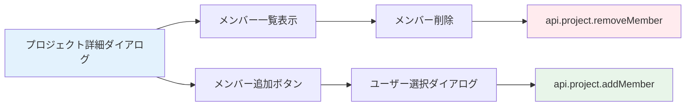

# Day 12: メンバー追加を実装しよう

## 🔙 前回の振り返り

Day 11 ではプロジェクトの編集・削除機能を実装しました。ダイアログを使った更新処理や `invalidate()` によるキャッシュ更新、確認ダイアログによる誤操作防止を学んだので、今日はプロジェクトにメンバーを追加・削除する機能に取り組みます。

---

## 🎯 今日のゴール

プロジェクトにメンバーを追加・削除できる機能を実装します。プロジェクト詳細ダイアログ内でメンバー管理UIを構築します。


## 🤔 なぜこれを作るのか？

チーム開発では、複数のメンバーが1つのプロジェクトで作業します。「誰がどんな役割で参加しているか」を管理する機能は、実務のタスク管理ツールに必須です。

> 💡 **例え話**: プロジェクトのメンバー管理は「サッカーチームのメンバー登録」です。監督（OWNER）、コーチ（ADMIN）、選手（MEMBER）、観客（VIEWER）のように、それぞれの役割を決めます。監督だけが新しい選手を入れたり外したりできます。

### 📐 メンバー管理の構造



### やること / やらないこと

| やること | やらないこと |
|---------|-------------|
| メンバー一覧の表示 | メンバーの権限システムの設計 |
| メンバー追加・削除 | 招待メール送信 |
| ロールを選んで追加 | ロール変更UI（今回のスコープ外） |
| 専用APIの呼び出し | Prisma のリレーション設計 |

### 🆕 新しく学ぶ概念

| 概念 | 読み方 | 役割 | 例え |
|------|--------|------|------|
| ロール | — | ユーザーの権限レベル | サッカーの監督・選手・観客 |
| リレーション | — | テーブル間の関連付け | プロジェクトと参加者の紐付け |

#### プロジェクトメンバーのロール一覧

| ロール | 権限 | 説明 |
|--------|------|------|
| OWNER | 全操作 + メンバー管理 + 削除 | プロジェクトの所有者 |
| ADMIN | 編集 + メンバー管理 | 管理担当者 |
| MEMBER | タスクの操作 | 一般メンバー |
| VIEWER | 閲覧のみ | 閲覧者 |

## 📊 実装ステップ一覧

| ステップ | 作業内容 | 所要時間 |
|---------|---------|---------|
| Step 1 | プロジェクト詳細ダイアログを作る | 7分 |
| Step 2 | メンバー一覧を表示する | 7分 |
| Step 3 | メンバー追加ダイアログを作る | 7分 |
| Step 4 | メンバー追加APIを呼ぶ | 5分 |
| Step 5 | メンバー削除を実装する | 5分 |
| Step 6 | 権限に応じた表示制御を理解する | 5分 |
| Step 7 | 動作確認 | 3分 |

**合計時間**: 約39分

---

### Step 1: プロジェクト詳細ダイアログを作る（7分）

🎯 **ゴール**: プロジェクトの詳細情報を表示するダイアログを作ります。

💻 **実装**:

`detailOpen`/`selectedProject` は Day 09 Step 8 で宣言済みです。Day 09 のプレースホルダーハンドラーを本実装に差し替えます。

```typescript
// filepath: src/app/project/page.tsx
// Day 09 のプレースホルダーを本実装に差し替え
const handleProjectClick =
  (projectId: string) => {
    setSelectedProject(projectId);
    setDetailOpen(true);
  };

const handleDetailClose = () => {
  setDetailOpen(false);
  setSelectedProject(null);
};
```

選択中のプロジェクトデータを取得します。

```typescript
// filepath: src/app/project/page.tsx
// 選択中プロジェクトの詳細を取得
const { data: projectDetail } =
  api.project.getById.useQuery(
    { id: selectedProject ?? '' },
    { enabled: !!selectedProject },
  );
```

> 💡 `enabled: !!selectedProject` は「`selectedProject` がある場合だけAPIを呼ぶ」という設定です。未選択時に不要なリクエストを防ぎます。

✅ **確認ポイント**:
- カードクリックで詳細ダイアログが開く
- プロジェクト名と説明が表示される

---

### Step 2: メンバー一覧を表示する（7分）

🎯 **ゴール**: プロジェクトの参加メンバーをリスト表示します。

💻 **実装**:

```typescript
// filepath: src/app/project/page.tsx
import {
  Avatar, AvatarFallback, AvatarImage,
} from '@/component/ui/avatar';
import { Badge } from '@/component/ui/badge';
import { PROJECT_MEMBER_ROLE_LABELS }
  from '@/lib/constant/roles';
```

詳細ダイアログ内にメンバーセクションを追加します。

```typescript
// filepath: src/app/project/page.tsx
// 詳細ダイアログ内のメンバーセクション
<div>
  <div className="flex items-center
    justify-between mb-4">
    <h3 className="text-lg font-semibold">
      メンバー (
        {projectDetail.members?.length
          || 0})
    </h3>
    <Button variant="outline" size="sm"
      onClick={() =>
        setMemberDialogOpen(true)}>
      <UserPlus className="mr-2 h-4 w-4" />
      メンバー追加
    </Button>
  </div>
```

各メンバーをアバター・名前・ロールBadge付きでリスト表示します。

```typescript
// filepath: src/app/project/page.tsx
  <div className="grid gap-2">
    {projectDetail.members?.map(
      (member) => (
        <div key={member.id}
          className="flex items-center
            justify-between p-2
            rounded-lg border bg-card">
          <div className="flex
            items-center gap-3">
            <Avatar>
              <AvatarImage
                src={
                  member.user?.avatar || ''
                } />
              <AvatarFallback>
                {(member.user?.name
                  || member.user?.email
                  || '?')[0]?.toUpperCase()}
              </AvatarFallback>
            </Avatar>
```

アバターの右側に名前とロールBadgeを並べます。

```typescript
// filepath: src/app/project/page.tsx
            <div>
              <p className="font-medium">
                {member.user?.name
                  || member.user?.email
                  || '不明'}
              </p>
              <Badge variant="outline">
                {PROJECT_MEMBER_ROLE_LABELS[
                  member.role
                ] ?? member.role}
              </Badge>
            </div>
          </div>
```

最後に削除ボタンを配置し、OWNERの場合は無効化します。

```typescript
// filepath: src/app/project/page.tsx
          <Button variant="ghost"
            size="icon"
            onClick={() =>
              handleRemoveMember(
                member.userId)}
            disabled={
              member.role === 'OWNER'}>
            <Trash2
              className="h-4 w-4
                text-destructive" />
          </Button>
        </div>
      )
    )}
  </div>
</div>
```

> 💡 `PROJECT_MEMBER_ROLE_LABELS` を使って、ロールを日本語で表示します（OWNER→オーナー、ADMIN→管理者、MEMBER→メンバー、VIEWER→閲覧者）。OWNER の削除ボタンは `disabled` にして、プロジェクトのオーナーが削除されないようにしています。

✅ **確認ポイント**:
- メンバーのアバター・名前・ロールが表示される
- ロールが日本語で表示される
- OWNER の削除ボタンが無効化されている


---

### Step 3: メンバー追加ダイアログを作る（7分）

🎯 **ゴール**: ユーザーを選択してプロジェクトに追加するダイアログを作ります。

💻 **実装**:

```typescript
// filepath: src/app/project/page.tsx
import type { ProjectMemberRole }
  from '@prisma/client';
import { UserPlus } from 'lucide-react';
import {
  Select, SelectContent, SelectItem,
  SelectTrigger, SelectValue,
} from '@/component/ui/select';

// 追加可能なユーザーを取得
const { data: availableUsers } =
  api.project.getAvailableUsers.useQuery(
    {
      projectId: selectedProject ?? '',
    },
    { enabled: !!selectedProject },
  );

// メンバー追加用のstate
const [memberDialogOpen,
  setMemberDialogOpen] = useState(false);
const [newMemberUserId,
  setNewMemberUserId] = useState('');
const [newMemberRole, setNewMemberRole] =
  useState<ProjectMemberRole>('MEMBER');
```

メンバー追加ダイアログのUIを構築します。

```typescript
// filepath: src/app/project/page.tsx
// メンバー追加ダイアログ
<Dialog open={memberDialogOpen}
  onOpenChange={setMemberDialogOpen}>
  <DialogContent
    className="sm:max-w-[425px]">
    <DialogHeader>
      <DialogTitle>
        メンバー追加
      </DialogTitle>
      <DialogDescription>
        このプロジェクトに
        新しいメンバーを追加します。
      </DialogDescription>
    </DialogHeader>
```

ユーザー選択とロール選択のフォームを追加します。

```typescript
// filepath: src/app/project/page.tsx
    <div className="grid gap-4 py-4">
      <div className="grid gap-2">
        <Label htmlFor="user">
          ユーザー
        </Label>
        <Select value={newMemberUserId}
          onValueChange={
            setNewMemberUserId}>
          <SelectTrigger id="user">
            <SelectValue
              placeholder=
                "ユーザーを選択" />
          </SelectTrigger>
```

SelectContent内で追加可能なユーザー一覧を選択肢として展開します。

```typescript
// filepath: src/app/project/page.tsx
          <SelectContent>
            {availableUsers?.map(
              (user) => (
                <SelectItem
                  key={user.id}
                  value={user.id}>
                  {user.name || user.email}
                </SelectItem>
              )
            )}
          </SelectContent>
        </Select>
      </div>
```

```typescript
// filepath: src/app/project/page.tsx
      <div className="grid gap-2">
        <Label htmlFor="role">
          ロール
        </Label>
        <Select value={newMemberRole}
          onValueChange={(value) =>
            setNewMemberRole(
              value as ProjectMemberRole
            )}>
          <SelectTrigger id="role">
            <SelectValue
              placeholder=
                "ロールを選択" />
          </SelectTrigger>
```

SelectContent内にMEMBER・ADMIN・VIEWERの3つの選択肢を日本語で並べます。

```typescript
// filepath: src/app/project/page.tsx
          <SelectContent>
            <SelectItem value="MEMBER">
              メンバー
            </SelectItem>
            <SelectItem value="ADMIN">
              管理者
            </SelectItem>
            <SelectItem value="VIEWER">
              閲覧者
            </SelectItem>
          </SelectContent>
        </Select>
      </div>
    </div>
```

最後にフッターボタンを追加します。

```typescript
// filepath: src/app/project/page.tsx
    <DialogFooter>
      <Button variant="outline"
        onClick={() =>
          setMemberDialogOpen(false)}>
        キャンセル
      </Button>
      <Button onClick={handleAddMember}
        disabled={!newMemberUserId}>
        メンバー追加
      </Button>
    </DialogFooter>
  </DialogContent>
</Dialog>
```

> 💡 `getAvailableUsers` は「まだこのプロジェクトに参加していないユーザー」だけを返します。既にメンバーのユーザーは候補に表示されないので、重複追加を防げます。

✅ **確認ポイント**:
- ユーザー選択のドロップダウンが表示される
- ロール選択が日本語で表示される
- ユーザー未選択時は「メンバー追加」ボタンが無効

---

### Step 4: メンバー追加APIを呼ぶ（5分）

🎯 **ゴール**: 選択したユーザーをプロジェクトに追加します。

💻 **実装**:

```typescript
// filepath: src/app/project/page.tsx
// メンバー追加のmutation
const addMemberMutation =
  api.project.addMember.useMutation({
    onSuccess: () => {
      if (selectedProject) {
        utils.project.getById.invalidate(
          { id: selectedProject }
        );
      }
      setMemberDialogOpen(false);
      setNewMemberUserId('');
      setNewMemberRole('MEMBER');
    },
  });
```

成功時のキャッシュ更新が終わったら、追加ボタンから呼び出すハンドラーを定義します。

```typescript
// filepath: src/app/project/page.tsx
// 追加ハンドラー
const handleAddMember = () => {
  if (selectedProject
    && newMemberUserId) {
    addMemberMutation.mutate({
      projectId: selectedProject,
      userId: newMemberUserId,
      role: newMemberRole,
    });
  }
};
```

> 💡 `onSuccess` でダイアログを閉じるだけでなく、`newMemberUserId` と `newMemberRole` を初期値に戻しています。次回ダイアログを開いたときにクリーンな状態になります。

✅ **確認ポイント**:
- メンバー追加でダイアログが閉じる
- メンバー一覧に新メンバーが表示される

---

### Step 5: メンバー削除を実装する（5分）

🎯 **ゴール**: メンバーをプロジェクトから外す処理を実装します。

💻 **実装**:

```typescript
// filepath: src/app/project/page.tsx
// メンバー削除のmutation
const removeMemberMutation =
  api.project.removeMember.useMutation({
    onSuccess: () => {
      if (selectedProject) {
        utils.project.getById.invalidate(
          { id: selectedProject }
        );
      }
    },
  });
```

削除成功後のキャッシュ更新が終わったら、削除ボタンから呼び出すハンドラーを定義します。

```typescript
// filepath: src/app/project/page.tsx
// 削除ハンドラー
const handleRemoveMember = (
  userId: string
) => {
  if (selectedProject && confirm(
    'このメンバーを削除してもよろしいですか？'
  )) {
    removeMemberMutation.mutate({
      projectId: selectedProject,
      userId,
    });
  }
};
```

> 💡 OWNER の削除ボタンは Step 2 で `disabled` にしているため、UIからはクリックできません。サーバー側でも権限チェックが行われるので、二重の安全対策になっています。

✅ **確認ポイント**:
- 確認ダイアログが表示される
- 削除後にメンバー一覧が更新される

---

### Step 6: 権限に応じた表示制御を理解する（5分）

🎯 **ゴール**: フロントエンドとバックエンドの権限チェックの仕組みを理解します。

💻 **コードを読む**:

```typescript
// filepath: src/server/api/routers/project.ts
// サーバー側の権限チェック例
addMember: protectedProcedure
  .input(z.object({
    projectId: z.string(),
    userId: z.string(),
    role: z.enum([
      'OWNER', 'ADMIN',
      'MEMBER', 'VIEWER'
    ]),
  }))
  .mutation(async ({ ctx, input }) => {
    // 呼び出し元のユーザーの権限をチェック
    // ...
  }),
```

✅ **確認ポイント**:
- サーバー側で権限チェックが行われていることを理解した
- フロントエンドとバックエンドの両方で制御する理由を理解した


#### 権限ごとの操作可否

| 操作 | OWNER | ADMIN | MEMBER | VIEWER |
|------|-------|-------|--------|--------|
| メンバー追加 | ✅ | ✅ | ❌ | ❌ |
| メンバー削除 | ✅ | ✅ | ❌ | ❌ |
| プロジェクト編集 | ✅ | ✅ | ❌ | ❌ |
| プロジェクト削除 | ✅ | ❌ | ❌ | ❌ |

> 💡 フロントエンドでボタンを非表示にしても、APIレベルでも権限チェックされています。両方で制御するのがセキュリティの基本です。悪意あるユーザーはブラウザの開発ツールからAPIを直接叩けるので、サーバー側のチェックが最後の砦です。

✅ **確認ポイント**:
- サーバー側で権限チェックが行われていることを理解した
- フロントエンドとバックエンドの両方で制御する理由を理解した


---

### Step 7: 動作確認（3分）

🎯 **ゴール**: メンバー管理の全機能を確認します。

1. プロジェクトカードをクリックして詳細を開く
2. メンバー一覧が表示されることを確認
3. 「メンバー追加」でユーザーを追加
4. メンバーを削除

✅ **確認ポイント**:
- メンバーの追加・削除が動作する
- ロールが日本語で表示される

---

```bash
# filepath: ターミナル
# 開発サーバーを起動して動作確認
npm run dev
```

## 📋 今日のまとめ

- [ ] プロジェクト詳細ダイアログでメンバーを表示できた
- [ ] `addMember` でメンバーを追加できた
- [ ] `removeMember` でメンバーを削除できた
- [ ] 権限チェックの仕組み（フロントエンド + バックエンド）を理解した

## ⚠️ つまずきポイント

| エラー / 問題 | 原因 | 解決方法 |
|--------------|------|---------|
| 「メンバーは既に存在します」 | 同じユーザーを二度追加 | `getAvailableUsers` で既存メンバーを除外 |
| 「最後のOWNERは削除できません」 | OWNER が1人しかいない | 他のメンバーの追加を先に行う |
| キャッシュが更新されない | `invalidate()` の呼び忘れ | `onSuccess` で `getById.invalidate()` を追加 |
| 管理操作でエラー | 権限不足 | OWNER/ADMIN アカウントでログインする |

## 📝 今日学んだ用語

| 用語 | 意味 |
|------|------|
| ロール | ユーザーに割り当てられた権限レベル |
| OWNER | プロジェクトの所有者。全権限を持つ |
| リレーション | データベースのテーブル間の関連付け |
| 権限チェック | 操作の可否をユーザーの権限で判定すること |

## 🔜 次回予告

Day 13 では、タスク一覧ページを作ります。プロジェクトの中にタスクを追加・管理する、アプリの核となる機能です。
