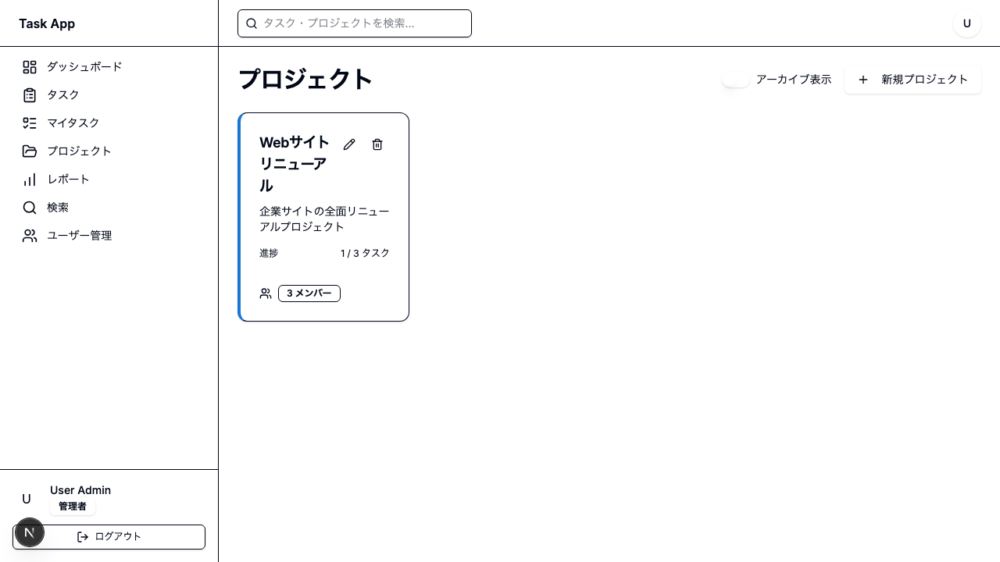
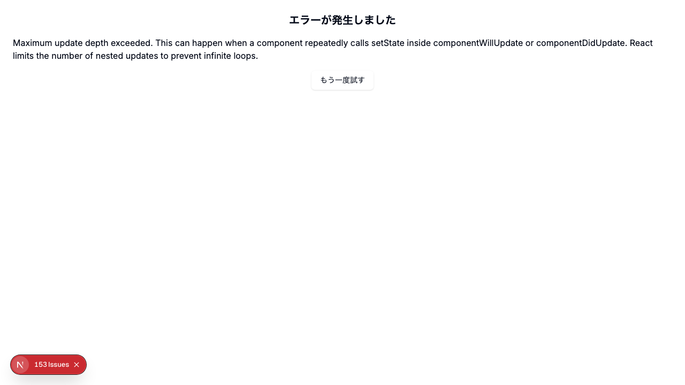
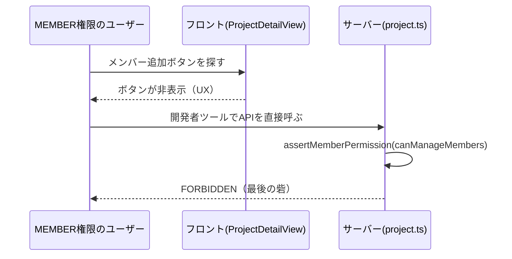

# Day 12: メンバー追加を実装しよう

## 前回の振り返り

Day 11 ではプロジェクトの編集・削除機能を実装しました。`DeleteConfirmDialog` による誤操作防止や `invalidate()` によるキャッシュ更新を学んだので、今日はメンバー管理に進みます。

---

## 今日のゴール

プロジェクトにメンバーを追加・削除できる機能を実装します。`ProjectDetailView` コンポーネントでメンバー一覧を表示し、`page.tsx` からprops経由で操作を制御します。

スクリーンショット: メンバー管理画面（プロジェクト詳細ページ内）


## なぜこれを作るのか

チーム開発では、複数のメンバーが1つのプロジェクトで作業します。「誰がどんな役割で参加しているか」を管理する機能は、実務のタスク管理ツールに必須です。

> **例え話**: プロジェクトのメンバー管理は「サッカーチームのメンバー登録」です。監督（OWNER）、コーチ（ADMIN）、選手（MEMBER）、観客（VIEWER）のように、それぞれの役割を決めます。監督とコーチだけが新しい選手を入れたり外したりできます。

### メンバー管理の構造


### やること / やらないこと

| やること | やらないこと |
|---------|-------------|
| メンバー一覧の表示 | メンバーの権限システムの設計 |
| メンバー追加・削除 | 招待メール送信 |
| ロールを選んで追加 | ロール変更UI（今回のスコープ外） |
| 専用APIの呼び出し | Prisma のリレーション設計 |

### 新しく学ぶ概念

| 概念 | 読み方 | 役割 | 例え |
|------|--------|------|------|
| ロール | — | ユーザーの権限レベル | サッカーの監督・選手・観客 |
| 型ガード | かたがーど | 値の型を安全に判定する関数 | 「本当に監督か」を確認する受付 |
| mutation（ミューテーション） | — | データを変更するAPI呼び出し | レストランで「注文を送る」操作 |

### 今日の作業ファイル

```
src/
├── app/project/
│   └── page.tsx              ← メンバー追加ダイアログ・state管理
├── component/project/
│   └── project-detail-view.tsx  ← メンバー一覧表示（独立コンポーネント）
├── lib/constant/
│   └── roles.ts              ← ロール定義・権限・型ガード
└── server/api/routers/
    └── project.ts            ← getById/getAvailableUsers/addMember/removeMember を追加（Step 0）
```

### ロール定義ファイル `roles.ts` の中身

`roles.ts` にはロール定数・ラベル・権限・型ガードがまとまっています。ここでは定義一覧を見つつ、**Day 12 で使う `project.ts` のAPIが実際に何を許可しているか** に合わせて整理します。

| エクスポート | 型 | 用途 |
|-------------|-----|------|
| `PROJECT_MEMBER_ROLE` | `as const` オブジェクト | `OWNER`, `ADMIN`, `MEMBER`, `VIEWER` |
| `PROJECT_MEMBER_ROLE_LABELS` | `Record<ProjectMemberRole, string>` | 日本語ラベル（オーナー等） |
| `isProjectMemberRole()` | 型ガード関数 | `value` が有効なロールか判定 |

#### `project.ts` で実際に通る操作

| 操作 | OWNER | ADMIN | MEMBER | VIEWER |
|------|-------|-------|--------|--------|
| プロジェクト閲覧 | ✅ | ✅ | ✅ | ✅ |
| メンバー追加 | ✅ | ✅ | ❌ | ❌ |
| メンバー削除 | ✅ | ✅ | ❌ | ❌ |
| メンバーロール変更 | ✅ | ✅ | ❌ | ❌ |
| プロジェクト更新（名前・説明・開始日・終了日） | ✅ | ✅ | ❌ | ❌ |
| アーカイブ / アーカイブ解除 | ✅ | ❌ | ❌ | ❌ |

> `roles.ts` には `canEdit` という権限定義がありますが、`project.ts` の `update` API は `canManageMembers` を見ています。そのため、**プロジェクト編集もOWNER/ADMINだけ** が実行できます。教材を読むときは「定義ファイルの理論値」ではなく、「サーバーがどの権限で判定しているか」を確認するのが大切です。

## 実装ステップ一覧

| ステップ | 作業内容 | 所要時間 |
|---------|---------|---------|
| Step 0 | project.ts に getById/getAvailableUsers/addMember/removeMember を自分で書く | 18分 |
| Step 1 | プロジェクト詳細ビューを接続する | 6分 |
| Step 2 | ProjectDetailViewのpropsを確認する | 4分 |
| Step 3 | ロール関連のインポートとフォームを準備する | 6分 |
| Step 4 | メンバー追加ダイアログのUIを作る | 7分 |
| Step 5 | メンバー追加APIを呼ぶ | 5分 |
| Step 6 | メンバー削除を実装する | 7分 |
| Step 7 | サーバー側の権限チェックを理解する | 5分 |
| Step 8 | 動作確認 | 6分 |

**合計時間**: 約63分。

---

### Step 0: project.ts に getById/getAvailableUsers/addMember/removeMember を自分で書く（18分）

**ゴール**: プロジェクト詳細取得・追加可能ユーザー取得・メンバー追加・メンバー削除の4つの手続きを追加します。

#### 0-1. getById — 1件だけ取得する

`getAll` は複数件を `findMany` で取っていましたが、`getById` は1件だけを `findUnique` で取ります。`project.ts` の `getAll` の下に追加します。

まず `findUnique` で1件検索します。詳細画面はタスクの担当者（`assignee`）も表示するので、`tasks.include.assignee` で一緒に取ります。

```typescript
// filepath: src/server/api/routers/project.ts（続き）
  getById: protectedProcedure
    .input(z.object({ id: z.string().cuid() }))
    .query(async ({ ctx, input }) => {
      const project = await prisma.project.findUnique({
        where: { id: input.id },
        include: {
          members: {
            include: {
              user: {
                select: { ...USER_SELECT, role: true },
              },
            },
          },
          tasks: {
            include: {
              assignee: {
                select: USER_SELECT,
              },
            },
            orderBy: [{ position: 'asc' }, { createdAt: 'desc' }],
          },
        },
      });
```

続けて、見つからなかったときのチェックです。

```typescript
// filepath: src/server/api/routers/project.ts（続き）
      if (!project) {
        throw new TRPCError({
          code: 'NOT_FOUND',
          message: 'プロジェクトが見つかりません',
        });
      }
```

`getAll` は一覧なので「見つからない」というケースがありませんでした。`getById` は違います。指定した `id` のプロジェクトは存在しないこともあるため、`NOT_FOUND` チェックが必要です。

続けて権限チェックと戻り値です。

```typescript
// filepath: src/server/api/routers/project.ts（続き）
      assertMemberPermission(
        project.members.filter((m) => m.userId === ctx.session.userId),
        'canView',
      );

      return project;
    }),
```

`getAll` では `where` で「自分がメンバーのものだけ」を絞り込んでいましたが、`getById` は先にプロジェクトを取得してから、取得した `members` の中に自分がいるかを `filter` で確認しています。他人のプロジェクトの `id` を直接指定されても、メンバーでなければ `canView` の権限チェックで弾かれます。

#### 0-2. getAvailableUsers — まだ参加していないユーザーを探す

メンバー追加ダイアログの候補一覧に使う手続きです。`getById` の下に追加します。まず自分の権限を確認します。

```typescript
// filepath: src/server/api/routers/project.ts（続き）
  getAvailableUsers: protectedProcedure
    .input(z.object({ projectId: z.string().cuid() }))
    .query(async ({ ctx, input }) => {
      const userMember = await prisma.projectMember.findUnique({
        where: {
          userId_projectId: {
            userId: ctx.session.userId,
            projectId: input.projectId,
          },
        },
      });

      assertMemberPermission(userMember ? [userMember] : [], 'canManageMembers');
```

続けて、まだ参加していないユーザーを検索します。

```typescript
// filepath: src/server/api/routers/project.ts（続き）
      return await prisma.user.findMany({
        where: {
          isActive: true,
          projects: {
            none: {
              projectId: input.projectId,
            },
          },
        },
        select: USER_SELECT,
        orderBy: { name: 'asc' },
      });
    }),
```

`projects: { none: { projectId: input.projectId } }` は「このプロジェクトのメンバーに1件も該当しないユーザー」という条件です。Day 09 の `getAll` では `some`（1件でも該当すれば対象）を使いました。`none` はその逆で、1件も該当しない場合を対象にします。これで、まだ参加していない人だけが候補として残ります。

#### 0-3. addMember — ここが一番のヤマ場、重複チェック

`addMember` に使う入力スキーマをまず定義します。`project.ts` にはすでに `import { USER_SELECT } from './_helpers/select';` という行があります。この1行を、`projectMemberRoleSchema` も一緒に取り込む形へ**書き換えます**（新しい行を追加するのではありません）。

```typescript
// filepath: src/server/api/routers/project.ts（既存の import { USER_SELECT } from './_helpers/select'; をこの行に置き換える）
import { projectMemberRoleSchema, USER_SELECT } from './_helpers/select';
```

```typescript
// filepath: src/server/api/routers/project.ts（続き）
const projectMemberSchema = z.object({
  projectId: z.string().cuid(),
  userId: z.string().cuid(),
  role: projectMemberRoleSchema.default(PROJECT_MEMBER_ROLE.MEMBER),
});
```

`role` に `.default(PROJECT_MEMBER_ROLE.MEMBER)` が付いているのは、ロールを指定しなかったときに一番権限の弱い MEMBER として追加するためです。ここまで準備できたら、`getAvailableUsers` の下に `addMember` を追加します。

```typescript
// filepath: src/server/api/routers/project.ts（続き）
  addMember: protectedProcedure.input(projectMemberSchema).mutation(async ({ ctx, input }) => {
    const userMember = await prisma.projectMember.findUnique({
      where: {
        userId_projectId: {
          userId: ctx.session.userId,
          projectId: input.projectId,
        },
      },
    });

    assertMemberPermission(userMember ? [userMember] : [], 'canManageMembers');
```

ここまでは他の手続きと同じ「自分の権限を確認する」流れです。`canManageMembers` は OWNER と ADMIN の両方が持っています。ここで、もう一段階だけ強いチェックを挟みます。

```typescript
// filepath: src/server/api/routers/project.ts（続き）
    // OWNERロールの付与はOWNERのみに限定する。canManageMembersを持つADMINによる権限昇格を防ぐため。
    if (
      input.role === PROJECT_MEMBER_ROLE.OWNER &&
      userMember?.role !== PROJECT_MEMBER_ROLE.OWNER
    ) {
      throw new TRPCError({
        code: 'FORBIDDEN',
        message: 'オーナー権限の付与はオーナーのみ可能です',
      });
    }
```

`canManageMembers` はメンバーを管理する権限であって、「新しいオーナーを作ってよい」権限ではありません。もしこのチェックが無いと、ADMIN 権限のユーザーが新しいメンバーを OWNER として追加でき、追加した相手を通じてプロジェクトを乗っ取れてしまいます。「誰が追加できるか」だけでなく「どのロールまで付与できるか」も分けて確認するのが、ここでのもう一段の権限管理です。

続けて、すでにメンバーでないかを確認します。

```typescript
// filepath: src/server/api/routers/project.ts（続き）
    const existing = await prisma.projectMember.findUnique({
      where: {
        userId_projectId: {
          userId: input.userId,
          projectId: input.projectId,
        },
      },
    });

    if (existing) {
      throw new TRPCError({
        code: 'CONFLICT',
        message: 'このユーザーは既にプロジェクトのメンバーです',
      });
    }
```

重複していなければ、実際にメンバーとして追加します。

```typescript
// filepath: src/server/api/routers/project.ts（続き）
    return await prisma.projectMember.create({
      data: input,
      include: {
        user: {
          select: USER_SELECT,
        },
      },
    });
  }),
```

`addMember` で一番大事なのは、追加する前に「もう既にメンバーではないか」を確認している点です。フロント側の `getAvailableUsers` は未参加ユーザーだけを候補に出します。しかし候補を取得したあと、実際に追加ボタンを押すまでにはタイムラグがあります。この間に別のタブや別のメンバーが先に同じユーザーを追加していると、候補一覧が古いままボタンを押すことになります。フロントのUIだけを信用せず、サーバー側でも同じ確認をもう一度することで、同じユーザーが二重登録される事故を防いでいます。

#### 0-4. removeMember — 最後のOWNERは消せない

`addMember` の下に追加します。まず入力の形と、自分の権限を確認します。

```typescript
// filepath: src/server/api/routers/project.ts（続き）
  removeMember: protectedProcedure
    .input(
      z.object({
        projectId: z.string().cuid(),
        userId: z.string().cuid(),
      }),
    )
    .mutation(async ({ ctx, input }) => {
      const userMember = await prisma.projectMember.findUnique({
        where: {
          userId_projectId: {
            userId: ctx.session.userId,
            projectId: input.projectId,
          },
        },
      });

      assertMemberPermission(userMember ? [userMember] : [], 'canManageMembers');
```

続けて、削除対象のメンバーが実際に存在するかを確認します。

```typescript
// filepath: src/server/api/routers/project.ts（続き）
      const member = await prisma.projectMember.findUnique({
        where: {
          userId_projectId: {
            userId: input.userId,
            projectId: input.projectId,
          },
        },
      });

      if (!member) {
        throw new TRPCError({
          code: 'NOT_FOUND',
          message: 'メンバーが見つかりません',
        });
      }
```

自分の権限と削除対象の存在を確認できたら、addMember と同じ理由でもう一段階のチェックを挟みます。

```typescript
// filepath: src/server/api/routers/project.ts（続き）
      // OWNERメンバーの削除はOWNERのみに限定する。ADMINによるオーナー排除を防ぐため。
      if (
        member.role === PROJECT_MEMBER_ROLE.OWNER &&
        userMember?.role !== PROJECT_MEMBER_ROLE.OWNER
      ) {
        throw new TRPCError({
          code: 'FORBIDDEN',
          message: 'オーナーの削除はオーナーのみ可能です',
        });
      }
```

`canManageMembers` を持つ ADMIN は普通のメンバーを削除できますが、OWNER を削除できてしまうと、ADMIN が邪魔なオーナーを外して実質的にプロジェクトを乗っ取れます。削除対象が OWNER のときだけ、削除する側も OWNER であることを確認します。

続けて、削除してよいかの最終チェックです。削除対象が OWNER のときだけ、そのプロジェクトの OWNER が何人いるかを数えます。

```typescript
// filepath: src/server/api/routers/project.ts（続き）
      if (member.role === PROJECT_MEMBER_ROLE.OWNER) {
        const ownerCount = await prisma.projectMember.count({
          where: {
            projectId: input.projectId,
            role: PROJECT_MEMBER_ROLE.OWNER,
          },
        });

        if (ownerCount === 1) {
          throw new TRPCError({
            code: 'BAD_REQUEST',
            message: 'プロジェクト唯一のオーナーは削除できません',
          });
        }
      }
```

1人しかいない場合は削除を止めます。OWNER が0人になると、名前を変える・メンバーを追加する・アーカイブするといった管理操作を誰も実行できなくなり、プロジェクトが誰の手も届かない状態のまま残ってしまいます。MEMBER や VIEWER を削除するときはこのチェックを通らず、そのまま削除されます。

チェックを抜けたら、実際に削除します。

```typescript
// filepath: src/server/api/routers/project.ts（続き）
      await prisma.projectMember.delete({
        where: {
          userId_projectId: {
            userId: input.userId,
            projectId: input.projectId,
          },
        },
      });

      return { success: true };
    }),
```

最後の `});` で `projectRouter` 全体を閉じます。

**確認ポイント**:
- `getById` / `getAvailableUsers` / `addMember` / `removeMember` を追加した
- `addMember` の重複チェック、`removeMember` の最後のOWNER保護、それぞれ「なぜ必要か」を説明できる
- `addMember` のOWNER付与制限、`removeMember` のOWNER削除制限、それぞれADMINによる権限昇格をどう防いでいるか説明できる
- `npm run dev` で型エラーが出ていない

---

### Step 1: プロジェクト詳細ビューを接続する（6分）

**ゴール**: `page.tsx` から `ProjectDetailView` コンポーネントを呼び出し、プロジェクト詳細を表示します。

**実装**:

`ProjectDetailView` コンポーネントのインポートを追加します。

```typescript
// filepath: src/app/project/page.tsx
// ProjectDetailViewのインポートを追加
import { ProjectDetailView } from
  '@/component/project/project-detail-view';
```

**確認ポイント**:
- `@/component/project/project-detail-view` からインポートしている

> プロジェクト詳細はダイアログではなく、URLパラメータ（`?projectId=xxx`）によるページ内表示です。`useSearchParams` で URLから選択IDを取得します。

ハンドラーを追加します。Day 11 Step 9 で仮定義した `handleDetailClose` を **削除して**、`handleArchive` の下に本実装を書いてください。あわせて `handleProjectClick` も追加します。

> Day 11 の仮定義（`// Day 12 Step 1 で本実装に置き換え` とコメントされた箇所）を先に削除してから書いてください。同名の `const` が2つあるとエラーになります。

```typescript
// filepath: src/app/project/page.tsx
// handleArchiveの下に追加
// （Day 11 の仮定義 handleDetailClose を削除してからここに書く）
const handleProjectClick = (
  projectId: string
) => {
  router.push(
    `/project?projectId=${projectId}`
  );
};
const handleDetailClose = () => {
  router.push('/project');
};
```

**確認ポイント**:
- `handleProjectClick` は `router.push` でURL遷移する
- `handleDetailClose` は `/project` に戻る（URLパラメータなし）
- Day 11 の仮定義 `handleDetailClose` を削除した

プロジェクトカードの `onClick` に `handleProjectClick` を接続します。`ProjectCard` は個別のpropsでデータを受け取ります。

```typescript
// filepath: src/app/project/page.tsx
// プロジェクトカードの配置（Day 09実装済み）
<ProjectCard
  key={project.id}
  id={project.id}
  name={project.name}
  description={project.description}
  color={project.color}
  memberCount={
    project.members?.length ?? 0
  }
  taskStats={{
    total: taskCount, done: doneCount,
  }}
  onEdit={handleEdit}
  onDelete={handleDelete}
  onClick={handleProjectClick}
  isArchived={project.isArchived}
/>
```

**確認ポイント**:
- `ProjectCard` に個別のprops（`id`, `name`, `color` 等）を渡している
- `onClick` で `handleProjectClick` を渡している

選択中のプロジェクトデータを取得するクエリを追加します。Day 11 Step 9 で仮定義した `const projectDetail = undefined;` を **削除して**、既存の `useQuery` 群の末尾に本実装を書いてください。

> Day 11 の仮定義（`// Day 12 Step 1 で useQuery に置き換え` とコメントされた行）を先に削除してから書いてください。同名の `const` が2つあるとエラーになります。

```typescript
// filepath: src/app/project/page.tsx
// 既存のuseQuery群の末尾に追加
// （Day 11 の仮定義 `const projectDetail = undefined` を削除してからここに書く）
const { data: projectDetail } =
  api.project.getById.useQuery(
    { id: selectedProject ?? '' },
    { enabled: !!selectedProject },
  );
```

**確認ポイント**:
- `useQuery` に `enabled` オプションを設定した
- 未選択時はAPIを呼ばない設定になっている
- Day 11 の仮定義 `const projectDetail = undefined` を削除した

> `enabled: !!selectedProject` は「`selectedProject` がある場合だけAPIを呼ぶ」という設定です。未選択時に不要なリクエストを防ぎます。

プロジェクトカードをクリックして詳細ページが表示されることを確認しましょう。

スクリーンショット: プロジェクト詳細ページが表示されている画面。


---

### Step 2: ProjectDetailViewのpropsを作る（4分）

**ゴール**: `ProjectDetailView` がどのようなpropsを受け取るか決めます。

`ProjectDetailView` は独立コンポーネントとして作ります。
まず props の型定義を決めて、親ページから渡す値を
迷わない形にそろえよう。

| props | 型 | 役割 |
|-------|-----|------|
| `projectDetail` | `ProjectDetail \| null \| undefined` | 表示するプロジェクトデータ |
| `onBack` | `() => void` | 一覧画面に戻る |
| `onAddMemberClick` | `() => void` | メンバー追加ダイアログを開く |
| `onRemoveMember` | `(userId: string) => void` | メンバー削除処理を実行 |
| `onArchive` | `(projectId: string, isArchived: boolean) => void` | アーカイブ切り替え |

**確認ポイント**:
- 5つのpropsが定義されている
- `onRemoveMember` は `userId` を引数に取る

Day 11 Step 9 で `handleRemoveMember` の仮定義（何もしない空実装）を追加済みです。Step 6 で本実装に差し替えます。**ここでは仮定義がすでにあることを確認するだけで、コードの追加は不要です。**

> Day 11 の仮定義 `const handleRemoveMember = (_userId: string) => {}` は **Step 6 で削除して本実装に書き換えます**。同名の `const` を2つ書くとエラーになるため、Step 6 では「Day 11 の仮実装を削除 → 本実装を書く」の順で進めてください。

**確認ポイント**:
- TypeScript のエラーが出ていない（Day 11 の仮定義があるため）
- `handleRemoveMember` は仮実装であり、Step 6 で削除することを覚えておく

`ProjectDetailView` は Day 11 の Step 9 で作った
URL ルーティングの分岐内に配置します。
`projectIdParam && selectedProject` が `true` のとき
表示される構造にします。

```typescript
// filepath: src/app/project/page.tsx
// Day 11 Step 9 の分岐内に配置する
<ProjectDetailView
  projectDetail={projectDetail}
  onBack={handleDetailClose}
  onAddMemberClick={
    () => setMemberDialogOpen(true)
  }
  onRemoveMember={handleRemoveMember}
  onArchive={handleArchive}
/>
```

**確認ポイント**:
- `ProjectDetailView` に5つのpropsを渡している
- URLパラメータがある場合のみ表示される

> メンバー一覧の表示は `ProjectDetailView` の内部で行われます。`page.tsx` はデータ取得とイベントハンドラーの定義だけを担当し、UIの詳細は独立コンポーネントに任せます。

---

### Step 3: ロール関連のインポートとstateを準備する（6分）

**ゴール**: ロール定数・型ガードのインポートとメンバー追加用のstateを準備します。

**実装**:

```typescript
// filepath: src/app/project/page.tsx
// ロール関連のインポート
import {
  isProjectMemberRole,
  PROJECT_MEMBER_ROLE,
  PROJECT_MEMBER_ROLE_LABELS,
  type ProjectMemberRole,
} from '@/lib/constant/roles';
```

**確認ポイント**:
- インポート元が `@/lib/constant/roles` になっている（`@prisma/client` ではない）
- `isProjectMemberRole` 型ガード関数もインポートしている

> `@prisma/client` からインポートすると、Prisma内部の型定義に依存してしまいます。`@/lib/constant/roles` に定義された定数・型を使うのが正しい方法です。

メンバー追加フォームのstateを定義します。Day 11 Step 9 で仮定義した `const [memberDialogOpen, setMemberDialogOpen] = useState(false)` を **削除**します。そのうえで、他の state と同じ並びに以下の本実装を書いてください。

> Day 11 の仮定義（`// Day 12 Step 3 で本実装に置き換え` とコメントされた行）を先に削除してから書いてください。同名の `const` が2つあるとエラーになります。

```typescript
// filepath: src/app/project/page.tsx
// メンバー追加用のstate
// （Day 11 の仮定義 memberDialogOpen を削除してからここに書く）
const [memberDialogOpen,
  setMemberDialogOpen] = useState(false);
const [newMemberUserId,
  setNewMemberUserId] = useState('');
const [newMemberRole, setNewMemberRole] =
  useState<ProjectMemberRole>(
    PROJECT_MEMBER_ROLE.MEMBER
  );
```

**確認ポイント**:
- `memberDialogOpen` はダイアログ開閉用
- `newMemberUserId` と `newMemberRole` でフォームの値を管理
- `newMemberRole` の型が `ProjectMemberRole` になっている
- Day 11 の仮定義 `memberDialogOpen` state を削除した

> メンバー追加フォームはフィールドが2つだけなので、`react-hook-form` を使わずシンプルな `useState` で管理します。フォームが複雑になったら Day 10 で学んだ `react-hook-form + zod` パターンに移行できます。

追加可能なユーザー一覧を取得します。既存の `useQuery` 群の末尾に追加してください。

```typescript
// filepath: src/app/project/page.tsx
// 追加可能なユーザーを取得
const { data: availableUsers } =
  api.project.getAvailableUsers.useQuery(
    { projectId: selectedProject ?? '' },
    { enabled: !!selectedProject },
  );
```

**確認ポイント**:
- `getAvailableUsers` はプロジェクト未参加のユーザーだけを返す
- `enabled` で未選択時のリクエストを防いでいる

---

### Step 4: メンバー追加ダイアログのUIを作る（7分）

**ゴール**: ユーザーを選択してプロジェクトに追加するダイアログのUIを構築します。

**実装**:

まず必要なコンポーネントをインポートします。

```typescript
// filepath: src/app/project/page.tsx
// Dialog系コンポーネントのインポートを追加
import {
  Dialog,
  DialogContent,
  DialogDescription,
  DialogFooter,
  DialogHeader,
  DialogTitle,
} from '@/component/ui/dialog';
import { Label } from '@/component/ui/label';
import {
  Select,
  SelectContent,
  SelectItem,
  SelectTrigger,
  SelectValue,
} from '@/component/ui/select';
```

**確認ポイント**:
- `@/component/ui/dialog` から Dialog 系コンポーネントを一括インポートしている
- `Label` と `Select` 系も同じく `@/component/ui/` から取得している

メンバー追加ダイアログは `ProjectDetailView` の分岐内に配置します。まずダイアログのヘッダー部分です。

```typescript
// filepath: src/app/project/page.tsx
// ProjectDetailViewの直後に配置
<Dialog open={memberDialogOpen}
  onOpenChange={setMemberDialogOpen}>
  <DialogContent
    className="sm:max-w-[425px]">
    <DialogHeader>
      <DialogTitle>
        メンバー追加
      </DialogTitle>
      <DialogDescription>
        このプロジェクトに
        新しいメンバーを追加します。
      </DialogDescription>
    </DialogHeader>
```

**確認ポイント**:
- `Dialog` の `open` / `onOpenChange` でダイアログ開閉を制御している

ユーザー選択のドロップダウンを追加します。`useState` の `newMemberUserId` で値を直接管理します。

```typescript
// filepath: src/app/project/page.tsx
// ダイアログのbody部分: ユーザー選択
    <div className="grid gap-4 py-4">
      <div className="grid gap-2">
        <Label htmlFor="user">
          ユーザー
        </Label>
        <Select
          value={newMemberUserId}
          onValueChange={
            setNewMemberUserId
          }>
          <SelectTrigger id="user">
            <SelectValue
              placeholder="ユーザーを選択"
            />
          </SelectTrigger>
```

**確認ポイント**:
- `Select` の `value` / `onValueChange` で `useState` と直接接続している
- `Controller` ラッパーは不要（シンプルなstateで十分）

SelectContent 内にユーザー候補を表示します。

```typescript
// filepath: src/app/project/page.tsx
// ユーザー選択の候補リスト
          <SelectContent>
            {availableUsers?.map(
              (user) => (
                <SelectItem
                  key={user.id}
                  value={user.id}>
                  {user.name || user.email}
                </SelectItem>
              )
            )}
          </SelectContent>
        </Select>
      </div>
```

**確認ポイント**:
- 名前がない場合はメールアドレスを表示する
- `availableUsers` はプロジェクト未参加ユーザーのみ

ロール選択も `useState` の `newMemberRole` で管理します。`isProjectMemberRole` 型ガードで値を安全に検証してからstateに設定します。

```typescript
// filepath: src/app/project/page.tsx
// ロール選択UI: Select + useState
      <div className="grid gap-2">
        <Label htmlFor="role">ロール</Label>
        <Select
          value={newMemberRole}
          onValueChange={(value) => {
            if (isProjectMemberRole(value))
              setNewMemberRole(value);
          }}>
          <SelectTrigger id="role">
            <SelectValue
              placeholder="ロールを選択"
            />
          </SelectTrigger>
```

**確認ポイント**:
- `isProjectMemberRole` 型ガードで安全にロールを検証している
- 不正な値が `setNewMemberRole` に渡されることを防いでいる

ロール選択肢はOWNERを除外して生成します。

```typescript
// filepath: src/app/project/page.tsx
// ロール選択の候補リスト
          <SelectContent>
            {Object.entries(
              PROJECT_MEMBER_ROLE_LABELS
            )
              .filter(([value]) =>
                value !==
                PROJECT_MEMBER_ROLE.OWNER
              )
              .map(([value, label]) => (
                <SelectItem
                  key={value}
                  value={value}>
                  {label}
                </SelectItem>
              ))}
          </SelectContent>
        </Select>
      </div>
    </div>
```

**確認ポイント**:
- OWNER が選択肢から除外されている
- `PROJECT_MEMBER_ROLE_LABELS` から動的に選択肢を生成している

> OWNERはUIの選択肢から除外しています。さらにサーバー側でも権限チェックがあるため、二重に保護されています。

フッターボタンを追加してダイアログを完成させます。

```typescript
// filepath: src/app/project/page.tsx
// ダイアログのフッター
    <DialogFooter>
      <Button variant="outline"
        onClick={() =>
          setMemberDialogOpen(false)}>
        キャンセル
      </Button>
      <Button
        onClick={handleAddMember}
        disabled={!newMemberUserId}>
        メンバー追加
      </Button>
    </DialogFooter>
  </DialogContent>
</Dialog>
```

**確認ポイント**:
- ユーザー未選択時は「メンバー追加」ボタンが `disabled` になる
- キャンセルボタンでダイアログが閉じる

スクリーンショット: メンバー追加ダイアログでユーザーとロールを選択した状態。


---

### Step 5: メンバー追加APIを呼ぶ（5分）

**ゴール**: 選択したユーザーをプロジェクトに追加するmutation（データを変更するAPI呼び出し）とハンドラーを実装します。

**実装**:

mutation を既存の mutation 群の末尾に追加してください。

```typescript
// filepath: src/app/project/page.tsx
// 既存のmutation群の末尾に追加
const addMemberMutation =
  api.project.addMember.useMutation({
    onSuccess: () => {
      if (selectedProject) {
        utils.project.getById
          .invalidate(
            { id: selectedProject }
          );
      }
      setMemberDialogOpen(false);
      setNewMemberUserId('');
      setNewMemberRole(
        PROJECT_MEMBER_ROLE.MEMBER
      );
    },
  });
```

**確認ポイント**:
- 成功時に `getById` のキャッシュを更新している
- `setNewMemberUserId('')` と `setNewMemberRole()` でフォームを初期値に戻している

ハンドラーを追加します。`handleArchive` の下に追加してください。

```typescript
// filepath: src/app/project/page.tsx
// handleArchiveの下に追加
const handleAddMember = () => {
  if (selectedProject
    && newMemberUserId) {
    addMemberMutation.mutate({
      projectId: selectedProject,
      userId: newMemberUserId,
      role: newMemberRole,
    });
  }
};
```

**確認ポイント**:
- `selectedProject` と `newMemberUserId` の両方を確認してから送信
- state の値をそのまま mutation に渡している

ここまでで、メンバー追加ができました。メンバー削除は Step 6 で実装します。まずはプロジェクトにメンバーを追加して、一覧に反映されることを確認してみましょう。

---

### Step 6: メンバー削除を実装する（7分）

**ゴール**: メンバーをプロジェクトから外す処理を、確認ダイアログ付きで実装します。

**実装**:

Day 11 で学んだ `DeleteConfirmDialog` パターンを使い、確認ダイアログ経由で削除します。state を `ProjectPageContent` 関数の先頭に追加してください。

```typescript
// filepath: src/app/project/page.tsx
// 既存のstate一覧の末尾に追加
const [removeMemberDialogOpen,
  setRemoveMemberDialogOpen] =
  useState(false);
const [removeMemberTargetId,
  setRemoveMemberTargetId] =
  useState<string | null>(null);
```

**確認ポイント**:
- Day 11 のプロジェクト削除と同じパターンを使っている
- `removeMemberTargetId` に削除対象のuserIdを保持する

mutation と handler を追加します。まず **Step 2 で追加した仮実装を削除**してから、以下の本実装を書いてください。

```typescript
// filepath: src/app/project/page.tsx
// addMemberMutationの直下に追加
const removeMemberMutation =
  api.project.removeMember.useMutation({
    onSuccess: () => {
      if (selectedProject) {
        utils.project.getById
          .invalidate(
            { id: selectedProject }
          );
      }
    },
  });
```

**確認ポイント**:
- 成功時に `getById` キャッシュを更新してメンバー一覧を再取得している

```typescript
// filepath: src/app/project/page.tsx
// Step 2の仮実装を削除してここに書き換える
const handleRemoveMember = (
  userId: string
) => {
  setRemoveMemberTargetId(userId);
  setRemoveMemberDialogOpen(true);
};
```

**確認ポイント**:
- Step 2 の仮実装（`console.log` の版）が削除されている
- 直接 `mutate` を呼ばず、まず確認ダイアログを開いている

JSX 内の `</div>` 閉じタグの後、`</AppLayout>` の直前（`AppLayout` 内の一番最後）に `DeleteConfirmDialog` を配置します。

```typescript
// filepath: src/app/project/page.tsx
// </div>閉じタグの後、</AppLayout>の直前に配置
<DeleteConfirmDialog
  open={removeMemberDialogOpen}
  onOpenChange={
    setRemoveMemberDialogOpen
  }
  onConfirm={() => {
    if (selectedProject
      && removeMemberTargetId) {
      removeMemberMutation.mutate({
        projectId: selectedProject,
        userId: removeMemberTargetId,
      });
    }
  }}
  isPending={
    removeMemberMutation.isPending
  }
  title="このメンバーを削除しますか？"
/>
```

**確認ポイント**:
- `onConfirm` で `selectedProject` と `removeMemberTargetId` の両方を確認している
- `title` でメンバー削除専用のメッセージを表示している

| `window.confirm()` | `DeleteConfirmDialog` |
|--------------------|-----------------------|
| ブラウザ標準のダイアログ | shadcn/ui ベースの統一デザイン |
| カスタマイズ不可 | タイトル・説明を自由に設定 |
| ローディング状態なし | `isPending` でボタン制御 |

スクリーンショット: メンバー削除の確認ダイアログが表示されている画面。


---

### Step 7: サーバー側の権限チェックを理解する（5分）

**ゴール**: フロントエンドとバックエンドの権限チェックの仕組みを理解します。

Step 0 で `getById` / `getAvailableUsers` / `addMember` / `removeMember` の権限チェックはすでに書きました。ここではコードを追加せず、Day 09〜12 で書いた権限チェックを一段上から整理します。実際には次の3種類の権限で分かれています。

| 権限キー | 該当API | 通るロール |
|---------|---------|-----------|
| `canView` | `getById` | OWNER / ADMIN / MEMBER / VIEWER |
| `canManageMembers` | `getAvailableUsers`, `addMember`, `removeMember`, `updateMemberRole`, `update` | OWNER / ADMIN |
| `canArchive` | `archive`, `unarchive` | OWNER |

Step 0 で書いた `addMember` を見比べてみましょう。`assertMemberPermission(userMember ? [userMember] : [], 'canManageMembers')` の1行が、この表の `canManageMembers` 判定そのものです。

MEMBER 権限のユーザーが操作したときの流れを図にすると、フロントとバックエンドで二重にチェックされていることが見えます。



**確認ポイント**:
- Step 0 で書いた `addMember` を見て、`'canManageMembers'` でメンバー管理権限をチェックしていることを確認した
- 同じ `canManageMembers` が `removeMember` / `updateMemberRole` / `update` にも使われていることを確認した
- `archive` / `unarchive` は Day 11 で書いた `canArchive` で判定され、OWNERだけが通ることを確認した

#### フロントエンドとバックエンドの権限チェック比較

| 観点 | フロントエンド | バックエンド |
|------|-------------|------------|
| 目的 | UX向上（不要なボタンを隠す） | セキュリティ（不正リクエスト防止） |
| 実装箇所 | `ProjectDetailView` | `project.ts` の各mutation |
| 回避方法 | 開発者ツールで回避可能 | 回避不可能 |
| 必須度 | 推奨 | **必須** |

> フロントエンドでボタンを非表示にしても、APIレベルでも権限チェックされています。両方で制御するのがセキュリティの基本です。悪意あるユーザーはブラウザの開発ツールからAPIを直接叩けるので、サーバー側のチェックが最後の砦です。

権限がなかった場合どうなるか、テストシナリオで確認してみましょう。MEMBER権限のユーザーでメンバー追加やプロジェクト更新を試みると、サーバーからエラーが返されます。メッセージは `この操作を実行する権限がありません` です。VIEWERも同様です。さらにADMIN権限のユーザーはメンバー管理やプロジェクト更新はできますが、アーカイブ / アーカイブ解除はできません。

**確認ポイント**:
- 権限がない場合は `FORBIDDEN` エラーが返される
- フロントとバックの二重防御になっている

---

### Step 8: 動作確認（6分）

**ゴール**: メンバー管理の全機能をテストシナリオに沿って確認します。

```bash
# filepath: ターミナル
# 開発サーバーを起動して動作確認
PORT=3001 npm run dev
```

**確認ポイント**:
- 開発サーバーがエラーなく起動した

#### テストシナリオ 1: メンバー追加

| 手順 | 操作 | 期待結果 |
|------|------|---------|
| 1 | プロジェクトカードをクリック | 詳細ページが表示される |
| 2 | 「メンバー追加」ボタンをクリック | メンバー追加ダイアログが開く |
| 3 | ユーザーを選択、ロールを選択 | ドロップダウンが正常に動作 |
| 4 | 「メンバー追加」をクリック | ダイアログが閉じ、詳細ページのメンバー一覧に追加される |

#### テストシナリオ 2: メンバー削除

| 手順 | 操作 | 期待結果 |
|------|------|---------|
| 1 | メンバーの削除ボタンをクリック | 確認ダイアログが表示される |
| 2 | 「削除」を確認 | メンバー一覧から削除される |
| 3 | OWNERの削除ボタンを確認 | ボタンが `disabled` で押せない |

スクリーンショット: メンバーが追加され一覧に表示されている画面。


**確認ポイント**:
- 全2シナリオが期待通りに動作する
- メンバー追加後、メンバー一覧が自動更新される
- OWNERの削除ボタンが無効化されている
- ロールが日本語で表示される（オーナー、管理者、メンバー、閲覧者）

---


---

### Pro パターンで書こう — メンバーカードの props は元の型から Pick する

メンバー表示の props を全部手で写すと、元データとずれやすいです。
元の型から必要な列だけを `Pick` すると、
「このカードが何を使うか」が型で分かります。

| 書き方 | 特徴 |
|--------|------|
| props を手書き | 項目変更に弱い |
| `Pick<ProjectMember, ...>` | 元データの型に追従しやすい |

**覚えておきたいこと**: 元の型の一部を使うなら `Pick`。

## 今日のまとめ

- [ ] `ProjectDetailView` コンポーネントでメンバー一覧を表示できた
- [ ] `addMember` でメンバーを追加できた
- [ ] `DeleteConfirmDialog` 経由で `removeMember` を実行できた
- [ ] `isProjectMemberRole` 型ガードでロール値を安全に検証する方法を理解した
- [ ] 権限チェックの仕組み（フロントエンド + バックエンド）を理解した

## つまずきポイント

| エラー / 問題 | 原因 | 解決方法 |
|--------------|------|---------|
| 「メンバーは既に存在します」 | 同じユーザーを二度追加 | `getAvailableUsers` で既存メンバーを除外済み。ブラウザ更新して再試行 |
| 「最後のOWNERは削除できません」 | OWNERが1人しかいない | テスト用に2人目のOWNERがいる状態で削除制約を確認する |
| キャッシュが更新されない | `invalidate()` の呼び忘れ | `onSuccess` で `getById.invalidate()` を確認する |
| 「この操作を実行する権限がありません」 | MEMBER/VIEWERで管理操作を試行 | OWNER/ADMINアカウントでログインする |
| `@prisma/client` からインポートエラー | インポート先の間違い | `@/lib/constant/roles` からインポートする |

## 今日学んだ用語

| 用語 | 意味 |
|------|------|
| ロール | ユーザーに割り当てられた権限レベル（OWNER/ADMIN/MEMBER/VIEWER） |
| 型ガード | 値の型を実行時に安全に判定する関数。`as` キャストより安全 |
| mutation（ミューテーション） | データを変更するAPI呼び出し。レストランで「注文を送る」のような操作 |
| canManageMembers | メンバー追加・削除、ロール変更、プロジェクト更新ができる権限（OWNER/ADMINが持つ） |
| canArchive | アーカイブ / アーカイブ解除ができる権限（OWNERだけが持つ） |
| 二重防御 | フロントエンド（UI制御）とバックエンド（API制御）の両方で権限チェックすること |

## 次回予告

Day 13 では、タスク一覧ページを作ります。プロジェクトの中にタスクを追加・管理する、アプリの核となる機能です。
