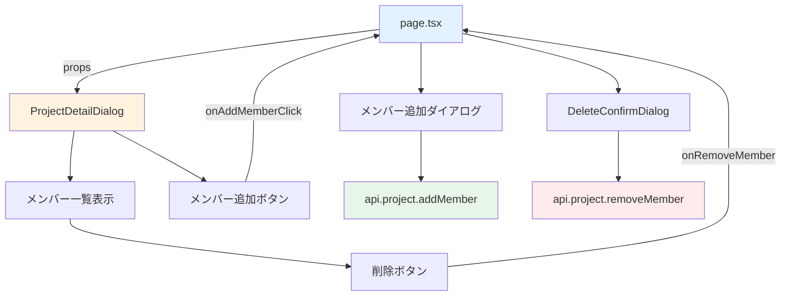

# Day 12: メンバー追加を実装しよう

## 🔙 前回の振り返り

Day 11 ではプロジェクトの編集・削除機能を実装しました。`DeleteConfirmDialog` による誤操作防止や `invalidate()` によるキャッシュ更新を学んだので、今日はプロジェクトにメンバーを追加・削除する機能に取り組みます。

---

## 🎯 今日のゴール

プロジェクトにメンバーを追加・削除できる機能を実装します。独立コンポーネント `ProjectDetailDialog` でメンバー管理UIを構築し、`page.tsx` からprops経由で操作を制御します。

📸 スクリーンショット: メンバー管理画面（プロジェクト詳細ダイアログ内）


## 🤔 なぜこれを作るのか？

チーム開発では、複数のメンバーが1つのプロジェクトで作業します。「誰がどんな役割で参加しているか」を管理する機能は、実務のタスク管理ツールに必須です。

> 💡 **例え話**: プロジェクトのメンバー管理は「サッカーチームのメンバー登録」です。監督（OWNER）、コーチ（ADMIN）、選手（MEMBER）、観客（VIEWER）のように、それぞれの役割を決めます。監督とコーチだけが新しい選手を入れたり外したりできます。

### 📐 メンバー管理の構造



### やること / やらないこと

| やること | やらないこと |
|---------|-------------|
| メンバー一覧の表示 | メンバーの権限システムの設計 |
| メンバー追加・削除 | 招待メール送信 |
| ロールを選んで追加 | ロール変更UI（今回のスコープ外） |
| 専用APIの呼び出し | Prisma のリレーション設計 |

### 🆕 新しく学ぶ概念

| 概念 | 読み方 | 役割 | 例え |
|------|--------|------|------|
| ロール | — | ユーザーの権限レベル | サッカーの監督・選手・観客 |
| 型ガード | かたがーど | 値の型を安全に判定する関数 | 「本当に監督か？」を確認する受付 |
| mutation（ミューテーション） | — | データを変更するAPI呼び出し | レストランで「注文を送る」操作 |

### 📁 今日の作業ファイル

```
src/
├── app/project/
│   └── page.tsx              ← メンバー追加ダイアログ・state管理
├── component/project/
│   └── project-detail-dialog.tsx  ← メンバー一覧表示（独立コンポーネント）
└── lib/constant/
    └── roles.ts              ← ロール定義・権限・型ガード
```

### ロール定義ファイル `roles.ts` の中身

`roles.ts` にはロール定数・ラベル・権限・型ガードがまとまっています。

| エクスポート | 型 | 用途 |
|-------------|-----|------|
| `PROJECT_MEMBER_ROLE` | `as const` オブジェクト | `OWNER`, `ADMIN`, `MEMBER`, `VIEWER` |
| `PROJECT_MEMBER_ROLE_LABELS` | `Record<ProjectMemberRole, string>` | 日本語ラベル（オーナー等） |
| `isProjectMemberRole()` | 型ガード関数 | `value` が有効なロールか判定 |

#### 権限ごとの操作可否

| 操作 | OWNER | ADMIN | MEMBER | VIEWER |
|------|-------|-------|--------|--------|
| メンバー管理（追加・削除） | ✅ | ✅ | ❌ | ❌ |
| プロジェクト編集 | ✅ | ✅ | ✅ | ❌ |
| タスク削除 | ✅ | ✅ | ❌ | ❌ |
| プロジェクト削除 | ✅ | ❌ | ❌ | ❌ |
| アーカイブ | ✅ | ❌ | ❌ | ❌ |
| 閲覧 | ✅ | ✅ | ✅ | ✅ |

> 💡 ADMINは「メンバー管理」と「タスク削除」はできますが、プロジェクト削除やアーカイブはできません。OWNERだけの特権です。

## 📊 実装ステップ一覧

| ステップ | 作業内容 | 所要時間 |
|---------|---------|---------|
| Step 1 | プロジェクト詳細ダイアログを接続する | 6分 |
| Step 2 | ProjectDetailDialogのpropsを確認する | 4分 |
| Step 3 | ロール関連のインポートとstateを準備する | 5分 |
| Step 4 | メンバー追加ダイアログのUIを作る | 7分 |
| Step 5 | メンバー追加APIを呼ぶ | 5分 |
| Step 6 | メンバー削除を実装する | 7分 |
| Step 7 | サーバー側の権限チェックを理解する | 5分 |
| Step 8 | 動作確認 | 6分 |

**合計時間**: 約45分

---

### Step 1: プロジェクト詳細ダイアログを接続する（6分）

🎯 **ゴール**: `page.tsx` から `ProjectDetailDialog` コンポーネントを呼び出し、プロジェクト詳細を表示します。

💻 **実装**:

`detailOpen` / `selectedProject` は Day 09 で宣言済みです。ハンドラーを追加します。`handleArchive` の下に以下を追加してください。

```typescript
// filepath: src/app/project/page.tsx
// handleArchiveの下に追加
const handleProjectClick = (
  projectId: string
) => {
  setSelectedProject(projectId);
  setDetailOpen(true);
};
const handleDetailClose = () => {
  setDetailOpen(false);
  setSelectedProject(null);
};
```

✅ **確認ポイント**:
- `handleProjectClick` と `handleDetailClose` が定義できた
- ファイルを保存してエラーが出ていない

選択中のプロジェクトデータを取得するクエリを追加します。既存の `useQuery` 群の末尾に追加してください。

```typescript
// filepath: src/app/project/page.tsx
// 既存のuseQuery群の末尾に追加
const { data: projectDetail } =
  api.project.getById.useQuery(
    { id: selectedProject ?? '' },
    { enabled: !!selectedProject },
  );
```

✅ **確認ポイント**:
- `useQuery` に `enabled` オプションを設定した
- 未選択時はAPIを呼ばない設定になっている

> 💡 `enabled: !!selectedProject` は「`selectedProject` がある場合だけAPIを呼ぶ」という設定です。未選択時に不要なリクエストを防ぎます。

プロジェクトカードをクリックして詳細ダイアログが開くことを確認しましょう。

📸 スクリーンショット: プロジェクト詳細ダイアログが表示されている画面


---

### Step 2: ProjectDetailDialogのpropsを確認する（4分）

🎯 **ゴール**: `ProjectDetailDialog` がどのようなpropsを受け取るか確認します。

`ProjectDetailDialog` は独立コンポーネントとして既に実装されています。propsの型定義を確認しましょう。

| props | 型 | 役割 |
|-------|-----|------|
| `projectDetail` | `ProjectDetail \| null \| undefined` | 表示するプロジェクトデータ |
| `onClose` | `() => void` | ダイアログを閉じる |
| `onAddMemberClick` | `() => void` | メンバー追加ダイアログを開く |
| `onRemoveMember` | `(userId: string) => void` | メンバー削除処理を実行 |
| `onArchive` | `(projectId: string, isArchived: boolean) => void` | アーカイブ切り替え |

✅ **確認ポイント**:
- 5つのpropsが定義されている
- `onRemoveMember` は `userId` を引数に取る

まず `handleRemoveMember` の仮実装を追加します。Step 6 で本実装に差し替えます。TypeScript のエラーを防ぐため、先にプレースホルダーを定義しておきます。

```typescript
// filepath: src/app/project/page.tsx
// 仮実装（Step 6で本実装に差し替え）
const handleRemoveMember = (
  userId: string
) => {
  console.log('remove:', userId);
};
```

✅ **確認ポイント**:
- TypeScript のエラーが出ていない

次に、JSX の `ProjectDialog` の直下に `ProjectDetailDialog` を配置します。

```typescript
// filepath: src/app/project/page.tsx
// ProjectDialogの直下に配置
<ProjectDetailDialog
  projectDetail={
    detailOpen ? projectDetail : null
  }
  onClose={handleDetailClose}
  onAddMemberClick={() =>
    setMemberDialogOpen(true)
  }
  onRemoveMember={handleRemoveMember}
  onArchive={handleArchive}
/>
```

✅ **確認ポイント**:
- `ProjectDetailDialog` に5つのpropsを渡している
- `detailOpen` が `false` のとき `null` を渡してダイアログを閉じている

> 💡 メンバー一覧の表示は `ProjectDetailDialog` の内部で行われます。`page.tsx` はデータ取得とイベントハンドラーの定義だけを担当し、UIの詳細は独立コンポーネントに任せます。

---

### Step 3: ロール関連のインポートとstateを準備する（5分）

🎯 **ゴール**: ロール定数・型ガードのインポートとメンバー追加用のstateを準備します。

💻 **実装**:

```typescript
// filepath: src/app/project/page.tsx
// ロール関連のインポート
import {
  isProjectMemberRole,
  PROJECT_MEMBER_ROLE,
  PROJECT_MEMBER_ROLE_LABELS,
  type ProjectMemberRole,
} from '@/lib/constant/roles';
```

✅ **確認ポイント**:
- インポート元が `@/lib/constant/roles` になっている（`@prisma/client` ではない）
- `isProjectMemberRole` 型ガードもインポートしている

> ⚠️ `@prisma/client` からインポートすると、Prisma内部の型定義に依存してしまいます。`@/lib/constant/roles` に定義された定数・型を使うのが正しい方法です。

追加可能なユーザー一覧とstate を定義します。state は `ProjectPageContent` 関数の先頭にある state 一覧に追加してください。

```typescript
// filepath: src/app/project/page.tsx
// 既存のstate一覧の末尾に追加
const [memberDialogOpen,
  setMemberDialogOpen] = useState(false);
const [newMemberUserId,
  setNewMemberUserId] = useState('');
const [newMemberRole, setNewMemberRole] =
  useState<ProjectMemberRole>(
    PROJECT_MEMBER_ROLE.MEMBER
  );
```

✅ **確認ポイント**:
- `newMemberRole` の初期値が `PROJECT_MEMBER_ROLE.MEMBER`（文字列 `'MEMBER'` ではない）
- 型が `ProjectMemberRole` で明示されている

```typescript
// filepath: src/app/project/page.tsx
// 追加可能なユーザーを取得
const { data: availableUsers } =
  api.project.getAvailableUsers.useQuery(
    { projectId: selectedProject ?? '' },
    { enabled: !!selectedProject },
  );
```

✅ **確認ポイント**:
- `getAvailableUsers` はプロジェクト未参加のユーザーだけを返す
- `enabled` で未選択時のリクエストを防いでいる

---

### Step 4: メンバー追加ダイアログのUIを作る（7分）

🎯 **ゴール**: ユーザーを選択してプロジェクトに追加するダイアログのUIを構築します。

💻 **実装**:

メンバー追加ダイアログは `ProjectDetailDialog` の直下に配置します。まずダイアログのヘッダー部分です。

```typescript
// filepath: src/app/project/page.tsx
// ProjectDetailDialogの直下に配置
<Dialog open={memberDialogOpen}
  onOpenChange={setMemberDialogOpen}>
  <DialogContent
    className="sm:max-w-[425px]">
    <DialogHeader>
      <DialogTitle>
        メンバー追加
      </DialogTitle>
      <DialogDescription>
        このプロジェクトに
        新しいメンバーを追加します。
      </DialogDescription>
    </DialogHeader>
```

✅ **確認ポイント**:
- `Dialog` の `open` / `onOpenChange` でダイアログ開閉を制御している

ユーザー選択のドロップダウンを追加します。

```typescript
// filepath: src/app/project/page.tsx
// ダイアログのbody部分: ユーザー選択
    <div className="grid gap-4 py-4">
      <div className="grid gap-2">
        <Label htmlFor="user">
          ユーザー
        </Label>
        <Select
          value={newMemberUserId}
          onValueChange={
            setNewMemberUserId
          }>
          <SelectTrigger id="user">
            <SelectValue
              placeholder="ユーザーを選択"
            />
          </SelectTrigger>
```

✅ **確認ポイント**:
- `Select` の `value` / `onValueChange` でユーザーIDを管理している

SelectContent 内にユーザー候補を表示します。

```typescript
// filepath: src/app/project/page.tsx
// ユーザー選択の候補リスト
          <SelectContent>
            {availableUsers?.map(
              (user) => (
                <SelectItem
                  key={user.id}
                  value={user.id}>
                  {user.name || user.email}
                </SelectItem>
              )
            )}
          </SelectContent>
        </Select>
      </div>
```

✅ **確認ポイント**:
- 名前がない場合はメールアドレスを表示する
- `availableUsers` はプロジェクト未参加ユーザーのみ

ロール選択では `isProjectMemberRole` 型ガードを使います。

```typescript
// filepath: src/app/project/page.tsx
// ロール選択UI: Select部分
      <div className="grid gap-2">
        <Label htmlFor="role">ロール</Label>
        <Select
          value={newMemberRole}
          onValueChange={(value) => {
            if (isProjectMemberRole(value))
              setNewMemberRole(value);
          }}>
          <SelectTrigger id="role">
            <SelectValue
              placeholder="ロールを選択"
            />
          </SelectTrigger>
```

✅ **確認ポイント**:
- `as ProjectMemberRole` ではなく `isProjectMemberRole()` 型ガードで安全に判定している

ロール選択肢はOWNERを除外して生成します。

```typescript
// filepath: src/app/project/page.tsx
// ロール選択の候補リスト
          <SelectContent>
            {Object.entries(
              PROJECT_MEMBER_ROLE_LABELS
            )
              .filter(([value]) =>
                value !==
                PROJECT_MEMBER_ROLE.OWNER
              )
              .map(([value, label]) => (
                <SelectItem
                  key={value}
                  value={value}>
                  {label}
                </SelectItem>
              ))}
          </SelectContent>
        </Select>
      </div>
    </div>
```

✅ **確認ポイント**:
- OWNERが選択肢から除外されている
- `PROJECT_MEMBER_ROLE_LABELS` から動的に選択肢を生成している

> 💡 `value as ProjectMemberRole` と書くと、TypeScriptの型チェックをすり抜けてしまいます。`isProjectMemberRole(value)` で実行時に検証するのが安全な方法です。

フッターボタンを追加してダイアログを完成させます。

```typescript
// filepath: src/app/project/page.tsx
// ダイアログのフッター
    <DialogFooter>
      <Button variant="outline"
        onClick={() =>
          setMemberDialogOpen(false)}>
        キャンセル
      </Button>
      <Button
        onClick={handleAddMember}
        disabled={!newMemberUserId}>
        メンバー追加
      </Button>
    </DialogFooter>
  </DialogContent>
</Dialog>
```

✅ **確認ポイント**:
- ユーザー未選択時は「メンバー追加」ボタンが `disabled` になる
- キャンセルボタンでダイアログが閉じる

📸 スクリーンショット: メンバー追加ダイアログでユーザーとロールを選択した状態


---

### Step 5: メンバー追加APIを呼ぶ（5分）

🎯 **ゴール**: 選択したユーザーをプロジェクトに追加するmutation（データを変更するAPI呼び出し）とハンドラーを実装します。

💻 **実装**:

mutation を既存の mutation 群の末尾に追加してください。

```typescript
// filepath: src/app/project/page.tsx
// 既存のmutation群の末尾に追加
const addMemberMutation =
  api.project.addMember.useMutation({
    onSuccess: () => {
      if (selectedProject) {
        utils.project.getById
          .invalidate(
            { id: selectedProject }
          );
      }
      setMemberDialogOpen(false);
      setNewMemberUserId('');
      setNewMemberRole(
        PROJECT_MEMBER_ROLE.MEMBER
      );
    },
  });
```

✅ **確認ポイント**:
- 成功時に `getById` のキャッシュを更新している
- ダイアログを閉じて、入力値を初期化している

ハンドラーを追加します。`handleArchive` の下に追加してください。

```typescript
// filepath: src/app/project/page.tsx
// handleArchiveの下に追加
const handleAddMember = () => {
  if (selectedProject
    && newMemberUserId) {
    addMemberMutation.mutate({
      projectId: selectedProject,
      userId: newMemberUserId,
      role: newMemberRole,
    });
  }
};
```

✅ **確認ポイント**:
- `selectedProject` と `newMemberUserId` の両方を確認している
- `role` に `newMemberRole` state の値をそのまま渡している

ここまでで、メンバー追加ができました。メンバー削除は Step 6 で実装します。まずはプロジェクトにメンバーを追加して、一覧に反映されることを確認してみましょう。

---

### Step 6: メンバー削除を実装する（7分）

🎯 **ゴール**: メンバーをプロジェクトから外す処理を、確認ダイアログ付きで実装します。

💻 **実装**:

Day 11 で学んだ `DeleteConfirmDialog` パターンを使い、確認ダイアログ経由で削除します。state を `ProjectPageContent` 関数の先頭に追加してください。

```typescript
// filepath: src/app/project/page.tsx
// 既存のstate一覧の末尾に追加
const [removeMemberDialogOpen,
  setRemoveMemberDialogOpen] =
  useState(false);
const [removeMemberTargetId,
  setRemoveMemberTargetId] =
  useState<string | null>(null);
```

✅ **確認ポイント**:
- Day 11 のプロジェクト削除と同じパターンを使っている
- `removeMemberTargetId` に削除対象のuserIdを保持する

mutation と handler を追加します。

```typescript
// filepath: src/app/project/page.tsx
// addMemberMutationの直下に追加
const removeMemberMutation =
  api.project.removeMember.useMutation({
    onSuccess: () => {
      if (selectedProject) {
        utils.project.getById
          .invalidate(
            { id: selectedProject }
          );
      }
    },
  });
```

✅ **確認ポイント**:
- 成功時に `getById` キャッシュを更新してメンバー一覧を再取得している

```typescript
// filepath: src/app/project/page.tsx
// handleAddMemberの下に追加
const handleRemoveMember = (
  userId: string
) => {
  setRemoveMemberTargetId(userId);
  setRemoveMemberDialogOpen(true);
};
```

✅ **確認ポイント**:
- 直接 `mutate` を呼ばず、まず確認ダイアログを開いている

JSX の `</AppLayout>` の直前に `DeleteConfirmDialog` を配置します。

```typescript
// filepath: src/app/project/page.tsx
// </AppLayout>の直前に配置
<DeleteConfirmDialog
  open={removeMemberDialogOpen}
  onOpenChange={
    setRemoveMemberDialogOpen
  }
  onConfirm={() => {
    if (selectedProject
      && removeMemberTargetId) {
      removeMemberMutation.mutate({
        projectId: selectedProject,
        userId: removeMemberTargetId,
      });
    }
  }}
  isPending={
    removeMemberMutation.isPending
  }
  title="このメンバーを削除しますか？"
/>
```

✅ **確認ポイント**:
- `onConfirm` で `selectedProject` と `removeMemberTargetId` の両方を確認している
- `title` でメンバー削除専用のメッセージを表示している

| `window.confirm()` | `DeleteConfirmDialog` |
|--------------------|-----------------------|
| ブラウザ標準のダイアログ | shadcn/ui ベースの統一デザイン |
| カスタマイズ不可 | タイトル・説明を自由に設定 |
| ローディング状態なし | `isPending` でボタン制御 |

📸 スクリーンショット: メンバー削除の確認ダイアログが表示されている画面


---

### Step 7: サーバー側の権限チェックを理解する（5分）

🎯 **ゴール**: フロントエンドとバックエンドの権限チェックの仕組みを理解します。

> ⚠️ **このステップのコードは既存実装です。今日は編集しません。** 仕組みを理解するために確認するだけです。

メンバー追加APIでは `assertMemberPermission` 関数で権限チェックを行います。以下は教材用の抜粋です。

```typescript
// filepath: src/server/api/routers/project.ts
// 既存実装（確認のみ・編集不要）
addMember: protectedProcedure
  .input(projectMemberSchema)
  .mutation(async ({ ctx, input }) => {
    const userMember = await
      prisma.projectMember.findUnique({
        where: {
          userId_projectId: {
            userId: ctx.session.userId,
            projectId: input.projectId,
          },
        },
      });
    assertMemberPermission(
      userMember ? [userMember] : [],
      'canManageMembers',
    );
  }),
```

✅ **確認ポイント**:
- まず操作を実行するユーザー自身の権限を取得している
- `'canManageMembers'` でメンバー管理権限をチェックしている

#### フロントエンドとバックエンドの権限チェック比較

| 観点 | フロントエンド | バックエンド |
|------|-------------|------------|
| 目的 | UX向上（不要なボタンを隠す） | セキュリティ（不正リクエスト防止） |
| 実装箇所 | `ProjectDetailDialog` | `project.ts` の各mutation |
| 回避方法 | 開発者ツールで回避可能 | 回避不可能 |
| 必須度 | 推奨 | **必須** |

> 💡 フロントエンドでボタンを非表示にしても、APIレベルでも権限チェックされています。両方で制御するのがセキュリティの基本です。悪意あるユーザーはブラウザの開発ツールからAPIを直接叩けるので、サーバー側のチェックが最後の砦です。

権限がなかった場合どうなるか、テストシナリオで確認してみましょう。MEMBER権限のユーザーでメンバー追加を試みると、サーバーから「この操作を実行する権限がありません」というエラーが返されます。

✅ **確認ポイント**:
- 権限がない場合は `FORBIDDEN` エラーが返される
- フロントとバックの二重防御になっている

---

### Step 8: 動作確認（6分）

🎯 **ゴール**: メンバー管理の全機能をテストシナリオに沿って確認します。

```bash
# filepath: ターミナル
# 開発サーバーを起動して動作確認
npm run dev
```

✅ **確認ポイント**:
- 開発サーバーがエラーなく起動した

#### テストシナリオ 1: メンバー追加

| 手順 | 操作 | 期待結果 |
|------|------|---------|
| 1 | プロジェクトカードをクリック | 詳細ダイアログが開く |
| 2 | 「メンバー追加」ボタンをクリック | メンバー追加ダイアログが開く |
| 3 | ユーザーを選択、ロールを選択 | ドロップダウンが正常に動作 |
| 4 | 「メンバー追加」をクリック | ダイアログが閉じ、メンバー一覧に追加される |

#### テストシナリオ 2: メンバー削除

| 手順 | 操作 | 期待結果 |
|------|------|---------|
| 1 | メンバーの削除ボタンをクリック | 確認ダイアログが表示される |
| 2 | 「削除」を確認 | メンバー一覧から削除される |
| 3 | OWNERの削除ボタンを確認 | ボタンが `disabled` で押せない |

📸 スクリーンショット: メンバーが追加され一覧に表示されている画面


✅ **確認ポイント**:
- 全2シナリオが期待通りに動作する
- メンバー追加後、メンバー一覧が自動更新される
- OWNERの削除ボタンが無効化されている
- ロールが日本語で表示される（オーナー、管理者、メンバー、閲覧者）

---

## 📋 今日のまとめ

- [ ] `ProjectDetailDialog` コンポーネントでメンバー一覧を表示できた
- [ ] `addMember` でメンバーを追加できた
- [ ] `DeleteConfirmDialog` 経由で `removeMember` を実行できた
- [ ] `isProjectMemberRole` 型ガードの使い方を理解した
- [ ] 権限チェックの仕組み（フロントエンド + バックエンド）を理解した

## ⚠️ つまずきポイント

| エラー / 問題 | 原因 | 解決方法 |
|--------------|------|---------|
| 「メンバーは既に存在します」 | 同じユーザーを二度追加 | `getAvailableUsers` で既存メンバーを除外済み。ブラウザ更新して再試行 |
| 「最後のOWNERは削除できません」 | OWNERが1人しかいない | テスト用に2人目のOWNERがいる状態で削除制約を確認する |
| キャッシュが更新されない | `invalidate()` の呼び忘れ | `onSuccess` で `getById.invalidate()` を確認する |
| 「この操作を実行する権限がありません」 | MEMBER/VIEWERで管理操作を試行 | OWNER/ADMINアカウントでログインする |
| `@prisma/client` からインポートエラー | インポート先の間違い | `@/lib/constant/roles` からインポートする |

## 📝 今日学んだ用語

| 用語 | 意味 |
|------|------|
| ロール | ユーザーに割り当てられた権限レベル（OWNER/ADMIN/MEMBER/VIEWER） |
| 型ガード | 値の型を実行時に安全に判定する関数。`as` キャストより安全 |
| mutation（ミューテーション） | データを変更するAPI呼び出し。レストランで「注文を送る」のような操作 |
| canManageMembers | メンバーの追加・削除ができる権限（OWNER/ADMINが持つ） |
| 二重防御 | フロントエンド（UI制御）とバックエンド（API制御）の両方で権限チェックすること |

## 🔜 次回予告

Day 13 では、タスク一覧ページを作ります。プロジェクトの中にタスクを追加・管理する、アプリの核となる機能です。
