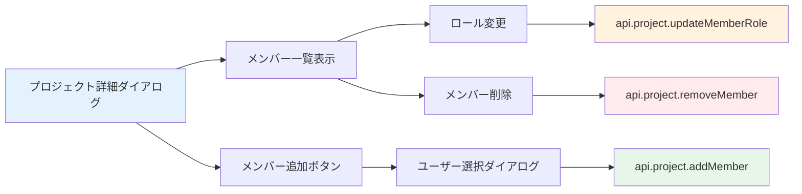

# Day 12: メンバー追加を実装しよう

## 🎯 今日のゴール

プロジェクトにメンバーを追加・削除し、ロール（役割）を変更できる機能を実装します。プロジェクト詳細ダイアログ内でメンバー管理UIを構築します。

【スクリーンショット: メンバー管理画面】

## 🤔 なぜこれを作るのか？

チーム開発では、複数のメンバーが1つのプロジェクトで作業します。「誰がどんな役割で参加しているか」を管理する機能は、実務のタスク管理ツールに必須です。

> 💡 **例え話**: プロジェクトのメンバー管理は「サッカーチームのメンバー登録」です。監督（OWNER）、コーチ（ADMIN）、選手（MEMBER）、観客（VIEWER）のように、それぞれの役割を決めます。監督だけが新しい選手を入れたり外したりできます。

### 📐 メンバー管理の構造



### やること / やらないこと

| やること | やらないこと |
|---------|-------------|
| メンバー一覧の表示 | メンバーの権限システムの設計 |
| メンバー追加・削除 | 招待メール送信 |
| ロール変更UI | ロールの詳細な権限定義 |
| 専用APIの呼び出し | Prisma のリレーション設計 |

### 🆕 新しく学ぶ概念

| 概念 | 読み方 | 役割 | 例え |
|------|--------|------|------|
| ロール | — | ユーザーの権限レベル | サッカーの監督・選手・観客 |
| リレーション | — | テーブル間の関連付け | プロジェクトと参加者の紐付け |

#### プロジェクトメンバーのロール一覧

| ロール | 権限 | 説明 |
|--------|------|------|
| OWNER | 全操作 + メンバー管理 + 削除 | プロジェクトの所有者 |
| ADMIN | 編集 + メンバー管理 | 管理担当者 |
| MEMBER | タスクの操作 | 一般メンバー |
| VIEWER | 閲覧のみ | 閲覧者 |

## 📊 実装ステップ一覧

| ステップ | 作業内容 | 所要時間 |
|---------|---------|---------|
| Step 1 | プロジェクト詳細ダイアログを作る | 7分 |
| Step 2 | メンバー一覧を表示する | 5分 |
| Step 3 | メンバー追加ダイアログを作る | 7分 |
| Step 4 | メンバー追加APIを呼ぶ | 5分 |
| Step 5 | ロール変更を実装する | 5分 |
| Step 6 | メンバー削除を実装する | 5分 |
| Step 7 | 権限に応じた表示制御 | 5分 |
| Step 8 | 動作確認 | 3分 |

**合計時間**: 約42分

---

### Step 1: プロジェクト詳細ダイアログを作る（7分）

🎯 **ゴール**: プロジェクトの詳細情報を表示するダイアログを作ります。

💻 **実装**:

```typescript
// filepath: src/app/project/page.tsx
// ProjectPageContent内にstateを追加
const [detailOpen, setDetailOpen] =
  useState(false);
const [selectedProject, setSelectedProject] =
  useState<string | null>(null);

// 詳細表示ハンドラー
const handleDetail = (projectId: string) => {
  setSelectedProject(projectId);
  setDetailOpen(true);
};
```

選択中のプロジェクトデータを取得します。

```typescript
// filepath: src/app/project/page.tsx
// 選択中プロジェクトの詳細を取得
const { data: projectDetail } =
  api.project.getById.useQuery(
    { id: selectedProject || '' },
    { enabled: !!selectedProject },
  );
```

> 💡 `enabled: !!selectedProject` は「`selectedProject` がある場合だけAPIを呼ぶ」という設定です。未選択時に不要なリクエストを防ぎます。

✅ **確認ポイント**:
- カードクリックで詳細ダイアログが開く
- プロジェクト名と説明が表示される

---

### Step 2: メンバー一覧を表示する（5分）

🎯 **ゴール**: プロジェクトの参加メンバーをリスト表示します。

💻 **実装**:

```typescript
// filepath: src/app/project/page.tsx
// UIコンポーネントのimportとメンバー見出し
import { Avatar, AvatarFallback, AvatarImage }
  from '@/component/ui/avatar';
import { Badge } from '@/component/ui/badge';

// 詳細ダイアログ内にメンバー表示
<h3 className="font-semibold mb-2">
  メンバー
</h3>
```

各メンバーをアバター・名前・ロールBadge付きでリスト表示します。

```typescript
// filepath: src/app/project/page.tsx
// メンバー一覧のリスト表示
<div className="space-y-2">
  {projectDetail?.members.map((member) => (
    <div key={member.id}
      className="flex items-center gap-3">
      <Avatar className="h-8 w-8">
        <AvatarImage
          src={member.user.avatar || ''} />
        <AvatarFallback>
          {member.user.name?.[0]}
        </AvatarFallback>
      </Avatar>
      <span>{member.user.name}</span>
      <Badge variant="outline">
        {member.role}
      </Badge>
    </div>
  ))}
</div>
```

✅ **確認ポイント**:
- メンバーのアバター・名前・ロールが表示される
- 複数メンバーがリスト表示される

【スクリーンショット: メンバー一覧の表示】

---

### Step 3: メンバー追加ダイアログを作る（7分）

🎯 **ゴール**: ユーザーを選択してプロジェクトに追加するダイアログを作ります。

💻 **実装**:

```typescript
// filepath: src/app/project/page.tsx
import {
  Select,
  SelectContent,
  SelectItem,
  SelectTrigger,
  SelectValue,
} from '@/component/ui/select';

// 全ユーザーを取得（メンバー候補）
const { data: allUsers } =
  api.user.getAll.useQuery();

// メンバー追加用のstate
const [memberDialogOpen, setMemberDialogOpen]
  = useState(false);
const [selectedUserId, setSelectedUserId] =
  useState('');
const [selectedRole, setSelectedRole] =
  useState('MEMBER');
```

```typescript
// filepath: src/app/project/page.tsx
// メンバー追加ダイアログ - ユーザー選択
<div className="space-y-4">
  <Select onValueChange={setSelectedUserId}>
    <SelectTrigger>
      <SelectValue placeholder="ユーザーを選択" />
    </SelectTrigger>
    <SelectContent>
      {allUsers?.map((user) => (
        <SelectItem key={user.id}
          value={user.id}>
          {user.name} ({user.email})
        </SelectItem>
      ))}
    </SelectContent>
  </Select>
```

続いて、追加するメンバーのロールを選択するドロップダウンを配置します。

```typescript
// filepath: src/app/project/page.tsx
// メンバー追加ダイアログ - ロール選択
  <Select value={selectedRole}
    onValueChange={setSelectedRole}>
    <SelectTrigger>
      <SelectValue placeholder="ロール" />
    </SelectTrigger>
    <SelectContent>
      <SelectItem value="MEMBER">MEMBER</SelectItem>
      <SelectItem value="VIEWER">VIEWER</SelectItem>
      <SelectItem value="ADMIN">ADMIN</SelectItem>
    </SelectContent>
  </Select>
</div>
```

✅ **確認ポイント**:
- ユーザー選択のドロップダウンが表示される
- ロール選択のドロップダウンが表示される

---

### Step 4: メンバー追加APIを呼ぶ（5分）

🎯 **ゴール**: 選択したユーザーをプロジェクトに追加します。

💻 **実装**:

```typescript
// filepath: src/app/project/page.tsx
// メンバー追加のmutation
const addMemberMutation =
  api.project.addMember.useMutation({
    onSuccess: () => {
      utils.project.getById.invalidate();
      setMemberDialogOpen(false);
      toast.success('メンバーを追加しました');
    },
    onError: (err) => {
      toast.error(err.message);
    },
  });

// 追加ハンドラー
const handleAddMember = () => {
  if (!selectedProject || !selectedUserId)
    return;
  addMemberMutation.mutate({
    projectId: selectedProject,
    userId: selectedUserId,
    role: selectedRole as
      'OWNER' | 'ADMIN' | 'MEMBER' | 'VIEWER',
  });
};
```

✅ **確認ポイント**:
- メンバー追加でトースト通知が表示される
- メンバー一覧に新メンバーが表示される

---

### Step 5: ロール変更を実装する（5分）

🎯 **ゴール**: メンバーのロールを変更できるようにします。

💻 **実装**:

```typescript
// filepath: src/app/project/page.tsx
// ロール変更のmutation
const updateRoleMutation =
  api.project.updateMemberRole.useMutation({
    onSuccess: () => {
      utils.project.getById.invalidate();
      toast.success('ロールを変更しました');
    },
  });

// ロール変更ハンドラー
const handleRoleChange = (
  userId: string,
  newRole: string
) => {
  if (!selectedProject) return;
  updateRoleMutation.mutate({
    projectId: selectedProject,
    userId,
    role: newRole as
      'OWNER' | 'ADMIN' | 'MEMBER' | 'VIEWER',
  });
};
```

> 💡 メンバー一覧のBadgeをSelectに変更すると、ロールをドロップダウンで変更できるようになります。

✅ **確認ポイント**:
- ロールを変更するとBadgeが更新される
- トースト通知が表示される

---

### Step 6: メンバー削除を実装する（5分）

🎯 **ゴール**: メンバーをプロジェクトから外す処理を実装します。

💻 **実装**:

```typescript
// filepath: src/app/project/page.tsx
// メンバー削除のmutation
const removeMemberMutation =
  api.project.removeMember.useMutation({
    onSuccess: () => {
      utils.project.getById.invalidate();
      toast.success('メンバーを削除しました');
    },
    onError: (err) => {
      toast.error(err.message);
    },
  });
```

続いて、確認ダイアログを表示してからメンバーを削除するハンドラーを定義します。

```typescript
// filepath: src/app/project/page.tsx
// 削除ハンドラー
const handleRemoveMember = (
  userId: string
) => {
  if (!selectedProject) return;
  const confirmed = window.confirm(
    'このメンバーを削除しますか？'
  );
  if (confirmed) {
    removeMemberMutation.mutate({
      projectId: selectedProject,
      userId,
    });
  }
};
```

> 💡 OWNER が最後の1人の場合、サーバー側でエラーになります。プロジェクトには必ず1人以上の OWNER が必要です。

✅ **確認ポイント**:
- 確認ダイアログが表示される
- 削除後にメンバー一覧が更新される

---

### Step 7: 権限に応じた表示制御（5分）

🎯 **ゴール**: OWNER/ADMIN のみがメンバー管理できるようにします。

💻 **実装**:

```typescript
// filepath: src/app/project/page.tsx
// 現在のユーザーのロールを判定
const currentMember =
  projectDetail?.members.find(
    (m) => m.user.id === session?.user?.id
  );
const canManageMembers =
  currentMember?.role === 'OWNER'
  || currentMember?.role === 'ADMIN';

// 条件付きで追加ボタンを表示
{canManageMembers && (
  <Button
    size="sm"
    onClick={() => setMemberDialogOpen(true)}>
    メンバーを追加
  </Button>
)}
```

#### 権限ごとの操作可否

| 操作 | OWNER | ADMIN | MEMBER | VIEWER |
|------|-------|-------|--------|--------|
| メンバー追加 | ✅ | ✅ | ❌ | ❌ |
| ロール変更 | ✅ | ✅ | ❌ | ❌ |
| メンバー削除 | ✅ | ✅ | ❌ | ❌ |
| プロジェクト削除 | ✅ | ❌ | ❌ | ❌ |

> 💡 フロントエンドで非表示にしても、APIレベルでも権限チェックされています。両方で制御するのがセキュリティの基本です。

✅ **確認ポイント**:
- OWNER/ADMIN では「メンバーを追加」ボタンが見える
- MEMBER/VIEWER ではボタンが非表示

【スクリーンショット: OWNER権限でのメンバー管理画面】

---

### Step 8: 動作確認（3分）

🎯 **ゴール**: メンバー管理の全機能を確認します。

1. プロジェクトカードをクリックして詳細を開く
2. メンバー一覧が表示されることを確認
3. 「メンバーを追加」でユーザーを追加
4. ロールを変更
5. メンバーを削除
6. MEMBER ロールのアカウントで管理ボタンが非表示であることを確認

✅ **確認ポイント**:
- メンバーの追加・変更・削除が動作する
- 権限に応じてボタンが表示/非表示になる

---

## 📋 今日のまとめ

- [ ] プロジェクト詳細ダイアログでメンバーを表示できた
- [ ] `addMember` でメンバーを追加できた
- [ ] `updateMemberRole` でロールを変更できた
- [ ] `removeMember` でメンバーを削除できた
- [ ] 権限に応じた表示制御を実装できた

## ⚠️ つまずきポイント

| エラー / 問題 | 原因 | 解決方法 |
|--------------|------|---------|
| 「メンバーは既に存在します」 | 同じユーザーを二度追加 | 既存メンバーを候補から除外する |
| 「最後のOWNERは削除できません」 | OWNER が1人しかいない | 別のメンバーを先にOWNERにする |
| ロール変更が反映されない | `invalidate()` の呼び忘れ | `onSuccess` で `getById.invalidate()` を追加 |
| 管理ボタンが見えない | MEMBER でログインしている | OWNER アカウントでログインする |

## 📝 今日学んだ用語

| 用語 | 意味 |
|------|------|
| ロール | ユーザーに割り当てられた権限レベル |
| OWNER | プロジェクトの所有者。全権限を持つ |
| リレーション | データベースのテーブル間の関連付け |
| 権限チェック | 操作の可否をユーザーの権限で判定すること |

## 🔗 次回予告

Day 13 では、タスク一覧ページを作ります。プロジェクトの中にタスクを追加・管理する、アプリの核となる機能です。
