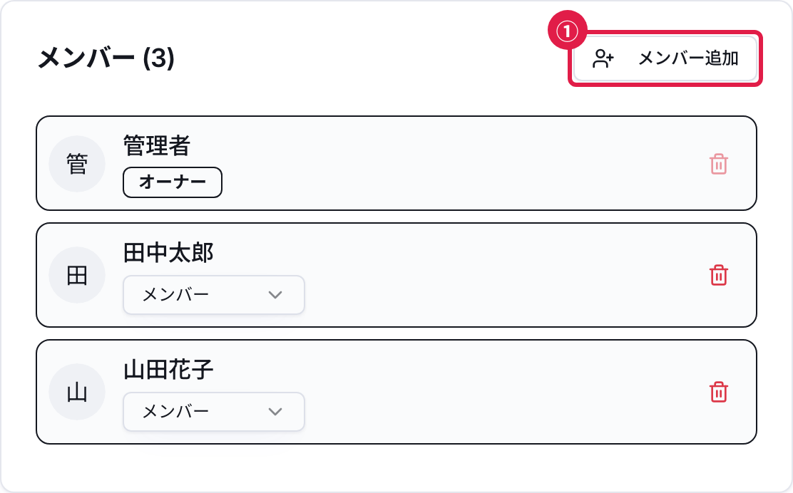
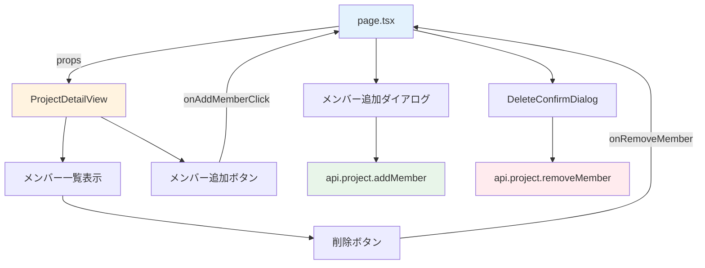
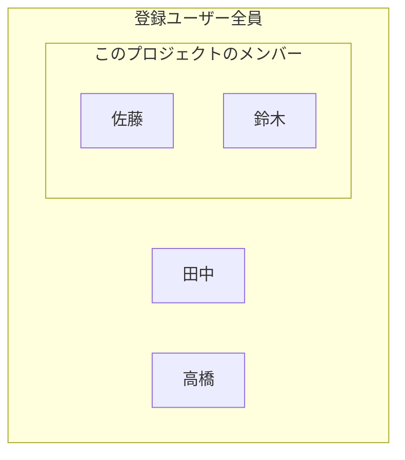
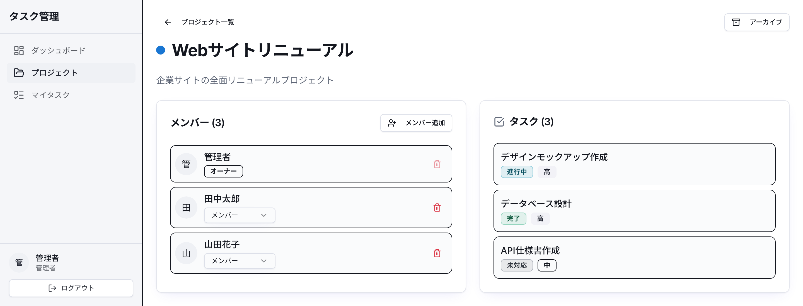
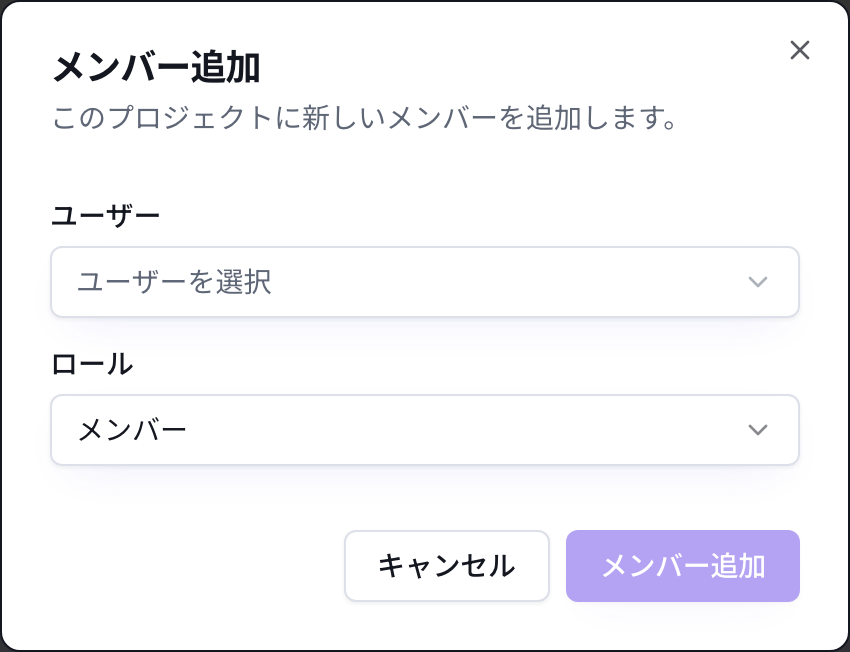
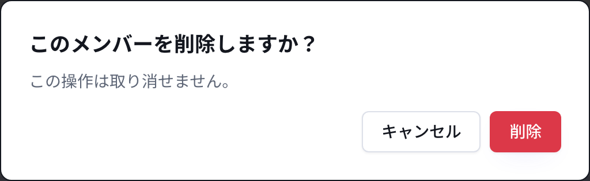
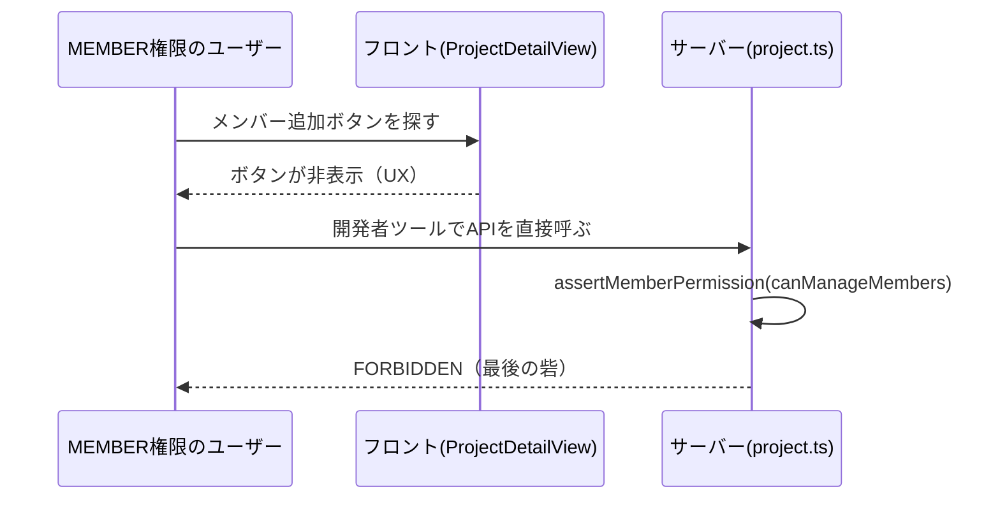
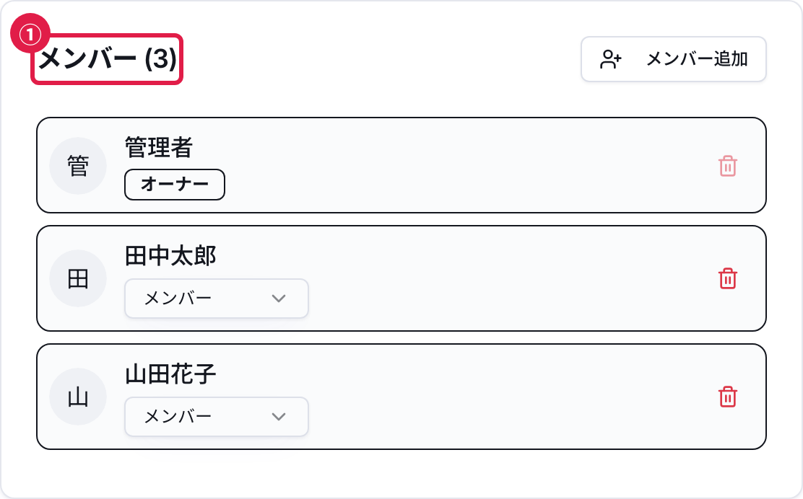
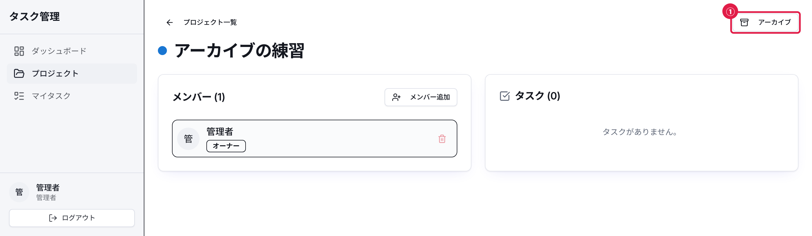
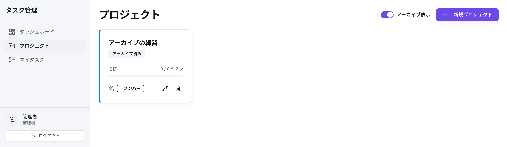

# Day 12: メンバー追加を実装しよう

## 前回の振り返り

Day 11 ではプロジェクトの編集・削除機能を実装しました。`DeleteConfirmDialog` による誤操作防止や `invalidate()` によるキャッシュ更新を学んだので、今日はメンバー管理に進みます。

---

## 今日のゴール

プロジェクトにメンバーを追加・削除できる機能を実装します。`ProjectDetailView` コンポーネントでメンバー一覧を表示し、`page.tsx` からprops経由で操作を制御します。

この日は、まずサーバー側の `getById` / `getAvailableUsers` / `addMember` / `removeMember` / `updateMemberRole` の5つを自分で書きます。そのあと画面をつなぎます。

スクリーンショット: メンバー管理画面（プロジェクト詳細ページ内）



## なぜこれを作るのか

チーム開発では、複数のメンバーが1つのプロジェクトで作業します。「誰がどんな役割で参加しているか」を管理する機能は、実務のタスク管理ツールに必須です。

> **例え話**: プロジェクトのメンバー管理は「サッカーチームのメンバー登録」です。監督（OWNER）、コーチ（ADMIN）、選手（MEMBER）、観客（VIEWER）のように、それぞれの役割を決めます。監督とコーチだけが新しい選手を入れたり外したりできます。

### メンバー管理の構造


```mermaid
flowchart TD
    A[page.tsx] -->|props| B[ProjectDetailView]
    B --> C[メンバー一覧表示]
    B --> D[メンバー追加ボタン]
    D -->|onAddMemberClick| A
    A --> E[メンバー追加ダイアログ]
    E --> F[api.project.addMember]
    C --> G[削除ボタン]
    G -->|onRemoveMember| A
    A --> H[DeleteConfirmDialog]
    H --> I[api.project.removeMember]

    style A fill:#e3f2fd
    style B fill:#fff3e0
    style F fill:#e8f5e9
    style I fill:#ffebee
```

図の中で `page.tsx` から下へ伸びる矢印は props、下から戻る矢印はコールバックです。メンバー一覧やボタンを描くのは `ProjectDetailView` ですが、ダイアログを開いているかどうかの state と API 呼び出しは `page.tsx` が持ちます。`ProjectDetailView` は「追加ボタンが押されました」と親へ伝えるだけです。役割をこう分けておくと、追加と削除のどちらでもメンバー一覧を取り直す処理が `page.tsx` の1か所にまとまります。矢印の終点は `api.project.addMember` と `api.project.removeMember` です。画面がボタンを隠しても、追加や削除を最終的に許すかどうかを決めるのはサーバー側のこの2つになります。

### やること / やらないこと

| やること | やらないこと |
|---------|-------------|
| メンバー一覧の表示 | メンバーの権限システムの設計 |
| メンバー追加・削除 | 招待メール送信 |
| ロールを選んで追加 | ロール変更UIの見た目・操作（配布済みのまま） |
| 専用APIの呼び出し | Prisma のリレーション（テーブル同士のつながりの定義）設計 |
| `updateMemberRole` を自分で書く | ロール変更ボタンをどこに配置するかの調整 |

### 新しく学ぶ概念

| 概念 | 読み方 | 役割 | 例え |
|------|--------|------|------|
| ロール | — | ユーザーの権限レベル | サッカーの監督・選手・観客 |
| 型ガード | かたがーど | 値の型を安全に判定する関数 | 「本当に監督か」を確認する受付 |
| mutation（ミューテーション） | — | データを変更するAPI呼び出し | レストランで「注文を送る」操作 |

### 今日の作業ファイル

```
src/
├── app/project/
│   └── page.tsx              ← 追加ダイアログと state 管理
├── component/project/
│   └── project-detail-view.tsx  ← メンバー一覧の表示
├── lib/constant/
│   └── roles.ts              ← ロール定義・権限・型ガード
└── server/api/routers/
    └── project.ts            ← Step 0 で手続きを5本追加
```

この4つのうち、今日ゼロから書き足すのは `project.ts` の手続きです。`roles.ts` にはロールの一覧と権限の対応表がすでに入っています。`project-detail-view.tsx` にはメンバー一覧の見た目が用意されています。だから今日の作業は「並べる部品はそろっている、それを動かす配線とサーバー側の許可判定を自分で書く」という形になります。`page.tsx` はその配線を置く場所で、Day 09 から続けて書き足しているファイルです。どこに何を足すのか分からなくなったら、この一覧に戻ってきてください。

### ロール定義ファイル `roles.ts` の中身

`roles.ts` にはロール定数・ラベル・権限・型ガードがまとまっています。ここでは定義一覧を見つつ、**Day 12 で使う `project.ts` のAPIが実際に何を許可しているか** に合わせて整理します。

| エクスポート | 型 | 用途 |
|-------------|-----|------|
| `PROJECT_MEMBER_ROLE` | `as const` オブジェクト | `OWNER`, `ADMIN`, `MEMBER`, `VIEWER` |
| `PROJECT_MEMBER_ROLE_LABELS` | `Record<ProjectMemberRole, string>` | 日本語ラベル（オーナー等） |
| `isProjectMemberRole()` | 型ガード関数 | `value` が有効なロールか判定 |

#### `project.ts` で実際に通る操作

| 操作 | OWNER | ADMIN | MEMBER | VIEWER |
|------|-------|-------|--------|--------|
| プロジェクト閲覧 | ✅ | ✅ | ✅ | ✅ |
| メンバー追加 | ✅ | ✅ | ❌ | ❌ |
| メンバー削除 | ✅ | ✅ | ❌ | ❌ |
| メンバーロール変更 | ✅ | ✅ | ❌ | ❌ |
| プロジェクト更新（名前・説明・開始日・終了日） | ✅ | ✅ | ❌ | ❌ |
| アーカイブ / アーカイブ解除 | ✅ | ❌ | ❌ | ❌ |

> `roles.ts` には `canEdit` という権限定義がありますが、`project.ts` の `update` API は `canManageMembers` を見ています。そのため、**プロジェクト編集もOWNER/ADMINだけ** が実行できます。教材を読むときは「定義ファイルの理論値」ではなく、「サーバーがどの権限で判定しているか」を確認するのが大切です。

## 実装ステップ一覧

| ステップ | 作業内容 | 所要時間 |
|---------|---------|---------|
| Step 0 | project.ts に getById/getAvailableUsers/addMember/removeMember/updateMemberRole を自分で書く | 25分 |
| Step 1 | プロジェクト詳細ビューを接続する | 6分 |
| Step 2 | ProjectDetailViewのpropsを確認する | 4分 |
| Step 3 | メンバー追加用のstateを準備する | 6分 |
| Step 4 | メンバー追加ダイアログのUIを作る | 7分 |
| Step 5 | メンバー追加APIを呼ぶ | 5分 |
| Step 6 | メンバー削除を実装する | 7分 |
| Step 7 | サーバー側の権限チェックを理解する | 5分 |
| Step 8 | 動作確認 | 6分 |

**合計時間**: 約71分です。

この時間はコードを読んで理解する目安です。写経して打ち込む時間、詰まって調べる時間は別に見てください。

---

### Step 0: project.ts に getById/getAvailableUsers/addMember/removeMember/updateMemberRole を自分で書く（25分）

**ゴール**: プロジェクト詳細取得・追加可能ユーザー取得・メンバー追加・メンバー削除・メンバー権限変更の5つの手続きを追加します。

#### 0-1. getById（1件だけ取得する）

`getAll` は複数件を `findMany` で取っていましたが、`getById` は1件だけを `findUnique` で取ります。貼り先はこのすぐ下に書いてあります。

先頭の `protectedProcedure`（ログイン必須の入口）に `.query`（読み取り用の手続き）をつなげて、ログイン済みの人だけが呼べる読み取りAPIにします。データを書き換えるときは `.query` の代わりに `.mutation`（書き込み用の手続き）を使い分けます。入力の `id` は `.cuid()`（cuid形式のID検証）で、決まった形式のIDだけを受け付けます。

まず `findUnique` で1件検索します。詳細画面はタスクの担当者（`assignee`）も表示するので、`include`（関連データも一緒に取る指定）で `tasks` に紐づく `assignee` も一緒に取ります。

ここから先の「（続き）」のブロックは、`project.ts` の**末尾にある `});` の1行上**へ貼ります。ファイルの一番下に足すとルーターの外に出てしまい、英語のエラーで止まります。`});` は増やしません。

```typescript
// filepath: src/server/api/routers/project.ts（続き）
  getById: protectedProcedure
    .input(z.object({ id: z.string().cuid() }))
    .query(async ({ ctx, input }) => {
      const project = await prisma.project.findUnique({
        where: { id: input.id },
        include: {
          members: {
            include: {
              user: {
                select: { ...USER_SELECT, role: true },
              },
            },
          },
          tasks: {
            include: {
              assignee: {
                select: USER_SELECT,
              },
            },
            orderBy: [{ position: 'asc' }, { createdAt: 'desc' }],
          },
        },
      });
```

`include` に `members` と `tasks` を並べているのは、詳細画面がこの2つを同じ画面に出すからです。別々のAPIで取ると通信が2回になり、片方だけ古い内容のまま表示される瞬間ができます。`members` の中でさらに `user` を `include` しているのは、`ProjectMember` の行が持っているのは `userId` だけで、画面に出す名前やアイコンはユーザー側にあるためです。ここを省くと、メンバー一覧に並ぶのは名前ではなく英数字のIDになります。

続けて、見つからなかったときのチェックです。`TRPCError`（tRPCのエラーを返す仕組み）を使い、該当がなければ処理を止めてエラーを呼び出し側へ返します。

```typescript
// filepath: src/server/api/routers/project.ts（続き）
      if (!project) {
        throw new TRPCError({
          code: 'NOT_FOUND',
          message: 'プロジェクトが見つかりません',
        });
      }
```

`getAll` は一覧なので「見つからない」というケースがありませんでした。`getById` は違います。指定した `id` のプロジェクトは存在しないこともあるため、`NOT_FOUND` チェックが必要です。

続けて権限チェックと戻り値です。`ctx.session`（サーバーが持つログイン情報）には、いまログインしているユーザーの `userId` が入っています。

```typescript
// filepath: src/server/api/routers/project.ts（続き）
      assertMemberPermission(
        project.members.filter((m) => m.userId === ctx.session.userId),
        'canView',
      );

      return project;
    }),
```

`getAll` では `where` で「自分がメンバーのものだけ」を絞り込んでいましたが、`getById` は先にプロジェクトを取得してから、取得した `members` の中に自分がいるかを `filter` で確認しています。他人のプロジェクトの `id` を直接指定されても、メンバーでなければ `canView` の権限チェックで弾かれます。

#### 0-2. getAvailableUsers（まだ参加していないユーザーを探す）

メンバー追加ダイアログの候補一覧に使う手続きです。`getById` の下に追加します。まず自分の権限を確認します。ここでは `userId_projectId`（2つの列を組にした一意キー）で、ログイン中のユーザーがこのプロジェクトのメンバーかどうかを1件だけ引き当てます。

```typescript
// filepath: src/server/api/routers/project.ts（続き）
  getAvailableUsers: protectedProcedure
    .input(z.object({ projectId: z.string().cuid() }))
    .query(async ({ ctx, input }) => {
      const userMember = await prisma.projectMember.findUnique({
        where: {
          userId_projectId: {
            userId: ctx.session.userId,
            projectId: input.projectId,
          },
        },
      });

      assertMemberPermission(userMember ? [userMember] : [], 'canManageMembers');
```

`userId_projectId` で引くと、プロジェクトとユーザーの組で1件だけを狙って取れます。メンバーが何人いても取ってくる行は1つなので、人数が増えても速度が変わりません。`assertMemberPermission` は、渡した配列の中に `canManageMembers` を持つロールが1つも無ければ `FORBIDDEN` を投げて処理を止める関数です。自分がこのプロジェクトのメンバーでなければ `userMember` は `null` になり、空配列を渡すことになるので、そこで止まります。この候補一覧には社内ユーザーの名前とメールアドレスが並ぶため、メンバーを管理できる人以外には返しません。

続けて、まだ参加していないユーザーを検索します。

```typescript
// filepath: src/server/api/routers/project.ts（続き）
      return await prisma.user.findMany({
        where: {
          isActive: true,
          projects: {
            none: {
              projectId: input.projectId,
            },
          },
        },
        select: USER_SELECT,
        orderBy: { name: 'asc' },
      });
    }),
```

`projects: { none: { projectId: input.projectId } }` は「このプロジェクトのメンバーに1件も該当しないユーザー」という条件です。Day 09 の `getAll` では `some`（1件でも該当すれば対象）を使いました。`none` はその逆で、1件も該当しない場合を対象にします。これで、まだ参加していない人だけが候補として残ります。


```mermaid
flowchart TB
    subgraph ALL["登録ユーザー全員"]
      subgraph MEM["このプロジェクトのメンバー"]
        M1["佐藤"]
        M2["鈴木"]
      end
      C1["田中"]
      C2["高橋"]
    end
```

内側の枠が `some` で取れる人、内側を外した残りが `none` で取れる人です。追加の候補として出したいのは外側の残りなので、`none` を使います。`some` と書き間違えると、すでに参加している人だけが候補に並びます。

#### 0-3. addMember（ここが一番のヤマ場、重複チェック）

`addMember` に使う入力スキーマをまず定義します。`project.ts` にはすでに `import { USER_SELECT } from './_helpers/select';` という行があります。この1行は**書き換え**ます。`projectMemberRoleSchema` も一緒に取り込む形へ直してください。新しい行を足すのではありません。

```typescript
// filepath: src/server/api/routers/project.ts（既存の import { USER_SELECT } from './_helpers/select'; をこの行に置き換える）
import { projectMemberRoleSchema, USER_SELECT } from './_helpers/select';
```

同じファイルから2回に分けて取り込まず1行へまとめるのは、後から読む人が「どちらの行が生きているのか」を毎回確かめなくて済むようにするためです。`projectMemberRoleSchema` は `_helpers/select.ts` にある、ロールとして許される4つの文字列を表す zod スキーマです。画面側の `isProjectMemberRole` も同じ4つを指しているので、選択肢に出る値とサーバーが受け付ける値はずれません。続けて、この行を使う入力の形を決めます。次のブロックだけは「（続き）」と書いてありますが、ルーターの**外**、`projectUpdateSchema` の下へ貼ります。`});` の1行上へ入れるとルーターの中に入ってしまい、英語のエラーで止まります。

```typescript
// filepath: src/server/api/routers/project.ts（続き）
const projectMemberSchema = z.object({
  projectId: z.string().cuid(),
  userId: z.string().cuid(),
  role: projectMemberRoleSchema.default(PROJECT_MEMBER_ROLE.MEMBER),
});
```

`role` に `.default(PROJECT_MEMBER_ROLE.MEMBER)` が付いているのは、ロールを指定しなかったときに一番権限の弱い MEMBER として追加するためです。ここまで準備できたら、`getAvailableUsers` の下に `addMember` を追加します。

```typescript
// filepath: src/server/api/routers/project.ts（続き）
  addMember: protectedProcedure.input(projectMemberSchema).mutation(async ({ ctx, input }) => {
    const userMember = await prisma.projectMember.findUnique({
      where: {
        userId_projectId: {
          userId: ctx.session.userId,
          projectId: input.projectId,
        },
      },
    });

    assertMemberPermission(userMember ? [userMember] : [], 'canManageMembers');
```

ここまでは他の手続きと同じ「自分の権限を確認する」流れです。`canManageMembers` は OWNER と ADMIN の両方が持っています。ここから先は2段階のチェックです。1段階目は「自分にメンバーを追加する権限があるか」、2段階目は「自分に、そのロールまで付与する権限があるか」です。前者を通っても後者は別に確認します。

```typescript
// filepath: src/server/api/routers/project.ts（続き）
    // OWNERロールの付与はOWNERのみに限定する。canManageMembersを持つADMINによる権限昇格を防ぐため。
    if (
      input.role === PROJECT_MEMBER_ROLE.OWNER &&
      userMember?.role !== PROJECT_MEMBER_ROLE.OWNER
    ) {
      throw new TRPCError({
        code: 'FORBIDDEN',
        message: 'オーナー権限の付与はオーナーのみ可能です',
      });
    }
```

`canManageMembers` はメンバーを管理する権限であって、「新しいオーナーを作ってよい」権限ではありません。この `if` が無いと、ADMIN のユーザーが自分の別アカウントを OWNER として追加できます。

画面のロール選択には OWNER が出てきません。ただし `addMember` は API なので、画面を通さずに直接呼べます。呼ぶ側を塞いでも、受け取る側で止めていなければ通ります。

追加できたら、その別アカウントでログインし、元の OWNER を同じやり方で外せます。プロジェクトの持ち主が入れ替わります。上の `if` があれば、最初の追加が `FORBIDDEN` で止まります。

続けて、すでにメンバーでないかを確認します。

```typescript
// filepath: src/server/api/routers/project.ts（続き）
    const existing = await prisma.projectMember.findUnique({
      where: {
        userId_projectId: {
          userId: input.userId,
          projectId: input.projectId,
        },
      },
    });

    if (existing) {
      throw new TRPCError({
        code: 'CONFLICT',
        message: 'このユーザーは既にプロジェクトのメンバーです',
      });
    }
```

`findUnique` が行を返してきたら、そのユーザーはすでにこのプロジェクトのメンバーです。`CONFLICT` は「入力の書式ではなく、いまのデータの状態とぶつかっている」ことを表すコードなので、`BAD_REQUEST` とは分けています。呼び出し側はコードを見て、入力を直させるのか一覧を取り直させるのかを選べます。ここで止めなければ、次の `create` が `userId_projectId` の一意制約に当たり、Prisma の例外がそのまま外へ出ます。利用者の画面には、日本語の説明が付かないデータベースのエラーが表示されます。

重複していなければ、実際にメンバーとして追加します。

```typescript
// filepath: src/server/api/routers/project.ts（続き）
    return await prisma.projectMember.create({
      data: input,
      include: {
        user: {
          select: USER_SELECT,
        },
      },
    });
  }),
```

`addMember` で一番大事なのは、追加する前に「もうすでにメンバーではないか」を確認している点です。フロント側の `getAvailableUsers` は未参加ユーザーだけを候補に出します。しかし候補を取得したあと、実際に追加ボタンを押すまでにはタイムラグがあります。この間に別のタブや別のメンバーが先に同じユーザーを追加していると、候補一覧が古いままボタンを押すことになります。フロントのUIだけを信用せず、サーバー側でも同じ確認をもう一度することで、同じユーザーが二重登録される事故を防いでいます。

#### 0-4. removeMember（最後のOWNERは消せない）

`addMember` の下に追加します。まず入力の形と、自分の権限を確認します。

```typescript
// filepath: src/server/api/routers/project.ts（続き）
  removeMember: protectedProcedure
    .input(
      z.object({
        projectId: z.string().cuid(),
        userId: z.string().cuid(),
      }),
    )
    .mutation(async ({ ctx, input }) => {
      const userMember = await prisma.projectMember.findUnique({
        where: {
          userId_projectId: {
            userId: ctx.session.userId,
            projectId: input.projectId,
          },
        },
      });

      assertMemberPermission(userMember ? [userMember] : [], 'canManageMembers');
```

削除でも、最初に見るのは自分の権限です。`removeMember` は他人をプロジェクトから外す操作なので、`canManageMembers` を持つ OWNER と ADMIN だけが先へ進めます。MEMBER と VIEWER はこの1行で `FORBIDDEN` になり、以降のコードは1行も動きません。権限を先に確かめておくと、外部の人に「そのメンバーは存在しません」といった中の事情を教えずに済みます。Step 6 では画面側でも削除ボタンを隠しますが、このチェックはボタンの有無とは関係なく毎回動きます。

続けて、削除対象のメンバーが実際に存在するかを確認します。

```typescript
// filepath: src/server/api/routers/project.ts（続き）
      const member = await prisma.projectMember.findUnique({
        where: {
          userId_projectId: {
            userId: input.userId,
            projectId: input.projectId,
          },
        },
      });

      if (!member) {
        throw new TRPCError({
          code: 'NOT_FOUND',
          message: 'メンバーが見つかりません',
        });
      }
```

自分の権限と削除対象の存在を確認できたら、addMember と同じ2段階チェックです。1段階目は「自分にメンバーを削除する権限があるか」（`canManageMembers`）、2段階目は「削除対象が OWNER なら、自分も OWNER か」です。`canManageMembers` があっても、OWNER の削除だけは別に確認します。

```typescript
// filepath: src/server/api/routers/project.ts（続き）
      // OWNERメンバーの削除はOWNERのみに限定する。ADMINによるオーナー排除を防ぐため。
      if (
        member.role === PROJECT_MEMBER_ROLE.OWNER &&
        userMember?.role !== PROJECT_MEMBER_ROLE.OWNER
      ) {
        throw new TRPCError({
          code: 'FORBIDDEN',
          message: 'オーナーの削除はオーナーのみ可能です',
        });
      }
```

`canManageMembers` を持つ ADMIN は普通のメンバーを削除できますが、OWNER を削除できてしまうと、ADMIN が邪魔なオーナーを外して実質的にプロジェクトを乗っ取れます。削除対象が OWNER のときだけ、削除する側も OWNER であることを確認します。

続けて、削除してよいかの最終チェックです。削除対象が OWNER のときだけ、そのプロジェクトの OWNER が何人いるかを数えます。

```typescript
// filepath: src/server/api/routers/project.ts（続き）
      if (member.role === PROJECT_MEMBER_ROLE.OWNER) {
        const ownerCount = await prisma.projectMember.count({
          where: {
            projectId: input.projectId,
            role: PROJECT_MEMBER_ROLE.OWNER,
          },
        });

        if (ownerCount === 1) {
          throw new TRPCError({
            code: 'BAD_REQUEST',
            message: 'プロジェクト唯一のオーナーは削除できません',
          });
        }
      }
```

1人しかいない場合は削除を止めます。OWNER が0人になると、名前を変える・メンバーを追加する・アーカイブするといった管理操作を誰も実行できなくなり、プロジェクトが誰の手も届かない状態のまま残ってしまいます。MEMBER や VIEWER を削除するときはこのチェックを通らず、そのまま削除されます。

チェックを抜けたら、実際に削除します。

```typescript
// filepath: src/server/api/routers/project.ts（続き）
      await prisma.projectMember.delete({
        where: {
          userId_projectId: {
            userId: input.userId,
            projectId: input.projectId,
          },
        },
      });

      return { success: true };
    }),
```

`delete` にも `userId_projectId` を渡すので、消えるのは「このプロジェクトの、このユーザー」を表す1行だけです。`ProjectMember` の行が消えてもユーザー本体は残るため、外された人は他のプロジェクトではこれまで通り作業できます。最後の `return { success: true }` は、削除には返せる中身が無いための返事です。Step 6 で書く画面側は、これを受け取った時点で `getById` を取り直し、消えたメンバーが一覧から居なくなったことを表示へ反映します。

#### 0-5. updateMemberRole（ロール変更の手続きを用意する）

`removeMember` の下に追加します。`ProjectDetailView` の中には、メンバーのロールを変えるセレクトボックスがあります。これは Step 2 で書く `handleUpdateMemberRole` から呼ばれ、その先でこの `updateMemberRole` procedure を叩きます。先にサーバー側の手続きを用意して、Step 2 のクライアント側とつなげます。

まず自分の権限を確認します。

```typescript
// filepath: src/server/api/routers/project.ts（続き）
  updateMemberRole: protectedProcedure
    .input(
      z.object({
        projectId: z.string().cuid(),
        userId: z.string().cuid(),
        role: projectMemberRoleSchema,
      }),
    )
    .mutation(async ({ ctx, input }) => {
      const userMember = await prisma.projectMember.findUnique({
        where: {
          userId_projectId: {
            userId: ctx.session.userId,
            projectId: input.projectId,
          },
        },
      });

      assertMemberPermission(userMember ? [userMember] : [], 'canManageMembers');
```

ここから先は `prisma.$transaction` の中で処理します。たとえば「対象メンバーを検索した直後に、別のリクエストが同じメンバーを削除してしまう」ようなタイミングのズレが起きると、存在しないメンバーを更新しようとしてデータが壊れかねません。`$transaction` は、複数の読み書きを1つのまとまりにして、途中で失敗したときに全部を取り消す仕組みです。中の処理では `prisma` の代わりに、引数で渡された `tx` を使います。

```typescript
// filepath: src/server/api/routers/project.ts（続き）
      return await prisma.$transaction(async (tx) => {
        const targetMember = await tx.projectMember.findUnique({
          where: {
            userId_projectId: {
              userId: input.userId,
              projectId: input.projectId,
            },
          },
        });

        if (!targetMember) {
          throw new TRPCError({
            code: 'NOT_FOUND',
            message: 'メンバーが見つかりません',
          });
        }
```

続けて、権限昇格を防ぐチェックです。`addMember` は「OWNERとして追加できるか」、`removeMember` は「OWNERを削除できるか」を見ました。`updateMemberRole` は「ロールを変える」1つの操作の中に、昇格（誰かをOWNERにする）と降格（OWNERを他のロールに変える）の両方が起こり得ます。

```typescript
// filepath: src/server/api/routers/project.ts（続き）
        // OWNERロールの付与・剥奪はOWNERのみに限定する。ADMINによる権限昇格・オーナー降格を防ぐため。
        if (
          (input.role === PROJECT_MEMBER_ROLE.OWNER ||
            targetMember.role === PROJECT_MEMBER_ROLE.OWNER) &&
          userMember?.role !== PROJECT_MEMBER_ROLE.OWNER
        ) {
          throw new TRPCError({
            code: 'FORBIDDEN',
            message: 'オーナー権限の変更はオーナーのみ可能です',
          });
        }
```

`input.role === OWNER`（誰かを新しくOWNERにしようとしている＝昇格）と `targetMember.role === OWNER`（今OWNERの人のロールを変えようとしている＝降格）を `||` でつないでいます。昇格と降格のどちらであっても「実行する本人がOWNERか」を同じ条件で確認したいからです。2つの操作を別々のif文で分けず1つにまとめ、チェック漏れを防いでいます。どちらの操作も、実行する本人がOWNERでなければ止めます。

最後に、`removeMember` の「最後のOWNERは削除できない」と対になる保護です。

```typescript
// filepath: src/server/api/routers/project.ts（続き）
        if (
          targetMember.role === PROJECT_MEMBER_ROLE.OWNER &&
          input.role !== PROJECT_MEMBER_ROLE.OWNER
        ) {
          const ownerCount = await tx.projectMember.count({
            where: {
              projectId: input.projectId,
              role: PROJECT_MEMBER_ROLE.OWNER,
            },
          });

          if (ownerCount === 1) {
            throw new TRPCError({
              code: 'BAD_REQUEST',
              message: 'プロジェクト唯一のオーナーの権限は変更できません',
            });
          }
        }
```

この `count` を `$transaction` の中で数えているのには理由があります。外で数えると、「OWNERは2人いる」と分かった直後に別のリクエストがもう1人を降格させ、書き込みが終わったときにはOWNERが0人という結果になり得ます。数えるところから書き換えるところまでを1つのまとまりに閉じると、途中で失敗したときに片方だけ実行された状態が残りません。ただし、これで同時に届いた2つのリクエストまで整理できるわけではありません。PostgreSQL の初期設定（同時に走る処理をどこまで隔てるかの設定）では、2つのリクエストが同時に「OWNERは2人いる」と数えたうえで、それぞれ別の人を降格させることが起こり得ます。そこまで塞ぐには、数える前にプロジェクトの行を押さえるか、データベース側に「OWNERは1人以上」という決まりを持たせます。今日はまとまりで囲うところまでにします。

唯一のOWNERを他のロールに降格させると、削除したのと同じく管理者不在のプロジェクトが残ってしまいます。OWNERが0人になったプロジェクトは、名前も変えられず、メンバーも足せず、アーカイブもできない状態のまま一覧に残り続けます。チェックを抜けたら、実際に更新します。

```typescript
// filepath: src/server/api/routers/project.ts（続き）
        return await tx.projectMember.update({
          where: {
            userId_projectId: {
              userId: input.userId,
              projectId: input.projectId,
            },
          },
          data: {
            role: input.role,
          },
          include: {
            user: {
              select: USER_SELECT,
            },
          },
        });
      });
    }),
```

更新の相手を `userId_projectId` という2つの列の組で指定しているのは、`ProjectMember` にはこの組み合わせで一意になる約束が付いているためです。`userId` だけで探すと、その人が複数のプロジェクトに参加していたとき、どの行を直せばよいか決まりません。

`prisma` ではなく `tx` を使っているのは、この更新が同じトランザクション（複数の操作をひとまとまりとして扱い、途中で失敗したら全部なかったことにする仕組み）の中にあるからです。手前で数えたオーナーの人数と、この書き換えを1つのまとまりとして扱います。別々に実行すると、数えたあと書き換えるまでの隙間に他の人が役割を変え、オーナーが0人になる余地が残ります。

最後の `});` で `projectRouter` 全体を閉じます。

**確認ポイント**:
- `getById` / `getAvailableUsers` / `addMember` / `removeMember` / `updateMemberRole` を追加した
- `addMember` の重複チェック、`removeMember` の最後のOWNER保護、それぞれ「なぜ必要か」を説明できる
- `addMember` のOWNER付与制限、`removeMember` のOWNER削除制限、それぞれADMINによる権限昇格をどう防いでいるか説明できる
- `updateMemberRole` が昇格・降格の両方をどう防いでいるか説明できる
- `npm run dev` で型エラーが出ていない

---

### Step 1: プロジェクト詳細ビューを接続する（6分）

**ゴール**: `page.tsx` から `ProjectDetailView` コンポーネントを呼び出し、プロジェクト詳細を表示します。

**実装**:

`ProjectDetailView` のインポートは Day 11 Step 9 で追加済みです。ここでは追加せず、次の行が `page.tsx` の先頭にあることを確認するだけにしてください。同じ名前をもう一度書くとエラーになります。

```typescript
// filepath: src/app/project/page.tsx
// Day 11 Step 9 で追加済み。書き足さず、在ることを確認する
import { ProjectDetailView } from
  '@/component/project/project-detail-view';
```

**確認ポイント**:
- `@/component/project/project-detail-view` からのインポートが1行だけある

> プロジェクト詳細はダイアログではなく、URLパラメータ（`?projectId=xxx`）によるページ内表示です。`useSearchParams` で URLから選択IDを取得します。

ハンドラーを追加します。Day 11 Step 9 で仮定義した `handleDetailClose` を **削除して**、`handleArchive` の下に本実装を書いてください。あわせて、Day 09 で置いた受け皿の `handleProjectClick` も **削除して** 本実装に書き換えてください。

> Day 11 の仮定義（`// Day 12 Step 1 で本実装に置き換え` とコメントされた箇所）と、Day 09 で書いた `handleProjectClick` の受け皿を、先に削除してから書いてください。同名の `const` が2つあるとエラーになります。

```typescript
// filepath: src/app/project/page.tsx
// handleArchiveの下に追加
// （Day 11 の handleDetailClose と Day 09 の handleProjectClick を削除してからここに書く）
const handleProjectClick = (
  projectId: string
) => {
  router.push(
    `/project?projectId=${projectId}`
  );
};
const handleDetailClose = () => {
  router.push('/project');
};
```

**確認ポイント**:
- `handleProjectClick` は `router.push` でURL遷移する
- `handleDetailClose` は `/project` に戻る（URLパラメータなし）
- Day 11 の仮定義 `handleDetailClose` を削除した

プロジェクトカードの `onClick` に `handleProjectClick` を接続します。`ProjectCard` は個別のpropsでデータを受け取ります。

```typescript
{/* filepath: src/app/project/page.tsx */}
{/* プロジェクトカードの配置（Day 09実装済み） */}
<ProjectCard
  key={project.id}
  id={project.id}
  name={project.name}
  description={project.description}
  color={project.color}
  memberCount={
    project.members?.length ?? 0
  }
  taskStats={{
    total: taskCount, done: doneCount,
  }}
  onEdit={handleEdit}
  onDelete={handleDelete}
  onClick={handleProjectClick}
  isArchived={project.isArchived}
/>
```

**確認ポイント**:
- `ProjectCard` に個別のprops（`id`, `name`, `color` 等）を渡している
- `onClick` で `handleProjectClick` を渡している

選択中のプロジェクトデータを取得するクエリを追加します。Day 11 Step 9 で仮定義した `const projectDetail = undefined;` を **削除して**、既存の `useQuery` 群の末尾に本実装を書いてください。

> Day 11 の仮定義（`// Day 12 Step 1 で useQuery に置き換え` とコメントされた行）を先に削除してから書いてください。同名の `const` が2つあるとエラーになります。

```typescript
// filepath: src/app/project/page.tsx
// 既存のuseQuery群の末尾に追加
// （Day 11 の仮定義 `const projectDetail = undefined` を削除してからここに書く）
const { data: projectDetail } =
  api.project.getById.useQuery(
    { id: selectedProject ?? '' },
    { enabled: !!selectedProject },
  );
```

**確認ポイント**:
- `useQuery` に `enabled` オプションを設定した
- 未選択時はAPIを呼ばない設定になっている
- Day 11 の仮定義 `const projectDetail = undefined` を削除した

> `enabled: !!selectedProject` は「`selectedProject` がある場合だけAPIを呼ぶ」という設定です。未選択時に不要なリクエストを防ぎます。

プロジェクトカードをクリックして詳細ページが表示されることを確認しましょう。

スクリーンショット: プロジェクト詳細ページの表示を確認してください。



---

### Step 2: ProjectDetailViewのpropsを作る（4分）

**ゴール**: `ProjectDetailView` がどのようなpropsを受け取るか決めます。

`ProjectDetailView` は独立したコンポーネントとして作ります。
まず props の型定義を決めて、親ページから渡す値の形をそろえます。
型を先に決めておくと、このあとハンドラーを足すときに、どの引数が来るのかを毎回さかのぼって確認せずに済みます。

| props | 型 | 役割 |
|-------|-----|------|
| `projectDetail` | `ProjectDetail \| null \| undefined` | 表示するプロジェクトデータ |
| `onBack` | `() => void` | 一覧画面に戻る |
| `onAddMemberClick` | `() => void` | メンバー追加ダイアログを開く |
| `onRemoveMember` | `(userId: string) => void` | メンバー削除処理を実行 |
| `onUpdateMemberRole` | `(userId: string, role: ProjectMemberRole) => void` | メンバーのロール変更を実行 |
| `onArchive` | `(projectId: string, isArchived: boolean) => void` | アーカイブ切り替え |
| `canManageMembers` | `boolean` | メンバー管理ボタンの表示可否 |
| `canArchive` | `boolean` | アーカイブボタンの表示可否 |

**確認ポイント**:
- 8つのpropsが定義されている
- `onRemoveMember` は `userId` を引数に取る
- `canManageMembers` / `canArchive` はボタンの表示可否をコンポーネントに伝える

Day 11 Step 9 で `handleRemoveMember` の仮定義（何もしない空実装）を追加済みです。Step 6 で本実装に差し替えます。**ここでは仮定義がすでにあることを確認するだけで、コードの追加は不要です。**

> Day 11 の仮定義 `const handleRemoveMember = (_userId: string) => {}` は、**Step 6 で削除して本実装に**書き換えます。同名の `const` を2つ書くとエラーになるため、Step 6 では「Day 11 の仮実装を削除 → 本実装を書く」の順で進めてください。

**確認ポイント**:
- TypeScript のエラーが出ていない（Day 11 の仮定義があるため）
- `handleRemoveMember` は仮実装であり、Step 6 で削除することを覚えておく

`ProjectDetailView` は権限フラグとロール変更ハンドラーも受け取ります。描画より前に、それらが使うインポートと関数を先に用意します。まずロール関連のインポートを、ファイル冒頭のインポート群に追加してください。

```typescript
// filepath: src/app/project/page.tsx
// ロール関連のインポート
import {
  hasPermission,
  isProjectMemberRole,
  PROJECT_MEMBER_ROLE,
  PROJECT_MEMBER_ROLE_LABELS,
  type ProjectMemberRole,
} from '@/lib/constant/roles';
```

`hasPermission` は「そのロールがこの操作を許されているか」を返す関数、`isProjectMemberRole` は文字列が正しいロールかを確かめる型ガードです。どちらもサーバーと同じ `@/lib/constant/roles` から取り込むので、フロントとサーバーで判定基準がずれません。

`getById` を書いたので、Day 11 で保留にしていた1行をここで足します。
`src/app/project/page.tsx` の `updateMutation` の `onSuccess` を、次の形にしてください。

```typescript
// filepath: src/app/project/page.tsx
// updateMutation の onSuccess を差し替える
onSuccess: () => {
  utils.project.getAll.invalidate();
  if (selectedProject) {
    utils.project.getById.invalidate(
      { id: selectedProject },
    );
  }
  setDialogOpen(false);
},
```

プロジェクト名を変えたときに、一覧だけでなく開いている詳細画面の表示も入れ替わります。
この1行が無いと、詳細画面には古い名前が残ったままになります。

続いて、ロール変更の mutation とハンドラーを `handleArchive` の並びに追加します。

```typescript
// filepath: src/app/project/page.tsx
// ロール変更の mutation とハンドラー
const updateMemberRoleMutation =
  api.project.updateMemberRole.useMutation({
    onSuccess: () => {
      if (selectedProject) {
        utils.project.getById.invalidate(
          { id: selectedProject },
        );
      }
    },
  });
const handleUpdateMemberRole = (
  userId: string,
  role: ProjectMemberRole,
) => {
  if (selectedProject) {
    updateMemberRoleMutation.mutate({
      projectId: selectedProject,
      userId, role,
    });
  }
};
```

`handleUpdateMemberRole` は `ProjectDetailView` 内のロール変更セレクトボックスから呼ばれ、Step 0 で書いた `updateMemberRole` procedure を叩きます。成功したら `getById` を再取得してロール表示を更新します。これらを描画より前に置くことで、この後の Step でも型エラーが出ません。

ボタンの表示可否は `page.tsx` 側で先に計算して、`boolean` で渡します。ログインユーザー自身のプロジェクト内ロールから権限を求めます。分岐の `return` より前に置いてください。

```typescript
// filepath: src/app/project/page.tsx
// ログインユーザーの権限を求める（returnより前）
const currentMember = projectDetail?.members
  ?.find((m) => m.userId === currentUser?.id);
const currentMemberRole =
  currentMember
  && isProjectMemberRole(currentMember.role)
    ? currentMember.role
    : undefined;
const canManageMembers = currentMemberRole
  ? hasPermission(
      currentMemberRole, 'canManageMembers',
    )
  : false;
const canArchiveProject = currentMemberRole
  ? hasPermission(currentMemberRole, 'canArchive')
  : false;
```

権限判定を `ProjectDetailView` の内部ではなく `page.tsx` で行うのは、サーバーと同じ `hasPermission` を使って「見せてよいボタンか」を1か所で決めるためです。コンポーネントは受け取った `boolean` に従って表示を切り替えるだけになり、権限ロジックが画面のあちこちに散らばりません。

`<ProjectDetailView ... />` のタグは、Day 11 Step 9 で
`projectIdParam && selectedProject` の分岐内にすでに置いてあります。
新しく貼り足すのではなく、`<ProjectDetailView` から `/>` までを消して、
次の形に書き換えてください。渡す props の数は8つのままで、変わるのは中身です。
Day 11 で仮の値を置いた `onUpdateMemberRole`、`canManageMembers`、`canArchive` の3つが、
今日ここで本実装に変わります。

```typescript
{/* filepath: src/app/project/page.tsx */}
{/* Day 11 Step 9 の分岐内にあるタグを、この形に書き換える */}
<ProjectDetailView
  projectDetail={projectDetail}
  onBack={handleDetailClose}
  onAddMemberClick={
    () => setMemberDialogOpen(true)
  }
  onRemoveMember={handleRemoveMember}
  onUpdateMemberRole={handleUpdateMemberRole}
  onArchive={handleArchive}
  canManageMembers={canManageMembers}
  canArchive={canArchiveProject}
/>
```

**確認ポイント**:
- `ProjectDetailView` に8つのpropsを渡している
- `onUpdateMemberRole` `canManageMembers` `canArchive` の3つが、Day 11 の仮の値から変数に変わっている
- `<ProjectDetailView` で始まるタグがファイル内に1つだけである
- URLパラメータがある場合のみ表示される

> メンバー一覧の表示は `ProjectDetailView` の内部で行われます。`page.tsx` はデータ取得・権限計算・イベントハンドラーの定義を担当し、UIの詳細は独立コンポーネントに任せます。`handleUpdateMemberRole` は上で定義済みなので、この描画で型エラーは出ません。

---

### Step 3: メンバー追加用のstateを準備する（6分）

**ゴール**: メンバー追加フォーム用のstateを準備します。ロール定数・型ガード（`PROJECT_MEMBER_ROLE` / `isProjectMemberRole` / `ProjectMemberRole` 型など）のインポートは Step 2 で追加済みなので、ここでは state だけを足します。

**実装**:

> ロール関連のインポートは `@/lib/constant/roles` から取り込みます。`@prisma/client` から取り込むと Prisma 内部の型定義に依存してしまうため、`roles.ts` に定義した定数・型を使うのが正しい方法です。

メンバー追加フォームのstateを定義します。Day 11 Step 9 で仮定義した `const [memberDialogOpen, setMemberDialogOpen] = useState(false)` を **削除**します。そのうえで、他の state と同じ並びに以下の本実装を書いてください。

> Day 11 の仮定義（`// Day 12 Step 3 で本実装に置き換え` とコメントされた行）を先に削除してから書いてください。同名の `const` が2つあるとエラーになります。

```typescript
// filepath: src/app/project/page.tsx
// メンバー追加用のstate
// （Day 11 の仮定義 memberDialogOpen を削除してからここに書く）
const [memberDialogOpen,
  setMemberDialogOpen] = useState(false);
const [newMemberUserId,
  setNewMemberUserId] = useState('');
const [newMemberRole, setNewMemberRole] =
  useState<ProjectMemberRole>(
    PROJECT_MEMBER_ROLE.MEMBER
  );
```

**確認ポイント**:
- `memberDialogOpen` はダイアログ開閉用
- `newMemberUserId` と `newMemberRole` でフォームの値を管理
- `newMemberRole` の型が `ProjectMemberRole` になっている
- Day 11 の仮定義 `memberDialogOpen` state を削除した

> メンバー追加フォームはフィールドが2つだけなので、`react-hook-form` を使わずシンプルな `useState` で管理します。フォームが複雑になったら Day 10 で学んだ `react-hook-form + zod` パターンに移行できます。

追加可能なユーザー一覧を取得します。既存の `useQuery` 群の末尾に追加してください。

```typescript
// filepath: src/app/project/page.tsx
// 追加可能なユーザーを取得
const { data: availableUsers } =
  api.project.getAvailableUsers.useQuery(
    { projectId: selectedProject ?? '' },
    { enabled: !!selectedProject },
  );
```

候補をサーバー側で絞っておくと、画面は返ってきた配列をそのまま並べるだけで済みます。ユーザー全員を返して画面側で除外する作りにすると、参加済みの人を判別するために既存メンバーの一覧も別に持たなければなりません。`enabled: !!selectedProject` は Step 1 の `getById` と同じ書き方で、プロジェクトを開いていないうちは呼びません。開く前に呼んでしまうと、`projectId` が空文字のまま送られて `.cuid()` の検証で弾かれます。

**確認ポイント**:
- `getAvailableUsers` はプロジェクト未参加のユーザーだけを返す
- `enabled` で未選択時のリクエストを防いでいる
- `npm run dev` で型エラーが出ていない

---

### Step 4: メンバー追加ダイアログのUIを作る（7分）

**ゴール**: ユーザーを選択してプロジェクトに追加するダイアログのUIを構築します。

**実装**:

まず必要なコンポーネントをインポートします。

```typescript
// filepath: src/app/project/page.tsx
// Dialog系コンポーネントのインポートを追加
import {
  Dialog,
  DialogContent,
  DialogDescription,
  DialogFooter,
  DialogHeader,
  DialogTitle,
} from '@/component/ui/dialog';
import {
  Select,
  SelectContent,
  SelectItem,
  SelectTrigger,
  SelectValue,
} from '@/component/ui/select';
```

`Label` はこのダイアログでも使いますが、Day 09 でアーカイブ切り替えのスイッチ用にインポート済みです。もう一度書かず、そのまま使ってください。

**確認ポイント**:
- `@/component/ui/dialog` から Dialog 系コンポーネントを一括インポートしている
- `Select` 系も同じく `@/component/ui/` から取得している
- `@/component/ui/label` からのインポートが1行だけある

メンバー追加ダイアログは `ProjectDetailView` の分岐内に配置します。まずダイアログのヘッダー部分です。

```typescript
{/* filepath: src/app/project/page.tsx */}
{/* ProjectDetailViewの直後に配置 */}
<Dialog open={memberDialogOpen}
  onOpenChange={setMemberDialogOpen}>
  <DialogContent
    className="sm:max-w-[425px]">
    <DialogHeader>
      <DialogTitle>
        メンバー追加
      </DialogTitle>
      <DialogDescription>
        このプロジェクトに新しいメンバーを追加します。
      </DialogDescription>
    </DialogHeader>
```

**確認ポイント**:
- `Dialog` の `open` / `onOpenChange` でダイアログ開閉を制御している

`open` に `memberDialogOpen` という state を渡しているので、`setMemberDialogOpen(true)` で開き、閉じる操作は `onOpenChange` が受け取って state を戻します。`DialogHeader` は見出しのまとまりで、`DialogTitle` が「メンバー追加」という題名、`DialogDescription` が操作の説明文を担当します。利用者はこの2つを読んで、何をする画面かを開いた瞬間に判断できます。

ユーザー選択のドロップダウンを追加します。`useState` の `newMemberUserId` で値を直接管理します。

```typescript
{/* filepath: src/app/project/page.tsx */}
{/* ダイアログのbody部分: ユーザー選択 */}
    <div className="grid gap-4 py-4">
      <div className="grid gap-2">
        <Label htmlFor="user">
          ユーザー
        </Label>
        <Select
          value={newMemberUserId}
          onValueChange={
            setNewMemberUserId
          }>
          <SelectTrigger id="user">
            <SelectValue
              placeholder="ユーザーを選択"
            />
          </SelectTrigger>
```

**確認ポイント**:
- `Select` の `value` / `onValueChange` で `useState` と直接接続している
- `Controller` ラッパーは不要（シンプルなstateで十分）

`value` に `newMemberUserId` を渡すことで、いま選ばれているユーザーが常に state と同じになります。`onValueChange` は選択が変わるたびに `setNewMemberUserId` を呼ぶので、画面の表示と state がずれません。フィールドが1つだけなら、この直接つなぐ形の方が `react-hook-form` を挟むより追いやすくなります。

SelectContent 内にユーザー候補を表示します。

```typescript
{/* filepath: src/app/project/page.tsx */}
{/* ユーザー選択の候補リスト */}
          <SelectContent>
            {availableUsers?.map(
              (user) => (
                <SelectItem
                  key={user.id}
                  value={user.id}>
                  {user.name || user.email}
                </SelectItem>
              )
            )}
          </SelectContent>
        </Select>
      </div>
```

**確認ポイント**:
- 名前がない場合はメールアドレスを表示する
- `availableUsers` はプロジェクト未参加ユーザーのみ

`user.name || user.email` としているのは、名前を登録していないユーザーでも空欄にせず、必ず何かを画面に出すためです。`key={user.id}` は、React が候補の並びを追跡するための目印です。これを省くと、候補の増減時に表示が入れ替わってしまいます。

ロール選択も `useState` の `newMemberRole` で管理します。`isProjectMemberRole` 型ガードで値を安全に検証してからstateに設定します。

```typescript
{/* filepath: src/app/project/page.tsx */}
{/* ロール選択UI: Select + useState */}
      <div className="grid gap-2">
        <Label htmlFor="role">ロール</Label>
        <Select
          value={newMemberRole}
          onValueChange={(value) => {
            if (isProjectMemberRole(value))
              setNewMemberRole(value);
          }}>
          <SelectTrigger id="role">
            <SelectValue
              placeholder="ロールを選択"
            />
          </SelectTrigger>
```

**確認ポイント**:
- `isProjectMemberRole` 型ガードで安全にロールを検証している
- 不正な値が `setNewMemberRole` に渡されることを防いでいる

`Select` が渡してくる `value` はただの文字列で、`ProjectMemberRole` 型である保証はありません。`isProjectMemberRole` を通った値だけを `setNewMemberRole` に渡すので、想定外の文字列が state に入りません。ただし、この型ガードは型安全のための入力補助であって、防御の本体ではありません。不正なロール値は、メンバー追加APIのサーバー側で zod スキーマが拒否します。クライアントのチェックを外されても、サーバーが最後の砦として弾く作りです。

ロール選択肢はOWNERを除外して生成します。

```typescript
{/* filepath: src/app/project/page.tsx */}
{/* ロール選択の候補リスト */}
          <SelectContent>
            {Object.entries(
              PROJECT_MEMBER_ROLE_LABELS
            )
              .filter(([value]) =>
                value !==
                PROJECT_MEMBER_ROLE.OWNER
              )
              .map(([value, label]) => (
                <SelectItem
                  key={value}
                  value={value}>
                  {label}
                </SelectItem>
              ))}
          </SelectContent>
        </Select>
      </div>
    </div>
```

**確認ポイント**:
- OWNER が選択肢から除外されている
- `PROJECT_MEMBER_ROLE_LABELS` から動的に選択肢を生成している

> OWNERはUIの選択肢から除外しています。さらにサーバー側でも権限チェックがあるため、二重に保護されています。

フッターボタンを追加してダイアログを完成させます。

```typescript
{/* filepath: src/app/project/page.tsx */}
{/* ダイアログのフッター */}
    <DialogFooter>
      <Button variant="outline"
        onClick={() =>
          setMemberDialogOpen(false)}>
        キャンセル
      </Button>
      <Button
        onClick={handleAddMember}
        disabled={!newMemberUserId}>
        メンバー追加
      </Button>
    </DialogFooter>
  </DialogContent>
</Dialog>
```

ここで使っている `handleAddMember` は、このあとの Step で定義します。
定義するまでこのダイアログは表示できないので、動きの確認はそのあとに行います。

`handleAddMember` を書いたあとで、次の2点を確かめます。

**確認ポイント**:
- ユーザー未選択時は「メンバー追加」ボタンが `disabled` になる
- キャンセルボタンでダイアログが閉じる

`disabled={!newMemberUserId}` にしているのは、ユーザーを選ばないまま追加すると、誰を追加するのか決まらずサーバー側でエラーになるためです。ボタンを押せるのはユーザーを1人選んだあとだけにして、無効な操作を最初から避けています。



ダイアログには、まだメンバーでないユーザーの一覧と、ロールを選ぶ欄が出ます。
ユーザーを1人選ぶまで「メンバー追加」ボタンは押せません。

---

### Step 5: メンバー追加APIを呼ぶ（5分）

**ゴール**: 選択したユーザーをプロジェクトに追加するmutation（データを変更するAPI呼び出し）とハンドラーを実装します。

**実装**:

mutation を既存の mutation 群の末尾に追加してください。

```typescript
// filepath: src/app/project/page.tsx
// 既存のmutation群の末尾に追加
const addMemberMutation =
  api.project.addMember.useMutation({
    onSuccess: () => {
      if (selectedProject) {
        utils.project.getById
          .invalidate(
            { id: selectedProject }
          );
        utils.project
          .getAvailableUsers
          .invalidate(
            { projectId: selectedProject }
          );
      }
      setMemberDialogOpen(false);
      setNewMemberUserId('');
      setNewMemberRole(
        PROJECT_MEMBER_ROLE.MEMBER
      );
    },
  });
```

**確認ポイント**:
- 成功時に `getById` と `getAvailableUsers` のキャッシュを更新している
- `setNewMemberUserId('')` と `setNewMemberRole()` でフォームを初期値に戻している

`onSuccess` で `invalidate` を呼ぶと、`getById` が持っている古いデータに印が付き、tRPC が裏で取り直します。追加したメンバーは、この取り直しの結果として一覧に現れます。`invalidate` を書き忘れると、サーバーには追加できているのに画面のメンバー一覧が増えず、手で再読み込みするまで誰も気づけません。`getAvailableUsers` にも印を付けているのは、Step 3 で取得した候補一覧が古いままだと、いま追加した人がもう一度候補に並び、選んで送信すると `addMember` の重複チェックに引っかかってエラーになるからです。フォームの初期化を同じ `onSuccess` に置いているのは、次にダイアログを開いたとき前回選んだユーザーが残っていると、押し間違いで同じ人をもう一度追加しようとするからです。

ハンドラーを追加します。`handleArchive` の下に追加してください。

```typescript
// filepath: src/app/project/page.tsx
// handleArchiveの下に追加
const handleAddMember = () => {
  if (selectedProject
    && newMemberUserId) {
    addMemberMutation.mutate({
      projectId: selectedProject,
      userId: newMemberUserId,
      role: newMemberRole,
    });
  }
};
```

**確認ポイント**:
- `selectedProject` と `newMemberUserId` の両方を確認してから送信
- state の値をそのまま mutation に渡している

ここまでで、メンバー追加ができました。メンバー削除は Step 6 で実装します。まずはプロジェクトにメンバーを追加して、一覧に反映されることを確認してみましょう。

---

### Step 6: メンバー削除を実装する（7分）

**ゴール**: メンバーをプロジェクトから外す処理を、確認ダイアログ付きで実装します。

**実装**:

Day 11 で学んだ `DeleteConfirmDialog` パターンを使い、確認ダイアログ経由で削除します。state を `ProjectPageContent` 関数の先頭に追加してください。

```typescript
// filepath: src/app/project/page.tsx
// 既存のstate一覧の末尾に追加
const [removeMemberDialogOpen,
  setRemoveMemberDialogOpen] =
  useState(false);
const [removeMemberTargetId,
  setRemoveMemberTargetId] =
  useState<string | null>(null);
```

**確認ポイント**:
- Day 11 のプロジェクト削除と同じパターンを使っている
- `removeMemberTargetId` に削除対象のuserIdを保持する

mutation と handler を追加します。まず **Day 11 Step 9 で書いた仮定義（何もしない空実装）を削除**してから、以下の本実装を書いてください。

```typescript
// filepath: src/app/project/page.tsx
// addMemberMutationの直下に追加
const removeMemberMutation =
  api.project.removeMember.useMutation({
    onSuccess: () => {
      if (selectedProject) {
        utils.project.getById
          .invalidate(
            { id: selectedProject }
          );
        utils.project
          .getAvailableUsers
          .invalidate(
            { projectId: selectedProject }
          );
      }
    },
  });
```

**確認ポイント**:
- 成功時に `getById` キャッシュを更新してメンバー一覧を再取得している
- `getAvailableUsers` も更新して、外した人を候補一覧へ戻している

追加のときと同じ `getById.invalidate` を呼んでいるのは、メンバー一覧の出どころが `getById` の1か所だからです。追加のときと同じく `getAvailableUsers` にも印を付けます。外した人はもう未参加なので候補へ戻るはずですが、印を付けないと候補一覧が古いままで、外した人をもう一度追加できません。Step 1 で `projectDetail` を `getById` から受け取ると決めたので、メンバーの増減があっても取り直す相手はここだけになります。`removeMember` が返すのは Step 0 で書いた `{ success: true }` だけですが、画面が欲しいのは更新後のメンバー一覧なので、返り値を使わず取り直す形にしています。

```typescript
// filepath: src/app/project/page.tsx
// Step 2の仮実装を削除してここに書き換える
const handleRemoveMember = (
  userId: string
) => {
  setRemoveMemberTargetId(userId);
  setRemoveMemberDialogOpen(true);
};
```

**確認ポイント**:
- Day 11 Step 9 の仮定義（何もしない空実装）が削除されている
- 直接 `mutate` を呼ばず、まず確認ダイアログを開いている

`if (projectIdParam && selectedProject)` の分岐の中に `DeleteConfirmDialog` を配置します。Step 4 で置いたメンバー追加ダイアログの `</Dialog>` の直後、この分岐の `</AppLayout>` の直前です。一覧側の `</AppLayout>` の直前には Day 11 のプロジェクト削除ダイアログがあるので、そちらと間違えないでください。

```typescript
{/* filepath: src/app/project/page.tsx */}
{/* 詳細画面の分岐内、メンバー追加ダイアログの</Dialog>の直後に配置 */}
<DeleteConfirmDialog
  open={removeMemberDialogOpen}
  onOpenChange={
    setRemoveMemberDialogOpen
  }
  onConfirm={() => {
    if (selectedProject
      && removeMemberTargetId) {
      removeMemberMutation.mutate({
        projectId: selectedProject,
        userId: removeMemberTargetId,
      });
    }
  }}
  isPending={
    removeMemberMutation.isPending
  }
  title="このメンバーを削除しますか？"
/>
```

**確認ポイント**:
- `onConfirm` で `selectedProject` と `removeMemberTargetId` の両方を確認している
- `title` でメンバー削除専用のメッセージを表示している
- 貼った場所が `if (projectIdParam && selectedProject)` の分岐の中である

| `window.confirm()` | `DeleteConfirmDialog` |
|--------------------|-----------------------|
| ブラウザ標準のダイアログ | shadcn/ui ベースの統一デザイン |
| カスタマイズ不可 | タイトル・説明を自由に設定 |
| ローディング状態なし | `isPending` でボタン制御 |

スクリーンショット: メンバー削除の確認ダイアログの表示を確認してください。



この確認ダイアログは、プロジェクト詳細ページのメンバーカードにある
ゴミ箱ボタンから開きます。
`title` に `このメンバーを削除しますか？` を渡しているので、見出しもそちらに変わります。
この画像で見出しの文字を照らし合わせても意味がありません。
確かめたいのは、キャンセルと削除の2つのボタンが並んで押せる状態になっているかです。

---

### Step 7: サーバー側の権限チェックを理解する（5分）

**ゴール**: フロントエンドとバックエンドの権限チェックの仕組みを理解します。

Step 0 で `getById` / `getAvailableUsers` / `addMember` / `removeMember` の権限チェックはすでに書きました。ここではコードを追加せず、Day 09〜12 で書いた権限チェックを一段上から整理します。実際には次の3種類の権限で分かれています。

| 権限キー | 該当API | 通るロール |
|---------|---------|-----------|
| `canView` | `getById` | OWNER / ADMIN / MEMBER / VIEWER |
| `canManageMembers` | `getAvailableUsers`, `addMember`, `removeMember`, `updateMemberRole`, `update` | OWNER / ADMIN |
| `canArchive` | `archive`, `unarchive` | OWNER |

Step 0 で書いた `addMember` を見比べてみましょう。`assertMemberPermission(userMember ? [userMember] : [], 'canManageMembers')` の1行が、この表の `canManageMembers` 判定そのものです。

MEMBER 権限のユーザーが操作したときの流れを図にすると、フロントとバックエンドで二重にチェックされていることが見えます。


```mermaid
sequenceDiagram
    participant U as MEMBER権限のユーザー
    participant F as フロント(ProjectDetailView)
    participant S as サーバー(project.ts)

    U->>F: メンバー追加ボタンを探す
    F-->>U: ボタンが非表示（UX）
    U->>S: 開発者ツールでAPIを直接呼ぶ
    S->>S: assertMemberPermission(canManageMembers)
    S-->>U: FORBIDDEN（最後の砦）
```

**確認ポイント**:
- Step 0 で書いた `addMember` を見て、`'canManageMembers'` でメンバー管理権限をチェックしていることを確認した
- 同じ `canManageMembers` が `removeMember` / `updateMemberRole` / `update` にも使われていることを確認した
- `archive` / `unarchive` は Day 11 で書いた `canArchive` で判定され、OWNERだけが通ることを確認した

#### フロントエンドとバックエンドの権限チェック比較

| 観点 | フロントエンド | バックエンド |
|------|-------------|------------|
| 目的 | UX向上（不要なボタンを隠す） | セキュリティ（不正リクエスト防止） |
| 実装箇所 | `ProjectDetailView` | `project.ts` の各mutation |
| 回避方法 | 開発者ツールで回避可能 | 回避不可能 |
| 必須度 | 推奨 | **必須** |

> フロントエンドでボタンを非表示にしても、APIレベルでも権限チェックされています。両方で制御するのがセキュリティの基本です。悪意あるユーザーはブラウザの開発ツールからAPIを直接叩けるので、サーバー側のチェックが最後の砦です。

権限がなかった場合どうなるか、テストシナリオで確認してみましょう。MEMBER権限のユーザーでメンバー追加やプロジェクト更新を試みると、サーバーからエラーが返されます。メッセージは `この操作を実行する権限がありません` です。VIEWERも同様です。さらにADMIN権限のユーザーはメンバー管理やプロジェクト更新はできますが、アーカイブ / アーカイブ解除はできません。

この試し方をするときは、画面の見え方に注意してください。サーバーはエラーを返しますが、
今日の時点では画面に何も出ません。ボタンを押しても一覧が変わらないだけです。
エラーを受け取って知らせる仕組みは Day 15 で追加します。

**確認ポイント**:
- 権限がない場合は `FORBIDDEN` エラーが返される
- 画面には何も出ず、操作が反映されないだけになる
- フロントとバックの二重防御になっている

---

### Step 8: 動作確認（6分）

**ゴール**: メンバー管理の全機能をテストシナリオに沿って確認します。

```bash
# filepath: ターミナル
# 開発サーバーを起動して動作確認
PORT=3001 npm run dev
```

`PORT=3001` を付けるのは、Day 01 から使っている 3000 番が別のアプリで埋まっていても起動できるようにするためです。起動したら、OWNER として参加しているアカウントでログインしてから先へ進んでください。ログイン中のユーザーのロールによって、メンバー追加ボタンが出るかどうかが変わります。MEMBER でログインすると追加ボタンそのものが現れないので、シナリオ1の手順2から先を試せません。

**確認ポイント**:
- 開発サーバーがエラーなく起動した

#### テストシナリオ 1: メンバー追加

| 手順 | 操作 | 期待結果 |
|------|------|---------|
| 1 | プロジェクトカードをクリック | 詳細ページが表示される |
| 2 | 「メンバー追加」ボタンをクリック | メンバー追加ダイアログが開く |
| 3 | ユーザーを選択、ロールを選択 | ドロップダウンが正常に動作 |
| 4 | 「メンバー追加」をクリック | ダイアログが閉じ、詳細ページのメンバー一覧に追加される |

#### テストシナリオ 2: メンバー削除

| 手順 | 操作 | 期待結果 |
|------|------|---------|
| 1 | メンバーの削除ボタンをクリック | 確認ダイアログが表示される |
| 2 | 「削除」を確認 | メンバー一覧から削除される |
| 3 | OWNERの削除ボタンを確認 | ボタンが `disabled` で押せない |

スクリーンショット: メンバーを追加する前の一覧です。ここから1人増える動きを確認してください。



初期データの「Webサイトリニューアル」には最初から3人が参加しています。画像の見出しが「メンバー (3)」になっているのがその状態です。追加の候補には「新人 太郎」と、Day 06 で自分で登録したアカウントが並びます。1人追加すると見出しは「メンバー (4)」に変わります。

#### テストシナリオ 3: アーカイブと解除

Day 11 で書いた `handleArchive` を、ここで初めて実際に押せます。Step 1 で
`projectDetail` が本物のデータに変わり、詳細画面が出るようになったからです。

**練習用のプロジェクトを1つ作ってから始めてください。**「新規プロジェクト」から、
名前は「アーカイブの練習」などで構いません。作り方は Day 10 でやったとおりです。

初期データの「Webサイトリニューアル」でアーカイブを試してはいけません。
このプロジェクトは Day 13 以降でタスクを作る舞台になります。アーカイブしたまま
先へ進むと一覧から消えてタスクを追加できず、Day 21 の統計カード、Day 22 のグラフ、
Day 23 の週次レポートが3日続けて数字ゼロのまま出ます。数え方が壊れているのではなく、
数える対象が隠れているだけなのですが、画面を見ただけでは区別が付きません。

| 手順 | 操作 | 期待結果 |
|------|------|---------|
| 1 | 練習用のカードを開き、アーカイブボタンをクリック | 一覧からそのプロジェクトが消える |
| 2 | 「アーカイブ表示」スイッチをONにする | アーカイブしたプロジェクトが出る |
| 3 | もう一度カードを開き、同じボタンをクリック | アーカイブが解除される |
| 4 | スイッチをOFFに戻す | 一覧に練習用のカードが戻る |
| 5 | 練習用のカードの削除ボタンから、そのプロジェクトを消す | 一覧が元の状態に戻る |

手順5で片づけるのは、この先に持ち越さないためです。空のプロジェクトが残っていると、
Day 13 のタスク一覧でプロジェクトの絞り込みを試すときに、タスクが0件の選択肢が混ざります。

手順3で同じボタンが解除として働くのは、`handleArchive` が今の `isArchived` を見て
`archive` と `unarchive` を選び分けているからです。ボタンは1つでも、
押したときの意味は今の状態で決まります。





このスイッチは、アーカイブ済みだけに絞り込みます。進行中のものと並べて出すのではありません。送っているのは `isArchived: showArchived` なので、ON のときはサーバー側で `isArchived: true` の等値検索になります。手順1でアーカイブしたのが1件だけなら、ここに出るカードも1枚だけです。進行中のプロジェクトが一緒に見えたなら、スイッチが OFF のままか、`isArchived` の渡し方が違っています。

なお、進行中とアーカイブ済みを1つの画面に並べる形は Day 27 で作ります。そこでは同じ値を `showArchived ? undefined : false` に変えて、絞り込み自体を外します。

**確認ポイント**:
- 全3シナリオが期待通りに動作する
- アーカイブと解除が同じボタンで切り替わる
- メンバー追加後、メンバー一覧が自動更新される
- OWNERの削除ボタンが無効化されている
- ロールが日本語で表示される（オーナー、管理者、メンバー、閲覧者）

---

### Pro パターンで書こう（メンバーカードの props は元の型から Pick する）

メンバー表示の props を全部手で写すと、元データとずれやすいです。
元の型から必要な列だけを `Pick` すると、
「このカードが何を使うか」が型で分かります。

| 書き方 | 特徴 |
|--------|------|
| props を手書き | 項目変更に弱い |
| `Pick<ProjectMember, ...>` | 元データの型に追従しやすい |

**覚えておきたいこと**: 元の型の一部だけを使うなら `Pick` を選びます。

## 完成コード全体

今日は2つのファイルを触りました。Step 0 でサーバー側の手続きを5つ書き、Step 1 から Step 6 で画面側の配線を足しています。貼り重ねる作業が続いたので、途中でどこへ貼ったか分からなくなった場合は、以下のコードを上から順に貼り付けて、各ファイルを置き換えてください。1つのファイルが複数のブロックに分かれている場合は、そのファイルの見出しの下にあるブロックを、出てくる順につなげたものが全文です。上から順に読めば、書いた断片が1つのファイルへどう収まったかを確かめられます。

| ファイル | 役割 | 対応する Step |
|---------|------|--------------|
| `src/server/api/routers/project.ts` | プロジェクトとメンバーを扱う手続き一式 | Step 0 |
| `src/app/project/page.tsx` | 詳細表示・メンバー追加・メンバー削除の配線 | Step 1〜Step 6 |

### `src/server/api/routers/project.ts`

**インポート**:

```typescript
// filepath: src/server/api/routers/project.ts
// 完成版: インポート
import type { Prisma } from '@prisma/client';
import { TRPCError } from '@trpc/server';
import { z } from 'zod';
import { DEFAULT_PROJECT_COLOR } from '@/lib/constant/project';
import { PROJECT_MEMBER_ROLE, USER_ROLE } from '@/lib/constant/roles';
import { prisma } from '@/lib/prisma';
import { createTRPCRouter, protectedProcedure } from '../trpc';
import { assertMemberPermission } from './_helpers/permission';
import { projectMemberRoleSchema, USER_SELECT } from './_helpers/select';
```

取り込んでいる道具は3系統に分かれます。`Prisma` と `prisma` はデータベースを扱う側、`TRPCError` と `createTRPCRouter` は手続きを組み立てる側、`z` は入力を検査する側です。`assertMemberPermission` と `projectMemberRoleSchema` は今日足した2行で、Step 0 の 0-3 で `USER_SELECT` と1行にまとめました。同じファイルからの取り込みを1行に寄せておくと、後から読む人がどちらの行が生きているかを毎回確かめずに済みます。

**プロジェクト作成の入力スキーマ**:

```typescript
// filepath: src/server/api/routers/project.ts
// 完成版: プロジェクト作成の入力スキーマ
const projectCreateSchema = z.object({
  name: z.string().min(1, 'プロジェクト名は必須です'),
  description: z.string().optional(),
  color: z
    .string()
    .regex(/^#[0-9A-F]{6}$/i)
    .default(DEFAULT_PROJECT_COLOR),
  startDate: z.string().datetime().optional(),
  endDate: z.string().datetime().optional(),
});
```

Day 10 で書いた作成用のスキーマです。`color` に `.regex(/^#[0-9A-F]{6}$/i)` を付けているのは、色の指定を6桁の16進表記だけに限るためです。ここを素通しにすると、画面から送られた任意の文字列がそのまま `style` に入ります。色は反映されず、意味を持たない値だけがデータベースに残ります。

**プロジェクト更新の入力スキーマ**:

```typescript
// filepath: src/server/api/routers/project.ts
// 完成版: プロジェクト更新の入力スキーマ
const projectUpdateSchema = z.object({
  id: z.string().cuid(),
  name: z.string().min(1).optional(),
  description: z.string().optional().nullable(),
  color: z
    .string()
    .regex(/^#[0-9A-F]{6}$/i)
    .optional(),
  isArchived: z.boolean().optional(),
  startDate: z.string().datetime().optional().nullable(),
  endDate: z.string().datetime().optional().nullable(),
});
```

更新側は `id` 以外がすべて `.optional()` です。名前だけを変えたいときに、説明や色まで毎回送らせない形にしています。`description` と日付に `.nullable()` が付いているのは、値を空に戻す操作と、項目を送らない操作を区別するためです。`null` は消す指示、未送信は触らない指示になります。

**メンバー追加の入力スキーマ**:

```typescript
// filepath: src/server/api/routers/project.ts
// 完成版: メンバー追加の入力スキーマ
const projectMemberSchema = z.object({
  projectId: z.string().cuid(),
  userId: z.string().cuid(),
  role: projectMemberRoleSchema.default(PROJECT_MEMBER_ROLE.MEMBER),
});
```

今日追加したスキーマです。`role` の `.default(PROJECT_MEMBER_ROLE.MEMBER)` により、ロールを指定せずに呼ばれたときは一番権限の弱い MEMBER として扱われます。省略時に強い権限が付く作りにすると、指定を忘れただけで管理者が増えます。

**アーカイブ切り替えの共通関数**:

```typescript
// filepath: src/server/api/routers/project.ts
// 完成版: アーカイブ切り替えの共通関数
const setArchiveStatus = async (userId: string, projectId: string, isArchived: boolean) => {
  const userMember = await prisma.projectMember.findUnique({
    where: {
      userId_projectId: { userId, projectId },
    },
  });

  assertMemberPermission(userMember ? [userMember] : [], 'canArchive');

  return await prisma.project.update({
    where: { id: projectId },
    data: { isArchived },
  });
};
```

Day 11 で書いた関数です。`archive` と `unarchive` は `isArchived` に渡す値しか違わないので、権限確認と更新をここへまとめてあります。片方だけ権限確認を書き忘れる事故が起きないのは、2つの手続きが同じ関数を通るからです。

**getAll の入力**:

```typescript
// filepath: src/server/api/routers/project.ts
// 完成版: getAll の入力
export const projectRouter = createTRPCRouter({
  getAll: protectedProcedure
    .input(
      z
        .object({
          userId: z.string().cuid().optional(),
          isArchived: z.boolean().optional(),
        })
        .optional(),
    )
    .query(async ({ ctx, input }) => {
```

`createTRPCRouter({` から始まる大きなオブジェクトが、このファイルの本体です。以降の手続きはすべてこの中に並びます。`getAll` の入力は一番外側にも `.optional()` が付いているので、条件を渡さずに呼び出せます。

**getAll の検索条件**:

```typescript
// filepath: src/server/api/routers/project.ts
// 完成版: getAll の検索条件
      const where: Prisma.ProjectWhereInput = {};

      if (input?.userId && input.userId !== ctx.session.userId) {
        if (ctx.session.role !== USER_ROLE.ADMIN) {
          throw new TRPCError({
            code: 'FORBIDDEN',
            message: '管理者権限が必要です',
          });
        }
      }

      if (!input?.userId) {
        where.members = {
          some: { userId: ctx.session.userId },
        };
      } else {
        where.members = {
          some: { userId: input.userId },
        };
      }
```

`userId` を指定して他人のプロジェクトを見ようとした場合だけ、管理者かどうかを確かめます。指定が無ければ、自分がメンバーのものへ自動で絞ります。ここで `where.members` を組み立てておくと、この後の `findMany` は条件の中身を知らずに実行できます。

**getAll の関連データ**:

```typescript
// filepath: src/server/api/routers/project.ts
// 完成版: getAll の関連データ
      if (input?.isArchived !== undefined) {
        where.isArchived = input.isArchived;
      }

      return await prisma.project.findMany({
        where,
        include: {
          members: {
            include: {
              user: {
                select: USER_SELECT,
              },
            },
          },
```

`isArchived` は `undefined` かどうかで判定しています。`false` は「進行中だけ」という意味を持つ値なので、`if (input?.isArchived)` の形で判定すると、進行中の指定が無視されます。`members` の中で `user` を取っているのは、一覧カードにメンバーのアイコンを並べるためです。

**getAll のタスクと並び順**:

```typescript
// filepath: src/server/api/routers/project.ts
// 完成版: getAll のタスクと並び順
          tasks: {
            select: {
              id: true,
              status: true,
            },
          },
        },
        orderBy: { createdAt: 'desc' },
      });
    }),
```

`tasks` は `select` で `id` と `status` だけに絞っています。一覧カードが必要なのは進捗の割合を出すための件数であって、タスクの本文ではありません。ここで全項目を取ると、プロジェクトが増えたときに運ぶデータだけが膨らみます。

**getById の取得**:

```typescript
// filepath: src/server/api/routers/project.ts
// 完成版: getById の取得
  getById: protectedProcedure
    .input(z.object({ id: z.string().cuid() }))
    .query(async ({ ctx, input }) => {
      const project = await prisma.project.findUnique({
        where: { id: input.id },
        include: {
          members: {
            include: {
              user: {
                select: { ...USER_SELECT, role: true },
              },
            },
          },
          tasks: {
            include: {
              assignee: {
                select: USER_SELECT,
              },
            },
            orderBy: [{ position: 'asc' }, { createdAt: 'desc' }],
          },
        },
      });
```

詳細画面はメンバーとタスクを1つの画面に出すので、`include` で両方を一度に取ります。別々の手続きに分けると通信は2回になります。そのぶん、片方だけ古い内容を表示する瞬間ができます。`members` の中の `user` に `role: true` を足しているのは、詳細画面がユーザー全体の役割も表示するためです。

**getById の存在確認と権限確認**:

```typescript
// filepath: src/server/api/routers/project.ts
// 完成版: getById の存在確認と権限確認
      if (!project) {
        throw new TRPCError({
          code: 'NOT_FOUND',
          message: 'プロジェクトが見つかりません',
        });
      }

      assertMemberPermission(
        project.members.filter((m) => m.userId === ctx.session.userId),
        'canView',
      );

      return project;
    }),
```

`findUnique` は見つからないときに例外ではなく `null` を返すので、自分で `NOT_FOUND` を投げます。権限は、取得した `members` から自分の行だけを `filter` で抜き出して確かめます。他人のプロジェクトの `id` を直接指定されても、この1か所で止まります。

**getAvailableUsers の権限確認**:

```typescript
// filepath: src/server/api/routers/project.ts
// 完成版: getAvailableUsers の権限確認
  getAvailableUsers: protectedProcedure
    .input(z.object({ projectId: z.string().cuid() }))
    .query(async ({ ctx, input }) => {
      const userMember = await prisma.projectMember.findUnique({
        where: {
          userId_projectId: {
            userId: ctx.session.userId,
            projectId: input.projectId,
          },
        },
      });

      assertMemberPermission(userMember ? [userMember] : [], 'canManageMembers');
```

候補一覧には社内ユーザーの名前とメールアドレスが並ぶので、メンバーを管理できる人以外には返しません。自分がメンバーでなければ `userMember` は `null` になり、空配列を渡した時点で `assertMemberPermission` が処理を止めます。

**getAvailableUsers の検索**:

```typescript
// filepath: src/server/api/routers/project.ts
// 完成版: getAvailableUsers の検索
      return await prisma.user.findMany({
        where: {
          isActive: true,
          projects: {
            none: {
              projectId: input.projectId,
            },
          },
        },
        select: USER_SELECT,
        orderBy: { name: 'asc' },
      });
    }),
```

`projects: { none: { projectId } }` は「このプロジェクトに1件も紐づいていないユーザー」という条件です。Day 09 の `getAll` で使った `some` の逆で、未参加の人だけが残ります。`isActive: true` を足しているので、退会済みのユーザーは候補に出ません。

**create の入力の組み立て**:

```typescript
// filepath: src/server/api/routers/project.ts
// 完成版: create の入力の組み立て
  create: protectedProcedure.input(projectCreateSchema).mutation(async ({ ctx, input }) => {
    const createData: Prisma.ProjectCreateInput = {
      name: input.name,
      color: input.color,
      startDate: input.startDate ? new Date(input.startDate) : null,
      endDate: input.endDate ? new Date(input.endDate) : null,
      members: {
        create: {
          userId: ctx.session.userId,
          role: PROJECT_MEMBER_ROLE.OWNER,
        },
      },
    };
    if (input.description) {
      createData.description = input.description;
    }
```

Day 10 で書いた作成の手続きです。`members.create` で、作った本人を OWNER として同時に登録します。プロジェクトだけ先に作って後からメンバーを足す形にすると、途中で失敗したときに誰も操作できないプロジェクトが残ります。

**create の保存**:

```typescript
// filepath: src/server/api/routers/project.ts
// 完成版: create の保存
    return await prisma.project.create({
      data: createData,
      include: {
        members: {
          include: {
            user: {
              select: USER_SELECT,
            },
          },
        },
      },
    });
  }),
```

`include` でメンバーとユーザーを一緒に返しているのは、画面が作成直後のカードをそのまま描けるようにするためです。返り値に含めておくと、作成のあとで一覧を取り直すまでの間も表示が欠けません。

**update の対象取得と権限確認**:

```typescript
// filepath: src/server/api/routers/project.ts
// 完成版: update の対象取得と権限確認
  update: protectedProcedure.input(projectUpdateSchema).mutation(async ({ ctx, input }) => {
    const { id, ...data } = input;

    const project = await prisma.project.findUnique({
      where: { id },
      include: {
        members: {
          where: { userId: ctx.session.userId },
        },
      },
    });

    if (!project) {
      throw new TRPCError({
        code: 'NOT_FOUND',
        message: 'プロジェクトが見つかりません',
      });
    }

    assertMemberPermission(project.members, 'canManageMembers');
```

Day 11 で書いた更新の手続きです。`members` を `where: { userId: ctx.session.userId }` で絞って取っているので、返ってくる配列は自分の行だけになります。`assertMemberPermission` に渡すのはこの配列で、`canManageMembers` を持たないロールはここで止まります。

**update の変更項目の組み立て**:

```typescript
// filepath: src/server/api/routers/project.ts
// 完成版: update の変更項目の組み立て
    const updateData: Prisma.ProjectUpdateInput = {};
    if (data.name !== undefined) {
      updateData.name = data.name;
    }
    if (data.description !== undefined) {
      updateData.description = data.description;
    }
    if (data.color !== undefined) {
      updateData.color = data.color;
    }
    if (data.isArchived !== undefined) {
      updateData.isArchived = data.isArchived;
    }
    if (data.startDate !== undefined) {
      updateData.startDate = data.startDate ? new Date(data.startDate) : null;
    }
    if (data.endDate !== undefined) {
      updateData.endDate = data.endDate ? new Date(data.endDate) : null;
    }
```

すべての項目を `!== undefined` で確かめてから `updateData` へ移しています。渡された項目だけを書き換えたいので、未送信の項目はそのまま残す形にしてあります。日付は文字列で届くため、`new Date(...)` を通してから保存します。

**update の保存**:

```typescript
// filepath: src/server/api/routers/project.ts
// 完成版: update の保存
    return await prisma.project.update({
      where: { id },
      data: updateData,
      include: {
        members: {
          include: {
            user: {
              select: USER_SELECT,
            },
          },
        },
      },
    });
  }),
```

更新後もメンバーとユーザーを一緒に返します。画面側は返ってきた値をそのまま表示に使えるので、更新のたびに別の取得を挟まずに済みます。

**delete の対象取得**:

```typescript
// filepath: src/server/api/routers/project.ts
// 完成版: delete の対象取得
  delete: protectedProcedure
    .input(z.object({ id: z.string().cuid() }))
    .mutation(async ({ ctx, input }) => {
      const project = await prisma.project.findUnique({
        where: { id: input.id },
        include: {
          members: {
            where: { userId: ctx.session.userId },
          },
        },
      });

      if (!project) {
        throw new TRPCError({
          code: 'NOT_FOUND',
          message: 'プロジェクトが見つかりません',
        });
      }
```

Day 11 で書いた削除の手続きです。削除でも、まず対象が存在するかを確かめます。存在しない `id` に対して `delete` を呼ぶと、Prisma の例外がそのまま外へ出ます。利用者の画面には、日本語の説明を持たないエラーだけが並びます。

**delete のオーナー限定チェックと削除**:

```typescript
// filepath: src/server/api/routers/project.ts
// 完成版: delete のオーナー限定チェックと削除
      // canDeleteはタスク削除の権限でADMINにも付与されているため、プロジェクト削除はOWNER限定で明示チェック
      const userMember = project.members[0];
      if (!userMember || userMember.role !== PROJECT_MEMBER_ROLE.OWNER) {
        throw new TRPCError({
          code: 'FORBIDDEN',
          message: 'この操作を実行する権限がありません',
        });
      }

      await prisma.project.delete({
        where: { id: input.id },
      });
      return { success: true };
    }),
```

プロジェクトの削除だけは `assertMemberPermission` を使わず、`role !== OWNER` を直接見ています。`canDelete` はタスク削除の権限として ADMIN にも付いているので、その権限を流用するとプロジェクトごと消せる人が増えてしまいます。

**addMember の権限確認**:

```typescript
// filepath: src/server/api/routers/project.ts
// 完成版: addMember の権限確認
  addMember: protectedProcedure.input(projectMemberSchema).mutation(async ({ ctx, input }) => {
    const userMember = await prisma.projectMember.findUnique({
      where: {
        userId_projectId: {
          userId: ctx.session.userId,
          projectId: input.projectId,
        },
      },
    });

    assertMemberPermission(userMember ? [userMember] : [], 'canManageMembers');
```

ここから今日書いた手続きです。`userId_projectId` は2つの列を組にした一意キーで、プロジェクトとユーザーの組で1行だけを狙って取れます。メンバーが何人いても取ってくる行は1つなので、人数が増えても速度が変わりません。

**addMember のオーナー付与の制限**:

```typescript
// filepath: src/server/api/routers/project.ts
// 完成版: addMember のオーナー付与の制限
    // OWNERロールの付与はOWNERのみに限定する。canManageMembersを持つADMINによる権限昇格を防ぐため。
    if (
      input.role === PROJECT_MEMBER_ROLE.OWNER &&
      userMember?.role !== PROJECT_MEMBER_ROLE.OWNER
    ) {
      throw new TRPCError({
        code: 'FORBIDDEN',
        message: 'オーナー権限の付与はオーナーのみ可能です',
      });
    }
```

`canManageMembers` はメンバーを管理する権限であって、新しいオーナーを作ってよい権限ではありません。この確認が無いと、ADMIN が自分の別アカウントを OWNER として追加できます。画面のロール選択に OWNER は出てきませんが、`addMember` は API なので画面を通さずに直接呼べます。上の `if` があれば、その呼び出しが `FORBIDDEN` で止まります。

**addMember の重複確認**:

```typescript
// filepath: src/server/api/routers/project.ts
// 完成版: addMember の重複確認
    const existing = await prisma.projectMember.findUnique({
      where: {
        userId_projectId: {
          userId: input.userId,
          projectId: input.projectId,
        },
      },
    });

    if (existing) {
      throw new TRPCError({
        code: 'CONFLICT',
        message: 'このユーザーは既にプロジェクトのメンバーです',
      });
    }
```

画面側の `getAvailableUsers` は未参加のユーザーだけを候補に出しますが、候補を取ってからボタンを押すまでの間に別の人が先に追加していることがあります。`CONFLICT` を返すのは、入力の書式ではなく今のデータの状態とぶつかっているためです。呼び出し側はコードを見て、入力を直させるのか一覧を取り直させるのかを選べます。

**addMember の追加**:

```typescript
// filepath: src/server/api/routers/project.ts
// 完成版: addMember の追加
    return await prisma.projectMember.create({
      data: input,
      include: {
        user: {
          select: USER_SELECT,
        },
      },
    });
  }),
```

`data: input` と書けるのは、入力スキーマの3項目が `ProjectMember` の列とそのまま対応しているからです。`include` でユーザーを一緒に返すので、画面は追加された人の名前をすぐ表示できます。

**removeMember の入力と権限確認**:

```typescript
// filepath: src/server/api/routers/project.ts
// 完成版: removeMember の入力と権限確認
  removeMember: protectedProcedure
    .input(
      z.object({
        projectId: z.string().cuid(),
        userId: z.string().cuid(),
      }),
    )
    .mutation(async ({ ctx, input }) => {
      const userMember = await prisma.projectMember.findUnique({
        where: {
          userId_projectId: {
            userId: ctx.session.userId,
            projectId: input.projectId,
          },
        },
      });

      assertMemberPermission(userMember ? [userMember] : [], 'canManageMembers');
```

削除でも最初に見るのは自分の権限です。MEMBER と VIEWER はこの1行で止まり、以降のコードは1行も動きません。権限を先に確かめておくと、外部の人に「そのメンバーは存在しません」といった中の事情を教えずに済みます。

**removeMember の対象確認**:

```typescript
// filepath: src/server/api/routers/project.ts
// 完成版: removeMember の対象確認
      const member = await prisma.projectMember.findUnique({
        where: {
          userId_projectId: {
            userId: input.userId,
            projectId: input.projectId,
          },
        },
      });

      if (!member) {
        throw new TRPCError({
          code: 'NOT_FOUND',
          message: 'メンバーが見つかりません',
        });
      }
```

削除する相手が実際にこのプロジェクトのメンバーかを確かめます。この行がないと、存在しない組み合わせに対する `delete` がデータベース側の例外になります。取得した `member` は、この後のオーナー判定にも使います。

**removeMember のオーナー削除の制限**:

```typescript
// filepath: src/server/api/routers/project.ts
// 完成版: removeMember のオーナー削除の制限
      // OWNERメンバーの削除はOWNERのみに限定する。ADMINによるオーナー排除を防ぐため。
      if (
        member.role === PROJECT_MEMBER_ROLE.OWNER &&
        userMember?.role !== PROJECT_MEMBER_ROLE.OWNER
      ) {
        throw new TRPCError({
          code: 'FORBIDDEN',
          message: 'オーナーの削除はオーナーのみ可能です',
        });
      }
```

ADMIN は普通のメンバーを外せますが、OWNER まで外せると邪魔なオーナーを排除して実質的にプロジェクトを奪えます。削除対象が OWNER のときだけ、削除する側も OWNER かを確かめます。

**removeMember の最後のオーナーの保護**:

```typescript
// filepath: src/server/api/routers/project.ts
// 完成版: removeMember の最後のオーナーの保護
      if (member.role === PROJECT_MEMBER_ROLE.OWNER) {
        const ownerCount = await prisma.projectMember.count({
          where: {
            projectId: input.projectId,
            role: PROJECT_MEMBER_ROLE.OWNER,
          },
        });

        if (ownerCount === 1) {
          throw new TRPCError({
            code: 'BAD_REQUEST',
            message: 'プロジェクト唯一のオーナーは削除できません',
          });
        }
      }
```

OWNER が0人になると、名前の変更・メンバーの追加・アーカイブのいずれも実行できません。管理する人のいないプロジェクトが、一覧に残り続けます。数えるのは対象が OWNER のときだけなので、MEMBER や VIEWER の削除ではこの問い合わせが走りません。

**removeMember の削除**:

```typescript
// filepath: src/server/api/routers/project.ts
// 完成版: removeMember の削除
      await prisma.projectMember.delete({
        where: {
          userId_projectId: {
            userId: input.userId,
            projectId: input.projectId,
          },
        },
      });

      return { success: true };
    }),
```

`delete` にも `userId_projectId` を渡すので、消えるのはこのプロジェクトのこのユーザーを表す1行だけです。ユーザー本体は残るため、外された人は他のプロジェクトではこれまで通り作業できます。返す中身が無いので `{ success: true }` を返し、画面側は受け取った時点で `getById` を取り直します。

**updateMemberRole の入力と権限確認**:

```typescript
// filepath: src/server/api/routers/project.ts
// 完成版: updateMemberRole の入力と権限確認
  updateMemberRole: protectedProcedure
    .input(
      z.object({
        projectId: z.string().cuid(),
        userId: z.string().cuid(),
        role: projectMemberRoleSchema,
      }),
    )
    .mutation(async ({ ctx, input }) => {
      const userMember = await prisma.projectMember.findUnique({
        where: {
          userId_projectId: {
            userId: ctx.session.userId,
            projectId: input.projectId,
          },
        },
      });

      assertMemberPermission(userMember ? [userMember] : [], 'canManageMembers');
```

ロール変更の入力は `role` に `projectMemberRoleSchema` を使い、許される4つの文字列だけを受け付けます。画面側の `isProjectMemberRole` も同じ4つを指しているので、選択肢に出る値とサーバーの受け付ける値はそろいます。

**updateMemberRole のトランザクションと対象確認**:

```typescript
// filepath: src/server/api/routers/project.ts
// 完成版: updateMemberRole のトランザクションと対象確認
      return await prisma.$transaction(async (tx) => {
        const targetMember = await tx.projectMember.findUnique({
          where: {
            userId_projectId: {
              userId: input.userId,
              projectId: input.projectId,
            },
          },
        });

        if (!targetMember) {
          throw new TRPCError({
            code: 'NOT_FOUND',
            message: 'メンバーが見つかりません',
          });
        }
```

`$transaction` は、複数の読み書きを1つのまとまりにして、途中で失敗したときに全部を取り消す仕組みです。中では `prisma` の代わりに引数の `tx` を使います。対象を探した直後に別のリクエストがその行を消しても、まとまりごと取り消されるので中途半端な結果が残りません。

**updateMemberRole のオーナー権限の変更制限**:

```typescript
// filepath: src/server/api/routers/project.ts
// 完成版: updateMemberRole のオーナー権限の変更制限
        // OWNERロールの付与・剥奪はOWNERのみに限定する。ADMINによる権限昇格・オーナー降格を防ぐため。
        if (
          (input.role === PROJECT_MEMBER_ROLE.OWNER ||
            targetMember.role === PROJECT_MEMBER_ROLE.OWNER) &&
          userMember?.role !== PROJECT_MEMBER_ROLE.OWNER
        ) {
          throw new TRPCError({
            code: 'FORBIDDEN',
            message: 'オーナー権限の変更はオーナーのみ可能です',
          });
        }
```

`input.role === OWNER` は誰かを新しく OWNER にする昇格、`targetMember.role === OWNER` は今の OWNER を別のロールへ変える降格です。どちらも実行する本人が OWNER かを問いたいので、2つを `||` でつないで1つの条件にまとめています。別々の `if` に分けると、片方だけ確認を書き忘れる余地が生まれます。

**updateMemberRole の最後のオーナーの保護**:

```typescript
// filepath: src/server/api/routers/project.ts
// 完成版: updateMemberRole の最後のオーナーの保護
        if (
          targetMember.role === PROJECT_MEMBER_ROLE.OWNER &&
          input.role !== PROJECT_MEMBER_ROLE.OWNER
        ) {
          const ownerCount = await tx.projectMember.count({
            where: {
              projectId: input.projectId,
              role: PROJECT_MEMBER_ROLE.OWNER,
            },
          });

          if (ownerCount === 1) {
            throw new TRPCError({
              code: 'BAD_REQUEST',
              message: 'プロジェクト唯一のオーナーの権限は変更できません',
            });
          }
        }
```

`count` を `$transaction` の中で数えているのは、数えてから書き換えるまでの隙間を減らすためです。外で数えると、2人いると分かった直後に別のリクエストがもう1人を降格させ、書き終えたときには0人になり得ます。ただし同時に届いた2つのリクエストまでは、この囲いだけでは整理できません。

**updateMemberRole の更新**:

```typescript
// filepath: src/server/api/routers/project.ts
// 完成版: updateMemberRole の更新
        return await tx.projectMember.update({
          where: {
            userId_projectId: {
              userId: input.userId,
              projectId: input.projectId,
            },
          },
          data: {
            role: input.role,
          },
          include: {
            user: {
              select: USER_SELECT,
            },
          },
        });
      });
    }),
```

更新の相手を `userId_projectId` の組で指定しているのは、`ProjectMember` がこの2列の組で一意になる約束を持っているからです。`userId` だけで探すと、その人が複数のプロジェクトに参加していたときにどの行を直すか決まりません。`prisma` ではなく `tx` を使うのは、手前で数えた人数とこの書き換えを1つのまとまりに保つためです。

**archive と unarchive**:

```typescript
// filepath: src/server/api/routers/project.ts
// 完成版: archive と unarchive
  archive: protectedProcedure
    .input(z.object({ id: z.string().cuid() }))
    .mutation(async ({ ctx, input }) => {
      return await setArchiveStatus(ctx.session.userId, input.id, true);
    }),

  unarchive: protectedProcedure
    .input(z.object({ id: z.string().cuid() }))
    .mutation(async ({ ctx, input }) => {
      return await setArchiveStatus(ctx.session.userId, input.id, false);
    }),
});
```

Day 11 で書いた2つの手続きです。中身は共通関数へ渡す `true` と `false` の違いだけになっています。最後の `});` が `projectRouter` 全体を閉じる行で、今日追加した5つの手続きもすべてこの内側に並びます。


### `src/app/project/page.tsx`

**クライアント宣言と外部ライブラリのインポート**:

```typescript
// filepath: src/app/project/page.tsx
// 完成版: クライアント宣言と外部ライブラリのインポート
'use client';

import { Plus } from 'lucide-react';
import { useRouter, useSearchParams } from 'next/navigation';
import { Suspense, useEffect, useState } from 'react';
```

`'use client'` は、このファイルをブラウザ側で動く部品として扱う宣言です。App Router のページは既定でサーバー側だけで動くため、この1行が無いと `useState` を書いた時点でエラーになります。`useSearchParams` は URL の `?` 以降を読む道具で、Day 11 で入れた詳細画面の切り替えに使います。

**自作コンポーネントのインポートの前半**:

```typescript
// filepath: src/app/project/page.tsx
// 完成版: 自作コンポーネントのインポートの前半
import { AppLayout } from '@/component/layout/app-layout';
import { ProjectCard } from '@/component/project/project-card';
import { ProjectDetailView } from '@/component/project/project-detail-view';
import { ProjectDialog, type ProjectFormData } from '@/component/project/project-dialog';
import { Button } from '@/component/ui/button';
import { DeleteConfirmDialog } from '@/component/ui/delete-confirm-dialog';
import {
  Dialog,
  DialogContent,
  DialogDescription,
  DialogFooter,
  DialogHeader,
  DialogTitle,
} from '@/component/ui/dialog';
import { Label } from '@/component/ui/label';
import { PageLoadingSpinner } from '@/component/ui/loading-spinner';
```

`ProjectDetailView` は Day 11 Step 9 で、`Label` は Day 09 で足したものです。Step 4 で足したのが `Dialog` 系です。並びがアルファベット順になっているのは、`npm run fix` を実行すると Biome（このプロジェクトのコード整形ツール）が並べ替えるからです。自分が書いた順番と違っていても、手で直す必要はありません。

**自作コンポーネントのインポートの後半**:

```typescript
// filepath: src/app/project/page.tsx
// 完成版: 自作コンポーネントのインポートの後半
import {
  Select,
  SelectContent,
  SelectItem,
  SelectTrigger,
  SelectValue,
} from '@/component/ui/select';
import { Switch } from '@/component/ui/switch';
import {
  hasPermission,
  isProjectMemberRole,
  PROJECT_MEMBER_ROLE,
  PROJECT_MEMBER_ROLE_LABELS,
  type ProjectMemberRole,
} from '@/lib/constant/roles';
import { TASK_STATUS } from '@/lib/constant/status';
import { dateOnlyFromValue, dateOnlyToUtcStartIso } from '@/lib/date';
import { api } from '@/trpc/react';
```

Step 2 で足したロール関連の5つが、この画面の権限判定の材料です。`@/lib/constant/roles` から取り込むのは、サーバー側の `project.ts` が使っている定義と同じものを見るためです。`@prisma/client` から型を直接引くと、判定の基準がデータベースの都合に引きずられます。

**state の定義**:

```typescript
// filepath: src/app/project/page.tsx
// 完成版: state の定義
function ProjectPageContent() {
  const [dialogOpen, setDialogOpen] = useState(false);
  const [memberDialogOpen, setMemberDialogOpen] = useState(false);
  const [selectedProject, setSelectedProject] = useState<string | null>(null);
  const [editingProject, setEditingProject] = useState<ProjectFormData | undefined>(undefined);
  const [newMemberUserId, setNewMemberUserId] = useState('');
  const [newMemberRole, setNewMemberRole] = useState<ProjectMemberRole>(PROJECT_MEMBER_ROLE.MEMBER);
  const [showArchived, setShowArchived] = useState(false);
  const [deleteDialogOpen, setDeleteDialogOpen] = useState(false);
  const [deleteTargetId, setDeleteTargetId] = useState<string | null>(null);
  const [removeMemberDialogOpen, setRemoveMemberDialogOpen] = useState(false);
  const [removeMemberTargetId, setRemoveMemberTargetId] = useState<string | null>(null);
```

Step 3 で `memberDialogOpen` の仮定義を本実装へ置き換え、`newMemberUserId` と `newMemberRole` を足しました。Step 6 の `removeMemberDialogOpen` と `removeMemberTargetId` は、削除の確認ダイアログを開くかどうかと、どのメンバーを消そうとしているかを覚える組です。2つに分けているのは、閉じる動きの途中で対象を消すと表示が一瞬空になるからです。

**URLパラメータの読み取り**:

```typescript
// filepath: src/app/project/page.tsx
// 完成版: URLパラメータの読み取り
  const searchParams = useSearchParams();
  const projectIdParam = searchParams.get('projectId');
  const router = useRouter();

  useEffect(() => {
    if (projectIdParam) {
      setSelectedProject(projectIdParam);
    } else {
      setSelectedProject(null);
    }
  }, [projectIdParam]);
```

プロジェクト詳細はダイアログではなく、`?projectId=xxx` の付いた同じページとして表示します。`useEffect` で URL の値を `selectedProject` へ写しているので、ブラウザの戻るボタンでも表示が追従します。開いている画面の状態を URL に載せておくと、そのアドレスをそのまま人へ送れます。

**データ取得**:

```typescript
// filepath: src/app/project/page.tsx
// 完成版: データ取得
  const utils = api.useUtils();

  const { data: currentUser } = api.auth.getCurrentUser.useQuery();
  const { data: projects, isLoading: projectsLoading } = api.project.getAll.useQuery({
    isArchived: showArchived,
  });
  const { data: availableUsers } = api.project.getAvailableUsers.useQuery(
    { projectId: selectedProject ?? '' },
    { enabled: !!selectedProject },
  );
  const { data: projectDetail } = api.project.getById.useQuery(
    { id: selectedProject ?? '' },
    { enabled: !!selectedProject },
  );
```

`enabled: !!selectedProject` は、プロジェクトを開いていない間はその問い合わせを送らない指定です。開く前に呼ぶと `id` が空文字のまま届き、`.cuid()` の検査で弾かれます。`utils` は取得済みのデータに古いという印を付けるための入口で、この後の `invalidate` で使います。

**作成と更新の mutation**:

```typescript
// filepath: src/app/project/page.tsx
// 完成版: 作成と更新の mutation
  const createMutation = api.project.create.useMutation({
    onSuccess: () => {
      utils.project.getAll.invalidate();
      setDialogOpen(false);
    },
  });

  const updateMutation = api.project.update.useMutation({
    onSuccess: () => {
      utils.project.getAll.invalidate();
      if (selectedProject) {
        utils.project.getById.invalidate({ id: selectedProject });
      }
      setDialogOpen(false);
    },
  });
```

Step 2 で `updateMutation` の `onSuccess` に `getById.invalidate` を足しました。この1行が無いと、名前を変えても詳細画面には古い名前が残ります。一覧と詳細でデータの出どころが違うので、書き換えたら両方に印を付ける必要があります。

**削除の mutation**:

```typescript
// filepath: src/app/project/page.tsx
// 完成版: 削除の mutation
  const deleteMutation = api.project.delete.useMutation({
    onSuccess: () => {
      utils.project.getAll.invalidate();
      router.push('/project');
    },
  });
```

プロジェクトを消したあとは `/project` へ戻します。詳細画面のままだと、消えたプロジェクトを `getById` が探しに行って `NOT_FOUND` を返します。

**メンバー追加の mutation**:

```typescript
// filepath: src/app/project/page.tsx
// 完成版: メンバー追加の mutation
  const addMemberMutation = api.project.addMember.useMutation({
    onSuccess: () => {
      if (selectedProject) {
        utils.project.getById.invalidate({ id: selectedProject });
        utils.project.getAvailableUsers.invalidate({
          projectId: selectedProject,
        });
      }
      setMemberDialogOpen(false);
      setNewMemberUserId('');
      setNewMemberRole(PROJECT_MEMBER_ROLE.MEMBER);
    },
  });
```

Step 5 で書いたものです。メンバー一覧の出どころは `getById` なので、追加が成功したらここを取り直します。あわせて `getAvailableUsers` にも印を付けます。候補一覧が古いままだと、いま追加した人がまた候補に並び、選んで送信するとサーバー側の重複チェックでエラーになります。フォームを初期値へ戻しているのは、次に開いたとき前回選んだ人が残っていると押し間違いで同じ人を足そうとするからです。

**メンバー削除の mutation**:

```typescript
// filepath: src/app/project/page.tsx
// 完成版: メンバー削除の mutation
  const removeMemberMutation = api.project.removeMember.useMutation({
    onSuccess: () => {
      if (selectedProject) {
        utils.project.getById.invalidate({ id: selectedProject });
        utils.project.getAvailableUsers.invalidate({
          projectId: selectedProject,
        });
      }
    },
  });
```

Step 6 で書いたものです。取り直す相手は追加のときと同じ2つになります。`getById` はメンバー一覧を減らすため、`getAvailableUsers` は外した人を候補一覧へ戻すためです。片方だけにすると、外したはずの人をもう一度追加しようとしたときに候補へ出てきません。

**ロール変更とアーカイブの mutation**:

```typescript
// filepath: src/app/project/page.tsx
// 完成版: ロール変更とアーカイブの mutation
  const updateMemberRoleMutation = api.project.updateMemberRole.useMutation({
    onSuccess: () => {
      if (selectedProject) {
        utils.project.getById.invalidate({ id: selectedProject });
      }
    },
  });

  const archiveMutation = api.project.archive.useMutation({
    onSuccess: () => {
      utils.project.getAll.invalidate();
      router.push('/project');
    },
  });

  const unarchiveMutation = api.project.unarchive.useMutation({
    onSuccess: () => {
      utils.project.getAll.invalidate();
      router.push('/project');
    },
  });
```

`updateMemberRoleMutation` は Step 2 で足したもので、`ProjectDetailView` の中のセレクトボックスから呼ばれます。アーカイブの2つは Day 11 で書いたもので、成功したら一覧へ戻します。3つとも成功時の後始末を `onSuccess` に置いているので、呼ぶ側は結果を待って書く必要がありません。

**作成と編集のハンドラー**:

```typescript
// filepath: src/app/project/page.tsx
// 完成版: 作成と編集のハンドラー
  const handleCreate = () => {
    setEditingProject(undefined);
    setDialogOpen(true);
  };

  const handleEdit = (projectId: string) => {
    const project = projects?.find((p) => p.id === projectId);
    if (project) {
      const startDate = project.startDate ? dateOnlyFromValue(project.startDate) : undefined;
      const endDate = project.endDate ? dateOnlyFromValue(project.endDate) : undefined;

      setEditingProject({
        id: project.id,
        name: project.name,
        description: project.description || '',
        color: project.color,
        ...(startDate && { startDate }),
        ...(endDate && { endDate }),
      });
      setDialogOpen(true);
    }
  };
```

`handleCreate` は編集対象を空にしてからダイアログを開きます。前に編集した内容が残っていると、新規作成のつもりで開いた画面に他のプロジェクトの名前が入ります。`handleEdit` は一覧から対象を探し、日付を画面用の形へ直してから渡します。

**削除のハンドラー**:

```typescript
// filepath: src/app/project/page.tsx
// 完成版: 削除のハンドラー
  const handleDelete = (projectId: string) => {
    setDeleteTargetId(projectId);
    setDeleteDialogOpen(true);
  };
```

削除は直接実行せず、対象を覚えてから確認ダイアログを開きます。押し間違いで消える操作を、必ずもう1回の確認の後ろへ置く形です。

**フォーム送信のハンドラー**:

```typescript
// filepath: src/app/project/page.tsx
// 完成版: フォーム送信のハンドラー
  const handleSubmit = (data: ProjectFormData) => {
    if (data.id) {
      updateMutation.mutate({
        id: data.id,
        name: data.name,
        description: data.description || null,
        color: data.color,
        startDate: data.startDate ? dateOnlyToUtcStartIso(data.startDate) : null,
        endDate: data.endDate ? dateOnlyToUtcStartIso(data.endDate) : null,
      });
    } else {
      if (!currentUser?.id) {
        return;
      }
      createMutation.mutate({
        name: data.name,
        description: data.description,
        color: data.color,
        startDate: data.startDate ? dateOnlyToUtcStartIso(data.startDate) : undefined,
        endDate: data.endDate ? dateOnlyToUtcStartIso(data.endDate) : undefined,
      });
    }
  };
```

`data.id` があれば更新、無ければ作成と分けています。1つのダイアログを両方で使い回しているので、どちらの操作かはフォームの中身から決めます。更新側で `description` へ `null` を渡しているのは、空欄にしたとき値を消す指示として届けるためです。

**詳細画面の開閉ハンドラー**:

```typescript
// filepath: src/app/project/page.tsx
// 完成版: 詳細画面の開閉ハンドラー
  const handleProjectClick = (projectId: string) => {
    router.push(`/project?projectId=${projectId}`);
  };

  const handleDetailClose = () => {
    router.push('/project');
  };
```

Step 1 で書いた2つです。どちらも state を直接書き換えず `router.push` で URL を変えます。表示の切り替えを URL に一本化しておくと、戻るボタンと画面の状態がずれません。

**メンバー追加と削除のハンドラー**:

```typescript
// filepath: src/app/project/page.tsx
// 完成版: メンバー追加と削除のハンドラー
  const handleAddMember = () => {
    if (selectedProject && newMemberUserId) {
      addMemberMutation.mutate({
        projectId: selectedProject,
        userId: newMemberUserId,
        role: newMemberRole,
      });
    }
  };

  const handleRemoveMember = (userId: string) => {
    setRemoveMemberTargetId(userId);
    setRemoveMemberDialogOpen(true);
  };
```

`handleAddMember` は `selectedProject` と `newMemberUserId` の両方がそろってから送ります。ボタン側でも空のときは押せないようにしていますが、送る直前でもう一度確かめる形です。`handleRemoveMember` は対象を覚えて確認ダイアログを開くだけで、実際の削除は確認の後ろにあります。

**ロール変更とアーカイブのハンドラー**:

```typescript
// filepath: src/app/project/page.tsx
// 完成版: ロール変更とアーカイブのハンドラー
  const handleUpdateMemberRole = (userId: string, role: ProjectMemberRole) => {
    if (selectedProject) {
      updateMemberRoleMutation.mutate({
        projectId: selectedProject,
        userId,
        role,
      });
    }
  };

  const handleArchive = (projectId: string, isArchived: boolean) => {
    const mutation = isArchived ? unarchiveMutation : archiveMutation;
    mutation.mutate({ id: projectId });
  };
```

`handleUpdateMemberRole` は Step 2 で書いたもので、`ProjectDetailView` から `userId` と新しいロールを受け取ります。`handleArchive` は現在の状態を見て、呼ぶ手続きを切り替えます。どちらのボタンを押したかではなく今の状態から決めるので、表示と実行内容がずれません。

**読み込み中の表示**:

```typescript
// filepath: src/app/project/page.tsx
// 完成版: 読み込み中の表示
  if (projectsLoading) {
    return (
      <AppLayout>
        <PageLoadingSpinner />
      </AppLayout>
    );
  }
```

一覧の取得が終わるまではスピナーだけを出します。スピナーも `AppLayout` で包むのは、読み込み中にサイドバーとヘッダーが消えて画面が跳ねるのを避けるためです。

**ログインユーザーの権限判定**:

```typescript
// filepath: src/app/project/page.tsx
// 完成版: ログインユーザーの権限判定
  // 詳細画面で操作ボタンの表示可否を決めるため、ログインユーザー自身のプロジェクト内ロールから権限を求める
  const currentMember = projectDetail?.members?.find((m) => m.userId === currentUser?.id);
  const currentMemberRole =
    currentMember && isProjectMemberRole(currentMember.role) ? currentMember.role : undefined;
  const canManageMembers = currentMemberRole
    ? hasPermission(currentMemberRole, 'canManageMembers')
    : false;
  const canArchiveProject = currentMemberRole
    ? hasPermission(currentMemberRole, 'canArchive')
    : false;
```

Step 2 で書いた部分です。権限の判定を `ProjectDetailView` の中ではなく親側で済ませ、結果を `boolean` として渡します。コンポーネントは受け取った値に従って表示を切り替えるだけになり、権限の決まりが画面のあちこちに散らばりません。`isProjectMemberRole` を挟んでいるのは、データベースから来た文字列をそのまま `hasPermission` へ渡さないためです。

**詳細画面の分岐**:

```typescript
// filepath: src/app/project/page.tsx
// 完成版: 詳細画面の分岐
  // プロジェクト詳細をインラインページとして表示（ダイアログオーバーレイなし）
  if (projectIdParam && selectedProject) {
    return (
      <AppLayout>
        <ProjectDetailView
          projectDetail={projectDetail}
          onBack={handleDetailClose}
          onAddMemberClick={() => setMemberDialogOpen(true)}
          onRemoveMember={handleRemoveMember}
          onUpdateMemberRole={handleUpdateMemberRole}
          onArchive={handleArchive}
          canManageMembers={canManageMembers}
          canArchive={canArchiveProject}
        />
```

URL に `projectId` があるときは、一覧を描かずに詳細だけを返します。ここで `return` すると以降の一覧のコードには進まないので、2つの画面を同時に描いてしまう心配はありません。8つの props のうち後半2つが、上で求めた権限の値です。

**メンバー追加ダイアログの見出し**:

```typescript
        {/* filepath: src/app/project/page.tsx */}
        {/* 完成版: メンバー追加ダイアログの見出し */}
        <Dialog open={memberDialogOpen} onOpenChange={setMemberDialogOpen}>
          <DialogContent className="sm:max-w-[425px]">
            <DialogHeader>
              <DialogTitle>メンバー追加</DialogTitle>
              <DialogDescription>このプロジェクトに新しいメンバーを追加します。</DialogDescription>
            </DialogHeader>
```

`open` に `memberDialogOpen` を渡しているので、`setMemberDialogOpen(true)` で開き、閉じる操作は `onOpenChange` が受け取って state を戻します。`DialogTitle` と `DialogDescription` の2つを読めば、利用者は開いた瞬間に何をする画面かを判断できます。

**メンバー追加ダイアログのユーザー選択**:

```typescript
            {/* filepath: src/app/project/page.tsx */}
            {/* 完成版: メンバー追加ダイアログのユーザー選択 */}
            <div className="grid gap-4 py-4">
              <div className="grid gap-2">
                <Label htmlFor="user">ユーザー</Label>
                <Select value={newMemberUserId} onValueChange={setNewMemberUserId}>
                  <SelectTrigger id="user">
                    <SelectValue placeholder="ユーザーを選択" />
                  </SelectTrigger>
                  <SelectContent>
                    {availableUsers?.map((user) => (
                      <SelectItem key={user.id} value={user.id}>
                        {user.name || user.email}
                      </SelectItem>
                    ))}
                  </SelectContent>
                </Select>
              </div>
```

`value` と `onValueChange` の2つで state へ直接つないでいるので、画面の表示は手元の値からずれません。`user.name || user.email` としているのは、名前を登録していない人でも空欄にせず必ず何かを出すためです。候補の中身はサーバー側で未参加の人だけに絞ってあるので、画面は返ってきた配列を並べるだけで済みます。

**メンバー追加ダイアログのロール選択**:

```typescript
              {/* filepath: src/app/project/page.tsx */}
              {/* 完成版: メンバー追加ダイアログのロール選択 */}
              <div className="grid gap-2">
                <Label htmlFor="role">ロール</Label>
                <Select
                  value={newMemberRole}
                  onValueChange={(value) => {
                    if (isProjectMemberRole(value)) setNewMemberRole(value);
                  }}
                >
                  <SelectTrigger id="role">
                    <SelectValue placeholder="ロールを選択" />
                  </SelectTrigger>
                  <SelectContent>
                    {Object.entries(PROJECT_MEMBER_ROLE_LABELS)
                      .filter(([value]) => value !== PROJECT_MEMBER_ROLE.OWNER)
                      .map(([value, label]) => (
                        <SelectItem key={value} value={value}>
                          {label}
                        </SelectItem>
                      ))}
                  </SelectContent>
                </Select>
              </div>
            </div>
```

`Select` が渡してくる値はただの文字列なので、`isProjectMemberRole` を通った値だけを state へ入れます。選択肢から OWNER を外しているのは、画面から新しいオーナーを作らせないためです。ただし画面側のこの2つは入力を助ける仕掛けであって、防御の本体はサーバー側の zod スキーマと権限確認です。

**メンバー追加ダイアログのフッター**:

```typescript
            {/* filepath: src/app/project/page.tsx */}
            {/* 完成版: メンバー追加ダイアログのフッター */}
            <DialogFooter>
              <Button variant="outline" onClick={() => setMemberDialogOpen(false)}>
                キャンセル
              </Button>
              <Button onClick={handleAddMember} disabled={!newMemberUserId}>
                メンバー追加
              </Button>
            </DialogFooter>
          </DialogContent>
        </Dialog>
```

`disabled={!newMemberUserId}` により、ユーザーを選ぶまで追加ボタンを押せません。誰を追加するか決まらないまま送ると、サーバー側の検査で弾かれるだけの通信になります。押せる状態をあらかじめ絞っておくと、利用者は失敗する操作へ触れずに済みます。

**メンバー削除の確認ダイアログ**:

```typescript
        {/* filepath: src/app/project/page.tsx */}
        {/* 完成版: メンバー削除の確認ダイアログ */}
        <DeleteConfirmDialog
          open={removeMemberDialogOpen}
          onOpenChange={setRemoveMemberDialogOpen}
          onConfirm={() => {
            if (selectedProject && removeMemberTargetId) {
              removeMemberMutation.mutate({
                projectId: selectedProject,
                userId: removeMemberTargetId,
              });
            }
          }}
          isPending={removeMemberMutation.isPending}
          title="このメンバーを削除しますか？"
        />
      </AppLayout>
    );
  }
```

`handleRemoveMember` が覚えた対象を、ここで初めて `mutate` へ渡します。`isPending` を渡しているのは、通信中にボタンを押し続けて同じ削除が二重に飛ぶのを防ぐためです。この分岐の中に置いているのは、削除ボタンを持つ `ProjectDetailView` が詳細画面にしか現れないからです。

**一覧画面の見出しと操作**:

```typescript
// filepath: src/app/project/page.tsx
// 完成版: 一覧画面の見出しと操作
  return (
    <AppLayout>
      <div className="flex flex-col gap-6">
        <div className="flex flex-col gap-4 sm:flex-row sm:items-center sm:justify-between">
          <h1 className="shrink-0 whitespace-nowrap text-3xl font-bold tracking-tight">
            プロジェクト
          </h1>
          <div className="flex shrink-0 items-center gap-4">
            <div className="flex items-center space-x-2">
              <Switch id="show-archived" checked={showArchived} onCheckedChange={setShowArchived} />
              <Label htmlFor="show-archived" className="whitespace-nowrap">
                アーカイブ表示
              </Label>
            </div>
            <Button onClick={handleCreate}>
              <Plus className="mr-2 h-4 w-4" /> 新規プロジェクト
            </Button>
          </div>
        </div>
```

ここから先は URL に `projectId` が無いときの表示です。`Switch` は、アーカイブ済みのプロジェクトを一覧に混ぜるかどうかの切り替えです。`whitespace-nowrap` を付けているのは、画面幅が狭いときに見出しが途中で折り返さないようにするためです。

**プロジェクトカードの集計**:

```typescript
        {/* filepath: src/app/project/page.tsx */}
        {/* 完成版: プロジェクトカードの集計 */}
        <div className="grid gap-6 sm:grid-cols-2 lg:grid-cols-3 xl:grid-cols-4">
          {projects && projects.length > 0 ? (
            projects.map((project) => {
              const taskCount = project.tasks?.length ?? 0;
              const doneCount =
                project.tasks?.filter((t) => t.status === TASK_STATUS.DONE).length ?? 0;

```

進捗の割合を出すために、タスクの総数と完了数を数えます。Day 09 で書いた形のままで、今日は数え方に手を入れていません。

**プロジェクトカードの一覧**:

```typescript
// filepath: src/app/project/page.tsx
// 完成版: プロジェクトカードの一覧
              return (
                <ProjectCard
                  key={project.id}
                  id={project.id}
                  name={project.name}
                  description={project.description}
                  color={project.color}
                  memberCount={project.members?.length ?? 0}
                  taskStats={{ total: taskCount, done: doneCount }}
                  onEdit={handleEdit}
                  onDelete={handleDelete}
                  onClick={handleProjectClick}
                  isArchived={project.isArchived}
                />
              );
            })
          ) : (
            <div className="col-span-full flex flex-col items-center justify-center py-12 text-center text-muted-foreground">
              <p>プロジェクトが見つかりません。</p>
              <p>最初のプロジェクトを作成しましょう！</p>
            </div>
          )}
        </div>
```

Step 1 で `onClick` に `handleProjectClick` をつなぎ、カードから詳細画面へ移れるようにしました。`key={project.id}` は React が並びを追跡するための目印です。0件のときにメッセージを出すのは、読み込み中なのか本当に0件なのかを利用者が判断できるようにするためです。

**プロジェクト作成・編集ダイアログ**:

```typescript
        {/* filepath: src/app/project/page.tsx */}
        {/* 完成版: プロジェクト作成・編集ダイアログ */}
        <ProjectDialog
          open={dialogOpen}
          onClose={() => setDialogOpen(false)}
          onSubmit={handleSubmit}
          initialData={editingProject}
        />
      </div>
```

Day 10 と Day 11 で作ったダイアログです。作成と編集で同じ部品を使い、`initialData` の有無で中身を切り替えます。最後の `</div>` が、見出しから一覧までを囲んでいた枠を閉じる行です。

**プロジェクト削除の確認ダイアログ**:

```typescript
      {/* filepath: src/app/project/page.tsx */}
      {/* 完成版: プロジェクト削除の確認ダイアログ */}
      <DeleteConfirmDialog
        open={deleteDialogOpen}
        onOpenChange={setDeleteDialogOpen}
        onConfirm={() => {
          if (deleteTargetId) {
            deleteMutation.mutate({ id: deleteTargetId });
          }
        }}
        isPending={deleteMutation.isPending}
        title="プロジェクトを削除しますか？"
      />
    </AppLayout>
  );
}
```

こちらは Day 11 で作ったプロジェクト削除用です。メンバー削除とは別の対象・別の文言を使います。同じ部品に `title` と `onConfirm` を差し替えて渡す形なので、確認ダイアログの見た目は画面をまたいでそろいます。

**Suspense で包んだページ本体**:

```typescript
// filepath: src/app/project/page.tsx
// 完成版: Suspense で包んだページ本体
export default function ProjectPage() {
  return (
    <Suspense fallback={<PageLoadingSpinner />}>
      <ProjectPageContent />
    </Suspense>
  );
}
```

`useSearchParams` を使う部品は `Suspense` の内側に置く決まりがあります。外へ出すと、境界が無いというエラーでビルドが止まります。`export default` を付けたこの関数が、`/project` を開いたときに読まれるページ本体です。

### Day 11 に残した型エラーの後始末

Day 11 は型エラーを5件残したまま終わりました。今日 Step 0 で `getById` を書き、
Step 2 で `ProjectDetailView` に8つの props をそろえたので、5件とも消えているはずです。
最後にそれを確かめます。

```bash
# filepath: ターミナル
npm run build
```

`Compiled successfully` と出れば、Day 11 から持ち越した型エラーは全部片づいています。
Day 11 で `build` が落ちたのは、まだ書いていない `getById` を参照していたからでした。
参照される側を書いた今日、その理由が無くなりました。
まだエラーが残る場合は、Day 11 Step 9 で置いた仮定義の消し忘れを疑ってください。
同じ名前の `const` が2つあると、この段階でまとめて表に出ます。

**確認ポイント**:
- `npm run build` が成功する
- Day 11 で見た5件の型エラーが消えている

## 今日のまとめ

- [ ] `npm run build` が通り、Day 11 の型エラーが解消したことを確認した
- [ ] `ProjectDetailView` コンポーネントでメンバー一覧を表示できた
- [ ] `addMember` でメンバーを追加できた
- [ ] `DeleteConfirmDialog` 経由で `removeMember` を実行できた
- [ ] `isProjectMemberRole` 型ガードでロール値を安全に検証する方法を理解した
- [ ] 権限チェックの仕組み（フロントエンド + バックエンド）を理解した

## つまずきポイント

| エラー / 問題 | 原因 | 解決方法 |
|--------------|------|---------|
| 「メンバーはすでに存在します」 | 同じユーザーを二度追加 | `getAvailableUsers` で既存メンバーを除外済み。ブラウザ更新して再試行 |
| 「プロジェクト唯一のオーナーは削除できません」 | オーナーが1人だけのプロジェクトから、そのオーナーを外そうとした | 画面ではオーナー行の削除ボタンが常に無効なので、この操作はできません。API を直接呼ばれたときに備えたサーバー側の防波堤です |
| キャッシュが更新されない | `invalidate()` の呼び忘れ | `onSuccess` で `getById.invalidate()` を確認する |
| 「この操作を実行する権限がありません」 | MEMBER/VIEWERで管理操作を試行 | OWNER/ADMINアカウントでログインする |
| `@prisma/client` からインポートエラー | インポート先の間違い | `@/lib/constant/roles` からインポートする |

## 今日学んだ用語

| 用語 | 意味 |
|------|------|
| ロール | ユーザーに割り当てられた権限レベル（OWNER/ADMIN/MEMBER/VIEWER） |
| 型ガード | 値の型を実行時に安全に判定する関数。`as` キャストより安全 |
| mutation（ミューテーション） | データを変更するAPI呼び出し。レストランで「注文を送る」のような操作 |
| canManageMembers | メンバー追加・削除、ロール変更、プロジェクト更新ができる権限（OWNER/ADMINが持つ） |
| canArchive | アーカイブ / アーカイブ解除ができる権限（OWNERだけが持つ） |
| 二重防御 | フロントエンド（UI制御）とバックエンド（API制御）の両方で権限チェックすること |

## 理解チェック

今日書いたコードを見ながら答えてみてください。答えは各問のすぐ下にあります。

**Q1. `getAvailableUsers` の `projects: { none: { projectId: input.projectId } }` は、どんな利用者を選ぶ条件ですか。**

A. そのプロジェクトのメンバー行を1件も持たない利用者を選びます。つまり、まだ参加していない人だけが残ります。Day 09 で使った `some` が「1件でも当てはまる」なら、`none` はその裏返しで「1件も当てはまらない」です。追加の候補一覧に、すでにメンバーの人を並べても選べないので、あらかじめ外しています。

**Q2. `addMember` の重複チェック `if (existing)` を消すと、何が起きますか。**

A. 同じ人をもう一度追加したときに、`userId_projectId` の一意制約に当たります。Prisma が投げた例外は、そのまま画面まで届きます。利用者が目にするのは、日本語の説明が付かないデータベースのエラーです。自分で先に確かめてエラーを返せば、何が起きたかを言葉で伝えられます。

**Q3. `canManageMembers` を持つ ADMIN でも、OWNER としては追加できないようにしているのは、なぜですか。**

A. ADMIN が自分の別アカウントを OWNER として追加できてしまうからです。そのあと元の OWNER を外せば、プロジェクトを丸ごと乗っ取れます。`canManageMembers` はメンバーを管理する権限であって、新しいオーナーを作ってよい権限ではありません。同じ考えで、`removeMember` と `updateMemberRole` にも OWNER を守る判定を置いています。

## 次回予告

Day 13 では、タスク一覧ページを作ります。プロジェクトの中にタスクを追加・管理する、アプリの核となる機能です。

---

## 次に読むもの

- 前の日: [Day 11](./day11_プロジェクト編集・削除.md)
- 次の日: [Day 13](./day13_タスク一覧画面.md)
- 全体の地図: [学びのロードマップ](./00-1_学びのロードマップ.md)
- 目次: [カリキュラム目次](./00_カリキュラム目次.md)
- 詰まったとき: [トラブルシューティング](./appendix_トラブルシューティング.md)
- 言葉の意味: [用語集](./appendix_用語集.md)
