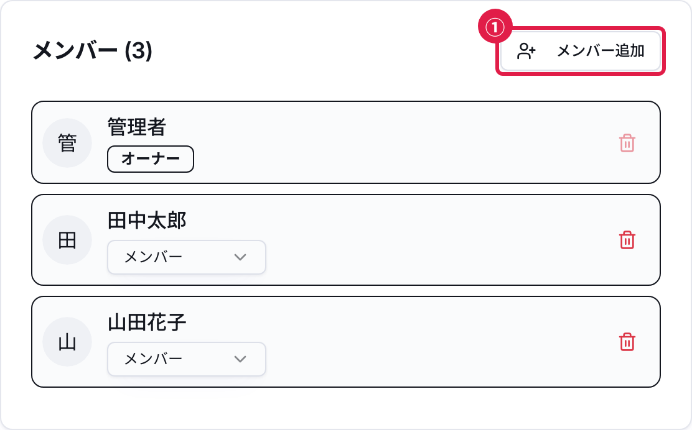
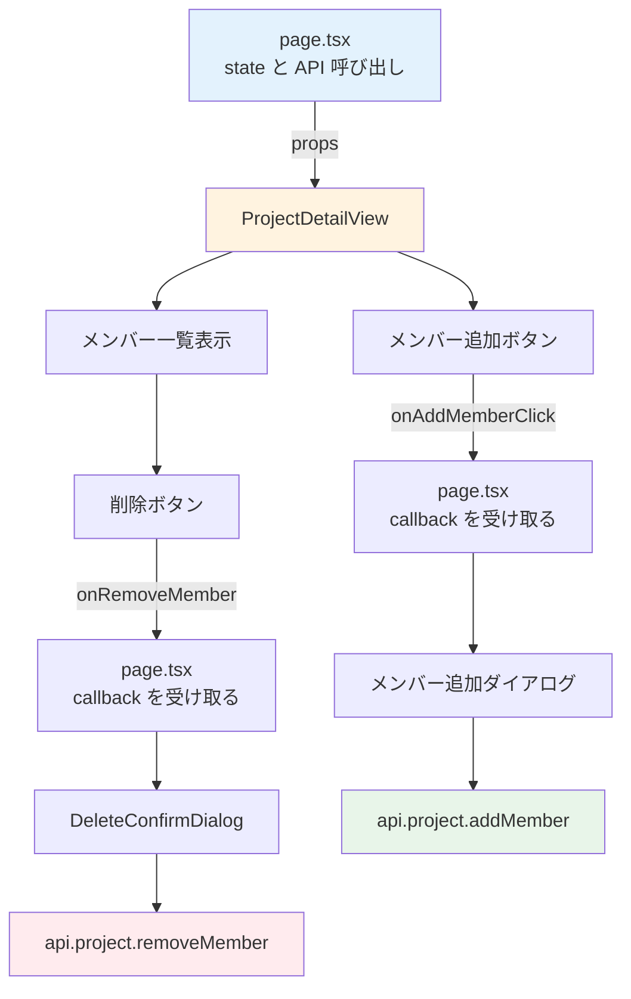
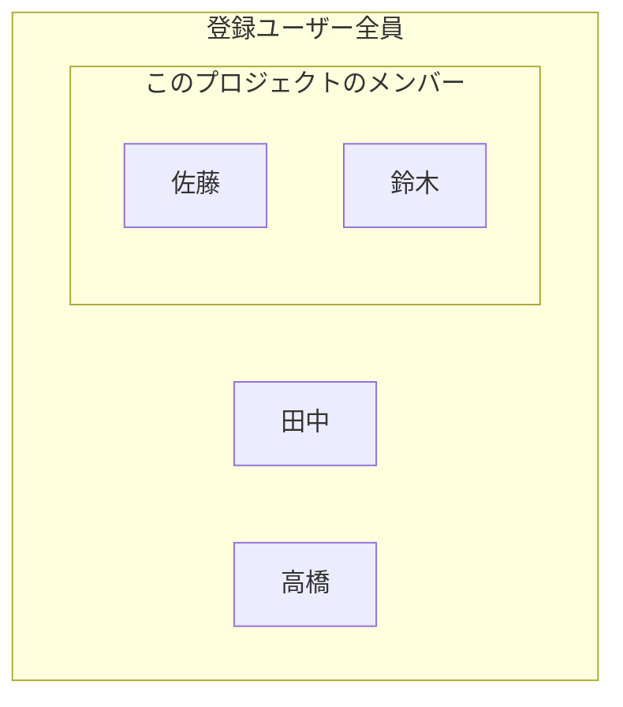
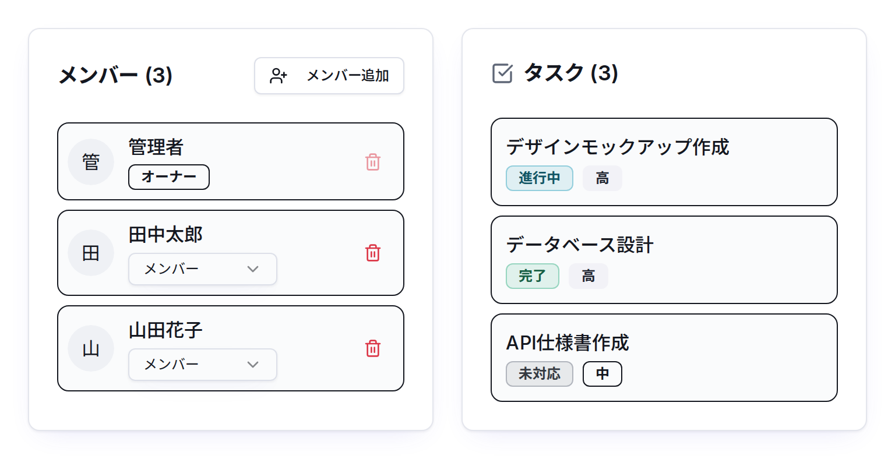
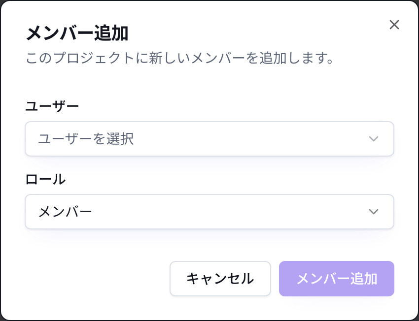
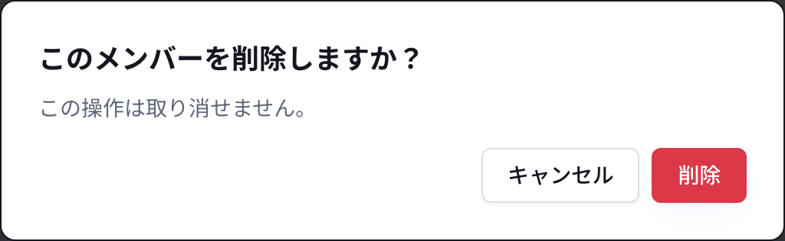
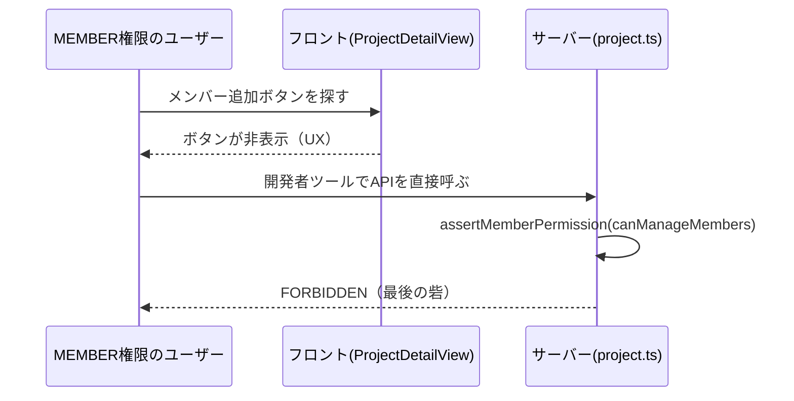
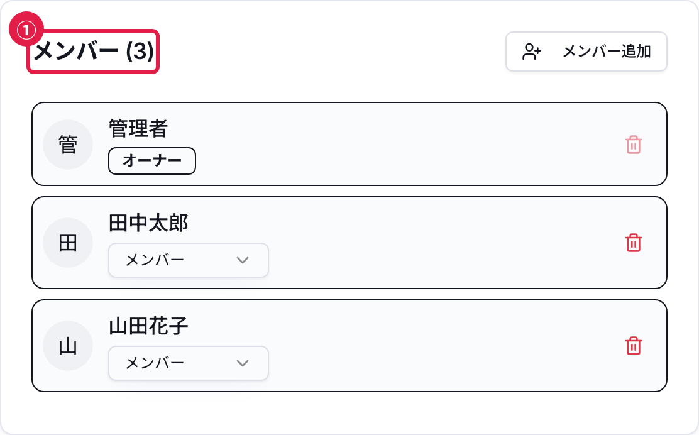
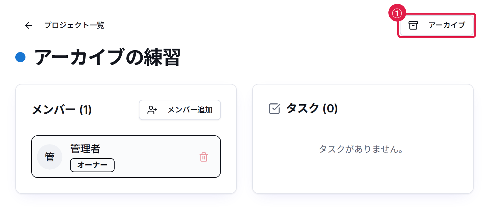
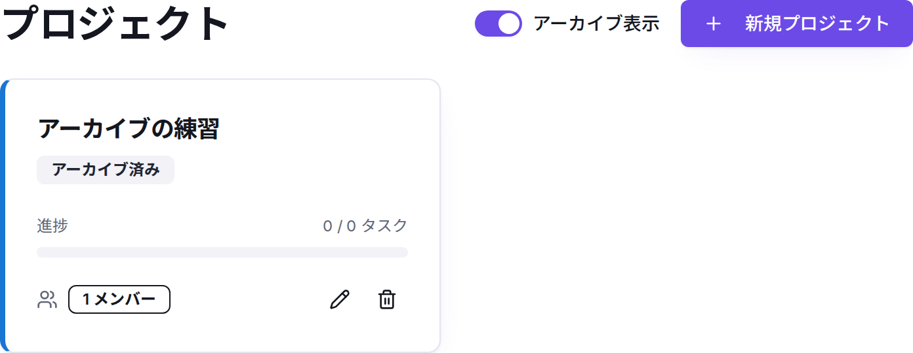

# Day 12: メンバー追加を実装しよう

## 前回の振り返り

Day 11 ではプロジェクトの編集・削除機能を実装しました。`DeleteConfirmDialog` による誤操作防止や `invalidate()` によるキャッシュ更新を学んだので今日はメンバー管理に進みます。

---

## 今日のゴール

プロジェクトにメンバーを追加・削除できる機能を実装します。`ProjectDetailView` コンポーネントでメンバー一覧を表示し、`page.tsx` からprops経由で操作を制御します。

この日はまずサーバー側の `getAvailableUsers` / `addMember` / `removeMember` / `updateMemberRole` の4つを自分で書きます。そのあと画面をつなぎます。詳細取得の `getById` は Day 11 で追加済みです。

スクリーンショット: メンバー管理画面（プロジェクト詳細ページ内）



## なぜこれを作るのか

チーム開発では複数のメンバーが1つのプロジェクトで作業します。「誰がどんな役割で参加しているか」を管理する機能は実務のタスク管理ツールに必須です。

> **例え話**: プロジェクトのメンバー管理は「サッカーチームのメンバー登録」です。監督（OWNER）、コーチ（ADMIN）、選手（MEMBER）、観客（VIEWER）のようにそれぞれの役割を決めます。監督とコーチだけが新しい選手を入れたり外したりできます。

### メンバー管理の構造


```mermaid
flowchart TB
    A["page.tsx<br/>state と API 呼び出し"] -->|props| B[ProjectDetailView]
    B --> C[メンバー一覧表示]
    C --> D[削除ボタン]
    D -->|onRemoveMember| E["page.tsx<br/>callback を受け取る"]
    E --> F[DeleteConfirmDialog]
    F --> G[api.project.removeMember]
    B --> H[メンバー追加ボタン]
    H -->|onAddMemberClick| I["page.tsx<br/>callback を受け取る"]
    I --> J[メンバー追加ダイアログ]
    J --> K[api.project.addMember]

    style A fill:#e3f2fd
    style B fill:#fff3e0
    style G fill:#ffebee
    style K fill:#e8f5e9
```

図の上部にある `page.tsx` から `ProjectDetailView` へ渡す矢印が props です。追加・削除ボタンから「`page.tsx` callback を受け取る」へ進む矢印がコールバックです。図に3回出る `page.tsx` は同じファイルで、処理の戻り先を分けて描いています。メンバー一覧やボタンを描くのは `ProjectDetailView` ですがダイアログを開いているかどうかの state と API 呼び出しは `page.tsx` が持ちます。`ProjectDetailView` は「追加ボタンが押されました」と親へ伝えるだけです。役割をこう分けておくと追加と削除のどちらでもメンバー一覧を取り直す処理が `page.tsx` の1か所にまとまります。矢印の終点は `api.project.addMember` と `api.project.removeMember` です。画面がボタンを隠しても追加や削除を最終的に許すかどうかを決めるのはサーバー側のこの2つになります。

### やること / やらないこと

| やること | やらないこと |
|---------|-------------|
| メンバー一覧の表示 | メンバーの権限システムの設計 |
| メンバー追加・削除 | 招待メール送信 |
| ロールを選んで追加 | ロール変更UIの見た目・操作（配布済みのまま） |
| 専用APIの呼び出し | Prisma のリレーション（テーブル同士のつながりの定義）設計 |
| `updateMemberRole` を自分で書く | ロール変更ボタンをどこに配置するかの調整 |

### 新しく学ぶ概念

| 概念 | 読み方 | 役割 | 例え |
|------|--------|------|------|
| ロール | — | ユーザーの権限レベル | サッカーの監督・選手・観客 |
| 型ガード | かたがーど | 値の型を安全に判定する関数 | 「本当に監督か」を確認する受付 |
| mutation（ミューテーション） | — | データを変更するAPI呼び出し | レストランで「注文を送る」操作 |

### 今日の作業ファイル

```
src/
├── app/project/
│   └── page.tsx              ← 追加ダイアログと state 管理
├── component/project/
│   └── project-detail-view.tsx  ← メンバー一覧の表示
├── lib/constant/
│   └── roles.ts              ← ロール定義・権限・型ガード
└── server/api/routers/
    └── project.ts            ← Step 0 で手続きを4本追加
```

この4つのうち、今日ゼロから書き足すのは `project.ts` の手続きです。`roles.ts` にはロールの一覧と権限の対応表がすでに入っています。`project-detail-view.tsx` にはメンバー一覧の見た目が用意されています。だから今日の作業は「並べる部品はそろっている、それを動かす配線とサーバー側の許可判定を自分で書く」という形になります。`page.tsx` はその配線を置く場所で、Day 09 から続けて書き足しているファイルです。どこに何を足すのか分からなくなったらこの一覧に戻ってきてください。

### ロール定義ファイル `roles.ts` の中身

`roles.ts` にはロール定数・ラベル・権限・型ガードがまとまっています。ここでは定義一覧を見つつ、**Day 12 で使う `project.ts` のAPIが実際に何を許可しているか** に合わせて整理します。

| エクスポート | 型・用途 |
|-------------|----------|
| `PROJECT_MEMBER_ROLE` | **型**: `as const` オブジェクト<br>**用途**: `OWNER`, `ADMIN`, `MEMBER`, `VIEWER` |
| `PROJECT_MEMBER_ROLE_LABELS` | **型**: `Record<ProjectMemberRole, string>`<br>**用途**: 日本語ラベル（オーナー等） |
| `isProjectMemberRole()` | **型**: 型ガード関数<br>**用途**: `value` が有効なロールか判定 |

#### `project.ts` で実際に通る操作

| 操作 | OWNER | ADMIN | MEMBER | VIEWER |
|------|-------|-------|--------|--------|
| プロジェクト閲覧 | ✅ | ✅ | ✅ | ✅ |
| メンバー追加 | ✅ | ✅ | ❌ | ❌ |
| メンバー削除 | ✅ | ✅ | ❌ | ❌ |
| メンバーロール変更 | ✅ | ✅ | ❌ | ❌ |
| プロジェクト更新（名前・説明・開始日・終了日） | ✅ | ✅ | ❌ | ❌ |
| アーカイブ / アーカイブ解除 | ✅ | ❌ | ❌ | ❌ |

> `roles.ts` には `canEdit` という権限定義がありますが`project.ts` の `update` API は `canManageMembers` を見ています。そのため**プロジェクト編集もOWNER/ADMINだけ** が実行できます。教材を読むときは「定義ファイルの理論値」ではなく、「サーバーがどの権限で判定しているか」を確認するのが大切です。

開発サーバーは前の Day から動かしたまま使います。止めてあるときは `npm run dev` で起動してから `http://localhost:3000` を開きます。

## 実装ステップ一覧

| ステップ | 作業内容 | 読む時間の目安 |
|---------|---------|---------|
| Step 0 | メンバー管理APIを `project.ts` に追加する | 20分 |
| Step 1 | プロジェクト詳細ビューの接続を確認する | 6分 |
| Step 2 | ProjectDetailViewのpropsを確認する | 4分 |
| Step 3 | メンバー追加用のstateを準備する | 6分 |
| Step 4 | メンバー追加ダイアログのUIを作る | 7分 |
| Step 5 | メンバー追加APIを呼ぶ | 5分 |
| Step 6 | メンバー削除を実装する | 7分 |
| Step 7 | サーバー側の権限チェックを理解する | 5分 |
| Step 8 | 動作確認 | 6分 |
| Step 9 | 書き込み失敗時の画面を整える | 20分 |

**読む時間の合計（仮）**: 約86分です。

表と各 Step に記した時間は、説明とコードを読む時間の仮の目安です。実測した値ではありません。コードの入力、動作確認、ダウンロードや起動の待ち時間、調べものには別に時間を取ってください。

---

### Step 0: メンバー管理APIを `project.ts` に追加する（読む目安: 20分）

追加するのは `getAvailableUsers`、`addMember`、`removeMember`、`updateMemberRole` の4つです。

**ゴール**: 追加可能ユーザー取得・メンバー追加・メンバー削除・メンバー権限変更の4つの手続きを追加します。詳細取得の `getById` は Day 11 で追加済みです。

ここから先の「（続き）」のブロックは、どれも `projectRouter` を閉じる末尾の `});` より前に置きます。完成コードと同じ並びにするなら、`getAvailableUsers` は `getById` の直後、`addMember` / `removeMember` / `updateMemberRole` は `delete` の直後からこの順に入れてください。ファイルの一番下に足すとルーターの外に出るため、`});` は増やしません。

#### 0-1. getAvailableUsers（まだ参加していないユーザーを探す）

メンバー追加ダイアログの候補一覧に使う手続きです。`getById` の下に追加します。まず自分の権限を確認します。ここでは `userId_projectId`（2つの列を組にした一意キー）で、ログイン中のユーザーがこのプロジェクトのメンバーかどうかを1件だけ引き当てます。

```typescript
// filepath: src/server/api/routers/project.ts（続き）
  getAvailableUsers: protectedProcedure
    .input(z.object({ projectId: z.string().cuid() }))
    .query(async ({ ctx, input }) => {
      const userMember = await prisma.projectMember.findUnique({
        where: {
          userId_projectId: {
            userId: ctx.session.userId,
            projectId: input.projectId,
          },
        },
      });

      assertMemberPermission(userMember ? [userMember] : [], 'canManageMembers');
```

候補一覧を返す前に権限を確認します。管理権限のない利用者がこのAPIを直接呼んだ場合は、候補の名前やメールアドレスを返さず `FORBIDDEN` で止めます。

`userId_projectId` で引くとプロジェクトとユーザーの組で1件だけを狙って取れます。メンバーが何人いても取ってくる行は1つなので人数が増えても速度が変わりません。`assertMemberPermission` は渡した配列の中に `canManageMembers` を持つロールが1つも無ければ `FORBIDDEN` を投げて処理を止める関数です。自分がこのプロジェクトのメンバーでなければ `userMember` は `null` になり、空配列を渡すことになるのでそこで止まります。この候補一覧には社内ユーザーの名前とメールアドレスが並ぶためメンバーを管理できる人以外には返しません。

続けてまだ参加していないユーザーを検索します。

```typescript
// filepath: src/server/api/routers/project.ts（続き）
      return await prisma.user.findMany({
        where: {
          isActive: true,
          projects: {
            none: {
              projectId: input.projectId,
            },
          },
        },
        select: USER_SELECT,
        orderBy: { name: 'asc' },
      });
    }),
```

`projects: { none: { projectId: input.projectId } }` は「このプロジェクトのメンバーに1件も該当しないユーザー」という条件です。Day 09 の `getAll` では `some`（1件でも該当すれば対象）を使いました。`none` はその逆で、1件も該当しない場合を対象にします。これで、まだ参加していない人だけが候補として残ります。


```mermaid
flowchart TB
    subgraph ALL["登録ユーザー全員"]
      subgraph MEM["このプロジェクトのメンバー"]
        M1["佐藤"]
        M2["鈴木"]
      end
      C1["田中"]
      C2["高橋"]
    end
```

内側の枠が `some` で取れる人、内側を外した残りが `none` で取れる人です。追加の候補として出したいのは外側の残りなので`none` を使います。`some` と書き間違えるとすでに参加している人だけが候補に並びます。

#### 0-2. addMember（オーナー付与の制限と重複チェック）

Day 11 の update / delete で行ロックを追加したため、`Prisma` はすでに値として読み込んでいます。次の1行がファイル先頭にあることを確認し、重複して追加しないでください。

```typescript
// filepath: src/server/api/routers/project.ts（import群を確認）
import { Prisma } from '@prisma/client';
```

`Prisma.sql` を使う最初の日は Day 11 です。Day 12 では import を変更せず、メンバー管理の3手続きでも同じ値を使います。

続けて入力スキーマを準備します。`project.ts` にはすでに `import { USER_SELECT } from './_helpers/select';` という行があります。この1行も**書き換え**ます。`projectMemberRoleSchema` を一緒に取り込む形へ直してください。新しい行を足すのではありません。

```typescript
// filepath: src/server/api/routers/project.ts
// （既存の import { USER_SELECT } from './_helpers/select'; を
// この行に置き換える）
import { projectMemberRoleSchema, USER_SELECT } from './_helpers/select';
```

同じファイルから2回に分けて取り込まず1行へまとめると、どちらの行が必要なのか迷いません。`projectMemberRoleSchema` は `_helpers/select.ts` にある、ロールとして許される4つの文字列を表す zod スキーマです。画面側の `isProjectMemberRole` も同じ4つを指すため、選択肢とサーバーの受付値がそろいます。

次の入力スキーマはルーターの**外**、`projectUpdateSchema` の下へ貼ります。ルーターを閉じる `});` の1行上へ入れるとルーターの中に入るため、型エラーになります。

```typescript
// filepath: src/server/api/routers/project.ts（続き）
const projectMemberSchema = z.object({
  projectId: z.string().cuid(),
  userId: z.string().cuid(),
  role: projectMemberRoleSchema.default(PROJECT_MEMBER_ROLE.MEMBER),
});
```

`role` に初期値があるため、ロールを省略した追加は MEMBER になります。ここまで準備できたら `getAvailableUsers` の下へ `addMember` を置きます。

```typescript
// filepath: src/server/api/routers/project.ts
// （続き）
  addMember: protectedProcedure.input(projectMemberSchema).mutation(async ({ ctx, input }) => {
    return await prisma.$transaction(async (tx) => {
      // 権限変更と同じプロジェクト行をロックし、追加直前の権限だけを判定に使う。
      // ロック外のOWNER判定を使うと、降格後でも新しいOWNERを追加できる経路が残る。
      await tx.$queryRaw<Array<{ id: string }>>(
        Prisma.sql`SELECT "id" FROM "projects" WHERE "id" = ${input.projectId} FOR UPDATE`,
      );

      const userMember = await tx.projectMember.findUnique({
        where: {
          userId_projectId: {
            userId: ctx.session.userId,
            projectId: input.projectId,
          },
        },
      });

      assertMemberPermission(userMember ? [userMember] : [], 'canManageMembers');
```

`$transaction`（複数のDB操作をひとまとまりとして扱う機能）は、途中でエラーになったとき中の変更をすべて取り消します。ただし、トランザクションで囲むだけでは同時に届いた処理の順番までは決まりません。

そこで最初にプロジェクトの行を `FOR UPDATE` でロックします。行ロック（同じ行を変更する処理を一時的に待たせる機能）を取ると、同じプロジェクトのメンバー操作は先の処理が終わってから次へ進みます。操作する本人のロールをロック後に読み直すため、待っている間に降格された人が古いOWNER権限で追加することも防げます。

```typescript
// filepath: src/server/api/routers/project.ts
// （続き）

      // OWNERロールの付与はOWNERのみに限定する。
      // canManageMembersを持つADMINによる権限昇格を防ぐため。
      if (
        input.role === PROJECT_MEMBER_ROLE.OWNER &&
        userMember?.role !== PROJECT_MEMBER_ROLE.OWNER
      ) {
        throw new TRPCError({
          code: 'FORBIDDEN',
          message: 'オーナー権限の付与はオーナーのみ可能です',
        });
      }
```

`canManageMembers` は OWNER と ADMIN が持ちます。しかし、OWNERを新しく作る権限までADMINへ渡すと、別アカウントをOWNERとして追加して元のOWNERを外せます。だからOWNER付与だけは、操作する本人もOWNERかを別に確認します。

```typescript
// filepath: src/server/api/routers/project.ts
// （続き）

      const existing = await tx.projectMember.findUnique({
        where: {
          userId_projectId: {
            userId: input.userId,
            projectId: input.projectId,
          },
        },
      });

      if (existing) {
        throw new TRPCError({
          code: 'CONFLICT',
          message: 'このユーザーは既にプロジェクトのメンバーです',
        });
      }
```

画面が候補を取得してから追加ボタンを押すまでに、別の人が先に同じユーザーを追加する場合があります。プロジェクト行をロックしているため、同じ `addMember` が2件届いたときは後の処理が待ち、先の追加後に重複を読み直して `CONFLICT` になります。データベースの `userId_projectId` 一意制約も最後の防御として残ります。

```typescript
// filepath: src/server/api/routers/project.ts
// （続き）

      return await tx.projectMember.create({
        data: input,
        include: {
          user: {
            select: USER_SELECT,
          },
        },
      });
    });
  }),
```

追加、権限確認、重複確認はすべて同じ `tx` を使います。途中で失敗した場合は追加を残しません。最後の `});` はトランザクション、次の `}),` は `addMember` を閉じています。

#### 0-3. removeMember（最後のOWNERは消せない）

`addMember` の下に追加します。削除も同じプロジェクト行をロックしてから、現在の権限を確認します。

```typescript
// filepath: src/server/api/routers/project.ts
// （続き）
  removeMember: protectedProcedure
    .input(
      z.object({
        projectId: z.string().cuid(),
        userId: z.string().cuid(),
      }),
    )
    .mutation(async ({ ctx, input }) => {
      return await prisma.$transaction(async (tx) => {
        // プロジェクト行をロックして、OWNERの削除・降格を同じプロジェクト内で直列化する。
        // ロックなしだとOWNERが2人のときに
        // 双方の削除が人数2を見て通り、
        // OWNERが0人になる経路がある。
        await tx.$queryRaw<Array<{ id: string }>>(
          Prisma.sql`SELECT "id" FROM "projects" WHERE "id" = ${input.projectId} FOR UPDATE`,
        );
```

追加と削除が別々の行をロックすると、削除側だけがOWNER人数を古い状態で読む余地が残ります。3つのメンバー変更手続きが同じ `projects.id` をロックすることが大切です。

```typescript
// filepath: src/server/api/routers/project.ts
// （続き）

        const userMember = await tx.projectMember.findUnique({
          where: {
            userId_projectId: {
              userId: ctx.session.userId,
              projectId: input.projectId,
            },
          },
        });

        assertMemberPermission(userMember ? [userMember] : [], 'canManageMembers');
```

ロックを取ったあとに操作する本人を読みます。MEMBER と VIEWER は対象メンバーを調べる前に `FORBIDDEN` となるため、内部のメンバー情報を外へ漏らしません。

```typescript
// filepath: src/server/api/routers/project.ts
// （続き）

        const member = await tx.projectMember.findUnique({
          where: {
            userId_projectId: {
              userId: input.userId,
              projectId: input.projectId,
            },
          },
        });

        if (!member) {
          throw new TRPCError({
            code: 'NOT_FOUND',
            message: 'メンバーが見つかりません',
          });
        }
```

削除対象を同じ `tx` で読みます。対象が存在しない場合は、データベースの削除例外へ進む前に `NOT_FOUND` を返します。

```typescript
// filepath: src/server/api/routers/project.ts
// （続き）

        // OWNERメンバーの削除はOWNERのみに限定する。
        // ADMINによるオーナー排除を防ぐため。
        if (
          member.role === PROJECT_MEMBER_ROLE.OWNER &&
          userMember?.role !== PROJECT_MEMBER_ROLE.OWNER
        ) {
          throw new TRPCError({
            code: 'FORBIDDEN',
            message: 'オーナーの削除はオーナーのみ可能です',
          });
        }
```

ADMIN は通常メンバーを外せますが、OWNERを外せるのはOWNERだけです。これを分けないとADMINがOWNERを排除して、プロジェクトの管理権限を奪えます。

```typescript
// filepath: src/server/api/routers/project.ts
// （続き）

        if (member.role === PROJECT_MEMBER_ROLE.OWNER) {
          const ownerCount = await tx.projectMember.count({
            where: {
              projectId: input.projectId,
              role: PROJECT_MEMBER_ROLE.OWNER,
            },
          });

          if (ownerCount === 1) {
            throw new TRPCError({
              code: 'BAD_REQUEST',
              message: 'プロジェクト唯一のオーナーは削除できません',
            });
          }
        }
```

最後のOWNERがいなくなると、OWNERだけに許可したプロジェクト削除やアーカイブを誰も実行できません。ロック後に人数を数えるので、2人のOWNERを別々のリクエストで同時に削除しようとしても、後の処理は先の削除後の人数を読みます。

```typescript
// filepath: src/server/api/routers/project.ts
// （続き）

        await tx.projectMember.delete({
          where: {
            userId_projectId: {
              userId: input.userId,
              projectId: input.projectId,
            },
          },
        });

        return { success: true };
      });
    }),
```

削除まで同じ `tx` を使います。別のプロジェクトにある同じユーザーの参加行やユーザー本体は削除されません。

#### 0-4. updateMemberRole（ロール変更の手続きを用意する）

`removeMember` の下へ追加します。ロール変更はOWNERの昇格と降格の両方を扱うため、削除と同じ行ロックを使います。

```typescript
// filepath: src/server/api/routers/project.ts
// （続き）
  updateMemberRole: protectedProcedure
    .input(
      z.object({
        projectId: z.string().cuid(),
        userId: z.string().cuid(),
        role: projectMemberRoleSchema,
      }),
    )
    .mutation(async ({ ctx, input }) => {
      return await prisma.$transaction(async (tx) => {
        // removeMember と同じくプロジェクト行をロックして、
        // OWNER人数の確認と更新を直列化する。
        // 異なる経路（削除・降格）が同じロックを取ることで、どの順でも最後のOWNERが残る。
        await tx.$queryRaw<Array<{ id: string }>>(
          Prisma.sql`SELECT "id" FROM "projects" WHERE "id" = ${input.projectId} FOR UPDATE`,
        );

```

`removeMember` と `updateMemberRole` が同じプロジェクト行をロックするため、削除と降格が同時に届いても片方ずつ進みます。トランザクションは失敗時の取り消し、行ロックは同じプロジェクトに届いた処理の直列化を担当します。

```typescript
// filepath: src/server/api/routers/project.ts
// （続き）
        const userMember = await tx.projectMember.findUnique({
          where: {
            userId_projectId: {
              userId: ctx.session.userId,
              projectId: input.projectId,
            },
          },
        });

        assertMemberPermission(userMember ? [userMember] : [], 'canManageMembers');
```

操作する本人のロールもロック後に読み直します。待っている間にOWNERから降格されていれば、その後のOWNER変更は `FORBIDDEN` で止まります。

```typescript
// filepath: src/server/api/routers/project.ts
// （続き）

        const targetMember = await tx.projectMember.findUnique({
          where: {
            userId_projectId: {
              userId: input.userId,
              projectId: input.projectId,
            },
          },
        });

        if (!targetMember) {
          throw new TRPCError({
            code: 'NOT_FOUND',
            message: 'メンバーが見つかりません',
          });
        }
```

変更対象が存在しない場合は `NOT_FOUND` を返します。ここまでの取得はすべて同じ `tx` を使い、ロック後に読んだ状態だけで次の判定へ進みます。

```typescript
// filepath: src/server/api/routers/project.ts
// （続き）

        // OWNERロールの付与・剥奪はOWNERのみに限定する。
        // ADMINによる権限昇格・オーナー降格を防ぐため。
        if (
          (input.role === PROJECT_MEMBER_ROLE.OWNER ||
            targetMember.role === PROJECT_MEMBER_ROLE.OWNER) &&
          userMember?.role !== PROJECT_MEMBER_ROLE.OWNER
        ) {
          throw new TRPCError({
            code: 'FORBIDDEN',
            message: 'オーナー権限の変更はオーナーのみ可能です',
          });
        }

        if (
```

`input.role === OWNER` は昇格、`targetMember.role === OWNER` は降格です。どちらも実行する本人がOWNERでなければ止めます。

```typescript
// filepath: src/server/api/routers/project.ts
// （続き）
          targetMember.role === PROJECT_MEMBER_ROLE.OWNER &&
          input.role !== PROJECT_MEMBER_ROLE.OWNER
        ) {
          const ownerCount = await tx.projectMember.count({
            where: {
              projectId: input.projectId,
              role: PROJECT_MEMBER_ROLE.OWNER,
            },
          });

          if (ownerCount === 1) {
            throw new TRPCError({
              code: 'BAD_REQUEST',
              message: 'プロジェクト唯一のオーナーの権限は変更できません',
            });
          }
        }

        return await tx.projectMember.update({
          where: {
            userId_projectId: {
```

対象がOWNERから別のロールへ変わるときだけOWNER人数を数えます。`removeMember` と同じロックの内側なので、削除と降格のどちらが先でも、後の処理は更新済みの人数を読み、最後の1人を残します。

```typescript
// filepath: src/server/api/routers/project.ts
// （続き）
              userId: input.userId,
              projectId: input.projectId,
            },
          },
          data: {
            role: input.role,
          },
          include: {
            user: {
              select: USER_SELECT,
            },
          },
        });
      });
    }),
```

更新まで同じ `tx` を使います。`userId_projectId` の組で指定するため、別のプロジェクトにある同じユーザーのロールは変わりません。

ここで追加した3つの手続きは `projectRouter` の内側にあります。ファイル末尾に元からある `});` は削除せず、ルーター全体を閉じる行として残してください。

**確認ポイント**:
- `getAvailableUsers` / `addMember` / `removeMember` / `updateMemberRole` を追加しました。
- `Prisma` を値として読み込んでいます。
- 3つのメンバー変更手続きが同じプロジェクト行を最初にロックします。
- トランザクションの取り消しと行ロックの直列化を区別して説明できます。
- 呼出者の権限、対象、OWNER人数、書き込みの順番を説明できます。
- `npx tsc --noEmit` で型エラーが出ていません。

---

### Step 1: プロジェクト詳細ビューの接続を確認する（読む目安: 6分）

**ゴール**: Day 11 でつないだ詳細画面の配線を確認し、詳細ページが開くことを確かめます。

詳細画面の配線は Day 11 で完成しています。ここではコードを書き足さず、次の3つが `page.tsx` にあることを確認するだけです。

まず `ProjectDetailView` のインポートです。

```typescript
// filepath: src/app/project/page.tsx
// Day 11 で追加済み。書き足さず、在ることを確認する
import { ProjectDetailView } from
  '@/component/project/project-detail-view';
```

次に、カードを押したときのハンドラーと詳細取得クエリです。プロジェクトを選ぶと `selectedProject` が変わり、`api.project.getById` がそのIDのプロジェクトを取り直します。今日のメンバー操作はこの詳細データの中に手を加える形になります。

```typescript
// filepath: src/app/project/page.tsx
// Day 11 で追加済み。書き足さず、在ることを確認する
const handleProjectClick = (
  projectId: string
) => {
  router.push(
    `/project?projectId=${projectId}`
  );
};
const handleDetailClose = () => {
  router.push('/project');
};
```

URLだけで詳細の対象を切り替えるため、ブラウザの戻る操作でも画面とURLがずれません。取得処理は次のブロックで別に確認します。

```typescript
// filepath: src/app/project/page.tsx（同じファイルの続き）
// Day 11 で追加済み。書き足さず、在ることを確認する
const {
  data: projectDetail,
  isLoading: projectDetailLoading,
  isError: projectDetailError,
  isFetching: projectDetailFetching,
  error: projectDetailQueryError,
  refetch: refetchProjectDetail,
} = api.project.getById.useQuery(
  { id: selectedProject ?? '' },
  {
    enabled: !authExpired && !!selectedProject,
    retry: shouldRetryProjectQuery,
  },
);
```

詳細のデータ・待機・失敗・再取得を別々に受け取ります。まだ応答が無い状態を「見つかりません」と誤って扱わないためです。

**確認ポイント**:
- `@/component/project/project-detail-view` からのインポートが1行だけあります。
- `handleProjectClick` / `handleDetailClose` / `getById.useQuery` の3つが在ります。
- `onClick={handleProjectClick}` が `ProjectCard` に渡されています。

プロジェクトカードをクリックして詳細ページが表示されることを確認しましょう。

スクリーンショット: プロジェクト詳細ページの表示を確認してください。



---

### Step 2: ProjectDetailViewのpropsを作る（読む目安: 4分）

**ゴール**: `ProjectDetailView` がどのようなpropsを受け取るか決めます。

`ProjectDetailView` は独立したコンポーネントとして作ります。
まず props の型定義を決めて親ページから渡す値の形をそろえます。
型を先に決めておくとこのあとハンドラーを足すときにどの引数が来るのかを毎回さかのぼって確認せずに済みます。

| prop・型・役割 |
|----------------|
| **`projectDetail`**<br>**型**: <code>ProjectDetail &#124; null &#124; undefined</code><br>**役割**: 表示するプロジェクトのデータです。 |
| **`onBack`**<br>**型**: `() => void`<br>**役割**: 一覧画面に戻ります。 |
| **`onAddMemberClick`**<br>**型**: `() => void`<br>**役割**: メンバー追加ダイアログを開きます。 |
| **`onRemoveMember`**<br>**型**: `(userId: string) => void`<br>**役割**: メンバーの削除処理を実行します。 |
| **`onUpdateMemberRole`**<br>**型**: `(userId: string, role: ProjectMemberRole) => void`<br>**役割**: メンバーのロール変更を実行します。 |
| **`onArchive`**<br>**型**: `(projectId: string, isArchived: boolean) => void`<br>**役割**: アーカイブ状態を切り替えます。 |
| **`canManageMembers`**<br>**型**: `boolean`<br>**役割**: メンバー管理ボタンを表示するかどうかを表します。 |
| **`canArchive`**<br>**型**: `boolean`<br>**役割**: アーカイブボタンを表示するかどうかを表します。 |

**確認ポイント**:
- 8つのpropsが定義されています。
- `onRemoveMember` は `userId` を引数に取ります。
- `canManageMembers` / `canArchive` はボタンの表示可否をコンポーネントに伝えます。

Day 11 では `onRemoveMember` に `() => {}`（何もしない関数）を渡しています。Step 6 で `handleRemoveMember` へ差し替えます。**ここでは確認するだけで、コードの追加は不要です。**

**確認ポイント**:
- `onRemoveMember={() => {}}` が Step 6 で `handleRemoveMember` に変わることを覚えておきます。

`ProjectDetailView` は権限フラグとロール変更ハンドラーも受け取ります。描画より前に、それらが使うインポートと関数を先に用意します。Day 11 で追加した、ファイル冒頭の `@/lib/constant/roles` からのインポート文を確認します。その文全体を、次のコードへ置き換えてください。既存の3つの名前を残し、ロールの表示名と型を加えます。

```typescript
// filepath: src/app/project/page.tsx
// ロール関連のインポート
import {
  hasPermission,
  isProjectMemberRole,
  PROJECT_MEMBER_ROLE,
  PROJECT_MEMBER_ROLE_LABELS,
  type ProjectMemberRole,
} from '@/lib/constant/roles';
```

`hasPermission` は「そのロールがこの操作を許されているか」を返す関数、`isProjectMemberRole` は文字列が正しいロールかを確かめる型ガードです。どちらもサーバーと同じ `@/lib/constant/roles` から取り込むのでフロントとサーバーで判定基準がずれません。

Day 11で作った更新・アーカイブ処理は、そのまま使います。`updateMutation` は送信した `variables.id` を `refreshProject` へ渡し、通信開始時の対象だけを更新します。`archiveMutation` と `unarchiveMutation` は同じIDを `refreshProject` と `leaveSubmittedDetail` へ渡します。通信中に別の詳細を開いた場合、遅れて届いた成功結果が今の画面を閉じないための処理です。

この3つのmutationの `onSuccess` は書き換えません。引数なしの `getById.invalidate()` や `selectedProject` を使う形へ戻すと、Day 11で追加した対象IDとsession番号の確認が失われます。Step 8では、アーカイブ後に一覧へ戻り、同じプロジェクトを開き直して解除できることを確認します。

続いてロール変更の mutation とハンドラーを `handleArchive` の並びに追加します。

```typescript
// filepath: src/app/project/page.tsx
// ロール変更の mutation とハンドラー
const updateMemberRoleMutation =
  api.project.updateMemberRole.useMutation({
    onSuccess: () => {
      if (selectedProject) {
        utils.project.getById.invalidate(
          { id: selectedProject },
        );
      }
    },
  });
const handleUpdateMemberRole = (
  userId: string,
  role: ProjectMemberRole,
) => {
  if (selectedProject) {
    updateMemberRoleMutation.mutate({
      projectId: selectedProject,
      userId, role,
    });
  }
};
```

`handleUpdateMemberRole` は `ProjectDetailView` 内のロール変更セレクトボックスから呼ばれ、Step 0 で書いた `updateMemberRole` procedure を叩きます。成功したら `getById` を再取得してロール表示を更新します。これらを描画より前に置くことで、この後の Step でも型エラーが出ません。

ボタンの表示可否は `page.tsx` 側で先に計算して`boolean` で渡します。ログインユーザー自身のプロジェクト内ロールから権限を求めます。Step 1 で確認した `getById.useQuery` を閉じる `);` の直後、`createMutation` の前に置いてください。分岐の `return` より前に置く位置でもあります。

```typescript
// filepath: src/app/project/page.tsx
// ログインユーザーの権限を求める（returnより前）
const currentMember = projectDetail?.members
  ?.find((m) => m.userId === currentUser?.id);
const currentMemberRole =
  currentMember
  && isProjectMemberRole(currentMember.role)
    ? currentMember.role
    : undefined;
const canManageMembers = currentMemberRole
  ? hasPermission(
      currentMemberRole, 'canManageMembers',
    )
  : false;
const canArchiveProject = currentMemberRole
  ? hasPermission(currentMemberRole, 'canArchive')
  : false;
```

ここで求めた2つの真偽値は、詳細画面に管理ボタンとアーカイブボタンを表示するか決めるために使います。

権限判定を `ProjectDetailView` の内部ではなく `page.tsx` で行うのはサーバーと同じ `hasPermission` を使って「見せてよいボタンか」を1か所で決めるためです。コンポーネントは受け取った `boolean` に従って表示を切り替えるだけになり、権限ロジックが画面のあちこちに散らばりません。

メンバー追加ダイアログを開くための state もここで足します。`ProjectPageContent` 関数の中の既存の state 一覧の末尾に追加してください。

```typescript
// filepath: src/app/project/page.tsx
// 既存のstate一覧の末尾に追加
const [memberDialogOpen,
  setMemberDialogOpen] = useState(false);
```

`<ProjectDetailView ... />` のタグはDay 11 Step 9 で
`viewingDetail` の分岐内にすでに置いてあります。
新しく貼り足すのではなく、`<ProjectDetailView` から `/>` までを消して
次の形に書き換えてください。渡す props の数は8つのままで変わるのは中身です。
Day 11 で仮の値を置いた `onAddMemberClick`、`onUpdateMemberRole`、`canManageMembers`、`canArchive` の4つが
今日ここで本実装に変わります。`onRemoveMember` は `handleRemoveMember` を書く Step 6 まで `() => {}` のままです。

```typescript
{/* filepath: src/app/project/page.tsx */}
{/* Day 11 Step 9 の分岐内にあるタグを、この形に書き換える */}
<ProjectDetailView
  projectDetail={projectDetail}
  onBack={handleDetailClose}
  onAddMemberClick={
    () => setMemberDialogOpen(true)
  }
  onRemoveMember={() => {}}
  onUpdateMemberRole={handleUpdateMemberRole}
  onArchive={handleArchive}
  canManageMembers={canManageMembers}
  canArchive={canArchiveProject}
/>
```

`ProjectDetailView` は権限を判定せず、受け取った `canManageMembers` と `canArchive` に従ってボタンを表示します。

**確認ポイント**:
- `ProjectDetailView` に8つのpropsを渡しています。
- `onAddMemberClick` `onUpdateMemberRole` `canManageMembers` `canArchive` の4つがDay 11 の仮の値から変わっています。
- `<ProjectDetailView` で始まるタグがファイル内に1つだけあります。
- URLパラメータがある場合のみ表示されます。

> メンバー一覧の表示は `ProjectDetailView` の内部で行われます。`page.tsx` はデータ取得・権限計算・イベントハンドラーの定義を担当し、UIの詳細は独立コンポーネントに任せます。`handleUpdateMemberRole` は上で定義済みなのでこの描画で型エラーは出ません。

---

### Step 3: メンバー追加用のstateを準備する（読む目安: 6分）

**ゴール**: メンバー追加フォーム用のstateを準備します。ロール定数・型ガード（`PROJECT_MEMBER_ROLE` / `isProjectMemberRole` / `ProjectMemberRole` 型など）のインポートは Step 2 で追加済みなのでここでは state だけを足します。

**実装**:

> ロール関連のインポートは `@/lib/constant/roles` から取り込みます。`@prisma/client` から取り込むと Prisma 内部の型定義に依存してしまうため`roles.ts` に定義した定数・型を使うのが正しい方法です。

メンバー追加フォームのstateを定義します。完成コードと同じ並びにするため、`editingProject` の直後にフォームの値を覚える2つの state を書いてください。

```typescript
// filepath: src/app/project/page.tsx
// editingProject の直後に追加
const [newMemberUserId,
  setNewMemberUserId] = useState('');
const [newMemberRole, setNewMemberRole] =
  useState<ProjectMemberRole>(
    PROJECT_MEMBER_ROLE.MEMBER
  );
```

**確認ポイント**:
- `newMemberUserId` と `newMemberRole` でフォームの値を管理
- `newMemberRole` の型が `ProjectMemberRole` になっています。

> メンバー追加フォームはフィールドが2つだけなので`react-hook-form` を使わずシンプルな `useState` で管理します。フォームが複雑になったら Day 10 で学んだ `react-hook-form + zod` パターンに移行できます。

追加可能なユーザー一覧を取得します。Step 2 で書いた `canArchiveProject` の宣言を閉じる `: false;` の直後、`createMutation` の前に追加してください。`canManageMembers` を宣言したあとに置くため、宣言前参照の型エラーを防げます。

```typescript
// filepath: src/app/project/page.tsx
// 追加可能なユーザーを取得
const { data: availableUsers } =
  api.project.getAvailableUsers.useQuery(
    { projectId: selectedProject ?? '' },
    {
      enabled: !authExpired && !!selectedProject && canManageMembers,
      retry: shouldRetryProjectQuery,
    },
  );
```

`enabled` で候補一覧APIの呼び出しを、認証が有効で管理権限もある場合に絞ります。MEMBERやVIEWERが詳細を開いただけで、許可されていない候補取得を送らないためです。

候補をサーバー側で絞っておくと画面は返ってきた配列をそのまま並べるだけで済みます。ユーザー全員を返して画面側で除外する作りにすると参加済みの人を判別するために既存メンバーの一覧も別に持たなければなりません。`enabled` は認証が有効な状態でプロジェクトを開き、かつメンバー管理権限がある場合だけ候補を取得する設定です。MEMBERやVIEWERが詳細を開いただけで403を発生させません。`retry` は権限エラーを繰り返さないための指定です。

**確認ポイント**:
- `getAvailableUsers` はプロジェクト未参加のユーザーだけを返します。
- `enabled` で未選択時のリクエストを防いでいます。
- このファイルの実装が終わったら、`npx tsc --noEmit` で型エラーがないことを確認します。

---

### Step 4: メンバー追加ダイアログのUIを作る（読む目安: 7分）

**ゴール**: ユーザーを選択してプロジェクトに追加するダイアログのUIを構築します。

**実装**:

まず必要なコンポーネントをインポートします。

```typescript
// filepath: src/app/project/page.tsx
// Dialog系コンポーネントのインポートを追加
import {
  Dialog,
  DialogContent,
  DialogDescription,
  DialogFooter,
  DialogHeader,
  DialogTitle,
} from '@/component/ui/dialog';
import {
  Select,
  SelectContent,
  SelectItem,
  SelectTrigger,
  SelectValue,
} from '@/component/ui/select';
```

`Label` はこのダイアログでも使いますがDay 09 でアーカイブ切り替えのスイッチ用にインポート済みです。もう一度書かず、そのまま使ってください。

**確認ポイント**:
- `@/component/ui/dialog` から Dialog 系コンポーネントを一括インポートしています。
- `Select` 系も同じく `@/component/ui/` から取得しています。
- `@/component/ui/label` からのインポートが1行だけあります。

メンバー追加ダイアログは `ProjectDetailView` の分岐内に配置します。まずダイアログのヘッダー部分です。

```typescript
{/* filepath: src/app/project/page.tsx */}
{/* ProjectDetailViewの直後に配置 */}
<Dialog open={memberDialogOpen}
  onOpenChange={setMemberDialogOpen}>
  <DialogContent
    className="sm:max-w-[425px]">
    <DialogHeader>
      <DialogTitle>
        メンバー追加
      </DialogTitle>
      <DialogDescription>
        このプロジェクトに新しいメンバーを追加します。
      </DialogDescription>
    </DialogHeader>
```

**確認ポイント**:
- `Dialog` の `open` / `onOpenChange` でダイアログ開閉を制御しています。

`open` に `memberDialogOpen` という state を渡しているので`setMemberDialogOpen(true)` で開き、閉じる操作は `onOpenChange` が受け取って state を戻します。`DialogHeader` は見出しのまとまりで、`DialogTitle` が「メンバー追加」という題名、`DialogDescription` が操作の説明文を担当します。利用者はこの2つを読んで、何をする画面かを開いた瞬間に判断できます。

ユーザー選択のドロップダウンを追加します。`useState` の `newMemberUserId` で値を直接管理します。

```typescript
{/* filepath: src/app/project/page.tsx */}
{/* ダイアログのbody部分: ユーザー選択 */}
    <div className="grid gap-4 py-4">
      <div className="grid gap-2">
        <Label htmlFor="user">
          ユーザー
        </Label>
        <Select
          value={newMemberUserId}
          onValueChange={
            setNewMemberUserId
          }>
          <SelectTrigger id="user">
            <SelectValue
              placeholder="ユーザーを選択"
            />
          </SelectTrigger>
```

**確認ポイント**:
- `Select` の `value` / `onValueChange` で `useState` と直接接続しています。
- `Controller` ラッパーは不要（シンプルなstateで十分）

`value` に `newMemberUserId` を渡すことで、いま選ばれているユーザーが常に state と同じになります。`onValueChange` は選択が変わるたびに `setNewMemberUserId` を呼ぶので画面の表示と state がずれません。フィールドが1つだけならこの直接つなぐ形の方が `react-hook-form` を挟むより追いやすくなります。

SelectContent 内にユーザー候補を表示します。

```typescript
{/* filepath: src/app/project/page.tsx */}
{/* ユーザー選択の候補リスト */}
          <SelectContent>
            {availableUsers?.map(
              (user) => (
                <SelectItem
                  key={user.id}
                  value={user.id}>
                  {user.name || user.email}
                </SelectItem>
              )
            )}
          </SelectContent>
        </Select>
      </div>
```

**確認ポイント**:
- 名前がない場合はメールアドレスを表示します。
- `availableUsers` はプロジェクト未参加ユーザーのみ

`user.name || user.email` としているのは名前を登録していないユーザーでも空欄にせず、必ず何かを画面に出すためです。`key={user.id}` はReact が候補の並びを追跡するための目印です。これを省くと候補の増減時に表示が入れ替わってしまいます。

ロール選択も `useState` の `newMemberRole` で管理します。`isProjectMemberRole` 型ガードで値を安全に検証してからstateに設定します。

```typescript
{/* filepath: src/app/project/page.tsx */}
{/* ロール選択UI: Select + useState */}
      <div className="grid gap-2">
        <Label htmlFor="role">ロール</Label>
        <Select
          value={newMemberRole}
          onValueChange={(value) => {
            if (isProjectMemberRole(value))
              setNewMemberRole(value);
          }}>
          <SelectTrigger id="role">
            <SelectValue
              placeholder="ロールを選択"
            />
          </SelectTrigger>
```

**確認ポイント**:
- `isProjectMemberRole` 型ガードで安全にロールを検証しています。
- 不正な値が `setNewMemberRole` に渡されることを防いでいます。

`Select` が渡してくる `value` はただの文字列で、`ProjectMemberRole` 型である保証はありません。`isProjectMemberRole` を通った値だけを `setNewMemberRole` に渡すので想定外の文字列が state に入りません。ただしこの型ガードは型安全のための入力補助であって防御の本体ではありません。不正なロール値はメンバー追加APIのサーバー側で zod スキーマが拒否します。クライアントのチェックを外されてもサーバーが最後の砦として弾く作りです。

ロール選択肢はOWNERを除外して生成します。

```typescript
{/* filepath: src/app/project/page.tsx */}
{/* ロール選択の候補リスト */}
          <SelectContent>
            {Object.entries(
              PROJECT_MEMBER_ROLE_LABELS
            )
              .filter(([value]) =>
                value !==
                PROJECT_MEMBER_ROLE.OWNER
              )
              .map(([value, label]) => (
                <SelectItem
                  key={value}
                  value={value}>
                  {label}
                </SelectItem>
              ))}
          </SelectContent>
        </Select>
      </div>
    </div>
```

**確認ポイント**:
- OWNER が選択肢から除外されています。
- `PROJECT_MEMBER_ROLE_LABELS` から動的に選択肢を生成しています。

> OWNERはUIの選択肢から除外しています。さらにサーバー側でも権限チェックがあるため二重に保護されています。

フッターボタンを追加してダイアログを完成させます。

```typescript
{/* filepath: src/app/project/page.tsx */}
{/* ダイアログのフッター */}
    <DialogFooter>
      <Button variant="outline"
        onClick={() =>
          setMemberDialogOpen(false)}>
        キャンセル
      </Button>
      <Button
        onClick={handleAddMember}
        disabled={!newMemberUserId}>
        メンバー追加
      </Button>
    </DialogFooter>
  </DialogContent>
</Dialog>
```

ここで使っている `handleAddMember` はこのあとの Step で定義します。
定義するまでこのダイアログは表示できないので動きの確認はそのあとに行います。

`handleAddMember` を書いたあとで次の2点を確かめます。

**確認ポイント**:
- ユーザー未選択時は「メンバー追加」ボタンが `disabled` になります。
- キャンセルボタンでダイアログが閉じます。

`disabled={!newMemberUserId}` にしているのはユーザーを選ばないまま追加すると誰を追加するのか決まらずサーバー側でエラーになるためです。ボタンを押せるのはユーザーを1人選んだあとだけにして無効な操作を最初から避けています。



ダイアログにはまだメンバーでないユーザーの一覧と、ロールを選ぶ欄が出ます。
ユーザーを1人選ぶまで「メンバー追加」ボタンは押せません。

---

### Step 5: メンバー追加APIを呼ぶ（読む目安: 5分）

**ゴール**: 選択したユーザーをプロジェクトに追加するmutation（データを変更するAPI呼び出し）とハンドラーを実装します。

**実装**:

mutation を既存の mutation 群の末尾に追加してください。ここでは成功経路を先に接続し、失敗時の表示と入力保持はStep 9で完成形へ置き換えます。

```typescript
// filepath: src/app/project/page.tsx
// 既存のmutation群の末尾に追加
const addMemberMutation =
  api.project.addMember.useMutation({
    onSuccess: () => {
      utils.project.getAll.invalidate();
      if (selectedProject) {
        utils.project.getById.invalidate(
          { id: selectedProject }
        );
        utils.project
          .getAvailableUsers
          .invalidate(
            { projectId: selectedProject }
          );
      }
      setMemberDialogOpen(false);
      setNewMemberUserId('');
      setNewMemberRole(
        PROJECT_MEMBER_ROLE.MEMBER
      );
    },
  });
```

**確認ポイント**:
- 成功時に `getAll`・`getById`・`getAvailableUsers` のキャッシュを更新しています。
- `setNewMemberUserId('')` と `setNewMemberRole()` でフォームを初期値に戻しています。

`onSuccess` で `invalidate` を呼ぶと`getById` が持っている古いデータに印が付き、tRPC が裏で取り直します。追加したメンバーはこの取り直しの結果として一覧に現れます。`invalidate` を書き忘れるとサーバーには追加できているのに画面のメンバー一覧が増えず、手で再読み込みするまで誰も気づけません。`getAvailableUsers` にも印を付けているのはStep 3 で取得した候補一覧が古いままだといま追加した人がもう一度候補に並び、選んで送信すると `addMember` の重複チェックに引っかかってエラーになるからです。フォームの初期化を同じ `onSuccess` に置いているのは次にダイアログを開いたとき前回選んだユーザーが残っていると押し間違いで同じ人をもう一度追加しようとするからです。

ハンドラーを追加します。`handleDetailClose` の下に追加してください。

```typescript
// filepath: src/app/project/page.tsx
// handleDetailCloseの下に追加
const handleAddMember = () => {
  if (selectedProject
    && newMemberUserId) {
    addMemberMutation.mutate({
      projectId: selectedProject,
      userId: newMemberUserId,
      role: newMemberRole,
    });
  }
};
```

**確認ポイント**:
- `selectedProject` と `newMemberUserId` の両方を確認してから送信
- state の値をそのまま mutation に渡しています。

ここまでで、メンバー追加ができました。メンバー削除は Step 6 で実装します。まずはプロジェクトにメンバーを追加して一覧に反映されることを確認してみましょう。

---

### Step 6: メンバー削除を実装する（読む目安: 7分）

**ゴール**: メンバーをプロジェクトから外す処理を、確認ダイアログ付きで実装します。

**実装**:

Day 11 で学んだ `DeleteConfirmDialog` パターンを使い、確認ダイアログ経由で削除します。state を既存の state 一覧の末尾に追加してください。

```typescript
// filepath: src/app/project/page.tsx
// 既存のstate一覧の末尾に追加
const [removeMemberDialogOpen,
  setRemoveMemberDialogOpen] =
  useState(false);
const [removeMemberTargetId,
  setRemoveMemberTargetId] =
  useState<string | null>(null);
```

ダイアログの開閉と、どのメンバーを消すかの2つを別のstateに分けます。対象のuserIdを取っておかないと、確認ボタンを押したときに誰を消せばよいか分からなくなるためです。

**確認ポイント**:
- Day 11 のプロジェクト削除と同じパターンを使っています。
- `removeMemberTargetId` に削除対象のuserIdを保持します。

mutation と handler を追加します。`addMemberMutation` の直下に書いてください。確認ボタンの即時クローズはStep 9で成功後だけ閉じる形へ直します。

```typescript
// filepath: src/app/project/page.tsx
// addMemberMutationの直下に追加
const removeMemberMutation =
  api.project.removeMember.useMutation({
    onSuccess: () => {
      utils.project.getAll.invalidate();
      if (selectedProject) {
        utils.project.getById.invalidate(
          { id: selectedProject }
        );
        utils.project
          .getAvailableUsers
          .invalidate(
            { projectId: selectedProject }
          );
      }
    },
  });
```

**確認ポイント**:
- 成功時に `getById` キャッシュを更新してメンバー一覧を再取得しています。
- `getAvailableUsers` も更新して外した人を候補一覧へ戻しています。

追加のときと同じ `getById.invalidate` を呼んでいるのはメンバー一覧の出どころが `getById` の1か所だからです。追加のときと同じく `getAvailableUsers` にも印を付けます。外した人はもう未参加なので候補へ戻るはずですが印を付けないと候補一覧が古いままで外した人をもう一度追加できません。Day 11 で `projectDetail` を `getById` から受け取る形にしたので詳細のメンバー一覧はここから取り直します。一覧カードにも人数が出るため、`getAll` にも古い印を付けます。`removeMember` が返すのは Step 0 で書いた `{ success: true }` だけですが画面が欲しいのは更新後のメンバー一覧なので返り値を使わず取り直す形にしています。

```typescript
// filepath: src/app/project/page.tsx
// 既存のハンドラー群に追加
const handleRemoveMember = (
  userId: string
) => {
  setRemoveMemberTargetId(userId);
  setRemoveMemberDialogOpen(true);
};
```

Day 11 から残っている `<ProjectDetailView` の props も直します。`onRemoveMember={() => {}}` を `onRemoveMember={handleRemoveMember}` へ差し替えてください。

**確認ポイント**:
- `onRemoveMember` が `() => {}` から `handleRemoveMember` に変わっています。
- 直接 `mutate` を呼ばず、まず確認ダイアログを開いています。

`if (viewingDetail)` の分岐の中に `DeleteConfirmDialog` を配置します。Step 4 で置いたメンバー追加ダイアログの `</Dialog>` の直後、この分岐の `</AppLayout>` の直前です。一覧側の `</AppLayout>` の直前には Day 11 のプロジェクト削除ダイアログがあるのでそちらと間違えないでください。

```typescript
{/* filepath: src/app/project/page.tsx */}
{/* 詳細画面の分岐内、メンバー追加ダイアログの</Dialog>の直後に配置 */}
<DeleteConfirmDialog
  open={removeMemberDialogOpen}
  onOpenChange={
    setRemoveMemberDialogOpen
  }
  onConfirm={() => {
    if (selectedProject
      && removeMemberTargetId) {
      removeMemberMutation.mutate({
        projectId: selectedProject,
        userId: removeMemberTargetId,
      });
    }
  }}
  isPending={
    removeMemberMutation.isPending
  }
  title="このメンバーを削除しますか？"
/>
```

**確認ポイント**:
- `onConfirm` で `selectedProject` と `removeMemberTargetId` の両方を確認しています。
- `title` でメンバー削除専用のメッセージを表示しています。
- 貼った場所は `if (viewingDetail)` の分岐の中です。

| `window.confirm()` | `DeleteConfirmDialog` |
|--------------------|-----------------------|
| ブラウザ標準のダイアログ | shadcn/ui ベースの統一デザイン |
| カスタマイズ不可 | タイトル・説明を自由に設定 |
| ローディング状態なし | `isPending` でボタン制御 |

スクリーンショット: メンバー削除の確認ダイアログの表示を確認してください。



この確認ダイアログはプロジェクト詳細ページのメンバーカードにある
ゴミ箱ボタンから開きます。
`title` に `このメンバーを削除しますか？` を渡しているので見出しもそちらに変わります。
この画像で見出しの文字を照らし合わせても意味がありません。
確かめたいのはキャンセルと削除の2つのボタンが並んで押せる状態になっているかです。

---

### Step 7: サーバー側の権限チェックを理解する（読む目安: 5分）

**ゴール**: フロントエンドとバックエンドの権限チェックの仕組みを理解します。

Step 0 で `getAvailableUsers` / `addMember` / `removeMember` / `updateMemberRole` の権限チェックを書きました。Day 11 の `getById` と合わせて、ここではコードを追加せず権限チェックを一段上から整理します。実際には次の3種類の権限で分かれています。

| 権限キー | 該当API | 通るロール |
|---------|---------|-----------|
| `canView` | `getById` | OWNER / ADMIN / MEMBER / VIEWER |
| `canManageMembers` | `getAvailableUsers`, `addMember`, `removeMember`, `updateMemberRole`, `update` | OWNER / ADMIN |
| `canArchive` | `archive`, `unarchive` | OWNER |

Step 0 で書いた `addMember` を見比べてみましょう。`assertMemberPermission(userMember ? [userMember] : [], 'canManageMembers')` の1行がこの表の `canManageMembers` 判定そのものです。

MEMBER 権限のユーザーが操作したときの流れを図にするとフロントとバックエンドで二重にチェックされていることが見えます。


```mermaid
sequenceDiagram
    participant U as MEMBER権限のユーザー
    participant F as フロント(ProjectDetailView)
    participant S as サーバー(project.ts)

    U->>F: メンバー追加ボタンを探す
    F-->>U: ボタンが非表示（UX）
    U->>S: 開発者ツールでAPIを直接呼ぶ
    S->>S: assertMemberPermission(canManageMembers)
    S-->>U: FORBIDDEN（最後の砦）
```

画面でボタンを隠してもAPIは直接呼べます。サーバー側の `assertMemberPermission` が権限不足を `FORBIDDEN` で止める最後の確認です。

**確認ポイント**:
- Step 0 で書いた `addMember` を見て`'canManageMembers'` でメンバー管理権限をチェックしていることを確認しました。
- 同じ `canManageMembers` が `removeMember` / `updateMemberRole` / `update` にも使われていることを確認しました。
- `archive` / `unarchive` は Day 11 で書いた `canArchive` で判定され、OWNERだけが通ることを確認しました。

#### フロントエンドとバックエンドの権限チェック比較

| 観点 | フロントエンド | バックエンド |
|------|-------------|------------|
| 目的 | UX向上（不要なボタンを隠す） | セキュリティ（不正リクエスト防止） |
| 実装箇所 | `ProjectDetailView` | `project.ts` の各mutation |
| 回避方法 | 開発者ツールで回避可能 | 回避不可能 |
| 必須度 | 推奨 | **必須** |

> フロントエンドでボタンを非表示にしてもAPIレベルでも権限チェックされています。両方で制御するのがセキュリティの基本です。悪意あるユーザーはブラウザの開発ツールからAPIを直接叩けるのでサーバー側のチェックが最後の砦です。

権限がなかった場合どうなるか、テストシナリオで確認してみましょう。MEMBER権限のユーザーでメンバー追加やプロジェクト更新を試みるとサーバーからエラーが返されます。メッセージは `この操作を実行する権限がありません` です。VIEWERも同様です。さらにADMIN権限のユーザーはメンバー管理やプロジェクト更新はできますがアーカイブ / アーカイブ解除はできません。

画面は管理権限のない利用者にメンバー操作のボタンを表示しません。Day 11からある更新・削除・アーカイブ操作が失敗した場合は、固定の通知が出ます。Step 9の置き換え後はメンバー操作も同じ分類関数を使います。どの操作でもサーバーの生の例外文は表示しません。

**確認ポイント**:
- 権限がない操作はサーバー側で `FORBIDDEN` になります。
- 画面は権限に応じて操作ボタンを隠します。
- 失敗時は固定の通知を表示し、成功したように一覧を変えません。
- フロントとバックの二重防御になっています。

---

### Step 8: 動作確認（読む目安: 6分）

**ゴール**: メンバー管理の全機能をテストシナリオに沿って確認します。

開発サーバーが動いていればそのまま使います。止めてあるときだけ次のコマンドで起動します。

```bash
# filepath: ターミナル
# 停止している場合だけ起動する
npm run dev
```

開発サーバーは前の Day から使っている3000番のものを続けて使います。起動したらOWNER として参加しているアカウントでログインしてから先へ進んでください。ログイン中のユーザーのロールによってメンバー追加ボタンが出るかどうかが変わります。MEMBER でログインすると追加ボタンそのものが現れないのでシナリオ1の手順2から先を試せません。

**確認ポイント**:
- 開発サーバーがエラーなく起動しました。

#### テストシナリオ 1: メンバー追加

| 手順 | 操作 | 期待結果 |
|------|------|---------|
| 1 | プロジェクトカードをクリック | 詳細ページが表示される |
| 2 | 「メンバー追加」ボタンをクリック | メンバー追加ダイアログが開く |
| 3 | ユーザーを選択、ロールを選択 | ドロップダウンが正常に動作 |
| 4 | 「メンバー追加」をクリック | ダイアログが閉じ、詳細ページのメンバー一覧に追加される |

#### テストシナリオ 2: メンバー削除

| 手順 | 操作 | 期待結果 |
|------|------|---------|
| 1 | メンバーの削除ボタンをクリック | 確認ダイアログが表示される |
| 2 | 「削除」を確認 | メンバー一覧から削除される |
| 3 | OWNERの削除ボタンを確認 | ボタンが `disabled` で押せない |

スクリーンショット: メンバーを追加する前の一覧です。ここから1人増える動きを確認してください。



初期データの「Webサイトリニューアル」には最初から3人が参加しています。画像の見出しが「メンバー (3)」になっているのがその状態です。追加の候補には「新人 太郎」と、Day 06 で自分で登録したアカウントが並びます。1人追加すると見出しは「メンバー (4)」に変わります。

#### テストシナリオ 3: アーカイブと解除

Day 11 に続けて、アーカイブと解除を確認します。

**練習用のプロジェクトを1つ作ってから始めてください。**「新規プロジェクト」から
名前は「アーカイブの練習」などで構いません。作り方は Day 10 でやったとおりです。

初期データの「Webサイトリニューアル」はそのまま残してください。Day 13 以降の操作例と同じ状態で進めるためです。アーカイブは通常のプロジェクト一覧から隠す操作です。タスクの削除や、統計からの除外は行いません。

| 手順 | 操作 | 期待結果 |
|------|------|---------|
| 1 | 練習用のカードを開き、アーカイブボタンをクリック | 一覧からそのプロジェクトが消える |
| 2 | 「アーカイブ表示」スイッチをONにする | アーカイブしたプロジェクトが出る |
| 3 | もう一度カードを開き、同じボタンをクリック | アーカイブが解除される |
| 4 | スイッチをOFFに戻す | 一覧に練習用のカードが戻る |
| 5 | 練習用のカードの削除ボタンからそのプロジェクトを消す | 一覧が元の状態に戻る |

手順5で片づけるのはこの先に持ち越さないためです。空のプロジェクトが残っていると
Day 13 のタスク一覧でプロジェクトの絞り込みを試すときにタスクが0件の選択肢が混ざります。

手順3で同じボタンが解除として働くのは`handleArchive` が今の `isArchived` を見て
`archive` と `unarchive` を選び分けているからです。ボタンは1つでも、
押したときの意味は今の状態で決まります。





このスイッチはアーカイブ済みだけに絞り込みます。進行中のものと並べて出すのではありません。送っているのは `isArchived: showArchived` なのでON のときはサーバー側で `isArchived: true` の等値検索になります。手順1でアーカイブしたのが1件だけならここに出るカードも1枚だけです。進行中のプロジェクトが一緒に見えたならスイッチが OFF のままか、`isArchived` の渡し方が違っています。

なお進行中とアーカイブ済みを1つの画面に並べる形は Day 27 で作ります。そこでは同じ値を `showArchived ? undefined : false` に変えて絞り込み自体を外します。

**確認ポイント**:
- 全3シナリオが期待通りに動作します。
- アーカイブと解除が同じボタンで切り替わります。
- メンバー追加後、メンバー一覧が自動更新されます。
- OWNERの削除ボタンが無効化されています。
- ロールが日本語で表示されます（オーナー、管理者、メンバー、閲覧者）。

---

### Pro パターンで書こう（メンバーカードの props は元の型から Pick する）

これは、配布済みの `project-detail-view.tsx` を自分で拡張するときに使える発展パターンです。
メンバー表示の props を全部手で写すと元データとずれやすいです。
元の型から必要な列だけを `Pick` すると
「このカードが何を使うか」が型で分かります。

| 書き方 | 特徴 |
|--------|------|
| props を手書き | 項目変更に弱い |
| `Pick<ProjectMember, ...>` | 元データの型に追従しやすい |

**覚えておきたいこと**: 元の型の一部だけを使うなら `Pick` を選びます。

### Step 9: 書き込みの失敗を画面へ返す（読む目安: 20分）

ここまでのStepでは、Day 11の通信対象を守る処理を残したまま、メンバー操作を1つずつ接続しました。最後に8つの書き込み操作へ同じ失敗処理を加えます。通信切断など結果が分からない失敗を自動で再送せず、失敗時は入力や削除対象を残します。

`src/lib/project-write-error.ts` は教材のscaffold（最初に配布される土台）に含まれています。見つからない場合は `scripts/_lib-base/project-write-error.ts` を `src/lib/project-write-error.ts` へコピーします。`query-error.ts` も同じく `scripts/_lib-base/` が復元元です。Day 10で作った `ProjectDialog` は `isPending` と非同期送信に対応済みなので、書き換えません。

このStepでは短いコードを既存箇所へ足しません。後ろの「完成コード全体」にある **`### src/app/project/page.tsx` の見出しから、次の `### 最終確認` の直前まで**を使います。その範囲にある41個のコードブロックを掲載順につなげ、手元の `src/app/project/page.tsx` 全体を置き換えて保存してください。各ブロック先頭の `filepath` 行もコードの一部です。

置き換え後、このStepへ戻って次を確認します。

**確認ポイント**:

- 8つのmutationが `retry: false` と操作別の `onError` を持ちます。
- 作成・編集・追加・2つの削除は、成功後だけダイアログと対象をリセットします。
- `refreshProject` と `leaveSubmittedDetail` が送信時のIDとsession番号（Day 11で「世代」と呼んだ番号）を使います。
- `ProjectDialog` に `isPending`、3つの削除確認に `closeOnConfirm={false}` を渡します。
- 認証切れ後は新しい書き込みと自動再取得を止めます。
- 結果不明の失敗を自動で再送しません。
- アーカイブ表示のスイッチをONにすると、Day 12ではアーカイブ済みだけを表示します。

確認が終わったら、開発サーバーを動かしているターミナルで Ctrl+C を押して停止します。同じプロジェクトのフォルダで次のコマンドを実行してください。開発サーバーとビルドはどちらも `.next`（Next.js の生成ファイルを保存するフォルダ）へ書き込むので、同時には動かしません。

```bash
# filepath: ターミナル
npm run build
```

コマンドがエラーなく最後まで終了したら、開発サーバーを起動します。

```bash
# filepath: ターミナル
npm run dev
```

開発サーバーが起動したら、Step 8の3シナリオをもう一度行います。ビルドが通っても、メンバーの追加や削除が画面へ反映されるかも確認します。書き込み成功時の表示も変わっていないことを確かめます。

## 完成コード全体

今日は2つのファイルを触りました。Step 0 の `project.ts` とStep 9の `page.tsx` は、各見出しから次の同じ深さの見出しまでにあるコードブロックを掲載順につなげたものが全文です。手元の同名ファイル全体を置き換えます。

| ファイル | 役割 | 対応する Step |
|---------|------|--------------|
| `src/server/api/routers/project.ts` | プロジェクトとメンバーを扱う手続き一式 | Step 0 |
| `src/app/project/page.tsx` | 詳細表示・メンバー操作・8つの書き込み失敗処理 | Step 1〜Step 9 |

### `src/server/api/routers/project.ts`

Day 11 の現在の update / delete を保ったまま、メンバー取得・追加・削除・ロール変更を加えた全文です。完成コードを旧版で上書きすると、ロック後の権限確認が消えるため、この順序どおりにつなげます。

この見出しのコードブロックを掲載順につなげます。途中で括弧が閉じていない区切りもあるため、最後の `});` までを1つのファイルとして保存してください。

```typescript
// filepath: src/server/api/routers/project.ts
// 完成版: Day 12 終了時点の project router
import { Prisma } from '@prisma/client';
import { TRPCError } from '@trpc/server';
import { z } from 'zod';
import { DEFAULT_PROJECT_COLOR } from '@/lib/constant/project';
import { PROJECT_MEMBER_ROLE, USER_ROLE } from '@/lib/constant/roles';
import { prisma } from '@/lib/prisma';
import { createTRPCRouter, protectedProcedure } from '../trpc';
import { assertMemberPermission } from './_helpers/permission';
import { projectMemberRoleSchema, USER_SELECT } from './_helpers/select';

const projectCreateSchema = z.object({
  name: z.string().min(1, 'プロジェクト名は必須です'),
  description: z.string().optional(),
  color: z
    .string()
    .regex(/^#[0-9A-F]{6}$/i)
    .default(DEFAULT_PROJECT_COLOR),
  startDate: z.string().datetime().optional(),
  endDate: z.string().datetime().optional(),
```

作成時の名前、色、日付を検査する規則です。`Prisma` は後ろのSQLロックで実行時にも使うので、型だけの import へ戻しません。役割の入力規則も共通の定義から取り込みます。


```typescript
// filepath: src/server/api/routers/project.ts（同じファイルの続き）
});

const projectUpdateSchema = z.object({
  id: z.string().cuid(),
  name: z.string().min(1).optional(),
  description: z.string().optional().nullable(),
  color: z
    .string()
    .regex(/^#[0-9A-F]{6}$/i)
    .optional(),
  isArchived: z.boolean().optional(),
  startDate: z.string().datetime().optional().nullable(),
  endDate: z.string().datetime().optional().nullable(),
});

```

更新では日付の未指定と削除を区別します。`undefined` は保存済みの値を維持し、`null` は日付を消す指定です。スキーマを閉じたら、期間の前後関係を確認する関数とメンバー入力のスキーマを続けて定義します。

```typescript
// filepath: src/server/api/routers/project.ts（同じファイルの続き）
const assertProjectDateOrder = (startDate: Date | null, endDate: Date | null) => {
  if (startDate && endDate && startDate > endDate) {
    throw new TRPCError({
      code: 'BAD_REQUEST',
      message: '終了日は開始日以降の日付にしてください',
    });
  }
};

const projectMemberSchema = z.object({
  projectId: z.string().cuid(),
  userId: z.string().cuid(),
  role: projectMemberRoleSchema.default(PROJECT_MEMBER_ROLE.MEMBER),
```

更新の項目は未指定と値を消す `null` を分けます。メンバー追加はプロジェクトID、利用者ID、役割を検査し、役割が省略された場合はメンバーにします。


```typescript
// filepath: src/server/api/routers/project.ts（同じファイルの続き）
});

const setArchiveStatus = async (userId: string, projectId: string, isArchived: boolean) => {
  return await prisma.$transaction(async (tx) => {
    // メンバー変更と同じ行を先にロックし、待機中に確定した現在の権限を確認する。
    await tx.$queryRaw(
      Prisma.sql`SELECT "id" FROM "projects" WHERE "id" = ${projectId} FOR UPDATE`,
    );
    const userMember = await tx.projectMember.findUnique({
      where: {
        userId_projectId: { userId, projectId },
      },
    });

    assertMemberPermission(userMember ? [userMember] : [], 'canArchive');

    return await tx.project.update({
      where: { id: projectId },
      data: { isArchived },
    });
```

アーカイブ共通処理はプロジェクト行をロックした後に、現在の本人の参加行を読みます。`canArchive` を確認して同じトランザクションで保存するため、先に降格が確定すれば古いオーナー権限で更新しません。


```typescript
// filepath: src/server/api/routers/project.ts（同じファイルの続き）
  });
};

export const projectRouter = createTRPCRouter({
  getAll: protectedProcedure
    .input(
      z
        .object({
          userId: z.string().cuid().optional(),
          isArchived: z.boolean().optional(),
        })
        .optional(),
    )
    .query(async ({ ctx, input }) => {
      const where: Prisma.ProjectWhereInput = {};

      if (input?.userId && input.userId !== ctx.session.userId) {
        if (ctx.session.role !== USER_ROLE.ADMIN) {
          throw new TRPCError({
            code: 'FORBIDDEN',
```

アーカイブ共通処理を閉じ、一覧取得の入力規則と検索条件を作ります。他の利用者のIDが指定された場合は、アプリの管理者かを確かめる分岐へ進みます。


```typescript
// filepath: src/server/api/routers/project.ts（同じファイルの続き）
            message: '管理者権限が必要です',
          });
        }
      }

      if (!input?.userId) {
        where.members = {
          some: { userId: ctx.session.userId },
        };
      } else {
        where.members = {
          some: { userId: input.userId },
        };
      }

      if (input?.isArchived !== undefined) {
        where.isArchived = input.isArchived;
      }

      return await prisma.project.findMany({
```

本人または管理者が指定した利用者の参加行で一覧を絞ります。アーカイブ条件も、値が送られた場合だけ加えます。未指定なら進行中とアーカイブ済みの両方を対象にします。


```typescript
// filepath: src/server/api/routers/project.ts（同じファイルの続き）
        where,
        include: {
          members: {
            include: {
              user: {
                select: USER_SELECT,
              },
            },
          },
          tasks: {
            select: {
              id: true,
              status: true,
            },
          },
        },
        orderBy: { createdAt: 'desc' },
      });
```

一覧の取得にはメンバーの表示情報と、タスクのID・状態を含めます。カードの人数や進捗を描くために、プロジェクトごとの追加問い合わせを増やさない形です。新しいプロジェクトから並べます。


```typescript
// filepath: src/server/api/routers/project.ts（同じファイルの続き）
    }),

  getById: protectedProcedure
    .input(z.object({ id: z.string().cuid() }))
    .query(async ({ ctx, input }) => {
      const project = await prisma.project.findUnique({
        where: { id: input.id },
        include: {
          members: {
            include: {
              user: {
                select: { ...USER_SELECT, role: true },
              },
            },
          },
          tasks: {
            include: {
              assignee: {
                select: USER_SELECT,
              },
```

詳細取得はIDを指定し、メンバーとタスクの担当者を含めて読みます。この区切りではまだ返しません。存在確認と本人の閲覧権限は次の区切りで判定します。


```typescript
// filepath: src/server/api/routers/project.ts（同じファイルの続き）
            },
            orderBy: [{ position: 'asc' }, { createdAt: 'desc' }],
          },
        },
      });

      if (!project) {
        throw new TRPCError({
          code: 'NOT_FOUND',
          message: 'プロジェクトが見つかりません',
        });
      }

      assertMemberPermission(
        project.members.filter((m) => m.userId === ctx.session.userId),
        'canView',
      );

      return project;
```

詳細のタスクを表示位置と作成日時で並べます。対象が無ければ `NOT_FOUND` です。対象があっても本人の参加行で `canView` を確認してから返すので、未参加の利用者へ詳細を返しません。


```typescript
// filepath: src/server/api/routers/project.ts（同じファイルの続き）
    }),

  getAvailableUsers: protectedProcedure
    .input(z.object({ projectId: z.string().cuid() }))
    .query(async ({ ctx, input }) => {
      const userMember = await prisma.projectMember.findUnique({
        where: {
          userId_projectId: {
            userId: ctx.session.userId,
            projectId: input.projectId,
          },
        },
      });

      assertMemberPermission(userMember ? [userMember] : [], 'canManageMembers');

      return await prisma.user.findMany({
        where: {
          isActive: true,
          projects: {
```

追加候補の取得には、本人の `canManageMembers` が必要です。管理できない利用者が直接APIを呼んでも、ユーザー一覧を返す前に拒みます。候補は有効なユーザーへ絞ります。


```typescript
// filepath: src/server/api/routers/project.ts（同じファイルの続き）
            none: {
              projectId: input.projectId,
            },
          },
        },
        select: USER_SELECT,
        orderBy: { name: 'asc' },
      });
    }),

  create: protectedProcedure.input(projectCreateSchema).mutation(async ({ ctx, input }) => {
    const startDate = input.startDate ? new Date(input.startDate) : null;
    const endDate = input.endDate ? new Date(input.endDate) : null;
    assertProjectDateOrder(startDate, endDate);

    const createData: Prisma.ProjectCreateInput = {
      name: input.name,
      color: input.color,
      startDate,
      endDate,
      members: {
        create: {
          userId: ctx.session.userId,
          role: PROJECT_MEMBER_ROLE.OWNER,
```

参加済みのユーザーを追加候補から外し、名前順で返します。後半の作成処理では、作成者のオーナー参加行もプロジェクトと一緒に作り、作成直後から管理できる状態にします。


```typescript
// filepath: src/server/api/routers/project.ts（同じファイルの続き）
        },
      },
    };
    if (input.description) {
      createData.description = input.description;
    }

    return await prisma.project.create({
      data: createData,
      include: {
        members: {
          include: {
            user: {
              select: USER_SELECT,
            },
          },
        },
      },
    });
```

作成データには入力された説明だけを加えます。保存したプロジェクトとメンバーの表示情報を返すため、作成後の画面で名前などを使えます。ここで作成処理が閉じます。


```typescript
// filepath: src/server/api/routers/project.ts（同じファイルの続き）
  }),

  update: protectedProcedure.input(projectUpdateSchema).mutation(async ({ ctx, input }) => {
    const { id, ...data } = input;

    return await prisma.$transaction(async (tx) => {
      // メンバーの降格・削除と同じ行を先にロックして、更新直前の権限を判定する。
      await tx.$queryRaw<Array<{ id: string }>>(
        Prisma.sql`SELECT "id" FROM "projects" WHERE "id" = ${id} FOR UPDATE`,
      );
      const project = await tx.project.findUnique({
        where: { id },
        include: {
          members: {
            where: { userId: ctx.session.userId },
          },
        },
      });

      if (!project) {
```

更新は対象IDを変更内容から分け、メンバー変更と同じプロジェクト行をロックします。取得後に本人の現在の参加行を確認するため、降格が先に確定した場合は古い役割で通りません。


```typescript
// filepath: src/server/api/routers/project.ts（同じファイルの続き）
        throw new TRPCError({
          code: 'NOT_FOUND',
          message: 'プロジェクトが見つかりません',
        });
      }

      assertMemberPermission(project.members, 'canManageMembers');

      const updateData: Prisma.ProjectUpdateInput = {};
      if (data.name !== undefined) {
        updateData.name = data.name;
      }
      if (data.description !== undefined) {
        updateData.description = data.description;
      }
      if (data.color !== undefined) {
        updateData.color = data.color;
      }
      if (data.isArchived !== undefined) {
        assertMemberPermission(project.members, 'canArchive');
```

対象が無ければ更新を止めます。現在の `canManageMembers` を確認し、送られた名前・説明・色だけを変更データへ入れます。アーカイブ状態には、さらに `canArchive` が必要です。


```typescript
// filepath: src/server/api/routers/project.ts（同じファイルの続き）
        updateData.isArchived = data.isArchived;
      }
      const startDate =
        data.startDate === undefined
          ? project.startDate
          : data.startDate
            ? new Date(data.startDate)
            : null;
      const endDate =
        data.endDate === undefined ? project.endDate : data.endDate ? new Date(data.endDate) : null;
      if (data.startDate !== undefined || data.endDate !== undefined) {
        assertProjectDateOrder(startDate, endDate);
      }
      if (data.startDate !== undefined) {
        updateData.startDate = startDate;
      }
      if (data.endDate !== undefined) {
        updateData.endDate = endDate;
      }

```

ここで比較するのは更新後に保存される2つの日付です。片方を削除した場合は、2つの日付がそろわないため順序を検査しません。更新内容が決まったら、プロジェクトを保存してメンバー情報も取得します。

```typescript
// filepath: src/server/api/routers/project.ts（同じファイルの続き）
      return await tx.project.update({
        where: { id },
        data: updateData,
        include: {
          members: {
            include: {
              user: {
                select: USER_SELECT,
              },
            },
          },
```

日付は未指定なら触らず、`null` なら消し、値があれば `Date` へ変換します。権限を確認したトランザクションでプロジェクトを更新し、メンバーの表示情報も返します。


```typescript
// filepath: src/server/api/routers/project.ts（同じファイルの続き）
        },
      });
    });
  }),

  delete: protectedProcedure
    .input(z.object({ id: z.string().cuid() }))
    .mutation(async ({ ctx, input }) => {
      await prisma.$transaction(async (tx) => {
        // 降格が先に確定した場合に古いOWNER権限で削除しないよう、
        // メンバー変更と同じプロジェクト行を先にロックする。
        const projects = await tx.$queryRaw<Array<{ id: string }>>(
          Prisma.sql`SELECT "id" FROM "projects" WHERE "id" = ${input.id} FOR UPDATE`,
        );
        if (projects.length === 0) {
          throw new TRPCError({
            code: 'NOT_FOUND',
            message: 'プロジェクトが見つかりません',
          });
        }
```

更新処理を閉じた後に、プロジェクト削除を定義します。削除はメンバー変更と同じ行をロックし、対象が消えていれば `NOT_FOUND` で止めます。


```typescript
// filepath: src/server/api/routers/project.ts（同じファイルの続き）
        const currentMember = await tx.projectMember.findUnique({
          where: {
            userId_projectId: { userId: ctx.session.userId, projectId: input.id },
          },
          select: { role: true },
        });
        // canDeleteはADMINのタスク削除も含むため、プロジェクトはOWNERだけに限る。
        if (!currentMember || currentMember.role !== PROJECT_MEMBER_ROLE.OWNER) {
          throw new TRPCError({
            code: 'FORBIDDEN',
            message: 'この操作を実行する権限がありません',
          });
        }
        await tx.project.delete({ where: { id: input.id } });
      });
      return { success: true };
    }),

  addMember: protectedProcedure.input(projectMemberSchema).mutation(async ({ ctx, input }) => {
    return await prisma.$transaction(async (tx) => {
```

削除直前の本人の役割がオーナーの場合だけ、プロジェクトを削除します。タスク削除と権限を共用すると管理者にも広がるため、オーナーを直接判定します。後半からメンバー追加のトランザクションが始まります。


```typescript
// filepath: src/server/api/routers/project.ts（同じファイルの続き）
      // 権限変更と同じプロジェクト行をロックし、追加直前の権限だけを判定に使う。
      // ロック外のOWNER判定を使うと、降格後でも新しいOWNERを追加できる経路が残る。
      await tx.$queryRaw<Array<{ id: string }>>(
        Prisma.sql`SELECT "id" FROM "projects" WHERE "id" = ${input.projectId} FOR UPDATE`,
      );

      const userMember = await tx.projectMember.findUnique({
        where: {
          userId_projectId: {
            userId: ctx.session.userId,
            projectId: input.projectId,
          },
        },
      });

      assertMemberPermission(userMember ? [userMember] : [], 'canManageMembers');

      // OWNERロールの付与はOWNERのみに限定する。
      // canManageMembersを持つADMINによる権限昇格を防ぐため。
      if (
```

メンバー追加はプロジェクト行を先にロックし、現在の本人の `canManageMembers` を確認します。管理者によるオーナーへの昇格を止める条件は、次の区切りへ続きます。


```typescript
// filepath: src/server/api/routers/project.ts（同じファイルの続き）
        input.role === PROJECT_MEMBER_ROLE.OWNER &&
        userMember?.role !== PROJECT_MEMBER_ROLE.OWNER
      ) {
        throw new TRPCError({
          code: 'FORBIDDEN',
          message: 'オーナー権限の付与はオーナーのみ可能です',
        });
      }

      const existing = await tx.projectMember.findUnique({
        where: {
          userId_projectId: {
            userId: input.userId,
            projectId: input.projectId,
          },
        },
      });

      if (existing) {
        throw new TRPCError({
```

オーナーを追加できるのは、現在の本人もオーナーの場合だけです。さらに対象ユーザーが参加済みかを調べます。同じプロジェクトへ同じ人を重ねて登録しないためです。


```typescript
// filepath: src/server/api/routers/project.ts（同じファイルの続き）
          code: 'CONFLICT',
          message: 'このユーザーは既にプロジェクトのメンバーです',
        });
      }

      return await tx.projectMember.create({
        data: input,
        include: {
          user: {
            select: USER_SELECT,
          },
        },
      });
    });
  }),

  removeMember: protectedProcedure
    .input(
      z.object({
        projectId: z.string().cuid(),
```

対象が参加済みなら `CONFLICT` で止めます。未参加なら参加行を作り、表示用のユーザー情報を返します。末尾からメンバー削除の入力規則が始まります。


```typescript
// filepath: src/server/api/routers/project.ts（同じファイルの続き）
        userId: z.string().cuid(),
      }),
    )
    .mutation(async ({ ctx, input }) => {
      return await prisma.$transaction(async (tx) => {
        // プロジェクト行をロックして、OWNERの削除・降格を同じプロジェクト内で直列化する。
        // ロックなしだとOWNERが2人のときに
        // 双方の削除が人数2を見て通り、
        // OWNERが0人になる経路がある。
        await tx.$queryRaw<Array<{ id: string }>>(
          Prisma.sql`SELECT "id" FROM "projects" WHERE "id" = ${input.projectId} FOR UPDATE`,
        );

        const userMember = await tx.projectMember.findUnique({
          where: {
            userId_projectId: {
              userId: ctx.session.userId,
              projectId: input.projectId,
            },
          },
```

メンバー削除は対象のプロジェクトIDとユーザーIDを受け取ります。ロール変更と同じプロジェクト行をロックしてから本人の参加行を読むため、同時の削除や降格も順番に判定します。


```typescript
// filepath: src/server/api/routers/project.ts（同じファイルの続き）
        });

        assertMemberPermission(userMember ? [userMember] : [], 'canManageMembers');

        const member = await tx.projectMember.findUnique({
          where: {
            userId_projectId: {
              userId: input.userId,
              projectId: input.projectId,
            },
          },
        });

        if (!member) {
          throw new TRPCError({
            code: 'NOT_FOUND',
            message: 'メンバーが見つかりません',
          });
```

本人の `canManageMembers` を確認してから削除対象の参加行を探します。対象はユーザーIDとプロジェクトIDの組で決めるので、別のプロジェクトの参加行を消しません。無ければ `NOT_FOUND` です。


```typescript
// filepath: src/server/api/routers/project.ts（同じファイルの続き）
        }

        // OWNERメンバーの削除はOWNERのみに限定する。
        // ADMINによるオーナー排除を防ぐため。
        if (
          member.role === PROJECT_MEMBER_ROLE.OWNER &&
          userMember?.role !== PROJECT_MEMBER_ROLE.OWNER
        ) {
          throw new TRPCError({
            code: 'FORBIDDEN',
            message: 'オーナーの削除はオーナーのみ可能です',
          });
        }

        if (member.role === PROJECT_MEMBER_ROLE.OWNER) {
          const ownerCount = await tx.projectMember.count({
            where: {
              projectId: input.projectId,
              role: PROJECT_MEMBER_ROLE.OWNER,
            },
```

オーナーを外せるのは、操作する本人もオーナーの場合だけです。対象がオーナーなら人数を数え、最後のオーナーを残すための確認へ進みます。


```typescript
// filepath: src/server/api/routers/project.ts（同じファイルの続き）
          });

          if (ownerCount === 1) {
            throw new TRPCError({
              code: 'BAD_REQUEST',
              message: 'プロジェクト唯一のオーナーは削除できません',
            });
          }
        }

        await tx.projectMember.delete({
          where: {
            userId_projectId: {
              userId: input.userId,
              projectId: input.projectId,
            },
          },
        });

        return { success: true };
```

オーナーが1人だけなら `BAD_REQUEST` で削除を拒みます。オーナーが複数いる場合や対象が他の役割の場合は、対象の参加行を削除します。プロジェクト行のロックを持ったまま人数を判定するため、同時操作で最後のオーナーを失いません。


```typescript
// filepath: src/server/api/routers/project.ts（同じファイルの続き）
      });
    }),

  updateMemberRole: protectedProcedure
    .input(
      z.object({
        projectId: z.string().cuid(),
        userId: z.string().cuid(),
        role: projectMemberRoleSchema,
      }),
    )
    .mutation(async ({ ctx, input }) => {
      return await prisma.$transaction(async (tx) => {
        // removeMember と同じくプロジェクト行をロックして、
        // OWNER人数の確認と更新を直列化する。
        // 異なる経路（削除・降格）が同じロックを取ることで、どの順でも最後のOWNERが残る。
        await tx.$queryRaw<Array<{ id: string }>>(
          Prisma.sql`SELECT "id" FROM "projects" WHERE "id" = ${input.projectId} FOR UPDATE`,
        );

        const userMember = await tx.projectMember.findUnique({
```

ロール変更は変更先の役割も入力で検査します。メンバー削除と同じプロジェクト行をロックしてから本人の参加行を読むため、どちらの経路でも最後のオーナーを残す人数確認が順番に行われます。


```typescript
// filepath: src/server/api/routers/project.ts（同じファイルの続き）
          where: {
            userId_projectId: {
              userId: ctx.session.userId,
              projectId: input.projectId,
            },
          },
        });

        assertMemberPermission(userMember ? [userMember] : [], 'canManageMembers');

        const targetMember = await tx.projectMember.findUnique({
          where: {
            userId_projectId: {
              userId: input.userId,
              projectId: input.projectId,
            },
          },
        });

        if (!targetMember) {
```

ロールを変更する本人の `canManageMembers` を確認し、対象の参加行をプロジェクトIDとユーザーIDで探します。別のプロジェクトの役割を変えないためです。対象の不在処理は次の区切りへ続きます。


```typescript
// filepath: src/server/api/routers/project.ts（同じファイルの続き）
          throw new TRPCError({
            code: 'NOT_FOUND',
            message: 'メンバーが見つかりません',
          });
        }

        // OWNERロールの付与・剥奪はOWNERのみに限定する。
        // ADMINによる権限昇格・オーナー降格を防ぐため。
        if (
          (input.role === PROJECT_MEMBER_ROLE.OWNER ||
            targetMember.role === PROJECT_MEMBER_ROLE.OWNER) &&
          userMember?.role !== PROJECT_MEMBER_ROLE.OWNER
        ) {
          throw new TRPCError({
            code: 'FORBIDDEN',
            message: 'オーナー権限の変更はオーナーのみ可能です',
          });
        }

        if (
```

対象が無ければ `NOT_FOUND` で止めます。オーナーへの昇格とオーナーからの降格は、操作する本人もオーナーの場合だけ許します。管理者がオーナーを奪ったり排除したりするのを防ぎます。


```typescript
// filepath: src/server/api/routers/project.ts（同じファイルの続き）
          targetMember.role === PROJECT_MEMBER_ROLE.OWNER &&
          input.role !== PROJECT_MEMBER_ROLE.OWNER
        ) {
          const ownerCount = await tx.projectMember.count({
            where: {
              projectId: input.projectId,
              role: PROJECT_MEMBER_ROLE.OWNER,
            },
          });

          if (ownerCount === 1) {
            throw new TRPCError({
              code: 'BAD_REQUEST',
              message: 'プロジェクト唯一のオーナーの権限は変更できません',
            });
          }
        }

        return await tx.projectMember.update({
          where: {
```

対象がオーナーで、変更先が他の役割なら、残るオーナー人数を調べます。1人だけの場合は降格を拒みます。それ以外の変更では更新へ進むので、通常のメンバー同士の役割変更にもこの処理を使えます。


```typescript
// filepath: src/server/api/routers/project.ts（同じファイルの続き）
            userId_projectId: {
              userId: input.userId,
              projectId: input.projectId,
            },
          },
          data: {
            role: input.role,
          },
          include: {
            user: {
              select: USER_SELECT,
            },
          },
        });
      });
    }),

  archive: protectedProcedure
    .input(z.object({ id: z.string().cuid() }))
    .mutation(async ({ ctx, input }) => {
```

対象の参加行に指定された役割を保存し、ユーザーの表示情報と一緒に返します。ここでロール変更が閉じ、アーカイブの入口が始まります。


```typescript
// filepath: src/server/api/routers/project.ts（同じファイルの続き）
      return await setArchiveStatus(ctx.session.userId, input.id, true);
    }),

  unarchive: protectedProcedure
    .input(z.object({ id: z.string().cuid() }))
    .mutation(async ({ ctx, input }) => {
      return await setArchiveStatus(ctx.session.userId, input.id, false);
    }),
});
```

アーカイブは `true`、解除は `false` を共通処理へ渡します。どちらもロック後の現在の権限を確認する同じ処理を使います。ここでルーターを閉じます。


### `src/app/project/page.tsx`

Day 12 全 Step を反映した完成版です。各フェンスを上から順番につなげ、手元のファイル全体を置き換えてください。アーカイブ表示は、ONならアーカイブ済みだけを取得するDay 12の段階を保っています。

```tsx
// filepath: src/app/project/page.tsx
'use client';

import { Plus } from 'lucide-react';
import { useRouter, useSearchParams } from 'next/navigation';
import { Suspense, useEffect, useRef, useState } from 'react';
import toast from 'react-hot-toast';
import { AppLayout } from '@/component/layout/app-layout';
import { ProjectCard } from '@/component/project/project-card';
import { ProjectDetailView } from '@/component/project/project-detail-view';
import { ProjectDialog, type ProjectFormData } from '@/component/project/project-dialog';
import { Button } from '@/component/ui/button';
import { DeleteConfirmDialog } from '@/component/ui/delete-confirm-dialog';
import {
  Dialog,
  DialogContent,
  DialogDescription,
  DialogFooter,
  DialogHeader,
  DialogTitle,
} from '@/component/ui/dialog';
import { Label } from '@/component/ui/label';
import { PageLoadingSpinner } from '@/component/ui/loading-spinner';
import {
  Select,
```

これは完成版の 1〜24 行目です。前後のフェンスは同じ `page.tsx` の続きです。途中では括弧やJSXが閉じていない場合があるため、最後のフェンスまで順番を変えずに貼ってください。

```tsx
// filepath: src/app/project/page.tsx（同じファイルの続き）
  SelectContent,
  SelectItem,
  SelectTrigger,
  SelectValue,
} from '@/component/ui/select';
import { Switch } from '@/component/ui/switch';
import {
  hasPermission,
  isProjectMemberRole,
  PROJECT_MEMBER_ROLE,
  PROJECT_MEMBER_ROLE_LABELS,
  type ProjectMemberRole,
} from '@/lib/constant/roles';
import { TASK_STATUS } from '@/lib/constant/status';
import { dateOnlyFromValue, dateOnlyToUtcStartIso } from '@/lib/date';
import { classifyProjectWriteError, type ProjectWriteOperation } from '@/lib/project-write-error';
import { httpStatusOf, isAuthError, isForbiddenError, shouldRetryQuery } from '@/lib/query-error';
import { api } from '@/trpc/react';

const shouldRetryProjectQuery = (failureCount: number, error: unknown) =>
  httpStatusOf(error) !== 404 && shouldRetryQuery(failureCount, error);

function ProjectPageContent() {
  const [dialogOpen, setDialogOpen] = useState(false);
```

これは完成版の 25〜48 行目です。前後のフェンスは同じ `page.tsx` の続きです。途中では括弧やJSXが閉じていない場合があるため、最後のフェンスまで順番を変えずに貼ってください。

```tsx
// filepath: src/app/project/page.tsx（同じファイルの続き）
  const [memberDialogProjectId, setMemberDialogProjectId] = useState<string | null>(null);
  const [editingProject, setEditingProject] = useState<ProjectFormData | undefined>(undefined);
  const [newMemberUserId, setNewMemberUserId] = useState('');
  const [newMemberRole, setNewMemberRole] = useState<ProjectMemberRole>(PROJECT_MEMBER_ROLE.MEMBER);
  const [showArchived, setShowArchived] = useState(false);
  const [deleteDialogOpen, setDeleteDialogOpen] = useState(false);
  const [removeMemberDialogProjectId, setRemoveMemberDialogProjectId] = useState<string | null>(
    null,
  );

  const searchParams = useSearchParams();
  const projectIdParam = searchParams.get('projectId');
  const selectedProject = projectIdParam;
  const router = useRouter();

  const previousProject = useRef(selectedProject);
  const viewRef = useRef(selectedProject);
  useEffect(() => {
    viewRef.current = selectedProject;
  }, [selectedProject]);
  const authExpiredRef = useRef(false);
  const [authExpired, setAuthExpired] = useState(false);
  const formSession = useRef({ generation: 0, target: null as string | null });
  const memberSession = useRef({ generation: 0, target: null as string | null });
```

これは完成版の 49〜72 行目です。前後のフェンスは同じ `page.tsx` の続きです。途中では括弧やJSXが閉じていない場合があるため、最後のフェンスまで順番を変えずに貼ってください。

```tsx
// filepath: src/app/project/page.tsx（同じファイルの続き）
  const deleteSession = useRef({ generation: 0, target: null as string | null });
  const removeSession = useRef({
    generation: 0,
    projectId: null as string | null,
    userId: null as string | null,
  });
  const notifiedWriteErrors = useRef(new Set<unknown>());
  const formSubmitting = useRef(false);
  const memberSubmitting = useRef(false);
  const deleteSubmitting = useRef(false);
  const removeSubmitting = useRef(false);
  const memberDialogOpen =
    memberDialogProjectId !== null && memberDialogProjectId === selectedProject;
  const removeMemberDialogOpen =
    removeMemberDialogProjectId !== null && removeMemberDialogProjectId === selectedProject;

  const closeProjectDialog = () => {
    formSession.current = { generation: formSession.current.generation + 1, target: null };
    setDialogOpen(false);
  };
  const closeMemberDialog = () => {
    memberSession.current = { generation: memberSession.current.generation + 1, target: null };
    setMemberDialogProjectId(null);
  };
```

これは完成版の 73〜96 行目です。前後のフェンスは同じ `page.tsx` の続きです。途中では括弧やJSXが閉じていない場合があるため、最後のフェンスまで順番を変えずに貼ってください。

```tsx
// filepath: src/app/project/page.tsx（同じファイルの続き）
  const closeDeleteDialog = () => {
    deleteSession.current = { generation: deleteSession.current.generation + 1, target: null };
    setDeleteDialogOpen(false);
  };
  const closeRemoveDialog = () => {
    removeSession.current = {
      generation: removeSession.current.generation + 1,
      projectId: null,
      userId: null,
    };
    setRemoveMemberDialogProjectId(null);
  };

  useEffect(() => {
    if (previousProject.current === selectedProject) return;
    previousProject.current = selectedProject;
    // 別のプロジェクトへ移ったとき、前の選択を送信しないためです。
    formSession.current = { generation: formSession.current.generation + 1, target: null };
    memberSession.current = { generation: memberSession.current.generation + 1, target: null };
    deleteSession.current = { generation: deleteSession.current.generation + 1, target: null };
    removeSession.current = {
      generation: removeSession.current.generation + 1,
      projectId: null,
      userId: null,
```

これは完成版の 97〜120 行目です。前後のフェンスは同じ `page.tsx` の続きです。途中では括弧やJSXが閉じていない場合があるため、最後のフェンスまで順番を変えずに貼ってください。

```tsx
// filepath: src/app/project/page.tsx（同じファイルの続き）
    };
    setDialogOpen(false);
    setMemberDialogProjectId(null);
    setDeleteDialogOpen(false);
    setRemoveMemberDialogProjectId(null);
    setNewMemberUserId('');
    setNewMemberRole(PROJECT_MEMBER_ROLE.MEMBER);
  }, [selectedProject]);

  const utils = api.useUtils();
  const refreshProject = async (projectId?: string, membershipChanged = false) => {
    // 認証切れの後に届いた成功はキャッシュだけを無効にし、再通信しません。
    const filters = {
      refetchType: authExpiredRef.current ? ('none' as const) : ('active' as const),
    };
    try {
      const updates = [utils.project.getAll.invalidate(undefined, filters)];
      if (projectId) {
        updates.push(utils.project.getById.invalidate({ id: projectId }, filters));
        if (membershipChanged)
          updates.push(utils.project.getAvailableUsers.invalidate({ projectId }, filters));
      }
      await Promise.all(updates);
    } catch (error) {
```

これは完成版の 121〜144 行目です。前後のフェンスは同じ `page.tsx` の続きです。途中では括弧やJSXが閉じていない場合があるため、最後のフェンスまで順番を変えずに貼ってください。

```tsx
// filepath: src/app/project/page.tsx（同じファイルの続き）
      // 表示更新の失敗を、書き込みの失敗として通知しないためです。
      console.error('プロジェクトの表示更新に失敗しました。', error);
      if (!authExpiredRef.current)
        toast.error(('最新の表示を取得できませんでした。' +
          '再表示して' +
          '操作結果を確認してください。'));
    }
  };
```

ここまででメンバー変更後の一覧と詳細を更新し、再取得だけが失敗した場合の案内も終えます。次は書き込みエラーを分類し、権限変更後の表示を安全に回復する処理です。

```tsx
// filepath: src/app/project/page.tsx（同じファイルの続き）
  const reportWriteError = (
    error: unknown,
    operation: ProjectWriteOperation,
    projectId?: string,
    membershipChanged = false,
  ) => {
    if (['create', 'update', 'delete', 'addMember', 'removeMember'].includes(operation)) {
      notifiedWriteErrors.current.add(error);
    }
    const result = classifyProjectWriteError(error, operation);
    if (result.kind === 'auth') {
      authExpiredRef.current = true;
      setAuthExpired(true);
      return;
    }
    toast.error(result.message);
    refreshProject(projectId, membershipChanged);
  };
```

これは完成版の 145〜168 行目です。前後のフェンスは同じ `page.tsx` の続きです。途中では括弧やJSXが閉じていない場合があるため、最後のフェンスまで順番を変えずに貼ってください。

```tsx
// filepath: src/app/project/page.tsx（同じファイルの続き）
  const leaveSubmittedDetail = (projectId: string) => {
    if (authExpiredRef.current || viewRef.current !== projectId) return;
    try {
      router.push('/project');
    } catch (error) {
      console.error('プロジェクト一覧への移動に失敗しました。', error);
      toast.error('一覧へ移動できませんでした。再表示して操作結果を確認してください。');
    }
  };

  const {
    data: currentUser,
    isLoading: currentUserLoading,
    isError: currentUserError,
    isFetching: currentUserFetching,
    error: currentUserQueryError,
    refetch: refetchCurrentUser,
  } = api.auth.getCurrentUser.useQuery(undefined, {
    retry: shouldRetryProjectQuery,
    enabled: !authExpired,
  });
  const {
    data: projects,
    isLoading: projectsLoading,
```

これは完成版の 169〜192 行目です。前後のフェンスは同じ `page.tsx` の続きです。途中では括弧やJSXが閉じていない場合があるため、最後のフェンスまで順番を変えずに貼ってください。

```tsx
// filepath: src/app/project/page.tsx（同じファイルの続き）
    isError: projectsError,
    isFetching: projectsFetching,
    error: projectsQueryError,
    refetch: refetchProjects,
  } = api.project.getAll.useQuery(
    { isArchived: showArchived },
    { enabled: !authExpired && !selectedProject, retry: shouldRetryProjectQuery },
  );
  const {
    data: projectDetail,
    isLoading: projectDetailLoading,
    isError: projectDetailError,
    isFetching: projectDetailFetching,
    error: projectDetailQueryError,
    refetch: refetchProjectDetail,
  } = api.project.getById.useQuery(
    { id: selectedProject ?? '' },
    { enabled: !authExpired && !!selectedProject, retry: shouldRetryProjectQuery },
  );

  // 詳細画面で操作ボタンの表示可否を決めるため、
  // ログインユーザー自身のプロジェクト内ロールから権限を求める
  const currentMember = projectDetail?.members?.find((m) => m.userId === currentUser?.id);
  const currentMemberRole =
```

これは完成版の 193〜216 行目です。前後のフェンスは同じ `page.tsx` の続きです。途中では括弧やJSXが閉じていない場合があるため、最後のフェンスまで順番を変えずに貼ってください。

```tsx
// filepath: src/app/project/page.tsx（同じファイルの続き）
    currentMember && isProjectMemberRole(currentMember.role) ? currentMember.role : undefined;
  const canManageMembers = currentMemberRole
    ? hasPermission(currentMemberRole, 'canManageMembers')
    : false;
  const canArchiveProject = currentMemberRole
    ? hasPermission(currentMemberRole, 'canArchive')
    : false;

  const { data: availableUsers } = api.project.getAvailableUsers.useQuery(
    { projectId: selectedProject ?? '' },
    {
      enabled: !authExpired && !!selectedProject && canManageMembers,
      retry: shouldRetryProjectQuery,
    },
  );

  const createMutation = api.project.create.useMutation({
    retry: false,
    onSuccess: () => {
      refreshProject();
    },
    onError: (error) => reportWriteError(error, 'create'),
```

これは完成版の 217〜238 行目です。前後のフェンスは同じ `page.tsx` の続きです。途中では括弧やJSXが閉じていない場合があるため、最後のフェンスまで順番を変えずに貼ってください。

```tsx
// filepath: src/app/project/page.tsx（同じファイルの続き）
  });

  const updateMutation = api.project.update.useMutation({
    retry: false,
    onSuccess: (_data, variables) => {
      refreshProject(variables.id);
    },
    onError: (error, variables) => reportWriteError(error, 'update', variables.id),
  });

  const deleteMutation = api.project.delete.useMutation({
    retry: false,
    onSuccess: (_data, variables) => {
      refreshProject(variables.id);
      leaveSubmittedDetail(variables.id);
    },
    onError: (error, variables) => reportWriteError(error, 'delete', variables.id),
  });

  const addMemberMutation = api.project.addMember.useMutation({
    retry: false,
    onSuccess: (_data, variables) => {
      refreshProject(variables.projectId, true);
    },
```

これは完成版の 239〜262 行目です。前後のフェンスは同じ `page.tsx` の続きです。途中では括弧やJSXが閉じていない場合があるため、最後のフェンスまで順番を変えずに貼ってください。

```tsx
// filepath: src/app/project/page.tsx（同じファイルの続き）
    onError: (error, variables) => reportWriteError(error, 'addMember', variables.projectId, true),
  });

  const removeMemberMutation = api.project.removeMember.useMutation({
    retry: false,
    onSuccess: (_data, variables) => {
      refreshProject(variables.projectId, true);
    },
    onError: (error, variables) =>
      reportWriteError(error, 'removeMember', variables.projectId, true),
  });

  const updateMemberRoleMutation = api.project.updateMemberRole.useMutation({
    retry: false,
    onSuccess: (_data, variables) => {
      refreshProject(variables.projectId);
    },
    onError: (error, variables) => reportWriteError(error, 'updateMemberRole', variables.projectId),
  });

  const archiveMutation = api.project.archive.useMutation({
    retry: false,
    onSuccess: (_data, variables) => {
      refreshProject(variables.id);
```

これは完成版の 263〜286 行目です。前後のフェンスは同じ `page.tsx` の続きです。途中では括弧やJSXが閉じていない場合があるため、最後のフェンスまで順番を変えずに貼ってください。

```tsx
// filepath: src/app/project/page.tsx（同じファイルの続き）
      leaveSubmittedDetail(variables.id);
    },
    onError: (error, variables) => reportWriteError(error, 'archive', variables.id),
  });

  const unarchiveMutation = api.project.unarchive.useMutation({
    retry: false,
    onSuccess: (_data, variables) => {
      refreshProject(variables.id);
      leaveSubmittedDetail(variables.id);
    },
    onError: (error, variables) => reportWriteError(error, 'unarchive', variables.id),
  });

  const handleCreate = () => {
    if (authExpiredRef.current) return;
    formSession.current = { generation: formSession.current.generation + 1, target: null };
    setEditingProject(undefined);
    setDialogOpen(true);
  };

  const handleEdit = (projectId: string) => {
    const project = projects?.find((p) => p.id === projectId);
    if (project && !authExpiredRef.current) {
```

これは完成版の 287〜310 行目です。前後のフェンスは同じ `page.tsx` の続きです。途中では括弧やJSXが閉じていない場合があるため、最後のフェンスまで順番を変えずに貼ってください。

```tsx
// filepath: src/app/project/page.tsx（同じファイルの続き）
      formSession.current = { generation: formSession.current.generation + 1, target: projectId };
      const startDate = project.startDate ? dateOnlyFromValue(project.startDate) : undefined;
      const endDate = project.endDate ? dateOnlyFromValue(project.endDate) : undefined;

      setEditingProject({
        id: project.id,
        name: project.name,
        description: project.description || '',
        color: project.color,
        ...(startDate && { startDate }),
        ...(endDate && { endDate }),
      });
      setDialogOpen(true);
    }
  };

  const handleDelete = (projectId: string) => {
    if (authExpiredRef.current) return;
    deleteSession.current = { generation: deleteSession.current.generation + 1, target: projectId };
    setDeleteDialogOpen(true);
  };

  const handleSubmit = async (data: ProjectFormData) => {
    if (authExpiredRef.current || formSubmitting.current) return;
```

ここまでが完成版の 311〜334 行目です。次の3つのブロックは 335〜382 行目です。どれも同じ `page.tsx` の続きなので、前から順番を変えずに貼ってください。

```tsx
// filepath: src/app/project/page.tsx（同じファイルの続き）
    if (!data.id && !currentUser?.id) return;
    const session = { ...formSession.current };
    if (session.target !== (data.id ?? null)) return;
    const payload = {
      name: data.name,
      description: data.description,
      color: data.color,
      startDate: data.startDate ? dateOnlyToUtcStartIso(data.startDate) : undefined,
      endDate: data.endDate ? dateOnlyToUtcStartIso(data.endDate) : undefined,
    };
    formSubmitting.current = true;
    try {
      if (data.id) {
        await updateMutation.mutateAsync({
          ...payload,
          id: data.id,
```

ここまでが完成版の 335〜350 行目です。オブジェクトはまだ閉じていないため、次のブロックを同じ `page.tsx` へ続けて貼ってください。

```tsx
// filepath: src/app/project/page.tsx（同じファイルの続き）
          description: data.description || null,
          startDate: payload.startDate ?? null,
          endDate: payload.endDate ?? null,
        });
      } else {
        await createMutation.mutateAsync(payload);
      }
    } catch (error) {
      if (!notifiedWriteErrors.current.delete(error)) throw error;
      return;
    } finally {
      formSubmitting.current = false;
    }
    if (
      !authExpiredRef.current &&
      formSession.current.generation === session.generation &&
```

ここまでが完成版の 351〜366 行目です。条件式はまだ閉じていないため、次のブロックを同じ `page.tsx` へ続けて貼ってください。

```tsx
// filepath: src/app/project/page.tsx（同じファイルの続き）
      formSession.current.target === session.target
    ) {
      closeProjectDialog();
      setEditingProject(undefined);
    }
  };

  const handleProjectClick = (projectId: string) => {
    router.push(`/project?projectId=${projectId}`);
  };

  const handleDetailClose = () => {
    router.push('/project');
  };

  const openMemberDialog = () => {
```

ここまでが完成版の 367〜382 行目です。続きも同じ `page.tsx` へ、前のブロックから順番を変えずに貼ってください。

```tsx
// filepath: src/app/project/page.tsx（同じファイルの続き）
    if (!selectedProject || authExpiredRef.current) return;
    memberSession.current = {
      generation: memberSession.current.generation + 1,
      target: selectedProject,
    };
    setMemberDialogProjectId(selectedProject);
    setNewMemberUserId('');
    setNewMemberRole(PROJECT_MEMBER_ROLE.MEMBER);
  };
  const handleAddMember = async () => {
    if (authExpiredRef.current || memberSubmitting.current || !selectedProject || !newMemberUserId)
      return;
    const session = { ...memberSession.current };
    if (session.target !== selectedProject || !memberDialogOpen) return;
    memberSubmitting.current = true;
    try {
      await addMemberMutation.mutateAsync({
        projectId: session.target,
        userId: newMemberUserId,
        role: newMemberRole,
      });
    } catch (error) {
      if (!notifiedWriteErrors.current.delete(error)) throw error;
      return;
```

これは完成版の 383〜406 行目です。前後のフェンスは同じ `page.tsx` の続きです。途中では括弧やJSXが閉じていない場合があるため、最後のフェンスまで順番を変えずに貼ってください。

```tsx
// filepath: src/app/project/page.tsx（同じファイルの続き）
    } finally {
      memberSubmitting.current = false;
    }
    if (
      !authExpiredRef.current &&
      memberSession.current.generation === session.generation &&
      memberSession.current.target === session.target
    ) {
      closeMemberDialog();
      setNewMemberUserId('');
      setNewMemberRole(PROJECT_MEMBER_ROLE.MEMBER);
    }
  };
  const handleRemoveMember = (userId: string) => {
    if (!selectedProject || authExpiredRef.current) return;
    removeSession.current = {
      generation: removeSession.current.generation + 1,
      projectId: selectedProject,
      userId,
    };
    setRemoveMemberDialogProjectId(selectedProject);
  };
  const confirmRemoveMember = async () => {
    const session = { ...removeSession.current };
```

これは完成版の 407〜430 行目です。前後のフェンスは同じ `page.tsx` の続きです。途中では括弧やJSXが閉じていない場合があるため、最後のフェンスまで順番を変えずに貼ってください。

```tsx
// filepath: src/app/project/page.tsx（同じファイルの続き）
    if (
      authExpiredRef.current ||
      removeSubmitting.current ||
      !session.projectId ||
      !session.userId ||
      viewRef.current !== session.projectId
    )
      return;
    removeSubmitting.current = true;
    try {
      await removeMemberMutation.mutateAsync({
        projectId: session.projectId,
        userId: session.userId,
      });
    } catch (error) {
      if (!notifiedWriteErrors.current.delete(error)) throw error;
      return;
    } finally {
      removeSubmitting.current = false;
    }
    if (
      !authExpiredRef.current &&
      removeSession.current.generation === session.generation &&
      removeSession.current.projectId === session.projectId &&
```

これは完成版の 431〜454 行目です。前後のフェンスは同じ `page.tsx` の続きです。途中では括弧やJSXが閉じていない場合があるため、最後のフェンスまで順番を変えずに貼ってください。

```tsx
// filepath: src/app/project/page.tsx（同じファイルの続き）
      removeSession.current.userId === session.userId
    )
      closeRemoveDialog();
  };
  const confirmDeleteProject = async () => {
    const session = { ...deleteSession.current };
    if (authExpiredRef.current || deleteSubmitting.current || !session.target) return;
    deleteSubmitting.current = true;
    try {
      await deleteMutation.mutateAsync({ id: session.target });
    } catch (error) {
      if (!notifiedWriteErrors.current.delete(error)) throw error;
      return;
    } finally {
      deleteSubmitting.current = false;
    }
    if (
      !authExpiredRef.current &&
      deleteSession.current.generation === session.generation &&
      deleteSession.current.target === session.target
    )
      closeDeleteDialog();
```

これは完成版の 455〜476 行目です。前後のフェンスは同じ `page.tsx` の続きです。途中では括弧やJSXが閉じていない場合があるため、最後のフェンスまで順番を変えずに貼ってください。

```tsx
// filepath: src/app/project/page.tsx（同じファイルの続き）
  };

  const handleUpdateMemberRole = (userId: string, role: ProjectMemberRole) => {
    if (selectedProject && !authExpiredRef.current) {
      updateMemberRoleMutation.mutate({
        projectId: selectedProject,
        userId,
        role,
      });
    }
  };

  const handleArchive = (projectId: string, isArchived: boolean) => {
    if (authExpiredRef.current) return;
    const mutation = isArchived ? unarchiveMutation : archiveMutation;
    mutation.mutate({ id: projectId });
  };

  const viewingDetail = Boolean(selectedProject);
  const queryErrors = viewingDetail
    ? [
        currentUserError ? currentUserQueryError : null,
        projectDetailError ? projectDetailQueryError : null,
      ]
```

これは完成版の 477〜500 行目です。前後のフェンスは同じ `page.tsx` の続きです。途中では括弧やJSXが閉じていない場合があるため、最後のフェンスまで順番を変えずに貼ってください。

```tsx
// filepath: src/app/project/page.tsx（同じファイルの続き）
    : [currentUserError ? currentUserQueryError : null, projectsError ? projectsQueryError : null];
  const queryAuthFailed = queryErrors.some(isAuthError);
  useEffect(() => {
    if (!queryAuthFailed) return;
    // 読み取りで判明した認証切れも、後続の書き込み成功では解除しません。
    authExpiredRef.current = true;
    setAuthExpired(true);
  }, [queryAuthFailed]);
  const authFailed = authExpired || queryAuthFailed;
  const forbidden = queryErrors.some(isForbiddenError);
  const notFound =
    viewingDetail && projectDetailError && httpStatusOf(projectDetailQueryError) === 404;
  const hasFetchError = viewingDetail
    ? currentUserError || projectDetailError
    : currentUserError || projectsError;
  const hasRequiredData =
    (!currentUserError || currentUser != null) &&
    (viewingDetail
      ? !projectDetailError || projectDetail != null
      : !projectsError || projects != null);
  const requiredLoading =
    currentUserLoading || (viewingDetail ? projectDetailLoading : projectsLoading);
  const requiredFetching =
```

これは完成版の 501〜523 行目です。前後のフェンスは同じ `page.tsx` の続きです。途中では括弧やJSXが閉じていない場合があるため、最後のフェンスまで順番を変えずに貼ってください。

```tsx
// filepath: src/app/project/page.tsx（同じファイルの続き）
    currentUserFetching || (viewingDetail ? projectDetailFetching : projectsFetching);

  const refetchRequiredData = () => {
    void refetchCurrentUser();
    if (viewingDetail) {
      void refetchProjectDetail();
      return;
    }
    void refetchProjects();
  };

  if (requiredLoading && !authFailed && !forbidden && !notFound) {
    return (
      <AppLayout>
        <PageLoadingSpinner />
      </AppLayout>
    );
  }

  if (authFailed || forbidden || notFound || (hasFetchError && !hasRequiredData)) {
    return (
      <AppLayout>
        <div className="flex flex-col items-center justify-center py-24 text-center">
          <p className="mb-2 text-base font-semibold text-foreground">
```

これは完成版の 524〜547 行目です。前後のフェンスは同じ `page.tsx` の続きです。途中では括弧やJSXが閉じていない場合があるため、最後のフェンスまで順番を変えずに貼ってください。

```tsx
{/* filepath: src/app/project/page.tsx（同じファイルの続き） */}
            {authFailed
              ? 'ログインの有効期限が切れました'
              : forbidden
                ? 'このプロジェクトを見る権限がありません'
                : notFound
                  ? 'プロジェクトが見つかりません'
                  : 'プロジェクトを取得できませんでした'}
          </p>
          <p className="mb-6 text-sm text-muted-foreground">
            {authFailed
              ? 'もう一度ログインしてください。入力内容はログイン後に入力し直してください。'
              : forbidden
                ? '権限が必要です。プロジェクトの管理者に確認してください。'
                : notFound
                  ? '削除されたか、URLが正しくない可能性があります。'
                  : '通信状況を確認して、再読み込みしてください。'}
          </p>
          <Button
            type="button"
            onClick={() => {
              if (authFailed) {
                router.push('/login');
                return;
              }
```

これは完成版の 548〜571 行目です。前後のフェンスは同じ `page.tsx` の続きです。途中では括弧やJSXが閉じていない場合があるため、最後のフェンスまで順番を変えずに貼ってください。

```tsx
// filepath: src/app/project/page.tsx（同じファイルの続き）
              if (forbidden || notFound) {
                router.push('/project');
                return;
              }
              refetchRequiredData();
            }}
            disabled={!authFailed && requiredFetching}
          >
            {authFailed
              ? 'ログイン画面へ'
              : forbidden || notFound
                ? 'プロジェクト一覧へ'
                : '再読み込み'}
          </Button>
        </div>
      </AppLayout>
    );
  }

```

これは完成版の 572〜590 行目です。前後のフェンスは同じ `page.tsx` の続きです。途中では括弧やJSXが閉じていない場合があるため、最後のフェンスまで順番を変えずに貼ってください。

```tsx
// filepath: src/app/project/page.tsx（同じファイルの続き）
  const staleDataWarning = hasFetchError ? (
    <div
      role="alert"
      className="flex items-center justify-between gap-4 rounded-lg border border-amber-300/60 bg-amber-50 px-4 py-3 text-sm text-amber-900 dark:border-amber-500/40 dark:bg-amber-950/40 dark:text-amber-200"
    >
      <span>最新のプロジェクト情報を取得できませんでした。前回取得時の内容です。</span>
      <Button
        type="button"
        variant="outline"
        size="sm"
        onClick={refetchRequiredData}
        disabled={requiredFetching}
      >
        再試行
      </Button>
    </div>
  ) : null;

  // プロジェクト詳細をインラインページとして表示（ダイアログオーバーレイなし）
  if (viewingDetail) {
    return (
      <AppLayout>
        <div className="space-y-4">
          {staleDataWarning}
```

これは完成版の 591〜614 行目です。前後のフェンスは同じ `page.tsx` の続きです。途中では括弧やJSXが閉じていない場合があるため、最後のフェンスまで順番を変えずに貼ってください。

```tsx
{/* filepath: src/app/project/page.tsx（同じファイルの続き） */}
          <ProjectDetailView
            projectDetail={projectDetail}
            onBack={handleDetailClose}
            onAddMemberClick={openMemberDialog}
            onRemoveMember={handleRemoveMember}
            onUpdateMemberRole={handleUpdateMemberRole}
            onArchive={handleArchive}
            canManageMembers={canManageMembers}
            canArchive={canArchiveProject}
          />
        </div>

        <Dialog
          open={memberDialogOpen}
          onOpenChange={(open) => {
            if (!open) closeMemberDialog();
          }}
        >
          <DialogContent className="sm:max-w-[425px]">
            <DialogHeader>
              <DialogTitle>メンバー追加</DialogTitle>
              <DialogDescription>このプロジェクトに新しいメンバーを追加します。</DialogDescription>
            </DialogHeader>
            <div className="grid gap-4 py-4">
```

これは完成版の 615〜638 行目です。前後のフェンスは同じ `page.tsx` の続きです。途中では括弧やJSXが閉じていない場合があるため、最後のフェンスまで順番を変えずに貼ってください。

```tsx
{/* filepath: src/app/project/page.tsx（同じファイルの続き） */}
              <div className="grid gap-2">
                <Label htmlFor="user">ユーザー</Label>
                <Select value={newMemberUserId} onValueChange={setNewMemberUserId}>
                  <SelectTrigger id="user">
                    <SelectValue placeholder="ユーザーを選択" />
                  </SelectTrigger>
                  <SelectContent>
                    {availableUsers?.map((user) => (
                      <SelectItem key={user.id} value={user.id}>
                        {user.name || user.email}
                      </SelectItem>
                    ))}
                  </SelectContent>
                </Select>
              </div>
              <div className="grid gap-2">
                <Label htmlFor="role">ロール</Label>
                <Select
                  value={newMemberRole}
                  onValueChange={(value) => {
                    if (isProjectMemberRole(value)) setNewMemberRole(value);
                  }}
                >
                  <SelectTrigger id="role">
```

これは完成版の 639〜662 行目です。前後のフェンスは同じ `page.tsx` の続きです。途中では括弧やJSXが閉じていない場合があるため、最後のフェンスまで順番を変えずに貼ってください。

```tsx
{/* filepath: src/app/project/page.tsx（同じファイルの続き） */}
                    <SelectValue placeholder="ロールを選択" />
                  </SelectTrigger>
                  <SelectContent>
                    {Object.entries(PROJECT_MEMBER_ROLE_LABELS)
                      .filter(([value]) => value !== PROJECT_MEMBER_ROLE.OWNER)
                      .map(([value, label]) => (
                        <SelectItem key={value} value={value}>
                          {label}
                        </SelectItem>
                      ))}
                  </SelectContent>
                </Select>
              </div>
            </div>
            <DialogFooter>
              <Button variant="outline" onClick={closeMemberDialog}>
                キャンセル
              </Button>
              <Button
                onClick={handleAddMember}
                disabled={!newMemberUserId || addMemberMutation.isPending}
              >
                メンバー追加
              </Button>
```

これは完成版の 663〜686 行目です。前後のフェンスは同じ `page.tsx` の続きです。途中では括弧やJSXが閉じていない場合があるため、最後のフェンスまで順番を変えずに貼ってください。

```tsx
{/* filepath: src/app/project/page.tsx（同じファイルの続き） */}
            </DialogFooter>
          </DialogContent>
        </Dialog>

        <DeleteConfirmDialog
          open={removeMemberDialogOpen}
          onOpenChange={(open) => {
            if (!open) closeRemoveDialog();
          }}
          onConfirm={confirmRemoveMember}
          closeOnConfirm={false}
          isPending={removeMemberMutation.isPending}
          title="このメンバーを削除しますか？"
        />
      </AppLayout>
    );
  }

  return (
    <AppLayout>
      <div className="flex flex-col gap-6">
        {staleDataWarning}
        <div className="flex flex-col gap-4 sm:flex-row sm:items-center sm:justify-between">
          <h1 className="shrink-0 whitespace-nowrap text-3xl font-bold tracking-tight">
```

これは完成版の 687〜710 行目です。前後のフェンスは同じ `page.tsx` の続きです。途中では括弧やJSXが閉じていない場合があるため、最後のフェンスまで順番を変えずに貼ってください。

```tsx
{/* filepath: src/app/project/page.tsx（同じファイルの続き） */}
            プロジェクト
          </h1>
          <div className="flex shrink-0 items-center gap-4">
            <div className="flex items-center space-x-2">
              <Switch id="show-archived" checked={showArchived} onCheckedChange={setShowArchived} />
              <Label htmlFor="show-archived" className="whitespace-nowrap">
                アーカイブ表示
              </Label>
            </div>
            <Button onClick={handleCreate}>
              <Plus className="mr-2 h-4 w-4" /> 新規プロジェクト
            </Button>
          </div>
        </div>

        <div className="grid gap-6 sm:grid-cols-2 lg:grid-cols-3 xl:grid-cols-4">
          {projects && projects.length > 0 ? (
            projects.map((project) => {
              // キャンセル済みは進捗の母数に含めない
              // （アクティブな4ステータスのみを総数とする）。
              // 総数と完了数を1回のループで同時に集計する。
              let taskCount = 0;
              let doneCount = 0;
              for (const t of project.tasks ?? []) {
```

これは完成版の 711〜734 行目です。前後のフェンスは同じ `page.tsx` の続きです。途中では括弧やJSXが閉じていない場合があるため、最後のフェンスまで順番を変えずに貼ってください。

```tsx
// filepath: src/app/project/page.tsx（同じファイルの続き）
                if (t.status === TASK_STATUS.CANCELLED) continue;
                taskCount++;
                if (t.status === TASK_STATUS.DONE) doneCount++;
              }
```

これは完成版の一覧集計部分です。続けて、ログインユーザーが各プロジェクトで持つロールを確かめます。カードの操作とサーバーの権限をそろえるためです。

```tsx
{/* filepath: src/app/project/page.tsx（同じファイルの続き） */}
              const listMemberRole = project.members?.find(
                (member) => member.userId === currentUser?.id,
              )?.role;
              const canUpdateProject =
                isProjectMemberRole(listMemberRole) &&
                hasPermission(listMemberRole, 'canManageMembers');
              const canDeleteProject =
                listMemberRole === PROJECT_MEMBER_ROLE.OWNER;

              return (
                <ProjectCard
                  key={project.id}
                  id={project.id}
                  name={project.name}
                  description={project.description}
                  color={project.color}
                  memberCount={project.members?.length ?? 0}
                  taskStats={{ total: taskCount, done: doneCount }}
                  {...(canUpdateProject ? { onEdit: handleEdit } : {})}
                  {...(canDeleteProject ? { onDelete: handleDelete } : {})}
                  onClick={handleProjectClick}
                  isArchived={project.isArchived}
                />
              );
```

更新はメンバー管理と同じ OWNER / ADMIN、削除は OWNER だけです。サーバーと同じ条件で表示を決めると、実行できない人に操作ボタンを見せずに済みます。

```tsx
// filepath: src/app/project/page.tsx（同じファイルの続き）
            })
          ) : (
            <div className="col-span-full flex flex-col items-center justify-center py-12 text-center text-muted-foreground">
              <p>{showArchived ? 'アーカイブ済みのプロジェクトはありません。'
                : '進行中のプロジェクトはありません。'}</p>
```

前後のフェンスは同じ `page.tsx` の続きです。途中では括弧やJSXが閉じていない場合があるため、最後のフェンスまで順番を変えずに貼ってください。

```tsx
{/* filepath: src/app/project/page.tsx（同じファイルの続き） */}
            </div>
          )}
        </div>

        <ProjectDialog
          open={dialogOpen}
          onClose={closeProjectDialog}
          onSubmit={handleSubmit}
          isPending={createMutation.isPending || updateMutation.isPending}
          initialData={editingProject}
        />

        <Dialog
          open={memberDialogOpen}
          onOpenChange={(open) => {
            if (!open) closeMemberDialog();
          }}
        >
          <DialogContent className="sm:max-w-[425px]">
            <DialogHeader>
              <DialogTitle>メンバー追加</DialogTitle>
              <DialogDescription>このプロジェクトに新しいメンバーを追加します。</DialogDescription>
            </DialogHeader>
```

前後のフェンスは同じ `page.tsx` の続きです。途中では括弧やJSXが閉じていない場合があるため、最後のフェンスまで順番を変えずに貼ってください。

```tsx
{/* filepath: src/app/project/page.tsx（同じファイルの続き） */}
            <div className="grid gap-4 py-4">
              <div className="grid gap-2">
                <Label htmlFor="user">ユーザー</Label>
                <Select value={newMemberUserId} onValueChange={setNewMemberUserId}>
                  <SelectTrigger id="user">
                    <SelectValue placeholder="ユーザーを選択" />
                  </SelectTrigger>
                  <SelectContent>
                    {availableUsers?.map((user) => (
                      <SelectItem key={user.id} value={user.id}>
                        {user.name || user.email}
                      </SelectItem>
                    ))}
                  </SelectContent>
                </Select>
              </div>
              <div className="grid gap-2">
                <Label htmlFor="role">ロール</Label>
                <Select
                  value={newMemberRole}
                  onValueChange={(value) => {
                    if (isProjectMemberRole(value)) setNewMemberRole(value);
                  }}
                >
```

これは完成版の 783〜806 行目です。前後のフェンスは同じ `page.tsx` の続きです。途中では括弧やJSXが閉じていない場合があるため、最後のフェンスまで順番を変えずに貼ってください。

```tsx
{/* filepath: src/app/project/page.tsx（同じファイルの続き） */}
                  <SelectTrigger id="role">
                    <SelectValue placeholder="ロールを選択" />
                  </SelectTrigger>
                  <SelectContent>
                    {Object.entries(PROJECT_MEMBER_ROLE_LABELS)
                      .filter(([value]) => value !== PROJECT_MEMBER_ROLE.OWNER)
                      .map(([value, label]) => (
                        <SelectItem key={value} value={value}>
                          {label}
                        </SelectItem>
                      ))}
                  </SelectContent>
                </Select>
              </div>
            </div>
            <DialogFooter>
              <Button variant="outline" onClick={closeMemberDialog}>
                キャンセル
              </Button>
              <Button
                onClick={handleAddMember}
                disabled={!newMemberUserId || addMemberMutation.isPending}
              >
                メンバー追加
```

これは完成版の 807〜830 行目です。前後のフェンスは同じ `page.tsx` の続きです。途中では括弧やJSXが閉じていない場合があるため、最後のフェンスまで順番を変えずに貼ってください。

```tsx
{/* filepath: src/app/project/page.tsx（同じファイルの続き） */}
              </Button>
            </DialogFooter>
          </DialogContent>
        </Dialog>
      </div>

      <DeleteConfirmDialog
        open={deleteDialogOpen}
        onOpenChange={(open) => {
          if (!open) closeDeleteDialog();
        }}
        onConfirm={confirmDeleteProject}
        closeOnConfirm={false}
        isPending={deleteMutation.isPending}
        title="プロジェクトを削除しますか？"
      />

      <DeleteConfirmDialog
        open={removeMemberDialogOpen}
        onOpenChange={(open) => {
          if (!open) closeRemoveDialog();
        }}
        onConfirm={confirmRemoveMember}
        closeOnConfirm={false}
```

これは完成版の 831〜854 行目です。前後のフェンスは同じ `page.tsx` の続きです。途中では括弧やJSXが閉じていない場合があるため、最後のフェンスまで順番を変えずに貼ってください。

```tsx
// filepath: src/app/project/page.tsx（同じファイルの続き）
        isPending={removeMemberMutation.isPending}
        title="このメンバーを削除しますか？"
      />
    </AppLayout>
  );
}

export default function ProjectPage() {
  return (
    <Suspense fallback={<PageLoadingSpinner />}>
      <ProjectPageContent />
    </Suspense>
  );
}
```

これは完成版の 855〜868 行目です。前後のフェンスは同じ `page.tsx` の続きです。途中では括弧やJSXが閉じていない場合があるため、最後のフェンスまで順番を変えずに貼ってください。

### 最終確認: 型エラーがない状態で終わる

今日はサーバー側の手続きと画面側の配線を両方足しました。
最後にビルドを通して、型の不整合が残っていないことを確かめます。開発サーバーを動かしているターミナルで Ctrl+C を押して停止し、同じプロジェクトのフォルダで次のコマンドを実行してください。

```bash
# filepath: ターミナル
npm run build
```

`Compiled successfully` の後にも型チェックが続きます。コマンドが最後まで終了し、エラーが出ていないことを確認してください。途中のコンパイル成功だけではビルド成功とは判断できません。
まだエラーが残る場合は props の書き換え漏れを疑ってください。`ProjectDetailView` の props の数や名前が合わないとこの段階でまとめて表に出ます。

**確認ポイント**:
- `npm run build` が成功します。
- 型エラーが1件も残っていません。

## 今日のまとめ

- [ ] `npm run build` が通ることを確認しました。
- [ ] `ProjectDetailView` コンポーネントでメンバー一覧を表示できました。
- [ ] `addMember` でメンバーを追加できました。
- [ ] `DeleteConfirmDialog` 経由で `removeMember` を実行できました。
- [ ] `isProjectMemberRole` 型ガードでロール値を安全に検証する方法を理解しました。
- [ ] 権限チェックの仕組み（フロントエンド + バックエンド）を理解しました。

## つまずきポイント

#### 「メンバーの追加を現在の状態では実行できません」と表示される

**原因**

同じユーザーを二度追加すると、サーバーは `CONFLICT` を返します。画面はサーバーの内部メッセージをそのまま出さず、409で共通の固定通知を表示します。

**解決方法**

ダイアログを閉じ、プロジェクト詳細のメンバー一覧で対象のユーザーを確認してください。一覧に表示されていれば追加済みなので、同じユーザーは再追加しません。一覧が古い場合はページを再読み込みします。再読み込み後は `getAvailableUsers` が追加済みのユーザーを候補から外すため、別の未参加ユーザーだけを選べます。

#### 「プロジェクト唯一のオーナーは削除できません」

**原因**

オーナーが1人だけのプロジェクトから、そのオーナーを外そうとしたためです。

**解決方法**

画面ではオーナー行の削除ボタンが常に無効なので、この操作はできません。API を直接呼ばれたときに備えたサーバー側の防波堤です。

#### キャッシュが更新されない

**原因**

`invalidate()` を呼び忘れたためです。

**解決方法**

完成コードの `onSuccess` が送信時のIDを `refreshProject` へ渡しているか確認してください。メンバー追加・削除では第2引数も `true` にし、候補一覧も更新します。

#### 管理操作の権限がないという固定通知が表示される

**原因**

MEMBER/VIEWER で管理操作を試行すると、サーバーは `FORBIDDEN` を返します。画面は操作名を含む固定通知を表示し、サーバーの内部メッセージはそのまま表示しません。

**解決方法**

OWNER/ADMIN アカウントでログインしてください。

#### `PROJECT_MEMBER_ROLE` を `@prisma/client` から読み込むとエラーになる

**原因**

`PROJECT_MEMBER_ROLE` と `USER_ROLE` はこの教材で作った定数です。Prisma が生成する `@prisma/client` には、この名前の定数がありません。

**解決方法**

ロールの定数は `import { PROJECT_MEMBER_ROLE, USER_ROLE } from '@/lib/constant/roles';` で読み込みます。

行ロックに使う `Prisma.sql` の `Prisma` は `import { Prisma } from '@prisma/client';` のままにしてください。完成版の先頭で、この2行の読み込み元を確認します。

## 今日学んだ用語

| 用語 | 意味 |
|------|------|
| ロール | ユーザーに割り当てられた権限レベル（OWNER/ADMIN/MEMBER/VIEWER） |
| 型ガード | 値の型を実行時に安全に判定する関数。`as` キャストより安全 |
| mutation（ミューテーション） | データを変更するAPI呼び出し。レストランで「注文を送る」のような操作 |
| canManageMembers | メンバー追加・削除、ロール変更、プロジェクト更新ができる権限（OWNER/ADMINが持つ） |
| canArchive | アーカイブ / アーカイブ解除ができる権限（OWNERだけが持つ） |
| 二重防御 | フロントエンド（UI制御）とバックエンド（API制御）の両方で権限チェックすること |

## 理解チェック

今日書いたコードを見ながら答えてみてください。答えは各問のすぐ下にあります。

**Q1. `getAvailableUsers` の `projects: { none: { projectId: input.projectId } }` はどんな利用者を選ぶ条件ですか。**

A. そのプロジェクトのメンバー行を1件も持たない利用者を選びます。つまりまだ参加していない人だけが残ります。Day 09 で使った `some` が「1件でも当てはまる」なら`none` はその裏返しで「1件も当てはまらない」です。追加の候補一覧に、すでにメンバーの人を並べても選べないのであらかじめ外しています。

**Q2. `addMember` の重複チェック `if (existing)` を消すと何が起きますか。**

A. 同じ人をもう一度追加したときに `userId_projectId` の一意制約へ当たり、画面では結果を確認するよう固定の通知が出ます。先に重複を確かめて `CONFLICT` を返すと、画面は「メンバーの追加を現在の状態では実行できません。最新の表示を確認してください。」と案内できます。サーバーは重複を理由として記録しますが、画面は409の原因を重複だけに限定しません。

**Q3. `canManageMembers` を持つ ADMIN でも、OWNER としては追加できないようにしているのはなぜですか。**

A. ADMIN が自分の別アカウントを OWNER として追加できてしまうからです。そのあと元の OWNER を外せばプロジェクトを丸ごと乗っ取れます。`canManageMembers` はメンバーを管理する権限であって新しいオーナーを作ってよい権限ではありません。同じ考えで、`removeMember` と `updateMemberRole` にも OWNER を守る判定を置いています。

## 追加課題：メンバー候補の並び順を反転する

候補を選ぶ条件と、候補を並べる条件を分けて考えます。理解チェック Q1 の `none` を保ちながら、表示順だけを変えましょう。

前提は初期データの利用者が登録されていることです。Day 10 の操作で「課題12」というプロジェクトを作ってください。作成者は OWNER になり、他の利用者を候補として確認できます。

メンバー追加ダイアログを開き、候補の順序を控えてキャンセルします。

`src/server/api/routers/project.ts` の `getAvailableUsers` にある `orderBy` を、名前の降順に変えてください。昇順は `asc`、降順は `desc` です。`where` と権限確認はそのまま使います。

画面を再読み込みして候補を開き、順序が反転したことを確かめます。参加済みの人が候補に増えていなければ成功です。

候補が変わらない場合は`getAll` ではなく `getAvailableUsers` を変更したか確認してください。確認後は `orderBy` を元へ戻し、再読み込みします。最後に「課題12」を Day 11 の削除操作で消してください。候補を開くだけなのでメンバーは追加しません。

## 次回予告

Day 13 ではタスク一覧ページを作ります。プロジェクトの中にタスクを追加・管理する、アプリの核となる機能です。

---

## 次に読むもの

- 前の日: [Day 11](./day11_プロジェクト編集・削除.md)
- 次の日: [Day 13](./day13_タスク一覧画面.md)
- 全体の地図: [学びのロードマップ](./00-1_学びのロードマップ.md)
- 目次: [カリキュラム目次](./00_カリキュラム目次.md)
- 詰まったとき: [トラブルシューティング](./appendix_トラブルシューティング.md)
- 言葉の意味: [用語集](./appendix_用語集.md)

<!-- textlint-disable ja-technical-writing/ja-no-mixed-period, ja-technical-writing/no-doubled-conjunction, ja-technical-writing/no-exclamation-question-mark -->

---

## 奥付

| | |
|---|---|
| タイトル | Day 12: メンバー追加を実装しよう |
| 著者 | 磯貝光佑 |
| 版 | 第1版（2026年9月19日） |

© 2026 磯貝光佑

本書は購入者個人の利用に限ります。本書に掲載されたコードの写経、および自分のプロジェクトへの転用・改変は自由です。本書（PDF・Markdown）および付属コードの再配布・転売・第三者との共有は、形態を問わず禁止します。

<!-- textlint-enable ja-technical-writing/ja-no-mixed-period, ja-technical-writing/no-doubled-conjunction, ja-technical-writing/no-exclamation-question-mark -->
