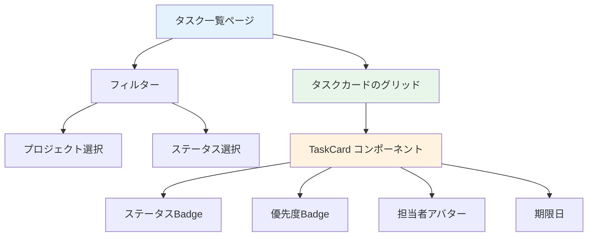
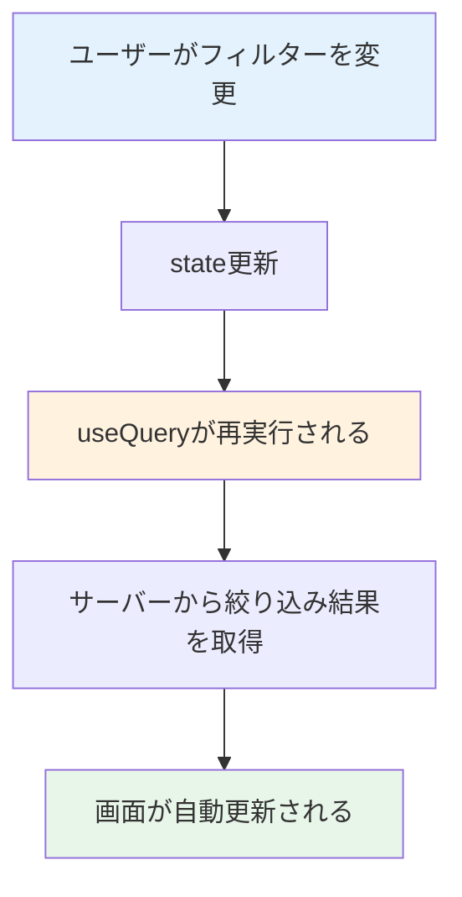
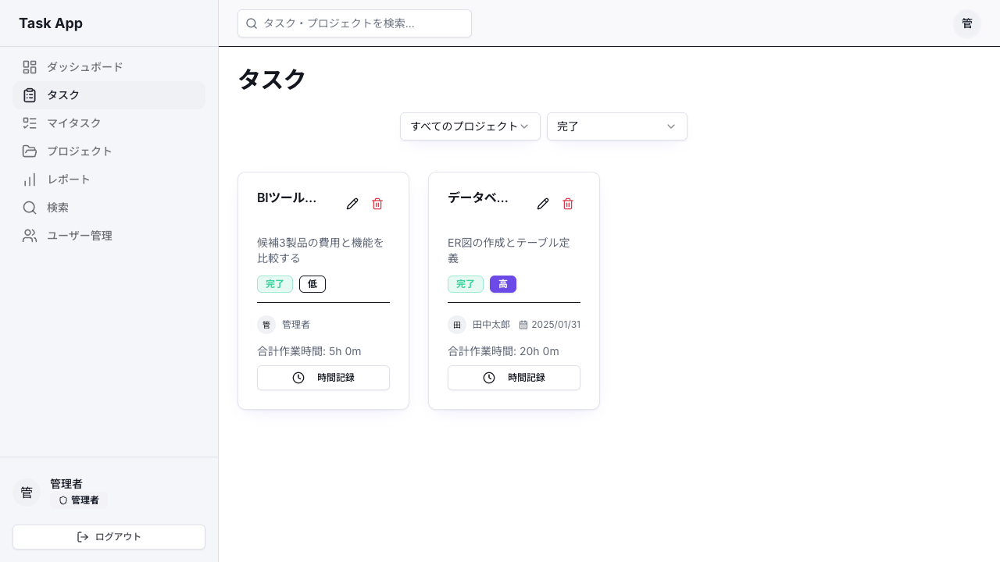

# Day 13: タスク一覧画面を作ろう

## 前回の振り返り

Day 12 ではプロジェクトへのメンバー追加・削除機能を実装しました。`addMember` / `removeMember` のtRPCルーターや権限チェックの仕組みを学んだので、今日はアプリの核となるタスク一覧画面の構築に取り組みます。

---

## 今日のゴール

タスクをカード形式で一覧表示し、プロジェクトやステータスでフィルタリングできるページを作ります。


## なぜこれを作るのか

タスクは日々増えていきます。一覧で全体を見渡せて、絞り込みで目的のタスクにすぐたどり着けないと、件数が増えた途端に管理が立ち行かなくなります。だから最初に「探しやすい一覧」を用意します。

> 例え話: タスク一覧は「To-Doリストのホワイトボード」です。付箋（タスク）が貼ってあり、色（優先度）や列（ステータス）で整理されています。フィルターは「この列の付箋だけ見せて」というフィルタリング機能です。

### タスク一覧の構成



### フィルタリングのデータフロー



### やること / やらないこと

| やること | やらないこと |
|---------|-------------|
| `api.task.getAll` でタスク取得 | タスクの作成（Day 14） |
| プロジェクト・ステータスでフィルタ | ドラッグ＆ドロップ |
| TaskCard でカード表示 | タスク詳細ページ |
| レスポンシブなグリッドレイアウト | 作業時間の記録（Day 16） |

### 新しく学ぶ概念

| 概念 | 読み方 | 役割 | 例え |
|------|--------|------|------|
| フィルタリング | --- | データを条件で絞り込む | ホワイトボードの特定の列だけ見る |
| TaskCard | タスク・カード | タスク1件分の表示コンポーネント | 1枚の付箋 |
| 三項演算子 | さんこうえんざんし | `条件 ? 真の値 : 偽の値` の書き方 | 「もし雨なら傘、晴れなら帽子」 |
| Suspense | サスペンス | データ読み込み中のフォールバック表示 | 「ただいま準備中」の看板 |

### 今日の作業ファイル

```
src/
  app/task/
    page.tsx              ... タスク一覧ページ（新規作成）
  component/task/
    task-card.tsx          ... タスクカード（既存）
    task-detail-dialog.tsx ... タスク詳細ダイアログ（既存）
  component/ui/
    loading-spinner.tsx    ... ローディング表示（既存）
  lib/constant/
    status.ts             ... ステータス定義・型ガード（既存）
```

### 完成ファイルの全体像

最終的に `src/app/task/page.tsx` は以下の構造になります。Step 1〜7 で少しずつ組み立てていきます。

| セクション | 内容 | 対応Step |
|-----------|------|---------|
| import群 | コンポーネント・ライブラリの読み込み | Step 1, 2, 3, 6, 7 |
| `TaskPageContent` 関数 | state定義・データ取得・ハンドラー・JSX | Step 1〜7 |
| `TaskPage` 関数（default export） | Suspenseでラップして公開 | Step 1 |

## 実装ステップ一覧

| ステップ | 作業内容 | 所要時間 |
|---------|---------|---------|
| Step 0 | タスク取得 API（getAll・getById）を自分で書く | 20分 |
| Step 1 | ページの土台を作る | 5分 |
| Step 2 | タスクデータを取得する | 5分 |
| Step 3 | フィルター用のstateとimportを追加する | 5分 |
| Step 4 | フィルターUIを作る | 7分 |
| Step 5 | フィルタ条件をAPIに渡す | 5分 |
| Step 6 | TaskCardでタスクを表示する | 7分 |
| Step 7 | タスク詳細ダイアログを追加する | 7分 |
| Step 8 | 動作確認 | 4分 |

**合計時間**: 約65分。

---

### Step 0: タスク取得 API（getAll・getById）を自分で書く（20分）

**ゴール**: タスク一覧を返す `getAll` と、詳細ダイアログで1件を返す `getById` を自分で書き、`root.ts` に登録して、画面から両方を呼べる状態にします。

一覧画面には、サーバーが持っているタスクを画面まで運んでくる入口が必要です。その入口を、今日は自分の手で1つ作ります。Day 09 でプロジェクト一覧の `getAll` を書いたのと同じ流れです。

#### tRPC の手続きは3つの部品でできている（復習）

Day 09 で見たとおり、tRPC の手続き（procedure）はいつも同じ3部品の組み合わせです。今日の `getAll` も、この型に当てはめるだけです。

| 部品 | 役割 | `task.getAll` での中身 |
|------|------|----------------------|
| 入力（input） | クライアントから何を受け取るか。`z` で形を検証する | プロジェクト・ステータス・担当者などの絞り込み条件 |
| 処理（query） | 受け取った条件で DB に問い合わせる | Prisma でタスクを検索する |
| 戻り値（return） | 画面に返すデータ | タスクの配列 |

今日は一覧取得の `getAll` に加えて、Step 7 の詳細ダイアログが呼ぶ `getById` も書きます。`create` や `update` は、それを実際に使う Day 14 以降で1つずつ足していきます。

#### 0-1. まず import から

`src/server/api/routers/task.ts` を新規作成し、先頭に import を書きます。

```typescript
// filepath: src/server/api/routers/task.ts
import { Prisma } from '@prisma/client';
import { TRPCError } from '@trpc/server';
import { z } from 'zod';
import { taskPrioritySchema, taskStatusSchema } from '@/lib/constant/query';
import { prisma } from '@/lib/prisma';
import { createTRPCRouter, protectedProcedure } from '../trpc';
import {
  assertMemberPermission,
  getUserProjectIds,
} from './_helpers/permission';
import { USER_SELECT } from './_helpers/select';
```

import は「これから使う道具を最初に並べておく」宣言です。`Prisma` は `where`（検索条件）の型注釈に使います。`taskStatusSchema` と `taskPrioritySchema` は、この画面でも使うステータス・優先度の検証ルールです。`protectedProcedure` はログイン済みの人だけが呼べる手続きを作る道具、`prisma` は DB に問い合わせる道具です。`getUserProjectIds` は「ログイン中のユーザーがメンバーになっているプロジェクトの id 一覧」を返す共有ヘルパーです。`assertMemberPermission` は、このあと `getById` で取得したタスクを自分が閲覧できるか確認します。`USER_SELECT` は返してよいユーザー項目だけを選びます。

#### 0-2. 手続きの骨組みと入力を書く

`getAll` の骨組みを書きます。`protectedProcedure` で始めると、ログインしていない人がこの API を呼んだときに自動で弾かれます。`.input(...)` では受け取る絞り込み条件を定義します。

```typescript
// filepath: src/server/api/routers/task.ts（続き）
export const taskRouter = createTRPCRouter({
  getAll: protectedProcedure
    .input(
      z
        .object({
          projectId: z.string().cuid().optional(),
          status: taskStatusSchema.optional(),
          priority: taskPrioritySchema.optional(),
          assigneeId: z.string().cuid().optional(),
          limit: z.number().int().min(1).max(100).default(100),
          offset: z.number().int().min(0).default(0),
        })
        .optional(),
    )
    .query(async ({ ctx, input }) => {
      const where: Prisma.TaskWhereInput = {};
      const limit = input?.limit ?? 100;
      const offset = input?.offset ?? 0;
```

各項目に `.optional()` が付いているのは、その項目を省略してよいという意味です。いちばん外側にも `.optional()` があるので、条件オブジェクトごと渡さずに呼ぶこともできます。`limit` と `offset` は一度に取りすぎないための件数と開始位置で、`.int()` により小数を拒否し、`.default(...)` で既定値を持たせています。`.query(...)` の中の `ctx` にはログイン中のユーザー情報が入り、`input` には今定義した条件が入ってきます。`where` は、このあと組み立てる検索条件を入れておく変数です。

#### 0-3. ここが一番のヤマ場（自分のプロジェクトのタスクだけ返す）

ここが `getAll` で最も気をつける部分です。タスクはプロジェクトにぶら下がるので、「自分がメンバーのプロジェクトのタスクだけ」を返さないと、他人のタスクまで見えてしまいます。

```typescript
// filepath: src/server/api/routers/task.ts（続き）
      const projectIds = await getUserProjectIds(ctx.session.userId);

      where.projectId = { in: projectIds };

      if (input?.projectId) {
        if (!projectIds.includes(input.projectId)) {
          throw new TRPCError({
            code: 'FORBIDDEN',
            message: 'このプロジェクトへのアクセス権限がありません',
          });
        }
        where.projectId = input.projectId;
      }
```

`getUserProjectIds` で自分が入っているプロジェクトの id 一覧を取り、`where.projectId = { in: projectIds }` で「その中のどれかに属するタスク」に絞ります。`input.projectId` で特定のプロジェクトを指定されたときは、それが自分の一覧に含まれるかを確認し、含まれないなら `TRPCError` を `throw` して処理を打ち切ります。`throw` は「これ以上は進めない」とその場で処理を止める命令です。この確認を挟まないと、他人のプロジェクト id を渡すだけで中身が覗けてしまいます。

#### 0-4. 残りの絞り込み条件を足す

弾く条件を通過したら、ステータス・優先度・担当者の絞り込みを足します。

```typescript
// filepath: src/server/api/routers/task.ts（続き）
      if (input?.status) where.status = input.status;
      if (input?.priority) where.priority = input.priority;
      if (input?.assigneeId) where.assigneeId = input.assigneeId;
```

3つとも、指定されたときだけ条件に足します。未指定のときはその条件を使わないので、絞り込みなしで対象になります。

#### 0-5. Prisma でタスクを取得する

組み立てた `where` を使って、Prisma で一覧を取得します。画面はプロジェクト名・担当者・コメントを表示するので、関連するデータも `include` で一緒に取ってきます。

```typescript
// filepath: src/server/api/routers/task.ts（続き）
      return await prisma.task.findMany({
        where,
        include: {
          project: true,
          createdBy: {
            select: USER_SELECT,
          },
          assignee: {
            select: USER_SELECT,
          },
```

```typescript
// filepath: src/server/api/routers/task.ts（続き）
          comments: {
            include: {
              user: {
                select: USER_SELECT,
              },
            },
            orderBy: { createdAt: 'desc' },
          },
        },
```

`include` は関連するデータも一緒に取ってくる指定です。`project` はタスクの所属プロジェクト、`createdBy` と `assignee` は作成者と担当者で、どちらも `USER_SELECT` で必要な項目だけに絞り、パスワードなどは返しません。`comments` はコメントとその投稿者を新しい順に取ります。こうして関連を一緒に取っておくと、画面側は追加の通信なしで表示できます。

#### 0-6. 並び順と件数を指定して返す

最後に、並び順と取得件数を付けて閉じます。

```typescript
// filepath: src/server/api/routers/task.ts（続き）
        orderBy: [{ position: 'asc' }, { createdAt: 'desc' }],
        take: limit,
        skip: offset,
      });
    }),
```

`orderBy` は `position`（並べ替え用の番号）の昇順で、同じなら作成日の新しい順にします。`take` と `skip` は取得件数と開始位置の指定です。ここでは `}),` で `getAll` までを閉じ、次の手続きを続けられる状態にします。

#### 0-7. 詳細ダイアログ用の getById を書く

Step 7 で配置する `TaskDetailDialog` は、選択した1件を `api.task.getById` で取得します。画面を置く前に API を用意して、Day 13 の終了時点で型チェックと詳細表示の両方が成立するようにします。`getAll` の直後へ追加してください。

```typescript
// filepath: src/server/api/routers/task.ts（getAll の直後に追加）
  getById: protectedProcedure
    .input(z.object({ id: z.string().cuid() }))
    .query(async ({ ctx, input }) => {
      const task = await prisma.task.findUnique({
        where: { id: input.id },
        include: {
          project: {
            include: {
              members: {
                where: { userId: ctx.session.userId },
              },
            },
          },
          createdBy: {
            select: USER_SELECT,
          },
          assignee: {
            select: USER_SELECT,
          },
```

```typescript
// filepath: src/server/api/routers/task.ts（getById の続き）
          comments: {
            include: {
              user: {
                select: USER_SELECT,
              },
            },
            orderBy: { createdAt: 'desc' },
          },
        },
      });
```

```typescript
// filepath: src/server/api/routers/task.ts（続き）
      if (!task) {
        throw new TRPCError({
          code: 'NOT_FOUND',
          message: 'タスクが見つかりません',
        });
      }

      assertMemberPermission(task.project.members);

      return task;
    }),
});
```

`getById` でも project の members をログインユーザーに絞って取得し、`assertMemberPermission` で閲覧権限を確認します。コメントも一緒に返すので、詳細ダイアログは別の通信を増やさず表示できます。最後の `});` で `taskRouter` 全体を閉じます。

**確認ポイント**:
- `src/server/api/routers/task.ts` に `getAll` と `getById` を書き、`}),` と `});` まで閉じた
- `getUserProjectIds` を使って自分のプロジェクトのタスクだけに絞っている
- `getById` でも `assertMemberPermission` で閲覧権限を確認している
- `npm run dev` で型エラーが出ていない（この API を画面から呼ぶのは Step 2 以降なので、今は起動時にエラーが出なければよい）

#### 0-8. root.ts に task ルーターを登録する

`taskRouter` を書いただけでは、まだ画面から呼べません。作った router を `root.ts` に登録して、初めて `api.task.getAll` と `api.task.getById` という呼び名が生まれます。Day 09 で `project` を登録したのと同じ形です。

```typescript
// filepath: src/server/api/root.ts
import { authRouter } from './routers/auth';
import { projectRouter } from './routers/project';
import { taskRouter } from './routers/task';
import { createCallerFactory, createTRPCRouter } from './trpc';

export const appRouter = createTRPCRouter({
  auth: authRouter,
  project: projectRouter,
  task: taskRouter,
});

export type AppRouter = typeof appRouter;

export const createCaller = createCallerFactory(appRouter);
```

`appRouter` に `task: taskRouter` を足したことで、フロント側の `api.task.getAll` と `api.task.getById` が手続きにつながります。今の `root.ts` には auth・project・task の3つが並びます。`comment` や `search` などは、それを使う Day で1つずつ足していきます。

**確認ポイント**:
- `root.ts` に `taskRouter` の import と `task: taskRouter` の2行を追加した
- `npm run dev` で型エラーが出ていない

---

### Step 1: ページの土台を作る（5分）

**ゴール**: タスク一覧ページの基本構造を作ります。

**実装**:

`src/app/task/page.tsx` を新規作成します。まずインポートとメインコンテンツの骨格です。

```typescript
// filepath: src/app/task/page.tsx
// クライアントコンポーネント宣言とimport
'use client';

import { Suspense, useState } from 'react';
import { AppLayout }
  from '@/component/layout/app-layout';
import { PageLoadingSpinner }
  from '@/component/ui/loading-spinner';
```

**確認ポイント**:
- ファイルが `src/app/task/page.tsx` に作成された
- `'use client'` が先頭にある

続いて、ページの骨格を定義します。`TaskPageContent` がメインコンテンツ、`TaskPage` がページのエントリーポイントです。

```typescript
// filepath: src/app/task/page.tsx
// メインコンテンツの骨格
function TaskPageContent() {
  return (
    <AppLayout>
      <div className="flex flex-col gap-6">
        <h1 className="text-3xl font-bold
          tracking-tight">
          タスク
        </h1>
      </div>
    </AppLayout>
  );
}
```

**確認ポイント**:
- `TaskPageContent` 関数が定義できた
- `AppLayout` でラップしている

`TaskPage` は `Suspense` で `TaskPageContent` をラップします。`useSearchParams`（Step 7で追加）はApp Routerのクライアントコンポーネントで使う場合、`Suspense` 境界が必要です。読み込み中は `PageLoadingSpinner` を表示します。

```typescript
// filepath: src/app/task/page.tsx
// ページ本体（Suspenseでラップ）
export default function TaskPage() {
  return (
    <Suspense
      fallback={<PageLoadingSpinner />}>
      <TaskPageContent />
    </Suspense>
  );
}
```

**確認ポイント**:
- `/task` にアクセスして「タスク」と表示される
- サイドバーが表示されている

---

### Step 2: タスクデータを取得する（5分）

**ゴール**: `useQuery` でタスク一覧を取得します。

**実装**:

ファイル先頭のimport群に以下を追加します。

```typescript
// filepath: src/app/task/page.tsx
// import群に追加
import { api } from '@/trpc/react';
```

**確認ポイント**:
- `api` のインポートが追加できた

次に `TaskPageContent` 関数の先頭（`return` の前）に以下を追加します。

```typescript
// filepath: src/app/task/page.tsx
// TaskPageContent関数の先頭に追加
const { data: tasks,
  isLoading: tasksLoading,
} = api.task.getAll.useQuery(
  {},
  { refetchOnWindowFocus: false },
);
```

**確認ポイント**:
- `api` をインポートしてエラーが出ていない
- `useQuery` に空オブジェクト `{}` を渡している

> `useQuery({})` の `{}` は「条件なしで全件取得」という意味です。後のステップでここにフィルター条件を入れます。`refetchOnWindowFocus: false` は、ブラウザタブを切り替えても再取得しない設定です。

プロジェクト一覧も取得します（フィルター用）。

```typescript
// filepath: src/app/task/page.tsx
// TaskPageContent内に追加
const { data: projects } =
  api.project.getAll.useQuery();
```

**確認ポイント**:
- `projects` のデータ取得が追加できた

ローディング中はスピナーを表示します。`return` 文の直前に追加してください。

```typescript
// filepath: src/app/task/page.tsx
// return文の直前に追加
if (tasksLoading) {
  return (
    <AppLayout>
      <PageLoadingSpinner />
    </AppLayout>
  );
}
```

**確認ポイント**:
- データ取得中にスピナーが表示される
- 取得完了後、ページ内容に切り替わる

#### task.getAll のパラメータ

| パラメータ | 型 | 説明 |
|-----------|-----|------|
| `projectId` | `string?` | プロジェクトで絞り込み |
| `status` | `TaskStatus?` | ステータスで絞り込み |
| `assigneeId` | `string?` | 担当者で絞り込み |
| `limit` | `number?` | 取得件数（デフォルト100） |
| `offset` | `number?` | 取得開始位置（デフォルト0） |

---

### Step 3: フィルター用のstateとimportを追加する（5分）

**ゴール**: フィルターUIに必要なインポートとstateを準備します。

**実装**:

ファイル先頭のimport群に以下を追加します。

```typescript
// filepath: src/app/task/page.tsx
// import群に追加（フィルター用）
import {
  Select, SelectContent, SelectItem,
  SelectTrigger, SelectValue,
} from '@/component/ui/select';
import {
  isTaskStatus,
  TASK_STATUS_LABELS,
  type TaskStatus,
} from '@/lib/constant/status';
```

**確認ポイント**:
- `isTaskStatus` 型ガードもインポートしている
- インポート元が `@/lib/constant/status`（`@prisma/client` ではない）

フィルター用の state を `TaskPageContent` 関数の先頭に追加します。

```typescript
// filepath: src/app/task/page.tsx
// TaskPageContent関数の先頭に追加
const [filterProject, setFilterProject] =
  useState<string>('all');
const [filterStatus, setFilterStatus] =
  useState<TaskStatus | 'all'>('all');
```

**確認ポイント**:
- `filterProject` と `filterStatus` の state が追加された
- 初期値はどちらも `'all'`（全件表示）

---

### Step 4: フィルターUIを作る（7分）

**ゴール**: プロジェクトとステータスの選択UIを作ります。

**実装**:

`<h1>` タグの直下に追加します。プロジェクト選択のドロップダウンです。

```typescript
// filepath: src/app/task/page.tsx
// h1タグの直下に追加: フィルター外枠
<div className="flex gap-2 w-full
  sm:w-auto ml-auto">
  <div className="w-[200px]">
    <Select value={filterProject}
      onValueChange={setFilterProject}>
      <SelectTrigger>
        <SelectValue placeholder=
          "すべてのプロジェクト" />
      </SelectTrigger>
    </Select>
  </div>
</div>
```

**確認ポイント**:
- `Select` の `value` に `filterProject` state を渡している
- JSXが閉じタグまで完結している

プロジェクト選択の `SelectContent` を `SelectTrigger` の直後に追加します。

```typescript
// filepath: src/app/task/page.tsx
// SelectTriggerの直後に追加
<SelectContent>
  <SelectItem value="all">
    すべてのプロジェクト
  </SelectItem>
  {projects?.map((p) => (
    <SelectItem key={p.id} value={p.id}>
      {p.name}
    </SelectItem>
  ))}
</SelectContent>
```

**確認ポイント**:
- 「すべてのプロジェクト」が先頭にある
- プロジェクト名が動的に表示される

続いてステータス選択です。プロジェクト選択の `</div>` の直後に2つ目の `<div>` を追加します。`isTaskStatus` 型ガードを使って安全に値を設定します。

```typescript
// filepath: src/app/task/page.tsx
// ステータス選択
<div className="w-[200px]">
  <Select value={filterStatus}
    onValueChange={(value) => {
      if (value === 'all'
        || isTaskStatus(value))
        setFilterStatus(value);
    }}>
    <SelectTrigger>
      <SelectValue placeholder=
        "すべてのステータス" />
    </SelectTrigger>
  </Select>
</div>
```

**確認ポイント**:
- `as` キャストではなく `isTaskStatus()` 型ガードで安全に判定している
- `'all'` も許可している

ステータスの `SelectContent` を `SelectTrigger` の直後に追加します。

```typescript
// filepath: src/app/task/page.tsx
// ステータスSelectTriggerの直後に追加
<SelectContent>
  <SelectItem value="all">
    すべてのステータス
  </SelectItem>
  {Object.entries(
    TASK_STATUS_LABELS
  ).map(([value, label]) => (
    <SelectItem key={value} value={value}>
      {label}
    </SelectItem>
  ))}
</SelectContent>
```

**確認ポイント**:
- プロジェクトとステータスの2つのドロップダウンが並んで表示される


---

### Step 5: フィルタ条件をAPIに渡す（5分）

**ゴール**: 選択したフィルターでAPIリクエストを変更します。

**実装**:

Step 2で追加した `useQuery` を、フィルター付きに書き換えます。三項演算子（さんこうえんざんし）は `条件 ? 真の値 : 偽の値` という書き方です。「もし `'all'` なら `undefined`、それ以外なら値をそのまま」という意味です。

```typescript
// filepath: src/app/task/page.tsx
// Step 2のuseQueryを書き換え
const {
  data: tasks,
  isLoading: tasksLoading,
} = api.task.getAll.useQuery(
  {
    projectId: filterProject === 'all'
      ? undefined : filterProject,
    status: filterStatus === 'all'
      ? undefined : filterStatus,
  },
  { refetchOnWindowFocus: false },
);
```

**確認ポイント**:
- プロジェクトを選択すると表示が絞り込まれる
- 「すべて」を選ぶと全タスクが表示される

> `'all'` の場合に `undefined` を渡すと「この条件は使わない」という意味になり、サーバーは全件を返します。フィルターの選択が変わるたびにReactが `useQuery` を再実行し、画面が自動更新されます。



---

### Step 6: TaskCardでタスクを表示する（7分）

**ゴール**: 各タスクをカード形式でグリッド表示します。

**実装**:

ファイル先頭のimport群に以下を追加します。

```typescript
// filepath: src/app/task/page.tsx
// import群に追加（TaskCard用）
import { TaskCard }
  from '@/component/task/task-card';
```

**確認ポイント**:
- `TaskCard` のインポートが追加できた

ハンドラーを仮実装します。`TaskPageContent` 関数内、`return` 文の前に追加してください。クリック・編集・削除は後のDayで本実装に差し替えます。

```typescript
// filepath: src/app/task/page.tsx
// TaskPageContent内に仮ハンドラーを追加
const handleTaskClick =
  (taskId: string) => {};
const handleEdit =
  (taskId: string) => {};
const handleDelete =
  (taskId: string) => {};
```

**確認ポイント**:
- 3つのハンドラーが定義できた
- Step 7 で `handleTaskClick` を本実装に差し替える

> TaskCardは `timeSpentMinutes`（合計作業時間）という作業時間まわりのpropも受け取れますが、作業時間の記録はDay 16で扱うので今日は渡しません。

TaskCardには編集・削除ボタンが付いています。ボタンを表示するかどうかは、ログインユーザーがそのタスクの属するプロジェクトで何のロールかによって決まります。まずログインユーザーの情報を取得し、import群に追加してください。

```typescript
// filepath: src/app/task/page.tsx
// import群に追加（権限判定用）
import { useCallback, useMemo }
  from 'react';
import {
  hasPermission, isProjectMemberRole,
  type ProjectMemberRole,
} from '@/lib/constant/roles';
```

続けて、`TaskPageContent` 内にログインユーザーの情報とプロジェクトごとのロールを求める処理を追加します。`tasks` の `useQuery` の近くに置いてください。

```typescript
// filepath: src/app/task/page.tsx
// ログインユーザーとプロジェクトごとのロールを求める
const { data: session } =
  api.auth.getSession.useQuery();

// プロジェクトごとのログインユーザー自身のロールを引けるようにする
const myRoleByProject = useMemo(() => {
  const map = new Map<string, ProjectMemberRole>();
  const userId = session?.user?.id;
  if (!userId || !projects) {
    return map;
  }
  for (const project of projects) {
    const me = project.members?.find(
      (member) => member.userId === userId,
    );
    if (me && isProjectMemberRole(me.role)) {
      map.set(project.id, me.role);
    }
  }
  return map;
}, [projects, session?.user?.id]);
```

> `myRoleByProject` はプロジェクトIDをキーに「自分がそのプロジェクトで何のロールか」を引けるMapです。

続けて、そのロールから編集・削除の権限を判定する関数を追加します。

```typescript
// filepath: src/app/task/page.tsx
// ロールから編集・削除の権限を判定する
const canEditProject = useCallback(
  (projectId: string) => {
    const role = myRoleByProject.get(projectId);
    return role ? hasPermission(role, 'canEdit') : false;
  },
  [myRoleByProject],
);

const canDeleteProject = useCallback(
  (projectId: string) => {
    const role = myRoleByProject.get(projectId);
    return role ? hasPermission(role, 'canDelete') : false;
  },
  [myRoleByProject],
);
```

> `canEditProject` / `canDeleteProject` はそのロールに編集・削除の権限があるかを返します。サーバー側の判定と同じ `hasPermission`（Day 12 で学んだ関数）を使うので、フロントとサーバーで基準がずれません。閲覧者（VIEWER）ロールのプロジェクトでは両方とも `false` になり、TaskCardの編集・削除ボタンが表示されなくなります。

**確認ポイント**:
- `myRoleByProject` / `canEditProject` / `canDeleteProject` が定義できた
- `npm run dev` でエラーが出ていない

フィルターUIの直下にグリッドを追加します。タスクがある場合のカード表示です。

```typescript
// filepath: src/app/task/page.tsx
// フィルターUIの直下: タスクグリッド
<div className="grid gap-6
  sm:grid-cols-2 lg:grid-cols-3
  xl:grid-cols-4">
  {tasks && tasks.length > 0 ? (
    tasks.map((task) => (
      <TaskCard
        key={task.id}
        id={task.id}
        title={task.title}
        description={task.description}
        status={task.status}
        priority={task.priority}
        dueDate={task.dueDate}
        assignee={task.assignee}
        onEdit={handleEdit}
        onDelete={handleDelete}
        onClick={handleTaskClick}
      />
    ))
  ) : (
    <div />
  )}
</div>
```

TaskCardに `canEdit` / `canDelete` を渡します。上の `<TaskCard ... />` を以下に**置き換えて**ください。

```typescript
// filepath: src/app/task/page.tsx
// TaskCardに権限フラグを追加
<TaskCard
  key={task.id}
  id={task.id}
  title={task.title}
  description={task.description}
  status={task.status}
  priority={task.priority}
  dueDate={task.dueDate}
  assignee={task.assignee}
  onEdit={handleEdit}
  onDelete={handleDelete}
  onClick={handleTaskClick}
  canEdit={canEditProject(task.projectId)}
  canDelete={canDeleteProject(task.projectId)}
/>
```

> `canEdit` / `canDelete` を渡さないと、TaskCard側のデフォルト値（`true`）が使われ、閲覧者（VIEWER）にも編集・削除ボタンが見えてしまいます。ボタンを押すとサーバー側の権限チェックで弾かれる（403 FORBIDDEN）ので、必ずロールに応じた値を渡してください。

**確認ポイント**:
- タスクがカード形式で表示されている
- ステータス・優先度がBadgeで表示される

タスクがない場合の空状態メッセージです。上のコードの `<div />` を以下に差し替えてください。

```typescript
// filepath: src/app/task/page.tsx
// 空状態のメッセージ（<div /> を差し替え）
<div className="col-span-full flex
  flex-col items-center
  justify-center py-12
  text-center
  text-muted-foreground">
  <p>タスクが見つかりません。</p>
  <p>最初のタスクを作成しましょう!</p>
</div>
```

**確認ポイント**:
- タスクがない時にメッセージが表示される
- カードがレスポンシブなグリッドで並んでいる

#### TaskCardに渡す主なprops

| prop | 型 | 説明 |
|------|-----|------|
| `id` | `string` | タスクID |
| `title` | `string` | タスク名 |
| `status` | `TaskStatus` | ステータス（TODO, IN_PROGRESS等） |
| `priority` | `TaskPriority` | 優先度（LOW, MEDIUM, HIGH, URGENT） |
| `assignee` | `object?` | 担当者情報 |
| `dueDate` | `Date?` | 期限日 |
| `onEdit` | `(id: string) => void` | 編集ボタンのコールバック |
| `onDelete` | `(id: string) => void` | 削除ボタンのコールバック |
| `onClick` | `(id: string) => void` | カードクリックのコールバック |
| `canEdit` | `boolean?` | 編集ボタンを表示するか（プロジェクトロールから算出） |
| `canDelete` | `boolean?` | 削除ボタンを表示するか（プロジェクトロールから算出） |

---

### Step 7: タスク詳細ダイアログを追加する（7分）

**ゴール**: カードクリックでタスクの詳細を表示します。URLパラメータにも対応します。

**実装**:

ファイル先頭のimport群に以下を追加します。

```typescript
// filepath: src/app/task/page.tsx
// import群に追加（詳細ダイアログ用）
import { TaskDetailDialog }
  from '@/component/task/task-detail-dialog';
import { useSearchParams }
  from 'next/navigation';
import { useEffect } from 'react';
```

**確認ポイント**:
- `TaskDetailDialog` と `useSearchParams` がインポートできた
- `useEffect` も `react` からインポートしている

詳細表示用のstateとURLパラメータ対応を追加します。`TaskPageContent` 関数の先頭（他のstateの近く）に追加してください。`useSearchParams` で URL の `?taskId=xxx` を読み取り、そのタスクの詳細を自動で開きます。

```typescript
// filepath: src/app/task/page.tsx
// 詳細表示用のstate
const [selectedTask, setSelectedTask] =
  useState<string | null>(null);
const [detailOpen, setDetailOpen] =
  useState(false);

// URLパラメータからタスクIDを取得
const searchParams = useSearchParams();
const taskIdParam =
  searchParams.get('taskId');
```

**確認ポイント**:
- `selectedTask` と `detailOpen` の state が追加された
- `searchParams` から `taskId` を取得している

URLパラメータがある場合に自動で詳細を開く `useEffect` を追加します。

```typescript
// filepath: src/app/task/page.tsx
// URLパラメータでタスク詳細を自動オープン
useEffect(() => {
  if (taskIdParam) {
    setSelectedTask(taskIdParam);
    setDetailOpen(true);
  }
}, [taskIdParam]);
```

**確認ポイント**:
- `taskIdParam` が変わると `useEffect` が実行される

Step 6 の `handleTaskClick` の仮実装（空の関数）を以下の本実装に差し替えます。`handleDetailClose` も追加します。

```typescript
// filepath: src/app/task/page.tsx
// handleTaskClickを本実装に差し替え
const handleTaskClick =
  (taskId: string) => {
    setSelectedTask(taskId);
    setDetailOpen(true);
  };
const handleDetailClose = () => {
  setDetailOpen(false);
  setSelectedTask(null);
};
```

**確認ポイント**:
- カードクリックで `selectedTask` が設定される
- `handleDetailClose` で state がリセットされる

JSX のグリッド `</div>` の直下に詳細ダイアログを追加します。

```typescript
// filepath: src/app/task/page.tsx
// グリッドの直下に追加
<TaskDetailDialog
  open={detailOpen}
  taskId={selectedTask}
  onClose={handleDetailClose}
/>
```

**確認ポイント**:
- カードクリックで詳細ダイアログが開く
- タスクの説明・担当者・期限が表示される


---

### Step 8: 動作確認（4分）

**ゴール**: タスク一覧の全機能を確認します。

```bash
# filepath: ターミナル
# 開発サーバーを起動して動作確認
PORT=3001 npm run dev
```

**確認ポイント**:
- 開発サーバーが起動した

#### 確認項目

| 確認項目 | 期待結果 |
|---------|---------|
| `/task` にアクセス | タスクカードがグリッド表示される |
| プロジェクトフィルター | 選択したプロジェクトのタスクだけ表示 |
| ステータスフィルター | 選択したステータスのタスクだけ表示 |
| カードをクリック | 詳細ダイアログが開く |
| ブラウザ幅を変更 | カードの列数が変わる |
| `/task?taskId=xxx` でアクセス | 自動で詳細ダイアログが開く |

#### ローディング表示の確認

| 状態 | 表示内容 |
|------|---------|
| データ取得中（`tasksLoading` が `true`） | `PageLoadingSpinner` が表示される |
| データ取得完了 | タスクカードのグリッドが表示される |
| タスクが0件 | 「タスクが見つかりません」メッセージ |

**確認ポイント**:
- フィルタリングが正しく動作する
- カードにステータス・優先度のBadgeがある
- 詳細ダイアログが開閉する

---


---

### Pro パターンで書こう（ステータス表示の色分け）

### Before（改善前のコード）

```typescript
// filepath: src/app/task/page.tsx（参考）
// switch 文で色を決める
const getStatusColor = (status: string) => {
  switch (status) {
    case "TODO":
      return "bg-gray-100 text-gray-800";
    case "IN_PROGRESS":
      return "bg-blue-100 text-blue-800";
    case "DONE":
      return "bg-green-100 text-green-800";
    default:
      return "bg-gray-100 text-gray-800";
  }
};
```

**このコードの問題点**:

- ステータスが増えるたびに case を足す必要がある
- ラベルの文字も別の場所で同じ switch を書くことになる
- `default` に落ちるパターンが気づかないバグになりやすい

### After（プロが書くコード）

```typescript
// filepath: src/app/task/page.tsx（参考）
const STATUS_CONFIG = {
  TODO: { label: "未着手", color: "bg-gray-100 text-gray-800" },
  IN_PROGRESS: { label: "進行中", color: "bg-blue-100 text-blue-800" },
  DONE: { label: "完了", color: "bg-green-100 text-green-800" },
} as const;

// 使う時は1行
const { label, color } = STATUS_CONFIG[status];
```

**このコードの強み**:

- ステータスの追加は1行。色とラベルを1箇所で管理
- `as const` で型が推論されるので、typo するとコンパイルエラー
- switch を書く場所がゼロになる

#### 覚えておきたいエッセンス

switch 文は「設定オブジェクト + lookup」に置き換えられることが多いです。データと振る舞いを1箇所にまとめると、追加・変更が楽になります。

## 今日のまとめ

- [ ] `api.task.getAll` でタスク一覧を取得できた
- [ ] フィルター条件をAPIパラメータに反映できた
- [ ] `isTaskStatus` 型ガードで安全にフィルター値を設定できた
- [ ] TaskCard でタスクをカード表示できた
- [ ] `canEditProject` / `canDeleteProject` でロールに応じて編集・削除ボタンの表示を切り替えられた
- [ ] レスポンシブなグリッドレイアウトを実装できた
- [ ] URLパラメータからタスク詳細を自動オープンできた

## つまずきポイント

| エラー / 問題 | 原因 | 解決方法 |
|--------------|------|---------|
| タスクが表示されない | フィルタ条件が厳しすぎる | 「すべて」を選択してデータがあるか確認 |
| カードが表示されない | TaskCard の import ミス | `@/component/task/task-card` を確認 |
| フィルタが効かない | `useQuery` のパラメータが渡っていない | 三項演算子の構文を確認 |
| 詳細が取得できない | `enabled` 条件が間違っている | `!!selectedTask` を確認 |
| ステータスフィルタで型エラー | `as` キャストを使っている | `isTaskStatus()` 型ガードを使う |

## 今日学んだ用語

| 用語 | 意味 |
|------|------|
| フィルタリング | データを条件で絞り込む操作 |
| TaskCard | タスク1件を表示する再利用可能なコンポーネント |
| 三項演算子 | `条件 ? 真の値 : 偽の値` で分岐する構文 |
| Suspense | データ読込中にフォールバック表示するReactの仕組み |
| useSearchParams | URLの `?key=value` を読み取るNext.jsのフック |

## 次回予告

Day 14 では、新しいタスクを作成する機能を実装します。Day 10 で学んだダイアログパターンをタスク版に応用します。
