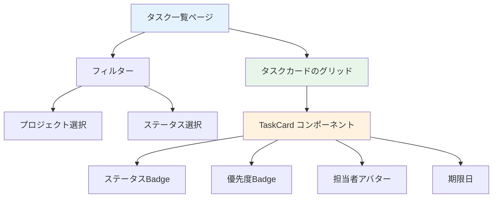

# Day 13: タスク一覧画面を作ろう

## 🎯 今日のゴール

タスクをカード形式で一覧表示し、プロジェクトやステータスでフィルタリングできるページを作ります。アプリの核となる機能です。

【スクリーンショット: タスク一覧画面（カードがグリッドで並んでいる）】

## 🤔 なぜこれを作るのか？

タスク管理はこのアプリの中心機能です。全タスクを見渡し、絞り込みで目的のタスクを素早く見つけられるようにします。

> 💡 **例え話**: タスク一覧は「To-Doリストのホワイトボード」です。付箋（タスク）が貼ってあり、色（優先度）や列（ステータス）で整理されています。フィルターは「この列の付箋だけ見せて」というフィルタリング機能です。

### 📐 タスク一覧の構成



### やること / やらないこと

| やること | やらないこと |
|---------|-------------|
| `api.task.getAll` でタスク取得 | タスクの作成（Day 14） |
| プロジェクト・ステータスでフィルタ | ドラッグ＆ドロップ |
| TaskCard でカード表示 | タスク詳細ページ |
| レスポンシブなグリッドレイアウト | タイマー機能（Day 16） |

### 🆕 新しく学ぶ概念

| 概念 | 読み方 | 役割 | 例え |
|------|--------|------|------|
| フィルタリング | — | データを条件で絞り込む | ホワイトボードの特定の列だけ見る |
| TaskCard | タスク・カード | タスク1件分の表示コンポーネント | 1枚の付箋 |

## 📊 実装ステップ一覧

| ステップ | 作業内容 | 所要時間 |
|---------|---------|---------|
| Step 1 | ページの土台を作る | 3分 |
| Step 2 | タスクデータを取得する | 5分 |
| Step 3 | フィルターUIを作る | 7分 |
| Step 4 | フィルタ条件をAPIに渡す | 5分 |
| Step 5 | TaskCardでタスクを表示する | 7分 |
| Step 6 | グリッドレイアウトを適用する | 5分 |
| Step 7 | タスク詳細ダイアログを追加する | 7分 |
| Step 8 | 動作確認 | 3分 |

**合計時間**: 約42分

---

### Step 1: ページの土台を作る（3分）

🎯 **ゴール**: タスク一覧ページの基本構造を作ります。

💻 **実装**:

```typescript
// filepath: src/app/task/page.tsx
// クライアントコンポーネント宣言とimport
'use client';

import { AppLayout } from
  '@/component/layout/app-layout';
import { api } from '@/trpc/react';
import { Suspense, useState } from 'react';
import { useSearchParams } from
  'next/navigation';

// メインコンテンツ
function TaskPageContent() {
  return (
    <div className="space-y-6">
      <h1 className="text-3xl font-bold
        tracking-tight">
        タスク
      </h1>
    </div>
  );
}
```

続いて、ページ本体をAppLayoutとSuspenseでラップして定義します。

```typescript
// filepath: src/app/task/page.tsx
// ページ本体
export default function TaskPage() {
  return (
    <AppLayout>
      <Suspense fallback={<div>Loading...</div>}>
        <TaskPageContent />
      </Suspense>
    </AppLayout>
  );
}
```

✅ **確認ポイント**:
- `/task` にアクセスして「タスク」と表示される
- サイドバーが表示されている

---

### Step 2: タスクデータを取得する（5分）

🎯 **ゴール**: `useQuery` でタスク一覧を取得します。

💻 **実装**:

```typescript
// filepath: src/app/task/page.tsx
// TaskPageContent内に追加
const {
  data: tasks,
  isLoading,
} = api.task.getAll.useQuery();

// プロジェクト一覧も取得（フィルター用）
const { data: projects } =
  api.project.getAll.useQuery();
```

#### task.getAll のパラメータ

| パラメータ | 型 | 説明 |
|-----------|-----|------|
| `projectId` | string? | プロジェクトで絞り込み |
| `status` | TaskStatus? | ステータスで絞り込み |
| `assigneeId` | string? | 担当者で絞り込み |
| `limit` | number? | 取得件数（デフォルト100） |

✅ **確認ポイント**:
- `npm run dev` でエラーが出ていない
- `console.log(tasks)` でデータが取得できている

---

### Step 3: フィルターUIを作る（7分）

🎯 **ゴール**: プロジェクトとステータスの選択UIを作ります。

💻 **実装**:

```typescript
// filepath: src/app/task/page.tsx
import {
  Select, SelectContent, SelectItem,
  SelectTrigger, SelectValue,
} from '@/component/ui/select';

// フィルター用のstate
const [projectFilter, setProjectFilter] =
  useState<string>('all');
const [statusFilter, setStatusFilter] =
  useState<string>('all');
```

```typescript
// filepath: src/app/task/page.tsx
// フィルターUI
<div className="flex gap-4">
  <Select value={projectFilter}
    onValueChange={setProjectFilter}>
    <SelectTrigger className="w-48">
      <SelectValue placeholder="プロジェクト" />
    </SelectTrigger>
    <SelectContent>
      <SelectItem value="all">全て</SelectItem>
      {projects?.map((p) => (
        <SelectItem key={p.id} value={p.id}>
          {p.name}
        </SelectItem>
      ))}
    </SelectContent>
  </Select>
</div>
```

✅ **確認ポイント**:
- プロジェクト選択のドロップダウンが表示される
- プロジェクトを選択できる

---

### Step 4: フィルタ条件をAPIに渡す（5分）

🎯 **ゴール**: 選択したフィルターでAPIリクエストを変更します。

💻 **実装**:

```typescript
// filepath: src/app/task/page.tsx
// useQueryのパラメータにフィルターを追加
const { data: tasks, isLoading } =
  api.task.getAll.useQuery({
    ...(projectFilter !== 'all'
      && { projectId: projectFilter }),
    ...(statusFilter !== 'all'
      && { status: statusFilter }),
  });
```

> 💡 スプレッド演算子 `...` と `&&` を使って、「all」以外が選ばれた時だけパラメータを追加しています。「all」の時はパラメータなし＝全件取得です。

✅ **確認ポイント**:
- プロジェクトを選択すると表示が絞り込まれる
- 「全て」を選ぶと全タスクが表示される

【スクリーンショット: フィルタリング後のタスク一覧】

---

### Step 5: TaskCardでタスクを表示する（7分）

🎯 **ゴール**: 各タスクをカード形式で表示します。

💻 **実装**:

```typescript
// filepath: src/app/task/page.tsx
import {
  TaskCard,
} from '@/component/task/task-card';

// タスクカードの表示
{tasks?.map((task) => (
  <TaskCard
    key={task.id}
    id={task.id}
    title={task.title}
    description={task.description}
    status={task.status}
    priority={task.priority}
    dueDate={task.dueDate}
    assignee={task.assignee}
    isTimerActive={task.isTimerActive}
    timeSpentMinutes={task.timeSpentMinutes}
    onEdit={() => handleEdit(task.id)}
    onDelete={() => handleDelete(task.id)}
    onClick={() => handleDetail(task.id)}
  />
))}
```

#### TaskCardに渡す主なprops

| prop | 型 | 説明 |
|------|-----|------|
| `status` | TaskStatus | ステータス（TODO等） |
| `priority` | TaskPriority | 優先度（LOW等） |
| `assignee` | object? | 担当者情報 |
| `dueDate` | Date? | 期限日 |
| `onEdit` | function | 編集ボタンのコールバック |
| `onDelete` | function | 削除ボタンのコールバック |

✅ **確認ポイント**:
- タスクがカード形式で表示されている
- ステータス・優先度がBadgeで表示される

---

### Step 6: グリッドレイアウトを適用する（5分）

🎯 **ゴール**: カードをレスポンシブなグリッドに配置します。

💻 **実装**:

```typescript
// filepath: src/app/task/page.tsx
// カードの親要素にグリッドクラスを追加
<div className="grid gap-4
  grid-cols-1
  sm:grid-cols-2
  lg:grid-cols-3
  xl:grid-cols-4">
  {tasks?.map((task) => (
    <TaskCard key={task.id} ... />
  ))}
</div>
```

> 💡 Day 09 のプロジェクト一覧と同じグリッドパターンです。画面幅に応じて1〜4列に自動調整されます。

✅ **確認ポイント**:
- カードがグリッドで並んでいる
- ブラウザ幅を変えると列数が変わる

---

### Step 7: タスク詳細ダイアログを追加する（7分）

🎯 **ゴール**: カードクリックでタスクの詳細を表示します。

💻 **実装**:

```typescript
// filepath: src/app/task/page.tsx
// 詳細表示用のstate
const [selectedTaskId, setSelectedTaskId] =
  useState<string | null>(null);
const [detailOpen, setDetailOpen] =
  useState(false);

// カードクリック時のハンドラー
const handleDetail = (taskId: string) => {
  setSelectedTaskId(taskId);
  setDetailOpen(true);
};
```

```typescript
// filepath: src/app/task/page.tsx
// 選択タスクの詳細データを取得
const { data: taskDetail } =
  api.task.getById.useQuery(
    { id: selectedTaskId || '' },
    { enabled: !!selectedTaskId },
  );
```

> 💡 `enabled: !!selectedTaskId` で、タスクが選択されている時だけAPIを呼びます。Day 12 で学んだパターンと同じです。

✅ **確認ポイント**:
- カードクリックで詳細ダイアログが開く
- タスクの説明・担当者・期限が表示される

【スクリーンショット: タスク詳細ダイアログ】

---

### Step 8: 動作確認（3分）

🎯 **ゴール**: タスク一覧の全機能を確認します。

1. `/task` にアクセスしてタスクカードが表示される
2. プロジェクトフィルターで絞り込みできる
3. カードクリックで詳細が表示される
4. レスポンシブでカードの列数が変わる

✅ **確認ポイント**:
- フィルタリングが正しく動作する
- カードにステータス・優先度のBadgeがある
- 詳細ダイアログが開閉する

---

## 📋 今日のまとめ

- [ ] `api.task.getAll` でタスク一覧を取得できた
- [ ] フィルター条件をAPIパラメータに反映できた
- [ ] TaskCard でタスクをカード表示できた
- [ ] レスポンシブなグリッドレイアウトを実装できた

## ⚠️ つまずきポイント

| エラー / 問題 | 原因 | 解決方法 |
|--------------|------|---------|
| タスクが表示されない | フィルタ条件が厳しすぎる | 「全て」を選択してデータがあるか確認 |
| カードが表示されない | TaskCard の import ミス | `@/component/task/task-card` を確認 |
| フィルタが効かない | useQuery のパラメータが渡っていない | スプレッド演算子の構文を確認 |
| 詳細が取得できない | `enabled` 条件が間違っている | `!!selectedTaskId` を確認 |

## 📝 今日学んだ用語

| 用語 | 意味 |
|------|------|
| フィルタリング | データを条件で絞り込む操作 |
| TaskCard | タスク1件を表示する再利用可能なコンポーネント |
| Badge | ステータスや優先度を示す小さなラベル |
| enabled | useQuery の実行条件を制御するオプション |

## 🔗 次回予告

Day 14 では、新しいタスクを作成する機能を実装します。Day 10 で学んだダイアログパターンをタスク版に応用します。
