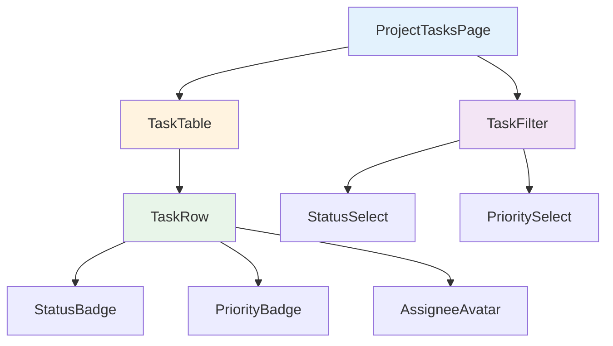

# Day 13: タスク一覧画面を作ろう

## 🎯 今日のゴール

プロジェクト内のタスクを一覧表示する画面を作ります。テーブル形式で表示し、ステータスや優先度でフィルタできるようにします。

【スクリーンショット: タスク一覧画面】

## 🤔 なぜこれを作るのか?

タスク管理アプリの核となる機能です。**タスク一覧は図書館の本棚のようなもの**。本棚があれば、どこに何の本があるか一目でわかり、探している本をすぐに見つけられます。同様に、タスク一覧があれば、プロジェクトの全タスクを俯瞰でき、今何をすべきかが明確になります。

### 📐 コンポーネント階層図



この図は、タスク一覧画面のコンポーネント構成を示しています。ページ（ProjectTasksPage）がフィルター（TaskFilter）とテーブル（TaskTable）を含み、テーブルが個々のタスク行（TaskRow）を含む階層構造になっています。

## 📊 実装ステップ一覧

| ステップ | 作業内容 | 所要時間 |
|---------|---------|---------|
| Step 1 | タスク一覧ページ作成 | 10分 |
| Step 2 | tRPCでタスク取得 | 15分 |
| Step 3 | テーブル表示 | 20分 |
| Step 4 | ステータスフィルタ | 15分 |

**合計時間**: 約60分

---

### Step 1: タスク一覧ページ作成（10分）

💻 **実装**:

```typescript
// filepath: src/app/projects/[id]/tasks/page.tsx
'use client';

import { useParams } from 'next/navigation';

export default function ProjectTasksPage() {
  const params = useParams();
  const projectId = params.id as string;

  return (
    <div className="p-6">
      <h1 className="text-2xl font-bold">タスク一覧</h1>
    </div>
  );
}
```

✅ **確認ポイント**: /projects/[id]/tasksにアクセスして「タスク一覧」が表示される

【スクリーンショット: 確認画面】

---

### Step 2: tRPCでタスク取得（15分）

💻 **実装**:

```typescript
// filepath: src/app/projects/[id]/tasks/page.tsx
'use client';

import { useParams } from 'next/navigation';
import { api } from '@/trpc/react';
import { Loader2 } from 'lucide-react';

export default function ProjectTasksPage() {
  const params = useParams();
  const projectId = params.id as string;

  const { data: tasks, isLoading } = api.task.getByProject.useQuery({
    projectId,
  });

  if (isLoading) {
    return (
      <div className="flex justify-center p-6">
        <Loader2 className="h-8 w-8 animate-spin" />
      </div>
    );
  }

  return (
    <div className="p-6">
      <h1 className="text-2xl font-bold">タスク一覧</h1>
      <p className="text-muted-foreground">タスク数: {tasks?.length}</p>
    </div>
  );
}
```

✅ **確認ポイント**: タスク数が表示される

【スクリーンショット: 確認画面】

---

### Step 3: テーブル表示（20分）

💻 **実装**:

```typescript
// filepath: src/app/projects/[id]/tasks/page.tsx
'use client';

import { useParams } from 'next/navigation';
import { api } from '@/trpc/react';
import { Loader2 } from 'lucide-react';
import { Badge } from '@/component/ui/badge';
import {
  Table,
  TableBody,
  TableCell,
  TableHead,
  TableHeader,
  TableRow,
} from '@/component/ui/table';

const statusColors: Record<string, string> = {
  TODO: 'bg-gray-500',
  IN_PROGRESS: 'bg-blue-500',
  IN_REVIEW: 'bg-yellow-500',
  DONE: 'bg-green-500',
};

export default function ProjectTasksPage() {
  const params = useParams();
  const projectId = params.id as string;

  const { data: tasks, isLoading } = api.task.getByProject.useQuery({
    projectId,
  });

  if (isLoading) {
    return (
      <div className="flex justify-center p-6">
        <Loader2 className="h-8 w-8 animate-spin" />
      </div>
    );
  }

  return (
    <div className="p-6">
      <h1 className="text-2xl font-bold mb-6">タスク一覧</h1>
      <div className="rounded-md border">
        <Table>
          <TableHeader>
            <TableRow>
              <TableHead>タイトル</TableHead>
              <TableHead>ステータス</TableHead>
              <TableHead>優先度</TableHead>
              <TableHead>担当者</TableHead>
              <TableHead>期限</TableHead>
            </TableRow>
          </TableHeader>
          <TableBody>
            {tasks?.map((task) => (
              <TableRow key={task.id}>
                <TableCell>{task.title}</TableCell>
                <TableCell>
                  <Badge className={statusColors[task.status]}>
                    {task.status}
                  </Badge>
                </TableCell>
                <TableCell>{task.priority}</TableCell>
                <TableCell>{task.assignee?.name || '未割当'}</TableCell>
                <TableCell>
                  {task.dueDate
                    ? new Date(task.dueDate).toLocaleDateString('ja-JP')
                    : '-'}
                </TableCell>
              </TableRow>
            ))}
          </TableBody>
        </Table>
      </div>
    </div>
  );
}
```

✅ **確認ポイント**: タスクがテーブル形式で表示される

【スクリーンショット: 確認画面】

---

### Step 4: ステータスフィルタ（15分）

💻 **実装**:

```typescript
// filepath: src/app/projects/[id]/tasks/page.tsx（フィルタ部分を追加）
import { useState } from 'react';
import { Button } from '@/component/ui/button';

const statusOptions = [
  { value: null, label: 'すべて' },
  { value: 'TODO', label: 'TODO' },
  { value: 'IN_PROGRESS', label: '進行中' },
  { value: 'DONE', label: '完了' },
];

export default function ProjectTasksPage() {
  const [statusFilter, setStatusFilter] = useState<string | null>(null);

  const filteredTasks = tasks?.filter(
    (task) => !statusFilter || task.status === statusFilter
  );

  return (
    <div className="p-6">
      <h1 className="text-2xl font-bold mb-6">タスク一覧</h1>

      <div className="flex gap-2 mb-4">
        {statusOptions.map((option) => (
          <Button
            key={option.value ?? 'all'}
            variant={statusFilter === option.value ? 'default' : 'outline'}
            size="sm"
            onClick={() => setStatusFilter(option.value)}
          >
            {option.label}
          </Button>
        ))}
      </div>

      <div className="rounded-md border">
        {/* テーブル内容は同じ、filteredTasksを使用 */}
      </div>
    </div>
  );
}
```

✅ **確認ポイント**: フィルタボタンでタスクが絞り込まれる

【スクリーンショット: 確認画面】

---

## 📝 学んだこと

- **shadcn/ui Table**: テーブル表示の基本構造（Table, TableHeader, TableBody）
- **Badge コンポーネント**: ステータス表示に適したUIパーツ
- **配列フィルタリング**: filter()で条件に合うデータを絞り込む
- **日付フォーマット**: toLocaleDateString()で日本語表示
- **Button variant**: variant で選択状態を視覚的に表現

## 📋 今日のまとめ

- [ ] タスク一覧ページを作成できた
- [ ] tRPCでタスクを取得できた
- [ ] テーブル形式で表示できた
- [ ] ステータスフィルタを実装できた

## ⚠️ つまずきポイント

| 問題 | 原因 | 解決策 |
|------|------|--------|
| タスクが表示されない | tRPCのクエリが失敗 | ブラウザのコンソールでエラー確認 |
| 日付が変な形式 | toLocaleDateString()のロケール未指定 | 'ja-JP'を引数に渡す |
| フィルタが効かない | statusFilterの型がstring \| null | 条件式で`!statusFilter`をチェック |

## 🔗 次回予告

Day 14では、タスクの新規作成機能を実装します。
