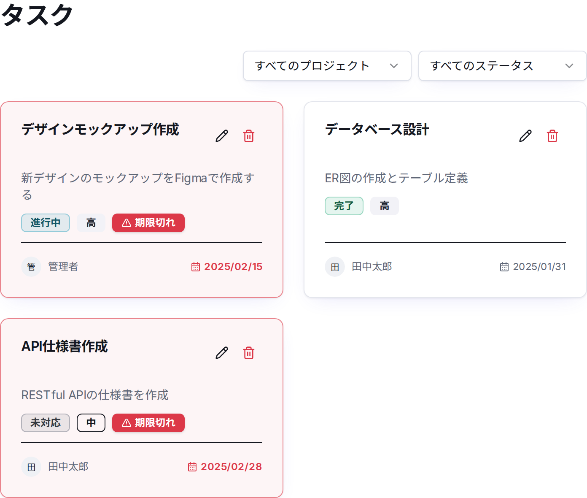
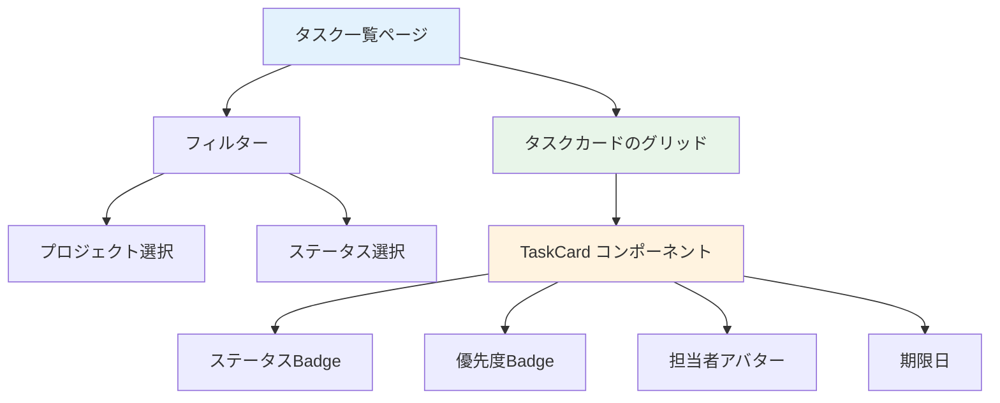
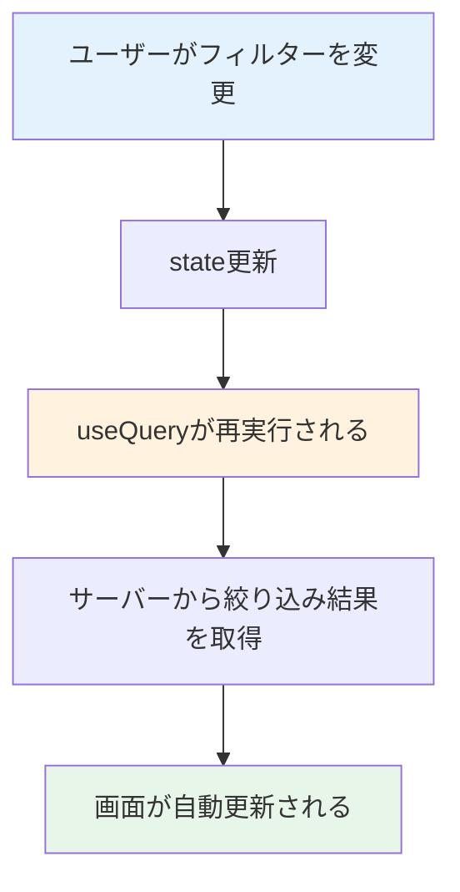
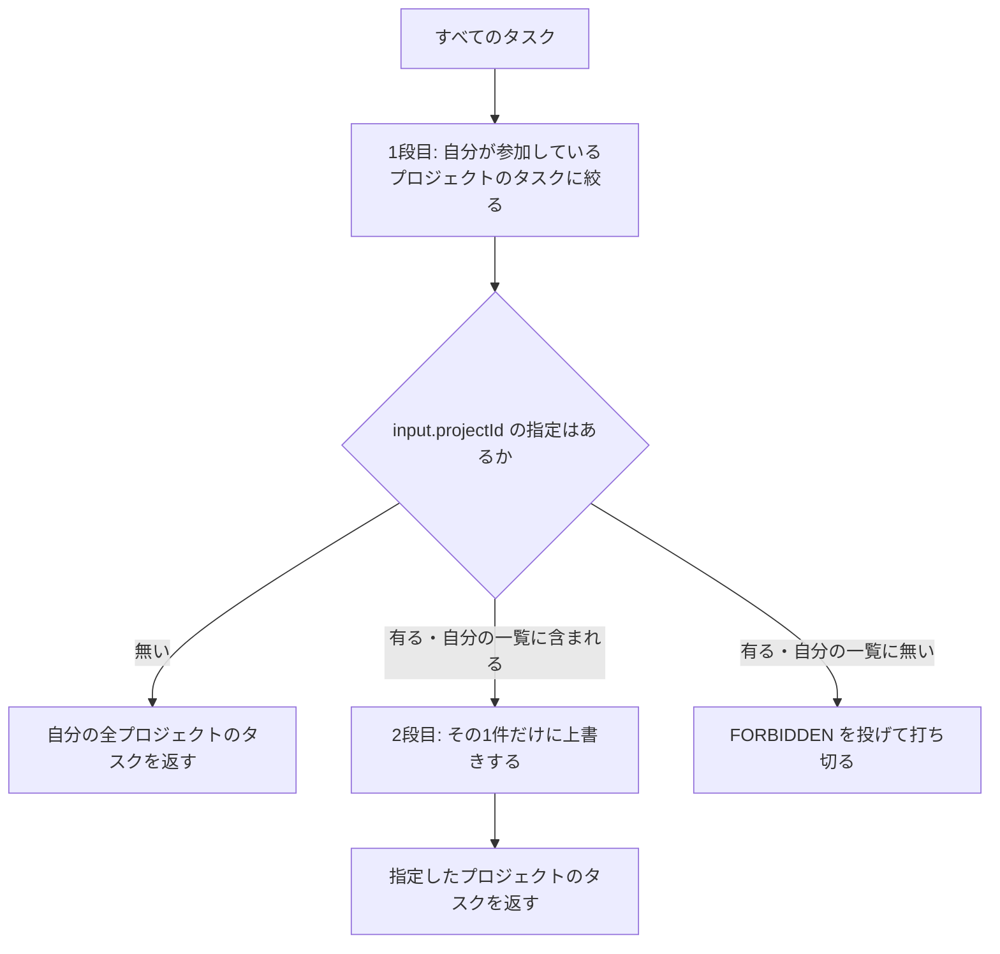
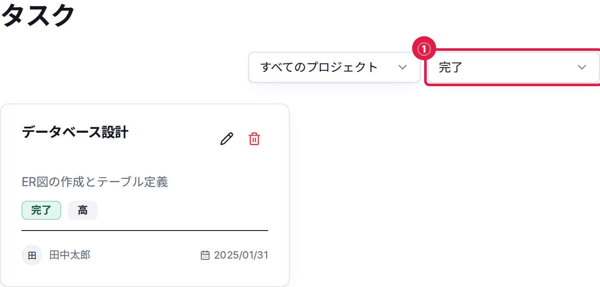
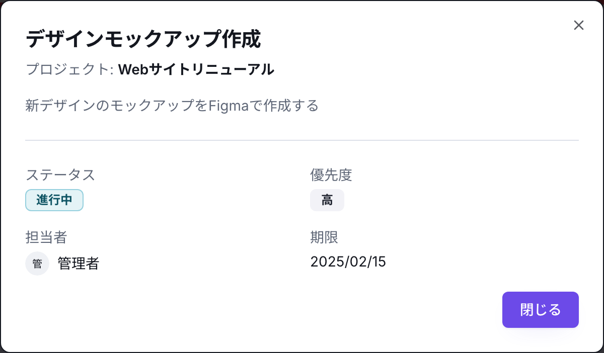

# Day 13: タスク一覧画面を作ろう

## 前回の振り返り

Day 12 ではプロジェクトへのメンバー追加・削除機能を実装しました。`addMember` / `removeMember` のtRPCルーターや権限チェックの仕組みを学んだので今日はアプリの核となるタスク一覧画面の構築に取り組みます。

---

## 今日のゴール

タスクをカード形式で一覧表示し、プロジェクトやステータスでフィルタリングできるページを作ります。

この日はまずサーバー側のタスク取得 API（`getAll` と `getById`）を自分で書きます。そのあと画面をつなぎます。



## なぜこれを作るのか

タスクは日々増えていきます。一覧で全体を見渡せて絞り込みで目的のタスクにすぐたどり着けないと件数が増えた途端に管理が立ち行かなくなります。だから最初に「探しやすい一覧」を用意します。

> 例え話: タスク一覧は「To-Doリストのホワイトボード」です。付箋（タスク）が貼ってあり、色（優先度）や列（ステータス）で整理されています。フィルターは「この列の付箋だけ見せて」というフィルタリング機能です。

### タスク一覧の構成


```mermaid
flowchart TD
    A[タスク一覧ページ] --> B[フィルター]
    A --> C[タスクカードのグリッド]
    B --> D[プロジェクト選択]
    B --> E[ステータス選択]
    C --> F[TaskCard コンポーネント]
    F --> G[ステータスBadge]
    F --> H[優先度Badge]
    F --> I[担当者アバター]
    F --> J[期限日]

    style A fill:#e3f2fd
    style C fill:#e8f5e9
    style F fill:#fff3e0
```

図の左にフィルター、右にカードのグリッドがぶら下がっています。今日はこの2つを別々に作ります。フィルターは「どのタスクを取ってくるか」を決める側、グリッドは「取ってきたタスクをどう並べるか」を決める側です。Day 09 のプロジェクト一覧は取得と表示だけでしたが今日はその手前に絞り込みが1段増えます。`TaskCard` の下にステータス・優先度・担当者・期限が並んでいるのはカード1枚を見れば状況を判断できるようにするためです。一覧をざっと眺めて「急ぎはどれか」がすぐ分かる状態を目指します。

### フィルタリングのデータフロー


```mermaid
flowchart TD
    A[ユーザーがフィルターを変更] --> B[state更新]
    B --> C[useQueryが再実行される]
    C --> D[サーバーから絞り込み結果を取得]
    D --> E[画面が自動更新される]

    style A fill:#e3f2fd
    style C fill:#fff3e0
    style E fill:#e8f5e9
```

注目してほしいのは絞り込みがブラウザの中だけで終わっていない点です。選択を変えると state が更新され、`useQuery` はサーバーへ問い合わせ直します。手元の配列を `filter` で減らすやり方もあります。ただ、それだと絞り込む前の件数がそのまま通信量になります。`getAll` は一度に最大100件を返すのでブラウザ側で減らす形だと100件受け取ってから5件だけ表示する、という無駄が起きます。件数の上限をかけるのは絞り込みのあとにしたいので絞り込み自体をサーバー側に置きます。

なお「自分が入っていないプロジェクトのタスクは渡さない」という線引きは絞り込みとは別に Step 0 の `getAll` が受け持ちます。所属プロジェクトの一覧を先に引き、`where.projectId` をその範囲に固定してから問い合わせるので画面がどんな条件を送っても範囲の外は返りません。

### やること / やらないこと

| やること | やらないこと |
|---------|-------------|
| `api.task.getAll` でタスク取得 | タスクの作成（Day 14） |
| プロジェクト・ステータスでフィルター | ドラッグ＆ドロップ |
| TaskCard でカード表示 | タスク詳細ページ |
| レスポンシブなグリッドレイアウト | 作業時間の記録（Day 16） |
| | 絞り込み条件の URL 保存（再読み込みで条件は初期化されます） |
| | 優先度・担当者の絞り込みUI（サーバー側は Step 0 で用意しますが画面には置きません） |

### 新しく学ぶ概念

| 概念 | 読み方 | 役割 | 例え |
|------|--------|------|------|
| フィルタリング | --- | データを条件で絞り込む | ホワイトボードの特定の列だけ見る |
| TaskCard | タスク・カード | タスク1件分の表示コンポーネント | 1枚の付箋 |
| 三項演算子 | さんこうえんざんし | `条件 ? 真の値 : 偽の値` の書き方 | 「もし雨なら傘、晴れなら帽子」 |
| Suspense（Day 09 の復習） | サスペンス | データ読み込み中のフォールバック表示 | 「ただいま準備中」の看板 |

### 今日の作業ファイル

```
src/
  app/task/
    page.tsx              ... タスク一覧ページ（新規作成）
  server/api/
    routers/task.ts       ... タスクAPI（新規作成）
    root.ts               ... タスクAPIの登録（変更）
  component/layout/
    app-layout.tsx        ... タスク画面へのリンク（変更）
  component/task/
    task-card.tsx          ... タスクカード（既存）
    task-detail-dialog.tsx ... タスク詳細ダイアログ（既存）
  component/ui/
    loading-spinner.tsx    ... ローディング表示（既存）
  lib/constant/
    status.ts             ... ステータス定義・型ガード（既存）
```

新しく作るのは `src/app/task/page.tsx` と `src/server/api/routers/task.ts` です。`src/server/api/root.ts` にAPIを登録し、`src/component/layout/app-layout.tsx` のリンクも変更します。`task-card.tsx` と `task-detail-dialog.tsx` はスターターに同梱されています。`loading-spinner.tsx` も前の Day までに用意した部品で、今日は呼び出す側を書きます。カードの見た目まで今日ゼロから作ろうとすると覚えることが一度に増えて手が止まります。表示部品はすでにあるものを使い、「サーバーから取ってきて絞り込んで、並べる」という流れの理解に集中してください。`status.ts` にはステータスの日本語ラベルと型ガード（値が想定の種類かを確かめる関数）が入っていてStep 3 と Step 4 で使います。

### 完成ファイルの全体像

最終的に `src/app/task/page.tsx` は以下の構造になります。Step 1〜8 で少しずつ組み立てていきます。

| セクション | 内容 | 対応Step |
|-----------|------|---------|
| import群 | コンポーネント・ライブラリの読み込み | Step 1, 2, 3, 6, 7 |
| `TaskPageContent` 関数 | state定義・データ取得・ハンドラー・JSX | Step 1〜8 |
| `TaskPage` 関数（default export） | Suspenseでラップして公開 | Step 1 |

開発サーバーは前の Day から動かしたまま使います。止めてあるときは `npm run dev` で起動してから `http://localhost:3000` を開きます。

## 実装ステップ一覧

| ステップ | 作業内容 | 読む時間の目安 |
|---------|---------|---------|
| Step 0 | タスク取得 API（getAll・getById）を自分で書く | 20分 |
| Step 1 | ページの土台を作る | 5分 |
| Step 2 | タスクデータを取得する | 5分 |
| Step 3 | フィルター用のstateとimportを追加する | 5分 |
| Step 4 | フィルターUIを作る | 7分 |
| Step 5 | フィルター条件をAPIに渡す | 5分 |
| Step 6 | TaskCardでタスクを表示する | 7分 |
| Step 7 | タスク詳細ダイアログを追加する | 7分 |
| Step 8 | 100件ずつ表示する | 8分 |
| Step 9 | 動作確認 | 4分 |

**読む時間の合計（仮）**: 約73分です。

表と各 Step に記した時間は、説明とコードを読む時間の仮の目安です。実測した値ではありません。コードの入力、動作確認、ダウンロードや起動の待ち時間、調べものには別に時間を取ってください。

---

### Step 0: タスク取得 API（getAll・getById）を自分で書く（読む目安: 20分）

**ゴール**: タスク一覧を返す `getAll` と、詳細ダイアログで1件を返す `getById` を自分で書き、`root.ts` に登録して画面から両方を呼べる状態にします。

一覧画面にはサーバーが持っているタスクを画面まで運んでくる入口が必要です。その入口を、今日は自分の手で1つ作ります。Day 09 でプロジェクト一覧の `getAll` を書いたのと同じ流れです。

#### tRPC の手続きは3つの部品でできている（復習）

Day 09 で見たとおり、tRPC の手続き（procedure）はいつも同じ3部品の組み合わせです。今日の `getAll` も、この型に当てはめるだけです。

| 部品 | 役割 | `task.getAll` での中身 |
|------|------|----------------------|
| 入力（input） | クライアントから何を受け取るか。`z` で形を検証する | プロジェクト・ステータス・担当者などの絞り込み条件 |
| 処理（query） | 受け取った条件で DB に問い合わせる | Prisma でタスクを検索する |
| 戻り値（return） | 画面に返すデータ | タスクの配列 |

今日は一覧取得の `getAll` に加えてStep 7 の詳細ダイアログが呼ぶ `getById` も書きます。`create` や `update` はそれを実際に使う Day 14 以降で1つずつ足していきます。

#### 0-1. まず import から

`src/server/api/routers/task.ts` を新規作成し、先頭に import を書きます。

```typescript
// filepath: src/server/api/routers/task.ts
import { Prisma } from '@prisma/client';
import { TRPCError } from '@trpc/server';
import { z } from 'zod';
import { taskPrioritySchema, taskStatusSchema } from '@/lib/constant/query';
import { prisma } from '@/lib/prisma';
import { createTRPCRouter, protectedProcedure } from '../trpc';
import {
  assertMemberPermission,
  getUserProjectIds,
} from './_helpers/permission';
import { USER_SELECT } from './_helpers/select';
```

import は「これから使う道具を最初に並べておく」宣言です。`Prisma` は `where`（検索条件）の型注釈に使います。`taskStatusSchema` と `taskPrioritySchema` はこの画面でも使うステータス・優先度の検証ルールです。`protectedProcedure` はログイン済みの人だけが呼べる手続きを作る道具、`prisma` は DB に問い合わせる道具です。`getUserProjectIds` は「ログイン中のユーザーがメンバーになっているプロジェクトの id 一覧」を返す共有ヘルパーです。`assertMemberPermission` はこのあと `getById` で取得したタスクを自分が閲覧できるか確認します。`USER_SELECT` は返してよいユーザー項目だけを選びます。

#### 0-2. 手続きの骨組みと入力を書く

`getAll` の骨組みを書きます。`protectedProcedure` で始めるとログインしていない人がこの API を呼んだときに自動で弾かれます。`.input(...)` では受け取る絞り込み条件を定義します。

```typescript
// filepath: src/server/api/routers/task.ts（続き）
export const taskRouter = createTRPCRouter({
  getAll: protectedProcedure
    .input(
      z
        .object({
          projectId: z.string().cuid().optional(),
          status: taskStatusSchema.optional(),
          priority: taskPrioritySchema.optional(),
          assigneeId: z.string().cuid().optional(),
          limit: z.number().int().min(1).max(100).default(100),
          offset: z.number().int().min(0).default(0),
        })
        .optional(),
    )
    .query(async ({ ctx, input }) => {
      const where: Prisma.TaskWhereInput = {};
      const limit = input?.limit ?? 100;
      const offset = input?.offset ?? 0;
```

各項目に `.optional()` が付いているのはその項目を省略してよいという意味です。いちばん外側にも `.optional()` があるので条件オブジェクトごと渡さずに呼ぶこともできます。`limit` と `offset` は一度に取りすぎないための件数と開始位置で、`.int()` により小数を拒否し、`.default(...)` で既定値を持たせています。条件オブジェクト自体を省略するとこの既定値は適用されないため、処理内でも `input?.limit ?? 100` の形で件数を補います。`.query(...)` の中の `ctx` にはログイン中のユーザー情報が入り、`input` には今定義した条件が入ってきます。`where` はこのあと組み立てる検索条件を入れておく変数です。

#### 0-3. ここが一番のヤマ場（自分のプロジェクトのタスクだけ返す）

ここが `getAll` で最も気をつける部分です。タスクはプロジェクトにぶら下がるので「自分がメンバーのプロジェクトのタスクだけ」を返さないと他人のタスクまで見えてしまいます。

```typescript
// filepath: src/server/api/routers/task.ts（続き）
      const projectIds = await getUserProjectIds(ctx.session.userId);

      where.projectId = { in: projectIds };

      if (input?.projectId) {
        if (!projectIds.includes(input.projectId)) {
          throw new TRPCError({
            code: 'FORBIDDEN',
            message: 'このプロジェクトへのアクセス権限がありません',
          });
        }
        where.projectId = input.projectId;
      }
```

`getUserProjectIds` で自分が入っているプロジェクトの id 一覧を取り、`where.projectId = { in: projectIds }` で「その中のどれかに属するタスク」に絞ります。`input.projectId` で特定のプロジェクトを指定されたときはそれが自分の一覧に含まれるかを確認し、含まれないなら `TRPCError` を `throw` して処理を打ち切ります。`throw` は「これ以上は進めない」とその場で処理を止める命令です。この確認を挟まないと他人のプロジェクト id を渡すだけで中身が覗けてしまいます。


```mermaid
flowchart TB
    ALL["すべてのタスク"] --> S1["1段目: 自分が参加しているプロジェクトのタスクに絞る"]
    S1 --> Q{"input.projectId の指定はあるか"}
    Q -->|"無い"| R1["自分の全プロジェクトのタスクを返す"]
    Q -->|"有る・自分の一覧に含まれる"| S2["2段目: その1件だけに上書きする"]
    Q -->|"有る・自分の一覧に無い"| NG["FORBIDDEN を投げて打ち切る"]
    S2 --> R2["指定したプロジェクトのタスクを返す"]
```

絞り込みは2段あり、2段目は1段目を上書きします。上書きだけを書いて真ん中の分岐を省くと他人のプロジェクト id を渡した人にもタスクが返ります。分岐が守っているのは上書きしてよい範囲です。

#### 0-4. 残りの絞り込み条件を足す

弾く条件を通過したらステータス・優先度・担当者の絞り込みを足します。

```typescript
// filepath: src/server/api/routers/task.ts（続き）
      if (input?.status) where.status = input.status;
      if (input?.priority) where.priority = input.priority;
      if (input?.assigneeId) where.assigneeId = input.assigneeId;
```

3つとも、値が渡されたときだけ `where` に足します。未指定なら足さないのでその条件では絞り込まれず、対象は広いままです。ここが効いてくるのは Step 5 で、画面で「すべて」を選ぶと `undefined` が渡り、サーバーはその条件を使わず、1回に最大100件を返します。気をつけたいのはこの3行が権限の判定を一切していない点です。ステータスや担当者で自由に絞り込めるのは0-3 で `where.projectId` を自分のプロジェクトに限定した後だからです。もし 0-3 を書き忘れるとここは素通しになり、他人のタスクまで `status` の一致だけで返ってきます。

#### 0-5. Prisma でタスクを取得する

組み立てた `where` を使って Prisma で一覧を取得します。タスクに関連するプロジェクト・作成者・担当者を `include` で一緒に取得します。

```typescript
// filepath: src/server/api/routers/task.ts（続き）
      return await prisma.task.findMany({
        where,
        include: {
          project: true,
          createdBy: {
            select: USER_SELECT,
          },
          assignee: {
            select: USER_SELECT,
          },
        },
```

`include` は関連するデータも一緒に取得する指定です。`project` はタスクの所属先のプロジェクトです。`createdBy` と `assignee` は `USER_SELECT` で必要な項目に絞り、パスワードを返しません。一覧ではコメント本文を使わないため取得しません。本文と投稿者は、詳細画面を開いたときに `getById` で取得します。一覧のタスク100件に付いたコメントを毎回送らずに済みます。

この時点では `findMany` の呼び出しをまだ閉じていません。途中で保存すると構文エラーが出ます。次の「0-6」まで続けて書き、最後の `});` を書いてからエラーが消えたか確認します。

#### 0-6. 並び順と件数を指定して返す

番号と作成時刻が同じタスクにも、決まった順序が必要です。最後の比較にはタスクごとに異なる ID を使います。並び順と取得件数を付け、ここで `findMany` の呼び出しを閉じます。

```typescript
// filepath: src/server/api/routers/task.ts（続き）
        orderBy: [
          { position: 'asc' },
          { createdAt: 'desc' },
          { id: 'asc' },
        ],
        take: limit,
        skip: offset,
      });
    }),
```

`orderBy` は `position`（並べ替え用の番号）の昇順で、同じなら作成時刻の新しい順、それも同じなら `id` の昇順にします。`id` はタスクごとに異なるため、番号と作成時刻が同じタスクにも決まった順序が付きます。対象データが変わらないときは、次の100件を取得してもページの境目にあるタスクの順序が入れ替わりません。`take` と `skip` は取得件数と開始位置の指定です。ここでは `}),` で `getAll` までを閉じ、次の手続きを続けられる状態にします。並び順を指定しないと DB が返す順序は保証されません。読み込むたびにカードの位置が入れ替わって見えるので `orderBy` は必ず付けます。`take` で上限を置くのはタスクが数千件へ育った状態で全件をまとめて送り、画面が固まるのを防ぐためです。

#### 0-7. 詳細ダイアログ用の getById を書く

Step 7 で配置する `TaskDetailDialog` は選択した1件を `api.task.getById` で取得します。画面を置く前に API を用意してDay 13 の終了時点で型チェックと詳細表示の両方が成立するようにします。`getAll` の直後へ追加してください。

```typescript
// filepath: src/server/api/routers/task.ts（getAll の直後に追加）
  getById: protectedProcedure
    .input(z.object({ id: z.string().cuid() }))
    .query(async ({ ctx, input }) => {
      const task = await prisma.task.findUnique({
        where: { id: input.id },
        include: {
          project: {
            include: {
              members: {
                where: { userId: ctx.session.userId },
              },
            },
          },
          createdBy: {
            select: USER_SELECT,
          },
          assignee: {
            select: USER_SELECT,
          },
```

`getById` の `include` も、ここでいったん切ります。`getAll` と違うのは `project` の取り方で、`members` を `ctx.session.userId` で絞って一緒に取っています。この1件を見るだけで「自分がこのタスクのプロジェクトに入っているか」が分かる形です。判定の材料をタスクと同じ問い合わせで取っておくとDB への往復が1回で済みます。`where: { userId: ctx.session.userId }` を落とすと members が全員分返り、後の判定が「誰かがメンバーなら通す」に化けます。残りのコメント部分は次に続けます。

```typescript
// filepath: src/server/api/routers/task.ts（getById の続き）
          comments: {
            include: {
              user: {
                select: USER_SELECT,
              },
            },
            orderBy: { createdAt: 'desc' },
          },
        },
      });
```

`});` で `findUnique` の呼び出しが閉じ、結果が `task` に入りました。ただしまだ返してはいけません。`findUnique` は見つからないときに例外ではなく `null` を返すからです。Day 09 の `getAll` は配列を返すので0件でも困りませんでしたが1件を返す `getById` は「無い」と「見てはいけない」を自分で分ける必要があります。次のブロックがその2つの入口です。

```typescript
// filepath: src/server/api/routers/task.ts（続き）
      if (!task) {
        throw new TRPCError({
          code: 'NOT_FOUND',
          message: 'タスクが見つかりません',
        });
      }

      assertMemberPermission(task.project.members);

      return task;
    }),
});
```

`getById` でも project の members をログインユーザーに絞って取得し、`assertMemberPermission` で閲覧権限を確認します。コメントも一緒に返すので詳細ダイアログは別の通信を増やさず表示できます。最後の `});` で `taskRouter` 全体を閉じます。

**確認ポイント**:
- `src/server/api/routers/task.ts` に `getAll` と `getById` を書き、`}),` と `});` まで閉じました。
- `getUserProjectIds` を使って自分のプロジェクトのタスクだけに絞っています。
- `getById` でも `assertMemberPermission` で閲覧権限を確認しています。
- `npx tsc --noEmit` で、ここまで接続済みの画面と共通コードに型エラーが出ていません。配布設定では未接続の `src/server` が検査対象から外れるため、新しい `task.ts` は次の0-8で `root.ts` から参照させた後に確認します。

#### 0-8. root.ts に task ルーターを登録する

`taskRouter` を書いただけではまだ画面から呼べません。作った router を `root.ts` に登録して初めて `api.task.getAll` と `api.task.getById` という呼び名が生まれます。Day 09 で `project` を登録したのと同じ形です。

```typescript
// filepath: src/server/api/root.ts
import { authRouter } from './routers/auth';
import { projectRouter } from './routers/project';
import { taskRouter } from './routers/task';
import { createCallerFactory, createTRPCRouter } from './trpc';

export const appRouter = createTRPCRouter({
  auth: authRouter,
  project: projectRouter,
  task: taskRouter,
});

export type AppRouter = typeof appRouter;

export const createCaller = createCallerFactory(appRouter);
```

`appRouter` に `task: taskRouter` を足したことで、フロント側の `api.task.getAll` と `api.task.getById` が手続きにつながります。今の `root.ts` には auth・project・task の3つが並びます。`comment` や `search` などはそれを使う Day で1つずつ足していきます。

**確認ポイント**:
- `root.ts` に `taskRouter` の import と `task: taskRouter` の2行を追加しました。
- `npx tsc --noEmit` で型エラーが出ていません。

---

### Step 1: ページの土台を作る（読む目安: 5分）

**ゴール**: タスク一覧ページの基本構造を作ります。

**実装**:

`src/app/task/page.tsx` を新規作成します。まずインポートとメインコンテンツの骨格です。

```typescript
// filepath: src/app/task/page.tsx
// クライアントコンポーネント宣言とimport
'use client';

import { Suspense, useState } from 'react';
import { AppLayout }
  from '@/component/layout/app-layout';
import { PageLoadingSpinner }
  from '@/component/ui/loading-spinner';
```

`'use client'` はこのファイルをブラウザ側で動くコンポーネントとして扱う宣言です。App Router のページは既定でサーバー側だけで動くのでこの1行が無いと `useState` を書いた瞬間にエラーが出ます。今日はフィルターの選択を state で覚えるため宣言が要ります。読み込んでいる4つのうち `Suspense` と `useState` は React の機能、`AppLayout` と `PageLoadingSpinner` は自分たちで作った部品です。

**確認ポイント**:
- ファイルが `src/app/task/page.tsx` に作成されました。
- `'use client'` が先頭にあります。

続いてページの骨格を定義します。`TaskPageContent` がメインコンテンツ、`TaskPage` がページのエントリーポイントです。

```typescript
// filepath: src/app/task/page.tsx
// メインコンテンツの骨格
function TaskPageContent() {
  return (
    <AppLayout>
      <div className="flex flex-col gap-6">
        <h1 className="text-3xl font-bold
          tracking-tight">
          タスク
        </h1>
      </div>
    </AppLayout>
  );
}
```

中身はまだ見出しだけです。`AppLayout` を外側に置くとこのページにもサイドバーとヘッダーが付き、Day 08 で作った導線から行き来できます。先に空の器を作って表示を確かめてから中身を足すとうまくいかないときに原因の場所を絞れます。この段階で画面が真っ白なら疑うのはデータ取得ではなく、ファイルの置き場所か `export` の書き方です。

**確認ポイント**:
- `TaskPageContent` 関数が定義できました。
- `AppLayout` でラップしています。

`TaskPage` は `Suspense` で `TaskPageContent` をラップします。`useSearchParams`（Step 7で追加）はApp Routerのクライアントコンポーネントで使う場合`Suspense` 境界が必要です。読み込み中は `PageLoadingSpinner` を表示します。

```typescript
// filepath: src/app/task/page.tsx
// ページ本体（Suspenseでラップ）
export default function TaskPage() {
  return (
    <Suspense
      fallback={<PageLoadingSpinner />}>
      <TaskPageContent />
    </Suspense>
  );
}
```

`export default` を付けた関数がそのファイルのページ本体です。`TaskPageContent` をそのまま default にせず `Suspense` で包むのはStep 7 で `useSearchParams` を使うからです。`useSearchParams` を含むコンポーネントを `Suspense` の外に置くとビルド時に境界が無いというエラーで止まります。今は中身が軽いのでスピナーはほとんど見えませんが先に器を用意しておけば Step 7 でここを書き直さずに済みます。

**確認ポイント**:
- `/task` にアクセスして「タスク」と表示されます。

`/task` のページが表示できたので、サイドバーにも入口を追加します。`lucide-react` の既存 import を次の形にしてください。

```typescript
// filepath: src/component/layout/app-layout.tsx
import {
  ClipboardList,
  FolderOpen,
  LayoutDashboard,
  LogOut,
} from 'lucide-react';
```

`ClipboardList` はタスク項目のアイコンです。次に `menuItems` を、今までの2項目へタスクを足した形に置き換えます。

```typescript
// filepath: src/component/layout/app-layout.tsx
const menuItems: MenuItem[] = [
  {
    text: 'ダッシュボード',
    icon: <LayoutDashboard className="h-5 w-5" />,
    path: '/dashboard',
  },
  {
    text: 'プロジェクト',
    icon: <FolderOpen className="h-5 w-5" />,
    path: '/project',
  },
  {
    text: 'タスク',
    icon: <ClipboardList className="h-5 w-5" />,
    path: '/task',
  },
];
```

`path` の `/task` は、先ほど作った `src/app/task/page.tsx` の URL と一致させます。まだページを作っていない「マイタスク」はここへ入れません。Day 17 でページが表示できた直後に追加します。

**確認ポイント**:
- サイドバーに「タスク」が追加されました。
- サイドバーの「タスク」から `/task` を開けます。

---

### Step 2: タスクデータを取得する（読む目安: 5分）

**ゴール**: `useQuery` でタスク一覧を取得します。

**実装**:

ファイル先頭のimport群に以下を追加します。

```typescript
// filepath: src/app/task/page.tsx
// import群に追加
import { api } from '@/trpc/react';
```

`@/trpc/react` の `api` はStep 0 で書いたサーバー側の手続きへ、型を保ったままつながる入口です。`api.task.getAll` と打った時点でエディタが引数の形を教えてくれるのは`root.ts` に登録した `appRouter` の型がそのまま画面側へ届いているからです。URL を文字列で組み立てないので綴りを間違えれば通信の前に赤い波線が出ます。

**確認ポイント**:
- `api` のインポートが追加できました。

次に `TaskPageContent` 関数の先頭（`return` の前）に以下を追加します。

```typescript
// filepath: src/app/task/page.tsx
// TaskPageContent関数の先頭に追加
const { data: tasks,
  isLoading: tasksLoading,
} = api.task.getAll.useQuery(
  {},
  { refetchOnWindowFocus: false },
);
```

`useQuery` は呼んだ時点でサーバーへ問い合わせ、結果を `data` に、読み込み中かどうかを `isLoading` に入れて返します。`data: tasks` と書いているのは名前を付け替えて受け取るためです。この画面ではプロジェクトも取得するのでどちらも `data` のままでは名前がぶつかります。

**確認ポイント**:
- `api` をインポートしてエラーが出ていません。
- `useQuery` に空オブジェクト `{}` を渡しています。

> `useQuery({})` の `{}` は、追加の絞り込み条件を渡さない指定です。`limit` と `offset` の既定値が使われ、参加中のプロジェクトにあるタスクを先頭から最大100件取得します。後のステップでここにフィルター条件を入れます。`refetchOnWindowFocus: false` はブラウザタブを切り替えても再取得しない設定です。

フィルターの選択肢に並べるためプロジェクト一覧も取得します。

```typescript
// filepath: src/app/task/page.tsx
// TaskPageContent内に追加
const { data: projects } =
  api.project.getAll.useQuery();
```

Day 09 で書いた `project.getAll` を、そのまま呼び直しています。一度サーバーに置いた手続きは別の画面からでも同じ呼び方で使えます。ここで取ったプロジェクトは Step 4 のドロップダウンの選択肢になり、Step 6 では自分のロール（プロジェクト内での権限の種類）を調べるのにも使います。引数を渡していないのは`project.getAll` の入力がすべて省略できる形だからです。

Day 09 の一覧画面は `isArchived: showArchived` を渡していました。ここでは渡していないのでアーカイブ済みのプロジェクトも選択肢に並びます。Day 11 でアーカイブしたものが残っていればそれもドロップダウンに出ます。今日はタスクを絞り込むのが目的で、プロジェクトの状態は問わないためこの形のままにしておきます。

**確認ポイント**:
- `projects` のデータ取得が追加できました。

> **この日の一時的な制限**: Day 13 の画面は、取得成功と取得失敗をまだ分けません。タスク取得が500で失敗すると「タスクが見つかりません」と表示し、プロジェクト取得が失敗すると選択肢が空に見えます。ログイン情報の取得失敗も権限が無い場合と見分けられません。Day 14 で初回失敗、前回データを持つ再取得失敗、取得成功、読み込み中を分け、再試行できる表示へ直します。

ローディング中はスピナーを表示します。`return` 文の直前に追加してください。

```typescript
// filepath: src/app/task/page.tsx
// return文の直前に追加
if (tasksLoading) {
  return (
    <AppLayout>
      <PageLoadingSpinner />
    </AppLayout>
  );
}
```

`tasksLoading` が `true` の間、`tasks` はまだ `undefined` です。この早期 return を置かずに先へ進むとStep 6 で書く `tasks.map(...)` が `undefined` に対して呼ばれ、`Cannot read properties of undefined` で画面が落ちます。`return` でそこまで到達させないのがいちばん確実な防ぎ方です。スピナーも `AppLayout` で包むのは読み込み中にサイドバーとヘッダーが消えて画面が跳ねるのを避けるためです。Day 09 のプロジェクト一覧でも同じ形を書きました。

**確認ポイント**:
- データ取得中にスピナーが表示されます。
- 取得完了後、ページ内容に切り替わります。

#### task.getAll のパラメータ

| パラメータ | 型 | 説明 |
|-----------|-----|------|
| `projectId` | `string?` | プロジェクトで絞り込み |
| `status` | `TaskStatus?` | ステータスで絞り込み |
| `priority` | `TaskPriority?` | 優先度で絞り込み（画面の選択欄は未設置） |
| `assigneeId` | `string?` | 担当者で絞り込み |
| `limit` | `number?` | 取得件数（デフォルト100） |
| `offset` | `number?` | 取得開始位置（デフォルト0） |

---

### Step 3: フィルター用のstateとimportを追加する（読む目安: 5分）

**ゴール**: フィルターUIに必要なインポートとstateを準備します。

**実装**:

ファイル先頭のimport群に以下を追加します。

```typescript
// filepath: src/app/task/page.tsx
// import群に追加（フィルター用）
import {
  Select, SelectContent, SelectItem,
  SelectTrigger, SelectValue,
} from '@/component/ui/select';
import {
  isTaskStatus,
  TASK_STATUS_LABELS,
  type TaskStatus,
} from '@/lib/constant/status';
```

`Select` は shadcn/ui のドロップダウンで、5つの部品を組み合わせて1つの選択欄になります。`TASK_STATUS_LABELS` はステータスの値と日本語の見出しを対応させた表で、画面に `IN_PROGRESS` と出さず「進行中」と出すために使います。`isTaskStatus` は受け取った文字列がステータスとして正しいかを確かめる関数です。`@prisma/client` から型を直接引かないのは画面側のコードが DB の都合へ引きずられない形を保つためです。

**確認ポイント**:
- `isTaskStatus` 型ガードもインポートしています。
- インポート元は `@/lib/constant/status` です（`@prisma/client` ではありません）。

フィルター用の state を `TaskPageContent` 関数の先頭に追加します。

```typescript
// filepath: src/app/task/page.tsx
// TaskPageContent関数の先頭に追加
const [filterProject, setFilterProject] =
  useState<string>('all');
const [filterStatus, setFilterStatus] =
  useState<TaskStatus | 'all'>('all');
```

`useState` は「画面が覚えておく値」を作る関数です。初期値を `'all'` にするのは、開いた直後は参加中のプロジェクトのタスクを絞り込みなしで取得するためです。1回の取得件数は最大100件です。`filterStatus` の型を `TaskStatus | 'all'` と書くのは選べる値を定義済みのステータスか「すべて」に限定するためです。ここを `string` にすると綴りを間違えた値を入れてもエディタは何も言わず、絞り込んだ結果が黙って0件になります。

**確認ポイント**:
- `filterProject` と `filterStatus` の state が追加されました。
- 初期値はどちらも `'all'`（追加の絞り込みなし）

---

### Step 4: フィルターUIを作る（読む目安: 7分）

**ゴール**: プロジェクトとステータスの選択UIを作ります。

**実装**:

`<h1>` タグの直下に追加します。プロジェクト選択のドロップダウンです。

```typescript
{/* filepath: src/app/task/page.tsx */}
{/* h1タグの直下に追加: フィルター外枠 */}
<div className="flex gap-2 w-full
  sm:w-auto ml-auto">
  <div className="w-[200px]">
    <Select value={filterProject}
      onValueChange={setFilterProject}>
      <SelectTrigger
        aria-label="プロジェクトで絞り込み">
        <SelectValue placeholder=
          "すべてのプロジェクト" />
      </SelectTrigger>
    </Select>
  </div>
</div>
```

`SelectTrigger` に `aria-label` を付けているのはこの絞り込みに画面上の見出しが無いためです。`placeholder` は値を選んだ時点で消えるので選んだあとは何の絞り込みか分からなくなります。読み上げソフトを使う人には選んだ値だけが読まれます。

`value` に state を渡し、`onValueChange` で state を書き換えます。選ばれている値の置き場所を state の1か所にまとめると画面の見た目と手元の値がずれません。`ml-auto` はこの操作欄を見出しの反対側へ寄せる指定です。`w-full` は外枠を横いっぱいに広げる指定です。`sm:w-auto` は画面が広いときだけ外枠を中身の幅に戻します。中の `Select` は `w-[200px]` で固定してあるので画面幅が変わっても操作欄そのものの大きさは変わりません。

**確認ポイント**:
- `Select` の `value` に `filterProject` state を渡しています。
- JSXが閉じタグまで完結しています。

プロジェクト選択の `SelectContent` を `SelectTrigger` の直後に追加します。

```typescript
{/* filepath: src/app/task/page.tsx */}
{/* SelectTriggerの直後に追加 */}
<SelectContent>
  <SelectItem value="all">
    すべてのプロジェクト
  </SelectItem>
  {projects?.map((p) => (
    <SelectItem key={p.id} value={p.id}>
      {p.name}
    </SelectItem>
  ))}
</SelectContent>
```

選択肢の中身はStep 2 で取得した `projects` から作ります。プロジェクトが増えても手で書き足さずに済むのは`.map()` が配列の要素1つにつき `SelectItem` を1つ返すからです。先頭の「すべてのプロジェクト」だけは配列に無い値なので手で1行書いています。`projects?.` の `?.` はまだ取得できていない `undefined` の状態で `.map()` を呼んで落ちるのを防ぐ書き方です。

**確認ポイント**:
- 「すべてのプロジェクト」が先頭にあります。
- プロジェクト名が動的に表示されます。

続いてステータス選択です。プロジェクト選択を囲む `<div className="w-[200px]">` の終了タグの直後、外枠の `</div>` の手前に2つ目の `<div>` を追加します。`isTaskStatus` 型ガードを使って安全に値を設定します。

```typescript
{/* filepath: src/app/task/page.tsx */}
{/* ステータス選択 */}
<div className="w-[200px]">
  <Select value={filterStatus}
    onValueChange={(value) => {
      if (value === 'all'
        || isTaskStatus(value))
        setFilterStatus(value);
    }}>
    <SelectTrigger aria-label="ステータスで絞り込み">
      <SelectValue placeholder=
        "すべてのステータス" />
    </SelectTrigger>
  </Select>
</div>
```

`onValueChange` が受け取る値はshadcn/ui の都合でただの `string` です。そのまま `setFilterStatus(value)` と書くと型が合わず、`as TaskStatus` で黙らせたくなります。ただ、それは中身を確かめずに正しいと言い張る書き方なので想定外の文字列がそのままサーバーへ飛びます。`isTaskStatus(value)` を通せば確かめて真だったときだけ代入されるため型と実際の値がそろいます。

**確認ポイント**:
- `as` キャストではなく `isTaskStatus()` 型ガードで安全に判定しています。
- `'all'` も許可しています。

ステータスの `SelectContent` を `SelectTrigger` の直後に追加します。

```typescript
{/* filepath: src/app/task/page.tsx */}
{/* ステータスSelectTriggerの直後に追加 */}
<SelectContent>
  <SelectItem value="all">
    すべてのステータス
  </SelectItem>
  {Object.entries(
    TASK_STATUS_LABELS
  ).map(([value, label]) => (
    <SelectItem key={value} value={value}>
      {label}
    </SelectItem>
  ))}
</SelectContent>
```

`Object.entries` は`TASK_STATUS_LABELS` のような対応表を `[値, 見出し]` の配列へ並べ替える関数です。`value` を `SelectItem` の値に、`label` を画面の文字にすればステータスが増えたときも `status.ts` の表へ1行足すだけで選択肢に出ます。ステータスの一覧をこの画面の中へ書き写すと後で表を直したときに片方だけ古いまま残ります。

**確認ポイント**:
- プロジェクトとステータスの2つのドロップダウンが並んで表示されます。
- タスクのカードはまだ1枚も出ません（カードを並べるのは Step 6）。

---

### Step 5: フィルター条件をAPIに渡す（読む目安: 5分）

**ゴール**: 選択したフィルターでAPIリクエストを変更します。

**実装**:

Step 2で追加した `useQuery` を、フィルター付きに書き換えます。三項演算子（さんこうえんざんし）は `条件 ? 真の値 : 偽の値` という書き方です。「もし `'all'` なら `undefined`、それ以外なら値をそのまま」という意味です。

```typescript
// filepath: src/app/task/page.tsx
// Step 2のuseQueryを書き換え
const {
  data: tasks,
  isLoading: tasksLoading,
} = api.task.getAll.useQuery(
  {
    projectId: filterProject === 'all'
      ? undefined : filterProject,
    status: filterStatus === 'all'
      ? undefined : filterStatus,
  },
  { refetchOnWindowFocus: false },
);
```

ここで渡す `projectId` はStep 0 の 0-3 が受け取る値です。ドロップダウンには自分のプロジェクトしか並びませんがサーバーはその前提を信用しません。通信を書き換えて他人のプロジェクト id を送っても`projectIds.includes(...)` の確認で弾かれ、タスクの代わりに FORBIDDEN が返ります。画面の絞り込みは見やすさのための道具で、見せてよい範囲を決めているのはサーバーです。

**確認ポイント**:
- `useQuery` に `projectId` と `status` を渡す形へ書き換えました。
- このファイルの実装が終わったら、`npx tsc --noEmit` で型エラーがないことを確認します。

絞り込みの効き目が画面に出るのはカードを並べる Step 6 からです。いまの画面にはドロップダウン2つしか無いので選び方を変えても見た目は変わりません。

> `'all'` の場合に `undefined` を渡すと「この条件は使わない」という意味になり、サーバーはその条件で絞らず、既定の範囲（先頭から最大100件）を返します。フィルターの選択が変わるたびにReactが `useQuery` を再実行し、画面が自動更新されます。

---

### Step 6: TaskCardでタスクを表示する（読む目安: 7分）

**ゴール**: 各タスクをカード形式でグリッド表示します。

**実装**:

ファイル先頭のimport群に以下を追加します。

```typescript
// filepath: src/app/task/page.tsx
// import群に追加（TaskCard用）
import { TaskCard }
  from '@/component/task/task-card';
```

`TaskCard` は Day 09 の `ProjectCard` と同じ考え方の表示部品で、1件分のデータを props で受け取り、カード1枚を返します。中身を今日書かないのは一覧ページ側の仕事が「取ってきて並べる」ことだからです。表示の細かい調整をカードの中へ閉じ込めておくとこの先で見た目を変えたくなっても直す場所が1か所で済みます。

**確認ポイント**:
- `TaskCard` のインポートが追加できました。

ハンドラーを仮実装します。`TaskPageContent` 関数内、`return` 文の前に追加してください。クリック・編集・削除は後のDayで本実装に差し替えます。

```typescript
// filepath: src/app/task/page.tsx
// TaskPageContent内に仮ハンドラーを追加
const handleTaskClick =
  (taskId: string) => {
    void taskId;
  };
const handleEdit =
  (taskId: string) => {
    void taskId;
  };
const handleDelete =
  (taskId: string) => {
    void taskId;
  };
```

**確認ポイント**:
- 3つのハンドラーが定義できました。
- Step 7 で `handleTaskClick` を本実装に差し替えます。

> `timeSpentMinutes`（合計作業時間）という作業時間まわりの prop はいまの `TaskCard` にはまだありません。作業時間の記録は Day 16 で扱い、そのときに `TaskCard` 側へ追加します。

TaskCardには編集・削除ボタンが付いています。ボタンを表示するかどうかはログインユーザーがそのタスクの属するプロジェクトで何のロールかによって決まります。まずログインユーザーの情報を取得し、import群に追加してください。

```typescript
// filepath: src/app/task/page.tsx
// import群に追加（権限判定用）
// react は Step 1 で書いた行に足します。新しい行は増やしません。
import { Suspense, useCallback, useMemo, useState }
  from 'react';
import {
  hasPermission, isProjectMemberRole,
  type ProjectMemberRole,
} from '@/lib/constant/roles';
```

`useMemo`（計算した結果を覚えておく仕組み）と `useCallback`（作った関数を覚えておく仕組み）は必要のない作り直しを避けるための道具です。`hasPermission` と `isProjectMemberRole` は Day 12 で使った関数です。ロールから何ができるかを判定します。サーバー側と同じ関数をここでも読み込むのが要点で、判定の基準を2か所に書き分けないためです。基準が分かれると画面ではボタンが見えるのにサーバーは拒む、といったちぐはぐな状態になります。

続けて`TaskPageContent` 内にログインユーザーの情報とプロジェクトごとのロールを求める処理を追加します。`tasks` の `useQuery` の近くに置いてください。

```typescript
// filepath: src/app/task/page.tsx
// ログインユーザーとプロジェクトごとのロールを求める
const { data: session } =
  api.auth.getSession.useQuery();

// プロジェクトごとのログインユーザー自身のロールを引けるようにする
const myRoleByProject = useMemo(() => {
  const map = new Map<string, ProjectMemberRole>();
  const userId = session?.user?.id;
  if (!userId || !projects) {
    return map;
  }
  for (const project of projects) {
    const me = project.members?.find(
      (member) => member.userId === userId,
    );
    if (me && isProjectMemberRole(me.role)) {
      map.set(project.id, me.role);
    }
  }
  return map;
}, [projects, session?.user?.id]);
```

`project.getAll` は Day 09 で `members` を含めて返すようにしました。ここではそのメンバー一覧から、自分のプロジェクト内ロールを取得します。

> `myRoleByProject` はプロジェクトIDをキーに「自分がそのプロジェクトで何のロールか」を引けるMapです。

`session` を取れていないときや `projects` がまだ空のときは空の Map をそのまま返します。ここで `undefined` を返すとこの後の `.get()` を呼んだ時点で落ちます。`useMemo` の第2引数に `[projects, session?.user?.id]` を渡しているので表を作り直すのはこの2つが変わったときだけです。カードが1枚描画されるたびに全プロジェクトを走査し直すと件数が増えたときに操作の反応が鈍くなります。

続けてそのロールから編集・削除の権限を判定する関数を追加します。

```typescript
// filepath: src/app/task/page.tsx
// ロールから編集・削除の権限を判定する
const canEditProject = useCallback(
  (projectId: string) => {
    const role = myRoleByProject.get(projectId);
    return role ? hasPermission(role, 'canEdit') : false;
  },
  [myRoleByProject],
);

const canDeleteProject = useCallback(
  (projectId: string) => {
    const role = myRoleByProject.get(projectId);
    return role ? hasPermission(role, 'canDelete') : false;
  },
  [myRoleByProject],
);
```

> `canEditProject` / `canDeleteProject` はそのロールに編集・削除の権限があるかを返します。サーバー側の判定と同じ `hasPermission`（Day 12 で学んだ関数）を使うのでフロントとサーバーで基準がずれません。閲覧者（VIEWER）ロールのプロジェクトでは両方とも `false` になり、TaskCardの編集・削除ボタンが表示されなくなります。

**確認ポイント**:
- `myRoleByProject` / `canEditProject` / `canDeleteProject` が定義できました。
- `npm run dev` でエラーが出ていません。

フィルターUIの直下にグリッドを追加します。タスクがある場合のカード表示です。

```typescript
{/* filepath: src/app/task/page.tsx */}
{/* フィルターUIの直下: タスクグリッド */}
<div className="grid gap-6
  sm:grid-cols-2 lg:grid-cols-3
  xl:grid-cols-4">
  {tasks && tasks.length > 0 ? (
    tasks.map((task) => (
      <TaskCard
        key={task.id}
        id={task.id}
        title={task.title}
        description={task.description}
        status={task.status}
        priority={task.priority}
        dueDate={task.dueDate}
        assignee={task.assignee}
        onEdit={handleEdit}
        onDelete={handleDelete}
        onClick={handleTaskClick}
      />
    ))
  ) : (
    <div />
  )}
</div>
```

`tasks && tasks.length > 0` で先に件数を確かめ、1件以上あるときだけ `.map()` へ進みます。`tasks` は読み込み中だと `undefined` なのでこの確認が無いと `undefined` に対して `.map()` を呼んでしまいます。`key={task.id}` はReact がどのカードがどれかを見分けるための印です。`grid` の後ろに並ぶ `sm:` `lg:` `xl:` は画面幅ごとの列数で、狭い画面では1列、広い画面では4列に増えます。else 側をいったん `<div />` にしているのは0件のときの表示をこの節の最後で差し替えるからです。

TaskCardに `canEdit` / `canDelete` を渡します。上の `<TaskCard ... />` を以下に**置き換えて**ください。外側の丸括弧も含めて貼り付けます。`map` が返すカードを丸括弧で囲むので、先頭の2行を JavaScript のコメントとして残せます。

```typescript
(
// filepath: src/app/task/page.tsx
// TaskCardに権限フラグを追加
<TaskCard
  key={task.id}
  id={task.id}
  title={task.title}
  description={task.description}
  status={task.status}
  priority={task.priority}
  dueDate={task.dueDate}
  assignee={task.assignee}
  onEdit={handleEdit}
  onDelete={handleDelete}
  onClick={handleTaskClick}
  canEdit={canEditProject(task.projectId)}
  canDelete={canDeleteProject(task.projectId)}
/>
)
```

> `canEdit` / `canDelete` の既定値は `false` です。渡し忘れた場合は編集・削除ボタンが表示されません。編集できる利用者にもボタンを表示するため、プロジェクトのロールから判定した値を毎回渡します。表示の制御とは別に、サーバーでも権限を確認します。

**確認ポイント**:
- タスクがカード形式で表示されています。
- ステータス・優先度がBadgeで表示されます。

タスクが0件のときの表示です。`src/app/task/page.tsx` にある `<div />`（1つ前のブロックの三項演算子の else 側）を、以下に差し替えてください。

```typescript
<div className="col-span-full flex
  flex-col items-center
  justify-center py-12
  text-center
  text-muted-foreground">
  {/* filepath: src/app/task/page.tsx */}
  {/* 空状態のメッセージ（<div /> を差し替え） */}
  <p>タスクが見つかりません。</p>
  {filterProject === 'all' && filterStatus === 'all' && (
    <p>最初のタスクを作成しましょう！</p>
  )}
</div>
```

`col-span-full` はグリッドの全列にまたがって表示するクラスです。これを外すとメッセージが1列分の幅へ押し込まれ、4列表示のときに左端へ寄って見えます。0件のときに何も出さない作りにすると読者は読み込み中なのか本当に0件なのかを判断できません。空のときこそ画面から言葉をかける、と考えてください。Day 09 のプロジェクト一覧でも、同じ理由で空状態のメッセージを置きました。

**確認ポイント**:
- タスクがない時にメッセージが表示されます。
- カードがレスポンシブなグリッドで並んでいます。
- ステータスで絞り込むと残るカードの枚数が変わります。
- プロジェクトの絞り込みでは件数が変わりません（初期データの参加プロジェクトは1つだけのため）。

Step 5 で書いた絞り込みはカードが並ぶここで初めて目に見えます。



#### TaskCardに渡す主なprops

| prop | 型 | 説明 |
|------|-----|------|
| `id` | `string` | タスクID |
| `title` | `string` | タスク名 |
| `description` | `string` または `null`（省略可） | 説明文 |
| `status` | `TaskStatus` | ステータス（TODO, IN_PROGRESS等） |
| `priority` | `TaskPriority` | 優先度（LOW, MEDIUM, HIGH, URGENT） |
| `assignee` | `object?` | 担当者情報 |
| `dueDate` | `Date?` | 期限日 |
| `onEdit` | `(id: string) => void` | 編集ボタンのコールバック |
| `onDelete` | `(id: string) => void` | 削除ボタンのコールバック |
| `onClick` | `(id: string) => void` | カードクリックのコールバック |
| `canEdit` | `boolean?` | 編集ボタンを表示するか（プロジェクトロールから算出） |
| `canDelete` | `boolean?` | 削除ボタンを表示するか（プロジェクトロールから算出） |

---

### Step 7: タスク詳細ダイアログを追加する（読む目安: 7分）

**ゴール**: カードクリックでタスクの詳細を表示します。URLパラメータにも対応します。

**実装**:

ファイル先頭のimport群に以下を追加します。

```typescript
// filepath: src/app/task/page.tsx
// import群に追加（詳細ダイアログ用）
import { TaskDetailDialog }
  from '@/component/task/task-detail-dialog';
import { useSearchParams }
  from 'next/navigation';
// react はここでも既にある行に足します。
import {
  Suspense, useCallback, useEffect,
  useMemo, useState,
} from 'react';
```

`useSearchParams` はURL の `?` 以降を読み取る Next.js のフックです。`useEffect` は指定した値が変わった後に処理を走らせる React の仕組みで、ここでは URL の変化を拾うために使います。`TaskDetailDialog` は Day 09 以降で作ってきたダイアログと同じ形の部品で、開くかどうかと、どのタスクを見せるかを親から受け取ります。

**確認ポイント**:
- `TaskDetailDialog` と `useSearchParams` がインポートできました。
- `useEffect` も `react` からインポートしています。

詳細表示用のstateとURLパラメータ対応を追加します。`TaskPageContent` 関数の先頭（他のstateの近く）に追加してください。`useSearchParams` で URL の `?taskId=xxx` を読み取り、そのタスクの詳細を自動で開きます。

```typescript
// filepath: src/app/task/page.tsx
// 詳細表示用のstate
const [selectedTask, setSelectedTask] =
  useState<string | null>(null);
const [detailOpen, setDetailOpen] =
  useState(false);

// URLパラメータからタスクIDを取得
const searchParams = useSearchParams();
const taskIdParam =
  searchParams.get('taskId');
```

`selectedTask` は「どのタスクを見ているか」、`detailOpen` は「ダイアログが開いているか」を覚えます。2つに分けるのは閉じる動きの途中で id を消すと中身が一瞬空になるからです。`searchParams.get('taskId')` は`/task?taskId=abc` の `abc` の部分を取り出します。開いている画面の状態を URL に載せておくとそのアドレスをそのまま人へ送れます。

**確認ポイント**:
- `selectedTask` と `detailOpen` の state が追加されました。
- `searchParams` から `taskId` を取得しています。

URLパラメータがある場合に自動で詳細を開く `useEffect` を追加します。

```typescript
// filepath: src/app/task/page.tsx
// URLパラメータでタスク詳細を自動オープン
useEffect(() => {
  if (taskIdParam) {
    setSelectedTask(taskIdParam);
    setDetailOpen(true);
  }
}, [taskIdParam]);
```

第2引数の `[taskIdParam]` が「見張る値」で、URL の `taskId` が変わったときだけ中身が動きます。ここを空配列の `[]` にすると最初の1回しか動かず、他の画面から `/task?taskId=...` へ移動しても詳細が開きません。逆に第2引数ごと省くと描画のたびに中身が動きます。ダイアログを閉じても `setDetailOpen(true)` がすぐまた走るので閉じられない画面になります。見張る値を正しく書くことが`useEffect` を安全に使う条件です。

**確認ポイント**:
- `taskIdParam` が変わると `useEffect` が実行されます。

Step 6 の `handleTaskClick` は`void taskId;` と書いただけの仮実装でした。以下の本実装に差し替えます。`handleDetailClose` も追加します。

```typescript
// filepath: src/app/task/page.tsx
// handleTaskClickを本実装に差し替え
const handleTaskClick =
  (taskId: string) => {
    setSelectedTask(taskId);
    setDetailOpen(true);
  };
const handleDetailClose = () => {
  setDetailOpen(false);
  setSelectedTask(null);
};
```

Step 6 では空の関数を置いていました。あの時点でダイアログがまだ無く、押しても何も起きない状態でよかったからです。ここで中身を入れるとカードのクリックが `selectedTask` と `detailOpen` を同時に動かし、画面に詳細が出ます。閉じる側で `selectedTask` を `null` へ戻すのは次に別のカードを押したとき前のタスクが一瞬見えるのを防ぐためです。

**確認ポイント**:
- カードクリックで `selectedTask` が設定されます。
- `handleDetailClose` で state がリセットされます。

JSX のグリッド `</div>` の直下に詳細ダイアログを追加します。

```typescript
{/* filepath: src/app/task/page.tsx */}
{/* グリッドの直下に追加 */}
<TaskDetailDialog
  open={detailOpen}
  taskId={selectedTask}
  onClose={handleDetailClose}
/>
```

`TaskDetailDialog` は `taskId` を受け取り、その1件を `api.task.getById` で取りに行きます。Step 0 の 0-7 で `getById` を先に書いたのはこの行のためです。`root.ts` への登録を忘れると `api.task.getById` が型に存在せず、型検査でエラーになります。ダイアログをグリッドの外へ置くのはカードの並びに影響されず画面の最前面へ重ねるためです。

**確認ポイント**:
- カードクリックで詳細ダイアログが開きます。
- タスクの説明・担当者・期限が表示されます。



---

### Step 8: 100件ずつ表示する（読む目安: 8分）

**ゴール**: 一度に読むタスクを100件までにし、前後のページへ移動できるようにします。

ページ移動に使う `Button` を、ファイル先頭の import 群へ追加します。

```typescript
// filepath: src/app/task/page.tsx
// import群に追加
import { Button } from '@/component/ui/button';
```

Step 8 では「前へ」と「次へ」の2つのボタンを置きます。ここで import しておくと、このあとの JSX で `Button` を使ったときに未定義のエラーが出ません。

`getAll` は Day 13 の Step 0 で `limit` と `offset` を受け取れる形にしました。画面から値を渡さないままだと常に先頭の100件だけが返り、101件目へ進めません。まずページの大きさと現在位置を追加します。

```typescript
// filepath: src/app/task/page.tsx
// TaskPageContent の直前に追加
const PAGE_SIZE = 100;
```

`PAGE_SIZE` は1ページの件数です。取得時の `limit` と開始位置を計算する `offset` で同じ値を使います。別々に数値を書くと、変更時に片方だけ直してタスクを飛ばす原因になります。

```typescript
// filepath: src/app/task/page.tsx
// filterStatus の state の直後に追加
const pageContext = `${filterProject}\u0000${filterStatus}`;
const [pagination, setPagination] = useState({
  context: pageContext,
  index: 0,
});
const pageIndex =
  pagination.context === pageContext
    ? pagination.index
    : 0;
```

`pageContext` はプロジェクトとステータスを結んだ現在の絞り込み条件です。保存した条件と今の条件が違う間は `pageIndex` を0として扱います。配列では0番が先頭なので、画面では1ページ目になります。区切りの `\u0000` を入れ、2つの値がつながって別の組み合わせと同じ文字列になるのを防ぎます。

ページを移動するたびに、その時点の一覧を取得します。別の操作でタスクが増減すると、ページの境目も変わります。前のページで見たタスクが再び出る場合もあります。境目のタスクを見逃す場合もあります。全ページを一度に固定した一覧としては扱いません。

Step 5 で書いた一覧取得を次へ置き換えます。

```typescript
// filepath: src/app/task/page.tsx
const {
  data: tasks,
  isLoading: tasksLoading,
  isFetching: tasksFetching,
} = api.task.getAll.useQuery(
  {
    projectId: filterProject === 'all'
      ? undefined : filterProject,
    status: filterStatus === 'all'
      ? undefined : filterStatus,
    limit: PAGE_SIZE,
    offset: pageIndex * PAGE_SIZE,
  },
  { refetchOnWindowFocus: false },
);
```

`isLoading` は最初の読み込み、`isFetching` はページ移動を含む再取得中を表します。再取得中の連打でページを飛び越さないよう、あとで移動ボタンを無効にします。

`handleDetailClose` の直後へ、表示中のページを離れる処理を追加します。

```typescript
// filepath: src/app/task/page.tsx
const leavePageContext = () => {
  setSelectedTask(null);
  setDetailOpen(false);
};

const moveToPage = (nextPage: number) => {
  if (tasksFetching
    || nextPage < 0
    || nextPage === pageIndex) return;
  leavePageContext();
  setPagination({ context: pageContext, index: nextPage });
};
```

`leavePageContext` は詳細を閉じる共通処理です。ページ移動の直前に呼ぶことで、前のページで選んだタスクの詳細を次の一覧に残しません。同じページを選ぶ操作と取得中の操作は何もせず終了します。

```typescript
// filepath: src/app/task/page.tsx（同じファイルの続き）
const resetPageForFilter = () => {
  leavePageContext();
  setPagination({ context: '', index: 0 });
};
```

`context` の空文字は、現在の絞り込み条件と一致しない印です。条件を変えたあとに前のページ番号を使わず、`pageIndex` を0へ戻すために入れます。

ページを移動すると詳細を閉じます。前のページにだけあったタスクの詳細を、新しい一覧へ重ねたままにしないためです。フィルター変更時は空の `context` を保存するので、新しい条件の1ページ目をすぐ読みます。

プロジェクトの `Select` は、値が変わるときだけページを戻す形へ置き換えます。

```tsx
{/* filepath: src/app/task/page.tsx */}
<Select
  value={filterProject}
  onValueChange={(value) => {
    if (value === filterProject) return;
    resetPageForFilter();
    setFilterProject(value);
  }}
>
```

同じ値を選び直した場合は何もせず処理を終了します。選択条件が同じなら、一覧も変わらないためです。違う値なら、詳細とページ番号を先に戻してからプロジェクトを変更し、新しい条件の先頭ページを読みます。

ステータスの `Select` も同じ順序で書き換えます。型ガードを通らない値は state へ入れません。

```tsx
{/* filepath: src/app/task/page.tsx */}
<Select
  value={filterStatus}
  onValueChange={(value) => {
    if ((value === 'all' || isTaskStatus(value))
      && value !== filterStatus) {
      resetPageForFilter();
      setFilterStatus(value);
    }
  }}
>
```

`isTaskStatus` はステータスとして使える値かを確かめます。許可されない文字列を状態へ入れないためです。条件を変更する場合だけ1ページ目へ戻すので、同じ選択肢を押しても現在のページを保ちます。

Step 6 で書いた0件表示の直前にある `) : (` を、次のブロックへ置き換えます。0件表示の要素は、このブロックの続きとして残します。

```tsx
// filepath: src/app/task/page.tsx
) : pageIndex > 0 ? (
  <div className="col-span-full flex flex-col items-center
    justify-center py-12 text-center text-muted-foreground">
    <p>このページにはタスクがありません。</p>
    <p>前のページへ戻ってください。</p>
  </div>
) : (
```

100件ちょうどで終わる一覧では、次のページの有無を押す前に判定できません。空の2ページ目に「タスクが1件もない」と出すと意味が変わります。そこで、前へ戻る案内を分けます。

一覧グリッドの直後、`TaskDetailDialog` の前へページ移動を追加します。

```tsx
{/* filepath: src/app/task/page.tsx */}
{(pageIndex > 0 || (tasks?.length ?? 0) === PAGE_SIZE) && (
  <nav className="flex items-center justify-center gap-3"
    aria-label="タスク一覧のページ移動">
    <Button variant="outline"
      disabled={tasksFetching || pageIndex === 0}
      onClick={() => moveToPage(pageIndex - 1)}>
      前へ
    </Button>
    <span className="text-sm text-muted-foreground">
      {pageIndex + 1}ページ目
    </span>
```

`nav` はページ移動のボタンをまとめる要素です。2ページ目以降は空の一覧でも表示するので「前へ」で戻れます。`pageIndex` は0から始まるため、画面のページ番号では1を足します。

```tsx
{/* filepath: src/app/task/page.tsx（同じファイルの続き） */}
    <Button variant="outline"
      disabled={tasksFetching
        || (tasks?.length ?? 0) < PAGE_SIZE}
      onClick={() => moveToPage(pageIndex + 1)}>
      次へ
    </Button>
  </nav>
)}
```

取得中は両方のボタンを止めます。「次へ」は100件返ったときだけ有効です。総件数を取るAPIは増やしていないため、100件目が最後かどうかは次へ進んで確かめます。

**確認ポイント**:
- APIへ `limit: 100` とページに応じた `offset` が送られます。
- フィルター変更後は1ページ目になります。
- ページ移動中は「前へ」と「次へ」を押せません。
- 空の2ページ目には前へ戻る案内が出ます。

---

### Step 9: 動作確認（読む目安: 4分）

**ゴール**: タスク一覧の全機能を確認します。

開発サーバーが動いていればそのまま使います。止めてあるときだけ次のコマンドで起動します。

```bash
# filepath: ターミナル
# 停止している場合だけ起動する
npm run dev
```

開発サーバーは前の Day から使っている3000番のものを続けて使います。立ち上がったら `http://localhost:3000/task` を開いてください。ここからは書いたコードが本当に動くかを目で確かめる時間です。表示が思ったとおりでなくても慌てず、下の表を上から1つずつ試してどこで期待とずれるかを絞り込んでください。ずれた場所が分かれば直す場所もほぼ決まります。タスクが1件も無いときは空状態のメッセージが出るのでそれも Step 6 で書いた表示の確認になります。

**確認ポイント**:
- 開発サーバーが起動しました。

#### 確認項目

一覧に100件なくても、ページを送る操作は確認できます。2件以上あれば、`PAGE_SIZE` を現在の件数より小さい1以上の整数へ一時的に変えます。たとえば5件なら `2` にして、2件・2件・1件の3ページになるか確認してください。確認後は `100` に戻します。この確認では、100件ちょうどの境界を検証したことにはなりません。

| 確認項目 | 期待結果 |
|---------|---------|
| `/task` にアクセス | タスクカードがグリッド表示される |
| プロジェクトフィルター | 選択したプロジェクトのタスクだけ表示 |
| ステータスフィルター | 選択したステータスのタスクだけ表示 |
| カードをクリック | 詳細ダイアログが開く |
| ブラウザ幅を変更 | カードの列数が変わる |
| `/task?taskId=xxx` でアクセス | 自動で詳細ダイアログが開く |

#### URLに入れるタスクIDの確認

`xxx` は説明用の仮の値です。タスク名とは別に保存されている `id` に置き換えます。Prisma Studio（DBのデータを表で確認する画面）で実際の値を調べましょう。


**1.** タスク一覧に表示されているタスクを1件選びます。タスク名を控えてください。

**2.** 開発サーバーのターミナルはそのままにしてVS Codeで新しいターミナルを開きます。作業場所が `task-app` であることを確認します。

**3.** 次のコマンドでPrisma Studioを起動します。

```bash
# filepath: ターミナル
# ローカルDBに保存されたタスクIDを確認する画面を開く
npx prisma studio --port 5555
```


**4.** ブラウザで `http://localhost:5555` を開きます。モデル一覧から `Task` を選びます。

**5.** 控えたタスク名と一致する `title` の行を探します。その行の `id` セルの文字列をコピーします。確認だけなので値の編集や保存は不要です。

**6.** アプリのタブで `http://localhost:3000/task?taskId=xxx` の `xxx` をコピーした値に置き換えて開きます。同じタスク名の詳細が表示されれば成功です。

**7.** 確認後は `http://localhost:3000/task` に戻ります。Prisma Studioのターミナルで `Ctrl+C` を押して終了します。

5555番が使用中と表示された場合は `--port 5556` に変えて起動します。ブラウザも `http://localhost:5556` を開いてください。詳細が取得できない場合は一覧に表示されるタスクを選び直して `id` を確認します。

#### ローディング表示の確認

| 状態 | 表示内容 |
|------|---------|
| データ取得中（`tasksLoading` が `true`） | `PageLoadingSpinner` が表示される |
| データ取得完了 | タスクカードのグリッドが表示される |
| タスクが0件 | 「タスクが見つかりません」メッセージ |

**確認ポイント**:
- フィルタリングが正しく動作します。
- カードにステータス・優先度のBadgeがあります。
- 詳細ダイアログが開閉します。

---

### Pro パターンで書こう（ステータス表示の色分け）

### Before（改善前のコード）

```typescript
// filepath: 読み比べ用サンプル（参考・実ファイルには対応しません）
// switch 文で色を決める
const getStatusColor = (status: string) => {
  switch (status) {
    case "TODO":
      return "bg-gray-100 text-gray-800";
    case "IN_PROGRESS":
      return "bg-blue-100 text-blue-800";
    case "DONE":
      return "bg-green-100 text-green-800";
    default:
      return "bg-gray-100 text-gray-800";
  }
};
```

**読み比べ用**: ここは写経しません。続けてコードを読み進めましょう。

`switch` は値ごとに分岐を並べる構文です。この書き方でも色は出ますがステータスの種類と色の対応が関数の中に埋もれます。日本語のラベルも出したくなったら同じ形の関数をもう1つ書くことになります。

**このコードの問題点**:

- ステータスが増えるたびに case を足す必要があります。
- ラベルの文字も別の場所で同じ switch を書くことになります。
- `default` に落ちるパターンが気づかないバグになりやすいです。

### After（プロが書くコード）

```typescript
// filepath: 読み比べ用サンプル（参考・実ファイルには対応しません）
const STATUS_CONFIG = {
  TODO: { label: "未対応", color: "bg-gray-100 text-gray-800" },
  IN_PROGRESS: { label: "進行中", color: "bg-blue-100 text-blue-800" },
  DONE: { label: "完了", color: "bg-green-100 text-green-800" },
} as const;

// 使う時は1行
const { label, color } = STATUS_CONFIG[status];
```

`STATUS_CONFIG` はステータスをキーにした対応表です。オブジェクトのキーは `as const` が無くても型として固定されます。だから想定外の文字列を渡した時点でエラーになります。`as const` が足すのは値を書き換えられないという制約と、値そのものの型の固定です。表を1つ持つ形にするとラベルと色を並べて置けるので片方だけ直し忘れる事故も減ります。

**このコードの強み**:

- ステータスの追加は1行。色とラベルを1か所で管理
- `as const` による値のリテラル型の固定と読み取り専用の制約
- switch を書く場所がゼロになります。

#### 覚えておきたいエッセンス

switch 文は「設定オブジェクト + lookup」に置き換えられることが多いです。データと振る舞いを1か所にまとめると追加・変更が楽になります。

## 完成コード全体

今日は4つのファイルを触りました。以下で各ファイルのコードを確認できます。`src/component/layout/app-layout.tsx` は変更部分だけを掲載しています。このファイルはStep 1の手順でアイコンのインポートと `menuItems` だけを置き換えてください。コンポーネント本体は残します。ほかの3ファイルは各見出しの下にあるコードブロックを順につなげると全文になります。

| ファイル | 役割 | 対応する Step |
|---------|------|--------------|
| `src/server/api/routers/task.ts` | タスクを取得する手続き | Step 0 |
| `src/server/api/root.ts` | 手続きの一覧表 | Step 0 |
| `src/component/layout/app-layout.tsx` | サイドバーのタスク導線 | Step 1 |
| `src/app/task/page.tsx` | タスク一覧ページ本体 | Step 1〜Step 8 |

`app-layout.tsx` だけはDay 08 で作った土台のうち今日書き換えた2か所を載せます。残りの部分に今日は触っていないので手元のファイルをそのまま残してください。

### `src/server/api/routers/task.ts`

**インポート**:

```typescript
// filepath: src/server/api/routers/task.ts
// 完成版: インポート
import { Prisma } from '@prisma/client';
import { TRPCError } from '@trpc/server';
import { z } from 'zod';
import { taskPrioritySchema, taskStatusSchema } from '@/lib/constant/query';
import { prisma } from '@/lib/prisma';
import { createTRPCRouter, protectedProcedure } from '../trpc';
import {
  assertMemberPermission,
  getUserProjectIds,
} from './_helpers/permission';
import { USER_SELECT } from './_helpers/select';
```

取り込んでいる道具は役割ごとに分かれます。`Prisma` は検索条件の型注釈、`prisma` はデータベースへの問い合わせ、`z` は入力の検査です。`getUserProjectIds` と `assertMemberPermission` は他の router でも使う共有のヘルパーで、権限の判定をこのファイルの中へ書き写さないために取り込んでいます。判定の中身を各 router へ書き写すと直すときに全部を探して回ることになります。

**getAll の入力**:

```typescript
// filepath: src/server/api/routers/task.ts
// 完成版: getAll の入力
export const taskRouter = createTRPCRouter({
  getAll: protectedProcedure
    .input(
      z
        .object({
          projectId: z.string().cuid().optional(),
          status: taskStatusSchema.optional(),
          priority: taskPrioritySchema.optional(),
          assigneeId: z.string().cuid().optional(),
          limit: z.number().int().min(1).max(100).default(100),
          offset: z.number().int().min(0).default(0),
        })
        .optional(),
    )
    .query(async ({ ctx, input }) => {
      const where: Prisma.TaskWhereInput = {};
      const limit = input?.limit ?? 100;
      const offset = input?.offset ?? 0;
```

`createTRPCRouter({` から始まるオブジェクトがこのファイルの本体です。入力の各項目に `.optional()` が付いているので絞り込みを渡さずに呼び出せます。`limit` と `offset` に既定値を持たせているのは条件を渡さずに呼ばれたときも取得件数に上限がかかるようにするためです。

**getAll の権限による絞り込み**:

```typescript
// filepath: src/server/api/routers/task.ts
// 完成版: getAll の権限による絞り込み
      const projectIds = await getUserProjectIds(ctx.session.userId);

      where.projectId = { in: projectIds };

      if (input?.projectId) {
        if (!projectIds.includes(input.projectId)) {
          throw new TRPCError({
            code: 'FORBIDDEN',
            message: 'このプロジェクトへのアクセス権限がありません',
          });
        }
        where.projectId = input.projectId;
      }
      if (input?.status) where.status = input.status;
      if (input?.priority) where.priority = input.priority;
      if (input?.assigneeId) where.assigneeId = input.assigneeId;
```

ここが `getAll` で最も気をつける部分です。`where.projectId = { in: projectIds }` を先に置くので初期の検索範囲は自分のプロジェクトに絞られます。`input.projectId` を受け取ったときに `includes` で確かめているのは通信を書き換えて他人のプロジェクトの id を送られても中身を見せないためです。下の3行の絞り込みが権限を見ていないのはこの時点で範囲が閉じているからです。

**getAll の関連データ**:

```typescript
// filepath: src/server/api/routers/task.ts
// 完成版: getAll の関連データ
      return await prisma.task.findMany({
        where,
        include: {
          project: true,
          createdBy: {
            select: USER_SELECT,
          },
          assignee: {
            select: USER_SELECT,
          },
        },
```

`include` は関連するデータも一緒に取る指定です。`createdBy` と `assignee` に `USER_SELECT` を挟んでいるのは`true` と書くとハッシュ化済みパスワードを含む全項目が画面まで返るからです。今日のカードが使うのは担当者だけですが`getAll` は Day 17 のマイタスクからも呼ばれるので取る範囲をここでそろえてあります。

**getAll の並び順と件数**:

```typescript
// filepath: src/server/api/routers/task.ts
// 完成版: getAll の並び順と件数
        orderBy: [
          { position: 'asc' },
          { createdAt: 'desc' },
          { id: 'asc' },
        ],
        take: limit,
        skip: offset,
      });
    }),
```

`position`、作成時刻、`id` の順に比べて順序を決めます。最後の比較でタスクごとに異なる `id` を使う理由は Step 0-6 で確認しました。並び順を指定しないと、次の読み込みでも同じ順序になるとは限りません。`take` で上限を置くのはタスクが数千件へ育ったときに全件をまとめて送って画面が固まるのを防ぐためです。

**getById の取得**:

```typescript
// filepath: src/server/api/routers/task.ts
// 完成版: getById の取得
  getById: protectedProcedure
    .input(z.object({ id: z.string().cuid() }))
    .query(async ({ ctx, input }) => {
      const task = await prisma.task.findUnique({
        where: { id: input.id },
        include: {
          project: {
            include: {
              members: {
                where: { userId: ctx.session.userId },
              },
            },
          },
          createdBy: {
            select: USER_SELECT,
          },
          assignee: {
            select: USER_SELECT,
          },
```

`getAll` との違いは `project` の取り方です。`members` を `ctx.session.userId` で絞って一緒に取るのでこの1件を見るだけで自分がそのプロジェクトに入っているかが分かります。判定の材料をタスクと同じ問い合わせで取ればデータベースへの往復は1回で済みます。`where` を落とすと members が全員分返り、後の判定が「誰かがメンバーなら通す」に化けます。

**getById のコメント**:

```typescript
// filepath: src/server/api/routers/task.ts
// 完成版: getById のコメント
          comments: {
            include: {
              user: {
                select: USER_SELECT,
              },
            },
            orderBy: { createdAt: 'desc' },
          },
        },
      });
```

コメントも投稿者と一緒に、新しい順で取ります。詳細ダイアログはコメント欄を持つのでここで取っておけば表示のために追加の通信が要りません。`});` で `findUnique` の呼び出しが閉じ、結果が `task` に入ります。

**getById の存在確認と権限確認**:

```typescript
// filepath: src/server/api/routers/task.ts
// 完成版: getById の存在確認と権限確認
      if (!task) {
        throw new TRPCError({
          code: 'NOT_FOUND',
          message: 'タスクが見つかりません',
        });
      }

      assertMemberPermission(task.project.members);

      return task;
    }),
});
```

`findUnique` は見つからないときに例外ではなく `null` を返すため`NOT_FOUND` は自分で投げます。`assertMemberPermission` に渡しているのは上で自分に絞って取った `members` です。空の配列が渡ればそこで止まるので他人のタスクの id を直接指定されても中身は返りません。最後の `});` が `taskRouter` 全体を閉じる行です。


### `src/server/api/root.ts`

**登録済みの router 一覧**:

```typescript
// filepath: src/server/api/root.ts
// 完成版: 登録済みの router 一覧
import { authRouter } from './routers/auth';
import { projectRouter } from './routers/project';
import { taskRouter } from './routers/task';
import { createCallerFactory, createTRPCRouter } from './trpc';

export const appRouter = createTRPCRouter({
  auth: authRouter,
  project: projectRouter,
  task: taskRouter,
});

export type AppRouter = typeof appRouter;

export const createCaller = createCallerFactory(appRouter);
```

router を書いただけでは画面から呼べません。この一覧へ `task: taskRouter` を並べたことで、`api.task.getAll` と `api.task.getById` という呼び名が生まれます。`AppRouter` 型を書き出しているのが要点で、画面側はこの型をたどって引数と戻り値を知ります。`comment` や `search` はそれを使う Day で1行ずつ足していきます。


### `src/component/layout/app-layout.tsx`

ここは変更部分だけです。ファイル全体を置き換えずStep 1で指定した箇所へ反映してください。

**アイコンのインポート**:

```typescript
// filepath: src/component/layout/app-layout.tsx
// 完成版: アイコンのインポート
import {
  ClipboardList,
  FolderOpen,
  LayoutDashboard,
  LogOut,
} from 'lucide-react';
```

今日足したのは `ClipboardList` の1行です。サイドバーに置くタスク項目のアイコンで、すでにある `FolderOpen` などと同じ `lucide-react` からまとめて読み込みます。`ListTodo` は Day 17 でマイタスクページを作るまで追加しません。この行を足し忘れると `ClipboardList is not defined` というエラーになり、サイドバーごと表示されなくなります。

**サイドバーのメニュー項目**:

```typescript
// filepath: src/component/layout/app-layout.tsx
// 完成版: サイドバーのメニュー項目
const menuItems: MenuItem[] = [
  {
    text: 'ダッシュボード',
    icon: <LayoutDashboard className="h-5 w-5" />,
    path: '/dashboard',
  },
  {
    text: 'プロジェクト',
    icon: <FolderOpen className="h-5 w-5" />,
    path: '/project',
  },
  {
    text: 'タスク',
    icon: <ClipboardList className="h-5 w-5" />,
    path: '/task',
  },
];
```

項目をコードの中へ直接書かず配列にまとめてあるので要素を1つ足すだけでリンクが1本増えます。Day 08 で作った描画の仕組みには手を入れません。`path` の `/task` は `src/app/task/page.tsx` の置き場所と一致している必要があります。App Router はフォルダの並びをそのまま URL にするため`/tasks` と書き間違えるとクリックしても404ページに飛びます。


### `src/app/task/page.tsx`

Step 1〜8 を反映した完成形です。URLから読むのは詳細表示用の `taskId` だけです。プロジェクトとステータスは画面内のstateで絞り込み、100件ずつ読みます。

<!-- code-block-length-exception: complete-copy-unit -->
```typescript
'use client';
// filepath: src/app/task/page.tsx

import { useSearchParams } from 'next/navigation';
import { Suspense, useCallback, useEffect, useMemo, useState } from 'react';
import { AppLayout } from '@/component/layout/app-layout';
import { TaskCard } from '@/component/task/task-card';
import { TaskDetailDialog } from '@/component/task/task-detail-dialog';
import { Button } from '@/component/ui/button';
import { PageLoadingSpinner } from '@/component/ui/loading-spinner';
import {
  Select,
  SelectContent,
  SelectItem,
  SelectTrigger,
  SelectValue,
} from '@/component/ui/select';
import { hasPermission, isProjectMemberRole, type ProjectMemberRole } from '@/lib/constant/roles';
import { isTaskStatus, TASK_STATUS_LABELS, type TaskStatus } from '@/lib/constant/status';
import { api } from '@/trpc/react';

const PAGE_SIZE = 100;

function TaskPageContent() {
  const [filterProject, setFilterProject] = useState<string>('all');
  const [filterStatus, setFilterStatus] = useState<TaskStatus | 'all'>('all');
  const pageContext = `${filterProject}\u0000${filterStatus}`;
  const [pagination, setPagination] = useState({ context: pageContext, index: 0 });
  const pageIndex = pagination.context === pageContext ? pagination.index : 0;
  const [selectedTask, setSelectedTask] = useState<string | null>(null);
  const [detailOpen, setDetailOpen] = useState(false);

  const searchParams = useSearchParams();
  const taskIdParam = searchParams.get('taskId');

  useEffect(() => {
    if (taskIdParam) {
      setSelectedTask(taskIdParam);
      setDetailOpen(true);
    }
  }, [taskIdParam]);
  const { data: session } = api.auth.getSession.useQuery();
  const {
    data: tasks,
    isLoading: tasksLoading,
    isFetching: tasksFetching,
  } = api.task.getAll.useQuery(
    {
      projectId: filterProject === 'all' ? undefined : filterProject,
      status: filterStatus === 'all' ? undefined : filterStatus,
      limit: PAGE_SIZE,
      offset: pageIndex * PAGE_SIZE,
    },
    { refetchOnWindowFocus: false },
  );
  const { data: projects } = api.project.getAll.useQuery();
  // プロジェクトごとのログインユーザー自身のロールを引けるようにする
  const myRoleByProject = useMemo(() => {
    const map = new Map<string, ProjectMemberRole>();
    const userId = session?.user?.id;
    if (!userId || !projects) {
      return map;
    }
    for (const project of projects) {
      const me = project.members?.find((member) => member.userId === userId);
      if (me && isProjectMemberRole(me.role)) {
        map.set(project.id, me.role);
      }
    }
    return map;
  }, [projects, session?.user?.id]);
  const canEditProject = useCallback(
    (projectId: string) => {
      const role = myRoleByProject.get(projectId);
      return role ? hasPermission(role, 'canEdit') : false;
    },
    [myRoleByProject],
  );

  const canDeleteProject = useCallback(
    (projectId: string) => {
      const role = myRoleByProject.get(projectId);
      return role ? hasPermission(role, 'canDelete') : false;
    },
    [myRoleByProject],
  );
  const handleTaskClick = (taskId: string) => {
    setSelectedTask(taskId);
    setDetailOpen(true);
  };

  const handleDetailClose = () => {
    setDetailOpen(false);
    setSelectedTask(null);
  };

  const leavePageContext = () => {
    setSelectedTask(null);
    setDetailOpen(false);
  };

  const moveToPage = (nextPage: number) => {
    if (tasksFetching || nextPage < 0 || nextPage === pageIndex) return;
    leavePageContext();
    setPagination({ context: pageContext, index: nextPage });
  };

  const resetPageForFilter = () => {
    leavePageContext();
    setPagination({ context: '', index: 0 });
  };

  const handleEdit = (taskId: string) => {
    void taskId;
  };

  const handleDelete = (taskId: string) => {
    void taskId;
  };

  if (tasksLoading) {
    return (
      <AppLayout>
        <PageLoadingSpinner />
      </AppLayout>
    );
  }
  return (
    <AppLayout>
      <div className="flex flex-col gap-6">
        <h1 className="text-3xl font-bold tracking-tight">タスク</h1>

        <div className="flex gap-2 w-full sm:w-auto ml-auto">
          <div className="w-[200px]">
            <Select
              value={filterProject}
              onValueChange={(value) => {
                if (value === filterProject) return;
                resetPageForFilter();
                setFilterProject(value);
              }}
            >
              <SelectTrigger aria-label="プロジェクトで絞り込み">
                <SelectValue placeholder="すべてのプロジェクト" />
              </SelectTrigger>
              <SelectContent>
                <SelectItem value="all">すべてのプロジェクト</SelectItem>
                {projects?.map((p) => (
                  <SelectItem key={p.id} value={p.id}>
                    {p.name}
                  </SelectItem>
                ))}
              </SelectContent>
            </Select>
          </div>
          <div className="w-[200px]">
            <Select
              value={filterStatus}
              onValueChange={(value) => {
                if ((value === 'all' || isTaskStatus(value)) && value !== filterStatus) {
                  resetPageForFilter();
                  setFilterStatus(value);
                }
              }}
            >
              <SelectTrigger aria-label="ステータスで絞り込み">
                <SelectValue placeholder="すべてのステータス" />
              </SelectTrigger>
              <SelectContent>
                <SelectItem value="all">すべてのステータス</SelectItem>
                {Object.entries(TASK_STATUS_LABELS).map(([value, label]) => (
                  <SelectItem key={value} value={value}>
                    {label}
                  </SelectItem>
                ))}
              </SelectContent>
            </Select>
          </div>
        </div>
        <div className="grid gap-6 sm:grid-cols-2 lg:grid-cols-3 xl:grid-cols-4">
          {tasks && tasks.length > 0 ? (
            tasks.map((task) => (
              <TaskCard
                key={task.id}
                id={task.id}
                title={task.title}
                description={task.description}
                status={task.status}
                priority={task.priority}
                dueDate={task.dueDate}
                assignee={task.assignee}
                onEdit={handleEdit}
                onDelete={handleDelete}
                onClick={handleTaskClick}
                canEdit={canEditProject(task.projectId)}
                canDelete={canDeleteProject(task.projectId)}
              />
            ))
          ) : pageIndex > 0 ? (
            <div className="col-span-full flex flex-col items-center justify-center py-12 text-center text-muted-foreground">
              <p>このページにはタスクがありません。</p>
              <p>前のページへ戻ってください。</p>
            </div>
          ) : (
            <div className="col-span-full flex flex-col items-center justify-center py-12 text-center text-muted-foreground">
              {/* 完成版: 0件のときの表示と詳細ダイアログ */}
              <p>タスクが見つかりません。</p>
              {filterProject === 'all' && filterStatus === 'all' && (
                <p>最初のタスクを作成しましょう！</p>
              )}
            </div>
          )}
        </div>

        {(pageIndex > 0 || (tasks?.length ?? 0) === PAGE_SIZE) && (
          <nav
            className="flex items-center justify-center gap-3"
            aria-label="タスク一覧のページ移動"
          >
            <Button
              variant="outline"
              disabled={tasksFetching || pageIndex === 0}
              onClick={() => moveToPage(pageIndex - 1)}
            >
              前へ
            </Button>
            <span className="text-sm text-muted-foreground">{pageIndex + 1}ページ目</span>
            <Button
              variant="outline"
              disabled={tasksFetching || (tasks?.length ?? 0) < PAGE_SIZE}
              onClick={() => moveToPage(pageIndex + 1)}
            >
              次へ
            </Button>
          </nav>
        )}

        <TaskDetailDialog open={detailOpen} taskId={selectedTask} onClose={handleDetailClose} />
      </div>
    </AppLayout>
  );
}
export default function TaskPage() {
  return (
    <Suspense fallback={<PageLoadingSpinner />}>
      <TaskPageContent />
    </Suspense>
  );
}
```

`offset` は `pageIndex * PAGE_SIZE` です。フィルター変更時は1ページ目へ戻し、前のページの詳細を閉じます。100件ちょうどで終わる場合は空の次ページから「前へ」で戻れます。

## 今日のまとめ

- [ ] `api.task.getAll` でタスク一覧を取得できました。
- [ ] フィルター条件をAPIパラメータに反映できました。
- [ ] `isTaskStatus` 型ガードで安全にフィルター値を設定できました。
- [ ] TaskCard でタスクをカード表示できました。
- [ ] `canEditProject` / `canDeleteProject` でロールに応じて編集・削除ボタンの表示を切り替えられました。
- [ ] レスポンシブなグリッドレイアウトを実装できました。
- [ ] URLパラメータからタスク詳細を自動オープンできました。

## つまずきポイント

#### タスクが表示されない

**原因**

フィルター条件が厳しすぎるためです。

**解決方法**

「すべて」を選択して、データがあるか確認してください。

#### カードが表示されない

**原因**

TaskCard の import が間違っているためです。

**解決方法**

`@/component/task/task-card` を確認してください。

#### フィルターが効かない

**原因**

`useQuery` のパラメータが渡っていないためです。

**解決方法**

三項演算子の構文を確認してください。

#### 詳細が取得できない

配布された詳細ダイアログは、開いていてタスク ID があるときだけ問い合わせます。
初回の取得中は「タスク情報を読み込んでいます...」と表示します。

| 案内 | 次の操作 |
|------|----------|
| ログインの有効期限が切れた | 「ログイン画面へ」を押してログインし直す |
| 表示する権限がない | 所属プロジェクトと自分の権限を確認し、表示できるタスクを開く |
| タスクが見つからない | 詳細を閉じて一覧を再表示し、対象が残っているか確認する |
| 最新の情報を取得できない | 通信が戻ってから「再試行」を押す。前回の内容には更新失敗の案内が付く |

ログイン切れ・権限不足・対象なしの場合は、前回取得したタイトルや説明も隠します。
ログイン切れの案内は別のタスクを開いても解除しません。ログインし直してから使ってください。
何も取得されない場合は、`page.tsx` の `taskId={selectedTask}` と、その上の `setSelectedTask` を確認します。

#### ステータスフィルターで型エラー

**原因**

`onValueChange` が渡す値は `string` 型ですが、`filterStatus` が受け取れるのは `TaskStatus` または `'all'` だけだからです。`as TaskStatus` はこの型エラーを表示しなくするだけで、文字列の中身を確かめません。

**解決方法**

`value === 'all' || isTaskStatus(value)` を確かめ、条件に合う値だけを `setFilterStatus(value)` へ渡してください。これで「絞り込みなし」と5つのステータス以外は state に入らなくなります。

## 今日学んだ用語

| 用語 | 意味 |
|------|------|
| フィルタリング | データを条件で絞り込む操作 |
| TaskCard | タスク1件を表示する再利用可能なコンポーネント |
| 三項演算子 | `条件 ? 真の値 : 偽の値` で分岐する構文 |
| Suspense | データ読み込み中にフォールバック表示するReactの仕組み |
| useSearchParams | URLの `?key=value` を読み取るNext.jsのフック |

## 理解チェック

今日書いたコードを見ながら答えてみてください。答えは各問のすぐ下にあります。

**Q1. `getUserProjectIds(ctx.session.userId)` の結果を `where.projectId = { in: projectIds }` に入れているのは何をするためですか。**

A. 検索する範囲を、ログイン中の本人がメンバーになっているプロジェクトだけにあらかじめ狭めるためです。この条件で所属プロジェクトへ絞ります。後から `projectId` を上書きする場合も、`includes` による所属確認が必要です。画面のドロップダウンにも自分のプロジェクトだけが並びますが、範囲を決めているのはサーバーのこの行です。

**Q2. Step 4 のステータス選択で `isTaskStatus(value)` を外し、`setFilterStatus(value as TaskStatus)` と書くと何が変わりますか。**

A. 中身を確かめないまま型だけをそろえることになります。`onValueChange` が渡してくる値はただの文字列なので想定外の文字列が入っても代入が通り、そのままサーバーへ飛びます。`isTaskStatus(value)` は `TASK_STATUS` に並ぶ5つのステータスのどれかであることを確かめてから代入するので型と実際の値がずれません。

**Q3. `TaskCard` へ `canEdit` と `canDelete` を毎回渡すのはなぜですか。**

A. 渡さないと既定値の `false` が使われ、編集できる利用者にもボタンが表示されないためです。プロジェクトごとにロールが違うので、カード1枚ずつ `task.projectId` から判定して渡します。画面にボタンを表示する判定と、サーバーで更新を許可する判定の両方が必要です。

## 追加課題：最初に未対応タスクだけを表示する

一覧を開いた直後の絞り込みを変えてみましょう。理解チェック Q2 で扱ったステータス型を使い、画面の初期値と検索条件のつながりを確かめます。

前提は今日のタスク一覧が表示できることです。

`src/app/task/page.tsx` の `filterStatus` を作る `useState` を探し、初期値を未対応の `TODO` に変えてください。`TaskStatus | 'all'` の型と `isTaskStatus` の判定は残します。

`/task` を再読み込みし、ステータス欄が「未対応」になっているか確認します。カードがある場合はすべて未対応であることも確かめてください。該当タスクが無ければ0件で正解です。

ステータス欄を「すべてのステータス」に変え、他の状態のタスクも表示できるか確認します。

初期表示が変わらない場合は保存後にページを再読み込みしてください。確認後は初期値を `'all'` に戻して再読み込みします。選択肢を変えただけで DB のステータスは変わらない理由を、`useQuery` の引数から説明してみましょう。

## 次回予告

Day 14 では新しいタスクを作成する機能を実装します。Day 10 で学んだダイアログパターンをタスク版に応用します。

---

## 次に読むもの

- 前の日: [Day 12](./day12_メンバー追加.md)
- 次の日: [Day 14](./day14_タスク新規作成.md)
- 全体の地図: [学びのロードマップ](./00-1_学びのロードマップ.md)
- 目次: [カリキュラム目次](./00_カリキュラム目次.md)
- 詰まったとき: [トラブルシューティング](./appendix_トラブルシューティング.md)
- 言葉の意味: [用語集](./appendix_用語集.md)

<!-- textlint-disable ja-technical-writing/ja-no-mixed-period, ja-technical-writing/no-doubled-conjunction, ja-technical-writing/no-exclamation-question-mark -->

---

## 奥付

| | |
|---|---|
| タイトル | Day 13: タスク一覧画面を作ろう |
| 著者 | 磯貝光佑 |
| 版 | 第1版（2026年9月19日） |

© 2026 磯貝光佑

本書は購入者個人の利用に限ります。本書に掲載されたコードの写経、および自分のプロジェクトへの転用・改変は自由です。本書（PDF・Markdown）および付属コードの再配布・転売・第三者との共有は、形態を問わず禁止します。

<!-- textlint-enable ja-technical-writing/ja-no-mixed-period, ja-technical-writing/no-doubled-conjunction, ja-technical-writing/no-exclamation-question-mark -->
