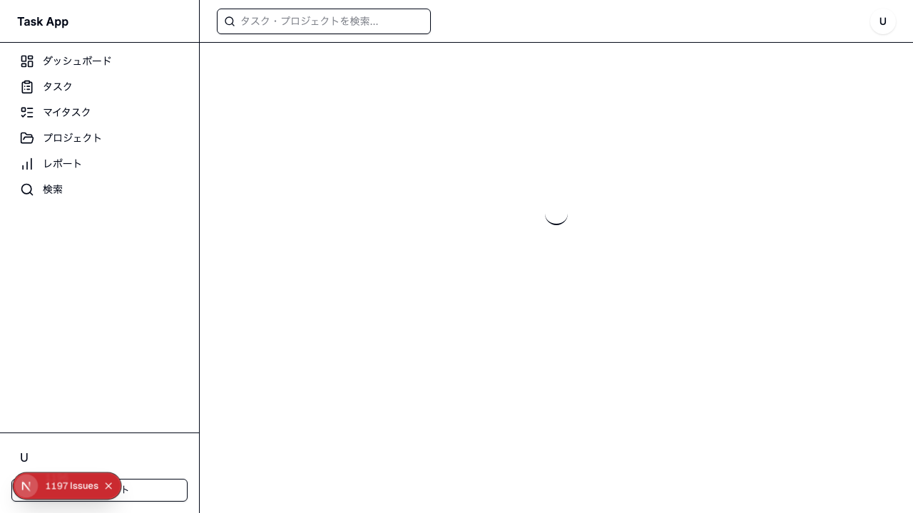
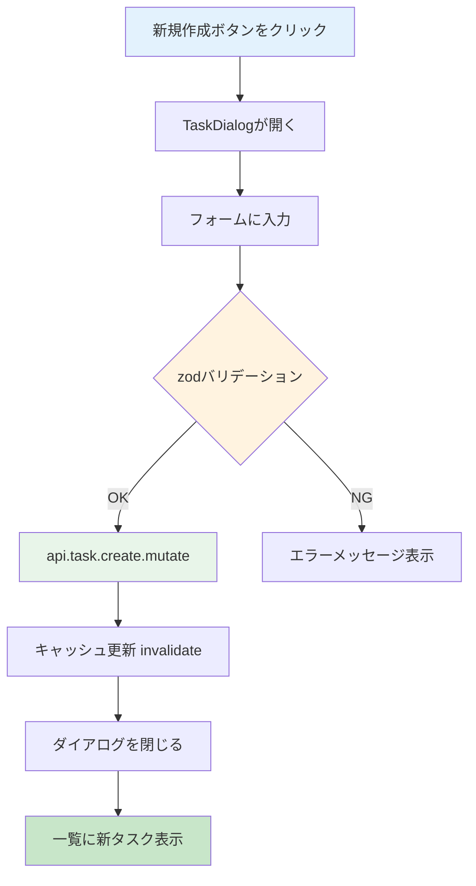

# Day 14: タスク新規作成を実装しよう

## 🔙 前回の振り返り

Day 13 ではタスク一覧画面を作成し、`api.task.getAll` によるデータ取得やフィルタリング、TaskCard コンポーネントによるカード表示を実装しました。一覧でタスクを表示できるようになったので、今日は新しいタスクを作成するダイアログを実装します。

---

## 🎯 今日のゴール

TaskDialogコンポーネントで、新しいタスクを作成
できるようにします。Day 10 で学んだダイアログ
パターンとreact-hook-form + zodをタスク版に
応用します。

📸 スクリーンショット: タスク作成ダイアログの完成画面


## 🤔 なぜこれを作るのか？

タスク管理アプリの最も重要な機能です。タスクが
なければ管理も進捗確認もできません。

> 💡 **例え話**: タスク作成は「料理のレシピカード
> を書く」ようなものです。何を作るか（タイトル）、
> どう作るか（説明）、いつまでに（期限）、
> 誰が作るか（担当者）を1枚のカードに書きます。
> ダイアログはそのカードの記入用紙です。

### 📐 タスク作成の流れ



### やること / やらないこと

| やること | やらないこと |
|---------|-------------|
| TaskDialog を作る | 別ページでフォーム作成 |
| react-hook-form + zod でフォーム管理 | useState で手動管理 |
| useMutation でサーバーに保存 | タスクの編集（Day 15） |
| キャッシュ無効化で一覧更新 | タイマー機能（Day 16） |

### 🆕 新しく学ぶ概念

| 概念 | 読み方 | 役割 | 例え |
|------|--------|------|------|
| TaskDialog | タスク・ダイアログ | タスクCRUD用のモーダル | レシピカードの記入用紙 |
| Controller | コントローラー | Select をreact-hook-formで制御する | ドロップダウンの管理係 |
| TASK_STATUS_LABELS | ― | ステータスの表示名を定義した定数 | 選択肢の翻訳表 |
| nativeEnum | ネイティブ・イーナム | zodで既存の定数オブジェクトを検証する | 記入用紙の「選択肢チェック」 |

## 📊 実装ステップ一覧

| ステップ | 作業内容 | 所要時間 |
|---------|---------|---------|
| Step 1 | zodスキーマと型を定義する | 5分 |
| Step 2 | TaskDialogの骨格を作る | 5分 |
| Step 3 | useFormでフォームを設定する | 5分 |
| Step 4 | タイトル・説明の入力欄を作る | 5分 |
| Step 5 | ステータス・優先度のSelectを作る | 7分 |
| Step 6 | プロジェクト・担当者のSelectを作る | 5分 |
| Step 7 | 期限・見積時間・ボタンを作る | 5分 |
| Step 8 | ページにDialogを組み込む | 7分 |
| Step 9 | 動作確認 | 3分 |

**合計時間**: 約47分

---

### Step 1: zodスキーマと型を定義する（5分）

🎯 **ゴール**: zodスキーマでバリデーションルールを定義し、フォームデータの型を作ります。

💻 **実装**:

`src/component/task/task-dialog.tsx` を新規作成します。以下の3つのコードブロックは全て **同じファイルに上から順に** 書いてください。表示の都合でブロックを分けていますが、1つのファイルです。

```typescript
// filepath: src/component/task/task-dialog.tsx
// フォームライブラリとUIコンポーネントのimport
'use client';

import { zodResolver }
  from '@hookform/resolvers/zod';
import { Controller, useForm }
  from 'react-hook-form';
import { z } from 'zod';
import { Button }
  from '@/component/ui/button';
import {
  Dialog, DialogContent,
  DialogDescription, DialogFooter,
  DialogHeader, DialogTitle,
} from '@/component/ui/dialog';
import { Input }
  from '@/component/ui/input';
import { Label }
  from '@/component/ui/label';
```

✅ **確認ポイント**:
- `zodResolver`, `useForm`, `Controller` がインポートされている

```typescript
// filepath: src/component/task/task-dialog.tsx
// Select系UIと定数のimport
import {
  Select, SelectContent, SelectItem,
  SelectTrigger, SelectValue,
} from '@/component/ui/select';
import { Textarea }
  from '@/component/ui/textarea';
import {
  TASK_PRIORITY, TASK_PRIORITY_LABELS,
  type TaskPriority,
} from '@/lib/constant/priority';
import {
  TASK_STATUS, TASK_STATUS_LABELS,
  type TaskStatus,
} from '@/lib/constant/status';
```

zodスキーマを定義します。

```typescript
// filepath: src/component/task/task-dialog.tsx
// zodスキーマでバリデーションルール定義
const taskFormSchema = z.object({
  id: z.string().optional(),
  title: z.string().min(1,
    'タイトルは必須です'),
  description: z.string().optional(),
  status: z.nativeEnum(TASK_STATUS),
  priority: z.nativeEnum(TASK_PRIORITY),
  dueDate: z.string().optional(),
  estimatedHours:
    z.number().min(0).optional(),
  projectId: z.string().min(1,
    'プロジェクトは必須です'),
  assigneeId: z.string().optional(),
});

type TaskFormValues =
  z.infer<typeof taskFormSchema>;
```

#### zodスキーマの各フィールド

| フィールド | バリデーション | 意味 |
|-----------|-------------|------|
| `title` | `z.string().min(1, ...)` | 1文字以上必須 |
| `status` | `z.nativeEnum(TASK_STATUS)` | 定数オブジェクトの値のみ許可 |
| `priority` | `z.nativeEnum(TASK_PRIORITY)` | 定数オブジェクトの値のみ許可 |
| `projectId` | `z.string().min(1, ...)` | プロジェクト選択必須 |
| `estimatedHours` | `z.number().min(0).optional()` | 0以上の数値（任意） |

> 💡 `z.nativeEnum(TASK_STATUS)` は、`TASK_STATUS` オブジェクトの値（`'TODO'`, `'IN_PROGRESS'` ）だけを許可するバリデーションです。不正な値が入力されると自動でエラーになります。

✅ **確認ポイント**:
- `taskFormSchema` を定義した
- `TaskFormValues` が自動生成されている

---

### Step 2: TaskDialogの骨格を作る（5分）

🎯 **ゴール**: コンポーネントのProps型とフォーム
データの型を定義します。

💻 **実装**:

```typescript
// filepath: src/component/task/task-dialog.tsx
// フォームデータの型（外部公開用）
export interface TaskFormData {
  id?: string;
  title: string;
  description?: string;
  status: TaskStatus;
  priority: TaskPriority;
  dueDate?: string;
  estimatedHours?: number;
  projectId: string;
  assigneeId?: string;
}
```

```typescript
// filepath: src/component/task/task-dialog.tsx
// Props の型定義
interface TaskDialogProps {
  open: boolean;
  onClose: () => void;
  onSubmit: (data: TaskFormData) => void;
  initialData?:
    TaskFormData | undefined;
  projects: Array<{
    id: string; name: string;
  }>;
  users: Array<{
    id: string;
    name: string | null;
    email: string;
  }>;
}
```

> 💡 `TaskFormValues`（zod推論型）はコンポーネント
> 内部で使い、`TaskFormData`（インターフェース）は
> 外部に公開します。2つの型を使い分けることで、
> 内部のバリデーションと外部のAPIを分離できます。

✅ **確認ポイント**:
- `TaskFormData` をエクスポートした
- `TaskDialogProps` に `projects` と `users` がある

#### TaskFormData の各フィールド

| フィールド | 型 | 必須 | 説明 |
|-----------|-----|------|------|
| `id` | string? | × | 編集時のみ使用 |
| `title` | string | ○ | タスク名 |
| `description` | string? | × | 詳細説明 |
| `status` | TaskStatus | ○ | 進捗状態 |
| `priority` | TaskPriority | ○ | 優先度 |
| `dueDate` | string? | × | 期限日 |
| `estimatedHours` | number? | × | 見積時間 |
| `projectId` | string | ○ | 所属プロジェクト |
| `assigneeId` | string? | × | 担当者 |

✅ **確認ポイント**:
- `TaskFormData` をエクスポートした
- `TaskDialogProps` に `projects` と `users` がある

---

### Step 3: useFormでフォームを設定する（5分）

🎯 **ゴール**: `useForm` と `zodResolver` で
フォームの状態管理とバリデーションを設定します。

💻 **実装**:

```typescript
// filepath: src/component/task/task-dialog.tsx
// 関数定義とuseForm初期化（全体）
export function TaskDialog({
  open, onClose, onSubmit,
  initialData, projects, users,
}: TaskDialogProps) {
  const {
    register, handleSubmit, control,
    reset, formState: { errors },
  } = useForm<TaskFormValues>({
    resolver: zodResolver(taskFormSchema),
    values: {
      id: initialData?.id,
      title: initialData?.title ?? '',
      description: initialData?.description ?? '',
      status: initialData?.status ?? TASK_STATUS.TODO,
      priority: initialData?.priority ?? TASK_PRIORITY.MEDIUM,
      dueDate: initialData?.dueDate ?? '',
      estimatedHours: initialData?.estimatedHours,
      projectId: initialData?.projectId ?? projects[0]?.id ?? '',
      assigneeId: initialData?.assigneeId ?? '',
    },
  });
```

✅ **確認ポイント**:
- `useForm` に `resolver` と `values` が設定されている
- `values` に全フィールドが含まれている（このブロックをそのままコピーすれば動く）

> 💡 Day 10 の ProjectDialog と同じパターンです。`values` prop で `initialData` が変わるたびにフォームの値が自動同期されます。`id` や `dueDate` も含めることで、Day 15 の編集モードでも正しく初期化されます。

> ⚠️ **この関数はまだ続きます。** Step 4 でハンドラーとJSXを追加します。

#### useFormから取得するもの

| 名前 | 役割 |
|------|------|
| `register` | Input/Textareaをフォームに登録 |
| `handleSubmit` | バリデーション後に送信 |
| `control` | Controllerに渡してSelectを制御 |
| `reset` | フォームの値をリセット |
| `errors` | バリデーションエラー情報 |

✅ **確認ポイント**:
- `register` と `control` の違いを理解した
- `npm run dev` でエラーが出ていない

---

### Step 4: タイトル・説明の入力欄を作る（5分）

🎯 **ゴール**: タイトルと説明の入力欄を追加します。

💻 **実装**:

まず、ダイアログを閉じるハンドラーと送信ハンドラーを作ります。

```typescript
// filepath: src/component/task/task-dialog.tsx
// ダイアログを閉じる時にフォームをリセット
const handleClose = () => {
  reset();
  onClose();
};
```

送信ハンドラーでは、未入力のフィールドを除外してから `onSubmit` に渡します。以下のコードは `useForm` の直後、`TaskDialog` 関数の中に追加します。

```typescript
// filepath: src/component/task/task-dialog.tsx
// useFormの直後に追加: 送信処理
const handleFormSubmit =
  (data: TaskFormValues) => {
    const submitData: TaskFormData = {
      ...(data.id !== undefined
        && { id: data.id }),
      title: data.title,
      status: data.status,
      priority: data.priority,
      projectId: data.projectId,
      ...(data.description
        && { description:
          data.description }),
      ...(data.dueDate
        && { dueDate: data.dueDate }),
      ...(data.estimatedHours !==
        undefined && { estimatedHours:
          data.estimatedHours }),
      ...(data.assigneeId
        && { assigneeId:
          data.assigneeId }),
    };
    onSubmit(submitData);
  };
```

#### 条件付きスプレッド構文の解説

| コード | 条件が真の場合 | 条件が偽の場合 |
|--------|-------------|-------------|
| `...(data.id !== undefined && { id: data.id })` | `{ id: "xxx" }` を追加 | 何も追加しない |
| `...(data.description && { description: ... })` | 説明を追加 | 何も追加しない |
| `...(data.dueDate && { dueDate: ... })` | 期限を追加 | 何も追加しない |

> 💡 Day 11 の `handleEdit` と同じパターンです。値がある場合だけプロパティを含め、空の場合はプロパティ自体を含めません。

JSXのダイアログ構造とタイトル入力欄を書きます。

```typescript
// filepath: src/component/task/task-dialog.tsx
return (
  <Dialog open={open}
    onOpenChange={(isOpen) =>
      !isOpen && handleClose()}>
    <DialogContent
      className="sm:max-w-[800px]">
      <DialogHeader>
        <DialogTitle>
          {initialData?.id
            ? 'タスク編集' : 'タスク作成'}
        </DialogTitle>
        <DialogDescription>
          {initialData?.id
            ? 'タスクの詳細を更新します。'
            : 'プロジェクトに新しいタスクを追加します。'}
        </DialogDescription>
      </DialogHeader>
```

```typescript
// filepath: src/component/task/task-dialog.tsx
      <form onSubmit={
        handleSubmit(handleFormSubmit)}>
        <div className="grid gap-4 py-4">
          <div className="grid gap-2">
            <Label htmlFor="title">
              タイトル
            </Label>
            <Input id="title"
              placeholder=
                "タスクのタイトルを入力"
              {...register('title')} />
            {errors.title && (
              <p className=
                "text-sm text-destructive">
                {errors.title.message}
              </p>
            )}
          </div>
```

説明欄を追加します。

```typescript
// filepath: src/component/task/task-dialog.tsx
          <div className="grid gap-2">
            <Label htmlFor="description">
              説明
            </Label>
            <Textarea
              id="description"
              placeholder="タスクの説明..."
              rows={4}
              {...register('description')}
            />
          </div>
```

> 💡 `{...register('title')}` は Day 10 で学んだ
> パターンです。入力欄をフォームに登録し、値の
> 追跡・バリデーションを自動化します。
> `errors.title` でバリデーションエラーを表示します。

✅ **確認ポイント**:
- タイトルと説明の入力欄が表示される
- タイトルが空のまま送信するとエラーメッセージが表示される

📸 スクリーンショット: タイトルと説明の入力欄が表示されている画面


---

### Step 5: ステータス・優先度のSelectを作る（7分）

🎯 **ゴール**: `Controller` で Select コンポーネント
をreact-hook-formに接続します。

💻 **実装**:

```typescript
// filepath: src/component/task/task-dialog.tsx
// ステータスSelect（Controller使用）
<div className="grid grid-cols-2 gap-4">
  <div className="grid gap-2">
    <Label htmlFor="status">
      ステータス
    </Label>
    <Controller
      name="status"
      control={control}
      render={({ field }) => (
        <Select
          value={field.value}
          onValueChange={field.onChange}>
          <SelectTrigger id="status"
            aria-label="ステータスを選択">
            <SelectValue
              placeholder=
                "ステータスを選択" />
          </SelectTrigger>
```

続けて、ステータスの選択肢を `TASK_STATUS_LABELS` から生成します。

```typescript
// filepath: src/component/task/task-dialog.tsx
          <SelectContent>
            {Object.entries(
              TASK_STATUS_LABELS
            ).map(([value, label]) => (
              <SelectItem
                key={value}
                value={value}>
                {label}
              </SelectItem>
            ))}
          </SelectContent>
        </Select>
      )} />
  </div>
```

優先度Selectも同じパターンで作ります。

```typescript
// filepath: src/component/task/task-dialog.tsx
// 優先度Select（Controllerで同じパターン）
  <div className="grid gap-2">
    <Label htmlFor="priority">
      優先度
    </Label>
    <Controller
      name="priority"
      control={control}
      render={({ field }) => (
        <Select
          value={field.value}
          onValueChange={field.onChange}>
          <SelectTrigger id="priority"
            aria-label="優先度を選択">
            <SelectValue
              placeholder=
                "優先度を選択" />
          </SelectTrigger>
```

```typescript
// filepath: src/component/task/task-dialog.tsx
          <SelectContent>
            {Object.entries(
              TASK_PRIORITY_LABELS
            ).map(([value, label]) => (
              <SelectItem
                key={value}
                value={value}>
                {label}
              </SelectItem>
            ))}
          </SelectContent>
        </Select>
      )} />
  </div>
```

> 💡 `Controller` は、`register` が使えない
> コンポーネント（Select）をreact-hook-formに
> 接続します。`field.value` で現在の値を取得し、
> `field.onChange` で値を更新します。
> `Object.entries(TASK_STATUS_LABELS)` で定数から
> 選択肢を自動生成するので、追加・変更に強い
> 構造になります。

✅ **確認ポイント**:
- ステータスと優先度が選択できる
- 選択肢が日本語で表示される

#### register vs Controller の使い分け

| 対象 | 使う関数 | 理由 |
|------|---------|------|
| Input, Textarea | `register` | `ref` を直接渡せるため |
| Select (shadcn/ui) | `Controller` | 独自の `onValueChange` を使うため |

#### ステータスと優先度の選択肢

| ステータス | 表示名 | 意味 |
|-----------|-------|------|
| `TODO` | 未対応 | 未着手 |
| `IN_PROGRESS` | 進行中 | 作業中 |
| `IN_REVIEW` | レビュー中 | レビュー待ち |
| `DONE` | 完了 | 完了 |
| `CANCELLED` | キャンセル | 取り消し |
| `BLOCKED` | ブロック | ブロック中 |

| 優先度 | 表示名 |
|-------|-------|
| `LOW` | 低 |
| `MEDIUM` | 中 |
| `HIGH` | 高 |
| `URGENT` | 緊急 |

✅ **確認ポイント**:
- ステータスと優先度が選択できる
- 2列グリッドで横並びになっている

---

### Step 6: プロジェクト・担当者のSelectを作る（5分）

🎯 **ゴール**: 外から渡されたデータで選択肢を
表示します。

💻 **実装**:

```typescript
// filepath: src/component/task/task-dialog.tsx
// プロジェクトSelect
  <div className="grid gap-2">
    <Label htmlFor="project">
      プロジェクト
    </Label>
    <Controller
      name="projectId"
      control={control}
      render={({ field }) => (
        <Select
          value={field.value}
          onValueChange={field.onChange}
          disabled={!projects.length}>
          <SelectTrigger id="project"
            aria-label="プロジェクトを選択">
            <SelectValue placeholder=
              "プロジェクトを選択" />
          </SelectTrigger>
```

プロジェクトの選択肢とエラー表示です。

```typescript
// filepath: src/component/task/task-dialog.tsx
          <SelectContent>
            {projects.map((project) => (
              <SelectItem
                key={project.id}
                value={project.id}>
                {project.name}
              </SelectItem>
            ))}
          </SelectContent>
        </Select>
      )} />
    {errors.projectId && (
      <p className=
        "text-sm text-destructive">
        {errors.projectId.message}
      </p>
    )}
  </div>
```

```typescript
// filepath: src/component/task/task-dialog.tsx
// 担当者Select
  <div className="grid gap-2">
    <Label htmlFor="assignee">
      担当者
    </Label>
    <Controller
      name="assigneeId"
      control={control}
      render={({ field }) => (
        <Select
          value={
            field.value ?? 'unassigned'}
          onValueChange={(value) =>
            field.onChange(
              value === 'unassigned'
                ? '' : value)}>
          <SelectTrigger id="assignee"
            aria-label="担当者を選択">
            <SelectValue placeholder=
              "担当者を選択" />
          </SelectTrigger>
```

担当者の選択肢です。

```typescript
// filepath: src/component/task/task-dialog.tsx
          <SelectContent>
            <SelectItem
              value="unassigned">
              未割当
            </SelectItem>
            {users.map((user) => (
              <SelectItem
                key={user.id}
                value={user.id}>
                {user.name ?? user.email}
              </SelectItem>
            ))}
          </SelectContent>
        </Select>
      )} />
  </div>
```

> 💡 「未割当」を選んだ時は空文字にしたいのですが、shadcn/ui の `Select` は空文字 `''` を有効な値として扱えません（値が空だと選択状態にならず、`placeholder` が表示されてしまいます）。そのため `'unassigned'` を特別な値として使い、送信時に空文字に変換するテクニックが必要です。

✅ **確認ポイント**:
- プロジェクト一覧が表示される
- 担当者一覧に「未割当」がある

📸 スクリーンショット: プロジェクト・担当者のSelect欄が表示されている画面


---

### Step 7: 期限・見積時間・ボタンを作る（5分）

🎯 **ゴール**: 日付入力、数値入力、送信ボタンを
追加します。

💻 **実装**:

```typescript
// filepath: src/component/task/task-dialog.tsx
// 期限と見積時間
  <div className="grid gap-2">
    <Label htmlFor="dueDate">期限</Label>
    <Input id="dueDate" type="date"
      {...register('dueDate')} />
  </div>
  <div className="grid gap-2">
    <Label htmlFor="estimatedHours">
      見積時間
    </Label>
    <Input id="estimatedHours"
      type="number" min="0" step="0.5"
      placeholder="0.0"
      {...register('estimatedHours', {
        setValueAs: (v: string) =>
          v === '' ? undefined : Number(v),
      })} />
  </div>
        </div>
```

> 💡 `setValueAs` は入力値を変換する関数です。
> 空文字を `undefined` に、それ以外を `Number` に
> 変換します。`type="number"` でも HTML の入力値は
> 文字列なので、この変換が必要です。

```typescript
// filepath: src/component/task/task-dialog.tsx
// 送信・キャンセルボタン
        <DialogFooter>
          <Button type="button"
            variant="outline"
            onClick={handleClose}>
            キャンセル
          </Button>
          <Button type="submit">
            {initialData?.id
              ? '更新' : '作成'}
          </Button>
        </DialogFooter>
      </form>
    </DialogContent>
  </Dialog>
);
```

✅ **確認ポイント**:
- 日付ピッカーで期限を選べる
- 見積時間に0.5刻みで入力できる
- 作成ボタンが表示される

#### ボタンの役割

| ボタン | type | 動作 |
|--------|------|------|
| キャンセル | `button` | `handleClose` でリセットして閉じる |
| 作成 / 更新 | `submit` | zodバリデーション → `handleFormSubmit` |

✅ **確認ポイント**:
- キャンセルでフォームがリセットされる
- タイトル未入力で送信するとエラーが表示される

---

### Step 8: ページにDialogを組み込む（7分）

🎯 **ゴール**: タスク一覧ページにダイアログを
組み込み、作成処理を実装します。

💻 **実装**:

```typescript
// filepath: src/app/task/page.tsx
import {
  TaskDialog, type TaskFormData,
} from '@/component/task/task-dialog';
import { Plus } from 'lucide-react';

// TaskPageContent内に追加
const [dialogOpen, setDialogOpen] =
  useState(false);
const [editingTask, setEditingTask] =
  useState<TaskFormData | undefined>();
const utils = api.useUtils();

// 新規作成ボタンのハンドラー
const handleCreate = () => {
  setEditingTask(undefined);
  setDialogOpen(true);
};
```

続けて、既存の `useQuery` 群の末尾にユーザー一覧とセッション取得を追加します。

#### 追加するAPI

| API | 戻り値 | 用途 |
|-----|-------|------|
| `api.search.getProjectMembers` | ユーザー一覧 | 担当者Selectの候補 |
| `api.auth.getSession` | ログイン中のセッション | 作成者IDの確認 |

これらは既に実装済みのAPIです。

```typescript
// filepath: src/app/task/page.tsx
// 既存のuseQuery群の末尾に追加
const { data: users } =
  api.search.getProjectMembers.useQuery();
const { data: session } =
  api.auth.getSession.useQuery();
// utils は上で定義済み
```

✅ **確認ポイント**:
- `users` と `session` のデータ取得が追加できた

create mutationを `utils` の下に追加します。

```typescript
// filepath: src/app/task/page.tsx
// utilsの下に追加
const createMutation =
  api.task.create.useMutation({
    onSuccess: () => {
      utils.task.getAll.invalidate();
      setDialogOpen(false);
    },
  });
```

```typescript
// filepath: src/app/task/page.tsx
// createMutationの下に追加

// 送信ハンドラー
const handleSubmit =
  (data: TaskFormData) => {
    if (!session?.user?.id) { return; }
    createMutation.mutate({
      title: data.title,
      description: data.description,
      status: data.status,
      priority: data.priority,
      dueDate: data.dueDate
        ? new Date(data.dueDate)
            .toISOString()
        : undefined,
      estimatedHours:
        data.estimatedHours,
      projectId: data.projectId,
      assigneeId:
        data.assigneeId ?? undefined,
    });
  };
```

✅ **確認ポイント**:
- 「新規タスク」ボタンでダイアログが開く
- フォーム送信でタスクが作成される
- 一覧に新しいタスクが表示される

📸 スクリーンショット: タスク作成後に一覧画面に新しいタスクが表示されている


#### createMutationに渡すパラメータ

| パラメータ | フロントから送信 | 説明 |
|-----------|---------------|------|
| `title` | 常に送信 | タスク名 |
| `projectId` | 常に送信 | 所属プロジェクト |
| `status` | 常に送信 | ステータス（フォームで選択） |
| `priority` | 常に送信 | 優先度（フォームで選択） |
| `dueDate` | 任意 | ISO 8601文字列 |
| `assigneeId` | 任意 | 担当者ID |

> 💡 サーバー側のスキーマでは `status` と `priority` にデフォルト値（TODO / MEDIUM）が設定されていますが、フロントエンドからは常にフォームの選択値を送信します。

```typescript
// filepath: src/app/task/page.tsx
// JSX内にDialogとボタンを追加
<Button onClick={handleCreate}>
  <Plus className="h-4 w-4 mr-2" />
  新規タスク
</Button>

<TaskDialog
  open={dialogOpen}
  onClose={() => setDialogOpen(false)}
  onSubmit={handleSubmit}
  initialData={editingTask}
  projects={projects ?? []}
  users={users ?? []}
/>
```

> 💡 `createdById`（作成者ID）はサーバー側で
> セッションから自動的に取得されます。
> フロントエンドから渡す必要はありません。

✅ **確認ポイント**:
- TaskDialogに `initialData` と `projects` が渡されている
- `createdById` をフロントから渡していない

---

### Step 9: 動作確認（3分）

🎯 **ゴール**: タスク作成の全体フローを確認
します。

1. 「新規タスク」ボタンをクリック
2. タイトルを入力し、プロジェクトを選択
3. 優先度・ステータス・担当者を設定
4. 「作成」ボタンをクリック
5. ダイアログが閉じ、一覧に新タスクが表示される

✅ **確認ポイント**:
- タスクが作成できる
- 一覧が自動で更新される
- タイトル未入力で送信するとエラーが表示される

---

```bash
# filepath: ターミナル
# 開発サーバーを起動して動作確認
npm run dev
```

## 📋 今日のまとめ

- [ ] zodスキーマでフォームのバリデーションを定義できた
- [ ] `register` で入力欄をフォームに登録できた
- [ ] `Controller` でSelectをreact-hook-formに接続できた
- [ ] `TASK_STATUS_LABELS` から選択肢を自動生成できた
- [ ] `useMutation` でタスクを保存できた
- [ ] `invalidate()` でキャッシュを自動更新できた

## ⚠️ つまずきポイント

| エラー / 問題 | 原因 | 解決方法 |
|--------------|------|---------|
| ダイアログが開かない | `open` propが渡されてない | `open={dialogOpen}` を確認 |
| 作成後に一覧が更新されない | invalidate忘れ | `onSuccess` に追加 |
| Selectの値が更新されない | `Controller` 未使用 | `register` ではなく `Controller` を使う |
| 担当者一覧が空 | users未取得 | `getProjectMembers` の戻り値確認 |
| バリデーションが効かない | `resolver` の設定漏れ | `resolver: zodResolver(taskFormSchema)` を確認 |

## 📝 今日学んだ用語

| 用語 | 意味 |
|------|------|
| TaskDialog | タスクCRUD用のダイアログ |
| Controller | Selectをreact-hook-formで制御するコンポーネント |
| nativeEnum | zodで既存の定数オブジェクトを検証するメソッド |
| TASK_STATUS_LABELS | ステータス値と日本語表示名の対応表 |
| setValueAs | register のオプションで入力値を型変換する関数 |
| getProjectMembers | プロジェクトメンバー一覧を取得するAPI |

## 🔜 次回予告

Day 15 では、タスクの編集・削除機能を実装します。
Day 14 で作った TaskDialog を「編集モード」で
再利用する方法を学びます。
