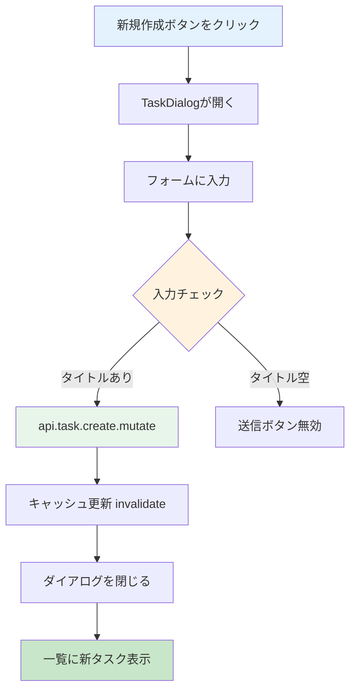

# Day 14: タスク新規作成を実装しよう

## 🎯 今日のゴール

TaskDialogコンポーネントで、新しいタスクを作成
できるようにします。Day 10 で学んだダイアログ
パターンをタスク版に応用します。


## 🤔 なぜこれを作るのか？

タスク管理アプリの最も重要な機能です。タスクが
なければ管理も進捗確認もできません。

> 💡 **例え話**: タスク作成は「料理のレシピカード
> を書く」ようなものです。何を作るか（タイトル）、
> どう作るか（説明）、いつまでに（期限）、
> 誰が作るか（担当者）を1枚のカードに書きます。
> ダイアログはそのカードの記入用紙です。

### 📐 タスク作成の流れ



### やること / やらないこと

| やること | やらないこと |
|---------|-------------|
| TaskDialog を作る | 別ページでフォーム作成 |
| useState でフォーム状態管理 | ドラッグ＆ドロップ |
| useMutation でサーバーに保存 | タスクの編集（Day 15） |
| キャッシュ無効化で一覧更新 | タイマー機能（Day 16） |

### 🆕 新しく学ぶ概念

| 概念 | 読み方 | 役割 | 例え |
|------|--------|------|------|
| TaskDialog | タスク・ダイアログ | タスクCRUD用のモーダル | レシピカードの記入用紙 |
| TaskFormData | タスク・フォーム・データ | フォームの型定義 | 記入項目の一覧表 |
| handleChange | ハンドル・チェンジ | 入力値の更新関数 | 書き込むたびにメモする係 |

## 📊 実装ステップ一覧

| ステップ | 作業内容 | 所要時間 |
|---------|---------|---------|
| Step 1 | TaskFormData型を定義する | 3分 |
| Step 2 | TaskDialogの骨格を作る | 5分 |
| Step 3 | タイトル・説明の入力欄を作る | 5分 |
| Step 4 | ステータス・優先度の選択欄を作る | 5分 |
| Step 5 | プロジェクト・担当者の選択欄を作る | 5分 |
| Step 6 | 期限・見積時間の入力欄を作る | 5分 |
| Step 7 | 送信・キャンセルボタンを作る | 3分 |
| Step 8 | ページにDialogを組み込む | 7分 |
| Step 9 | 動作確認 | 3分 |

**合計時間**: 約41分

---

### Step 1: TaskFormData型を定義する（3分）

🎯 **ゴール**: フォームデータの型を定義します。

💻 **実装**:

```typescript
// filepath: src/component/task/task-dialog.tsx
'use client';

import { useState, useEffect } from 'react';
import type {
  TaskPriority,
  TaskStatus,
} from '@prisma/client';
import {
  Dialog, DialogContent, DialogHeader,
  DialogTitle, DialogFooter,
} from '@/component/ui/dialog';
import { Button } from '@/component/ui/button';
import { Input } from '@/component/ui/input';
import { Label } from '@/component/ui/label';
import { Textarea }
  from '@/component/ui/textarea';
import {
  Select, SelectContent, SelectItem,
  SelectTrigger, SelectValue,
} from '@/component/ui/select';
```

```typescript
// filepath: src/component/task/task-dialog.tsx
export interface TaskFormData {
  id?: string;
  title: string;
  description?: string;
  status: TaskStatus;
  priority: TaskPriority;
  dueDate?: string;
  estimatedHours?: number;
  projectId: string;
  assigneeId?: string;
}
```

✅ **確認ポイント**:
- `TaskFormData` をエクスポートした
- `npm run dev` でエラーが出ていない

#### TaskFormData の各フィールド

| フィールド | 型 | 必須 | 説明 |
|-----------|-----|------|------|
| `id` | string? | × | 編集時のみ使用 |
| `title` | string | ○ | タスク名 |
| `description` | string? | × | 詳細説明 |
| `status` | TaskStatus | ○ | 進捗状態 |
| `priority` | TaskPriority | ○ | 優先度 |
| `dueDate` | string? | × | 期限日 |
| `estimatedHours` | number? | × | 見積時間 |
| `projectId` | string | ○ | 所属プロジェクト |
| `assigneeId` | string? | × | 担当者 |

> 💡 `id` がある場合は「編集モード」、ない場合は
> 「作成モード」です。Day 10 のProjectDialogの
> `initialData` パターンと同じ考え方です。

✅ **確認ポイント**:
- `TaskFormData` をエクスポートした
- `npm run dev` でエラーが出ていない

---

### Step 2: TaskDialogの骨格を作る（5分）

🎯 **ゴール**: ダイアログの基本構造を作ります。

💻 **実装**:

```typescript
// filepath: src/component/task/task-dialog.tsx
interface TaskDialogProps {
  open: boolean;
  onClose: () => void;
  onSubmit: (data: TaskFormData) => void;
  initialData?: TaskFormData;
  projects: Array<{
    id: string; name: string;
  }>;
  users: Array<{
    id: string;
    name: string | null;
    email: string;
  }>;
}
```

> 💡 `projects` と `users` を外から渡すのは、
> ダイアログの中でAPIを呼ばないためです。
> 親コンポーネントが一括取得して渡します。

```typescript
// filepath: src/component/task/task-dialog.tsx
export function TaskDialog({
  open, onClose, onSubmit,
  initialData, projects, users,
}: TaskDialogProps) {
  return (
    <Dialog open={open}
      onOpenChange={(isOpen) =>
        !isOpen && onClose()}>
      <DialogContent>
        <DialogHeader>
          <DialogTitle>
            {initialData?.id
              ? 'タスク編集'
              : 'タスク作成'}
          </DialogTitle>
        </DialogHeader>
      </DialogContent>
    </Dialog>
  );
}
```

✅ **確認ポイント**:
- `npm run dev` でエラーが出ていない
- TaskDialogコンポーネントが定義できた

---

### Step 3: タイトル・説明の入力欄を作る（5分）

🎯 **ゴール**: フォームの状態管理と入力欄を追加
します。

💻 **実装**:

```typescript
// filepath: src/component/task/task-dialog.tsx
// TaskDialog内にstate追加
const [formData, setFormData] =
  useState<TaskFormData>({
    title: '',
    description: '',
    status: 'TODO',
    priority: 'MEDIUM',
    projectId: '',
    assigneeId: '',
    ...initialData,
  });
```

入力値の更新用ヘルパー関数を作ります。

```typescript
// filepath: src/component/task/task-dialog.tsx
const handleChange =
  (field: keyof TaskFormData) =>
  (e: React.ChangeEvent<
    HTMLInputElement | HTMLTextAreaElement
  >) => {
    setFormData({
      ...formData,
      [field]: e.target.value,
    });
  };
```

> 💡 `handleChange('title')` のように呼ぶと、
> `title` フィールド専用の更新関数が返ります。
> これは **カリー化** というテクニックです。

```typescript
// filepath: src/component/task/task-dialog.tsx
// フォーム内にタイトル・説明を追加
<div className="grid gap-2">
  <Label htmlFor="title">タイトル</Label>
  <Input
    id="title"
    value={formData.title}
    onChange={handleChange('title')}
    required
  />
</div>
<div className="grid gap-2">
  <Label htmlFor="description">
    説明
  </Label>
  <Textarea
    id="description"
    value={formData.description || ''}
    onChange={handleChange('description')}
    rows={4}
  />
</div>
```

✅ **確認ポイント**:
- タイトルと説明の入力欄が表示される
- 入力値が反映される


---

### Step 4: ステータス・優先度の選択欄を作る（5分）

🎯 **ゴール**: ドロップダウンで選択するUI を追加
します。

💻 **実装**:

```typescript
// filepath: src/component/task/task-dialog.tsx
// Select用のヘルパー関数
const handleSelectChange =
  (field: keyof TaskFormData) =>
  (value: string) => {
    setFormData({
      ...formData,
      [field]: value,
    });
  };
```

```typescript
// filepath: src/component/task/task-dialog.tsx
// ステータス選択のSelect構造
<div className="grid grid-cols-2 gap-4">
  <div className="grid gap-2">
    <Label>ステータス</Label>
    <Select value={formData.status}
      onValueChange={
        handleSelectChange('status')}>
      <SelectTrigger>
        <SelectValue />
      </SelectTrigger>
```

続けて、Selectの選択肢（SelectItem）を定義します。

```typescript
// filepath: src/component/task/task-dialog.tsx
// ステータスの選択肢
      <SelectContent>
        <SelectItem value="TODO">
          未対応
        </SelectItem>
        <SelectItem value="IN_PROGRESS">
          進行中
        </SelectItem>
        <SelectItem value="IN_REVIEW">
          レビュー中
        </SelectItem>
        <SelectItem value="DONE">
          完了
        </SelectItem>
      </SelectContent>
    </Select>
  </div>
</div>
```

✅ **確認ポイント**:
- ステータスと優先度が選択できる
- 2列グリッドで横並びになっている

#### ステータスとPriorityの選択肢

| ステータス | 表示名 | 意味 |
|-----------|-------|------|
| `TODO` | 未対応 | 未着手 |
| `IN_PROGRESS` | 進行中 | 作業中 |
| `IN_REVIEW` | レビュー中 | レビュー待ち |
| `DONE` | 完了 | 完了 |
| `CANCELLED` | キャンセル | キャンセル |
| `BLOCKED` | ブロック | ブロック中 |

| 優先度 | 表示名 | 意味 |
|-------|-------|------|
| `LOW` | 低 | 低い |
| `MEDIUM` | 中 | 普通 |
| `HIGH` | 高 | 高い |
| `URGENT` | 緊急 | 緊急 |

✅ **確認ポイント**:
- ステータスと優先度が選択できる
- 2列グリッドで横並びになっている

---

### Step 5: プロジェクト・担当者の選択欄（5分）

🎯 **ゴール**: 外から渡されたデータで選択肢を
表示します。

💻 **実装**:

```typescript
// filepath: src/component/task/task-dialog.tsx
// プロジェクト選択
<div className="grid gap-2">
  <Label>プロジェクト</Label>
  <Select
    value={formData.projectId}
    onValueChange={
      handleSelectChange('projectId')
    }>
    <SelectTrigger>
      <SelectValue
        placeholder="プロジェクトを選択" />
    </SelectTrigger>
    <SelectContent>
      {projects.map((p) => (
        <SelectItem key={p.id} value={p.id}>
          {p.name}
        </SelectItem>
      ))}
    </SelectContent>
  </Select>
</div>
```

```typescript
// filepath: src/component/task/task-dialog.tsx
// 担当者選択: Select構造
<div className="grid gap-2">
  <Label>担当者</Label>
  <Select
    value={formData.assigneeId || 'unassigned'}
    onValueChange={(value) =>
      handleSelectChange('assigneeId')(
        value === 'unassigned' ? '' : value
      )
    }>
    <SelectTrigger>
      <SelectValue />
    </SelectTrigger>
```

続けて、担当者の選択肢を定義します。`'unassigned'` は未割当を表す特別な値です。

```typescript
// filepath: src/component/task/task-dialog.tsx
// 担当者の選択肢とSelect閉じタグ
    <SelectContent>
      <SelectItem value="unassigned">
        未割当
      </SelectItem>
      {users.map((u) => (
        <SelectItem key={u.id} value={u.id}>
          {u.name || u.email}
        </SelectItem>
      ))}
    </SelectContent>
  </Select>
</div>
```

> 💡 「未割当」を選んだ時は空文字にしたいので、
> `'unassigned'` を特別な値として扱い、
> 変換しています。Selectは空文字を値にできない
> ため、このテクニックが必要です。

✅ **確認ポイント**:
- プロジェクト一覧が表示される
- 担当者一覧に「未割当」がある


---

### Step 6: 期限・見積時間の入力欄を作る（5分）

🎯 **ゴール**: 日付入力と数値入力を追加します。

💻 **実装**:

```typescript
// filepath: src/component/task/task-dialog.tsx
// 数値入力用のヘルパー
const handleNumberChange =
  (field: 'estimatedHours') =>
  (e: React.ChangeEvent<HTMLInputElement>) => {
    const value = e.target.value;
    if (value === '') {
      const { [field]: _, ...rest } = formData;
      setFormData(rest as TaskFormData);
    } else {
      setFormData({
        ...formData,
        [field]: Number(value),
      });
    }
  };
```

> 💡 空文字の場合はフィールドを削除します。
> 未入力＝`undefined` にするためです。

```typescript
// filepath: src/component/task/task-dialog.tsx
<div className="grid gap-2">
  <Label htmlFor="dueDate">期限</Label>
  <Input
    id="dueDate"
    type="date"
    value={formData.dueDate || ''}
    onChange={handleChange('dueDate')}
  />
</div>
<div className="grid gap-2">
  <Label htmlFor="estimatedHours">
    見積時間（時間）
  </Label>
  <Input
    id="estimatedHours"
    type="number"
    min="0"
    step="0.5"
    value={formData.estimatedHours ?? ''}
    onChange={
      handleNumberChange('estimatedHours')
    }
  />
</div>
```

✅ **確認ポイント**:
- 日付ピッカーで期限を選べる
- 見積時間に0.5刻みで入力できる

---

### Step 7: 送信・キャンセルボタンを作る（3分）

🎯 **ゴール**: フォーム送信とキャンセルを実装
します。

💻 **実装**:

```typescript
// filepath: src/component/task/task-dialog.tsx
const handleSubmit =
  (e: React.FormEvent) => {
    e.preventDefault();
    onSubmit(formData);
  };
```

```typescript
// filepath: src/component/task/task-dialog.tsx
<DialogFooter>
  <Button type="button" variant="outline"
    onClick={onClose}>
    キャンセル
  </Button>
  <Button type="submit"
    disabled={
      !formData.title
      || !formData.projectId
    }>
    {initialData?.id ? '更新' : '作成'}
  </Button>
</DialogFooter>
```

> 💡 `disabled` でタイトルとプロジェクトが
> 未入力の場合はボタンを無効化します。
> 必須項目をUIレベルで制御しています。

✅ **確認ポイント**:
- 作成ボタンが表示される
- タイトル未入力でボタンが無効になる

---

### Step 8: ページにDialogを組み込む（7分）

🎯 **ゴール**: タスク一覧ページにダイアログを
組み込み、作成処理を実装します。

💻 **実装**:

```typescript
// filepath: src/app/task/page.tsx
import {
  TaskDialog, type TaskFormData,
} from '@/component/task/task-dialog';
import { Plus } from 'lucide-react';

// TaskPageContent内に追加
const [dialogOpen, setDialogOpen] =
  useState(false);
const [editingTask, setEditingTask] =
  useState<TaskFormData | undefined>();
const utils = api.useUtils();
const { data: session } =
  api.auth.getSession.useQuery();

// 新規作成ボタンのハンドラー
const handleCreate = () => {
  setEditingTask(undefined);
  setDialogOpen(true);
};
```

続けて、ユーザー一覧の取得とcreate mutationを追加します。

```typescript
// filepath: src/app/task/page.tsx
// ユーザー一覧を取得（担当者選択用）
const { data: users } =
  api.search.getProjectMembers.useQuery();

const createMutation =
  api.task.create.useMutation({
    onSuccess: () => {
      utils.task.getAll.invalidate();
      setDialogOpen(false);
    },
  });
```

```typescript
// filepath: src/app/task/page.tsx
// 送信ハンドラー
const handleSubmit =
  (data: TaskFormData) => {
    createMutation.mutate({
      title: data.title,
      description: data.description,
      status: data.status,
      priority: data.priority,
      dueDate: data.dueDate
        ? new Date(data.dueDate).toISOString()
        : undefined,
      estimatedHours: data.estimatedHours,
      projectId: data.projectId,
      assigneeId: data.assigneeId || undefined,
    });
  };
```

✅ **確認ポイント**:
- 「新規タスク」ボタンでダイアログが開く
- フォーム送信でタスクが作成される
- 一覧に新しいタスクが表示される


#### createMutationに渡すパラメータ

| パラメータ | 必須 | 説明 |
|-----------|------|------|
| `title` | ○ | タスク名 |
| `projectId` | ○ | 所属プロジェクト |
| `status` | × | デフォルト: TODO |
| `priority` | × | デフォルト: MEDIUM |
| `dueDate` | × | ISO 8601文字列 |
| `assigneeId` | × | 担当者ID |

```typescript
// filepath: src/app/task/page.tsx
// JSX内にDialogとボタンを追加
<Button onClick={handleCreate}>
  <Plus className="h-4 w-4 mr-2" />
  新規タスク
</Button>

<TaskDialog
  open={dialogOpen}
  onClose={() => setDialogOpen(false)}
  onSubmit={handleSubmit}
  initialData={editingTask}
  projects={projects || []}
  users={users || []}
/>
```

> 💡 `createdById`（作成者ID）はサーバー側で
> セッションから自動的に取得されます。
> フロントエンドから渡す必要はありません。

✅ **確認ポイント**:
- 「新規タスク」ボタンでダイアログが開く
- フォーム送信でタスクが作成される
- 一覧に新しいタスクが表示される


---

### Step 9: 動作確認（3分）

🎯 **ゴール**: タスク作成の全体フローを確認
します。

1. 「新規タスク」ボタンをクリック
2. タイトルを入力し、プロジェクトを選択
3. 優先度・ステータス・担当者を設定
4. 「作成」ボタンをクリック
5. ダイアログが閉じ、一覧に新タスクが表示される

✅ **確認ポイント**:
- タスクが作成できる
- 一覧が自動で更新される
- 必須項目が空だと送信できない

---

```bash
# filepath: ターミナル
# 開発サーバーを起動して動作確認
npm run dev
```

## 📋 今日のまとめ

- [ ] `TaskFormData` 型でフォームを定義できた
- [ ] TaskDialog でモーダルフォームを作れた
- [ ] `useMutation` でタスクを保存できた
- [ ] `invalidate()` でキャッシュを自動更新できた

## ⚠️ つまずきポイント

| エラー / 問題 | 原因 | 解決方法 |
|--------------|------|---------|
| ダイアログが開かない | `open` propが渡されてない | `open={dialogOpen}` を確認 |
| 作成後に一覧が更新されない | invalidate忘れ | `onSuccess` に追加 |
| 担当者一覧が空 | users未取得 | `getProjectMembers` の戻り値確認 |
| プロジェクト一覧が空 | `projects` propが空 | `projects || []` を確認 |

## 📝 今日学んだ用語

| 用語 | 意味 |
|------|------|
| TaskDialog | タスクCRUD用のダイアログ |
| TaskFormData | フォームデータの型定義 |
| カリー化 | 引数を部分適用する関数パターン |
| getProjectMembers | プロジェクトメンバー一覧を取得するAPI |

## 🔜 次回予告

Day 15 では、タスクの編集・削除機能を実装します。
Day 14 で作った TaskDialog を「編集モード」で
再利用する方法を学びます。
