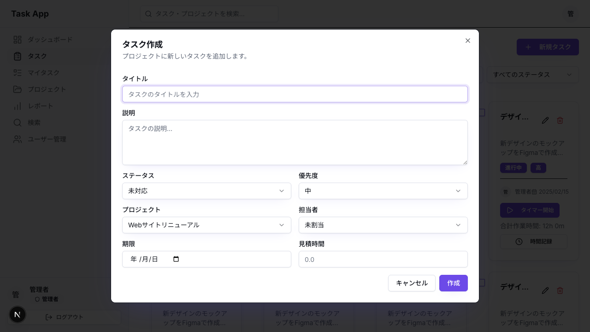
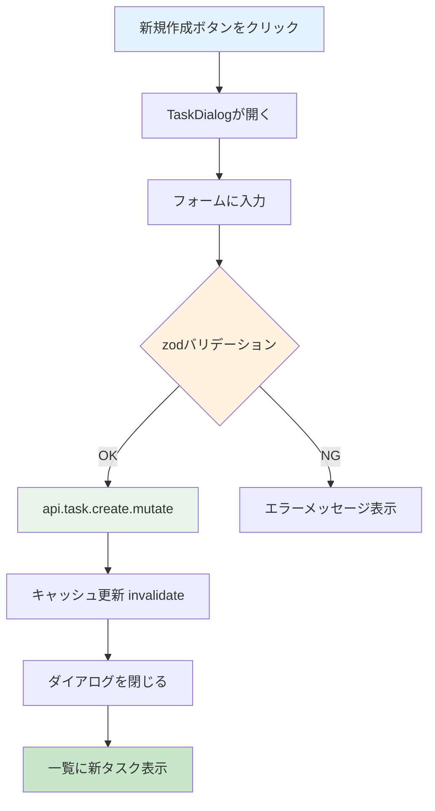
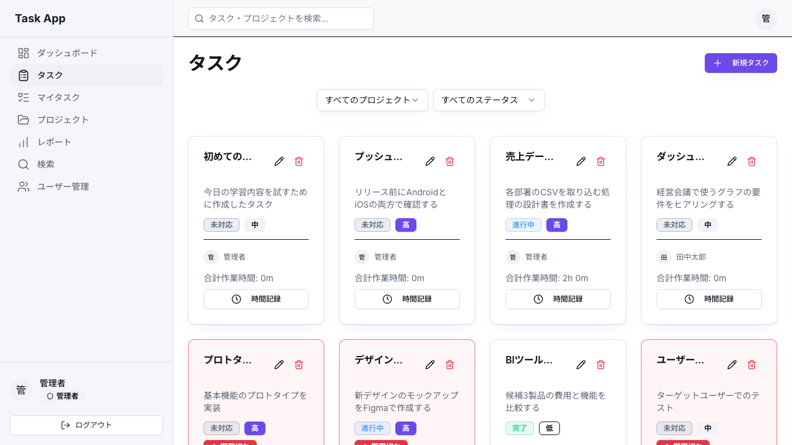

# Day 14: タスク新規作成を実装しよう

## 前回の振り返り

Day 13 ではタスク一覧画面を作成し、`api.task.getAll` によるデータ取得やフィルタリング、TaskCard コンポーネントによるカード表示を実装しました。一覧でタスクを表示できるようになったので、今日は新しいタスクを作成するダイアログを実装します。

---

## 今日のゴール

TaskDialogコンポーネントで、新しいタスクを作成
できるようにします。Day 10 で学んだダイアログ
パターンとreact-hook-form + zodをタスク版に
応用します。

この日は、まずサーバー側のタスク作成 API と search ルーターを自分で書きます。そのあと画面をつなぎます。

スクリーンショット: タスク作成ダイアログの完成イメージを確認してください。



> **今日のゴールライン**: TaskDialogにフォーム管理とバリデーションを組み込み、新しいタスクが一覧へ反映される流れを体験できればOK。

## 始める前の前提

- Day 13 のタスク一覧画面が表示できる
- 少なくとも1つのプロジェクトが作成済みで、タスクを紐づけられる
- ログイン済みユーザーで `/task` を開ける
- `src/server/api/root.ts` と `src/component/task/task-dialog.tsx` を編集できる

## なぜこれを作るのか

これまで作ってきた一覧・フィルター・詳細は、
すべて「タスクがある」ことが前提でした。
そのタスクを生み出す入口がまだありません。
今日はタスクを作成する画面を用意します。

> **例え話**: タスク作成は「料理のレシピカード
> を書く」ようなものです。何を作るか（タイトル）、
> どう作るか（説明）、いつまでに（期限）、
> 誰が作るか（担当者）を1枚のカードに書きます。
> ダイアログはそのカードの記入用紙です。

### タスク作成の流れ


```mermaid
graph TD
    A[新規作成ボタンをクリック] --> B[TaskDialogが開く]
    B --> C[フォームに入力]
    C --> D{zodバリデーション}
    D -->|OK| E[api.task.create.mutate]
    D -->|NG| F[エラーメッセージ表示]
    E --> G[キャッシュ更新 invalidate]
    G --> H[ダイアログを閉じる]
    H --> I[一覧に新タスク表示]

    style A fill:#e3f2fd
    style D fill:#fff3e0
    style E fill:#e8f5e9
    style I fill:#c8e6c9
```

この図で目を留めてほしいのは D の分岐です。入力はサーバーへ飛ぶ前に、いったんブラウザ側の zod で止まります。ここで弾いておけば、空のタイトルのまま通信が飛ぶことはありません。読者は入力欄のすぐ下でやり直せます。もう1か所は E から H までの流れです。保存が成功したときだけ、G の `invalidate()` と H のダイアログを閉じる処理を走らせます。ここで `invalidate()` がするのは、一覧のキャッシュに「古い」と印を付けて取り直しを始めるところまでです。取り直しが終わるのを待ってはくれないので、ダイアログが閉じた直後の一瞬は、まだ前の一覧が見えていることもあります。この2つは同じ `onSuccess` の中に並ぶので、書く順番で結果は変わりません。大事なのは、失敗したときにこの2つを走らせないことです。

### やること / やらないこと

| やること | やらないこと |
|---------|-------------|
| 配布済みの TaskDialog を書き直す | 別ページでフォーム作成 |
| react-hook-form + zod でフォーム管理 | useState で手動管理 |
| useMutation でサーバーに保存 | タスクの編集（Day 15） |
| キャッシュ無効化で一覧更新 | 作業時間の記録（Day 16） |

### 新しく学ぶ概念

| 概念 | 読み方 | 役割 | 例え |
|------|--------|------|------|
| TaskDialog | タスク・ダイアログ | タスクCRUD用のモーダル | レシピカードの記入用紙 |
| Controller | コントローラー | Select をreact-hook-formで制御する | ドロップダウンの管理係 |
| TASK_STATUS_LABELS | ― | ステータスの表示名を定義した定数 | 選択肢の翻訳表 |
| nativeEnum | ネイティブ・イーナム | zodで既存の定数オブジェクトを検証する | 記入用紙の「選択肢チェック」 |

## 実装ステップ一覧

| ステップ | 作業内容 | 所要時間 |
|---------|---------|---------|
| Step 0 | タスク作成 API（create）と search ルーターを自分で書く | 25分 |
| Step 1 | zodスキーマと型を定義する | 5分 |
| Step 2 | TaskDialogの骨格を作る | 5分 |
| Step 3 | useFormでフォームを設定する | 5分 |
| Step 4 | タイトル・説明の入力欄を作る | 5分 |
| Step 5 | ステータス・優先度のSelectを作る | 7分 |
| Step 6 | プロジェクト・担当者のSelectを作る | 5分 |
| Step 7 | 期限・見積時間・ボタンを作る | 5分 |
| Step 8 | ページにDialogを組み込む | 7分 |
| Step 9 | 動作確認 | 3分 |

**合計時間**: 約72分です。

---

### Step 0: タスク作成 API（create）と search ルーターを自分で書く（25分）

**ゴール**: `src/server/api/routers/task.ts` に `create` を追加し、`api.task.create` を呼べる状態にします。あわせて、担当者候補の取得に使う `search` ルーターを新規作成し、`root.ts` に登録します。

Day 13 で書いた `getAll`・`getById` は、3部品（入力・処理・戻り値）のうち処理が「探す（`.query`）」でした。今日の `create` は「作る（`.mutation`）」になるだけで、骨組みは同じです。Day 10 でプロジェクトの `create` を書いたのと同じ流れです。

#### 0-1. 入力スキーマと import を足す

まず、受け取るデータの形を zod で定義します。`task.ts` の import に次を足します。`_helpers/permission` の行は Day 13 で完成しているため、そのまま残します。

```typescript
// filepath: src/server/api/routers/task.ts（import を追記。permission の行は Day 13 の行と統合した完成形）
import { TASK_PRIORITY } from '@/lib/constant/priority';
import { TASK_STATUS } from '@/lib/constant/status';
import {
  assertMemberPermission,
  getUserProjectIds,
} from './_helpers/permission';
```

`TASK_STATUS` と `TASK_PRIORITY` は、入力スキーマの既定値に使う定数です。`assertMemberPermission` と `getUserProjectIds` は Day 13 で足したものなので、重ねて import を書かず同じ行を保ちます。

続いて、`export const taskRouter` の前に入力スキーマを追加します。

```typescript
// filepath: src/server/api/routers/task.ts（taskRouter の前に追加）
const taskCreateSchema = z.object({
  title: z.string().min(1, 'タイトルは必須です'),
  description: z.string().optional(),
  status: taskStatusSchema.default(TASK_STATUS.TODO),
  priority: taskPrioritySchema.default(TASK_PRIORITY.MEDIUM),
  dueDate: z.string().datetime().optional(),
  estimatedHours: z.number().min(0).optional(),
  projectId: z.string().cuid(),
  assigneeId: z.string().cuid().optional(),
});
```

`title` に `.min(1, ...)` が付いているのは、空のタイトルでタスクを作れないようにするためです。`status` と `priority` の `.default(...)` は、指定がなかったときに使う既定値です。`projectId` は `.cuid()`（この形式の id か）で検証し、どのプロジェクトに属すかを必ず受け取ります。

#### 0-2. 担当者チェックと並び順採番のヘルパーを足す

最初に、同じプロジェクトへ同時に複数のタスクが作られても `position` が重複しないよう、採番用ヘルパーを `taskRouter` の前に追加します。

```typescript
// filepath: src/server/api/routers/task.ts（taskRouter の前に追加）
const getNextTaskPosition = async (tx: Prisma.TransactionClient, projectId: string) => {
  const lockedProjects = await tx.$queryRaw<Array<{ id: string }>>(
    Prisma.sql`SELECT "id" FROM "projects" WHERE "id" = ${projectId} FOR UPDATE`,
  );
  if (lockedProjects.length === 0) {
    throw new TRPCError({
      code: 'NOT_FOUND',
      message: 'プロジェクトが見つかりません',
    });
  }

  const maxPosition = await tx.task.findFirst({
    where: { projectId },
    orderBy: { position: 'desc' },
    select: { position: true },
  });
  return (maxPosition?.position ?? -1) + 1;
};
```

`FOR UPDATE` は、同じ project 行を使う別処理をこのトランザクション（複数の DB 操作を、全部成功または全部取り消しのひとまとまりにする仕組み）の終了まで待たせる DB のロックです。ロックを取ってから最大値を読むため、同時作成でも2つの処理が同じ「最大値 + 1」を選びません。`${projectId}` は `Prisma.sql` のパラメータとして渡され、文字列連結で SQL を作らない安全な書き方です。

次に、指定した担当者がプロジェクトのメンバーかを確認するヘルパーを続けます。

```typescript
// filepath: src/server/api/routers/task.ts（続き）
async function assertTaskAssigneeBelongsToProject(
  projectId: string,
  assigneeId: string,
): Promise<void> {
  const member = await prisma.projectMember.findUnique({
    where: {
      userId_projectId: {
        userId: assigneeId,
        projectId,
      },
    },
    select: { id: true },
  });

  if (!member) {
    throw new TRPCError({
      code: 'BAD_REQUEST',
      message: '担当者にはこのプロジェクトのメンバーを指定してください',
    });
  }
}
```

このヘルパーは、指定された担当者がそのプロジェクトの `ProjectMember`（プロジェクトに紐づくメンバー行）に存在するかを調べ、いなければ `TRPCError` を `throw` します。プロジェクト外の人を担当者にしてしまう事故を防ぎます。

#### 0-3. ここが一番のヤマ場（作ってよい人かを確認する）

`create` の処理本体です。ここで一番大事なのは、タスクを作る前に「その人がこのプロジェクトで作成してよい権限を持っているか」を確認する部分です。`create` は Day 13 で書いた `getById` の直後に足します。

```typescript
// filepath: src/server/api/routers/task.ts（getById の直後に追加）
  create: protectedProcedure.input(taskCreateSchema).mutation(async ({ ctx, input }) => {
    const project = await prisma.project.findUnique({
      where: { id: input.projectId },
      include: {
        members: {
          where: { userId: ctx.session.userId },
        },
      },
    });

    if (!project) {
      throw new TRPCError({
        code: 'NOT_FOUND',
        message: 'プロジェクトが見つかりません',
      });
    }

    assertMemberPermission(project.members, 'canEdit');
```

まず対象のプロジェクトを取り、そのとき `members` を「ログイン中の自分の分だけ」に絞って一緒に取ります。プロジェクトが無ければ `NOT_FOUND` で止めます。`assertMemberPermission(project.members, 'canEdit')` は、自分がそのプロジェクトで編集（作成）権限を持っているかを確認し、無ければここで弾きます。これを忘れると、メンバーでない人でもタスクを作れてしまいます。

#### 0-4. 担当者を確認してトランザクションを始める

```typescript
// filepath: src/server/api/routers/task.ts（続き）
    if (input.assigneeId) {
      await assertTaskAssigneeBelongsToProject(input.projectId, input.assigneeId);
    }

    return await prisma.$transaction(async (tx) => {
```

担当者が指定されているときだけ、0-2 のヘルパーでメンバーかを確認します。続く採番と保存は `$transaction` の中へまとめます。途中で失敗した場合、DB への変更全体が取り消されます。

#### 0-5. 保存するデータを組み立てる

```typescript
// filepath: src/server/api/routers/task.ts（続き）
      const createData: Prisma.TaskCreateInput = {
        title: input.title,
        status: input.status,
        priority: input.priority,
        dueDate: input.dueDate ? new Date(input.dueDate) : null,
        position: await getNextTaskPosition(tx, input.projectId),
        project: {
          connect: { id: input.projectId },
        },
        createdBy: {
          connect: { id: ctx.session.userId },
        },
      };
```

`getNextTaskPosition(tx, input.projectId)` は、project 行をロックしてから「今の最大番号 + 1」を返します。タスクが1件も無いときはヘルパー内で -1 に1を足すため、最初の番号は 0 です。`project.connect` と `createdBy.connect` は、すでにある行（プロジェクトとログイン中のユーザー）に関連づける書き方です。

#### 0-6. 任意の項目を足して保存する

`description`・`estimatedHours`・`assigneeId` は任意なので、値があるときだけ足します。

```typescript
// filepath: src/server/api/routers/task.ts（続き）
      if (input.description !== undefined) {
        createData.description = input.description;
      }
      if (input.estimatedHours !== undefined) {
        createData.estimatedHours = input.estimatedHours;
      }
      if (input.assigneeId) {
        createData.assignee = {
          connect: { id: input.assigneeId },
        };
      }
```

最初の `createData` にはこれらを含めず、値が入力されているときだけ後から足しています。値があるときだけキー自体を足すと、無いものは無いまま扱われます。Day 10 の `description` と同じ考え方です。

```typescript
// filepath: src/server/api/routers/task.ts（続き）
      return await tx.task.create({
        data: createData,
        include: {
          project: true,
          createdBy: {
            select: USER_SELECT,
          },
          assignee: {
            select: USER_SELECT,
          },
        },
      });
    });
  }),
```

`tx.task.create` の `tx` は、0-4 で始めた同じトランザクションです。採番に使ったロックは保存が終わるまで保持されるため、待っていた次の作成処理は最新の最大値を読めます。`include` は `getAll` と同じく、画面が使うプロジェクト・作成者・担当者を一緒に返す指定です。最後の `}),` で `create` を閉じます。

**確認ポイント**:
- `taskCreateSchema`・2つのヘルパーを `taskRouter` の前に、`create` を `getById` の直後に足した
- `assertMemberPermission(project.members, 'canEdit')` で作成権限を確認している
- `getNextTaskPosition` と保存を同じトランザクションに入れている
- `npm run dev` で型エラーが出ていない

#### 0-7. 担当者候補を取る search ルーターを作る

タスクを作るとき、担当者は「選択中のプロジェクトのメンバー」から選びます。全プロジェクトのメンバーを混ぜると、所属していない人を担当者に指定して送信し、サーバー側で拒否されます。この後 Step 6 で作る担当者の選択欄は `api.search.getMembersByProject` を使い、選択中のプロジェクトだけに候補を絞ります。

タスク一覧の担当者フィルターには、参加中の全プロジェクトを横断する `getProjectMembers` も必要です。まだ `search` ルーターが無いので、ここで2つを新規に作ります。`search`・`quickSearch` など検索画面用の残り3手続きは、Day 20 で足します。

`src/server/api/routers/search.ts` を新規作成し、まず import を書きます。

```typescript
// filepath: src/server/api/routers/search.ts
import { TRPCError } from '@trpc/server';
import { z } from 'zod';
import { prisma } from '@/lib/prisma';
import { createTRPCRouter, protectedProcedure } from '../trpc';
import { USER_SELECT } from './_helpers/select';
```

`prisma` は DB に問い合わせる道具、`protectedProcedure` はログイン済みの人だけが呼べる手続きを作る道具です。`USER_SELECT` は Day 07 で作った「ユーザーのどの項目を返すか」の指定で、パスワードなど返してはいけない項目を毎回書かずに済みます。`task.ts` でも使ったものと同じ共有部品です。

続いて、ルーターの骨組みと問い合わせの条件を書きます。

```typescript
// filepath: src/server/api/routers/search.ts（続き）
export const searchRouter = createTRPCRouter({
  getProjectMembers: protectedProcedure.query(async ({ ctx }) => {
    const userId = ctx.session.userId;

    const projectMembers = await prisma.projectMember.findMany({
      where: {
        project: {
          members: {
            some: {
              userId,
            },
          },
        },
      },
```

`where` の中の `project.members.some` は「自分がメンバーであるプロジェクトだけを対象にする」条件です。`some` は Prisma で「関連の中に条件を満たすものが1つでもあれば対象にする」という書き方です。こうすると、自分が入っていないプロジェクトのメンバーは対象から外れ、無関係な人まで候補に出てしまう事故を防げます。

最後に、返す項目・重複の除去・並び順を指定して閉じます。

```typescript
// filepath: src/server/api/routers/search.ts（続き）
      select: {
        user: {
          select: USER_SELECT,
        },
      },
      distinct: ['userId'],
      orderBy: {
        user: {
          name: 'asc',
        },
      },
    });

    return projectMembers.map((member) => member.user);
  }),
```

続けて、選択中のプロジェクトに絞る手続きを書きます。最初に、呼び出した人自身がそのプロジェクトのメンバーかを確認します。

ここから先の「（続き）」のブロックは、`search.ts` の**末尾にある `});` の1行上**へ貼ります。ファイルの一番下に足すとルーターの外に出てしまい、英語のエラーで止まります。`});` は増やしません。

```typescript
// filepath: src/server/api/routers/search.ts（続き）
  getMembersByProject: protectedProcedure
    .input(z.object({ projectId: z.string().cuid() }))
    .query(async ({ ctx, input }) => {
      const callerMembership = await prisma.projectMember.findUnique({
        where: {
          userId_projectId: {
            userId: ctx.session.userId,
            projectId: input.projectId,
          },
        },
        select: { id: true },
      });

      if (!callerMembership) {
        throw new TRPCError({
          code: 'FORBIDDEN',
          message: 'このプロジェクトのメンバーではありません',
        });
      }
```

呼び出した人の所属を先に確かめているのは、`projectId` がクライアントから送られてくる値だからです。他人のプロジェクトの id に書き換えて呼べば、入っていないプロジェクトのメンバー名とメールアドレスが手に入ってしまいます。`findUnique` が `null` を返した時点で `FORBIDDEN` を投げ、後ろの取得処理までたどり着かせません。Day 09 の `getAll` で、他人の `userId` を指定できる相手を管理者だけに絞ったのと同じ守り方です。

確認を通ったら、そのプロジェクトのメンバーだけを取得してルーターを閉じます。

```typescript
// filepath: src/server/api/routers/search.ts（続き）
      const members = await prisma.projectMember.findMany({
        where: { projectId: input.projectId },
        select: {
          user: {
            select: USER_SELECT,
          },
        },
        orderBy: {
          user: {
            name: 'asc',
          },
        },
      });

      return members.map((member) => member.user);
    }),
});
```

`getProjectMembers` は一覧のフィルター用、`getMembersByProject` は作成ダイアログ用です。後者は `projectId` を入力として受け取り、所属確認を通ったプロジェクトの候補だけを返します。どちらも `USER_SELECT` を使うため、パスワードなど画面に不要な項目は返しません。

作った `searchRouter` を `root.ts` に登録すると、`api.search.getProjectMembers` と `api.search.getMembersByProject` という呼び名が生まれます。Day 13 で `task` を登録したのと同じ形です。

```typescript
// filepath: src/server/api/root.ts（import と appRouter に追加）
import { searchRouter } from './routers/search';

// appRouter の中に追加
search: searchRouter,
```

import 行を足しただけでは `api.search` が生まれません。`appRouter` の中へ `search: searchRouter` と書いた瞬間に、画面側からの呼び名が決まります。左に書いたキーがそのまま呼び名になります。ここを `searchRouter: searchRouter` にした場合、以降のコードは `api.searchRouter.getProjectMembers` と書かなければ動きません。登録を忘れると、サーバー側はエラーを出さないまま `api.search` だけが存在しない状態になります。原因がこの1行だと気づきにくいので、router のファイルを作ったら登録まで続けて済ませてください。

**確認ポイント**:
- `src/server/api/routers/search.ts` に2つの手続きを書き、`}),` と `});` まで閉じた
- `getMembersByProject` が呼び出した人の所属を確認している
- `root.ts` に `searchRouter` の import と `search: searchRouter` を追加した
- `npm run dev` で型エラーが出ていない

---

### Step 1: zodスキーマと型を定義する（5分）

**ゴール**: zodスキーマでバリデーションルールを定義し、フォームデータの型を作ります。

**実装**:

`src/component/task/task-dialog.tsx` は Day 01 の scaffold が配布済みです。今日はこの部品を作ることが学習の主役なので、開いて中身をすべて書き換えます。以下の3つのコードブロックはすべて **同じファイルに上から順に** 書いてください。表示の都合でブロックを分けていますが、1つのファイルです。

```typescript
// filepath: src/component/task/task-dialog.tsx
// フォームライブラリとUIコンポーネントのimport
'use client';

import { zodResolver }
  from '@hookform/resolvers/zod';
import { useEffect, useRef } from 'react';
import { Controller, useForm }
  from 'react-hook-form';
import { z } from 'zod';
import { Button }
  from '@/component/ui/button';
import {
  Dialog, DialogContent,
  DialogDescription, DialogFooter,
  DialogHeader, DialogTitle,
} from '@/component/ui/dialog';
import { Input }
  from '@/component/ui/input';
import { Label }
  from '@/component/ui/label';
```

1行目の `'use client'` は、この部品をブラウザ側で動かすための宣言です。Next.js の App Router は既定でサーバー側だけで実行するため、この1行が無いと `useForm` や `useEffect` が使えずエラーになります。import より前に置く決まりで、順番を入れ替えると効きません。残りの import は、フォームの土台（react-hook-form）、入力値の検査役（zod）、画面の部品（shadcn/ui）の3種類に分かれます。まだ出番のない名前も並びますが、あとから import 行を何度も足すより、先にそろえておくほうが差分を追いやすくなります。

**確認ポイント**:
- `zodResolver`, `useForm`, `Controller` がインポートされている

```typescript
// filepath: src/component/task/task-dialog.tsx
// Select系UIと定数のimport
import {
  Select, SelectContent, SelectItem,
  SelectTrigger, SelectValue,
} from '@/component/ui/select';
import { Textarea }
  from '@/component/ui/textarea';
import {
  TASK_PRIORITY, TASK_PRIORITY_LABELS,
  type TaskPriority,
} from '@/lib/constant/priority';
import {
  TASK_STATUS, TASK_STATUS_LABELS,
  type TaskStatus,
} from '@/lib/constant/status';
import { api } from '@/trpc/react';
```

ここで足す取り込みは、フォームの部品と選択肢の元になる定数です。`Select` 一式は shadcn/ui のドロップダウン、`Textarea` は複数行を書ける入力欄です。`TASK_STATUS_LABELS` と `TASK_PRIORITY_LABELS` は、`'TODO'` のような内部の値と「未対応」という表示名を対応づけた定数で、Day 13 のタスク一覧でも同じものを使いました。選択肢をここに書き写さず定数から取り出すので、一覧とダイアログで表示名がずれません。`api` は担当者の候補をサーバーから取るために使います。

zodスキーマを定義します。

```typescript
// filepath: src/component/task/task-dialog.tsx
// zodスキーマでバリデーションルール定義
const taskFormSchema = z.object({
  id: z.string().optional(),
  title: z.string().min(1,
    'タイトルは必須です'),
  description: z.string().optional(),
  status: z.nativeEnum(TASK_STATUS),
  priority: z.nativeEnum(TASK_PRIORITY),
  dueDate: z.string().optional(),
  estimatedHours:
    z.number().min(0).optional(),
  projectId: z.string().min(1,
    'プロジェクトは必須です'),
  assigneeId: z.string().optional(),
  expectedUpdatedAt:
    z.string().datetime().optional(),
});

type TaskFormValues =
  z.infer<typeof taskFormSchema>;
```

このスキーマは2つの仕事を兼ねます。1つは入力の検証で、タイトルが空なら送信を止めます。もう1つは型づくりで、最後の `z.infer` がスキーマから `TaskFormValues` を組み立てます。型を別に手書きしないので、あとで項目を1つ足しても、検証の内容と型が食い違いません。`z.nativeEnum(TASK_STATUS)` を選ぶ理由も同じです。`'TODO'` のような文字列をここへ並べ直すと、定数ファイルとの二重管理が始まります。

#### zodスキーマの各フィールド

| フィールド | バリデーション | 意味 |
|-----------|-------------|------|
| `title` | `z.string().min(1, ...)` | 1文字以上必須 |
| `status` | `z.nativeEnum(TASK_STATUS)` | 定数オブジェクトの値のみ許可 |
| `priority` | `z.nativeEnum(TASK_PRIORITY)` | 定数オブジェクトの値のみ許可 |
| `projectId` | `z.string().min(1, ...)` | プロジェクト選択必須 |
| `estimatedHours` | `z.number().min(0).optional()` | 0以上の数値（任意） |

> `z.nativeEnum(TASK_STATUS)` は、`TASK_STATUS` オブジェクトの値（`'TODO'`, `'IN_PROGRESS'` ）だけを許可するバリデーションです。不正な値が入力されると自動でエラーになります。

**確認ポイント**:
- `taskFormSchema` を定義した
- `TaskFormValues` が自動生成されている

---

### Step 2: TaskDialogの骨格を作る（5分）

**ゴール**: コンポーネントのProps型とフォーム
データの型を定義します。

**実装**:

```typescript
// filepath: src/component/task/task-dialog.tsx
// フォームデータの型（外部公開用）
export interface TaskFormData {
  id?: string;
  title: string;
  description?: string;
  status: TaskStatus;
  priority: TaskPriority;
  dueDate?: string;
  estimatedHours?: number;
  projectId: string;
  assigneeId?: string;
  expectedUpdatedAt?: string;
}
```

この `TaskFormData` は、ダイアログが外へ渡す荷物の形です。`export` を付けてあるのは、Step 8 で `src/app/task/page.tsx` が同じ型を取り込んで受け取るためです。`?` の付いた項目は省略できます。必須は `title`・`status`・`priority`・`projectId` の4つです。Step 0 の `taskCreateSchema` が必須にしているのは `title` と `projectId` だけで、`status` と `priority` は `.default(...)` があるため省略できます。画面側であえて4つとも必須にしているのは、選択欄を未選択のまま送らせないためです。画面のほうを緩くすると、送信して初めて弾かれる手戻りが起きます。

```typescript
// filepath: src/component/task/task-dialog.tsx
// Props の型定義
interface TaskDialogProps {
  open: boolean;
  onClose: () => void;
  onSubmit: (data: TaskFormData) => void;
  initialData?:
    TaskFormData | undefined;
  projects: Array<{
    id: string; name: string;
  }>;
}
```

> `TaskFormValues`（zod推論型）はコンポーネント
> 内部で使い、`TaskFormData` というインターフェース（オブジェクトがどんな項目を持つかを定めた型）は
> 外部に公開します。2つの型を使い分けることで、
> 内部のバリデーションと外部のAPIを分離できます。

**確認ポイント**:
- `TaskFormData` をエクスポートした
- `TaskDialogProps` に `projects` がある
- 担当者候補を外から渡す `users` prop は追加していない
- `npm run dev` で型エラーが出ていない

#### TaskFormData の各フィールド

| フィールド | 型 | 必須 | 説明 |
|-----------|-----|------|------|
| `id` | `string?` | × | 編集時のみ使用 |
| `title` | string | ○ | タスク名 |
| `description` | `string?` | × | 詳細説明 |
| `status` | TaskStatus | ○ | 進捗状態 |
| `priority` | TaskPriority | ○ | 優先度 |
| `dueDate` | `string?` | × | 期限日 |
| `estimatedHours` | `number?` | × | 見積時間 |
| `projectId` | string | ○ | 所属プロジェクト |
| `assigneeId` | `string?` | × | 担当者 |
| `expectedUpdatedAt` | `string?` | × | 編集時のみ使用。詳しくは Day 15 |

---

### Step 3: useFormでフォームを設定する（5分）

**ゴール**: `useForm` と `zodResolver` で
フォームの状態管理とバリデーションを設定します。

**実装**:

```typescript
// filepath: src/component/task/task-dialog.tsx
// フォーム初期値を作るヘルパー
function buildTaskFormValues(
  initialData: TaskFormData | undefined,
  projects: Array<{
    id: string; name: string;
  }>,
): TaskFormValues {
  return {
    id: initialData?.id,
    title: initialData?.title ?? '',
    description:
      initialData?.description ?? '',
    status: initialData?.status
      ?? TASK_STATUS.TODO,
    priority: initialData?.priority
      ?? TASK_PRIORITY.MEDIUM,
    dueDate: initialData?.dueDate ?? '',
    estimatedHours:
      initialData?.estimatedHours,
    projectId: initialData?.projectId
      ?? (projects[0]?.id || ''),
    assigneeId:
      initialData?.assigneeId ?? '',
```

この関数を `useForm` の外へ切り出したのは、初期値を作る場所を1か所に決めるためです。`initialData?.title ?? ''` のように既定値を全項目へ置いたので、`initialData` が無い新規作成でも入力欄は空文字から始まります。ここを `undefined` のまま渡すと、React はその入力欄を「値を管理していない」と見なし、あとで文字を打った瞬間に警告を出します。`projects[0]?.id || ''` は、プロジェクトが1件でもあれば先頭を選んだ状態で開くための既定値です。関数はまだ途中なので、続きを次のブロックで書きます。

```typescript
// filepath: src/component/task/task-dialog.tsx（同じファイルの続き）
    expectedUpdatedAt:
      initialData?.expectedUpdatedAt,
  };
}

// 関数定義とuseForm初期化（全体）
export function TaskDialog({
  open, onClose, onSubmit,
  initialData, projects,
}: TaskDialogProps) {
  const {
    register, handleSubmit, control,
    watch, reset, setValue,
    formState: { errors },
  } = useForm<TaskFormValues>({
    resolver: zodResolver(taskFormSchema),
    defaultValues:
      buildTaskFormValues(
        initialData, projects),
  });
```

`useForm` から受け取った7つは、すべてこのあとの入力欄で使います。`register` は Input と Textarea をフォームへつなぐ道具、`control` は Select をつなぐ道具で、この使い分けが Step 5 の山場になります。いちばん効いているのは `resolver: zodResolver(taskFormSchema)` の1行です。Step 1 で書いたスキーマが、ここで送信前の検問として組み込まれます。この行が抜けるとスキーマは書いただけの存在になり、タイトルが空でも送信が通ります。関数はまだ続くので、次のブロックへ進みます。

```typescript
// filepath: src/component/task/task-dialog.tsx（同じファイルの続き）
  const selectedProjectId =
    watch('projectId');
  const projectsRef = useRef(projects);
  const { data: projectMembers } =
    api.search.getMembersByProject.useQuery(
      { projectId: selectedProjectId },
      {
        enabled:
          open && !!selectedProjectId,
      },
    );
  const users = projectMembers ?? [];
```

担当者の候補は、どのプロジェクトかが決まって初めて意味を持ちます。だから `watch('projectId')` で選択中の値を見張り、それを `getMembersByProject` へ渡します。第2引数の `enabled` は、条件を満たすまで通信そのものを止めておく指定です。ダイアログが閉じている間や未選択の間は呼びに行きません。これが無いと、ページを開いただけで空の `projectId` が飛び、`.cuid()` の入力検証で弾かれます。`projectMembers ?? []` は、返事が来るまでの間を空の配列として受け止める書き方です。

プロジェクト一覧の参照はレンダー中に書き換えず、画面へ反映されたあとで同期します。

```typescript
// filepath: src/component/task/task-dialog.tsx（同じファイルの続き）
  useEffect(() => {
    projectsRef.current = projects;
  }, [projects]);

  useEffect(() => {
    if (!open) {
      return;
    }
    reset(
      buildTaskFormValues(
        initialData, projectsRef.current),
    );
  }, [initialData, open, reset]);
```

2つ目の `useEffect` が `if (!open) { return; }` で始まるのは、閉じている間に `reset` を走らせても無駄だからです。開いた瞬間だけ初期値を作り直すので、前回入力した内容が次に開いたとき残りません。要点は、`reset` に渡すのが `projects` ではなく `projectsRef.current` である点です。依存配列へ `projects` を入れると、候補一覧が裏で取り直されるたびに `reset` が走り、入力途中のタイトルが消えます。1つ目の `useEffect` は、その参照を最新に保つ係です。

フォームを表示した後でプロジェクト一覧が届くケースへ備え、空の `projectId` だけを初期化します。

```typescript
// filepath: src/component/task/task-dialog.tsx
// TaskDialog 関数内の続き
  useEffect(() => {
    const firstProjectId =
      projects[0]?.id;
    if (
      !open
      || initialData
      || selectedProjectId
      || !firstProjectId
    ) {
      return;
    }
    setValue(
      'projectId',
      firstProjectId,
      { shouldDirty: false },
    );
  }, [
    initialData,
    open,
    projects,
    selectedProjectId,
    setValue,
  ]);
```

**確認ポイント**:
- `buildTaskFormValues` が全フィールドを返している
- `useForm` に `resolver` と `defaultValues` が設定されている
- 選択中のプロジェクトだけを `getMembersByProject` に渡している
- `useEffect` で `initialData` の変更時に `reset` している
- プロジェクト一覧が遅れて届いた場合も、入力済みの他フィールドを維持したまま空の `projectId` だけを初期化している

> `defaultValues` は初回表示の値です。編集対象が変わったときは自動では更新されないため、`useEffect(reset(...))` で明示的に同期します。これで Day 15 の編集モードでも正しく初期化されます。
>
> `projectsRef` は最新の候補一覧を保持しますが、一覧の再取得だけでは `reset` を実行しません。ダイアログを開いたあとに候補一覧が更新されても、入力途中のタイトルや説明が初期値へ戻らないためです。
>
> 一方、作成ダイアログを開いた時点で候補がまだ0件だった場合は、候補の到着後に空の `projectId` だけを `setValue` で補完します。フォーム全体を `reset` しないため、先に入力したタイトルや説明は維持されます。
>
> **この関数はまだ続きます。** Step 4 でハンドラーとJSXを追加します。

#### useFormから取得するもの

| 名前 | 役割 |
|------|------|
| `register` | Input/Textareaをフォームに登録 |
| `handleSubmit` | バリデーション後に送信 |
| `control` | Controllerに渡してSelectを制御 |
| `reset` | フォームの値をリセット |
| `errors` | バリデーションエラー情報 |

**確認ポイント**:
- `register` と `control` の違いを理解した
- `npm run dev` でエラーが出ていない

---

### Step 4: タイトル・説明の入力欄を作る（5分）

**ゴール**: タイトルと説明の入力欄を追加します。

**実装**:

まず、ダイアログを閉じるハンドラーと送信ハンドラーを作ります。

```typescript
// filepath: src/component/task/task-dialog.tsx
// ダイアログを閉じる時にフォームをリセット
const handleClose = () => {
  reset();
  onClose();
};
```

送信ハンドラーでは、未入力のフィールドを除外してから `onSubmit` に渡します。以下のコードは `useForm` の直後、`TaskDialog` 関数の中に追加します。

```typescript
// filepath: src/component/task/task-dialog.tsx
// useFormの直後に追加: 送信処理
const handleFormSubmit =
  (data: TaskFormValues) => {
    const submitData: TaskFormData = {
      ...(data.id !== undefined
        && { id: data.id }),
      title: data.title,
      status: data.status,
      priority: data.priority,
      projectId: data.projectId,
      ...(data.description
        && { description:
          data.description }),
      ...(data.dueDate
        && { dueDate: data.dueDate }),
      ...(data.estimatedHours !==
        undefined && { estimatedHours:
          data.estimatedHours }),
      ...(data.assigneeId
        && { assigneeId:
          data.assigneeId }),
```

ここで組み立てている `submitData` は、入力欄の値をそのまま渡すのではなく、空の項目を落としてから渡します。`...(data.description && { description: data.description })` は、説明が空文字ならキーごと消える書き方です。空文字を送ると、サーバー側では「空という値が指定された」と読め、未入力と区別が付きません。必須の4項目は条件を付けず常に入れます。この関数はまだ途中なので、続きを次のブロックで書きます。

```typescript
// filepath: src/component/task/task-dialog.tsx（同じファイルの続き）
      ...(data.id !== undefined
        && data.expectedUpdatedAt
          !== undefined
        && { expectedUpdatedAt:
          data.expectedUpdatedAt }),
    };
    onSubmit(submitData);
  };
```

最後の1つだけ条件が2段になっているのは、`expectedUpdatedAt` を送ってよい場面が編集に限られるからです。`data.id` が入っているのは編集で開いたときなので、新規作成ではこのキーが付きません。`onSubmit(submitData)` で親へ渡したら、この部品の仕事は終わりです。実際に保存を頼むのは Step 8 で書く `src/app/task/page.tsx` の側で、ダイアログは通信を1つも持ちません。

#### 条件付きスプレッド構文の解説

| コード | 条件が真の場合 | 条件が偽の場合 |
|--------|-------------|-------------|
| `...(data.id !== undefined && { id: data.id })` | `{ id: "xxx" }` を追加 | 何も追加しない |
| `...(data.description && { description: ... })` | 説明を追加 | 何も追加しない |
| `...(data.dueDate && { dueDate: ... })` | 期限を追加 | 何も追加しない |

> Day 11 の `handleEdit` と同じパターンです。値がある場合だけプロパティを含め、空の場合はプロパティ自体を含めません。

> `expectedUpdatedAt` は今日の新規作成では使いません。編集機能（Day 15）で「他の人が先に更新していないか」をサーバーが見分けるために送る値です。今は型と送信処理だけ用意しておきます。

JSXのダイアログ構造とタイトル入力欄を書きます。

```typescript
// filepath: src/component/task/task-dialog.tsx
return (
  <Dialog open={open}
    onOpenChange={(isOpen) =>
      !isOpen && handleClose()}>
    <DialogContent
      className="sm:max-w-[800px]">
      <DialogHeader>
        <DialogTitle>
          {initialData?.id
            ? 'タスク編集' : 'タスク作成'}
        </DialogTitle>
        <DialogDescription>
          {initialData?.id
            ? 'タスクの詳細を更新します。'
            : 'プロジェクトに新しいタスクを追加します。'}
        </DialogDescription>
      </DialogHeader>
```

`onOpenChange` に `!isOpen && handleClose()` を渡したのは、閉じ方が「キャンセル」ボタンだけではないからです。背景をクリックしても Esc キーを押しても閉じますが、どの経路も `handleClose` を通れば、入力内容のリセットは1か所で済みます。タイトルと説明文を `initialData?.id` で切り替えてあるのは、この同じ部品を Day 15 の編集でも使い回すためです。今日は `initialData` を渡さないので、必ず「タスク作成」と表示されます。

```typescript
// filepath: src/component/task/task-dialog.tsx
      <form onSubmit={
        handleSubmit(handleFormSubmit)}>
        <div className="grid gap-4 py-4">
          <div className="grid gap-2">
            <Label htmlFor="title">
              タイトル
            </Label>
            <Input id="title"
              placeholder=
                "タスクのタイトルを入力"
              aria-invalid={!!errors.title}
              aria-describedby={errors.title ? 'title-error' : undefined}
              {...register('title')} />
            {errors.title && (
              <p id="title-error"
                className=
                "text-sm text-destructive">
                {errors.title.message}
              </p>
            )}
          </div>
```

`{...register('title')}` の1行で、この入力欄がフォームの管理下に入ります。`value` や `onChange` を自分で書かなくても、react-hook-form が値を持ち、送信時に `handleFormSubmit` へ渡してくれます。下の `errors.title && (...)` は、検証に引っかかったときだけ赤い文字を出す分岐です。普段の `errors.title` は `undefined` なので、何も表示されません。ここに出る文言は、Step 1 のスキーマへ書いた「タイトルは必須です」がそのまま届いたものです。

説明欄を追加します。

```typescript
// filepath: src/component/task/task-dialog.tsx
          <div className="grid gap-2">
            <Label htmlFor="description">
              説明
            </Label>
            <Textarea
              id="description"
              placeholder="タスクの説明..."
              rows={4}
              {...register('description')}
            />
          </div>
```

> `{...register('title')}` は Day 10 で学んだ
> パターンです。入力欄をフォームに登録し、値の
> 追跡・バリデーションを自動化します。
> `errors.title` でバリデーションエラーを表示します。

**確認ポイント**:
- タイトルと説明の入力欄が表示される
- タイトルが空のまま送信するとエラーメッセージが表示される

スクリーンショット: タイトルと説明の入力欄が並んだ画面を確認してください。


---

### Step 5: ステータス・優先度のSelectを作る（7分）

**ゴール**: `Controller` で Select コンポーネント
をreact-hook-formに接続します。

**実装**:

```typescript
// filepath: src/component/task/task-dialog.tsx
// ステータスSelect（Controller使用）
<div className="grid grid-cols-2 gap-4">
  <div className="grid gap-2">
    <Label htmlFor="status">
      ステータス
    </Label>
    <Controller
      name="status"
      control={control}
      render={({ field }) => (
        <Select
          value={field.value}
          onValueChange={field.onChange}>
          <SelectTrigger id="status"
            aria-label="ステータスを選択">
            <SelectValue
              placeholder=
                "ステータスを選択" />
          </SelectTrigger>
```

ここで `register` ではなく `Controller` を使うのは、shadcn/ui の `Select` が普通の `<input>` ではないからです。`register` は入力欄の実体（`ref`）を受け取って値を読みますが、`Select` はボタンとメニューの組み合わせで、渡せる `ref` を持ちません。代わりに `Controller` が `field.value` と `field.onChange` を用意し、`Select` の `onValueChange` へ橋渡しします。`name="status"` は、フォームのどの項目とつなぐかの指定です。

続けて、ステータスの選択肢を `TASK_STATUS_LABELS` から生成します。

```typescript
// filepath: src/component/task/task-dialog.tsx
          <SelectContent>
            {Object.entries(
              TASK_STATUS_LABELS
            ).map(([value, label]) => (
              <SelectItem
                key={value}
                value={value}>
                {label}
              </SelectItem>
            ))}
          </SelectContent>
        </Select>
      )} />
  </div>
```

選択肢を手で並べず `Object.entries(TASK_STATUS_LABELS)` から作るところが、この部分の要点です。`value` には内部の値、画面には日本語のラベルが入ります。ステータスを1つ増やしたくなったら定数ファイルを直すだけで、このダイアログにも Day 13 の一覧にも同じ表示名が届きます。`key={value}` は、並んだ項目を React が見分けるための印です。

優先度Selectも同じパターンで作ります。

```typescript
// filepath: src/component/task/task-dialog.tsx
// 優先度Select（Controllerで同じパターン）
  <div className="grid gap-2">
    <Label htmlFor="priority">
      優先度
    </Label>
    <Controller
      name="priority"
      control={control}
      render={({ field }) => (
        <Select
          value={field.value}
          onValueChange={field.onChange}>
          <SelectTrigger id="priority"
            aria-label="優先度を選択">
            <SelectValue
              placeholder=
                "優先度を選択" />
          </SelectTrigger>
```

優先度の作りはステータスと同じで、変わるのは `name` と参照する定数だけです。同じ形をもう一度書いてもらうのは、`Controller` の3点セット（`name`・`control`・`render`）が身に付けば、Select が何個増えても同じ手順で足せると確かめるためです。`aria-label` を付けてあるのは、画面読み上げを使う人へどちらの選択欄かを伝えるためで、見た目には出ません。

```typescript
// filepath: src/component/task/task-dialog.tsx
          <SelectContent>
            {Object.entries(
              TASK_PRIORITY_LABELS
            ).map(([value, label]) => (
              <SelectItem
                key={value}
                value={value}>
                {label}
              </SelectItem>
            ))}
          </SelectContent>
        </Select>
      )} />
  </div>
```

> `Controller` は、`register` が使えない
> コンポーネント（Select）をreact-hook-formに
> 接続します。`field.value` で現在の値を取得し、
> `field.onChange` で値を更新します。
> `Object.entries(TASK_STATUS_LABELS)` で定数から
> 選択肢を自動生成するので、追加・変更に強い
> 構造になります。

**確認ポイント**:
- ステータスと優先度が選択できる
- 選択肢が日本語で表示される

#### register vs Controller の使い分け

| 対象 | 使う関数 | 理由 |
|------|---------|------|
| Input, Textarea | `register` | `ref` を直接渡せるため |
| Select (shadcn/ui) | `Controller` | 独自の `onValueChange` を使うため |

#### ステータスと優先度の選択肢

| ステータス | 表示名 | 意味 |
|-----------|-------|------|
| `TODO` | 未対応 | 未着手 |
| `IN_PROGRESS` | 進行中 | 作業中 |
| `IN_REVIEW` | レビュー中 | レビュー待ち |
| `DONE` | 完了 | 完了 |
| `CANCELLED` | キャンセル | 取り消し |

| 優先度 | 表示名 |
|-------|-------|
| `LOW` | 低 |
| `MEDIUM` | 中 |
| `HIGH` | 高 |
| `URGENT` | 緊急 |

**確認ポイント**:
- ステータスと優先度が選択できる
- 2列グリッドで横並びになっている

---

### Step 6: プロジェクト・担当者のSelectを作る（5分）

**ゴール**: 外から渡されたデータで選択肢を
表示します。

**実装**:

```typescript
// filepath: src/component/task/task-dialog.tsx
// プロジェクトSelect
  <div className="grid gap-2">
    <Label htmlFor="project">
      プロジェクト
    </Label>
    <Controller
      name="projectId"
      control={control}
      render={({ field }) => (
        <Select
          value={field.value}
          onValueChange={field.onChange}
          disabled={!projects.length}>
          <SelectTrigger id="project"
            aria-label="プロジェクトを選択">
            <SelectValue placeholder=
              "プロジェクトを選択" />
          </SelectTrigger>
```

プロジェクトだけは、選択肢の出どころが定数ではなく親から渡される `projects` です。`disabled={!projects.length}` を付けたのは、プロジェクトが1件も無いときに選べない見た目へ変えるためです。ここが空のままだと `projectId` も空で、Step 1 のスキーマが送信を止めます。タスクは必ずどれかのプロジェクトへ属するので、未選択のまま先へは進めません。

プロジェクトの選択肢とエラー表示です。

```typescript
// filepath: src/component/task/task-dialog.tsx
          <SelectContent>
            {projects.map((project) => (
              <SelectItem
                key={project.id}
                value={project.id}>
                {project.name}
              </SelectItem>
            ))}
          </SelectContent>
        </Select>
      )} />
    {errors.projectId && (
      <p className=
        "text-sm text-destructive">
        {errors.projectId.message}
      </p>
    )}
  </div>
```

エラー表示をタイトルと同じ形でここにも置くのは、必須の項目が画面に2つあるからです。プロジェクトが未選択でも「作成」ボタンは押せてしまいますが、押した先でこの赤い文字が理由を伝えます。押しても無反応な作りにすると、読者は何が足りないのか分からず、入力欄を順に見直すことになります。

```typescript
// filepath: src/component/task/task-dialog.tsx
// 担当者Select
  <div className="grid gap-2">
    <Label htmlFor="assignee">
      担当者
    </Label>
    <Controller
      name="assigneeId"
      control={control}
      render={({ field }) => (
        <Select
          value={
            field.value || 'unassigned'}
          onValueChange={(value) =>
            field.onChange(
              value === 'unassigned'
                ? '' : value)}>
          <SelectTrigger id="assignee"
            aria-label="担当者を選択">
            <SelectValue placeholder=
              "担当者を選択" />
          </SelectTrigger>
```

担当者の欄だけは、値の出入りで変換を1回挟みます。画面では未割当を `'unassigned'` という文字列で持ち、`onValueChange` の中で空文字へ戻してからフォームへ渡します。理由はこの節の最後に補足したとおりで、`Select` は空文字を選択済みとして扱えません。フォーム側の値は空文字のまま保つため、`handleFormSubmit` の条件付きスプレッドが `assigneeId` のキーごと落とします。担当者を決めずに作ったタスクは、未割当のままサーバーへ届きます。

担当者の選択肢です。

```typescript
// filepath: src/component/task/task-dialog.tsx
          <SelectContent>
            <SelectItem
              value="unassigned">
              未割当
            </SelectItem>
            {users.map((user) => (
              <SelectItem
                key={user.id}
                value={user.id}>
                {user.name || user.email}
              </SelectItem>
            ))}
          </SelectContent>
        </Select>
      )} />
  </div>
```

> 「未割当」を選んだ時は空文字にしたいのですが、shadcn/ui の `Select` は空文字 `''` を有効な値として扱えません（値が空だと選択状態にならず、`placeholder` が表示されてしまいます）。そのため `'unassigned'` を特別な値として使い、送信時に空文字に変換するテクニックが必要です。

**確認ポイント**:
- プロジェクト一覧が表示される
- 担当者一覧に「未割当」がある

スクリーンショット: プロジェクトと担当者のSelect欄が並んだ画面を確認してください。


---

### Step 7: 期限・見積時間・ボタンを作る（5分）

**ゴール**: 日付入力、数値入力、送信ボタンを
追加します。

**実装**:

```typescript
// filepath: src/component/task/task-dialog.tsx
// 期限と見積時間
  <div className="grid gap-2">
    <Label htmlFor="dueDate">期限</Label>
    <Input id="dueDate" type="date"
      {...register('dueDate')} />
  </div>
  <div className="grid gap-2">
    <Label htmlFor="estimatedHours">
      見積時間
    </Label>
    <Input id="estimatedHours"
      type="number" min="0" step="0.5"
      placeholder="0.0"
      {...register('estimatedHours', {
        setValueAs: (v: string) =>
          v === '' ? undefined : Number(v),
      })} />
  </div>
          </div>
        </div>
```

> `setValueAs` は入力値を変換する関数です。
> 空文字を `undefined` に、それ以外を `Number` に
> 変換します。`type="number"` でも HTML の入力値は
> 文字列なので、この変換が必要です。

```typescript
// filepath: src/component/task/task-dialog.tsx
// 送信・キャンセルボタン
        <DialogFooter>
          <Button type="button"
            variant="outline"
            onClick={handleClose}>
            キャンセル
          </Button>
          <Button type="submit">
            {initialData?.id
              ? '更新' : '作成'}
          </Button>
        </DialogFooter>
      </form>
    </DialogContent>
  </Dialog>
);
}
```

`type="button"` と `type="submit"` の書き分けが、ここでの分かれ目です。`<form>` の中のボタンは既定で送信ボタンになるため、キャンセル側に `type="button"` を付けないと、押した瞬間に送信が走ります。送信側の `type="submit"` は `handleSubmit(handleFormSubmit)` へつながり、zod の検証を通ったときだけ `handleFormSubmit` が呼ばれます。最後の `}` で `TaskDialog` 関数が閉じ、ダイアログの部品が1つ完成します。

**確認ポイント**:
- 日付ピッカーで期限を選べる
- 見積時間に0.5刻みで入力できる
- 作成ボタンが表示される

#### ボタンの役割

| ボタン | type | 動作 |
|--------|------|------|
| キャンセル | `button` | `handleClose` でリセットして閉じる |
| 作成 / 更新 | `submit` | zodバリデーション → `handleFormSubmit` |

**確認ポイント**:
- キャンセルでフォームがリセットされる
- タイトル未入力で送信するとエラーが表示される

---

### Step 8: ページにDialogを組み込む（7分）

**ゴール**: タスク一覧ページにダイアログを
組み込み、作成処理を実装します。

**実装**:

```typescript
// filepath: src/app/task/page.tsx
import {
  TaskDialog, type TaskFormData,
} from '@/component/task/task-dialog';
import { dateOnlyToUtcStartIso }
  from '@/lib/date';
import { Plus } from 'lucide-react';
import { Button } from '@/component/ui/button';
```

取り込むのは4つです。`TaskDialog` と `TaskFormData` はさきほど作ったダイアログ本体と、その入力値の型です。`dateOnlyToUtcStartIso` は画面の日付を保存用の形へ直す関数、`Plus` と `Button` は一覧に置く「新規タスク」ボタンの部品です。

既存の `useState` 群の末尾に追加します。

```typescript
// filepath: src/app/task/page.tsx
// 既存のuseState群の末尾に追加
const [dialogOpen, setDialogOpen] =
  useState(false);
const [editingTask, setEditingTask] =
  useState<TaskFormData | undefined>();

// 新規作成ボタンのハンドラー
const handleCreate = () => {
  setEditingTask(undefined);
  setDialogOpen(true);
};
```

続けて、既存の `useQuery` 群の末尾に一覧フィルター用のユーザー一覧とセッション取得を追加します。ダイアログの担当者候補は、TaskDialog 内で選択中のプロジェクトに絞って取得済みです。

#### 追加するAPI

| API | 戻り値 | 用途 |
|-----|-------|------|
| `api.search.getProjectMembers` | ユーザー一覧 | タスク一覧の担当者フィルター |
| `api.auth.getSession` | ログイン中のセッション | 作成者IDの確認 |

これらはすでに実装済みのAPIです。

```typescript
// filepath: src/app/task/page.tsx
// 既存のuseQuery群の末尾に追加
const { data: users } =
  api.search.getProjectMembers.useQuery();
const utils = api.useUtils();
```

`session` は Day 13 の Step 6 で追加済みなので、ここでは書きません。同じ名前を2回宣言すると、
ページ全体が英語のエラーで止まります。`utils` は取得したデータの控えを操作するための入口で、
このあとの `createMutation` で使います。

`getProjectMembers` は引数を取らず、自分が所属するプロジェクトのメンバーをまとめて返します。同じ人が複数のプロジェクトにいても1回しか出てこないので、一覧の担当者フィルターにはこれで足ります。作成ダイアログの担当者候補に同じものを使わないのは、他プロジェクトの人まで選べてしまうからです。選べても保存はできません。サーバーの `create` は担当者がそのプロジェクトに所属しているかを確かめ、外れていればエラーを返します。`getSession` のほうは、送信の直前にログインが切れていないかを確かめるために使います。作成者のIDはサーバーがセッションから決めるので、画面側が送る値ではありません。

**確認ポイント**:
- `users` の取得と `const utils = api.useUtils();` が追加できた
- `session` は増やしていない（Day 13 で書いたものをそのまま使う）
- `npm run dev` で型エラーが出ていない

create mutationを `utils` の下に追加します。

```typescript
// filepath: src/app/task/page.tsx
// utilsの下に追加
const createMutation =
  api.task.create.useMutation({
    onSuccess: () => {
      utils.task.getAll.invalidate();
      setDialogOpen(false);
    },
  });
```

> ここが今日の心臓部です。作成が成功した瞬間に、2つのことをします。1つは `utils.task.getAll.invalidate()` で、一覧のキャッシュに「古い」と印を付けます。すると Day 13 で書いた一覧の `useQuery` がひとりでに取り直し、作ったタスクがすぐ画面に出ます。自分で「一覧をもう一度取りに行く」コードを書かなくてよいのが利点です。もう1つの `setDialogOpen(false)` はダイアログを閉じる処理です。これを `onSuccess` の中に置くのは、作成が成功したときだけ閉じたいからです。もし失敗したらダイアログは開いたままにして、その場で入力を直せるようにします。ただし失敗の理由は、この時点ではまだ画面に出ません。Day 10 で書いたとおり、知らせる仕組みは Day 15 で足します。

```typescript
// filepath: src/app/task/page.tsx
// createMutationの下に追加

// 送信ハンドラー（新規作成のみ）
// Day 15で編集モード（data.id分岐）を追加します
const handleSubmit =
  (data: TaskFormData) => {
    if (!session?.user?.id) { return; }
    createMutation.mutate({
      title: data.title,
      description: data.description,
      status: data.status,
      priority: data.priority,
      dueDate: data.dueDate
        ? dateOnlyToUtcStartIso(
            data.dueDate
          )
        : undefined,
      estimatedHours:
        data.estimatedHours,
      projectId: data.projectId,
      assigneeId:
        data.assigneeId || undefined,
    });
  };
```

`dueDate` をそのまま送らないのは、サーバーの入力スキーマが ISO 8601 形式の日時文字列を求めるからです。`<input type="date">` が返すのは `2026-04-17` のような日付だけの文字列なので、そのまま送ると検査で弾かれます。`dateOnlyToUtcStartIso()` はこれを UTC の 0 時に固定した文字列へ直し、時差で前日や翌日にずれる事故も一緒に防ぎます。`assigneeId` に `|| undefined` を付けているのは、担当者を選ばなかったときの値が空文字だからです。空文字はIDの形をしていないため、そのまま送ると「担当者なし」ではなく入力エラーとして扱われます。先頭の `session?.user?.id` の確認は、ログインが切れた状態で送信して失敗するのを手前で止めるための門番です。

**確認ポイント**:
- 「新規タスク」ボタンでダイアログが開く
- フォーム送信でタスクが作成される
- 一覧に新しいタスクが表示される

作ったタスクは、一覧の**いちばん下**に足されます。
`create` は「今ある番号のいちばん大きいもの + 1」を新しいタスクに付け、
一覧はその番号の小さい順に並べるためです。
画面の上のほうを探しても見つからないので、下までスクロールしてください。

スクリーンショット: タスク一覧に新しい行が増えた画面を確認してください。



#### createMutationに渡すパラメータ

| パラメータ | フロントから送信 | 説明 |
|-----------|---------------|------|
| `title` | 常に送信 | タスク名 |
| `projectId` | 常に送信 | 所属プロジェクト |
| `status` | 常に送信 | ステータス（フォームで選択） |
| `priority` | 常に送信 | 優先度（フォームで選択） |
| `dueDate` | 任意 | ISO 8601文字列 |
| `assigneeId` | 任意 | 担当者ID |

> サーバー側のスキーマでは `status` と `priority` にデフォルト値（TODO / MEDIUM）が設定されていますが、フロントエンドからは常にフォームの選択値を送信します。

```typescript
// filepath: src/app/task/page.tsx
// return の中、ページ見出し <h1> の直後に追加
<Button onClick={handleCreate}>
  <Plus className="mr-2 h-4 w-4" />
  新規タスク
</Button>

<TaskDialog
  open={dialogOpen}
  onClose={() => setDialogOpen(false)}
  onSubmit={handleSubmit}
  initialData={editingTask}
  projects={projects ?? []}
/>
```

> `createdById`（作成者ID）はサーバー側で
> セッションから自動的に取得されます。
> フロントエンドから渡す必要はありません。

**確認ポイント**:
- TaskDialogに `initialData` と `projects` が渡されている
- `createdById` をフロントから渡していない

---

### Step 9: 動作確認（3分）

**ゴール**: タスク作成の全体フローを確認
します。

1. 「新規タスク」ボタンをクリック
2. タイトルを入力し、プロジェクトを選択
3. 優先度・ステータス・担当者を設定
4. 「作成」ボタンをクリック
5. ダイアログが閉じ、一覧に新タスクが表示される

**確認ポイント**:
- タスクが作成できる
- 一覧が自動で更新される
- タイトル未入力で送信するとエラーが表示される

---

```bash
# filepath: ターミナル
# 開発サーバーを起動して動作確認
PORT=3001 npm run dev
```

ここまでで、入力 → 検証 → 保存 → 一覧の更新が1本につながりました。`PORT=3001` を付けるのは、他の作業でポート 3000 がふさがっていても起動できるようにするためです。作ったタスクが一覧に出てこないときは、まず `onSuccess` の `invalidate()` が書けているかを見てください。保存自体は成功していて画面だけが古い、という詰まり方がいちばん多いところです。

---

### Pro パターンで書こう（タスクのステータス・優先度型を1か所に集約する）

型・zod・ラベル・初期値の定義を1か所に集約すると、値を追加・変更するときの対応漏れを防げます。
なぜ直前の1文の書き方をするのか、**Before/After** で見比べてみましょう。

#### Before（改善前のコード）

```typescript
import { z } from 'zod';

type TaskStatus =
  | 'TODO'
  | 'IN_PROGRESS'
  | 'IN_REVIEW'
  | 'DONE'
  | 'CANCELLED';

type TaskPriority =
  | 'LOW'
  | 'MEDIUM'
  | 'HIGH'
  | 'URGENT';

const taskFormSchema = z.object({
  id: z.string().optional(),
  title: z.string().min(1, 'タイトルは必須です'),
  description: z.string().optional(),
  status: z.enum([
    'TODO',
    'IN_PROGRESS',
    'IN_REVIEW',
```

**読み比べ用**: ここは写経しません。続けてコードを読み進めましょう。

Before では、ステータスの5つの値がすでに2か所へ並んでいます。`TaskStatus` の union と、`z.enum([...])` の中です。いま中身がそろっているので動きますが、片方だけ直しても誰も教えてくれません。次のブロックで、この重複がさらに増えていきます。

```typescript
// filepath: 読み比べ用サンプル（続き・実ファイルには対応しません）
    'DONE',
    'CANCELLED',
  ]),
  priority: z.enum([
    'LOW',
    'MEDIUM',
    'HIGH',
    'URGENT',
  ]),
  dueDate: z.string().optional(),
  estimatedHours: z.number().min(0).optional(),
  projectId: z.string().min(1, 'プロジェクトは必須です'),
  assigneeId: z.string().optional(),
});

export interface TaskFormData {
  id?: string;
  title: string;
  description?: string;
  status: TaskStatus;
  priority: TaskPriority;
  dueDate?: string;
  estimatedHours?: number;
```

**読み比べ用**: ここは写経しません。続けてコードを読み進めましょう。

優先度でも同じ重複が起きました。`TaskPriority` の union と `z.enum([...])` で、4つの値を2回書いています。`TaskFormData` の側は `TaskStatus` を参照するので union に追随しますが、このあと出てくるラベルと初期値は文字列を直に書きます。定義が散らばるほど、値を1つ足すときに触る場所が増えます。

```typescript
// filepath: 読み比べ用サンプル（続き・実ファイルには対応しません）
  projectId: string;
  assigneeId?: string;
}

const statusLabels: Record<TaskStatus, string> = {
  TODO: '未対応',
  IN_PROGRESS: '進行中',
  IN_REVIEW: 'レビュー中',
  DONE: '完了',
  CANCELLED: 'キャンセル',
};

const priorityLabels: Record<TaskPriority, string> = {
  LOW: '低',
  MEDIUM: '中',
  HIGH: '高',
  URGENT: '緊急',
};

const defaultTaskValues = {
  status: 'TODO' as TaskStatus,
  priority: 'MEDIUM' as TaskPriority,
};
```

**このコードの問題点**:

- ステータスや優先度の値を、型・zod・ラベル・初期値で何度も書いている
- 新しいステータスを追加したとき、どこか1か所の更新漏れでフォームと表示がずれやすい
- `as TaskStatus` のような型アサーションが増え、実際の値が安全かどうかを型だけで追いにくい

#### After（プロが書くコード）

```typescript
import { z } from 'zod';
import {
  TASK_PRIORITY,
  TASK_PRIORITY_LABELS,
  type TaskPriority,
} from '@/lib/constant/priority';
import {
  TASK_STATUS,
  TASK_STATUS_LABELS,
  type TaskStatus,
} from '@/lib/constant/status';

const taskFormSchema = z.object({
  id: z.string().optional(),
  title: z.string().min(1, 'タイトルは必須です'),
  description: z.string().optional(),
  status: z.nativeEnum(TASK_STATUS),
  priority: z.nativeEnum(TASK_PRIORITY),
  dueDate: z.string().optional(),
  estimatedHours: z.number().min(0).optional(),
  projectId: z.string().min(1, 'プロジェクトは必須です'),
  assigneeId: z.string().optional(),
});

```

After では、値の出どころが `@/lib/constant/status` と `@/lib/constant/priority` の2ファイルだけになりました。`z.nativeEnum(TASK_STATUS)` は定数オブジェクトの値をそのまま許可リストへ変えるので、文字列を書き写す作業が消えます。ステータスを1つ増やす作業は、定数ファイルへ1行足すところから始まります。

**読み比べ用**: ここは写経しません。続けてコードを読み進めましょう。

```typescript
// filepath: 読み比べ用サンプル（続き・実ファイルには対応しません）
type TaskFormValues = z.infer<typeof taskFormSchema>;

export interface TaskFormData {
  id?: string;
  title: string;
  description?: string;
  status: TaskStatus;
  priority: TaskPriority;
  dueDate?: string;
  estimatedHours?: number;
  projectId: string;
  assigneeId?: string;
}

const defaultTaskValues: Pick<
  TaskFormValues,
  'status' | 'priority'
> = {
  status: TASK_STATUS.TODO,
  priority: TASK_PRIORITY.MEDIUM,
};

const statusOptions = Object.entries(
  TASK_STATUS_LABELS,
```

**読み比べ用**: ここは写経しません。続けてコードを読み進めましょう。

初期値に `Pick<TaskFormValues, 'status' | 'priority'>` を付けたところが効きます。スキーマ側の値を変えると、この定数がその場で型エラーになり、直し忘れが起動前に見つかります。Before の `'TODO' as TaskStatus` は型を名乗らせるだけなので、綴りが違っても素通りしました。`statusOptions` もラベル定数から組み立てるため、選択肢を並べ直す場所はここにも残りません。

```typescript
// filepath: 読み比べ用サンプル（続き・実ファイルには対応しません）
).map(([value, label]) => ({
  value,
  label,
}));

const priorityOptions = Object.entries(
  TASK_PRIORITY_LABELS,
).map(([value, label]) => ({
  value,
  label,
}));
```

**このコードの強み**:

- ステータスと優先度の正しい値を `TASK_STATUS` / `TASK_PRIORITY` に集約できる
- zod スキーマ・フォーム型・Select 選択肢が同じ定数を参照するので、値のずれが起きにくい
- 新しい値を追加するとき、定数ファイルを中心に見ればよく、変更範囲が読みやすい

#### 覚えておきたいエッセンス

同じ union をあちこちに書くと、最初は速くても後で必ずずれます。
選択肢になる値は、型・バリデーション・表示ラベルを同じ出どころに寄せるのが強いです。

## 今日のまとめ

- [ ] zodスキーマでフォームのバリデーションを定義できた
- [ ] `register` で入力欄をフォームに登録できた
- [ ] `Controller` でSelectをreact-hook-formに接続できた
- [ ] `TASK_STATUS_LABELS` から選択肢を自動生成できた
- [ ] `useMutation` でタスクを保存できた
- [ ] `invalidate()` でキャッシュを自動更新できた

## つまずきポイント

| エラー / 問題 | 原因 | 解決方法 |
|--------------|------|---------|
| ダイアログが開かない | `open` propが渡されてない | `open={dialogOpen}` を確認 |
| 作成後に一覧が更新されない | invalidate忘れ | `onSuccess` に追加 |
| Selectの値が更新されない | `Controller` 未使用 | `register` ではなく `Controller` を使う |
| 担当者一覧が空 | プロジェクト未選択または所属なし | `getMembersByProject` の入力と所属を確認 |
| バリデーションが効かない | `resolver` の設定漏れ | `resolver: zodResolver(taskFormSchema)` を確認 |

## 今日学んだ用語

| 用語 | 意味 |
|------|------|
| TaskDialog | タスクCRUD用のダイアログ |
| Controller | Selectをreact-hook-formで制御するコンポーネント |
| nativeEnum | zodで既存の定数オブジェクトを検証するメソッド |
| TASK_STATUS_LABELS | ステータス値と日本語表示名の対応表 |
| setValueAs | register のオプションで入力値を型変換する関数 |
| getProjectMembers | プロジェクトメンバー一覧を取得するAPI |
| getMembersByProject | 選択したプロジェクトのメンバーだけを取得するAPI |

## 次回予告

Day 15 では、タスクの編集・削除機能を実装します。
Day 14 で作った TaskDialog を「編集モード」で
再利用する方法を学びます。

---

## 次に読むもの

- 前の日: [Day 13](./day13_タスク一覧画面.md)
- 次の日: [Day 15](./day15_タスク編集・削除.md)
- 全体の地図: [学びのロードマップ](./00-1_学びのロードマップ.md)
- 目次: [カリキュラム目次](./00_カリキュラム目次.md)
