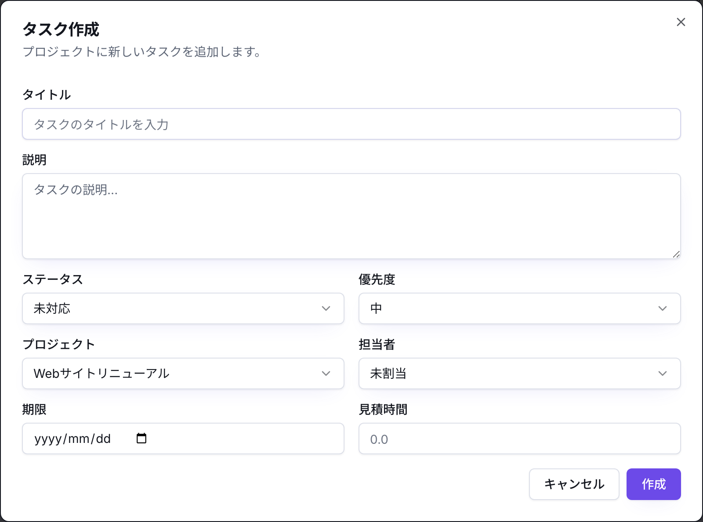
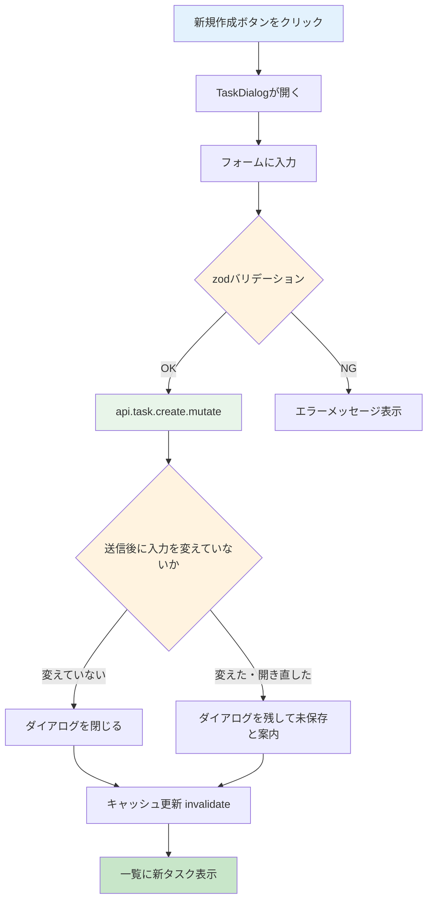
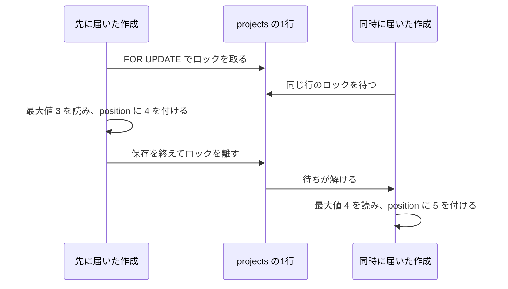
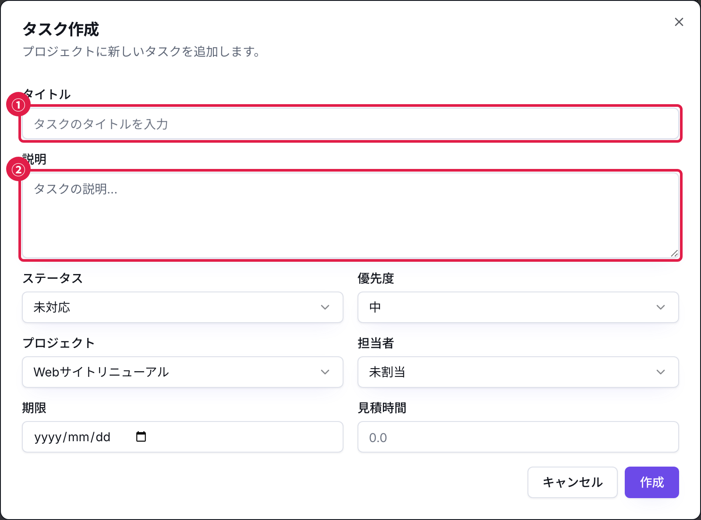
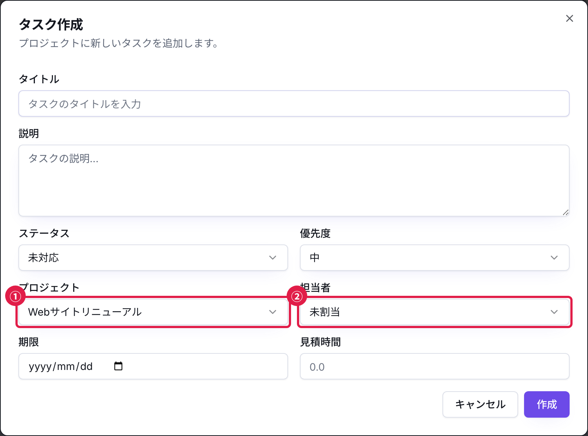
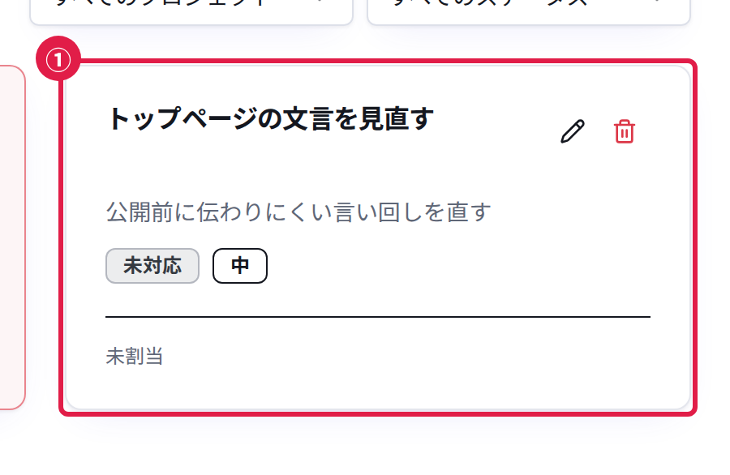

# Day 14: タスク新規作成を実装しよう

## 前回の振り返り

Day 13 ではタスク一覧画面を作成し、`api.task.getAll` によるデータ取得やフィルタリング、TaskCard コンポーネントによるカード表示を実装しました。一覧でタスクを表示できるようになったので今日は新しいタスクを作成するダイアログを実装します。

---

## 今日のゴール

TaskDialogコンポーネントで、新しいタスクを作成
できるようにします。Day 10 で学んだダイアログ
パターンとreact-hook-form + zodをタスク版に
応用します。

この日はまずサーバー側のタスク作成 API と search ルーターを自分で書きます。そのあと画面をつなぎます。

スクリーンショットでは入力欄の並びを確認してください。この画像は必須印を加える前に撮影したため、タイトル・ステータス・優先度・プロジェクトの `*` は写っていません。完成条件は、この章で書くコードの必須印と `aria-required="true"` がある状態です。



画像の日付欄には `yyyy/mm/dd` と出ていますが日本語版のブラウザでは `年/月/日` と表示されます。必須印も撮影後に追加した差分です。入力欄の並び順は同じです。

> **今日のゴールライン**: TaskDialogにフォーム管理とバリデーションを組み込み、新しいタスクが一覧へ反映される流れを体験できればOK。

## 始める前の前提

- Day 13 のタスク一覧画面が表示できます。
- 少なくとも1つのプロジェクトが作成済みで、タスクを紐づけられます。
- ログイン済みユーザーで `/task` を開けます。

今日は5ファイルを扱います。サーバー側は `src/server/api/routers/task.ts`、新規作成する `src/server/api/routers/search.ts`、`src/server/api/root.ts` です。画面側は `src/component/task/task-dialog.tsx` と `src/app/task/page.tsx` を編集します。

## なぜこれを作るのか

これまで作ってきた一覧・フィルター・詳細は
すべて「タスクがある」ことが前提でした。
そのタスクを生み出す入口がまだありません。
今日はタスクを作成する画面を用意します。

> **例え話**: タスク作成は「料理のレシピカード
> を書く」ようなものです。何を作るか（タイトル）、
> どう作るか（説明）、いつまでに（期限）、
> 誰が作るか（担当者）を1枚のカードに書きます。
> ダイアログはそのカードの記入用紙です。

### タスク作成の流れ


```mermaid
graph TD
    A[新規作成ボタンをクリック] --> B[TaskDialogが開く]
    B --> C[フォームに入力]
    C --> D{zodバリデーション}
    D -->|OK| E[api.task.create.mutate]
    D -->|NG| F[エラーメッセージ表示]
    E --> G{送信後に入力を変えていないか}
    G -->|変えていない| H[ダイアログを閉じる]
    G -->|変えた・開き直した| J[ダイアログを残して未保存と案内]
    H --> K[キャッシュ更新 invalidate]
    J --> K
    K --> I[一覧に新タスク表示]

    style A fill:#e3f2fd
    style D fill:#fff3e0
    style E fill:#e8f5e9
    style G fill:#fff3e0
    style I fill:#c8e6c9
```

この図で目を留めてほしいのは D と G の分岐です。入力はサーバーへ飛ぶ前に、いったんブラウザ側の zod で止まります。ここで弾いておけば空のタイトルのまま通信が飛ぶことはありません。読者は入力欄のすぐ下でやり直せます。

保存に成功したら、送信後に入力が変わったかを G で確かめます。同じ入力のままならダイアログを閉じます。送信後に書き足した場合や、閉じて開き直した場合は、新しい入力を消さずに未保存だと案内します。そのあと、どちらの分岐でも `invalidate()` を呼び、一覧のキャッシュに「古い」と印を付けて取り直しを始めます。この章の `refreshTaskTargets` は、`invalidate()` が返す Promise を `Promise.all` で待ちます。つまり、表示中のクエリについて再取得の完了を待ちます。ただし、ダイアログを閉じる処理を先に呼ぶので、閉じた直後から再取得の完了を待つ間は前の一覧が見えることもあります。保存に失敗した場合はダイアログを閉じず、失敗の種類を案内します。結果を受け取れなかった場合に備えた一覧の再取得は、成功後の再取得とは別に扱います。

### やること / やらないこと

| やること | やらないこと |
|---------|-------------|
| 配布済みの TaskDialog を書き直す | 別ページでフォーム作成 |
| react-hook-form + zod でフォーム管理 | useState で手動管理 |
| useMutation でサーバーに保存 | タスクの編集（Day 15） |
| キャッシュ無効化で一覧更新 | 作業時間の記録（Day 16） |

### 新しく学ぶ概念

| 概念 | 読み方 | 役割 | 例え |
|------|--------|------|------|
| TaskDialog | タスク・ダイアログ | タスクCRUD用のモーダル | レシピカードの記入用紙 |
| Controller | コントローラー | Select をreact-hook-formで制御する | ドロップダウンの管理係 |
| TASK_STATUS_LABELS | ― | ステータスの表示名を定義した定数 | 選択肢の翻訳表 |
| nativeEnum | ネイティブ・イーナム | zodで既存の定数オブジェクトを検証する | 記入用紙の「選択肢チェック」 |

開発サーバーは前の Day から動かしたまま使います。止めてあるときは `npm run dev` で起動してから `http://localhost:3000` を開きます。

## 実装ステップ一覧

| ステップ | 作業内容 | 読む時間の目安 |
|---------|---------|---------|
| Step 0 | タスク作成 API（create）と search ルーターを自分で書く | 25分 |
| Step 1 | zodスキーマと型を定義する | 8分 |
| Step 2 | TaskDialogの骨格を作る | 8分 |
| Step 3 | useFormでフォームを設定する | 8分 |
| Step 4 | タイトル・説明の入力欄を作る | 8分 |
| Step 5 | ステータス・優先度のSelectを作る | 7分 |
| Step 6 | プロジェクト・担当者のSelectを作る | 5分 |
| Step 7 | 期限・見積時間・ボタンを作る | 7分 |
| Step 8 | ページにDialogとページ移動時の境界を組み込む | 20分 |
| Step 9 | 動作確認 | 8分 |

**読む時間の合計（仮）**: 約104分です。

表と各 Step に記した時間は、説明とコードを読む時間の仮の目安です。実測した値ではありません。コードの入力、動作確認、ダウンロードや起動の待ち時間、調べものには別に時間を取ってください。

---

### Step 0: タスク作成 API（create）と search ルーターを自分で書く（読む目安: 25分）

**ゴール**: `src/server/api/routers/task.ts` に `create` を追加し、`api.task.create` を呼べる状態にします。あわせて担当者候補の取得に使う `search` ルーターを新規作成し、`root.ts` に登録します。

Day 13 で書いた `getAll`・`getById` は3部品（入力・処理・戻り値）のうち処理が「探す（`.query`）」でした。今日の `create` は「作る（`.mutation`）」になるだけで、骨組みは同じです。Day 10 でプロジェクトの `create` を書いたのと同じ流れです。

#### 0-1. 入力スキーマと import を足す

まず受け取るデータの形を zod で定義します。`task.ts` の import に次を足します。`_helpers/permission` の行は Day 13 で完成しているためそのまま残します。

```typescript
// filepath: src/server/api/routers/task.ts
// （import を追記。permission の行は Day 13 の行と統合した完成形）
import { TASK_PRIORITY } from '@/lib/constant/priority';
import { TASK_STATUS } from '@/lib/constant/status';
import {
  assertMemberPermission,
  getUserProjectIds,
} from './_helpers/permission';
```

`TASK_STATUS` と `TASK_PRIORITY` は入力スキーマの既定値に使う定数です。`assertMemberPermission` と `getUserProjectIds` は Day 13 で足したものなので重ねて import を書かず同じ行を保ちます。

続いて`export const taskRouter` の前に入力スキーマを追加します。

```typescript
// filepath: src/server/api/routers/task.ts（taskRouter の前に追加）
const taskCreateSchema = z.object({
  title: z.string().min(1, 'タイトルは必須です'),
  description: z.string().optional(),
  status: taskStatusSchema.default(TASK_STATUS.TODO),
  priority: taskPrioritySchema.default(TASK_PRIORITY.MEDIUM),
  dueDate: z.string().datetime().optional(),
  estimatedHours: z.number().min(0).optional(),
  projectId: z.string().cuid(),
  assigneeId: z.string().cuid().optional(),
});
```

`title` に `.min(1, ...)` が付いているのは空のタイトルでタスクを作れないようにするためです。`status` と `priority` の `.default(...)` は指定がなかったときに使う既定値です。`projectId` は `.cuid()`（この形式の id か）で検証し、どのプロジェクトに属すかを必ず受け取ります。

#### 0-2. 担当者チェックと並び順採番のヘルパーを足す

最初に同じプロジェクトへ同時に複数のタスクが作られても `position` が重複しないよう、採番用の3つのヘルパーを `taskRouter` の前に追加します。まず、プロジェクト行をロックする役を分けます。

```typescript
// filepath: src/server/api/routers/task.ts（taskRouter の前に追加）
const lockTaskProjects = async (tx: Prisma.TransactionClient, projectIds: string[]) => {
  const locked = new Set<string>();
  for (const projectId of [...new Set(projectIds)].sort()) {
    const rows = await tx.$queryRaw<Array<{ id: string }>>(
      Prisma.sql`SELECT "id" FROM "projects" WHERE "id" = ${projectId} FOR UPDATE`,
    );
    if (rows.length > 0) {
      locked.add(projectId);
    }
  }
  return locked;
};
```

ここだけ Prisma のメソッドではなく `$queryRaw` で SQL を直接書いています。行ロックを取る `FOR UPDATE` に当たるメソッドを Prisma が持っていないためで、この採番処理では、プロジェクト行をロックする部分で生の SQL を使います。`"projects"` は `schema.prisma` の `@@map("projects")` が決めた実際のテーブル名で、モデル名の `Project` とは別物です。

`Set`（重複しない値をまとめる入れ物）で `projectIds` の重複を除き、同じ順番に並べてからロックするため、複数のプロジェクトを渡す処理も取得順が揃います。今日の `create` が渡すのは作成先の1件だけです。続いて、ロック後の最大値を読む役と、2つを順番に呼ぶ役を追加します。

```typescript
// filepath: src/server/api/routers/task.ts（続き）
const getNextTaskPositionFromLockedProject = async (
  tx: Prisma.TransactionClient,
  projectId: string,
) => {
  const maxPosition = await tx.task.findFirst({
    where: { projectId },
    orderBy: { position: 'desc' },
    select: { position: true },
  });
  return (maxPosition?.position ?? -1) + 1;
};

const getNextTaskPosition = async (tx: Prisma.TransactionClient, projectId: string) => {
  const lockedProjects = await lockTaskProjects(tx, [projectId]);
  if (!lockedProjects.has(projectId)) {
    throw new TRPCError({
      code: 'NOT_FOUND',
      message: 'プロジェクトが見つかりません',
    });
  }
  return await getNextTaskPositionFromLockedProject(tx, projectId);
};
```

`getNextTaskPosition` が2つの役をつなぐ入口です。対象が無ければ `NOT_FOUND` で止め、ロックを取れたときだけ最大の `position` に1を足します。`FOR UPDATE` は同じ project 行を使う別処理をこのトランザクション（複数の DB 操作を、全部成功または全部取り消しのひとまとまりにする仕組み）の終了まで待たせる DB のロックです。`${projectId}` は `Prisma.sql` のパラメータとして渡され、文字列連結で SQL を作らない安全な書き方です。


```mermaid
sequenceDiagram
    participant A as 先に届いた作成
    participant P as projects の1行
    participant B as 同時に届いた作成
    A->>P: FOR UPDATE でロックを取る
    B->>P: 同じ行のロックを待つ
    A->>A: 最大値 3 を読み、position に 4 を付ける
    A->>P: 保存を終えてロックを離す
    P->>B: 待ちが解ける
    B->>B: 最大値 4 を読み、position に 5 を付ける
```

時間は上から下へ進みます。ロックが無いと2本目が待たずに同じ「最大値 3」を読み、両方が 4 を付けます。待たせる相手を作るのが `FOR UPDATE` の役目です。

次に指定した担当者がプロジェクトのメンバーかを確認するヘルパーを続けます。

```typescript
// filepath: src/server/api/routers/task.ts（続き）
async function assertTaskAssigneeBelongsToProject(
  projectId: string,
  assigneeId: string,
  db: Pick<Prisma.TransactionClient, 'projectMember'> = prisma,
): Promise<void> {
  const member = await db.projectMember.findUnique({
    where: {
      userId_projectId: {
        userId: assigneeId,
        projectId,
      },
    },
    select: { id: true },
  });

  if (!member) {
    throw new TRPCError({
      code: 'BAD_REQUEST',
      message: '担当者にはこのプロジェクトのメンバーを指定してください',
    });
  }
}
```

このヘルパーは指定された担当者がそのプロジェクトの `ProjectMember`（プロジェクトに紐づくメンバー行）に存在するかを調べ、いなければ `TRPCError` を `throw` します。第3引数の `db` にはトランザクション内の `tx` も渡せます。作成処理では、プロジェクトをロックしたあとも同じトランザクションから担当者を調べるために使います。

#### 0-3. ここが一番のヤマ場（作ってよい人かを確認する）

`create` の処理本体です。ここで一番大事なのはタスクを作る前に「その人がこのプロジェクトで作成してよい権限を持っているか」を確認する部分です。`create` は Day 13 で書いた `getById` の直後に足します。

```typescript
// filepath: src/server/api/routers/task.ts（getById の直後に追加）
  create: protectedProcedure.input(taskCreateSchema).mutation(async ({ ctx, input }) => {
    return await prisma.$transaction(async (tx) => {
      // メンバー削除・権限変更も同じプロジェクト行をロックするため、
      // ロック取得後の所属と権限だけを作成可否の判定に使う。
      const position = await getNextTaskPosition(tx, input.projectId);
      const callerMembership = await tx.projectMember.findUnique({
        where: {
          userId_projectId: {
            userId: ctx.session.userId,
            projectId: input.projectId,
          },
        },
        select: { role: true },
      });
      assertMemberPermission(callerMembership ? [callerMembership] : [], 'canEdit');
```

最初に `$transaction` を始め、`getNextTaskPosition` でプロジェクト行をロックします。対象が無ければ、このヘルパーが `NOT_FOUND` で止めます。ロックを取ったあとでログイン中の人の所属と権限を `tx` から読み直すため、確認直後に別の処理でメンバーから外され、そのまま保存する隙間がありません。

#### 0-4. 同じトランザクションで担当者を確認する

```typescript
// filepath: src/server/api/routers/task.ts（続き）
      if (input.assigneeId) {
        await assertTaskAssigneeBelongsToProject(input.projectId, input.assigneeId, tx);
      }

```

担当者が指定されているときだけ、0-2 のヘルパーへ同じ `tx` を渡します。呼び出した人の権限、担当者の所属、採番、保存が1つのトランザクションに入り、途中で失敗した場合は DB への変更全体が取り消されます。

#### 0-5. 保存するデータを組み立てる

```typescript
// filepath: src/server/api/routers/task.ts（続き）
      const createData: Prisma.TaskCreateInput = {
        title: input.title,
        status: input.status,
        completedAt: input.status === TASK_STATUS.DONE ? new Date() : null,
        priority: input.priority,
        dueDate: input.dueDate ? new Date(input.dueDate) : null,
        position,
        project: {
          connect: { id: input.projectId },
        },
        createdBy: {
          connect: { id: ctx.session.userId },
        },
      };
```

`position` には0-3でロックを取った直後の「今の最大番号 + 1」が入っています。タスクが1件も無いときはヘルパー内で -1 に1を足すため最初の番号は 0 です。`project.connect` と `createdBy.connect` はすでにある行（プロジェクトとログイン中のユーザー）に関連づける書き方です。

`completedAt` は最初から `DONE` で作るときだけ現在時刻を入れます。完了日時を使うレポートでも、このタスクを数えられるようにするためです。

#### 0-6. 任意の項目を足して保存する

`description`・`estimatedHours`・`assigneeId` は任意なので値があるときだけ足します。

```typescript
// filepath: src/server/api/routers/task.ts（続き）
      if (input.description !== undefined) {
        createData.description = input.description;
      }
      if (input.estimatedHours !== undefined) {
        createData.estimatedHours = input.estimatedHours;
      }
      if (input.assigneeId) {
        createData.assignee = {
          connect: { id: input.assigneeId },
        };
      }
```

最初の `createData` にはこれらを含めず、値が入力されているときだけ後から足しています。値があるときだけキー自体を足すと無いものは無いまま扱われます。Day 10 の `description` と同じ考え方です。

```typescript
// filepath: src/server/api/routers/task.ts（続き）
      return await tx.task.create({
        data: createData,
        include: {
          project: true,
          createdBy: {
            select: USER_SELECT,
          },
          assignee: {
            select: USER_SELECT,
          },
        },
      });
    });
  }),
```

`tx.task.create` の `tx` は0-4 で始めた同じトランザクションです。採番に使ったロックは保存が終わるまで保持されるため待っていた次の作成処理は最新の最大値を読めます。`include` は `getAll` と同じく、画面が使うプロジェクト・作成者・担当者を一緒に返す指定です。最後の `}),` で `create` を閉じます。

**確認ポイント**:
- `taskCreateSchema`・4つのヘルパーを `taskRouter` の前に、`create` を `getById` の直後に足しました。
- プロジェクト行をロックしたあと、`tx` から作成権限と担当者の所属を確認しています。
- `getNextTaskPosition`、権限確認、担当者確認、保存を同じトランザクションに入れています。
- `npx tsc --noEmit` で型エラーが出ていません。

#### 0-7. 担当者候補を取る search ルーターを作る

タスクを作るとき担当者は「選択中のプロジェクトのメンバー」から選びます。全プロジェクトのメンバーを混ぜると所属していない人を担当者に指定して送信し、サーバー側で拒否されます。この後 Step 6 で作る担当者の選択欄は `api.search.getMembersByProject` を使い、選択中のプロジェクトだけに候補を絞ります。

タスク一覧の担当者フィルターには参加中の全プロジェクトを横断する `getProjectMembers` を使います。このフィルター自体は Day 20 で作りますが2つの手続きは形が似ているのでここでまとめて書きます。まだ `search` ルーターが無いのでここで2つを新規に作ります。検索画面用の `search`・`quickSearch`・`getUserProjects` の3手続きは Day 20 で足します。

`src/server/api/routers/search.ts` を新規作成し、まず import を書きます。

```typescript
// filepath: src/server/api/routers/search.ts
import { TRPCError } from '@trpc/server';
import { z } from 'zod';
import { prisma } from '@/lib/prisma';
import { createTRPCRouter, protectedProcedure } from '../trpc';
import { USER_SELECT } from './_helpers/select';
```

`prisma` は DB に問い合わせる道具、`protectedProcedure` はログイン済みの人だけが呼べる手続きを作る道具です。`USER_SELECT` は Day 07 で作った「ユーザーのどの項目を返すか」の指定で、パスワードなど返してはいけない項目を毎回書かずに済みます。`task.ts` でも使ったものと同じ共有部品です。

続いてルーターの骨組みと問い合わせの条件を書きます。

```typescript
// filepath: src/server/api/routers/search.ts（続き）
export const searchRouter = createTRPCRouter({
  getProjectMembers: protectedProcedure.query(async ({ ctx }) => {
    const userId = ctx.session.userId;

    const projectMembers = await prisma.projectMember.findMany({
      where: {
        project: {
          members: {
            some: {
              userId,
            },
          },
        },
      },
```

`where` の中の `project.members.some` は「自分がメンバーであるプロジェクトだけを対象にする」条件です。`some` は Prisma で「関連の中に条件を満たすものが1つでもあれば対象にする」という書き方です。こうすると自分が入っていないプロジェクトのメンバーは対象から外れ、無関係な人まで候補に出てしまう事故を防げます。

最後に返す項目・重複の除去・並び順を指定して閉じます。

```typescript
// filepath: src/server/api/routers/search.ts（続き）
      select: {
        user: {
          select: USER_SELECT,
        },
      },
      distinct: ['userId'],
      orderBy: {
        user: {
          name: 'asc',
        },
      },
    });

    return projectMembers.map((member) => member.user);
  }),
```

続けて選択中のプロジェクトに絞る手続きを書きます。呼び出した人の所属確認とメンバー取得を1回の問い合わせへまとめます。

ここから先の「（続き）」のブロックは`search.ts` の**末尾へ続けて**貼ります。いま末尾にあるのは `getProjectMembers` を閉じる `  }),` の行です。`createTRPCRouter({` を閉じる `});` はまだ書いていないのでこの先の最後のブロックで1度だけ書きます。

```typescript
// filepath: src/server/api/routers/search.ts（続き）
  getMembersByProject: protectedProcedure
    .input(z.object({ projectId: z.string().cuid() }))
    .query(async ({ ctx, input }) => {
      const members = await prisma.projectMember.findMany({
        where: {
          projectId: input.projectId,
          project: {
            members: {
              some: { userId: ctx.session.userId },
            },
          },
        },
        select: {
          user: {
            select: USER_SELECT,
          },
        },
```

`projectId` は画面から届くため、別のプロジェクトの id に書き換えられます。`project.members.some` は「そのプロジェクトにログイン中の人がいる」という条件です。この条件をメンバー取得と同じ `findMany` の `where` に入れると、所属確認と取得の間へメンバー削除が割り込む隙間を作りません。

並び順を指定し、取得結果が空なら拒否してルーターを閉じます。

```typescript
// filepath: src/server/api/routers/search.ts（続き）
        orderBy: {
          user: {
            name: 'asc',
          },
        },
      });

      if (members.length === 0) {
        throw new TRPCError({
          code: 'FORBIDDEN',
          message: 'このプロジェクトのメンバーではありません',
        });
      }

      return members.map((member) => member.user);
    }),
});
```

`getProjectMembers` は一覧のフィルター用、`getMembersByProject` は作成ダイアログ用です。後者は `projectId` を入力として受け取り、所属確認を通ったプロジェクトの候補だけを返します。どちらも `USER_SELECT` を使うためパスワードなど画面に不要な項目は返しません。

作った `searchRouter` を `root.ts` に登録すると`api.search.getProjectMembers` と `api.search.getMembersByProject` という呼び名が生まれます。Day 13 で `task` を登録したのと同じ形です。

```typescript
// filepath: src/server/api/root.ts（import と appRouter に追加）
import { searchRouter } from './routers/search';

// appRouter の中に追加
search: searchRouter,
```

import 行を足しただけでは `api.search` が生まれません。`appRouter` の中へ `search: searchRouter` と書いた瞬間に、画面側からの呼び名が決まります。左に書いたキーがそのまま呼び名になります。ここを `searchRouter: searchRouter` にした場合以降のコードは `api.searchRouter.getProjectMembers` と書かなければ動きません。登録を忘れるとサーバー側はエラーを出さないまま `api.search` だけが存在しない状態になります。原因がこの1行だと気づきにくいのでrouter のファイルを作ったら登録まで続けて済ませてください。

**確認ポイント**:
- `src/server/api/routers/search.ts` に2つの手続きを書き、`}),` と `});` まで閉じました。
- `getMembersByProject` が呼び出した人の所属を確認しています。
- `root.ts` に `searchRouter` の import と `search: searchRouter` を追加しました。
- `npx tsc --noEmit` で型エラーが出ていません。

---

### Step 1: 入力の型と送信中の契約を決める（読む目安: 8分）

**ゴール**: フォームの入力値と、送信中に親ページへ渡す情報を型で決めます。

`src/component/task/task-dialog.tsx` は配布済みです。今日はフォーム部品を自分で組み立てます。まず中身をすべて削除し、先頭から書いてください。

```typescript
// filepath: src/component/task/task-dialog.tsx
'use client';

import { zodResolver } from '@hookform/resolvers/zod';
import { type FormEvent, useEffect, useRef } from 'react';
import { Controller, useForm } from 'react-hook-form';
import { z } from 'zod';
import { Button } from '@/component/ui/button';
import {
  Dialog, DialogContent, DialogDescription,
  DialogFooter, DialogHeader, DialogTitle,
} from '@/component/ui/dialog';
import { Input } from '@/component/ui/input';
import { Label } from '@/component/ui/label';
```

`FormEvent` はフォームの送信操作を表す型です。入力検証が非同期になっても送ろうとした値を検証開始前に記録できます。

```typescript
// filepath: src/component/task/task-dialog.tsx（続き）
import {
  Select, SelectContent, SelectItem,
  SelectTrigger, SelectValue,
} from '@/component/ui/select';
import { Textarea } from '@/component/ui/textarea';
import {
  TASK_PRIORITY, TASK_PRIORITY_LABELS,
  type TaskPriority,
} from '@/lib/constant/priority';
import {
  TASK_STATUS, TASK_STATUS_LABELS,
  type TaskStatus,
} from '@/lib/constant/status';
import { api } from '@/trpc/react';
```

選択肢は既存の定数から作ります。画面へ表示する値とサーバーへ送る値を別々に書くと片方だけを直したときに食い違うためです。

```typescript
// filepath: src/component/task/task-dialog.tsx（続き）
const taskFormSchema = z.object({
  id: z.string().optional(),
  title: z.string().min(1, 'タイトルは必須です'),
  description: z.string().optional(),
  status: z.nativeEnum(TASK_STATUS),
  priority: z.nativeEnum(TASK_PRIORITY),
  dueDate: z.string().optional(),
  estimatedHours: z.number().min(0).optional(),
  projectId: z.string().min(1, 'プロジェクトは必須です'),
  assigneeId: z.string().optional(),
  expectedUpdatedAt: z.string().optional(),
});

type TaskFormValues = z.infer<typeof taskFormSchema>;
```

zodは送信前に入力値を確かめます。`z.infer` は同じ定義からTypeScriptの型を作るので検証項目と型がずれません。`expectedUpdatedAt` はDay15の編集で使います。今日は値を送りません。

```typescript
// filepath: src/component/task/task-dialog.tsx（続き）
interface TaskDialogProps {
  open: boolean;
  onClose: () => void;
  onSubmit: (
    data: TaskFormData,
    isCurrent?: () => boolean,
  ) => void;
  initialData?: TaskFormData | undefined;
  projects: Array<{ id: string; name: string }>;
  users?: Array<{
    id: string; name: string | null; email: string;
  }>;
  isPending?: boolean;
}
```

`isPending` は親ページが保存中かどうかを渡す値です。`isCurrent` は送信後も同じダイアログと入力が残っているかを確かめる関数です。保存の返事を待つ間に閉じて開き直した場合は古い返事で新しい入力を閉じないために使います。

```typescript
// filepath: src/component/task/task-dialog.tsx（続き）
export interface TaskFormData {
  id?: string;
  title: string;
  description?: string;
  status: TaskStatus;
  priority: TaskPriority;
  dueDate?: string;
  estimatedHours?: number;
  projectId: string;
  assigneeId?: string | null;
  expectedUpdatedAt?: string;
}
```

`TaskFormData` は親ページへ渡す値の形です。`assigneeId` の`null`はDay15で担当者を外すときに使います。Day14の新規作成では未割当を`undefined`として送ります。

**確認ポイント**:
- `onSubmit`の第2引数に`isCurrent`があります。
- `isPending`を親ページから受け取れます。

### Step 2: 初期値と入力の世代を記録する（読む目安: 8分）

**ゴール**: 開き直したフォームと、送信後に書き換えた入力を区別します。

```typescript
// filepath: src/component/task/task-dialog.tsx（続き）
function buildTaskFormValues(
  initialData: TaskFormData | undefined,
  projects: Array<{ id: string; name: string }>,
): TaskFormValues {
  return {
    id: initialData?.id,
    title: initialData?.title ?? '',
    description: initialData?.description ?? '',
    status: initialData?.status ?? TASK_STATUS.TODO,
    priority: initialData?.priority ?? TASK_PRIORITY.MEDIUM,
    dueDate: initialData?.dueDate ?? '',
    estimatedHours: initialData?.estimatedHours,
    projectId: initialData?.projectId ?? (projects[0]?.id || ''),
    assigneeId: initialData?.assigneeId ?? '',
    expectedUpdatedAt: initialData?.expectedUpdatedAt,
  };
}
```

初期値を1か所で作ると最初に開いたときとキャンセル後に開き直したときで値がそろいます。入力欄へ `undefined` を渡さないよう、文字列の項目は空文字から始めます。

```typescript
// filepath: src/component/task/task-dialog.tsx（続き）
export function TaskDialog({
  open, onClose, onSubmit, initialData, projects,
  users: fallbackUsers = [], isPending = false,
}: TaskDialogProps) {
  const {
    register, handleSubmit, control, watch,
    reset, setValue, formState: { errors },
  } = useForm<TaskFormValues>({
    resolver: zodResolver(taskFormSchema),
    defaultValues: buildTaskFormValues(initialData, projects),
  });
  const generationRef = useRef(0);
  const revisionRef = useRef(0);
  const selectedProjectId = watch('projectId');
  const projectsRef = useRef(projects);
```

`generationRef`はダイアログを開き直した回数、`revisionRef`は入力を変えた回数です。画面の再描画には使いません。そこでstateではなくref（再描画せず値を保持する入れ物）へ保存します。

```typescript
// filepath: src/component/task/task-dialog.tsx（続き）
  const {
    data: projectMembers,
    isPending: isMembersPending,
    isError: isMembersError,
  } = api.search.getMembersByProject.useQuery(
    { projectId: selectedProjectId },
    { enabled: open && !!selectedProjectId },
  );
  const users = projectMembers
    ?? (isMembersPending ? fallbackUsers : []);
```

担当者は選択中のプロジェクトに所属する人だけを取得します。`users` は、親から取得済み一覧が渡された場合だけ使う任意の予備データです。この日の `page.tsx` は渡さないため、初期値は空配列になります。fallback（代替値）は読み込み中だけに限定します。取得失敗時に別プロジェクトの候補を残すと、選べても保存できない人が表示されるためです。

**確認ポイント**:
- generationとrevisionを別々のrefへ保存しました。
- 担当者のfallback（代替値）を読み込み中だけに限定しました。

### Step 3: 開閉と入力変更を追跡する（読む目安: 8分）

**ゴール**: 遅れて返った保存結果が、新しく開いたフォームへ作用しない判定を作ります。

```typescript
// filepath: src/component/task/task-dialog.tsx（続き）
  useEffect(() => {
    projectsRef.current = projects;
  }, [projects]);

  useEffect(() => {
    const subscription = watch((_values, { name }) => {
      if (name) revisionRef.current += 1;
    });
    return () => subscription.unsubscribe();
  }, [watch]);
```

`watch`の購読は入力項目名が届いたときだけrevisionを増やします。`reset`による初期化まで手入力として数えると送信直後から`isCurrent`が誤って`false`になるためです。

```typescript
// filepath: src/component/task/task-dialog.tsx（続き）
  useEffect(
    () => () => {
      generationRef.current += 1;
    },
    [],
  );

  useEffect(() => {
    if (!open) return;
    generationRef.current += 1;
    reset(buildTaskFormValues(
      initialData, projectsRef.current,
    ));
  }, [initialData, open, reset]);
```

開くたびにgenerationを増やします。部品が画面から外れたときも増やします。すると外れた部品が持っていた古い送信は現在のフォームと一致しません。

```typescript
// filepath: src/component/task/task-dialog.tsx（続き）
  useEffect(() => {
    const firstProjectId = projects[0]?.id;
    if (
      !open || initialData || selectedProjectId
      || !firstProjectId
    ) return;
    setValue('projectId', firstProjectId, {
      shouldDirty: false,
    });
  }, [
    initialData, open, projects,
    selectedProjectId, setValue,
  ]);
```

プロジェクト一覧があとから届いた場合は先頭を初期選択します。`shouldDirty: false`は自動選択を読者の手入力として扱わない指定です。

**確認ポイント**:
- 開いたときと閉じたときにgenerationが増えます。
- 手入力の変更だけでrevisionが増えます。

### Step 4: 検証開始前の入力を送る（読む目安: 8分）

**ゴール**: zodの検証が終わる前に、送信対象のgenerationとrevisionを記録します。

```typescript
// filepath: src/component/task/task-dialog.tsx（続き）
  const handleClose = () => {
    generationRef.current += 1;
    reset(buildTaskFormValues(undefined, projects));
    onClose();
  };
```

閉じる操作でもgenerationを増やします。保存中に閉じて別の入力を始めても古い保存結果では新しいフォームを閉じられません。

```typescript
// filepath: src/component/task/task-dialog.tsx（続き）
  const handleFormSubmit = (
    data: TaskFormValues,
    submittedGeneration: number,
    submittedRevision: number,
  ) => {
    const submitData: TaskFormData = {
      ...(data.id !== undefined && { id: data.id }),
      title: data.title,
      status: data.status,
      priority: data.priority,
      projectId: data.projectId,
      ...(data.description && { description: data.description }),
      ...(data.dueDate && { dueDate: data.dueDate }),
      ...(data.estimatedHours !== undefined
        && { estimatedHours: data.estimatedHours }),
```

空の任意項目は送信データへ含めません。作成APIは`undefined`を「指定なし」として扱います。関数は次のブロックへ続きます。

```typescript
// filepath: src/component/task/task-dialog.tsx（続き）
      ...(data.assigneeId
        ? { assigneeId: data.assigneeId }
        : data.id !== undefined && { assigneeId: null }),
      ...(data.id !== undefined
        && data.expectedUpdatedAt !== undefined
        && { expectedUpdatedAt: data.expectedUpdatedAt }),
    };
    onSubmit(submitData, () =>
      generationRef.current === submittedGeneration
      && revisionRef.current === submittedRevision,
    );
  };
```

第2引数の関数は保存結果が返った時点で同じフォームと入力かを親ページが確かめるためのものです。Day14では作成だけを扱います。部品の契約はDay15の編集でも同じです。

```typescript
// filepath: src/component/task/task-dialog.tsx（続き）
  const handleSubmitEvent = (
    event: FormEvent<HTMLFormElement>,
  ) => {
    event.preventDefault();
    if (isPending) return;
    const submittedGeneration = generationRef.current;
    const submittedRevision = revisionRef.current;
    void handleSubmit((data) => handleFormSubmit(
      data, submittedGeneration, submittedRevision,
    ))(event);
  };
```

記録は`handleSubmit`より前です。zodの検証処理が非同期になった場合でも検証を始めた時点の入力を指せます。`isPending`は送信中の二重送信をここでも止めます。親ページにも同期的なrefのロックも置きます。ボタンを素早く2回押した場合も通信は1回です。

ここから画面を返します。Step 5以降の選択欄はこの`form`の中へ順番に足します。

```tsx
// filepath: src/component/task/task-dialog.tsx（続き）
  return (
    <Dialog open={open}
      onOpenChange={(isOpen) =>
        !isOpen && handleClose()}>
      <DialogContent className="sm:max-w-[800px]">
        <DialogHeader>
          <DialogTitle>
            {initialData?.id ? 'タスク編集' : 'タスク作成'}
          </DialogTitle>
          <DialogDescription>
            {initialData?.id
              ? 'タスクの詳細を更新します。'
              : 'プロジェクトに新しいタスクを追加します。'}
          </DialogDescription>
        </DialogHeader>
        <form onSubmit={handleSubmitEvent}>
          <div className="grid gap-4 py-4">
```

`Dialog`を閉じる操作はすべて`handleClose`へ集めます。タイトルと説明は新規作成と編集で表示を切り替えます。

```tsx
{/* filepath: src/component/task/task-dialog.tsx（続き） */}
<div className="grid gap-2">
  <Label htmlFor="title">
    タイトル <span aria-hidden="true"
      className="text-destructive">*</span>
  </Label>
  <Input id="title"
    placeholder="タスクのタイトルを入力"
    aria-required="true"
    aria-invalid={!!errors.title}
    aria-describedby={errors.title
      ? 'title-error' : undefined}
    {...register('title')}
  />
  {errors.title && (
    <p id="title-error"
      className="text-sm text-destructive">
      {errors.title.message}
    </p>
  )}
</div>
```

エラー文へ`id`を付けます。入力欄の`aria-describedby`から結びます。画面読み上げでもどの入力に対するエラーか分かります。

次の画像では番号1がタイトル欄、番号2が説明欄です。この画像は必須印を加える前に撮影したため、タイトルの `*` は写っていません。欄の位置を確かめる画像として使います。Step 5以降で加える選択欄も同じダイアログの下へ続きます。



```tsx
{/* filepath: src/component/task/task-dialog.tsx（続き） */}
<div className="grid gap-2">
  <Label htmlFor="description">説明</Label>
  <Textarea id="description"
    placeholder="タスクの説明..." rows={4}
    {...register('description')}
  />
</div>
<div className=
  "grid grid-cols-1 sm:grid-cols-2 gap-4">
```

小さい画面では1列にします。幅がある画面では2列にします。この`div`の中へStep 5からStep 7の項目を足します。

---

**確認ポイント**:
- zodの検証を始める前にgenerationとrevisionを記録しました。
- `form`の`onSubmit`が`handleSubmitEvent`を使っています。

### Step 5: ステータス・優先度のSelectを作る（読む目安: 7分）

**ゴール**: `Controller` で Select コンポーネント
をreact-hook-formに接続します。

**実装**:

```typescript
{/* filepath: src/component/task/task-dialog.tsx */}
{/* ステータスSelect（Controller使用） */}
  <div className="grid gap-2">
    <Label htmlFor="status">
      ステータス{' '}
      <span aria-hidden="true"
        className="text-destructive">*</span>
    </Label>
    <Controller
      name="status"
      control={control}
      render={({ field }) => (
        <Select
          value={field.value}
          onValueChange={field.onChange}>
          <SelectTrigger id="status"
            aria-label="ステータスを選択"
            aria-required="true">
            <SelectValue
              placeholder=
                "ステータスを選択" />
          </SelectTrigger>
```

ここで `register` ではなく `Controller` を使うのはshadcn/ui の `Select` が普通の `<input>` ではないからです。`register` は入力欄の実体を `ref` で受け取り、その `value` と、値が変わったときの `change` イベントから中身を読みます。`Select` の引き金は `<button>` なので、`ref` そのものは受け取れても `value` を持たず、`change` も出ません。代わりに `Controller` が `field.value` と `field.onChange` を用意し、`Select` の `onValueChange` へ橋渡しします。`name="status"` はフォームのどの項目とつなぐかの指定です。

続けてステータスの選択肢を `TASK_STATUS_LABELS` から生成します。

```typescript
          {/* filepath: src/component/task/task-dialog.tsx */}
          <SelectContent>
            {Object.entries(
              TASK_STATUS_LABELS
            ).map(([value, label]) => (
              <SelectItem
                key={value}
                value={value}>
                {label}
              </SelectItem>
            ))}
          </SelectContent>
        </Select>
      )} />
  </div>
```

選択肢を手で並べず `Object.entries(TASK_STATUS_LABELS)` から作るところがこの部分の要点です。`value` には内部の値、画面には日本語のラベルが入ります。ステータスを1つ増やしたくなったら定数ファイルを直すだけで、このダイアログにも Day 13 の一覧にも同じ表示名が届きます。`key={value}` は並んだ項目を React が見分けるための印です。

優先度Selectも同じパターンで作ります。

```typescript
{/* filepath: src/component/task/task-dialog.tsx */}
{/* 優先度Select（Controllerで同じパターン） */}
  <div className="grid gap-2">
    <Label htmlFor="priority">
      優先度{' '}
      <span aria-hidden="true"
        className="text-destructive">*</span>
    </Label>
    <Controller
      name="priority"
      control={control}
      render={({ field }) => (
        <Select
          value={field.value}
          onValueChange={field.onChange}>
          <SelectTrigger id="priority"
            aria-label="優先度を選択"
            aria-required="true">
            <SelectValue
              placeholder=
                "優先度を選択" />
          </SelectTrigger>
```

優先度の作りはステータスと同じで、変わるのは `name` と参照する定数だけです。同じ形をもう一度書いてもらうのは`Controller` の3点セット（`name`・`control`・`render`）が身に付けばSelect が何個増えても同じ手順で足せると確かめるためです。`aria-label` を付けてあるのは画面読み上げを使う人へどちらの選択欄かを伝えるためで、見た目には出ません。

```typescript
          {/* filepath: src/component/task/task-dialog.tsx */}
          <SelectContent>
            {Object.entries(
              TASK_PRIORITY_LABELS
            ).map(([value, label]) => (
              <SelectItem
                key={value}
                value={value}>
                {label}
              </SelectItem>
            ))}
          </SelectContent>
        </Select>
      )} />
  </div>
```

> `Controller` は`register` が使えない
> コンポーネント（Select）をreact-hook-formに
> 接続します。`field.value` で現在の値を取得し、
> `field.onChange` で値を更新します。
> `Object.entries(TASK_STATUS_LABELS)` で定数から
> 選択肢を自動生成するので追加・変更に強い
> 構造になります。

**確認ポイント**:
- ステータスと優先度の `Controller` を書けました。
- 選択肢に `TASK_STATUS_LABELS` と `TASK_PRIORITY_LABELS` の日本語を使っています。

#### register vs Controller の使い分け

| 対象 | 使う関数 | 理由 |
|------|---------|------|
| Input, Textarea | `register` | `ref` の先に `value` と `change` があるため |
| Select (shadcn/ui) | `Controller` | 引き金が `<button>` で、独自の `onValueChange` から受け取るため |

#### ステータスと優先度の選択肢

| ステータス | 表示名 | 意味 |
|-----------|-------|------|
| `TODO` | 未対応 | 未着手 |
| `IN_PROGRESS` | 進行中 | 作業中 |
| `IN_REVIEW` | レビュー中 | レビュー待ち |
| `DONE` | 完了 | 完了 |
| `CANCELLED` | キャンセル | 取り消し |

| 優先度 | 表示名 |
|-------|-------|
| `LOW` | 低 |
| `MEDIUM` | 中 |
| `HIGH` | 高 |
| `URGENT` | 緊急 |

**確認ポイント**:
- ステータスと優先度を2列グリッドで囲みました。
- 構文と型の確認は部品が完成する Step 7 の後に行います。

---

### Step 6: プロジェクト・担当者のSelectを作る（読む目安: 5分）

**ゴール**: 外から渡されたデータで選択肢を
表示します。

**実装**:

```typescript
{/* filepath: src/component/task/task-dialog.tsx */}
{/* プロジェクトSelect */}
  <div className="grid gap-2">
    <Label htmlFor="project">
      プロジェクト{' '}<span aria-hidden="true" className="text-destructive">*</span>
    </Label>
    <Controller
      name="projectId"
      control={control}
      render={({ field }) => (
        <Select
          value={field.value}
          onValueChange={(value) => {
            if (value !== field.value) {
              setValue('assigneeId', '');
            }
            field.onChange(value);
          }}
          disabled={!projects.length}>
          <SelectTrigger id="project"
            aria-label="プロジェクトを選択"
            aria-required="true">
            <SelectValue placeholder=
              "プロジェクトを選択" />
          </SelectTrigger>
```

プロジェクトだけは選択肢の出どころが定数ではなく親から渡される `projects` です。`disabled={!projects.length}` を付けたのはプロジェクトが1件も無いときに選べない見た目へ変えるためです。ここが空のままだと `projectId` も空で、Step 1 のスキーマが送信を止めます。タスクは必ずどれかのプロジェクトへ属するので未選択のまま先へは進めません。

プロジェクトを選び直したときに `setValue('assigneeId', '')` で担当者を未割当へ戻すのは担当者がそのプロジェクトのメンバーかどうかをサーバーが確かめるからです。前のプロジェクトのメンバーを選んだまま送信するとサーバーがエラーを返して保存できません。

プロジェクトの選択肢とエラー表示です。

```typescript
          {/* filepath: src/component/task/task-dialog.tsx */}
          <SelectContent>
            {projects.map((project) => (
              <SelectItem
                key={project.id}
                value={project.id}>
                {project.name}
              </SelectItem>
            ))}
          </SelectContent>
        </Select>
      )} />
    {errors.projectId && (
      <p className=
        "text-sm text-destructive">
        {errors.projectId.message}
      </p>
    )}
  </div>
```

エラー表示をタイトルと同じ形でここにも置くのは必須の項目が画面に2つあるからです。プロジェクトが未選択でも「作成」ボタンは押せてしまいますが押した先でこの赤い文字が理由を伝えます。押しても無反応な作りにすると読者は何が足りないのか分からず、入力欄を順に見直すことになります。

```typescript
{/* filepath: src/component/task/task-dialog.tsx */}
{/* 担当者Select */}
  <div className="grid gap-2">
    <Label htmlFor="assignee">
      担当者
    </Label>
    <Controller
      name="assigneeId"
      control={control}
      render={({ field }) => (
        <Select
          value={
            field.value || 'unassigned'}
          onValueChange={(value) =>
            field.onChange(
              value === 'unassigned'
                ? '' : value)}
          disabled={
            isMembersPending || isMembersError}>
          <SelectTrigger id="assignee"
            aria-label="担当者を選択">
            <SelectValue placeholder=
              "担当者を選択" />
          </SelectTrigger>
```

担当者の欄だけは値の出入りで変換を1回挟みます。画面では未割当を `'unassigned'` という文字列で持ち、`onValueChange` の中で空文字へ戻してからフォームへ渡します。理由はこの節の最後に補足したとおりで、`Select` は空文字を選択済みとして扱えません。フォーム側の値は空文字のまま保つため`handleFormSubmit` の条件付きスプレッドが `assigneeId` のキーごと落とします。担当者を決めずに作ったタスクは未割当のままサーバーへ届きます。

担当者の選択肢です。

```typescript
          {/* filepath: src/component/task/task-dialog.tsx */}
          <SelectContent>
            <SelectItem
              value="unassigned">
              未割当
            </SelectItem>
            {users.map((user) => (
              <SelectItem
                key={user.id}
                value={user.id}>
                {user.name || user.email}
              </SelectItem>
            ))}
          </SelectContent>
        </Select>
      )} />
    {isMembersError && (
      <p className="text-sm text-destructive">
        メンバー一覧の取得に失敗しました。再読み込みしてもう一度お試しください
      </p>
    )}
  </div>
```

取得中と取得失敗時は担当者欄を無効にします。古い候補を選べるままにしません。取得失敗も画面に表示します。

> 「未割当」を選んだ時は空文字にしたいのですがshadcn/ui の `Select` は空文字 `''` を有効な値として扱えません（値が空だと選択状態にならず、`placeholder` が表示されてしまいます）。そのため `'unassigned'` を特別な値として使い、送信時に空文字に変換するテクニックが必要です。

**確認ポイント**:
- プロジェクト一覧の Select を書きました。
- 担当者一覧の Select に「未割当」を書きました。

スクリーンショット: 下の画像では、赤枠の2欄がこの Step で足したところです。この画像も必須印を加える前に撮影したため、タイトル・ステータス・優先度・プロジェクトの `*` は写っていません。欄の位置を確かめる画像として使います。期限と見積時間は Step 7 で足します。ここではまだ JSX が閉じていないので表示できません。画面は Step 8 で確認します。



---

### Step 7: 期限、見積時間、送信ボタンを作る（読む目安: 7分）

**ゴール**: 残りの入力欄を追加し、送信中の表示まで完成させます。

Step 6の担当者欄の後ろへ追加します。

```tsx
{/* filepath: src/component/task/task-dialog.tsx */}
<div className="grid gap-2">
  <Label htmlFor="dueDate">期限</Label>
  <Input id="dueDate" type="date"
    {...register('dueDate')} />
</div>
<div className="grid gap-2">
  <Label htmlFor="estimatedHours">見積時間</Label>
  <Input id="estimatedHours" type="number"
    min="0" step="0.5" placeholder="0.0"
    {...register('estimatedHours', {
      setValueAs: (value: string) =>
        value === '' ? undefined : Number(value),
    })}
  />
</div>
</div>
</div>
```

`setValueAs`は入力欄の文字列を数値へ直します。空欄だけは`undefined`にします。任意項目として送ります。末尾の2つの`</div>`は、2列の枠と入力欄全体の枠を閉じます。

フッターを追加します。

```tsx
{/* filepath: src/component/task/task-dialog.tsx */}
<DialogFooter>
  <Button type="button" variant="outline"
    onClick={handleClose}>
    キャンセル
  </Button>
  <Button type="submit" disabled={isPending}>
    {isPending
      ? initialData?.id ? '更新中...' : '作成中...'
      : initialData?.id ? '更新' : '作成'}
  </Button>
</DialogFooter>
      </form>
    </DialogContent>
  </Dialog>
  );
}
```

`</form>` は Step 4 で開いたフォーム、`</DialogContent>` は入力欄を載せた領域、`</Dialog>` はダイアログ全体を閉じます。`);` で `return (`、`}` で Step 2 から書いてきた `TaskDialog` 関数を閉じます。ここまで貼ると Step 1 から組み立ててきた JSX と関数が閉じ切ります。

送信中はボタンを無効にします。表示を「作成中...」へ変えます。見た目の無効化だけでは同じ瞬間の二重送信を防ぎきれません。そこでStep 4とStep 8のrefでも止めます。

フォームの開始タグは次の形です。Step 5で`handleSubmit(handleFormSubmit)`と書いていた場合は置き換えてください。

```tsx
{/* filepath: src/component/task/task-dialog.tsx */}
<form onSubmit={handleSubmitEvent}>
```

`handleSubmitEvent`はgenerationとrevisionを先に記録してからzodの検証を始めます。検証中にフォームを閉じた場合も親ページへ古い入力を送らずに済みます。

`Dialog`の`onOpenChange`はキャンセルボタン以外の閉じ方も`handleClose`へ集めます。

```tsx
{/* filepath: src/component/task/task-dialog.tsx */}
<Dialog open={open}
  onOpenChange={(isOpen) =>
    !isOpen && handleClose()}>
```

右上の閉じるボタンやEscキーも`handleClose`を通ります。キャンセルボタンだけでgenerationを増やすと別の閉じ方をしたときに古い保存結果を無効にできません。

**確認ポイント**:
- 送信中は作成ボタンが無効になり「作成中...」と表示されます。
- 閉じて開き直すと前回の入力が残りません。
- `npx tsc --noEmit`で型エラーが出ていません。

---

### Step 8: ページへ安全な作成処理を組み込む（読む目安: 20分）

**ゴール**: 作成を1回だけ送信し、返事が遅れても現在の入力を守る親ページを作ります。

Day13で完成した`src/app/task/page.tsx`へ追加します。配布scaffoldは`query-error.ts`と`task-write-error.ts`をすでに`src/lib`へコピーしています。ここではhelperファイルを作り直しません。

まず Day 13 の import 群を編集します。`next/navigation` と `react` の既存行は次の2行へ置き換えます。

```typescript
// filepath: src/app/task/page.tsx
import { useRouter, useSearchParams }
  from 'next/navigation';
import {
  Suspense, useCallback, useEffect, useMemo,
  useRef, useState,
} from 'react';
```

続いて、Day 13 に無かった次の import だけを追加します。`Button` はすでにあるため、もう一度追加しません。

```typescript
// filepath: src/app/task/page.tsx
import { Plus } from 'lucide-react';
import toast from 'react-hot-toast';
import {
  TaskDialog, type TaskFormData,
} from '@/component/task/task-dialog';
import { dateOnlyToUtcStartIso } from '@/lib/date';
import {
  isAuthError, isForbiddenError, shouldRetryQuery,
} from '@/lib/query-error';
import { classifyTaskWriteError }
  from '@/lib/task-write-error';
```

`classifyTaskWriteError`はサーバーが返した状態番号を読者が次に取る行動へ置き換えます。`isForbiddenError` は403（ログイン済みでも閲覧権限が無い応答）を判定します。通信が途切れて結果を受け取れない場合は「失敗」と断定しません。サーバーでは保存済みの可能性があるためです。

`TaskPageContent`の前とstate群へ追加します。

```typescript
// filepath: src/app/task/page.tsx
// TaskPageContent の前
type CreateSubmission = {
  generation: number;
  isCurrent: () => boolean;
};
```

送信時のページ側generationと子フォームが返す`isCurrent`を1組で保存します。どちらかが一致しなければ返ってきた成功は現在のフォームを閉じません。

```typescript
// filepath: src/app/task/page.tsx
// TaskPageContent のstate群に追加
const [dialogOpen, setDialogOpen] = useState(false);
const [editingTask, setEditingTask] =
  useState<TaskFormData | undefined>();
const [authExpired, setAuthExpired] = useState(false);
const createSubmission =
  useRef<CreateSubmission | null>(null);
const formGeneration = useRef(0);
const authExpiredRef = useRef(false);
const router = useRouter();
const utils = api.useUtils();
```

`createSubmission`は通信開始と同じ処理の中で値を入れます。stateの反映を待ちません。連続クリックの2回目は通信を始める前に止まります。

Day13の3つの`useQuery`をエラーと読み込み結果も受け取る形へ置き換えます。

```typescript
// filepath: src/app/task/page.tsx
const {
  data: session, error: sessionError,
  isSuccess: sessionLoaded,
  isFetching: sessionFetching,
  refetch: refetchSession,
} = api.auth.getSession.useQuery(undefined, {
  enabled: !authExpired,
  retry: shouldRetryQuery,
});
```

続けて、タスク取得から再試行に使う値も受け取ります。ログイン情報だけの取得失敗は `refetchSession` で再試行します。`sessionFetching` をボタンへ渡すので、通信中の連続クリックで問い合わせを重ねません。

```typescript
// filepath: src/app/task/page.tsx（続き）
const {
  data: tasks, isLoading: tasksLoading,
  isFetching: tasksFetching, error: tasksError, refetch: refetchTasks,
} = api.task.getAll.useQuery(
  {
    projectId: filterProject === 'all'
      ? undefined : filterProject,
    status: filterStatus === 'all'
      ? undefined : filterStatus,
    limit: PAGE_SIZE, offset: pageIndex * PAGE_SIZE,
  },
  {
    enabled: !authExpired,
    retry: shouldRetryQuery,
    refetchOnWindowFocus: false,
  },
);
```

401はログイン期限切れです。同じ取得を繰り返しても直りません。そこで`enabled: !authExpired`で以後の取得を止めます。

```typescript
// filepath: src/app/task/page.tsx（続き）
const {
  data: projects, error: projectsError,
  isFetching: projectsFetching,
  refetch: refetchProjects,
} = api.project.getAll.useQuery(undefined, {
    enabled: !authExpired,
    retry: shouldRetryQuery,
  });
const queryAuthFailed =
  (sessionLoaded && session === null)
  || [sessionError, tasksError, projectsError]
    .some(isAuthError);
const queryForbidden =
  [sessionError, tasksError, projectsError]
    .some(isForbiddenError);
useEffect(() => {
  if (!queryAuthFailed) return;
  authExpiredRef.current = true;
  setAuthExpired(true);
}, [queryAuthFailed]);
```

refにも同時に記録するのはstateが画面へ反映される前に古い作成成功が返っても成功通知や再取得を始めないためです。

初回失敗と、前回のデータを持った再取得失敗を分けます。`undefined` はまだ成功データが無い状態です。空配列は取得に成功して0件だった状態なので、失敗扱いにしません。ログイン情報も、成功データの有無で初回失敗と古い情報を持つ失敗を分けます。

```typescript
// filepath: src/app/task/page.tsx（続き）
const taskReadFailed = !!tasksError
  && !isAuthError(tasksError)
  && !isForbiddenError(tasksError);
const projectReadFailed = !!projectsError
  && !isAuthError(projectsError)
  && !isForbiddenError(projectsError);
const sessionReadFailed = !!sessionError
  && !isAuthError(sessionError)
  && !isForbiddenError(sessionError);
const taskReadFailedInitially =
  taskReadFailed && tasks === undefined;
const projectReadFailedInitially =
  projectReadFailed && projects === undefined;
const sessionReadFailedInitially =
  sessionReadFailed && session === undefined;
const sessionReadDataIsStale =
  sessionReadFailed && session !== undefined;
const requiredReadFailedInitially =
  taskReadFailedInitially || projectReadFailedInitially;
```

データが残っている失敗ではカードとプロジェクト選択肢を消しません。前回取得時の内容だと明示し、再試行中はボタンを押せないようにします。

```typescript
// filepath: src/app/task/page.tsx（続き）
const requiredReadDataIsStale =
  (taskReadFailed && tasks !== undefined)
  || (projectReadFailed && projects !== undefined);
const requiredReadRetrying =
  (taskReadFailed && tasksFetching)
  || (projectReadFailed && projectsFetching);
const retryRequiredReads = () => {
  const retries: Promise<unknown>[] = [];
  if (taskReadFailed) retries.push(refetchTasks());
  if (projectReadFailed) retries.push(refetchProjects());
  void Promise.all(retries);
};
```

`refetch`（リフェッチ、同じ条件でもう一度取得する関数）は、失敗した問い合わせだけを呼びます。タスク取得だけが失敗した場合に、成功済みのプロジェクト取得までやり直さないためです。

```typescript
// filepath: src/app/task/page.tsx（続き）
const initialReadErrorMessage =
  taskReadFailedInitially && projectReadFailedInitially
    ? 'タスクとプロジェクトを取得できませんでした。'
    : taskReadFailedInitially
      ? 'タスクを取得できませんでした。'
      : 'プロジェクトを取得できませんでした。';
const staleReadErrorMessage =
  taskReadFailed && projectReadFailed
    ? '最新のタスクとプロジェクトを取得できませんでした。前回取得時の内容です。'
    : taskReadFailed
      ? '最新のタスクを取得できませんでした。前回取得時の内容です。'
      : '最新のプロジェクトを取得できませんでした。前回取得時の内容です。';
```

成功済みの空配列では上のエラー値がありません。従来の「タスクが見つかりません」は本当に0件だった場合だけ表示されます。

権限の表を作る処理の後ろへ作成できるプロジェクトと閉じる処理を追加します。

```typescript
// filepath: src/app/task/page.tsx
const editableProjects = useMemo(
  () => projects?.filter((project) =>
    canEditProject(project.id)) ?? [],
  [projects, canEditProject],
);
const closeTaskDialog = useCallback(() => {
  formGeneration.current += 1;
  setDialogOpen(false);
  setEditingTask(undefined);
}, []);
```

閲覧だけできるプロジェクトを作成候補へ出しません。閉じるたびにgenerationを増やします。古い成功は次に開いたフォームを閉じられません。

次の再取得関数は一覧と作成した対象を更新します。

```typescript
// filepath: src/app/task/page.tsx
const refreshTaskTargets = async (
  ids: string[], refreshPermissions: boolean,
  reportDetailFailure = false,
) => {
  const filters = {
    refetchType: authExpiredRef.current
      ? ('none' as const) : ('active' as const),
  };
  try {
    const updates = [
      utils.task.getAll.invalidate(
        undefined, filters, { throwOnError: true }),
      ...ids.map((id) =>
        utils.task.getById.invalidate(
          { id }, filters,
          { throwOnError: reportDetailFailure },
        )),
    ];
```

関数は次へ続きます。作成自体の結果とその後の画面更新は別の処理です。再取得に失敗しても作成失敗とは表示しません。保存済みの可能性があるためです。

```typescript
// filepath: src/app/task/page.tsx（続き）
    if (refreshPermissions) {
      updates.push(utils.project.getAll.invalidate(
        undefined, filters, { throwOnError: true },
      ));
    }
    await Promise.all(updates);
  } catch (error) {
    if (isAuthError(error)) {
      authExpiredRef.current = true;
      setAuthExpired(true);
      return;
    }
    console.error('操作後の表示更新に失敗しました。', error);
    if (!authExpiredRef.current) toast.error(
      '最新の表示を取得できませんでした。再表示して操作結果を確認してください。',
    );
  }
};
```

再取得で401を受けた場合も認証切れを記録します。それ以外の再取得失敗は専用の通知に分けます。保存済みのタスクを「作成失敗」と誤って案内しません。

作成mutationを追加します。

```typescript
// filepath: src/app/task/page.tsx
const createMutation = api.task.create.useMutation({
  retry: false,
  onMutate: () => createSubmission.current,
  onSuccess: async (data, variables, submitted) => {
    const canClose = !authExpiredRef.current
      && submitted?.generation === formGeneration.current
      && submitted.isCurrent();
    if (canClose) closeTaskDialog();
    if (!authExpiredRef.current) {
      toast.success(`「${variables.title}」を作成しました。`);
      if (!canClose && dialogOpen) toast(
        ('送信後に入力した内容は' +
          'まだ保存されていません。' +
          'このまま作成すると' +
          '別のタスクになります。'),
      );
    }
    await refreshTaskTargets([data.id], false, true);
  },
```

成功通知には送信したタイトルを入れます。送信後に入力を変えた場合は保存されたタスクと画面に残った下書きを区別できます。現在の入力が同じ場合だけ閉じます。

```typescript
// filepath: src/app/task/page.tsx（続き）
  onError: async (error) => {
    const failure = classifyTaskWriteError(
      error, 'create',
    );
    if (failure.kind === 'auth') {
      authExpiredRef.current = true;
      setAuthExpired(true);
      return;
    }
    toast.error(failure.message);
    await refreshTaskTargets([], true, true);
  },
  onSettled: (_data, _error, _variables, submitted) => {
    if (createSubmission.current === submitted) {
      createSubmission.current = null;
    }
  },
});
```

`retry: false`は書き込みを自動で再送しない指定です。返事を受け取れなかっただけで再送すると同じタスクを2件作る可能性があります。結果不明の通知を見た読者は一覧を確認してから必要な場合だけ再実行します。

```typescript
// filepath: src/app/task/page.tsx
const handleCreate = () => {
  if (authExpiredRef.current) return;
  formGeneration.current += 1;
  setEditingTask(undefined);
  setDialogOpen(true);
};
const handleSubmit = (
  data: TaskFormData,
  isCurrent: () => boolean = () => true,
) => {
  if (createSubmission.current
    || createMutation.isPending
    || authExpiredRef.current || !dialogOpen
    || !isCurrent()) return;
  if (!session?.user?.id) {
    authExpiredRef.current = true;
    setAuthExpired(true);
    return;
  }
```

`!isCurrent()`はzodの検証中に閉じた古いフォームからの送信を止めます。通信中のrefだけでは通信を始める前にフォームが古くなった場合を判定できません。

送信関数は次へ続きます。refへ記録してから`mutate`を呼ぶ順番を入れ替えないでください。

```typescript
// filepath: src/app/task/page.tsx（続き）
  createSubmission.current = {
    generation: formGeneration.current,
    isCurrent,
  };
  createMutation.mutate({
    title: data.title,
    description: data.description,
    status: data.status,
    priority: data.priority,
    dueDate: data.dueDate
      ? dateOnlyToUtcStartIso(data.dueDate)
      : undefined,
    estimatedHours: data.estimatedHours,
    projectId: data.projectId,
    assigneeId: data.assigneeId || undefined,
  });
};
```

送信情報をrefへ入れた次の行で`mutate`を呼びます。この順番なら同じ描画中に2回目の操作が来てもrefを見て通信開始前に止められます。

作成ボタンと`TaskDialog`を貼ります。

```tsx
{/* filepath: src/app/task/page.tsx */}
<Button size="sm" className="w-full sm:w-auto"
  onClick={handleCreate}>
  <Plus className="mr-2 h-4 w-4" />
  新規タスク
</Button>
```

ボタンは見出しの直後へ置きます。`handleCreate`がgenerationを増やしてから開きます。以前のフォームから遅れて届いた成功と新しい入力を区別できます。

```tsx
{/* filepath: src/app/task/page.tsx */}
<TaskDialog
  open={dialogOpen}
  onClose={closeTaskDialog}
  onSubmit={handleSubmit}
  isPending={createMutation.isPending}
  initialData={editingTask}
  projects={editableProjects}
/>
```

`isPending`は送信ボタンの無効化に使います。`projects`へ編集権限のある候補だけを渡します。閲覧専用のプロジェクトでは新しいタスクを作れません。

401を検出した場合は、読み込み中表示より前でログイン案内を返します。

```tsx
// filepath: src/app/task/page.tsx
if (authExpired || queryAuthFailed) {
  return (
    <AppLayout>
      <div className="py-24 text-center">
        <p role="alert">
          ログインの有効期限が切れました。もう一度ログインしてください。
        </p>
        <Button onClick={() => router.push('/login')}>
          ログイン画面へ
        </Button>
      </div>
    </AppLayout>
  );
}
```

このreturnを読み込み中の判定より前へ置きます。401のあとにキャッシュ済みのタスクを表示し続けず、ログインし直す行動だけを案内します。

403もキャッシュ済みの情報を隠します。403は同じ問い合わせを繰り返しても直らないため、再試行ボタンは出しません。

```tsx
// filepath: src/app/task/page.tsx（続き）
if (queryForbidden) {
  return (
    <AppLayout>
      <div className="py-24 text-center">
        <p role="alert">
          タスク情報を表示する権限がありません。
        </p>
      </div>
    </AppLayout>
  );
}
```

ログイン情報を一度も取得できていない場合は、権限不足のように操作を隠さず、画面全体で再試行を案内します。前回のログイン情報が残っている場合は、この後の一覧を表示したまま古い権限だと明示します。

```tsx
// filepath: src/app/task/page.tsx（続き）
if (sessionReadFailedInitially) {
  return (
    <AppLayout>
      <div className="flex flex-col items-center gap-4 py-24 text-center">
        <p role="alert">ログイン情報を取得できませんでした。</p>
        <Button type="button"
          onClick={() => void refetchSession()}
          disabled={sessionFetching}>再試行</Button>
      </div>
    </AppLayout>
  );
}
```

成功データが一度も無いタスク・プロジェクト取得失敗では、空一覧を描画せず再試行だけを案内します。この分岐も`tasksLoading`より前へ置きます。

```tsx
// filepath: src/app/task/page.tsx（続き）
if (requiredReadFailedInitially) {
  return (
    <AppLayout>
      <div className="flex flex-col items-center gap-4 py-24 text-center">
        <p role="alert">{initialReadErrorMessage}</p>
        <Button type="button" onClick={retryRequiredReads}
          disabled={requiredReadRetrying}>
          再試行
        </Button>
      </div>
    </AppLayout>
  );
}
```

前回のログイン情報が残っている場合は、その権限で一覧を表示しながら警告と再試行を出します。取得失敗を理由に内容を消さないので、見ていたタスクを確認できます。新しい権限の取得に成功するまでは、表示中の権限が最新ではないことを警告で伝えます。

```tsx
{/* filepath: src/app/task/page.tsx（見出しの直後） */}
{sessionReadDataIsStale && (
  <div className="flex flex-col gap-3 rounded-md border border-destructive/50 p-4"
    role="alert">
    <span>
      {'最新のログイン情報を' +
        '取得できませんでした。' +
        '前回取得時の権限で表示しています。'}
    </span>
    <Button type="button" variant="outline" size="sm"
      onClick={() => void refetchSession()}
      disabled={sessionFetching}>再試行</Button>
  </div>
)}
```

前回のタスクやプロジェクトがある場合も、見出しの直後へ警告を置きます。カード、プロジェクト選択肢、権限から作った操作ボタンは残るため、突然0件へ変わったようには見えません。

```tsx
{/* filepath: src/app/task/page.tsx（見出しの直後） */}
{requiredReadDataIsStale && (
  <div className="flex flex-col gap-3 rounded-md border border-destructive/50 p-4 sm:flex-row sm:items-center sm:justify-between"
    role="alert">
    <span>{staleReadErrorMessage}</span>
    <Button type="button" variant="outline" size="sm"
      onClick={retryRequiredReads}
      disabled={requiredReadRetrying}>
      再試行
    </Button>
  </div>
)}
```

警告を一覧の外へ置かないのは、前回のカードと警告を同時に見せるためです。初回失敗ではカードを出さず、再取得失敗ではカードを残す違いが画面に表れます。

**確認ポイント**:
- 作成mutationの`retry`が`false`になっています。
- refへ送信情報を保存してから`mutate`を呼んでいます。
- 401検出後のqueryに`enabled: !authExpired`があります。
- 初回の500では空一覧を出さず、再取得の500では前回データと警告を表示します。
- 403では保護された前回データと再試行ボタンを表示しません。
- ログイン情報の初回失敗を権限不足のように見せず、前回情報がある場合は古い権限だと表示します。
- 作成成功通知と再取得に失敗した通知を分けています。

#### ページを移動したあとの作成結果を区別する

Day 13 のページ送りは消さずに残します。さらに、作成を始めたページも送信情報へ記録します。既存の `CreateSubmission` 型の宣言全体を、次のコードへ置き換えてください。`pageIndex`（作成を始めたページ番号）の項目を加えます。

```typescript
// filepath: src/app/task/page.tsx
type CreateSubmission = {
  generation: number;
  pageIndex: number;
  isCurrent: () => boolean;
};
```

送信時のページ番号は、フォーム世代と一緒にrefへ保存します。作成の通信を待つ間にページを移動しても、成功した操作の出発点を覚えておくためです。現在のページ番号だけでは送信元を判断できません。

`onSuccess` の `canClose` へページの一致を足します。

```typescript
// filepath: src/app/task/page.tsx
const canClose =
  !authExpiredRef.current &&
  submitted?.generation === formGeneration.current &&
  submitted.pageIndex === pageIndex &&
  submitted.isCurrent();
```

成功の返事が届いたとき、送信したページと現在のページを比較します。ページが違えば、保存成功は伝えても新しく開いたフォームは閉じません。入力の世代と現在性の判定も合わせて残します。

送信情報をrefへ保存する行も置き換えます。

```typescript
// filepath: src/app/task/page.tsx
createSubmission.current = {
  generation: formGeneration.current,
  pageIndex,
  isCurrent,
};
```

`pageIndex` はクリックした時点の値を記録します。あとからページ番号を変更してもこのrefの値は変えないため、返ってきた成功がどのページで始めた作成なのかを確認できます。

最後に、Day 13 の `leavePageContext` をフォームも閉じる形へ置き換えます。

```typescript
// filepath: src/app/task/page.tsx
const leavePageContext = () => {
  formGeneration.current += 1;
  setDialogOpen(false);
  setEditingTask(undefined);
  setSelectedTask(null);
  setDetailOpen(false);
};
```

ページ移動でgenerationを増やすのは、前のページから遅れて返った成功に今のフォームを閉じさせないためです。`pageIndex` も比べます。同じgenerationを残す経路が増えても、送信元のページを取り違えません。

**確認ポイント**:
- Day 13 の `PAGE_SIZE`、`limit`、`offset`、前後ボタンが残っています。
- 作成開始時の `pageIndex` を保存しています。
- ページ移動とフィルター変更で作成フォームと詳細を閉じます。
- 古いページの成功では現在のフォームが閉じません。

### Step 9: 遅い返事まで確認する（読む目安: 8分）

**ゴール**: 通常の作成に加え、二重送信と送信後の入力変更を確認します。

開発サーバーが動いていればそのまま使います。止めてあるときだけ次のコマンドで起動します。

```bash
# filepath: ターミナル
# 停止している場合だけ起動する
npm run dev
```

Chromeで `http://localhost:3000/task` を開いてログインします。`F12`（macOSは `Command + Option + I`）でDevTools（ブラウザに組み込まれた開発者向け画面）を開き、`Network` パネルを選びます。Networkパネルを開いている間に発生した通信は、中央のリクエスト一覧へ記録されます。

送信中の状態を操作できるよう、3秒の遅延を設定します。

DevTools右上の歯車を押し、`Throttling` を開きます。`Network throttling profiles` の `Add profile` を押してください。名前を `Day14 delay`、DownloadとUploadを `10000` Kbps、Latencyを `3000` msにして保存します。

`Network` パネルへ戻り、初期値が `No throttling` のプルダウンから `Day14 delay` を選びます。最後に、リクエスト一覧上部のFilterへ `task.create` と入力します。

Latency（レイテンシー）は通信の返事が届くまでの遅延時間です。`Offline` は選びません。通信を失敗させる設定なので、遅れて成功する場面を確認できないためです。

| 順番 | 操作 | 確認する結果 |
|---|---|---|
| 1 | 「新規タスク」を開き、タイトルとプロジェクトを入力 | 作成ボタンが押せる |
| 2 | 「作成」を素早く2回押す | 名前に`task.create`を含む通信が1回だけ記録される |
| 3 | 別のタイトルで作成し、`task.create`のStatusが`(pending)`の間にタイトルを書き換える | 送信したタイトルの成功通知と、現在の入力は未保存という通知が出る |
| 4 | さらに別のタイトルで作成し、Statusが`(pending)`の間に閉じて開き直す | 古い返事で新しく開いたダイアログが閉じない |

ここまでの作成の確認が終わったら、ページ移動を確認します。一覧に2件以上あるプロジェクトを選びます。足りない場合は「新規タスク」で作成してください。100件未満でも試せるよう、`src/app/task/page.tsx` 上部の `PAGE_SIZE` を一時的に `1` にします。1ページに1件ずつ表示されます。この確認では、100件ちょうどの境界を検証したことにはなりません。

| 順番 | 操作 | 確認する結果 |
|---|---|---|
| 5 | 「次へ」を押す | 2ページ目を読み、取得中は前後ボタンが無効になる |
| 6 | 「次へ」で最後のタスクの次へ進み、空のページで「前へ」を押す | タスクのある直前のページへ戻る |
| 7 | 2ページ目でフィルターを変える | 新しい条件の1ページ目を読む |
| 8 | 作成通信が`(pending)`の間にページを移動して新しい作成フォームを開く | 古い成功で新しいフォームが閉じない |

1〜4行目と8行目の作成は別のタスク名で試します。作成の通信を伴う確認では、`task.create` のStatusが完了へ変わってから次の行へ進んでください。名前に `task.create` を含む行が見つからない場合は、Filterを空にして `/api/trpc/` を含む通信を探し、そのNameにマウスを置いて完全なURLを確認します。

8行の確認が終わったら、`PAGE_SIZE` を `100` に戻します。Networkパネルのプルダウンを `No throttling` に戻します。Filterの `task.create` も削除します。遅延を戻さないと、このあとのブラウザ操作も遅いままになります。

作ったタスクが現在の絞り込みとページの範囲に入っていれば、送信したタイトルのカードが表示されます。次の画像では右端の赤枠が新しく作成したカードです。



成功通知のあとに「最新の表示を取得できませんでした」と出たら作成自体は成功しています。失敗したのは再取得だけです。同じ内容をすぐ再送せず画面を再表示して確認してください。

開発サーバーは前の Day から使っている3000番のものを続けて使います。この確認はブラウザで行う手順です。本章のコード検査だけで通信遅延や実サーバー保存を証明したことにはなりません。

**確認ポイント**:
- 通常の作成では送信したタイトルの成功通知が出てダイアログが閉じます。
- 送信後に変えた入力は古い成功で消えず、未保存と案内されます。
- 結果不明の通知では一覧を確認してから再実行します。
- 再取得失敗を作成失敗として表示しません。
- Networkの遅延を`No throttling`へ戻しました。
- 401の後は保護された一覧を表示し続けず、ログイン案内へ切り替わります。

---

### Pro パターンで書こう（タスクのステータス・優先度型を1か所に集約する）

型・zod・ラベル・初期値の定義を1か所に集約すると値を追加・変更するときの対応漏れを防げます。
なぜスキーマで定数ファイルの値を使うのか、**Before/After** で見比べてみましょう。

#### Before（改善前のコード）

```typescript
import { z } from 'zod';

type TaskStatus =
  | 'TODO'
  | 'IN_PROGRESS'
  | 'IN_REVIEW'
  | 'DONE'
  | 'CANCELLED';

type TaskPriority =
  | 'LOW'
  | 'MEDIUM'
  | 'HIGH'
  | 'URGENT';

const taskFormSchema = z.object({
  id: z.string().optional(),
  title: z.string().min(1, 'タイトルは必須です'),
  description: z.string().optional(),
  status: z.enum([
    'TODO',
    'IN_PROGRESS',
    'IN_REVIEW',
```

**読み比べ用**: ここは写経しません。続けてコードを読み進めましょう。

Before ではステータスの5つの値がすでに2か所へ並んでいます。`TaskStatus` の union と、`z.enum([...])` の中です。いま中身がそろっているので動きますが片方だけ直しても誰も教えてくれません。次のブロックで、この重複がさらに増えていきます。

```typescript
// filepath: 読み比べ用サンプル（続き・実ファイルには対応しません）
    'DONE',
    'CANCELLED',
  ]),
  priority: z.enum([
    'LOW',
    'MEDIUM',
    'HIGH',
    'URGENT',
  ]),
  dueDate: z.string().optional(),
  estimatedHours: z.number().min(0).optional(),
  projectId: z.string().min(1, 'プロジェクトは必須です'),
  assigneeId: z.string().optional(),
});

export interface TaskFormData {
  id?: string;
  title: string;
  description?: string;
  status: TaskStatus;
  priority: TaskPriority;
  dueDate?: string;
  estimatedHours?: number;
```

**読み比べ用**: ここは写経しません。続けてコードを読み進めましょう。

優先度でも同じ重複が起きました。`TaskPriority` の union と `z.enum([...])` で、4つの値を2回書いています。`TaskFormData` の側は `TaskStatus` を参照するので union に追随しますがこのあと出てくるラベルと初期値は文字列を直に書きます。定義が散らばるほど値を1つ足すときに触る場所が増えます。

```typescript
// filepath: 読み比べ用サンプル（続き・実ファイルには対応しません）
  projectId: string;
  assigneeId?: string;
}

const statusLabels: Record<TaskStatus, string> = {
  TODO: '未対応',
  IN_PROGRESS: '進行中',
  IN_REVIEW: 'レビュー中',
  DONE: '完了',
  CANCELLED: 'キャンセル',
};

const priorityLabels: Record<TaskPriority, string> = {
  LOW: '低',
  MEDIUM: '中',
  HIGH: '高',
  URGENT: '緊急',
};

const defaultTaskValues = {
  status: 'TODO' as TaskStatus,
  priority: 'MEDIUM' as TaskPriority,
};
```

**このコードの問題点**:

- ステータスや優先度の値を、型・zod・ラベル・初期値で何度も書いています。
- 新しいステータスを追加したときどこか1か所の更新漏れでフォームと表示がずれやすいです。
- `as TaskStatus` のような型アサーションが増え、実際の値が安全かどうかを型だけで追いにくいです。

#### After（プロが書くコード）

```typescript
import { z } from 'zod';
import {
  TASK_PRIORITY,
  TASK_PRIORITY_LABELS,
  type TaskPriority,
} from '@/lib/constant/priority';
import {
  TASK_STATUS,
  TASK_STATUS_LABELS,
  type TaskStatus,
} from '@/lib/constant/status';

const taskFormSchema = z.object({
  id: z.string().optional(),
  title: z.string().min(1, 'タイトルは必須です'),
  description: z.string().optional(),
  status: z.nativeEnum(TASK_STATUS),
  priority: z.nativeEnum(TASK_PRIORITY),
  dueDate: z.string().optional(),
  estimatedHours: z.number().min(0).optional(),
  projectId: z.string().min(1, 'プロジェクトは必須です'),
  assigneeId: z.string().optional(),
});

```

After では値の出どころが `@/lib/constant/status` と `@/lib/constant/priority` の2ファイルだけになりました。`z.nativeEnum(TASK_STATUS)` は定数オブジェクトの値をそのまま許可リストへ変えるので文字列を書き写す作業が消えます。ステータスを1つ増やす作業は定数ファイルへ1行足すところから始まります。

**読み比べ用**: ここは写経しません。続けてコードを読み進めましょう。

```typescript
// filepath: 読み比べ用サンプル（続き・実ファイルには対応しません）
type TaskFormValues = z.infer<typeof taskFormSchema>;

export interface TaskFormData {
  id?: string;
  title: string;
  description?: string;
  status: TaskStatus;
  priority: TaskPriority;
  dueDate?: string;
  estimatedHours?: number;
  projectId: string;
  assigneeId?: string;
}

const defaultTaskValues: Pick<
  TaskFormValues,
  'status' | 'priority'
> = {
  status: TASK_STATUS.TODO,
  priority: TASK_PRIORITY.MEDIUM,
};

const statusOptions = Object.entries(
  TASK_STATUS_LABELS,
```

**読み比べ用**: ここは写経しません。続けてコードを読み進めましょう。

初期値に `Pick<TaskFormValues, 'status' | 'priority'>` を付けたところが効きます。スキーマ側の値を変えるとこの定数がその場で型エラーになり、直し忘れが起動前に見つかります。Before の `'TODO' as TaskStatus` は型を名乗らせるだけなので綴りが違っても素通りしました。`statusOptions` もラベル定数から組み立てるため選択肢を並べ直す場所はここにも残りません。

```typescript
// filepath: 読み比べ用サンプル（続き・実ファイルには対応しません）
).map(([value, label]) => ({
  value,
  label,
}));

const priorityOptions = Object.entries(
  TASK_PRIORITY_LABELS,
).map(([value, label]) => ({
  value,
  label,
}));
```

**このコードの強み**:

- ステータスと優先度の正しい値を `TASK_STATUS` / `TASK_PRIORITY` に集約できます。
- zod スキーマ・フォーム型・Select 選択肢が同じ定数を参照するので値のずれが起きにくいです。
- 新しい値を追加するとき定数ファイルを中心に見ればよく、変更範囲が読みやすいです。

#### 覚えておきたいエッセンス

同じ union をあちこちに書くと最初は速くても後で必ずずれます。
選択肢になる値は型・バリデーション・表示ラベルを同じ出どころに寄せるのが強いです。

## 完成コード全体

今日は5つのファイルを触りました。断片を貼り重ねる作業が続いたので途中でどこへ貼ったか分からなくなった場合は以下のコードを上から順に貼り付けて各ファイルを置き換えてください。1つのファイルが複数のブロックに分かれている場合はそのファイルの見出しの下にあるブロックを、出てくる順につなげたものが全文です。上から順に読めばStep 0 から Step 8 で書いたものがどう1つのファイルになったかを確かめられます。`task.ts` と `page.tsx` は Day 13 で書いた部分も含めた、今日の終了時点の姿です。

| ファイル | 役割 | 対応する Step |
|---------|------|--------------|
| `src/server/api/routers/task.ts` | タスクの取得と作成の手続き | Step 0 |
| `src/server/api/routers/search.ts` | 担当者候補を返す手続き | Step 0 |
| `src/server/api/root.ts` | 手続きの一覧表 | Step 0 |
| `src/component/task/task-dialog.tsx` | 入力フォームのダイアログ | Step 1 から Step 7 |
| `src/app/task/page.tsx` | 一覧ページとダイアログの組み込み | Step 8 |

### `src/server/api/routers/task.ts`

**インポート**:

```typescript
// filepath: src/server/api/routers/task.ts
// 完成版: インポート
import { Prisma } from '@prisma/client';
import { TRPCError } from '@trpc/server';
import { z } from 'zod';
import { TASK_PRIORITY } from '@/lib/constant/priority';
import { taskPrioritySchema, taskStatusSchema } from '@/lib/constant/query';
import { TASK_STATUS } from '@/lib/constant/status';
import { prisma } from '@/lib/prisma';
import { createTRPCRouter, protectedProcedure } from '../trpc';
import {
  assertMemberPermission,
  getUserProjectIds,
} from './_helpers/permission';
import { USER_SELECT } from './_helpers/select';
```

`_helpers/permission` からの取り込みが1つの `import` 文にまとまっているのは同じファイルから2つの名前を借りているからです。Day 13 の `getUserProjectIds` と別に `assertMemberPermission` の行を足すと同じファイルを指す `import` が2本並びます。それでも動きますが`npm run fix` を実行すると Biome（このプロジェクトのコード整形ツール）が1本にまとめ直します。並び順が手元と違っていても手で直す必要はありません。

**入力スキーマ**:

```typescript
// filepath: src/server/api/routers/task.ts（同じファイルの続き）
// 完成版: create の入力スキーマ
const taskCreateSchema = z.object({
  title: z.string().min(1, 'タイトルは必須です'),
  description: z.string().optional(),
  status: taskStatusSchema.default(TASK_STATUS.TODO),
  priority: taskPrioritySchema.default(TASK_PRIORITY.MEDIUM),
  dueDate: z.string().datetime().optional(),
  estimatedHours: z.number().min(0).optional(),
  projectId: z.string().cuid(),
  assigneeId: z.string().cuid().optional(),
});
```

このスキーマがサーバー側の入口の検問です。画面のスキーマ（`task-dialog.tsx` の `taskFormSchema`）とは別物で、どちらか片方だけを直すと画面では通るのにサーバーで断られる送信が生まれます。`projectId` だけ `.optional()` が付いていないのはどのプロジェクトのタスクかが決まらないと保存先を選べないからです。

**プロジェクト行のロック**:

```typescript
// filepath: src/server/api/routers/task.ts（同じファイルの続き）
// 完成版: プロジェクト行のロック
const lockTaskProjects = async (tx: Prisma.TransactionClient, projectIds: string[]) => {
  const locked = new Set<string>();
  for (const projectId of [...new Set(projectIds)].sort()) {
    const rows = await tx.$queryRaw<Array<{ id: string }>>(
      Prisma.sql`SELECT "id" FROM "projects" WHERE "id" = ${projectId} FOR UPDATE`,
    );
    if (rows.length > 0) {
      locked.add(projectId);
    }
  }
  return locked;
};
```

`lockTaskProjects` は重複を除いたプロジェクトIDを同じ順番でロックし、実在したIDだけを `Set` で返します。作成処理はこの結果を見て、対象が消えていないことを確かめてから採番します。

**並び順の採番**:

```typescript
// filepath: src/server/api/routers/task.ts（同じファイルの続き）
// 完成版: ロック後の position 採番と create 用の入口
const getNextTaskPositionFromLockedProject = async (
  tx: Prisma.TransactionClient,
  projectId: string,
) => {
  const maxPosition = await tx.task.findFirst({
    where: { projectId },
    orderBy: { position: 'desc' },
    select: { position: true },
  });
  return (maxPosition?.position ?? -1) + 1;
};

const getNextTaskPosition = async (tx: Prisma.TransactionClient, projectId: string) => {
  const lockedProjects = await lockTaskProjects(tx, [projectId]);
  if (!lockedProjects.has(projectId)) {
    throw new TRPCError({
      code: 'NOT_FOUND',
      message: 'プロジェクトが見つかりません',
    });
  }
  return await getNextTaskPositionFromLockedProject(tx, projectId);
};
```

第1引数には呼び出し元の `$transaction` が渡す `tx` を受け取ります。`lockTaskProjects`、ロック後の採番、作成を同じトランザクション内で行うためです。`getNextTaskPosition` は作成先1件を配列にしてロックし、対象が存在するときだけ採番へ進みます。`Prisma.TransactionClient` はそこで使えるメソッドを表す型ですが通常の `prisma` を渡す誤りまでは防げません。呼び出し元でも `tx` を渡していることを確認してください。

**担当者の所属チェック**:

```typescript
// filepath: src/server/api/routers/task.ts（同じファイルの続き）
// 完成版: 担当者の所属チェック
async function assertTaskAssigneeBelongsToProject(
  projectId: string,
  assigneeId: string,
  db: Pick<Prisma.TransactionClient, 'projectMember'> = prisma,
): Promise<void> {
  const member = await db.projectMember.findUnique({
    where: {
      userId_projectId: {
        userId: assigneeId,
        projectId,
      },
    },
    select: { id: true },
  });

  if (!member) {
    throw new TRPCError({
      code: 'BAD_REQUEST',
      message: '担当者にはこのプロジェクトのメンバーを指定してください',
    });
  }
}
```

戻り値が `Promise<void>` なのはこの関数が値を返さず「駄目なときだけ止める」役だからです。呼ぶ側は結果を受け取って分岐する必要がなく、`await` して次の行へ進めます。第3引数を省略した場合は通常の `prisma` を使います。この日の作成処理では、同じトランザクションの `tx` を渡します。

**getAll の入力**:

```typescript
// filepath: src/server/api/routers/task.ts（同じファイルの続き）
// 完成版: getAll の入力
export const taskRouter = createTRPCRouter({
  getAll: protectedProcedure
    .input(
      z
        .object({
          projectId: z.string().cuid().optional(),
          status: taskStatusSchema.optional(),
          priority: taskPrioritySchema.optional(),
          assigneeId: z.string().cuid().optional(),
          limit: z.number().int().min(1).max(100).default(100),
          offset: z.number().int().min(0).default(0),
        })
        .optional(),
    )
    .query(async ({ ctx, input }) => {
      const where: Prisma.TaskWhereInput = {};
      const limit = input?.limit ?? 100;
      const offset = input?.offset ?? 0;
```

`input` を丸ごと省略できる形にしてあるのでこの後に読む `page.tsx` は `{}` を渡すだけで一覧を取れます。`limit` と `offset` に `??` の既定値が二重に書いてあるのは`input` そのものが `undefined` のときにスキーマの `.default(...)` が働かないからです。スキーマの既定値は「オブジェクトは来たが項目が無い」場合にだけ効きます。

**getAll の絞り込み**:

```typescript
// filepath: src/server/api/routers/task.ts（同じファイルの続き）
// 完成版: getAll の絞り込み
      const projectIds = await getUserProjectIds(ctx.session.userId);

      where.projectId = { in: projectIds };

      if (input?.projectId) {
        if (!projectIds.includes(input.projectId)) {
          throw new TRPCError({
            code: 'FORBIDDEN',
            message: 'このプロジェクトへのアクセス権限がありません',
          });
        }
        where.projectId = input.projectId;
      }

      if (input?.status) where.status = input.status;
      if (input?.priority) where.priority = input.priority;
      if (input?.assigneeId) where.assigneeId = input.assigneeId;
```

`where.projectId` を先に自分のプロジェクトへ固定してから指定があれば1つに狭める順番が要点です。逆順で書くと指定されたプロジェクトが自分の一覧に無くても素通りします。下の3行が権限を見ていないのはこの時点で対象が自分のプロジェクトへ限定されているからです。

**getAll の取得**:

```typescript
// filepath: src/server/api/routers/task.ts（同じファイルの続き）
// 完成版: getAll の取得
      return await prisma.task.findMany({
        where,
        include: {
          project: true,
          createdBy: {
            select: USER_SELECT,
          },
          assignee: {
            select: USER_SELECT,
          },
        },
```

コメント本文は一覧で使わないため取得しません。詳細を開いたときに `getById` で取得します。`createdBy` と `assignee` に `USER_SELECT` を挟んであるのは`true` と書くとハッシュ化済みパスワードを含む全項目が画面まで運ばれるためです。返してよい項目の一覧を1か所に置いておけばユーザーを返す手続きが増えてもうっかり全項目を返す事故が起きません。

**getAll の並び順**:

```typescript
// filepath: src/server/api/routers/task.ts（同じファイルの続き）
// 完成版: getAll の並び順
        orderBy: [
          { position: 'asc' },
          { createdAt: 'desc' },
          { id: 'asc' },
        ],
        take: limit,
        skip: offset,
      });
    }),
```

`orderBy` の第1条件が `position` の昇順なのでStep 0 で採番した番号がそのまま画面の並びになります。番号はプロジェクトごとに採番します。ひとつのプロジェクトに絞った一覧では、作ったタスクは番号順で最後に並びます。すべてのプロジェクトを表示した場合は、他のプロジェクトの番号とも比べるので末尾とは限りません。ページの範囲によっては、今のページに新しいカードが増えない場合もあります。番号と作成時刻が同じタスクも、最後の `id` の比較で順序が決まります。Day 13 の並び順の指定をここでも保ちます。`take` で上限を置くのはタスクが数千件へ育った状態で全件を送り、画面が固まるのを防ぐためです。

**getById の取得**:

```typescript
// filepath: src/server/api/routers/task.ts（同じファイルの続き）
// 完成版: getById の取得
  getById: protectedProcedure
    .input(z.object({ id: z.string().cuid() }))
    .query(async ({ ctx, input }) => {
      const task = await prisma.task.findUnique({
        where: { id: input.id },
        include: {
          project: {
            include: {
              members: {
                where: { userId: ctx.session.userId },
              },
            },
          },
          createdBy: {
            select: USER_SELECT,
          },
          assignee: {
            select: USER_SELECT,
          },
```

`project` の中で `members` を `ctx.session.userId` に絞って取っているのが`getAll` との違いです。この1件を見るだけで「自分がこのタスクのプロジェクトに入っているか」が分かるので判定のために DB へもう一度問い合わせる必要がありません。絞り込みを外すと members が全員分返り、後の判定が「誰かがメンバーなら通す」に化けます。

**getById の権限確認**:

```typescript
// filepath: src/server/api/routers/task.ts（同じファイルの続き）
// 完成版: getById の権限確認
          comments: {
            include: {
              user: {
                select: USER_SELECT,
              },
            },
            orderBy: { createdAt: 'desc' },
          },
        },
      });

      if (!task) {
        throw new TRPCError({
          code: 'NOT_FOUND',
          message: 'タスクが見つかりません',
        });
      }

      assertMemberPermission(task.project.members);

      return task;
    }),
```

`findUnique` は見つからないときに例外ではなく `null` を返すため「無い」と「見てはいけない」を自分で分けます。先に `NOT_FOUND` を返してから権限を見る順番にしてあるのは`task` が `null` のままでは `task.project.members` を読めないからです。

**create の権限確認**:

```typescript
// filepath: src/server/api/routers/task.ts（同じファイルの続き）
// 完成版: create の権限確認
  create: protectedProcedure.input(taskCreateSchema).mutation(async ({ ctx, input }) => {
    return await prisma.$transaction(async (tx) => {
      // メンバー削除・権限変更も同じプロジェクト行をロックするため、
      // ロック取得後の所属と権限だけを作成可否の判定に使う。
      const position = await getNextTaskPosition(tx, input.projectId);
      const callerMembership = await tx.projectMember.findUnique({
        where: {
          userId_projectId: {
            userId: ctx.session.userId,
            projectId: input.projectId,
          },
        },
        select: { role: true },
      });
      assertMemberPermission(callerMembership ? [callerMembership] : [], 'canEdit');

      if (input.assigneeId) {
        await assertTaskAssigneeBelongsToProject(input.projectId, input.assigneeId, tx);
      }

```

`.query` ではなく `.mutation` で書くのが作る手続きの目印です。tRPC は `query` を読み取り、`mutation` を書き込みとして扱い、画面側の呼び方も `useQuery` と `useMutation` に分かれます。プロジェクト行をロックしてから同じ `tx` で権限と担当者を確認するため、確認と保存の間にメンバー変更が割り込む競合を防げます。

**create のデータ組み立て**:

最初から完了で作るタスクには作成時刻を `completedAt` に入れます。完了日時が空のままだと完了日を使うレポートで数えられないためです。

```typescript
// filepath: src/server/api/routers/task.ts（同じファイルの続き）
// 完成版: create のデータ組み立て
      const createData: Prisma.TaskCreateInput = {
        title: input.title,
        status: input.status,
        completedAt: input.status === TASK_STATUS.DONE ? new Date() : null,
        priority: input.priority,
        dueDate: input.dueDate ? new Date(input.dueDate) : null,
        position,
        project: {
          connect: { id: input.projectId },
        },
        createdBy: {
          connect: { id: ctx.session.userId },
        },
      };
      if (input.description !== undefined) {
        createData.description = input.description;
      }
      if (input.estimatedHours !== undefined) {
        createData.estimatedHours = input.estimatedHours;
      }
```

`createdBy` を `ctx.session.userId` から取っているのは作成者を画面に決めさせないためです。画面から送られた値を使うと他人の名前でタスクを作る送信を止められません。任意の項目を後から足す形にしてあるのは値の無い項目のキーごと落とすためです。

**create の保存**:

```typescript
// filepath: src/server/api/routers/task.ts（同じファイルの続き）
// 完成版: create の保存
      if (input.assigneeId) {
        createData.assignee = {
          connect: { id: input.assigneeId },
        };
      }

      return await tx.task.create({
        data: createData,
        include: {
          project: true,
          createdBy: {
            select: USER_SELECT,
          },
          assignee: {
            select: USER_SELECT,
          },
        },
      });
    });
  }),
});
```

`prisma.task.create` ではなく `tx.task.create` を呼ぶところがこの節でいちばん間違えやすい部分です。`prisma` のまま書くとトランザクションの外で保存され、採番のロックが効きません。最後の `});` で `taskRouter` 全体が閉じます。Day 15 ではこの `}),` と `});` の間へ `update` と `delete` を足します。

### `src/server/api/routers/search.ts`

**インポートと getProjectMembers**:

```typescript
// filepath: src/server/api/routers/search.ts
// 完成版: インポートと getProjectMembers の条件
import { TRPCError } from '@trpc/server';
import { z } from 'zod';
import { prisma } from '@/lib/prisma';
import { createTRPCRouter, protectedProcedure } from '../trpc';
import { USER_SELECT } from './_helpers/select';

export const searchRouter = createTRPCRouter({
  getProjectMembers: protectedProcedure.query(async ({ ctx }) => {
    const userId = ctx.session.userId;

    const projectMembers = await prisma.projectMember.findMany({
      where: {
        project: {
          members: {
            some: {
              userId,
            },
          },
        },
      },
```

`where` が2段になっているのは探しているものが「メンバー行」で、条件が「そのメンバーが属するプロジェクトに自分もいるか」だからです。`some` は Prisma で「関連の中に条件を満たすものが1つでもあれば対象にする」という書き方で、これが無いと自分の所属と関係なく全メンバーが返ります。

**getProjectMembers の戻り値**:

```typescript
// filepath: src/server/api/routers/search.ts（同じファイルの続き）
// 完成版: getProjectMembers の戻り値
      select: {
        user: {
          select: USER_SELECT,
        },
      },
      distinct: ['userId'],
      orderBy: {
        user: {
          name: 'asc',
        },
      },
    });

    return projectMembers.map((member) => member.user);
  }),
```

`distinct: ['userId']` を付けてあるのは1人が複数のプロジェクトに入っているとその人数ぶんのメンバー行が返るからです。最後の `.map()` でメンバー行からユーザーだけを取り出すので呼ぶ側は `member.user.name` ではなく `user.name` と書けます。返す形を整えるのは使う側の書き方を短くするためです。

**getMembersByProject の所属確認**:

```typescript
// filepath: src/server/api/routers/search.ts（同じファイルの続き）
// 完成版: getMembersByProject の所属条件
  getMembersByProject: protectedProcedure
    .input(z.object({ projectId: z.string().cuid() }))
    .query(async ({ ctx, input }) => {
      const members = await prisma.projectMember.findMany({
        where: {
          projectId: input.projectId,
          project: {
            members: {
              some: { userId: ctx.session.userId },
            },
          },
        },
        select: {
          user: {
            select: USER_SELECT,
          },
        },
```

`projectId` は画面から届くため、別のプロジェクトの id に書き換えられます。`project.members.some` を取得条件に含め、ログイン中の人が所属しているプロジェクトに限ってメンバーを返します。所属だけを先に別の問い合わせで調べないため、確認と取得の間へ削除が割り込む隙間を作りません。

**getMembersByProject の並び順と拒否**:

```typescript
// filepath: src/server/api/routers/search.ts（同じファイルの続き）
// 完成版: getMembersByProject の並び順と拒否
        orderBy: {
          user: {
            name: 'asc',
          },
        },
      });

      if (members.length === 0) {
        throw new TRPCError({
          code: 'FORBIDDEN',
          message: 'このプロジェクトのメンバーではありません',
        });
      }

      return members.map((member) => member.user);
    }),
});
```

取得結果が空なら `FORBIDDEN` にするのは、所属している人自身のメンバー行が必ず1件は含まれるからです。`distinct` が無いのは1つのプロジェクトの中で同じ人が2行に現れないためです。`getProjectMembers` と返す形をそろえてあるので、画面側はどちらも `user.id` と `user.name` で読めます。

### `src/server/api/root.ts`

**手続きの一覧表**:

```typescript
// filepath: src/server/api/root.ts
// 完成版: 手続きの一覧表
import { authRouter } from './routers/auth';
import { projectRouter } from './routers/project';
import { searchRouter } from './routers/search';
import { taskRouter } from './routers/task';
import { createCallerFactory, createTRPCRouter } from './trpc';

export const appRouter = createTRPCRouter({
  auth: authRouter,
  project: projectRouter,
  search: searchRouter,
  task: taskRouter,
});

export type AppRouter = typeof appRouter;

export const createCaller = createCallerFactory(appRouter);
```

左に書いたキーがそのまま画面側の呼び名になります。`search: searchRouter` と書いたので `api.search.getMembersByProject` で呼べます。ここを `searchRouter: searchRouter` にすると画面側は `api.searchRouter.getMembersByProject` と書かなければ動きません。ファイル名とキーが一致している必要は無く、決めているのはこの1行だけです。

### `src/component/task/task-dialog.tsx`

このファイルは途中だけを貼り替えるとStep 2からStep 7で追加したrefやイベント処理が抜けやすい部分です。完成形を1ファイル単位で照合してください。

<!-- code-block-length-exception: complete-copy-unit -->
```tsx
'use client';

import { zodResolver } from '@hookform/resolvers/zod';
import { type FormEvent, useEffect, useRef } from 'react';
import { Controller, useForm } from 'react-hook-form';
import { z } from 'zod';
import { Button } from '@/component/ui/button';
import {
  Dialog,
  DialogContent,
  DialogDescription,
  DialogFooter,
  DialogHeader,
  DialogTitle,
} from '@/component/ui/dialog';
import { Input } from '@/component/ui/input';
import { Label } from '@/component/ui/label';
import {
  Select,
  SelectContent,
  SelectItem,
  SelectTrigger,
  SelectValue,
} from '@/component/ui/select';
import { Textarea } from '@/component/ui/textarea';
import { TASK_PRIORITY, TASK_PRIORITY_LABELS, type TaskPriority } from '@/lib/constant/priority';
import { TASK_STATUS, TASK_STATUS_LABELS, type TaskStatus } from '@/lib/constant/status';
import { api } from '@/trpc/react';

const taskFormSchema = z.object({
  id: z.string().optional(),
  title: z.string().min(1, 'タイトルは必須です'),
  description: z.string().optional(),
  status: z.nativeEnum(TASK_STATUS),
  priority: z.nativeEnum(TASK_PRIORITY),
  dueDate: z.string().optional(),
  estimatedHours: z.number().min(0).optional(),
  projectId: z.string().min(1, 'プロジェクトは必須です'),
  assigneeId: z.string().optional(),
  expectedUpdatedAt: z.string().optional(),
});

type TaskFormValues = z.infer<typeof taskFormSchema>;

interface TaskDialogProps {
  open: boolean;
  onClose: () => void;
  onSubmit: (data: TaskFormData, isCurrent?: () => boolean) => void;
  initialData?: TaskFormData | undefined;
  projects: Array<{ id: string; name: string }>;
  // 親から取得済みメンバー一覧が渡された場合だけ、
  // プロジェクト別メンバーの取得中に代替値として使う。
  users?: Array<{ id: string; name: string | null; email: string }>;
  isPending?: boolean;
}

export interface TaskFormData {
  id?: string;
  title: string;
  description?: string;
  status: TaskStatus;
  priority: TaskPriority;
  dueDate?: string;
  estimatedHours?: number;
  projectId: string;
  // null は「担当者を外した」ことをサーバーに伝える明示値
  // （undefined は変更なし扱い）
  assigneeId?: string | null;
  // 楽観ロック用。編集画面を開いた時点の updatedAt（ISO文字列）を保持し、
  // update API に渡すことで「他の人が先に更新していたら CONFLICT」を検出できる
  expectedUpdatedAt?: string;
}

function buildTaskFormValues(
  initialData: TaskFormData | undefined,
  projects: Array<{ id: string; name: string }>,
): TaskFormValues {
  return {
    id: initialData?.id,
    title: initialData?.title ?? '',
    description: initialData?.description ?? '',
    status: initialData?.status ?? TASK_STATUS.TODO,
    priority: initialData?.priority ?? TASK_PRIORITY.MEDIUM,
    dueDate: initialData?.dueDate ?? '',
    estimatedHours: initialData?.estimatedHours,
    projectId: initialData?.projectId ?? (projects[0]?.id || ''),
    assigneeId: initialData?.assigneeId ?? '',
    expectedUpdatedAt: initialData?.expectedUpdatedAt,
  };
}

export function TaskDialog({
  open,
  onClose,
  onSubmit,
  initialData,
  projects,
  users: fallbackUsers = [],
  isPending = false,
}: TaskDialogProps) {
  const {
    register,
    handleSubmit,
    control,
    watch,
    reset,
    setValue,
    formState: { errors },
  } = useForm<TaskFormValues>({
    resolver: zodResolver(taskFormSchema),
    defaultValues: buildTaskFormValues(initialData, projects),
  });
  const generationRef = useRef(0);
  const revisionRef = useRef(0);
  const selectedProjectId = watch('projectId');
  const projectsRef = useRef(projects);
  const {
    data: projectMembers,
    isPending: isMembersPending,
    isError: isMembersError,
  } = api.search.getMembersByProject.useQuery(
    { projectId: selectedProjectId },
    { enabled: open && !!selectedProjectId },
  );
  // 代替値は読み込み中に限定する。取得失敗時にまで使うと、プロジェクトに
  // 属さないユーザーが候補に混ざり、エラーの発生も画面から見えなくなるため
  const users = projectMembers ?? (isMembersPending ? fallbackUsers : []);

  useEffect(() => {
    projectsRef.current = projects;
  }, [projects]);

  useEffect(() => {
    const subscription = watch((_values, { name }) => {
      if (name) revisionRef.current += 1;
    });
    return () => subscription.unsubscribe();
  }, [watch]);

  useEffect(
    () => () => {
      generationRef.current += 1;
    },
    [],
  );

  useEffect(() => {
    if (!open) {
      return;
    }

    generationRef.current += 1;
    reset(buildTaskFormValues(initialData, projectsRef.current));
  }, [initialData, open, reset]);

  useEffect(() => {
    const firstProjectId = projects[0]?.id;
    if (!open || initialData || selectedProjectId || !firstProjectId) {
      return;
    }

    setValue('projectId', firstProjectId, { shouldDirty: false });
  }, [initialData, open, projects, selectedProjectId, setValue]);

  const handleClose = () => {
    generationRef.current += 1;
    reset(buildTaskFormValues(undefined, projects));
    onClose();
  };

  const handleFormSubmit = (
    data: TaskFormValues,
    submittedGeneration: number,
    submittedRevision: number,
  ) => {
    const submitData: TaskFormData = {
      ...(data.id !== undefined && { id: data.id }),
      title: data.title,
      status: data.status,
      priority: data.priority,
      projectId: data.projectId,
      ...(data.description && { description: data.description }),
      ...(data.dueDate && { dueDate: data.dueDate }),
      ...(data.estimatedHours !== undefined && { estimatedHours: data.estimatedHours }),
      // 編集時に担当者を外した場合、undefined だと update API が「変更なし」と
      // 解釈して旧担当者が残るため、明示的に null を送って解除する
      ...(data.assigneeId
        ? { assigneeId: data.assigneeId }
        : data.id !== undefined && { assigneeId: null }),
      // 編集時のみ送る。サーバー側は updatedAt が一致しないと CONFLICT を返す
      ...(data.id !== undefined &&
        data.expectedUpdatedAt !== undefined && { expectedUpdatedAt: data.expectedUpdatedAt }),
    };
    onSubmit(
      submitData,
      () =>
        generationRef.current === submittedGeneration && revisionRef.current === submittedRevision,
    );
  };

  const handleSubmitEvent = (event: FormEvent<HTMLFormElement>) => {
    event.preventDefault();
    if (isPending) return;
    const submittedGeneration = generationRef.current;
    const submittedRevision = revisionRef.current;
    void handleSubmit((data) => handleFormSubmit(data, submittedGeneration, submittedRevision))(
      event,
    );
  };

  return (
    <Dialog open={open} onOpenChange={(isOpen) => !isOpen && handleClose()}>
      {/* filepath: src/component/task/task-dialog.tsx */}
      <DialogContent className="sm:max-w-[800px]">
        <DialogHeader>
          <DialogTitle>{initialData?.id ? 'タスク編集' : 'タスク作成'}</DialogTitle>
          <DialogDescription>
            {initialData?.id
              ? 'タスクの詳細を更新します。'
              : 'プロジェクトに新しいタスクを追加します。'}
          </DialogDescription>
        </DialogHeader>
        <form onSubmit={handleSubmitEvent}>
          <div className="grid gap-4 py-4">
            <div className="grid gap-2">
              <Label htmlFor="title">
                タイトル{' '}
                <span aria-hidden="true" className="text-destructive">
                  *
                </span>
              </Label>
              <Input
                id="title"
                placeholder="タスクのタイトルを入力"
                aria-required="true"
                aria-invalid={!!errors.title}
                aria-describedby={errors.title ? 'title-error' : undefined}
                {...register('title')}
              />
              {errors.title && (
                <p id="title-error" className="text-sm text-destructive">
                  {errors.title.message}
                </p>
              )}
            </div>
            <div className="grid gap-2">
              <Label htmlFor="description">説明</Label>
              <Textarea
                id="description"
                placeholder="タスクの説明..."
                rows={4}
                {...register('description')}
              />
            </div>

            <div className="grid grid-cols-1 sm:grid-cols-2 gap-4">
              <div className="grid gap-2">
                <Label htmlFor="status">
                  ステータス{' '}
                  <span aria-hidden="true" className="text-destructive">
                    *
                  </span>
                </Label>
                <Controller
                  name="status"
                  control={control}
                  render={({ field }) => (
                    <Select value={field.value} onValueChange={field.onChange}>
                      <SelectTrigger id="status" aria-label="ステータスを選択" aria-required="true">
                        <SelectValue placeholder="ステータスを選択" />
                      </SelectTrigger>
                      <SelectContent>
                        {Object.entries(TASK_STATUS_LABELS).map(([value, label]) => (
                          <SelectItem key={value} value={value}>
                            {label}
                          </SelectItem>
                        ))}
                      </SelectContent>
                    </Select>
                  )}
                />
              </div>
              <div className="grid gap-2">
                <Label htmlFor="priority">
                  優先度{' '}
                  <span aria-hidden="true" className="text-destructive">
                    *
                  </span>
                </Label>
                <Controller
                  name="priority"
                  control={control}
                  render={({ field }) => (
                    <Select value={field.value} onValueChange={field.onChange}>
                      <SelectTrigger id="priority" aria-label="優先度を選択" aria-required="true">
                        <SelectValue placeholder="優先度を選択" />
                      </SelectTrigger>
                      <SelectContent>
                        {Object.entries(TASK_PRIORITY_LABELS).map(([value, label]) => (
                          <SelectItem key={value} value={value}>
                            {label}
                          </SelectItem>
                        ))}
                      </SelectContent>
                    </Select>
                  )}
                />
              </div>

              <div className="grid gap-2">
                <Label htmlFor="project">
                  プロジェクト{' '}
                  <span aria-hidden="true" className="text-destructive">
                    *
                  </span>
                </Label>
                <Controller
                  name="projectId"
                  control={control}
                  render={({ field }) => (
                    <Select
                      value={field.value}
                      onValueChange={(value) => {
                        if (value !== field.value) {
                          // 移動先プロジェクトに現担当者が居ない可能性があるため一旦未割当へ
                          setValue('assigneeId', '');
                        }
                        field.onChange(value);
                      }}
                      disabled={!projects.length}
                    >
                      <SelectTrigger
                        id="project"
                        aria-label="プロジェクトを選択"
                        aria-required="true"
                      >
                        <SelectValue placeholder="プロジェクトを選択" />
                      </SelectTrigger>
                      <SelectContent>
                        {projects.map((project) => (
                          <SelectItem key={project.id} value={project.id}>
                            {project.name}
                          </SelectItem>
                        ))}
                      </SelectContent>
                    </Select>
                  )}
                />
                {errors.projectId && (
                  <p className="text-sm text-destructive">{errors.projectId.message}</p>
                )}
              </div>
              <div className="grid gap-2">
                <Label htmlFor="assignee">担当者</Label>
                <Controller
                  name="assigneeId"
                  control={control}
                  render={({ field }) => (
                    <Select
                      value={field.value || 'unassigned'}
                      onValueChange={(value) => field.onChange(value === 'unassigned' ? '' : value)}
                      // 読み込み中は代替の一覧が並ぶため、確定するまで操作させない
                      disabled={isMembersPending || isMembersError}
                    >
                      <SelectTrigger id="assignee" aria-label="担当者を選択">
                        <SelectValue placeholder="担当者を選択" />
                      </SelectTrigger>
                      <SelectContent>
                        <SelectItem value="unassigned">未割当</SelectItem>
                        {users.map((user) => (
                          <SelectItem key={user.id} value={user.id}>
                            {user.name || user.email}
                          </SelectItem>
                        ))}
                      </SelectContent>
                    </Select>
                  )}
                />
                {isMembersError && (
                  <p className="text-sm text-destructive">
                    メンバー一覧の取得に失敗しました。再読み込みしてもう一度お試しください
                  </p>
                )}
              </div>

              <div className="grid gap-2">
                <Label htmlFor="dueDate">期限</Label>
                <Input id="dueDate" type="date" {...register('dueDate')} />
              </div>
              <div className="grid gap-2">
                <Label htmlFor="estimatedHours">見積時間</Label>
                <Input
                  id="estimatedHours"
                  type="number"
                  min="0"
                  step="0.5"
                  placeholder="0.0"
                  {...register('estimatedHours', {
                    setValueAs: (v: string) => (v === '' ? undefined : Number(v)),
                  })}
                />
              </div>
            </div>
          </div>
          <DialogFooter>
            <Button type="button" variant="outline" onClick={handleClose}>
              キャンセル
            </Button>
            <Button type="submit" disabled={isPending}>
              {isPending
                ? initialData?.id
                  ? '更新中...'
                  : '作成中...'
                : initialData?.id
                  ? '更新'
                  : '作成'}
            </Button>
          </DialogFooter>
        </form>
      </DialogContent>
    </Dialog>
  );
}
```

送信開始前のgenerationとrevisionを`isCurrent`へ閉じ込めています。親ページは保存結果が返った時点でこの関数を呼びます。現在の入力を閉じてよいか判断します。

### `src/app/task/page.tsx`

Day 13 の一覧・絞り込み・詳細表示・ページ送りを残したまま、Day 14 の作成処理だけを加えた完成形です。Day 15 の更新と削除、後続日の一括操作はまだ入りません。

<!-- code-block-length-exception: complete-copy-unit -->
```typescript
'use client';
// filepath: src/app/task/page.tsx

import { Plus } from 'lucide-react';
import { useRouter, useSearchParams } from 'next/navigation';
import { Suspense, useCallback, useEffect, useMemo, useRef, useState } from 'react';
import toast from 'react-hot-toast';
import { AppLayout } from '@/component/layout/app-layout';
import { TaskCard } from '@/component/task/task-card';
import { TaskDetailDialog } from '@/component/task/task-detail-dialog';
import { TaskDialog, type TaskFormData } from '@/component/task/task-dialog';
import { Button } from '@/component/ui/button';
import { PageLoadingSpinner } from '@/component/ui/loading-spinner';
import {
  Select,
  SelectContent,
  SelectItem,
  SelectTrigger,
  SelectValue,
} from '@/component/ui/select';
import { hasPermission, isProjectMemberRole, type ProjectMemberRole } from '@/lib/constant/roles';
import { isTaskStatus, TASK_STATUS_LABELS, type TaskStatus } from '@/lib/constant/status';
import { dateOnlyToUtcStartIso } from '@/lib/date';
import { isAuthError, isForbiddenError, shouldRetryQuery } from '@/lib/query-error';
import { classifyTaskWriteError } from '@/lib/task-write-error';
import { api } from '@/trpc/react';

const PAGE_SIZE = 100;

type CreateSubmission = {
  generation: number;
  pageIndex: number;
  isCurrent: () => boolean;
};

function TaskPageContent() {
  const [filterProject, setFilterProject] = useState<string>('all');
  const [filterStatus, setFilterStatus] = useState<TaskStatus | 'all'>('all');
  const pageContext = `${filterProject}\u0000${filterStatus}`;
  const [pagination, setPagination] = useState({ context: pageContext, index: 0 });
  const pageIndex = pagination.context === pageContext ? pagination.index : 0;
  const [selectedTask, setSelectedTask] = useState<string | null>(null);
  const [detailOpen, setDetailOpen] = useState(false);
  const [dialogOpen, setDialogOpen] = useState(false);
  const [editingTask, setEditingTask] = useState<TaskFormData | undefined>();
  const [authExpired, setAuthExpired] = useState(false);
  const createSubmission = useRef<CreateSubmission | null>(null);
  const formGeneration = useRef(0);
  const authExpiredRef = useRef(false);

  const searchParams = useSearchParams();
  const router = useRouter();
  const taskIdParam = searchParams.get('taskId');
  const utils = api.useUtils();

  useEffect(() => {
    if (taskIdParam) {
      setSelectedTask(taskIdParam);
      setDetailOpen(true);
    }
  }, [taskIdParam]);

  const {
    data: session,
    error: sessionError,
    isSuccess: sessionLoaded,
    isFetching: sessionFetching,
    refetch: refetchSession,
  } = api.auth.getSession.useQuery(undefined, {
    enabled: !authExpired,
    retry: shouldRetryQuery,
  });
  const {
    data: tasks,
    isLoading: tasksLoading,
    isFetching: tasksFetching,
    error: tasksError,
    refetch: refetchTasks,
  } = api.task.getAll.useQuery(
    {
      projectId: filterProject === 'all' ? undefined : filterProject,
      status: filterStatus === 'all' ? undefined : filterStatus,
      limit: PAGE_SIZE,
      offset: pageIndex * PAGE_SIZE,
    },
    { enabled: !authExpired, retry: shouldRetryQuery, refetchOnWindowFocus: false },
  );
  const {
    data: projects,
    error: projectsError,
    isFetching: projectsFetching,
    refetch: refetchProjects,
  } = api.project.getAll.useQuery(undefined, {
    enabled: !authExpired,
    retry: shouldRetryQuery,
  });

  const queryAuthFailed =
    (sessionLoaded && session === null) ||
    [sessionError, tasksError, projectsError].some(isAuthError);
  const queryForbidden = [sessionError, tasksError, projectsError].some(isForbiddenError);
  useEffect(() => {
    if (!queryAuthFailed) return;
    authExpiredRef.current = true;
    setAuthExpired(true);
  }, [queryAuthFailed]);

  const taskReadFailed = !!tasksError && !isAuthError(tasksError) && !isForbiddenError(tasksError);
  const projectReadFailed =
    !!projectsError && !isAuthError(projectsError) && !isForbiddenError(projectsError);
  const sessionReadFailed =
    !!sessionError && !isAuthError(sessionError) && !isForbiddenError(sessionError);
  const taskReadFailedInitially = taskReadFailed && tasks === undefined;
  const projectReadFailedInitially = projectReadFailed && projects === undefined;
  const sessionReadFailedInitially = sessionReadFailed && session === undefined;
  const sessionReadDataIsStale = sessionReadFailed && session !== undefined;
  const requiredReadFailedInitially = taskReadFailedInitially || projectReadFailedInitially;
  const requiredReadDataIsStale =
    (taskReadFailed && tasks !== undefined) || (projectReadFailed && projects !== undefined);
  const requiredReadRetrying =
    (taskReadFailed && tasksFetching) || (projectReadFailed && projectsFetching);
  const retryRequiredReads = () => {
    const retries: Promise<unknown>[] = [];
    if (taskReadFailed) retries.push(refetchTasks());
    if (projectReadFailed) retries.push(refetchProjects());
    void Promise.all(retries);
  };
  const initialReadErrorMessage =
    taskReadFailedInitially && projectReadFailedInitially
      ? 'タスクとプロジェクトを取得できませんでした。'
      : taskReadFailedInitially
        ? 'タスクを取得できませんでした。'
        : 'プロジェクトを取得できませんでした。';
  const staleReadErrorMessage =
    taskReadFailed && projectReadFailed
      ? '最新のタスクとプロジェクトを取得できませんでした。前回取得時の内容です。'
      : taskReadFailed
        ? '最新のタスクを取得できませんでした。前回取得時の内容です。'
        : '最新のプロジェクトを取得できませんでした。前回取得時の内容です。';

  const myRoleByProject = useMemo(() => {
    const map = new Map<string, ProjectMemberRole>();
    const userId = session?.user?.id;
    if (!userId || !projects) return map;
    for (const project of projects) {
      const me = project.members?.find((member) => member.userId === userId);
      if (me && isProjectMemberRole(me.role)) map.set(project.id, me.role);
    }
    return map;
  }, [projects, session?.user?.id]);

  const canEditProject = useCallback(
    (projectId: string) => {
      const role = myRoleByProject.get(projectId);
      return role ? hasPermission(role, 'canEdit') : false;
    },
    [myRoleByProject],
  );

  const canDeleteProject = useCallback(
    (projectId: string) => {
      const role = myRoleByProject.get(projectId);
      return role ? hasPermission(role, 'canDelete') : false;
    },
    [myRoleByProject],
  );

  const editableProjects = useMemo(
    () => projects?.filter((project) => canEditProject(project.id)) ?? [],
    [projects, canEditProject],
  );

  const closeTaskDialog = useCallback(() => {
    formGeneration.current += 1;
    setDialogOpen(false);
    setEditingTask(undefined);
  }, []);

  const refreshTaskTargets = async (
    ids: string[],
    refreshPermissions: boolean,
    reportDetailFailure = false,
  ) => {
    const filters = {
      refetchType: authExpiredRef.current ? ('none' as const) : ('active' as const),
    };
    try {
      const updates = [
        utils.task.getAll.invalidate(undefined, filters, { throwOnError: true }),
        ...ids.map((id) =>
          utils.task.getById.invalidate({ id }, filters, { throwOnError: reportDetailFailure }),
        ),
      ];
      if (refreshPermissions) {
        updates.push(utils.project.getAll.invalidate(undefined, filters, { throwOnError: true }));
      }
      await Promise.all(updates);
    } catch (error) {
      if (isAuthError(error)) {
        authExpiredRef.current = true;
        setAuthExpired(true);
        return;
      }
      console.error('操作後の表示更新に失敗しました。', error);
      if (!authExpiredRef.current) {
        toast.error(
          '最新の表示を取得できませんでした。' + '再表示して' + '操作結果を確認してください。',
        );
      }
    }
  };

  const createMutation = api.task.create.useMutation({
    retry: false,
    onMutate: () => createSubmission.current,
    onSuccess: async (data, variables, submitted) => {
      const canClose =
        !authExpiredRef.current &&
        submitted?.generation === formGeneration.current &&
        submitted.pageIndex === pageIndex &&
        submitted.isCurrent();
      if (canClose) closeTaskDialog();
      if (!authExpiredRef.current) {
        toast.success(`「${variables.title}」を作成しました。`);
        if (!canClose && dialogOpen) {
          toast(
            '送信後に入力した内容は' +
              'まだ保存されていません。' +
              'このまま作成すると' +
              '別のタスクになります。',
          );
        }
      }
      await refreshTaskTargets([data.id], false, true);
    },
    onError: async (error) => {
      const failure = classifyTaskWriteError(error, 'create');
      if (failure.kind === 'auth') {
        authExpiredRef.current = true;
        setAuthExpired(true);
        return;
      }
      toast.error(failure.message);
      await refreshTaskTargets([], true, true);
    },
    onSettled: (_data, _error, _variables, submitted) => {
      if (createSubmission.current === submitted) createSubmission.current = null;
    },
  });

  const handleCreate = () => {
    if (authExpiredRef.current) return;
    formGeneration.current += 1;
    setEditingTask(undefined);
    setDialogOpen(true);
  };

  const handleSubmit = (data: TaskFormData, isCurrent: () => boolean = () => true) => {
    if (
      createSubmission.current ||
      createMutation.isPending ||
      authExpiredRef.current ||
      !dialogOpen ||
      !isCurrent()
    ) {
      return;
    }
    if (!session?.user?.id) {
      authExpiredRef.current = true;
      setAuthExpired(true);
      return;
    }
    createSubmission.current = { generation: formGeneration.current, pageIndex, isCurrent };
    createMutation.mutate({
      title: data.title,
      description: data.description,
      status: data.status,
      priority: data.priority,
      dueDate: data.dueDate ? dateOnlyToUtcStartIso(data.dueDate) : undefined,
      estimatedHours: data.estimatedHours,
      projectId: data.projectId,
      assigneeId: data.assigneeId || undefined,
    });
  };

  const handleTaskClick = (taskId: string) => {
    setSelectedTask(taskId);
    setDetailOpen(true);
  };

  const handleDetailClose = () => {
    setDetailOpen(false);
    setSelectedTask(null);
  };

  const leavePageContext = () => {
    formGeneration.current += 1;
    setDialogOpen(false);
    setEditingTask(undefined);
    setSelectedTask(null);
    setDetailOpen(false);
  };

  const moveToPage = (nextPage: number) => {
    if (tasksFetching || nextPage < 0 || nextPage === pageIndex) return;
    leavePageContext();
    setPagination({ context: pageContext, index: nextPage });
  };

  const resetPageForFilter = () => {
    leavePageContext();
    setPagination({ context: '', index: 0 });
  };

  const handleEdit = (taskId: string) => {
    void taskId;
  };

  const handleDelete = (taskId: string) => {
    void taskId;
  };

  if (authExpired || queryAuthFailed) {
    return (
      <AppLayout>
        <div className="py-24 text-center">
          <p role="alert">ログインの有効期限が切れました。もう一度ログインしてください。</p>
          <Button onClick={() => router.push('/login')}>ログイン画面へ</Button>
        </div>
      </AppLayout>
    );
  }

  if (queryForbidden) {
    return (
      <AppLayout>
        <div className="py-24 text-center">
          <p role="alert">タスク情報を表示する権限がありません。</p>
        </div>
      </AppLayout>
    );
  }

  if (sessionReadFailedInitially) {
    return (
      <AppLayout>
        <div className="flex flex-col items-center gap-4 py-24 text-center">
          <p role="alert">ログイン情報を取得できませんでした。</p>
          <Button type="button" onClick={() => void refetchSession()} disabled={sessionFetching}>
            再試行
          </Button>
        </div>
      </AppLayout>
    );
  }

  if (requiredReadFailedInitially) {
    return (
      <AppLayout>
        <div className="flex flex-col items-center gap-4 py-24 text-center">
          <p role="alert">{initialReadErrorMessage}</p>
          <Button type="button" onClick={retryRequiredReads} disabled={requiredReadRetrying}>
            再試行
          </Button>
        </div>
      </AppLayout>
    );
  }

  if (tasksLoading) {
    return (
      <AppLayout>
        <PageLoadingSpinner />
      </AppLayout>
    );
  }

  return (
    <AppLayout>
      <div className="flex flex-col gap-6">
        <h1 className="text-3xl font-bold tracking-tight">タスク</h1>
        {requiredReadDataIsStale && (
          <div
            className="flex flex-col gap-3 rounded-md border border-destructive/50 p-4 sm:flex-row sm:items-center sm:justify-between"
            role="alert"
          >
            <span>{staleReadErrorMessage}</span>
            <Button
              type="button"
              variant="outline"
              size="sm"
              onClick={retryRequiredReads}
              disabled={requiredReadRetrying}
            >
              再試行
            </Button>
          </div>
        )}
        {sessionReadDataIsStale && (
          <div
            className="flex flex-col gap-3 rounded-md border border-destructive/50 p-4 sm:flex-row sm:items-center sm:justify-between"
            role="alert"
          >
            <span>
              {'最新のログイン情報を' +
                '取得できませんでした。' +
                '前回取得時の権限で表示しています。'}
            </span>
            <Button
              type="button"
              variant="outline"
              size="sm"
              onClick={() => void refetchSession()}
              disabled={sessionFetching}
            >
              再試行
            </Button>
          </div>
        )}
        <Button size="sm" className="w-full sm:w-auto" onClick={handleCreate}>
          <Plus className="mr-2 h-4 w-4" />
          新規タスク
        </Button>

        <div className="flex gap-2 w-full sm:w-auto ml-auto">
          <div className="w-[200px]">
            <Select
              value={filterProject}
              onValueChange={(value) => {
                if (value === filterProject) return;
                resetPageForFilter();
                setFilterProject(value);
              }}
            >
              <SelectTrigger aria-label="プロジェクトで絞り込み">
                <SelectValue placeholder="すべてのプロジェクト" />
              </SelectTrigger>
              <SelectContent>
                <SelectItem value="all">すべてのプロジェクト</SelectItem>
                {projects?.map((project) => (
                  <SelectItem key={project.id} value={project.id}>
                    {project.name}
                  </SelectItem>
                ))}
              </SelectContent>
            </Select>
          </div>
          <div className="w-[200px]">
            <Select
              value={filterStatus}
              onValueChange={(value) => {
                if ((value === 'all' || isTaskStatus(value)) && value !== filterStatus) {
                  resetPageForFilter();
                  setFilterStatus(value);
                }
              }}
            >
              <SelectTrigger aria-label="ステータスで絞り込み">
                <SelectValue placeholder="すべてのステータス" />
              </SelectTrigger>
              <SelectContent>
                <SelectItem value="all">すべてのステータス</SelectItem>
                {Object.entries(TASK_STATUS_LABELS).map(([value, label]) => (
                  <SelectItem key={value} value={value}>
                    {label}
                  </SelectItem>
                ))}
              </SelectContent>
            </Select>
          </div>
        </div>

        <div className="grid gap-6 sm:grid-cols-2 lg:grid-cols-3 xl:grid-cols-4">
          {tasks && tasks.length > 0 ? (
            tasks.map((task) => (
              <TaskCard
                key={task.id}
                id={task.id}
                title={task.title}
                description={task.description}
                status={task.status}
                priority={task.priority}
                dueDate={task.dueDate}
                assignee={task.assignee}
                onEdit={handleEdit}
                onDelete={handleDelete}
                onClick={handleTaskClick}
                canEdit={canEditProject(task.projectId)}
                canDelete={canDeleteProject(task.projectId)}
              />
            ))
          ) : pageIndex > 0 ? (
            <div className="col-span-full flex flex-col items-center justify-center py-12 text-center text-muted-foreground">
              <p>このページにはタスクがありません。</p>
              <p>前のページへ戻ってください。</p>
            </div>
          ) : (
            <div className="col-span-full flex flex-col items-center justify-center py-12 text-center text-muted-foreground">
              <p>タスクが見つかりません。</p>
              {filterProject === 'all' && filterStatus === 'all' && (
                <p>最初のタスクを作成しましょう！</p>
              )}
            </div>
          )}
        </div>

        {(pageIndex > 0 || (tasks?.length ?? 0) === PAGE_SIZE) && (
          <nav
            className="flex items-center justify-center gap-3"
            aria-label="タスク一覧のページ移動"
          >
            <Button
              variant="outline"
              disabled={tasksFetching || pageIndex === 0}
              onClick={() => moveToPage(pageIndex - 1)}
            >
              前へ
            </Button>
            <span className="text-sm text-muted-foreground">{pageIndex + 1}ページ目</span>
            <Button
              variant="outline"
              disabled={tasksFetching || (tasks?.length ?? 0) < PAGE_SIZE}
              onClick={() => moveToPage(pageIndex + 1)}
            >
              次へ
            </Button>
          </nav>
        )}

        <TaskDetailDialog open={detailOpen} taskId={selectedTask} onClose={handleDetailClose} />

        <TaskDialog
          open={dialogOpen}
          onClose={closeTaskDialog}
          onSubmit={handleSubmit}
          isPending={createMutation.isPending}
          initialData={editingTask}
          projects={editableProjects}
        />
      </div>
    </AppLayout>
  );
}

export default function TaskPage() {
  return (
    <Suspense fallback={<PageLoadingSpinner />}>
      <TaskPageContent />
    </Suspense>
  );
}
```

作成結果がフォームを閉じるのは、generation、送信時のページ、入力revisionがすべて現在と一致するときだけです。ページ移動後に古い成功が返っても、新しいページの入力は残ります。

## 今日のまとめ

- [ ] zodスキーマでフォームのバリデーションを定義できました。
- [ ] `register` で入力欄をフォームに登録できました。
- [ ] `Controller` でSelectをreact-hook-formに接続できました。
- [ ] `TASK_STATUS_LABELS` から選択肢を自動生成できました。
- [ ] `useMutation` でタスクを保存できました。
- [ ] `invalidate()` でキャッシュを自動更新できました。

## つまずきポイント

#### ダイアログが開かない

**原因**

`open` propが渡されていないためです。

**解決方法**

`open={dialogOpen}` を確認してください。

#### 作成後に一覧が更新されない

**原因**

invalidateを呼び忘れたためです。

**解決方法**

`onSuccess` に追加してください。

#### Selectの値が更新されない

**原因**

`Controller` を使っていないためです。

**解決方法**

`register` ではなく `Controller` を使ってください。

#### 担当者一覧が空

**原因**

プロジェクトが未選択か、プロジェクトに所属していないためです。

**解決方法**

`getMembersByProject` の入力と所属を確認してください。

#### バリデーションが効かない

**原因**

`resolver` の設定が抜けているためです。

**解決方法**

`resolver: zodResolver(taskFormSchema)` を確認してください。

## 今日学んだ用語

| 用語 | 意味 |
|------|------|
| TaskDialog | タスクCRUD用のダイアログ |
| Controller | Selectをreact-hook-formで制御するコンポーネント |
| nativeEnum | zodで既存の定数オブジェクトを検証するメソッド |
| TASK_STATUS_LABELS | ステータス値と日本語表示名の対応表 |
| setValueAs | register のオプションで入力値を型変換する関数 |
| getProjectMembers | プロジェクトメンバー一覧を取得するAPI |
| getMembersByProject | 選択したプロジェクトのメンバーだけを取得するAPI |

## 理解チェック

今日書いたコードを見ながら答えてみてください。答えは各問のすぐ下にあります。

**Q1. `assertTaskAssigneeBelongsToProject(input.projectId, input.assigneeId, tx)` は何を確かめていますか。**

A. 指定された担当者がそのプロジェクトのメンバーとして登録されているかを、同じトランザクションの `tx` で確かめています。登録が無ければ `BAD_REQUEST` を返して保存しません。画面の候補を絞っても通信は書き換えられるため、サーバー側でも拒否します。

**Q2. ステータスの `Select` を `control` ではなく `register('status')` で登録するとどうなりますか。**

A. 選択した値がフォームへ反映されません。shadcn/ui の `Select` は引き金が `<button>` で、`value` を持たず `change` も出さないためです。`register` はその2つを頼りに値を集めます。`useForm` の初期値は `TODO` なので、選び直しても送信値は初期値のままです。`Controller` と `control` を使うと選択のたびに値をフォームへ書き戻せます。

**Q3. 担当者の「未選択」を空文字ではなく `'unassigned'` という文字列で持つのはなぜですか。**

A. shadcn/ui の `Select` が空文字を「選択済みの値」として扱えず、選んでも placeholder が出たままになるためです。画面の上だけ `'unassigned'` という別の値を使い、送信するときに空文字へ戻します。DB に `'unassigned'` という担当者が保存されることはありません。

## 追加課題：タスク名を3文字以上にする

短すぎるタスク名を止める入力ルールを作ります。画面とサーバーの両方にルールが必要な理由は今日の入力スキーマの説明が手がかりです。

前提はタスクを作成できることです。Day 10 の操作で「課題14」という空のプロジェクトを作っておきます。

`src/server/api/routers/task.ts` の `taskCreateSchema` と、`src/component/task/task-dialog.tsx` の `taskFormSchema` を探します。両方の `title` を3文字以上にし、エラー文も文字数に合わせてください。

「課題14」を選び、タイトルを「確認」にして作成を試します。入力エラーが出てカードが増えないことを確かめます。

タイトルを「確認用」に直して作成します。カードが1件増えれば成功です。

2文字でも保存できる場合は変更したスキーマがフォームの `zodResolver` に渡されているか確認してください。確認後は2つのルールとエラー文を元へ戻します。「課題14」は Day 11 のプロジェクト削除で消してください。中の課題用タスクも一緒に消えます。

## 次回予告

Day 15 ではタスクの編集・削除機能を実装します。
Day 14 で作った TaskDialog を「編集モード」で
再利用する方法を学びます。

---

## 次に読むもの

- 前の日: [Day 13](./day13_タスク一覧画面.md)
- 次の日: [Day 15](./day15_タスク編集・削除.md)
- 全体の地図: [学びのロードマップ](./00-1_学びのロードマップ.md)
- 目次: [カリキュラム目次](./00_カリキュラム目次.md)
- 詰まったとき: [トラブルシューティング](./appendix_トラブルシューティング.md)
- 言葉の意味: [用語集](./appendix_用語集.md)

<!-- textlint-disable ja-technical-writing/ja-no-mixed-period, ja-technical-writing/no-doubled-conjunction, ja-technical-writing/no-exclamation-question-mark -->

---

## 奥付

| | |
|---|---|
| タイトル | Day 14: タスク新規作成を実装しよう |
| 著者 | 磯貝光佑 |
| 版 | 第1版（2026年9月19日） |

© 2026 磯貝光佑

本書は購入者個人の利用に限ります。本書に掲載されたコードの写経、および自分のプロジェクトへの転用・改変は自由です。本書（PDF・Markdown）および付属コードの再配布・転売・第三者との共有は、形態を問わず禁止します。

<!-- textlint-enable ja-technical-writing/ja-no-mixed-period, ja-technical-writing/no-doubled-conjunction, ja-technical-writing/no-exclamation-question-mark -->
