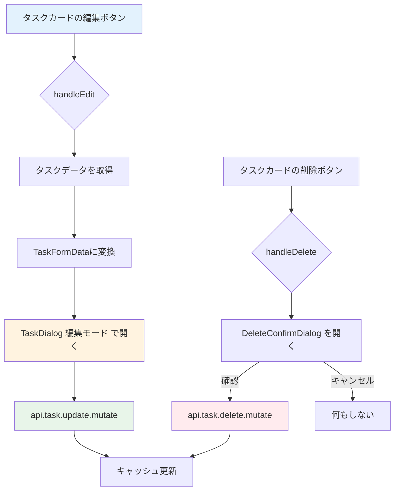
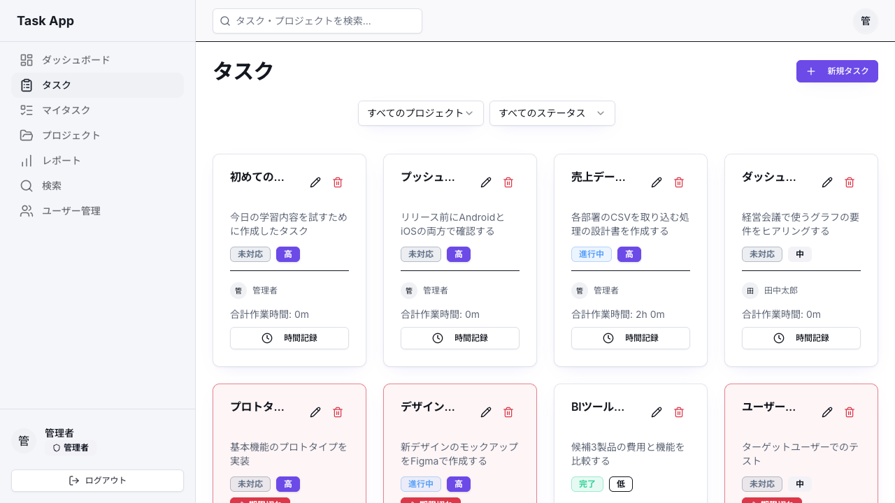

# Day 15: タスク編集・削除を実装しよう

## 前回の振り返り

Day 14 で学んだことは次のとおりです。
- TaskDialog で react-hook-form + zod のバリデーション
- `Controller` による Select 連携
- `useMutation`（データ変更APIのフック）による保存処理

今日は同じダイアログを**編集モード**で再利用して、タスクの編集・削除に取り組みます。

---

## 今日のゴール

これで CRUD の「U（更新）」と「D（削除）」が
揃い、タスク管理の基本操作が完成します。
1つのコンポーネントで作成と編集の両方に対応する
パターンを学びます。

スクリーンショット: タスク編集ダイアログの画面。


## 始める前の前提

- Day 14 のタスク作成ダイアログが動いている
- 編集・削除を試せるタスクが1件以上ある
- `TaskDialog` の新規作成モードを読み返せる
- 削除操作を試すため、消えてもよい練習用タスクを使う

## なぜこれを作るのか

タスクの内容は常に変化します。優先度が上がったり、
担当者が変わったり、期限が延びたりします。

> **例え話**: タスク編集は「付箋の書き直し」
> です。ホワイトボードに貼った付箋の内容を
> 修正したい時、新しい付箋を書くのではなく、
> 元の付箋を剥がして書き直します。
> TaskDialog を再利用するのはまさにこれです。

### 編集・削除の流れ



### やること / やらないこと

| やること | やらないこと |
|---------|-------------|
| TaskDialog を編集モードで再利用 | 新しい編集専用コンポーネント |
| initialData で既存データを渡す | 別ページで編集画面 |
| `api.task.update` で更新 | ステータス変更（Day 16） |
| `api.task.delete` で削除 | 一括削除（Day 28） |

### 新しく学ぶ概念

| 概念 | 読み方 | 役割 | 例え |
|------|--------|------|------|
| initialData | イニシャル・データ | 編集時の初期値 | 書き直す前の付箋の内容 |
| DeleteConfirmDialog | デリート・コンファーム・ダイアログ | 削除確認ダイアログ | 「本当に捨てますか」の確認 |
| update mutation | アップデート・ミューテーション | 更新APIの呼び出し | 付箋を書き直してボードに貼る |

> **今日のゴールライン**: `null` と `undefined` の使い分けが出てくるけど、今日覚えるのは「null = クリアしたい、undefined = 変更しない」の2行だけ。JavaScript の型の深い話は今日は不要。

## 実装ステップ一覧

| ステップ | 作業内容 | 所要時間 |
|---------|---------|---------|
| Step 0 | タスク編集・削除 API（update / delete）を自分で書く | 30分 |
| Step 1 | `defaultValues` + `useEffect(reset)` を理解する | 5分 |
| Step 2 | 編集ハンドラーを実装する | 5分 |
| Step 3 | update mutationを実装する | 5分 |
| Step 4 | update用の送信ハンドラー | 5分 |
| Step 5 | create用の送信ハンドラー | 5分 |
| Step 6 | 削除用のstateとmutationを定義する | 5分 |
| Step 7 | 削除ハンドラーとダイアログを配置する | 5分 |
| Step 8 | 新規作成ハンドラーを実装する | 3分 |
| Step 9 | TaskCardにハンドラーを接続する | 5分 |
| Step 10 | TaskDialogにeditingTaskを渡す | 3分 |
| Step 11 | 動作確認 | 3分 |

**合計時間**: 約79分。

---

### Step 0: タスク編集・削除 API（update / delete）を自分で書く（30分）

**ゴール**: タスクを書き換える `update` と、タスクを消す `delete` を自分で書き、`api.task.update` と `api.task.delete` を呼べる状態にします。この2つは、このあと Step 3・Step 6 で画面から呼び出します。

Day 13 で `getAll`、Day 14 で `create` を書きました。今日はそこへ `update`（書き換え）と `delete`（削除）を足します。`update` は今まででいちばん長い手続きです。長いのは、書き換えという操作が「誰が書き換えてよいか」「途中で別の人が書き換えていないか」まで気を配る必要があるためです。ここが今日のヤマ場なので、少しずつ分けて進めます。

#### 0-1. import に findTaskWithPermission を足す

`update` と `delete` は、対象のタスクを取りつつ「自分が触ってよいタスクか」を確認する共有ヘルパー `findTaskWithPermission` を使います。Day 13・14 で書いた `_helpers/permission` の import 文に、この1行を足して次の形にします。

```typescript
// filepath: src/server/api/routers/task.ts（permission の import に findTaskWithPermission を足した完成形）
import {
  assertMemberPermission,
  findTaskWithPermission,
  getUserProjectIds,
} from './_helpers/permission';
```

`findTaskWithPermission` は「id でタスクを1件取り、そのプロジェクトで自分が指定した権限を持っているかを確認し、無ければ弾く」共有ヘルパーです。`assertMemberPermission` と `getUserProjectIds` は前の Day で足したものなので、新しく行を増やすのではなく、同じ import 文の中に並べます。

#### 0-2. 入力スキーマを足す

書き換える項目を受け取る `taskUpdateSchema` を、`taskRouter` の前（Day 14 の `taskCreateSchema` の近く）に追加します。

```typescript
// filepath: src/server/api/routers/task.ts（taskRouter の前に追加）
const taskUpdateSchema = z.object({
  id: z.string().cuid(),
  expectedUpdatedAt: z.string().datetime().optional(),
  title: z.string().min(1).optional(),
  description: z.string().optional().nullable(),
  status: taskStatusSchema.optional(),
  priority: taskPrioritySchema.optional(),
  dueDate: z.string().datetime().optional().nullable(),
  completedAt: z.string().datetime().optional().nullable(),
  estimatedHours: z.number().min(0).optional().nullable(),
  actualHours: z.number().min(0).optional(),
  projectId: z.string().cuid().optional(),
  assigneeId: z.string().cuid().optional().nullable(),
});
```

`id` を除くほとんどの項目に `.optional()` が付いています。編集では「変えたい項目だけ」を送るので、送られてこなかった項目はそのままにします。`.nullable()` は「空にできる」という意味で、たとえば担当者を外して未割り当てに戻す操作を表します。`expectedUpdatedAt` は少し特別で、これは 0-9 で使う「自分が編集を始めた時点のタスクの更新時刻」です。この値が、あとで説明する「ほかの書き換えとぶつかっていないか」の判定に効いてきます。

#### 0-3. 手続きの骨組みと下ごしらえ

`update` を `create` の直後に足します。まず入力を取り出し、対象のタスクを権限つきで取ってきます。

```typescript
// filepath: src/server/api/routers/task.ts（create の直後に追加）
  update: protectedProcedure.input(taskUpdateSchema).mutation(async ({ ctx, input }) => {
    const { id, expectedUpdatedAt, ...data } = input;

    const existingTask = await findTaskWithPermission(id, ctx.session.userId, 'canEdit');

    // 楽観ロック: ここで updatedAt を比較して即座に CONFLICT を判定しても、
    // 比較と末尾の update の間に他の更新が割り込む余地が残る（TOCTOU）。
    // 比較は末尾の update の where に含め、比較と更新を 1 回のクエリでまとめる。
    const updateData: Prisma.TaskUpdateInput = {};
    if (data.title !== undefined) {
      updateData.title = data.title;
    }
    if (data.description !== undefined) {
      updateData.description = data.description;
    }
```

`const { id, expectedUpdatedAt, ...data } = input` は、入力から `id` と `expectedUpdatedAt` を取り出し、残りの書き換え項目を `data` にまとめる書き方です。`findTaskWithPermission(id, ctx.session.userId, 'canEdit')` で、対象のタスクを取りつつ編集権限を確認します。権限が無ければここで弾かれるので、他人のタスクを書き換える事故を防げます。`updateData` は、このあと「送られてきた項目だけ」を詰めていく入れ物です。`title` と `description` は、値が送られてきたときだけ詰めます。

#### 0-4. ステータスと完了日時を組み立てる

ステータスの変更には、完了日時を合わせて動かす処理が付きます。

```typescript
// filepath: src/server/api/routers/task.ts（続き）
    if (data.status !== undefined) {
      updateData.status = data.status;
      if (data.completedAt === undefined) {
        if (data.status === TASK_STATUS.DONE) {
          updateData.completedAt = new Date();
        } else {
          updateData.completedAt = null;
        }
      }
    }
```

ステータスが送られてきたら、それを詰めます。あわせて、完了日時（`completedAt`）が明示的に送られてきていないときは、ステータスに合わせて自動で決めます。`DONE`（完了）になったら今の時刻を入れ、それ以外に戻ったら `null`（空）にします。こうすると「完了にしたのに完了日時が残っていない」といった食い違いが起きません。

#### 0-5. 残りの項目を詰める

優先度・見積・実績・期限・完了日時を、送られてきたときだけ詰めます。

```typescript
// filepath: src/server/api/routers/task.ts（続き）
    if (data.priority !== undefined) {
      updateData.priority = data.priority;
    }
    if (data.estimatedHours !== undefined) {
      updateData.estimatedHours = data.estimatedHours;
    }
    if (data.actualHours !== undefined) {
      updateData.actualHours = data.actualHours;
    }
    if (data.dueDate !== undefined) {
      updateData.dueDate = data.dueDate ? new Date(data.dueDate) : null;
    }
    if (data.completedAt !== undefined) {
      updateData.completedAt = data.completedAt ? new Date(data.completedAt) : null;
    }

    const isProjectChanging =
      data.projectId !== undefined && data.projectId !== existingTask.projectId;
    const targetProjectId = isProjectChanging ? (data.projectId as string) : existingTask.projectId;
```

前半は 0-3 と同じで、送られてきた項目だけを詰めます。`dueDate` と `completedAt` は、値があれば `new Date(...)` で日付に変換し、空なら `null` にします。最後の2行は、プロジェクトの移動が起きるかどうかを判定しています。`isProjectChanging` は「新しい `projectId` が送られていて、しかも今のプロジェクトと違う」ときだけ真になります。`targetProjectId` は、移動するなら移動先、しないなら今のプロジェクトを指します。

#### 0-6. プロジェクトを移すときの確認

プロジェクトを移す場合は、移動先でも編集権限があるかを確認し、並び順の番号を付け直します。

```typescript
// filepath: src/server/api/routers/task.ts（続き）
    if (isProjectChanging) {
      // 移動先プロジェクトでも canEdit 権限を持つかを確認
      const destinationMember = await prisma.projectMember.findUnique({
        where: {
          userId_projectId: {
            userId: ctx.session.userId,
            projectId: targetProjectId,
          },
        },
      });
      assertMemberPermission(destinationMember ? [destinationMember] : [], 'canEdit');
      updateData.project = { connect: { id: targetProjectId } };
```

移動先のプロジェクトで自分がメンバーかを `findUnique` で調べ、`assertMemberPermission(..., 'canEdit')` で編集権限を確認します。ここを飛ばすと、自分が入っていないプロジェクトへタスクを移し込めてしまいます。権限が確認できたら、`updateData.project = { connect: ... }` で移動先へ付け替えます。

#### 0-7. 移動先での並び順を決める

```typescript
// filepath: src/server/api/routers/task.ts（続き）
      // 位置はプロジェクト単位の連番なので移動先の末尾に付け直す、重複や割り込みを防ぐ
      const maxPosition = await prisma.task.findFirst({
        where: { projectId: targetProjectId },
        orderBy: { position: 'desc' },
        select: { position: true },
      });
      updateData.position = (maxPosition?.position ?? -1) + 1;
    }
```

並び順の番号（`position`）はプロジェクトごとの連番なので、移動したら移動先の末尾に置き直します。Day 14 の `create` と同じく、今いちばん大きい番号を探して1を足します。移動先にタスクが1件も無いときは `?? -1` で -1 として扱い、最初の番号が 0 になります。最後の `}` で、プロジェクト移動のときだけ走るこのまとまりを閉じます。

#### 0-8. 担当者の付け替え

担当者の指定にも、プロジェクト内のメンバーかを確認する処理を入れます。

```typescript
// filepath: src/server/api/routers/task.ts（続き）
    if (data.assigneeId !== undefined) {
      if (data.assigneeId === null) {
        updateData.assignee = { disconnect: true };
      } else {
        await assertTaskAssigneeBelongsToProject(targetProjectId, data.assigneeId);
        updateData.assignee = { connect: { id: data.assigneeId } };
      }
    } else if (isProjectChanging && existingTask.assigneeId) {
      // プロジェクト変更時に既存担当者が新プロジェクトのメンバーでない場合は外す
      const assigneeStillMember = await prisma.projectMember.findUnique({
        where: {
          userId_projectId: {
            userId: existingTask.assigneeId,
            projectId: targetProjectId,
          },
        },
        select: { id: true },
      });
      if (!assigneeStillMember) {
        updateData.assignee = { disconnect: true };
      }
    }
```

担当者が送られてきたときは、`null` なら担当を外し（`disconnect`）、指定があれば Day 14 で作った `assertTaskAssigneeBelongsToProject` でメンバーかを確認してから付けます。担当者の指定が無くても、プロジェクトを移した結果、今までの担当者が移動先のメンバーでなくなることがあります。その場合だけ、後半の `else if` で担当を自動的に外します。

#### 0-9. ここが一番のヤマ場（楽観ロックで書き換える）

最後に DB を書き換えます。ここで、この教材で初めて出てくる楽観ロック（optimistic lock）を使います。

```typescript
// filepath: src/server/api/routers/task.ts（続き）
    try {
      // 比較（read）と更新（write）の間に他の更新が割り込む余地をなくすため、
      // updatedAt を where に含めた単一の update で比較と更新を 1 回のクエリにまとめる。
      // 条件不一致（他ユーザーの更新・削除で updatedAt がずれた）は Prisma が
      // 投げる P2025 を捕捉して CONFLICT に変換する。
      return await prisma.task.update({
        where: expectedUpdatedAt ? { id, updatedAt: new Date(expectedUpdatedAt) } : { id },
        data: updateData,
        include: {
          project: true,
          createdBy: {
            select: USER_SELECT,
          },
          assignee: {
            select: USER_SELECT,
          },
        },
      });
```

楽観ロックとは、「たぶん誰ともぶつからないだろう」と考えて先に書き換えを試し、もしぶつかっていたらそのとき初めて止める、というやり方です。たとえば2人が同じタスクを開いて、片方が先に保存したあと、もう片方が古い内容のまま保存すると、先の変更が上書きで消えてしまいます。これを防ぐため、画面が `expectedUpdatedAt` を送ってきたときだけ、`where` に `updatedAt: new Date(expectedUpdatedAt)` を足します。「自分が編集を始めた時点から、タスクの更新時刻が変わっていないときだけ書き換える」という条件です。送られてこなければ、今までと同じく `id` だけで書き換えます。先にほかの書き換え（別の人の保存だけでなく、自分の時間記録などでも起こります）が入っていれば更新時刻がずれているので、この `update` は対象を見つけられず失敗します。`include` は、書き換えた後のデータを一覧と同じ形（プロジェクト・作成者・担当者つき）で返す指定です。

#### 0-10. ぶつかったときのエラーに変える

```typescript
// filepath: src/server/api/routers/task.ts（続き）
    } catch (err) {
      if (err instanceof Prisma.PrismaClientKnownRequestError && err.code === 'P2025') {
        throw new TRPCError({
          code: 'CONFLICT',
          // 自分自身の別操作（時間記録の追加など）による更新でも起こり得るため、
          // 「他のユーザー」と断定しない文言にする
          message: 'タスクの内容が更新されています。最新の内容を再読み込みしてください',
        });
      }
      throw err;
    }
  }),
```

更新時刻の条件に合わず対象が見つからないと、Prisma は `P2025` というコードのエラーを投げます。それを `catch` で受け取り、`CONFLICT`（ぶつかった）という意味の `TRPCError` に変えて画面へ返します。画面はこの合図を見て「内容が更新されています。読み込み直してください」と伝えられます。`P2025` 以外のエラーは、`throw err` でそのまま上へ伝えます。最後の `}),` で `update` を閉じます。

**確認ポイント**:
- `taskUpdateSchema` を `taskRouter` の前に、`update` を `create` の直後に足した
- `expectedUpdatedAt` があるときは `where` に `updatedAt` を含めて、書き換えのぶつかりを1回のクエリで判定している
- `npm run dev` で型エラーが出ていない

#### 0-11. delete を書く

最後に、タスクを消す `delete` を `update` の直後に足します。

```typescript
// filepath: src/server/api/routers/task.ts（update の直後に追加）
  delete: protectedProcedure
    .input(z.object({ id: z.string().cuid() }))
    .mutation(async ({ ctx, input }) => {
      const task = await findTaskWithPermission(input.id, ctx.session.userId);
      assertMemberPermission(task.project.members, 'canDelete');

      await prisma.task.delete({
        where: { id: input.id },
      });
      return { success: true };
    }),
```

`delete` はまず `findTaskWithPermission` で対象のタスクを取り、`assertMemberPermission(task.project.members, 'canDelete')` で削除権限を確認します。編集はできても削除はできない、という権限の分け方があるため、`update` の `'canEdit'` とは別に `'canDelete'` を確認します。権限が通ったら `prisma.task.delete` で1件消し、`{ success: true }` を返して「消せた」と画面へ伝えます。

**確認ポイント**:
- `delete` を `update` の直後に足した
- `'canDelete'` 権限を確認してから `prisma.task.delete` を呼んでいる
- `npm run dev` で型エラーが出ていない

---

### Step 1: `defaultValues` + `useEffect(reset)` を理解する（5分）

**ゴール**: `useForm` の `defaultValues` と
`useEffect(reset(...))`（描画後に副作用を走らせるフック）が
どのように編集モードを実現するかを理解します。

**実装**:

Day 14 の Step 3 で、TaskDialog に以下の設定を
書きました。

```typescript
// filepath: src/component/task/task-dialog.tsx
function buildTaskFormValues(
  initialData: TaskFormData | undefined,
  projects: Array<{
    id: string; name: string;
  }>,
) {
  return {
    id: initialData?.id,
    title: initialData?.title ?? '',
    description:
      initialData?.description ?? '',
    status: initialData?.status
      ?? TASK_STATUS.TODO,
    priority: initialData?.priority
      ?? TASK_PRIORITY.MEDIUM,
    dueDate: initialData?.dueDate ?? '',
    estimatedHours:
      initialData?.estimatedHours,
    projectId: initialData?.projectId
      ?? (projects[0]?.id || ''),
    assigneeId:
      initialData?.assigneeId ?? '',
  };
}
```

```typescript
// filepath: src/component/task/task-dialog.tsx
// useForm の初期値と reset 同期
const { register, handleSubmit, control,
  reset, formState: { errors },
} = useForm<TaskFormValues>({
  resolver: zodResolver(taskFormSchema),
  defaultValues:
    buildTaskFormValues(
      initialData,
      projects
    ),
});

useEffect(() => {
  if (!open) return;
  reset(buildTaskFormValues(
    initialData,
    projects
  ));
}, [initialData, open, projects, reset]);
```

> 現在の `TaskDialog` は `useForm({ defaultValues })`
> で初期値を作り、`initialData` や `projects` が
> 変わった時だけ `useEffect(reset(...))` で
> フォームを同期します。`useForm({ values })` は
> 使っていません。
>
> `useEffect` の末尾にある
> `[initialData, open, projects, reset]` が依存配列
> （useEffectを再実行する条件の配列）です。この中の
> 値が変わったときだけ、`reset` でフォームを
> 作り直します。

**作成モード vs 編集モードの比較**

| 項目 | 作成モード | 編集モード |
|------|----------|----------|
| initialData | `undefined` | 既存タスクデータ |
| タイトル | 空の初期値 | 既存のタイトル |
| ボタン表示 | 「作成」 | 「更新」 |
| API呼び出し | `task.create` | `task.update` |

**確認ポイント**:
- `defaultValues` で初期値を作る仕組みを理解した
- `useEffect(reset(...))` で編集データを同期する流れを理解した

---

### Step 2: 編集ハンドラーを実装する（5分）

**ゴール**: タスクデータを `TaskFormData` に
変換して、ダイアログに渡します。

**実装**:

```typescript
// filepath: src/app/task/page.tsx
// taskToFormDataのインポートを追加
import { taskToFormData } from
  '@/lib/task-form';
```

```typescript
// filepath: src/app/task/page.tsx
// editingTask は Day 14 で定義済み
const handleEdit = (taskId: string) => {
  const task =
    tasks?.find((t) => t.id === taskId);
  if (task) {
    // タスクをフォーム用のデータに変換
    setEditingTask(taskToFormData(task));
    setDialogOpen(true);
  }
};
```

> `taskToFormData` はタスクデータを
> `TaskFormData` 形式に変換するユーティリティ
> 関数です（`src/lib/task-form.ts`）。
> 日付の `YYYY-MM-DD` 変換などを共通化して
> いるため、各ページで手動変換する必要が
> ありません。

**確認ポイント**:
- `taskToFormData` のインポートを追加できた
- `handleEdit` 関数が定義できた

スクリーンショット: 編集モードのタスクダイアログ（既存データが入っている）


---

### Step 3: update mutationを実装する（5分）

**ゴール**: タスクの更新APIを呼ぶ処理を追加
します。

**実装**:

```typescript
// filepath: src/app/task/page.tsx
import toast from 'react-hot-toast';
```

```typescript
// filepath: src/app/task/page.tsx
// タスク更新用のmutation
const updateMutation =
  api.task.update.useMutation({
    onSuccess: () => {
      // 一覧のキャッシュを更新
      utils.task.getAll.invalidate();
      // 詳細画面が開いている場合のみ更新
      if (selectedTask) {
        utils.task.getById.invalidate(
          { id: selectedTask }
        );
      }
      setDialogOpen(false);
    },
    onError: (error) => {
      toast.error(error.message);
    },
  });
```

> 更新は自分の入力ミス以外でも失敗します。たとえば
> 同じタスクを別の人が先に更新していた場合、
> サーバーは競合（CONFLICT）エラーを返します。
> `onError` でそのメッセージを toast（画面隅に出る
> 通知）に表示して、保存されなかったことに
> 気づけるようにします。
>
> `invalidate` は「キャッシュ（取得済みデータの一時保存）を
> 無効化して再取得する」命令です。一覧（`getAll`）を必ず
> 更新し、詳細画面（`getById`）は
> `selectedTask` がある場合のみ更新します。

#### invalidate の動作

| メソッド | 効果 | タイミング |
|---------|------|----------|
| `utils.task.getAll.invalidate()` | 一覧を再取得 | 常に実行 |
| `utils.task.getById.invalidate()` | 詳細を再取得 | 詳細表示中のみ |

**確認ポイント**:
- `npm run dev` でエラーが出ていない
- mutationが定義できた

---

### Step 4: update用の送信ハンドラー（5分）

**ゴール**: 既存タスクの更新処理を実装します。

**実装**:

`data.id` があれば編集モードと判断し、
`updateMutation` を呼びます。

```typescript
// filepath: src/app/task/page.tsx
import { dateOnlyToUtcStartIso }
  from '@/lib/date';
```

```typescript
// filepath: src/app/task/page.tsx
const handleSubmit =
  (data: TaskFormData) => {
    if (data.id) {
      updateMutation.mutate({
        id: data.id,
        title: data.title,
        description:
          data.description || null,
        status: data.status,
        priority: data.priority,
        dueDate: data.dueDate
          ? dateOnlyToUtcStartIso(data.dueDate)
          : null,
        estimatedHours:
          data.estimatedHours ?? null,
        projectId: data.projectId,
        assigneeId:
          data.assigneeId || null,
```

**確認ポイント**: ここまで写経できました。次のブロックを続けて書きます。

```typescript
// filepath: 続き
        expectedUpdatedAt:
          data.expectedUpdatedAt,
      });
      return;
    }
    // ↑ここまでが更新分岐
    // ↓Step 5で新規作成分岐を追加する
```

> `data.id` の有無で作成か編集かを判断します。
> 編集モードでは `initialData` に既存データが
> 入っているので `data.id` が存在します。

> `expectedUpdatedAt` には編集画面を開いた時点の
> 更新日時が入っています。サーバーはこの値と DB の
> `updatedAt` を比べ、一致しなければ CONFLICT
> エラーを返します。先に画面を開いた人が、あとから
> 保存して他の人の変更を黙って上書きする事故を
> 防ぐ仕組みです。

#### null と undefined の使い分け

| 値 | 意味 | 使い方 |
|----|------|--------|
| `null` | 「値をクリアしたい」 | `description: null` → 説明を空にする |
| `undefined` | 「この項目は変更しない」 | 送信しないフィールドはそのまま |

> たとえば、タスクの説明を空にしたいときは
> `null` を渡します。一方、説明を変更しない
> ときは `undefined`（=送信しない）にします。
> 更新APIは「送られたフィールドだけ更新」する
> 部分更新方式です。
>
> **今日のゴールライン**: null と undefined の違いは「消したい vs 触らない」だけ覚えたら OK。実務では毎日使うから、今日のコードを書いてるうちに手が覚えます。

**確認ポイント**:
- `data.id` がある場合に `updateMutation.mutate` を呼んでいる
- `null` と `undefined` の違いを理解した

---

### Step 5: create用の送信ハンドラー（5分）

**ゴール**: 新規作成の分岐を追加して
`handleSubmit` を完成させます。

**実装**:

`data.id` がない場合は新規作成です。
Day 14 で実装した `createMutation` を使います。

```typescript
// filepath: src/app/task/page.tsx
// handleSubmitの続き: 新規作成分岐
    if (!session?.user?.id) return;
    createMutation.mutate({
      title: data.title,
      description: data.description,
      status: data.status,
      priority: data.priority,
      projectId: data.projectId,
      dueDate: data.dueDate
        ? dateOnlyToUtcStartIso(
            data.dueDate
          )
        : undefined,
      estimatedHours:
        data.estimatedHours ?? undefined,
      assigneeId:
        data.assigneeId || undefined,
    });
  };
```

#### 作成 vs 更新のAPIパラメータ比較

| パラメータ | create | update |
|-----------|--------|--------|
| `id` | なし | **必須** |
| `title` | **必須** | 常に送信 |
| `projectId` | **必須** | 常に送信 |
| `description` | 任意 | 任意（null可） |
| `dueDate` | 任意 | 任意（null可） |

**確認ポイント**:
- 既存タスクを編集して更新できる
- 一覧が自動で更新される

---

### Step 6: 削除用のstateとmutationを定義する（5分）

**ゴール**: 削除確認に使うstate（Reactが再描画のために覚える値）と
削除APIのmutationを定義します。

**実装**:

```typescript
// filepath: src/app/task/page.tsx
import { DeleteConfirmDialog } from
  '@/component/ui/delete-confirm-dialog';
```

```typescript
// filepath: src/app/task/page.tsx
// 削除用のstateとmutation
const [deleteDialogOpen, setDeleteDialogOpen]
  = useState(false);
const [deleteTargetId, setDeleteTargetId]
  = useState<string | null>(null);

const deleteMutation =
  api.task.delete.useMutation({
    onSuccess: () => {
      // 一覧のキャッシュを更新
      utils.task.getAll.invalidate();
    },
  });
```

> `window.confirm()` ではなく
> `DeleteConfirmDialog` コンポーネントを使います。
> (1) アプリ全体のUIに統一感が出る
> (2) ボタンのテキストをカスタマイズできる
> (3) `isPending`（mutation実行中フラグ）中の二重クリックを防止できる

**確認ポイント**:
- `DeleteConfirmDialog` のインポートを追加できた
- stateとmutationが定義できた

---

### Step 7: 削除ハンドラーとダイアログを配置する（5分）

**ゴール**: 削除ボタンのハンドラーと確認
ダイアログをJSXに配置します。

**実装**:

```typescript
// filepath: src/app/task/page.tsx
// 削除ボタンのハンドラー
const handleDelete = (taskId: string) => {
  setDeleteTargetId(taskId);
  setDeleteDialogOpen(true);
};
```

続いて、JSXの閉じタグ付近に
`DeleteConfirmDialog` を配置します。

```typescript
// filepath: src/app/task/page.tsx
// 確認ダイアログの配置
<DeleteConfirmDialog
  open={deleteDialogOpen}
  onOpenChange={setDeleteDialogOpen}
  onConfirm={() => {
    if (deleteTargetId) {
      deleteMutation.mutate(
        { id: deleteTargetId }
      );
    }
  }}
  isPending={deleteMutation.isPending}
/>
```

> `open` と `onOpenChange` でダイアログの表示を
> `deleteDialogOpen` に結びつけ、`onConfirm` は
> 確認ボタンを押したときだけ削除を実行します。
> だから、いきなり消えずに削除の確認を
> 一度はさめます。

**確認ポイント**:
- 削除ボタンで確認ダイアログが出る
- 確認ボタンでタスクが削除される
- キャンセルで何も起こらない

スクリーンショット: 削除確認ダイアログの画面。


---

### Step 8: 新規作成ハンドラーを実装する（3分）

**ゴール**: 「新規タスク」ボタンのハンドラーを
実装します。

**実装**:

```typescript
// filepath: src/app/task/page.tsx
// editingTaskをundefinedにして作成モードで開く
const handleCreate = () => {
  setEditingTask(undefined);
  setDialogOpen(true);
};
```

> `handleCreate` は `editingTask` を
> `undefined` にしてから開きます。
> これで「作成モード」になります。
> `handleEdit` は既存データをセットしてから
> 開くので「編集モード」になります。

**確認ポイント**:
- `handleCreate` で `editingTask` を `undefined` にしている
- 作成モードと編集モードの切り替えを理解した

---

### Step 9: TaskCardにハンドラーを接続する（5分）

**ゴール**: Day 13 で配置した TaskCard に
ハンドラーを接続します。

**実装**:

```typescript
// filepath: src/app/task/page.tsx
// TaskCardにハンドラーを接続
<TaskCard
  key={task.id}
  id={task.id}
  title={task.title}
  description={task.description}
  status={task.status}
  priority={task.priority}
  dueDate={task.dueDate}
  assignee={task.assignee}
  onEdit={handleEdit}
  onDelete={handleDelete}
  onClick={handleTaskClick}
  canEdit={canEditProject(task.projectId)}
  canDelete={canDeleteProject(task.projectId)}
/>
```

> `onEdit` と `onDelete` に関数を渡すと、カード内の
> 編集ボタン・削除ボタンが押されたときに、その関数が
> `task.id` を受け取って呼ばれます。ボタンの見た目は
> `TaskCard`、実際の処理は親ページ、と役割が分かれます。
>
> `canEdit` / `canDelete` は Day 13 で定義した
> `canEditProject` / `canDeleteProject` をそのまま使います。
> 閲覧者（VIEWER）ロールのプロジェクトでは両方 `false` になり、
> 編集・削除ボタンが表示されません。渡し忘れるとデフォルトの
> `true` が使われ、ボタンを押しても403エラーになるので注意してください。
>
> `TaskCard` には作業時間まわりの optional な props も
> あります。`timeSpentMinutes`（合計作業時間）と
> `onTimeLogSuccess`（記録成功時のコールバック）の 2 つです。
> これらは Day 16 で扱います。

**確認ポイント**:
- `onEdit` に `handleEdit` を渡している
- `onDelete` に `handleDelete` を渡している

---

### Step 10: TaskDialogにeditingTaskを渡す（3分）

**ゴール**: ダイアログに `editingTask` を渡して
編集モードを有効にします。

**実装**:

```typescript
// filepath: src/app/task/page.tsx
// ダイアログにeditingTaskを渡す
<TaskDialog
  open={dialogOpen}
  onClose={() => setDialogOpen(false)}
  onSubmit={handleSubmit}
  initialData={editingTask}
  projects={projects ?? []}
/>
```

> `initialData` に `editingTask` を渡すと、Step 1 の
> `buildTaskFormValues` がその値をフォームの初期値に
> 使うので、編集モードになります。`editingTask` が
> `undefined` のときは空の初期値になり、作成モードに
> なります。

**確認ポイント**:
- 「新規タスク」で作成モードが開く
- カードの編集ボタンで編集モードが開く
- カードの削除ボタンで確認→削除される

スクリーンショット: 編集後のタスク一覧画面。


---

### Step 11: 動作確認（3分）

**ゴール**: 編集・削除の全機能を確認します。

1. タスクカードの編集ボタンをクリック
2. タイトルや優先度を変更して「更新」
3. 一覧に変更が反映される
4. 別のタスクの削除ボタンをクリック
5. 確認ダイアログで「OK」
6. タスクが一覧から消える

**確認ポイント**:
- 編集後にダイアログが閉じる
- 削除後に一覧が更新される
- 「新規タスク」で空のフォームが開く

---

```bash
# filepath: ターミナル
# 開発サーバーを起動して動作確認
PORT=3001 npm run dev
```


---

### Pro パターンで書こう（編集後の一覧更新を楽観的に反映する）

編集後の一覧更新は動きますが、保存が終わるまで画面は古い内容のままです。そこで、保存の完了を待たずに結果を先に画面へ反映し、もし保存が失敗したら元の状態へ戻す楽観的更新を使うと、待ち時間を感じさせなくできます。
なぜ上の書き方をするのか、**Before/After** で見比べてみましょう。

#### Before（改善前のコード）

```typescript
import { dateOnlyToUtcStartIso } from '@/lib/date';
import { api } from '@/trpc/react';
import type { TaskFormData } from '@/component/task/task-dialog';

const utils = api.useUtils();

const updateMutation =
  api.task.update.useMutation({
    onSuccess: () => {
      utils.task.getAll.invalidate();
      if (selectedTask) {
        utils.task.getById.invalidate({
          id: selectedTask,
        });
      }
      setDialogOpen(false);
    },
  });

const handleSubmit = (data: TaskFormData) => {
  if (!data.id) return;

  updateMutation.mutate({
    id: data.id,
```

**読み比べ用**: ここは写経しません。続けてコードを読み進めましょう。

```typescript
// filepath: 続き
    title: data.title,
    description: data.description || null,
    status: data.status,
    priority: data.priority,
    dueDate: data.dueDate
      ? dateOnlyToUtcStartIso(data.dueDate)
      : null,
    estimatedHours: data.estimatedHours ?? null,
    assigneeId: data.assigneeId || null,
  });
};
```

**このコードの問題点**:

- 保存が成功するまで、画面上の一覧は古いタイトルや優先度のまま残る
- 毎回 `invalidate()` で再取得するだけなので、通信が遅いと「保存できたのか」が分かりにくい
- 失敗時の戻し方を決めていないため、あとから楽観的更新を足すと差分管理が難しくなる

#### After（プロが書くコード）

```typescript
import { dateOnlyToUtcStartIso } from '@/lib/date';
import { api } from '@/trpc/react';
import type { TaskFormData } from '@/component/task/task-dialog';

const utils = api.useUtils();
const taskListInput = {
  projectId: filterProject === 'all'
    ? undefined
    : filterProject,
  status: filterStatus === 'all'
    ? undefined
    : filterStatus,
};

const { data: tasks } = api.task.getAll.useQuery(
  taskListInput,
  { refetchOnWindowFocus: false },
);

const updateMutation =
  api.task.update.useMutation({
    onMutate: async (updatedTask) => {
      await utils.task.getAll.cancel(
        taskListInput,
```

**読み比べ用**: ここは写経しません。続けてコードを読み進めましょう。

```typescript
// filepath: 続き
      );

      const previousTasks =
        utils.task.getAll.getData(taskListInput);

      utils.task.getAll.setData(
        taskListInput,
        (oldTasks) =>
          oldTasks?.map((task) =>
            task.id === updatedTask.id
              ? {
                  ...task,
                  title:
                    updatedTask.title ?? task.title,
                  description:
                    updatedTask.description
                    ?? task.description,
                  status:
                    updatedTask.status ?? task.status,
                  priority:
                    updatedTask.priority
                    ?? task.priority,
                  dueDate:
                    updatedTask.dueDate === undefined
```

**読み比べ用**: ここは写経しません。続けてコードを読み進めましょう。

```typescript
// filepath: 続き
                      ? task.dueDate
                      : updatedTask.dueDate
                        ? new Date(updatedTask.dueDate)
                        : null,
                  estimatedHours:
                    updatedTask.estimatedHours
                    ?? task.estimatedHours,
                  assigneeId:
                    updatedTask.assigneeId
                    ?? task.assigneeId,
                }
              : task,
          ),
      );

      return { previousTasks };
    },
    onError: (_error, _updatedTask, context) => {
      utils.task.getAll.setData(
        taskListInput,
        context?.previousTasks,
      );
    },
    onSettled: () => {
```

**読み比べ用**: ここは写経しません。続けてコードを読み進めましょう。

```typescript
// filepath: 続き
      utils.task.getAll.invalidate(
        taskListInput,
      );
      if (selectedTask) {
        utils.task.getById.invalidate({
          id: selectedTask,
        });
      }
      setDialogOpen(false);
    },
  });

const handleSubmit = (data: TaskFormData) => {
  if (!data.id) return;

  updateMutation.mutate({
    id: data.id,
    title: data.title,
    description: data.description || null,
    status: data.status,
    priority: data.priority,
    dueDate: data.dueDate
      ? dateOnlyToUtcStartIso(data.dueDate)
      : null,
```

**読み比べ用**: ここは写経しません。続けてコードを読み進めましょう。

```typescript
// filepath: 続き
    estimatedHours: data.estimatedHours ?? null,
    assigneeId: data.assigneeId || null,
  });
};
```

**このコードの強み**:

- 保存ボタンを押した直後に一覧の表示が変わるので、編集体験が軽く感じられる
- 失敗したら `previousTasks` に戻せるため、楽観的更新でも壊れた表示を残しにくい
- 最後に `invalidate()` も行うので、サーバーが返す正しいデータと最終的に同期できる

#### 覚えておきたいエッセンス

`invalidate()` だけでも正しいです。でも編集UIでは、先にキャッシュを更新してから最後に再同期すると体験が一段よくなります。
楽観的更新は「先に見せる」「失敗したら戻す」「最後に確認する」の3点セットで考えます。

## 今日のまとめ

- [ ] TaskDialog を編集モードで再利用できた
- [ ] `initialData` で既存データを渡せた
- [ ] `api.task.update` でタスクを更新できた
- [ ] `api.task.delete` で削除できた
- [ ] `DeleteConfirmDialog` で確認ダイアログを表示できた

## つまずきポイント

| エラー / 問題 | 原因 | 解決方法 |
|--------------|------|---------|
| 編集が反映されない | invalidate忘れ | `onSuccess` に追加 |
| 日付がずれる | date-only変換ミス | `dateOnlyToUtcStartIso()` で UTC（世界協定時、タイムゾーンの基準）の開始時刻にそろえる |
| 削除が即実行される | 確認ダイアログ未実装 | `DeleteConfirmDialog` を配置 |
| 前回の値が残る | フォーム同期不足 | `defaultValues` と `useEffect(reset(...))` を確認 |

## 今日学んだ用語

| 用語 | 意味 |
|------|------|
| initialData | ダイアログの初期値。編集モードの鍵 |
| DeleteConfirmDialog | 削除前の確認ダイアログコンポーネント |
| null vs undefined | nullは「クリア」、undefinedは「変更なし」 |
| dateOnlyToUtcStartIso() | `YYYY-MM-DD` を UTC の 00:00:00.000Z に変換 |
| invalidate | キャッシュを無効化して最新データを再取得 |

## 次回予告

Day 16 では、タスクのステータス変更と作業時間の
記録を実装します。手動で作業時間を記録して、
プロジェクトの工数管理ができるようになります。
