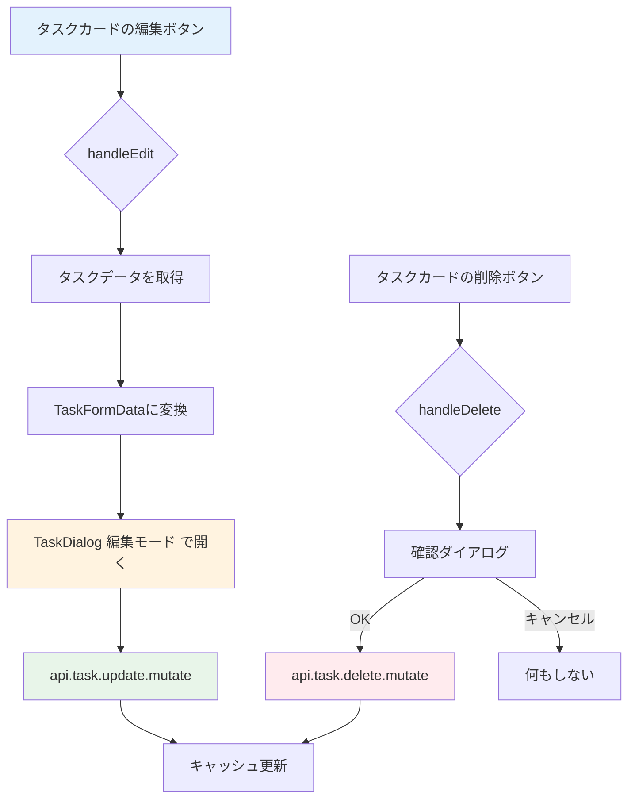

# Day 15: タスク編集・削除を実装しよう

## 🎯 今日のゴール

Day 14 で作った TaskDialog を「編集モード」で
再利用し、タスクの編集・削除ができるようにします。
1つのコンポーネントで作成と編集の両方に対応する
パターンを学びます。


## 🤔 なぜこれを作るのか？

タスクの内容は常に変化します。優先度が上がったり、
担当者が変わったり、期限が延びたりします。

> 💡 **例え話**: タスク編集は「付箋の書き直し」
> です。ホワイトボードに貼った付箋の内容を
> 修正したい時、新しい付箋を書くのではなく、
> 元の付箋を剥がして書き直します。
> TaskDialog を再利用するのはまさにこれです。

### 📐 編集・削除の流れ



### やること / やらないこと

| やること | やらないこと |
|---------|-------------|
| TaskDialog を編集モードで再利用 | 新しい編集専用コンポーネント |
| initialData で既存データを渡す | 別ページで編集画面 |
| `api.task.update` で更新 | ステータス変更（Day 16） |
| `api.task.delete` で削除 | 一括削除 |

### 🆕 新しく学ぶ概念

| 概念 | 読み方 | 役割 | 例え |
|------|--------|------|------|
| initialData | イニシャル・データ | 編集時の初期値 | 書き直す前の付箋の内容 |
| confirm | コンファーム | 確認ダイアログ | 「本当に捨てますか？」の確認 |
| update mutation | アップデート・ミューテーション | 更新APIの呼び出し | 付箋を書き直してボードに貼る |

## 📊 実装ステップ一覧

| ステップ | 作業内容 | 所要時間 |
|---------|---------|---------|
| Step 1 | useEffectでフォームリセット | 5分 |
| Step 2 | 編集ハンドラーを実装する | 5分 |
| Step 3 | update mutationを実装する | 5分 |
| Step 4 | 送信ハンドラーで分岐する | 5分 |
| Step 5 | 削除ハンドラーを実装する | 5分 |
| Step 6 | TaskCardに編集・削除を接続 | 5分 |
| Step 7 | 動作確認 | 3分 |

**合計時間**: 約33分

---

### Step 1: useEffectでフォームリセット（5分）

🎯 **ゴール**: ダイアログが開くたびにフォームの
初期値をセットします。

💻 **実装**:

```typescript
// filepath: src/component/task/task-dialog.tsx
import { useEffect, useState } from 'react';

// TaskDialog内に追加
useEffect(() => {
  if (initialData) {
    setFormData({ ...initialData });
  } else {
    setFormData({
      title: '',
      description: '',
      status: 'TODO',
      priority: 'MEDIUM',
      projectId: projects[0]?.id || '',
      assigneeId: '',
    });
  }
}, [initialData, projects]);
```

✅ **確認ポイント**:
- 作成時はフォームが空になる
- 編集時は既存データが表示される

> 💡 `initialData` がある場合は編集モード、
> ない場合は作成モードです。Day 10 の
> ProjectDialog で学んだパターンと同じです。

#### 作成モード vs 編集モードの比較

| 項目 | 作成モード | 編集モード |
|------|----------|----------|
| initialData | `undefined` | 既存タスクデータ |
| タイトル | 空の初期値 | 既存のタイトル |
| ボタン表示 | 「作成」 | 「更新」 |
| API呼び出し | `task.create` | `task.update` |

✅ **確認ポイント**:
- 作成時はフォームが空になる
- 編集時は既存データが表示される

---

### Step 2: 編集ハンドラーを実装する（5分）

🎯 **ゴール**: タスクデータを `TaskFormData` に
変換して、ダイアログに渡します。

💻 **実装**:

```typescript
// filepath: src/app/task/page.tsx
// users は Day 14 Step 8 で取得済み
const [editingTask, setEditingTask] =
  useState<TaskFormData | undefined>();

const handleEdit = (taskId: string) => {
  const task =
    tasks?.find((t) => t.id === taskId);
  if (!task) return;
  const dueDate = task.dueDate
    ? new Date(task.dueDate)
        .toISOString()
        .split('T')[0]
    : undefined;
```

```typescript
// filepath: src/app/task/page.tsx
// handleEdit 続き: TaskFormDataに変換
  setEditingTask({
    id: task.id,
    title: task.title,
    description: task.description || '',
    status: task.status,
    priority: task.priority,
    projectId: task.projectId,
    ...(dueDate && { dueDate }),
    ...(task.estimatedHours
      && { estimatedHours:
        task.estimatedHours }),
    ...(task.assigneeId
      && { assigneeId: task.assigneeId }),
  });
  setDialogOpen(true);
};
```

> 💡 `dueDate` は `Date` オブジェクトをISO文字列
> に変換し、`T` 以前の部分（YYYY-MM-DD）だけ
> 取り出します。`<input type="date">` が
> この形式を期待するためです。

✅ **確認ポイント**:
- 編集ボタンでダイアログが開く
- 既存データがフォームに表示される


---

### Step 3: update mutationを実装する（5分）

🎯 **ゴール**: タスクの更新APIを呼ぶ処理を追加
します。

💻 **実装**:

```typescript
// filepath: src/app/task/page.tsx
const updateMutation =
  api.task.update.useMutation({
    onSuccess: () => {
      utils.task.getAll.invalidate();
      if (selectedTask) {
        utils.task.getById.invalidate(
          { id: selectedTask }
        );
      }
      setDialogOpen(false);
    },
  });
```

> 💡 `getAll` と `getById` の両方を
> `invalidate` しています。一覧と詳細の
> 両方に最新データを反映するためです。

✅ **確認ポイント**:
- `npm run dev` でエラーが出ていない
- mutationが定義できた

---

### Step 4: 送信ハンドラーで分岐する（5分）

🎯 **ゴール**: 作成と編集を1つのハンドラーで
処理します。

💻 **実装**:

```typescript
// filepath: src/app/task/page.tsx
const handleSubmit =
  (data: TaskFormData) => {
    if (data.id) {
      updateMutation.mutate({
        id: data.id,
        title: data.title,
        description:
          data.description || null,
        status: data.status,
        priority: data.priority,
        dueDate: data.dueDate
          ? new Date(data.dueDate)
              .toISOString()
          : null,
        estimatedHours:
          data.estimatedHours ?? null,
        assigneeId:
          data.assigneeId || null,
      });
    } else {
      // 作成処理（Day 14で実装済み）
    }
  };
```

✅ **確認ポイント**:
- 既存タスクを編集して更新できる
- 一覧が自動で更新される

#### 作成 vs 更新のAPIパラメータ比較

| パラメータ | create | update |
|-----------|--------|--------|
| `id` | なし | **必須** |
| `title` | **必須** | 任意 |
| `projectId` | **必須** | なし |
| `description` | 任意 | 任意（null可） |
| `dueDate` | 任意 | 任意（null可） |

> 💡 `data.id` の有無で作成か編集かを判断します。
> `null` を渡すと値をクリアできます。
> `undefined` は「変更しない」を意味します。

✅ **確認ポイント**:
- 既存タスクを編集して更新できる
- 一覧が自動で更新される

---

### Step 5: 削除ハンドラーを実装する（5分）

🎯 **ゴール**: 確認ダイアログ付きの削除処理を
実装します。

💻 **実装**:

```typescript
// filepath: src/app/task/page.tsx
const deleteMutation =
  api.task.delete.useMutation({
    onSuccess: () => {
      utils.task.getAll.invalidate();
    },
  });

const handleDelete = (taskId: string) => {
  if (confirm(
    'このタスクを削除してもよろしいですか？'
  )) {
    deleteMutation.mutate({ id: taskId });
  }
};
```

> 💡 `confirm()` はブラウザ標準の確認ダイアログ
> です。ユーザーが「OK」を押すと `true` が
> 返ります。削除のような取り消せない操作には
> 必ず確認を入れましょう。

✅ **確認ポイント**:
- 削除ボタンで確認ダイアログが出る
- 「OK」でタスクが削除される
- 「キャンセル」で何も起こらない

---

### Step 6: TaskCardに編集・削除を接続（5分）

🎯 **ゴール**: Day 13 で配置した TaskCard に
ハンドラーを接続します。

💻 **実装**:

```typescript
// filepath: src/app/task/page.tsx
// 新規作成ボタンのハンドラー
const handleCreate = () => {
  setEditingTask(undefined);
  setDialogOpen(true);
};
```

```typescript
// filepath: src/app/task/page.tsx
// TaskCardにハンドラーを接続
<TaskCard
  key={task.id}
  id={task.id}
  title={task.title}
  description={task.description}
  status={task.status}
  priority={task.priority}
  dueDate={task.dueDate}
  assignee={task.assignee}
  onEdit={handleEdit}
  onDelete={handleDelete}
  onClick={handleTaskClick}
/>
```

> 💡 `TaskCard`にはタイマー関連のoptional props（`isTimerActive`, `timerStartedAt`, `timeSpentMinutes`, `onTimerUpdate`）もあります。これらはDay 16で実装します。

続けて、ダイアログに `editingTask` を渡して編集モードを有効にします。

```typescript
// filepath: src/app/task/page.tsx
// ダイアログにeditingTaskを渡す
<TaskDialog
  open={dialogOpen}
  onClose={() => setDialogOpen(false)}
  onSubmit={handleSubmit}
  initialData={editingTask}
  projects={projects || []}
  users={users || []}
/>
```

> 💡 `handleCreate` は `editingTask` を
> `undefined` にしてから開きます。
> これで「作成モード」になります。
> `handleEdit` は既存データをセットしてから
> 開くので「編集モード」になります。

✅ **確認ポイント**:
- 「新規タスク」で作成モードが開く
- カードの編集ボタンで編集モードが開く
- カードの削除ボタンで確認→削除される


---

### Step 7: 動作確認（3分）

🎯 **ゴール**: 編集・削除の全機能を確認します。

1. タスクカードの編集ボタンをクリック
2. タイトルや優先度を変更して「更新」
3. 一覧に変更が反映される
4. 別のタスクの削除ボタンをクリック
5. 確認ダイアログで「OK」
6. タスクが一覧から消える

✅ **確認ポイント**:
- 編集後にダイアログが閉じる
- 削除後に一覧が更新される
- 「新規タスク」で空のフォームが開く

---

```bash
# filepath: ターミナル
# 開発サーバーを起動して動作確認
npm run dev
```

## 📋 今日のまとめ

- [ ] TaskDialog を編集モードで再利用できた
- [ ] `initialData` で既存データを渡せた
- [ ] `api.task.update` でタスクを更新できた
- [ ] `api.task.delete` で削除できた
- [ ] `confirm()` で確認ダイアログを表示できた

## ⚠️ つまずきポイント

| エラー / 問題 | 原因 | 解決方法 |
|--------------|------|---------|
| 編集が反映されない | invalidate忘れ | `onSuccess` に追加 |
| 日付がずれる | Date変換ミス | `split('T')[0]`で日付部分取得 |
| 削除が即実行される | confirm未使用 | `if (confirm(...))` を追加 |
| 前回の値が残る | useEffectリセット漏れ | 依存配列に `initialData` |

## 📝 今日学んだ用語

| 用語 | 意味 |
|------|------|
| initialData | ダイアログの初期値。編集モードの鍵 |
| confirm() | ブラウザ標準の確認ダイアログ |
| null vs undefined | nullは「クリア」、undefinedは「変更なし」 |
| toISOString() | 日付をISO 8601形式の文字列に変換 |

## 🔜 次回予告

Day 16 では、タスクのステータス変更とタイマー
機能を実装します。作業時間の計測で、プロジェクト
の工数管理ができるようになります。
