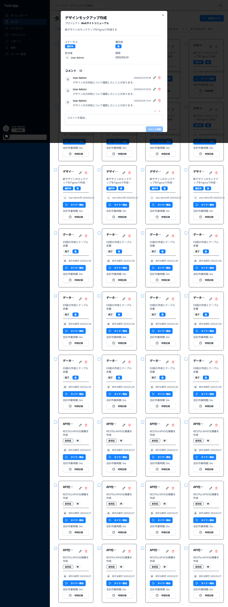
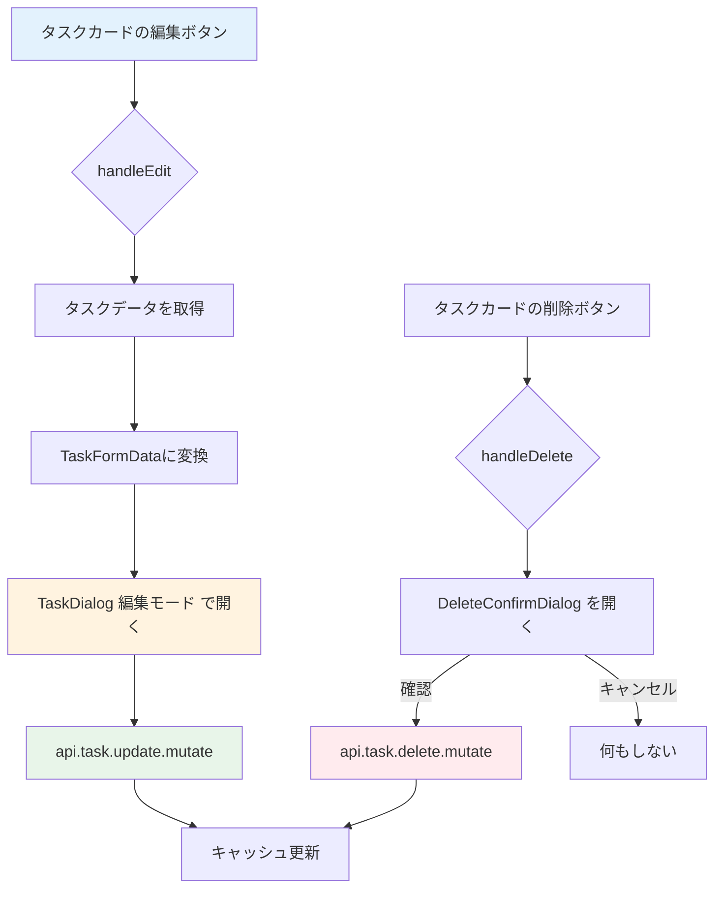
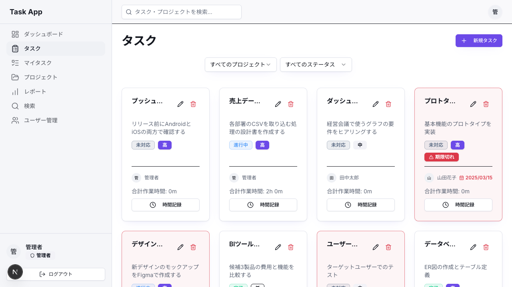

# Day 15: タスク編集・削除を実装しよう

## 前回の振り返り

Day 14 で学んだことは次のとおりです。
- TaskDialog で react-hook-form + zod のバリデーション
- `Controller` による Select 連携
- `useMutation`（データ変更APIのフック）による保存処理

今日は同じダイアログを**編集モード**で再利用して、タスクの編集・削除に取り組みます。

---

## 今日のゴール

これで CRUD の「U（更新）」と「D（削除）」が
揃い、タスク管理の基本操作が完成します。
1つのコンポーネントで作成と編集の両方に対応する
パターンを学びます。

スクリーンショット: タスク編集ダイアログの画面。



## 始める前の前提

- Day 14 のタスク作成ダイアログが動いている
- 編集・削除を試せるタスクが1件以上ある
- `TaskDialog` の新規作成モードを読み返せる
- 削除操作を試すため、消えてもよい練習用タスクを使う

## なぜこれを作るのか

タスクの内容は常に変化します。優先度が上がったり、
担当者が変わったり、期限が延びたりします。

> **例え話**: タスク編集は「付箋の書き直し」
> です。ホワイトボードに貼った付箋の内容を
> 修正したい時、新しい付箋を書くのではなく、
> 元の付箋を剥がして書き直します。
> TaskDialog を再利用するのはまさにこれです。

### 編集・削除の流れ



### やること / やらないこと

| やること | やらないこと |
|---------|-------------|
| TaskDialog を編集モードで再利用 | 新しい編集専用コンポーネント |
| initialData で既存データを渡す | 別ページで編集画面 |
| `api.task.update` で更新 | ステータス変更（Day 16） |
| `api.task.delete` で削除 | 一括削除（Day 28） |

### 新しく学ぶ概念

| 概念 | 読み方 | 役割 | 例え |
|------|--------|------|------|
| initialData | イニシャル・データ | 編集時の初期値 | 書き直す前の付箋の内容 |
| DeleteConfirmDialog | デリート・コンファーム・ダイアログ | 削除確認ダイアログ | 「本当に捨てますか」の確認 |
| update mutation | アップデート・ミューテーション | 更新APIの呼び出し | 付箋を書き直してボードに貼る |

> **今日のゴールライン**: `null` と `undefined` の使い分けが出てくるけど、今日覚えるのは「null = クリアしたい、undefined = 変更しない」の2行だけ。JavaScript の型の深い話は今日は不要。

## 実装ステップ一覧

| ステップ | 作業内容 | 所要時間 |
|---------|---------|---------|
| Step 1 | `defaultValues` + `useEffect(reset)` を理解する | 5分 |
| Step 2 | 編集ハンドラーを実装する | 5分 |
| Step 3 | update mutationを実装する | 5分 |
| Step 4 | update用の送信ハンドラー | 5分 |
| Step 5 | create用の送信ハンドラー | 5分 |
| Step 6 | 削除用のstateとmutationを定義する | 5分 |
| Step 7 | 削除ハンドラーとダイアログを配置する | 5分 |
| Step 8 | 新規作成ハンドラーを実装する | 3分 |
| Step 9 | TaskCardにハンドラーを接続する | 5分 |
| Step 10 | TaskDialogにeditingTaskを渡す | 3分 |
| Step 11 | 動作確認 | 3分 |

**合計時間**: 約49分。

---

### Step 1: `defaultValues` + `useEffect(reset)` を理解する（5分）

**ゴール**: `useForm` の `defaultValues` と
`useEffect(reset(...))`（描画後に副作用を走らせるフック）が
どのように編集モードを実現するかを理解します。

**実装**:

Day 14 の Step 3 で、TaskDialog に以下の設定を
書きました。

```typescript
// filepath: src/component/task/task-dialog.tsx
function buildTaskFormValues(
  initialData: TaskFormData | undefined,
  projects: Array<{
    id: string; name: string;
  }>,
) {
  return {
    id: initialData?.id,
    title: initialData?.title ?? '',
    description:
      initialData?.description ?? '',
    status: initialData?.status
      ?? TASK_STATUS.TODO,
    priority: initialData?.priority
      ?? TASK_PRIORITY.MEDIUM,
    dueDate: initialData?.dueDate ?? '',
    estimatedHours:
      initialData?.estimatedHours,
    projectId: initialData?.projectId
      ?? (projects[0]?.id || ''),
    assigneeId:
      initialData?.assigneeId ?? '',
  };
}
```

```typescript
// filepath: src/component/task/task-dialog.tsx
// useForm の初期値と reset 同期
const { register, handleSubmit, control,
  reset, formState: { errors },
} = useForm<TaskFormValues>({
  resolver: zodResolver(taskFormSchema),
  defaultValues:
    buildTaskFormValues(
      initialData,
      projects
    ),
});

useEffect(() => {
  if (!open) return;
  reset(buildTaskFormValues(
    initialData,
    projects
  ));
}, [initialData, open, projects, reset]);
```

> 現在の `TaskDialog` は `useForm({ defaultValues })`
> で初期値を作り、`initialData` や `projects` が
> 変わった時だけ `useEffect(reset(...))` で
> フォームを同期します。`useForm({ values })` は
> 使っていません。

> `useEffect` の末尾にある
> `[initialData, open, projects, reset]` が依存配列
> （useEffectを再実行する条件の配列）です。この中の
> 値が変わったときだけ、`reset` でフォームを
> 作り直します。

**作成モード vs 編集モードの比較**

| 項目 | 作成モード | 編集モード |
|------|----------|----------|
| initialData | `undefined` | 既存タスクデータ |
| タイトル | 空の初期値 | 既存のタイトル |
| ボタン表示 | 「作成」 | 「更新」 |
| API呼び出し | `task.create` | `task.update` |

**確認ポイント**:
- `defaultValues` で初期値を作る仕組みを理解した
- `useEffect(reset(...))` で編集データを同期する流れを理解した

---

### Step 2: 編集ハンドラーを実装する（5分）

**ゴール**: タスクデータを `TaskFormData` に
変換して、ダイアログに渡します。

**実装**:

```typescript
// filepath: src/app/task/page.tsx
// taskToFormDataのインポートを追加
import { taskToFormData } from
  '@/lib/task-form';
```

```typescript
// filepath: src/app/task/page.tsx
// editingTask は Day 14 で定義済み
const handleEdit = (taskId: string) => {
  const task =
    tasks?.find((t) => t.id === taskId);
  if (task) {
    // タスクをフォーム用のデータに変換
    setEditingTask(taskToFormData(task));
    setDialogOpen(true);
  }
};
```

> `taskToFormData` はタスクデータを
> `TaskFormData` 形式に変換するユーティリティ
> 関数です（`src/lib/task-form.ts`）。
> 日付の `YYYY-MM-DD` 変換などを共通化して
> いるため、各ページで手動変換する必要が
> ありません。

**確認ポイント**:
- `taskToFormData` のインポートを追加できた
- `handleEdit` 関数が定義できた

スクリーンショット: 編集モードのタスクダイアログ（既存データが入っている）


---

### Step 3: update mutationを実装する（5分）

**ゴール**: タスクの更新APIを呼ぶ処理を追加
します。

**実装**:

```typescript
// filepath: src/app/task/page.tsx
// タスク更新用のmutation
const updateMutation =
  api.task.update.useMutation({
    onSuccess: () => {
      // 一覧のキャッシュを更新
      utils.task.getAll.invalidate();
      // 詳細画面が開いている場合のみ更新
      if (selectedTask) {
        utils.task.getById.invalidate(
          { id: selectedTask }
        );
      }
      setDialogOpen(false);
    },
  });
```

> `invalidate` は「キャッシュ（取得済みデータの一時保存）を
> 無効化して再取得する」命令です。一覧（`getAll`）を必ず
> 更新し、詳細画面（`getById`）は
> `selectedTask` がある場合のみ更新します。

#### invalidate の動作

| メソッド | 効果 | タイミング |
|---------|------|----------|
| `utils.task.getAll.invalidate()` | 一覧を再取得 | 常に実行 |
| `utils.task.getById.invalidate()` | 詳細を再取得 | 詳細表示中のみ |

**確認ポイント**:
- `npm run dev` でエラーが出ていない
- mutationが定義できた

---

### Step 4: update用の送信ハンドラー（5分）

**ゴール**: 既存タスクの更新処理を実装します。

**実装**:

`data.id` があれば編集モードと判断し、
`updateMutation` を呼びます。

```typescript
// filepath: src/app/task/page.tsx
import { dateOnlyToUtcStartIso }
  from '@/lib/date';
```

```typescript
// filepath: src/app/task/page.tsx
const handleSubmit =
  (data: TaskFormData) => {
    if (data.id) {
      updateMutation.mutate({
        id: data.id,
        title: data.title,
        description:
          data.description || null,
        status: data.status,
        priority: data.priority,
        dueDate: data.dueDate
          ? dateOnlyToUtcStartIso(data.dueDate)
          : null,
        estimatedHours:
          data.estimatedHours ?? null,
        projectId: data.projectId,
        assigneeId:
          data.assigneeId || null,
      });
      return;
    }
    // ↑ここまでが更新分岐
    // ↓Step 5で新規作成分岐を追加する
```

> `data.id` の有無で作成か編集かを判断します。
> 編集モードでは `initialData` に既存データが
> 入っているので `data.id` が存在します。

#### null と undefined の使い分け

| 値 | 意味 | 使い方 |
|----|------|--------|
| `null` | 「値をクリアしたい」 | `description: null` → 説明を空にする |
| `undefined` | 「この項目は変更しない」 | 送信しないフィールドはそのまま |

> たとえば、タスクの説明を空にしたいときは
> `null` を渡します。一方、説明を変更しない
> ときは `undefined`（=送信しない）にします。
> 更新APIは「送られたフィールドだけ更新」する
> 部分更新方式です。

> **今日のゴールライン**: null と undefined の違いは「消したい vs 触らない」だけ覚えたら OK。実務では毎日使うから、今日のコードを書いてるうちに手が覚えます。

**確認ポイント**:
- `data.id` がある場合に `updateMutation.mutate` を呼んでいる
- `null` と `undefined` の違いを理解した

---

### Step 5: create用の送信ハンドラー（5分）

**ゴール**: 新規作成の分岐を追加して
`handleSubmit` を完成させます。

**実装**:

`data.id` がない場合は新規作成です。
Day 14 で実装した `createMutation` を使います。

```typescript
// filepath: src/app/task/page.tsx
// handleSubmitの続き: 新規作成分岐
    if (!session?.user?.id) return;
    createMutation.mutate({
      title: data.title,
      description: data.description,
      status: data.status,
      priority: data.priority,
      projectId: data.projectId,
      dueDate: data.dueDate
        ? dateOnlyToUtcStartIso(
            data.dueDate
          )
        : undefined,
      estimatedHours:
        data.estimatedHours ?? undefined,
      assigneeId:
        data.assigneeId || undefined,
    });
  };
```

#### 作成 vs 更新のAPIパラメータ比較

| パラメータ | create | update |
|-----------|--------|--------|
| `id` | なし | **必須** |
| `title` | **必須** | 常に送信 |
| `projectId` | **必須** | 常に送信 |
| `description` | 任意 | 任意（null可） |
| `dueDate` | 任意 | 任意（null可） |

**確認ポイント**:
- 既存タスクを編集して更新できる
- 一覧が自動で更新される

---

### Step 6: 削除用のstateとmutationを定義する（5分）

**ゴール**: 削除確認に使うstate（Reactが再描画のために覚える値）と
削除APIのmutationを定義します。

**実装**:

```typescript
// filepath: src/app/task/page.tsx
import { DeleteConfirmDialog } from
  '@/component/ui/delete-confirm-dialog';
```

```typescript
// filepath: src/app/task/page.tsx
// 削除用のstateとmutation
const [deleteDialogOpen, setDeleteDialogOpen]
  = useState(false);
const [deleteTargetId, setDeleteTargetId]
  = useState<string | null>(null);

const deleteMutation =
  api.task.delete.useMutation({
    onSuccess: () => {
      // 一覧のキャッシュを更新
      utils.task.getAll.invalidate();
    },
  });
```

> `window.confirm()` ではなく
> `DeleteConfirmDialog` コンポーネントを使います。
> (1) アプリ全体のUIに統一感が出る
> (2) ボタンのテキストをカスタマイズできる
> (3) `isPending`（mutation実行中フラグ）中の二重クリックを防止できる

**確認ポイント**:
- `DeleteConfirmDialog` のインポートを追加できた
- stateとmutationが定義できた

---

### Step 7: 削除ハンドラーとダイアログを配置する（5分）

**ゴール**: 削除ボタンのハンドラーと確認
ダイアログをJSXに配置します。

**実装**:

```typescript
// filepath: src/app/task/page.tsx
// 削除ボタンのハンドラー
const handleDelete = (taskId: string) => {
  setDeleteTargetId(taskId);
  setDeleteDialogOpen(true);
};
```

続いて、JSXの閉じタグ付近に
`DeleteConfirmDialog` を配置します。

```typescript
// filepath: src/app/task/page.tsx
// 確認ダイアログの配置
<DeleteConfirmDialog
  open={deleteDialogOpen}
  onOpenChange={setDeleteDialogOpen}
  onConfirm={() => {
    if (deleteTargetId) {
      deleteMutation.mutate(
        { id: deleteTargetId }
      );
    }
  }}
  isPending={deleteMutation.isPending}
/>
```

> `open` と `onOpenChange` でダイアログの表示を
> `deleteDialogOpen` に結びつけ、`onConfirm` は
> 確認ボタンを押したときだけ削除を実行します。
> だから、いきなり消えずに削除の確認を
> 一度はさめます。

**確認ポイント**:
- 削除ボタンで確認ダイアログが出る
- 確認ボタンでタスクが削除される
- キャンセルで何も起こらない

スクリーンショット: 削除確認ダイアログの画面。


---

### Step 8: 新規作成ハンドラーを実装する（3分）

**ゴール**: 「新規タスク」ボタンのハンドラーを
実装します。

**実装**:

```typescript
// filepath: src/app/task/page.tsx
// editingTaskをundefinedにして作成モードで開く
const handleCreate = () => {
  setEditingTask(undefined);
  setDialogOpen(true);
};
```

> `handleCreate` は `editingTask` を
> `undefined` にしてから開きます。
> これで「作成モード」になります。
> `handleEdit` は既存データをセットしてから
> 開くので「編集モード」になります。

**確認ポイント**:
- `handleCreate` で `editingTask` を `undefined` にしている
- 作成モードと編集モードの切り替えを理解した

---

### Step 9: TaskCardにハンドラーを接続する（5分）

**ゴール**: Day 13 で配置した TaskCard に
ハンドラーを接続します。

**実装**:

```typescript
// filepath: src/app/task/page.tsx
// TaskCardにハンドラーを接続
<TaskCard
  key={task.id}
  id={task.id}
  title={task.title}
  description={task.description}
  status={task.status}
  priority={task.priority}
  dueDate={task.dueDate}
  assignee={task.assignee}
  onEdit={handleEdit}
  onDelete={handleDelete}
  onClick={handleTaskClick}
/>
```

> `onEdit` と `onDelete` に関数を渡すと、カード内の
> 編集ボタン・削除ボタンが押されたときに、その関数が
> `task.id` を受け取って呼ばれます。ボタンの見た目は
> `TaskCard`、実際の処理は親ページ、と役割が分かれます。

> `TaskCard` には作業時間まわりの optional な props も
> あります。`timeSpentMinutes`（合計作業時間）と
> `onTimeLogSuccess`（記録成功時のコールバック）の 2 つです。
> これらは Day 16 で扱います。

**確認ポイント**:
- `onEdit` に `handleEdit` を渡している
- `onDelete` に `handleDelete` を渡している

---

### Step 10: TaskDialogにeditingTaskを渡す（3分）

**ゴール**: ダイアログに `editingTask` を渡して
編集モードを有効にします。

**実装**:

```typescript
// filepath: src/app/task/page.tsx
// ダイアログにeditingTaskを渡す
<TaskDialog
  open={dialogOpen}
  onClose={() => setDialogOpen(false)}
  onSubmit={handleSubmit}
  initialData={editingTask}
  projects={projects ?? []}
/>
```

> `initialData` に `editingTask` を渡すと、Step 1 の
> `buildTaskFormValues` がその値をフォームの初期値に
> 使うので、編集モードになります。`editingTask` が
> `undefined` のときは空の初期値になり、作成モードに
> なります。

**確認ポイント**:
- 「新規タスク」で作成モードが開く
- カードの編集ボタンで編集モードが開く
- カードの削除ボタンで確認→削除される

スクリーンショット: 編集後のタスク一覧画面。


---

### Step 11: 動作確認（3分）

**ゴール**: 編集・削除の全機能を確認します。

1. タスクカードの編集ボタンをクリック
2. タイトルや優先度を変更して「更新」
3. 一覧に変更が反映される
4. 別のタスクの削除ボタンをクリック
5. 確認ダイアログで「OK」
6. タスクが一覧から消える

**確認ポイント**:
- 編集後にダイアログが閉じる
- 削除後に一覧が更新される
- 「新規タスク」で空のフォームが開く

---

```bash
# filepath: ターミナル
# 開発サーバーを起動して動作確認
PORT=3001 npm run dev
```


---

### Pro パターンで書こう — 編集後の一覧更新を楽観的に反映する

ここまでで動くコードは書けました。でもプロの現場では、もう一段上の書き方をします。
なぜ上の書き方をするのか、**Before/After** で見比べてみましょう。

#### Before（動くけど、プロは書かない）

```typescript
import { dateOnlyToUtcStartIso } from '@/lib/date';
import { api } from '@/trpc/react';
import type { TaskFormData } from '@/component/task/task-dialog';

const utils = api.useUtils();

const updateMutation =
  api.task.update.useMutation({
    onSuccess: () => {
      utils.task.getAll.invalidate();
      if (selectedTask) {
        utils.task.getById.invalidate({
          id: selectedTask,
        });
      }
      setDialogOpen(false);
    },
  });

const handleSubmit = (data: TaskFormData) => {
  if (!data.id) return;

  updateMutation.mutate({
    id: data.id,
```

**読み比べ用**: ここは写経しません。続けてコードを読み進めましょう。

```typescript
// filepath: 続き
    title: data.title,
    description: data.description || null,
    status: data.status,
    priority: data.priority,
    dueDate: data.dueDate
      ? dateOnlyToUtcStartIso(data.dueDate)
      : null,
    estimatedHours: data.estimatedHours ?? null,
    assigneeId: data.assigneeId || null,
  });
};
```

**このコードの問題点**:

- 保存が成功するまで、画面上の一覧は古いタイトルや優先度のまま残る
- 毎回 `invalidate()` で再取得するだけなので、通信が遅いと「保存できたのか」が分かりにくい
- 失敗時の戻し方を決めていないため、あとから楽観的更新を足すと差分管理が難しくなる

#### After（プロが書くコード）

```typescript
import { dateOnlyToUtcStartIso } from '@/lib/date';
import { api } from '@/trpc/react';
import type { TaskFormData } from '@/component/task/task-dialog';

const utils = api.useUtils();
const taskListInput = {
  projectId: filterProject === 'all'
    ? undefined
    : filterProject,
  status: filterStatus === 'all'
    ? undefined
    : filterStatus,
};

const { data: tasks } = api.task.getAll.useQuery(
  taskListInput,
  { refetchOnWindowFocus: false },
);

const updateMutation =
  api.task.update.useMutation({
    onMutate: async (updatedTask) => {
      await utils.task.getAll.cancel(
        taskListInput,
```

**読み比べ用**: ここは写経しません。続けてコードを読み進めましょう。

```typescript
// filepath: 続き
      );

      const previousTasks =
        utils.task.getAll.getData(taskListInput);

      utils.task.getAll.setData(
        taskListInput,
        (oldTasks) =>
          oldTasks?.map((task) =>
            task.id === updatedTask.id
              ? {
                  ...task,
                  title:
                    updatedTask.title ?? task.title,
                  description:
                    updatedTask.description
                    ?? task.description,
                  status:
                    updatedTask.status ?? task.status,
                  priority:
                    updatedTask.priority
                    ?? task.priority,
                  dueDate:
                    updatedTask.dueDate === undefined
```

**読み比べ用**: ここは写経しません。続けてコードを読み進めましょう。

```typescript
// filepath: 続き
                      ? task.dueDate
                      : updatedTask.dueDate
                        ? new Date(updatedTask.dueDate)
                        : null,
                  estimatedHours:
                    updatedTask.estimatedHours
                    ?? task.estimatedHours,
                  assigneeId:
                    updatedTask.assigneeId
                    ?? task.assigneeId,
                }
              : task,
          ),
      );

      return { previousTasks };
    },
    onError: (_error, _updatedTask, context) => {
      utils.task.getAll.setData(
        taskListInput,
        context?.previousTasks,
      );
    },
    onSettled: () => {
```

**読み比べ用**: ここは写経しません。続けてコードを読み進めましょう。

```typescript
// filepath: 続き
      utils.task.getAll.invalidate(
        taskListInput,
      );
      if (selectedTask) {
        utils.task.getById.invalidate({
          id: selectedTask,
        });
      }
      setDialogOpen(false);
    },
  });

const handleSubmit = (data: TaskFormData) => {
  if (!data.id) return;

  updateMutation.mutate({
    id: data.id,
    title: data.title,
    description: data.description || null,
    status: data.status,
    priority: data.priority,
    dueDate: data.dueDate
      ? dateOnlyToUtcStartIso(data.dueDate)
      : null,
```

**読み比べ用**: ここは写経しません。続けてコードを読み進めましょう。

```typescript
// filepath: 続き
    estimatedHours: data.estimatedHours ?? null,
    assigneeId: data.assigneeId || null,
  });
};
```

**このコードの強み**:

- 保存ボタンを押した直後に一覧の表示が変わるので、編集体験が軽く感じられる
- 失敗したら `previousTasks` に戻せるため、楽観的更新でも壊れた表示を残しにくい
- 最後に `invalidate()` も行うので、サーバーが返す正しいデータと最終的に同期できる

#### 覚えておきたいエッセンス

`invalidate()` だけでも正しいです。でも編集UIでは、先にキャッシュを更新してから最後に再同期すると体験が一段よくなります。
楽観的更新は「先に見せる」「失敗したら戻す」「最後に確認する」の3点セットで考えます。

## 今日のまとめ

- [ ] TaskDialog を編集モードで再利用できた
- [ ] `initialData` で既存データを渡せた
- [ ] `api.task.update` でタスクを更新できた
- [ ] `api.task.delete` で削除できた
- [ ] `DeleteConfirmDialog` で確認ダイアログを表示できた

## つまずきポイント

| エラー / 問題 | 原因 | 解決方法 |
|--------------|------|---------|
| 編集が反映されない | invalidate忘れ | `onSuccess` に追加 |
| 日付がずれる | date-only変換ミス | `dateOnlyToUtcStartIso()` で UTC（世界協定時、タイムゾーンの基準）の開始時刻にそろえる |
| 削除が即実行される | 確認ダイアログ未実装 | `DeleteConfirmDialog` を配置 |
| 前回の値が残る | フォーム同期不足 | `defaultValues` と `useEffect(reset(...))` を確認 |

## 今日学んだ用語

| 用語 | 意味 |
|------|------|
| initialData | ダイアログの初期値。編集モードの鍵 |
| DeleteConfirmDialog | 削除前の確認ダイアログコンポーネント |
| null vs undefined | nullは「クリア」、undefinedは「変更なし」 |
| dateOnlyToUtcStartIso() | `YYYY-MM-DD` を UTC の 00:00:00.000Z に変換 |
| invalidate | キャッシュを無効化して最新データを再取得 |

## 次回予告

Day 16 では、タスクのステータス変更と作業時間の
記録を実装します。手動で作業時間を記録して、
プロジェクトの工数管理ができるようになります。
