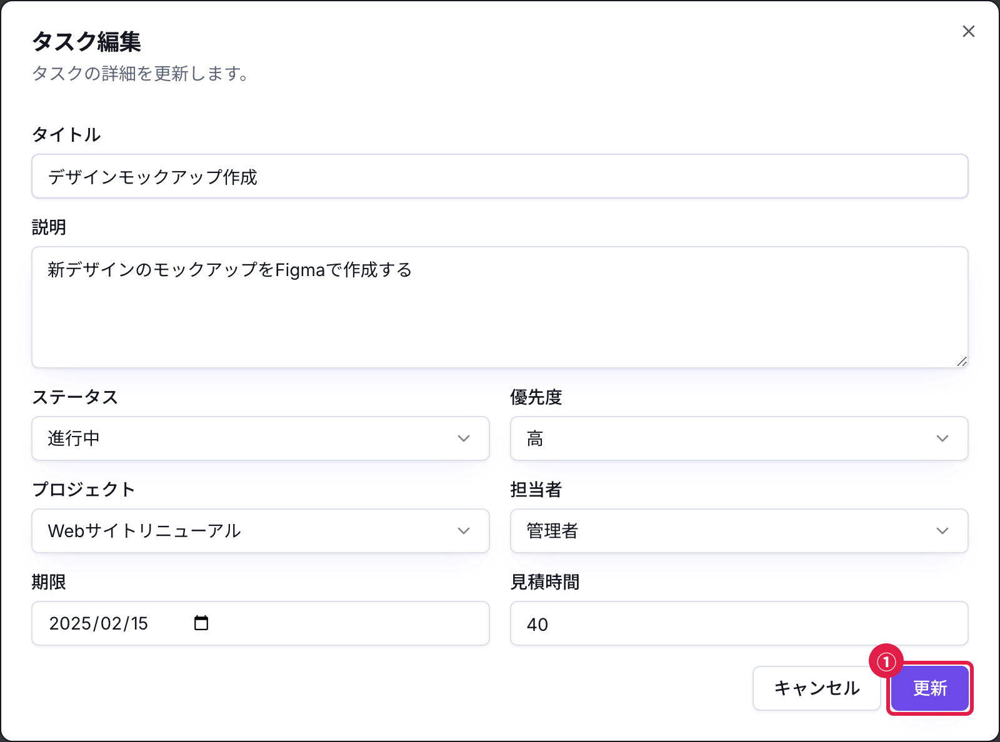
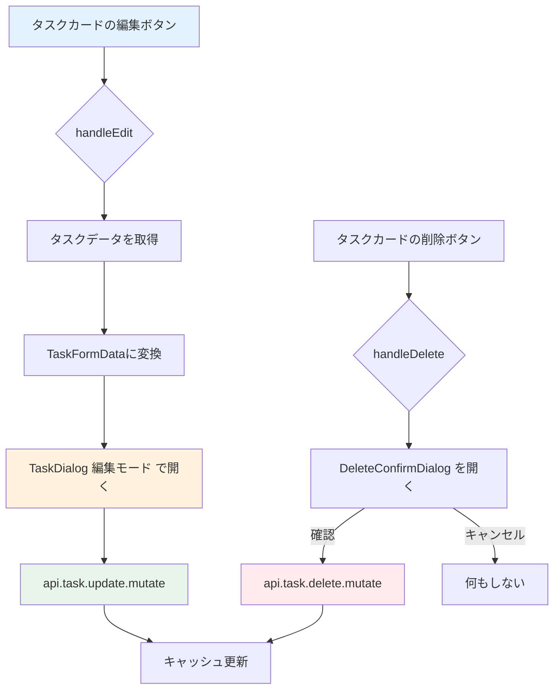
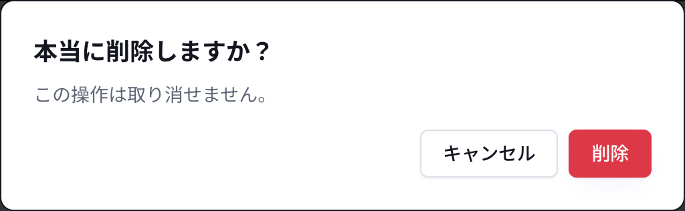
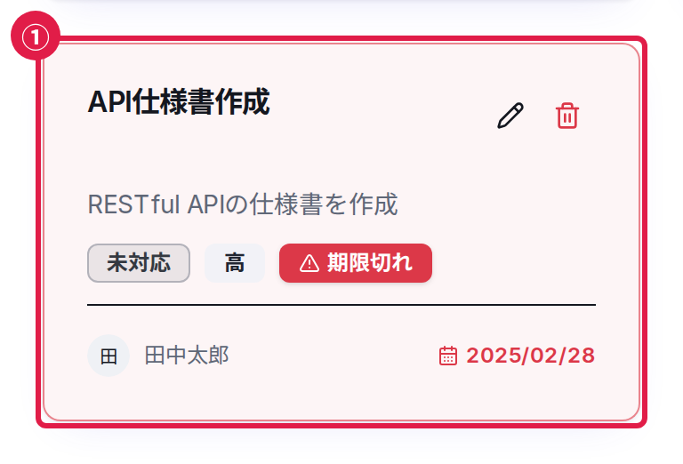

# Day 15: タスク編集・削除を実装しよう

## 前回の振り返り

Day 14 で学んだことは次のとおりです。
- TaskDialog で react-hook-form + zod のバリデーション
- `Controller` による Select 連携
- `useMutation`（データ変更APIのフック）による保存処理

今日は同じダイアログを**編集モード**で再利用してタスクの編集・削除に取り組みます。

---

## 今日のゴール

これで CRUD の「U（更新）」と「D（削除）」が
揃い、タスク管理の基本操作が完成します。
1つのコンポーネントで作成と編集の両方に対応する
パターンを学びます。

今日はまずサーバー側の `update` と `delete` を自分で書きます。ここが今日いちばん長い工程です。

スクリーンショット: 今日さわるタスクダイアログを、編集で開いたところです。見出しが「タスク編集」、
ボタンが「更新」になり、各欄には編集前の値が入っています。Day 14 で作った新規作成のときは
見出しが「タスク作成」、ボタンが「作成」で、各欄は空でした。



## 始める前の前提

- Day 14 のタスク作成ダイアログが動いています。
- 編集・削除を試せるタスクが1件以上あります。
- `src/component/task/task-dialog.tsx` を開いてDay 14 で書いた新規作成モードのコードを読み返せます。
- 削除操作を試すため消えてもよい練習用タスクを使います。

## なぜこれを作るのか

タスクの内容は常に変化します。優先度が上がったり、
担当者が変わったり、期限が延びたりします。

> **例え話**: タスク編集は「付箋の書き直し」
> です。ホワイトボードに貼った付箋の内容を
> 修正したい時、新しい付箋を書くのではなく、
> 元の付箋を剥がして書き直します。
> TaskDialog を再利用するのはまさにこれです。

### 編集・削除の流れ


```mermaid
flowchart TD
    A[タスクカードの編集ボタン] --> B{handleEdit}
    B --> C[タスクデータを取得]
    C --> D[TaskFormDataに変換]
    D --> E[TaskDialog 編集モード で開く]
    E --> F[api.task.update.mutate]
    F --> G[キャッシュ更新]

    H[タスクカードの削除ボタン] --> I{handleDelete}
    I --> J[DeleteConfirmDialog を開く]
    J -->|確認| K[api.task.delete.mutate]
    J -->|キャンセル| L[何もしない]
    K --> G

    style A fill:#e3f2fd
    style E fill:#fff3e0
    style F fill:#e8f5e9
    style K fill:#ffebee
```

図の上半分が編集、下半分が削除です。編集は「カードの編集ボタン → 既存データをフォームの形に直す → Day 14 で作った TaskDialog をそのまま開く」と進みます。削除の側だけ途中に `DeleteConfirmDialog` が挟まり、確認を押したときだけ `api.task.delete` へ進みます。ここで一度止めるのは削除に取り消しがきかないからです。

2つの流れは最後で合流し、どちらもキャッシュ更新へ入ります。画面のタスク一覧はサーバーから取ってきたデータの写しです。DB を書き換えただけでは写しが古いままです。更新したときと削除したときのどちらでも、一覧を取り直す必要があります。

### やること / やらないこと

| やること | やらないこと |
|---------|-------------|
| TaskDialog を編集モードで再利用 | 新しい編集専用コンポーネント |
| initialData で既存データを渡す | 別ページで編集画面 |
| `api.task.update` で更新 | ステータス変更（Day 16） |
| `api.task.delete` で削除 | 一括削除（Day 28） |

### 新しく学ぶ概念

| 概念 | 読み方 | 役割 | 例え |
|------|--------|------|------|
| initialData | イニシャル・データ | 編集時の初期値 | 書き直す前の付箋の内容 |
| DeleteConfirmDialog | デリート・コンファーム・ダイアログ | 削除確認ダイアログ | 「本当に捨てますか」の確認 |
| update mutation | アップデート・ミューテーション | 更新APIの呼び出し | 付箋を書き直してボードに貼る |

> **今日のゴールライン**: `null` と `undefined` の使い分けが出てくるけど今日覚えるのは「null = クリアしたい、undefined = 変更しない」の2行だけ。JavaScript の型の深い話は今日は不要。

開発サーバーは前の Day から動かしたまま使います。止めてあるときは `npm run dev` で起動してから `http://localhost:3000` を開きます。

## 実装ステップ一覧

| ステップ | 作業内容 | 読む時間の目安 |
|---------|---------|---------|
| Step 0 | タスク編集・削除 API（update / delete）を自分で書く | 35分 |
| Step 1 | `defaultValues` + `useEffect(reset)` を理解する | 5分 |
| Step 2 | 編集ハンドラーを実装する | 5分 |
| Step 3 | update mutationを実装する | 5分 |
| Step 4 | update用の送信ハンドラー | 8分 |
| Step 5 | create用の送信ハンドラー | 5分 |
| Step 6 | 削除用のstateとmutationを定義する | 5分 |
| Step 7 | 削除ハンドラーとダイアログを配置する | 5分 |
| Step 8 | 新規作成ハンドラーを実装する | 3分 |
| Step 9 | TaskCardにハンドラーを接続する | 5分 |
| Step 10 | TaskDialogにeditingTaskを渡す | 3分 |
| Step 11 | ページ移動後の保存結果を区別する | 5分 |
| Step 12 | 動作確認 | 3分 |

**読む時間の合計（仮）**: 約92分です。

表と各 Step に記した時間は、説明とコードを読む時間の仮の目安です。実測した値ではありません。コードの入力、動作確認、ダウンロードや起動の待ち時間、調べものには別に時間を取ってください。

---

### Step 0: タスク編集・削除 API（update / delete）を自分で書く（読む目安: 35分）

**ゴール**: 保存の直前にも権限と更新時刻を確かめる `update` と、削除の直前にも削除権限を確かめる `delete` を追加します。

Day 14 で作った `lockTaskProjects`、`getNextTaskPositionFromLockedProject`、`getNextTaskPosition` は消しません。作成では `getNextTaskPosition` がロックと採番をまとめ、今日の更新では複数のプロジェクトを先にロックしてから `getNextTaskPositionFromLockedProject` だけを呼びます。役割が違うため、3つとも必要です。

最初に `_helpers/permission` の既存 import を次の形へ置き換えます。Day 14 までの2つを残し、今日使う `findTaskWithPermission` を加えます。

```typescript
// filepath: src/server/api/routers/task.ts
import {
  assertMemberPermission,
  findTaskWithPermission,
  getUserProjectIds,
} from './_helpers/permission';
```

`findTaskWithPermission` は、このあとの `update` と `delete` で対象タスクと操作権限をまとめて確認します。呼び出しだけを追加して import を忘れると、未定義の名前として型検査で止まります。

#### 0-1. 入力スキーマを追加する

Day 14 で追加した `taskCreateSchema` の下に、次の `taskUpdateSchema` を追加します。作成時の入力ルールは残し、編集で受け取る項目を別に定義します。

`taskUpdateSchema` は変更したい項目だけを受け取ります。`null` は値を消す指示、`undefined` はその項目を変更しない指示です。`expectedUpdatedAt` は画面が読み取った更新時刻で、保存時の競合判定に使います。

```typescript
// filepath: src/server/api/routers/task.ts
const taskUpdateSchema = z.object({
  id: z.string().cuid(),
  expectedUpdatedAt: z.string().datetime().optional(),
  title: z.string().min(1).optional(),
  description: z.string().optional().nullable(),
  status: taskStatusSchema.optional(),
  priority: taskPrioritySchema.optional(),
  dueDate: z.string().datetime().optional().nullable(),
  estimatedHours: z.number().min(0).optional().nullable(),
  actualHours: z.number().min(0).optional(),
  projectId: z.string().cuid().optional(),
  assigneeId: z.string().cuid().optional().nullable(),
});
```

`optional` と `nullable` の組み合わせが、未変更と値の削除を区別します。画面が読み取った更新時刻も受け取り、保存時の競合条件へ渡します。

#### 0-2. Day 14 の採番ヘルパーを保つ

**ここは読むだけです。** 次の3関数と `assertTaskAssigneeBelongsToProject` は、そのまま残します。貼り直す必要はありません。

次の3関数は Day 14 で作成済みです。`lockTaskProjects` は重複を除いた ID を文字順に並べてからロックします。A から B へ移す更新と、B から A へ移す更新が同時に来ても、両方が同じ順番でロックを取るため相互待ちを避けられます。

```typescript
// filepath: src/server/api/routers/task.ts
const lockTaskProjects = async (tx: Prisma.TransactionClient, projectIds: string[]) => {
  const locked = new Set<string>();
  for (const projectId of [...new Set(projectIds)].sort()) {
    const rows = await tx.$queryRaw<Array<{ id: string }>>(
      Prisma.sql`SELECT "id" FROM "projects" WHERE "id" = ${projectId} FOR UPDATE`,
    );
    if (rows.length > 0) {
      locked.add(projectId);
    }
  }
  return locked;
};

const getNextTaskPositionFromLockedProject = async (
  tx: Prisma.TransactionClient,
  projectId: string,
) => {
  const maxPosition = await tx.task.findFirst({
    where: { projectId },
    orderBy: { position: 'desc' },
```

先頭の関数はプロジェクト ID を文字順にロックし、次の関数はロック済みの行で採番します。2つを分けると、更新では移動元と移動先を一度にロックできます。

```typescript
// filepath: src/server/api/routers/task.ts（同じファイルの続き）
    select: { position: true },
  });
  return (maxPosition?.position ?? -1) + 1;
};

const getNextTaskPosition = async (tx: Prisma.TransactionClient, projectId: string) => {
  const lockedProjects = await lockTaskProjects(tx, [projectId]);
  if (!lockedProjects.has(projectId)) {
    throw new TRPCError({
      code: 'NOT_FOUND',
      message: 'プロジェクトが見つかりません',
    });
  }
  return await getNextTaskPositionFromLockedProject(tx, projectId);
};

async function assertTaskAssigneeBelongsToProject(
  projectId: string,
  assigneeId: string,
  db: Pick<Prisma.TransactionClient, 'projectMember'>,
```

`getNextTaskPosition` は作成処理向けの入口です。担当者確認には `db` を渡せる形を残し、同じトランザクションから最新の所属を読めるようにします。

```typescript
// filepath: src/server/api/routers/task.ts（同じファイルの続き）
): Promise<void> {
  const member = await db.projectMember.findUnique({
    where: {
      userId_projectId: {
        userId: assigneeId,
        projectId,
      },
    },
    select: { id: true },
  });

  if (!member) {
    throw new TRPCError({
      code: 'BAD_REQUEST',
      message: '担当者にはこのプロジェクトのメンバーを指定してください',
    });
  }
}
```

担当者がプロジェクトにいなければ `BAD_REQUEST` で保存を止めます。Day 14 の作成処理と今日の更新処理が、同じ所属判定を使う形です。

`getNextTaskPositionFromLockedProject` は、呼び出し元がロック済みであることを前提に採番だけを行います。更新で `getNextTaskPosition` を呼び直すと、複数ロックの意図が読み取りにくくなります。更新では前者、作成では後者を使い分けます。

#### 0-3. update を追加する

ここからが追加作業です。`taskRouter = createTRPCRouter({` の中で、Day 14 の `create` 手続きが閉じた直後へ `update` を追加します。

最初の `findTaskWithPermission` は早い段階で不正な要求を止めます。ただし、その確認後に管理者が自分を除名したり権限を下げたりする可能性があります。そのため、トランザクション内でプロジェクト行をロックした後、移動元と移動先の現在の所属を読み直します。

```typescript
// filepath: src/server/api/routers/task.ts
  update: protectedProcedure.input(taskUpdateSchema).mutation(async ({ ctx, input }) => {
    const { id, expectedUpdatedAt, ...data } = input;

    const existingTask = await findTaskWithPermission(id, ctx.session.userId, 'canEdit');

    // 楽観ロック: ここで updatedAt を比較して即座に CONFLICT を判定しても、
    // 比較と末尾の update の間に他の更新が割り込む余地が残る（TOCTOU）。
    // 比較は末尾の update の where に含め、比較と更新を 1 回のクエリでまとめる。
    const updateData: Prisma.TaskUpdateInput = {};
    if (data.title !== undefined) {
      updateData.title = data.title;
    }
    if (data.description !== undefined) {
      updateData.description = data.description;
    }
    if (data.status !== undefined) {
      updateData.status = data.status;
      // completedAt は入力スキーマに存在せず、ステータス遷移からだけ決まる。
      // 画面から直接指定できると DONE のまま
      // 日時を書き換えられ、週次集計の週が動いてしまう。
      if (data.status !== existingTask.status) {
```

更新前のタスクを権限付きで読み、送られた項目だけを `updateData` へ移します。ステータスが変わった場合だけ完了日時を動かします。

```typescript
// filepath: src/server/api/routers/task.ts（同じファイルの続き）
        if (data.status === TASK_STATUS.DONE) {
          updateData.completedAt = new Date();
        } else {
          updateData.completedAt = null;
        }
      }
    }
    if (data.priority !== undefined) {
      updateData.priority = data.priority;
    }
    if (data.estimatedHours !== undefined) {
      updateData.estimatedHours = data.estimatedHours;
    }
    if (data.actualHours !== undefined) {
      updateData.actualHours = data.actualHours;
    }
    if (data.dueDate !== undefined) {
      updateData.dueDate = data.dueDate ? new Date(data.dueDate) : null;
```

優先度、時間、期限も `undefined` でなければ更新します。移動の有無と保存先のプロジェクト ID を、この時点のタスクから決めます。

```typescript
// filepath: src/server/api/routers/task.ts（同じファイルの続き）
    }

    const isProjectChanging =
      data.projectId !== undefined && data.projectId !== existingTask.projectId;
    const targetProjectId = isProjectChanging ? (data.projectId as string) : existingTask.projectId;

    try {
      // 比較（read）と更新（write）の間に他の更新が割り込む余地をなくすため、
      // updatedAt を where に含めた単一の update で
      // 比較と更新を 1 回のクエリにまとめる。
      // 条件不一致（他ユーザーの更新・削除で updatedAt がずれた）は Prisma が
      // 投げる P2025 を捕捉して CONFLICT に変換する。
      return await prisma.$transaction(async (tx) => {
        const transactionUpdateData: Prisma.TaskUpdateInput = { ...updateData };
        // 双方向の移動でも同じ順番で取ることで、A→B と B→A の相互待ちを防ぐ。
        const lockedProjects = await lockTaskProjects(tx, [
          existingTask.projectId,
          targetProjectId,
        ]);
        if (!lockedProjects.has(existingTask.projectId)) {
```

トランザクションへ入り、移動元と移動先を同じ文字順でロックします。移動元が消えていれば、古い読み取り結果を使わず `CONFLICT` にします。

```typescript
// filepath: src/server/api/routers/task.ts（同じファイルの続き）
          throw new TRPCError({
            code: 'CONFLICT',
            message: 'タスクの内容が更新されています。最新の内容を再読み込みしてください',
          });
        }

        const sourceMember = await tx.projectMember.findUnique({
          where: {
            userId_projectId: {
              userId: ctx.session.userId,
              projectId: existingTask.projectId,
            },
          },
          select: { role: true },
        });
        assertMemberPermission(sourceMember ? [sourceMember] : [], 'canEdit');

        if (isProjectChanging) {
          if (!lockedProjects.has(targetProjectId)) {
            throw new TRPCError({
```

ロック後に移動元の編集権限を読み直します。移動する場合は移動先の存在と編集権限も確かめ、ロック済みの行から新しい並び番号を求めます。

```typescript
// filepath: src/server/api/routers/task.ts（同じファイルの続き）
              code: 'NOT_FOUND',
              message: 'プロジェクトが見つかりません',
            });
          }
          const destinationMember = await tx.projectMember.findUnique({
            where: {
              userId_projectId: {
                userId: ctx.session.userId,
                projectId: targetProjectId,
              },
            },
            select: { role: true },
          });
          assertMemberPermission(destinationMember ? [destinationMember] : [], 'canEdit');
          transactionUpdateData.project = { connect: { id: targetProjectId } };
          transactionUpdateData.position = await getNextTaskPositionFromLockedProject(
            tx,
            targetProjectId,
          );
```

プロジェクトの接続先と position は、ロックを保ったまま `transactionUpdateData` へ入ります。続く担当者処理も同じトランザクション内です。

```typescript
// filepath: src/server/api/routers/task.ts（同じファイルの続き）
        }

        if (data.assigneeId !== undefined) {
          if (data.assigneeId === null) {
            transactionUpdateData.assignee = { disconnect: true };
          } else {
            await assertTaskAssigneeBelongsToProject(targetProjectId, data.assigneeId, tx);
            transactionUpdateData.assignee = { connect: { id: data.assigneeId } };
          }
        } else if (isProjectChanging && existingTask.assigneeId) {
          // 移動先をロックした後の所属だけを使い、
          // 除名済みの担当者を
          // 新しいプロジェクトへ持ち込まない。
          const assigneeStillMember = await tx.projectMember.findUnique({
            where: {
              userId_projectId: {
                userId: existingTask.assigneeId,
                projectId: targetProjectId,
              },
            },
            select: { id: true },
          });
```

明示された担当者は移動先への所属を `tx` で確かめます。担当者が送られず、既存担当者が移動先にいない場合は自動で外します。

```typescript
// filepath: src/server/api/routers/task.ts（同じファイルの続き）
          if (!assigneeStillMember) {
            transactionUpdateData.assignee = { disconnect: true };
          }
        }

        return await tx.task.update({
          where: {
            id,
            // 認可とcompletedAtを判断したsnapshotのproject・更新時刻を、
            // クライアント指定の楽観ロック時刻とは別条件で最後まで拘束する。
            projectId: existingTask.projectId,
            updatedAt: expectedUpdatedAt ? new Date(expectedUpdatedAt) : existingTask.updatedAt,
            AND: { updatedAt: existingTask.updatedAt },
          },
          data: transactionUpdateData,
          include: {
            project: true,
            createdBy: {
              select: USER_SELECT,
            },
```

保存条件にはタスク ID、認可した移動元、画面の更新時刻、サーバーが読み取った更新時刻を含めます。どれかが変われば古い判断では保存しません。

```typescript
// filepath: src/server/api/routers/task.ts（同じファイルの続き）
            assignee: {
              select: USER_SELECT,
            },
          },
        });
      });
    } catch (err) {
      if (err instanceof Prisma.PrismaClientKnownRequestError && err.code === 'P2025') {
        throw new TRPCError({
          code: 'CONFLICT',
          // 自分自身の別操作（時間記録の追加など）による更新でも起こり得るため、
          // 「他のユーザー」と断定しない文言にする
          message: 'タスクの内容が更新されています。' + '最新の内容を再読み込みしてください',
        });
      }
      throw err;
    }
  }),
```

条件に合う行が無い `P2025` だけを `CONFLICT` に変換します。接続障害など別のエラーは握りつぶさず、そのまま呼び出し元へ返します。

`projectId: existingTask.projectId` は、最初に権限を確認したプロジェクトから対象が移っていないことを保存時にも確かめます。`updatedAt` は画面の時刻、`AND.updatedAt` はサーバーが今回読み取った時刻です。片方だけでは、古い画面や、認可確認後の別更新を見逃す余地が残ります。

担当者の所属確認もロック後の `tx` で行います。プロジェクト移動中に担当者が除名された場合、その古い所属を使って保存しないためです。

#### 0-4. delete を追加する

`update` 手続きが閉じた直後へ、次の `delete` を追加します。

削除も最初の確認だけでは足りません。対象プロジェクトをロックし、現在の `canDelete` 権限を読み直し、最初に確認したプロジェクトのタスクだけを削除します。

```typescript
// filepath: src/server/api/routers/task.ts
  delete: protectedProcedure
    .input(z.object({ id: z.string().cuid() }))
    .mutation(async ({ ctx, input }) => {
      const task = await findTaskWithPermission(input.id, ctx.session.userId, 'canDelete');
      try {
        return await prisma.$transaction(async (tx) => {
          // 待機中の除名・降格を反映した権限で、
          // 認可したプロジェクトのタスクだけを削除する。
          const lockedProjects = await lockTaskProjects(tx, [task.projectId]);
          if (!lockedProjects.has(task.projectId)) {
            throw new TRPCError({
              code: 'CONFLICT',
              message: '対象の最新の状態を確認してください',
            });
          }
          const currentMember = await tx.projectMember.findUnique({
            where: { userId_projectId: { userId: ctx.session.userId, projectId: task.projectId } },
            select: { role: true },
          });
          assertMemberPermission(currentMember ? [currentMember] : [], 'canDelete');
          await tx.task.delete({ where: { id: input.id, projectId: task.projectId } });
```

削除対象を権限付きで読み、対象のプロジェクト行をロックしてから現在の削除権限を読み直します。削除条件にも同じ projectId を含めます。

```typescript
// filepath: src/server/api/routers/task.ts（同じファイルの続き）
          return { success: true };
        });
      } catch (err) {
        if (err instanceof Prisma.PrismaClientKnownRequestError && err.code === 'P2025') {
          throw new TRPCError({ code: 'CONFLICT', message: '対象の最新の状態を確認してください' });
        }
        throw err;
      }
    }),
```

確認後に対象が移動または削除されていれば `P2025` を `CONFLICT` に変えます。別の失敗は `throw err` で元の種類を保ちます。

`P2025` は、確認後に対象が削除または移動されて条件に合う行が無くなった場合に返ります。ここでは利用者が再読み込みできるよう `CONFLICT` に変えます。接続エラーなど別の失敗は `throw err` でそのまま上へ渡します。


**確認ポイント**: `update` の中に文字順の複数ロック、ロック後の移動元・移動先の権限確認、`projectId` と2つの更新時刻条件があることを確認してください。`delete` にはロック後の権限確認と `projectId` 条件があります。

---

### Step 1: `defaultValues` + `useEffect(reset)` を理解する（読む目安: 5分）

**ゴール**: `useForm` の `defaultValues` と
`useEffect(reset(...))`（描画後に副作用を走らせるフック）が
どのように編集モードを実現するかを理解します。

**実装**:

Day 14 の Step 3 で、TaskDialog に以下の設定を
書きました。

```typescript
// filepath: src/component/task/task-dialog.tsx
function buildTaskFormValues(
  initialData: TaskFormData | undefined,
  projects: Array<{
    id: string; name: string;
  }>,
): TaskFormValues {
  return {
    id: initialData?.id,
    title: initialData?.title ?? '',
    description:
      initialData?.description ?? '',
    status: initialData?.status
      ?? TASK_STATUS.TODO,
    priority: initialData?.priority
      ?? TASK_PRIORITY.MEDIUM,
```

ここまでが `buildTaskFormValues` の前半です。戻り値に `TaskFormValues` と型を書いてあるので項目を1つ書き忘れるとこの関数の中でエラーになります。残りの項目は同じ関数の続きにあります。

```typescript
// filepath: src/component/task/task-dialog.tsx（同じファイルの続き）
    dueDate: initialData?.dueDate ?? '',
    estimatedHours:
      initialData?.estimatedHours,
    projectId: initialData?.projectId
      ?? (projects[0]?.id || ''),
    assigneeId:
      initialData?.assigneeId ?? '',
    expectedUpdatedAt:
      initialData?.expectedUpdatedAt,
  };
}
```

`buildTaskFormValues` はタスクのデータをフォームが扱える形にそろえる関数です。`initialData?.title ?? ''` のように値が無いときの代わりを文字入力の項目に用意しています。`estimatedHours` と `expectedUpdatedAt` に代わりを置いていないのは数値と日時を空文字で表せないためです。`expectedUpdatedAt` は編集画面を開いた時点の更新日時で、Step 4 の送信処理がこの値をそのまま `update` へ渡します。入力欄に `undefined` を渡すとReact はその欄を「値を管理していない欄」と見なし、あとから値を入れた時点で警告を出します。空文字を初期値にしておけば作成モードと編集モードで同じ入力欄をそのまま使い回せます。`projects[0]?.id` を既定にしているのはプロジェクトが未選択のまま保存へ進めないようにするためです。

```typescript
// filepath: src/component/task/task-dialog.tsx
// Day 14 で書いた useForm の初期値
  const {
    register, handleSubmit, control,
    watch, reset, setValue,
    formState: { errors },
  } = useForm<TaskFormValues>({
    resolver: zodResolver(taskFormSchema),
    defaultValues:
      buildTaskFormValues(
        initialData, projects),
  });
```

この下には `watch('projectId')` で選択中のプロジェクトを見張る行、`projectsRef`、担当者候補を取り直す処理が続きます。ここでは間を飛ばし、`reset` に関わる2つの `useEffect` だけを再掲します。

```typescript
// filepath: src/component/task/task-dialog.tsx
// 同じファイルの続き。間は省略しています
  useEffect(() => {
    projectsRef.current = projects;
  }, [projects]);

  useEffect(() => {
    if (!open) {
      return;
    }
    reset(
      buildTaskFormValues(
        initialData, projectsRef.current),
    );
  }, [initialData, open, reset]);
```

この2つの `useEffect` の下には候補一覧が遅れて届いたときに `projectId` だけを `setValue` で補う3つ目の `useEffect` があります。今日は触らないので手元のファイルから消さないでください。

> 現在の `TaskDialog` は `useForm({ defaultValues })`
> で初期値を作り、`initialData` や `open` が
> 変わった時だけ `useEffect(reset(...))` で
> フォームを同期します。`useForm({ values })` は
> 使っていません。
>
> 2つ目の `useEffect` の末尾にある
> `[initialData, open, reset]` が依存配列
> （useEffectを再実行する条件の配列）です。この中の
> 値が変わったときだけ、`reset` でフォームを
> 作り直します。`projects` を依存配列へ入れないのは
> 候補一覧が取り直されるたびに `reset` が走り、
> 入力途中のタイトルが消えるためです。最新の一覧は
> 1つ目の `useEffect` が `projectsRef.current` へ
> 写しておきます。

**作成モード vs 編集モードの比較**

| 項目 | 作成モード | 編集モード |
|------|----------|----------|
| initialData | `undefined` | 既存タスクデータ |
| タイトル | 空の初期値 | 既存のタイトル |
| ボタン表示 | 「作成」 | 「更新」 |
| API呼び出し | `task.create` | `task.update` |

**確認ポイント**:
- `defaultValues` で初期値を作る仕組みを理解しました。
- `useEffect(reset(...))` で編集データを同期する流れを理解しました。
- このファイルの実装が終わったら、`npx tsc --noEmit` で型エラーがないことを確認します。

---

### Step 2: 編集ハンドラーを実装する（読む目安: 5分）

**ゴール**: タスクデータを `TaskFormData` に
変換してダイアログに渡します。

**実装**:

```typescript
// filepath: src/app/task/page.tsx
// taskToFormDataのインポートを追加
import { taskToFormData } from
  '@/lib/task-form';
```

編集ボタンから受け取れるのは `taskId` という文字列だけです。ダイアログが求めているのはフォーム用の形なのでその間をつなぐ変換が要ります。`taskToFormData` はその変換をまとめた関数で、`src/lib/task-form.ts` にあります。日付を `YYYY-MM-DD` へ直すといった処理が中に入っているためページごとに手で書き直さずに済みます。取り込みを忘れると次のブロックの `handleEdit` が「そんな名前は無い」という型エラーで止まります。

Day 13 で置いた仮の `handleEdit` はこの中身へ**丸ごと置き換え**ます。2つ並べると同じ名前を2回宣言することになり、ページ全体が止まります。

```typescript
// filepath: src/app/task/page.tsx
// editingTask は Day 14 で定義済み
const handleEdit = (taskId: string) => {
  const task =
    tasks?.find((t) => t.id === taskId);
  if (task) {
    // タスクをフォーム用のデータに変換
    formGeneration.current += 1;
    setEditingTask(taskToFormData(task));
    setDialogOpen(true);
  }
};
```

> `taskToFormData` はタスクデータを
> `TaskFormData` 形式に変換するユーティリティ
> 関数です（`src/lib/task-form.ts`）。
> 日付の `YYYY-MM-DD` 変換などを共通化して
> いるため各ページで手動変換する必要が
> ありません。

**確認ポイント**:
- `taskToFormData` のインポートを追加できました。
- `handleEdit` 関数が定義できました。

編集ボタンから開くと見出しが「タスク編集」、ボタンが「更新」になり、
タイトル・説明・ステータス・優先度・プロジェクト・担当者・期限に今の値が入った状態で開きます。
どれか1つでも空のまま開くなら`taskToFormData` に渡す値を見直してください。

---

### Step 3: createとupdateの保存結果を区別する（読む目安: 12分）

**ゴール**: Day 14 の送信世代を作成と更新で共有し、古い保存結果が新しい入力を閉じないようにします。

Day 14 の `CreateSubmission` と `createSubmission` は作成だけを表す名前でした。今日は更新も同じ排他制御（同じ瞬間に1つだけ書き込む制御）へ入れるため、次の名前へ置き換えます。

```typescript
// filepath: src/app/task/page.tsx
// CreateSubmission を置き換える
type TaskSubmission = {
  generation: number;
  isCurrent: () => boolean;
};
// state群のcreateSubmissionを置き換える
const singleSubmission =
  useRef<TaskSubmission | null>(null);
```

`generation` はダイアログを開き直した回数、`isCurrent` は送信後に入力が変わっていないかを確かめる関数です。どちらか一方でも違えば、返ってきた成功は今のフォームを閉じません。

完成コードと同じく、`closeTaskDialog` の直後へ作成と更新の完了処理を追加します。

```typescript
// filepath: src/app/task/page.tsx
const finishSubmittedForm = (
  submitted: TaskSubmission | null,
  operation: 'create' | 'update',
  target: { id: string; title: string | undefined },
) => {
  const canClose = !authExpiredRef.current
    && submitted?.generation === formGeneration.current
    && submitted.isCurrent();
  if (canClose) closeTaskDialog();
  if (authExpiredRef.current) return;
  const name = target.title
    ? `「${target.title}」`
    : '先ほど送信したタスク';
  toast.success(`${name}を${operation === 'create'
    ? '作成' : '更新'}しました。`);
```

成功通知は保存された対象名を出します。通信中に閉じて別のタスクを開いた場合も、今開いている相手が保存されたようには見せません。フォームが残った場合だけ、未保存の入力を案内します。

```typescript
// filepath: src/app/task/page.tsx（同じファイルの続き）
  if (canClose || !dialogOpen) return;
  if (operation === 'create' && !editingTask?.id) {
    toast('送信後に入力した内容はまだ保存されていません。'
      + 'このまま作成すると別のタスクになります。');
  } else if (operation === 'update'
    && editingTask?.id === target.id) {
    toast('送信後に入力した内容はまだ保存されていません。'
      + '続けて更新する前に入力を控え、'
      + '閉じて開き直してください。');
  }
};
```

別のタスクを編集中なら、前の更新に対する未保存案内は出しません。同じ対象へ書き足した場合は、古い成功が入力を消さず、保存されていないことだけを伝えます。

`finishSubmittedForm` の直後へ、分類済みのエラー表示と対象別の再取得を追加します。続く `singleMutationOptions` もその下へ追加し、Day 14 の `createMutation` は新しい定義へ置き換えます。

```typescript
// filepath: src/app/task/page.tsx
const handleSingleError = async (
  error: unknown,
  operation: 'create' | 'update' | 'delete',
  ids: string[],
) => {
  const failure = classifyTaskWriteError(error, operation);
  if (failure.kind === 'auth') {
    authExpiredRef.current = true;
    setAuthExpired(true);
    return;
  }
  toast.error(failure.message);
  await refreshTaskTargets(ids, true, true);
};
```

生のサーバーメッセージをそのまま表示しません。`classifyTaskWriteError` が競合、権限切れ、通信切断を次の行動が分かる文へ変換します。更新なら対象IDを渡すため、そのタスクの詳細も再取得します。

```typescript
// filepath: src/app/task/page.tsx
const singleMutationOptions = {
  retry: false as const,
  onMutate: () => singleSubmission.current,
  onSettled: (
    _data: unknown, _error: unknown,
    _variables: unknown,
    submitted: TaskSubmission | null | undefined,
  ) => {
    if (singleSubmission.current === submitted) {
      singleSubmission.current = null;
    }
  },
};
```

`onMutate` が送信時の値を各コールバックへ渡します。`onSettled` は同じ送信だけを解放します。古い通信の終了で新しい通信のロックを外さないため、参照が一致する場合だけ `null` へ戻します。

```typescript
// filepath: src/app/task/page.tsx
const createMutation = api.task.create.useMutation({
  ...singleMutationOptions,
  onSuccess: async (data, variables, submitted) => {
    finishSubmittedForm(submitted, 'create', {
      id: data.id, title: variables.title,
    });
    await refreshTaskTargets([data.id], false, true);
  },
  onError: (error) =>
    handleSingleError(error, 'create', []),
});
```

Day 14 の作成成功通知と再取得を残したまま、閉じる判断だけを共通関数へ移します。作成時の対象IDはサーバーが返した値を使います。

```typescript
// filepath: src/app/task/page.tsx（同じファイルの続き）
const updateMutation = api.task.update.useMutation({
  ...singleMutationOptions,
  onSuccess: async (_data, variables, submitted) => {
    finishSubmittedForm(submitted, 'update', {
      id: variables.id, title: variables.title,
    });
    await refreshTaskTargets(
      [variables.id], false, true,
    );
  },
  onError: (error, variables) =>
    handleSingleError(error, 'update', [variables.id]),
});
```

更新成功時は、送信したタスクIDだけを詳細再取得の対象にします。成功が返る前に別のカードを開いても、`selectedTask` のような現在値で再取得先を決めません。

**確認ポイント**:
- `singleSubmission` をcreateとupdateが共有しています。
- `onMutate` から受け取った `submitted` で閉じるか決めています。
- 更新後の再取得に `variables.id` を使っています。

---

### Step 4: update用の送信ハンドラー（読む目安: 8分）

**ゴール**: 更新を始める前に、現在のフォームと通信中の書き込みが無いことを確かめます。

Day 14 の `handleSubmit` 全体を、Step 4 と Step 5 のコードへ置き換えます。Step 4 は関数の先頭と更新分岐、Step 5 は同じ関数に残す作成分岐です。

```typescript
// filepath: src/app/task/page.tsx
const formPending =
  createMutation.isPending || updateMutation.isPending;

const handleSubmit = (
  data: TaskFormData,
  isCurrent: () => boolean = () => true,
) => {
  if (singleSubmission.current || formPending
    || authExpiredRef.current || !dialogOpen
    || !isCurrent()) return;
```

`isCurrent` は TaskDialog が送信直前のgenerationとrevisionを閉じ込めた関数です。zodの検証中に閉じたフォームや、検証後に書き換えた入力からは通信を始めません。refを先に埋めるため、ボタンの見た目が変わる前の連続クリックでも2回目を防ぎます。

```typescript
// filepath: src/app/task/page.tsx（同じファイルの続き）
  if (!data.id && !session?.user?.id) {
    authExpiredRef.current = true;
    setAuthExpired(true);
    return;
  }
  singleSubmission.current = {
    generation: formGeneration.current,
    isCurrent,
  };
  if (data.id) {
    updateMutation.mutate({
      id: data.id,
      title: data.title,
      description: data.description || null,
```

送信情報は `mutate` より前に保存します。更新では `data.id` が対象です。続けて空にできる項目と競合判定の時刻を渡します。

```typescript
// filepath: src/app/task/page.tsx（同じファイルの続き）
      status: data.status,
      priority: data.priority,
      dueDate: data.dueDate
        ? dateOnlyToUtcStartIso(data.dueDate)
        : null,
      estimatedHours: data.estimatedHours ?? null,
      projectId: data.projectId,
      assigneeId: data.assigneeId || null,
      ...(data.expectedUpdatedAt !== undefined && {
        expectedUpdatedAt: data.expectedUpdatedAt,
      }),
    });
    return;
  }
```

`null` は値を消す指示です。`expectedUpdatedAt` は編集画面を開いた時点の更新日時で、無い場合はプロパティ自体を送りません。

**確認ポイント**:
- `handleSubmit` の第2引数を消していません。
- refへ記録してからupdateを呼んでいます。
- 更新分岐の末尾で `return` しています。

---

### Step 5: create用の送信ハンドラー（読む目安: 5分）

**ゴール**: Day 14 の作成分岐を、同じ送信ロックの続きへ残します。

```typescript
// filepath: src/app/task/page.tsx（同じファイルの続き）
  createMutation.mutate({
    title: data.title,
    description: data.description,
    status: data.status,
    priority: data.priority,
    projectId: data.projectId,
    dueDate: data.dueDate
      ? dateOnlyToUtcStartIso(data.dueDate)
      : undefined,
    estimatedHours: data.estimatedHours ?? undefined,
    assigneeId: data.assigneeId || undefined,
  });
};
```

作成も `singleSubmission` を設定した後に同じ関数から呼びます。更新だけに新しい仕組みを足すと、作成の遅い成功だけが開き直したフォームを閉じる退行が残ります。

**確認ポイント**:
- 作成と更新は1つの `handleSubmit` を使います。
- 作成でも送信世代と入力revisionが保存結果まで渡ります。
- 通信中は別のcreate/updateを始めません。

---
### Step 6: 削除用のstateとmutationを定義する（読む目安: 5分）

**ゴール**: 削除確認に使うstate（Reactが再描画のために覚える値）と
削除APIのmutationを定義します。

**実装**:

```typescript
// filepath: src/app/task/page.tsx
import { DeleteConfirmDialog } from
  '@/component/ui/delete-confirm-dialog';
```

削除の確認はブラウザ標準の `window.confirm()` でも出せますが見た目はブラウザ任せになり、通信中にボタンを押せなくする指定もできません。Day 11 のプロジェクト削除で使った `DeleteConfirmDialog` は同じ用途の共通部品なのでタスク側でも取り込むだけで済みます。新しく作る必要はありません。

state は `TaskPageContent` の先頭にある他の `useState` と並べます。`deleteMutation` は `updateMutation` の直後に追加してください。これが完成コードと同じ配置です。

```typescript
// filepath: src/app/task/page.tsx
// 他のstateと並べて追加
const [deleteDialogOpen, setDeleteDialogOpen]
  = useState(false);
const [deleteTargetId, setDeleteTargetId]
  = useState<string | null>(null);
```

ダイアログを開くかと削除対象のIDは別々の state で覚えます。次に mutation を通信処理の並びへ追加します。

```typescript
// filepath: src/app/task/page.tsx
// updateMutationの直後に追加
const deleteMutation =
  api.task.delete.useMutation({
    ...singleMutationOptions,
    onSuccess: async (_data, variables) => {
      setDeleteDialogOpen(false);
      setDeleteTargetId(null);
      setSelectedTask((current) =>
        current === variables.id ? null : current
      );
      await refreshTaskTargets(
        [variables.id], false,
      );
    },
    onError: (error, variables) =>
      handleSingleError(error, 'delete', [variables.id]),
  });
```

削除も `singleMutationOptions` を使い、送信時の submission を `onSettled` まで保持します。成功時は確認状態と対象IDを片付け、削除したタスクが詳細表示中なら選択も外します。失敗はStep 3の分類済みメッセージを表示し、`onSettled` が同じ submission の同期ロックだけを解放します。

delete を定義したので、Step 4 の `formPending` を3種類の単体書き込みへ広げます。

```typescript
// filepath: src/app/task/page.tsx（formPendingを置き換え）
const singlePending =
  createMutation.isPending ||
  updateMutation.isPending ||
  deleteMutation.isPending;
```

名前を変えたため、`handleSubmit` の入口も `singlePending` に直します。古い `formPending` を残すと未定義になり、保存処理を呼べません。

```typescript
// filepath: src/app/task/page.tsx（handleSubmitの先頭を置き換え）
if (singleSubmission.current || singlePending
  || authExpiredRef.current || !dialogOpen
  || !isCurrent()) return;
```

create、update、delete のどれか1本が通信中なら、別の単体書き込みを始めません。見た目の pending が更新される前は `singleSubmission.current` が受け持ちます。

> `window.confirm()` ではなく
> `DeleteConfirmDialog` コンポーネントを使います。
> (1) アプリ全体のUIに統一感が出る
> (2) ボタンのテキストをカスタマイズできる
> (3) `isPending`（mutation実行中フラグ）中の二重クリックを防止できる

**確認ポイント**:
- `DeleteConfirmDialog` のインポートを追加できました。
- stateとmutationが定義できました。

---

### Step 7: 削除ハンドラーとダイアログを配置する（読む目安: 5分）

**ゴール**: 削除ボタンのハンドラーと確認
ダイアログをJSXに配置します。

**実装**:

Day 13 で置いた仮の `handleDelete` を**置き換え**ます。仮のほうは残しません。

```typescript
// filepath: src/app/task/page.tsx
// 削除ボタンのハンドラー
const handleDelete = (taskId: string) => {
  if (singleSubmission.current
    || singlePending
    || authExpiredRef.current) return;
  setDeleteTargetId(taskId);
  setDeleteDialogOpen(true);
};
```

`handleDelete` は削除そのものを実行しません。消す相手の id を `deleteTargetId` に覚えて確認ダイアログを開くところまでです。実行の合図は確認ボタン側へ預けるので押し間違いは確認画面で止まります。id を state に入れるのはダイアログが開いている間ずっと「どれを消すのか」を保つ必要があるためです。ふつうの変数に入れるとダイアログが開いた再描画のときに消えてしまいます。

続いてJSXの閉じタグ付近に
`DeleteConfirmDialog` を配置します。

```typescript
{/* filepath: src/app/task/page.tsx */}
{/* 確認ダイアログの配置 */}
<DeleteConfirmDialog
  open={deleteDialogOpen}
  onOpenChange={setDeleteDialogOpen}
  onConfirm={() => {
    if (deleteTargetId
      && !singleSubmission.current
      && !singlePending
      && !authExpiredRef.current) {
      singleSubmission.current = {
        generation: formGeneration.current,
        isCurrent: () => false,
      };
      deleteMutation.mutate({ id: deleteTargetId });
    }
  }}
  isPending={singlePending}
  closeOnConfirm={false}
/>
```

`onConfirm` でも同期ロック、3 mutation の pending、認証切れを再確認し、`mutate` より先に submission を保存します。同じ描画中に確認が2回届いても2本目を始めません。削除中は破壊操作の「削除」ボタンだけを無効にします。`closeOnConfirm={false}` なので確認クリックでは自動的に閉じず、利用者は「キャンセル」で閉じられます。開いたままなら成功時に `onSuccess` が閉じ、失敗時は同じ対象を確認できます。

> `open` と `onOpenChange` でダイアログの表示を
> `deleteDialogOpen` に結びつけ、`onConfirm` は
> 確認ボタンを押したときだけ削除を実行します。
> だからいきなり消えずに削除の確認を
> 一度はさめます。

**確認ポイント**:
- 削除ボタンで確認ダイアログが出ます。
- 確認ボタンでタスクが削除されます。
- キャンセルで何も起こりません。

スクリーンショット: 削除確認ダイアログの表示を確認してください。



タスクの削除では `title` を渡していないため見出しは `delete-confirm-dialog.tsx` の既定値である `本当に削除しますか？` になります。

---

### Step 8: 新規作成ハンドラーを実装する（読む目安: 3分）

**ゴール**: 「新規タスク」ボタンのハンドラーを
実装します。

**実装**:

Day 14 で書いた `handleCreate` を**置き換え**ます。増やさず、中身だけ差し替えます。

```typescript
// filepath: src/app/task/page.tsx
// editingTaskをundefinedにして作成モードで開く
const handleCreate = () => {
  if (authExpiredRef.current) return;
  formGeneration.current += 1;
  setEditingTask(undefined);
  setDialogOpen(true);
};
```

> `handleCreate` は `editingTask` を
> `undefined` にしてから開きます。
> これで「作成モード」になります。
> `handleEdit` は既存データをセットしてから
> 開くので「編集モード」になります。

**確認ポイント**:
- 「新規タスク」を押すと見出しが「タスク作成」、ボタンが「作成」の空のダイアログが開きます。
- 作成モードと編集モードの切り替えを理解しました。

---

### Step 9: TaskCardにハンドラーを接続する（読む目安: 5分）

**ゴール**: Day 13 で配置した TaskCard に
ハンドラーを接続します。

**実装**:

```typescript
<TaskCard
  // filepath: src/app/task/page.tsx
  // TaskCardにハンドラーを接続
  key={task.id}
  id={task.id}
  title={task.title}
  description={task.description}
  status={task.status}
  priority={task.priority}
  dueDate={task.dueDate}
  assignee={task.assignee}
  onEdit={handleEdit}
  onDelete={handleDelete}
  onClick={handleTaskClick}
  canEdit={canEditProject(task.projectId)}
  canDelete={canDeleteProject(task.projectId)}
/>
```

> `onEdit` と `onDelete` に関数を渡すとカード内の
> 編集ボタン・削除ボタンが押されたときにその関数が
> `task.id` を受け取って呼ばれます。ボタンの見た目は
> `TaskCard`、実際の処理は親ページ、と役割が分かれます。
>
> `canEdit` / `canDelete` は Day 13 で定義した
> `canEditProject` / `canDeleteProject` をそのまま使います。
> 閲覧者（VIEWER）ロールのプロジェクトでは両方 `false` になり、
> 編集・削除ボタンが表示されません。渡し忘れると既定値の
> `false` が使われ、編集できる利用者にもボタンが表示されません。
> プロジェクトのロールから判定した値を毎回渡してください。
>
> 作業時間まわりの props はいまの `TaskCard` にはまだ
> ありません。`timeSpentMinutes`（合計作業時間）と
> `onTimeLogSuccess`（記録成功時のコールバック）の 2 つは
> Day 16 で `TaskCard` 側へ追加してから渡します。今日の時点で
> 渡すと受け取る側が無いため型エラーになります。

**確認ポイント**:
- `onEdit` に `handleEdit` を渡しています。
- `onDelete` に `handleDelete` を渡しています。

---

### Step 10: TaskDialogにeditingTaskを渡す（読む目安: 3分）

**ゴール**: ダイアログに `editingTask` を渡して
編集モードを有効にします。

**実装**:

```typescript
{/* filepath: src/app/task/page.tsx */}
{/* ダイアログにeditingTaskを渡す */}
<TaskDialog
  open={dialogOpen}
  onClose={closeTaskDialog}
  onSubmit={handleSubmit}
  isPending={singlePending}
  initialData={editingTask}
  projects={editableProjects}
/>
```

> `initialData` に `editingTask` を渡すとStep 1 の
> `buildTaskFormValues` がその値をフォームの初期値に
> 使うので編集モードになります。`editingTask` が
> `undefined` のときは空の初期値になり、作成モードに
> なります。

**確認ポイント**:
- 「新規タスク」で作成モードが開きます。
- カードの編集ボタンで編集モードが開きます。
- カードの削除ボタンで確認→削除されます。

スクリーンショット: 下の画像は赤枠の「API仕様書作成」を編集して優先度を「中」から「高」に変えたあとの一覧です。自分が編集したタスクのバッジが変わっていれば同じ結果です。画像は初期データだけの状態で撮っているのでDay 14 で自分が作ったタスクは写っていません。カードの枚数が違っても実装の誤りではありません。



---

### Step 11: ページ移動後の保存結果を区別する（読む目安: 5分）

**ゴール**: 作成・更新・削除の途中でページを移動しても、古い返事が新しいページの操作を閉じないようにします。

Day 14 の `CreateSubmission` を `TaskSubmission` へ変えたとき、ページ番号も残します。Step 3 の型を次へ置き換えます。

```typescript
// filepath: src/app/task/page.tsx
type TaskSubmission = {
  generation: number;
  pageIndex: number;
  isCurrent: () => boolean;
};
```

`finishSubmittedForm` の `canClose` へ、送信時と現在のページが同じかという条件を足します。

```typescript
// filepath: src/app/task/page.tsx
const canClose = !authExpiredRef.current
  && submitted?.generation === formGeneration.current
  && submitted.pageIndex === pageIndex
  && submitted.isCurrent();
```

作成と更新の成功で、送信したページを確認します。今のページと違う場合はフォームを閉じません。フォーム世代と `isCurrent` も照合するので、同じページで開き直したフォームも古い成功から守れます。

作成・更新を始める `handleSubmit` では現在のページを一緒に保存します。

```typescript
// filepath: src/app/task/page.tsx
singleSubmission.current = {
  generation: formGeneration.current,
  pageIndex,
  isCurrent,
};
```

作成と更新が共用する送信情報にページ番号を足します。返事が来るまでの間に移動しても、成功通知の対象と今の入力を分けて扱うためです。フォーム世代と現在性の判定は引き続き保存します。

削除を確定する箇所でも同じ情報を保存してから `mutate` を呼びます。

```tsx
{/* filepath: src/app/task/page.tsx */}
singleSubmission.current = {
  generation: formGeneration.current,
  pageIndex,
  isCurrent: () => false,
};
deleteMutation.mutate({ id: deleteTargetId });
```

削除も共通の送信記録を使うため、ページ番号を保存します。削除の成功時は `onSuccess` で削除確認と対象IDを消します。作成・更新のフォームを閉じる判定とは別です。入力フォームの保存結果として扱わないため、`isCurrent` は常にfalseを返す関数にします。

Day 14 の `leavePageContext` は削除確認も閉じる形へ置き換えます。

```typescript
// filepath: src/app/task/page.tsx
const leavePageContext = () => {
  formGeneration.current += 1;
  setDeleteDialogOpen(false);
  setDeleteTargetId(null);
  setDialogOpen(false);
  setEditingTask(undefined);
  setSelectedTask(null);
  setDetailOpen(false);
};
```

前のページのカードを対象にした確認画面を残すと、今の一覧に見えないタスクを削除できてしまいます。ページ移動時に編集フォーム、削除確認、詳細をまとめて閉じることで、画面に見えている対象と操作対象をそろえます。

**確認ポイント**:
- 作成・更新・削除の送信情報に `pageIndex` があります。
- ページ移動とフィルター変更で編集フォーム、削除確認、詳細が閉じます。
- 古いページの返事では新しいページのフォームが閉じません。

---

### Step 12: 動作確認（読む目安: 3分）

**ゴール**: 編集・削除の全機能を確認します。

一覧に100件ない場合は、`src/app/task/page.tsx` 上部の `PAGE_SIZE` を現在の件数より小さい1以上の整数へ一時的に変えます。Day 14の動作確認で使った方法です。手順9では、同じ絞り込み条件に合うタスクを2件以上用意し、次のページにもカードが出る値にします。足りなければ画面からタスクを1件作成してください。2ページ目のタスクでも編集・削除を確認します。最後のページの最後の1件を削除したあとは、空のページから「前へ」で戻れます。確認後は `100` へ戻してください。この確認では、100件ちょうどの境界を検証したことにはなりません。

1. タスクカードの編集ボタンをクリック
2. タイトルや優先度を変更して「更新」
3. 一覧に変更が反映されます。
4. 別のタスクの削除ボタンをクリック
5. 確認ダイアログで「削除」をクリック
6. タスクが一覧から消えます。
7. ブラウザの開発者ツールで通信速度を低速にし、「次へ」を押します。取得中に前後ボタンが無効になることを確認し、確認後に通信速度を戻します。
8. 2ページ目でフィルターを変え、新しい条件の1ページ目へ戻ることを確認します。
9. 編集ダイアログで値を変え、開発者ツールで通信速度を低速にして「更新」を押します。返事を待つ間に Esc キーまたは「キャンセル」でダイアログを閉じ、「次へ」を押して移動先の別のタスクを編集します。古い返事で新しい編集フォームが閉じないことを確認し、通信速度を戻します。
10. コードで `moveToPage` が `leavePageContext` を呼んでからページ番号を変えることを確認します。続けて `leavePageContext` が削除確認を閉じ、`deleteTargetId` を `null` にすることを確認します。削除確認の背後にあるページボタンは直接操作できないため、この2点はコードを追います。

**確認ポイント**:
- 編集後にダイアログが閉じます。
- 削除後に一覧が更新されます。
- 「新規タスク」で空のフォームが開きます。
- 空の2ページ目では「前へ」が押せます。
- ページ移動後に前のページの編集・削除・詳細が残りません。
- 古いページの保存結果が新しいフォームを閉じません。

---

開発サーバーが動いていればそのまま使います。止めてあるときだけ次のコマンドで起動します。

```bash
# filepath: ターミナル
# 停止している場合だけ起動する
npm run dev
```

開発サーバーは前の Day から使っている3000番のものを続けて使います。起動したら `http://localhost:3000/task` を開き、編集と削除を1回ずつ通してみてください。編集の直後に一覧のカードが新しい内容へ変わればStep 3 の `invalidate` が効いています。削除してもカードが残る場合はStep 6 の `deleteMutation` で `utils.task.getAll.invalidate()` を呼び忘れています。DB からは消えているので再読み込みすると一覧から消えます。

---

### Pro パターンで書こう（編集後の一覧更新を楽観的に反映する）

編集後の一覧更新は動きますが保存が終わるまで画面は古い内容のままです。そこで保存の完了を待たずに結果を先に画面へ反映し、もし保存が失敗したら元の状態へ戻す楽観的更新を使うと待ち時間を感じさせなくできます。
なぜこの書き方をするのか、**Before/After** で見比べてみましょう。

#### Before（改善前のコード）

```typescript
// filepath: 読み比べ用サンプル（実ファイルには対応しません）
const utils = api.useUtils();

const updateMutation =
  api.task.update.useMutation({
    onSuccess: () => {
      utils.task.getAll.invalidate();
      if (selectedTask) {
        utils.task.getById.invalidate({
          id: selectedTask,
        });
      }
      setDialogOpen(false);
    },
  });
```

mutation の完了後に実行する内容はここまでです。次のブロックでは、その mutation へフォームの値を送る側を確認します。

```typescript
// filepath: 読み比べ用サンプル（続き・実ファイルには対応しません）
const handleSubmit = (data: TaskFormData) => {
  if (!data.id) return;

  updateMutation.mutate({
    id: data.id,
    projectId: data.projectId,
    expectedUpdatedAt: data.expectedUpdatedAt,
```

**読み比べ用**: ここは写経しません。続けてコードを読み進めましょう。

Before は Step 3 と Step 4 で書いた形とほぼ同じです。手を動かす順番は「保存する → サーバーの返事を待つ → `invalidate()` で一覧を取り直す」で、画面の表示が新しくなるのは通信が往復し終わったあとになります。After との違いはこの待ち時間の扱い方1点だけです。

```typescript
// filepath: 読み比べ用サンプル（続き・実ファイルには対応しません）
    title: data.title,
    description: data.description || null,
    status: data.status,
    priority: data.priority,
    dueDate: data.dueDate
      ? dateOnlyToUtcStartIso(data.dueDate)
      : null,
    estimatedHours: data.estimatedHours ?? null,
    assigneeId: data.assigneeId || null,
  });
};
```

**このコードの問題点**:

- 保存が成功するまで画面上の一覧は古いタイトルや優先度のまま残ります。
- 毎回 `invalidate()` で再取得するだけなので通信が遅いと「保存できたのか」が分かりにくいです。
- 失敗時の戻し方を決めていないためあとから楽観的更新を足すと差分管理が難しくなります。

#### After（プロが書くコード）

```typescript
// filepath: 読み比べ用サンプル（実ファイルには対応しません）
const taskListInput = {
  projectId: filterProject === 'all'
    ? undefined : filterProject,
  status: filterStatus === 'all'
    ? undefined : filterStatus,
};
const { data: tasks } =
  api.task.getAll.useQuery(taskListInput);

```

ここから mutation を定義します。`cancel`・`getData`・`setData` の3か所にも、表示で使った `taskListInput` を渡します。

`taskListInput` は画面が表示している一覧と同じ projectId・status を持つ query key（キャッシュを識別する入力）です。表示に使う `useQuery` と楽観的更新で同じ値を渡します。

```typescript
// filepath: 読み比べ用サンプル（続き・実ファイルには対応しません）
const updateMutation = api.task.update.useMutation({
  retry: false,
  onMutate: async (updatedTask) => {
    await utils.task.getAll.cancel(taskListInput);
    const previousTasks =
      utils.task.getAll.getData(taskListInput);
    utils.task.getAll.setData(
      taskListInput,
      (oldTasks) => oldTasks?.map((task) =>
        task.id === updatedTask.id
          ? { ...task, title: updatedTask.title ?? task.title }
          : task,
      ),
    );
    return {
      previousTasks,
      submitted: singleSubmission.current,
    };
  },
```

送信前の一覧だけでなく `singleSubmission.current` も同じ context（コールバック間で渡す値）へ保存します。キャッシュを先に変えても、どのフォームから始まった更新かを失わないためです。

```typescript
// filepath: 読み比べ用サンプル（続き・実ファイルには対応しません）
  onError: async (error, variables, context) => {
    utils.task.getAll.setData(
      taskListInput,
      context?.previousTasks,
    );
    await handleSingleError(
      error, 'update', [variables.id],
    );
  },
  onSuccess: (_data, variables, context) => {
    finishSubmittedForm(
      context?.submitted ?? null,
      'update',
      { id: variables.id, title: variables.title },
    );
  },
```

失敗時は一覧を戻し、Step 3 の分類済みエラーを表示します。成功時も直接ダイアログを閉じません。送信時の generation と入力 revision が現在も同じ場合だけ `finishSubmittedForm` が閉じます。

```typescript
// filepath: 読み比べ用サンプル（続き・実ファイルには対応しません）
  onSettled: (_data, _error, variables, context) => {
    if (singleSubmission.current === context?.submitted) {
      singleSubmission.current = null;
    }
    void refreshTaskTargets(
      [variables.id], false, true,
    );
  },
});
```

終了時は同じ送信だけをロックから外します。再取得先には現在開いている `selectedTask` ではなく、実際に送信した `variables.id` を使います。保存中に別のカードを開いても対象がずれません。

Step 4 の `handleSubmit(data, isCurrent)` はそのまま使います。楽観的更新は一覧の見せ方だけを先回りさせます。送信世代、認証切れ、二重送信の判定は弱めません。

**このコードの強み**:

- 保存ボタンを押した直後に一覧の表示が変わるので編集体験が軽く感じられます。
- 失敗したら `previousTasks` に戻し、分類済みメッセージを表示できます。
- 古い成功では開き直したフォームを閉じず、送信したIDだけを再取得できます。

#### 覚えておきたいエッセンス

`invalidate()` だけでも正しいです。でも編集UIでは先にキャッシュを更新してから最後に再同期すると体験が一段よくなります。
楽観的更新は「先に見せる」「失敗したら戻す」「最後に確認する」の3点セットで考えます。

## 完成コード全体

今日は2つのファイルを触りました。断片を貼り重ねる作業が続いたので途中でどこへ貼ったか分からなくなった場合は以下のコードを上から順に貼り付けて各ファイルを置き換えてください。1つのファイルが複数のブロックに分かれている場合はそのファイルの見出しの下にあるブロックを、出てくる順につなげたものが全文です。上から順に読めばStep 0 から Step 10 で書いたものがどう1つのファイルになったかを確かめられます。どちらも前回までに書いた部分を含む、今日の終了時点の姿です。書き換えのない `src/component/task/task-dialog.tsx` はこの節に載せていません。

| ファイル | 役割 | 対応する Step |
|---------|------|--------------|
| `src/server/api/routers/task.ts` | タスクの取得・作成・更新・削除の手続き | Step 0 |
| `src/app/task/page.tsx` | 一覧ページへの編集・削除の組み込み | Step 2 から Step 10 |

### `src/server/api/routers/task.ts`

Day 14 までの `create` と3つの採番ヘルパーを残し、今日の `update` と `delete` を加えた形です。長いため20行ずつ区切っていますが、上から順に1つのファイルへ続けて貼ります。

```typescript
// filepath: src/server/api/routers/task.ts
// 完成版: Day 15 終了時点の task router
import { Prisma } from '@prisma/client';
import { TRPCError } from '@trpc/server';
import { z } from 'zod';
import { TASK_PRIORITY } from '@/lib/constant/priority';
import { taskPrioritySchema, taskStatusSchema } from '@/lib/constant/query';
import { TASK_STATUS } from '@/lib/constant/status';
import { prisma } from '@/lib/prisma';
import { createTRPCRouter, protectedProcedure } from '../trpc';
import {
  assertMemberPermission,
  findTaskWithPermission,
  getUserProjectIds,
} from './_helpers/permission';
import { USER_SELECT } from './_helpers/select';

const taskCreateSchema = z.object({
  title: z.string().min(1, 'タイトルは必須です'),
  description: z.string().optional(),
  status: taskStatusSchema.default(TASK_STATUS.TODO),
  priority: taskPrioritySchema.default(TASK_PRIORITY.MEDIUM),
  dueDate: z.string().datetime().optional(),
```

冒頭では Day 15 までに使う import と作成スキーマを並べます。続く区切りで更新スキーマと採番ヘルパーを同じファイルへ足します。

```typescript
// filepath: src/server/api/routers/task.ts（同じファイルの続き）
  estimatedHours: z.number().min(0).optional(),
  projectId: z.string().cuid(),
  assigneeId: z.string().cuid().optional(),
});
const taskUpdateSchema = z.object({
  id: z.string().cuid(),
  expectedUpdatedAt: z.string().datetime().optional(),
  title: z.string().min(1).optional(),
  description: z.string().optional().nullable(),
  status: taskStatusSchema.optional(),
  priority: taskPrioritySchema.optional(),
  dueDate: z.string().datetime().optional().nullable(),
  estimatedHours: z.number().min(0).optional().nullable(),
  actualHours: z.number().min(0).optional(),
  projectId: z.string().cuid().optional(),
  assigneeId: z.string().cuid().optional().nullable(),
});
const lockTaskProjects = async (tx: Prisma.TransactionClient, projectIds: string[]) => {
  const locked = new Set<string>();
  for (const projectId of [...new Set(projectIds)].sort()) {
```

更新スキーマに続いて、複数プロジェクトを文字順にロックする関数が始まります。逆向きの同時移動でもロック順が一致し、相互待ちを避けられます。

```typescript
// filepath: src/server/api/routers/task.ts（同じファイルの続き）
    const rows = await tx.$queryRaw<Array<{ id: string }>>(
      Prisma.sql`SELECT "id" FROM "projects" WHERE "id" = ${projectId} FOR UPDATE`,
    );
    if (rows.length > 0) {
      locked.add(projectId);
    }
  }
  return locked;
};

const getNextTaskPositionFromLockedProject = async (
  tx: Prisma.TransactionClient,
  projectId: string,
) => {
  const maxPosition = await tx.task.findFirst({
    where: { projectId },
    orderBy: { position: 'desc' },
    select: { position: true },
  });
  return (maxPosition?.position ?? -1) + 1;
```

行ロックの問い合わせを終え、ロック済みプロジェクトで次の position を求めます。採番中は同じプロジェクトを使う別処理が待機します。

```typescript
// filepath: src/server/api/routers/task.ts（同じファイルの続き）
};

const getNextTaskPosition = async (tx: Prisma.TransactionClient, projectId: string) => {
  const lockedProjects = await lockTaskProjects(tx, [projectId]);
  if (!lockedProjects.has(projectId)) {
    throw new TRPCError({
      code: 'NOT_FOUND',
      message: 'プロジェクトが見つかりません',
    });
  }
  return await getNextTaskPositionFromLockedProject(tx, projectId);
};

async function assertTaskAssigneeBelongsToProject(
  projectId: string,
  assigneeId: string,
  db: Pick<Prisma.TransactionClient, 'projectMember'>,
): Promise<void> {
  const member = await db.projectMember.findUnique({
    where: {
```

作成向けの採番入口を閉じ、担当者の所属確認を始めます。所属確認へ `tx` を渡せるため、ロック後の情報だけで保存可否を決められます。

```typescript
// filepath: src/server/api/routers/task.ts（同じファイルの続き）
      userId_projectId: {
        userId: assigneeId,
        projectId,
      },
    },
    select: { id: true },
  });

  if (!member) {
    throw new TRPCError({
      code: 'BAD_REQUEST',
      message: '担当者にはこのプロジェクトのメンバーを指定してください',
    });
  }
}

export const taskRouter = createTRPCRouter({
  getAll: protectedProcedure
    .input(
      z
```

担当者が対象プロジェクトにいなければ `BAD_REQUEST` で止めます。その後に一覧取得を定義し、表示対象を所属プロジェクトへ絞ります。

```typescript
// filepath: src/server/api/routers/task.ts（同じファイルの続き）
        .object({
          projectId: z.string().cuid().optional(),
          status: taskStatusSchema.optional(),
          priority: taskPrioritySchema.optional(),
          assigneeId: z.string().cuid().optional(),
          limit: z.number().int().min(1).max(100).default(100),
          offset: z.number().int().min(0).default(0),
        })
        .optional(),
    )
    .query(async ({ ctx, input }) => {
      const where: Prisma.TaskWhereInput = {};
      const limit = input?.limit ?? 100;
      const offset = input?.offset ?? 0;
      const projectIds = await getUserProjectIds(ctx.session.userId);

      where.projectId = { in: projectIds };

      if (input?.projectId) {
        if (!projectIds.includes(input.projectId)) {
```

一覧入力の絞り込み項目とページング値を受け取ります。指定されたプロジェクトが自分の一覧に無ければ、問い合わせ前に拒否します。

```typescript
// filepath: src/server/api/routers/task.ts（同じファイルの続き）
          throw new TRPCError({
            code: 'FORBIDDEN',
            message: 'このプロジェクトへのアクセス権限がありません',
          });
        }
        where.projectId = input.projectId;
      }

      if (input?.status) where.status = input.status;
      if (input?.priority) where.priority = input.priority;
      if (input?.assigneeId) where.assigneeId = input.assigneeId;
      return await prisma.task.findMany({
        where,
        include: {
          project: true,
          createdBy: {
            select: USER_SELECT,
          },
          assignee: {
            select: USER_SELECT,
```

一覧では作成者と担当者を必要な項目だけ取得します。コメント本文は詳細の `getById` で取得します。`position`、作成時刻、ID の順に並べ、件数と開始位置を問い合わせへ渡します。Day 13 で確認したとおり、番号と作成時刻が同じ場合も、タスクごとに異なる ID で順序を決めます。

```typescript
// filepath: src/server/api/routers/task.ts（同じファイルの続き）
          },
        },
        orderBy: [
          { position: 'asc' },
          { createdAt: 'desc' },
          { id: 'asc' },
        ],
        take: limit,
        skip: offset,
      });
    }),
  getById: protectedProcedure
    .input(z.object({ id: z.string().cuid() }))
    .query(async ({ ctx, input }) => {
      const task = await prisma.task.findUnique({
        where: { id: input.id },
```

1件取得はプロジェクトの members を現在の利用者だけに絞ります。後続の権限判定が別のメンバーを自分と誤認しないためです。

```typescript
// filepath: src/server/api/routers/task.ts（同じファイルの続き）
        include: {
          project: {
            include: {
              members: {
                where: { userId: ctx.session.userId },
              },
            },
          },
          createdBy: {
            select: USER_SELECT,
          },
          assignee: {
            select: USER_SELECT,
          },
          comments: {
            include: {
              user: {
                select: USER_SELECT,
              },
            },
```

タスク本体と関連データを読み、存在しなければ `NOT_FOUND` にします。取得できた場合も所属を確認してから結果を返します。

```typescript
// filepath: src/server/api/routers/task.ts（同じファイルの続き）
            orderBy: { createdAt: 'desc' },
          },
        },
      });

      if (!task) {
        throw new TRPCError({
          code: 'NOT_FOUND',
          message: 'タスクが見つかりません',
        });
      }

      assertMemberPermission(task.project.members);

      return task;
    }),
  create: protectedProcedure.input(taskCreateSchema).mutation(async ({ ctx, input }) => {
    return await prisma.$transaction(async (tx) => {
      // メンバー削除・権限変更も同じプロジェクト行をロックするため、
      // ロック取得後の所属と権限だけを作成可否の判定に使う。
```

詳細取得を閉じ、Day 14 の作成処理へ進みます。作成はプロジェクトをロックしてから、現在の作成者権限を読み直します。

```typescript
// filepath: src/server/api/routers/task.ts（同じファイルの続き）
      const position = await getNextTaskPosition(tx, input.projectId);
      const callerMembership = await tx.projectMember.findUnique({
        where: {
          userId_projectId: {
            userId: ctx.session.userId,
            projectId: input.projectId,
          },
        },
        select: { role: true },
      });
      assertMemberPermission(callerMembership ? [callerMembership] : [], 'canEdit');

      if (input.assigneeId) {
        await assertTaskAssigneeBelongsToProject(input.projectId, input.assigneeId, tx);
      }

      const createData: Prisma.TaskCreateInput = {
        title: input.title,
        status: input.status,
        completedAt: input.status === TASK_STATUS.DONE ? new Date() : null,
```

ロック後の所属で `canEdit` を確認し、担当者も同じトランザクションで検査します。作成データにはサーバー側で完了日時を設定します。

```typescript
// filepath: src/server/api/routers/task.ts（同じファイルの続き）
        priority: input.priority,
        dueDate: input.dueDate ? new Date(input.dueDate) : null,
        position,
        project: {
          connect: { id: input.projectId },
        },
        createdBy: {
          connect: { id: ctx.session.userId },
        },
      };
      if (input.description !== undefined) {
        createData.description = input.description;
      }
      if (input.estimatedHours !== undefined) {
        createData.estimatedHours = input.estimatedHours;
      }
      if (input.assigneeId) {
        createData.assignee = {
          connect: { id: input.assigneeId },
        };
```

説明、見積、担当者は入力がある場合だけ作成データへ加えます。採番と作成を同じ `tx` で実行し、ロックを保存完了まで保ちます。

```typescript
// filepath: src/server/api/routers/task.ts（同じファイルの続き）
      }

      return await tx.task.create({
        data: createData,
        include: {
          project: true,
          createdBy: {
            select: USER_SELECT,
          },
          assignee: {
            select: USER_SELECT,
          },
        },
      });
    });
  }),

  update: protectedProcedure.input(taskUpdateSchema).mutation(async ({ ctx, input }) => {
```

作成結果の関連データを返して create を閉じ、update を始めます。更新では対象 ID、画面の更新時刻、変更項目を分けて扱います。

```typescript
// filepath: src/server/api/routers/task.ts（同じファイルの続き）
    const { id, expectedUpdatedAt, ...data } = input;

    const existingTask = await findTaskWithPermission(id, ctx.session.userId, 'canEdit');

    // 楽観ロック: ここで updatedAt を比較して即座に CONFLICT を判定しても、
    // 比較と末尾の update の間に他の更新が割り込む余地が残る（TOCTOU）。
    // 比較は末尾の update の where に含め、比較と更新を 1 回のクエリでまとめる。
    const updateData: Prisma.TaskUpdateInput = {};
    if (data.title !== undefined) {
      updateData.title = data.title;
    }
    if (data.description !== undefined) {
      updateData.description = data.description;
    }
    if (data.status !== undefined) {
      updateData.status = data.status;
      // completedAt は入力スキーマに存在せず、ステータス遷移からだけ決まる。
      // 画面から直接指定できると DONE のまま
      // 日時を書き換えられ、週次集計の週が動いてしまう。
      if (data.status !== existingTask.status) {
        if (data.status === TASK_STATUS.DONE) {
```

対象を編集権限付きで読み、送られた項目だけを更新データへ入れます。完了日時はステータスが実際に変わった場合だけ動かします。

```typescript
// filepath: src/server/api/routers/task.ts（同じファイルの続き）
          updateData.completedAt = new Date();
        } else {
          updateData.completedAt = null;
        }
      }
    }
    if (data.priority !== undefined) {
      updateData.priority = data.priority;
    }
    if (data.estimatedHours !== undefined) {
      updateData.estimatedHours = data.estimatedHours;
    }
    if (data.actualHours !== undefined) {
      updateData.actualHours = data.actualHours;
    }
    if (data.dueDate !== undefined) {
      updateData.dueDate = data.dueDate ? new Date(data.dueDate) : null;
    }

    const isProjectChanging =
```

優先度、時間、期限を詰めた後、移動の有無と保存先を決めます。ここで作った値を、ロック後の権限確認と最後の保存条件へ渡します。

```typescript
// filepath: src/server/api/routers/task.ts（同じファイルの続き）
      data.projectId !== undefined && data.projectId !== existingTask.projectId;
    const targetProjectId = isProjectChanging ? (data.projectId as string) : existingTask.projectId;

    try {
      // 比較（read）と更新（write）の間に他の更新が割り込む余地をなくすため、
      // updatedAt を where に含めた単一の update で
      // 比較と更新を 1 回のクエリにまとめる。
      // 条件不一致（他ユーザーの更新・削除で updatedAt がずれた）は Prisma が
      // 投げる P2025 を捕捉して CONFLICT に変換する。
      return await prisma.$transaction(async (tx) => {
        const transactionUpdateData: Prisma.TaskUpdateInput = { ...updateData };
        // 双方向の移動でも同じ順番で取ることで、A→B と B→A の相互待ちを防ぐ。
        const lockedProjects = await lockTaskProjects(tx, [
          existingTask.projectId,
          targetProjectId,
        ]);
        if (!lockedProjects.has(existingTask.projectId)) {
          throw new TRPCError({
            code: 'CONFLICT',
            message: 'タスクの内容が更新されています。最新の内容を再読み込みしてください',
```

トランザクション内で移動元と移動先を文字順にロックします。移動元がすでに無ければ、最初の読み取り結果を使わず競合として保存を止めます。

```typescript
// filepath: src/server/api/routers/task.ts（同じファイルの続き）
          });
        }

        const sourceMember = await tx.projectMember.findUnique({
          where: {
            userId_projectId: {
              userId: ctx.session.userId,
              projectId: existingTask.projectId,
            },
          },
          select: { role: true },
        });
        assertMemberPermission(sourceMember ? [sourceMember] : [], 'canEdit');

        if (isProjectChanging) {
          if (!lockedProjects.has(targetProjectId)) {
            throw new TRPCError({
              code: 'NOT_FOUND',
              message: 'プロジェクトが見つかりません',
            });
```

ロック後に移動元の現在の編集権限を読み直します。移動時は移動先の存在と編集権限も同じロック下で確かめ、古い所属を使いません。

```typescript
// filepath: src/server/api/routers/task.ts（同じファイルの続き）
          }
          const destinationMember = await tx.projectMember.findUnique({
            where: {
              userId_projectId: {
                userId: ctx.session.userId,
                projectId: targetProjectId,
              },
            },
            select: { role: true },
          });
          assertMemberPermission(destinationMember ? [destinationMember] : [], 'canEdit');
          transactionUpdateData.project = { connect: { id: targetProjectId } };
          transactionUpdateData.position = await getNextTaskPositionFromLockedProject(
            tx,
            targetProjectId,
          );
        }

        if (data.assigneeId !== undefined) {
          if (data.assigneeId === null) {
```

移動先の接続と採番を更新データへ入れ、担当者の分岐へ進みます。明示的な null なら担当を外し、ID があれば所属を確かめます。

```typescript
// filepath: src/server/api/routers/task.ts（同じファイルの続き）
            transactionUpdateData.assignee = { disconnect: true };
          } else {
            await assertTaskAssigneeBelongsToProject(targetProjectId, data.assigneeId, tx);
            transactionUpdateData.assignee = { connect: { id: data.assigneeId } };
          }
        } else if (isProjectChanging && existingTask.assigneeId) {
          // 移動先をロックした後の所属だけを使い、
          // 除名済みの担当者を
          // 新しいプロジェクトへ持ち込まない。
          const assigneeStillMember = await tx.projectMember.findUnique({
            where: {
              userId_projectId: {
                userId: existingTask.assigneeId,
                projectId: targetProjectId,
              },
            },
            select: { id: true },
          });
          if (!assigneeStillMember) {
            transactionUpdateData.assignee = { disconnect: true };
          }
```

担当者を省略した移動でも、既存担当者が移動先にいなければ外します。その後、認可したプロジェクトと2つの時刻を条件に保存します。

```typescript
// filepath: src/server/api/routers/task.ts（同じファイルの続き）
        }

        return await tx.task.update({
          where: {
            id,
            // 認可とcompletedAtを判断したsnapshotのproject・更新時刻を、
            // クライアント指定の楽観ロック時刻とは別条件で最後まで拘束する。
            projectId: existingTask.projectId,
            updatedAt: expectedUpdatedAt ? new Date(expectedUpdatedAt) : existingTask.updatedAt,
            AND: { updatedAt: existingTask.updatedAt },
          },
          data: transactionUpdateData,
          include: {
            project: true,
            createdBy: {
              select: USER_SELECT,
            },
            assignee: {
              select: USER_SELECT,
            },
```

更新結果の関連データを返し、条件不一致の `P2025` だけを競合へ変換します。ほかのエラーは種類を変えずに再送出します。

```typescript
// filepath: src/server/api/routers/task.ts（同じファイルの続き）
          },
        });
      });
    } catch (err) {
      if (err instanceof Prisma.PrismaClientKnownRequestError && err.code === 'P2025') {
        throw new TRPCError({
          code: 'CONFLICT',
          // 自分自身の別操作（時間記録の追加など）による更新でも起こり得るため、
          // 「他のユーザー」と断定しない文言にする
          message: 'タスクの内容が更新されています。' + '最新の内容を再読み込みしてください',
        });
      }
      throw err;
    }
  }),

  delete: protectedProcedure
    .input(z.object({ id: z.string().cuid() }))
    .mutation(async ({ ctx, input }) => {
      const task = await findTaskWithPermission(input.id, ctx.session.userId, 'canDelete');
```

delete を始め、最初の権限確認後に対象プロジェクトをロックします。ロック後の現在の削除権限で、処理を続けてよいか決めます。

```typescript
// filepath: src/server/api/routers/task.ts（同じファイルの続き）
      try {
        return await prisma.$transaction(async (tx) => {
          // 待機中の除名・降格を反映した権限で、
          // 認可したプロジェクトのタスクだけを削除する。
          const lockedProjects = await lockTaskProjects(tx, [task.projectId]);
          if (!lockedProjects.has(task.projectId)) {
            throw new TRPCError({
              code: 'CONFLICT',
              message: '対象の最新の状態を確認してください',
            });
          }
          const currentMember = await tx.projectMember.findUnique({
            where: { userId_projectId: { userId: ctx.session.userId, projectId: task.projectId } },
            select: { role: true },
          });
          assertMemberPermission(currentMember ? [currentMember] : [], 'canDelete');
          await tx.task.delete({ where: { id: input.id, projectId: task.projectId } });
          return { success: true };
        });
      } catch (err) {
        if (err instanceof Prisma.PrismaClientKnownRequestError && err.code === 'P2025') {
```

削除条件へ projectId を含め、最初に認可した対象だけを消します。対象が途中で変わった場合は成功扱いせず、競合として返します。

```typescript
// filepath: src/server/api/routers/task.ts（同じファイルの続き）
          throw new TRPCError({ code: 'CONFLICT', message: '対象の最新の状態を確認してください' });
        }
        throw err;
      }
    }),
});
```

`P2025` 以外の失敗を再送出して delete とルーター全体を閉じます。ここまでを順番どおり貼ると Day 15 終了時点の1ファイルになります。

`update` と `delete` は、操作開始時の権限だけで決めません。プロジェクト行のロックを取った後で現在の権限を読み直し、最初に確認した対象との結び付きも保存条件へ含めます。

### `src/app/task/page.tsx`

Day 14 の作成とページ送りを残し、編集と削除を加えた完成形です。作成・更新・削除は同じ送信境界を使い、操作を始めたページも記録します。

<!-- code-block-length-exception: complete-copy-unit -->
```typescript
'use client';
// filepath: src/app/task/page.tsx

import { Plus } from 'lucide-react';
import { useRouter, useSearchParams } from 'next/navigation';
import { Suspense, useCallback, useEffect, useMemo, useRef, useState } from 'react';
import toast from 'react-hot-toast';
import { AppLayout } from '@/component/layout/app-layout';
import { TaskCard } from '@/component/task/task-card';
import { TaskDetailDialog } from '@/component/task/task-detail-dialog';
import { TaskDialog, type TaskFormData } from '@/component/task/task-dialog';
import { Button } from '@/component/ui/button';
import { DeleteConfirmDialog } from '@/component/ui/delete-confirm-dialog';
import { PageLoadingSpinner } from '@/component/ui/loading-spinner';
import {
  Select,
  SelectContent,
  SelectItem,
  SelectTrigger,
  SelectValue,
} from '@/component/ui/select';
import { hasPermission, isProjectMemberRole, type ProjectMemberRole } from '@/lib/constant/roles';
import { isTaskStatus, TASK_STATUS_LABELS, type TaskStatus } from '@/lib/constant/status';
import { dateOnlyToUtcStartIso } from '@/lib/date';
import { isAuthError, isForbiddenError, shouldRetryQuery } from '@/lib/query-error';
import { taskToFormData } from '@/lib/task-form';
import { classifyTaskWriteError } from '@/lib/task-write-error';
import { api } from '@/trpc/react';

const PAGE_SIZE = 100;

type TaskSubmission = {
  generation: number;
  pageIndex: number;
  isCurrent: () => boolean;
};

function TaskPageContent() {
  const [filterProject, setFilterProject] = useState<string>('all');
  const [filterStatus, setFilterStatus] = useState<TaskStatus | 'all'>('all');
  const pageContext = `${filterProject}\u0000${filterStatus}`;
  const [pagination, setPagination] = useState({ context: pageContext, index: 0 });
  const pageIndex = pagination.context === pageContext ? pagination.index : 0;
  const [selectedTask, setSelectedTask] = useState<string | null>(null);
  const [detailOpen, setDetailOpen] = useState(false);
  const [dialogOpen, setDialogOpen] = useState(false);
  const [editingTask, setEditingTask] = useState<TaskFormData | undefined>();
  const [authExpired, setAuthExpired] = useState(false);
  const [deleteDialogOpen, setDeleteDialogOpen] = useState(false);
  const [deleteTargetId, setDeleteTargetId] = useState<string | null>(null);
  const singleSubmission = useRef<TaskSubmission | null>(null);
  const formGeneration = useRef(0);
  const authExpiredRef = useRef(false);

  const searchParams = useSearchParams();
  const router = useRouter();
  const taskIdParam = searchParams.get('taskId');
  const utils = api.useUtils();

  useEffect(() => {
    if (taskIdParam) {
      setSelectedTask(taskIdParam);
      setDetailOpen(true);
    }
  }, [taskIdParam]);

  const {
    data: session,
    error: sessionError,
    isSuccess: sessionLoaded,
    isFetching: sessionFetching,
    refetch: refetchSession,
  } = api.auth.getSession.useQuery(undefined, {
    enabled: !authExpired,
    retry: shouldRetryQuery,
  });
  const {
    data: tasks,
    isLoading: tasksLoading,
    isFetching: tasksFetching,
    error: tasksError,
    refetch: refetchTasks,
  } = api.task.getAll.useQuery(
    {
      projectId: filterProject === 'all' ? undefined : filterProject,
      status: filterStatus === 'all' ? undefined : filterStatus,
      limit: PAGE_SIZE,
      offset: pageIndex * PAGE_SIZE,
    },
    { enabled: !authExpired, retry: shouldRetryQuery, refetchOnWindowFocus: false },
  );
  const {
    data: projects,
    error: projectsError,
    isFetching: projectsFetching,
    refetch: refetchProjects,
  } = api.project.getAll.useQuery(undefined, {
    enabled: !authExpired,
    retry: shouldRetryQuery,
  });

  const queryAuthFailed =
    (sessionLoaded && session === null) ||
    [sessionError, tasksError, projectsError].some(isAuthError);
  const queryForbidden = [sessionError, tasksError, projectsError].some(isForbiddenError);
  useEffect(() => {
    if (!queryAuthFailed) return;
    authExpiredRef.current = true;
    setAuthExpired(true);
  }, [queryAuthFailed]);

  const taskReadFailed = !!tasksError && !isAuthError(tasksError) && !isForbiddenError(tasksError);
  const projectReadFailed =
    !!projectsError && !isAuthError(projectsError) && !isForbiddenError(projectsError);
  const sessionReadFailed =
    !!sessionError && !isAuthError(sessionError) && !isForbiddenError(sessionError);
  const taskReadFailedInitially = taskReadFailed && tasks === undefined;
  const projectReadFailedInitially = projectReadFailed && projects === undefined;
  const sessionReadFailedInitially = sessionReadFailed && session === undefined;
  const sessionReadDataIsStale = sessionReadFailed && session !== undefined;
  const requiredReadFailedInitially = taskReadFailedInitially || projectReadFailedInitially;
  const requiredReadDataIsStale =
    (taskReadFailed && tasks !== undefined) || (projectReadFailed && projects !== undefined);
  const requiredReadRetrying =
    (taskReadFailed && tasksFetching) || (projectReadFailed && projectsFetching);
  const retryRequiredReads = () => {
    const retries: Promise<unknown>[] = [];
    if (taskReadFailed) retries.push(refetchTasks());
    if (projectReadFailed) retries.push(refetchProjects());
    void Promise.all(retries);
  };
  const initialReadErrorMessage =
    taskReadFailedInitially && projectReadFailedInitially
      ? 'タスクとプロジェクトを取得できませんでした。'
      : taskReadFailedInitially
        ? 'タスクを取得できませんでした。'
        : 'プロジェクトを取得できませんでした。';
  const staleReadErrorMessage =
    taskReadFailed && projectReadFailed
      ? '最新のタスクとプロジェクトを取得できませんでした。前回取得時の内容です。'
      : taskReadFailed
        ? '最新のタスクを取得できませんでした。前回取得時の内容です。'
        : '最新のプロジェクトを取得できませんでした。前回取得時の内容です。';

  const myRoleByProject = useMemo(() => {
    const map = new Map<string, ProjectMemberRole>();
    const userId = session?.user?.id;
    if (!userId || !projects) return map;
    for (const project of projects) {
      const me = project.members?.find((member) => member.userId === userId);
      if (me && isProjectMemberRole(me.role)) map.set(project.id, me.role);
    }
    return map;
  }, [projects, session?.user?.id]);

  const canEditProject = useCallback(
    (projectId: string) => {
      const role = myRoleByProject.get(projectId);
      return role ? hasPermission(role, 'canEdit') : false;
    },
    [myRoleByProject],
  );

  const canDeleteProject = useCallback(
    (projectId: string) => {
      const role = myRoleByProject.get(projectId);
      return role ? hasPermission(role, 'canDelete') : false;
    },
    [myRoleByProject],
  );

  const editableProjects = useMemo(
    () => projects?.filter((project) => canEditProject(project.id)) ?? [],
    [projects, canEditProject],
  );

  const closeTaskDialog = useCallback(() => {
    formGeneration.current += 1;
    setDialogOpen(false);
    setEditingTask(undefined);
  }, []);

  const refreshTaskTargets = async (
    ids: string[],
    refreshPermissions: boolean,
    reportDetailFailure = false,
  ) => {
    const filters = {
      refetchType: authExpiredRef.current ? ('none' as const) : ('active' as const),
    };
    try {
      const updates = [
        utils.task.getAll.invalidate(undefined, filters, { throwOnError: true }),
        ...ids.map((id) =>
          utils.task.getById.invalidate({ id }, filters, { throwOnError: reportDetailFailure }),
        ),
      ];
      if (refreshPermissions) {
        updates.push(utils.project.getAll.invalidate(undefined, filters, { throwOnError: true }));
      }
      await Promise.all(updates);
    } catch (error) {
      if (isAuthError(error)) {
        authExpiredRef.current = true;
        setAuthExpired(true);
        return;
      }
      console.error('操作後の表示更新に失敗しました。', error);
      if (!authExpiredRef.current) {
        toast.error(
          '最新の表示を取得できませんでした。' + '再表示して' + '操作結果を確認してください。',
        );
      }
    }
  };

  const finishSubmittedForm = (
    submitted: TaskSubmission | null,
    operation: 'create' | 'update',
    target: { id: string; title: string | undefined },
  ) => {
    const canClose =
      !authExpiredRef.current &&
      submitted?.generation === formGeneration.current &&
      submitted.pageIndex === pageIndex &&
      submitted.isCurrent();
    if (canClose) closeTaskDialog();
    if (authExpiredRef.current) return;
    const name = target.title ? `「${target.title}」` : '先ほど送信したタスク';
    toast.success(`${name}を${operation === 'create' ? '作成' : '更新'}しました。`);
    if (canClose || !dialogOpen) return;
    if (operation === 'create' && !editingTask?.id) {
      toast(
        '送信後に入力した内容は' +
          'まだ保存されていません。' +
          'このまま作成すると' +
          '別のタスクになります。',
      );
    } else if (operation === 'update' && editingTask?.id === target.id) {
      toast(
        '送信後に入力した内容は' +
          'まだ保存されていません。' +
          '続けて更新する前に入力を控え、' +
          '閉じて開き直してください。',
      );
    }
  };

  const handleSingleError = async (
    error: unknown,
    operation: 'create' | 'update' | 'delete',
    ids: string[],
  ) => {
    const failure = classifyTaskWriteError(error, operation);
    if (failure.kind === 'auth') {
      authExpiredRef.current = true;
      setAuthExpired(true);
      return;
    }
    toast.error(failure.message);
    await refreshTaskTargets(ids, true, true);
  };

  const singleMutationOptions = {
    retry: false as const,
    onMutate: () => singleSubmission.current,
    onSettled: (
      _data: unknown,
      _error: unknown,
      _variables: unknown,
      submitted: TaskSubmission | null | undefined,
    ) => {
      if (singleSubmission.current === submitted) singleSubmission.current = null;
    },
  };

  const createMutation = api.task.create.useMutation({
    ...singleMutationOptions,
    onSuccess: async (data, variables, submitted) => {
      finishSubmittedForm(submitted, 'create', { id: data.id, title: variables.title });
      await refreshTaskTargets([data.id], false, true);
    },
    onError: (error) => handleSingleError(error, 'create', []),
  });
  const updateMutation = api.task.update.useMutation({
    ...singleMutationOptions,
    onSuccess: async (_data, variables, submitted) => {
      finishSubmittedForm(submitted, 'update', { id: variables.id, title: variables.title });
      await refreshTaskTargets([variables.id], false, true);
    },
    onError: (error, variables) => handleSingleError(error, 'update', [variables.id]),
  });

  const deleteMutation = api.task.delete.useMutation({
    ...singleMutationOptions,
    onSuccess: async (_data, variables) => {
      setDeleteDialogOpen(false);
      setDeleteTargetId(null);
      setSelectedTask((current) => (current === variables.id ? null : current));
      await refreshTaskTargets([variables.id], false);
    },
    onError: (error, variables) => handleSingleError(error, 'delete', [variables.id]),
  });
  const singlePending =
    createMutation.isPending || updateMutation.isPending || deleteMutation.isPending;

  const handleCreate = () => {
    if (authExpiredRef.current) return;
    formGeneration.current += 1;
    setEditingTask(undefined);
    setDialogOpen(true);
  };

  const handleEdit = (taskId: string) => {
    if (authExpiredRef.current) return;
    const task = tasks?.find((item) => item.id === taskId);
    if (!task) return;
    formGeneration.current += 1;
    setEditingTask(taskToFormData(task));
    setDialogOpen(true);
  };
  const handleDelete = (taskId: string) => {
    if (singleSubmission.current || singlePending || authExpiredRef.current) return;
    setDeleteTargetId(taskId);
    setDeleteDialogOpen(true);
  };

  const handleSubmit = (data: TaskFormData, isCurrent: () => boolean = () => true) => {
    if (
      singleSubmission.current ||
      singlePending ||
      authExpiredRef.current ||
      !dialogOpen ||
      !isCurrent()
    ) {
      return;
    }
    if (!data.id && !session?.user?.id) {
      authExpiredRef.current = true;
      setAuthExpired(true);
      return;
    }
    singleSubmission.current = { generation: formGeneration.current, pageIndex, isCurrent };
    if (data.id) {
      updateMutation.mutate({
        id: data.id,
        title: data.title,
        description: data.description || null,
        status: data.status,
        priority: data.priority,
        dueDate: data.dueDate ? dateOnlyToUtcStartIso(data.dueDate) : null,
        estimatedHours: data.estimatedHours ?? null,
        projectId: data.projectId,
        assigneeId: data.assigneeId || null,
        ...(data.expectedUpdatedAt !== undefined && {
          expectedUpdatedAt: data.expectedUpdatedAt,
        }),
      });
      return;
    }
    createMutation.mutate({
      title: data.title,
      description: data.description,
      status: data.status,
      priority: data.priority,
      dueDate: data.dueDate ? dateOnlyToUtcStartIso(data.dueDate) : undefined,
      estimatedHours: data.estimatedHours,
      projectId: data.projectId,
      assigneeId: data.assigneeId || undefined,
    });
  };

  const handleTaskClick = (taskId: string) => {
    setSelectedTask(taskId);
    setDetailOpen(true);
  };

  const handleDetailClose = () => {
    setDetailOpen(false);
    setSelectedTask(null);
  };

  const leavePageContext = () => {
    formGeneration.current += 1;
    setDeleteDialogOpen(false);
    setDeleteTargetId(null);
    setDialogOpen(false);
    setEditingTask(undefined);
    setSelectedTask(null);
    setDetailOpen(false);
  };

  const moveToPage = (nextPage: number) => {
    if (tasksFetching || nextPage < 0 || nextPage === pageIndex) return;
    leavePageContext();
    setPagination({ context: pageContext, index: nextPage });
  };

  const resetPageForFilter = () => {
    leavePageContext();
    setPagination({ context: '', index: 0 });
  };
  if (authExpired || queryAuthFailed) {
    return (
      <AppLayout>
        <div className="py-24 text-center">
          <p role="alert">ログインの有効期限が切れました。もう一度ログインしてください。</p>
          <Button onClick={() => router.push('/login')}>ログイン画面へ</Button>
        </div>
      </AppLayout>
    );
  }

  if (queryForbidden) {
    return (
      <AppLayout>
        <div className="py-24 text-center">
          <p role="alert">タスク情報を表示する権限がありません。</p>
        </div>
      </AppLayout>
    );
  }

  if (sessionReadFailedInitially) {
    return (
      <AppLayout>
        <div className="flex flex-col items-center gap-4 py-24 text-center">
          <p role="alert">ログイン情報を取得できませんでした。</p>
          <Button type="button" onClick={() => void refetchSession()} disabled={sessionFetching}>
            再試行
          </Button>
        </div>
      </AppLayout>
    );
  }

  if (requiredReadFailedInitially) {
    return (
      <AppLayout>
        <div className="flex flex-col items-center gap-4 py-24 text-center">
          <p role="alert">{initialReadErrorMessage}</p>
          <Button type="button" onClick={retryRequiredReads} disabled={requiredReadRetrying}>
            再試行
          </Button>
        </div>
      </AppLayout>
    );
  }

  if (tasksLoading) {
    return (
      <AppLayout>
        <PageLoadingSpinner />
      </AppLayout>
    );
  }

  return (
    <AppLayout>
      <div className="flex flex-col gap-6">
        <h1 className="text-3xl font-bold tracking-tight">タスク</h1>
        {requiredReadDataIsStale && (
          <div
            className="flex flex-col gap-3 rounded-md border border-destructive/50 p-4 sm:flex-row sm:items-center sm:justify-between"
            role="alert"
          >
            <span>{staleReadErrorMessage}</span>
            <Button
              type="button"
              variant="outline"
              size="sm"
              onClick={retryRequiredReads}
              disabled={requiredReadRetrying}
            >
              再試行
            </Button>
          </div>
        )}
        {sessionReadDataIsStale && (
          <div
            className="flex flex-col gap-3 rounded-md border border-destructive/50 p-4 sm:flex-row sm:items-center sm:justify-between"
            role="alert"
          >
            <span>
              最新のログイン情報を取得できませんでした。前回取得時の権限で表示しています。
            </span>
            <Button
              type="button"
              variant="outline"
              size="sm"
              onClick={() => void refetchSession()}
              disabled={sessionFetching}
            >
              再試行
            </Button>
          </div>
        )}
        <Button size="sm" className="w-full sm:w-auto" onClick={handleCreate}>
          <Plus className="mr-2 h-4 w-4" />
          新規タスク
        </Button>

        <div className="flex gap-2 w-full sm:w-auto ml-auto">
          <div className="w-[200px]">
            <Select
              value={filterProject}
              onValueChange={(value) => {
                if (value === filterProject) return;
                resetPageForFilter();
                setFilterProject(value);
              }}
            >
              <SelectTrigger aria-label="プロジェクトで絞り込み">
                <SelectValue placeholder="すべてのプロジェクト" />
              </SelectTrigger>
              <SelectContent>
                <SelectItem value="all">すべてのプロジェクト</SelectItem>
                {projects?.map((project) => (
                  <SelectItem key={project.id} value={project.id}>
                    {project.name}
                  </SelectItem>
                ))}
              </SelectContent>
            </Select>
          </div>
          <div className="w-[200px]">
            <Select
              value={filterStatus}
              onValueChange={(value) => {
                if ((value === 'all' || isTaskStatus(value)) && value !== filterStatus) {
                  resetPageForFilter();
                  setFilterStatus(value);
                }
              }}
            >
              <SelectTrigger aria-label="ステータスで絞り込み">
                <SelectValue placeholder="すべてのステータス" />
              </SelectTrigger>
              <SelectContent>
                <SelectItem value="all">すべてのステータス</SelectItem>
                {Object.entries(TASK_STATUS_LABELS).map(([value, label]) => (
                  <SelectItem key={value} value={value}>
                    {label}
                  </SelectItem>
                ))}
              </SelectContent>
            </Select>
          </div>
        </div>

        <div className="grid gap-6 sm:grid-cols-2 lg:grid-cols-3 xl:grid-cols-4">
          {tasks && tasks.length > 0 ? (
            tasks.map((task) => (
              <TaskCard
                key={task.id}
                id={task.id}
                title={task.title}
                description={task.description}
                status={task.status}
                priority={task.priority}
                dueDate={task.dueDate}
                assignee={task.assignee}
                onEdit={handleEdit}
                onDelete={handleDelete}
                onClick={handleTaskClick}
                canEdit={canEditProject(task.projectId)}
                canDelete={canDeleteProject(task.projectId)}
              />
            ))
          ) : pageIndex > 0 ? (
            <div className="col-span-full flex flex-col items-center justify-center py-12 text-center text-muted-foreground">
              <p>このページにはタスクがありません。</p>
              <p>前のページへ戻ってください。</p>
            </div>
          ) : (
            <div className="col-span-full flex flex-col items-center justify-center py-12 text-center text-muted-foreground">
              <p>タスクが見つかりません。</p>
              {filterProject === 'all' && filterStatus === 'all' && (
                <p>最初のタスクを作成しましょう！</p>
              )}
            </div>
          )}
        </div>

        {(pageIndex > 0 || (tasks?.length ?? 0) === PAGE_SIZE) && (
          <nav
            className="flex items-center justify-center gap-3"
            aria-label="タスク一覧のページ移動"
          >
            <Button
              variant="outline"
              disabled={tasksFetching || pageIndex === 0}
              onClick={() => moveToPage(pageIndex - 1)}
            >
              前へ
            </Button>
            <span className="text-sm text-muted-foreground">{pageIndex + 1}ページ目</span>
            <Button
              variant="outline"
              disabled={tasksFetching || (tasks?.length ?? 0) < PAGE_SIZE}
              onClick={() => moveToPage(pageIndex + 1)}
            >
              次へ
            </Button>
          </nav>
        )}

        <TaskDetailDialog open={detailOpen} taskId={selectedTask} onClose={handleDetailClose} />

        <TaskDialog
          open={dialogOpen}
          onClose={closeTaskDialog}
          onSubmit={handleSubmit}
          isPending={singlePending}
          initialData={editingTask}
          projects={editableProjects}
        />

        <DeleteConfirmDialog
          open={deleteDialogOpen}
          onOpenChange={setDeleteDialogOpen}
          onConfirm={() => {
            if (
              deleteTargetId &&
              !singleSubmission.current &&
              !singlePending &&
              !authExpiredRef.current
            ) {
              singleSubmission.current = {
                generation: formGeneration.current,
                pageIndex,
                isCurrent: () => false,
              };
              deleteMutation.mutate({ id: deleteTargetId });
            }
          }}
          isPending={singlePending}
          closeOnConfirm={false}
        />
      </div>
    </AppLayout>
  );
}

export default function TaskPage() {
  return (
    <Suspense fallback={<PageLoadingSpinner />}>
      <TaskPageContent />
    </Suspense>
  );
}
```

ページやフィルターを変えると、編集フォーム、削除確認、詳細を閉じます。前の一覧にしか見えていない対象を操作し続けず、遅れて返った結果にも現在のフォームを閉じさせません。

## 今日のまとめ

- [ ] TaskDialog を編集モードで再利用できました。
- [ ] `initialData` で既存データを渡せました。
- [ ] `api.task.update` でタスクを更新できました。
- [ ] `api.task.delete` で削除できました。
- [ ] `DeleteConfirmDialog` で確認ダイアログを表示できました。

## つまずきポイント

#### 編集が反映されない

**原因**

invalidateを呼び忘れたためです。

**解決方法**

`onSuccess` に追加してください。

#### 日付がずれる

**原因**

date-only変換が間違っているためです。

**解決方法**

`dateOnlyToUtcStartIso()` で UTC（協定世界時、タイムゾーンの基準）の開始時刻にそろえてください。

#### 削除が即実行される

**原因**

確認ダイアログを実装していないためです。

**解決方法**

`DeleteConfirmDialog` を配置してください。

#### 前回の値が残る

**原因**

フォームの同期が不足しているためです。

**解決方法**

`defaultValues` と `useEffect(reset(...))` を確認してください。

## 今日学んだ用語

| 用語 | 意味 |
|------|------|
| initialData | ダイアログの初期値。編集モードの鍵 |
| DeleteConfirmDialog | 削除前の確認ダイアログコンポーネント |
| null vs undefined | nullは「クリア」、undefinedは「変更なし」 |
| dateOnlyToUtcStartIso() | `YYYY-MM-DD` を UTC の 00:00:00.000Z に変換 |
| invalidate | キャッシュを無効化して最新データを再取得 |

## 理解チェック

今日書いたコードを見ながら答えてみてください。答えは各問のすぐ下にあります。

**Q1. `update` の `where` に `updatedAt: new Date(expectedUpdatedAt)` を足すと何が起きますか。**

A. 「編集を開いた時点から更新時刻が変わっていないときだけ書き換える」という条件になります。誰かが先に保存していれば `updatedAt` が動いているので条件に合う行が見つからず更新は失敗します。あとから保存した人が先の人の変更を黙って上書きする事故を防げます。

**Q2. `description: data.description || null` を `data.description ?? null` に変えるとどうなりますか。**

A. `??` は `null` と `undefined` だけを置き換えるので値が空文字なら空文字のままです。ただしこの教材の `TaskDialog` は空の説明を送信データから省略します。親が受け取る `data.description` は `undefined` なので今回の画面ではどちらも `null` になり、説明を消せます。空文字を直接渡す場合に結果が変わります。

**Q3. 期限が空のとき更新では `null` を送り、新規作成では `undefined` を送るのはなぜですか。**

A. Prisma がこの2つを別の指示として読むためです。`null` は「入っている日付を消す」、`undefined` は「この項目には何もしない」という意味になります。新規作成には消す対象が無いため `undefined` で足ります。更新では消したいのか触らないのかを区別します。

## 追加課題：説明を消す更新を確かめる

理解チェック Q2 の `null` を、実際のフォームで確かめます。値を空にして保存する操作も、編集機能の一部です。

前提は今日の編集と削除が使えることです。自分が管理するプロジェクトに「課題15」というタスクを作り、説明に「消す前の説明」と入力してください。

編集を開き、タイトルを残したまま説明だけを空にして更新します。

ページを再読み込みして編集を開き直します。説明は空、タイトルは「課題15」のままなら成功です。

`src/app/task/page.tsx` の更新用の送信処理を読み、空の説明が `null` になる箇所を見つけてください。そこを `undefined` にした場合の結果を、理解チェック Q3 を参考に1文で予測します。コードは変更しません。

説明が復活する場合は更新用の `description` が `null` を送る形か確認してください。最後に課題用タスクを削除します。削除前にタイトルを確かめ、他のタスクを選ばないようにしてください。

## 次回予告

Day 16 ではタスクのステータス変更と作業時間の
記録を実装します。手動で作業時間を記録して
プロジェクトの工数管理ができるようになります。

---

## 次に読むもの

- 前の日: [Day 14](./day14_タスク新規作成.md)
- 次の日: [Day 16](./day16_ステータス変更・時間記録.md)
- 全体の地図: [学びのロードマップ](./00-1_学びのロードマップ.md)
- 目次: [カリキュラム目次](./00_カリキュラム目次.md)
- 詰まったとき: [トラブルシューティング](./appendix_トラブルシューティング.md)
- 言葉の意味: [用語集](./appendix_用語集.md)

<!-- textlint-disable ja-technical-writing/ja-no-mixed-period, ja-technical-writing/no-doubled-conjunction, ja-technical-writing/no-exclamation-question-mark -->

---

## 奥付

| | |
|---|---|
| タイトル | Day 15: タスク編集・削除を実装しよう |
| 著者 | 磯貝光佑 |
| 版 | 第1版（2026年9月19日） |

© 2026 磯貝光佑

本書は購入者個人の利用に限ります。本書に掲載されたコードの写経、および自分のプロジェクトへの転用・改変は自由です。本書（PDF・Markdown）および付属コードの再配布・転売・第三者との共有は、形態を問わず禁止します。

<!-- textlint-enable ja-technical-writing/ja-no-mixed-period, ja-technical-writing/no-doubled-conjunction, ja-technical-writing/no-exclamation-question-mark -->
