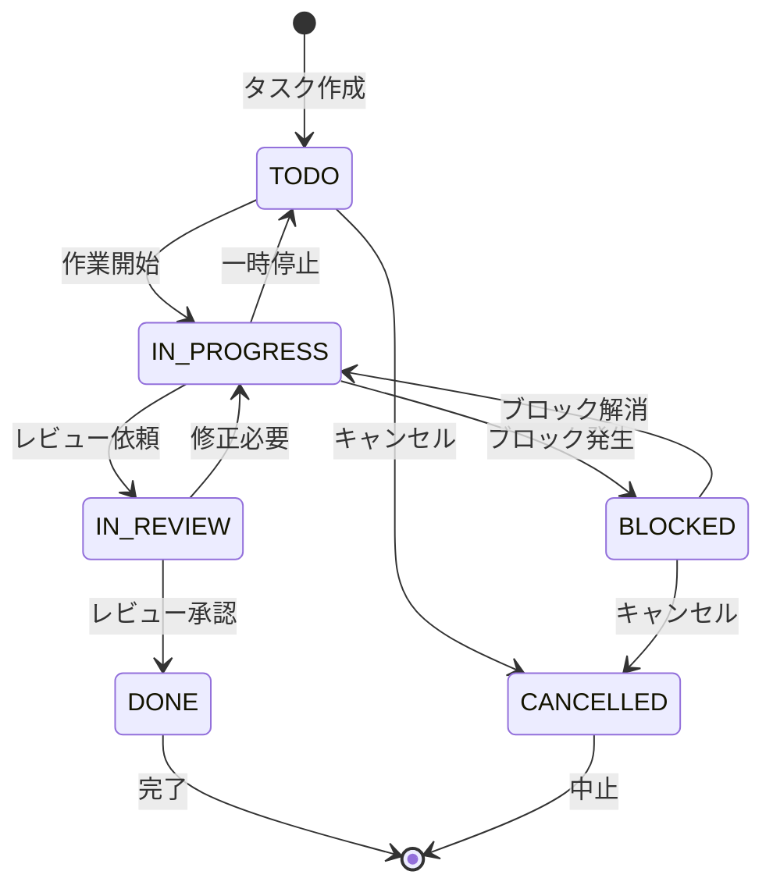

# Day 16: ステータス変更・タイマーを実装しよう

## 🎯 今日のゴール

タスクのステータスをワンクリックで変更でき、作業時間を計測するタイマー機能を実装します。

【スクリーンショット: ステータス変更ボタンとタイマー】

## 🤔 なぜこれを作るのか?

タスクの進捗を可視化し、作業時間を正確に記録する機能です。**ステータス変更は信号機のようなもの**。赤（TODO）から黄色（進行中）、青（完了）へと変わることで、今何をすべきか、何が終わったかが一目でわかります。タイマーは**ストップウォッチのように**、正確な作業時間を記録できます。

### 📐 タスクステータス遷移図



この図は、タスクが各ステータス間でどのように遷移できるかを示しています。矢印は遷移可能な方向を表します。

## 📊 実装ステップ一覧

| ステップ | 作業内容 | 所要時間 |
|---------|---------|---------|
| Step 1 | ステータス変更ボタン | 15分 |
| Step 2 | ステータス更新API呼び出し | 10分 |
| Step 3 | タイマーUI実装 | 20分 |
| Step 4 | タイマー動作実装 | 15分 |

**合計時間**: 約60分

---

### Step 1: ステータス変更ボタン（15分）

💻 **実装**:

```typescript
// filepath: src/app/projects/[projectId]/tasks/page.tsx（ステータスボタン部分）
import { Button } from '@/component/ui/button';

const statusOptions = [
  { value: 'TODO', label: 'TODO' },
  { value: 'IN_PROGRESS', label: '進行中' },
  { value: 'IN_REVIEW', label: 'レビュー中' },
  { value: 'DONE', label: '完了' },
];

export default function ProjectTasksPage() {
  return (
    <TableBody>
      {tasks?.map((task) => (
        <TableRow key={task.id}>
          <TableCell>{task.title}</TableCell>
          <TableCell>
            <div className="flex gap-1">
              {statusOptions.map((option) => (
                <Button
                  key={option.value}
                  size="sm"
                  variant={
                    task.status === option.value ? 'default' : 'outline'
                  }
                  onClick={() => handleStatusChange(task.id, option.value)}
                >
                  {option.label}
                </Button>
              ))}
            </div>
          </TableCell>
        </TableRow>
      ))}
    </TableBody>
  );
}
```

✅ **確認ポイント**: ステータスごとのボタンが表示される

【スクリーンショット: 確認画面】

---

### Step 2: ステータス更新API呼び出し（10分）

💻 **実装**:

```typescript
// filepath: src/app/projects/[projectId]/tasks/page.tsx
import { api } from '@/trpc/react';

export default function ProjectTasksPage() {
  const utils = api.useUtils();

  const updateStatusMutation = api.task.updateStatus.useMutation({
    onSuccess: () => {
      utils.task.getByProject.invalidate();
    },
  });

  const handleStatusChange = (taskId: string, newStatus: string) => {
    updateStatusMutation.mutate({
      id: taskId,
      status: newStatus,
    });
  };

  return (
    // UI は同じ
  );
}
```

✅ **確認ポイント**: ボタンをクリックするとステータスが変更される

【スクリーンショット: 確認画面】

---

### Step 3: タイマーUI実装（20分）

💻 **実装**:

```typescript
// filepath: src/component/task/TaskTimer.tsx
'use client';

import { Button } from '@/component/ui/button';
import { Play, Pause } from 'lucide-react';

interface TaskTimerProps {
  taskId: string;
  isTimerActive: boolean;
  timeSpentMinutes: number;
}

export function TaskTimer({
  taskId,
  isTimerActive,
  timeSpentMinutes,
}: TaskTimerProps) {
  const formatTime = (minutes: number) => {
    const hours = Math.floor(minutes / 60);
    const mins = Math.floor(minutes % 60);
    return `${hours}時間${mins}分`;
  };

  return (
    <div className="flex items-center gap-2">
      <span className="text-sm">{formatTime(timeSpentMinutes)}</span>
      <Button
        size="sm"
        variant={isTimerActive ? 'destructive' : 'outline'}
      >
        {isTimerActive ? (
          <Pause className="h-4 w-4 mr-1" />
        ) : (
          <Play className="h-4 w-4 mr-1" />
        )}
        {isTimerActive ? '停止' : '開始'}
      </Button>
    </div>
  );
}
```

✅ **確認ポイント**: タイマー表示と開始/停止ボタンが表示される

【スクリーンショット: 確認画面】

---

### Step 4: タイマー動作実装（15分）

💻 **実装**:

```typescript
// filepath: src/component/task/TaskTimer.tsx（完全版）
'use client';

import { useState, useEffect } from 'react';
import { api } from '@/trpc/react';
import { Button } from '@/component/ui/button';
import { Play, Pause } from 'lucide-react';

interface TaskTimerProps {
  taskId: string;
  isTimerActive: boolean;
  timeSpentMinutes: number;
}

export function TaskTimer({
  taskId,
  isTimerActive: initialIsActive,
  timeSpentMinutes: initialTimeSpent,
}: TaskTimerProps) {
  const [timeSpent, setTimeSpent] = useState(initialTimeSpent);
  const [isActive, setIsActive] = useState(initialIsActive);

  const toggleTimerMutation = api.task.toggleTimer.useMutation();

  useEffect(() => {
    if (!isActive) return;

    const interval = setInterval(() => {
      setTimeSpent((prev) => prev + 1 / 60); // 1秒 = 1/60分
    }, 1000);

    return () => clearInterval(interval);
  }, [isActive]);

  const formatTime = (minutes: number) => {
    const hours = Math.floor(minutes / 60);
    const mins = Math.floor(minutes % 60);
    return `${hours}時間${mins}分`;
  };

  const handleToggle = () => {
    toggleTimerMutation.mutate({ id: taskId });
    setIsActive(!isActive);
  };

  return (
    <div className="flex items-center gap-2">
      <span className="text-sm">{formatTime(timeSpent)}</span>
      <Button
        size="sm"
        variant={isActive ? 'destructive' : 'outline'}
        onClick={handleToggle}
      >
        {isActive ? (
          <Pause className="h-4 w-4 mr-1" />
        ) : (
          <Play className="h-4 w-4 mr-1" />
        )}
        {isActive ? '停止' : '開始'}
      </Button>
    </div>
  );
}
```

✅ **確認ポイント**: タイマーが1秒ごとに更新される

【スクリーンショット: 確認画面】

---

## 📝 学んだこと

- **Buttonグループ**: flex gap-1 で複数のボタンをグループ化
- **Lucide Icons**: Play, Pause などのアイコン使用
- **setInterval**: 定期的に処理を実行するタイマー
- **useEffect cleanup**: returnでclearIntervalを実行して停止
- **api.useUtils()**: tRPCのキャッシュを無効化して再取得

## 📋 今日のまとめ

- [ ] ステータス変更ボタンを実装できた
- [ ] ステータス更新APIを呼び出せた
- [ ] タイマーUIを実装できた
- [ ] タイマーが正常に動作するようにした

## ⚠️ つまずきポイント

| 問題 | 原因 | 解決策 |
|------|------|--------|
| タイマーが止まらない | clearInterval を呼んでいない | useEffect の return で clearInterval |
| 時間がずれる | 1秒を分に変換していない | setInterval内で `prev + 1/60` |
| ステータスが更新されない | キャッシュが残っている | invalidate() でキャッシュクリア |

## 🔗 次回予告

Day 17では、自分のタスクだけを表示する「マイタスク」ページを作成します。
