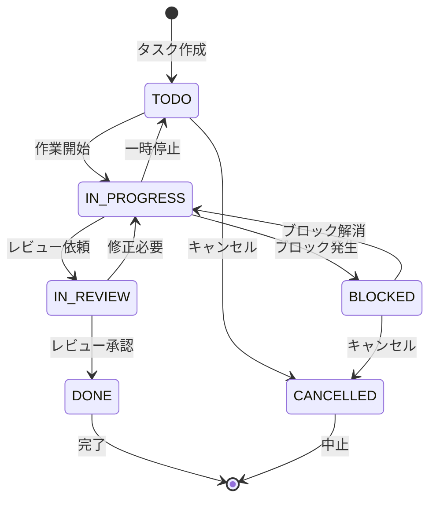

# Day 16: ステータス変更・タイマーを実装しよう

## 🔙 前回の振り返り

Day 15 で学んだこと:
- TaskDialog を `initialData` で編集モードに切り替え
- `DeleteConfirmDialog` で削除前の確認
- `null` と `undefined` の使い分け

今日はステータスのワンクリック変更と、
作業時間を計測するタイマー機能を作ります。

---

## 🎯 今日のゴール

タスクのステータスを編集ダイアログから変更でき、
作業時間を計測するタイマー機能を実装します。
さらに、手動で作業時間を記録するダイアログも
作ります。

📸 スクリーンショット: タスク詳細ダイアログの画面


## 🤔 なぜこれを作るのか？

タスクの進捗を可視化し、作業時間を正確に記録
する機能は、プロジェクト管理に不可欠です。

> 💡 **例え話**: ステータスは「信号機」で、
> 赤（TODO）→黄色（IN_PROGRESS）→青（DONE）と変わります。
> タイマーは「ストップウォッチ」で、
> スタート/ストップで作業時間を記録します。

### 📐 タスクステータス遷移図

この図は主要な遷移のみを示しています。



### やること / やらないこと

| やること | やらないこと |
|---------|-------------|
| ステータス変更（api.task.update） | ドラッグ＆ドロップでのステータス変更 |
| TaskTimer コンポーネント | カンバンボード表示 |
| タイマー開始/停止 | ポモドーロ機能 |
| 手動時間記録（TimeLogDialog） | レポート機能（Day 21-23） |

### 🆕 新しく学ぶ概念

| 概念 | 読み方 | 役割 | 例え |
|------|--------|------|------|
| setInterval | セット・インターバル | 定期的に関数を実行 | 時計の秒針の動き |
| clearInterval | クリア・インターバル | 定期実行を停止 | ストップウォッチの停止ボタン |
| useEffect cleanup | クリーンアップ | コンポーネント解除時の後片付け | 部屋を出る時に電気を消す |
| mutateAsync | ミューテート・アシンク | 非同期でAPIを呼ぶ | 注文して料理が届くのを待つ |

## 📊 実装ステップ一覧

| ステップ | 作業内容 | 所要時間 |
|---------|---------|---------|
| Step 1 | ステータス変更の仕組みを理解する | 3分 |
| Step 2 | TaskTimerの骨格を作る | 5分 |
| Step 3 | タイマーのカウントアップ | 5分 |
| Step 4 | 開始/停止のAPI呼び出し | 5分 |
| Step 5 | 時間のフォーマット関数を作る | 3分 |
| Step 6 | タイマーのJSXを完成させる | 5分 |
| Step 7 | TimeLogDialogを作る | 7分 |
| Step 8 | TaskCardにタイマーを組み込む | 5分 |
| Step 9 | 動作確認 | 3分 |

**合計時間**: 約41分

---

### Step 1: ステータス変更の仕組みを理解する（3分）

🎯 **ゴール**: タスクのステータスが
どのように変更されるかを理解します。

ステータス変更は **Day 15 で作った編集ダイアログ
（TaskDialog）** から行います。
新しいUIは作りません。

Day 15 の `handleSubmit` は `api.task.update` を
呼び出しています。
この API に `status` フィールドを渡すだけで
ステータスを変更できます。

```typescript
// filepath: src/app/task/page.tsx
// Day 15 で作成済みの updateMutation
const updateMutation =
  api.task.update.useMutation({
    onSuccess: () => {
      utils.task.getAll.invalidate();
      setDialogOpen(false);
    },
  });
```

> 💡 専用の `updateStatus` API はありません。
> `api.task.update` に `id` と `status` だけ
> 渡すことで、ステータスだけを変更できます。
> 他のフィールドは変更されません。

#### api.task.update の柔軟性

| 渡すパラメータ | 結果 |
|--------------|------|
| `{ id, status }` | ステータスだけ変更 |
| `{ id, priority }` | 優先度だけ変更 |
| `{ id, title, description }` | タイトルと説明を変更 |
| `{ id, assigneeId: null }` | 担当者をクリア |

#### ステータス変更の方法

| 方法 | 実装場所 | 説明 |
|------|---------|------|
| 編集ダイアログ | TaskDialog（Day 15） | Select でステータスを選択 |
| 一括操作 | タスク一覧ページ（Day 28） | 複数タスクを一括変更 |
| 詳細画面 | TaskDetailDialog（Day 17） | 詳細画面からの変更 |

✅ **確認ポイント**:
- 編集ダイアログでステータスの Select がある
- ステータスを変更して保存するとBadge が変わる
- 一覧画面に変更が即反映される

---

### Step 2: TaskTimerの骨格を作る（5分）

🎯 **ゴール**: タイマーコンポーネントの基本構造
を作ります。

💻 **実装**:

```typescript
// filepath: src/component/task/task-timer.tsx
'use client';

import {
  Loader2, PauseIcon, PlayIcon,
} from 'lucide-react';
import { useEffect, useState } from 'react';
import toast from 'react-hot-toast';
import { Button } from '@/component/ui/button';
import { api } from '@/trpc/react';
```

✅ **確認ポイント**:
- ファイル `src/component/task/task-timer.tsx` を作成できた
- インポートでエラーが出ていない

```typescript
// filepath: src/component/task/task-timer.tsx
// Propsの型定義
interface TaskTimerProps {
  taskId: string;
  isTimerActive: boolean;
  timerStartedAt: Date | null;
  timeSpentMinutes: number;
  onTimerUpdate?: (() => void) | undefined;
}
```

#### TaskTimerのprops

| prop | 型 | 説明 |
|------|-----|------|
| `taskId` | string | タスクのID |
| `isTimerActive` | boolean | タイマーが動作中か |
| `timerStartedAt` | Date \| null | 開始時刻 |
| `timeSpentMinutes` | number | 累計作業時間（分） |
| `onTimerUpdate` | function? | 更新後のコールバック |

> 💡 `timerStartedAt` はサーバーに保存された
> 開始時刻です。ブラウザを閉じて再度開いても、
> 正確な経過時間を計算できます。

✅ **確認ポイント**:
- interface が定義できた
- 5つのpropsがすべて揃っている

---

### Step 3: タイマーのカウントアップ（5分）

🎯 **ゴール**: 1秒ごとに経過時間を更新する処理
を実装します。

💻 **実装**:

```typescript
// filepath: src/component/task/task-timer.tsx
// コンポーネント宣言とstate定義
export function TaskTimer({
  taskId, isTimerActive,
  timerStartedAt, timeSpentMinutes,
  onTimerUpdate,
}: TaskTimerProps) {
  // 表示用の経過秒（タイマーUIの更新に使用）
  const [elapsedSeconds, setElapsedSeconds]
    = useState(0);
```

✅ **確認ポイント**:
- `export function TaskTimer` が宣言できた
- `elapsedSeconds` の state が定義できた

続けて、`useEffect` でタイマーが動作中の間
1秒ごとに経過時間を更新します。

```typescript
// filepath: src/component/task/task-timer.tsx
// useEffectでカウントアップ処理
  useEffect(() => {
    if (!isTimerActive || !timerStartedAt) {
      setElapsedSeconds(0);
      return;
    }
    const startTime =
      new Date(timerStartedAt).getTime();
    const updateElapsed = () => {
      const now = Date.now();
      const elapsed =
        Math.floor((now - startTime) / 1000);
      setElapsedSeconds(elapsed);
    };
    updateElapsed();
    const interval =
      setInterval(updateElapsed, 1000);
    return () => clearInterval(interval);
  }, [isTimerActive, timerStartedAt]);
```

> 💡 `setInterval` は指定したミリ秒ごとに関数
> を実行します。`return () => clearInterval()`
> はコンポーネントが消える時やタイマーが止まる
> 時に定期実行を停止します。これが
> **useEffect のクリーンアップ** です。

#### setInterval と clearInterval

| API | 役割 | 使いどころ |
|-----|------|-----------|
| `setInterval(fn, ms)` | ms間隔で fn を繰り返す | カウントアップ |
| `clearInterval(id)` | 繰り返しを止める | useEffect の return |
| `Date.now()` | 現在時刻をミリ秒で取得 | 経過時間の計算 |

✅ **確認ポイント**:
- `useEffect` の中で `setInterval` を使っている
- return 文で `clearInterval` を呼んでいる
- `npm run dev` でエラーが出ていない

---

### Step 4: 開始/停止のAPI呼び出し（5分）

🎯 **ゴール**: タイマーの開始・停止をサーバーに
保存します。

💻 **実装**:

```typescript
// filepath: src/component/task/task-timer.tsx
// タイマー更新用のmutation定義
  const updateTimerMutation =
    api.task.updateTimer.useMutation({
      onSuccess: () => {
        onTimerUpdate?.();
      },
    });
```

✅ **確認ポイント**:
- mutation が定義できた
- `onSuccess` でコールバックを呼んでいる

続けて、開始/停止を切り替えるハンドラーを
実装します。

```typescript
// filepath: src/component/task/task-timer.tsx
// 開始/停止のトグルハンドラー
  const handleStartStop = async () => {
    try {
      if (isTimerActive) {
        await updateTimerMutation.mutateAsync({
          id: taskId,
          action: 'stop',
        });
      } else {
        await updateTimerMutation.mutateAsync({
          id: taskId,
          action: 'start',
        });
      }
    } catch (err) {
      toast.error(
        err instanceof Error
          ? err.message
          : 'タイマーの更新に失敗しました',
      );
    }
  };
```

#### updateTimer APIのアクション

| action | 動作 | サーバー側の処理 |
|--------|------|----------------|
| `'start'` | タイマー開始 | `timerStartedAt` に現在時刻を保存 |
| `'stop'` | タイマー停止 | 経過時間を `timeSpentMinutes` に加算 |

> 💡 `mutateAsync` は `mutate` の非同期版です。
> `await` で完了を待ってからUIを更新します。
> `catch (err)` でエラーを受け取り、
> `err instanceof Error` で型を判定して
> メッセージを取得します。

✅ **確認ポイント**:
- 「タイマー開始」で `action: 'start'` が送信される
- 「タイマー停止」で `action: 'stop'` が送信される

📸 スクリーンショット: タイマー動作中の画面


---

### Step 5: 時間のフォーマット関数を作る（3分）

🎯 **ゴール**: 経過時間と累計時間を見やすく
表示するフォーマット関数を作ります。

💻 **実装**:

```typescript
// filepath: src/component/task/task-timer.tsx
// 秒数をHH:MM:SS形式に変換
  const formatTime = (seconds: number) => {
    const hours =
      Math.floor(seconds / 3600);
    const minutes =
      Math.floor((seconds % 3600) / 60);
    const secs = seconds % 60;
    return `${hours.toString().padStart(2, '0')}`
      + `:${minutes.toString().padStart(2, '0')}`
      + `:${secs.toString().padStart(2, '0')}`;
  };
```

✅ **確認ポイント**:
- `formatTime(90)` は `"00:01:30"` になる
- `formatTime(3661)` は `"01:01:01"` になる

```typescript
// filepath: src/component/task/task-timer.tsx
// 分数をXh Ym形式に変換
  const formatMinutes =
    (minutes: number) => {
      const hours = Math.floor(minutes / 60);
      const mins = Math.floor(minutes % 60);
      return hours > 0
        ? `${hours}h ${mins}m`
        : `${mins}m`;
    };
```

#### 2つのフォーマット関数

| 関数 | 用途 | 表示例 |
|------|------|--------|
| `formatTime` | 経過秒をHH:MM:SSで表示 | `01:23:45` |
| `formatMinutes` | 累計分をh m形式で表示 | `2h 30m` |

> 💡 `padStart(2, '0')` は「2桁になるまで
> 先頭にゼロを埋める」メソッドです。
> `5` → `"05"` のようにゼロ埋めされます。

✅ **確認ポイント**:
- `formatMinutes(150)` は `"2h 30m"` になる
- `formatMinutes(30)` は `"30m"` になる

---

### Step 6: タイマーのJSXを完成させる（5分）

🎯 **ゴール**: タイマーの表示部分を完成させて
コンポーネントを閉じます。

💻 **実装**:

<!-- quality-exception: PageLoadingSpinner は AppLayout を内包するフルページローディング用コンポーネントのため、ボタン内のインラインスピナーには使用できません。ここでは Loader2 アイコンを直接使用しています。 -->

```typescript
// filepath: src/component/task/task-timer.tsx
// タイマーボタンの表示
  return (
    <div className="flex flex-col gap-2">
      <div className="flex items-center gap-2">
        <Button
          variant={isTimerActive
            ? 'destructive' : 'default'}
          size="sm"
          onClick={handleStartStop}
          disabled={
            updateTimerMutation.isPending}
          aria-label={isTimerActive
            ? 'タイマー停止'
            : 'タイマー開始'}>
```

✅ **確認ポイント**:
- return 文で JSX を返している
- `disabled` で二重送信を防止している

```typescript
// filepath: src/component/task/task-timer.tsx
// ボタン内のアイコンとラベル
          {updateTimerMutation.isPending ? (
            <Loader2 className=
              "w-4 h-4 mr-2 animate-spin" />
          ) : isTimerActive ? (
            <PauseIcon className=
              "w-4 h-4 mr-2" />
          ) : (
            <PlayIcon className=
              "w-4 h-4 mr-2" />
          )}
          {isTimerActive
            ? 'タイマー停止'
            : 'タイマー開始'}
        </Button>
```

> 💡 `isPending` 中は `Loader2` のスピナーを
> 表示して処理中であることを伝えます。
> `animate-spin` は Tailwind CSS のクラスで
> 回転アニメーションを付けます。

✅ **確認ポイント**:
- 送信中はスピナーが回転する
- 停止中は PlayIcon、動作中は PauseIcon が表示される

```typescript
// filepath: src/component/task/task-timer.tsx
// 経過時間・累計時間の表示とコンポーネント終了
        {isTimerActive && (
          <span className="text-lg font-bold
            font-mono text-primary">
            {formatTime(elapsedSeconds)}
          </span>
        )}
      </div>
      <p className="text-sm
        text-muted-foreground">
        合計作業時間:
        {formatMinutes(timeSpentMinutes)}
      </p>
    </div>
  );
}
```

✅ **確認ポイント**:
- 動作中は `00:00:00` 形式で経過時間が表示される
- 累計時間が `2h 30m` 形式で常に表示される
- 関数の閉じ括弧 `}` でコンポーネントが完成している

---

### Step 7: TimeLogDialogを作る（7分）

🎯 **ゴール**: 手動で作業時間を記録する
ダイアログを1ファイルで完成させます。

💻 **実装**:

```typescript
// filepath: src/component/task/time-log-dialog.tsx
'use client';

import { zodResolver }
  from '@hookform/resolvers/zod';
import toast from 'react-hot-toast';
import { useForm } from 'react-hook-form';
import { z } from 'zod';
import { Button } from '@/component/ui/button';
```

✅ **確認ポイント**:
- ファイル `src/component/task/time-log-dialog.tsx` を作成できた
- `react-hook-form` と `zod` をインポートしている

```typescript
// filepath: src/component/task/time-log-dialog.tsx
// 残りのインポート
import {
  Dialog, DialogContent,
  DialogDescription, DialogFooter,
  DialogHeader, DialogTitle,
} from '@/component/ui/dialog';
import { Input } from '@/component/ui/input';
import { Label } from '@/component/ui/label';
import { api } from '@/trpc/react';
```

✅ **確認ポイント**:
- Dialog 関連のコンポーネントをインポートしている
- Input と Label をインポートしている

```typescript
// filepath: src/component/task/time-log-dialog.tsx
// バリデーションスキーマ定義
const timeLogSchema = z.object({
  hours: z.number().int().min(0),
  minutes: z.number().int().min(0).max(59),
}).refine(
  (data) => data.hours * 60 + data.minutes > 0,
  { message: '1分以上入力してください',
    path: ['minutes'] },
);
type TimeLogFormData =
  z.infer<typeof timeLogSchema>;
```

> 💡 タイマーは自動で時間を計測しますが、
> 手動記録は「昨日2時間作業した」のように
> 後から記録する場合に使います。

#### Zod スキーマのルール

| フィールド | 制約 | エラーになる例 |
|-----------|------|--------------|
| `hours` | 0以上の整数 | `-1`、`1.5` |
| `minutes` | 0〜59の整数 | `60`、`-5` |
| `refine` | 合計 > 0分 | 両方0のまま送信 |

✅ **確認ポイント**:
- zod スキーマが定義できた
- `refine` で「合計0分」を弾いている

```typescript
// filepath: src/component/task/time-log-dialog.tsx
// Props定義とコンポーネント宣言
interface TimeLogDialogProps {
  open: boolean;
  onClose: () => void;
  taskId: string;
  onSuccess?: () => void;
}

export function TimeLogDialog({
  open, onClose, taskId, onSuccess,
}: TimeLogDialogProps) {
  const {
    register, handleSubmit, reset,
    formState: { errors },
  } = useForm<TimeLogFormData>({
    resolver: zodResolver(timeLogSchema),
    defaultValues: { hours: 0, minutes: 0 },
  });
```

> 💡 `useState` ではなく
> `react-hook-form + zod` を使うことで、
> バリデーションロジックをスキーマに集約できます。

✅ **確認ポイント**:
- `useForm` に `zodResolver` を渡している
- `register` と `handleSubmit` を分割代入している

```typescript
// filepath: src/component/task/time-log-dialog.tsx
// mutation定義
  const addTimeMutation =
    api.task.addTime.useMutation({
      onSuccess: () => {
        onSuccess?.();
        reset();
        onClose();
      },
    });
```

✅ **確認ポイント**:
- `addTimeMutation` が定義できた
- 成功時に `reset()` と `onClose()` を呼んでいる

```typescript
// filepath: src/component/task/time-log-dialog.tsx
// 送信ハンドラー
  const onSubmit = async (
    data: TimeLogFormData,
  ) => {
    const totalMinutes =
      data.hours * 60 + data.minutes;
    try {
      await addTimeMutation.mutateAsync({
        id: taskId,
        minutesToAdd: totalMinutes,
      });
    } catch (err) {
      toast.error(
        err instanceof Error
          ? err.message
          : '作業時間の追加に失敗しました',
      );
    }
  };
```

#### addTime APIのパラメータ

| パラメータ | 型 | 説明 |
|-----------|-----|------|
| `id` | string | タスクID |
| `minutesToAdd` | number | 追加する分数 |

✅ **確認ポイント**:
- `addTimeMutation` が定義できた
- 成功時に `reset()` と `onClose()` を呼んでいる

```typescript
// filepath: src/component/task/time-log-dialog.tsx
// Dialog UIの前半部分
  return (
    <Dialog open={open}
      onOpenChange={onClose}>
      <DialogContent className="space-y-4">
        <DialogHeader>
          <DialogTitle>
            作業時間の記録
          </DialogTitle>
          <DialogDescription>
            タスクに作業時間を記録します
          </DialogDescription>
        </DialogHeader>
        <div className="flex gap-4">
          <div className="flex-1">
            <Label htmlFor="hours">時間</Label>
            <Input id="hours"
              inputMode="numeric"
              {...register('hours',
                { valueAsNumber: true })} />
          </div>
```

✅ **確認ポイント**:
- Dialog の構造が書けている
- `register` で hours フィールドを紐づけている

```typescript
// filepath: src/component/task/time-log-dialog.tsx
// 分入力フィールドとエラー表示
          <div className="flex-1">
            <Label htmlFor="minutes">分</Label>
            <Input id="minutes"
              inputMode="numeric"
              {...register('minutes',
                { valueAsNumber: true })} />
            {errors.minutes && (
              <p className="text-sm
                text-destructive">
                {errors.minutes.message}
              </p>
            )}
          </div>
        </div>
```

✅ **確認ポイント**:
- 分の入力フィールドが追加できた
- エラーメッセージが表示される領域がある

```typescript
// filepath: src/component/task/time-log-dialog.tsx
// フッターボタンとダイアログ終了
        <DialogFooter>
          <Button variant="outline"
            onClick={onClose}>
            キャンセル
          </Button>
          <Button
            onClick={handleSubmit(onSubmit)}
            disabled={addTimeMutation.isPending}>
            {addTimeMutation.isPending
              ? '追加中...' : '時間を追加'}
          </Button>
        </DialogFooter>
      </DialogContent>
    </Dialog>
  );
}
```

✅ **確認ポイント**:
- ダイアログが開閉できる
- 時間と分の入力欄がある
- 「1時間30分」を入力して追加できる

📸 スクリーンショット: 手動時間記録ダイアログの画面


---

### Step 8: TaskCardにタイマーを組み込む（5分）

🎯 **ゴール**: `TaskTimer` と `TimeLogDialog` を
`TaskCard` に組み込みます。

💻 **実装**:

まず、`task-card.tsx` にインポートを追加します。

```typescript
// filepath: src/component/task/task-card.tsx
// TaskTimerとTimeLogDialogのインポート
import { TaskTimer } from './task-timer';
import { TimeLogDialog }
  from './time-log-dialog';
import { Clock } from 'lucide-react';
```

✅ **確認ポイント**:
- 3つのインポートが追加できた
- エラーが出ていない

既存の `TaskCardProps` にはすでにタイマー用の
props が定義されています。
以下の4つが含まれていることを確認してください。

```typescript
// filepath: src/component/task/task-card.tsx
// 既存の TaskCardProps（確認用）
interface TaskCardProps {
  // ...既存のprops（id, title, status等）
  isTimerActive?: boolean;
  timerStartedAt?: Date | null;
  timeSpentMinutes?: number;
  onTimerUpdate?: () => void;
}
```

#### TaskCard のタイマー関連props

| prop | デフォルト値 | 説明 |
|------|------------|------|
| `isTimerActive` | `false` | タイマー動作中か |
| `timerStartedAt` | `null` | タイマー開始時刻 |
| `timeSpentMinutes` | `0` | 累計作業時間（分） |
| `onTimerUpdate` | - | 更新後のコールバック |

✅ **確認ポイント**:
- `TaskCardProps` に4つのタイマーpropsがある
- すべてオプショナル（`?`）になっている

手動記録ダイアログの開閉stateを追加します。

```typescript
// filepath: src/component/task/task-card.tsx
// TaskCard 関数内に追加
const [timeLogDialogOpen,
  setTimeLogDialogOpen] = useState(false);
const handleOpenTimeLog =
  (e: React.MouseEvent) => {
    e.stopPropagation();
    setTimeLogDialogOpen(true);
  };
```

✅ **確認ポイント**:
- `useState` で開閉状態を管理している
- `stopPropagation` でカードのクリックを止めている

カード内のJSXに `TaskTimer` と「時間記録」
ボタンを追加します。

```typescript
// filepath: src/component/task/task-card.tsx
// CardContent内にTaskTimerを配置
<TaskTimer
  taskId={id}
  isTimerActive={isTimerActive}
  timerStartedAt={
    timerStartedAt ?? null}
  timeSpentMinutes={
    timeSpentMinutes ?? 0}
  onTimerUpdate={onTimerUpdate}
/>
<Button
  variant="outline"
  size="sm"
  className="w-full text-xs h-8"
  onClick={handleOpenTimeLog}
  aria-label={`${title}の時間を記録`}>
  <Clock className="mr-2 h-3 w-3" />
  時間記録
</Button>
```

✅ **確認ポイント**:
- `timerStartedAt ?? null` で null 合体を使っている
- `timeSpentMinutes ?? 0` でデフォルト値を設定している

最後にカードの閉じタグの前に `TimeLogDialog` を
配置します。

```typescript
// filepath: src/component/task/task-card.tsx
// TimeLogDialogの配置
<TimeLogDialog
  open={timeLogDialogOpen}
  onClose={() =>
    setTimeLogDialogOpen(false)}
  taskId={id}
  onSuccess={onTimerUpdate}
/>
```

> 💡 既存の `TaskCard` に新しいコンポーネントを
> 組み込むパターンは、React開発で頻繁に使います。
> 小さなコンポーネントを作り、親コンポーネントに
> 配置する「コンポジション」の考え方です。

✅ **確認ポイント**:
- タスクカード内にタイマーボタンが表示される
- 「時間記録」ボタンが表示される

---

### Step 9: 動作確認（3分）

🎯 **ゴール**: ステータス変更・タイマーの全機能
を確認します。

1. 編集ダイアログでステータスを変更する
2. 「タイマー開始」でタイマーを開始
3. 経過時間が `00:00:XX` と表示される
4. 「タイマー停止」で停止
5. 累計時間に加算される
6. 「時間記録」ボタンで手動時間を追加
7. 累計時間がさらに加算される

おめでとうございます！ステータス管理とタイマーが
動くようになり、本格的なタスク管理ツールに
近づきました。

✅ **確認ポイント**:
- ステータス変更が反映される
- タイマーが1秒ごとにカウントアップする
- 停止後に累計時間が更新される
- 手動記録が累計時間に反映される

📸 スクリーンショット: タイマー停止後の累計時間表示


---

```bash
# filepath: ターミナル
# 開発サーバーを起動して動作確認
npm run dev
```

✅ **確認ポイント**:
- `npm run dev` でエラーが出ない
- `http://localhost:3000/task` にアクセスできる

## 📋 今日のまとめ

- [ ] `api.task.update` でステータスを変更できた
- [ ] TaskTimer でタイマーを実装できた
- [ ] `useEffect` + `setInterval` でカウントアップ
- [ ] TimeLogDialog で手動記録できた

## ⚠️ つまずきポイント

| エラー / 問題 | 原因 | 解決方法 |
|--------------|------|---------|
| タイマーが止まらない | clearInterval未実行 | useEffectのreturnで停止 |
| 経過時間がずれる | ローカル時間計算 | サーバーのtimerStartedAt基準 |
| 手動記録が反映されない | invalidate忘れ | onSuccessでキャッシュ更新 |
| ボタンが効かない | isPending未チェック | disabled属性で二重送信防止 |

## 📝 今日学んだ用語

| 用語 | 意味 |
|------|------|
| setInterval | 一定間隔で関数を繰り返し実行 |
| clearInterval | setIntervalの実行を停止 |
| useEffect cleanup | return関数で後片付けをする |
| mutateAsync | 完了を待てる非同期版のmutate |
| padStart | 文字列の先頭をゼロ埋めする |

## 🔜 次回予告

Day 17 では、自分に割り当てられたタスクだけを
表示する「マイタスク」ページを作ります。期限別の
グループ表示で、今日やるべきことが一目でわかる
ようになります。
