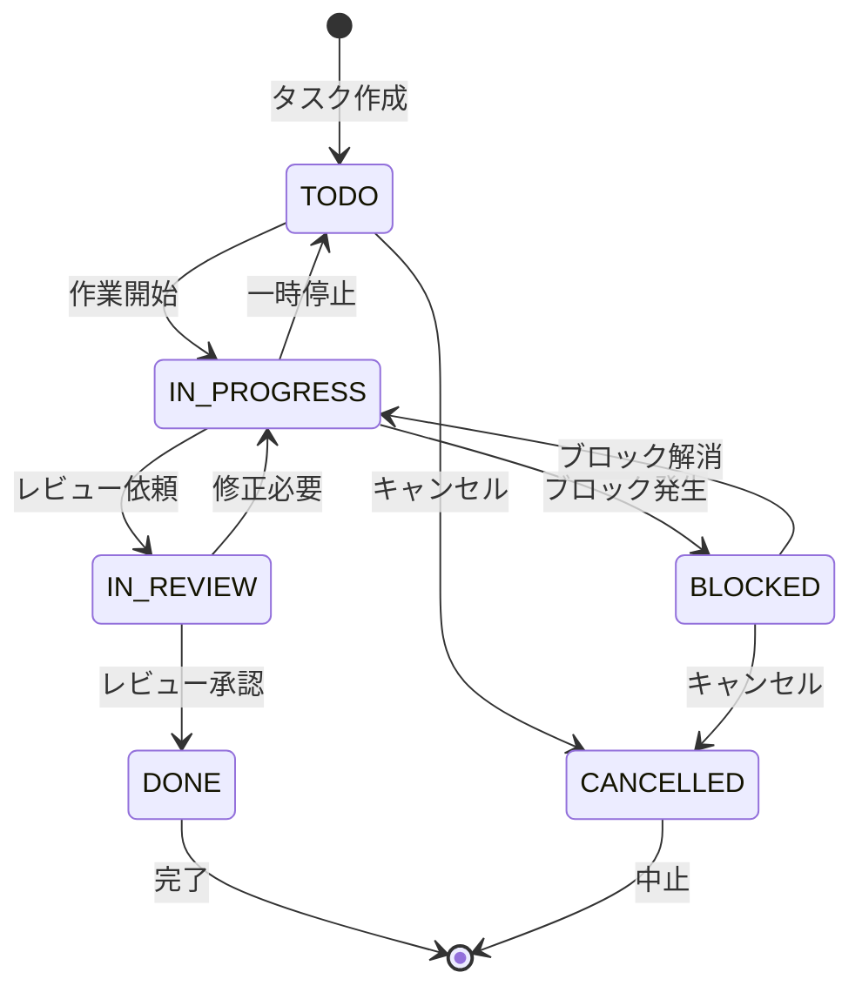

# Day 16: ステータス変更・タイマーを実装しよう

## 🎯 今日のゴール

タスクのステータスをワンクリックで変更でき、
作業時間を計測するタイマー機能を実装します。
さらに、手動で作業時間を記録するダイアログも
作ります。


## 🤔 なぜこれを作るのか？

タスクの進捗を可視化し、作業時間を正確に記録
する機能は、プロジェクト管理に不可欠です。

> 💡 **例え話**: ステータスは「信号機」で、
> 赤（TODO）→黄色（IN_PROGRESS）→青（DONE）と変わります。
> タイマーは「ストップウォッチ」で、
> スタート/ストップで作業時間を記録します。

### 📐 タスクステータス遷移図



### やること / やらないこと

| やること | やらないこと |
|---------|-------------|
| ステータス変更（api.task.update） | ドラッグ＆ドロップでのステータス変更 |
| TaskTimer コンポーネント | カンバンボード表示 |
| タイマー開始/停止 | ポモドーロ機能 |
| 手動時間記録（TimeLogDialog） | レポート機能（Day 21-23） |

### 🆕 新しく学ぶ概念

| 概念 | 読み方 | 役割 | 例え |
|------|--------|------|------|
| setInterval | セット・インターバル | 定期的に関数を実行 | 時計の秒針の動き |
| clearInterval | クリア・インターバル | 定期実行を停止 | ストップウォッチの停止ボタン |
| useEffect cleanup | クリーンアップ | コンポーネント解除時の後片付け | 部屋を出る時に電気を消す |
| mutateAsync | ミューテート・アシンク | 非同期でAPIを呼ぶ | 注文して料理が届くのを待つ |

## 📊 実装ステップ一覧

| ステップ | 作業内容 | 所要時間 |
|---------|---------|---------|
| Step 1 | ステータス変更を実装する | 5分 |
| Step 2 | TaskTimerの骨格を作る | 5分 |
| Step 3 | タイマーのカウントアップ | 5分 |
| Step 4 | 開始/停止のAPI呼び出し | 5分 |
| Step 5 | 時間のフォーマット表示 | 5分 |
| Step 6 | TimeLogDialogを作る | 7分 |
| Step 7 | 手動時間記録のAPI呼び出し | 5分 |
| Step 8 | TaskCardにタイマーを組み込む | 5分 |
| Step 9 | 動作確認 | 3分 |

**合計時間**: 約45分

---

### Step 1: ステータス変更を実装する（5分）

🎯 **ゴール**: タスクのステータスを変更する処理
を実装します。

💻 **実装**:

```typescript
// filepath: src/app/task/page.tsx
// ステータス変更は api.task.update を使う
// updateMutation は Day 15 で定義済み
// status だけ渡せばステータスのみを変更できる
updateMutation.mutate({
  id: taskId,
  status: newStatus,
});
```

✅ **確認ポイント**:
- ステータスを変更するとBadgeが変わる
- 一覧が自動で更新される

> 💡 専用の `updateStatus` APIはありません。
> `api.task.update` に `id` と `status` だけ
> 渡すことで、ステータスだけを変更できます。
> 他のフィールドは `undefined` のままなので
> 変更されません。

#### api.task.update の柔軟性

| 渡すパラメータ | 結果 |
|--------------|------|
| `{ id, status }` | ステータスだけ変更 |
| `{ id, priority }` | 優先度だけ変更 |
| `{ id, title, description }` | タイトルと説明を変更 |
| `{ id, assigneeId: null }` | 担当者をクリア |

✅ **確認ポイント**:
- ステータスを変更するとBadgeが変わる
- 一覧が自動で更新される

---

### Step 2: TaskTimerの骨格を作る（5分）

🎯 **ゴール**: タイマーコンポーネントの基本構造
を作ります。

💻 **実装**:

```typescript
// filepath: src/component/task/task-timer.tsx
'use client';

import {
  Loader2, PauseIcon, PlayIcon,
} from 'lucide-react';
import { useEffect, useState } from 'react';
import toast from 'react-hot-toast';
import { Button } from '@/component/ui/button';
import { api } from '@/trpc/react';
```

```typescript
// filepath: src/component/task/task-timer.tsx
interface TaskTimerProps {
  taskId: string;
  isTimerActive: boolean;
  timerStartedAt: Date | null;
  timeSpentMinutes: number;
  onTimerUpdate?: () => void;
}
```

✅ **確認ポイント**:
- `npm run dev` でエラーが出ていない
- interfaceが定義できた

#### TaskTimerのprops

| prop | 型 | 説明 |
|------|-----|------|
| `taskId` | string | タスクのID |
| `isTimerActive` | boolean | タイマーが動作中か |
| `timerStartedAt` | Date? | 開始時刻 |
| `timeSpentMinutes` | number | 累計作業時間（分） |
| `onTimerUpdate` | function? | 更新後のコールバック |

> 💡 `timerStartedAt` はサーバーに保存された
> 開始時刻です。ブラウザを閉じて再度開いても、
> 正確な経過時間を計算できます。

✅ **確認ポイント**:
- `npm run dev` でエラーが出ていない
- interfaceが定義できた

---

### Step 3: タイマーのカウントアップ（5分）

🎯 **ゴール**: 1秒ごとに経過時間を更新する処理
を実装します。

💻 **実装**:

```typescript
// filepath: src/component/task/task-timer.tsx
// コンポーネント宣言とstate定義
export function TaskTimer({
  taskId, isTimerActive,
  timerStartedAt, timeSpentMinutes,
  onTimerUpdate,
}: TaskTimerProps) {
  const [elapsedSeconds, setElapsedSeconds]
    = useState(0);
```

続けて、`useEffect` でタイマーが動作中の間1秒ごとに経過時間を更新します。

```typescript
// filepath: src/component/task/task-timer.tsx
// useEffectでカウントアップ処理
  useEffect(() => {
    if (!isTimerActive || !timerStartedAt) {
      setElapsedSeconds(0);
      return;
    }
    const startTime =
      new Date(timerStartedAt).getTime();

    const updateElapsed = () => {
      const now = Date.now();
      const elapsed =
        Math.floor((now - startTime) / 1000);
      setElapsedSeconds(elapsed);
    };
    updateElapsed();

    const interval =
      setInterval(updateElapsed, 1000);
    return () => clearInterval(interval);
  }, [isTimerActive, timerStartedAt]);
```

> 💡 `setInterval` は指定したミリ秒ごとに関数
> を実行します。`return () => clearInterval()`
> はコンポーネントが消える時やタイマーが止まる
> 時に定期実行を停止します。これが
> **useEffect のクリーンアップ** です。

✅ **確認ポイント**:
- タイマー動作中は1秒ごとに値が変わる
- 停止中は0にリセットされる


---

### Step 4: 開始/停止のAPI呼び出し（5分）

🎯 **ゴール**: タイマーの開始・停止をサーバーに
保存します。

💻 **実装**:

```typescript
// filepath: src/component/task/task-timer.tsx
// タイマー更新用のmutation定義
const updateTimerMutation =
  api.task.updateTimer.useMutation({
    onSuccess: () => {
      onTimerUpdate?.();
    },
  });
```

続けて、開始/停止を切り替えるハンドラーを実装します。`mutateAsync` で完了を待ちます。

```typescript
// filepath: src/component/task/task-timer.tsx
// 開始/停止のトグルハンドラー
const handleStartStop = async () => {
  try {
    if (isTimerActive) {
      await updateTimerMutation.mutateAsync({
        id: taskId,
        action: 'stop',
      });
    } else {
      await updateTimerMutation.mutateAsync({
        id: taskId,
        action: 'start',
      });
    }
  } catch (_error) {
    toast.error(
      'タイマーの更新に失敗しました',
    );
  }
};
```

✅ **確認ポイント**:
- 「タイマー開始」で開始される
- 「タイマー停止」で停止される

#### updateTimer APIのアクション

| action | 動作 | サーバー側の処理 |
|--------|------|----------------|
| `'start'` | タイマー開始 | `timerStartedAt` に現在時刻を保存 |
| `'stop'` | タイマー停止 | 経過時間を `timeSpentMinutes` に加算 |

> 💡 `mutateAsync` は `mutate` の非同期版です。
> `await` で完了を待ってからUIを更新します。
> エラーが発生した場合は `catch` で処理します。

✅ **確認ポイント**:
- 「タイマー開始」で開始される
- 「タイマー停止」で停止される

---

### Step 5: 時間のフォーマット表示（5分）

🎯 **ゴール**: 経過時間と累計時間を見やすく
表示します。

💻 **実装**:

```typescript
// filepath: src/component/task/task-timer.tsx
const formatTime = (seconds: number) => {
  const hours =
    Math.floor(seconds / 3600);
  const minutes =
    Math.floor((seconds % 3600) / 60);
  const secs = seconds % 60;
  return `${hours.toString().padStart(2, '0')}`
    + `:${minutes.toString().padStart(2, '0')}`
    + `:${secs.toString().padStart(2, '0')}`;
};

const formatMinutes =
  (minutes: number) => {
    const hours = Math.floor(minutes / 60);
    const mins = Math.floor(minutes % 60);
    return hours > 0
      ? `${hours}h ${mins}m`
      : `${mins}m`;
  };
```

```typescript
// filepath: src/component/task/task-timer.tsx
// JSXの表示部分: ボタン
return (
  <div className="flex flex-col gap-2">
    <div className="flex items-center gap-2">
      <Button
        variant={isTimerActive
          ? 'destructive' : 'default'}
        size="sm"
        onClick={handleStartStop}
        disabled={
          updateTimerMutation.isPending}>
        {isTimerActive
          ? <PauseIcon className="w-4 h-4" />
          : <PlayIcon className="w-4 h-4" />}
        {isTimerActive
          ? 'タイマー停止'
          : 'タイマー開始'}
      </Button>
```

```typescript
// filepath: src/component/task/task-timer.tsx
// JSXの表示部分: 経過時間と累計
      {isTimerActive && (
        <span className="text-lg font-bold
          font-mono text-primary">
          {formatTime(elapsedSeconds)}
        </span>
      )}
    </div>
    <p className="text-sm
      text-muted-foreground">
      合計作業時間:
      {formatMinutes(timeSpentMinutes)}
    </p>
  </div>
);
```

✅ **確認ポイント**:
- 動作中は `00:00:00` 形式で表示
- 累計時間が `2h 30m` 形式で表示

#### 2つのフォーマット関数

| 関数 | 用途 | 表示例 |
|------|------|--------|
| `formatTime` | 経過秒をHH:MM:SSで表示 | `01:23:45` |
| `formatMinutes` | 累計分をh m形式で表示 | `2h 30m` |

> 💡 `padStart(2, '0')` は「2桁になるまで
> 先頭にゼロを埋める」メソッドです。
> `5` → `"05"` のようにゼロ埋めされます。

✅ **確認ポイント**:
- 動作中は `00:00:00` 形式で表示
- 累計時間が `2h 30m` 形式で表示

---

### Step 6: TimeLogDialogを作る（7分）

🎯 **ゴール**: 手動で作業時間を記録する
ダイアログを作ります。

💻 **実装**:

```typescript
// filepath: src/component/task/time-log-dialog.tsx
'use client';

import { useState } from 'react';
import toast from 'react-hot-toast';
import { Button } from '@/component/ui/button';
import {
  Dialog, DialogContent,
  DialogDescription, DialogFooter,
  DialogHeader, DialogTitle,
} from '@/component/ui/dialog';
import { Input } from '@/component/ui/input';
import { Label } from '@/component/ui/label';
import { api } from '@/trpc/react';
```

```typescript
// filepath: src/component/task/time-log-dialog.tsx
interface TimeLogDialogProps {
  open: boolean;
  onClose: () => void;
  taskId: string;
  onSuccess?: () => void;
}
```

> 💡 タイマーは自動で時間を計測しますが、
> 手動記録は「昨日2時間作業した」のように
> 後から記録する場合に使います。
> タイムシートの手書き版のようなものです。

```typescript
// filepath: src/component/task/time-log-dialog.tsx
export function TimeLogDialog({
  open, onClose, taskId, onSuccess,
}: TimeLogDialogProps) {
  const [hours, setHours] = useState('');
  const [minutes, setMinutes] = useState('');

  const handleClose = () => {
    setHours('');
    setMinutes('');
    onClose();
  };

  // 入力バリデーション: 数字のみ許可
  const handleHoursChange = (
    e: React.ChangeEvent<HTMLInputElement>,
  ) => {
    const value = e.target.value;
    if (value === '' || /^\d+$/.test(value))
      setHours(value);
  };
```

```typescript
// filepath: src/component/task/time-log-dialog.tsx
  // 分は0-59の範囲に制限
  const handleMinutesChange = (
    e: React.ChangeEvent<HTMLInputElement>,
  ) => {
    const value = e.target.value;
    if (value === ''
      || (/^\d+$/.test(value)
        && Number.parseInt(value, 10) < 60))
      setMinutes(value);
  };
```

```typescript
// filepath: src/component/task/time-log-dialog.tsx
// TimeLogDialog: Dialog構造
  return (
    <Dialog open={open}
      onOpenChange={handleClose}>
      <DialogContent className="space-y-4">
        <DialogHeader>
          <DialogTitle>
            作業時間の記録
          </DialogTitle>
          <DialogDescription>
            タスクに作業時間を記録します
          </DialogDescription>
        </DialogHeader>
        <div className="flex gap-4">
          <div className="flex-1">
            <Label htmlFor="hours">
              時間
            </Label>
            <Input id="hours"
              value={hours}
              onChange={handleHoursChange}
              inputMode="numeric" />
          </div>
```

```typescript
// filepath: src/component/task/time-log-dialog.tsx
// TimeLogDialog: 分の入力と閉じタグ
          <div className="flex-1">
            <Label htmlFor="minutes">
              分
            </Label>
            <Input id="minutes"
              value={minutes}
              onChange={handleMinutesChange}
              inputMode="numeric" />
          </div>
        </div>
      </DialogContent>
    </Dialog>
  );
}
```

✅ **確認ポイント**:
- ダイアログが開閉できる
- 時間と分の入力欄がある


---

### Step 7: 手動時間記録のAPI呼び出し（5分）

🎯 **ゴール**: 入力した時間をサーバーに保存
します。

💻 **実装**:

```typescript
// filepath: src/component/task/time-log-dialog.tsx
// TimeLogDialog内に追加: mutation定義
const addTimeMutation =
  api.task.addTime.useMutation({
    onSuccess: () => {
      onSuccess?.();
      handleClose();
    },
  });
```

続けて、送信ボタンの有効/無効を制御する`isValid`を定義します。

```typescript
// filepath: src/component/task/time-log-dialog.tsx
// 合計0分の場合は送信不可
const isValid =
  Number.parseInt(hours || '0', 10) * 60
  + Number.parseInt(minutes || '0', 10)
  > 0;
```

> 💡 Step 5 で定義した `handleHoursChange` と
> `handleMinutesChange` は正規表現 `/^\d+$/` で
> 数字のみを受け付けます。`isValid` は合計が
> 0より大きい場合のみ送信ボタンを有効にします。

✅ **確認ポイント**:
- `npm run dev` でエラーが出ていない
- 入力欄に文字を打っても数字以外は入らない

#### バリデーション関数の役割

| 関数 | 制限 | 理由 |
|------|------|------|
| `handleHoursChange` | 数字のみ | 不正入力の防止 |
| `handleMinutesChange` | 数字のみ＋60未満 | 時間形式の制限 |
| `isValid` | 合計 > 0 | 0分の記録を防止 |

```typescript
// filepath: src/component/task/time-log-dialog.tsx
// 送信ハンドラー
const handleSubmit = async () => {
  const totalMinutes =
    Number.parseInt(hours || '0', 10) * 60
    + Number.parseInt(minutes || '0', 10);
  if (totalMinutes <= 0) return;
  try {
    await addTimeMutation.mutateAsync({
      id: taskId,
      minutesToAdd: totalMinutes,
    });
  } catch (_error) {
    toast.error(
      '作業時間の追加に失敗しました',
    );
  }
};
```

✅ **確認ポイント**:
- 「1時間30分」を入力して追加できる
- 累計時間に加算される
- 数字以外は入力できない

#### addTime APIのパラメータ

| パラメータ | 型 | 説明 |
|-----------|-----|------|
| `id` | string | タスクID |
| `minutesToAdd` | number | 追加する分数 |

```typescript
// filepath: src/component/task/time-log-dialog.tsx
// DialogFooter内のボタン
<DialogFooter>
  <Button variant="outline"
    onClick={handleClose}>
    キャンセル
  </Button>
  <Button onClick={handleSubmit}
    disabled={
      !isValid
      || addTimeMutation.isPending
    }>
    {addTimeMutation.isPending
      ? '追加中...'
      : '時間を追加'}
  </Button>
</DialogFooter>
```

> 💡 `Number.parseInt(hours || '0', 10)` は
> 空文字の場合に `0` として計算します。
> 時間×60＋分で合計分数を算出します。

✅ **確認ポイント**:
- 「1時間30分」を入力して追加できる
- 累計時間に加算される

---

### Step 8: TaskCardにタイマーを組み込む（5分）

🎯 **ゴール**: 作成した `TaskTimer` と
`TimeLogDialog` を `TaskCard` に組み込んで
タスクカード上でタイマーを使えるようにします。

💻 **実装**:

まず、`task-card.tsx` に2つのコンポーネントを
import します。

```typescript
// filepath: src/component/task/task-card.tsx
// TaskTimerとTimeLogDialogのインポート
import { TaskTimer } from './task-timer';
import { TimeLogDialog }
  from './time-log-dialog';
import { Clock } from 'lucide-react';
```

次に、`TaskCardProps` にタイマー関連のpropsを
追加します。

```typescript
// filepath: src/component/task/task-card.tsx
// TaskCardPropsにタイマー用プロパティ追加
interface TaskCardProps {
  // ...既存のprops
  isTimerActive?: boolean;
  timerStartedAt?: Date | null;
  timeSpentMinutes?: number;
  onTimerUpdate?: () => void;
}
```

手動記録ダイアログの開閉state とハンドラーを追加します。

```typescript
// filepath: src/component/task/task-card.tsx
// TaskCard 関数内に追加
const [timeLogDialogOpen,
  setTimeLogDialogOpen] = useState(false);
const handleOpenTimeLog = () =>
  setTimeLogDialogOpen(true);
```

カード内のJSXに `TaskTimer` と「時間を記録」
ボタンを追加します。

```typescript
// filepath: src/component/task/task-card.tsx
// CardContent内にTaskTimerを追加
<TaskTimer
  taskId={id}
  isTimerActive={isTimerActive ?? false}
  timerStartedAt={timerStartedAt ?? null}
  timeSpentMinutes={
    timeSpentMinutes ?? 0}
  onTimerUpdate={onTimerUpdate}
/>
<Button
  variant="ghost"
  size="sm"
  onClick={handleOpenTimeLog}>
  <Clock className="w-4 h-4 mr-1" />
  時間を記録
</Button>
```

最後にカードの閉じタグの前に `TimeLogDialog` を
配置します。

```typescript
// filepath: src/component/task/task-card.tsx
// TimeLogDialogの配置
<TimeLogDialog
  open={timeLogDialogOpen}
  onClose={() =>
    setTimeLogDialogOpen(false)}
  taskId={id}
  onSuccess={onTimerUpdate}
/>
```

✅ **確認ポイント**:
- タスクカード内にタイマーボタンが表示される
- 「時間を記録」ボタンが表示される

#### TaskCard に追加したprops

| prop | デフォルト値 | 説明 |
|------|------------|------|
| `isTimerActive` | `false` | タイマー動作中か |
| `timerStartedAt` | `null` | タイマー開始時刻 |
| `timeSpentMinutes` | `0` | 累計作業時間（分） |
| `onTimerUpdate` | - | 更新後のコールバック |

> 💡 既存の `TaskCard` に新しいコンポーネントを
> 組み込むパターンは、React開発で頻繁に使います。
> 小さなコンポーネントを作り、親コンポーネントに
> 配置する「コンポジション」の考え方です。

---

### Step 9: 動作確認（3分）

🎯 **ゴール**: ステータス変更・タイマーの全機能
を確認します。

1. タスクのステータスを変更する
2. 「タイマー開始」でタイマーを開始
3. 経過時間が `00:00:XX` と表示される
4. 「タイマー停止」で停止
5. 累計時間に加算される
6. 「作業時間の記録」で手動時間を追加
7. 累計時間がさらに加算される

✅ **確認ポイント**:
- ステータス変更が反映される
- タイマーが1秒ごとにカウントアップする
- 停止後に累計時間が更新される
- 手動記録が累計時間に反映される

---

```bash
# filepath: ターミナル
# 開発サーバーを起動して動作確認
npm run dev
```

## 📋 今日のまとめ

- [ ] `api.task.update` でステータスを変更できた
- [ ] TaskTimer でタイマーを実装できた
- [ ] `useEffect` + `setInterval` でカウントアップ
- [ ] TimeLogDialog で手動記録できた

## ⚠️ つまずきポイント

| エラー / 問題 | 原因 | 解決方法 |
|--------------|------|---------|
| タイマーが止まらない | clearInterval未実行 | useEffectのreturnで停止 |
| 経過時間がずれる | ローカル時間計算 | サーバーのtimerStartedAt基準 |
| 手動記録が反映されない | invalidate忘れ | onSuccessでキャッシュ更新 |
| ボタンが効かない | isPending未チェック | disabled属性で二重送信防止 |

## 📝 今日学んだ用語

| 用語 | 意味 |
|------|------|
| setInterval | 一定間隔で関数を繰り返し実行 |
| clearInterval | setIntervalの実行を停止 |
| useEffect cleanup | return関数で後片付けをする |
| mutateAsync | 完了を待てる非同期版のmutate |
| padStart | 文字列の先頭をゼロ埋めする |

## 🔜 次回予告

Day 17 では、自分に割り当てられたタスクだけを
表示する「マイタスク」ページを作ります。期限別の
グループ表示で、今日やるべきことが一目でわかる
ようになります。
