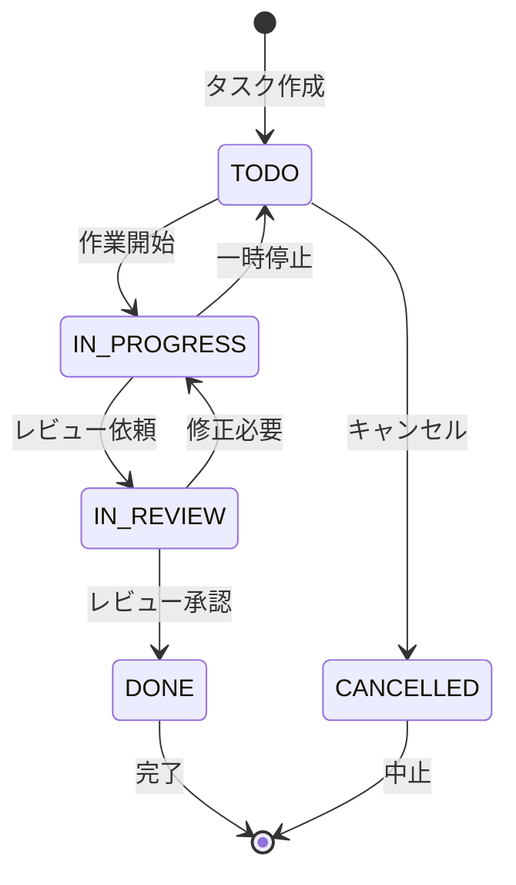
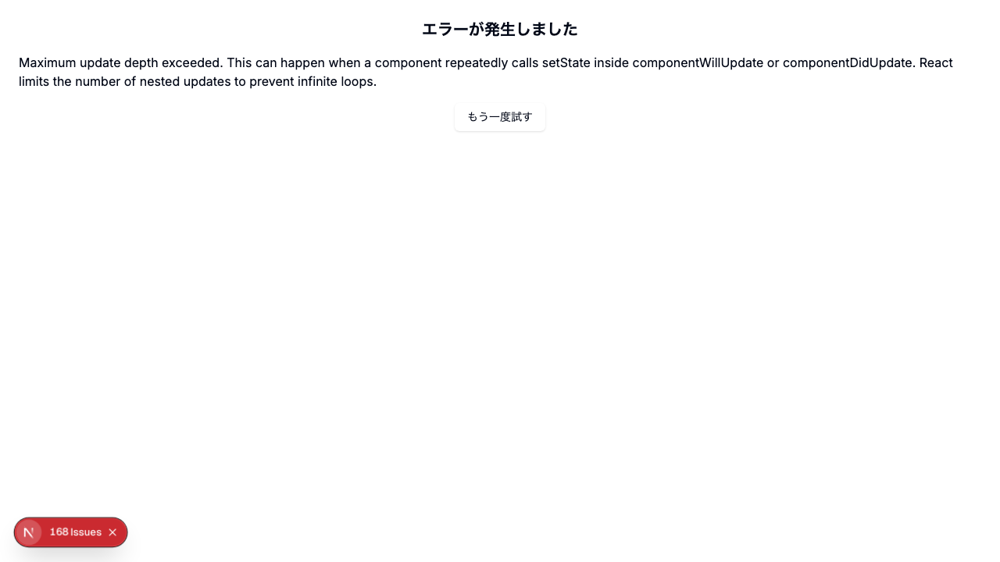

# Day 16: ステータス変更と作業時間の記録を実装しよう

## 前回の振り返り

Day 15 で学んだことは次のとおりです。
- TaskDialog を `initialData` で編集モードに切り替え
- `DeleteConfirmDialog` で削除前の確認
- `null` と `undefined` の使い分け

今日はステータスのワンクリック変更と、
作業時間を後から手で記録する機能を作ります。

---

## 今日のゴール

タスクのステータスを編集ダイアログから変更でき、
作業した時間を後から手で記録できるようにします。
記録した時間は合計作業時間として
カードに表示されます。

スクリーンショット: タスク詳細ダイアログの画面。


> **今日のゴールライン**: ステータスを変更すると一覧に反映され、時間を記録すると合計作業時間が増える。この2つの流れが動けばOKです。

## なぜこれを作るのか

タスクが「未着手か、進行中か、完了か」がひと目で
分からないと、何から手を付けるか毎回考え直すことになります。
さらに作業時間を記録しておくと、あとから
「何にどれだけかかったか」を振り返れます。

> **例え話**: ステータスは「信号機」です。
> 赤（TODO）→黄色（IN_PROGRESS）→青（DONE）と
> 状態が進んでいきます。
> 作業時間の記録は「作業日報に工数を書き込む」
> ことに似ています。仕事が終わったあとに
> 「このタスクに1時間半かけた」と書き足す、
> 後追いの記録です。

作業日報の比喩を実際の操作に置き換えると、
タスクカードの「時間記録」ボタンから
時間と分を入力して保存する、という流れになります。

### タスクステータス遷移図

この図は主要な遷移のみを示しています。



### やること / やらないこと

| やること | やらないこと |
|---------|-------------|
| ステータス変更（api.task.update） | ドラッグ＆ドロップでのステータス変更 |
| 手動時間記録（TimeLogDialog） | カンバンボード表示 |
| 合計作業時間の表示 | 作業時間の自動計測 |
| ステータス遷移の配列管理 | レポート機能（Day 21-23） |

### 新しく学ぶ概念

| 概念 | 読み方 | 役割 | 例え |
|------|--------|------|------|
| mutateAsync | ミューテート・アシンク | 非同期でAPIを呼び、完了を待つ | 注文して料理が届くのを待つ |
| zod | ゾッド | 入力の形をルールとして検証する | 書類の記入漏れをチェックする係 |
| refine | リファイン | 複数項目をまたぐ独自ルールを足す | 「合計が1以上」のような追加条件 |

## 実装ステップ一覧

| ステップ | 作業内容 | 所要時間 |
|---------|---------|---------|
| Step 1 | ステータス変更の仕組みを理解する | 3分 |
| Step 2 | TimeLogDialogで手動時間記録を作る | 8分 |
| Step 3 | TaskCardに時間記録を組み込む | 5分 |
| Step 4 | 動作確認 | 3分 |

**合計時間**: 約19分。

---

### Step 1: ステータス変更の仕組みを理解する（3分）

**ゴール**: タスクのステータスが
どのように変更されるかを理解します。

ステータス変更は **Day 15 で作った編集ダイアログ
（TaskDialog）** から行います。
新しいUIは作りません。

Day 15 の `handleSubmit` は `api.task.update` を
呼び出しています。
この API（アプリ同士がやり取りする窓口）に
`status` フィールドを渡すだけで
ステータスを変更できます。

```typescript
// filepath: src/app/task/page.tsx
// Day 15 で作成済みの updateMutation
const updateMutation =
  api.task.update.useMutation({
    onSuccess: () => {
      utils.task.getAll.invalidate();
      setDialogOpen(false);
    },
  });
```

`onSuccess` の中で `getAll.invalidate()` を呼ぶのが
このコードの肝です。`invalidate` はキャッシュを
「古くなった」と印を付けて再取得させる命令です。
更新後に一覧を取り直すことで、変更後のステータスが
すぐ画面へ反映されます。

> 専用の `updateStatus` API はありません。
> `api.task.update` に `id` と `status` だけ
> 渡すことで、ステータスだけを変更できます。
> 他のフィールドは変更されません。

#### api.task.update の柔軟性

| 渡すパラメータ | 結果 |
|--------------|------|
| `{ id, status }` | ステータスだけ変更 |
| `{ id, priority }` | 優先度だけ変更 |
| `{ id, title, description }` | タイトルと説明を変更 |
| `{ id, assigneeId: null }` | 担当者をクリア |

1つの `update` API が
これだけの変更をまかなえるのは、
渡さなかったフィールドを
サーバー側で「変更なし」として扱うからです。
だから小さな変更のたびに専用APIを増やす必要がありません。

#### ステータス変更の方法

| 方法 | 実装場所 | 説明 |
|------|---------|------|
| 編集ダイアログ | TaskDialog（Day 15） | Select でステータスを選択 |
| 一括操作 | タスク一覧ページ（Day 28） | 複数タスクを一括変更 |
| 詳細画面 | TaskDetailDialog（Day 17） | 詳細画面からの変更 |

**確認ポイント**:
- 編集ダイアログでステータスの Select がある
- ステータスを変更して保存すると Badge が変わる
- 一覧画面に変更が即反映される

---

### Step 2: TimeLogDialogで手動時間記録を作る（8分）

**ゴール**: 作業時間を後から手で記録する
ダイアログを1ファイルで完成させます。

作業時間は自動では計測しません。
「昨日このタスクに1時間30分かけた」のように、
終わったあとに自分で入力する後追いの記録です。
入力した合計分を `api.task.addTime` に渡して
サーバー側の合計へ足し込みます。

**実装**:

```typescript
// filepath: src/component/task/time-log-dialog.tsx
'use client';

import { zodResolver }
  from '@hookform/resolvers/zod';
import toast from 'react-hot-toast';
import { useForm } from 'react-hook-form';
import { z } from 'zod';
import { Button } from '@/component/ui/button';
```

`react-hook-form` はフォームの入力値を管理する
ライブラリで、`zod` は入力ルールを書く
ライブラリです。`zodResolver` はこの2つを
つなぐ接着剤です。zod のルールを
フォームの検証へそのまま流用できます。

```typescript
// filepath: src/component/task/time-log-dialog.tsx
// 残りのインポート
import {
  Dialog, DialogContent,
  DialogDescription, DialogFooter,
  DialogHeader, DialogTitle,
} from '@/component/ui/dialog';
import { Input } from '@/component/ui/input';
import { Label } from '@/component/ui/label';
import { api } from '@/trpc/react';
```

`Dialog` 系はモーダル（画面に重ねて出す小窓）を
組み立てる部品です。`Input` と `Label` で
入力欄とその見出しを作り、`api` から
`addTime` を呼び出します。必要な部品を
先にすべて読み込んでおくと、あとの実装で
迷わずに済みます。

```typescript
// filepath: src/component/task/time-log-dialog.tsx
// バリデーションスキーマ定義
const timeLogSchema = z.object({
  hours: z.number().int().min(0),
  minutes: z.number().int().min(0).max(59),
}).refine(
  (data) => data.hours * 60 + data.minutes > 0,
  { message: '1分以上入力してください',
    path: ['minutes'] },
);
type TimeLogFormData =
  z.infer<typeof timeLogSchema>;
```

`hours` と `minutes` を単体で見ると、
どちらも0が有効な値です。しかし
「両方とも0」は記録として意味がありません。
そこで `refine` を足して、合計が1分以上かを
最後にまとめて確かめています。
`z.infer` はこのスキーマ（入力の形を定義したルール）から
TypeScript の型を自動生成します。
おかげで同じ型を二度書かずに済みます。

#### Zod スキーマのルール

| フィールド | 制約 | エラーになる例 |
|-----------|------|--------------|
| `hours` | 0以上の整数 | `-1`、`1.5` |
| `minutes` | 0〜59の整数 | `60`、`-5` |
| `refine` | 合計 > 0分 | 両方0のまま送信 |

```typescript
// filepath: src/component/task/time-log-dialog.tsx
// Props定義とコンポーネント宣言
interface TimeLogDialogProps {
  open: boolean;
  onClose: () => void;
  taskId: string;
  onSuccess?: () => void;
}

export function TimeLogDialog({
  open, onClose, taskId, onSuccess,
}: TimeLogDialogProps) {
  const {
    register, handleSubmit, reset,
    formState: { errors },
  } = useForm<TimeLogFormData>({
    resolver: zodResolver(timeLogSchema),
    defaultValues: { hours: 0, minutes: 0 },
  });
```

Props（親から受け取る値）には
`onSuccess` を用意しています。
記録が成功したときに親へ知らせるための
コールバックです。`useForm` に `zodResolver` を渡すと、
先ほどのスキーマがそのまま入力検証に使われます。
検証で引っかかった内容は `errors` に入るので、
あとで画面に表示できます。

```typescript
// filepath: src/component/task/time-log-dialog.tsx
// mutation定義
  const addTimeMutation =
    api.task.addTime.useMutation({
      onSuccess: () => {
        onSuccess?.();
        reset();
        onClose();
      },
    });
```

`addTime` の成功後にやることは3つです。
まず `onSuccess?.()` で親のコールバックを呼びます。
この呼び出しが親側の再取得（`getAll.invalidate`）を
引き起こし、増えたあとの合計作業時間が
カードへ流れて表示が更新されます。
続いて `reset()` で入力欄を空に戻し、
`onClose()` でダイアログを閉じます。

```typescript
// filepath: src/component/task/time-log-dialog.tsx
// 送信ハンドラー
  const onSubmit = async (
    data: TimeLogFormData,
  ) => {
    const totalMinutes =
      data.hours * 60 + data.minutes;
    try {
      await addTimeMutation.mutateAsync({
        id: taskId,
        minutesToAdd: totalMinutes,
      });
    } catch (err) {
      toast.error(
        err instanceof Error
          ? err.message
          : '作業時間の追加に失敗しました',
      );
    }
  };
```

`addTime` API は分単位だけを受け取ります。
そこで時間と分を `hours * 60 + minutes` で
合計分に直してから渡します。
`mutateAsync` は完了を `await` で待てる版なので、
`try` / `catch` で失敗を受け止められます。
失敗時は握りつぶさず `toast.error` で
利用者に理由を見せます。

#### addTime APIのパラメータ

| パラメータ | 型 | 説明 |
|-----------|-----|------|
| `id` | string | タスクID |
| `minutesToAdd` | number | 追加する分数 |

```typescript
// filepath: src/component/task/time-log-dialog.tsx
// Dialog UIの前半部分
  return (
    <Dialog open={open}
      onOpenChange={onClose}>
      <DialogContent className="space-y-4">
        <DialogHeader>
          <DialogTitle>
            作業時間の記録
          </DialogTitle>
          <DialogDescription>
            タスクに作業時間を記録します
          </DialogDescription>
        </DialogHeader>
```

続けて、時間の入力欄です。`src/component/task/time-log-dialog.tsx` の
`DialogHeader` の閉じタグの直後に書きます。

```typescript
        <div className="flex gap-4">
          <div className="flex-1">
            <Label htmlFor="hours">時間</Label>
            <Input id="hours"
              inputMode="numeric"
              {...register('hours',
                { valueAsNumber: true })} />
            {errors.hours && (
              <p className="text-sm
                text-destructive">
                {errors.hours.message}
              </p>
            )}
          </div>
```

`register('hours', ...)` は入力欄と
フォームの状態を結び付けます。
`valueAsNumber: true` を付けているのは、
入力欄が返す文字列を数値へ変換して
スキーマの `z.number()` と型を合わせるためです。
これを忘れると「数値のはずが文字列」になり
検証で弾かれます。
`errors.hours` の表示は次の分入力と同じ形です。
これが無いと、時間欄だけ検証エラーが
画面に出ず、利用者は何が悪いのか分かりません。

```typescript
// filepath: src/component/task/time-log-dialog.tsx
// 分入力フィールドとエラー表示
          <div className="flex-1">
            <Label htmlFor="minutes">分</Label>
            <Input id="minutes"
              inputMode="numeric"
              {...register('minutes',
                { valueAsNumber: true })} />
            {errors.minutes && (
              <p className="text-sm
                text-destructive">
                {errors.minutes.message}
              </p>
            )}
          </div>
        </div>
```

`errors.minutes` があるときだけ
エラーメッセージを表示します。
`refine` の `path` に `['minutes']` を
指定したので、「合計0分」のエラーも
この分欄の下に出ます。
利用者はどこを直せばよいか
すぐ分かります。

```typescript
// filepath: src/component/task/time-log-dialog.tsx
// フッターボタンとダイアログ終了
        <DialogFooter>
          <Button variant="outline"
            onClick={onClose}>
            キャンセル
          </Button>
          <Button
            onClick={handleSubmit(onSubmit)}
            disabled={addTimeMutation.isPending}>
            {addTimeMutation.isPending
              ? '追加中...' : '時間を追加'}
          </Button>
        </DialogFooter>
      </DialogContent>
    </Dialog>
  );
}
```

`handleSubmit(onSubmit)` は
「検証を通ったときだけ `onSubmit` を呼ぶ」
という包み方です。検証に失敗すれば
`onSubmit` は呼ばれず、`errors` が更新されます。
`disabled={addTimeMutation.isPending}` は
送信中にボタンを押せなくして、
同じ記録が二重に登録されるのを防ぎます。

**確認ポイント**:
- ダイアログが開閉できる
- 時間と分の入力欄がある
- 「1時間30分」を入力して追加できる
- 両方0のまま送信するとエラーが出る

スクリーンショット: 作業時間の記録ダイアログ。時間と分の入力欄が確認できます。




---

### Step 3: TaskCardに時間記録を組み込む（5分）

**ゴール**: `TimeLogDialog` と「時間記録」ボタンを
`TaskCard` に組み込みます。

`TaskCard` は Day 13 で一覧ページに配置したタスク表示カードです。
このカードは合計作業時間の表示欄を
すでに持っています。そこへ
記録用のボタンとダイアログを足します。

まず、`task-card.tsx` にインポートを追加します。

```typescript
// filepath: src/component/task/task-card.tsx
// TimeLogDialogとClockアイコンのインポート
import { Clock } from 'lucide-react';
import { TimeLogDialog } from './time-log-dialog';
```

`Clock` はボタンに添える時計アイコンです。
`TimeLogDialog` は Step 2 で作った
記録用のダイアログです。
カード側から呼び出すために読み込みます。

次に、合計分を読みやすい形に直す関数を用意します。

```typescript
// filepath: src/component/task/task-card.tsx
// 分を「Xh Ym」形式に変換
const formatMinutes = (minutes: number) => {
  const hours = Math.floor(minutes / 60);
  const mins = Math.floor(minutes % 60);
  return hours > 0
    ? `${hours}h ${mins}m`
    : `${mins}m`;
};
```

サーバーは作業時間を分の合計だけで持っています。
`150` のような分の数字をそのまま見せると
どれくらいか直感で分かりません。
そこで60で割って時間と分に分け、
`2h 30m` の形に整えます。
1時間未満なら `30m` のように分だけ返します。

`TaskCardProps` に合計作業時間と
成功時コールバックを受け取る口を足します。

```typescript
// filepath: src/component/task/task-card.tsx
// TaskCardPropsに追加する2つのprops
interface TaskCardProps {
  // ...既存のprops...
  timeSpentMinutes?: number;
  onTimeLogSuccess?: (() => void) | undefined;
}
```

`timeSpentMinutes` は表示する合計作業時間です。
まだ記録がないタスクもあるのでオプショナル（`?`）にします。
`onTimeLogSuccess` は記録成功を親へ伝える
コールバックで、`TimeLogDialog` の `onSuccess` に
そのまま渡します。

オプショナルにしたので、`TaskCard` 関数の引数（分割代入）では
`timeSpentMinutes = 0` と既定値 0 を付けてください。
渡されなかったタスクでも 0 として扱われ、
次に書く `formatMinutes(timeSpentMinutes)` が `NaN` になりません。

カード関数の中に、ダイアログの開閉状態と
開くためのハンドラーを足します。

```typescript
// filepath: src/component/task/task-card.tsx
// TaskCard 関数内に追加
const [timeLogDialogOpen, setTimeLogDialogOpen] =
  useState(false);

const handleOpenTimeLog = (e: React.MouseEvent) => {
  e.stopPropagation();
  setTimeLogDialogOpen(true);
};
```

`useState`（コンポーネントに状態を持たせる仕組み）で
ダイアログを開いているかどうかを管理します。
`e.stopPropagation()` を入れているのは、
ボタンのクリックがカード全体のクリックへ
伝わるのを止めるためです。
これがないと、時間記録ボタンを押しただけで
カードの詳細まで開いてしまいます。

カード内に合計作業時間の表示と
「時間記録」ボタンを置きます。

```typescript
// filepath: src/component/task/task-card.tsx
// 合計作業時間の表示と時間記録ボタン
<div className="space-y-2">
  <p className="text-sm text-muted-foreground">
    合計作業時間: {formatMinutes(timeSpentMinutes)}
  </p>
  <Button
    variant="outline"
    size="sm"
    className="w-full text-xs h-8"
    onClick={handleOpenTimeLog}
    aria-label={`${title}の時間を記録`}>
    <Clock className="mr-2 h-3 w-3" />
    時間記録
  </Button>
</div>
```

合計作業時間は `formatMinutes` を通して
`2h 30m` の形で表示します。
ボタンの `aria-label` にタスク名を入れているのは、
画面読み上げでも「どのタスクの時間記録か」が
分かるようにするためです。
ボタンを押すと `handleOpenTimeLog` が走り、
ダイアログが開きます。

最後に、カードの一番外側に `TimeLogDialog` を置きます。

```typescript
// filepath: src/component/task/task-card.tsx
// カードとダイアログをまとめて返す
return (
  <>
    <Card>
      {/* ...カードの中身... */}
    </Card>
    <TimeLogDialog
      open={timeLogDialogOpen}
      onClose={() => setTimeLogDialogOpen(false)}
      taskId={id}
      onSuccess={onTimeLogSuccess}
    />
  </>
);
```

`<>` と `</>` で囲むのは、カードとダイアログを
1つの要素として返すためです。
Reactは複数の要素を並べて返せないので、
この空タグ（フラグメント）でまとめます。
`onSuccess={onTimeLogSuccess}` を渡すことで、
記録が成功したら親のコールバックが呼ばれ、
一覧の再取得を通じて合計作業時間の表示が
最新の値に置き換わります。

**確認ポイント**:
- カードに合計作業時間が表示される
- 「時間記録」ボタンが表示される
- ボタンを押すとダイアログが開く

最後に、`page.tsx` から `TaskCard` へ合計作業時間と成功コールバックを渡します。これがないと、記録しても一覧の合計が更新されず、Step 4 の「合計作業時間が増える」確認まで到達できません。

まず、記録成功後に一覧を取り直すハンドラーを追加します。`useCallback`（同じ関数を毎回作り直さないように覚えておく React の機能）を使うので、`react` からのインポートに `useCallback` を足しておきます。

```typescript
// filepath: src/app/task/page.tsx
// 時間記録の成功後に一覧を取り直す（useCallback は react から import）
const handleTimeLogSuccess = useCallback(() => {
  void utils.task.getAll.invalidate();
}, [utils.task.getAll]);
```

`invalidate` はキャッシュに「古い」という印を付けます。画面で表示中のクエリは、この印を見つけると自動で取り直されます。そのため `refetch` を重ねて呼ぶ必要はなく、`invalidate` の1回だけで記録した分がその場で合計作業時間へ反映されます。

次に、Day 15 で置いた `<TaskCard>` に2つの props を足します。

```typescript
// filepath: src/app/task/page.tsx
// Day 15 の <TaskCard> に2つの props を追加
<TaskCard
  // ...Day 15 で渡した props...
  timeSpentMinutes={task.timeSpentMinutes}
  onTimeLogSuccess={handleTimeLogSuccess}
/>
```

`timeSpentMinutes` にサーバーが返す合計作業時間を渡し、`onTimeLogSuccess` に先ほどのハンドラーを渡します。これで「記録 → 再取得 → 合計が増える」という流れがつながり、Step 4 で増加を確認できます。

**確認ポイント**:
- `handleTimeLogSuccess` を追加し、`<TaskCard>` に2つの props を渡した

---

### Step 4: 動作確認（3分）

**ゴール**: ステータス変更と時間記録の
両方が動くことを確認します。

1. 編集ダイアログでステータスを変更する
2. 保存すると一覧の Badge が変わり、即反映される
3. カードの「時間記録」ボタンを押す
4. 時間と分を入力して「時間を追加」を押す
5. 合計作業時間が入力した分だけ増える
6. もう一度記録すると、さらに加算される

おめでとうございます。ステータス管理と
作業時間の記録が動くようになり、
本格的なタスク管理ツールに近づきました。

**確認ポイント**:
- ステータス変更が一覧に反映される
- 時間を記録すると合計作業時間が増える
- 続けて記録すると合計に加算される

スクリーンショット: 時間記録後の合計作業時間の表示。


---

```bash
# filepath: ターミナル
# 開発サーバーを起動して動作確認
PORT=3001 npm run dev
```

開発サーバーを起動すると、書いたコードが
すぐブラウザに反映されます。
`http://localhost:3001/task` を開いて、
上の手順を1つずつ試します。

**確認ポイント**:
- `npm run dev` でエラーが出ない
- `http://localhost:3001/task` にアクセスできる

---

### Pro パターンで書こう（ステータス遷移を配列で管理する）

遷移ルールを1か所にまとめると、ステータスの追加や文言の変更をする際の対応漏れを防げます。
なぜ上の書き方をするのか、**Before/After** で見比べてみましょう。

#### Before（改善前のコード）

```typescript
import { Button } from '@/component/ui/button';
import {
  TASK_STATUS,
  type TaskStatus,
} from '@/lib/constant/status';
import { api } from '@/trpc/react';

type StatusActionButtonProps = {
  taskId: string;
  status: TaskStatus;
  onUpdated?: () => void;
};

function getNextStatus(status: TaskStatus): TaskStatus {
  if (status === TASK_STATUS.TODO) {
    return TASK_STATUS.IN_PROGRESS;
  }
  if (status === TASK_STATUS.IN_PROGRESS) {
    return TASK_STATUS.IN_REVIEW;
  }
  if (status === TASK_STATUS.IN_REVIEW) {
    return TASK_STATUS.DONE;
  }
  return status;
}
```

**読み比べ用**: ここは写経しません。続けてコードを読み進めましょう。

```typescript
// filepath: 続き
function getButtonLabel(status: TaskStatus): string {
  if (status === TASK_STATUS.TODO) {
    return '作業開始';
  }
  if (status === TASK_STATUS.IN_PROGRESS) {
    return 'レビュー依頼';
  }
  if (status === TASK_STATUS.IN_REVIEW) {
    return '完了にする';
  }
  return '変更なし';
}

export function StatusActionButton({
  taskId,
  status,
```

**読み比べ用**: ここは写経しません。続けてコードを読み進めましょう。

```typescript
// filepath: 続き
  onUpdated,
}: StatusActionButtonProps) {
  const updateMutation =
    api.task.update.useMutation({
      onSuccess: onUpdated,
    });

  const nextStatus = getNextStatus(status);
  const disabled = nextStatus === status;

  return (
    <Button
      disabled={disabled || updateMutation.isPending}
      onClick={() => {
        updateMutation.mutate({
          id: taskId,
          status: nextStatus,
        });
      }}
    >
      {getButtonLabel(status)}
    </Button>
  );
}
```

**このコードの問題点**:

- 遷移先とボタン文言が別々の `if` に分かれ、対応関係を目で追いにくい
- 新しい遷移を追加すると、複数の関数を同じ順番で更新する必要がある
- 「このステータスでは何ができるか」がコード上で一覧になっていない

#### After（プロが書くコード）

```typescript
import { Button } from '@/component/ui/button';
import {
  TASK_STATUS,
  type TaskStatus,
} from '@/lib/constant/status';
import { api } from '@/trpc/react';

type StatusActionButtonProps = {
  taskId: string;
  status: TaskStatus;
  onUpdated?: () => void;
};

type StatusTransition = {
  from: TaskStatus;
  to: TaskStatus;
  label: string;
};

const STATUS_TRANSITIONS: StatusTransition[] = [
  {
    from: TASK_STATUS.TODO,
    to: TASK_STATUS.IN_PROGRESS,
    label: '作業開始',
```

**読み比べ用**: ここは写経しません。続けてコードを読み進めましょう。

```typescript
// filepath: 続き
  },
  {
    from: TASK_STATUS.IN_PROGRESS,
    to: TASK_STATUS.IN_REVIEW,
    label: 'レビュー依頼',
  },
  {
    from: TASK_STATUS.IN_REVIEW,
    to: TASK_STATUS.DONE,
    label: '完了にする',
  },
];

function findTransition(status: TaskStatus) {
  return STATUS_TRANSITIONS.find(
    (transition) => transition.from === status,
  );
}

```

**読み比べ用**: ここは写経しません。続けてコードを読み進めましょう。

```typescript
// filepath: 続き
export function StatusActionButton({
  taskId,
  status,
  onUpdated,
}: StatusActionButtonProps) {
  const updateMutation =
    api.task.update.useMutation({
      onSuccess: onUpdated,
    });
  const transition = findTransition(status);

  return (
    <Button
      disabled={
        !transition || updateMutation.isPending
      }
      onClick={() => {
        if (!transition) return;
        updateMutation.mutate({
          id: taskId,
          status: transition.to,
        });
      }}
    >
```

**読み比べ用**: ここは写経しません。続けてコードを読み進めましょう。

```typescript
// filepath: 続き
      {transition?.label ?? '変更なし'}
    </Button>
  );
}
```

**このコードの強み**:

- `from` / `to` / `label` が1つの配列にまとまり、遷移ルールを一覧で読める
- `find()` で該当する遷移だけを探すため、分岐が増えても関数が太りにくい
- 新しい遷移を追加するときは `STATUS_TRANSITIONS` に1行足すだけで済む

#### 覚えておきたいエッセンス

同じ条件の `if` が何度も出てきたら、配列にしてデータとして扱えないか考えます。
ルールをコードの分岐に埋めるより、一覧できる形にすると変更に強くなります。

## 今日のまとめ

- [ ] `api.task.update` でステータスを変更できた
- [ ] TimeLogDialog で作業時間を手動記録できた
- [ ] `api.task.addTime` で合計作業時間を加算できた
- [ ] TaskCard に時間記録ボタンとダイアログを組み込めた

## つまずきポイント

| エラー / 問題 | 原因 | 解決方法 |
|--------------|------|---------|
| 手動記録が反映されない | invalidate忘れ | onSuccessで親の再取得を呼ぶ |
| 数値が文字列扱いになる | valueAsNumber未指定 | registerにvalueAsNumberを付ける |
| 両方0でも送信できる | refine未設定 | zodのrefineで合計>0を検証 |
| ボタンが効かない | isPending未チェック | disabled属性で二重送信防止 |

## 今日学んだ用語

| 用語 | 意味 |
|------|------|
| mutateAsync | 完了を待てる非同期版のmutate |
| zod | 入力の形をルールとして検証するライブラリ |
| refine | 複数項目をまたぐ独自ルールを足すzodの機能 |
| zodResolver | zodのルールをreact-hook-formの検証につなぐ部品 |
| invalidate | キャッシュを古い印にして再取得させる命令 |

## 次回予告

Day 17 では、自分に割り当てられたタスクだけを
表示する「マイタスク」ページを作ります。期限別の
グループ表示で、今日やるべきことをすばやく
把握できるようになります。
