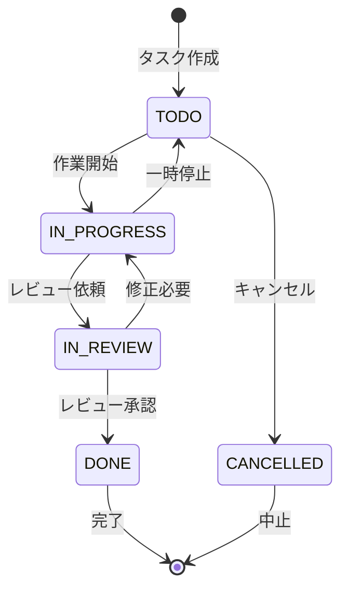
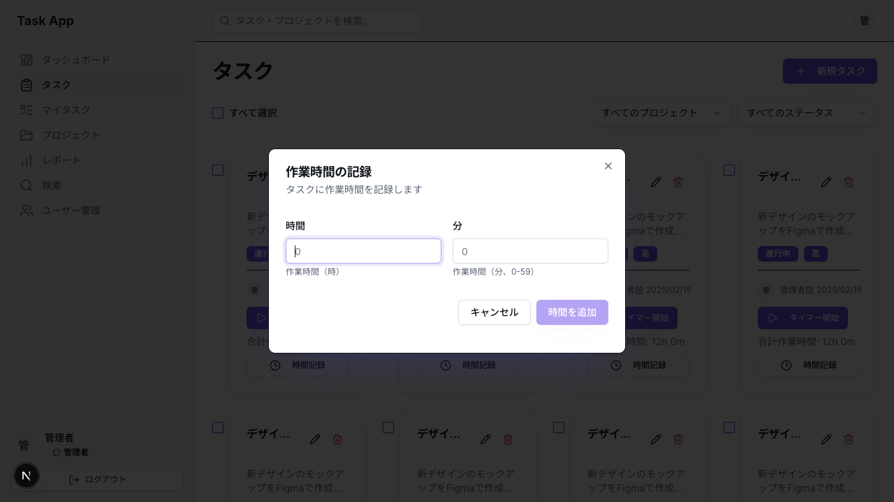

# Day 16: ステータス変更と作業時間の記録を実装しよう

## 前回の振り返り

Day 15 で学んだことは次のとおりです。
- TaskDialog を `initialData` で編集モードに切り替え
- `DeleteConfirmDialog` で削除前の確認
- `null` と `undefined` の使い分け

今日はステータスのワンクリック変更と、
作業時間を後から手で記録する機能を作ります。

---

## 今日のゴール

タスクのステータスを編集ダイアログから変更でき、
作業した時間を後から手で記録できるようにします。
記録した時間は合計作業時間として
カードに表示されます。

この日は、まずサーバー側の作業時間記録 API（`addTime`）を自分で書きます。そのあと画面をつなぎます。

スクリーンショット: タスク詳細ダイアログの表示を確認してください。


> **今日のゴールライン**: ステータスを変更すると一覧に反映され、時間を記録すると合計作業時間が増えます。この2つの流れが動けばOKです。

## なぜこれを作るのか

タスクが「未着手か、進行中か、完了か」がひと目で
分からないと、何から手を付けるか毎回考え直すことになります。
さらに作業時間を記録しておくと、あとから
「何にどれだけかかったか」を振り返れます。

> **例え話**: ステータスは「信号機」です。
> 赤（TODO）→黄色（IN_PROGRESS）→青（DONE）と
> 状態が進んでいきます。
> 作業時間の記録は「作業日報に工数を書き込む」
> ことに似ています。仕事が終わったあとに
> 「このタスクに1時間半かけた」と書き足す、
> 後追いの記録です。

作業日報の比喩を実際の操作に置き換えると、
タスクカードの「時間記録」ボタンから
時間と分を入力して保存する、という流れになります。

### タスクステータス遷移図

この図は主要な遷移のみを示しています。


```mermaid
stateDiagram-v2
    [*] --> TODO: タスク作成

    TODO --> IN_PROGRESS: 作業開始
    TODO --> CANCELLED: キャンセル

    IN_PROGRESS --> IN_REVIEW: レビュー依頼
    IN_PROGRESS --> TODO: 一時停止

    IN_REVIEW --> DONE: レビュー承認
    IN_REVIEW --> IN_PROGRESS: 修正必要

    DONE --> [*]: 完了
    CANCELLED --> [*]: 中止
```

矢印は、現場でよく起きる進み方を並べたものです。`TODO` から `IN_PROGRESS` へ動き、レビューを挟んで `DONE` に着く道筋が基本になります。`IN_REVIEW` から `IN_PROGRESS` へ戻る矢印があるのは、差し戻しが1回で終わるとは限らないためです。

ここで先に断っておきたいのは、この矢印をアプリが強制しているわけではない、という点です。今日使う `api.task.update` は受け取った `status` をそのまま保存するので、`TODO` から一足飛びに `DONE` へ移すこともできてしまいます。図は迷わないための地図であって、通せんぼの柵ではありません。矢印どおりにしか動かせない画面にしたいなら、遷移の一覧をコード側に持ち、そこから次のステータスを選ばせる作りにします。その書き方は今日の最後の「Pro パターンで書こう」で扱います。

### やること / やらないこと

| やること | やらないこと |
|---------|-------------|
| ステータス変更（api.task.update） | ドラッグ＆ドロップでのステータス変更 |
| 手動時間記録（TimeLogDialog） | カンバンボード表示 |
| 合計作業時間の表示 | 作業時間の自動計測 |
| ステータス遷移の配列管理 | レポート機能（Day 21-23） |

### 新しく学ぶ概念

| 概念 | 読み方 | 役割 | 例え |
|------|--------|------|------|
| mutateAsync | ミューテート・アシンク | 非同期でAPIを呼び、完了を待つ | 注文して料理が届くのを待つ |
| zod（Day 05 の復習） | ゾッド | 入力の形をルールとして検証する | 書類の記入漏れをチェックする係 |
| refine | リファイン | 複数項目をまたぐ独自ルールを足す | 「合計が1以上」のような追加条件 |

## 実装ステップ一覧

| ステップ | 作業内容 | 所要時間 |
|---------|---------|---------|
| Step 0 | 作業時間の記録 API（addTime）を自分で書く | 7分 |
| Step 1 | ステータス変更の仕組みを理解する | 3分 |
| Step 2 | TimeLogDialogで手動時間記録を作る | 8分 |
| Step 3 | TaskCardに時間記録を組み込む | 5分 |
| Step 4 | 動作確認 | 3分 |

**合計時間**: 約26分です。

この時間はコードを読んで理解する目安です。写経して打ち込む時間、詰まって調べる時間は別に見てください。

---

### Step 0: 作業時間の記録 API（addTime）を自分で書く（7分）

**ゴール**: タスクに作業時間を積み上げる `addTime` を自分で書き、`api.task.addTime` を呼べる状態にします。この API は、このあと Step 2 で作る時間記録ダイアログから呼び出します。

Day 15 では `update` と `delete` を `task.ts` に足しました。今日はそこへ、作業時間を記録する `addTime` をもう1つ足します。骨組みは今までと同じで、入力・処理・戻り値の3部品でできています。今回の処理は「今ある時間に、入力された分数を足す」ところがポイントです。

#### 0-1. 入力スキーマを足す

まず、受け取るデータの形を zod で定義します。`taskRouter` の前（Day 15 で足したスキーマの近く）に追加します。

```typescript
// filepath: src/server/api/routers/task.ts（taskRouter の前に追加）
const taskTimeUpdateSchema = z.object({
  id: z.string().cuid(),
  minutesToAdd: z.number().int().min(0),
});
```

`id` はどのタスクに記録するかの指定で、`.cuid()`（この形式の id か）で検証します。`minutesToAdd` は今回足す分数です。`.int()` で整数だけを受け取り、`.min(0)` でマイナスの分数を拒否します。

`.min(0)` を外すと何が起きるかを、具体的に見ておきます。次に書く処理は今ある値に入力値を足すので、`-30` が届けば合計は30分ぶん減ります。タスクが持つのは `timeSpentMinutes` という合計1列だけで、1回ごとの記録を残す表はありません。だから合計が減っていても、打ち間違いなのか意図した訂正なのかを後から見分けられません。入口で弾くのが唯一の防ぎ方です。

単位を分に固定しているのも同じ理由です。この API は時間と分を区別しないので、`2` が届けば2時間ではなく2分として足されます。時間と分を合計の分数に直す係は、Step 2 で作る画面側に置きます。

#### 0-2. addTime 手続きを書く

`addTime` を、Day 15 で書いた `delete` の直後に足します。

```typescript
// filepath: src/server/api/routers/task.ts（delete の直後に追加）
  addTime: protectedProcedure.input(taskTimeUpdateSchema).mutation(async ({ ctx, input }) => {
    await findTaskWithPermission(input.id, ctx.session.userId, 'canEdit');

    return await prisma.task.update({
      where: { id: input.id },
      data: {
        timeSpentMinutes: {
          increment: input.minutesToAdd,
        },
      },
    });
  }),
```

最初の `findTaskWithPermission(input.id, ctx.session.userId, 'canEdit')` は、そのタスクが自分の編集できるものかを確認する共有ヘルパーです。Day 15 の `update` でも使ったものと同じで、権限がなければここで弾かれます。

処理の中心は `timeSpentMinutes` の `increment` です。`increment: input.minutesToAdd` は、今の値に入力された分数を足すという Prisma の書き方です。現在の値を読み出して足し算してから書き戻すのではなく、DB に「この分だけ増やして」と直接頼みます。こうすると、同じタスクにほぼ同時に2回記録しても、片方の記録が消えずに両方とも正しく足されます。

**確認ポイント**:
- `taskTimeUpdateSchema` を `taskRouter` の前に、`addTime` を `delete` の直後に足した
- `increment` で今の作業時間に分数を足している
- `npm run dev` で型エラーが出ていない

---

### Step 1: ステータス変更の仕組みを理解する（3分）

**ゴール**: タスクのステータスが
どのように変更されるかを理解します。

ステータス変更は **Day 15 で作った編集ダイアログ
（TaskDialog）** から行います。
新しいUIは作りません。

Day 15 の `handleSubmit` は `api.task.update` を
呼び出しています。
この API（アプリ同士がやり取りする窓口）に
`status` フィールドを渡すだけで
ステータスを変更できます。

```typescript
// filepath: src/app/task/page.tsx
// Day 15 で作成済みの updateMutation
const updateMutation =
  api.task.update.useMutation({
    onSuccess: () => {
      utils.task.getAll.invalidate();
      setDialogOpen(false);
    },
  });
```

`onSuccess` の中で `getAll.invalidate()` を呼ぶのが
このコードの肝です。`invalidate` はキャッシュを
「古くなった」と印を付けて再取得させる命令です。
更新後に一覧を取り直すことで、変更後のステータスが
すぐ画面へ反映されます。

> 専用の `updateStatus` API はありません。
> `api.task.update` に `id` と `status` だけ
> 渡すことで、ステータスだけを変更できます。
> 他のフィールドは変更されません。

#### api.task.update の柔軟性

| 渡すパラメータ | 結果 |
|--------------|------|
| `{ id, status }` | ステータスだけ変更 |
| `{ id, priority }` | 優先度だけ変更 |
| `{ id, title, description }` | タイトルと説明を変更 |
| `{ id, assigneeId: null }` | 担当者をクリア |

1つの `update` API が
これだけの変更をまかなえるのは、
渡さなかったフィールドを
サーバー側で「変更なし」として扱うからです。
だから小さな変更のたびに専用APIを増やす必要がありません。

#### ステータス変更の方法

| 方法 | 実装場所 | 説明 |
|------|---------|------|
| 編集ダイアログ | TaskDialog（Day 15） | Select でステータスを選択 |
| 一括操作 | タスク一覧ページ（Day 28） | 複数タスクを一括変更 |

タスク詳細ダイアログ（`TaskDetailDialog`）にはステータスの表示だけがあり、
そこから変更する操作はありません。変えたいときは編集ダイアログを開きます。

**確認ポイント**:
- 編集ダイアログでステータスの Select がある
- ステータスを変更して保存すると Badge が変わる
- 一覧画面に変更が即反映される

---

### Step 2: TimeLogDialogで手動時間記録を作る（8分）

**ゴール**: 作業時間を後から手で記録する
ダイアログを1ファイルで完成させます。

作業時間は自動では計測しません。
「昨日このタスクに1時間30分かけた」のように、
終わったあとに自分で入力する後追いの記録です。
入力した合計分を `api.task.addTime` に渡して
サーバー側の合計へ足し込みます。

1つ先に伝えておくことがあります。配布コードには最初から、
完成版の `time-log-dialog.tsx` が入っています。今日はこの機能が学習の主役なので、
完成版に頼らず自分の手で作り直します。次のコードは、
**既存の `src/component/task/time-log-dialog.tsx` を丸ごと上書き**してください。
新しいファイルを作るのではなく、開いて中身を全部入れ替える、という操作です。
上書きする前の配布版は `scripts/_app-components/task/time-log-dialog.tsx` に残っています。見比べるときはこちらを開いてください。配布版は `useState` だけで書いた別解なので、写経が終わってから見比べると、
入力検証の置き場所（zod + react-hook-form）の違いも学べます。

**実装**:

```typescript
// filepath: src/component/task/time-log-dialog.tsx
'use client';

import { zodResolver }
  from '@hookform/resolvers/zod';
import toast from 'react-hot-toast';
import { useForm } from 'react-hook-form';
import { z } from 'zod';
import { Button } from '@/component/ui/button';
```

`react-hook-form` はフォームの入力値を管理する
ライブラリで、`zod` は入力ルールを書く
ライブラリです。`zodResolver` はこの2つを
つなぐ接着剤です。zod のルールを
フォームの検証へそのまま流用できます。

Day 05 のログイン画面でも、この3つを組み合わせて
フォームを作りました。今回は欄が2つある点は同じですが、
時間と分を足した合計が0より大きいか、という欄をまたぐ
判定が加わります。検証を手で書くと、送信のたびに
呼び出す行を自分で並べる形になり、片方の欄で書き忘れが
起きます。ルールを zod の1か所に置き、その結果を
`react-hook-form` が各欄へ配る形にすると、書き忘れる
場所そのものが無くなります。`toast` は、検証を通った
あとにサーバー側で失敗したときの知らせに使います。

```typescript
// filepath: src/component/task/time-log-dialog.tsx
// 残りのインポート
import {
  Dialog, DialogContent,
  DialogDescription, DialogFooter,
  DialogHeader, DialogTitle,
} from '@/component/ui/dialog';
import { Input } from '@/component/ui/input';
import { Label } from '@/component/ui/label';
import { api } from '@/trpc/react';
```

この一式は、Day 15 の編集ダイアログで使ったものと同じです。
中身が変わっても、開き方と閉じ方の枠組みは変わりません。
`DialogDescription` まで読み込んでいるのは、画面読み上げに
「何のためのダイアログか」を伝えるためです。省くと
「作業時間の記録」という見出しだけが読まれ、時間を足す
画面なのか消す画面なのかが伝わりません。`Label` と `Input` は
このあと `htmlFor` と `id` をそろえて対で使います。

```typescript
// filepath: src/component/task/time-log-dialog.tsx
// バリデーションスキーマ定義
const timeLogSchema = z.object({
  hours: z.number().int().min(0),
  minutes: z.number().int().min(0).max(59),
}).refine(
  (data) => data.hours * 60 + data.minutes > 0,
  { message: '1分以上入力してください',
    path: ['minutes'] },
);
type TimeLogFormData =
  z.infer<typeof timeLogSchema>;
```

`hours` と `minutes` を単体で見ると、
どちらも0が有効な値です。しかし
「両方とも0」は記録として意味がありません。
そこで `refine` を足して、合計が1分以上かを
最後にまとめて確かめています。
`z.infer` はこのスキーマ（入力の形を定義したルール）から
TypeScript の型を自動生成します。
おかげで同じ型を二度書かずに済みます。

`minutes` にだけ `.max(59)` が付いているのは、単位の
取り違えを入口で止めるためです。1時間30分のつもりで
分の欄に `90` と打つ人がいます。上限が無ければ `90` は
そのまま通り、時間の欄にも `1` を入れていれば150分が
保存されます。59を上限にしておくと、その場でエラーが出て
入れ直せます。

ただし、この上限でも防げない取り違えがあります。2時間の
つもりで分の欄に `2` と入れた場合は、59以下なので検証を
通り、2分として保存されます。118分足りない記録が残る
わけです。保存したあとにカードの合計作業時間を目で
確かめる習慣は、ここまでの検証を足しても要ります。

#### Zod スキーマのルール

| フィールド | 制約 | エラーになる例 |
|-----------|------|--------------|
| `hours` | 0以上の整数 | `-1`、`1.5` |
| `minutes` | 0〜59の整数 | `60`、`-5` |
| `refine` | 合計 > 0分 | 両方0のまま送信 |

```typescript
// filepath: src/component/task/time-log-dialog.tsx
// Props定義とコンポーネント宣言
interface TimeLogDialogProps {
  open: boolean;
  onClose: () => void;
  taskId: string;
  onSuccess?: () => void;
}

export function TimeLogDialog({
  open, onClose, taskId, onSuccess,
}: TimeLogDialogProps) {
  const {
    register, handleSubmit, reset,
    formState: { errors },
  } = useForm<TimeLogFormData>({
    resolver: zodResolver(timeLogSchema),
    defaultValues: { hours: 0, minutes: 0 },
  });
```

Props（親から受け取る値）には
`onSuccess` を用意しています。
記録が成功したときに親へ知らせるための
コールバックです。`useForm` に `zodResolver` を渡すと、
この Step の冒頭で定義した `timeLogSchema` が、そのまま入力検証に使われます。
検証で引っかかった内容は `errors` に入るので、
あとで画面に表示できます。

`defaultValues` で時間と分に0を入れているのは、開いた
直後の状態を決めておくためです。初期値が無いと、どちらの
欄も `undefined` から始まります。あとで足す数値変換の
設定と組み合わさると `NaN` になり、`refine` の足し算が
数として成立しません。0から始めておけば、何も入力せずに
送信したときも「合計0分」と判定され、狙いどおりエラーが
出ます。

`taskId` は、このあと `addTime` へそのまま渡す id です。
どのタスクへ足すかを親から受け取る形にしたので、この
ダイアログはどのカードからでも使い回せます。

```typescript
// filepath: src/component/task/time-log-dialog.tsx
// 閉じる処理をまとめる
  const handleClose = () => {
    reset();
    onClose();
  };
```

ダイアログを閉じる経路は複数あります。記録の成功後、
キャンセルボタン、右上の×ボタン、背景クリックのどれでも閉じます。
リセットと `onClose` を `handleClose` に1つへまとめると、
どの経路で閉じても入力欄が空に戻ります。まとめずに `onClose`
だけを呼ぶと、入力したまま閉じたとき値が残り、次に開いたときに
古い入力が見えてしまいます。

残った値がとくにまずいのは、この画面が足し算だからです。
Day 15 の編集ダイアログは、開いたときに今の値が入っているのが
正しい姿でした。時間記録はその逆です。前に入れた1時間30分が
残ったまま別のタスクで開き、そのまま追加を押すと、身に覚えの
ない90分が合計へ乗ります。毎回0から始めるのが正しい姿です。

```typescript
// filepath: src/component/task/time-log-dialog.tsx
// mutation定義
  const addTimeMutation =
    api.task.addTime.useMutation({
      onSuccess: () => {
        onSuccess?.();
        handleClose();
      },
    });
```

`addTime` の成功後にやることは2つです。
まず `onSuccess?.()` で親のコールバックを呼びます。
この呼び出しが親側の再取得（`getAll.invalidate`）を
引き起こし、増えたあとの合計作業時間が
カードへ流れて表示が更新されます。
続いて `handleClose()` で入力欄を空に戻してから
ダイアログを閉じます。

合計を計算しているのはサーバー側だけで、カードは自分で
足し算をしません。数字が動く道筋は決まっていて、まず
サーバーが `increment` で DB の値を増やし、次に一覧が
取り直され、最後に新しい合計がカードへ届きます。画面は
最後に受け取った値を映すだけです。

`onSuccess?.()` を書き忘れると、保存そのものは成功して
いるのに、カードの数字は古いままになります。利用者から
見れば「押したのに増えない」という失敗にしか映りません。
この1行が、成功を画面へ届けています。

```typescript
// filepath: src/component/task/time-log-dialog.tsx
// 送信ハンドラー
  const onSubmit = async (
    data: TimeLogFormData,
  ) => {
    const totalMinutes =
      data.hours * 60 + data.minutes;
    try {
      await addTimeMutation.mutateAsync({
        id: taskId,
        minutesToAdd: totalMinutes,
      });
    } catch (err) {
      toast.error(
        err instanceof Error
          ? err.message
          : '作業時間の追加に失敗しました',
      );
    }
  };
```

`addTime` API は分単位だけを受け取ります。
そこで時間と分を `hours * 60 + minutes` で
合計分に直してから渡します。
`mutateAsync` は完了を `await` で待てる版なので、
`try` / `catch` で失敗を受け止められます。
失敗時は握りつぶさず `toast.error` で
利用者に理由を見せます。

この変換の1行が抜けると何が保存されるかも見ておきます。
`minutesToAdd` に `data.minutes` だけを渡すと、1時間30分と
入れても30分しか足されません。エラーは1つも出ないまま、
合計だけが足りない状態で残ります。時間と分を1つの数に
直す係をここへ1か所だけ置くのは、この取り違えが起きる
場所を増やさないためです。

`mutate` ではなく `mutateAsync` を選んだ理由も同じ方向を
向いています。`mutate` は結果を待たないので、通信が失敗
しても画面は何も言わずに進みます。`await` で待てば、失敗を
`catch` で受け止めて `toast.error` に回せます。

#### addTime APIのパラメータ

| パラメータ | 型 | 説明 |
|-----------|-----|------|
| `id` | string | タスクID |
| `minutesToAdd` | number | 追加する分数 |

```typescript
// filepath: src/component/task/time-log-dialog.tsx
// Dialog UIの前半部分
  return (
    <Dialog open={open}
      onOpenChange={handleClose}>
      <DialogContent className="space-y-4">
        <DialogHeader>
          <DialogTitle>
            作業時間の記録
          </DialogTitle>
          <DialogDescription>
            タスクに作業時間を記録します
          </DialogDescription>
        </DialogHeader>
```

背景をクリックしたときも、Esc キーを押したときも、
`onOpenChange` が呼ばれます。`onClose` を直接渡さずに
`handleClose` を挟んだので、どの閉じ方でも入力欄は空に
戻ります。

`DialogTitle` と `DialogDescription` は、この小窓が何を
する場所かを言葉で示します。「タスクに作業時間を記録します」
と書いてあるとおり、ここでは時計が動きません。計測を始める
ボタンは用意しません。終わった作業を後から書き足す画面
だけがある、という前提を文言でも伝えています。

続けて、時間の入力欄です。`src/component/task/time-log-dialog.tsx` の
`DialogHeader` の閉じタグの直後に書きます。

```typescript
// filepath: src/component/task/time-log-dialog.tsx
        <div className="flex gap-4">
          <div className="flex-1">
            <Label htmlFor="hours">時間</Label>
            <Input id="hours"
              inputMode="numeric"
              {...register('hours',
                { valueAsNumber: true })} />
            {errors.hours && (
              <p className="text-sm
                text-destructive">
                {errors.hours.message}
              </p>
            )}
          </div>
```

`register('hours', ...)` は入力欄と
フォームの状態を結び付けます。
`valueAsNumber: true` を付けているのは、
入力欄が返す文字列を数値へ変換して
スキーマの `z.number()` と型を合わせるためです。
これを忘れると「数値のはずが文字列」になり
検証で弾かれます。
`errors.hours` の表示は次の分入力と同じ形です。
これが無いと、時間欄だけ検証エラーが
画面に出ず、利用者は何が悪いのか分かりません。

`inputMode="numeric"` は、スマートフォンで数字のキーボードを
先に出すための指定です。`type="number"` を使わないのは、
上下の矢印で値が意図せず動くのを避けるためです。入力欄には
数字を打ちやすくする役目だけを持たせ、値が正しいかどうかの
判定は zod 側に寄せます。

```typescript
// filepath: src/component/task/time-log-dialog.tsx
// 分入力フィールドとエラー表示
          <div className="flex-1">
            <Label htmlFor="minutes">分</Label>
            <Input id="minutes"
              inputMode="numeric"
              {...register('minutes',
                { valueAsNumber: true })} />
            {errors.minutes && (
              <p className="text-sm
                text-destructive">
                {errors.minutes.message}
              </p>
            )}
          </div>
        </div>
```

`errors.minutes` があるときだけ
エラーメッセージを表示します。
`refine` の `path` に `['minutes']` を
指定したので、「合計0分」のエラーも
この分欄の下に出ます。
利用者はどこを直せばよいか
すぐ分かります。

`path` を書かずに `refine` だけを足すと、そのエラーは
どの欄にも結び付きません。`errors.hours` と
`errors.minutes` のどちらにも入りません。だから画面には
何も出ません。
両方0のまま追加を押した人には、ボタンが効かない画面に
見えます。出す場所まで指定して、はじめて検証の結果が
利用者へ届きます。

時間と分の欄はどちらも `flex-1` を持つので、横幅を半分ずつ
分け合って並びます。2つを隣り合わせに置くのは、これで
1つの入力だと見せるためです。

```typescript
// filepath: src/component/task/time-log-dialog.tsx
// フッターボタンとダイアログ終了
        <DialogFooter>
          <Button variant="outline"
            onClick={handleClose}>
            キャンセル
          </Button>
          <Button
            onClick={handleSubmit(onSubmit)}
            disabled={addTimeMutation.isPending}>
            {addTimeMutation.isPending
              ? '追加中...' : '時間を追加'}
          </Button>
        </DialogFooter>
      </DialogContent>
    </Dialog>
  );
}
```

`handleSubmit(onSubmit)` は
「検証を通ったときだけ `onSubmit` を呼ぶ」
という包み方です。検証に失敗すれば
`onSubmit` は呼ばれず、`errors` が更新されます。
`disabled={addTimeMutation.isPending}` は
送信中にボタンを押せなくして、
同じ記録が二重に登録されるのを防ぎます。

**確認ポイント**:
- ダイアログが開閉できる
- 時間と分の入力欄がある
- 「1時間30分」を入力して追加できる
- 両方0のまま送信するとエラーが出る

スクリーンショット: 作業時間の記録ダイアログの表示を確認してください。時間と分の入力欄があります。




---

### Step 3: TaskCardに時間記録を組み込む（5分）

**ゴール**: `TimeLogDialog` と「時間記録」ボタンを
`TaskCard` に組み込みます。

`TaskCard` は Day 13 で一覧ページに配置したタスク表示カードです。

配布版の `task-card.tsx` は Day 13 の表示機能まで入った状態です。
この Step で時間記録用の props・ボタン・ダイアログを初めて追加します。
次のコードを順番に書き足し、Day 16 の終了時点で完成版と同じ形にします。

まず、`task-card.tsx` のインポートを確認します。

```typescript
// filepath: src/component/task/task-card.tsx
// TimeLogDialogとClockアイコンのインポート
import { Clock } from 'lucide-react';
import { useState } from 'react';
import { TimeLogDialog } from './time-log-dialog';
```

`useState` も一緒に読み込みます。ダイアログを開いているか
どうかは、カード1枚ごとに持つ値だからです。一覧に10枚の
カードが並べば、開閉の状態も10個できます。1枚を開いても
残りが閉じたままなのは、状態がカードの内側にあるためです。

`TimeLogDialog` だけ `./time-log-dialog` という書き方に
なっているのは、同じフォルダに置いた部品だからです。
`Clock` は時計の絵ではありますが、動く時計ではありません。
押すと入力用の小窓が開くだけで、計測は始まりません。

次に、合計分を読みやすい形に直す関数を用意します。

```typescript
// filepath: src/component/task/task-card.tsx
// 分を「Xh Ym」形式に変換
const formatMinutes = (minutes: number) => {
  const hours = Math.floor(minutes / 60);
  const mins = Math.floor(minutes % 60);
  return hours > 0
    ? `${hours}h ${mins}m`
    : `${mins}m`;
};
```

サーバーは作業時間を分の合計だけで持っています。
`150` のような分の数字をそのまま見せると
どれくらいか直感で分かりません。
そこで60で割って時間と分に分け、
`2h 30m` の形に整えます。

`Math.floor` が2回登場するのは、時間と分の両方で端数を
切り捨てるためです。`150 / 60` は `2.5` を返すので、
そのまま出すと `2.5h` という表示になります。`%` は割った
余りを返す記号で、`150 % 60` の結果は30です。

この関数が変えるのは見せ方だけです。DB に入っている値は
分の合計のままで、`2h 30m` という文字は保存されません。
入力時の `hours * 60 + minutes` と、ここでの割り算は
ちょうど逆向きの計算になります。数字は分だけで持ち、
見せるときに人の読み方へ直す、という分け方です。

`TaskCardProps` に合計作業時間と
成功時コールバックを受け取る口を足します。

```typescript
// filepath: src/component/task/task-card.tsx
// TaskCardPropsに追加する2つのprops
interface TaskCardProps {
  // ...既存のprops...
  timeSpentMinutes?: number;
  onTimeLogSuccess?: (() => void) | undefined;
}
```

`timeSpentMinutes` は表示する合計作業時間です。
まだ記録がないタスクもあるのでオプショナル（`?`）にします。
`onTimeLogSuccess` は記録成功を親へ伝える
コールバックで、`TimeLogDialog` の `onSuccess` に
そのまま渡します。

オプショナルにしたので、`TaskCard` 関数の引数（分割代入）では
`timeSpentMinutes = 0` と既定値 0 を付けてください。
渡されなかったタスクでも 0 として扱われ、
次に書く `formatMinutes(timeSpentMinutes)` が `NaN` になりません。

カード関数の中に、ダイアログの開閉状態と
開くためのハンドラーを足します。

```typescript
// filepath: src/component/task/task-card.tsx
// TaskCard 関数内に追加
const [timeLogDialogOpen, setTimeLogDialogOpen] =
  useState(false);

const handleOpenTimeLog = (e: React.MouseEvent) => {
  e.stopPropagation();
  setTimeLogDialogOpen(true);
};
```

`useState`（コンポーネントに状態を持たせる仕組み）で
ダイアログを開いているかどうかを管理します。
`e.stopPropagation()` を入れているのは、
ボタンのクリックがカード全体のクリックへ
伝わるのを止めるためです。
これがないと、時間記録ボタンを押しただけで
カードの詳細まで開いてしまいます。

クリックが伝わるのは、HTML の出来事が内側の要素から
外側へ順に届く決まりだからです。Day 13 でカード全体に
クリック処理を付けたので、その上に置いたボタンの操作も
外側へ流れます。`stopPropagation` は、その受け渡しを
ここで止める命令です。

止めないまま動かすと、時間記録の小窓とカードの詳細が
同時に立ち上がります。押した本人には、何が起きたのか
判断がつきません。カードの中にボタンを置くときは、外側の
処理を止めるかどうかを毎回考えます。

カード内に合計作業時間の表示と
「時間記録」ボタンを置きます。

```typescript
// filepath: src/component/task/task-card.tsx
// 合計作業時間の表示と時間記録ボタン
<div className="space-y-2">
  <p className="text-sm text-muted-foreground">
    合計作業時間: {formatMinutes(timeSpentMinutes)}
  </p>
  <Button
    variant="outline"
    size="sm"
    className="w-full text-xs h-8"
    onClick={handleOpenTimeLog}
    aria-label={`${title}の時間を記録`}>
    <Clock className="mr-2 h-3 w-3" />
    時間記録
  </Button>
</div>
```

まだ1度も記録していないタスクは `0m` と出ます。ここを
空欄にしないのは、記録できる場所だと気づいてもらうため
です。数字が `0m` から `1h 30m` へ変われば、保存が届いた
ことも一目で分かります。

`aria-label` を省くと、読み上げでは「時間記録」という
同じ名前のボタンが並ぶだけになります。カードが10枚あれば
10回とも同じ読み上げになり、どれを押しているのか分かり
ません。タスク名を入れておけば、1つずつ区別できます。

最後に、カードの一番外側に `TimeLogDialog` を置きます。

```typescript
// filepath: src/component/task/task-card.tsx
// カードとダイアログをまとめて返す
return (
  <>
    <Card>
      {/* ...カードの中身... */}
    </Card>
    <TimeLogDialog
      open={timeLogDialogOpen}
      onClose={() => setTimeLogDialogOpen(false)}
      taskId={id}
      onSuccess={onTimeLogSuccess}
    />
  </>
);
```

`<>` と `</>` で囲むのは、カードとダイアログを
1つの要素として返すためです。
Reactは複数の要素を並べて返せないので、
この空タグ（フラグメント）でまとめます。
`onSuccess={onTimeLogSuccess}` を渡すことで、
記録が成功したら親のコールバックが呼ばれ、
一覧の再取得を通じて合計作業時間の表示が
最新の値に置き換わります。

**確認ポイント**:
- カードに合計作業時間が表示される
- 「時間記録」ボタンが表示される
- ボタンを押すとダイアログが開く

最後に、`page.tsx` から `TaskCard` へ合計作業時間と成功コールバックを渡します。これがないと、記録しても一覧の合計が更新されず、Step 4 の「合計作業時間が増える」確認まで到達できません。

まず、記録成功後に一覧を取り直すハンドラーを追加します。`useCallback`（同じ関数を毎回作り直さないように覚えておく React の機能）を使うので、`react` からのインポートに `useCallback` を足しておきます。

```typescript
// filepath: src/app/task/page.tsx
// 時間記録の成功後に一覧を取り直す（useCallback は react から import）
const handleTimeLogSuccess = useCallback(() => {
  void utils.task.getAll.invalidate();
}, [utils.task.getAll]);
```

先頭の `void` は「この関数の戻り値は使いません」と読み手へ示す書き方です。`invalidate` は待つこともできる関数ですが、ここでは待たずに先へ進みます。付けた場合と付けない場合で動きは変わりません。この教材では、この1か所と Day 10 の読み比べ用のコードにだけ出てきます。ほかの日では付けていません。

`invalidate` はキャッシュに「古い」という印を付けます。画面で表示中のクエリは、この印を見つけると自動で取り直されます。そのため `refetch` を重ねて呼ぶ必要はなく、`invalidate` の1回だけで記録した分がその場で合計作業時間へ反映されます。

これは Day 15 の編集ダイアログで書いた `onSuccess` と同じ考え方です。保存したら一覧を取り直す、という1本の流れを、ステータス変更でも時間記録でも使い回しています。

`useCallback` で包み、依存に `utils.task.getAll` を書いてあるのは、この関数の中身がそれだけに頼っているためです。包まずに書くと、描き直しのたびに新しい関数が生まれます。`TaskCard` は `React.memo` を使っていないので今は影響しませんが、あとで `memo` を付けたときに効いてくる書き方です。

なお、この関数を作っただけでは何も起きません。次のブロックで `TaskCard` へ渡してはじめて、ダイアログの `onSuccess?.()` がこの中身につながります。渡し忘れると `onSuccess` は `undefined` のままで、記録は保存されるのに合計は古い値で止まります。

次に、Day 15 で置いた `<TaskCard>` に2つの props を足します。

```typescript
// filepath: src/app/task/page.tsx
// Day 15 の <TaskCard> に2つの props を追加
<TaskCard
  // ...Day 15 で渡した props...
  timeSpentMinutes={task.timeSpentMinutes}
  onTimeLogSuccess={handleTimeLogSuccess}
/>
```

`task.timeSpentMinutes` は、一覧の取得が返してきた DB の今の値です。カードはこの数字を映すだけで、記録した分を自分で足しません。足し算の答えはサーバー側の1か所にだけ置かれます。

画面の動きを順に並べると、追加を押した直後はまだ前の値が出ていて、取り直しが終わった時点で新しい合計へ置き換わります。差は1秒に満たないので、操作しているときはすぐ増えたように見えます。

**確認ポイント**:
- `handleTimeLogSuccess` を追加し、`<TaskCard>` に2つの props を渡した

---

### Step 4: 動作確認（3分）

**ゴール**: ステータス変更と時間記録の
両方が動くことを確認します。

1. 編集ダイアログでステータスを変更する
2. 保存すると一覧の Badge が変わり、即反映される
3. カードの「時間記録」ボタンを押す
4. 時間と分を入力して「時間を追加」を押す
5. 合計作業時間が入力した分だけ増える
6. もう一度記録すると、さらに加算される

おめでとうございます。ステータス管理と
作業時間の記録が動くようになり、
本格的なタスク管理ツールに近づきました。

**確認ポイント**:
- ステータス変更が一覧に反映される
- 時間を記録すると合計作業時間が増える
- 続けて記録すると合計に加算される

スクリーンショット: 時間記録後の合計作業時間の表示を確認してください。


---

```bash
# filepath: ターミナル
# 開発サーバーを起動して動作確認
PORT=3001 npm run dev
```

開発サーバーを起動すると、書いたコードが
すぐブラウザに反映されます。
`http://localhost:3001/task` を開いて、
上の手順を1つずつ試します。

確かめ方のこつを1つ書いておきます。30分を記録したあとに
45分を記録して、合計が `1h 15m` になるかを見てください。
2回目が1回目を上書きしていれば `45m` のまま止まります。
足し算になっているかどうかは、この2回で判別できます。

そのあとブラウザを再読み込みして、同じ数字が残るかも
見てください。再読み込み後も残っていれば、値が DB に
入っている証拠です。画面の中だけで増やしている見せかけの
表示なら、ここで元の数字へ戻ります。

**確認ポイント**:
- `npm run dev` でエラーが出ない
- `http://localhost:3001/task` にアクセスできる

---

### Pro パターンで書こう（ステータス遷移を配列で管理する）

遷移ルールを1か所にまとめると、ステータスの追加や文言の変更をする際の対応漏れを防げます。
なぜ直前の1文の書き方をするのか、**Before/After** で見比べてみましょう。

#### Before（改善前のコード）

```typescript
import { Button } from '@/component/ui/button';
import {
  TASK_STATUS,
  type TaskStatus,
} from '@/lib/constant/status';
import { api } from '@/trpc/react';

type StatusActionButtonProps = {
  taskId: string;
  status: TaskStatus;
  onUpdated?: () => void;
};

function getNextStatus(status: TaskStatus): TaskStatus {
  if (status === TASK_STATUS.TODO) {
    return TASK_STATUS.IN_PROGRESS;
  }
  if (status === TASK_STATUS.IN_PROGRESS) {
    return TASK_STATUS.IN_REVIEW;
  }
  if (status === TASK_STATUS.IN_REVIEW) {
    return TASK_STATUS.DONE;
  }
  return status;
}
```

**読み比べ用**: ここは写経しません。続けてコードを読み進めましょう。

`getNextStatus` は、今のステータスを見て次の1つを返すだけの関数です。ここだけを読むぶんには素直に見えます。`TODO` なら `IN_PROGRESS`、`IN_PROGRESS` なら `IN_REVIEW` と、上から順に当てはめていくだけです。どれにも当てはまらなければ、今のステータスをそのまま返します。この最後の1行が、`DONE` や `CANCELLED` から先へ進ませない役目を持っています。

覚えておきたいのは、この関数が持っている情報が遷移先だけだという点です。画面に出す文言は1文字も入っていません。

```typescript
// filepath: 読み比べ用サンプル（続き・実ファイルには対応しません）
function getButtonLabel(status: TaskStatus): string {
  if (status === TASK_STATUS.TODO) {
    return '作業開始';
  }
  if (status === TASK_STATUS.IN_PROGRESS) {
    return 'レビュー依頼';
  }
  if (status === TASK_STATUS.IN_REVIEW) {
    return '完了にする';
  }
  return '変更なし';
}

export function StatusActionButton({
  taskId,
  status,
```

**読み比べ用**: ここは写経しません。続けてコードを読み進めましょう。

遷移先を決める `getNextStatus` と、文言を決める `getButtonLabel` が別々の関数に分かれました。中身の並び順は同じですが、そのつながりはコードのどこにも書かれていません。`IN_REVIEW` の次を変えるときは、2つの関数を同じ順番で直すことになります。

片方だけを直したときに何が起きるかを想像してください。ボタンには「完了にする」と出るのに、保存されるステータスは別のもの、という食い違いが生まれます。型では捕まえられない種類のずれなので、気づくのは動かしたあとです。

```typescript
// filepath: 読み比べ用サンプル（続き・実ファイルには対応しません）
  onUpdated,
}: StatusActionButtonProps) {
  const updateMutation =
    api.task.update.useMutation({
      onSuccess: onUpdated,
    });

  const nextStatus = getNextStatus(status);
  const disabled = nextStatus === status;

  return (
    <Button
      disabled={disabled || updateMutation.isPending}
      onClick={() => {
        updateMutation.mutate({
          id: taskId,
          status: nextStatus,
        });
      }}
    >
      {getButtonLabel(status)}
    </Button>
  );
}
```

**このコードの問題点**:

- 遷移先とボタン文言が別々の `if` に分かれ、対応関係を目で追いにくい
- 新しい遷移を追加すると、複数の関数を同じ順番で更新する必要がある
- 「このステータスでは何ができるか」がコード上で一覧になっていない

この3つは、どれも情報が2か所に分かれていることから来ています。遷移先は `getNextStatus` にあり、文言は `getButtonLabel` にあります。人の頭の中では1つのルールでも、コードの上では別々の場所に置かれた形です。次の After では、その2つを同じ1か所へ寄せます。

#### After（プロが書くコード）

```typescript
import { Button } from '@/component/ui/button';
import {
  TASK_STATUS,
  type TaskStatus,
} from '@/lib/constant/status';
import { api } from '@/trpc/react';

type StatusActionButtonProps = {
  taskId: string;
  status: TaskStatus;
  onUpdated?: () => void;
};

type StatusTransition = {
  from: TaskStatus;
  to: TaskStatus;
  label: string;
};

const STATUS_TRANSITIONS: StatusTransition[] = [
  {
    from: TASK_STATUS.TODO,
    to: TASK_STATUS.IN_PROGRESS,
    label: '作業開始',
```

**読み比べ用**: ここは写経しません。続けてコードを読み進めましょう。

配列の1要素に `from` / `to` / `label` の3つがそろっています。「TODO のときは IN_PROGRESS へ進み、ボタンには作業開始と出す」という1つのルールが、1つの塊として置かれます。Before では2つの関数に分かれていた情報が、ここでは隣り合っています。

型を `StatusTransition` として先に決めてあるので、`label` を書き忘れた要素があれば TypeScript が止めてくれます。遷移を足すときの書き漏らしは、動かす前に見つかります。

```typescript
// filepath: 読み比べ用サンプル（続き・実ファイルには対応しません）
  },
  {
    from: TASK_STATUS.IN_PROGRESS,
    to: TASK_STATUS.IN_REVIEW,
    label: 'レビュー依頼',
  },
  {
    from: TASK_STATUS.IN_REVIEW,
    to: TASK_STATUS.DONE,
    label: '完了にする',
  },
];

function findTransition(status: TaskStatus) {
  return STATUS_TRANSITIONS.find(
    (transition) => transition.from === status,
  );
}

```

**読み比べ用**: ここは写経しません。続けてコードを読み進めましょう。

`findTransition` は、今のステータスに一致する要素を配列から1つ探すだけの関数です。見つからなければ `undefined` が返ります。この `undefined` が、そのまま「ここから先へ進む道はない」という答えになります。

Before では `DONE` と `CANCELLED` のために `return status` と `return '変更なし'` を書きました。ここでは、配列に載っていないという事実がその答えを兼ねています。終わりのステータスが増えても、配列へ足さなければ進めない扱いのままです。

```typescript
// filepath: 読み比べ用サンプル（続き・実ファイルには対応しません）
export function StatusActionButton({
  taskId,
  status,
  onUpdated,
}: StatusActionButtonProps) {
  const updateMutation =
    api.task.update.useMutation({
      onSuccess: onUpdated,
    });
  const transition = findTransition(status);

  return (
    <Button
      disabled={
        !transition || updateMutation.isPending
      }
      onClick={() => {
        if (!transition) return;
        updateMutation.mutate({
          id: taskId,
          status: transition.to,
        });
      }}
    >
```

**読み比べ用**: ここは写経しません。続けてコードを読み進めましょう。

`transition` が `undefined` のときはボタンを押せなくして、`onClick` の先頭でも `return` します。同じ1つの値を、見た目と処理の両方が見ている形です。押せるのに何も起きない、という食い違いはここでは生まれません。

`updateMutation.isPending` を `disabled` に混ぜているのは、送信中の二度押しを止めるためです。Step 2 の時間記録ダイアログで `isPending` を使ったのと同じ考え方が、ここでも効いています。

```typescript
// filepath: 読み比べ用サンプル（続き・実ファイルには対応しません）
      {transition?.label ?? '変更なし'}
    </Button>
  );
}
```

**このコードの強み**:

- `from` / `to` / `label` が1つの配列にまとまり、遷移ルールを一覧で読める
- `find()` で該当する遷移だけを探すため、分岐が増えても関数が太りにくい
- 新しい遷移を追加するときは `STATUS_TRANSITIONS` に1行足すだけで済む

遷移のルールが配列という1つのデータになったので、画面の選択肢をこの配列から組み立てる、といった使い回しもできます。ステータスを1つ足すときに触る場所は `STATUS_TRANSITIONS` の1か所だけになり、直し漏れの起きる余地が消えます。

#### 覚えておきたいエッセンス

同じ条件の `if` が何度も出てきたら、配列にしてデータとして扱えないか考えます。
ルールをコードの分岐に埋めるより、一覧できる形にすると変更に強くなります。

## 今日のまとめ

- [ ] `api.task.update` でステータスを変更できた
- [ ] TimeLogDialog で作業時間を手動記録できた
- [ ] `api.task.addTime` で合計作業時間を加算できた
- [ ] TaskCard に時間記録ボタンとダイアログを組み込めた

## つまずきポイント

| エラー / 問題 | 原因 | 解決方法 |
|--------------|------|---------|
| 手動記録が反映されない | invalidate忘れ | onSuccessで親の再取得を呼ぶ |
| 数値が文字列扱いになる | valueAsNumber未指定 | registerにvalueAsNumberを付ける |
| 両方0でも送信できる | refine未設定 | zodのrefineで合計>0を検証 |
| ボタンが効かない | isPending未チェック | disabled属性で二重送信防止 |

## 今日学んだ用語

| 用語 | 意味 |
|------|------|
| mutateAsync | 完了を待てる非同期版のmutate |
| zod | 入力の形をルールとして検証するライブラリ |
| refine | 複数項目をまたぐ独自ルールを足すzodの機能 |
| zodResolver | zodのルールをreact-hook-formの検証につなぐ部品 |
| invalidate | キャッシュを古い印にして再取得させる命令 |

## 次回予告

Day 17 では、自分に割り当てられたタスクだけを
表示する「マイタスク」ページを作ります。期限別の
グループ表示で、今日やるべきことをすばやく
把握できるようになります。

---

## 次に読むもの

- 前の日: [Day 15](./day15_タスク編集・削除.md)
- 次の日: [Day 17](./day17_自分のタスクページ.md)
- 全体の地図: [学びのロードマップ](./00-1_学びのロードマップ.md)
- 目次: [カリキュラム目次](./00_カリキュラム目次.md)
- 詰まったとき: [トラブルシューティング](./appendix_トラブルシューティング.md)
- 言葉の意味: [用語集](./appendix_用語集.md)
