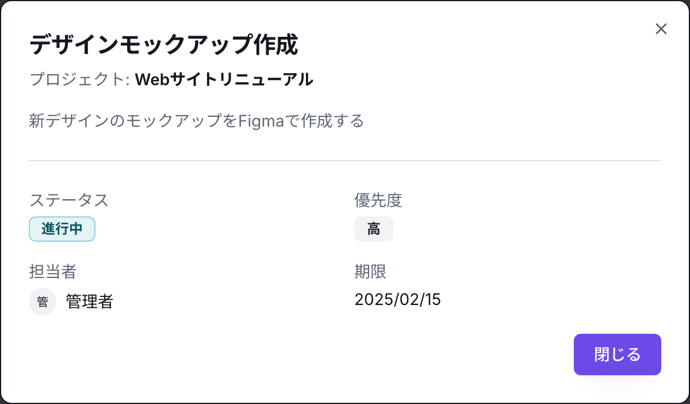
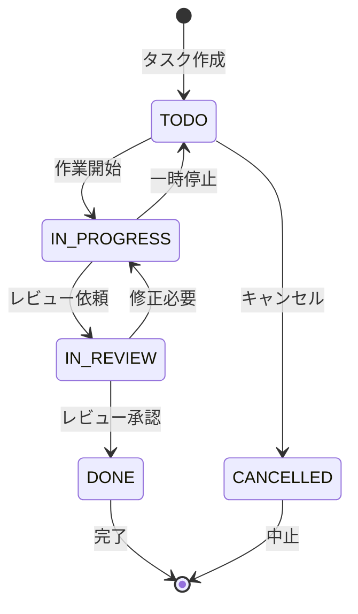
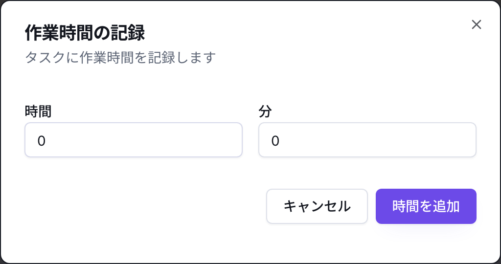
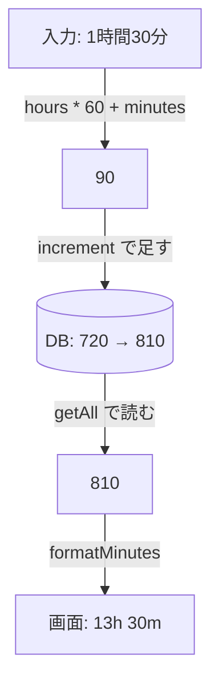
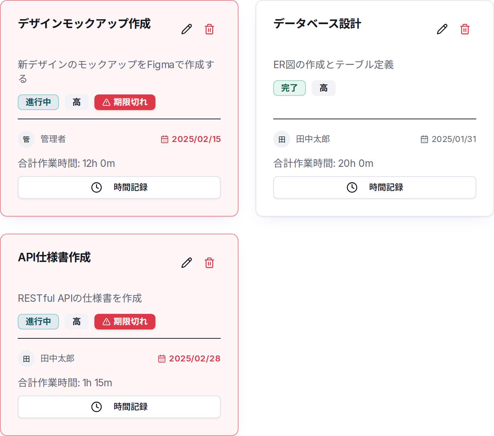

# Day 16: ステータス変更と作業時間の記録を実装しよう

## 前回の振り返り

Day 15 で学んだことは次のとおりです。
- TaskDialog を `initialData` で編集モードに切り替え
- `DeleteConfirmDialog` で削除前の確認
- `null` と `undefined` の使い分け

今日は編集ダイアログでステータスを変更する操作を確認し、
作業時間を後から手で記録する機能を作ります。

---

## 今日のゴール

タスクのステータスを編集ダイアログから変更でき、
作業した時間を後から手で記録できるようにします。
記録した時間は合計作業時間として
カードに表示されます。

この日はまずサーバー側の作業時間記録 API（`addTime`）を自分で書きます。そのあと画面をつなぎます。

スクリーンショット: 今日を始める前のタスク詳細ダイアログです。ステータスは表示されるだけで、ここから変える操作はまだありません。ステータスの変更にはカードの鉛筆ボタンから開く編集ダイアログを使います。今日はカードに作業時間の記録ボタンも足します。



> **今日のゴールライン**: ステータスを変更すると一覧に反映され、時間を記録すると合計作業時間が増えます。この2つの流れが動けばOKです。

## なぜこれを作るのか

タスクが「未着手か、進行中か、完了か」がひと目で
分からないと何から手を付けるか毎回考え直すことになります。
さらに作業時間を記録しておくとあとから
「何にどれだけかかったか」を振り返れます。

> **例え話**: ステータスは「信号機」です。
> 赤（TODO）→黄色（IN_PROGRESS）→青（DONE）と
> 状態が進んでいきます。
> 作業時間の記録は「作業日報に工数を書き込む」
> ことに似ています。仕事が終わったあとに
> 「このタスクに1時間半かけた」と書き足す、
> 後追いの記録です。

作業日報の比喩を実際の操作に置き換えると
タスクカードの「時間記録」ボタンから
時間と分を入力して保存する、という流れになります。

### タスクステータス遷移図

この図は主要な遷移のみを示しています。


```mermaid
stateDiagram-v2
    [*] --> TODO: タスク作成

    TODO --> IN_PROGRESS: 作業開始
    TODO --> CANCELLED: キャンセル

    IN_PROGRESS --> IN_REVIEW: レビュー依頼
    IN_PROGRESS --> TODO: 一時停止

    IN_REVIEW --> DONE: レビュー承認
    IN_REVIEW --> IN_PROGRESS: 修正必要

    DONE --> [*]: 完了
    CANCELLED --> [*]: 中止
```

矢印は現場でよく起きる進み方を並べたものです。`TODO` から `IN_PROGRESS` へ動き、レビューを挟んで `DONE` に着く道筋が基本になります。`IN_REVIEW` から `IN_PROGRESS` へ戻る矢印があるのは差し戻しが1回で終わるとは限らないためです。

ここで先に断っておきたいのはこの矢印をアプリが強制しているわけではない、という点です。今日使う `api.task.update` は受け取った `status` をそのまま保存するので `TODO` から一足飛びに `DONE` へ移すこともできてしまいます。図は迷わないための地図であって通せんぼの柵ではありません。矢印どおりにしか動かせない画面にしたいなら遷移の一覧をコード側に持ち、そこから次のステータスを選ばせる作りにします。その書き方は今日の最後の「Pro パターンで書こう」で扱います。

### やること / やらないこと

| やること | やらないこと |
|---------|-------------|
| ステータス変更（api.task.update） | ドラッグ＆ドロップでのステータス変更 |
| 手動時間記録（TimeLogDialog） | カンバンボード表示 |
| 合計作業時間の表示 | 作業時間の自動計測 |
| ステータス遷移の配列管理 | レポート機能（Day 21-23） |

### 新しく学ぶ概念

| 概念 | 読み方 | 役割 | 例え |
|------|--------|------|------|
| mutateAsync | ミューテート・アシンク | 非同期でAPIを呼び、完了を待つ | 注文して料理が届くのを待つ |
| zod（Day 05 の復習） | ゾッド | 入力の形をルールとして検証する | 書類の記入漏れをチェックする係 |
| refine | リファイン | 複数項目をまたぐ独自ルールを足す | 「合計が1以上」のような追加条件 |

開発サーバーは前の Day から動かしたまま使います。止めてあるときは `npm run dev` で起動してから `http://localhost:3000` を開きます。

## 実装ステップ一覧

| ステップ | 作業内容 | 読む時間の目安 |
|---------|---------|---------|
| Step 0 | 作業時間の記録 API（addTime）を自分で書く | 12分 |
| Step 1 | ステータス変更の仕組みを理解する | 3分 |
| Step 2 | TimeLogDialogで手動時間記録を作る | 30分 |
| Step 3 | TaskCardに時間記録を組み込む | 15分 |
| Step 4 | 動作確認 | 5分 |

**読む時間の合計（仮）**: 約65分です。

表と各 Step に記した時間は、説明とコードを読む時間の仮の目安です。実測した値ではありません。コードの入力、動作確認、ダウンロードや起動の待ち時間、調べものには別に時間を取ってください。

---

### Step 0: 作業時間の記録 API（addTime）を自分で書く（読む目安: 12分）

**ゴール**: タスクに作業時間を積み上げる `addTime` を作り、権限が変わった直後や同時送信でも合計を正しく保ちます。この API は Step 2 の時間記録ダイアログから呼び出します。

Day 14 で作り、Day 15 でも残した `lockTaskProjects` を使います。時間追加とメンバー削除・権限変更が同じプロジェクト行を先にロックすると、処理の順番が決まります。その順番で現在の権限を判定します。

#### 0-1. 入力スキーマを足す

`taskRouter` の前に追加します。

```typescript
// filepath: src/server/api/routers/task.ts（taskRouter の前に追加）
const taskTimeUpdateSchema = z.object({
  id: z.string().cuid(),
  minutesToAdd: z.number().int().min(1, '作業時間は1分以上で指定してください').safe(),
});
```

`.min(1)` は0分と負の値を拒否します。0分を記録しても合計は変わらないため、書き込みません。`.safe()` は JavaScript が1分の差を正確に扱える整数だけを通します。このアプリの作成処理と時間追加は、分を整数で保存します。

#### 0-2. addTime 手続きを書く

Day 15 で書いた `delete` の直後に追加します。

```typescript
// filepath: src/server/api/routers/task.ts（delete の直後に追加）
  addTime: protectedProcedure.input(taskTimeUpdateSchema).mutation(async ({ ctx, input }) => {
    const task = await findTaskWithPermission(input.id, ctx.session.userId, 'canEdit');

    try {
      return await prisma.$transaction(async (tx) => {
        // メンバー削除・降格やタスク移動と同じプロジェクト行をロックし、
        // 加算直前の所属と権限だけを保存可否の判定に使う。
        const lockedProjects = await lockTaskProjects(tx, [task.projectId]);
        if (!lockedProjects.has(task.projectId)) {
          throw new TRPCError({
            code: 'CONFLICT',
            message: 'タスクの内容が更新されています。最新の内容を再読み込みしてください',
          });
        }
```

最初の確認は存在しないタスクと見えないタスクを今までどおり扱うために残します。ただし、その確認後に権限は変わる可能性もあります。そこでトランザクション内でプロジェクト行をロックし、次のコードでもう一度現在の権限を調べます。

```typescript
// filepath: src/server/api/routers/task.ts（同じファイルの続き）
        const currentMember = await tx.projectMember.findUnique({
          where: {
            userId_projectId: {
              userId: ctx.session.userId,
              projectId: task.projectId,
            },
          },
          select: { role: true },
        });
        assertMemberPermission(currentMember ? [currentMember] : [], 'canEdit');

        return await tx.task.update({
          where: {
            id: input.id,
            // 認可したプロジェクトから移動したタスクへ、古い権限で加算しない。
            projectId: task.projectId,
            // 整数の合計を正確に保存できる範囲を、同じUPDATEの条件で確認する。
            timeSpentMinutes: {
              lte: Number.MAX_SAFE_INTEGER - input.minutesToAdd,
            },
          },
```

`projectId` も更新条件に入れます。確認した後でタスクが別プロジェクトへ移動していたら、古いプロジェクトの権限では追加しません。`timeSpentMinutes` の条件は、現在の整数の合計へ足した結果が安全な整数の範囲を越える更新を同じSQLで拒否します。先に合計を読む方式ではないので、30分と45分の同時追加は両方とも残ります。

```typescript
// filepath: src/server/api/routers/task.ts（同じファイルの続き）
          data: {
            timeSpentMinutes: {
              increment: input.minutesToAdd,
            },
          },
        });
      });
    } catch (err) {
      if (err instanceof Prisma.PrismaClientKnownRequestError && err.code === 'P2025') {
        throw new TRPCError({
          code: 'CONFLICT',
          message: 'タスクの内容が更新されています。最新の内容を再読み込みしてください',
        });
      }
      throw err;
    }
  }),
```

更新条件に合わなかったときの `P2025` は `CONFLICT` に変えます。タスク移動と数値上限のどちらで拒否されたかを外へ細かく出さず、一覧を取り直してから再操作してもらいます。

**確認ポイント**:

- 追加値は1分以上の安全な整数だけを受け取ります。
- ロック後の所属と権限で保存可否を決めます。
- `projectId` と現在の合計上限を同じ更新条件で確認します。
- `increment` を使い、正当な同時追加を失いません。
- `npx tsc --noEmit` がエラーなしで終了します。

---

### Step 1: ステータス変更の仕組みを理解する（読む目安: 3分）

**ゴール**: タスクのステータスが
どのように変更されるかを理解します。

ステータス変更は **Day 15 で作った編集ダイアログ
（TaskDialog）** から行います。
新しいUIは作りません。

Day 15 の `handleSubmit` は `api.task.update` を
呼び出しています。
この API（アプリ同士がやり取りする窓口）に
`status` フィールドを渡すだけで
ステータスを変更できます。

```typescript
// filepath: src/app/task/page.tsx
// Day 15 で作成済みの updateMutation（抜粋）
const updateMutation =
  api.task.update.useMutation({
    onSuccess: () => {
      utils.task.getAll.invalidate();
      setDialogOpen(false);
    },
  });
```

このブロックは抜粋です。Day 15 で書いた対象付き再取得と送信世代の判定は、手元のファイルにそのまま残してください。

`onSuccess` の中で `getAll.invalidate()` を呼ぶのが
このコードの肝です。`invalidate` はキャッシュを
「古くなった」と印を付けて再取得させる命令です。
更新後に一覧を取り直すことで、変更後のステータスが
すぐ画面へ反映されます。

> 専用の `updateStatus` API はありません。
> `api.task.update` に `id` と `status` だけ
> 渡すことで、ステータスだけを変更できます。
> 他のフィールドは変更されません。

#### api.task.update の柔軟性

| 渡すパラメータ | 結果 |
|--------------|------|
| `{ id, status }` | ステータスだけ変更 |
| `{ id, priority }` | 優先度だけ変更 |
| `{ id, title, description }` | タイトルと説明を変更 |
| `{ id, assigneeId: null }` | 担当者をクリア |

1つの `update` API が
これだけの変更をまかなえるのは
渡さなかったフィールドを
サーバー側で「変更なし」として扱うからです。
だから小さな変更のたびに専用APIを増やす必要がありません。

#### ステータス変更の方法

| 方法 | 実装場所 | 説明 |
|------|---------|------|
| 編集ダイアログ | TaskDialog（Day 15） | Select でステータスを選択 |
| 一括操作 | タスク一覧ページ（Day 28） | 複数タスクを一括変更 |

タスク詳細ダイアログ（`TaskDetailDialog`）にはステータスの表示だけがあり、
そこから変更する操作はありません。変えたいときは編集ダイアログを開きます。

**確認ポイント**:
- 編集ダイアログでステータスの Select があります。
- ステータスを変更して保存すると Badge が変わります。
- 一覧画面に変更が即反映されます。

---

### Step 2: TimeLogDialogで手動時間記録を作る（読む目安: 30分）

**ゴール**: React Hook Form と Zod を使い、送信中の入力変更や通信結果の順番が入れ替わっても別の記録を誤って閉じない時間記録ダイアログを作ります。

作業時間は後から手で足します。配布コードの `src/component/task/time-log-dialog.tsx` を開き、次の20個のコードブロックを上から順に同じファイルへ書いてください。ブロックの間にある説明文はコードへ貼りません。

最初はインポートと入力スキーマです。入力欄は文字列で届くため、`normalizeNumberInput` が空文字だけを0にし、半角の0から9だけでできた文字列を10進数へ変換します。空白、英字、`0x10`のような別表記は欄ごとの入力エラーにし、無限大になるほど長い数字は桁数のエラーとして知らせます。

#### 2-1. インポートをそろえる

```typescript
// filepath: src/component/task/time-log-dialog.tsx
'use client';

import { zodResolver } from '@hookform/resolvers/zod';
import { useEffect, useRef, useState } from 'react';
import { useForm } from 'react-hook-form';
import toast from 'react-hot-toast';
import { z } from 'zod';
import { Button } from '@/component/ui/button';
import {
  Dialog,
  DialogContent,
  DialogDescription,
  DialogFooter,
  DialogHeader,
  DialogTitle,
} from '@/component/ui/dialog';
import { Input } from '@/component/ui/input';
import { Label } from '@/component/ui/label';
import { httpStatusOf, isAuthError } from '@/lib/query-error';
import { classifyTaskWriteError } from '@/lib/task-write-error';
import { api } from '@/trpc/react';
```

React Hook FormとZodに加え、既存の読み取りエラー判定と書き込みエラー分類を読み込みます。通信エラーの生文をそのまま利用者へ出さないためです。

#### 2-2. 空欄と巨大入力を整える

```typescript

const normalizeNumberInput = (value: unknown) => {
  if (value === '') return 0;
  if (typeof value === 'string') {
    if (!/^[0-9]+$/.test(value)) return value;
    const parsed = Number(value);
    return Number.isFinite(parsed) ? parsed : Number.MAX_SAFE_INTEGER + 1;
  }
  if (typeof value === 'number' && !Number.isFinite(value)) {
    return Number.MAX_SAFE_INTEGER + 1;
  }
  return value;
};
```

空文字だけは0として合計検証へ進めます。文字列は半角の`0`から`9`だけでできている場合に限って10進数へ変換します。空白、英字、16進数風の入力を0や別の数へ読み替えないためです。変換結果が無限大になるほど長い数字は、安全な整数ではない値へ置き換えて桁数のエラーにします。

#### 2-3. 各入力欄のルールを書く

```typescript

const timeLogSchema = z
  .object({
    hours: z.preprocess(
      normalizeNumberInput,
      z
        .number({ invalid_type_error: '時間は0以上の整数で入力してください。' })
        .int('時間は0以上の整数で入力してください。')
        .min(0, '時間は0以上の整数で入力してください。'),
    ),
    minutes: z.preprocess(
      normalizeNumberInput,
      z
        .number({ invalid_type_error: '分は0から59の整数で入力してください。' })
        .int('分は0から59の整数で入力してください。')
        .min(0, '分は0から59の整数で入力してください。')
        .max(59, '分は0から59の整数で入力してください。'),
    ),
  })
```

時間と分には別々の日本語エラーを指定します。分は0から59までに絞り、60分を時間欄へ移すべき入力としてその場で止めます。

#### 2-4. 合計0分を拒否する

```typescript
  .refine(
    (data) =>
      !Number.isInteger(data.hours) ||
      !Number.isInteger(data.minutes) ||
      data.hours < 0 ||
      data.minutes < 0 ||
      data.minutes > 59 ||
      data.hours * 60 + data.minutes > 0,
    {
      message: '1分以上入力してください。',
      path: ['minutes'],
    },
  )
```

最初の`refine`は2欄の合計が1分以上かを確認します。欄単体がすでに不正なときは合計エラーを重ねず、直すべき文言を1つに絞ります。

#### 2-5. 安全な整数の範囲を守る

```typescript
  .refine(
    (data) =>
      !Number.isInteger(data.hours) ||
      !Number.isInteger(data.minutes) ||
      data.hours < 0 ||
      data.minutes < 0 ||
      data.minutes > 59 ||
      data.hours * 60 + data.minutes <= 0 ||
      Number.isSafeInteger(data.hours * 60 + data.minutes),
    {
      message: '入力した作業時間が大きすぎます。桁数を確認してください。',
      path: ['hours'],
    },
  );

type TimeLogFormData = z.infer<typeof timeLogSchema>;
type RefreshResult = 'ok' | 'auth' | 'failed';
type MessageTone = 'error' | 'neutral';
```

次の`refine`は合計が安全な整数かを確認します。画面独自の時間上限は作らず、APIと同じく1分の差を保てる範囲だけを送ります。

#### 2-6. Propsと送信記録の型を作る

```typescript

interface TimeLogDialogProps {
  open: boolean;
  onClose: () => void;
  taskId: string;
  onSuccess?: (() => void) | undefined;
}

interface TimeSubmission {
  taskId: string;
  totalMinutes: number;
  generation: number;
  revision: number;
}
```

`TimeSubmission`には送信時の対象、合計、世代、入力の改訂番号を保存します。通信完了時の画面と同じ操作かを後から判定する材料です。

#### 2-7. 画面状態と同期用refを作る

```typescript
export function TimeLogDialog({ open, onClose, taskId, onSuccess }: TimeLogDialogProps) {
  const utils = api.useUtils();
  const [writePending, setWritePending] = useState(false);
  const [authExpired, setAuthExpired] = useState(false);
  const [writeMessage, setWriteMessage] = useState<{
    text: string;
    tone: MessageTone;
  } | null>(null);
  const mountedRef = useRef(true);
  const openRef = useRef(open);
  const taskIdRef = useRef(taskId);
  const generationRef = useRef(0);
  const revisionRef = useRef(0);
  const writeLockedRef = useRef(false);
  const authExpiredRef = useRef(false);
  const submissionRef = useRef<TimeSubmission | null>(null);
```

Reactのstateは表示へ使い、refは再描画を待たない判定に使います。ボタンを連続で押した瞬間でも、先に立てた同期ロックが見えます。

#### 2-8. React Hook Formを初期化する

```typescript
  const {
    register,
    handleSubmit,
    reset,
    getValues,
    formState: { errors },
  } = useForm<TimeLogFormData>({
    resolver: zodResolver(timeLogSchema),
    defaultValues: { hours: 0, minutes: 0 },
  });

  useEffect(() => {
    mountedRef.current = true;
    return () => {
      mountedRef.current = false;
    };
  }, []);
```

React Hook FormへZodのスキーマを接続し、時間と分を0から始めます。`getValues`は古い送信の完了後に現在の下書きを確かめるために使います。

#### 2-9. 開閉と対象変更を数える

```typescript

  useEffect(() => {
    if (openRef.current === open && taskIdRef.current === taskId) return;
    generationRef.current += 1;
    openRef.current = open;
    if (!open || taskIdRef.current !== taskId) {
      revisionRef.current += 1;
      reset({ hours: 0, minutes: 0 });
      setWriteMessage(null);
    }
    taskIdRef.current = taskId;
  }, [open, reset, taskId]);

  const addTimeMutation = api.task.addTime.useMutation({ retry: false });

  const isCurrentSubmission = (submission: TimeSubmission) =>
    mountedRef.current &&
    openRef.current &&
    taskIdRef.current === submission.taskId &&
    generationRef.current === submission.generation &&
    revisionRef.current === submission.revision;
```

閉じる、開き直す、別タスクへ変わる操作で世代を進めます。通信開始時と世代が違えば、完了しても今の入力欄を閉じず、その内容を保ちます。

#### 2-10. 送信結果の表示先を決める

```typescript

  const showSubmissionMessage = (
    submission: TimeSubmission,
    message: string,
    tone: MessageTone = 'error',
  ) => {
    if (isCurrentSubmission(submission)) {
      setWriteMessage({ text: message, tone });
    } else if (tone === 'neutral') {
      toast(`先ほど送信した作業時間について、${message}`);
    } else {
      toast.error(`先ほど送信した作業時間について、${message}`);
    }
  };
```

`showSubmissionMessage` は、現在の入力に属する結果だけを欄内へ表示し、古い送信結果は通知へ回します。次の `expireAuth` は、この振り分けを使って認証切れ後の入力を勝手に消さないようにします。

```typescript
// filepath: src/component/task/time-log-dialog.tsx（同じファイルの続き）

  const expireAuth = (submission: TimeSubmission, writeCompleted: boolean) => {
    authExpiredRef.current = true;
    setAuthExpired(true);
    showSubmissionMessage(
      submission,
      writeCompleted
        ? ('作業時間は追加されましたが、' +
          'ログインの有効期限が切れました。' +
          'もう一度ログインしてください。')
        : 'ログインの有効期限が切れました。もう一度ログインしてください。',
    );
  };
```

同じ送信の結果ならダイアログ内へ表示し、古い送信の結果なら「先ほど送信した」と付けてtoastへ出します。対象の取り違えを防ぐためです。

#### 2-11. 送信対象だけを再取得する

```typescript

  const refreshSubmittedTask = async (
    submission: TimeSubmission,
    writeCompleted: boolean,
  ): Promise<RefreshResult> => {
    try {
      await Promise.all([
        utils.task.getById.invalidate({ id: submission.taskId }, undefined, {
          throwOnError: true,
        }),
        utils.task.getAll.invalidate(undefined, undefined, { throwOnError: true }),
      ]);
      return 'ok';
    } catch (error) {
      if (!mountedRef.current) return 'failed';
      if (isAuthError(error)) {
        expireAuth(submission, writeCompleted);
        return 'auth';
      }
      return 'failed';
    }
  };
```

一覧だけでなく送信したタスク詳細も再取得します。再取得中の401は保存前の401と分け、保存済みかどうかを文言へ含めます。

#### 2-12. 閉じる操作と入力改訂を記録する

```typescript

  const resetAndClose = () => {
    generationRef.current += 1;
    revisionRef.current += 1;
    openRef.current = false;
    reset({ hours: 0, minutes: 0 });
    setWriteMessage(null);
    onClose();
  };

  const handleOpenChange = (nextOpen: boolean) => {
    if (!nextOpen) resetAndClose();
  };

  const markEdited = () => {
    revisionRef.current += 1;
    setWriteMessage(null);
  };
```

閉じる操作では世代と改訂番号を進めてからフォームを0へ戻します。入力変更では改訂番号だけを進め、送信中でも新しい下書きを書けます。

#### 2-13. 保存成功と再取得失敗を分ける

```typescript
  const handleWriteSuccess = async (submission: TimeSubmission) => {
    const refreshResult = await refreshSubmittedTask(submission, true);
    if (!mountedRef.current || refreshResult === 'auth') return;

    onSuccess?.();
    const currentSubmission = isCurrentSubmission(submission);
    toast.success(
      currentSubmission
        ? `${submission.totalMinutes}分の作業時間を追加しました。`
        : `先ほど送信した${submission.totalMinutes}分の作業時間を追加しました。`,
    );
    if (refreshResult === 'failed') {
      toast.error(
        ('作業時間の追加は完了しましたが、' +
          '最新の合計を取得できませんでした。' +
          '画面を開き直して確認してください。'),
      );
    }
```

書き込み成功を先に通知し、再取得だけ失敗した場合は最新合計を取れなかったと追加で知らせます。保存失敗へ言い換えないことが要点です。

#### 2-14. 新しい下書きを残す

```typescript

    if (!currentSubmission) {
      if (openRef.current && taskIdRef.current === submission.taskId) {
        const currentDuration = timeLogSchema.safeParse(getValues());
        if (
          currentDuration.success &&
          currentDuration.data.hours * 60 + currentDuration.data.minutes === submission.totalMinutes
        ) {
          toast(('先ほどの追加は完了しています。' +
            '残った入力を再送すると' +
            '重複して加算されます。'));
        }
      }
      return;
    }
    resetAndClose();
  };
```

古い送信と同じ分数が入力欄に残っていれば、再送による二重加算を警告します。新しい下書きなら値を残し、利用者の編集を消しません。

#### 2-15. 失敗を分類して再取得する

```typescript
  const handleWriteError = async (error: unknown, submission: TimeSubmission) => {
    if (!mountedRef.current) return;
    const classified = classifyTaskWriteError(error, 'addTime');
    if (classified.kind === 'auth') {
      expireAuth(submission, false);
      return;
    }

    const status = httpStatusOf(error);
    if (status === 403 || classified.kind === 'unknown') {
      const refreshResult = await refreshSubmittedTask(submission, false);
      if (!mountedRef.current || refreshResult === 'auth') return;
      if (refreshResult === 'failed') {
        toast.error(('最新のタスクを取得できませんでした。' +
          '画面を開き直して' +
          '確認してください。'));
      }
    }
    showSubmissionMessage(
      submission,
      classified.message,
      classified.kind === 'unknown' ? 'neutral' : 'error',
    );
  };
```

401はその画面での再送を止めます。403と内容不明の応答では送信対象を再取得し、分類済みの公開文言だけを安全に表示します。

#### 2-16. 送信内容を固定して同期ロックする

```typescript

  const onSubmit = async (data: TimeLogFormData) => {
    if (writeLockedRef.current || authExpiredRef.current) return;

    const submission: TimeSubmission = {
      taskId,
      totalMinutes: data.hours * 60 + data.minutes,
      generation: generationRef.current,
      revision: revisionRef.current,
    };
    writeLockedRef.current = true;
    submissionRef.current = submission;
    setWritePending(true);
    setWriteMessage(null);
```

検証済みの時間、対象タスク、世代、改訂番号を1つの送信記録へ固定します。state更新より先に同期ロックを立て、二重送信を防ぎます。

#### 2-17. 書き込みと後処理を順に待つ

```typescript
    try {
      try {
        await addTimeMutation.mutateAsync({
          id: submission.taskId,
          minutesToAdd: submission.totalMinutes,
        });
      } catch (error) {
        await handleWriteError(error, submission);
        return;
      }
      await handleWriteSuccess(submission);
    } finally {
      if (submissionRef.current === submission) submissionRef.current = null;
      writeLockedRef.current = false;
      if (mountedRef.current) setWritePending(false);
    }
  };
```

書き込み、分類済みの失敗処理、成功後の再取得を順番に待ちます。`finally`で同期ロックを必ず外し、途中の例外でも操作不能を残しません。

#### 2-18. formと時間入力を結ぶ

```typescript
  return (
    <Dialog open={open} onOpenChange={handleOpenChange}>
      <DialogContent>
        <form className="space-y-4" onSubmit={handleSubmit(onSubmit)}>
          <DialogHeader>
            <DialogTitle>作業時間の記録</DialogTitle>
            <DialogDescription>タスクに作業時間を記録します</DialogDescription>
          </DialogHeader>
          <div className="flex gap-4">
            <div className="flex-1">
              <Label htmlFor="hours">時間</Label>
              <Input
                id="hours"
                type="text"
                step="any"
                inputMode="numeric"
                aria-invalid={errors.hours !== undefined}
                {...register('hours', { onChange: markEdited })}
              />
              {errors.hours && (
                <p className="text-sm text-destructive" role="alert">
                  {errors.hours.message}
                </p>
              )}
            </div>
```

`form`の`onSubmit`へRHFの`handleSubmit`を置くため、Enterキーと送信ボタンが同じ入口を通ります。`type=text`で入力文字列を保ち、`inputMode=numeric`で数字キーボードを出します。時間欄の変更では改訂番号も進めます。

#### 2-19. 分入力と通信メッセージを表示する

```typescript
            <div className="flex-1">
              <Label htmlFor="minutes">分</Label>
              <Input
                id="minutes"
                type="text"
                step="any"
                inputMode="numeric"
                aria-invalid={errors.minutes !== undefined}
                {...register('minutes', { onChange: markEdited })}
              />
              {errors.minutes && (
                <p className="text-sm text-destructive" role="alert">
                  {errors.minutes.message}
                </p>
              )}
            </div>
          </div>
```

分欄も`type=text`で入力を保ち、文字列から数値への変換はZodの前処理へ集めます。入力改訂処理を付けるため、送信中の書き直しも区別できます。

#### 2-20. キャンセルと送信ボタンを置く

```typescript
          {writeMessage && (
            <p
              className={
                writeMessage.tone === 'error'
                  ? 'text-sm text-destructive'
                  : 'text-sm text-foreground'
              }
              role="alert"
            >
              {writeMessage.text}
            </p>
          )}
          <DialogFooter>
            <Button type="button" variant="outline" onClick={resetAndClose}>
              キャンセル
            </Button>
            <Button type="submit" disabled={writePending || authExpired}>
              {writePending ? '追加中...' : '時間を追加'}
            </Button>
          </DialogFooter>
        </form>
      </DialogContent>
    </Dialog>
  );
}
```

通信結果はエラーと中立を色で分けます。キャンセルは送信中でも使えます。`writeLockedRef` はReactが再描画する前の2回目の送信入口を拒否します。`writePending` はmutationと一覧・詳細の再取得が終わるまで送信ボタンを無効にします。認証失効後もボタンを無効にし、入力欄は新しい下書きの編集を許します。

`retry: false` を指定したので、結果が分からない書き込みを自動で再送しません。保存成功後の再取得が失敗しても「追加は完了」と「最新合計は未取得」を分けて知らせます。401ではその場の追加ボタンを止め、ログインし直すまで結果不明の送信を重ねません。

**確認ポイント**:

- 空欄・0・負数・小数・60分・大きすぎる値に日本語のエラーが出ます。
- Enterキーとボタンが同じ送信処理を通ります。
- 送信中に書き直した入力や、閉じて開き直したあとに入力した新しい下書きが残ります。
- 401・403・不明な応答で非公開のサーバー文言を表示しません。
- 保存成功と一覧の再取得失敗を別々に知らせます。
- `npx tsc --noEmit` がエラーなしで終了します。

スクリーンショットは Step 3 まで書き終え、カードの「時間記録」ボタンから開いた状態です。



---

### Step 3: TaskCardに時間記録を組み込む（読む目安: 15分）

**ゴール**: `TimeLogDialog` と「時間記録」ボタンを
`TaskCard` に組み込みます。

`TaskCard` は Day 13 で一覧ページに配置したタスク表示カードです。

配布版の `task-card.tsx` は Day 13 の表示機能まで入った状態です。
この Step で時間記録用の props・ボタン・ダイアログを初めて追加します。
次のコードを順番に書き足し、Day 16 の終了時点で完成版と同じ形にします。

まず `task-card.tsx` のインポートを確認します。既存の `lucide-react` の行に `Clock` を追加して次の形にします。`useState` と `TimeLogDialog` は新しく追加します。

```typescript
// filepath: src/component/task/task-card.tsx
// TimeLogDialogとClockアイコンのインポート
import {
  AlertTriangle, CalendarDays, Clock, Pencil, Trash2,
} from 'lucide-react';
import { useState } from 'react';
import { TimeLogDialog } from './time-log-dialog';
```

`useState` も一緒に読み込みます。ダイアログを開いているか
どうかはカード1枚ごとに持つ値だからです。一覧に10枚の
カードが並べば開閉の状態も10個できます。1枚を開いても
残りが閉じたままなのは状態がカードの内側にあるためです。

`TimeLogDialog` だけ `./time-log-dialog` という書き方に
なっているのは同じフォルダに置いた部品だからです。
`Clock` は時計の絵ではありますが動く時計ではありません。
押すと入力用の小窓が開くだけで、計測は始まりません。

次に合計分を読みやすい形に直す関数を用意します。

```typescript
// filepath: src/component/task/task-card.tsx
// 分を「Xh Ym」形式に変換
const formatMinutes = (minutes: number) => {
  const hours = Math.floor(minutes / 60);
  const mins = Math.floor(minutes % 60);
  return hours > 0
    ? `${hours}h ${mins}m`
    : `${mins}m`;
};
```

サーバーは作業時間を分の合計だけで持っています。
`150` のような分の数字をそのまま見せると
どれくらいか直感で分かりません。
そこで60で割って時間と分に分け、
`2h 30m` の形に整えます。

`Math.floor` が2回登場するのは時間と分の両方で端数を
切り捨てるためです。`150 / 60` は `2.5` を返すので
そのまま出すと `2.5h` という表示になります。`%` は割った
余りを返す記号で、`150 % 60` の結果は30です。

この関数が変えるのは見せ方だけです。DB に入っている値は
分の合計のままで `2h 30m` という文字は保存されません。
入力時の `hours * 60 + minutes` と、ここでの割り算は
ちょうど逆向きの計算になります。数字は分だけで持ち、
見せるときに人の読み方へ直す、という分け方です。


```mermaid
flowchart TB
    IN["入力: 1時間30分"] -->|"hours * 60 + minutes"| M90["90"]
    M90 -->|"increment で足す"| DB[("DB: 720 → 810")]
    DB -->|"getAll で読む"| M810["810"]
    M810 -->|"formatMinutes"| OUT["画面: 13h 30m"]
```

行き帰りで通る形は「分の合計」1種類だけです。入力時の `1時間30分` と表示時の `13h 30m` は画面のすぐ手前でだけ現れる形です。データベースを覗いても `13h 30m` という文字は見つかりません。

`TaskCardProps` に合計作業時間と
成功時コールバックを受け取る口を足します。

```typescript
// filepath: src/component/task/task-card.tsx
// TaskCardPropsに追加する2つのprops
interface TaskCardProps {
  // ...既存のpropsのうち onEdit より前...
  timeSpentMinutes?: number;
  // ...onEdit 以降の既存のprops...
  onTimeLogSuccess?: (() => void) | undefined;
}
```

`timeSpentMinutes` は表示する合計作業時間です。データベースは未記録でも既定値の0を返します。
ここでオプショナル（`?`）にするのは、Day 13 から Day 15 で書いた呼び出し側を
一度に直さなくても型が通るようにするためです。
`onTimeLogSuccess` も既存の呼び出し側との互換性を保つためオプショナルにします。
`TimeLogDialog` 自身がタスク詳細と一覧を再取得するため、別のキャッシュも
更新したい画面だけがこのコールバックを渡します。

`TaskCard` 関数の引数（分割代入）では `timeSpentMinutes = 0` と既定値を付けてください。
まだこのpropを渡していない既存画面でも0として扱われ、
次に書く `formatMinutes(timeSpentMinutes)` が `NaN` になりません。

同じ引数の分割代入に `onTimeLogSuccess` も追加してください。
型へ書き足すだけでは関数内からこの名前を使えません。

カード関数の中に、ダイアログの開閉状態と
開くためのハンドラーを足します。

```typescript
// filepath: src/component/task/task-card.tsx
// TaskCard 関数内に追加
const [timeLogDialogOpen, setTimeLogDialogOpen] =
  useState(false);

const handleOpenTimeLog = (e: React.MouseEvent) => {
  e.stopPropagation();
  setTimeLogDialogOpen(true);
};
```

`useState`（コンポーネントに状態を持たせる仕組み）で
ダイアログを開いているかどうかを管理します。
`e.stopPropagation()` を入れているのは
ボタンのクリックがカード全体のクリックへ
伝わるのを止めるためです。
これがないと時間記録ボタンを押しただけで
カードの詳細まで開いてしまいます。

クリックが伝わるのはHTML の出来事が内側の要素から
外側へ順に届く決まりだからです。Day 13 でカード全体に
クリック処理を付けたのでその上に置いたボタンの操作も
外側へ流れます。`stopPropagation` はその受け渡しを
ここで止める命令です。

止めないまま動かすと時間記録の小窓とカードの詳細が
同時に立ち上がります。押した本人には何が起きたのか
判断がつきません。カードの中にボタンを置くときは外側の
処理を止めるかどうかを毎回考えます。

`CardContent` の中にある `mt-auto` と `border-t` が付いた枠を探します。その枠の内側で、担当者と期限を並べた `<div className="flex justify-between items-center">` の閉じタグの直後に、合計作業時間の表示と「時間記録」ボタンを置きます。

```typescript
{/* filepath: src/component/task/task-card.tsx */}
{/* 合計作業時間の表示と時間記録ボタン */}
<div className="space-y-2">
  <p className="text-sm text-muted-foreground">
    合計作業時間: {formatMinutes(timeSpentMinutes)}
  </p>
  {canEdit && (
    <Button
      variant="outline"
      size="sm"
      className="w-full text-xs h-8"
      onClick={handleOpenTimeLog}
      aria-label={`${title}の時間を記録`}>
      <Clock className="mr-2 h-3 w-3" />
      時間記録
    </Button>
  )}
</div>
```

まだ1度も記録していないタスクは `0m` と出ます。ここを
空欄にしないのは記録できる場所だと気づいてもらうため
です。数字が `0m` から `1h 30m` へ変われば保存が届いた
ことも一目で分かります。

ボタンだけを `canEdit &&` で囲んであるのはStep 0 の
`addTime` が `canEdit` を確かめてから足し算するためです。
閲覧者だけのロールで押すと必ずエラーで戻ってくるので
入力させる前に隠します。合計作業時間の表示は囲みません。
読むだけの人にも見えていて困らない情報だからです。

`aria-label` を省くと読み上げでは「時間記録」という
同じ名前のボタンが並ぶだけになります。カードが10枚あれば
10回とも同じ読み上げになり、どれを押しているのか分かり
ません。タスク名を入れておけば1つずつ区別できます。

既存の `return` 内の `<Card>` から `</Card>` までを、`<>` と `</>` で囲みます。カードの中身は残し、`</Card>` の直後に `TimeLogDialog` を置きます。

```typescript
// filepath: src/component/task/task-card.tsx
// カードとダイアログをまとめて返す
return (
  <>
    <Card>
      {/* ...カードの中身... */}
    </Card>
    {canEdit && (
      <TimeLogDialog
        open={timeLogDialogOpen}
        onClose={() => setTimeLogDialogOpen(false)}
        taskId={id}
        onSuccess={onTimeLogSuccess}
      />
    )}
  </>
);
```

小窓も同じ `canEdit` で囲みます。ボタンだけ隠しても小窓が
残ると別の場所から開く道ができたとき閲覧者の画面へ出ます。

`<>` と `</>` で囲むのはカードとダイアログを
1つの要素として返すためです。
Reactは複数の要素を並べて返せないので
この空タグ（フラグメント）でまとめます。
`onSuccess={onTimeLogSuccess}` は、カードを置いた画面が
別のキャッシュも更新したい場合の受け口です。
このタスク一覧の合計はダイアログ自身が `task.getAll` を
再取得するため、親から同じ処理を重ねて渡しません。

**確認ポイント**:
- カードに合計作業時間が表示されます。
- 「時間記録」ボタンが表示されます。
- ボタンを押すとダイアログが開きます。

最後に `page.tsx` から `TaskCard` へ合計作業時間を渡します。`TimeLogDialog` は保存後に送信対象の詳細と `task.getAll` を待って再取得するため、このページから同じ一覧の再取得を重ねて渡す必要はありません。

`TaskCard` の `onTimeLogSuccess` はオプショナルのまま残します。別の画面が検索結果など別のキャッシュも更新したい場合に、その画面だけの処理を渡せるようにするためです。このタスク一覧はダイアログ内の `task.getAll` 再取得だけで表示が更新されます。

Day 15 で置いた `<TaskCard ... />` 全体を、次のコードに置き換えます。既存の props を残し、作業時間の表示に使う1行を足します。

Day 15で作ったページ送りは残します。`PAGE_SIZE`、`pageIndex`、一覧取得の `limit` と `offset`、前後ボタンを変更する手順ではありません。今日置き換えるのは1枚のカードへ渡す値なので、表示中のページと送信元のページを区別する処理も保ちます。

```typescript
<TaskCard
  // filepath: src/app/task/page.tsx
  // Day 15 の TaskCard に合計作業時間を追加
  key={task.id}
  id={task.id}
  title={task.title}
  description={task.description}
  status={task.status}
  priority={task.priority}
  dueDate={task.dueDate}
  assignee={task.assignee}
  timeSpentMinutes={task.timeSpentMinutes}
  onEdit={handleEdit}
  onDelete={handleDelete}
  onClick={handleTaskClick}
  canEdit={canEditProject(task.projectId)}
  canDelete={canDeleteProject(task.projectId)}
/>
```

`task.timeSpentMinutes` は一覧の取得が返してきた DB の今の値です。カードはこの数字を映すだけで、記録した分を自分で足しません。足し算の答えはサーバー側の1か所にだけ置かれます。

画面の動きを順に並べると追加を押した直後はまだ前の値が出ていて取り直しが終わった時点で新しい合計へ置き換わります。差は1秒に満たないので操作しているときはすぐ増えたように見えます。

**確認ポイント**:
- `<TaskCard>` に `timeSpentMinutes` を渡し、一覧の再取得はダイアログ内の1回にしました。
- カードの「時間記録」ボタンを押すとダイアログが開き、閉じられます。
- 「1時間30分」を入力して追加できます。
- 時間と分の両方を0のまま送信するとエラーが出ます。

Step 2 で書いた検証は開く入口がそろったここで初めて動かせます。

---

### Step 4: 動作確認（読む目安: 5分）

**ゴール**: ステータス変更と時間記録の
両方が動くことを確認します。

1. 編集ダイアログでステータスを変更します。
2. 保存すると一覧の Badge が変わり、即反映されます。
3. カードの「時間記録」ボタンを押します。
4. 時間と分を入力して「時間を追加」を押します。
5. 合計作業時間が入力した分だけ増えます。
6. もう一度記録するとさらに加算されます。

おめでとうございます。ステータス管理と
作業時間の記録が動くようになり、
本格的なタスク管理ツールに近づきました。

**確認ポイント**:
- ステータス変更が一覧に反映されます。
- 時間を記録すると合計作業時間が増えます。
- 続けて記録すると合計に加算されます。

スクリーンショット: カードの下段に合計作業時間の行が増えたことを確認してください。



初期データのタスクには作業時間があらかじめ入っているので `12h 0m` や `20h 0m` のように0でない数字が並びます。3枚目の `1h 15m` はいまの手順で1時間15分を記録した直後の状態です。記録した時間はもともと入っていた合計へ足されます。

---

開発サーバーが動いていればそのまま使います。止めてあるときだけ次のコマンドで起動します。

```bash
# filepath: ターミナル
# 停止している場合だけ起動する
npm run dev
```

開発サーバーを起動すると書いたコードが
すぐブラウザに反映されます。
`http://localhost:3000/task` を開いて
上の手順を1つずつ試します。

確かめ方のこつを1つ書いておきます。記録前の合計を控えてから、30分と45分を続けて記録してください。
合計が記録前より `1h 15m` 増えれば加算できています。合計が0分のタスクで試した場合は `1h 15m` になります。
2回目が1回目を上書きする実装なら、増えるのは `45m` だけです。

そのあとブラウザを再読み込みして同じ数字が残るかも
見てください。再読み込み後も残っていれば値が DB に
入っている証拠です。画面の中だけで増やしている見せかけの
表示ならここで元の数字へ戻ります。

**確認ポイント**:
- `npm run dev` でエラーが出ません。
- `http://localhost:3000/task` にアクセスできます。

---

### Pro パターンで書こう（ステータス遷移を配列で管理する）

遷移ルールを1か所にまとめるとステータスの追加や文言の変更をする際の対応漏れを防げます。
なぜ直前の1文の書き方をするのか、**Before/After** で見比べてみましょう。

#### Before（改善前のコード）

**読み比べ用**: この節のコードは写経しません。完成したコードと比べて読みます。

```typescript
import { Button } from '@/component/ui/button';
import {
  TASK_STATUS,
  type TaskStatus,
} from '@/lib/constant/status';
import { api } from '@/trpc/react';

type StatusActionButtonProps = {
  taskId: string;
  status: TaskStatus;
  onUpdated?: () => void;
};

function getNextStatus(status: TaskStatus): TaskStatus {
  if (status === TASK_STATUS.TODO) {
    return TASK_STATUS.IN_PROGRESS;
  }
  if (status === TASK_STATUS.IN_PROGRESS) {
    return TASK_STATUS.IN_REVIEW;
  }
  if (status === TASK_STATUS.IN_REVIEW) {
    return TASK_STATUS.DONE;
  }
  return status;
}
```

**読み比べ用**: ここは写経しません。続けてコードを読み進めましょう。

`getNextStatus` は今のステータスを見て次の1つを返すだけの関数です。ここだけを読むぶんには素直に見えます。`TODO` なら `IN_PROGRESS`、`IN_PROGRESS` なら `IN_REVIEW` と、上から順に当てはめていくだけです。どれにも当てはまらなければ今のステータスをそのまま返します。この最後の1行が `DONE` や `CANCELLED` から先へ進ませない役目を持っています。

覚えておきたいのはこの関数が持っている情報が遷移先だけだという点です。画面に出す文言は1文字も入っていません。

```typescript
// filepath: 読み比べ用サンプル（続き・実ファイルには対応しません）
function getButtonLabel(status: TaskStatus): string {
  if (status === TASK_STATUS.TODO) {
    return '作業開始';
  }
  if (status === TASK_STATUS.IN_PROGRESS) {
    return 'レビュー依頼';
  }
  if (status === TASK_STATUS.IN_REVIEW) {
    return '完了にする';
  }
  return '変更なし';
}

export function StatusActionButton({
  taskId,
  status,
```

**読み比べ用**: ここは写経しません。続けてコードを読み進めましょう。

遷移先を決める `getNextStatus` と、文言を決める `getButtonLabel` が別々の関数に分かれました。中身の並び順は同じですがそのつながりはコードのどこにも書かれていません。`IN_REVIEW` の次を変えるときは2つの関数で同じステータスへの対応を直すことになります。

片方だけを直したときに何が起きるかを想像してください。ボタンには「完了にする」と出るのに保存されるステータスは別のもの、という食い違いが生まれます。型では捕まえられない種類のずれなので気づくのは動かしたあとです。

```typescript
// filepath: 読み比べ用サンプル（続き・実ファイルには対応しません）
  onUpdated,
}: StatusActionButtonProps) {
  const updateMutation =
    api.task.update.useMutation({
      onSuccess: onUpdated,
    });

  const nextStatus = getNextStatus(status);
  const disabled = nextStatus === status;

  return (
    <Button
      disabled={disabled || updateMutation.isPending}
      onClick={() => {
        updateMutation.mutate({
          id: taskId,
          status: nextStatus,
        });
      }}
    >
      {getButtonLabel(status)}
    </Button>
  );
}
```

**このコードの問題点**:

- 遷移先とボタン文言が別々の `if` に分かれ、対応関係を目で追いにくいです。
- 新しい遷移を追加すると、複数の関数を同じ順番で更新しなければなりません。
- 「このステータスでは何ができるか」がコード上で一覧になっていません。

この3つはどれも情報が2か所に分かれていることから来ています。遷移先は `getNextStatus` にあり、文言は `getButtonLabel` にあります。人の頭の中では1つのルールでも、コードの上では別々の場所に置かれた形です。次の After ではその2つを同じ1か所へ寄せます。

#### After（プロが書くコード）

```typescript
import { Button } from '@/component/ui/button';
import {
  TASK_STATUS,
  type TaskStatus,
} from '@/lib/constant/status';
import { api } from '@/trpc/react';

type StatusActionButtonProps = {
  taskId: string;
  status: TaskStatus;
  onUpdated?: () => void;
};

type StatusTransition = {
  from: TaskStatus;
  to: TaskStatus;
  label: string;
};

const STATUS_TRANSITIONS: StatusTransition[] = [
  {
    from: TASK_STATUS.TODO,
    to: TASK_STATUS.IN_PROGRESS,
    label: '作業開始',
```

**読み比べ用**: ここは写経しません。続けてコードを読み進めましょう。

配列の1要素に `from` / `to` / `label` の3つがそろっています。「TODO のときは IN_PROGRESS へ進み、ボタンには作業開始と出す」という1つのルールが1つの塊として置かれます。Before では2つの関数に分かれていた情報がここでは隣り合っています。

型を `StatusTransition` として先に決めてあるので `label` を書き忘れた要素があれば TypeScript が止めてくれます。遷移を足すときの書き漏らしは動かす前に見つかります。

```typescript
// filepath: 読み比べ用サンプル（続き・実ファイルには対応しません）
  },
  {
    from: TASK_STATUS.IN_PROGRESS,
    to: TASK_STATUS.IN_REVIEW,
    label: 'レビュー依頼',
  },
  {
    from: TASK_STATUS.IN_REVIEW,
    to: TASK_STATUS.DONE,
    label: '完了にする',
  },
];

function findTransition(status: TaskStatus) {
  return STATUS_TRANSITIONS.find(
    (transition) => transition.from === status,
  );
}

```

**読み比べ用**: ここは写経しません。続けてコードを読み進めましょう。

`findTransition` は今のステータスに一致する要素を配列から1つ探すだけの関数です。見つからなければ `undefined` が返ります。この `undefined` がそのまま「ここから先へ進む道はない」という答えになります。

Before では `DONE` と `CANCELLED` のために `return status` と `return '変更なし'` を書きました。ここでは配列に載っていないという事実がその答えを兼ねています。終わりのステータスが増えても配列へ足さなければ進めない扱いのままです。

```typescript
// filepath: 読み比べ用サンプル（続き・実ファイルには対応しません）
export function StatusActionButton({
  taskId,
  status,
  onUpdated,
}: StatusActionButtonProps) {
  const updateMutation =
    api.task.update.useMutation({
      onSuccess: onUpdated,
    });
  const transition = findTransition(status);

  return (
    <Button
      disabled={
        !transition || updateMutation.isPending
      }
      onClick={() => {
        if (!transition) return;
        updateMutation.mutate({
          id: taskId,
          status: transition.to,
        });
      }}
    >
```

**読み比べ用**: ここは写経しません。続けてコードを読み進めましょう。

`transition` が `undefined` のときはボタンを押せなくして `onClick` の先頭でも `return` します。同じ1つの値を、見た目と処理の両方が見ている形です。押せるのに何も起きない、という食い違いはここでは生まれません。

`updateMutation.isPending` を `disabled` に混ぜているのは送信中のボタンを押せなくするためです。時間記録ダイアログはさらに厳しく、`writeLockedRef` を通信前に立てて同じ描画中の2回目を拒否し、`writePending` を再取得の完了まで保ちます。この読み比べ用コードの `isPending` だけでは、時間記録と同じ送信契約にはなりません。

```typescript
      {/* filepath: 読み比べ用サンプル（続き・実ファイルには対応しません） */}
      {transition?.label ?? '変更なし'}
    </Button>
  );
}
```

**このコードの強み**:

- `from` / `to` / `label` が1つの配列にまとまり、遷移ルールを一覧で読めます。
- `find()` で該当する遷移だけを探すため分岐が増えても関数が太りにくいです。
- 同じ `from` の要素がまだない一本道の遷移なら、`STATUS_TRANSITIONS` に1要素足すだけで追加できます。

遷移のルールが配列という1つのデータになったので画面の選択肢をこの配列から組み立てる、といった使い回しもできます。既存ステータス間の一本道の遷移を足すときは `STATUS_TRANSITIONS` の1か所を直せば、遷移先と文言を一緒に更新できます。`find()` は最初に一致した1要素だけを返すため、同じ `from` から複数の遷移先を選ばせる場合は別の作りが必要です。

#### 覚えておきたいエッセンス

同じ条件の `if` が何度も出てきたら配列にしてデータとして扱えないか考えます。
ルールをコードの分岐に埋めるより一覧できる形にすると変更に強くなります。

## 完成コード全体

今日は4つのファイルを触りました。断片を貼り重ねる作業が続いたのでどこへ貼ったか分からなくなった場合は以下のコードと手元のファイルを見比べてください。`time-log-dialog.tsx` と `task-card.tsx` は今日の終了時点の全文です。`task.ts` と `page.tsx` は Day 13 から Day 15 で書いた中身がそのまま残るため今日足した部分だけを載せます。

| ファイル | 役割 | 対応する Step |
|---------|------|--------------|
| `src/server/api/routers/task.ts` | 作業時間をサーバー側で足し込む手続き | Step 0 |
| `src/component/task/time-log-dialog.tsx` | 時間と分を入力して記録する小窓 | Step 2 |
| `src/component/task/task-card.tsx` | 合計作業時間の表示と記録ボタン | Step 3 |
| `src/app/task/page.tsx` | 合計作業時間を `TaskCard` へ渡す | Step 3 |

### `src/server/api/routers/task.ts`

**addTime の入力スキーマ**:

```typescript
// filepath: src/server/api/routers/task.ts
const taskTimeUpdateSchema = z.object({
  id: z.string().cuid(),
  minutesToAdd: z.number().int().min(1, '作業時間は1分以上で指定してください').safe(),
});
```

この入口で0以下と安全な整数の範囲外を拒否します。0分では合計が変わらないため記録しません。このアプリが扱う1分単位の整数を、JavaScriptが正確に扱える範囲へ絞ります。`lockTaskProjects` は Day 14 で作り、Day 15 の完成版にも残した関数をそのまま使います。

**addTime 手続き前半**:

```typescript
// filepath: src/server/api/routers/task.ts
  addTime: protectedProcedure.input(taskTimeUpdateSchema).mutation(async ({ ctx, input }) => {
    const task = await findTaskWithPermission(input.id, ctx.session.userId, 'canEdit');

    try {
      return await prisma.$transaction(async (tx) => {
        // メンバー削除・降格やタスク移動と同じプロジェクト行をロックし、
        // 加算直前の所属と権限だけを保存可否の判定に使う。
        const lockedProjects = await lockTaskProjects(tx, [task.projectId]);
        if (!lockedProjects.has(task.projectId)) {
          throw new TRPCError({
            code: 'CONFLICT',
            message: 'タスクの内容が更新されています。最新の内容を再読み込みしてください',
          });
        }
```

プロジェクト行をロックしてから現在の所属を調べる準備をします。先に権限変更が完了していれば、この後の再確認が新しい権限を見ます。

```typescript
// filepath: src/server/api/routers/task.ts（同じファイルの続き）
        const currentMember = await tx.projectMember.findUnique({
          where: {
            userId_projectId: {
              userId: ctx.session.userId,
              projectId: task.projectId,
            },
          },
          select: { role: true },
        });
        assertMemberPermission(currentMember ? [currentMember] : [], 'canEdit');

        return await tx.task.update({
          where: {
            id: input.id,
            // 認可したプロジェクトから移動したタスクへ、古い権限で加算しない。
            projectId: task.projectId,
            // 整数の合計を正確に保存できる範囲を、同じUPDATEの条件で確認する。
            timeSpentMinutes: {
              lte: Number.MAX_SAFE_INTEGER - input.minutesToAdd,
            },
          },
```

ロック後の役割を確認し、確認済みプロジェクトと整数の精度上限を同じ更新条件へ含めます。並行する正当な追加は`increment`へ進めます。

```typescript
// filepath: src/server/api/routers/task.ts（同じファイルの続き）
          data: {
            timeSpentMinutes: {
              increment: input.minutesToAdd,
            },
          },
        });
      });
    } catch (err) {
      if (err instanceof Prisma.PrismaClientKnownRequestError && err.code === 'P2025') {
        throw new TRPCError({
          code: 'CONFLICT',
          message: 'タスクの内容が更新されています。最新の内容を再読み込みしてください',
        });
      }
      throw err;
    }
  }),
```

更新対象が移動済みか精度上限を越える場合は`P2025`を`CONFLICT`へ変えます。その他の例外は種類を変えず上位へ返します。

### `src/component/task/time-log-dialog.tsx`

次の20個のコードブロックが完成版です。上から順に連結すると Step 2 で作ったファイルと一致します。

完成版 1のコードです。

```typescript
// filepath: src/component/task/time-log-dialog.tsx
// 完成版: Day 16 終了時点の時間記録ダイアログ
'use client';

import { zodResolver } from '@hookform/resolvers/zod';
import { useEffect, useRef, useState } from 'react';
import { useForm } from 'react-hook-form';
import toast from 'react-hot-toast';
import { z } from 'zod';
import { Button } from '@/component/ui/button';
import {
  Dialog,
  DialogContent,
  DialogDescription,
  DialogFooter,
  DialogHeader,
  DialogTitle,
} from '@/component/ui/dialog';
import { Input } from '@/component/ui/input';
import { Label } from '@/component/ui/label';
import { httpStatusOf, isAuthError } from '@/lib/query-error';
import { classifyTaskWriteError } from '@/lib/task-write-error';
import { api } from '@/trpc/react';
```

React Hook FormとZodに加え、既存の読み取りエラー判定と書き込みエラー分類を読み込みます。通信エラーの生文をそのまま利用者へ出さないためです。

完成版 2のコードです。

```typescript
// filepath: src/component/task/time-log-dialog.tsx（同じファイルの続き）

const normalizeNumberInput = (value: unknown) => {
  if (value === '') return 0;
  if (typeof value === 'string') {
    if (!/^[0-9]+$/.test(value)) return value;
    const parsed = Number(value);
    return Number.isFinite(parsed) ? parsed : Number.MAX_SAFE_INTEGER + 1;
  }
  if (typeof value === 'number' && !Number.isFinite(value)) {
    return Number.MAX_SAFE_INTEGER + 1;
  }
  return value;
};
```

空文字だけは0として合計検証へ進めます。文字列は半角の`0`から`9`だけでできている場合に限って10進数へ変換します。空白、英字、16進数風の入力を0や別の数へ読み替えないためです。変換結果が無限大になるほど長い数字は、安全な整数ではない値へ置き換えて桁数のエラーにします。

完成版 3のコードです。

```typescript
// filepath: src/component/task/time-log-dialog.tsx（同じファイルの続き）

const timeLogSchema = z
  .object({
    hours: z.preprocess(
      normalizeNumberInput,
      z
        .number({ invalid_type_error: '時間は0以上の整数で入力してください。' })
        .int('時間は0以上の整数で入力してください。')
        .min(0, '時間は0以上の整数で入力してください。'),
    ),
    minutes: z.preprocess(
      normalizeNumberInput,
      z
        .number({ invalid_type_error: '分は0から59の整数で入力してください。' })
        .int('分は0から59の整数で入力してください。')
        .min(0, '分は0から59の整数で入力してください。')
        .max(59, '分は0から59の整数で入力してください。'),
    ),
  })
```

時間と分には別々の日本語エラーを指定します。分は0から59までに絞り、60分を時間欄へ移すべき入力としてその場で止めます。

完成版 4のコードです。

```typescript
// filepath: src/component/task/time-log-dialog.tsx（同じファイルの続き）
  .refine(
    (data) =>
      !Number.isInteger(data.hours) ||
      !Number.isInteger(data.minutes) ||
      data.hours < 0 ||
      data.minutes < 0 ||
      data.minutes > 59 ||
      data.hours * 60 + data.minutes > 0,
    {
      message: '1分以上入力してください。',
      path: ['minutes'],
    },
  )
```

最初の`refine`は2欄の合計が1分以上かを確認します。欄単体がすでに不正なときは合計エラーを重ねず、直すべき文言を1つに絞ります。

完成版 5のコードです。

```typescript
// filepath: src/component/task/time-log-dialog.tsx（同じファイルの続き）
  .refine(
    (data) =>
      !Number.isInteger(data.hours) ||
      !Number.isInteger(data.minutes) ||
      data.hours < 0 ||
      data.minutes < 0 ||
      data.minutes > 59 ||
      data.hours * 60 + data.minutes <= 0 ||
      Number.isSafeInteger(data.hours * 60 + data.minutes),
    {
      message: '入力した作業時間が大きすぎます。桁数を確認してください。',
      path: ['hours'],
    },
  );

type TimeLogFormData = z.infer<typeof timeLogSchema>;
type RefreshResult = 'ok' | 'auth' | 'failed';
type MessageTone = 'error' | 'neutral';
```

次の`refine`は合計が安全な整数かを確認します。画面独自の時間上限は作らず、APIと同じく1分の差を保てる範囲だけを送ります。

完成版 6のコードです。

```typescript
// filepath: src/component/task/time-log-dialog.tsx（同じファイルの続き）

interface TimeLogDialogProps {
  open: boolean;
  onClose: () => void;
  taskId: string;
  onSuccess?: (() => void) | undefined;
}

interface TimeSubmission {
  taskId: string;
  totalMinutes: number;
  generation: number;
  revision: number;
}
```

`TimeSubmission`には送信時の対象、合計、世代、入力の改訂番号を保存します。通信完了時の画面と同じ操作かを後から判定する材料です。

完成版 7のコードです。

```typescript
// filepath: src/component/task/time-log-dialog.tsx（同じファイルの続き）
// 完成版: 時間記録ダイアログ本体の続き
export function TimeLogDialog({ open, onClose, taskId, onSuccess }: TimeLogDialogProps) {
  const utils = api.useUtils();
  const [writePending, setWritePending] = useState(false);
  const [authExpired, setAuthExpired] = useState(false);
  const [writeMessage, setWriteMessage] = useState<{
    text: string;
    tone: MessageTone;
  } | null>(null);
  const mountedRef = useRef(true);
  const openRef = useRef(open);
  const taskIdRef = useRef(taskId);
  const generationRef = useRef(0);
  const revisionRef = useRef(0);
  const writeLockedRef = useRef(false);
  const authExpiredRef = useRef(false);
  const submissionRef = useRef<TimeSubmission | null>(null);
```

Reactのstateは表示へ使い、refは再描画を待たない判定に使います。ボタンを連続で押した瞬間でも、先に立てた同期ロックが見えます。

完成版 8のコードです。

```typescript
// filepath: src/component/task/time-log-dialog.tsx（同じファイルの続き）
  const {
    register,
    handleSubmit,
    reset,
    getValues,
    formState: { errors },
  } = useForm<TimeLogFormData>({
    resolver: zodResolver(timeLogSchema),
    defaultValues: { hours: 0, minutes: 0 },
  });

  useEffect(() => {
    mountedRef.current = true;
    return () => {
      mountedRef.current = false;
    };
  }, []);
```

React Hook FormへZodのスキーマを接続し、時間と分を0から始めます。`getValues`は古い送信の完了後に現在の下書きを確かめるために使います。

完成版 9のコードです。

```typescript
// filepath: src/component/task/time-log-dialog.tsx（同じファイルの続き）

  useEffect(() => {
    if (openRef.current === open && taskIdRef.current === taskId) return;
    generationRef.current += 1;
    openRef.current = open;
    if (!open || taskIdRef.current !== taskId) {
      revisionRef.current += 1;
      reset({ hours: 0, minutes: 0 });
      setWriteMessage(null);
    }
    taskIdRef.current = taskId;
  }, [open, reset, taskId]);

  const addTimeMutation = api.task.addTime.useMutation({ retry: false });

  const isCurrentSubmission = (submission: TimeSubmission) =>
    mountedRef.current &&
    openRef.current &&
    taskIdRef.current === submission.taskId &&
    generationRef.current === submission.generation &&
    revisionRef.current === submission.revision;
```

閉じる、開き直す、別タスクへ変わる操作で世代を進めます。通信開始時と世代が違えば、完了しても今の入力欄を閉じず、その内容を保ちます。

完成版 10のコードです。

<!-- code-block-length-exception: complete-copy-unit -->
```typescript
// filepath: src/component/task/time-log-dialog.tsx（同じファイルの続き）

  const showSubmissionMessage = (
    submission: TimeSubmission,
    message: string,
    tone: MessageTone = 'error',
  ) => {
    if (isCurrentSubmission(submission)) {
      setWriteMessage({ text: message, tone });
    } else if (tone === 'neutral') {
      toast(`先ほど送信した作業時間について、${message}`);
    } else {
      toast.error(`先ほど送信した作業時間について、${message}`);
    }
  };

  const expireAuth = (submission: TimeSubmission, writeCompleted: boolean) => {
    authExpiredRef.current = true;
    setAuthExpired(true);
    showSubmissionMessage(
      submission,
      writeCompleted
        ? ('作業時間は追加されましたが、' +
          'ログインの有効期限が切れました。' +
          'もう一度ログインしてください。')
        : 'ログインの有効期限が切れました。もう一度ログインしてください。',
    );
  };
```

同じ送信の結果ならダイアログ内へ表示し、古い送信の結果なら「先ほど送信した」と付けてtoastへ出します。対象の取り違えを防ぐためです。

完成版 11のコードです。

```typescript
// filepath: src/component/task/time-log-dialog.tsx（同じファイルの続き）

  const refreshSubmittedTask = async (
    submission: TimeSubmission,
    writeCompleted: boolean,
  ): Promise<RefreshResult> => {
    try {
      await Promise.all([
        utils.task.getById.invalidate({ id: submission.taskId }, undefined, {
          throwOnError: true,
        }),
        utils.task.getAll.invalidate(undefined, undefined, { throwOnError: true }),
      ]);
      return 'ok';
    } catch (error) {
      if (!mountedRef.current) return 'failed';
      if (isAuthError(error)) {
        expireAuth(submission, writeCompleted);
        return 'auth';
      }
      return 'failed';
    }
  };
```

一覧だけでなく送信したタスク詳細も再取得します。再取得中の401は保存前の401と分け、保存済みかどうかを文言へ含めます。

完成版 12のコードです。

```typescript
// filepath: src/component/task/time-log-dialog.tsx（同じファイルの続き）

  const resetAndClose = () => {
    generationRef.current += 1;
    revisionRef.current += 1;
    openRef.current = false;
    reset({ hours: 0, minutes: 0 });
    setWriteMessage(null);
    onClose();
  };

  const handleOpenChange = (nextOpen: boolean) => {
    if (!nextOpen) resetAndClose();
  };

  const markEdited = () => {
    revisionRef.current += 1;
    setWriteMessage(null);
  };
```

閉じる操作では世代と改訂番号を進めてからフォームを0へ戻します。入力変更では改訂番号だけを進め、送信中でも新しい下書きを書けます。

完成版 13のコードです。

```typescript
// filepath: src/component/task/time-log-dialog.tsx（同じファイルの続き）
  const handleWriteSuccess = async (submission: TimeSubmission) => {
    const refreshResult = await refreshSubmittedTask(submission, true);
    if (!mountedRef.current || refreshResult === 'auth') return;

    onSuccess?.();
    const currentSubmission = isCurrentSubmission(submission);
    toast.success(
      currentSubmission
        ? `${submission.totalMinutes}分の作業時間を追加しました。`
        : `先ほど送信した${submission.totalMinutes}分の作業時間を追加しました。`,
    );
    if (refreshResult === 'failed') {
      toast.error(
        ('作業時間の追加は完了しましたが、' +
          '最新の合計を取得できませんでした。' +
          '画面を開き直して確認してください。'),
      );
    }
```

書き込み成功を先に通知し、再取得だけ失敗した場合は最新合計を取れなかったと追加で知らせます。保存失敗へ言い換えないことが要点です。

完成版 14のコードです。

```typescript
// filepath: src/component/task/time-log-dialog.tsx（同じファイルの続き）

    if (!currentSubmission) {
      if (openRef.current && taskIdRef.current === submission.taskId) {
        const currentDuration = timeLogSchema.safeParse(getValues());
        if (
          currentDuration.success &&
          currentDuration.data.hours * 60 + currentDuration.data.minutes === submission.totalMinutes
        ) {
          toast(('先ほどの追加は完了しています。' +
            '残った入力を再送すると' +
            '重複して加算されます。'));
        }
      }
      return;
    }
    resetAndClose();
  };
```

古い送信と同じ分数が入力欄に残っていれば、再送による二重加算を警告します。新しい下書きなら値を残し、利用者の編集を消しません。

完成版 15のコードです。

```typescript
// filepath: src/component/task/time-log-dialog.tsx（同じファイルの続き）
  const handleWriteError = async (error: unknown, submission: TimeSubmission) => {
    if (!mountedRef.current) return;
    const classified = classifyTaskWriteError(error, 'addTime');
    if (classified.kind === 'auth') {
      expireAuth(submission, false);
      return;
    }

    const status = httpStatusOf(error);
    if (status === 403 || classified.kind === 'unknown') {
      const refreshResult = await refreshSubmittedTask(submission, false);
      if (!mountedRef.current || refreshResult === 'auth') return;
      if (refreshResult === 'failed') {
        toast.error(('最新のタスクを取得できませんでした。' +
          '画面を開き直して' +
          '確認してください。'));
      }
    }
    showSubmissionMessage(
      submission,
      classified.message,
      classified.kind === 'unknown' ? 'neutral' : 'error',
    );
  };
```

401はその画面での再送を止めます。403と内容不明の応答では送信対象を再取得し、分類済みの公開文言だけを安全に表示します。

完成版 16のコードです。

```typescript
// filepath: src/component/task/time-log-dialog.tsx（同じファイルの続き）

  const onSubmit = async (data: TimeLogFormData) => {
    if (writeLockedRef.current || authExpiredRef.current) return;

    const submission: TimeSubmission = {
      taskId,
      totalMinutes: data.hours * 60 + data.minutes,
      generation: generationRef.current,
      revision: revisionRef.current,
    };
    writeLockedRef.current = true;
    submissionRef.current = submission;
    setWritePending(true);
    setWriteMessage(null);
```

検証済みの時間、対象タスク、世代、改訂番号を1つの送信記録へ固定します。state更新より先に同期ロックを立て、二重送信を防ぎます。

完成版 17のコードです。

```typescript
// filepath: src/component/task/time-log-dialog.tsx（同じファイルの続き）
    try {
      try {
        await addTimeMutation.mutateAsync({
          id: submission.taskId,
          minutesToAdd: submission.totalMinutes,
        });
      } catch (error) {
        await handleWriteError(error, submission);
        return;
      }
      await handleWriteSuccess(submission);
    } finally {
      if (submissionRef.current === submission) submissionRef.current = null;
      writeLockedRef.current = false;
      if (mountedRef.current) setWritePending(false);
    }
  };
```

書き込み、分類済みの失敗処理、成功後の再取得を順番に待ちます。`finally`で同期ロックを必ず外し、途中の例外でも操作不能を残しません。

完成版 18のコードです。

<!-- code-block-length-exception: complete-copy-unit -->
```typescript
// filepath: src/component/task/time-log-dialog.tsx（同じファイルの続き）
  return (
    <Dialog open={open} onOpenChange={handleOpenChange}>
      <DialogContent>
        <form className="space-y-4" onSubmit={handleSubmit(onSubmit)}>
          <DialogHeader>
            <DialogTitle>作業時間の記録</DialogTitle>
            <DialogDescription>タスクに作業時間を記録します</DialogDescription>
          </DialogHeader>
          <div className="flex gap-4">
            <div className="flex-1">
              <Label htmlFor="hours">時間</Label>
              <Input
                id="hours"
                type="text"
                step="any"
                inputMode="numeric"
                aria-invalid={errors.hours !== undefined}
                {...register('hours', { onChange: markEdited })}
              />
              {errors.hours && (
                <p className="text-sm text-destructive" role="alert">
                  {errors.hours.message}
                </p>
              )}
            </div>
```

`form`の`onSubmit`へRHFの`handleSubmit`を置くため、Enterキーと送信ボタンが同じ入口を通ります。`type=text`で入力文字列を保ち、`inputMode=numeric`で数字キーボードを出します。時間欄の変更では改訂番号も進めます。

完成版 19のコードです。

```typescript
{/* filepath: src/component/task/time-log-dialog.tsx（同じファイルの続き） */}
            <div className="flex-1">
              <Label htmlFor="minutes">分</Label>
              <Input
                id="minutes"
                type="text"
                step="any"
                inputMode="numeric"
                aria-invalid={errors.minutes !== undefined}
                {...register('minutes', { onChange: markEdited })}
              />
              {errors.minutes && (
                <p className="text-sm text-destructive" role="alert">
                  {errors.minutes.message}
                </p>
              )}
            </div>
          </div>
```

分欄も`type=text`で入力を保ち、文字列から数値への変換はZodの前処理へ集めます。入力改訂処理を付けるため、送信中の書き直しも区別できます。

完成版 20のコードです。

<!-- code-block-length-exception: complete-copy-unit -->
```typescript
{/* filepath: src/component/task/time-log-dialog.tsx（同じファイルの続き） */}
          {writeMessage && (
            <p
              className={
                writeMessage.tone === 'error'
                  ? 'text-sm text-destructive'
                  : 'text-sm text-foreground'
              }
              role="alert"
            >
              {writeMessage.text}
            </p>
          )}
          <DialogFooter>
            <Button type="button" variant="outline" onClick={resetAndClose}>
              キャンセル
            </Button>
            <Button type="submit" disabled={writePending || authExpired}>
              {writePending ? '追加中...' : '時間を追加'}
            </Button>
          </DialogFooter>
        </form>
      </DialogContent>
    </Dialog>
  );
}
```

通信結果はエラーと中立を色で分けます。キャンセルは送信中でも使えます。`writeLockedRef` はReactが再描画する前の2回目の送信入口を拒否します。`writePending` はmutationと一覧・詳細の再取得が終わるまで送信ボタンを無効にします。認証失効後もボタンを無効にし、入力欄は新しい下書きの編集を許します。

### `src/component/task/task-card.tsx`

**インポート**:

```typescript
// filepath: src/component/task/task-card.tsx
// 完成版: インポート
'use client';

import { AlertTriangle, CalendarDays, Clock, Pencil, Trash2 } from 'lucide-react';
import { useState } from 'react';
import { Avatar, AvatarFallback, AvatarImage } from '@/component/ui/avatar';
import { Badge } from '@/component/ui/badge';
import { Button } from '@/component/ui/button';
import { Card, CardContent, CardHeader, CardTitle } from '@/component/ui/card';
import { getPriorityBadgeVariant } from '@/lib/badge-variant';
import { TASK_PRIORITY_LABELS, type TaskPriority } from '@/lib/constant/priority';
import { TASK_STATUS, type TaskStatus } from '@/lib/constant/status';
import { formatDateOnly, isOverdue } from '@/lib/date';
import { cn } from '@/lib/utils';
import { StatusBadge } from './status-badge';
import { TimeLogDialog } from './time-log-dialog';
```

今日この行に足したのは `Clock`、`useState`、`TimeLogDialog` の3つです。`TimeLogDialog` だけ `./time-log-dialog` という書き方なのは同じフォルダに置いた部品だからです。`Clock` は時計の絵ですが計測は始まりません。押すと入力用の小窓が開くだけです。

**分を読みやすい形に直す関数**:

```typescript
// filepath: src/component/task/task-card.tsx
// 完成版: 分を読みやすい形に直す関数
const formatMinutes = (minutes: number) => {
  const hours = Math.floor(minutes / 60);
  const mins = Math.floor(minutes % 60);
  return hours > 0 ? `${hours}h ${mins}m` : `${mins}m`;
};
```

サーバーが持っているのは分の合計だけなので `150` をそのまま出すとどれくらいか直感で分かりません。`Math.floor` が2回あるのは `150 / 60` が `2.5` を返すためです。切り捨ててから `%` の余りを足すと `2h 30m` になります。保存される値は分のままでこの文字は残りません。

**Props の型**:

```typescript
// filepath: src/component/task/task-card.tsx
// 完成版: Props の型
interface TaskCardProps {
  id: string;
  title: string;
  description?: string | null;
  status: TaskStatus;
  priority: TaskPriority;
  dueDate?: Date | null;
  assignee?: {
    name: string | null;
    email: string;
    avatar: string | null;
  } | null;
  timeSpentMinutes?: number;
  onEdit: (id: string) => void;
  onDelete: (id: string) => void;
  onClick?: (id: string) => void;
  onTimeLogSuccess?: (() => void) | undefined;
  canEdit?: boolean;
  canDelete?: boolean;
}
```

今日足した口は `timeSpentMinutes` と `onTimeLogSuccess` の2つです。どちらも `?` を付けてあるのはDay 13 から Day 15 で書いた呼び出し側を直さなくても型が通るようにするためです。必須にするとこの2つを渡していないすべての画面が同時に型エラーになります。

**関数の宣言と受け取り**:

```typescript
// filepath: src/component/task/task-card.tsx
// 完成版: 関数の宣言と受け取り
export function TaskCard({
  id,
  title,
  description,
  status,
  priority,
  dueDate,
  assignee,
  timeSpentMinutes = 0,
  onEdit,
  onDelete,
  onClick,
  onTimeLogSuccess,
  canEdit = false,
  canDelete = false,
}: TaskCardProps) {
```

`timeSpentMinutes = 0` の既定値がここでの要点です。オプショナルにした口は渡されなければ `undefined` になり、そのまま `formatMinutes` へ入ると `NaN` が表示されます。0を入れておけばまだ記録の無いタスクは `0m` と出ます。

**状態とカードのクリック**:

```typescript
// filepath: src/component/task/task-card.tsx
// 完成版: 状態とカードのクリック
  const [timeLogDialogOpen, setTimeLogDialogOpen] = useState(false);
  const overdue =
    isOverdue(dueDate) && status !== TASK_STATUS.DONE && status !== TASK_STATUS.CANCELLED;

  const handleCardClick = () => {
    if (onClick) {
      onClick(id);
    }
  };
```

開閉の状態をカードの内側に持たせてあるので一覧に10枚並んでも開くのは押した1枚だけです。`overdue` の判定から完了と取り消しを外しているのは終わったタスクに期限切れの赤を付けても読む人がやることは何も増えないからです。

**3つのボタンのハンドラー**:

```typescript
// filepath: src/component/task/task-card.tsx
// 完成版: 3つのボタンのハンドラー
  const handleEdit = (e: React.MouseEvent) => {
    e.stopPropagation();
    onEdit(id);
  };

  const handleDelete = (e: React.MouseEvent) => {
    e.stopPropagation();
    onDelete(id);
  };

  const handleOpenTimeLog = (e: React.MouseEvent) => {
    e.stopPropagation();
    setTimeLogDialogOpen(true);
  };
```

3つとも先頭で `e.stopPropagation()` を呼びます。HTML のクリックは内側の要素から外側へ順に届く決まりなのでこれが無いとボタンを押しただけでカード全体のクリックまで走り、詳細と小窓が一度に立ち上がります。押した本人には何が起きたのか判断がつきません。

**カードの外枠**:

```typescript
// filepath: src/component/task/task-card.tsx
// 完成版: カードの外枠
  return (
    <>
      <Card
        className={cn(
          'transition-all h-full flex flex-col',
          onClick && 'cursor-pointer hover:shadow-md',
          overdue && 'border-destructive/60 bg-destructive/5',
        )}
        onClick={handleCardClick}
      >
```

`<>` で始まっているのはこの後ろに `TimeLogDialog` を並べて返すためです。React は要素を2つ並べて返せないので空タグでまとめます。`cn()` に条件を渡すと `onClick` がある場合だけ指差しカーソルになり、期限切れの場合だけ枠が赤くなります。

**タイトル**:

```typescript
        {/* filepath: src/component/task/task-card.tsx */}
        {/* 完成版: タイトル */}
        <CardHeader className="pb-2 flex flex-row items-start justify-between space-y-0">
          <CardTitle
            className="text-base font-semibold leading-none truncate max-w-[calc(100%-80px)]"
            title={title}
          >
            {onClick ? (
              <button
                type="button"
                className="w-full text-left truncate cursor-pointer focus-visible:outline-none focus-visible:ring-2 focus-visible:ring-ring rounded-sm"
                onClick={(e) => {
                  e.stopPropagation();
                  handleCardClick();
                }}
              >
                {title}
              </button>
            ) : (
              title
            )}
          </CardTitle>
```

`onClick` がある場合だけタイトルを `<button>` で包みます。カード全体が押せてもキーボードだけで操作する人には押せる場所が伝わりません。ボタンにしておくと Tab キーで移動でき、`focus-visible` の枠でどこにいるかも見えます。

**編集ボタン**:

```typescript
          {/* filepath: src/component/task/task-card.tsx */}
          {/* 完成版: 編集ボタン */}
          <div className="flex gap-0">
            {canEdit && (
              <Button
                variant="ghost"
                size="icon"
                className="h-8 w-8"
                onClick={handleEdit}
                aria-label="タスクを編集"
              >
                <Pencil className="h-4 w-4" />
              </Button>
            )}
```

`canEdit &&` で囲ってあるので権限の無い人にはボタンそのものが出ません。中身が鉛筆の絵だけなので `aria-label` を付けています。これが無いと読み上げでは「ボタン」としか伝わらず、押すと何が起きるのか分かりません。

**削除ボタン**:

```typescript
            {/* filepath: src/component/task/task-card.tsx */}
            {/* 完成版: 削除ボタン */}
            {canDelete && (
              <Button
                variant="ghost"
                size="icon"
                className="h-8 w-8 text-destructive hover:text-destructive"
                onClick={handleDelete}
                aria-label="タスクを削除"
              >
                <Trash2 className="h-4 w-4" />
              </Button>
            )}
          </div>
        </CardHeader>
```

削除だけ `text-destructive` で赤くしてあります。取り消せない操作を編集と見分けがつかない見た目にすると押し間違いがそのまま消失につながります。色は警告であって確認ではないので実際の確認は Day 15 で作ったダイアログが受け持ちます。

**説明文とバッジ**:

```typescript
        {/* filepath: src/component/task/task-card.tsx */}
        {/* 完成版: 説明文とバッジ */}
        <CardContent className="flex-1 flex flex-col gap-3">
          {description && (
            <p className="text-sm text-muted-foreground line-clamp-2">{description}</p>
          )}

          <div className="flex gap-2 flex-wrap">
            <StatusBadge status={status} />
            <Badge variant={getPriorityBadgeVariant(priority)}>
              {TASK_PRIORITY_LABELS[priority]}
            </Badge>
            {overdue && (
              <Badge variant="destructive" className="gap-1">
                <AlertTriangle className="h-3 w-3" aria-hidden="true" />
                期限切れ
              </Badge>
            )}
          </div>
```

`line-clamp-2` で説明文を2行に切っています。長さの違う説明が並ぶとカードの高さがそろわず、一覧が読みにくくなるためです。ステータスと優先度の日本語は定数から引くので表記を変えたいときにこの画面へ手を入れる必要はありません。

**担当者**:

```typescript
          {/* filepath: src/component/task/task-card.tsx */}
          {/* 完成版: 担当者 */}
          <div className="mt-auto pt-4 flex flex-col gap-3 border-t">
            <div className="flex justify-between items-center">
              {assignee ? (
                <div className="flex items-center gap-2">
                  <Avatar className="h-6 w-6">
                    {assignee.avatar && <AvatarImage src={assignee.avatar} alt="" />}
                    <AvatarFallback className="text-[10px]">
                      {(assignee.name || assignee.email || '?')[0]?.toUpperCase()}
                    </AvatarFallback>
                  </Avatar>
                  <span className="text-xs text-muted-foreground truncate max-w-[100px]">
                    {assignee.name || assignee.email}
                  </span>
                </div>
              ) : (
                <span className="text-xs text-muted-foreground">未割当</span>
              )}
```

外側の `mt-auto` がこの一帯をカードの下端へ押し下げています。説明文の長さが違ってもボタンの位置がそろうので続けて押すときに手が迷いません。担当者がいない場合に「未割当」と出すのは空欄のままでは読み込み中と未設定を区別できないからです。

**期限**:

```typescript
              {/* filepath: src/component/task/task-card.tsx */}
              {/* 完成版: 期限 */}
              {dueDate && (
                <div
                  className={cn(
                    'flex items-center gap-1 text-xs',
                    overdue
                      ? 'text-destructive font-semibold'
                      : 'text-muted-foreground',
                  )}
                >
                  <CalendarDays className="h-3 w-3" />
                  <span>
                    {overdue && <span className="sr-only">期限切れ </span>}
                    {formatDateOnly(dueDate)}
                  </span>
                </div>
              )}
            </div>
```

`sr-only` を付けた「期限切れ」は画面には出ないまま読み上げにだけ届きます。期限切れを赤い文字でしか示していないと色を見分けられない人には日付が並んでいるだけに見えます。色で伝える情報は言葉でも用意しておきます。

**合計作業時間と時間記録ボタン**:

```typescript
            {/* filepath: src/component/task/task-card.tsx */}
            {/* 完成版: 合計作業時間と時間記録ボタン */}
            <div className="space-y-2">
              <p className="text-sm text-muted-foreground">
                合計作業時間: {formatMinutes(timeSpentMinutes)}
              </p>
              {canEdit && (
                <Button
                  variant="outline"
                  size="sm"
                  className="w-full text-xs h-8"
                  onClick={handleOpenTimeLog}
                  aria-label={`${title}の時間を記録`}
                >
                  <Clock className="mr-2 h-3 w-3" />
                  時間記録
                </Button>
              )}
            </div>
          </div>
        </CardContent>
      </Card>
```

まだ記録の無いタスクにも `0m` と出しているのは記録できる場所だと気づいてもらうためです。`aria-label` にタスク名を入れているのはこれが無いと読み上げで「時間記録」というボタンがカードの枚数だけ並び、どれを押しているのか分からなくなるからです。ボタンを `canEdit &&` で囲んでいるのは編集ボタンと同じ理由です。`addTime` は `canEdit` を確かめてから足し算するので閲覧者が押しても必ずエラーで戻ります。合計の表示だけは囲まず読むだけの人にも見えるようにしています。

**ダイアログの設置**:

```typescript
      {/* filepath: src/component/task/task-card.tsx */}
      {/* 完成版: ダイアログの設置 */}
      {canEdit && (
        <TimeLogDialog
          open={timeLogDialogOpen}
          onClose={() => setTimeLogDialogOpen(false)}
          taskId={id}
          onSuccess={onTimeLogSuccess}
        />
      )}
    </>
  );
}
```

小窓を `<Card>` の外に置いてあるのはカードの枠や `overflow` の影響を受けずに画面の中央へ出すためです。ボタンと同じ `canEdit` で囲ってあるので閲覧者の画面には小窓そのものが置かれません。`onSuccess={onTimeLogSuccess}` は、カードを置いた画面が別のキャッシュも更新したい場合の受け口です。このタスク一覧の合計はダイアログ自身が `task.getAll` を再取得するため、親から同じ処理を重ねて渡しません。

### `src/app/task/page.tsx`

`TimeLogDialog` が送信対象の詳細と `task.getAll` を再取得するため、このページには同じ一覧を再取得する成功ハンドラーを追加しません。再取得を2か所へ置くと、1回の保存で同じ一覧を2回取り直します。

次のように `TaskCard` へ合計作業時間を渡します。

```typescript
                      <TaskCard
                        // filepath: src/app/task/page.tsx
                        // 完成版: TaskCard へ合計作業時間を渡す
                        key={task.id}
                        id={task.id}
                        title={task.title}
                        description={task.description}
                        status={task.status}
                        priority={task.priority}
                        dueDate={task.dueDate}
                        assignee={task.assignee}
                        timeSpentMinutes={task.timeSpentMinutes}
                        onEdit={handleEdit}
                        onDelete={handleDelete}
                        onClick={handleTaskClick}
                        canEdit={canEditProject(task.projectId)}
                        canDelete={canDeleteProject(task.projectId)}
                      />
```

Day 15 までに書いた `<TaskCard>` へ、今日は `timeSpentMinutes` の1行だけを足しました。 ページ送りと送信時の `pageIndex` の記録はDay 15のまま残します。先頭の `key={task.id}` は Day 13 で書いたものがそのまま残ります。消すと Day 09 と Day 13 で見たのと同じ key の警告がコンソールに出ます。`task.timeSpentMinutes` は一覧の取得が返した DB の今の値で、カードはこれを映すだけです。ダイアログ内の再取得が終わると、この値を含む一覧が1回だけ更新されます。

## 今日のまとめ

- [ ] `api.task.update` でステータスを変更できました。
- [ ] TimeLogDialog で作業時間を手動記録できました。
- [ ] `api.task.addTime` で合計作業時間を加算できました。
- [ ] TaskCard に時間記録ボタンとダイアログを組み込めました。

## つまずきポイント

#### 手動記録が反映されない

**原因**

invalidateを呼び忘れたためです。

**解決方法**

`refreshSubmittedTask`で送信対象の詳細と`task.getAll`を再取得してください。親から同じ`task.getAll.invalidate()`を重ねて呼ばないでください。

#### 数値が文字列扱いになる

**原因**

入力欄の文字列をスキーマの前処理で数値へ変換していないためです。

**解決方法**

`normalizeNumberInput`で空文字だけを0にし、半角の0から9だけの文字列を10進数へ変換してください。ほかの文字列は変換せず、欄ごとのエラーにします。

#### 両方0でも送信できる

**原因**

refineを設定していないためです。

**解決方法**

zodのrefineで合計>0を検証してください。

#### 記録中も追加ボタンを押せる

**原因**

同期ロックと再取得中の表示状態が、送信処理とボタンに反映されていないためです。

**解決方法**

`onSubmit`の先頭で`writeLockedRef`を確認し、通信前に`true`へ変えます。このrefはReactが再描画する前の2回目の送信入口を拒否します。ボタンは`disabled={writePending || authExpired}`にして、mutationと再取得が終わるまで押せない状態を保ってください。

## 今日学んだ用語

| 用語 | 意味 |
|------|------|
| mutateAsync | 完了を待てる非同期版のmutate |
| zod | 入力の形をルールとして検証するライブラリ |
| refine | 複数項目をまたぐ独自ルールを足すzodの機能 |
| zodResolver | zodのルールをreact-hook-formの検証につなぐ部品 |
| invalidate | キャッシュを古い印にして再取得させる命令 |

## 理解チェック

今日書いたコードを見ながら答えてみてください。答えは各問のすぐ下にあります。

**Q1. `addTime` が `timeSpentMinutes` を `increment: input.minutesToAdd` で更新しているのは何をしているコードですか。**

A. 今の値を読み出さずに、DB へ「この分だけ増やしてほしい」と直接頼んでいます。読み出して足してから書き戻す形にすると同じタスクへほぼ同時に2回記録したときあとの書き込みが先の記録を消します。`increment` なら DB の側で足すので両方の記録が残ります。

**Q2. 時間記録の入力スキーマから `refine`（合計が0分より大きい）を外すと何が通ってしまいますか。**

A. フロント側の検証を通り、`minutesToAdd: 0` のAPI呼び出しまで進んでしまいます。`hours` は0以上、`minutes` は0〜59を許すのでそれぞれの検査だけでは防げません。ただしAPI側の `.min(1)` が0分を拒否するため、タスクの検索やDB更新は行われません。`refine` は無効な送信を画面側で止め、その場で入力エラーを表示するために必要です。

**Q3. `refreshSubmittedTask` が記録成功後に `utils.task.getAll.invalidate()` を呼ぶのはなぜですか。**

A. 一覧が持っているキャッシュに「古い」という印を付け、更新後の合計を取り直すためです。`refreshSubmittedTask`は詳細と一覧の再取得を待つので、完了するまで`writePending`も続きます。親から同じ`getAll.invalidate()`を重ねると1回の保存で一覧を2回取り直すため、一覧の更新はダイアログ内の1か所に置きます。

## 追加課題：15分以上の作業だけ記録する

時間と分を合わせた検証を応用します。理解チェック Q2 の条件を変えて合計14分と15分の境目を確かめましょう。

前提は今日の時間記録が使えることです。自分が管理するプロジェクトに「課題16」というタスクを新規作成します。

`src/component/task/time-log-dialog.tsx` の `timeLogSchema` にある `refine` を、合計15分以上で通る条件へ変えてください。エラー文も合わせます。

`src/server/api/routers/task.ts` の `taskTimeUpdateSchema` にある `minutesToAdd` の最小値も15にします。画面を通さない送信にも同じ条件を適用するためです。

課題用タスクへ0時間14分を記録し、入力エラーで合計が増えないことを確認します。0時間15分へ直して記録し、合計が15分増えれば成功です。

14分が通る場合は変更した `refine` が時間と分の合計を比較しているか確認してください。確認後は2つのスキーマとエラー文を元へ戻し、課題用タスクを削除します。記録時間を減らす操作はこの画面にはありません。

## 次回予告

Day 17 では自分に割り当てられたタスクだけを
表示する「マイタスク」ページを作ります。期限別の
グループ表示で、今日やるべきことをすばやく
把握できるようになります。

---

## 次に読むもの

- 前の日: [Day 15](./day15_タスク編集・削除.md)
- 次の日: [Day 17](./day17_自分のタスクページ.md)
- 全体の地図: [学びのロードマップ](./00-1_学びのロードマップ.md)
- 目次: [カリキュラム目次](./00_カリキュラム目次.md)
- 詰まったとき: [トラブルシューティング](./appendix_トラブルシューティング.md)
- 言葉の意味: [用語集](./appendix_用語集.md)

<!-- textlint-disable ja-technical-writing/ja-no-mixed-period, ja-technical-writing/no-doubled-conjunction, ja-technical-writing/no-exclamation-question-mark -->

---

## 奥付

| | |
|---|---|
| タイトル | Day 16: ステータス変更と作業時間の記録を実装しよう |
| 著者 | 磯貝光佑 |
| 版 | 第1版（2026年9月19日） |

© 2026 磯貝光佑

本書は購入者個人の利用に限ります。本書に掲載されたコードの写経、および自分のプロジェクトへの転用・改変は自由です。本書（PDF・Markdown）および付属コードの再配布・転売・第三者との共有は、形態を問わず禁止します。

<!-- textlint-enable ja-technical-writing/ja-no-mixed-period, ja-technical-writing/no-doubled-conjunction, ja-technical-writing/no-exclamation-question-mark -->
