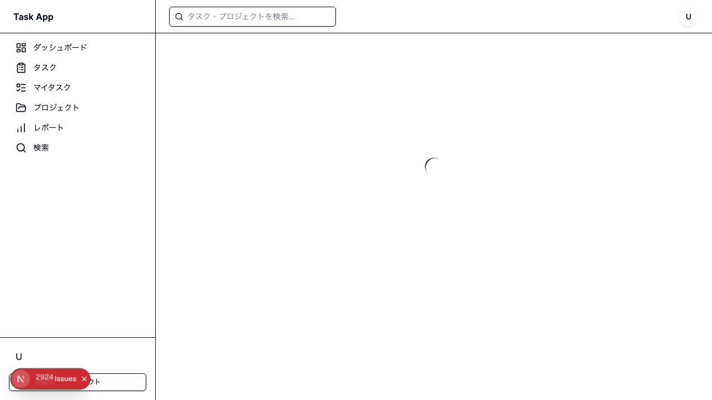
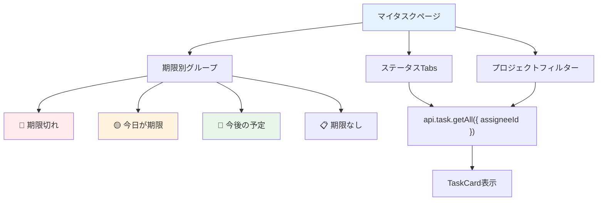

# Day 17: 自分のタスクページを作ろう

## 🔙 前回の振り返り

Day 16 ではタスクのステータス変更機能と `useEffect` + `setInterval` を使った作業タイマー機能を実装しました。ワンクリックでステータスを切り替え、作業時間を計測・記録できるようになったので、今日はログイン中のユーザー専用の「マイタスク」ページに取り組みます。

---

## 🎯 今日のゴール

ログイン中のユーザーに割り当てられたタスクだけを表示する「マイタスク」ページを実装します。期限別のグループ表示とステータスタブで、今やるべきことが一目でわかるようにします。

📸 スクリーンショット: マイタスクページの完成画面


## 🤔 なぜこれを作るのか？

複数のプロジェクトに参加していると、自分が何をすべきか分からなくなります。

> 💡 **例え話**: マイタスクは「個人の受信トレイ」です。3つのプロジェクトに参加していて合計20個のタスクがある場合、マイタスクページを開くだけで今日やるべき3つのタスクがすぐに分かります。

### 📐 マイタスクページの構成



### やること / やらないこと

| やること | やらないこと |
|---------|-------------|
| `getCurrentUser` で自分のIDを取得 | useSessionは使わない |
| `getAll({ assigneeId })` でフィルタ | 専用のAPIエンドポイント |
| 期限別にグループ表示 | カレンダー表示 |
| ステータスTabsで絞り込み | 検索機能（Day 20） |
| 編集・削除をTaskDialogで | 新規作成 |

### 🆕 新しく学ぶ概念

| 概念 | 読み方 | 役割 | 例え |
|------|--------|------|------|
| Tabs | タブ | コンテンツの切り替えUI | ファイルのタブ仕切り |
| グループ表示 | — | データを条件で分類 | 手紙を「緊急・普通・後回し」に分ける |
| `isSameDay` | イズ・セイム・デイ | 2つの日付が同じ日かを判定する `date-fns` の関数 | カレンダーの同じ日付かチェック |
| `useMemo` | ユーズ・メモ | 計算結果をキャッシュして再利用 | メモ帳に書いておいて、変わった時だけ書き直す |

## 📊 実装ステップ一覧

| ステップ | 作業内容 | 所要時間 |
|---------|---------|---------|
| Step 1 | ページの最小構造を作る | 3分 |
| Step 2 | 自分のIDを取得してローディング処理 | 5分 |
| Step 3 | 自分のタスクを取得する | 5分 |
| Step 4 | ステータスTabsを作る | 5分 |
| Step 5 | プロジェクトフィルターを追加 | 5分 |
| Step 6 | TaskGroupSectionコンポーネントを作る | 7分 |
| Step 7 | 期限別グループに分類する | 7分 |
| Step 8 | グループごとにカード表示 | 5分 |
| Step 9 | 編集ハンドラーを実装する | 5分 |
| Step 10 | 削除ハンドラーを実装する | 5分 |
| Step 11 | ダイアログを配置する | 3分 |
| Step 12 | 動作確認 | 3分 |

**合計時間**: 約58分

---

### Step 1 🧭: ページの最小構造を作る（3分）

🎯 **ゴール**: マイタスクページの最小完成版を作ります。このファイルに以降のステップでコードを追加していきます。

💻 **実装**:

```typescript
// filepath: src/app/my-task/page.tsx
'use client';

import { useMemo, useState } from 'react';
import { AppLayout } from '@/component/layout/app-layout';
import { api } from '@/trpc/react';

// マイタスクページのコンポーネント
export default function MyTasksPage() {
  return (
    <AppLayout>
      <div className="flex flex-col gap-6">
        <h1 className="text-3xl font-bold tracking-tight">
          マイタスク
        </h1>
      </div>
    </AppLayout>
  );
}
```

> 💡 Day 08 で学んだ `AppLayout` でページをラップします。サイドバーと認証ガードが自動的に適用されます。

✅ **確認ポイント**:
- ファイルを保存した
- `/my-task` にアクセスして「マイタスク」と表示される
- サイドバーが表示されている

---

### Step 2 🧭: 自分のIDを取得してローディング処理（5分）

🎯 **ゴール**: ログイン中のユーザー情報を取得し、ローディング中はスピナーを表示します。

💻 **実装**:

まずインポートを追加します。Step 1 のインポート部分を以下に**置き換えて**ください。

```typescript
// filepath: src/app/my-task/page.tsx
'use client';

import { useMemo, useState } from 'react';
import { AppLayout } from '@/component/layout/app-layout';
import {
  PageLoadingSpinner,
} from '@/component/ui/loading-spinner';
import { api } from '@/trpc/react';
```

次に、`MyTasksPage` の `return` の**前に**以下を追加します。

```typescript
// filepath: src/app/my-task/page.tsx
// MyTasksPage内の先頭に追加
// ログイン中のユーザー情報を取得
const { data: currentUser, isLoading: isCurrentUserLoading } =
  api.auth.getCurrentUser.useQuery();

// 担当者選択用のユーザー一覧を取得
const { data: users } =
  api.search.getProjectMembers.useQuery();
```

ローディング中はスピナーを表示します。`return` の**前に**以下を追加してください。

```typescript
// filepath: src/app/my-task/page.tsx
// ローディング中はスピナーを表示
if (isCurrentUserLoading) {
  return (
    <AppLayout>
      <PageLoadingSpinner />
    </AppLayout>
  );
}
```

✅ **確認ポイント**:
- ファイルを保存した
- ページアクセス時に一瞬スピナーが表示された後、「マイタスク」が表示される
- `npm run dev` でエラーが出ていない

#### 認証情報の取得方法

| 方法 | API | 用途 |
|------|-----|------|
| セッション確認 | `api.auth.getSession` | ログイン状態チェック |
| 現在のユーザー | `api.auth.getCurrentUser` | ユーザー詳細情報 |
| メンバー取得 | `api.search.getProjectMembers` | 担当者選択用 |

> 💡 `api.auth.getCurrentUser` はログイン中のユーザーのIDや名前を返します。このIDを使って「自分のタスク」を絞り込みます。

---

### Step 3 🧭: 自分のタスクを取得する（5分）

🎯 **ゴール**: `assigneeId` でフィルタして自分のタスクだけを取得します。

💻 **実装**:

Step 2 で追加した `users` の取得の**下に**以下を追加します。

```typescript
// filepath: src/app/my-task/page.tsx
// 自分に割り当てられたタスクだけを取得
const { data: tasks, isLoading } =
  api.task.getAll.useQuery(
    { assigneeId: currentUser?.id },
    { enabled: !!currentUser },
  );
```

タスクキャッシュ操作用のユーティリティを追加します。tasks の取得の**下に**以下を追加します。

```typescript
// filepath: src/app/my-task/page.tsx
// tRPCキャッシュ操作用ユーティリティ
// ⚠️ hooks はすべて early return より前に置く
const utils = api.useUtils();
```

ローディングの条件も更新します。Step 2 で追加した `if (isCurrentUserLoading)` を以下に**置き換えて**ください。

```typescript
// filepath: src/app/my-task/page.tsx
// 全 hooks 定義後にローディング判定（hooks の後に early return）
if (isCurrentUserLoading || isLoading) {
  return (
    <AppLayout>
      <PageLoadingSpinner />
    </AppLayout>
  );
}
```

✅ **確認ポイント**:
- 自分に割り当てられたタスクだけが返る
- 他の人のタスクは含まれない
- `npm run dev` でエラーが出ていない

> 💡 `enabled: !!currentUser` は「currentUserが取得できてからAPIを呼ぶ」という設定です。Day 12 で学んだパターンです。currentUser未取得のまま呼ぶと、全タスクが返ってしまいます。

#### getAll パラメータの活用

| パラメータ | 値 | 効果 |
|-----------|-----|------|
| `assigneeId` | 自分のID | 自分のタスクだけ取得 |
| `status` | `'TODO'` | TODOのみ取得 |
| `projectId` | プロジェクトID | 特定プロジェクトだけ |

---

### Step 4 🧭: ステータスTabsを作る（5分）

🎯 **ゴール**: ステータスで絞り込むタブUIを追加します。

💻 **実装**:

まずインポートを追加します。ファイル先頭のインポート部分に以下を**追加**してください。

```typescript
// filepath: src/app/my-task/page.tsx
// インポートに追加
import {
  Tabs, TabsList, TabsTrigger,
} from '@/component/ui/tabs';
import {
  isTaskStatus, TASK_STATUS,
  TASK_STATUS_LABELS, type TaskStatus,
} from '@/lib/constant/status';
```

次に、`MyTasksPage` の**外側**（関数の前）に定数を定義します。

```typescript
// filepath: src/app/my-task/page.tsx
// コンポーネントの外側に定数を定義
const ACTIVE_STATUSES: TaskStatus[] = [
  TASK_STATUS.TODO,
  TASK_STATUS.IN_PROGRESS,
  TASK_STATUS.IN_REVIEW,
  TASK_STATUS.DONE,
];
```

```typescript
// filepath: src/app/my-task/page.tsx
// ステータス定数からタブを動的に生成
const STATUS_TABS: {
  label: string;
  value: TaskStatus | 'all';
}[] = [
  { label: 'すべて', value: 'all' },
  ...ACTIVE_STATUSES.map((status) => ({
    label: TASK_STATUS_LABELS[status],
    value: status,
  })),
];
```

`MyTasksPage` 内の `currentUser` 取得の**前に**stateを追加します。

```typescript
// filepath: src/app/my-task/page.tsx
// タブの選択状態を管理
const [activeTab, setActiveTab] =
  useState<TaskStatus | 'all'>('all');
```

Step 3 の `useQuery` を以下に**置き換えて**ください。ステータスフィルターを追加します。

```typescript
// filepath: src/app/my-task/page.tsx
// ステータスフィルターを追加した版
const { data: tasks, isLoading } =
  api.task.getAll.useQuery(
    {
      assigneeId: currentUser?.id,
      status: activeTab === 'all'
        ? undefined : activeTab,
    },
    { enabled: !!currentUser },
  );
```

JSXの `<h1>` タグの**下に**タブUIを追加します。

```typescript
// filepath: src/app/my-task/page.tsx
// フィルターエリアのコンテナ
<div className="flex flex-col sm:flex-row gap-4 items-center">
  <Tabs
    value={activeTab}
    onValueChange={(v) => {
      if (v === 'all' || isTaskStatus(v))
        setActiveTab(v);
    }}
    className="w-full sm:w-auto"
  >
    <TabsList>
      {STATUS_TABS.map((tab) => (
        <TabsTrigger
          key={tab.label}
          value={tab.value}>
          {tab.label}
        </TabsTrigger>
      ))}
    </TabsList>
  </Tabs>
</div>
```

> 💡 `onValueChange` は `string` を返すので、`isTaskStatus(v)` 型ガードで `TaskStatus` 型かを判定してから `setActiveTab` に渡します。`as TaskStatus` のような型アサーションは使わず、実行時に値を検証します。

✅ **確認ポイント**:
- タブが横並びで表示される
- タブ切り替えでタスクが絞り込まれる
- `npm run dev` でエラーが出ていない

📸 スクリーンショット: ステータスTabsが表示されている画面


---

### Step 5 🧭: プロジェクトフィルターを追加（5分）

🎯 **ゴール**: プロジェクトでも絞り込めるようにします。

💻 **実装**:

インポートを追加します。

```typescript
// filepath: src/app/my-task/page.tsx
// インポートに追加
import {
  Select, SelectContent, SelectItem,
  SelectTrigger, SelectValue,
} from '@/component/ui/select';
```

`MyTasksPage` 内にstateとクエリを追加します。

```typescript
// filepath: src/app/my-task/page.tsx
// プロジェクトフィルターの状態管理
const [filterProject, setFilterProject] =
  useState<string>('all');
// プロジェクト一覧を取得
const { data: projects } =
  api.project.getAll.useQuery();
```

Step 4 の `useQuery` を以下に**置き換えて**ください。プロジェクトフィルターを追加します。

```typescript
// filepath: src/app/my-task/page.tsx
// プロジェクトフィルターも追加した最終版
const { data: tasks, isLoading } =
  api.task.getAll.useQuery(
    {
      assigneeId: currentUser?.id,
      status: activeTab === 'all'
        ? undefined : activeTab,
      projectId: filterProject === 'all'
        ? undefined : filterProject,
    },
    { enabled: !!currentUser },
  );
```

Step 4 で追加した `</Tabs>` の**下に**（`</div>` の前に）Select を追加します。

```typescript
// filepath: src/app/my-task/page.tsx
// プロジェクトフィルターのSelect UI
<div className="ml-auto w-full sm:w-[200px]">
  <Select
    value={filterProject}
    onValueChange={setFilterProject}>
    <SelectTrigger>
      <SelectValue
        placeholder="すべてのプロジェクト" />
    </SelectTrigger>
    <SelectContent>
      <SelectItem value="all">
        すべてのプロジェクト
      </SelectItem>
      {projects?.map((p) => (
        <SelectItem key={p.id} value={p.id}>
          {p.name}
        </SelectItem>
      ))}
    </SelectContent>
  </Select>
</div>
```

> 💡 Day 13 のタスク一覧と同じフィルターパターンです。Tabs（ステータス）と Select（プロジェクト）を組み合わせて、複数条件で絞り込みます。

✅ **確認ポイント**:
- プロジェクト選択ドロップダウンがタブの右側に表示される
- 選択するとタスクが絞り込まれる
- `npm run dev` でエラーが出ていない

---

### Step 6 🧭: TaskGroupSectionコンポーネントを作る（7分）

🎯 **ゴール**: タスクをグループごとに表示する共通コンポーネントを作ります。このコンポーネントは同じファイル内に定義します。

💻 **実装**:

まずインポートを追加します。

```typescript
// filepath: src/app/my-task/page.tsx
// インポートに追加
import { TaskCard } from '@/component/task/task-card';
import type { TaskPriority }
  from '@/lib/constant/priority';
import { cn } from '@/lib/utils';
```

`MyTasksPage` の**外側**（`STATUS_TABS` 定数の下）にProps型を定義します。

```typescript
// filepath: src/app/my-task/page.tsx
// グループセクションのProps型定義
interface TaskGroupSectionProps {
  title: string;
  titleClassName?: string;
  tasks: Array<{
    id: string;
    title: string;
    description: string | null;
    status: TaskStatus;
    priority: TaskPriority;
    dueDate: Date | null;
    assignee: {
      name: string | null;
      email: string;
      avatar: string | null;
    } | null;
  }>;
  onEdit: (id: string) => void;
  onDelete: (id: string) => void;
}
```

#### TaskGroupSectionProps の解説

| プロパティ | 型 | 役割 |
|-----------|-----|------|
| `title` | `string` | グループのタイトル（「期限切れ」等） |
| `titleClassName` | `string?` | タイトルの色クラス（赤・オレンジ等） |
| `tasks` | `Array<...>` | 表示するタスクの配列 |
| `onEdit` | `(id: string) => void` | 編集ボタン押下時のコールバック |
| `onDelete` | `(id: string) => void` | 削除ボタン押下時のコールバック |

Props型の**下に**コンポーネント本体を追加します。

```typescript
// filepath: src/app/my-task/page.tsx
// タスクが0件なら何も表示しない
const TaskGroupSection = ({
  title, titleClassName,
  tasks, onEdit, onDelete,
}: TaskGroupSectionProps) => {
  if (tasks.length === 0) return null;

  return (
    <div className="space-y-4">
      <h2 className={cn(
        'text-xl font-semibold flex items-center gap-2',
        titleClassName,
      )}>
        {title} ({tasks.length})
      </h2>
```

続けて、タスクカードのグリッド表示部分です。上のコードブロックの `</h2>` の**直後に**追加してください。

```typescript
// filepath: src/app/my-task/page.tsx
// TaskGroupSection のグリッド表示部分
      <div className="grid gap-6 sm:grid-cols-2
        lg:grid-cols-3 xl:grid-cols-4">
        {tasks.map((task) => (
          <TaskCard
            key={task.id}
            id={task.id}
            title={task.title}
            description={task.description}
            status={task.status}
            priority={task.priority}
            dueDate={task.dueDate}
            assignee={task.assignee}
            onEdit={onEdit}
            onDelete={onDelete}
          />
        ))}
      </div>
    </div>
  );
};
```

> 💡 `cn()` は `clsx` + `tailwind-merge` のユーティリティです。条件付きでクラス名を結合できます。`titleClassName` に `"text-destructive"` を渡すとタイトルが赤色になります。

✅ **確認ポイント**:
- ファイルを保存した
- `npm run dev` でエラーが出ていない
- まだ画面に変化はありません（次のStepで使います）

---

### Step 7 🧭: 期限別グループに分類する（7分）

🎯 **ゴール**: タスクを期限で4つのグループに分類します。`date-fns` の `isSameDay` を使い、時刻を無視して正確に日付を比較します。

💻 **実装**:

インポートを追加します。

```typescript
// filepath: src/app/my-task/page.tsx
// インポートに追加（date-fnsの日付比較関数）
import { isSameDay } from 'date-fns';
```

`MyTasksPage` 内の `useQuery` の**下に**以下を追加します。

```typescript
// filepath: src/app/my-task/page.tsx
// タスクを期限別に4グループに分類
const groupedTasks = useMemo(() => {
  const overdue: typeof tasks = [];
  const today: typeof tasks = [];
  const upcoming: typeof tasks = [];
  const noDueDate: typeof tasks = [];
  const now = new Date();

  for (const t of tasks ?? []) {
    if (!t.dueDate) {
      noDueDate.push(t);
      continue;
    }
    const dueDate = new Date(t.dueDate);
    if (isSameDay(dueDate, now)) {
      today.push(t);
    } else if (dueDate < now) {
      overdue.push(t);
    } else {
      upcoming.push(t);
    }
  }
  return { overdue, today, upcoming, noDueDate };
}, [tasks]);
```

✅ **確認ポイント**:
- ファイルを保存した
- `npm run dev` でエラーが出ていない
- ブラウザのDevTools（F12キー → Consoleタブ）で `console.log(groupedTasks)` を一時的に追加して、4つの配列にタスクが振り分けられていることを確認できる

#### なぜ `isSameDay` を使うのか

| 方法 | 問題点 | 推奨度 |
|------|--------|--------|
| `dueDate === now` | 時刻まで完全一致が必要で、ほぼ一致しない | ❌ |
| `toDateString()` 比較 | ブラウザのロケール設定に依存する可能性がある | △ |
| `isSameDay(dueDate, now)` | 時刻を無視して日付だけを正確に比較できる | ✅ |

> 💡 `isSameDay` は `date-fns` ライブラリの関数です。時刻部分を無視して「同じ日かどうか」だけを判定します。ロケールに依存しないため、どの環境でも同じ結果になります。

#### 4つのグループ

| グループ | 条件 | 色 | 意味 |
|---------|------|-----|------|
| 期限切れ | 期限 < 今日 | 赤 | 期限切れ！急いで！ |
| 今日が期限 | `isSameDay(期限, 今日)` | オレンジ | 今日中にやること |
| 今後の予定 | 期限 > 今日 | 通常 | 今後の予定 |
| 期限なし | 期限なし | 通常 | 期限未設定 |

---

### Step 8 🧭: グループごとにカード表示（5分）

🎯 **ゴール**: Step 6 で作った `TaskGroupSection` を使い、各グループのタスクを表示します。

💻 **実装**:

まず、Step 9-10 で本実装に差し替えるハンドラーの仮実装を追加します。

```typescript
// filepath: src/app/my-task/page.tsx
// 仮実装（Step 9-10で必ず置き換える）
// ⚠️ この const は Step 9・10 で削除して置き換えます
const handleEdit = (taskId: string) => {
  console.log('edit:', taskId);
};
const handleDelete = (taskId: string) => {
  console.log('delete:', taskId);
};
```

> ⚠️ `const` は同一スコープで再宣言できません。Step 9 で `handleEdit`、Step 10 で `handleDelete` を本実装に**置き換える**（仮実装を削除してから書く）ことを忘れないでください。

✅ **確認ポイント**:
- TypeScript のエラーが出ていない

Step 4 で追加したフィルターエリアの `</div>` の**下に**、4つのグループを順番に追加します。

```typescript
// filepath: src/app/my-task/page.tsx
// 期限切れグループ（赤色タイトル）
<TaskGroupSection
  title="期限切れ"
  titleClassName="text-destructive"
  tasks={groupedTasks.overdue ?? []}
  onEdit={handleEdit}
  onDelete={handleDelete}
/>

// 今日が期限のグループ（オレンジ色タイトル）
<TaskGroupSection
  title="今日が期限"
  titleClassName="text-orange-500"
  tasks={groupedTasks.today ?? []}
  onEdit={handleEdit}
  onDelete={handleDelete}
/>
```

```typescript
// filepath: src/app/my-task/page.tsx
// 今後の予定グループ
<TaskGroupSection
  title="今後の予定"
  tasks={groupedTasks.upcoming ?? []}
  onEdit={handleEdit}
  onDelete={handleDelete}
/>

// 期限なしグループ
<TaskGroupSection
  title="期限なし"
  tasks={groupedTasks.noDueDate ?? []}
  onEdit={handleEdit}
  onDelete={handleDelete}
/>
```

タスクが0件の場合のメッセージも追加します。

```typescript
// filepath: src/app/my-task/page.tsx
// タスクが0件の場合のメッセージ表示
{tasks && tasks.length === 0 && (
  <div className="col-span-full flex flex-col
    items-center justify-center py-12
    text-center text-muted-foreground">
    <p>あなたに割り当てられたタスクはありません</p>
  </div>
)}
```

> 💡 `TaskGroupSection` はタスク配列が空なら `null` を返すので、空のグループは自動的に非表示になります。全グループが空の場合だけ「タスクはありません」メッセージが表示されます。

✅ **確認ポイント**:
- 各グループにタスクカードが表示される
- 空のグループは非表示になっている
- タスクが0件の場合は「あなたに割り当てられたタスクはありません」と表示される

📸 スクリーンショット: グループ別タスク表示（期限切れ・今日・今後・期限なし）


---

### Step 9 🧭: 編集ハンドラーを実装する（5分）

🎯 **ゴール**: タスクカードの編集ボタンでダイアログを開く機能を実装します。Day 15 で学んだ編集パターンと同じです。

💻 **実装**:

インポートを追加します。

```typescript
// filepath: src/app/my-task/page.tsx
// インポートに追加
import {
  TaskDialog, type TaskFormData,
} from '@/component/task/task-dialog';
import { taskToFormData }
  from '@/lib/task-form';
```

`MyTasksPage` 内にstate・mutation・ハンドラーを追加します。

```typescript
// filepath: src/app/my-task/page.tsx
// 編集ダイアログの状態管理（early return より前のhook定義ブロックに追加）
const [dialogOpen, setDialogOpen] =
  useState(false);
const [editingTask, setEditingTask] =
  useState<TaskFormData | undefined>(undefined);
```

```typescript
// filepath: src/app/my-task/page.tsx
// 更新ミューテーション（utils は Step 3 で追加済み）
const updateMutation =
  api.task.update.useMutation({
    onSuccess: () => {
      utils.task.getAll.invalidate();
      setDialogOpen(false);
    },
  });
```

Step 8 の `const handleEdit = (taskId: string) => { console.log(...) }` を**削除して**、以下で**置き換えて**ください。

```typescript
// filepath: src/app/my-task/page.tsx
// 編集ハンドラー（taskToFormDataで変換）
const handleEdit = (taskId: string) => {
  const task =
    tasks?.find((t) => t.id === taskId);
  if (task) {
    setEditingTask(taskToFormData(task));
    setDialogOpen(true);
  }
};
```

> 💡 `taskToFormData` はDay 15で学んだユーティリティ関数です。日付のフォーマット変換などを共通化しているため、各ページで手動変換する必要がありません。

✅ **確認ポイント**:
- ファイルを保存した
- `npm run dev` でエラーが出ていない
- まだダイアログは配置していないので、Step 11で動作確認します

---

### Step 10 🧭: 削除ハンドラーを実装する（5分）

🎯 **ゴール**: タスクカードの削除ボタンで確認ダイアログを表示し、削除する機能を実装します。

💻 **実装**:

インポートを追加します。

```typescript
// filepath: src/app/my-task/page.tsx
// インポートに追加
import { DeleteConfirmDialog }
  from '@/component/ui/delete-confirm-dialog';
```

`MyTasksPage` 内にstate・mutation・ハンドラーを追加します。

```typescript
// filepath: src/app/my-task/page.tsx
// 削除ダイアログの状態管理（early return より前に追加）
const [deleteDialogOpen, setDeleteDialogOpen] =
  useState(false);
const [deleteTargetId, setDeleteTargetId] =
  useState<string | null>(null);
```

```typescript
// filepath: src/app/my-task/page.tsx
// 削除ミューテーション（utils は Step 3 で追加済み）
const deleteMutation =
  api.task.delete.useMutation({
    onSuccess: () => {
      utils.task.getAll.invalidate();
    },
  });
```

Step 8 の `const handleDelete = (taskId: string) => { console.log(...) }` を**削除して**、以下で**置き換えて**ください。

```typescript
// filepath: src/app/my-task/page.tsx
// 削除ハンドラー（確認ダイアログを表示）
const handleDelete = (taskId: string) => {
  setDeleteTargetId(taskId);
  setDeleteDialogOpen(true);
};
```

> 💡 `window.confirm()` ではなく `DeleteConfirmDialog` コンポーネントを使います。Day 15 と同じパターンで、UIの統一性と `isPending` 中の二重クリック防止を実現します。

✅ **確認ポイント**:
- ファイルを保存した
- `npm run dev` でエラーが出ていない

---

### Step 11 🧭: ダイアログを配置する（3分）

🎯 **ゴール**: 編集ダイアログと削除確認ダイアログをJSXに配置します。

💻 **実装**:

まずフォーム送信ハンドラーを追加します。

```typescript
// filepath: src/app/my-task/page.tsx
// フォーム送信ハンドラー（編集の保存処理）
const handleSubmit = (data: TaskFormData) => {
  if (data.id) {
    updateMutation.mutate({
      id: data.id,
      title: data.title,
      description: data.description ?? null,
      status: data.status,
      priority: data.priority,
      dueDate: data.dueDate
        ? new Date(data.dueDate).toISOString()
        : null,
      estimatedHours:
        data.estimatedHours ?? null,
      assigneeId: data.assigneeId ?? null,
    });
  }
};
```

JSXの `</div>`（メインコンテンツの閉じタグ）の**下に** `TaskDialog` を配置します。

```typescript
// filepath: src/app/my-task/page.tsx
// 編集ダイアログの配置
<TaskDialog
  open={dialogOpen}
  onClose={() => setDialogOpen(false)}
  onSubmit={handleSubmit}
  initialData={editingTask}
  projects={projects ?? []}
  users={users ?? []}
/>
```

`TaskDialog` の**下に** `DeleteConfirmDialog` を配置します。

```typescript
// filepath: src/app/my-task/page.tsx
// 削除確認ダイアログの配置
<DeleteConfirmDialog
  open={deleteDialogOpen}
  onOpenChange={setDeleteDialogOpen}
  onConfirm={() => {
    if (deleteTargetId) {
      deleteMutation.mutate({
        id: deleteTargetId,
      });
    }
  }}
  isPending={deleteMutation.isPending}
/>
```

> 💡 タスク一覧ページ（Day 15）と全く同じパターンです。`TaskDialog` と `DeleteConfirmDialog` を再利用することで、どのページからでも同じUIで編集・削除できます。

✅ **確認ポイント**:
- 編集ボタンをクリックするとダイアログが開く
- 削除ボタンをクリックすると確認ダイアログが表示される
- 編集を保存すると一覧が自動で更新される
- 削除を確認すると一覧が自動で更新される

---

### Step 12 🧭: 動作確認（3分）

🎯 **ゴール**: マイタスクページの全機能を確認します。

```bash
# filepath: ターミナル
# 開発サーバーを起動して動作確認
npm run dev
```

以下の項目を順番に確認してください。

1. `/my-task` にアクセスする
2. ローディングスピナーが一瞬表示された後、タスクが表示される
3. 自分のタスクだけが表示される
4. ステータスタブで絞り込みできる
5. プロジェクトフィルターで絞り込みできる
6. 期限切れタスクが赤いグループに表示される
7. 編集ボタンでダイアログが開く
8. 削除ボタンで確認→削除される

✅ **確認ポイント**:
- 他の人のタスクは表示されない
- フィルタリングが正しく動作する
- 期限別グループが正しく分類される
- 編集・削除が正常に動作する

📸 スクリーンショット: 動作確認完了後のマイタスクページ


---

## 📋 今日のまとめ

Day 17 おつかれさまでした！これで自分専用のタスクダッシュボードが完成しました。プロジェクトマネージャーが使うような機能を自分で作れるようになりましたね。

- [ ] `getCurrentUser` で自分のIDを取得できた
- [ ] `getAll({ assigneeId })` で自分のタスク取得
- [ ] `PageLoadingSpinner` でローディング表示を実装した
- [ ] Tabs でステータスフィルタを実装できた
- [ ] `isSameDay` で期限別グループ表示を実装できた
- [ ] TaskDialog を使って編集・削除できた

## ⚠️ つまずきポイント

| エラー / 問題 | 原因 | 解決方法 |
|--------------|------|---------|
| 全タスクが表示される | `assigneeId` 未設定 | `currentUser?.id` を渡す |
| タスクが表示されない | `enabled` 未設定 | `{ enabled: !!currentUser }` で制御 |
| 今日のタスクが正しく判定されない | 時刻まで比較している | `isSameDay()` で日付だけ比較 |
| 編集が動かない | `handleEdit` 未実装 | Day 15 パターンをコピー |
| ローディングが終わらない | `isCurrentUserLoading` 未チェック | `isCurrentUserLoading \|\| isLoading` の両方を確認 |

## 📝 今日学んだ用語

| 用語 | 意味 |
|------|------|
| `getCurrentUser` | ログイン中のユーザー情報を取得 |
| `Tabs` | コンテンツを切り替えるUIコンポーネント |
| `isSameDay` | 2つの日付が同じ日かを判定する `date-fns` の関数 |
| `useMemo` | 計算結果をキャッシュして再利用するフック |
| `TaskGroupSection` | タスクをグループごとに表示する共通コンポーネント |
| `cn()` | 条件付きでCSSクラス名を結合するユーティリティ |

## 🔜 次回予告

Day 18 では、タスクにコメントを投稿する機能を実装します。チームメンバーとタスクについてコミュニケーションを取れるようになります。
