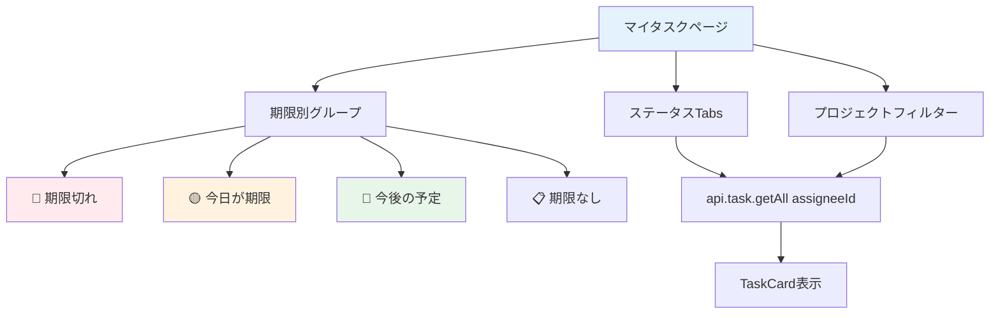

# Day 17: 自分のタスクページを作ろう

## 🎯 今日のゴール

ログイン中のユーザーに割り当てられたタスクだけを
表示する「マイタスク」ページを実装します。期限別
のグループ表示とステータスタブで、今やるべきこと
が一目でわかるようにします。


## 🤔 なぜこれを作るのか？

複数のプロジェクトに参加していると、自分が何を
すべきか分からなくなります。

> 💡 **例え話**: マイタスクは「個人の受信トレイ」
> です。自分が担当するタスクだけが表示され、
> 優先度別に分かれているので
> 何から手をつけるべきかが一目瞭然です。

### 📐 マイタスクページの構成



### やること / やらないこと

| やること | やらないこと |
|---------|-------------|
| `getCurrentUser` で自分のIDを取得 | useSessionは使わない |
| `getAll({ assigneeId })` でフィルタ | 専用のAPIエンドポイント |
| 期限別にグループ表示 | カレンダー表示 |
| ステータスTabsで絞り込み | 検索機能（Day 20） |
| 編集・削除をTaskDialogで | 新規作成 |

### 🆕 新しく学ぶ概念

| 概念 | 読み方 | 役割 | 例え |
|------|--------|------|------|
| Tabs | タブ | コンテンツの切り替えUI | ファイルのタブ仕切り |
| グループ表示 | — | データを条件で分類 | 手紙を「緊急・普通・後回し」に分ける |
| toDateString() | トゥ・デイト・ストリング | 日付を比較用文字列に変換 | カレンダーの同じ日付 |

## 📊 実装ステップ一覧

| ステップ | 作業内容 | 所要時間 |
|---------|---------|---------|
| Step 1 | ページの土台を作る | 3分 |
| Step 2 | 自分のIDを取得する | 5分 |
| Step 3 | 自分のタスクを取得する | 5分 |
| Step 4 | ステータスTabsを作る | 5分 |
| Step 5 | プロジェクトフィルターを追加 | 5分 |
| Step 6 | 期限別グループに分類する | 7分 |
| Step 7 | グループごとにカード表示 | 7分 |
| Step 8 | 編集・削除ハンドラーを接続 | 5分 |
| Step 9 | 動作確認 | 3分 |

**合計時間**: 約45分

---

### Step 1: ページの土台を作る（3分）

🎯 **ゴール**: マイタスクページの基本構造を作り
ます。

💻 **実装**:

```typescript
// filepath: src/app/my-task/page.tsx
'use client';

import {
  AppLayout,
} from '@/component/layout/app-layout';
import {
  TaskCard,
} from '@/component/task/task-card';
import {
  TaskDialog, type TaskFormData,
} from '@/component/task/task-dialog';
import { api } from '@/trpc/react';
import { useMemo, useState } from 'react';
```

```typescript
// filepath: src/app/my-task/page.tsx
export default function MyTasksPage() {
  return (
    <AppLayout>
      <div className="flex flex-col gap-6">
        <h1 className="text-3xl font-bold
          tracking-tight">
          マイタスク
        </h1>
      </div>
    </AppLayout>
  );
}
```

> 💡 Day 08 で学んだ `AppLayout` でページを
> ラップします。サイドバーと認証ガードが
> 自動的に適用されます。

✅ **確認ポイント**:
- `/my-task` にアクセスして「マイタスク」と表示
- サイドバーが表示されている

---

### Step 2: 自分のIDを取得する（5分）

🎯 **ゴール**: ログイン中のユーザー情報を
取得します。

💻 **実装**:

```typescript
// filepath: src/app/my-task/page.tsx
// MyTasksPage内に追加
const { data: currentUser } =
  api.user.getCurrentUser.useQuery();

// ユーザー一覧を取得（担当者選択用）
const { data: users } =
  api.search.getProjectMembers.useQuery();
```

✅ **確認ポイント**:
- `console.log(currentUser)` でユーザー情報取得
- `npm run dev` でエラーなし

#### 認証情報の取得方法

| 方法 | API | 用途 |
|------|-----|------|
| セッション確認 | `api.auth.getSession` | ログイン状態チェック |
| 現在のユーザー | `api.user.getCurrentUser` | ユーザー詳細情報 |
| メンバー取得 | `api.search.getProjectMembers` | 担当者選択用 |

> 💡 `api.user.getCurrentUser` はログイン中の
> ユーザーのIDや名前を返します。
> このIDを使って「自分のタスク」を絞り込みます。

✅ **確認ポイント**:
- `console.log(currentUser)` でユーザー情報取得
- `npm run dev` でエラーなし

---

### Step 3: 自分のタスクを取得する（5分）

🎯 **ゴール**: `assigneeId` でフィルタして自分の
タスクだけを取得します。

💻 **実装**:

```typescript
// filepath: src/app/my-task/page.tsx
const { data: tasks, isLoading } =
  api.task.getAll.useQuery(
    {
      assigneeId: currentUser?.id,
    },
    { enabled: !!currentUser },
  );
```

✅ **確認ポイント**:
- 自分に割り当てられたタスクだけが返る
- 他の人のタスクは含まれない

> 💡 `enabled: !!currentUser` は
> 「currentUserが取得できてからAPIを呼ぶ」
> という設定です。Day 12 で学んだパターンです。
> currentUser未取得のまま呼ぶと、全タスクが
> 返ってしまいます。

#### getAll パラメータの活用

| パラメータ | 値 | 効果 |
|-----------|-----|------|
| `assigneeId` | 自分のID | 自分のタスクだけ取得 |
| `status` | `'TODO'` | TODOのみ取得 |
| `projectId` | プロジェクトID | 特定プロジェクトだけ |

✅ **確認ポイント**:
- 自分に割り当てられたタスクだけが返る
- 他の人のタスクは含まれない

---

### Step 4: ステータスTabsを作る（5分）

🎯 **ゴール**: ステータスで絞り込むタブUIを
追加します。

💻 **実装**:

```typescript
// filepath: src/app/my-task/page.tsx
import {
  Tabs, TabsList, TabsTrigger,
} from '@/component/ui/tabs';
import type { TaskStatus } from '@prisma/client';

const STATUS_TABS: {
  label: string;
  value: TaskStatus | 'all';
}[] = [
  { label: 'すべて', value: 'all' },
  { label: '未対応', value: 'TODO' },
  { label: '進行中',
    value: 'IN_PROGRESS' },
  { label: 'レビュー中',
    value: 'IN_REVIEW' },
  { label: '完了', value: 'DONE' },
];
```

```typescript
// filepath: src/app/my-task/page.tsx
const [activeTab, setActiveTab] =
  useState<string>('all');

// useQueryにステータスフィルター追加
const { data: tasks } =
  api.task.getAll.useQuery(
    {
      assigneeId: currentUser?.id,
      status: activeTab === 'all'
        ? undefined
        : (activeTab as TaskStatus),
    },
    { enabled: !!currentUser },
  );
```

```typescript
// filepath: src/app/my-task/page.tsx
// Tabs UIの表示
<Tabs value={activeTab}
  onValueChange={setActiveTab}>
  <TabsList>
    {STATUS_TABS.map((tab) => (
      <TabsTrigger
        key={tab.label}
        value={tab.value}>
        {tab.label}
      </TabsTrigger>
    ))}
  </TabsList>
</Tabs>
```

> 💡 shadcn/ui の `Tabs` コンポーネントは
> クリックで値が切り替わるUIです。
> `onValueChange` で選択値を state に保存し、
> それをAPIパラメータに渡して絞り込みます。

✅ **確認ポイント**:
- タブが横並びで表示される
- タブ切り替えでタスクが絞り込まれる


---

### Step 5: プロジェクトフィルターを追加（5分）

🎯 **ゴール**: プロジェクトでも絞り込めるように
します。

💻 **実装**:

```typescript
// filepath: src/app/my-task/page.tsx
import {
  Select, SelectContent, SelectItem,
  SelectTrigger, SelectValue,
} from '@/component/ui/select';

const [filterProject, setFilterProject] =
  useState<string>('all');
const { data: projects } =
  api.project.getAll.useQuery();
```

```typescript
// filepath: src/app/my-task/page.tsx
// useQueryにプロジェクトフィルター追加
const { data: tasks } =
  api.task.getAll.useQuery(
    {
      assigneeId: currentUser?.id,
      status: activeTab === 'all'
        ? undefined
        : (activeTab as TaskStatus),
      projectId: filterProject === 'all'
        ? undefined
        : filterProject,
    },
    { enabled: !!currentUser },
  );
```

```typescript
// filepath: src/app/my-task/page.tsx
// Select UIの表示
<Select value={filterProject}
  onValueChange={setFilterProject}>
  <SelectTrigger className="w-[200px]">
    <SelectValue
      placeholder="All Projects" />
  </SelectTrigger>
  <SelectContent>
    <SelectItem value="all">
      All Projects
    </SelectItem>
    {projects?.map((p) => (
      <SelectItem key={p.id} value={p.id}>
        {p.name}
      </SelectItem>
    ))}
  </SelectContent>
</Select>
```

> 💡 Day 13 のタスク一覧と同じフィルター
> パターンです。Tabs（ステータス）と
> Select（プロジェクト）を組み合わせて、
> 複数条件で絞り込みます。

✅ **確認ポイント**:
- プロジェクト選択ドロップダウンが表示
- 選択するとタスクが絞り込まれる

---

### Step 6: 期限別グループに分類する（7分）

🎯 **ゴール**: タスクを期限で4つのグループに
分類します。

💻 **実装**:

```typescript
// filepath: src/app/my-task/page.tsx
// useMemoはStep 1でインポート済み
// タスクを期限別にグループ化
const groupedTasks = useMemo(() => {
  const overdue: typeof tasks = [];
  const today: typeof tasks = [];
  const upcoming: typeof tasks = [];
  const noDueDate: typeof tasks = [];
  const now = new Date();
  const todayStr = now.toDateString();

  for (const t of tasks ?? []) {
    if (!t.dueDate) {
      noDueDate.push(t);
    } else {
      const dueDate = new Date(t.dueDate);
      const dueDateStr =
        dueDate.toDateString();
```

続けて、各グループへの振り分けロジックです。

```typescript
// filepath: src/app/my-task/page.tsx
// groupedTasks 続き: 条件分岐で分類
      if (dueDateStr === todayStr) {
        today.push(t);
      } else if (dueDate < now) {
        overdue.push(t);
      } else {
        upcoming.push(t);
      }
    }
  }

  return {
    overdue, today, upcoming, noDueDate,
  };
}, [tasks]);
```

✅ **確認ポイント**:
- 期限切れのタスクが赤いグループに入る
- 今日のタスクがオレンジのグループに入る

#### 4つのグループ

| グループ | 条件 | 色 | 意味 |
|---------|------|-----|------|
| 期限切れ | 期限 < 今日 | 赤 | 期限切れ！急いで！ |
| 今日が期限 | 期限 = 今日 | オレンジ | 今日中にやること |
| 今後の予定 | 期限 > 今日 | 通常 | 今後の予定 |
| 期限なし | 期限なし | 通常 | 期限未設定 |

> 💡 `toDateString()` は日付を
> `"Fri Feb 14 2025"` のような文字列に変換
> します。時刻を無視して「同じ日かどうか」を
> 比較するのに便利です。

✅ **確認ポイント**:
- 期限切れのタスクが赤いグループに入る
- 今日のタスクがオレンジのグループに入る

---

### Step 7: グループごとにカード表示（7分）

🎯 **ゴール**: 各グループのタスクをTaskCardで
表示します。

💻 **実装**:

```typescript
// filepath: src/app/my-task/page.tsx
// 期限切れグループのヘッダー
{groupedTasks.overdue.length > 0 && (
  <div className="space-y-4">
    <h2 className="text-xl font-semibold
      text-destructive">
      期限切れ
      ({groupedTasks.overdue.length})
    </h2>
    <div className="grid gap-6
      sm:grid-cols-2 lg:grid-cols-3
      xl:grid-cols-4">
```

```typescript
// filepath: src/app/my-task/page.tsx
// 期限切れグループ: TaskCard表示
      {groupedTasks.overdue.map((task) => (
        <TaskCard
          key={task.id}
          id={task.id}
          title={task.title}
          description={task.description}
          status={task.status}
          priority={task.priority}
          dueDate={task.dueDate}
          assignee={task.assignee}
          onEdit={handleEdit}
          onDelete={handleDelete}
        />
      ))}
    </div>
  </div>
)}
```

> 💡 `length > 0` でタスクがある時だけ
> グループを表示します。空のグループは
> 非表示にしてUIをすっきりさせます。

```typescript
// filepath: src/app/my-task/page.tsx
// タスクが0件の場合
{tasks && tasks.length === 0 && (
  <div className="flex flex-col
    items-center justify-center py-12
    text-center text-muted-foreground">
    <p>あなたに割り当てられたタスクはありません</p>
  </div>
)}
```

✅ **確認ポイント**:
- 各グループにタスクカードが表示される
- 空のグループは非表示
- 0件の場合はメッセージ表示


---

### Step 8: 編集・削除ハンドラーを接続（5分）

🎯 **ゴール**: Day 15 で学んだ編集・削除パターン
をマイタスクページにも適用します。

💻 **実装**:

```typescript
// filepath: src/app/my-task/page.tsx
const [dialogOpen, setDialogOpen] =
  useState(false);
const [editingTask, setEditingTask] =
  useState<TaskFormData | undefined>();
const utils = api.useUtils();

const updateMutation =
  api.task.update.useMutation({
    onSuccess: () => {
      utils.task.getAll.invalidate();
      setDialogOpen(false);
    },
  });
const deleteMutation =
  api.task.delete.useMutation({
    onSuccess: () => {
      utils.task.getAll.invalidate();
    },
  });
```

```typescript
// filepath: src/app/my-task/page.tsx
// handleEdit（Day 15と同じパターン）
const handleEdit = (taskId: string) => {
  const task =
    tasks?.find((t) => t.id === taskId);
  if (!task) return;
  setEditingTask({
    id: task.id,
    title: task.title,
    description: task.description || '',
    status: task.status,
    priority: task.priority,
    projectId: task.projectId,
  });
  setDialogOpen(true);
};

const handleDelete = (taskId: string) => {
  if (confirm(
    'このタスクを削除してもよろしいですか？'
  )) {
    deleteMutation.mutate({ id: taskId });
  }
};
```

```typescript
// filepath: src/app/my-task/page.tsx
// フォーム送信ハンドラー
const handleSubmit = (
  data: TaskFormData,
) => {
  if (data.id) {
    updateMutation.mutate({
      id: data.id, ...data });
  }
};
```

```typescript
// filepath: src/app/my-task/page.tsx
// TaskDialogを配置
<TaskDialog
  open={dialogOpen}
  onClose={() => setDialogOpen(false)}
  onSubmit={handleSubmit}
  initialData={editingTask}
  projects={projects || []}
  users={users || []}
/>
```

> 💡 タスク一覧ページ（Day 15）と全く同じ
> パターンです。TaskDialog を再利用することで、
> どのページからでも同じUIで編集・削除できます。

✅ **確認ポイント**:
- 編集ボタンでダイアログが開く
- 削除ボタンで確認→削除される
- 一覧が自動で更新される

---

### Step 9: 動作確認（3分）

🎯 **ゴール**: マイタスクページの全機能を確認
します。

1. `/my-task` にアクセス
2. 自分のタスクだけが表示される
3. ステータスタブで絞り込みできる
4. プロジェクトフィルターで絞り込みできる
5. 期限切れタスクが赤いグループに表示される
6. 編集ボタンでダイアログが開く
7. 削除ボタンで確認→削除される

✅ **確認ポイント**:
- 他の人のタスクは表示されない
- フィルタリングが正しく動作する
- 期限別グループが正しく分類される

---

```bash
# filepath: ターミナル
# 開発サーバーを起動して動作確認
npm run dev
```

## 📋 今日のまとめ

- [ ] `getCurrentUser` で自分のIDを取得できた
- [ ] `getAll({ assigneeId })` で自分のタスク取得
- [ ] Tabs でステータスフィルタを実装できた
- [ ] 期限別グループ表示を実装できた
- [ ] TaskDialog を使って編集・削除できた

## ⚠️ つまずきポイント

| エラー / 問題 | 原因 | 解決方法 |
|--------------|------|---------|
| 全タスクが表示される | assigneeId未設定 | currentUser?.id を渡す |
| タスクが表示されない | enabled未設定 | `!!currentUser` で制御 |
| 今日のタスクが表示されない | 時刻で比較している | toDateString()で日付だけ比較 |
| 編集が動かない | handleEdit未実装 | Day 15パターンをコピー |

## 📝 今日学んだ用語

| 用語 | 意味 |
|------|------|
| getCurrentUser | ログイン中のユーザー情報を取得 |
| Tabs | コンテンツを切り替えるUIコンポーネント |
| toDateString() | 日付の日付部分だけを文字列化 |
| グループ表示 | データを条件で分類して表示 |

## 🔜 次回予告

Day 18 では、タスクにコメントを投稿する機能を
実装します。チームメンバーとタスクについて
コミュニケーションを取れるようになります。
