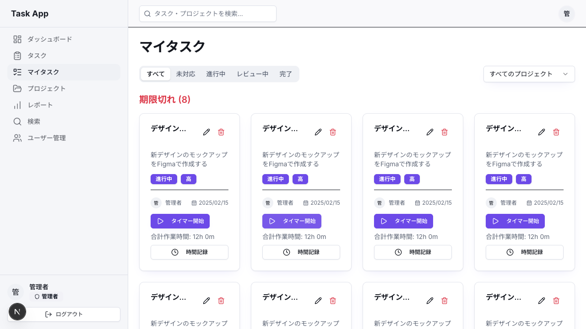
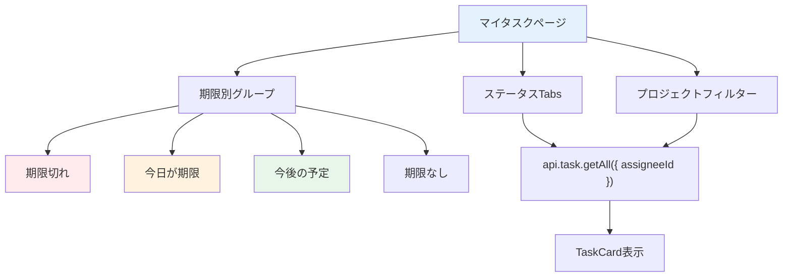

# Day 17: マイタスクページ（自分のタスク一覧）を作ろう

## 前回の振り返り

Day 16 ではタスクのステータス変更機能と、作業時間を手動で記録する機能を実装しました。ワンクリックでステータスを切り替え、作業した時間を後から記録できるようになったので、今日はログイン中のユーザー専用の「マイタスク」ページに取り組みます。

---

## 今日のゴール

ログイン中のユーザーに割り当てられたタスクだけを表示する「マイタスク」ページを実装します。期限別のグループ表示とステータスタブで、今やるべきことをすぐに把握できるようにします。

スクリーンショット: マイタスクページの完成画面を確認してください。



> **今日のゴールライン**: ログイン中の自分だけのタスクを取得し、期限グループとタブで今やることを整理できればOK。

## なぜこれを作るのか

複数のプロジェクトに参加していると、自分が何をすべきか分からなくなります。

> **例え話**: マイタスクは「個人の受信トレイ」です。3つのプロジェクトに参加していて合計20個のタスクがある場合、マイタスクページを開くだけで今日やるべき3つのタスクがすぐに分かります。

### マイタスクページの構成


```mermaid
flowchart TD
    A[マイタスクページ] --> B[ステータスTabs]
    A --> C[プロジェクトフィルター]
    A --> D[期限別グループ]
    D --> E[期限切れ]
    D --> F[今日が期限]
    D --> G[今後の予定]
    D --> H[期限なし]

    B --> I["api.task.getAll({ assigneeId })"]
    C --> I
    I --> J[TaskCard表示]

    style A fill:#e3f2fd
    style E fill:#ffebee
    style F fill:#fff3e0
    style G fill:#e8f5e9
```

この図で見てほしいのは、ステータスTabs（B）とプロジェクトフィルター（C）が、どちらも同じ `api.task.getAll`（I）へ矢印を向けている点です。絞り込みの条件が2つに増えても、呼び出す API は1本のままです。取得したタスクを期限別に振り分けるのは画面側の仕事です。サーバーへ渡す条件は「誰のタスクか」「どの状態か」の2つだけにします。だからマイタスク専用の API を新しく作らずに済みます。

### やること / やらないこと

| やること | やらないこと |
|---------|-------------|
| `getCurrentUser` で自分のIDを取得 | useSessionは使わない |
| `getAll({ assigneeId })` でフィルター | 専用のAPIエンドポイント |
| 期限別にグループ表示 | カレンダー表示 |
| ステータスTabsで絞り込み | 検索機能（Day 20） |
| 編集・削除をTaskDialogで | 新規作成 |

### 新しく学ぶ概念

| 概念 | 読み方 | 役割 | 例え |
|------|--------|------|------|
| Tabs | タブ | コンテンツの切り替えUI | ファイルのタブ仕切り |
| グループ表示 | — | データを条件で分類 | 手紙を「緊急・普通・後回し」に分ける |
| date-only helper | — | 日付だけの値を時刻と切り分けて扱う | 「4/17」という日付札だけを比べる |
| `useMemo` | ユーズ・メモ | 計算結果をキャッシュして再利用 | メモ帳に書いておいて、変わった時だけ書き直す |

## 実装ステップ一覧

| ステップ | 作業内容 | 所要時間 |
|---------|---------|---------|
| Step 1 | ページの最小構造を作る | 3分 |
| Step 2 | 自分のIDを取得してローディング処理 | 5分 |
| Step 3 | 自分のタスクを取得する | 5分 |
| Step 4 | ステータスTabsを作る | 5分 |
| Step 5 | プロジェクトフィルターを追加 | 5分 |
| Step 6 | TaskGroupSectionコンポーネントを作る | 7分 |
| Step 7 | 期限別グループに分類する | 7分 |
| Step 8 | グループごとにカード表示 | 5分 |
| Step 9 | 編集ハンドラーを実装する | 5分 |
| Step 10 | 削除ハンドラーを実装する | 5分 |
| Step 11 | ダイアログを配置する | 3分 |
| Step 12 | 動作確認 | 3分 |

**合計時間**: 約58分です。

---

### Step 1 : ページの最小構造を作る（3分）

**ゴール**: マイタスクページの最小完成版を作ります。このファイルに以降のステップでコードを追加していきます。

**実装**:

```typescript
// filepath: src/app/my-task/page.tsx
'use client';

import { useMemo, useState } from 'react';
import { AppLayout } from '@/component/layout/app-layout';
import { api } from '@/trpc/react';

// マイタスクページのコンポーネント
export default function MyTasksPage() {
  return (
    <AppLayout>
      <div className="flex flex-col gap-6">
        <h1 className="text-3xl font-bold tracking-tight">
          マイタスク
        </h1>
      </div>
    </AppLayout>
  );
}
```

> Day 08 で学んだ `AppLayout` でページをラップします。サイドバーと認証ガードが自動的に適用されます。

**確認ポイント**:
- ファイルを保存した
- `/my-task` にアクセスして「マイタスク」と表示される
- サイドバーが表示されている

---

### Step 2 : 自分のIDを取得してローディング処理（5分）

**ゴール**: ログイン中のユーザー情報を取得し、ローディング中はスピナーを表示します。

**実装**:

まずインポートを追加します。Step 1 のインポート部分を以下に**置き換えて**ください。

```typescript
// filepath: src/app/my-task/page.tsx
'use client';

import { useCallback, useMemo, useState } from 'react';
import { AppLayout } from '@/component/layout/app-layout';
import {
  PageLoadingSpinner,
} from '@/component/ui/loading-spinner';
import {
  hasPermission, isProjectMemberRole,
  type ProjectMemberRole,
} from '@/lib/constant/roles';
import { api } from '@/trpc/react';
```

ここで取り込む道具は、これから3つの役目に分かれます。`PageLoadingSpinner` は Day 09 でも使った読み込み中のスピナーで、ユーザー情報が届くまで画面を受け持ちます。`useCallback` は Step 5 で権限判定の関数を作るときに使います。残る `hasPermission` と `isProjectMemberRole` は、Step 5 で「このプロジェクトでの自分の役割」を調べるための道具です。まだ出番のない名前も並びますが、インポートを何度も書き足すより、先にそろえておくと差分を追いやすくなります。

次に、`MyTasksPage` の `return` の**前に**以下を追加します。

```typescript
// filepath: src/app/my-task/page.tsx
// MyTasksPage内の先頭に追加
// ログイン中のユーザー情報を取得
const { data: currentUser, isLoading: isCurrentUserLoading } =
  api.auth.getCurrentUser.useQuery();
```

`api.auth.getCurrentUser` は、いま誰がログインしているかをサーバーへ聞き直す手続きです。ブラウザが持っている情報をそのまま信じず、毎回サーバーに確かめます。ここで得た `currentUser.id` が、このあと「自分のタスクだけを取る」ための鍵になります。返り値に `currentUser` と `isCurrentUserLoading` という別名を付けているのは、Step 3 でタスク側の読み込み状態も受け取るからです。同じ名前が2つ並ぶと、どちらの読み込み状態なのか見分けられません。

ローディング中はスピナーを表示します。`return` の**前に**以下を追加してください。

```typescript
// filepath: src/app/my-task/page.tsx
// ローディング中はスピナーを表示
if (isCurrentUserLoading) {
  return (
    <AppLayout>
      <PageLoadingSpinner />
    </AppLayout>
  );
}
```

この分岐が無いと、`currentUser` がまだ届いていない一瞬のあいだに本文が描かれます。そのときタスクの取得は Step 3 の `enabled` で止まっているため、画面には「タスクが0件」のときとまったく同じ見た目が出ます。読者にはどちらか区別できず、自分のタスクが消えたと誤解させます。スピナーを `AppLayout` の中に置くのは、ヘッダーやサイドバーを出したまま中身だけを差し替えるためです。外に置くと読み込みのたびに画面全体が消え、位置がずれたように見えます。

**確認ポイント**:
- ファイルを保存した
- ブラウザのDevTools（F12 → Networkタブ）で `getCurrentUser` リクエストが飛んでいる
- ページアクセス時に一瞬スピナーが表示された後、「マイタスク」が表示される

#### 認証情報の取得方法

| 方法 | API | 用途 |
|------|-----|------|
| セッション確認 | `api.auth.getSession` | ログイン状態チェック |
| 現在のユーザー | `api.auth.getCurrentUser` | ユーザー詳細情報 |
| メンバー取得 | `api.search.getProjectMembers` | 担当者選択用 |

> `api.auth.getCurrentUser` はログイン中のユーザーのIDや名前を返します。このIDを使って「自分のタスク」を絞り込みます。

---

### Step 3 : 自分のタスクを取得する（5分）

**ゴール**: `assigneeId` でフィルターして自分のタスクだけを取得します。

**実装**:

Step 2 で追加した `currentUser` の取得の**下に**以下を追加します。

```typescript
// filepath: src/app/my-task/page.tsx
// 自分に割り当てられたタスクだけを取得
const { data: tasks, isLoading } =
  api.task.getAll.useQuery(
    { assigneeId: currentUser?.id },
    { enabled: !!currentUser },
  );
```

このページの主役は `assigneeId: currentUser?.id` という1行です。Day 13 のタスク一覧では全員分を取っていました。今回は担当者を自分に固定して取り直します。新しい API を作らずに済むのは、`getAll` がすでに担当者での絞り込みを受け付けるからです。第2引数の `enabled: !!currentUser` は、`currentUser` が届くまでこの通信を止めておく指定です。これを外すと `assigneeId` は `undefined` のまま送られ、他人のタスクまで混ざった一覧が一瞬表示されます。

この書き方には弱点もあります。`currentUser` の取得そのものが失敗したときも `undefined` のままなので、タスクの通信は止まり続けます。画面には「タスクが0件」と同じ見た目が出ます。実務では、こちらの `error` も受け取って、失敗したときだけ別の案内を出す形にします。

タスクキャッシュ操作用のユーティリティを追加します。tasks の取得の**下に**以下を追加します。

```typescript
// filepath: src/app/my-task/page.tsx
// tRPCキャッシュ操作用ユーティリティ
// ⚠️ hooks はすべて early return より前に置く
const utils = api.useUtils();
```

> **Reactの hooks ルール**: `useQuery` や `useUtils` などの hooks はコンポーネントのトップレベルに配置し、`if` 文や `return` の後に置いてはいけません。hooks の呼び出し順序が変わるとエラーになるため、early return（`if (isLoading) return ...`）は必ず全 hooks 定義の後に書きます。

ローディングの条件も更新します。Step 2 で追加した `if (isCurrentUserLoading)` を以下に**置き換えて**ください。

```typescript
// filepath: src/app/my-task/page.tsx
// 全 hooks 定義後にローディング判定（hooks の後に early return）
if (isCurrentUserLoading || isLoading) {
  return (
    <AppLayout>
      <PageLoadingSpinner />
    </AppLayout>
  );
}
```

**確認ポイント**:
- ブラウザのDevTools（F12 → Networkタブ）で `getAll` リクエストに `assigneeId` パラメータが含まれている
- 自分に割り当てられたタスクだけが返る
- `npm run dev` でエラーが出ていない

> `enabled: !!currentUser` は「currentUserが取得できてからAPIを呼ぶ」という設定です。Day 12 で学んだパターンです。currentUser未取得のまま呼ぶと、全タスクが返ってしまいます。

#### getAll パラメータの活用

| パラメータ | 値 | 効果 |
|-----------|-----|------|
| `assigneeId` | 自分のID | 自分のタスクだけ取得 |
| `status` | `'TODO'` | TODOのみ取得 |
| `projectId` | プロジェクトID | 特定プロジェクトだけ |

---

### Step 4 : ステータスTabsを作る（5分）

**ゴール**: ステータスで絞り込むタブUIを追加します。

**実装**:

まずインポートを追加します。ファイル先頭のインポート部分に以下を**追加**してください。

```typescript
// filepath: src/app/my-task/page.tsx
// インポートに追加
import {
  Tabs, TabsList, TabsTrigger,
} from '@/component/ui/tabs';
import {
  isTaskStatus, TASK_STATUS,
  TASK_STATUS_LABELS, type TaskStatus,
} from '@/lib/constant/status';
```

次に、`MyTasksPage` の**外側**（`export default function MyTasksPage()` の前、ファイルのトップレベル）に定数を定義します。

```typescript
// filepath: src/app/my-task/page.tsx
// コンポーネントの外側に定数を定義
const ACTIVE_STATUSES: TaskStatus[] = [
  TASK_STATUS.TODO,
  TASK_STATUS.IN_PROGRESS,
  TASK_STATUS.IN_REVIEW,
  TASK_STATUS.DONE,
];
```

この配列は、タブに並べるステータスと、その並び順の両方を決めています。`'TODO'` という文字列を直接書かず、`TASK_STATUS.TODO` を使います。Day 13 から続けている書き方です。定数にしておくと、綴りの間違いは TypeScript が先に止めてくれます。`CANCELLED` はここに入れません。取り消し済みのタスクを並べても、今日やることの判断には使えないからです。

```typescript
// filepath: src/app/my-task/page.tsx
// ステータス定数からタブを動的に生成
const STATUS_TABS: {
  label: string;
  value: TaskStatus | 'all';
}[] = [
  { label: 'すべて', value: 'all' },
  ...ACTIVE_STATUSES.map((status) => ({
    label: TASK_STATUS_LABELS[status],
    value: status,
  })),
];
```

`STATUS_TABS` を手で4行書き並べず、`ACTIVE_STATUSES` から作っているところが肝心です。タブのラベルは `TASK_STATUS_LABELS` から引くので、日本語の表記を変えたいときも、この画面には手を入れずに済みます。先頭の `{ label: 'すべて', value: 'all' }` だけ別に書いてあるのは、これがステータスではなく「絞り込みなし」を表す特別な値だからです。型を `TaskStatus | 'all'` と書いてあるのも、その特別扱いを型の上で示すためです。

`MyTasksPage` 内の `currentUser` 取得の**前に**stateを追加します。

```typescript
// filepath: src/app/my-task/page.tsx
// タブの選択状態を管理
const [activeTab, setActiveTab] =
  useState<TaskStatus | 'all'>('all');
```

選んでいるタブを `useState` で覚えます。初期値は `'all'` なので、ページを開いた直後は全ステータスのタスクが並びます。この state は次のブロックで `useQuery` の引数につなぎます。だからタブを押すだけで絞り込み条件が変わり、tRPC がタスクを取り直します。押されたタブの中身を自分で数える処理は要りません。

Step 3 の `useQuery` を以下に**置き換えて**ください。ステータスフィルターを追加します。

```typescript
// filepath: src/app/my-task/page.tsx
// ステータスフィルターを追加した版
const { data: tasks, isLoading } =
  api.task.getAll.useQuery(
    {
      assigneeId: currentUser?.id,
      status: activeTab === 'all'
        ? undefined : activeTab,
    },
    { enabled: !!currentUser },
  );
```

`status: activeTab === 'all' ? undefined : activeTab` は、「すべて」タブのときだけ条件そのものを外す書き方です。ここで `'all'` をそのままサーバーへ送ると、リクエストが失敗します。`task.getAll` の `status` は `TODO` や `DONE` といった決まった値しか受け取らないので、`'all'` は入力チェックの段階で弾かれるからです。0件が返るのではなく、エラーになります。絞り込みを外したいときは、値を空にするのではなく項目ごと `undefined` にする、と覚えてください。そして `useQuery` の引数に `activeTab` が入ったので、タブを押すたびにこの query は新しい条件で走り直します。取り直しの処理を自分で書く場所はありません。

JSXの `<h1>` タグの**下に**タブUIを追加します。

```typescript
// filepath: src/app/my-task/page.tsx
// フィルターエリアのコンテナ
<div className="flex flex-col sm:flex-row gap-4 items-center">
  <Tabs
    value={activeTab}
    onValueChange={(v) => {
      if (v === 'all' || isTaskStatus(v))
        setActiveTab(v);
    }}
    className="w-full sm:w-auto"
  >
    <TabsList>
      {STATUS_TABS.map((tab) => (
        <TabsTrigger
          key={tab.label}
          value={tab.value}>
          {tab.label}
        </TabsTrigger>
      ))}
    </TabsList>
  </Tabs>
</div>
```

> `onValueChange` は `string` を返すので、`isTaskStatus(v)` 型ガードで `TaskStatus` 型かを判定してから `setActiveTab` に渡します。`as TaskStatus` のような型アサーションは使わず、実行時に値を検証します。

**確認ポイント**:
- タブが横並びで表示される
- タブ切り替えでタスクが絞り込まれる
- `npm run dev` でエラーが出ていない

スクリーンショット: ステータスTabsが表示されている画面を確認してください。


---

### Step 5 : プロジェクトフィルターを追加（5分）

**ゴール**: プロジェクトでも絞り込めるようにします。

**実装**:

インポートを追加します。

```typescript
// filepath: src/app/my-task/page.tsx
// インポートに追加
import {
  Select, SelectContent, SelectItem,
  SelectTrigger, SelectValue,
} from '@/component/ui/select';
```

`Select` は Day 13 のタスク一覧でも使った shadcn/ui のドロップダウンです。5つの名前を一度に取り込むのは、この部品が入れ物・引き金・中身・項目・表示文字と、役割ごとに分かれているためです。ブラウザ標準の `<select>` タグ1つで済ませない代わりに、開いたときの見た目や項目の並びを細かく作り込めます。

`MyTasksPage` 内にstateとクエリを追加します。

```typescript
// filepath: src/app/my-task/page.tsx
// プロジェクトフィルターの状態管理
const [filterProject, setFilterProject] =
  useState<string>('all');
// プロジェクト一覧を取得
const { data: projects } =
  api.project.getAll.useQuery();
```

TaskCardの編集・削除ボタンの表示可否は、ログインユーザーがそのタスクの属するプロジェクトで何のロールかによって決まります。プロジェクトごとのロールを引けるようにしておきます。

```typescript
// filepath: src/app/my-task/page.tsx
// プロジェクトごとのログインユーザー自身のロールを引けるようにする
const myRoleByProject = useMemo(() => {
  const map = new Map<string, ProjectMemberRole>();
  const userId = currentUser?.id;
  if (!userId || !projects) {
    return map;
  }
  for (const project of projects) {
    const me = project.members?.find(
      (member) => member.userId === userId,
    );
    if (me && isProjectMemberRole(me.role)) {
      map.set(project.id, me.role);
    }
  }
  return map;
}, [projects, currentUser?.id]);
```

ここで作っているのは、プロジェクトIDを渡すと自分のロールが返ってくる対応表です。マイタスクは、複数のプロジェクトのタスクが混ざりうる画面です。初期データでは1プロジェクト分しか並びませんが、プロジェクトを増やすとこの対応表が効いてきます。カードを描くたびに `projects` の配列を端から探すと、タスクの件数だけ探し直しが起きます。先に `Map` へ入れておけば、あとは1件ずつ引くだけで済みます。`useMemo` で包んであるのは、この対応表を再描画のたびに作り直させないためです。第2引数の `[projects, currentUser?.id]` に挙げた2つが変わったときだけ、中の処理がもう一度走ります。`isProjectMemberRole(me.role)` を通してから `Map` へ入れているのは、データベースから来た文字列を `as` で型に押し込まず、実行時に確かめてから使うためです。

続けて、そのロールから編集・削除の権限を判定する関数を追加します。

```typescript
// filepath: src/app/my-task/page.tsx
// ロールから編集・削除の権限を判定する
const canEditProject = useCallback(
  (projectId: string) => {
    const role = myRoleByProject.get(projectId);
    return role ? hasPermission(role, 'canEdit') : false;
  },
  [myRoleByProject],
);

const canDeleteProject = useCallback(
  (projectId: string) => {
    const role = myRoleByProject.get(projectId);
    return role ? hasPermission(role, 'canDelete') : false;
  },
  [myRoleByProject],
);
```

> Day 13 のタスク一覧ページと同じパターンです。`myRoleByProject` でプロジェクトIDからロールを引き、`canEditProject` / `canDeleteProject` でそのロールに編集・削除の権限があるかを判定します。閲覧者（VIEWER）ロールのプロジェクトでは両方 `false` になります。

**確認ポイント**:
- `myRoleByProject` / `canEditProject` / `canDeleteProject` が定義できた
- `npm run dev` でエラーが出ていない

Step 4 の `useQuery` を以下に**置き換えて**ください。プロジェクトフィルターを追加します。

```typescript
// filepath: src/app/my-task/page.tsx
// プロジェクトフィルターも追加した最終版
const { data: tasks, isLoading } =
  api.task.getAll.useQuery(
    {
      assigneeId: currentUser?.id,
      status: activeTab === 'all'
        ? undefined : activeTab,
      projectId: filterProject === 'all'
        ? undefined : filterProject,
    },
    { enabled: !!currentUser },
  );
```

`projectId` の行が増えても、形は `status` のときとまったく同じです。「`'all'` なら `undefined`」という同じ判断を、条件ごとに1行ずつ並べています。絞り込みが3つ4つに増えても、この形のまま足していけます。`useQuery` の第1引数に並んだ値のどれか1つでも変われば、tRPC はその組み合わせで取り直します。だからタブとドロップダウンを同時に使った絞り込みも、追加の処理なしで動きます。

Step 4 で追加した `</Tabs>` の**下に**（`</div>` の前に）Select を追加します。

```typescript
// filepath: src/app/my-task/page.tsx
// プロジェクトフィルターのSelect UI
<div className="ml-auto w-full sm:w-[200px]">
  <Select
    value={filterProject}
    onValueChange={setFilterProject}>
    <SelectTrigger>
      <SelectValue
        placeholder="すべてのプロジェクト" />
    </SelectTrigger>
    <SelectContent>
      <SelectItem value="all">
        すべてのプロジェクト
      </SelectItem>
      {projects?.map((p) => (
        <SelectItem key={p.id} value={p.id}>
          {p.name}
        </SelectItem>
      ))}
    </SelectContent>
  </Select>
</div>
```

> Day 13 のタスク一覧と同じフィルターパターンです。Tabs（ステータス）と Select（プロジェクト）を組み合わせて、複数条件で絞り込みます。

**確認ポイント**:
- プロジェクト選択ドロップダウンがタブの右側に表示される
- 選択するとタスクが絞り込まれる
- `npm run dev` でエラーが出ていない

---

### Step 6 : TaskGroupSectionコンポーネントを作る（7分）

**ゴール**: タスクをグループごとに表示する共通コンポーネントを作ります。このコンポーネントは同じファイル内に定義します。

**実装**:

まずインポートを追加します。

```typescript
// filepath: src/app/my-task/page.tsx
// インポートに追加
import { TaskCard } from '@/component/task/task-card';
import type { TaskPriority }
  from '@/lib/constant/priority';
import { cn } from '@/lib/utils';
```

`MyTasksPage` の**外側**（`STATUS_TABS` 定数の下、`export default function` の前）にProps型を定義します。

```typescript
// filepath: src/app/my-task/page.tsx
// グループセクションのProps型定義
interface TaskGroupSectionProps {
  title: string;
  titleClassName?: string;
  tasks: Array<{
    id: string;
    title: string;
    description: string | null;
    status: TaskStatus;
    priority: TaskPriority;
    dueDate: Date | null;
    assignee: {
      name: string | null;
      email: string;
      avatar: string | null;
    } | null;
    projectId: string;
    timeSpentMinutes: number;
  }>;
```

残りは親から受け取る関数と判定です。`onEdit` と `onDelete` はボタンを押したときの処理、
`onTimeLogSuccess` は時間を記録できたときの合図です。
`canEditProject` と `canDeleteProject` は、そのプロジェクトで編集や削除をしてよいかを返します。

```typescript
// filepath: src/app/my-task/page.tsx（同じファイルの続き）
  onEdit: (id: string) => void;
  onDelete: (id: string) => void;
  onTimeLogSuccess: () => void;
  canEditProject: (projectId: string) => boolean;
  canDeleteProject: (projectId: string) => boolean;
}
```

> `tasks` の型は `api.task.getAll` が返す配列の要素に合わせています。`TaskCard` コンポーネントが受け取るpropsと一致させることで、型エラーなくデータを渡せます。

#### TaskGroupSectionProps の解説

| プロパティ | 型 | 役割 |
|-----------|-----|------|
| `title` | `string` | グループのタイトル（「期限切れ」等） |
| `titleClassName` | `string?` | タイトルの色クラス（赤・オレンジ等） |
| `tasks` | `Array<...>` | 表示するタスクの配列 |
| `onEdit` | `(id: string) => void` | 編集ボタン押下時のコールバック |
| `onDelete` | `(id: string) => void` | 削除ボタン押下時のコールバック |
| `canEditProject` | `(projectId: string) => boolean` | プロジェクトIDから編集可否を判定する関数 |
| `canDeleteProject` | `(projectId: string) => boolean` | プロジェクトIDから削除可否を判定する関数 |

Props型の**下に**コンポーネント本体を追加します。

作業時間を記録したあとに一覧を取り直すための関数を用意します。

```typescript
// filepath: src/app/my-task/page.tsx
// 時間記録の成功後に一覧を取り直す
const handleTimeLogSuccess =
  useCallback(() => {
    utils.task.getAll.invalidate();
  }, [utils.task.getAll]);
```

この関数が無いと、マイタスク画面で作業時間を記録しても表示が変わりません。
`TaskCard` は記録に成功したことを親へ伝えるだけなので、取り直しは親側で行います。

```typescript
// filepath: src/app/my-task/page.tsx
// タスクが0件なら何も表示しない
const TaskGroupSection = ({
  title, titleClassName,
  tasks, onEdit, onDelete,
  onTimeLogSuccess,
  canEditProject, canDeleteProject,
}: TaskGroupSectionProps) => {
  if (tasks.length === 0) return null;

  return (
    <div className="space-y-4">
      <h2 className={cn(
        'text-xl font-semibold flex items-center gap-2',
        titleClassName,
      )}>
        {title} ({tasks.length})
      </h2>
```

最初の `if (tasks.length === 0) return null;` が、このコンポーネントで一番効いている1行です。`null` を返すと、そのグループは見出しごと画面から消えます。期限切れのタスクが1件もない人の画面に「期限切れ (0)」という見出しだけ残ると、読む人はそこで一瞬とまどいます。この判断をコンポーネントの中に置いたので、呼び出す側は4つのグループをただ並べるだけで済みます。見出しに `({tasks.length})` と件数を添えているのは、開かなくても量が分かるようにするためです。

続けて、タスクカードのグリッド表示部分です。上のコードブロックの `</h2>` の**直後に**追加してください。

```typescript
// filepath: src/app/my-task/page.tsx
// TaskGroupSection のグリッド表示部分
      <div className="grid gap-6 sm:grid-cols-2
        lg:grid-cols-3 xl:grid-cols-4">
        {tasks.map((task) => (
          <TaskCard
            key={task.id}
            id={task.id}
            title={task.title}
            description={task.description}
            status={task.status}
            priority={task.priority}
            dueDate={task.dueDate}
            assignee={task.assignee}
            onEdit={onEdit}
            onDelete={onDelete}
            onTimeLogSuccess={onTimeLogSuccess}
            canEdit={canEditProject(task.projectId)}
            canDelete={canDeleteProject(task.projectId)}
            timeSpentMinutes={task.timeSpentMinutes}
          />
        ))}
```

`))}` で `map` を閉じ、`</div>` を2つ、`);` で `return` を閉じ、最後の `};` で `TaskGroupSection` そのものを閉じます。開いた順と逆に閉じるのは、この教材で何度も出てくる決まりです。

```typescript
// filepath: src/app/my-task/page.tsx（同じファイルの続き）
      </div>
    </div>
  );
};
```

> `canEditProject` / `canDeleteProject` は `MyTasksPage` から渡された関数です。`TaskGroupSection` 自身はロールを判定せず、渡された関数をそのまま `task.projectId` に適用するだけにすることで、権限ロジックが1か所（`MyTasksPage`）にまとまります。渡し忘れると `TaskCard` のデフォルト値（`true`）が使われ、閲覧者（VIEWER）にも編集・削除ボタンが表示されてしまいます。

> `cn()` は `clsx` + `tailwind-merge` のユーティリティです。条件付きでクラス名を結合できます。`titleClassName` に `"text-destructive"` を渡すとタイトルが赤色になります。

> `timeSpentMinutes` を渡しているのは、カードに出る「合計作業時間」を実際の記録に合わせるためです。渡さないと `TaskCard` の既定値 0 が使われ、時間を記録済みのタスクでも `0m` と表示されます。なお、このページの「時間記録」ボタンで記録した直後は数字がすぐ変わりません。ページを開き直すと反映されます。

**確認ポイント**:
- ファイルを保存した
- `npm run dev` でエラーが出ていない
- まだ画面に変化はない（次のStepで使う）

---

### ここまでのインポート一覧（中間確認）

ここまでのStep 1〜6 で追加したインポートをまとめます。ファイル先頭が以下の状態になっていることを確認してください。

| インポート元 | インポート内容 | 追加Step |
|-------------|---------------|---------|
| `react` | `useMemo`, `useState` | Step 1 |
| `@/component/layout/app-layout` | `AppLayout` | Step 1 |
| `@/component/ui/loading-spinner` | `PageLoadingSpinner` | Step 2 |
| `@/trpc/react` | `api` | Step 1 |
| `@/component/ui/tabs` | `Tabs`, `TabsList`, `TabsTrigger` | Step 4 |
| `@/lib/constant/status` | `isTaskStatus`, `TASK_STATUS`, `TASK_STATUS_LABELS`, `TaskStatus` | Step 4 |
| `@/component/ui/select` | `Select`, `SelectContent`, `SelectItem`, `SelectTrigger`, `SelectValue` | Step 5 |
| `@/component/task/task-card` | `TaskCard` | Step 6 |
| `@/lib/constant/priority` | `TaskPriority`（type） | Step 6 |
| `@/lib/utils` | `cn` | Step 6 |

**確認ポイント**:
- 上記のインポートがすべて揃っている
- `npm run dev` でインポートエラーが出ていない

---

### Step 7 : 期限別グループに分類する（7分）

**ゴール**: タスクを期限で4つのグループに分類します。完成版のコード と同じ `dateOnlyFromValue()` / `localDateOnly()` を使い、日付だけを比較します。

**実装**:

インポートを追加します。

```typescript
// filepath: src/app/my-task/page.tsx
// インポートに追加（日付 helper）
import {
  dateOnlyFromValue,
  dateOnlyToUtcStartIso,
  localDateOnly,
} from '@/lib/date';
```

`MyTasksPage` 内の `useQuery` の**下に**以下を追加します。

まず、比較に使う「今日」のキーを用意します。

```typescript
// filepath: src/app/my-task/page.tsx
// 今日を YYYY-MM-DD にそろえる
const todayKey = localDateOnly(new Date());
```

`localDateOnly(new Date())` は、いまのブラウザの日付を `2026-04-17` のような文字列にそろえて返します。時刻を落として日付だけにするのがねらいです。`new Date()` のまま比べると、同じ「今日」でも 9時00分 と 18時30分 は別物として扱われ、今日が期限のタスクは1件も一致しません。文字列にそろえてしまえば、比較は普通の文字列の大小で足ります。`2026-04-16` は `2026-04-17` より小さい、という並びが日付の前後とそのまま一致するからです。

この値は画面を開いたときに1回決まるだけです。日付をまたいで開いたままにしていると、`todayKey` は古い日のままになります。ページを開き直せば正しくなりますが、開きっぱなしを前提にするなら、日付の変わり目で計算し直す仕組みが別に要ります。

続けて、`useMemo` で4グループに分類するロジックを追加します。

```typescript
// filepath: src/app/my-task/page.tsx
// タスクを期限別に4グループへ振り分ける前半
const groupedTasks = useMemo(() => {
  const overdue: typeof tasks = [];
  const today: typeof tasks = [];
  const upcoming: typeof tasks = [];
  const noDueDate: typeof tasks = [];

  for (const t of tasks ?? []) {
    if (!t.dueDate) {
      noDueDate.push(t);
      continue;
    }

    const dueDateKey = dateOnlyFromValue(t.dueDate);

    if (dueDateKey === todayKey) {
      today.push(t);
    } else if (dueDateKey < todayKey) {
      overdue.push(t);
    } else {
      upcoming.push(t);
    }
  }
```

振り分けの順番には意味があります。先に `!t.dueDate` を見て期限なしを抜き、そのあとで期限ありのタスクだけを3つに分けます。こうすると以降の比較では `dueDate` が必ず存在するので、値が無い場合を毎回確かめずに済みます。`continue` は「この1件はここまで、次のタスクへ」という合図です。比較そのものは `dateOnlyFromValue()` で `YYYY-MM-DD` にそろえてから行うため、時刻やタイムゾーンの違いに振り回されません。等しければ今日、小さければ期限切れ、それ以外が今後の予定になります。

```typescript
// filepath: src/app/my-task/page.tsx
// 同じ useMemo の続き
  return { overdue, today, upcoming, noDueDate };
}, [tasks]);
```

`return` を `useMemo` の中に置いたので、4つの配列は `tasks` が変わったときだけ作り直されます。その条件を決めているのが最後の依存配列 `[tasks]` です。ここを `[]` にすると、まだ何も届いていない空の状態で結果が固定され、タスクが届いても画面は空のままになります。逆に `useMemo` を外すと、描き直しのたびに全件の振り分けをやり直します。ここで省けるのはその計算です。`React.memo` を使っていない今の構成では、描き直しの回数そのものは変わりません。

**確認ポイント**:
- ファイルを保存した
- `npm run dev` でエラーが出ていない
- ブラウザのDevTools（F12キー → Consoleタブ）で `console.log(groupedTasks)` を一時的に追加して、4つの配列にタスクが振り分けられていることを確認できる
- 確認が終わったら、その `console.log` は必ず削除する

#### なぜ date-only helper を使うのか

| 方法 | 問題点 | 推奨度 |
|------|--------|--------|
| `dueDate === now` | 時刻まで完全一致が必要で、ほぼ一致しない | ❌ |
| `new Date(t.dueDate) < new Date()` | タイムゾーン境界で前日・翌日にずれやすい | △ |
| `dateOnlyFromValue()` / `localDateOnly()` | `YYYY-MM-DD` にそろえて安全に比較できる | ✅ |

> 完成版のコード では、`dueDate` を
> `new Date()` にして比較するのではなく、
> `dateOnlyFromValue()` と `localDateOnly()` で
> `YYYY-MM-DD` に正規化して比較します。
> こうするとタイムゾーン境界で前日・翌日に
> ずれる事故を防げます。

#### 4つのグループ

| グループ | 条件 | 色 | 意味 |
|---------|------|-----|------|
| 期限切れ | 期限 < 今日 | 赤 | 期限切れ。すぐ対応 |
| 今日が期限 | `dateOnlyFromValue(期限) === localDateOnly(今日)` | オレンジ | 今日中にやること |
| 今後の予定 | 期限 > 今日 | 通常 | 今後の予定 |
| 期限なし | 期限なし | 通常 | 期限未設定 |

---

### Step 8 : グループごとにカード表示（5分）

**ゴール**: Step 6 で作った `TaskGroupSection` を使い、各グループのタスクを表示します。

**実装**:

Step 9・10 でハンドラーを本実装しますが、先にJSXを書くために仮の関数を用意します。

```typescript
// filepath: src/app/my-task/page.tsx
// 仮実装（Step 9 で handleEdit、Step 10 で handleDelete を本実装に置換する）
const handleEdit = (_taskId: string) => {};
const handleDelete = (_taskId: string) => {};
```

> `const` は同一スコープで再宣言できません。Step 9・10 では、上の2行を**削除してから**本実装を書いてください。

**確認ポイント**:
- `npm run dev` でTypeScript エラーが出ていない

Step 4 で追加したフィルターエリアの `</div>` の**下に**、4つのグループを順番に追加します。

```typescript
// filepath: src/app/my-task/page.tsx
// 期限切れグループ（赤色タイトル）
<TaskGroupSection
  title="期限切れ"
  titleClassName="text-destructive"
  tasks={groupedTasks.overdue ?? []}
  onEdit={handleEdit}
  onDelete={handleDelete}
  onTimeLogSuccess={handleTimeLogSuccess}
  canEditProject={canEditProject}
  canDeleteProject={canDeleteProject}
/>

{/* 今日が期限のグループ（オレンジ色タイトル） */}
<TaskGroupSection
  title="今日が期限"
  titleClassName="text-orange-500"
  tasks={groupedTasks.today ?? []}
  onEdit={handleEdit}
  onDelete={handleDelete}
  onTimeLogSuccess={handleTimeLogSuccess}
  canEditProject={canEditProject}
  canDeleteProject={canDeleteProject}
/>
```

`titleClassName` に渡している色が、この2つの違いです。期限切れは `text-destructive` で赤、今日が期限は `text-orange-500` でオレンジにします。同じ `TaskGroupSection` を色違いで使い回せるのは、Step 6 で見出しの色をコンポーネントの中に固定せず、外から受け取る形にしておいたからです。末尾の `?? []` にも理由があります。`tasks` は取得が終わるまで `undefined` になりうるので、`typeof tasks` で宣言した4つの配列も `undefined` を含む型です。`?? []` を挟むと、その型が空の配列に寄り、`TaskGroupSection` は必ず配列を受け取れます。

```typescript
// filepath: src/app/my-task/page.tsx
// 今後の予定グループ
<TaskGroupSection
  title="今後の予定"
  tasks={groupedTasks.upcoming ?? []}
  onEdit={handleEdit}
  onDelete={handleDelete}
  onTimeLogSuccess={handleTimeLogSuccess}
  canEditProject={canEditProject}
  canDeleteProject={canDeleteProject}
/>

{/* 期限なしグループ */}
<TaskGroupSection
  title="期限なし"
  tasks={groupedTasks.noDueDate ?? []}
  onEdit={handleEdit}
  onDelete={handleDelete}
  onTimeLogSuccess={handleTimeLogSuccess}
  canEditProject={canEditProject}
  canDeleteProject={canDeleteProject}
/>
```

今後の予定と期限なしには `titleClassName` を渡していません。色を付けないのは、急ぎではないからです。4つ全部を目立たせると、どれから手を付ければよいか分からなくなります。色で急かすのは赤とオレンジの2つだけにとどめます。並べる順番も上から「期限切れ・今日・今後・期限なし」と、締め切りが近い順にしてあります。画面を開いた人の目が最初に届く場所へ、いちばん急ぐタスクを置くためです。

タスクが0件の場合のメッセージも追加します。

```typescript
// filepath: src/app/my-task/page.tsx
// タスクが0件の場合のメッセージ表示
{tasks && tasks.length === 0 && (
  <div className="col-span-full flex flex-col
    items-center justify-center py-12
    text-center text-muted-foreground">
    <p>あなたに割り当てられたタスクはありません</p>
  </div>
)}
```

> `TaskGroupSection` はタスク配列が空なら `null` を返すので、空のグループは自動的に非表示になります。全グループが空の場合だけ「タスクはありません」メッセージが表示されます。

**確認ポイント**:
- 初期データでは「期限切れ」グループにカードが1枚だけ並ぶ
- 残り3グループは中身が無いので非表示になる
- タスクが0件の場合は「あなたに割り当てられたタスクはありません」と表示される

スクリーンショット: グループ別タスク表示（期限切れ・今日・今後・期限なし）


---

### Step 9 : 編集ハンドラーを実装する（5分）

**ゴール**: タスクカードの編集ボタンでダイアログを開く機能を実装します。Day 15 で学んだ編集パターンと同じです。

**実装**:

インポートを追加します。

```typescript
// filepath: src/app/my-task/page.tsx
// インポートに追加
import {
  TaskDialog, type TaskFormData,
} from '@/component/task/task-dialog';
import { taskToFormData }
  from '@/lib/task-form';
```

編集ダイアログは Day 15 で作った `TaskDialog` をそのまま使い、マイタスク専用の編集画面は作りません。同じ形のダイアログが画面の数だけ増えると、入力欄を1つ足すたびに全部を直す作業が発生します。`taskToFormData` は、サーバーから来たタスクを `TaskDialog` が受け取れる形へ変える関数です。期限は `Date` 型のままでは入力欄に入らないので、その詰め替えをこの関数へ任せます。

`MyTasksPage` 内にstate・mutation・ハンドラーを追加します。

```typescript
// filepath: src/app/my-task/page.tsx
// 編集ダイアログの状態管理（early return より前のhook定義ブロックに追加）
const [dialogOpen, setDialogOpen] =
  useState(false);
const [editingTask, setEditingTask] =
  useState<TaskFormData | undefined>(undefined);
```

状態を2つに分けているのは、役割が違うからです。`dialogOpen` はダイアログが開いているかどうかだけを持ち、`editingTask` は「いまどのタスクを編集中か」を持ちます。1つにまとめて「中身があれば開く」としても動きはしますが、閉じる途中で中身が消え、ダイアログが一瞬空になります。`editingTask` の初期値が `undefined` なのは、`TaskDialog` が `initialData` の有無で新規と編集を見分けるためです。

```typescript
// filepath: src/app/my-task/page.tsx
// 更新ミューテーション（utils は Step 3 で追加済み）
const updateMutation =
  api.task.update.useMutation({
    onSuccess: () => {
      utils.task.getAll.invalidate();
      setDialogOpen(false);
    },
  });
```

Step 8 の `const handleEdit = (_taskId: string) => {}` を**削除して**、以下で**置き換えて**ください。

```typescript
// filepath: src/app/my-task/page.tsx
// 編集ハンドラー（taskToFormDataで変換）
const handleEdit = (taskId: string) => {
  const task =
    tasks?.find((t) => t.id === taskId);
  if (task) {
    setEditingTask(taskToFormData(task));
    setDialogOpen(true);
  }
};
```

> `taskToFormData` はDay 15で学んだユーティリティ関数です。日付のフォーマット変換などを共通化しているため、各ページで手動変換する必要がありません。

**確認ポイント**:
- ファイルを保存した
- `npm run dev` でエラーが出ていない
- まだダイアログは配置していないので、Step 11で動作確認する

---

### Step 10 : 削除ハンドラーを実装する（5分）

**ゴール**: タスクカードの削除ボタンで確認ダイアログを表示し、削除する機能を実装します。

**実装**:

インポートを追加します。

```typescript
// filepath: src/app/my-task/page.tsx
// インポートに追加
import { DeleteConfirmDialog }
  from '@/component/ui/delete-confirm-dialog';
```

削除の確認を `window.confirm()` で済ませないのには理由があります。ブラウザが出すあの小さな窓は見た目を変えられず、表示している間はページの他の操作も止まります。`DeleteConfirmDialog` は Day 15 で作った共通の部品で、アプリの他の画面と同じ見た目で確認を出せます。通信中は確認ボタンを押せなくする仕組みも入っているため、同じタスクを2回消しに行く事故を防げます。

`MyTasksPage` 内にstate・mutation・ハンドラーを追加します。

```typescript
// filepath: src/app/my-task/page.tsx
// 削除ダイアログの状態管理（early return より前に追加）
const [deleteDialogOpen, setDeleteDialogOpen] =
  useState(false);
const [deleteTargetId, setDeleteTargetId] =
  useState<string | null>(null);
```

`deleteTargetId` は、確認ダイアログで「はい」が押されるまで、消す相手を覚えておく置き場です。削除ボタンを押した時点ではまだ消さず、IDを控えてダイアログを開くだけにします。この2段構えは Day 15 の削除と同じ形です。取り消せない操作では、必ず「対象を覚える」と「実行する」を分けます。初期値を `null` にしておくと、まだ相手が決まっていない状態と、決まった状態を区別できます。

```typescript
// filepath: src/app/my-task/page.tsx
// 削除ミューテーション（utils は Step 3 で追加済み）
const deleteMutation =
  api.task.delete.useMutation({
    onSuccess: () => {
      utils.task.getAll.invalidate();
      setDeleteDialogOpen(false);
      setDeleteTargetId(null);
    },
  });
```

Step 8 の `const handleDelete = (_taskId: string) => {}` を**削除して**、以下で**置き換えて**ください。

```typescript
// filepath: src/app/my-task/page.tsx
// 削除ハンドラー（確認ダイアログを表示）
const handleDelete = (taskId: string) => {
  setDeleteTargetId(taskId);
  setDeleteDialogOpen(true);
};
```

> `window.confirm()` ではなく `DeleteConfirmDialog` コンポーネントを使います。Day 15 と同じパターンで、UIの統一性と `isPending` 中の二重クリック防止を実現します。

**確認ポイント**:
- ファイルを保存した
- `npm run dev` でエラーが出ていない

---

### Step 11 : ダイアログを配置する（3分）

**ゴール**: 編集ダイアログと削除確認ダイアログをJSXに配置します。

**実装**:

まずフォーム送信ハンドラーを追加します。Step 9 で定義した `updateMutation` を使います。

```typescript
// filepath: src/app/my-task/page.tsx
// フォーム送信ハンドラー（Step 9 の updateMutation に依存）
const handleSubmit = (data: TaskFormData) => {
  if (data.id) {
    updateMutation.mutate({
      id: data.id,
      title: data.title,
      description: data.description ?? null,
      status: data.status,
      priority: data.priority,
      dueDate: data.dueDate
        ? dateOnlyToUtcStartIso(
            data.dueDate
          )
        : null,
      estimatedHours:
        data.estimatedHours ?? null,
      assigneeId: data.assigneeId ?? null,
      expectedUpdatedAt:
        data.expectedUpdatedAt,
    });
  }
};
```

> `expectedUpdatedAt` は Day 15 と同じ楽観ロック用の値です。編集画面を開いてから保存するまでの間に、他の人が同じタスクを更新していたらサーバーが CONFLICT エラーで知らせてくれます。

JSXの `</div>`（メインコンテンツの閉じタグ）の**下に** `TaskDialog` を配置します。

```typescript
// filepath: src/app/my-task/page.tsx
// 編集ダイアログの配置
<TaskDialog
  open={dialogOpen}
  onClose={() => setDialogOpen(false)}
  onSubmit={handleSubmit}
  initialData={editingTask}
  projects={projects ?? []}
/>
```

`TaskDialog` は選択中のプロジェクトに合わせて
`search.getMembersByProject` を内部で呼びます。
このページからメンバー一覧を渡す必要はありません。

`TaskDialog` の**下に** `DeleteConfirmDialog` を配置します。

```typescript
// filepath: src/app/my-task/page.tsx
// 削除確認ダイアログの配置
<DeleteConfirmDialog
  open={deleteDialogOpen}
  onOpenChange={setDeleteDialogOpen}
  onConfirm={() => {
    if (deleteTargetId) {
      deleteMutation.mutate({
        id: deleteTargetId,
      });
    }
  }}
  isPending={deleteMutation.isPending}
/>
```

> タスク一覧ページ（Day 15）とまったく同じパターンです。`TaskDialog` と `DeleteConfirmDialog` を再利用することで、どのページからでも同じUIで編集・削除できます。

**確認ポイント**:
- 編集ボタンをクリックするとダイアログが開く
- 削除ボタンをクリックすると確認ダイアログが表示される
- 編集を保存すると一覧が自動で更新される
- 削除を確認すると一覧が自動で更新される

---

### Step 12 : 動作確認（3分）

**ゴール**: マイタスクページの全機能を確認します。

```bash
# filepath: ターミナル
# 開発サーバーを起動して動作確認
PORT=3001 npm run dev
```

以下の項目を順番に確認してください。

1. `/my-task` にアクセスする
2. ローディングスピナーが一瞬表示された後、タスクが表示される
3. 自分のタスクだけが表示される
4. ステータスタブで絞り込みできる
5. プロジェクトフィルターで絞り込みできる
6. 期限切れグループに赤い見出しでカードが1枚表示される
7. 編集ボタンでダイアログが開く
8. 削除ボタンで確認→削除される

**確認ポイント**:
- 他の人のタスクは表示されない
- フィルタリングが正しく動作する
- 期限別グループが正しく分類される
- 編集・削除が正常に動作する

スクリーンショット: 動作確認が終わったあとのマイタスクページを確認してください。


---

### Pro パターンで書こう（自分のタスクをステータス別にまとめる）

並び順の定義を1か所に集約すると、順序を変更するときに修正箇所が1点に絞られます。
なぜ直前の1文の書き方をするのか、**Before/After** で見比べてみましょう。

#### Before（改善前のコード）

```typescript
import {
  TASK_STATUS,
  TASK_STATUS_LABELS,
  type TaskStatus,
} from '@/lib/constant/status';

type MyTask = {
  id: string;
  title: string;
  status: TaskStatus;
};

type StatusTaskGroups = {
  todo: MyTask[];
  inProgress: MyTask[];
  inReview: MyTask[];
  done: MyTask[];
};

function groupTasksByStatus(
  tasks: MyTask[],
): StatusTaskGroups {
  const groups: StatusTaskGroups = {
    todo: [],
```

**読み比べ用**: ここは写経しません。続けてコードを読み進めましょう。

`StatusTaskGroups` という型に、`todo` から `done` まで4つの入れ物を手で書き並べています。ステータスの一覧が、ここで1回目の登場です。このあと同じ4つが `switch` にも、表示用の配列にも出てきます。同じ知識が何か所に散らばるか、を数えながら読み進めてください。

```typescript
// filepath: 読み比べ用サンプル（続き・実ファイルには対応しません）
    inProgress: [],
    inReview: [],
    done: [],
  };

  for (const task of tasks) {
    switch (task.status) {
      case TASK_STATUS.TODO:
        groups.todo.push(task);
        break;
      case TASK_STATUS.IN_PROGRESS:
        groups.inProgress.push(task);
        break;
      case TASK_STATUS.IN_REVIEW:
        groups.inReview.push(task);
        break;
      case TASK_STATUS.DONE:
        groups.done.push(task);
        break;
      default:
        break;
    }
  }

```

`switch` の分岐が2回目です。`TASK_STATUS.TODO` なら `groups.todo` へ、というつなぎ方を同じ形で4回書いています。ここに `CANCELLED` を足したくなったら、型・初期値・分岐の3か所すべてに追記が要ります。1か所でも忘れると、そのステータスのタスクはどの配列にも入らず、画面から静かに消えます。

```typescript
// filepath: 読み比べ用サンプル（続き・実ファイルには対応しません）
  return groups;
}

function buildStatusSections(tasks: MyTask[]) {
  const groups = groupTasksByStatus(tasks);

  return [
    {
      title: TASK_STATUS_LABELS.TODO,
      tasks: groups.todo,
    },
    {
      title: TASK_STATUS_LABELS.IN_PROGRESS,
      tasks: groups.inProgress,
    },
    {
      title: TASK_STATUS_LABELS.IN_REVIEW,
      tasks: groups.inReview,
    },
    {
      title: TASK_STATUS_LABELS.DONE,
      tasks: groups.done,
    },
  ];
```

**読み比べ用**: ここは写経しません。続けてコードを読み進めましょう。

3回目が、この戻り値の配列です。画面に出す並び順を決めているのは、ここだけです。`switch` の `case` を入れ替えても表示の順番は変わらず、この配列を入れ替えたときだけ変わります。同じ4つが3か所に散っているせいで、どこを直せば何が変わるのかが読み取りにくくなっています。

```typescript
// filepath: 読み比べ用サンプル（続き・実ファイルには対応しません）
}
```

**このコードの問題点**:

- `switch` と `return` の配列で、同じステータス順を2回管理している
- `CANCELLED` など別のグループを足すと、型・初期値・分岐・表示配列を全部直す必要がある
- グループ対象のステータスがコード全体に散らばり、並び順の意図が見えにくい

#### After（プロが書くコード）

```typescript
import {
  TASK_STATUS,
  TASK_STATUS_LABELS,
  type TaskStatus,
} from '@/lib/constant/status';

type MyTask = {
  id: string;
  title: string;
  status: TaskStatus;
};

type StatusSection = {
  status: TaskStatus;
  title: string;
  tasks: MyTask[];
};

const MY_TASK_STATUS_ORDER: TaskStatus[] = [
  TASK_STATUS.TODO,
  TASK_STATUS.IN_PROGRESS,
  TASK_STATUS.IN_REVIEW,
  TASK_STATUS.DONE,
];
```

**読み比べ用**: ここは写経しません。続けてコードを読み進めましょう。

4つのステータスが `MY_TASK_STATUS_ORDER` の1か所へまとまりました。この配列が、そのまま表示の並び順にもなります。Before で3回書いていた同じ知識が1回になったので、`CANCELLED` を足したくなったら、この配列へ1行加えるだけで済みます。分岐と表示は、その1行に付いてきます。Step 4 の `ACTIVE_STATUSES` からタブを作った書き方と、考え方は同じです。次のブロックで、この配列から表示セクションを組み立てます。

```typescript
// filepath: 読み比べ用サンプル（続き・実ファイルには対応しません）

function buildStatusSections(
  tasks: MyTask[],
): StatusSection[] {
  const sectionMap = new Map<TaskStatus, StatusSection>(
    MY_TASK_STATUS_ORDER.map((status) => [
      status,
      {
        status,
        title: TASK_STATUS_LABELS[status],
        tasks: [],
      },
    ]),
  );

  for (const task of tasks) {
    sectionMap.get(task.status)?.tasks.push(task);
  }

  return [...sectionMap.values()];
}
```

**このコードの強み**:

- ステータスの並び順が `MY_TASK_STATUS_ORDER` に集約される
- `Map` によって「ステータス → 表示セクション」の対応をそのまま表現できる
- 新しい表示グループを追加するときは、並び順の配列にステータスを足すだけで済む

#### 覚えておきたいエッセンス

`switch` は少数分岐なら分かりやすいです。でも「キーごとに入れ物を持つ」処理なら `Map` のほうが意図に近いです。
グループ化は分岐ではなく、対応表として考えると読みやすくなります。

## 今日のまとめ

Day 17 おつかれさまでした。これで自分専用のタスクダッシュボードが完成しました。プロジェクトマネージャーが使うような機能を自分で作れるようになりました。

- [ ] `getCurrentUser` で自分のIDを取得できた
- [ ] `getAll({ assigneeId })` で自分のタスク取得
- [ ] `PageLoadingSpinner` でローディング表示を実装した
- [ ] Tabs でステータスフィルターを実装できた
- [ ] `dateOnlyFromValue()` / `localDateOnly()` で期限別グループ表示を実装できた
- [ ] TaskDialog を使って編集・削除できた

## つまずきポイント

| エラー / 問題 | 原因 | 解決方法 |
|--------------|------|---------|
| 全タスクが表示される | `assigneeId` 未設定 | `currentUser?.id` を渡す |
| タスクが表示されない | `enabled` 未設定 | `{ enabled: !!currentUser }` で制御 |
| 今日のタスクが正しく判定されない | `Date` の時刻・タイムゾーンまで比較している | `dateOnlyFromValue()` / `localDateOnly()` で `YYYY-MM-DD` にそろえる |
| 編集が動かない | `handleEdit` 未実装 | Day 15 パターンをコピー |
| ローディングが終わらない | `isCurrentUserLoading` 未チェック | `isCurrentUserLoading \|\| isLoading` の両方を確認 |

## 今日学んだ用語

| 用語 | 意味 |
|------|------|
| `getCurrentUser` | ログイン中のユーザー情報を取得 |
| `Tabs` | コンテンツを切り替えるUIコンポーネント |
| `dateOnlyFromValue` | `Date` や ISO 文字列から `YYYY-MM-DD` を取り出す helper |
| `localDateOnly` | ブラウザのローカル日付を `YYYY-MM-DD` で作る helper |
| `useMemo` | 計算結果をキャッシュして再利用するフック |
| `TaskGroupSection` | タスクをグループごとに表示する共通コンポーネント |
| `cn()` | 条件付きでCSSクラス名を結合するユーティリティ |

## 次回予告

Day 18 では、タスクにコメントを投稿する機能を実装します。チームメンバーとタスクについてコミュニケーションを取れるようになります。

---

## 次に読むもの

- 前の日: [Day 16](./day16_ステータス変更・時間記録.md)
- 次の日: [Day 18](./day18_コメント投稿.md)
- 全体の地図: [学びのロードマップ](./00-1_学びのロードマップ.md)
- 目次: [カリキュラム目次](./00_カリキュラム目次.md)
