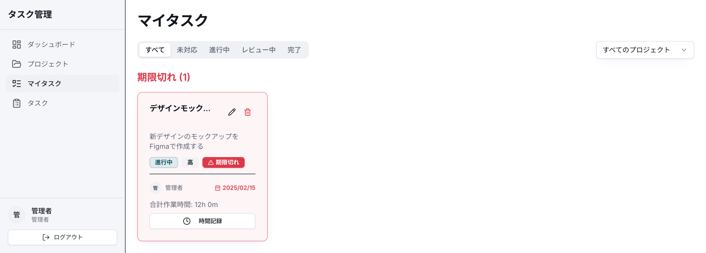
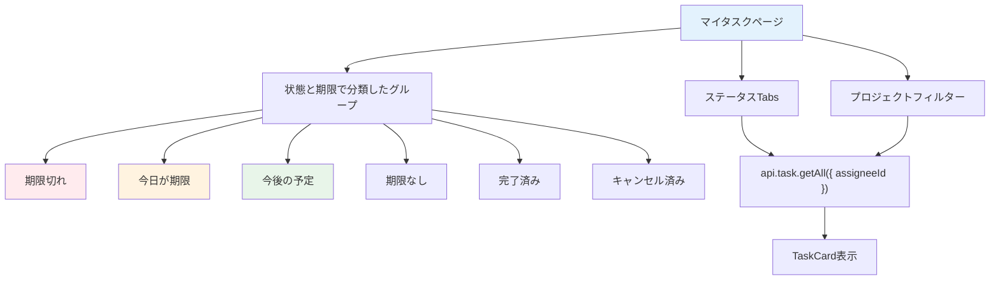
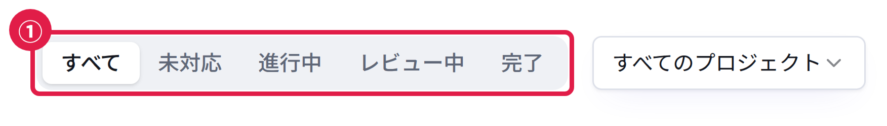
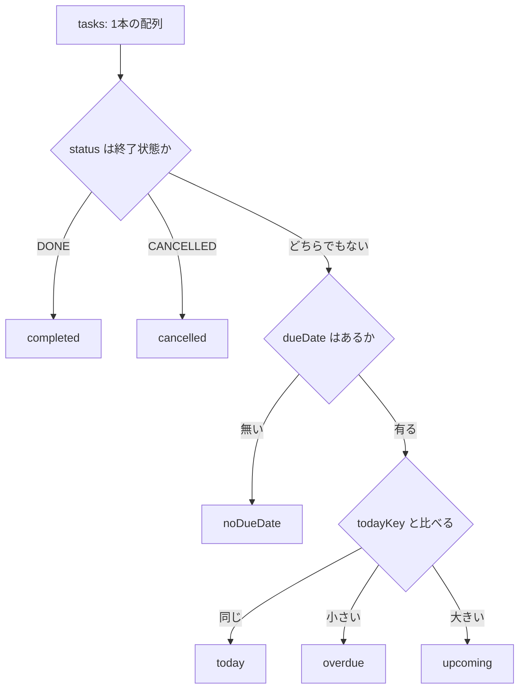
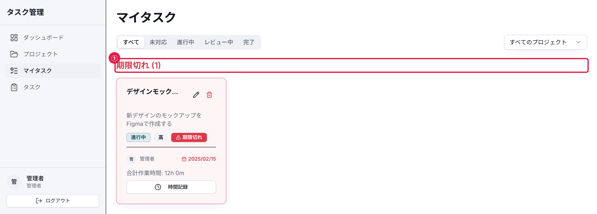
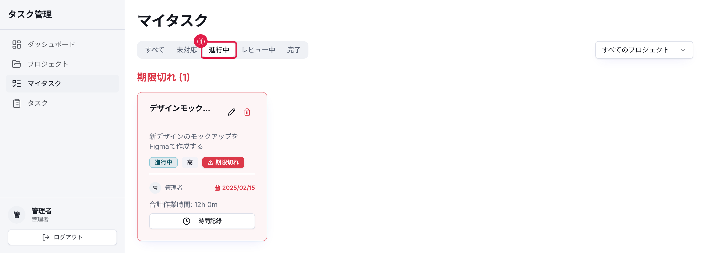

# Day 17: マイタスクページ（自分のタスク一覧）を作ろう

## 前回の振り返り

Day 16 ではタスクのステータス変更機能と、作業時間を手動で記録する機能を実装しました。編集ダイアログでステータスを切り替え、作業した時間を後から記録できるようになったので今日はログイン中のユーザー専用の「マイタスク」ページに取り組みます。

---

## 今日のゴール

ログイン中のユーザーに割り当てられたタスクだけを表示する「マイタスク」ページを実装します。期限別のグループ表示とステータスタブで、今やるべきことをすぐに把握できるようにします。

スクリーンショット: マイタスクページの完成画面を確認してください。



> **今日のゴールライン**: ログイン中の自分だけのタスクを取得し、期限グループとタブで今やることを整理できればOK。

## なぜこれを作るのか

複数のプロジェクトに参加していると自分が何をすべきか分からなくなります。

> **例え話**: マイタスクは「個人の受信トレイ」です。3つのプロジェクトに参加していて合計20個のタスクがある場合マイタスクページを開くだけで今日やるべき3つのタスクがすぐに分かります。

### マイタスクページの構成


```mermaid
flowchart TD
    A[マイタスクページ] --> B[ステータスTabs]
    A --> C[プロジェクトフィルター]
    A --> D[状態と期限で分類したグループ]
    D --> E[期限切れ]
    D --> F[今日が期限]
    D --> G[今後の予定]
    D --> H[期限なし]
    D --> K[完了済み]
    D --> L[キャンセル済み]

    B --> I["api.task.getAll({ assigneeId })"]
    C --> I
    I --> J[TaskCard表示]

    style A fill:#e3f2fd
    style E fill:#ffebee
    style F fill:#fff3e0
    style G fill:#e8f5e9
```

この図で見てほしいのはステータスTabs（B）とプロジェクトフィルター（C）がどちらも同じ `api.task.getAll`（I）へ矢印を向けている点です。絞り込みの条件が増えても呼び出す API は1本のままです。取得したタスクを期限別に振り分けるのは画面側の仕事です。サーバーへ渡す条件は「誰のタスクか」「どの状態か」「どのプロジェクトか」の3つです。だからマイタスク専用の API を新しく作らずに済みます。

### やること / やらないこと

| やること | やらないこと |
|---------|-------------|
| `getCurrentUser` で自分のIDを取得 | useSessionは使わない |
| `getAll({ assigneeId })` でフィルター | 専用のAPIエンドポイント |
| 期限別にグループ表示 | カレンダー表示 |
| ステータスTabsで絞り込み | 検索機能（Day 20） |
| 編集・削除をTaskDialogで | 新規作成 |

### 新しく学ぶ概念

| 概念 | 読み方 | 役割 | 例え |
|------|--------|------|------|
| Tabs | タブ | コンテンツの切り替えUI | ファイルのタブ仕切り |
| グループ表示 | — | データを条件で分類 | 手紙を「緊急・普通・後回し」に分ける |
| date-only helper | — | 日付だけの値を時刻と切り分けて扱う | 「4/17」という日付札だけを比べる |
| `useMemo` | ユーズ・メモ | 計算結果をキャッシュして再利用 | メモ帳に書いておいて変わった時だけ書き直す |

開発サーバーは前の Day から動かしたまま使います。止めてあるときは `npm run dev` で起動してから `http://localhost:3000` を開きます。

## 実装ステップ一覧

| ステップ | 作業内容 | 読む時間の目安 |
|---------|---------|---------|
| Step 1 | ページの最小構造とサイドバー導線を作る | 5分 |
| Step 2 | 自分のIDを取得してローディング処理 | 5分 |
| Step 3 | 自分のタスクを取得する | 5分 |
| Step 4 | ステータスTabsを作る | 5分 |
| Step 5 | プロジェクトフィルターを追加 | 5分 |
| Step 6 | TaskGroupSectionコンポーネントを作る | 7分 |
| Step 7 | 期限別グループに分類する | 7分 |
| Step 8 | グループごとにカード表示 | 5分 |
| Step 9 | 編集の送信対象を固定する | 45分 |
| Step 10 | 削除を同じ書込lockへ入れる | 10分 |
| Step 11 | 送信入口とダイアログを接続する | 12分 |
| Step 11.5 | 100件ずつページを移動できるようにする | 20分（仮） |
| Step 12 | テストを準備し、基本操作と競合時の回復を確認する | 20分（仮） |

**読む時間の合計（仮）**: 約151分です。

表と各 Step に記した時間は、説明とコードを読む時間の仮の目安です。実測した値ではありません。コードの入力、動作確認、ダウンロードや起動の待ち時間、調べものには別に時間を取ってください。

---

### Step 1 : ページの最小構造を作る（読む目安: 3分）

**ゴール**: マイタスクページの最小完成版を作ります。このファイルに以降のステップでコードを追加していきます。

**実装**:

```typescript
// filepath: src/app/my-task/page.tsx
'use client';

import { AppLayout } from '@/component/layout/app-layout';

// マイタスクページのコンポーネント
export default function MyTasksPage() {
  return (
    <AppLayout>
      <div className="flex flex-col gap-6">
        <h1 className="text-3xl font-bold tracking-tight">
          マイタスク
        </h1>
      </div>
    </AppLayout>
  );
}
```

> Day 08 で学んだ `AppLayout` でページをラップします。サイドバーと認証ガードが自動的に適用されます。この時点で使う import だけに絞っているので未使用の警告も出ません。

**確認ポイント**:
- ファイルを保存しました
- `/my-task` にアクセスして「マイタスク」と表示されます
- サイドバーが表示されています

`/my-task` のページが表示できたので、サイドバーにも入口を追加します。`src/component/layout/app-layout.tsx` の `lucide-react` の import を次の形にしてください。

```typescript
// filepath: src/component/layout/app-layout.tsx
import {
  ClipboardList,
  FolderOpen,
  LayoutDashboard,
  ListTodo,
  LogOut,
} from 'lucide-react';
```

`ListTodo` だけが今日の追加です。ほかの4つは既存のメニューとログアウトボタンが使っています。すべて同じ import に残すことで、アイコンを足したために前の項目が表示できなくなる事故を防ぎます。

続けて `menuItems` を次の4項目に置き換えます。「マイタスク」は関連する「タスク」の直前へ置きます。

```typescript
// filepath: src/component/layout/app-layout.tsx
const menuItems: MenuItem[] = [
  {
    text: 'ダッシュボード',
    icon: <LayoutDashboard className="h-5 w-5" />,
    path: '/dashboard',
  },
  {
    text: 'プロジェクト',
    icon: <FolderOpen className="h-5 w-5" />,
    path: '/project',
  },
  {
    text: 'マイタスク',
    icon: <ListTodo className="h-5 w-5" />,
    path: '/my-task',
  },
  {
    text: 'タスク',
    icon: <ClipboardList className="h-5 w-5" />,
    path: '/task',
  },
];
```

`ListTodo` はマイタスク項目のアイコンです。リンク先を `/my-task` にすると、今作った `src/app/my-task/page.tsx` が開きます。

**確認ポイント**:
- サイドバーに「マイタスク」が追加されました
- 「マイタスク」を押すと `/my-task` が開きます

---

### Step 2 : 自分のIDを取得してローディング処理（読む目安: 5分）

**ゴール**: ログイン中のユーザー情報を取得し、ローディング中はスピナーを表示します。

**実装**:

まずインポートを追加します。Step 1 のインポート部分を以下に**置き換えて**ください。

```typescript
// filepath: src/app/my-task/page.tsx
'use client';

import { useCallback, useMemo, useState } from 'react';
import { AppLayout } from '@/component/layout/app-layout';
import {
  PageLoadingSpinner,
} from '@/component/ui/loading-spinner';
import {
  hasPermission, isProjectMemberRole,
  type ProjectMemberRole,
} from '@/lib/constant/roles';
import { api } from '@/trpc/react';
```

ここで取り込む道具はこれから3つの役目に分かれます。`PageLoadingSpinner` は Day 09 でも使った読み込み中のスピナーで、ユーザー情報が届くまで画面を受け持ちます。`useCallback` は Step 5 で権限判定の関数を作るときに使います。残る `hasPermission` と `isProjectMemberRole` はStep 5 で「このプロジェクトでの自分の役割」を調べるための道具です。まだ出番のない名前も並びますがインポートを何度も書き足すより先にそろえておくと差分を追いやすくなります。

次に`MyTasksPage` の `return` の**前に**以下を追加します。

```typescript
// filepath: src/app/my-task/page.tsx
// MyTasksPage内の先頭に追加
// ログイン中のユーザー情報を取得
const { data: currentUser, isLoading: isCurrentUserLoading } =
  api.auth.getCurrentUser.useQuery();
```

`api.auth.getCurrentUser` はサーバーでログイン情報を確認し、現在の利用者を返す手続きです。このアプリでは取得後30秒間、キャッシュ（取得してブラウザに保持した結果）を再利用するため、表示のたびに必ず通信するわけではありません。ここで得た `currentUser.id` がこのあと「自分のタスクだけを取る」ための鍵になります。返り値に `currentUser` と `isCurrentUserLoading` という別名を付けているのはStep 3 でタスク側の読み込み状態も受け取るからです。同じ名前が2つ並ぶとどちらの読み込み状態なのか見分けられません。

ローディング中はスピナーを表示します。`return` の**前に**以下を追加してください。

```typescript
// filepath: src/app/my-task/page.tsx
// ローディング中はスピナーを表示
if (isCurrentUserLoading) {
  return (
    <AppLayout>
      <PageLoadingSpinner />
    </AppLayout>
  );
}
```

この分岐が無いと`currentUser` がまだ届いていない一瞬のあいだに本文が描かれます。そのときタスクの取得は Step 3 の `enabled` で止まっているため画面には「タスクが0件」のときとまったく同じ見た目が出ます。読者にはどちらか区別できず、自分のタスクが消えたと誤解させます。スピナーを `AppLayout` の中に置くのはヘッダーやサイドバーを出したまま中身だけを差し替えるためです。外に置くと読み込みのたびに画面全体が消え、位置がずれたように見えます。

**確認ポイント**:
- ファイルを保存し、「マイタスク」が表示されます
- 読み込みが発生した場合はスピナーが表示され、DevTools（F12 → Networkタブ）で `getCurrentUser` のResponseを確認できます
- 30秒以内の再表示では、新しい通信やスピナーが出ず、キャッシュされた利用者情報からすぐ「マイタスク」が表示される場合も成功

#### 認証情報の取得方法

| 方法 | API | 用途 |
|------|-----|------|
| セッション確認 | `api.auth.getSession` | ログイン状態チェック |
| 現在のユーザー | `api.auth.getCurrentUser` | ユーザー詳細情報 |
| プロジェクト内のメンバー取得 | `api.search.getMembersByProject` | `TaskDialog` の担当者選択用 |

> `api.auth.getCurrentUser` はログイン中のユーザーのIDや名前を返します。このIDを使って「自分のタスク」を絞り込みます。

---

### Step 3 : 自分のタスクを取得する（読む目安: 5分）

**ゴール**: `assigneeId` でフィルターして自分のタスクだけを取得します。

**実装**:

Step 2 で追加した `currentUser` の取得と early return の**あいだ**に以下を追加します。hooks を `return` より前に置くためです。

```typescript
// filepath: src/app/my-task/page.tsx
// 自分に割り当てられたタスクだけを取得
const { data: tasks, isLoading } =
  api.task.getAll.useQuery(
    { assigneeId: currentUser?.id },
    { enabled: !!currentUser },
  );
```

このページの主役は `assigneeId: currentUser?.id` という1行です。Day 13 のタスク一覧では、閲覧できるプロジェクト内で担当者を限定せず取得していました。今回は担当者を自分に固定します。新しい API を作らずに済むのは`getAll` がすでに担当者での絞り込みを受け付けるからです。第2引数の `enabled: !!currentUser` は`currentUser` が届くまでこの通信を止めておく指定です。これを外すと `assigneeId` が `undefined` のまま要求を送り、閲覧できるプロジェクト内で他の担当者のタスクも取得する可能性があります。サーバー側のプロジェクト閲覧制限は残ります。

この書き方には弱点もあります。`currentUser` の取得そのものが失敗したときも `undefined` のままなのでタスクの通信は止まり続けます。画面には「タスクが0件」と同じ見た目が出ます。Step 9でこちらの `error` も受け取り、読取失敗と0件を区別する案内を追加します。

この教材で使う `getAll` は1回に最大100件を返します。Step 11.5 で「前へ」「次へ」を追加するまでは、期限別グループや件数も最初に取得した100件の範囲です。

タスクキャッシュ操作用のユーティリティを追加します。tasks の取得の**下に**以下を追加します。

```typescript
// filepath: src/app/my-task/page.tsx
// tRPCキャッシュ操作用ユーティリティ
// ⚠️ hooks はすべて early return より前に置く
const utils = api.useUtils();
```

> **Reactの hooks ルール**: `useQuery` や `useUtils` などの hooks はコンポーネントのトップレベルに配置し、`if` 文や `return` の後に置いてはいけません。hooks の呼び出し順序が変わるとエラーになるためearly return（`if (isLoading) return ...`）は必ず全 hooks 定義の後に書きます。

ローディングの条件も更新します。Step 2 で追加した `if (isCurrentUserLoading)` を以下に**置き換えて**ください。

```typescript
// filepath: src/app/my-task/page.tsx
// 全 hooks 定義後にローディング判定（hooks の後に early return）
if (isCurrentUserLoading || isLoading) {
  return (
    <AppLayout>
      <PageLoadingSpinner />
    </AppLayout>
  );
}
```

**確認ポイント**:
- ブラウザのDevTools（F12 → Networkタブ）で `getAll` リクエストに `assigneeId` パラメータが含まれています
- 自分に割り当てられたタスクだけが返ります
- `npm run dev` でエラーが出ていません

> `enabled: !!currentUser` は「currentUserが取得できてからAPIを呼ぶ」という設定です。Day 12 で学んだパターンです。currentUser未取得のまま呼ぶと担当者で絞り込めず、閲覧できるプロジェクト内で他の担当者のタスクも取得する可能性があります。

#### getAll パラメータの活用

| パラメータ | 値 | 効果 |
|-----------|-----|------|
| `assigneeId` | 自分のID | 自分のタスクだけ取得 |
| `status` | `'TODO'` | TODOのみ取得 |
| `projectId` | プロジェクトID | 特定プロジェクトだけ |

---

### Step 4 : ステータスTabsを作る（読む目安: 5分）

**ゴール**: ステータスで絞り込むタブUIを追加します。

**実装**:

まずインポートを追加します。ファイル先頭のインポート部分に以下を**追加**してください。

```typescript
// filepath: src/app/my-task/page.tsx
// インポートに追加
import {
  Tabs, TabsList, TabsTrigger,
} from '@/component/ui/tabs';
import {
  isTaskStatus, TASK_STATUS,
  TASK_STATUS_LABELS, type TaskStatus,
} from '@/lib/constant/status';
```

次に`MyTasksPage` の**外側**（`export default function MyTasksPage()` の前、ファイルのトップレベル）に定数を定義します。

```typescript
// filepath: src/app/my-task/page.tsx
// コンポーネントの外側に定数を定義
const ACTIVE_STATUSES: TaskStatus[] = [
  TASK_STATUS.TODO,
  TASK_STATUS.IN_PROGRESS,
  TASK_STATUS.IN_REVIEW,
  TASK_STATUS.DONE,
];
```

この配列はタブに並べるステータスと、その並び順の両方を決めています。`'TODO'` という文字列を直接書かず、`TASK_STATUS.TODO` を使います。Day 13 から続けている書き方です。定数にしておくと綴りの間違いは TypeScript が先に止めてくれます。`CANCELLED` は個別タブに入れません。取り消し済みだけを選ぶ場面は少ないためです。ただし「すべて」は絞り込みを外すので、取り消し済みのタスクも一覧に残ります。

```typescript
// filepath: src/app/my-task/page.tsx
// ステータス定数からタブを動的に生成
const STATUS_TABS: {
  label: string;
  value: TaskStatus | 'all';
}[] = [
  { label: 'すべて', value: 'all' },
  ...ACTIVE_STATUSES.map((status) => ({
    label: TASK_STATUS_LABELS[status],
    value: status,
  })),
];
```

`STATUS_TABS` を手で4行書き並べず、`ACTIVE_STATUSES` から作っているところが肝心です。タブのラベルは `TASK_STATUS_LABELS` から引くので日本語の表記を変えたいときも、この画面には手を入れずに済みます。先頭の `{ label: 'すべて', value: 'all' }` だけ別に書いてあるのはこれがステータスではなく「絞り込みなし」を表す特別な値だからです。型を `TaskStatus | 'all'` と書いてあるのも、その特別扱いを型の上で示すためです。

`MyTasksPage` 内の `currentUser` 取得の**前に**stateを追加します。

```typescript
// filepath: src/app/my-task/page.tsx
// タブの選択状態を管理
const [activeTab, setActiveTab] =
  useState<TaskStatus | 'all'>('all');
```

選んでいるタブを `useState` で覚えます。初期値は `'all'` なのでページを開いた直後は全ステータスのタスクが並びます。この state は次のブロックで `useQuery` の引数につなぎます。だからタブを押すだけで絞り込み条件が変わり、その条件のqueryへ切り替わります。直近に取得した同じ条件の結果があれば再利用します。押されたタブの中身を自分で数える処理は要りません。

Step 3 の `useQuery` を以下に**置き換えて**ください。ステータスフィルターを追加します。

```typescript
// filepath: src/app/my-task/page.tsx
// ステータスフィルターを追加した版
const { data: tasks, isLoading } =
  api.task.getAll.useQuery(
    {
      assigneeId: currentUser?.id,
      status: activeTab === 'all'
        ? undefined : activeTab,
    },
    { enabled: !!currentUser },
  );
```

`status: activeTab === 'all' ? undefined : activeTab` は「すべて」タブのときだけ条件そのものを外す書き方です。ここで `'all'` をそのままサーバーへ送るとリクエストが失敗します。`task.getAll` の `status` は `TODO` や `DONE` といった決まった値しか受け取らないので`'all'` は入力チェックの段階で弾かれるからです。0件が返るのではなく、エラーになります。絞り込みを外したいときは値を空にするのではなく項目ごと `undefined` にする、と覚えてください。そして `useQuery` の引数に `activeTab` が入ったので、タブを押すと選んだ条件のqueryへ切り替わります。毎回通信するとは限りません。結果の再利用と必要な取得はqueryが管理するため、自分で取得処理を書き足す必要はありません。

JSXの `<h1>` タグの**下に**タブUIを追加します。

```typescript
{/* filepath: src/app/my-task/page.tsx */}
{/* フィルターエリアのコンテナ */}
<div className="flex flex-col sm:flex-row gap-4 items-center">
  <Tabs
    value={activeTab}
    onValueChange={(v) => {
      if (v === 'all' || isTaskStatus(v))
        setActiveTab(v);
    }}
    className="w-full sm:w-auto"
  >
    <TabsList aria-label="ステータスフィルター">
      {STATUS_TABS.map((tab) => (
        <TabsTrigger
          key={tab.label}
          value={tab.value}>
          {tab.label}
        </TabsTrigger>
      ))}
    </TabsList>
  </Tabs>
</div>
```

> `onValueChange` が渡してくる値は `string` なので`isTaskStatus(v)` 型ガードで `TaskStatus` 型かを判定してから `setActiveTab` に渡します。`as TaskStatus` のような型アサーションは使わず、実行時に値を検証します。`TabsList` の `aria-label` は、画面を読み上げる支援技術へ5つのボタンがステータスを選ぶまとまりだと伝えます。

**確認ポイント**:
- タブが横並びで表示されます
- 選んだタブが選択表示になります。通信が発生したときは、DevTools の Network タブで `getAll` の入力と Response を確認します。同じ条件の結果を再利用して通信しない場合もあります。カードの表示は Step 8 の後に確認します
- `npm run dev` でエラーが出ていません

スクリーンショット: 下の画像は Step 8 まで書き終えたマイタスクページの、タブとプロジェクト絞り込みの部分です。赤枠の中がこの Step で足したタブです。いまの自分の画面には右上のプロジェクト絞り込みも、下のカードもまだ出ていません。絞り込みは Step 5、期限別の見出しとカードは Step 7 と Step 8 で足します。



---

### Step 5 : プロジェクトフィルターを追加（読む目安: 5分）

**ゴール**: プロジェクトでも絞り込めるようにします。

**実装**:

インポートを追加します。

```typescript
// filepath: src/app/my-task/page.tsx
// インポートに追加
import {
  Select, SelectContent, SelectItem,
  SelectTrigger, SelectValue,
} from '@/component/ui/select';
```

`Select` は Day 13 のタスク一覧でも使った shadcn/ui のドロップダウンです。5つの名前を一度に取り込むのはこの部品が入れ物・引き金・中身・項目・表示文字と、役割ごとに分かれているためです。ブラウザ標準の `<select>` タグ1つで済ませない代わりに、開いたときの見た目や項目の並びを細かく作り込めます。

`MyTasksPage` 内にstateとクエリを追加します。

```typescript
// filepath: src/app/my-task/page.tsx
// プロジェクトフィルターの状態管理
const [filterProject, setFilterProject] =
  useState<string>('all');
// プロジェクト一覧を取得
const { data: projects } =
  api.project.getAll.useQuery();
```

TaskCardの編集・削除ボタンの表示可否はログインユーザーがそのタスクの属するプロジェクトで何のロールかによって決まります。プロジェクトごとのロールを引けるようにしておきます。

```typescript
// filepath: src/app/my-task/page.tsx
// プロジェクトごとのログインユーザー自身のロールを引けるようにする
const myRoleByProject = useMemo(() => {
  const map = new Map<string, ProjectMemberRole>();
  const userId = currentUser?.id;
  if (!userId || !projects) {
    return map;
  }
  for (const project of projects) {
    const me = project.members?.find(
      (member) => member.userId === userId,
    );
    if (me && isProjectMemberRole(me.role)) {
      map.set(project.id, me.role);
    }
  }
  return map;
}, [projects, currentUser?.id]);
```

ここで作っているのはプロジェクトIDを渡すと自分のロールが返ってくる対応表です。マイタスクは複数のプロジェクトのタスクが混ざりうる画面です。初期データでは1プロジェクト分しか並びませんがプロジェクトを増やすとこの対応表が効いてきます。カードを描くたびに `projects` の配列を端から探すとタスクの件数だけ探し直しが起きます。先に `Map` へ入れておけばあとは1件ずつ引くだけで済みます。`useMemo` で包んであるのはこの対応表を再描画のたびに作り直させないためです。第2引数の `[projects, currentUser?.id]` に挙げた2つが変わったときだけ、中の処理がもう一度走ります。`isProjectMemberRole(me.role)` を通してから `Map` へ入れているのはデータベースから来た文字列を `as` で型に押し込まず、実行時に確かめてから使うためです。

続けてそのロールから編集・削除の権限を判定する関数を追加します。

```typescript
// filepath: src/app/my-task/page.tsx
// ロールから編集・削除の権限を判定する
const canEditProject = useCallback(
  (projectId: string) => {
    const role = myRoleByProject.get(projectId);
    return role ? hasPermission(role, 'canEdit') : false;
  },
  [myRoleByProject],
);

const canDeleteProject = useCallback(
  (projectId: string) => {
    const role = myRoleByProject.get(projectId);
    return role ? hasPermission(role, 'canDelete') : false;
  },
  [myRoleByProject],
);

const editableProjects = useMemo(
  () => (projects ?? []).filter((project) => canEditProject(project.id)),
  [projects, canEditProject],
);
```

> Day 13 のタスク一覧ページと同じパターンです。`myRoleByProject` でプロジェクトIDからロールを引き、`canEditProject` / `canDeleteProject` でそのロールに編集・削除の権限があるかを判定します。閲覧者（VIEWER）ロールのプロジェクトでは両方 `false` になります。

`editableProjects` は編集できるプロジェクトだけを残した配列です。閲覧者のプロジェクトを先に除くため、選んだ後で権限エラーになる選択肢を表示しません。

**確認ポイント**:
- `myRoleByProject` / `canEditProject` / `canDeleteProject` が定義できました
- `npm run dev` でエラーが出ていません

Step 4 の `useQuery` を以下に**置き換えて**ください。プロジェクトフィルターを追加します。

```typescript
// filepath: src/app/my-task/page.tsx
// プロジェクトフィルターも追加した最終版
const { data: tasks, isLoading } =
  api.task.getAll.useQuery(
    {
      assigneeId: currentUser?.id,
      status: activeTab === 'all'
        ? undefined : activeTab,
      projectId: filterProject === 'all'
        ? undefined : filterProject,
    },
    { enabled: !!currentUser },
  );
```

`projectId` の行が増えても形は `status` のときとまったく同じです。「`'all'` なら `undefined`」という同じ判断を、条件ごとに1行ずつ並べています。絞り込みが3つ4つに増えてもこの形のまま足していけます。`useQuery` の第1引数に並んだ値のどれか1つでも変われば、その組み合わせのqueryへ切り替わります。直近の結果を再利用できない場合は取得します。だからタブとドロップダウンを同時に使った絞り込みも、追加の処理なしで動きます。

Step 4 で追加した `</Tabs>` の**下に**（`</div>` の前に）Select を追加します。

```typescript
{/* filepath: src/app/my-task/page.tsx */}
{/* プロジェクトフィルターのSelect UI */}
<div className="ml-auto w-full sm:w-[200px]">
  <Select
    value={filterProject}
    onValueChange={setFilterProject}>
    <SelectTrigger
      id="project-filter"
      aria-label="プロジェクトフィルター">
      <SelectValue
        placeholder="すべてのプロジェクト" />
    </SelectTrigger>
    <SelectContent>
      <SelectItem value="all">
        すべてのプロジェクト
      </SelectItem>
      {projects?.map((p) => (
        <SelectItem key={p.id} value={p.id}>
          {p.name}
        </SelectItem>
      ))}
    </SelectContent>
  </Select>
</div>
```

> Day 13 のタスク一覧と同じフィルターパターンです。Tabs（ステータス）と Select（プロジェクト）を組み合わせて複数条件で絞り込みます。`id` はこの部品をブラウザ上で一意に識別する値です。`aria-label` は、画面を読み上げる支援技術へこのドロップダウンの用途を伝えます。

**確認ポイント**:
- プロジェクト選択ドロップダウンがタブの右側に表示され、選ぶと表示名が切り替わります
- 通信が発生した場合は、DevTools の Network タブで `getAll` の入力に選んだ `projectId` が入り、Response がそのプロジェクトのタスクだけになることを確認します。新しい条件の結果がキャッシュに残っていて通信しない場合もあります。カードの絞り込みは Step 8 の後に確認します
- `npm run dev` でエラーが出ていません

---

### Step 6 : TaskGroupSectionコンポーネントを作る（読む目安: 7分）

**ゴール**: タスクをグループごとに表示する共通コンポーネントを作ります。このコンポーネントは同じファイル内に定義します。

**実装**:

まずインポートを追加します。

```typescript
// filepath: src/app/my-task/page.tsx
// インポートに追加
import { TaskCard } from '@/component/task/task-card';
import type { TaskPriority }
  from '@/lib/constant/priority';
import { cn } from '@/lib/utils';
```

`MyTasksPage` の**外側**（`STATUS_TABS` 定数の下、`export default function` の前）にProps型を定義します。

```typescript
// filepath: src/app/my-task/page.tsx
// グループセクションのProps型定義
interface TaskGroupSectionProps {
  title: string;
  titleClassName?: string;
  tasks: Array<{
    id: string;
    title: string;
    description: string | null;
    status: TaskStatus;
    priority: TaskPriority;
    dueDate: Date | null;
    assignee: {
      name: string | null;
      email: string;
      avatar: string | null;
    } | null;
    projectId: string;
    timeSpentMinutes: number;
  }>;
```

残りは親から受け取る関数と判定です。`onEdit` と `onDelete` はボタンを押したときの処理、
`onTimeLogSuccess` は、呼び出し元が別の検索結果なども更新したい場合に使える任意の合図です。
マイタスク画面では時間記録ダイアログ自身がタスク一覧と詳細を取り直すため、この合図は渡しません。
`canEditProject` と `canDeleteProject` はそのプロジェクトで編集や削除をしてよいかを返します。

```typescript
// filepath: src/app/my-task/page.tsx（同じファイルの続き）
  onEdit: (id: string) => void;
  onDelete: (id: string) => void;
  onTimeLogSuccess?: (() => void) | undefined;
  canEditProject: (projectId: string) => boolean;
  canDeleteProject: (projectId: string) => boolean;
}
```

> `tasks` の型は `api.task.getAll` が返す配列の要素に合わせています。`TaskCard` コンポーネントが受け取るpropsと一致させることで、型エラーなくデータを渡せます。

#### TaskGroupSectionProps の解説

| プロパティ | 型 | 役割 |
|-----------|-----|------|
| `title` | `string` | グループのタイトル（「期限切れ」等） |
| `titleClassName` | `string?` | タイトルの色クラス（赤・オレンジ等） |
| `tasks` | `Array<...>` | 表示するタスクの配列 |
| `onEdit` | `(id: string) => void` | 編集ボタン押下時のコールバック |
| `onDelete` | `(id: string) => void` | 削除ボタン押下時のコールバック |
| `onTimeLogSuccess` | `(() => void) \| undefined` | 呼び出し元が追加の再取得をするときの任意の合図 |
| `canEditProject` | `(projectId: string) => boolean` | プロジェクトIDから編集可否を判定する関数 |
| `canDeleteProject` | `(projectId: string) => boolean` | プロジェクトIDから削除可否を判定する関数 |

Props型の**下に**コンポーネント本体を追加します。

```typescript
// filepath: src/app/my-task/page.tsx
// タスクが0件なら何も表示しない
const TaskGroupSection = ({
  title, titleClassName,
  tasks, onEdit, onDelete,
  onTimeLogSuccess,
  canEditProject, canDeleteProject,
}: TaskGroupSectionProps) => {
  if (tasks.length === 0) return null;

  return (
    <div className="space-y-4">
      <h2 className={cn(
        'text-xl font-semibold flex items-center gap-2',
        titleClassName,
      )}>
        {title} ({tasks.length})
      </h2>
```

最初の `if (tasks.length === 0) return null;` がこのコンポーネントで一番効いている1行です。`null` を返すとそのグループは見出しごと画面から消えます。期限切れのタスクが1件もない人の画面に「期限切れ (0)」という見出しだけ残ると読む人はそこで一瞬とまどいます。この判断をコンポーネントの中に置いたので呼び出す側は6つのグループを順に並べるだけで済みます。見出しに `({tasks.length})` と件数を添えているのは開かなくても量が分かるようにするためです。

続けてタスクカードのグリッド表示部分です。上のコードブロックの `</h2>` の**直後に**追加してください。

```typescript
{/* filepath: src/app/my-task/page.tsx */}
{/* TaskGroupSection のグリッド表示部分 */}
      <div className="grid gap-6 sm:grid-cols-2
        lg:grid-cols-3 xl:grid-cols-4">
        {tasks.map((task) => (
          <TaskCard
            key={task.id}
            id={task.id}
            title={task.title}
            description={task.description}
            status={task.status}
            priority={task.priority}
            dueDate={task.dueDate}
            assignee={task.assignee}
            onEdit={onEdit}
            onDelete={onDelete}
            onTimeLogSuccess={onTimeLogSuccess}
            canEdit={canEditProject(task.projectId)}
            canDelete={canDeleteProject(task.projectId)}
            timeSpentMinutes={task.timeSpentMinutes}
          />
        ))}
```

`))}` で `map` を閉じ、`</div>` を2つ、`);` で `return` を閉じ、最後の `};` で `TaskGroupSection` そのものを閉じます。開いた順と逆に閉じるのはこの教材で何度も出てくる決まりです。

```typescript
      {/* filepath: src/app/my-task/page.tsx（同じファイルの続き） */}
      </div>
    </div>
  );
};
```

> `canEditProject` / `canDeleteProject` は `MyTasksPage` から渡された関数です。`TaskGroupSection` 自身はロールを判定せず、渡された関数をそのまま `task.projectId` に適用するだけにすることで、権限ロジックが1か所（`MyTasksPage`）にまとまります。渡し忘れると既定値の `false` が使われ、編集・削除ボタンは表示されません。編集できる利用者に表示するため、判定した値を毎回渡します。

> `cn()` は `clsx` + `tailwind-merge` のユーティリティです。条件付きでクラス名を結合できます。`titleClassName` に `"text-destructive"` を渡すとタイトルが赤色になります。

> `timeSpentMinutes` を渡しているのはカードに出る「合計作業時間」を実際の記録に合わせるためです。渡さないと `TaskCard` の既定値 0 が使われ、時間を記録済みのタスクでも `0m` と表示されます。「時間記録」ボタンで保存すると、時間記録ダイアログがタスク一覧と詳細を取り直すので数字はその場で変わります。親ページから同じ一覧をもう一度取り直す関数は渡しません。

**確認ポイント**:
- ファイルを保存しました
- `npm run dev` でエラーが出ていません
- まだ画面に変化はありません（次のStepで使います）

---

### ここまでのインポート一覧（中間確認）

ここまでのStep 1〜6 で追加したインポートをまとめます。ファイル先頭が以下の状態になっていることを確認してください。

| インポート元 | インポート内容 | 追加Step |
|-------------|---------------|---------|
| `react` | `useCallback`, `useMemo`, `useState` | Step 2 |
| `@/lib/constant/roles` | `hasPermission`, `isProjectMemberRole`, `ProjectMemberRole`（type） | Step 2 |
| `@/component/layout/app-layout` | `AppLayout` | Step 1 |
| `@/component/ui/loading-spinner` | `PageLoadingSpinner` | Step 2 |
| `@/trpc/react` | `api` | Step 2 |
| `@/component/ui/tabs` | `Tabs`, `TabsList`, `TabsTrigger` | Step 4 |
| `@/lib/constant/status` | `isTaskStatus`, `TASK_STATUS`, `TASK_STATUS_LABELS`, `TaskStatus` | Step 4 |
| `@/component/ui/select` | `Select`, `SelectContent`, `SelectItem`, `SelectTrigger`, `SelectValue` | Step 5 |
| `@/component/task/task-card` | `TaskCard` | Step 6 |
| `@/lib/constant/priority` | `TaskPriority`（type） | Step 6 |
| `@/lib/utils` | `cn` | Step 6 |

**確認ポイント**:
- 上記のインポートがすべて揃っています
- `npm run dev` でインポートエラーが出ていません

---

### Step 7 : 期限別グループに分類する（読む目安: 7分）

**ゴール**: タスクを期限で4つのグループに分類します。完成版のコードと同じ `dateOnlyFromValue()` / `localDateOnly()` を使い、日付だけを比較します。

**実装**:

インポートを追加します。

```typescript
// filepath: src/app/my-task/page.tsx
// インポートに追加（日付 helper）
import {
  dateOnlyFromValue,
  dateOnlyToUtcStartIso,
  localDateOnly,
} from '@/lib/date';
```

`MyTasksPage` 内の `useQuery` の**下に**以下を追加します。この日のまとめに載せる完成コードでは同じ `groupedTasks` がハンドラーより後ろに置かれています。`useMemo` はコンポーネントの本体にあれば順番を問わないのでどちらの位置でも動きは変わりません。並びが違っても写し間違いではありません。

`useMemo` で完了済み・キャンセル済みと、未完了のタスクの期限別4グループに分類します。比較に使う「今日」のキーも、この中で作ります。

```typescript
// filepath: src/app/my-task/page.tsx
// 終了したタスクを期限の比較から除くため、状態を先に判定する
const groupedTasks = useMemo(() => {
  const overdue: typeof tasks = [];
  const today: typeof tasks = [];
  const upcoming: typeof tasks = [];
  const noDueDate: typeof tasks = [];
  const completed: typeof tasks = [];
  const cancelled: typeof tasks = [];
  const todayKey = localDateOnly(new Date());

  for (const t of tasks ?? []) {
    if (t.status === TASK_STATUS.DONE) {
      completed.push(t);
      continue;
    }
    if (t.status === TASK_STATUS.CANCELLED) {
      cancelled.push(t);
      continue;
    }
```

完了済みとキャンセル済みは、期限を比べる前に別の配列へ入れます。`continue` で次のタスクへ進むため、終了したタスクが期限切れの配列にも入ることはありません。続けて、まだ終了していないタスクを期限で分けます。

```typescript
// filepath: src/app/my-task/page.tsx（同じファイルの続き）
    if (!t.dueDate) {
      noDueDate.push(t);
      continue;
    }

    const dueDateKey = dateOnlyFromValue(t.dueDate);

    if (dueDateKey === todayKey) {
      today.push(t);
    } else if (dueDateKey < todayKey) {
      overdue.push(t);
    } else {
      upcoming.push(t);
    }
  }
```

`localDateOnly(new Date())` はいまのブラウザの日付を `2026-04-17` のような文字列にそろえて返します。時刻を落として日付だけにするのがねらいです。`new Date()` のまま比べると同じ「今日」でも 9時00分 と 18時30分 は別物として扱われ、今日が期限のタスクは1件も一致しません。文字列にそろえてしまえば比較は普通の文字列の大小で足ります。`2026-04-16` は `2026-04-17` より小さい、という並びが日付の前後とそのまま一致するからです。

`todayKey` は振り分けを計算するときの日付です。依存配列は `[tasks]` なので日付が変わっただけでは再計算されません。日をまたいで開いたままにした場合はページを再読み込みしてください。

振り分けの順番には意味があります。先に完了済みとキャンセル済みを分けます。残ったタスクは `!t.dueDate` で期限なしを抜き、そのあとで期限ありのタスクを3つに分けます。こうすると以降の比較では `dueDate` が必ず存在するので値が無い場合を毎回確かめずに済みます。`continue` は「この1件はここまで次のタスクへ」という合図です。比較そのものは `dateOnlyFromValue()` で `YYYY-MM-DD` にそろえてから行うため時刻やタイムゾーンの違いに振り回されません。等しければ今日、小さければ期限切れ、それ以外が今後の予定になります。


```mermaid
flowchart TB
    T["tasks: 1本の配列"] --> S{"status は終了状態か"}
    S -->|"DONE"| C["completed"]
    S -->|"CANCELLED"| X["cancelled"]
    S -->|"どちらでもない"| Q1{"dueDate はあるか"}
    Q1 -->|"無い"| N["noDueDate"]
    Q1 -->|"有る"| Q2{"todayKey と比べる"}
    Q2 -->|"同じ"| TD["today"]
    Q2 -->|"小さい"| OV["overdue"]
    Q2 -->|"大きい"| UP["upcoming"]
```

1本の配列を6つのグループに分けます。上の分岐を先に置くのはここから下では `dueDate` が必ず存在すると決まるからです。順番を入れ替えると期限なしのタスクを日付として比べることになります。

```typescript
// filepath: src/app/my-task/page.tsx
// 同じ useMemo の続き
  return { overdue, today, upcoming, noDueDate, completed, cancelled };
}, [tasks]);
```

`return` を `useMemo` の中に置いたので6つの配列は `tasks` が変わったときだけ作り直されます。その条件を決めているのが最後の依存配列 `[tasks]` です。ここを `[]` にするとまだ何も届いていない空の状態で結果が固定され、タスクが届いても画面は空のままになります。逆に `useMemo` を外すと描き直しのたびに全件の振り分けをやり直します。ここで省けるのはその計算です。`React.memo` を使っていない今の構成では描き直しの回数そのものは変わりません。

**確認ポイント**:
- ファイルを保存しました
- `npm run dev` でエラーが出ていません
- `MyTasksPage` の中で、`groupedTasks` の `useMemo` を閉じた直後に `console.log(groupedTasks);` を一時的に追加します
- ページを再読み込みし、DevTools（F12キー → Consoleタブ）で6つの配列を確認します
- 確認が終わったらその `console.log` は必ず削除します

#### なぜ date-only helper を使うのか

| 方法 | 問題点 | 推奨度 |
|------|--------|--------|
| `dueDate === now` | 時刻まで完全一致が必要で、ほぼ一致しない | ❌ |
| `new Date(t.dueDate) < new Date()` | タイムゾーン境界で前日・翌日にずれやすい | △ |
| `dateOnlyFromValue()` / `localDateOnly()` | `YYYY-MM-DD` にそろえて安全に比較できる | ✅ |

> 完成版のコードでは`dueDate` を
> `new Date()` にして比較するのではなく、
> `dateOnlyFromValue()` と `localDateOnly()` で
> `YYYY-MM-DD` に正規化して比較します。
> こうするとタイムゾーン境界で前日・翌日に
> ずれる事故を防げます。

#### 4つのグループ

| グループ・表示 | 条件 |
|---------------|------|
| **期限切れ**<br>色: 赤<br>意味: 期限切れ。すぐ対応 | 期限 < 今日 |
| **今日が期限**<br>色: オレンジ<br>意味: 今日中にやること | `dateOnlyFromValue(期限) === localDateOnly(今日)` |
| **今後の予定**<br>色: 通常<br>意味: 今後の予定 | 期限 > 今日 |
| **期限なし**<br>色: 通常<br>意味: 期限未設定 | 期限なし |

---

### Step 8 : グループごとにカード表示（読む目安: 5分）

**ゴール**: Step 6 で作った `TaskGroupSection` を使い、各グループのタスクを表示します。

**実装**:

Step 9・10 でハンドラーを本実装しますが先にJSXを書くために仮の関数を用意します。

```typescript
// filepath: src/app/my-task/page.tsx
// 仮実装（Step 9 で handleEdit、Step 10 で handleDelete を本実装に置換する）
const handleEdit = (taskId: string) => {
  void taskId;
};
const handleDelete = (_taskId: string) => {};
```

> `const` は同一スコープで再宣言できません。Step 9・10 では上の2つの仮関数を**削除してから**本実装を書いてください。

**確認ポイント**: `npm run dev` でTypeScript エラーが出ていないことを確認します。

Step 4 で追加したフィルターエリアの `</div>` の**下に**、6つのグループを順番に追加します。

```typescript
{/* filepath: src/app/my-task/page.tsx */}
{/* 期限切れグループ（赤色タイトル） */}
<TaskGroupSection
  title="期限切れ"
  titleClassName="text-destructive"
  tasks={groupedTasks.overdue ?? []}
  onEdit={handleEdit}
  onDelete={handleDelete}
  canEditProject={canEditProject}
  canDeleteProject={canDeleteProject}
/>

{/* 今日が期限のグループ（オレンジ色タイトル） */}
<TaskGroupSection
  title="今日が期限"
  titleClassName="text-orange-500"
  tasks={groupedTasks.today ?? []}
  onEdit={handleEdit}
  onDelete={handleDelete}
  canEditProject={canEditProject}
  canDeleteProject={canDeleteProject}
/>
```

`titleClassName` に渡している色がこの2つの違いです。期限切れは `text-destructive` で赤、今日が期限は `text-orange-500` でオレンジにします。同じ `TaskGroupSection` を色違いで使い回せるのはStep 6 で見出しの色をコンポーネントの中に固定せず、外から受け取る形にしておいたからです。6つの配列は `[]` で初期化されるので実際には必ず配列です。末尾の `?? []` は値が無い場合にも空配列を渡す防御的な指定ですが、このコードでは無くても型検査を通ります。

```typescript
{/* filepath: src/app/my-task/page.tsx */}
{/* 今後の予定グループ */}
<TaskGroupSection
  title="今後の予定"
  tasks={groupedTasks.upcoming ?? []}
  onEdit={handleEdit}
  onDelete={handleDelete}
  canEditProject={canEditProject}
  canDeleteProject={canDeleteProject}
/>

{/* 期限なしグループ */}
<TaskGroupSection
  title="期限なし"
  tasks={groupedTasks.noDueDate ?? []}
  onEdit={handleEdit}
  onDelete={handleDelete}
  canEditProject={canEditProject}
  canDeleteProject={canDeleteProject}
/>
```

終了したタスクも消さずに表示します。完了済みとキャンセル済みを分けると、作業を終えたものと取り消したものを見分けられます。

```typescript
{/* filepath: src/app/my-task/page.tsx */}
<TaskGroupSection
  title="完了済み"
  tasks={groupedTasks.completed ?? []}
  onEdit={handleEdit}
  onDelete={handleDelete}
  canEditProject={canEditProject}
  canDeleteProject={canDeleteProject}
/>
<TaskGroupSection
  title="キャンセル済み"
  tasks={groupedTasks.cancelled ?? []}
  onEdit={handleEdit}
  onDelete={handleDelete}
  canEditProject={canEditProject}
  canDeleteProject={canDeleteProject}
/>
```

今後の予定と期限なしには `titleClassName` を渡していません。色を付けないのは、急ぎではないからです。すべてのグループを目立たせるとどれから手を付ければよいか分からなくなります。色で急かすのは赤とオレンジの2つだけにとどめます。未完了のタスクは「期限切れ・今日・今後・期限なし」の順で、その下に完了済みとキャンセル済みを表示します。画面を開いた人の目が最初に届く場所へ、いちばん急ぐタスクを置くためです。

タスクが0件の場合のメッセージも追加します。

```typescript
{/* filepath: src/app/my-task/page.tsx */}
{/* タスクが0件の場合のメッセージ表示 */}
{tasks && tasks.length === 0 && (
  <div className="flex flex-col
    items-center justify-center py-12
    text-center text-muted-foreground">
    <p>条件に合うタスクはありません</p>
  </div>
)}
```

> `TaskGroupSection` はタスク配列が空なら `null` を返すので空のグループは自動的に非表示になります。全グループが空の場合だけ「タスクはありません」メッセージが表示されます。

**確認ポイント**:
- 初期データのままなら「期限切れ」グループにカードが1枚だけ並びます
- 残り5グループは中身が無いので非表示になります

この「1枚」は初期データを触っていない場合の数です。Day 14 で自分を担当者にしたタスクを作っていれば増え、Day 15 で「デザインモックアップ作成」を消していれば0枚になります。枚数が違っても実装の誤りではありません。グループの見出しが期限に応じて出ることだけを確かめてください。
- タスクが0件の場合は「条件に合うタスクはありません」と表示されます

スクリーンショット: グループ別タスク表示（期限切れ・今日・今後・期限なし）



---

### Step 9 : 編集の送信対象を固定する（読む目安: 45分）

**ゴール**: 編集を送信したあとに入力を変えたり、ダイアログを閉じて別のタスクを開いたりしても、古い成功結果が現在のフォームを閉じないようにします。

Day 15 で作った `TaskDialog` を使います。ただし、一覧の再取得とダイアログを閉じる処理を `onSuccess` に直接並べるだけでは足りません。送信したタスク、フォームを開いた世代、送信後も入力が同じかを送信時点で控えます。

インポートを更新します。

```typescript
// filepath: src/app/my-task/page.tsx
'use client';

import { useRouter } from 'next/navigation';
import { useCallback, useEffect, useMemo, useRef, useState } from 'react';
import toast from 'react-hot-toast';
import { AppLayout } from '@/component/layout/app-layout';
import { TaskCard } from '@/component/task/task-card';
import { TaskDialog, type TaskFormData } from '@/component/task/task-dialog';
import { DeleteConfirmDialog } from '@/component/ui/delete-confirm-dialog';
import { PageLoadingSpinner } from '@/component/ui/loading-spinner';
import {
  Select,
  SelectContent,
  SelectItem,
  SelectTrigger,
  SelectValue,
} from '@/component/ui/select';
```

最初のブロックは画面部品までを読み込みます。続くブロックで、絞り込み、日付、読取エラー、書込エラーに使う定数とhelperをそろえます。

```typescript
// filepath: src/app/my-task/page.tsx（同じファイルの続き）
import { Tabs, TabsList, TabsTrigger } from '@/component/ui/tabs';
import type { TaskPriority } from '@/lib/constant/priority';
import { hasPermission, isProjectMemberRole, type ProjectMemberRole } from '@/lib/constant/roles';
import {
  isTaskStatus,
  TASK_STATUS,
  TASK_STATUS_LABELS,
  type TaskStatus,
} from '@/lib/constant/status';
import { dateOnlyFromValue, dateOnlyToUtcStartIso, localDateOnly } from '@/lib/date';
import { isAuthError, isForbiddenError, shouldRetryQuery } from '@/lib/query-error';
import { taskToFormData } from '@/lib/task-form';
import { classifyTaskWriteError, type TaskWriteOperation } from '@/lib/task-write-error';
import { cn } from '@/lib/utils';
import { api } from '@/trpc/react';
```


`TaskDialog` と `TaskFormData` は編集フォーム、`DeleteConfirmDialog` は削除確認、`taskToFormData` は一覧のタスクをフォーム値へ変えるために使います。`useRef` は送信中の値を再描画に左右されず保持します。`shouldRetryQuery` は読取だけに再試行を許し、書込は後で `retry: false` にします。書込を自動再試行すると、結果が届かなかっただけなのに同じ更新をもう一度送るおそれがあるためです。

`STATUS_TABS` の下へ送信内容の型を追加します。

```typescript
// filepath: src/app/my-task/page.tsx
// STATUS_TABS の下へ追加
type UpdateSubmission = {
  kind: 'update';
  targetId: string;
  title: string;
  generation: number;
  isCurrent: () => boolean;
};
type DeleteSubmission = {
  kind: 'delete';
  targetId: string;
};
type WriteSubmission =
  UpdateSubmission | DeleteSubmission;
```

更新では対象、表示名、フォーム世代、入力が現在も同じかを保持します。削除にはフォームが無いため対象IDだけで足ります。2種類を1つの ref に入れ、更新と削除が重ならないようにします。

`MyTasksPage` 冒頭の state 群を更新します。

```typescript
// filepath: src/app/my-task/page.tsx（同じファイルの続き）
  const router = useRouter();
  const [activeTab, setActiveTab] = useState<TaskStatus | 'all'>('all');
  const [filterProject, setFilterProject] = useState<string>('all');
  const [dialogOpen, setDialogOpen] = useState(false);
  const [editingTask, setEditingTask] = useState<TaskFormData | undefined>(undefined);
  const [deleteDialogOpen, setDeleteDialogOpen] = useState(false);
  const [deleteTargetId, setDeleteTargetId] = useState<string | null>(null);
  const [authExpired, setAuthExpired] = useState(false);
  const authExpiredRef = useRef(false);
  const formGeneration = useRef(0);
  const writeSubmission = useRef<WriteSubmission | null>(null);

```


`authExpiredRef` は401を受け取った瞬間から後続の callback（通信の開始・完了などに応じて呼ばれる処理）を止めます。state の更新を待っている間に別の成功処理が走る隙を作らないため、ref と画面用 state の両方を持ちます。

3つの読取 query は `error` と `refetch` を受け取り、認証切れ後は止めます。元の query 定義を置き換えてください。

```typescript
// filepath: src/app/my-task/page.tsx（同じファイルの続き）
  const {
    data: currentUser,
    isLoading: isCurrentUserLoading,
    isError: isCurrentUserError,
    error: currentUserQueryError,
    refetch: refetchCurrentUser,
  } = api.auth.getCurrentUser.useQuery(undefined, {
    enabled: !authExpired,
    retry: shouldRetryQuery,
  });
  const {
    data: projects,
    isLoading: isProjectsLoading,
    isError: isProjectsError,
    error: projectsQueryError,
    refetch: refetchProjects,
  } = api.project.getAll.useQuery(undefined, {
    enabled: !authExpired,
    retry: shouldRetryQuery,
  });
```

利用者とプロジェクトの読取失敗と再取得関数を別々に保持します。認証失効後は `enabled: !authExpired` で新しい読取要求を止めます。次のブロックでタスクqueryにも同じ条件を付けます。

```typescript
// filepath: src/app/my-task/page.tsx（同じファイルの続き）
  const {
    data: tasks,
    isLoading,
    isError: isTasksError,
    error: tasksQueryError,
    refetch: refetchTasks,
  } = api.task.getAll.useQuery(
    {
      assigneeId: currentUser?.id,
      status: activeTab === 'all' ? undefined : activeTab,
      projectId: filterProject === 'all' ? undefined : filterProject,
    },
    { enabled: !!currentUser && !authExpired, retry: shouldRetryQuery },
  );
```


タスクの取得はログイン利用者が取れた後だけ始めます。`retry` は読取に限定し、失敗時に使う `refetchTasks` も受け取ります。

Step 3 で追加した古いローディング用の `if (isCurrentUserLoading || isLoading)` は削除します。3つのqueryを呼び終えた場所へ、読取結果の判定を追加してください。

```typescript
// filepath: src/app/my-task/page.tsx（同じファイルの続き）
  const queryErrors = [
    isCurrentUserError ? currentUserQueryError : null,
    isTasksError ? tasksQueryError : null,
    isProjectsError ? projectsQueryError : null,
  ];
  const hasFetchError = isCurrentUserError || isTasksError || isProjectsError;
  // React Query は再取得に失敗しても前回のデータを保持する。
  // 失敗したクエリ自身に前回値が残っている時だけバナーに留め、
  // 一度も取れていないクエリがある場合は全面エラーにする。
  const hasData =
    (!isCurrentUserError || currentUser != null) &&
    (!isTasksError || tasks != null) &&
    (!isProjectsError || projects != null);
  const queryAuthFailed = queryErrors.some(isAuthError);
  useEffect(() => {
    if (queryAuthFailed) {
      authExpiredRef.current = true;
      setAuthExpired(true);
    }
  }, [queryAuthFailed]);
  const authFailed = authExpired || queryAuthFailed;
  const forbidden = queryErrors.some(isForbiddenError);
```


queryから401が返った時もrefを先に立てます。`hasData` は再取得失敗で前回値が残っている場合だけ、一覧を残した警告へ進むための判定です。

Step 8 の `return (` から `<div className="flex flex-col gap-6">` の直前までを、次の2ブロックへ置き換えます。

```typescript
{/* filepath: src/app/my-task/page.tsx（同じファイルの続き） */}
  return (
    <AppLayout>
      {(isCurrentUserLoading || isProjectsLoading || isLoading) && !authFailed && !forbidden ? (
        <PageLoadingSpinner />
      ) : authFailed || forbidden || (hasFetchError && !hasData) ? (
        <div className="flex flex-col items-center justify-center py-24 text-center">
          <p className="text-base font-semibold text-foreground mb-2">
            {authFailed
              ? 'ログインの有効期限が切れました'
              : forbidden
                ? 'このデータを見る権限がありません'
                : 'タスクを取得できませんでした'}
          </p>
          <p className="text-sm text-muted-foreground mb-6">
            {authFailed
              ? 'もう一度ログインしてください。'
              : forbidden
                ? '権限が必要です。管理者に確認してください。'
                : '通信状況を確認して、再読み込みしてください。'}
          </p>
          <button
            type="button"
            className="rounded-lg border border-border/50 bg-card px-4 py-2 text-sm font-medium hover:bg-muted/50 transition-colors"
```


読取中はスピナー、401はログイン案内、403は権限案内、初回通信失敗は再読込案内に分けます。前回データが無い失敗だけを全画面表示にします。

```typescript
{/* filepath: src/app/my-task/page.tsx（同じファイルの続き） */}
            onClick={() => {
              if (authFailed) {
                router.push('/login');
                return;
              }
              if (forbidden) {
                router.push('/project');
                return;
              }
              void refetchCurrentUser();
              void refetchTasks();
              void refetchProjects();
            }}
          >
            {authFailed ? 'ログイン画面へ' : forbidden ? 'プロジェクト一覧へ' : '再読み込み'}
          </button>
        </div>
      ) : (
```


ボタンは失敗の種類に応じて移動先を変えます。通信失敗のときだけ3つのqueryを取り直し、権限不足で同じ通信を繰り返しません。

Step 8 の `<div className="flex flex-col gap-6">` の直後、`<h1>` の前へ警告を追加します。

```typescript
{/* filepath: src/app/my-task/page.tsx（同じファイルの続き） */}
          {hasFetchError ? (
            <div className="flex items-center justify-between gap-4 rounded-lg border border-amber-300/60 bg-amber-50 px-4 py-3 text-sm text-amber-900 dark:border-amber-500/40 dark:bg-amber-950/40 dark:text-amber-200">
              <span>
                {authFailed
                  ? 'ログインの有効期限が切れました。表示は前回取得時の内容です。'
                  : '最新の情報を取得できませんでした。' + '表示は前回取得時の内容です。'}
              </span>
              <button
                type="button"
                className="shrink-0 rounded-md border border-amber-400/60 px-3 py-1 text-xs font-medium hover:bg-amber-100 dark:hover:bg-amber-900/40"
                onClick={() => {
                  if (authFailed) {
                    router.push('/login');
                    return;
                  }
                  void refetchCurrentUser();
                  void refetchTasks();
                  void refetchProjects();
                }}
              >
                {authFailed ? 'ログイン画面へ' : '再試行'}
              </button>
            </div>
          ) : null}
```


再取得だけ失敗した場合は前回のカードを残し、古い表示だと明記します。この警告はデータを消さずに再試行する入口です。

Step 8 から残っている成功表示の `</div>` と `</AppLayout>` の間へ、次の1行を追加します。

```typescript
{/* filepath: src/app/my-task/page.tsx（同じファイルの続き） */}
      )}
```

この行は、Step 9 の先頭で開いた読取結果の条件分岐を閉じます。ここで閉じるため、Step 9 を保存した時点でもTypeScriptが通り、Step 10の削除処理も動かして確認できます。Step 11では同じ行をもう一度追加しません。

`utils` を定義した場所の下へ、認証失効と再取得を追加します。

```typescript
// filepath: src/app/my-task/page.tsx
const markAuthExpired = () => {
  authExpiredRef.current = true;
  setAuthExpired(true);
};

const refreshAfterWrite = async (
  targetId: string,
  refreshPermissions: boolean,
) => {
  const filters = {
    refetchType: authExpiredRef.current
      ? ('none' as const) : ('active' as const),
  };
  try {
    const updates = [
      utils.task.getAll.invalidate(
        undefined, filters, { throwOnError: true }),
```

先にrefへ認証失効を記録します。再取得は送信したタスクIDへ結び付け、401後は新しい通信を出さない `refetchType` を選びます。

```typescript
// filepath: src/app/my-task/page.tsx（同じファイルの続き）
      utils.task.getById.invalidate(
        { id: targetId }, filters,
        { throwOnError: true }),
    ];
    if (refreshPermissions) {
      updates.push(utils.project.getAll.invalidate(
        undefined, filters, { throwOnError: true }));
    }
    await Promise.all(updates);
  } catch (error) {
    if (isAuthError(error)) {
      markAuthExpired();
      return;
    }
    console.error(
      `タスク ${targetId} の表示更新に失敗しました。`,
      error,
    );
    toast.error(
      '最新の表示を取得できませんでした。再表示して操作結果を確認してください。',
    );
  }
};
```

書込成功と表示更新失敗を混ぜません。保存済みなのに再取得だけ失敗した場合は、もう一度保存させず、再表示して結果を確かめるよう案内します。

```typescript
// filepath: src/app/my-task/page.tsx
const handleWriteError = async (
  error: unknown,
  operation: TaskWriteOperation,
  targetId: string,
) => {
  const failure = classifyTaskWriteError(
    error, operation);
  if (failure.kind === 'auth') {
    markAuthExpired();
    return;
  }
  toast.error(failure.message);
  await refreshAfterWrite(targetId, true);
};

const mutationLifecycle = {
  retry: false as const,
  onMutate: () => writeSubmission.current,
```

エラー分類は409、403、通信不明を利用者向けの行動へ変えます。失敗時は権限も取り直します。`onMutate` は送信開始時の ref を callback の context（その送信にひも付けた控え）として固定します。

```typescript
// filepath: src/app/my-task/page.tsx（同じファイルの続き）
  onSettled: (
    _data: unknown,
    _error: unknown,
    _variables: unknown,
    submitted: WriteSubmission | null | undefined,
  ) => {
    if (writeSubmission.current === submitted) {
      writeSubmission.current = null;
    }
  },
};
```

終了時は自分が取得した送信だけを解放します。古い callback が後から終わっても、新しい送信の lock（別の書込を始めないための印）を `null` にしません。

```typescript
// filepath: src/app/my-task/page.tsx
const finishSubmittedUpdate = (
  submitted: WriteSubmission | null | undefined,
  target: { id: string; title: string | undefined },
) => {
  const ownsSubmittedLifetime =
    !authExpiredRef.current &&
    submitted?.kind === 'update' &&
    submitted.targetId === target.id &&
    submitted.generation === formGeneration.current;
  const canClose =
    ownsSubmittedLifetime && submitted.isCurrent();
  if (canClose) closeTaskDialog();
  if (authExpiredRef.current) return;
```

対象ID、フォーム世代、現在入力の3つが送信時と一致した成功だけがフォームを閉じます。別のタスクを開いた場合や、送信後に入力した場合は現在のフォームを残します。

```typescript
// filepath: src/app/my-task/page.tsx（同じファイルの続き）
  const submittedTitle =
    submitted?.kind === 'update' &&
    submitted.targetId === target.id
      ? submitted.title : target.title;
  const name = submittedTitle
    ? `「${submittedTitle}」`
    : '先ほど送信したタスク';
  toast.success(`${name}を更新しました。`);
  if (canClose || !dialogOpen) return;

  if (editingTask?.id === target.id) {
    toast(
      ('送信後に入力した変更は保存されていません。' +
        '入力内容を別の場所にコピーしてから、' +
        'タスク編集画面を閉じて開き直し、もう一度保存してください。'),
    );
  }
};
```

成功通知は保存した送信のタイトルを使います。同じフォームに新しい下書きが残る場合は、古い `expectedUpdatedAt` で続けて送らず、開き直す必要も伝えます。

```typescript
// filepath: src/app/my-task/page.tsx
const updateMutation = api.task.update.useMutation({
  ...mutationLifecycle,
  onSuccess: async (_data, variables, submitted) => {
    finishSubmittedUpdate(submitted, {
      id: variables.id,
      title: variables.title,
    });
    await refreshAfterWrite(variables.id, false);
  },
  onError: (error, variables) =>
    handleWriteError(error, 'update', variables.id),
});
```

保存成功の通知とダイアログ処理を先に行い、その後で送信対象を再取得します。再取得が失敗しても保存成功は消えません。

`handleEdit` はフォームを開くたび世代を進めます。

```typescript
// filepath: src/app/my-task/page.tsx
const closeTaskDialog = () => {
  formGeneration.current += 1;
  setDialogOpen(false);
  setEditingTask(undefined);
};

const handleEdit = (taskId: string) => {
  const task = tasks?.find((t) => t.id === taskId);
  if (task) {
    formGeneration.current += 1;
    setEditingTask(taskToFormData(task));
    setDialogOpen(true);
  }
};
```

閉じる時と別の編集を始める時に世代を変えます。これで閉じる前のcallbackは、再び開いたフォームを自分の送信先だと扱えません。

**確認ポイント**:
- queryの再試行とmutationの再試行を分けました
- 送信対象、フォーム世代、現在入力を送信時に固定する準備ができました
- 保存成功と表示更新失敗を別々に案内しました

---

### Step 10 : 削除を同じ書込lockへ入れる（読む目安: 10分）

**ゴール**: 更新中に削除を始めず、削除中に別の更新を始めないようにします。

削除mutationとpending判定を追加します。

```typescript
// filepath: src/app/my-task/page.tsx
const deleteMutation = api.task.delete.useMutation({
  ...mutationLifecycle,
  onSuccess: async (_data, variables, submitted) => {
    if (
      submitted?.kind === 'delete' &&
      submitted.targetId === variables.id
    ) {
      setDeleteDialogOpen(false);
      setDeleteTargetId(null);
    }
    await refreshAfterWrite(variables.id, false);
  },
  onError: (error, variables) =>
    handleWriteError(error, 'delete', variables.id),
});
const writePending =
  updateMutation.isPending || deleteMutation.isPending;
```

削除成功は送信時の対象と一致する場合だけ確認画面を閉じます。通信が終わっただけでは成功と見なさず、`onSuccess` だけで閉じます。

Step 8 の仮 `handleDelete` を置き換えます。

```typescript
// filepath: src/app/my-task/page.tsx
const handleDelete = (taskId: string) => {
  if (
    writeSubmission.current ||
    writePending ||
    authExpiredRef.current
  ) return;
  setDeleteTargetId(taskId);
  setDeleteDialogOpen(true);
};
```

書込中や認証失効後は新しい削除確認を開きません。対象IDは確認を押すまでstateに保持し、別のカードを押して送信対象が入れ替わるのを防ぎます。

**確認ポイント**:
- 更新と削除が1つの `writeSubmission` を共有しました
- 削除失敗では確認画面と対象が残ります
- 削除成功と一覧の再取得失敗を区別しました

---

### Step 11 : 送信入口とダイアログを接続する（読む目安: 12分）

**ゴール**: Enterキーと保存ボタンを同じ入口へ通し、送信後の新しい入力を古い成功から守ります。

`handleSubmit` を追加します。第2引数の `isCurrent` は `TaskDialog` が送信時の入力版を確かめるために渡します。

```typescript
// filepath: src/app/my-task/page.tsx
const handleSubmit = (
  data: TaskFormData,
  isCurrent: () => boolean = () => true,
) => {
  if (
    !data.id ||
    !dialogOpen ||
    writeSubmission.current ||
    writePending ||
    authExpiredRef.current ||
    !isCurrent()
  ) return;
  writeSubmission.current = {
    kind: 'update',
    targetId: data.id,
    title: data.title,
    generation: formGeneration.current,
    isCurrent,
  };
```

検証を待つ間にダイアログを閉じたり入力を変えたりすると、`isCurrent()` は `false` になります。その場合は送信前に止め、古い入力を保存しません。

同期的にrefへ書いてからmutationを呼びます。ボタンとEnterが同じ瞬間に走っても、2つ目は `writeSubmission.current` で止まります。

```typescript
// filepath: src/app/my-task/page.tsx（同じファイルの続き）
  updateMutation.mutate({
    id: data.id,
    title: data.title,
    description: data.description || null,
    status: data.status,
    priority: data.priority,
    dueDate: data.dueDate
      ? dateOnlyToUtcStartIso(data.dueDate) : null,
    estimatedHours: data.estimatedHours ?? null,
    projectId: data.projectId,
    assigneeId: data.assigneeId || null,
    ...(data.expectedUpdatedAt !== undefined && {
      expectedUpdatedAt: data.expectedUpdatedAt,
    }),
  });
};
```

`expectedUpdatedAt` はフォームを開いた時点の更新日時です。送信後に入力が残った場合、この値を勝手に新しい時刻へ変えず、閉じて開き直す案内で回復します。

タスク一覧の下へ `TaskDialog` を置きます。

```typescript
{/* filepath: src/app/my-task/page.tsx */}
<TaskDialog
  open={dialogOpen}
  onClose={closeTaskDialog}
  onSubmit={handleSubmit}
  initialData={editingTask}
  projects={editableProjects}
  isPending={writePending}
/>
```

`onClose` も世代を進める関数へ通します。`isPending` は現在の書込中表示に使いますが、二重送信を止める本体は同期refです。

Step 9 で追加した `)}` の直後、`AppLayout` の閉じタグの前へ削除確認を置きます。条件分岐はすでに閉じているため、ここでは `)}` を追加しません。

```typescript
{/* filepath: src/app/my-task/page.tsx（同じファイルの続き） */}
      <DeleteConfirmDialog
        open={deleteDialogOpen}
        onOpenChange={(open) => {
          setDeleteDialogOpen(open);
          if (
            !open &&
            !deleteMutation.isPending
          )
            setDeleteTargetId(null);
        }}
        onConfirm={() => {
          if (
            !deleteTargetId ||
            writeSubmission.current ||
            writePending ||
            authExpiredRef.current
          )
            return;
          writeSubmission.current = {
            kind: 'delete',
            targetId: deleteTargetId
          };
```


pending中に利用者が確認画面を閉じても、対象IDはcallbackが使う送信contextに残ります。閉じた画面を古い成功が再び操作しないよう、送信時の対象を照合します。

```typescript
{/* filepath: src/app/my-task/page.tsx（同じファイルの続き） */}
          deleteMutation.mutate({ id: deleteTargetId });
        }}
        isPending={deleteMutation.isPending}
        closeOnConfirm={false}
      />
```


Confirmを押した瞬間には閉じません。開いたままなら成功callbackが閉じ、失敗なら対象とエラー表示を残します。pending中のキャンセルもできます。

**確認ポイント**:
- 保存ボタンとEnterが同じ `handleSubmit` を通ります
- 送信後に入力を変えても古い成功が現在のフォームを閉じません
- 削除失敗では確認画面が残り、成功時だけ閉じます
- 更新成功と再取得失敗を別々に確認できます

---
### Step 11.5 : 100件ずつページを移動できるようにする（読む目安: 20分・仮）

**ゴール**: 101件目以降の担当タスクへ移動でき、ページや絞り込みを変えた後に古い編集結果が現在の画面を閉じないようにします。

`getAll` は1回に最大100件を返します。`limit` は1回に取る件数、`offset` は先頭から飛ばす件数です。1ページ目は `offset: 0`、2ページ目は `offset: 100` になります。

ページ番号だけを増やすと、ステータスやプロジェクトを変えた後も2ページ目のまま取得してしまいます。そこで、現在の2つの絞り込みを `pageContext` という文字列にまとめます。絞り込みが変わったときは1ページ目として扱います。

`ACTIVE_STATUSES` の下へ、1ページの件数を追加します。

```typescript
// filepath: src/app/my-task/page.tsx
const PAGE_SIZE = 100;
```

`UpdateSubmission` と `DeleteSubmission` に、送信を始めたページ番号を持たせます。

```typescript
// filepath: src/app/my-task/page.tsx
type UpdateSubmission = {
  kind: 'update';
  targetId: string;
  title: string;
  generation: number;
  pageIndex: number;
  isCurrent: () => boolean;
};
type DeleteSubmission = { kind: 'delete'; targetId: string; pageIndex: number };
```

通信を待つ間に別のページへ移った場合、古い成功処理は新しいページのダイアログを閉じてはいけません。送信時の `pageIndex` を控えておけば、成功時に現在のページと照合できます。

`activeTab` と `filterProject` の state の下へ、ページ用の state を追加します。

```typescript
// filepath: src/app/my-task/page.tsx
const pageContext = `${activeTab}\u0000${filterProject}`;
const [pagination, setPagination] = useState({
  context: pageContext,
  index: 0,
});
const pageIndex =
  pagination.context === pageContext ? pagination.index : 0;
```

区切りの `\u0000` は、2つの値が偶然つながって同じ文字列になるのを防ぎます。`pagination.context` が現在の絞り込みと違う描画では、state の更新を待たずに `pageIndex` を0として扱います。

タスクqueryを次の形へ置き換えます。

```typescript
// filepath: src/app/my-task/page.tsx
const {
  data: tasks,
  isLoading,
  isFetching,
  isError: isTasksError,
  error: tasksQueryError,
  refetch: refetchTasks,
} = api.task.getAll.useQuery(
  {
    assigneeId: currentUser?.id,
    status: activeTab === 'all' ? undefined : activeTab,
    projectId: filterProject === 'all' ? undefined : filterProject,
    limit: PAGE_SIZE,
    offset: pageIndex * PAGE_SIZE,
  },
  { enabled: !!currentUser && !authExpired, retry: shouldRetryQuery },
);
```

`isLoading` は最初の読取を表します。`isFetching` はページ移動で次の100件を読んでいる間も `true` になります。通信中に連打して要求順が入れ替わらないよう、後でページ移動ボタンを無効にします。

`finishSubmittedUpdate` の `ownsSubmittedLifetime` へ、ページ番号の照合を1行追加します。

```typescript
// filepath: src/app/my-task/page.tsx
const ownsSubmittedLifetime =
  !authExpiredRef.current &&
  submitted?.kind === 'update' &&
  submitted.targetId === target.id &&
  submitted.generation === formGeneration.current &&
  submitted.pageIndex === pageIndex;
```

`handleSubmit` で `writeSubmission.current` を作る箇所にも `pageIndex` を追加します。

```typescript
// filepath: src/app/my-task/page.tsx
writeSubmission.current = {
  kind: 'update',
  targetId: data.id,
  title: data.title,
  generation: formGeneration.current,
  pageIndex,
  isCurrent,
};
```

送信contextにページ番号を保存しました。続いて、`handleSubmit` の下へページを離れる処理を追加し、表示から消えたタスクのダイアログを残さないようにします。

```typescript
// filepath: src/app/my-task/page.tsx
const leavePageContext = () => {
  formGeneration.current += 1;
  setDialogOpen(false);
  setEditingTask(undefined);
  setDeleteDialogOpen(false);
  setDeleteTargetId(null);
};

const moveToPage = (nextPage: number) => {
  if (isFetching || nextPage < 0 || nextPage === pageIndex) return;
  leavePageContext();
  setPagination({ context: pageContext, index: nextPage });
};

const resetPageForFilter = () => {
  leavePageContext();
  setPagination({ context: '', index: 0 });
};
```

ページを変えると、表示中のカードも入れ替わります。編集と削除の対象を残すと、画面にないタスクへ操作を続けることになります。`leavePageContext` はフォーム世代を進め、2つのダイアログと対象IDを閉じます。

ステータスタブの `onValueChange` を置き換えます。

```typescript
// filepath: src/app/my-task/page.tsx
onValueChange={(value) => {
  if (
    (value === 'all' || isTaskStatus(value)) &&
    value !== activeTab
  ) {
    resetPageForFilter();
    setActiveTab(value);
  }
}}
```

ステータスが変わると1ページ目へ戻り、開いていたダイアログも閉じます。プロジェクトの `Select` も、値が変わるときだけ同じ処理を通します。

```typescript
{/* filepath: src/app/my-task/page.tsx */}
<Select
  value={filterProject}
  onValueChange={(value) => {
    if (value === filterProject) return;
    resetPageForFilter();
    setFilterProject(value);
  }}
>
```

同じ値を選び直しただけなら、現在のページや入力中のフォームを閉じません。値が変わる場合は、古い絞り込みの2ページ目を新しい絞り込みへ持ち越さず、1ページ目から取得します。

既存の0件表示を、次の2つへ置き換えます。

```typescript
{/* filepath: src/app/my-task/page.tsx */}
{tasks && tasks.length === 0 && pageIndex > 0 && (
  <div className="flex flex-col items-center justify-center py-12 text-center text-muted-foreground">
    <p>このページにはタスクがありません。</p>
    <p>前のページへ戻ってください。</p>
  </div>
)}

{tasks && tasks.length === 0 && pageIndex === 0 && (
  <div className="flex flex-col items-center justify-center py-12 text-center text-muted-foreground">
    <p>条件に合うタスクはありません</p>
  </div>
)}
```

1ページ目の0件と、2ページ目以降の0件は意味が違います。ちょうど100件ある場合は「次へ」を押した先が空になるため、タスクが1件もないとは案内せず、前へ戻るよう伝えます。

0件表示の下へ、ページ移動を追加します。

```typescript
{/* filepath: src/app/my-task/page.tsx */}
{(pageIndex > 0 || (tasks?.length ?? 0) === PAGE_SIZE) && (
  <nav
    className="flex items-center justify-center gap-3"
    aria-label="マイタスクのページ移動"
  >
    <button
      type="button"
      className="rounded-md border border-border px-3 py-2 text-sm disabled:cursor-not-allowed disabled:opacity-50"
      disabled={isFetching || pageIndex === 0}
      onClick={() => moveToPage(pageIndex - 1)}
    >
      前へ
    </button>
    <span className="text-sm text-muted-foreground">
      {pageIndex + 1}ページ目
    </span>
```

「前へ」は1ページ目では押せず、どちらのボタンも取得中は押せません。次の断片で「次へ」と `nav` の閉じタグを追加します。

```typescript
{/* filepath: src/app/my-task/page.tsx（同じファイルの続き） */}
    <button
      type="button"
      className="rounded-md border border-border px-3 py-2 text-sm disabled:cursor-not-allowed disabled:opacity-50"
      disabled={isFetching || (tasks?.length ?? 0) < PAGE_SIZE}
      onClick={() => moveToPage(pageIndex + 1)}
    >
      次へ
    </button>
  </nav>
)}
```

100件返ったときだけ、続きがある可能性を示す「次へ」を出します。総件数を別に取得していないため、ちょうど100件でもボタンは出ます。その先が空なら、先ほど追加した案内と「前へ」で戻れます。

最後に、削除確認の `writeSubmission.current` へもページ番号を保存します。

```typescript
// filepath: src/app/my-task/page.tsx
writeSubmission.current = {
  kind: 'delete',
  targetId: deleteTargetId,
  pageIndex,
};
```

期限切れ・今日・今後・期限なし・完了済み・キャンセル済みの6グループは削りません。各ページで取得した最大100件を、これまでと同じ順番で6つに分けます。

**確認ポイント**:

- `limit` と `offset` で100件ずつ取得します
- 読取中は「前へ」「次へ」を押せません
- 絞り込みを変えると1ページ目へ戻ります
- ページを離れると編集・削除ダイアログを閉じます
- ちょうど100件の次が空でも、全体が0件とは表示しません
- 更新と削除の送信時に `pageIndex` を控えます

---
### Step 12 : テストを準備し、基本操作と競合時の回復を確認する（読む目安: 20分・仮）

**ゴール**: ブラウザで基本操作と失敗時の案内を確認し、タイミングが難しい競合は自動テストで再現します。

開発サーバーが動いていればそのまま使います。止めてあるときだけ次のコマンドで起動します。

```bash
# filepath: ターミナル
# 停止している場合だけ起動する
npm run dev
```

3000番で起動中なら止めず、`http://localhost:3000/my-task` を開いて構いません。

まずブラウザで通常の操作を確認します。

1. `/my-task` を開き、自分のタスクだけが表示されることを確認します
2. ステータスタブとプロジェクトフィルターを1回ずつ切り替えます
3. 絞り込みを変えた後、表示が「1ページ目」へ戻ることを確認します
4. 期限切れ・今日・今後・期限なし・完了済み・キャンセル済みの分類を確認します
5. タスクAを編集して保存し、Aの名前を含む成功通知と一覧の更新を確認します
6. 削除してよい確認用タスクを作り、削除確認から削除します

通常成功では編集ダイアログと削除確認が成功後に閉じます。表示が更新されない場合はページを再読み込みし、保存結果を確認してから再操作してください。同じ保存をすぐ繰り返すと、すでに成功した書込を重ねるおそれがあります。

次に、ブラウザのDevToolsでオフライン時の送信保留と認証切れを確認します。通常確認で使ったタスクとは別に、この確認で削除するタスクを1件作ってください。

1. 確認用タスクの削除確認を開き、Networkタブを `Offline` にしてから「削除」を押します
2. ボタンが「削除中...」になり、削除確認が開いたままで、すぐには失敗通知が出ないことを確認します
3. `No throttling` に戻し、削除ボタンを押し直さずに待ちます
4. 保留されていた削除が自動で送信され、削除確認が閉じます。再取得も成功すると一覧から対象が消えることを確認します
5. 別タブでログアウトし、マイタスク側を再読み込みします
6. ログイン画面へ移動することを確認し、ログインし直します。ログイン後に `/my-task` へ戻ることも確認してください

再読み込みでは、ページを表示する前に認証を確認するため、ログイン画面へ移動します。通信の途中で401を受けた場合の案内は、続く自動テストで確認します。

このアプリの設定では、Offline中に押した削除は接続が戻るまで保留されます。`No throttling` に戻すと同じ削除が自動で送信されるため、削除ボタンをもう一度押さないでください。送信中にキャンセルしても確認画面が閉じるだけで、保留中の削除は取り消されません。401では一覧を操作せず、「ログイン画面へ」からログインし直してください。

同じ瞬間の二重送信や、古い送信Aを待つ間にフォームBを開く競合は、手操作では発生時刻をそろえにくいケースです。ページ移動の100件境界も、確認用タスクを大量に作る方法では再現しません。販売ZIPに同梱したテストで決まった順序と件数を作ります。

テストを実行する前に、販売ZIPの `scripts/day17-test` から設定と2本のテストをコピーします。

GitHub から別のパソコンへ取り出したプロジェクトには、Day 03 で Git に加えなかった `scripts/` がありません。VS Code のエクスプローラーで `scripts/day17-test` が見つからない場合は、次の手順で戻します。

1. Day 01 で使った販売 ZIP を、いまのプロジェクトとは別の場所に展開します。
2. いまのプロジェクトの `task-app` フォルダを開いているターミナルで、`mkdir -p scripts` を実行します。`scripts` がなければ作成され、すでにある場合は中のファイルが残ります。
3. 展開先の `task-app/scripts/day17-test` フォルダだけを、いまのプロジェクトの `scripts` フォルダへコピーします。展開先の `task-app` 全体は重ねません。
4. コピー先に `vitest.config.ts`、`setup.ts`、`page-single-write.test.tsx.template`、`page-pagination.test.tsx.template` の4ファイルがあることを確認します。

`task-app` フォルダを開いているターミナルで、次を実行してください。

配布元のテスト2本は、末尾が `.template`（コピーして使うファイルの印）です。コピー先ではこの末尾を外します。配布元とコピー先の両方を、Vitestが重複して実行しないためです。

```bash
# filepath: ターミナル
mkdir -p src/test src/app/my-task
cp scripts/day17-test/vitest.config.ts vitest.config.ts
cp scripts/day17-test/setup.ts src/test/setup.ts
cp scripts/day17-test/page-single-write.test.tsx.template \
  src/app/my-task/page-single-write.test.tsx
cp scripts/day17-test/page-pagination.test.tsx.template \
  src/app/my-task/page-pagination.test.tsx
```

`vitest.config.ts` は、`@/` を `src/` として読み替え、TSX（TypeScriptで画面部品を書くファイル形式）をテストで扱うための設定です。`setup.ts` は `toBeInTheDocument()` など、画面の状態を読む検査を使えるようにします。

Day 01 で入れた3つの道具を使います。Vitestはテスト実行ツール、jsdomはNode.js上でHTMLを扱う実行環境、Testing Libraryは画面を操作して表示を確かめる道具です。新しいパッケージの追加はありません。Day 26でも同じ設定を掲載するので、その日に内容を見直して上書きして構いません。

コピーした2本は完成コードです。中身を写経せず、そのまま使います。1本目は送信の開始と完了の順序を変え、2本目は100件と101件の取得結果をAPIの代わりに返します。PostgreSQLへ接続せず、いま作った画面だけを検査します。

準備できたら、次の2本を実行します。

```bash
# filepath: ターミナル
npx vitest run src/app/my-task/page-single-write.test.tsx
npx vitest run src/app/my-task/page-pagination.test.tsx
```

1つ目は書込競合の12件、2つ目はページ移動の5件がすべて成功することを確認してください。ページ移動のテストは、用意した101件のデータで2ページ目と往復し、100件ちょうどで次が空になる場合も確認します。実際の担当タスクを100件作る必要はありません。

2つのテストは次の順序を再現します。

- フォーム送信が同じ描画中に2回重なっても更新は1回だけ送られます
- 遅れて完了したAが、新しく開いたBやAの新しい入力を閉じません
- Aを閉じて開き直した場合は、保存済みのAと未保存の入力を別々に案内します
- pending中に削除確認をキャンセルでき、削除失敗なら確認画面が残ります
- queryまたは成功後の再取得が401なら、古い成功通知を止めてログイン案内へ移ります
- 保存成功後の再取得だけ失敗しても、保存成功と再取得失敗を別々に通知します
- 101件目へ進んだ後に「前へ」で1ページ目へ戻れます
- 100件ちょうどの次が空でも「条件に合うタスクはありません」と誤表示しません
- 絞り込みを変えると `offset: 0` で取り直します
- 取得中はページ移動ボタンを押せません

ここで確認した競合は自動テストの結果です。ブラウザで同じ通信順序を毎回再現したという意味ではありません。テストが失敗した場合は、最初に表示された失敗名を確認し、Step 9〜11の該当する処理と見比べてください。

**確認ポイント**:
- 通常の絞り込み・編集・削除をブラウザで確認しました
- Offline中は削除が保留され、通信回復後に押し直さず、削除確認が閉じて再取得後の一覧から対象が消えました
- ログアウト後の再読み込みでログイン画面へ移り、ログインし直すとマイタスクへ戻りました
- 競合と再取得失敗の12テストが成功しました

スクリーンショット: ステータスで絞り込んだ通常表示です。競合テストの結果画面ではありません。



---
### Pro パターンで書こう（自分のタスクをステータス別にまとめる）

並び順の定義を1か所に集約すると順序を変更するときに修正箇所が1点に絞られます。
なぜ直前の1文の書き方をするのか、**Before/After** で見比べてみましょう。

#### Before（改善前のコード）

```typescript
import {
  TASK_STATUS,
  TASK_STATUS_LABELS,
  type TaskStatus,
} from '@/lib/constant/status';

type MyTask = {
  id: string;
  title: string;
  status: TaskStatus;
};

type StatusTaskGroups = {
  todo: MyTask[];
  inProgress: MyTask[];
  inReview: MyTask[];
  done: MyTask[];
};

function groupTasksByStatus(
  tasks: MyTask[],
): StatusTaskGroups {
  const groups: StatusTaskGroups = {
    todo: [],
```

**読み比べ用**: ここは写経しません。続けてコードを読み進めましょう。

`StatusTaskGroups` という型に、`todo` から `done` まで4つの入れ物を手で書き並べています。ステータスの一覧がここで1回目の登場です。このあと同じ4つが `switch` にも、表示用の配列にも出てきます。同じ知識が何か所に散らばるか、を数えながら読み進めてください。

```typescript
// filepath: 読み比べ用サンプル（続き・実ファイルには対応しません）
    inProgress: [],
    inReview: [],
    done: [],
  };

  for (const task of tasks) {
    switch (task.status) {
      case TASK_STATUS.TODO:
        groups.todo.push(task);
        break;
      case TASK_STATUS.IN_PROGRESS:
        groups.inProgress.push(task);
        break;
      case TASK_STATUS.IN_REVIEW:
        groups.inReview.push(task);
        break;
      case TASK_STATUS.DONE:
        groups.done.push(task);
        break;
      default:
        break;
    }
  }

```

`switch` の分岐が2回目です。`TASK_STATUS.TODO` なら `groups.todo` へ、というつなぎ方を同じ形で4回書いています。ここに `CANCELLED` を足したくなったら型・初期値・分岐の3か所すべてに追記が要ります。1か所でも忘れるとそのステータスのタスクはどの配列にも入らず、画面から静かに消えます。

```typescript
// filepath: 読み比べ用サンプル（続き・実ファイルには対応しません）
  return groups;
}

function buildStatusSections(tasks: MyTask[]) {
  const groups = groupTasksByStatus(tasks);

  return [
    {
      title: TASK_STATUS_LABELS.TODO,
      tasks: groups.todo,
    },
    {
      title: TASK_STATUS_LABELS.IN_PROGRESS,
      tasks: groups.inProgress,
    },
    {
      title: TASK_STATUS_LABELS.IN_REVIEW,
      tasks: groups.inReview,
    },
    {
      title: TASK_STATUS_LABELS.DONE,
      tasks: groups.done,
    },
  ];
```

**読み比べ用**: ここは写経しません。続けてコードを読み進めましょう。

3回目がこの戻り値の配列です。画面に出す並び順を決めているのはここだけです。`switch` の `case` を入れ替えても表示の順番は変わらず、この配列を入れ替えたときだけ変わります。同じ4つが3か所に散っているせいで、どこを直せば何が変わるのかが読み取りにくくなっています。

```typescript
// filepath: 読み比べ用サンプル（続き・実ファイルには対応しません）
}
```

**このコードの問題点**:

- `switch` と `return` の配列で、同じステータス順を2回管理しています
- `CANCELLED` など別のグループを足すと型・初期値・分岐・表示配列を全部直す必要があります
- グループ対象のステータスがコード全体に散らばり、並び順の意図が見えにくい

#### After（プロが書くコード）

```typescript
import {
  TASK_STATUS,
  TASK_STATUS_LABELS,
  type TaskStatus,
} from '@/lib/constant/status';

type MyTask = {
  id: string;
  title: string;
  status: TaskStatus;
};

type StatusSection = {
  status: TaskStatus;
  title: string;
  tasks: MyTask[];
};

const MY_TASK_STATUS_ORDER: TaskStatus[] = [
  TASK_STATUS.TODO,
  TASK_STATUS.IN_PROGRESS,
  TASK_STATUS.IN_REVIEW,
  TASK_STATUS.DONE,
];
```

**読み比べ用**: ここは写経しません。続けてコードを読み進めましょう。

4つのステータスが `MY_TASK_STATUS_ORDER` の1か所へまとまりました。この配列がそのまま表示の並び順にもなります。Before で3回書いていた同じ知識が1回になったので`CANCELLED` を足したくなったらこの配列へ1行加えるだけで済みます。分岐と表示はその1行に付いてきます。Step 4 の `ACTIVE_STATUSES` からタブを作った書き方と、考え方は同じです。次のブロックで、この配列から表示セクションを組み立てます。

```typescript
// filepath: 読み比べ用サンプル（続き・実ファイルには対応しません）

function buildStatusSections(
  tasks: MyTask[],
): StatusSection[] {
  const sectionMap = new Map<TaskStatus, StatusSection>(
    MY_TASK_STATUS_ORDER.map((status) => [
      status,
      {
        status,
        title: TASK_STATUS_LABELS[status],
        tasks: [],
      },
    ]),
  );

  for (const task of tasks) {
    sectionMap.get(task.status)?.tasks.push(task);
  }

  return [...sectionMap.values()];
}
```

**このコードの強み**:

- ステータスの並び順が `MY_TASK_STATUS_ORDER` に集約されます
- `Map` によって「ステータス → 表示セクション」の対応をそのまま表現できます
- 新しい表示グループを追加するときは並び順の配列にステータスを足すだけで済みます

#### 覚えておきたいエッセンス

`switch` は少数分岐なら分かりやすいです。でも「キーごとに入れ物を持つ」処理なら `Map` のほうが意図に近いです。
グループ化は分岐ではなく、対応表として考えると読みやすくなります。

## 完成コード全体

今日は `src/app/my-task/page.tsx` と `src/component/layout/app-layout.tsx` の2つを触りました。このリポジトリの `src/` は ZIP に入っていません。見比べる相手は自分が書いたファイルです。13個の Step で同じファイルへ書き足し続けたので途中でどこへ貼ったか分からなくなった場合は以下のコードと見比べてください。上から順に並べてあり、これが Day 17 終了時点の全文です。

| ファイル | 役割 | 対応する Step |
|---------|------|--------------|
| `src/app/my-task/page.tsx` | 自分のタスクを絞り込み、期限別に並べる画面 | Step 1 から Step 11.5 |
| `src/component/layout/app-layout.tsx` | サイドバーのマイタスク導線 | Step 1 |


### `src/component/layout/app-layout.tsx`

ここは Step 1 で変更した2か所だけを掲載します。ほかの行は Day 13 までに書いた状態を残してください。

```typescript
// filepath: src/component/layout/app-layout.tsx
// 完成版: アイコンのインポート
import {
  ClipboardList,
  FolderOpen,
  LayoutDashboard,
  ListTodo,
  LogOut,
} from 'lucide-react';
```

`ListTodo` が今日追加した名前です。既存の `ClipboardList`、`FolderOpen`、`LayoutDashboard`、`LogOut` もそれぞれ別の表示で使うため、そのまま残します。

```typescript
// filepath: src/component/layout/app-layout.tsx
// 完成版: サイドバーのメニュー項目
const menuItems: MenuItem[] = [
  {
    text: 'ダッシュボード',
    icon: <LayoutDashboard className="h-5 w-5" />,
    path: '/dashboard',
  },
  {
    text: 'プロジェクト',
    icon: <FolderOpen className="h-5 w-5" />,
    path: '/project',
  },
  {
    text: 'マイタスク',
    icon: <ListTodo className="h-5 w-5" />,
    path: '/my-task',
  },
  {
    text: 'タスク',
    icon: <ClipboardList className="h-5 w-5" />,
    path: '/task',
  },
];
```

4つのリンクは、それぞれのページを作った Day で追加されています。Day 17 終了時点では、見えている項目をすべて開けます。

### `src/app/my-task/page.tsx`

```typescript
// filepath: src/app/my-task/page.tsx
'use client';

import { useRouter } from 'next/navigation';
import { useCallback, useEffect, useMemo, useRef, useState } from 'react';
import toast from 'react-hot-toast';
import { AppLayout } from '@/component/layout/app-layout';
import { TaskCard } from '@/component/task/task-card';
import { TaskDialog, type TaskFormData } from '@/component/task/task-dialog';
import { DeleteConfirmDialog } from '@/component/ui/delete-confirm-dialog';
import { PageLoadingSpinner } from '@/component/ui/loading-spinner';
import {
  Select,
  SelectContent,
  SelectItem,
  SelectTrigger,
  SelectValue,
} from '@/component/ui/select';
```


最初の断片はクライアント画面の宣言と画面部品を読み込みます。router は認証切れと権限不足の移動先に使い、React の ref は送信中の値を再描画の外で保持します。

```typescript
// filepath: src/app/my-task/page.tsx（同じファイルの続き）
import { Tabs, TabsList, TabsTrigger } from '@/component/ui/tabs';
import type { TaskPriority } from '@/lib/constant/priority';
import { hasPermission, isProjectMemberRole, type ProjectMemberRole } from '@/lib/constant/roles';
import {
  isTaskStatus,
  TASK_STATUS,
  TASK_STATUS_LABELS,
  type TaskStatus,
} from '@/lib/constant/status';
import { dateOnlyFromValue, dateOnlyToUtcStartIso, localDateOnly } from '@/lib/date';
import { isAuthError, isForbiddenError, shouldRetryQuery } from '@/lib/query-error';
import { taskToFormData } from '@/lib/task-form';
import { classifyTaskWriteError, type TaskWriteOperation } from '@/lib/task-write-error';
import { cn } from '@/lib/utils';
import { api } from '@/trpc/react';

const ACTIVE_STATUSES: TaskStatus[] = [
```


絞り込みに使う定数、日付変換、読取エラー分類、書込エラー分類を読み込みます。query と mutation で再試行方針を分けるため、2種類のhelperを混ぜません。

```typescript
// filepath: src/app/my-task/page.tsx（同じファイルの続き）
  TASK_STATUS.TODO,
  TASK_STATUS.IN_PROGRESS,
  TASK_STATUS.IN_REVIEW,
  TASK_STATUS.DONE,
];
const PAGE_SIZE = 100;
const STATUS_TABS: { label: string; value: TaskStatus | 'all' }[] = [
  { label: 'すべて', value: 'all' },
  ...ACTIVE_STATUSES.map((status) => ({
    label: TASK_STATUS_LABELS[status],
    value: status,
  })),
];

type UpdateSubmission = {
  kind: 'update';
  targetId: string;
  title: string;
  generation: number;
  pageIndex: number;
  isCurrent: () => boolean;
};
```

タブの並びと1ページの件数を定義しました。`PAGE_SIZE` はqueryの `limit` とボタンの表示判定で共用します。次は送信contextの型へ進みます。

```typescript
// filepath: src/app/my-task/page.tsx（同じファイルの続き）
type DeleteSubmission = { kind: 'delete'; targetId: string; pageIndex: number };
type WriteSubmission = UpdateSubmission | DeleteSubmission;

interface TaskGroupSectionProps {
```


表示する4状態とタブを作り、1ページを100件に決めます。更新と削除は、どのページから送ったかを送信contextへ保存します。更新ではフォーム世代と入力版も保存します。

```typescript
// filepath: src/app/my-task/page.tsx（同じファイルの続き）
  title: string;
  titleClassName?: string;
  tasks: Array<{
    id: string;
    title: string;
    description: string | null;
    status: TaskStatus;
    priority: TaskPriority;
    dueDate: Date | null;
    assignee: { name: string | null; email: string; avatar: string | null } | null;
    timeSpentMinutes: number;
    projectId: string;
  }>;
  onEdit: (id: string) => void;
  onDelete: (id: string) => void;
  onTimeLogSuccess?: (() => void) | undefined;
  canEditProject: (projectId: string) => boolean;
  canDeleteProject: (projectId: string) => boolean;
}

const TaskGroupSection = ({
```


グループ部品が受け取るタスク項目と操作関数を型にします。projectId はカードごとの編集・削除権限を引く鍵で、別projectのroleを誤って使わないため各タスクに残します。

```typescript
// filepath: src/app/my-task/page.tsx（同じファイルの続き）
  title,
  titleClassName,
  tasks,
  onEdit,
  onDelete,
  onTimeLogSuccess,
  canEditProject,
  canDeleteProject,
}: TaskGroupSectionProps) => {
  if (tasks.length === 0) return null;

  return (
    <div className="space-y-4">
      <h2 className={cn('text-xl font-semibold flex items-center gap-2', titleClassName)}>
        {title} ({tasks.length})
      </h2>
      <div className="grid gap-6 sm:grid-cols-2 lg:grid-cols-3 xl:grid-cols-4">
        {tasks.map((task) => (
          <TaskCard
```


空のグループは見出しごと隠し、見出しと件数を表示した後でカードを並べ始めます。0件の見出しを6つ並べず、利用者が今見るべき期限のまとまりだけを残します。

```typescript
// filepath: src/app/my-task/page.tsx（同じファイルの続き）
            key={task.id}
            id={task.id}
            title={task.title}
            description={task.description}
            status={task.status}
            priority={task.priority}
            dueDate={task.dueDate}
            assignee={task.assignee}
            timeSpentMinutes={task.timeSpentMinutes}
            onEdit={onEdit}
            onDelete={onDelete}
            onTimeLogSuccess={onTimeLogSuccess}
            canEdit={canEditProject(task.projectId)}
            canDelete={canDeleteProject(task.projectId)}
          />
        ))}
      </div>
    </div>
  );
};

export default function MyTasksPage() {
```


各カードへ表示値、時間記録callback、現在のproject roleから求めた編集・削除可否を渡します。画面部品はここで閉じます。

```typescript
// filepath: src/app/my-task/page.tsx（同じファイルの続き）
  const router = useRouter();
  const [activeTab, setActiveTab] = useState<TaskStatus | 'all'>('all');
  const [filterProject, setFilterProject] = useState<string>('all');
  const pageContext = `${activeTab}\u0000${filterProject}`;
  const [pagination, setPagination] = useState({ context: pageContext, index: 0 });
  const pageIndex = pagination.context === pageContext ? pagination.index : 0;
  const [dialogOpen, setDialogOpen] = useState(false);
  const [editingTask, setEditingTask] = useState<TaskFormData | undefined>(undefined);
  const [deleteDialogOpen, setDeleteDialogOpen] = useState(false);
  const [deleteTargetId, setDeleteTargetId] = useState<string | null>(null);
  const [authExpired, setAuthExpired] = useState(false);
  const authExpiredRef = useRef(false);
  const formGeneration = useRef(0);
  const writeSubmission = useRef<WriteSubmission | null>(null);

  const {
    data: currentUser,
    isLoading: isCurrentUserLoading,
    isError: isCurrentUserError,
    error: currentUserQueryError,
    refetch: refetchCurrentUser,
  } = api.auth.getCurrentUser.useQuery(undefined, {
```

絞り込みから `pageContext` を作り、ページ番号とダイアログのstateを用意しました。絞り込みが変わった描画では、古いページ番号を使いません。次は利用者queryを定義します。

```typescript
// filepath: src/app/my-task/page.tsx（同じファイルの続き）
    enabled: !authExpired,
    retry: shouldRetryQuery,
  });
  const {
    data: projects,
```


ページのフィルターとページ番号、2つのダイアログ、認証失効、フォーム世代、単一書込lockを初期化します。利用者queryを認証失効後に止め、末尾ではproject queryの分割代入を始めます。

```typescript
// filepath: src/app/my-task/page.tsx（同じファイルの続き）
    isLoading: isProjectsLoading,
    isError: isProjectsError,
    error: projectsQueryError,
    refetch: refetchProjects,
  } = api.project.getAll.useQuery(undefined, {
    enabled: !authExpired,
    retry: shouldRetryQuery,
  });
  const {
    data: tasks,
    isLoading,
    isFetching,
    isError: isTasksError,
    error: tasksQueryError,
    refetch: refetchTasks,
  } = api.task.getAll.useQuery(
    {
      assigneeId: currentUser?.id,
      status: activeTab === 'all' ? undefined : activeTab,
      projectId: filterProject === 'all' ? undefined : filterProject,
      limit: PAGE_SIZE,
      offset: pageIndex * PAGE_SIZE,
```

project queryを定義し、認証失効後の通信を止めました。次は `limit` と `offset` を渡し、現在のページを100件ずつ取得するtask queryを続けます。

```typescript
// filepath: src/app/my-task/page.tsx（同じファイルの続き）
    },
    { enabled: !!currentUser && !authExpired, retry: shouldRetryQuery },
  );

  // プロジェクトごとのログインユーザー自身のロールを引けるようにする
```


projectとtaskのqueryはそれぞれerrorとrefetchを保持します。taskは利用者IDが取れた後だけ動き、100件ずつ取得します。`isFetching` はページ移動中のボタンを止めるために使います。

```typescript
// filepath: src/app/my-task/page.tsx（同じファイルの続き）
  const myRoleByProject = useMemo(() => {
    const map = new Map<string, ProjectMemberRole>();
    const userId = currentUser?.id;
    if (!userId || !projects) {
      return map;
    }
    for (const project of projects) {
      const me = project.members?.find((member) => member.userId === userId);
      if (me && isProjectMemberRole(me.role)) {
        map.set(project.id, me.role);
      }
    }
    return map;
  }, [projects, currentUser?.id]);

  const canEditProject = useCallback(
    (projectId: string) => {
      const role = myRoleByProject.get(projectId);
      return role ? hasPermission(role, 'canEdit') : false;
    },
    [myRoleByProject],
  );

  const canDeleteProject = useCallback(
```


取得したproject memberから現在利用者のrole表を作り、project IDごとの編集可否を返します。文字列roleは型ガードを通し、末尾では削除可否のcallback宣言を始めます。

```typescript
// filepath: src/app/my-task/page.tsx（同じファイルの続き）
    (projectId: string) => {
      const role = myRoleByProject.get(projectId);
      return role ? hasPermission(role, 'canDelete') : false;
    },
    [myRoleByProject],
  );

  const editableProjects = useMemo(
    () => (projects ?? []).filter((project) => canEditProject(project.id)),
    [projects, canEditProject],
  );

  const utils = api.useUtils();

  const markAuthExpired = () => {
    authExpiredRef.current = true;
    setAuthExpired(true);
  };

  const refreshAfterWrite = async (targetId: string, refreshPermissions: boolean) => {
    const filters = {
      refetchType: authExpiredRef.current ? ('none' as const) : ('active' as const),
    };
```


削除可否を定義した後、編集できるプロジェクトだけを `editableProjects` に残します。認証失効はrefへ先に記録します。時間記録の一覧更新はダイアログが所有するため、親ページに同じ再取得関数を重ねません。書込後の再取得は認証状態に応じてactive queryだけを対象にします。

```typescript
// filepath: src/app/my-task/page.tsx（同じファイルの続き）
    try {
      const updates = [
        utils.task.getAll.invalidate(undefined, filters, { throwOnError: true }),
        utils.task.getById.invalidate({ id: targetId }, filters, { throwOnError: true }),
      ];
      if (refreshPermissions) {
        updates.push(utils.project.getAll.invalidate(undefined, filters, { throwOnError: true }));
      }
      await Promise.all(updates);
    } catch (error) {
      if (isAuthError(error)) {
        markAuthExpired();
        return;
      }
      console.error(`タスク ${targetId} の表示更新に失敗しました。`, error);
      toast.error(('最新の表示を取得できませんでした。' +
        '再表示して' +
        '操作結果を確認してください。'));
    }
  };

  const handleWriteError = async (
```


一覧と送信対象の詳細を並行で無効化し、必要な失敗時だけproject権限も取り直します。保存済みの書込と、その後の表示更新を別の結果として扱い、再取得失敗を保存失敗へ読み替えません。

```typescript
// filepath: src/app/my-task/page.tsx（同じファイルの続き）
    error: unknown,
    operation: TaskWriteOperation,
    targetId: string,
  ) => {
    const failure = classifyTaskWriteError(error, operation);
    if (failure.kind === 'auth') {
      markAuthExpired();
      return;
    }
    toast.error(failure.message);
    await refreshAfterWrite(targetId, true);
  };

  const mutationLifecycle = {
```


書込失敗を分類し、401なら後続処理を止めます。401以外は操作別メッセージを出し、送信対象とproject権限を取り直して、古い権限表示のまま再操作させません。

```typescript
// filepath: src/app/my-task/page.tsx（同じファイルの続き）
    retry: false as const,
    onMutate: () => writeSubmission.current,
    onSettled: (
      _data: unknown,
      _error: unknown,
      _variables: unknown,
      submitted: WriteSubmission | null | undefined,
    ) => {
      if (writeSubmission.current === submitted) writeSubmission.current = null;
    },
  };

  const finishSubmittedUpdate = (
```


mutationは自動再試行せず、送信開始時のcontextをcallbackへ渡します。終了したcontextが現在のlockと一致する場合だけ解放します。

```typescript
// filepath: src/app/my-task/page.tsx（同じファイルの続き）
    submitted: WriteSubmission | null | undefined,
    target: { id: string; title: string | undefined },
  ) => {
    const ownsSubmittedLifetime =
      !authExpiredRef.current &&
      submitted?.kind === 'update' &&
      submitted.targetId === target.id &&
      submitted.generation === formGeneration.current &&
      submitted.pageIndex === pageIndex;
    const canClose = ownsSubmittedLifetime && submitted.isCurrent();
    if (canClose) closeTaskDialog();
    if (authExpiredRef.current) return;

    const submittedTitle =
      submitted?.kind === 'update' && submitted.targetId === target.id
        ? submitted.title
        : target.title;
    const name = submittedTitle ? `「${submittedTitle}」` : '先ほど送信したタスク';
    toast.success(`${name}を更新しました。`);
    if (canClose || !dialogOpen) return;

    // 同じタスクの古い楽観ロック値で再送信しないため、再取得を明示します。
```


更新成功が現在のダイアログを所有するかを対象、世代、入力版で判定します。3条件がそろった時だけ現在のフォームを閉じます。

```typescript
// filepath: src/app/my-task/page.tsx（同じファイルの続き）
    if (editingTask?.id === target.id) {
      toast(
        ('送信後に入力した変更は保存されていません。' +
          '入力内容を別の場所にコピーしてから、' +
          'タスク編集画面を閉じて開き直し、もう一度保存してください。'),
      );
    }
  };

  const updateMutation = api.task.update.useMutation({
    ...mutationLifecycle,
    onSuccess: async (_data, variables, submitted) => {
      finishSubmittedUpdate(submitted, { id: variables.id, title: variables.title });
      await refreshAfterWrite(variables.id, false);
    },
    onError: (error, variables) => handleWriteError(error, 'update', variables.id),
  });

  const deleteMutation = api.task.delete.useMutation({
```


同じタスクに未保存入力が残る場合の回復案内を閉じ、更新mutationを定義した後で削除mutationを開始します。更新成功は送信対象を再取得し、保存結果と表示更新を別々に扱います。

```typescript
// filepath: src/app/my-task/page.tsx（同じファイルの続き）
    ...mutationLifecycle,
    onSuccess: async (_data, variables, submitted) => {
      if (submitted?.kind === 'delete' && submitted.targetId === variables.id) {
        setDeleteDialogOpen(false);
        setDeleteTargetId(null);
      }
      await refreshAfterWrite(variables.id, false);
    },
    onError: (error, variables) => handleWriteError(error, 'delete', variables.id),
  });
  const writePending = updateMutation.isPending || deleteMutation.isPending;

  const closeTaskDialog = () => {
    formGeneration.current += 1;
    setDialogOpen(false);
    setEditingTask(undefined);
  };

  const handleEdit = (taskId: string) => {
```


削除成功は送信対象が一致する確認画面だけを閉じます。続いて2つのmutationから共通pendingを作り、フォームを閉じる関数を定義して、編集対象を探す処理を開始します。

```typescript
// filepath: src/app/my-task/page.tsx（同じファイルの続き）
    const task = tasks?.find((t) => t.id === taskId);
    if (task) {
      formGeneration.current += 1;
      setEditingTask(taskToFormData(task));
      setDialogOpen(true);
    }
  };

  const handleDelete = (taskId: string) => {
    if (writeSubmission.current || writePending || authExpiredRef.current) return;
    setDeleteTargetId(taskId);
    setDeleteDialogOpen(true);
  };

  const handleSubmit = (data: TaskFormData, isCurrent: () => boolean = () => true) => {
    if (
      !data.id ||
      !dialogOpen ||
      writeSubmission.current ||
      writePending ||
      authExpiredRef.current ||
      !isCurrent()
    )
      return;
```


ダイアログを閉じる時と編集対象を開く時に世代を進めます。削除確認は書込中または認証失効後に新しく開かず、送信入口でも対象と同期lockを再確認します。

```typescript
// filepath: src/app/my-task/page.tsx（同じファイルの続き）
    writeSubmission.current = {
      kind: 'update',
      targetId: data.id,
      title: data.title,
      generation: formGeneration.current,
      pageIndex,
      isCurrent,
    };
```

送信情報をrefへ保存してから更新を呼びます。返事が来たときは、この情報で送信元のフォームを確かめます。別のタスクを開き直していても、返事を現在のフォームの成功として扱わないためです。

```typescript
// filepath: src/app/my-task/page.tsx（同じファイルの続き）
    updateMutation.mutate({
      id: data.id,
      title: data.title,
      description: data.description || null,
      status: data.status,
      priority: data.priority,
      dueDate: data.dueDate ? dateOnlyToUtcStartIso(data.dueDate) : null,
      estimatedHours: data.estimatedHours ?? null,
      projectId: data.projectId,
      assigneeId: data.assigneeId || null,
      ...(data.expectedUpdatedAt !== undefined && {
        expectedUpdatedAt: data.expectedUpdatedAt,
      }),
    });
  };

  const leavePageContext = () => {
    formGeneration.current += 1;
    setDialogOpen(false);
    setEditingTask(undefined);
    setDeleteDialogOpen(false);
    setDeleteTargetId(null);
```

更新mutationへ、送信時点で固定した入力を渡しました。次はページを離れるときの後片付けを定義し、古いフォーム世代や削除対象を残さないようにします。

```typescript
// filepath: src/app/my-task/page.tsx（同じファイルの続き）
  };

  const moveToPage = (nextPage: number) => {
    if (isFetching || nextPage < 0 || nextPage === pageIndex) return;
    leavePageContext();
    setPagination({ context: pageContext, index: nextPage });
  };

  const resetPageForFilter = () => {
    leavePageContext();
    setPagination({ context: '', index: 0 });
  };

  const groupedTasks = useMemo(() => {
    const overdue: typeof tasks = [];
```


固定した送信contextを完成させてupdate入力へ移します。続いて、ページを離れるときにフォーム世代と2つのダイアログを初期化する関数を定義します。その後で期限別グループの入れ物を作り始めます。

```typescript
// filepath: src/app/my-task/page.tsx（同じファイルの続き）
    const today: typeof tasks = [];
    const upcoming: typeof tasks = [];
    const noDueDate: typeof tasks = [];
    const completed: typeof tasks = [];
    const cancelled: typeof tasks = [];
    const todayKey = localDateOnly(new Date());

    for (const t of tasks ?? []) {
      if (t.status === TASK_STATUS.DONE) {
        completed.push(t);
        continue;
      }
      if (t.status === TASK_STATUS.CANCELLED) {
        cancelled.push(t);
        continue;
      }
```

完了済みとキャンセル済みは、期限を比べる前に別の配列へ入れます。`continue` で次のタスクへ進むため、終了したタスクが期限切れの配列にも入ることはありません。続けて、まだ終了していないタスクを期限で分けます。

```typescript
// filepath: src/app/my-task/page.tsx（同じファイルの続き）
      if (!t.dueDate) {
        noDueDate.push(t);
      } else {
        const dueDateKey = dateOnlyFromValue(t.dueDate);
        if (dueDateKey === todayKey) {
          today.push(t);
        } else if (dueDateKey < todayKey) {
          overdue.push(t);
        } else {
          upcoming.push(t);
        }
      }
    }

    return { overdue, today, upcoming, noDueDate, completed, cancelled };
  }, [tasks]);

  const queryErrors = [
```


完了済みとキャンセル済みを先に分け、未完了のタスクを期限切れ、今日、今後、期限なしへ分けます。日付だけの文字列へそろえて時刻差を持ち込まず、次の読取エラー配列の宣言まで進みます。

```typescript
// filepath: src/app/my-task/page.tsx（同じファイルの続き）
    isCurrentUserError ? currentUserQueryError : null,
    isTasksError ? tasksQueryError : null,
    isProjectsError ? projectsQueryError : null,
  ];
  const hasFetchError = isCurrentUserError || isTasksError || isProjectsError;
  // React Query は再取得に失敗しても前回のデータを保持する。
  // 失敗したクエリ自身に前回値が残っている時だけバナーに留め、
  // 一度も取れていないクエリがある場合は全面エラーにする。
  const hasData =
    (!isCurrentUserError || currentUser != null) &&
    (!isTasksError || tasks != null) &&
    (!isProjectsError || projects != null);
  const queryAuthFailed = queryErrors.some(isAuthError);
  useEffect(() => {
    if (queryAuthFailed) {
      authExpiredRef.current = true;
      setAuthExpired(true);
    }
  }, [queryAuthFailed]);
  const authFailed = authExpired || queryAuthFailed;
  const forbidden = queryErrors.some(isForbiddenError);

  return (
```


3つのqueryエラーを集め、前回データの有無、401、403を分けます。queryの401はeffectでrefとstateへ記録し、判定をそろえてから表示のreturnへ進みます。

```typescript
    <AppLayout>
{/* filepath: src/app/my-task/page.tsx（同じファイルの続き） */}
      {(isCurrentUserLoading || isProjectsLoading || isLoading) && !authFailed && !forbidden ? (
        <PageLoadingSpinner />
      ) : authFailed || forbidden || (hasFetchError && !hasData) ? (
        <div className="flex flex-col items-center justify-center py-24 text-center">
          <p className="text-base font-semibold text-foreground mb-2">
            {authFailed
              ? 'ログインの有効期限が切れました'
              : forbidden
                ? 'このデータを見る権限がありません'
                : 'タスクを取得できませんでした'}
          </p>
          <p className="text-sm text-muted-foreground mb-6">
            {authFailed
              ? 'もう一度ログインしてください。'
              : forbidden
                ? '権限が必要です。管理者に確認してください。'
                : '通信状況を確認して、再読み込みしてください。'}
          </p>
          <button
            type="button"
            className="rounded-lg border border-border/50 bg-card px-4 py-2 text-sm font-medium hover:bg-muted/50 transition-colors"
```


読取中はスピナーを出し、401、403、初回取得失敗の見出しと説明を分けます。この断片の末尾では、失敗ごとの行動を選ぶボタンを開始します。

```typescript
            onClick={() => {
              if (authFailed) {
                router.push('/login');
                return;
              }
              if (forbidden) {
                router.push('/project');
                return;
              }
              void refetchCurrentUser();
              void refetchTasks();
              void refetchProjects();
            }}
          >
{/* filepath: src/app/my-task/page.tsx（同じファイルの続き） */}
            {authFailed ? 'ログイン画面へ' : forbidden ? 'プロジェクト一覧へ' : '再読み込み'}
          </button>
        </div>
      ) : (
```


前の断片で開いたボタンへ処理を付けます。認証切れはログイン、権限不足はproject一覧へ移動し、通信失敗だけ3つのqueryを取り直して、全画面エラーの分岐を閉じます。

```typescript
        <div className="flex flex-col gap-6">
{/* filepath: src/app/my-task/page.tsx（同じファイルの続き） */}
          {hasFetchError ? (
            <div className="flex items-center justify-between gap-4 rounded-lg border border-amber-300/60 bg-amber-50 px-4 py-3 text-sm text-amber-900 dark:border-amber-500/40 dark:bg-amber-950/40 dark:text-amber-200">
              <span>
                {authFailed
                  ? 'ログインの有効期限が切れました。表示は前回取得時の内容です。'
                  : '最新の情報を取得できませんでした。' + '表示は前回取得時の内容です。'}
              </span>
              <button
                type="button"
                className="shrink-0 rounded-md border border-amber-400/60 px-3 py-1 text-xs font-medium hover:bg-amber-100 dark:hover:bg-amber-900/40"
                onClick={() => {
                  if (authFailed) {
```


前回データが残る再取得失敗では、一覧を消さず警告バナーを表示します。保存済みカードを残したまま、ログイン移動か3queryの再取得を選ぶボタンを開始します。

```typescript
                    router.push('/login');
                    return;
                  }
                  void refetchCurrentUser();
                  void refetchTasks();
                  void refetchProjects();
                }}
              >
                {/* filepath: src/app/my-task/page.tsx（同じファイルの続き） */}
                {authFailed ? 'ログイン画面へ' : '再試行'}
              </button>
            </div>
          ) : null}
```


警告のボタンでも401ならログインへ移動し、それ以外は3つのqueryを取り直します。この断片で警告バナーを閉じ、古い表示のまま操作を続ける前に更新を試せるようにします。

```typescript
{/* filepath: src/app/my-task/page.tsx（同じファイルの続き） */}
          <h1 className="text-3xl font-bold tracking-tight">マイタスク</h1>

          <div className="flex flex-col sm:flex-row gap-4 items-center">
            <Tabs
              value={activeTab}
              onValueChange={(v) => {
                if ((v === 'all' || isTaskStatus(v)) && v !== activeTab) {
                  resetPageForFilter();
                  setActiveTab(v);
                }
              }}
              className="w-full sm:w-auto"
            >
              <TabsList aria-label="ステータスフィルター">
                {STATUS_TABS.map((tab) => (
                  <TabsTrigger key={tab.label} value={tab.value}>
                    {tab.label}
                  </TabsTrigger>
                ))}
              </TabsList>
            </Tabs>

```

ステータスタブを現在のページ寿命へつなぎました。値が変わる場合だけフォームを閉じて1ページ目へ戻します。次はプロジェクトの絞り込みを続けます。

```typescript
{/* filepath: src/app/my-task/page.tsx（同じファイルの続き） */}
            <div className="ml-auto w-full sm:w-[200px]">
              <Select
                value={filterProject}
                onValueChange={(value) => {
                  if (value === filterProject) return;
                  resetPageForFilter();
                  setFilterProject(value);
                }}
              >
                <SelectTrigger id="project-filter" aria-label="プロジェクトフィルター">
                  <SelectValue placeholder="すべてのプロジェクト" />
                </SelectTrigger>
```


タブの値は型ガードを通し、projectのSelectは現在値と候補を表示します。任意の文字列をTaskStatusへ押し込みません。

```typescript
{/* filepath: src/app/my-task/page.tsx（同じファイルの続き） */}
                <SelectContent>
                  <SelectItem value="all">すべてのプロジェクト</SelectItem>
                  {projects?.map((project) => (
                    <SelectItem key={project.id} value={project.id}>
                      {project.name}
                    </SelectItem>
                  ))}
                </SelectContent>
              </Select>
            </div>
          </div>

          <TaskGroupSection
            title="期限切れ"
            titleClassName="text-destructive"
            tasks={groupedTasks.overdue ?? []}
            onEdit={handleEdit}
            onDelete={handleDelete}
            canEditProject={canEditProject}
            canDeleteProject={canDeleteProject}
          />

          <TaskGroupSection
```


project候補を閉じ、期限切れグループへ編集・削除とproject別権限を渡し、今日のグループを開始します。時間記録後の一覧更新はダイアログが所有するため、親の重複callbackは渡しません。

```typescript
            title="今日が期限"
            titleClassName="text-orange-500"
            tasks={groupedTasks.today ?? []}
            onEdit={handleEdit}
            onDelete={handleDelete}
            canEditProject={canEditProject}
            canDeleteProject={canDeleteProject}
          />
{/* filepath: src/app/my-task/page.tsx（同じファイルの続き） */}

          <TaskGroupSection
            title="今後の予定"
            tasks={groupedTasks.upcoming ?? []}
            onEdit={handleEdit}
            onDelete={handleDelete}
            canEditProject={canEditProject}
            canDeleteProject={canDeleteProject}
          />

          <TaskGroupSection
```


今日と今後のグループへproject別権限を渡し、期限なしのグループを開始します。カード自身のprojectIdを使うので、フィルターで表示が変わっても権限判定はずれません。

```typescript
            title="期限なし"
            tasks={groupedTasks.noDueDate ?? []}
            onEdit={handleEdit}
            onDelete={handleDelete}
            canEditProject={canEditProject}
            canDeleteProject={canDeleteProject}
          />
{/* filepath: src/app/my-task/page.tsx（同じファイルの続き） */}
```

終了したタスクも消さずに表示します。完了済みとキャンセル済みを分けると、作業を終えたものと取り消したものを見分けられます。

```typescript
{/* filepath: src/app/my-task/page.tsx（同じファイルの続き） */}
          <TaskGroupSection
            title="完了済み"
            tasks={groupedTasks.completed ?? []}
            onEdit={handleEdit}
            onDelete={handleDelete}
            canEditProject={canEditProject}
            canDeleteProject={canDeleteProject}
          />
          <TaskGroupSection
            title="キャンセル済み"
            tasks={groupedTasks.cancelled ?? []}
            onEdit={handleEdit}
            onDelete={handleDelete}
            canEditProject={canEditProject}
            canDeleteProject={canDeleteProject}
          />
```

完了済みとキャンセル済みは、期限別の4グループの後に置きます。未完了の作業を先に確認でき、終了したタスクも振り返れます。各グループが空なら `TaskGroupSection` が見出しごと非表示にします。続けて、タスクが0件のときの表示と編集ダイアログを配置します。

```typescript
{/* filepath: src/app/my-task/page.tsx（同じファイルの続き） */}
          {tasks && tasks.length === 0 && pageIndex > 0 && (
            <div className="flex flex-col items-center justify-center py-12 text-center text-muted-foreground">
              <p>このページにはタスクがありません。</p>
              <p>前のページへ戻ってください。</p>
            </div>
          )}

          {tasks && tasks.length === 0 && pageIndex === 0 && (
            <div className="flex flex-col items-center justify-center py-12 text-center text-muted-foreground">
              <p>条件に合うタスクはありません</p>
            </div>
          )}

          {(pageIndex > 0 || (tasks?.length ?? 0) === PAGE_SIZE) && (
            <nav
              className="flex items-center justify-center gap-3"
              aria-label="マイタスクのページ移動"
            >
              <button
                type="button"
                className="rounded-md border border-border px-3 py-2 text-sm disabled:cursor-not-allowed disabled:opacity-50"
                disabled={isFetching || pageIndex === 0}
```

1ページ目の0件と、2ページ目以降の空ページを分けました。空の2ページ目で全体が0件だと誤解させません。次は「前へ」「次へ」を配置します。

```typescript
                onClick={() => moveToPage(pageIndex - 1)}
              >
{/* filepath: src/app/my-task/page.tsx（同じファイルの続き） */}
                前へ
              </button>
              <span className="text-sm text-muted-foreground">{pageIndex + 1}ページ目</span>
              <button
                type="button"
                className="rounded-md border border-border px-3 py-2 text-sm disabled:cursor-not-allowed disabled:opacity-50"
                disabled={isFetching || (tasks?.length ?? 0) < PAGE_SIZE}
                onClick={() => moveToPage(pageIndex + 1)}
              >
                次へ
              </button>
            </nav>
          )}

{/* filepath: src/app/my-task/page.tsx（同じファイルの続き） */}
          <TaskDialog
            open={dialogOpen}
            onClose={closeTaskDialog}
            onSubmit={handleSubmit}
            initialData={editingTask}
            projects={editableProjects}
```

「前へ」、現在のページ番号、「次へ」を配置しました。取得中は両方のボタンを無効にし、短いページでは先へ進ませません。次は編集ダイアログを続けます。

```typescript
            isPending={writePending}
```


1ページ目の0件と、2ページ目以降の空ページを分けます。取得中は「前へ」「次へ」を無効にします。その下へ編集ダイアログを置きます。

```typescript
          />
{/* filepath: src/app/my-task/page.tsx（同じファイルの続き） */}
        </div>
      )}

      <DeleteConfirmDialog
        open={deleteDialogOpen}
        onOpenChange={(open) => {
          setDeleteDialogOpen(open);
          if (
            !open &&
            !deleteMutation.isPending
          )
            setDeleteTargetId(null);
        }}
        onConfirm={() => {
```

閉じたときの対象解除を先に終え、次の貼り付けで削除送信を続けます。条件式を短い行に分けておくと、紙面でも4つの停止条件を順番に追えます。どれか1つでも当てはまる間は送信しません。

```typescript
        // filepath: src/app/my-task/page.tsx（同じファイルの続き）
          if (
            !deleteTargetId ||
            writeSubmission.current ||
            writePending ||
            authExpiredRef.current
          )
            return;
          writeSubmission.current = {
            kind: 'delete',
            targetId: deleteTargetId,
            pageIndex
          };
          deleteMutation.mutate({ id: deleteTargetId });
        }}
        isPending={deleteMutation.isPending}
        closeOnConfirm={false}
      />
    </AppLayout>
  );
}
```


取得表示の分岐を閉じ、削除確認を配置します。Confirmでは同期lockを取得し、成功callbackだけが開いた確認画面を閉じます。

## 今日のまとめ

Day 17 おつかれさまでした。これで自分専用のタスクダッシュボードが完成しました。プロジェクトマネージャーが使うような機能を自分で作れるようになりました。

- [ ] `getCurrentUser` で自分のIDを取得できました
- [ ] `getAll({ assigneeId })` で自分のタスク取得
- [ ] `PageLoadingSpinner` でローディング表示を実装しました
- [ ] Tabs でステータスフィルターを実装できました
- [ ] 100件ずつ「前へ」「次へ」で移動できました
- [ ] `dateOnlyFromValue()` / `localDateOnly()` で期限別グループ表示を実装できました
- [ ] TaskDialog を使って編集・削除できました

## つまずきポイント

#### 全タスクが表示される

**原因**

`assigneeId` が設定されていないためです。

**解決方法**

`currentUser?.id` を渡してください。

#### タスクの取得が始まらない

**原因**

`enabled` の条件が `false` のままだからです。`currentUser` がまだ無い場合と、認証切れを記録した場合は `task.getAll` を呼びません。`enabled` を省くと `currentUser` を待たずに取得できるため、`assigneeId` が `undefined` の間は閲覧できるプロジェクト内で担当者を限定しない条件になります。

**解決方法**

DevTools の Network タブで `getCurrentUser` が成功しているか確認してください。
`task.getAll.useQuery` の第2引数は `{ enabled: !!currentUser && !authExpired, retry: shouldRetryQuery }` にします。ユーザー情報の取得後に `task.getAll` が始まり、認証切れ後は止まります。
通信が成功して0件の場合は、担当者がログイン中の自分か、ステータスとプロジェクトの絞り込みが残っていないかも確認します。

#### 今日のタスクが正しく判定されない

**原因**

`Date` の時刻・タイムゾーンまで比較しているためです。

**解決方法**

`dateOnlyFromValue()` / `localDateOnly()` で `YYYY-MM-DD` にそろえてください。

#### 編集が動かない

**原因**

Step 8 の仮 `handleEdit` が残っているためです。

**解決方法**

Step 9 の手順で本実装に置き換えてください。

#### 読み込み中に0件の案内が出る

**原因**

利用者、プロジェクト、タスクのいずれかの読取中判定が抜けているためです。

**解決方法**

`isCurrentUserLoading || isProjectsLoading || isLoading` の3つを確認してください。認証切れや権限不足のときはスピナーより案内を優先するため、完成コードの `!authFailed && !forbidden` も残します。

## 今日学んだ用語

| 用語 | 意味 |
|------|------|
| `getCurrentUser` | ログイン中のユーザー情報を取得 |
| `Tabs` | コンテンツを切り替えるUIコンポーネント |
| `dateOnlyFromValue` | `Date` や ISO 文字列から `YYYY-MM-DD` を取り出す helper |
| `localDateOnly` | ブラウザのローカル日付を `YYYY-MM-DD` で作る helper |
| `useMemo` | 計算結果をキャッシュして再利用するフック |
| `TaskGroupSection` | タスクをグループごとに表示する共通コンポーネント |
| `cn()` | 条件付きでCSSクラス名を結合するユーティリティ |

## 理解チェック

今日書いたコードを見ながら答えてみてください。答えは各問のすぐ下にあります。

**Q1. `api.task.getAll.useQuery` の第2引数に書いた `enabled` は何を止めていますか。**

A. `currentUser` が届く前と、認証切れを記録した後の通信を止めます。
利用者が届く前に送ると `assigneeId` が `undefined` になり、担当者の絞り込みが外れます。
401の後も送り続けると、ログイン案内へ切り替えた画面で不要な通信を重ねます。

**Q2. `groupedTasks` の `useMemo` の依存配列を `[tasks]` から `[]` に変えると画面はどうなりますか。**

A. 初回の `tasks` だけで振り分け、その後のデータ変更を反映しなくなります。初回が読み込み中なら空の配列のままです。キャッシュがあれば最初のタスクは出ますが追加や編集を反映できません。`[tasks]` はタスクのデータが変わったときに再計算するための指定です。

**Q3. 期限の比較に `new Date(t.dueDate) < new Date()` ではなく `dateOnlyFromValue()` と `localDateOnly()` を使うのはなぜですか。**

A. `Date` のまま比べると時刻まで比較されるためです。同じ「今日」でも9時と18時30分では別の値になり、今日が期限のタスクが1件も一致しません。時間帯の境目で前日や翌日へずれることもあります。`YYYY-MM-DD` の文字列にそろえてしまえば文字列の大小がそのまま日付の前後と一致します。

## 追加課題：期限なしグループへ移ることを確かめる

理解チェック Q2 の再計算を、期限の変更で確かめます。タスクのデータが変わると所属する表示グループも変わります。

前提はマイタスクが表示できることです。タスク一覧ページ（`/task`）で「課題17」というタスクを作り、担当者を自分、期限を今日に設定してください。

マイタスクのステータスとプロジェクトを「すべて」にし、「今日が期限」に課題用タスクが出ることを確認します。

課題用タスクを編集し、期限だけを空にして更新します。「期限なし」のグループへ移ることを確かめてください。

`src/app/my-task/page.tsx` の `groupedTasks` を読み、期限が無いタスクを入れる配列と、再計算のきっかけになる依存配列を指さして説明します。

表示されない場合は担当者がログイン中の自分か、絞り込みが残っていないかを確認します。確認後は課題用タスクを削除してください。コードは変更しません。

## 次回予告

Day 18 ではタスクにコメントを投稿する機能を実装します。チームメンバーとタスクについてコミュニケーションを取れるようになります。

---

## 次に読むもの

- 前の日: [Day 16](./day16_ステータス変更・時間記録.md)
- 次の日: [Day 18](./day18_コメント投稿.md)
- 全体の地図: [学びのロードマップ](./00-1_学びのロードマップ.md)
- 目次: [カリキュラム目次](./00_カリキュラム目次.md)
- 詰まったとき: [トラブルシューティング](./appendix_トラブルシューティング.md)
- 言葉の意味: [用語集](./appendix_用語集.md)

<!-- textlint-disable ja-technical-writing/ja-no-mixed-period, ja-technical-writing/no-doubled-conjunction, ja-technical-writing/no-exclamation-question-mark -->

---

## 奥付

| | |
|---|---|
| タイトル | Day 17: マイタスクページ（自分のタスク一覧）を作ろう |
| 著者 | 磯貝光佑 |
| 版 | 第1版（2026年9月19日） |

© 2026 磯貝光佑

本書は購入者個人の利用に限ります。本書に掲載されたコードの写経、および自分のプロジェクトへの転用・改変は自由です。本書（PDF・Markdown）および付属コードの再配布・転売・第三者との共有は、形態を問わず禁止します。

<!-- textlint-enable ja-technical-writing/ja-no-mixed-period, ja-technical-writing/no-doubled-conjunction, ja-technical-writing/no-exclamation-question-mark -->
