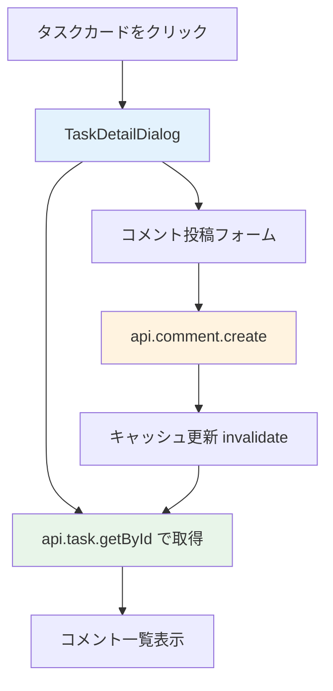

# Day 18: コメント投稿を実装しよう

## 🔙 前回の振り返り

Day 17 ではログインユーザー専用の「マイタスク」ページを実装し、期限別グループ表示とステータスタブで自分の担当タスクを一覧できるようにしました。個人向けのビューが整ったので、今日はタスクにコメントを投稿する機能に取り組みます。

---

## 🎯 今日のゴール

タスクの詳細ダイアログにあるコメント機能を
理解し、コメント一覧の表示と新規投稿の仕組みを
読み解きます。

📸 スクリーンショット: コメント付きのタスク詳細ダイアログ

## 🤔 なぜこれを作るのか？

チームでタスクに取り組む時、進捗報告や質問を
タスクに紐づけて記録する必要があります。
例えば、プロジェクトに 50 件のタスクがあるとき、
各タスクにコメントで経緯を残せると便利です。

> 💡 **例え話**: コメントは「付箋に貼るメモ」
> です。タスクカードの横にチームメイトが
> メモを貼り、誰がいつ何を書いたかが
> 時系列で残ります。

### 📐 コメント機能の構成



> 💡 コメント機能は `TaskDetailDialog`
> コンポーネントの内部で完結しています。
> ページ側は `taskId` を渡すだけで、コメントの
> 取得・表示・投稿はダイアログ内部で処理します。

### やること / やらないこと

| やること | やらないこと |
|---------|-------------|
| コメント一覧表示 | コメントへの返信（スレッド） |
| コメント投稿 | ファイル添付 |
| ユーザーアバター・日時表示 | リアルタイム通知 |
| 投稿後のキャッシュ更新 | コメント検索 |

### 🆕 新しく学ぶ概念

| 概念 | 読み方 | 役割 | 例え |
|------|--------|------|------|
| TaskDetailDialog | タスク・ディテール・ダイアログ | タスク詳細＋コメント機能を内包 | 付箋の裏面にメモ欄がある |
| comment.create | コメント・クリエイト | コメント投稿 API | 付箋にメモを貼る |
| invalidate | インバリデート | キャッシュを再取得させる | 棚卸しして最新に更新 |

## 📊 実装ステップ一覧

| ステップ | 作業内容 | 所要時間 |
|---------|---------|---------|
| Step 1 | コメント API を理解する | 3分 |
| Step 2 | タスク詳細でコメントを取得 | 5分 |
| Step 3 | コメント一覧の表示コードを確認 | 7分 |
| Step 4 | コメント投稿フォームを確認 | 5分 |
| Step 5 | 投稿処理と mutation を確認 | 5分 |
| Step 6 | キャッシュ更新の仕組みを理解 | 3分 |
| Step 7 | 動作確認 | 3分 |

**合計時間**: 約31分

---

### Step 1: コメント API を理解する（3分）

🎯 **ゴール**: コメントルーターの API を把握します。

VS Code で `src/server/api/routers/comment.ts`
を開いて、コメントルーターの構造を確認しましょう。

💻 **実装**:

```typescript
// filepath: src/server/api/routers/comment.ts
// コメント投稿用のバリデーションスキーマ
const commentCreateSchema = z.object({
  content: z.string().trim().min(1,
    'コメント内容は必須です'),
  taskId: z.string().cuid(),
});
```

✅ **確認ポイント**:
- `trim()` で前後の空白を除去している
- `min(1)` で空コメントを防止している

#### comment ルーターの全メソッド

| メソッド | 種別 | 説明 |
|---------|------|------|
| `getByTaskId` | query | タスクのコメント一覧取得 |
| `create` | mutation | コメント投稿 |
| `update` | mutation | コメント編集（Day 19） |
| `delete` | mutation | コメント削除（Day 19） |

#### comment.create の入力パラメータ

| パラメータ | 型 | バリデーション | 説明 |
|-----------|-----|--------------|------|
| `content` | string | `trim().min(1)` | コメント本文 |
| `taskId` | string (CUID) | `.cuid()` | タスク ID |

> 💡 コメントはタスクに紐づきます。
> `taskId` で「どのタスクへのコメントか」を
> 指定します。投稿者 ID はサーバー側で
> セッションから自動取得されます。

✅ **確認ポイント**:
- VS Code で comment.ts を開いた
- 4 つのメソッドの名前と種別を確認した

---

### Step 2: タスク詳細でコメントを取得する（5分）

🎯 **ゴール**: コメントデータがどこから来るかを
理解します。

Day 13 の Step 7 で配置した `TaskDetailDialog` は、
内部で `api.task.getById` を呼んでいます。
このレスポンスにコメントも含まれています。

💻 **実装**:

```typescript
// filepath: src/component/task/task-detail-dialog.tsx
// タスク詳細データ取得（既存コード）
const { data: taskDetail } =
  api.task.getById.useQuery(
    { id: taskId ?? '' },
    { enabled: !!taskId },
  );
```

✅ **確認ポイント**:
- `taskDetail?.comments` でデータが取得できる
- コメントデータはタスク詳細に含まれている

> 💡 `api.task.getById` のレスポンスには
> `comments` が含まれています。
> コメント専用の `comment.getByTaskId` を
> 使わなくても取得できます。

#### taskDetail.comments の構造

| フィールド | 型 | 説明 |
|-----------|-----|------|
| `id` | string | コメント ID |
| `content` | string | コメント本文 |
| `createdAt` | Date | 投稿日時 |
| `userId` | string | 投稿者 ID（Day 19 で使用） |
| `user.name` | string | 投稿者名 |
| `user.email` | string | メールアドレス |
| `user.avatar` | string \| null | アバター URL |

---

### Step 3: コメント一覧の表示コードを確認する（7分）

🎯 **ゴール**: コメントをアバター・日時付きの
リストで表示する仕組みを読み解きます。

`task-detail-dialog.tsx` を開いて、コメント
セクションのヘッダー部分を確認しましょう。

💻 **実装**:

```typescript
// filepath: src/component/task/task-detail-dialog.tsx
// コメントセクションのヘッダー
<div className="flex items-center gap-2 mb-4">
  <h3 className="font-semibold">コメント</h3>
  <Badge variant="secondary"
    className="rounded-full px-2">
    {taskDetail.comments?.length ?? 0}
  </Badge>
</div>
```

✅ **確認ポイント**:
- Badge でコメント件数が表示される
- `?? 0` でコメントが無い場合もエラーにならない

コメントが 0 件のときは案内メッセージを表示し、
1 件以上あればリストを描画します。

```typescript
// filepath: src/component/task/task-detail-dialog.tsx
// コメント 0 件の表示
{taskDetail.comments?.length === 0 && (
  <p className="text-sm text-muted-foreground
    text-center py-2">
    コメントはまだありません。
  </p>
)}
```

✅ **確認ポイント**:
- コメントが無い時に案内が表示される

続けて、各コメントのアバター・ユーザー名・日時を
表示する部分です。

```typescript
// filepath: src/component/task/task-detail-dialog.tsx
// 各コメント: アバターとユーザー情報
{taskDetail.comments?.map((comment) => (
  <div key={comment.id}
    className="flex gap-3 text-sm">
    <Avatar className="h-8 w-8 mt-1">
      <AvatarImage
        src={comment.user.avatar || ''} />
      <AvatarFallback>
        {(comment.user.name
          || comment.user.email
          || '?')[0]?.toUpperCase()}
      </AvatarFallback>
    </Avatar>
```

✅ **確認ポイント**:
- `||` で avatar が null の場合に空文字を返す
- AvatarFallback で頭文字を表示する

日時の表示には `date-fns` の `format` を使います。
ユーザー名の横に `yyyy/MM/dd HH:mm` 形式で
投稿時刻を表示します。

```typescript
// filepath: src/component/task/task-detail-dialog.tsx
// ユーザー名と投稿日時
<span className="font-medium">
  {comment.user.name || comment.user.email}
</span>
<span className="text-xs
  text-muted-foreground">
  {format(
    new Date(comment.createdAt),
    'yyyy/MM/dd HH:mm',
    { locale: ja },
  )}
</span>
```

✅ **確認ポイント**:
- 投稿日時が表示される
- `date-fns` の `format` と `ja` ロケールを使用

最後に、コメント本文の表示部分です。

```typescript
// filepath: src/component/task/task-detail-dialog.tsx
// コメント本文
<p className="text-muted-foreground">
  {comment.content}
</p>
```

✅ **確認ポイント**:
- コメントがリスト表示される
- アバター・名前・日時・本文が揃っている

📸 スクリーンショット: コメント一覧がタスク詳細に表示されている画面

> 💡 `max-h-[200px] overflow-y-auto` で
> コメントが多い場合にスクロール可能です。
> `AvatarFallback` はアバター画像がない場合に
> 名前の頭文字を表示します。

---

### Step 4: コメント投稿フォームを確認する（5分）

🎯 **ゴール**: テキストエリアと送信ボタンの
仕組みを読み解きます。

コメント入力の state を確認しましょう。
`useState` で入力中のテキストを管理しています。

💻 **実装**:

```typescript
// filepath: src/component/task/task-detail-dialog.tsx
// コメント入力の state（既存コード）
const [commentContent, setCommentContent]
  = useState('');
```

✅ **確認ポイント**:
- state が TaskDetailDialog 内に定義されている

コメント一覧の下にテキストエリアと投稿ボタンが
縦並びで配置されています。
ボタンは右寄せです。

```typescript
// filepath: src/component/task/task-detail-dialog.tsx
// コメント投稿フォーム
<div className="space-y-2">
  <Textarea
    placeholder="コメントを追加..."
    value={commentContent}
    onChange={(e) =>
      setCommentContent(e.target.value)}
    className="resize-none"
    rows={2} />
  <div className="flex justify-end">
    <Button size="sm"
      onClick={handleCommentSubmit}
      disabled={!commentContent.trim()
        || createCommentMutation.isPending}>
      {createCommentMutation.isPending
        ? '投稿中...' : 'コメント投稿'}
    </Button>
  </div>
</div>
```

✅ **確認ポイント**:
- テキストエリアが表示される
- 空の状態でボタンが無効になる
- 投稿中は「投稿中...」と表示される

📸 スクリーンショット: テキストエリアと投稿ボタンが表示されている画面

> 💡 `disabled` に `isPending` を含めることで、
> 二重投稿を防止しています。
> `resize-none` でテキストエリアのサイズ変更を
> 無効にし、レイアウトの崩れを防ぎます。

#### 投稿ボタンの disabled 条件

| 条件 | 意味 |
|------|------|
| `!commentContent.trim()` | 空白のみは送信不可 |
| `createCommentMutation.isPending` | 送信中は連打不可 |

---

### Step 5: 投稿処理と mutation を確認する（5分）

🎯 **ゴール**: コメントをサーバーに保存する
mutation の仕組みを理解します。

まず `api.useUtils()` を確認します。
キャッシュ操作用のユーティリティで、投稿成功後に
コメント一覧を再取得するために使います。

💻 **実装**:

```typescript
// filepath: src/component/task/task-detail-dialog.tsx
// tRPC キャッシュ操作ユーティリティ
const utils = api.useUtils();
```

✅ **確認ポイント**:
- `utils` が定義されている

```typescript
// filepath: src/component/task/task-detail-dialog.tsx
// コメント投稿の mutation
const createCommentMutation =
  api.comment.create.useMutation({
    onSuccess: () => {
      if (taskId) {
        utils.task.getById.invalidate(
          { id: taskId },
        );
      }
      setCommentContent('');
    },
  });
```

✅ **確認ポイント**:
- mutation が定義されている
- `onSuccess` で invalidate とフォームクリアを実行

```typescript
// filepath: src/component/task/task-detail-dialog.tsx
// コメント投稿ハンドラー
const handleCommentSubmit = () => {
  if (!commentContent.trim() || !taskId)
    return;
  createCommentMutation.mutate({
    content: commentContent.trim(),
    taskId,
  });
};
```

✅ **確認ポイント**:
- コメントが投稿できる
- フォームがクリアされる

> 💡 投稿成功後に `setCommentContent('')` で
> フォームをクリアし、`invalidate` で
> コメント一覧を自動更新します。

#### mutation の処理フロー

| 順番 | 処理 | 目的 |
|------|------|------|
| 1 | `mutate()` 呼び出し | サーバーへ送信 |
| 2 | サーバーで `trim().min(1)` 検証 | 空投稿を防止 |
| 3 | DB に保存 | コメントを永続化 |
| 4 | `onSuccess` → `invalidate` | 一覧を再取得 |
| 5 | `setCommentContent('')` | フォームをクリア |

---

### Step 6: キャッシュ更新の仕組みを理解する（3分）

🎯 **ゴール**: Step 5 で確認した `invalidate` が
どう動くかを理解します。

#### キャッシュ更新の仕組み

| 操作 | invalidate 対象 | 効果 |
|------|----------------|------|
| コメント投稿 | `task.getById` | コメント一覧更新 |
| タスク更新 | `task.getAll` + `getById` | 一覧と詳細を更新 |
| タスク削除 | `task.getAll` | 一覧から削除 |

```typescript
// filepath: src/component/task/task-detail-dialog.tsx
// onSuccess 内のキャッシュ更新（Step 5 で確認済み）
utils.task.getById.invalidate(
  { id: taskId },
);
```

✅ **確認ポイント**:
- 投稿後に新しいコメントが一覧に表示される

> 💡 `task.getById` を invalidate すると、
> タスク詳細（コメント含む）が再取得されます。
> コメント専用クエリ `comment.getByTaskId` を
> 使わなくてもタスク詳細経由で更新されます。

---

### Step 7: 動作確認（3分）

🎯 **ゴール**: コメント機能の全体を確認します。

1. タスクカードをクリックして詳細を開く
2. コメント一覧が表示される（件数 Badge 付き）
3. テキストエリアにコメントを入力
4. 「コメント投稿」ボタンをクリック
5. 投稿中は「投稿中...」と表示される
6. コメントが一覧に追加される
7. テキストエリアがクリアされる

```bash
# filepath: ターミナル
# 開発サーバーを起動して動作確認
npm run dev
```

✅ **確認ポイント**:
- コメントが正しく投稿される
- 投稿者のアバター・名前・日時が表示される
- 空コメントは送信できない
- 投稿中はボタンが無効になる

📸 スクリーンショット: コメント投稿後にリストが更新された画面

🎉 おめでとうございます！コメント投稿が動きました。
いろいろなタスクにコメントを書いてみてください。

---

## 📋 今日のまとめ

- [ ] タスク詳細にコメント一覧を表示できた
- [ ] `api.comment.create` でコメント投稿できた
- [ ] 投稿後にキャッシュを更新できた
- [ ] 空コメントのバリデーションを確認できた

## ⚠️ つまずきポイント

| エラー / 問題 | 原因 | 解決方法 |
|--------------|------|---------|
| コメントが表示されない | comments が include されてない | getById の include 確認 |
| 投稿後に更新されない | invalidate 忘れ | onSuccess に追加 |
| 投稿できない | taskId が未設定 | タスクを開いてから投稿 |
| 空白で投稿される | trim() チェック漏れ | disabled 条件を追加 |

## 📝 今日学んだ用語

| 用語 | 意味 |
|------|------|
| comment.create | コメントを投稿する API |
| AvatarFallback | アバター画像がない時の代替表示 |
| invalidate | キャッシュを無効化して再取得させる |
| isPending | mutation が実行中かどうかのフラグ |

## 🔜 次回予告

Day 19 では、投稿したコメントの編集・削除機能を
読み解きます。自分のコメントだけを操作できるように
権限チェックも確認します。
