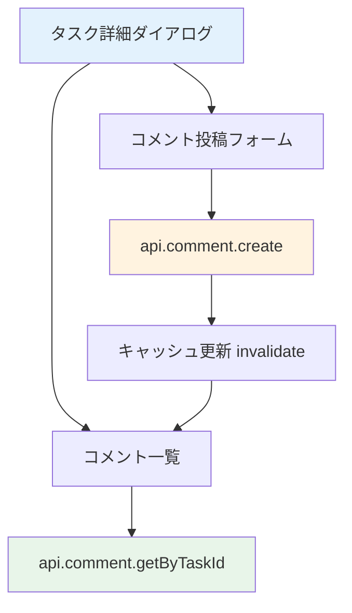

# Day 18: コメント投稿を実装しよう

## 🎯 今日のゴール

タスクの詳細ダイアログにコメント機能を追加します。
コメント一覧を表示し、新しいコメントを投稿
できるようにします。

【スクリーンショット: コメント付きタスク詳細】

## 🤔 なぜこれを作るのか？

チームでタスクに取り組む時、進捗報告や質問を
タスクに紐づけて記録する必要があります。

> 💡 **例え話**: コメントは「付箋に貼るメモ」
> です。タスクカードの横にチームメイトが
> メモを貼り、誰がいつ何を書いたかが
> 時系列で残ります。

### 📐 コメント機能の構成



### やること / やらないこと

| やること | やらないこと |
|---------|-------------|
| コメント一覧表示 | コメントへの返信（スレッド） |
| コメント投稿 | ファイル添付 |
| ユーザーアバター表示 | リアルタイム通知 |
| 時刻表示 | コメント検索 |

### 🆕 新しく学ぶ概念

| 概念 | 読み方 | 役割 | 例え |
|------|--------|------|------|
| comment.getByTaskId | — | タスクのコメント取得 | 付箋のメモを全部読む |
| comment.create | — | コメント投稿 | 付箋にメモを貼る |
| commentContent | — | 入力中のコメント文 | 書きかけのメモ |

## 📊 実装ステップ一覧

| ステップ | 作業内容 | 所要時間 |
|---------|---------|---------|
| Step 1 | コメントAPIを理解する | 3分 |
| Step 2 | タスク詳細でコメントを取得 | 5分 |
| Step 3 | コメント一覧を表示する | 7分 |
| Step 4 | コメント投稿フォームを作る | 5分 |
| Step 5 | 投稿処理を実装する | 5分 |
| Step 6 | 投稿後のキャッシュ更新 | 3分 |
| Step 7 | 動作確認 | 3分 |

**合計時間**: 約31分

---

### Step 1: コメントAPIを理解する（3分）

🎯 **ゴール**: コメントルーターのAPIを把握します。

#### comment ルーターの全メソッド

| メソッド | 種別 | 説明 |
|---------|------|------|
| `getByTaskId` | query | タスクのコメント一覧取得 |
| `create` | mutation | コメント投稿 |
| `update` | mutation | コメント編集（Day 19） |
| `delete` | mutation | コメント削除（Day 19） |

#### comment.create の入力パラメータ

| パラメータ | 型 | 必須 | 説明 |
|-----------|-----|------|------|
| `content` | string | ○ | コメント本文 |
| `taskId` | string | ○ | タスクID |
| `userId` | string | ○ | 投稿者ID |

> 💡 コメントはタスクに紐づきます。
> `taskId` で「どのタスクへのコメントか」を
> 指定します。

✅ **確認ポイント**:
- 4つのメソッドを把握した

---

### Step 2: タスク詳細でコメントを取得（5分）

🎯 **ゴール**: タスク詳細ダイアログ内でコメント
データを取得します。

💻 **実装**:

```typescript
// filepath: src/app/task/page.tsx
// タスク詳細データ取得（既存）
const { data: taskDetail } =
  api.task.getById.useQuery(
    { id: selectedTask ?? '' },
    { enabled: !!selectedTask },
  );
```

> 💡 `api.task.getById` のレスポンスには
> `comments` が含まれています。Prismaの
> `include: { comments: true }` で
> コメントも一緒に取得されます。

#### taskDetail.comments の構造

| フィールド | 型 | 説明 |
|-----------|-----|------|
| `id` | string | コメントID |
| `content` | string | コメント本文 |
| `createdAt` | Date | 投稿日時 |
| `user.name` | string | 投稿者名 |
| `user.avatar` | string? | アバターURL |

✅ **確認ポイント**:
- `taskDetail?.comments` でデータ取得

---

### Step 3: コメント一覧を表示する（7分）

🎯 **ゴール**: コメントをアバター付きのリストで
表示します。

💻 **実装**:

```typescript
// filepath: src/app/task/page.tsx
import {
  Avatar, AvatarFallback, AvatarImage,
} from '@/component/ui/avatar';
import { Separator } from '@/component/ui/separator';
```

```typescript
// filepath: src/app/task/page.tsx
// コメントセクションのヘッダーとリスト構造
<Separator />
<h3 className="font-semibold">
  Comments
</h3>
<div className="space-y-3 max-h-60
  overflow-y-auto">
  {taskDetail?.comments?.map(
    (comment) => (
      <div key={comment.id}
        className="flex gap-3">
```

続けて、各コメントのアバター表示と投稿者名を配置します。

```typescript
// filepath: src/app/task/page.tsx
// コメント: アバターとユーザー名
        <Avatar className="h-8 w-8">
          <AvatarImage
            src={comment.user.avatar
              || ''} />
          <AvatarFallback>
            {comment.user.name?.[0]}
          </AvatarFallback>
        </Avatar>
        <div className="flex-1">
          <div className="flex gap-2
            items-center">
            <span className="font-medium
              text-sm">
              {comment.user.name}
            </span>
          </div>
```

最後に、コメント本文の表示とリストの閉じタグです。

```typescript
// filepath: src/app/task/page.tsx
// コメント本文と閉じタグ
          <p className="text-sm mt-1">
            {comment.content}
          </p>
        </div>
      </div>
    )
  )}
</div>
```

> 💡 `max-h-60 overflow-y-auto` で
> コメントが多い場合にスクロール可能にします。
> `AvatarFallback` はアバター画像がない場合に
> 名前の頭文字を表示します。

✅ **確認ポイント**:
- コメントがリスト表示される
- アバターと名前が表示される

【スクリーンショット: コメント一覧の表示】

---

### Step 4: コメント投稿フォームを作る（5分）

🎯 **ゴール**: テキストエリアと送信ボタンを追加
します。

💻 **実装**:

```typescript
// filepath: src/app/task/page.tsx
import { Textarea } from '@/component/ui/textarea';

// TaskPageContent内にstate追加
const [commentContent, setCommentContent]
  = useState('');
```

```typescript
// filepath: src/app/task/page.tsx
// コメント投稿フォーム
<div className="flex gap-2">
  <Textarea
    value={commentContent}
    onChange={(e) =>
      setCommentContent(e.target.value)}
    placeholder="Add a comment..."
    rows={2}
    className="flex-1"
  />
  <Button
    size="sm"
    onClick={handleCommentSubmit}
    disabled={!commentContent.trim()}>
    Post
  </Button>
</div>
```

> 💡 `disabled={!commentContent.trim()}` で
> 空白だけのコメントを送信できないようにします。
> `trim()` は前後の空白を除去します。

✅ **確認ポイント**:
- テキストエリアが表示される
- 空の状態でボタンが無効になる

---

### Step 5: 投稿処理を実装する（5分）

🎯 **ゴール**: コメントをサーバーに保存します。

💻 **実装**:

```typescript
// filepath: src/app/task/page.tsx
const createCommentMutation =
  api.comment.create.useMutation({
    onSuccess: () => {
      if (selectedTask) {
        utils.task.getById.invalidate(
          { id: selectedTask }
        );
      }
      setCommentContent('');
    },
  });
```

```typescript
// filepath: src/app/task/page.tsx
const handleCommentSubmit = () => {
  if (!commentContent.trim()
    || !selectedTask
    || !session?.user?.id) return;
  createCommentMutation.mutate({
    content: commentContent,
    taskId: selectedTask,
    userId: session.user.id,
  });
};
```

> 💡 投稿成功後に `setCommentContent('')` で
> フォームをクリアし、`invalidate` で
> コメント一覧を自動更新します。

✅ **確認ポイント**:
- コメントが投稿される
- フォームがクリアされる

---

### Step 6: 投稿後のキャッシュ更新（3分）

🎯 **ゴール**: コメント投稿後にタスク詳細を
再取得して一覧を更新します。

💻 **実装**:

```typescript
// filepath: src/app/task/page.tsx
// invalidateの動作
utils.task.getById.invalidate(
  { id: selectedTask }
);
```

#### キャッシュ更新の仕組み

| 操作 | invalidate対象 | 効果 |
|------|--------------|------|
| コメント投稿 | `task.getById` | コメント一覧更新 |
| タスク更新 | `task.getAll` + `getById` | 一覧と詳細を更新 |
| タスク削除 | `task.getAll` | 一覧から削除 |

> 💡 `getById` を invalidate すると、
> タスク詳細（コメント含む）が再取得されます。
> コメント専用のクエリを用意しなくても、
> タスク詳細に含まれるコメントが更新されます。

✅ **確認ポイント**:
- 投稿後に新しいコメントが表示される

---

### Step 7: 動作確認（3分）

🎯 **ゴール**: コメント機能の全体を確認します。

1. タスクカードをクリックして詳細を開く
2. コメント一覧が表示される
3. テキストエリアにコメントを入力
4. 「Post」ボタンをクリック
5. コメントが一覧に追加される
6. テキストエリアがクリアされる

✅ **確認ポイント**:
- コメントが正しく投稿される
- 投稿者のアバターと名前が表示される
- 空コメントは送信できない

【スクリーンショット: コメント投稿後の画面】

---

## 📋 今日のまとめ

- [ ] タスク詳細にコメント一覧を表示できた
- [ ] `api.comment.create` でコメント投稿できた
- [ ] 投稿後にキャッシュを更新できた
- [ ] 空コメントのバリデーションを実装できた

## ⚠️ つまずきポイント

| エラー / 問題 | 原因 | 解決方法 |
|--------------|------|---------|
| コメントが表示されない | commentsがincludeされてない | getByIdのinclude確認 |
| 投稿後に更新されない | invalidate忘れ | onSuccessに追加 |
| userIdエラー | session未取得 | getSession確認 |
| 空白で投稿される | trim()未使用 | disabled条件を追加 |

## 📝 今日学んだ用語

| 用語 | 意味 |
|------|------|
| comment.create | コメントを投稿するAPI |
| AvatarFallback | アバター画像がない時の代替表示 |
| trim() | 文字列の前後の空白を除去 |
| overflow-y-auto | 縦方向にスクロール可能にする |

## 🔗 次回予告

Day 19 では、投稿したコメントの編集・削除機能を
実装します。自分のコメントだけを操作できるように
権限チェックも行います。
