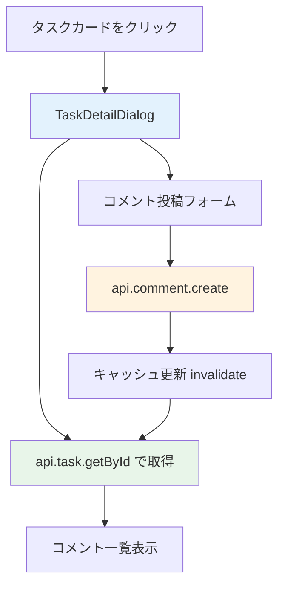
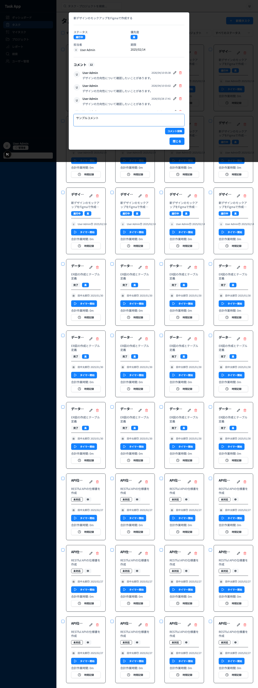
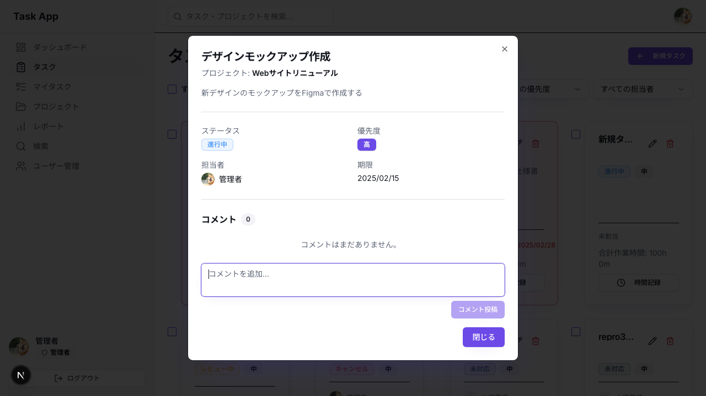

# Day 18: コメント投稿を実装しよう

## 前回の振り返り

Day 17 ではログインユーザー専用の「マイタスク」ページを実装し、期限別グループ表示とステータスタブで自分の担当タスクを一覧できるようにしました。個人向けのビューが整ったので、今日はタスクにコメントを投稿する機能に取り組みます。

---

## 今日のゴール

タスクの詳細ダイアログにコメント機能を追加します。
コメント API を自分の手で書き、配布済みの詳細ダイアログにその API をつないで動かします。

この日は、まずサーバー側のコメント API（`comment.ts`）を自分で書きます。画面側は配布済みの詳細ダイアログにその API をつなぎます。

スクリーンショット: コメント付きのタスク詳細ダイアログの表示を確認してください。


## なぜこれを作るのか

チームでタスクに取り組む時、進捗報告や質問を
タスクに紐づけて記録します。
たとえば、プロジェクトに 50 件のタスクがあるとき、
各タスクにコメントで経緯を残せると便利です。

> **例え話**: コメントは「付箋に貼るメモ」
> です。タスクカードの横にチームメイトが
> メモを貼り、誰がいつ何を書いたかが
> 時系列で残ります。

### コメント機能の構成


```mermaid
flowchart TD
    A[タスクカードをクリック] --> B[TaskDetailDialog]
    B --> C[api.task.getById で取得]
    C --> D[コメント一覧表示]
    B --> E[コメント投稿フォーム]
    E --> F[api.comment.create]
    F --> G[キャッシュ更新 invalidate]
    G --> C

    style B fill:#e3f2fd
    style C fill:#e8f5e9
    style F fill:#fff3e0
```

図の右下で `F → G → C` と折り返している線が、今日いちばん大事な部分です。
投稿が成功した直後に「取得をやり直せ」とサーバーへ伝える合図です。
この線を消すと、投稿自体は通っているのに画面のコメント欄が古いままになります。
Day 13 でタスク詳細を開いたとき、一度取ってきたデータはブラウザ側へ残り、次に開いたときも再利用されました。
その手元のコピーを捨てさせる役目が `invalidate` です。
図では投稿フォーム `E` から取得 `C` へ直接つながる線を引いていません。
フォームは自分でコメント一覧を書き換えません。
サーバーへ取り直しを頼むだけです。

> コメント機能は `TaskDetailDialog`
> コンポーネントの内部で完結しています。
> ページ側は `taskId` を渡すだけで、コメントの
> 取得・表示・投稿はダイアログ内部で処理します。

### やること / やらないこと

| やること | やらないこと |
|---------|-------------|
| コメント一覧表示 | コメントへの返信（スレッド） |
| コメント投稿 | ファイル添付 |
| ユーザーアバター・日時表示 | リアルタイム通知 |
| 投稿後のキャッシュ更新 | コメント検索 |

### 新しく学ぶ概念

| 概念 | 読み方 | 役割 | 例え |
|------|--------|------|------|
| TaskDetailDialog | タスク・ディテール・ダイアログ | タスク詳細＋コメント機能を内包 | 付箋の裏面にメモ欄がある |
| comment.create | コメント・クリエイト | コメント投稿 API | 付箋にメモを貼る |
| invalidate | インバリデート | キャッシュを再取得させる | 棚卸しして最新に更新 |
| useForm + zodResolver | ユーズフォーム＋ゾッドリゾルバー | フォーム状態管理＋バリデーション（Day 14 復習） | 記入欄のルールを自動チェック |

## 実装ステップ一覧

| ステップ | 作業内容 | 所要時間 |
|---------|---------|---------|
| Step 0 | `comment.ts` を写経する | 11分 |
| Step 1 | コメント API の形を整理する | 3分 |
| Step 2 | タスク詳細でコメントを取得 | 5分 |
| Step 3 | コメント一覧の表示コードを書く | 7分 |
| Step 4 | コメント投稿フォームを書く | 5分 |
| Step 5 | 投稿処理と mutation を書く | 5分 |
| Step 6 | キャッシュ更新の仕組みを理解 | 3分 |
| Step 7 | 動作確認 | 3分 |

**合計時間**: 約42分です。

---

### Step 0: `comment.ts` を写経する（11分）

**ゴール**: コメント機能の土台になる server 側コードを、
空の状態から自分で組み立てます。

今日は `src/server/api/routers/comment.ts` が配布されていません。
だから「有効化する」では足りません。まず router 本体を作ります。
`TaskDetailDialog` が使う `task.getById` は Day 13 で書いてあるため、
今日はコメント固有の API に集中できます。

#### 0-1. `comment.ts` を新規作成して入口を書く

次に `src/server/api/routers/comment.ts` を新規作成します。
まずは import と入力スキーマです。

```typescript
// filepath: src/server/api/routers/comment.ts
import { TRPCError } from '@trpc/server';
import { z } from 'zod';
import type { PermissionKey } from '@/lib/constant/roles';
import { prisma } from '@/lib/prisma';
import { createTRPCRouter, protectedProcedure } from '../trpc';
import { assertMemberPermission } from './_helpers/permission';
import { USER_SELECT } from './_helpers/select';

const commentCreateSchema = z.object({
  content: z.string().trim().min(1, 'コメント内容は必須です'),
  taskId: z.string().cuid(),
});
```

`trim().min(1)` の組み合わせは、空白だけの投稿を止めるための入口です。
まず `trim()` が前後の空白を削ります。
削ったあとの文字列へ `min(1)` が長さの下限をかけます。
順番を逆にすると、半角スペース3つだけの本文が長さ3として通過してしまいます。
そのあと `trim()` が空白を削るので、中身の無い文字列が DB に保存されます。
画面ではアバターと投稿日時だけが並び、中身の無い吹き出しに見えます。
`taskId` に付けた `.cuid()` は、Prisma が発行する ID の形と違う文字列を弾きます。
存在しない task にコメントがぶら下がる事故を、入口の時点で防いでいます。
ただし `.cuid()` が確かめるのは ID の形だけで、形は合っていて実在しない ID を弾くのは、このあと書く `findTaskAndAssertMembership` の役目です。
フォーム側にも同じ検証を Step 4 で書きますが、最後に守るのは server 側です。
ブラウザの検証ツールから直接この API へリクエストが届いても、ここを通らない限り保存されません。

#### 0-2. タスク存在確認と権限確認を関数にまとめる

コメントは単独で存在しません。必ず task にぶら下がります。
だから `create` と `getByTaskId` の両方で、
「その task があるか」「自分はその project のメンバーか」を
先に確かめます。

```typescript
// filepath: src/server/api/routers/comment.ts
const findTaskAndAssertMembership = async (
  taskId: string,
  userId: string,
  permission?: PermissionKey,
) => {
  const task = await prisma.task.findUnique({
    where: { id: taskId },
    include: {
      project: {
        include: {
          members: { where: { userId } },
        },
      },
    },
  });
```

ここまでで探しているのは、その ID を持つ task 1件だけです。
`include` に書いた `members: { where: { userId } }` が今日の勘所です。
メンバー全員ではなく、いまログインしている本人の行だけに絞って取ってきます。
本人がそのプロジェクトに参加していれば配列は1件、参加していなければ空配列になります。
誰ならコメントしてよいかは、task を1回引くついでに分かります。
Day 12 で作ったプロジェクトメンバーの一覧が、ここまで効いてきます。
コメント専用の権限テーブルを別に作らずに済みます。
参加者がすでにそこへ登録されているからです。
配列が空だったときに何が起きるかは、次のブロックで決めます。

```typescript
// filepath: src/server/api/routers/comment.ts（続き）
  if (!task) {
    throw new TRPCError({
      code: 'NOT_FOUND',
      message: 'タスクが見つかりません',
    });
  }

  assertMemberPermission(task.project.members, permission);

  return task;
};
```

`if (!task)` で先に止める理由は、この後の `task.project.members` を安全に読むためです。
task が `null` のまま次の行へ進むと、`null` から `project` を読もうとして実行時エラーになります。
存在しない ID が届いたときは、この 4 行のおかげで `NOT_FOUND` として返せます。
続く `assertMemberPermission` は、1つ前のブロックの `include` でログインユーザー分だけに絞り込んだ `members` の1件目を見ます。
本人がメンバーでなければ配列は空です。
1件目は `undefined` になるため `FORBIDDEN` を投げます。
権限キーを渡した場合は、そのメンバーの役割まで確認します。
`canEdit` を持たない閲覧者ロールは、コメントを読めても投稿できません。
同じ確認を毎回ベタ書きすると、
Day 19 の update/delete でも同じ形が増えて読みづらくなります。
先に関数へ抜いておくと、router 本体では
「何を確認してから、何を返すか」が見やすくなります。

#### 0-3. `getByTaskId` と `create` を書く

ここで初めて `commentRouter` 本体を組み立てます。
Day 18 の完成形は `getByTaskId` と `create` の2つです。

```typescript
// filepath: src/server/api/routers/comment.ts
export const commentRouter = createTRPCRouter({
  getByTaskId: protectedProcedure
    .input(z.object({ taskId: z.string().cuid() }))
    .query(async ({ ctx, input }) => {
      await findTaskAndAssertMembership(input.taskId, ctx.session.userId);

      return await prisma.comment.findMany({
        where: { taskId: input.taskId },
        include: {
          user: {
            select: USER_SELECT,
          },
        },
        orderBy: { createdAt: 'desc' },
      });
    }),
```

`getByTaskId` の1行目は `findTaskAndAssertMembership` の呼び出しです。
コメントを取り出すのは、その確認を通り抜けた後です。
順番が逆だと、権限の無い人にもコメント本文が返ってしまいます。
権限チェックは必ずデータを取る前に置きます。
`orderBy: { createdAt: 'desc' }` で新しい順に並べているので、直近のやりとりが先頭へ来ます。
`include` の `user` は表示用です。
名前とアバターをここで一緒に取っておかないと、コメント1件ごとに追加の通信が発生します。
`USER_SELECT` を挟むと、パスワードなど返してはいけない項目が自動で外れます。
Day 09 の `getAll` で使ったのと同じ道具です。

ここから先の「（続き）」のブロックは、`comment.ts` の**末尾にある `});` の1行上**へ貼ります。ファイルの一番下に足すとルーターの外に出てしまい、英語のエラーで止まります。`});` は増やしません。

```typescript
// filepath: src/server/api/routers/comment.ts（続き）
  create: protectedProcedure.input(commentCreateSchema).mutation(async ({ ctx, input }) => {
    await findTaskAndAssertMembership(input.taskId, ctx.session.userId, 'canEdit');

    return await prisma.comment.create({
      data: {
        content: input.content,
        taskId: input.taskId,
        userId: ctx.session.userId,
      },
      include: {
        user: {
          select: USER_SELECT,
        },
      },
    });
  }),
});
```

投稿者 ID は `ctx.session.userId` から取ります。
フォーム経由で他人の userId を送られても信用しないためです。
入力スキーマに `userId` を入れていないため、client からは投稿者を指定できません。
なりすまし投稿を防ぐいちばん確実な方法は、client に選ばせないことです。
`findTaskAndAssertMembership` の第3引数へ `'canEdit'` を渡している点にも注目してください。
`getByTaskId` は参加者なら誰でも通ります。
`create` を通れるのは編集権限を持つ役割だけです。
閲覧者ロールのメンバーがコメントを送ると、ここで `FORBIDDEN` が返ります。
最後の `include` で投稿者情報を付けて返します。
投稿直後の1件を、そのまま画面へ描けるようにするためです。

#### 0-4. `root.ts` に登録する

router だけ書いても `api.comment.create` はまだ呼べません。
最後に appRouter へ登録します。

```typescript
// filepath: src/server/api/root.ts
import { authRouter } from './routers/auth';
import { commentRouter } from './routers/comment';
import { projectRouter } from './routers/project';
import { searchRouter } from './routers/search';
import { taskRouter } from './routers/task';
import { createCallerFactory, createTRPCRouter } from './trpc';
```

この import 行は、Day 07 の `auth` から少しずつ増えてきた並びです。
今日は `commentRouter` の1行を足しましたが、これだけではまだ何も有効になりません。
import は「この名前をこのファイルで使う」と宣言するだけの行だからです。
外から呼べるようになるのは、次のブロックで `appRouter` へ登録した瞬間です。
import を書き忘れると `commentRouter` が未定義になり、型エラーで起動できません。
逆に import だけ書いて登録を忘れると、`api.comment` と書いた行が型エラーになります。
後者のほうが原因を見つけにくいので、2つの作業は続けて済ませます。

```typescript
// filepath: src/server/api/root.ts（続き）
export const appRouter = createTRPCRouter({
  auth: authRouter,
  project: projectRouter,
  task: taskRouter,
  search: searchRouter,
  comment: commentRouter,
});
```

このオブジェクトが、サーバー側の手続きの全体像です。ここに載っていない router は、ファイルが存在していても外からは呼べません。`root.ts` は Day 07 で書いたとおり、この `appRouter` から `AppRouter` 型を作って書き出しています。client 側の `api` はその型を読んで呼び名と引数を決めるため、登録を忘れると `api.comment` と書いた行そのものが型エラーになります。動かす前に間違いが分かる代わりに、エラーの表示はコメント画面側に出ます。原因はこのファイルなので、赤い波線が出たらまず `appRouter` を見てください。

**確認ポイント**:
- Day 13 で追加した `task.getById` が残っている
- `comment.ts` を新規作成し、`getByTaskId` と `create` を書いた
- `root.ts` に `commentRouter` を登録した
- `npm run dev` で型エラーが出ていない

---

### Step 1: コメント API の形を整理する（3分）

**ゴール**: Step 0 で写経した `src/server/api/routers/comment.ts` を、
「何を受け取って、何をして、何を返すか」で整理します。

```typescript
// filepath: src/server/api/root.ts
comment: commentRouter,
```

この1行が、client 側の呼び名を決めています。
左側へ書いた `comment` が、そのまま `api.comment.create` の `comment` になります。
別の名前を付ければ呼び名もその名前へ変わるので、両者は必ず一致します。
tRPC で「サーバーに書いた関数をそのまま client から呼べる」と言えるのは、この対応づけがあるからです。
関数名を変えれば client 側の型もその場で変わり、呼び出し側にエラーが出ます。
実行してみるまで壊れたことに気づかない、という事故が起きません。

#### Day 18 時点の commentRouter

| メソッド | 種類 | 役割 |
|---------|------|------|
| `getByTaskId` | query | task に紐づくコメント一覧を返す |
| `create` | mutation | 新しいコメントを保存する |

#### `comment.create` の入力

| パラメータ | 型 | バリデーション | 説明 |
|-----------|-----|--------------|------|
| `content` | string | `trim().min(1)` | コメント本文 |
| `taskId` | string (CUID) | `.cuid()` | 紐づけ先の task ID |

#### `task.getById` が返すコメント関連のデータ

| フィールド | 型 | 役割 |
|-----------|-----|------|
| `comments` | 配列 | コメント一覧そのもの |
| `comments[].content` | string | 本文 |
| `comments[].createdAt` | Date | 投稿日時 |
| `comments[].userId` | string | 投稿者 ID |
| `comments[].user` | object | 表示用の投稿者情報 |

ここで大事なのは、Day 18 の画面側が直接使うのは
`task.getById` の返り値だという点です。
`comment.getByTaskId` も書きましたが、今回は
「task 詳細を取ったら comment も一緒に付いてくる」形で進めます。

#### comment ルーターの全メソッド

| メソッド | 種別 | 説明 |
|---------|------|------|
| `getByTaskId` | query | タスクのコメント一覧取得 |
| `create` | mutation | コメント投稿 |
| `update` | mutation | コメント編集（Day 19） |
| `delete` | mutation | コメント削除（Day 19） |

**確認ポイント**:
- 既存の `getByTaskId` を残して `create` を追加した
- 4 つのメソッドの名前と種別を把握した

---

### Step 2: タスク詳細でコメントを取得する（5分）

**ゴール**: `TaskDetailDialog` コンポーネント内で
コメントデータがどこから来るかを理解します。

Day 13 の Step 7 で配置した `TaskDetailDialog`
（`src/component/task/task-detail-dialog.tsx`）は、
内部で `api.task.getById` を呼んでいます。
このレスポンスにコメントも含まれています。

**実装**:

```typescript
// filepath: src/component/task/task-detail-dialog.tsx
// TaskDetailDialog 内でタスク詳細データを取得
const { data: taskDetail } =
  api.task.getById.useQuery(
    { id: taskId ?? '' },
    { enabled: !!taskId },
  );
```

`enabled: !!taskId` は、ダイアログを開く前に問い合わせが走らないよう止めるスイッチです。
`taskId` が `null` のあいだ、`useQuery` は待機したまま何も送りません。
これが無いと、まだタスクを開いていない状態でも空文字の `id` が送られ、`.cuid()` の検証に引っかかります。
`{ id: taskId ?? '' }` に書いた `?? ''` は、型を `string` へそろえるための保険です。
`enabled` で止めているので、この空文字が実際にサーバーへ届くことはありません。
Step 0 で書いた server 側と違い、画面側に権限チェックはありません。
その確認は `task.getById` の中で済んでいるため、画面側へ書き足す必要はありません。

**確認ポイント**:
- `taskDetail?.comments` でデータが取得できる
- コメントデータはタスク詳細に含まれている
- `npm run dev` で型エラーが出ていない

> `api.task.getById` のレスポンスには
> `comments` が含まれています。
> コメント専用の `comment.getByTaskId` を
> 使わなくても取得できます。

#### taskDetail.comments の構造

| フィールド | 型 | 説明 |
|-----------|-----|------|
| `id` | string | コメント ID |
| `content` | string | コメント本文 |
| `createdAt` | Date | 投稿日時 |
| `userId` | string | 投稿者 ID（Day 19 で使用） |
| `user.id` | string | ユーザー ID（include 経由） |
| `user.name` | string | 投稿者名 |
| `user.email` | string | メールアドレス |
| `user.avatar` | string \| null | アバター URL |

---

### Step 3: コメント一覧の表示コードを書く（7分）

配布されている `task-detail-dialog.tsx` にコメント欄はありません。ここから先は、ダイアログの中へ自分で書き足していきます。

**ゴール**: コメントをアバター・日時付きの
リストで表示する部分を作ります。

`task-detail-dialog.tsx` にコメント一覧セクションを追加します。
まずインポートを追加します。

```typescript
// filepath: src/component/task/task-detail-dialog.tsx
// Avatar 関連のインポート元
import { Avatar, AvatarFallback, AvatarImage }
  from '@/component/ui/avatar';
import { Badge }
  from '@/component/ui/badge';
```

`Avatar` は3つの部品でひと組です。
`Avatar` は丸い外枠です。
その中へ画像を出す部品が `AvatarImage` です。
画像を出せないときに代わりを出す部品が `AvatarFallback` です。
コメントの投稿者が全員アバター画像を登録しているとは限りません。
だから代役の側が必ず要ります。
`Badge` は件数を丸く囲んで表示する小さな部品で、この後コメント件数の表示に使います。
どちらも shadcn/ui の部品で、実体は `src/component/ui/` の下にあります。
自分のプロジェクト内へファイルとして置いてあるため、色や角丸を変えたくなったら直接編集できます。

**確認ポイント**:
- Avatar は `@/component/ui/avatar` からインポート
- Badge は `@/component/ui/badge` からインポート

コメントセクションのヘッダー部分を確認しましょう。

**実装**:

```typescript
// filepath: src/component/task/task-detail-dialog.tsx
// TaskDetailDialog の return 内: コメントヘッダー
<div className="flex items-center gap-2 mb-4">
  <h3 className="font-semibold">コメント</h3>
  <Badge variant="secondary"
    className="rounded-full px-2">
    {taskDetail.comments?.length ?? 0}
  </Badge>
</div>
```

`taskDetail.comments?.length ?? 0` の `?.` と `?? 0` は保険です。
このコメント欄は `taskDetail` が届いたあとだけ描かれ、`task.getById` は `comments` を必ず含めて返します。
つまりここでの `comments` は常に配列で、1件も無ければ空の配列です。
今日のコードで `?.` と `?? 0` が実際に働く場面はありませんが、この式を `taskDetail` の判定の外へ移しても壊れない書き方になっています。
件数をヘッダーへ出しておくと、コメント欄を開かなくてもやりとりの有無が分かります。
コメントが1件も無いタスクと、20件たまったタスクを一目で見分けられます。

**確認ポイント**:
- Badge でコメント件数が表示される
- コメントが1件も無いタスクでは `0` と表示される

コメントが 0 件のときは案内メッセージを表示し、
1 件以上あればリストを描画します。

```typescript
// filepath: src/component/task/task-detail-dialog.tsx
// TaskDetailDialog の return 内: 0 件時の案内
{taskDetail.comments?.length === 0 && (
  <p className="text-sm text-muted-foreground
    text-center py-2">
    コメントはまだありません。
  </p>
)}
```

`comments` は必ず配列で届くので、`length` が `0` かどうかだけを見れば足ります。
空の状態へ言葉を置く理由は、Day 09 の一覧画面で空状態を作ったときと変わりません。
何も無い画面は、読者にとって「壊れている画面」と見分けが付きません。

**確認ポイント**:
- コメントが無い時に案内が表示される

続けて、各コメントのアバター・ユーザー名・日時を
表示する部分です。

```typescript
// filepath: src/component/task/task-detail-dialog.tsx
// TaskDetailDialog return 内: コメント .map ループ
{taskDetail.comments?.map((comment) => (
  <div key={comment.id}
    className="flex gap-3 text-sm">
    <Avatar className="h-8 w-8 mt-1">
      {comment.user.avatar && (
        <AvatarImage
          src={comment.user.avatar}
          alt="" />
      )}
      <AvatarFallback>
        {(comment.user.name
          || comment.user.email
          || '?')[0]?.toUpperCase()}
      </AvatarFallback>
    </Avatar>
```

**確認ポイント**:
- `AvatarImage` は `{comment.user.avatar && ...}` で条件付きレンダリング（画像URLがある場合のみ表示）
- `alt=""` は「読み上げなくてよい画像」の指定。隣に投稿者名が文字で出ているため、画像まで読み上げると同じ名前を二度聞くことになる。名前が隣に無い場所へ置くときは `alt={user.name}` のように誰の画像かを入れる
- `AvatarFallback` の名前取得には `||` を使い、name がなければ email、両方なければ `'?'` を使う
- AvatarFallback で頭文字（先頭 1 文字を大文字化）を表示する

> `comment.user.name` が空のときは email を、
> それも無いときは `'?'` を使います。
> `||` を左から順にたどり、最初の使える値で止まります。
> この後の表示名も同じ順でたどるので、
> 頭文字と表示名が別々の値になることはありません。

日時の表示には `date-fns` の `format` を使います。
ユーザー名の横に `yyyy/MM/dd HH:mm` 形式で
投稿時刻を表示します。

まず、ファイル冒頭に `date-fns` のインポートを追加します。

```typescript
// filepath: src/component/task/task-detail-dialog.tsx
// 日時整形に使う date-fns のインポート
import { format } from 'date-fns';
import { ja } from 'date-fns/locale';
```

`format` は Date を好きな並びの文字列へ変換する関数です。
`ja` は日本語ロケール（言語ごとの表記ルール一式）で、曜日や月の呼び方を日本語にそろえます。
標準の `toLocaleString` でも似たことはできますが、ブラウザや OS の設定によって出力が変わります。
読者全員で同じ画面を再現するため、出力の決まった `date-fns` を使います。
`date-fns/locale` から `ja` だけを取り込みます。こうすると、他の言語のデータまで配信せずに済みます。
必要な分だけ import すると、完成したアプリの読み込みが軽くなります。

**確認ポイント**:
- `format` は `date-fns` からインポート
- `ja` は `date-fns/locale` からインポート

投稿日時をそのまま出すと読みにくいので、`format` で
`yyyy/MM/dd HH:mm` の形にそろえます。`ja` ロケールを渡すと、
月名などが日本語表記で扱われます。

```typescript
// filepath: src/component/task/task-detail-dialog.tsx
// .map ループ内: 名前と日時を包む2つの箱を開く
<div className="flex-1 space-y-1">
  <div className="flex items-center
    justify-between">
```

外側の `flex-1` は、アイコンの右側の残り幅をすべて使うための指定です。
内側の `justify-between` は、名前を左端、日時を右端へ寄せるための指定です。
この2つはあとで閉じるので、いまは開いたままにしておきます。

```typescript
// filepath: src/component/task/task-detail-dialog.tsx
// .map ループ内: ユーザー名と投稿日時
<span className="font-medium">
  {comment.user.name
    || comment.user.email
    || '?'}
</span>
<span className="text-xs
  text-muted-foreground">
  {format(
    new Date(comment.createdAt),
    'yyyy/MM/dd HH:mm',
    { locale: ja },
  )}
</span>
```

表示名の `||` は、`AvatarFallback` に渡す頭文字と同じ順でたどります。
順番をそろえてあるので、アイコンの頭文字が「T」なのに名前が別人、という食い違いは起きません。
`new Date(comment.createdAt)` でいったん `Date` へ包み直します。
このアプリは tRPC に superjson を設定しているので、日時は文字列ではなく `Date` のまま届きます。
つまりこの包み直しは無くても動きます。それでも書いておくのは、通信の設定を変えたときや、別の経路から文字列で受け取ったときに、この行だけで吸収できるからです。
日時を `text-xs text-muted-foreground` で小さく薄くしています。
読者が追いたいのは本文であり、時刻は補足だからです。

**確認ポイント**:
- 投稿日時が表示される
- `date-fns` の `format` と `ja` ロケールを使用

最後に、コメント本文の表示部分です。

```typescript
// filepath: src/component/task/task-detail-dialog.tsx
// .map ループ内: コメント本文
<p className="text-muted-foreground">
  {comment.content}
</p>
```

ここまでで `.map` の中身が揃いました。最後に、開いたタグと括弧を閉じます。
`{comment.content}` の `</p>` の下へ続けてください。

```typescript
// filepath: src/component/task/task-detail-dialog.tsx（同じファイルの続き）
      </div>
    </div>
  </div>
))}
```

`</div>` の3つは、内側から順に「名前と日時の箱」「アイコンの右側の箱」「1件分の箱」を閉じます。
`))}` は `.map` の閉じです。`(` で始めた書き方を `)` で閉じ、`{` で開いた埋め込みを `}` で閉じます。
コメント欄を包む外側の箱はこのあと閉じるので、この時点ではまだ構文エラーが残ります。

**確認ポイント**:
- `.map` の中身を、閉じるところまで書けた
- `</div>` が3つ、`))}` が1つ並んでいる
- この時点ではまだ構文エラーが残る（コメント欄を包む外側の箱は、このあと閉じる）

スクリーンショット: コメント一覧がタスク詳細に並んだ画面の表示を確認してください。



画像の各行に見えるペンとゴミ箱のアイコンは Day 19 で足すものです。
今日の時点では出ません。

> `max-h-[200px] overflow-y-auto` で
> コメントが多い場合にスクロール可能です。
> `AvatarFallback` はアバター画像がない場合に
> 名前の頭文字を表示します。

---

### Step 4: コメント投稿フォームを書く（5分）

**ゴール**: react-hook-form + zod で管理された
コメント投稿フォームを作ります。

Day 14 で学んだ `useForm + zodResolver` パターンが
コメントフォームにも使われています。
まず、必要なインポートを確認しましょう。

```typescript
// filepath: src/component/task/task-detail-dialog.tsx
// フォーム関連のインポート
import { zodResolver }
  from '@hookform/resolvers/zod';
import { useForm } from 'react-hook-form';
import { z } from 'zod';
import { Textarea }
  from '@/component/ui/textarea';
```

`useForm`・`zodResolver`・`z` の3つは、Day 05 と Day 16 で使ったものと同じ役割です。
`Textarea` は複数行を書ける入力欄で、改行を含むコメントを受け取れます。
1行だけの `Input` にすると、長い経過報告を書きたい人がすぐ困ります。

**確認ポイント**:
- `zodResolver` は `@hookform/resolvers/zod` から
- `useForm` は `react-hook-form` から

zod スキーマとフォーム初期化を確認しましょう。

**実装**:

```typescript
// filepath: src/component/task/task-detail-dialog.tsx
// コメント用 zod スキーマ定義
const commentSchema = z.object({
  content: z.string().trim()
    .min(1, 'コメントを入力してください'),
});
type CommentFormValues =
  z.infer<typeof commentSchema>;
```

画面側のスキーマは、Step 0 で書いた `commentCreateSchema` とほぼ同じ形です。
違いは `taskId` が無い点です。
`taskId` はフォームへ入力する値ではなく、開いているダイアログが持っています。
同じ検証を2か所に書くのは無駄に見えますが、役割が違います。
画面側の役目は、送る前に赤字で教えることです。
server 側の役目は、送られてきたものを最後に弾くことです。
画面側だけだと、API を直接叩かれた時点で守りがゼロになります。
server 側だけだと、送信して往復するまで入力ミスに気づけません。
`z.infer<typeof commentSchema>` は、スキーマから型を作り直す書き方です。
ルールを1か所直せば型も追随します。型とルールがずれる心配はありません。

**確認ポイント**:
- `trim()` → `min(1)` の順でバリデーションする
- `z.infer` で型を自動生成している

```typescript
// filepath: src/component/task/task-detail-dialog.tsx
// useForm でフォームを初期化
const commentForm =
  useForm<CommentFormValues>({
    resolver: zodResolver(commentSchema),
    defaultValues: { content: '' },
  });
```

`defaultValues: { content: '' }` を書いておくと、`content` は最初から空文字になります。
初期値を省くと `undefined` から始まります。後で `watch('content').trim()` を呼んだ瞬間、エラーになります。
Step 4 の投稿ボタンは `watch` の結果を見て有効と無効を切り替えます。
だから初期値が必ず要ります。
`resolver: zodResolver(commentSchema)` を渡すと、送信ボタンを押した時点で zod が入力値を検査します。
検査に落ちた場合、`handleSubmit` は先へ進みません。
投稿ハンドラーも呼ばれません。
そのため、ハンドラーの中で空文字かどうかを自分で調べる必要がありません。

**確認ポイント**:
- Day 14 と同じ `zodResolver` パターンを使っている

コメント一覧の下にテキストエリアと投稿ボタンが
縦並びで配置されています。
ボタンは右寄せです。

```typescript
// filepath: src/component/task/task-detail-dialog.tsx
// コメント投稿フォーム（useForm管理）
<form onSubmit={commentForm.handleSubmit(
  handleCommentSubmit)}
  className="space-y-2">
  <Textarea
    placeholder="コメントを追加..."
    aria-label="コメント本文"
    {...commentForm.register('content')}
    className="resize-none"
    rows={2} />
  <div className="flex justify-end">
    <Button type="submit" size="sm"
      disabled={
        !commentForm.watch('content').trim()
        || createCommentMutation
          .isPending}>
      {createCommentMutation.isPending
        ? '投稿中...' : 'コメント投稿'}
    </Button>
  </div>
</form>
```

入力欄に `aria-label` を付けているのは、`placeholder` が1文字打つと消えるためです。消えたあとは何の欄か確かめる手段がなくなります。

ここで使っている `handleCommentSubmit` は、このあとの Step で定義します。
定義するまでこの画面は表示できないので、動きの確認はそのあとに行います。

**確認ポイント**:
- `<form className="space-y-2">` でレイアウトする
- `register('content')` でテキストエリアを管理
- `handleSubmit` でバリデーション後に送信
- 投稿中の「投稿中...」の表示は、`handleCommentSubmit` を書いてから確かめる

スクリーンショット: テキストエリアと投稿ボタンが並んだ画面の表示を確認してください。



> `useState` ではなく `useForm` で管理する
> メリットは、バリデーションが zod スキーマに
> 集約されることです。Day 14 と同じパターンなので
> プロジェクト全体で統一的にフォームを扱えます。

#### useState と useForm の比較

| 項目 | useState パターン | useForm パターン |
|------|-----------------|-----------------|
| バリデーション | 手動で条件分岐 | zod スキーマに集約 |
| エラー表示 | 自前で管理 | `formState.errors` で自動管理 |
| リセット | `setState('')` | `form.reset()` |
| 型安全性 | 手動で型定義 | `z.infer` で自動生成 |

---

### Step 5: 投稿処理と mutation を書く（5分）

**ゴール**: コメントをサーバーに保存する
mutation の仕組みを理解します。

まず `api.useUtils()` を確認します。
キャッシュ操作用のユーティリティで、投稿成功後に
コメント一覧を再取得するために使います。

**実装**:

```typescript
// filepath: src/component/task/task-detail-dialog.tsx
// tRPC キャッシュ操作ユーティリティ
const utils = api.useUtils();
```

`api.useUtils()` は、tRPC が裏で持っているキャッシュの操作盤を取り出すフックです。
これまでの Day で使ってきた `useQuery` は、取得したデータを画面の裏側へ保存します。
同じ問い合わせが来たら、保存済みの中身をすぐ返します。
そのおかげで、タスクを開き直しても毎回サーバーへ問い合わせずに済みます。
ただし、コメントを1件足した後は、保存済みの中身が古くなります。
古くなったと伝える窓口が `utils` です。
`utils.task.getById` のように、router と手続きの名前をそのままたどれます。
呼び名が API 側とそろっているため、どのキャッシュを触っているかは読むだけで分かります。

**確認ポイント**:
- `utils` が定義されている

```typescript
// filepath: src/component/task/task-detail-dialog.tsx
// コメント投稿の mutation
const createCommentMutation =
  api.comment.create.useMutation({
    onSuccess: () => {
      if (taskId) {
        utils.task.getById.invalidate(
          { id: taskId },
        );
      }
      commentForm.reset();
    },
  });
```

`useMutation` は、`useQuery` と対になるフックです。
`useQuery` は読む担当です。
`useMutation` は書く担当で、こちらは自動で走りません。
`mutate()` を呼んだときだけサーバーへ送ります。
`onSuccess` はサーバーが成功を返したときだけ動きます。
投稿に失敗したのに入力欄だけ空になる事故を防げます。
`if (taskId)` で囲んだ理由は、`taskId` が `null` のまま呼ばれても壊れないようにするためです。
`invalidate` へ渡す `id` は、いま開いているタスクの ID とぴったり一致させます。
別の ID を渡すと、無関係なタスクのキャッシュが消えるだけです。
目の前の一覧は古いままになります。

**確認ポイント**:
- mutation が定義されている
- `onSuccess` で invalidate とフォームリセットを実行

```typescript
// filepath: src/component/task/task-detail-dialog.tsx
// コメント投稿ハンドラー（useForm版）
const handleCommentSubmit =
  (values: CommentFormValues) => {
    if (!taskId) return;
    createCommentMutation.mutate({
      content: values.content,
      taskId,
    });
  };
```

`handleCommentSubmit` が受け取る `values` は、zod の検査を通り抜けてきた値です。
だから `if (!values.content)` のような空チェックをここへ書く必要がありません。
検査に落ちた入力は、そもそもこの関数まで届きません。
残っている `if (!taskId) return;` が見ているのは、入力値ではなく画面の状態です。
ダイアログを閉じた直後に送信が走ると、`taskId` は `null` になります。
その `null` をそのまま送ると、server 側の `.cuid()` で弾かれてエラー表示になります。
手前で黙って止めておくほうが、読者にとって親切です。
`mutate` へ渡しているのは `content` と `taskId` の2つだけです。
投稿者を決めるのは Step 0 で見たとおり server 側です。
だからここでは送りません。

**確認ポイント**:
- `values` は zod でバリデーション済み
- フォームがリセットされる
- `npm run dev` で型エラーが出ていない

> 投稿成功後に `commentForm.reset()` で
> フォームをクリアし、`invalidate` で
> コメント一覧を自動更新します。
> `handleSubmit` がバリデーションを実行するので
> ハンドラー内での空チェックは不要です。

#### mutation の処理フロー

| 順番 | 処理 | 目的 |
|------|------|------|
| 1 | `handleSubmit` でバリデーション | zod スキーマで検証 |
| 2 | `mutate()` 呼び出し | サーバーへ送信 |
| 3 | サーバーで `trim().min(1)` 検証 | 二重チェック |
| 4 | DB に保存 | コメントを永続化 |
| 5 | `onSuccess` → `invalidate` | 一覧を再取得 |
| 6 | `commentForm.reset()` | フォームをクリア |

---

### Step 6: キャッシュ更新の仕組みを理解する（3分）

**ゴール**: Step 5 で確認した `invalidate` が
どう動くかを理解します。

#### キャッシュ更新の仕組み

| 操作 | invalidate 対象 | 効果 |
|------|----------------|------|
| コメント投稿 | `task.getById` | コメント一覧更新 |
| タスク更新 | `task.getAll` + `getById` | 一覧と詳細を更新 |
| タスク削除 | `task.getAll` | 一覧から削除 |

```typescript
// filepath: src/component/task/task-detail-dialog.tsx
// onSuccess 内のキャッシュ更新（Step 5 で確認済み）
utils.task.getById.invalidate(
  { id: taskId },
);
```

コメント配列へ自分で1件足す書き方もありますが、今日は使いません。
サーバーが実際に保存した中身をそのまま表示するほうが、画面と DB の食い違いが起きないからです。

**確認ポイント**:
- 投稿後に新しいコメントが一覧に表示される

> `task.getById` を invalidate すると、
> タスク詳細（コメント含む）が再取得されます。
> コメント専用クエリ `comment.getByTaskId` を
> 使わなくてもタスク詳細経由で更新されます。

---

### Step 7: 動作確認（3分）

**ゴール**: コメント機能の全体を確認します。

1. タスクカードをクリックして詳細を開く
2. コメント一覧が表示される（件数 Badge 付き）
3. テキストエリアにコメントを入力
4. 「コメント投稿」ボタンをクリック
5. 投稿中は「投稿中...」と表示される
6. コメントが一覧に追加される
7. テキストエリアがクリアされる

```bash
# filepath: ターミナル
# 開発サーバーを起動して動作確認
PORT=3001 npm run dev
```

**確認ポイント**:
- コメントが正しく投稿される
- 投稿者のアバター・名前・日時が表示される
- 空コメントは送信できない
- 投稿中はボタンが無効になる


画像は「コメント投稿」を押す**直前**の状態です。押したあとは、
いま入力欄にある文章が一覧の末尾に加わり、見出しの件数が1つ増え、
入力欄は空に戻ります。この3つが同時に起きれば成功です。

おめでとうございます。コメント投稿が動きました。
いろいろなタスクにコメントを書いてみてください。

---

### Pro パターンで書こう（認証状態つきのコメント表示を読みやすくする）

コメント表示では、読み込み中・未ログイン・空状態・通常表示が並びます。
JSX の中に全部詰めると条件分岐が深くなります。
先に例外状態を返すと、最後に通常表示だけを残せます。

| 状態 | 先に返す表示 |
|------|--------------|
| 読み込み中 | コメントを読み込んでいます |
| 未ログイン | ログイン案内 |
| 0件 | コメントはまだありません |
| 通常 | コメント一覧 |

**覚えておきたいこと**: 例外状態は early return で先に返します。

## 今日のまとめ

- [ ] タスク詳細にコメント一覧を表示できた
- [ ] `api.comment.create` でコメント投稿できた
- [ ] 投稿後にキャッシュを更新できた
- [ ] 空コメントのバリデーションを確認できた

## つまずきポイント

| エラー / 問題 | 原因 | 解決方法 |
|--------------|------|---------|
| コメントが表示されない | comments が include されてない | getById の include 確認 |
| 投稿後に更新されない | invalidate 忘れ | onSuccess に追加 |
| 投稿できない | taskId が未設定 | タスクを開いてから投稿 |
| 空白で投稿される | trim() チェック漏れ | disabled 条件を追加 |

## 今日学んだ用語

| 用語 | 意味 |
|------|------|
| comment.create | コメントを投稿する API |
| AvatarFallback | アバター画像がない時の代替表示 |
| invalidate | キャッシュを無効化して再取得させる |
| isPending | mutation が実行中かどうかのフラグ |

## 次回予告

Day 19 では、投稿したコメントの編集・削除機能を作ります。
自分のコメントだけを操作できる権限チェックも実装します。

---

## 次に読むもの

- 前の日: [Day 17](./day17_自分のタスクページ.md)
- 次の日: [Day 19](./day19_コメント編集・削除.md)
- 全体の地図: [学びのロードマップ](./00-1_学びのロードマップ.md)
- 目次: [カリキュラム目次](./00_カリキュラム目次.md)
