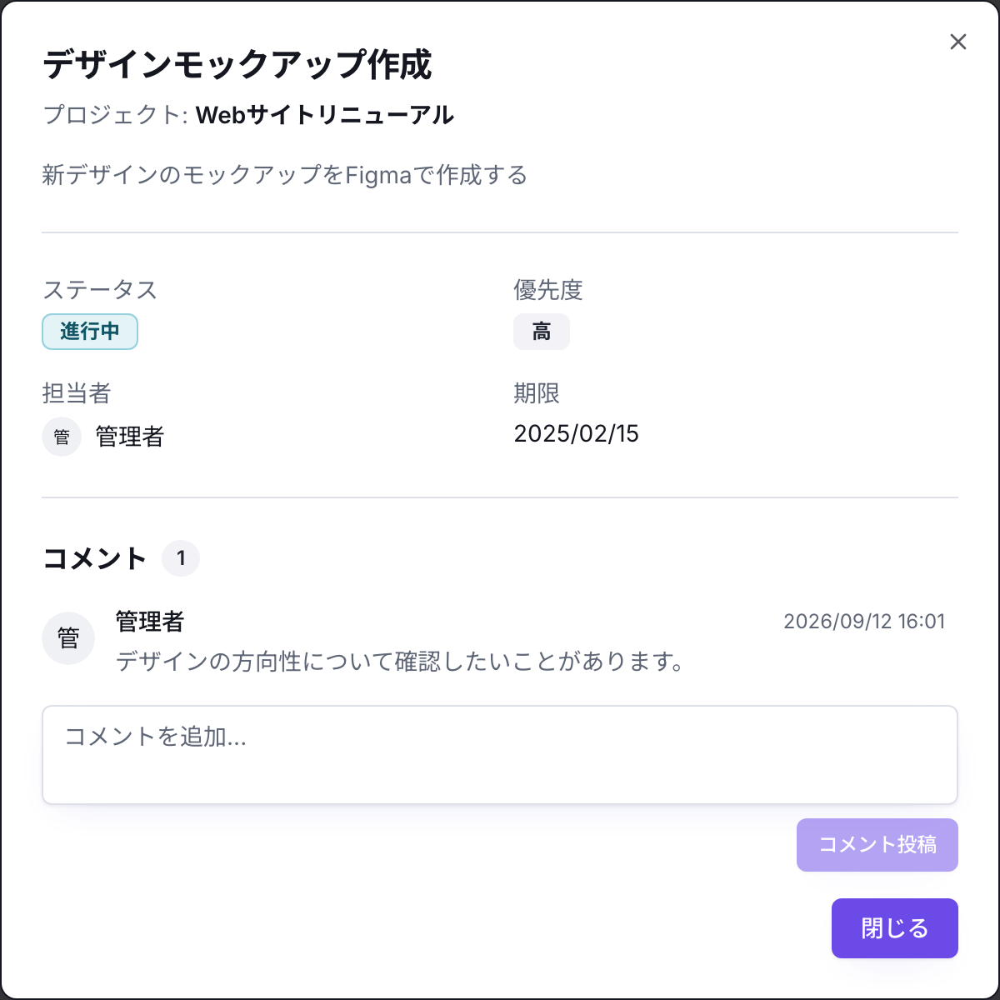
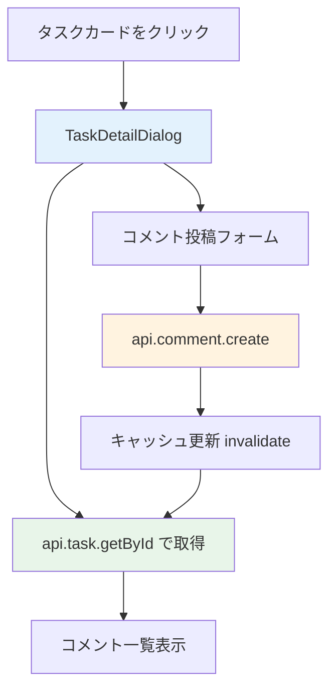
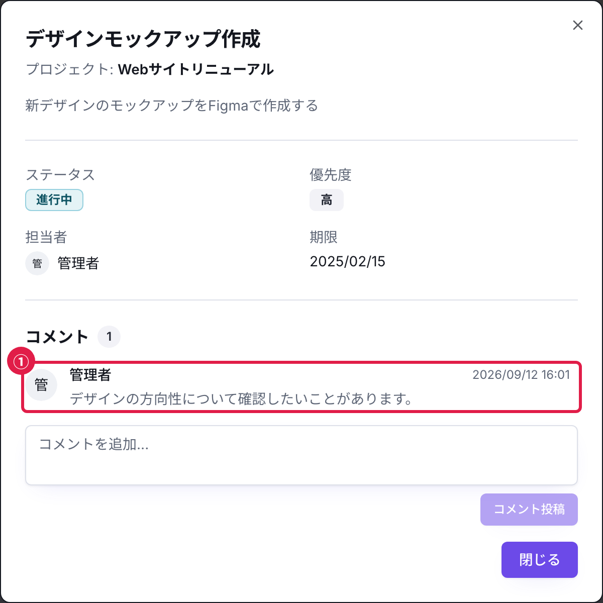
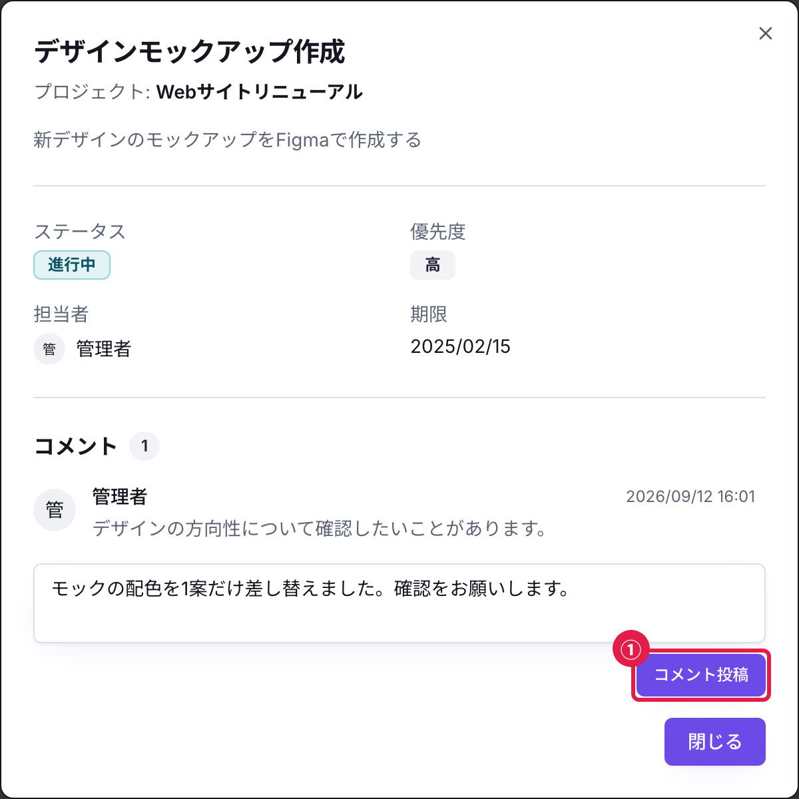
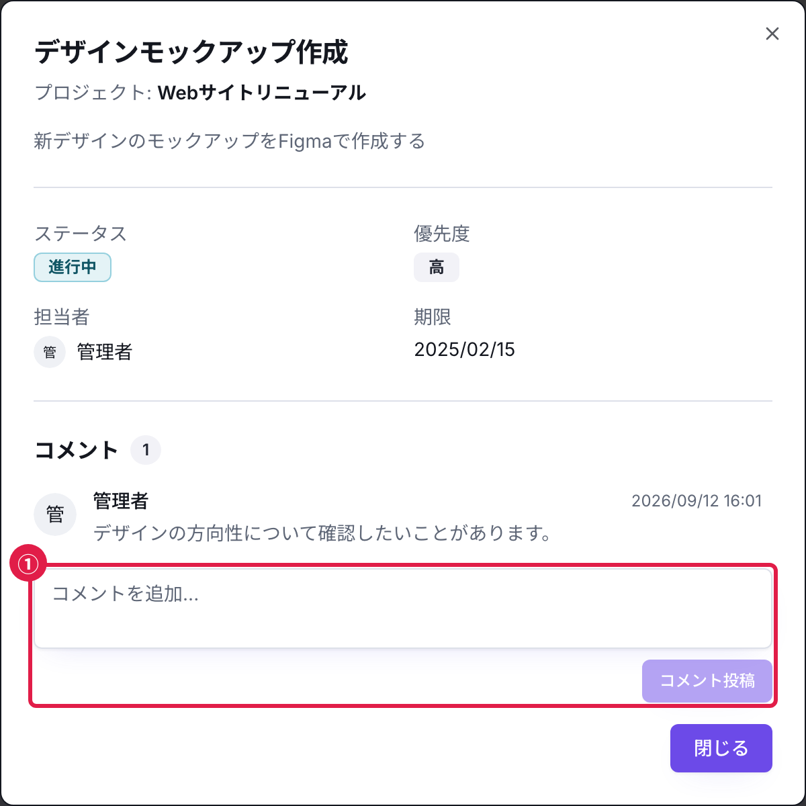

# Day 18: コメント投稿を実装しよう

## 前回の振り返り

Day 17 ではログインユーザー専用の「マイタスク」ページを実装し、期限別グループ表示とステータスタブで自分の担当タスクを一覧できるようにしました。個人向けのビューが整ったので今日はタスクにコメントを投稿する機能に取り組みます。

---

## 今日のゴール

タスクの詳細ダイアログにコメント機能を追加します。
コメント API（画面と server をつなぐ呼び出し口）を自分の手で書き、配布済みの詳細ダイアログにその API をつないで動かします。
TaskDetailDialog はコンポーネント（画面を構成する部品）です。React（画面を部品で組み立てるライブラリ）と TypeScript（JavaScript に型を加えた言語）で書き、shadcn/ui（プロジェクト内で編集できる UI 部品集）を使います。

スクリーンショット: 今日を終えたタスク詳細ダイアログです。ステータスや期限の下にコメント欄が付きます。



## なぜこれを作るのか

チームでタスクに取り組む時、進捗報告や質問を
タスクに紐づけて記録します。
たとえばプロジェクトに 50 件のタスクがあるとき
各タスクにコメントで経緯を残せると便利です。

> **例え話**: コメントは「タスクに貼る付箋」
> です。タスクカードの横にチームメイトが
> メモを貼り、誰がいつ何を書いたかが
> 時系列で残ります。

### コメント機能の構成


```mermaid
flowchart TD
    A[タスクカードをクリック] --> B[TaskDetailDialog]
    B --> C[api.task.getById で取得]
    C --> D[コメント一覧表示]
    B --> E[コメント投稿フォーム]
    E --> F[api.comment.create]
    F --> G[キャッシュ更新 invalidate]
    G --> C

    style B fill:#e3f2fd
    style C fill:#e8f5e9
    style F fill:#fff3e0
```

図の「api.comment.create → キャッシュ更新 invalidate → api.task.getById で取得」と進む線が、投稿後にコメント欄を更新する部分です。
投稿が成功したら、表示中のコメント欄で使っているタスクデータを取り直します。
この更新をしないと、投稿自体は成功していても画面のコメント欄が古いままになります。
Day 13 でタスク詳細を開いたとき、一度取得したデータはブラウザ側へ残り、次に開いたときも再利用されました。
`invalidate` は、取得済みのデータを古いものとして扱う操作です。表示中のデータは取り直します。
図では「コメント投稿フォーム」から「api.task.getById で取得」へ直接つながる線を引いていません。
フォームは自分でコメント一覧を書き換えず、投稿が成功したあとに `invalidate` を呼んで取得し直します。

> コメント機能は `TaskDetailDialog`
> コンポーネントの内部で完結しています。
> ページ側は `taskId` を渡すだけで、コメントの
> 取得・表示・投稿はダイアログ内部で処理します。

### やること / やらないこと

| やること | やらないこと |
|---------|-------------|
| コメント一覧表示 | コメントへの返信（スレッド） |
| コメント投稿 | ファイル添付 |
| ユーザーアバター・日時表示 | リアルタイム通知 |
| 投稿後のキャッシュ更新 | コメント検索 |

### 新しく学ぶ概念

| 概念 | 読み方 | 役割 | 例え |
|------|--------|------|------|
| TaskDetailDialog | タスク・ディテール・ダイアログ | タスク詳細＋コメント機能を内包 | タスクと付箋を一緒に見る場所 |
| comment.create | コメント・クリエイト | コメント投稿 API | タスクに付箋を貼る |
| invalidate | インバリデート | キャッシュを再取得させる | 棚卸しして最新に更新 |
| useForm + zodResolver | ユーズフォーム＋ゾッドリゾルバー | フォーム状態管理＋バリデーション（Day 14 復習） | 記入欄のルールを自動チェック |

開発サーバーは前の Day から動かしたまま使います。止めてあるときは `npm run dev` で起動してから `http://localhost:3000` を開きます。

## 実装ステップ一覧

| ステップ | 作業内容 | 読む時間の目安 |
|---------|---------|---------|
| Step 0 | コメント API の read/create 基盤を作る | 18分 |
| Step 1 | コメント API の形を整理する | 3分 |
| Step 2 | タスク詳細でコメントを取得する | 5分 |
| Step 3 | コメント一覧を表示する | 7分 |
| Step 4 | 投稿フォームと送信対象を固定する | 10分 |
| Step 5 | 成功・失敗・再取得失敗を分ける | 10分 |
| Step 6 | 二重送信と古い完了を確認する | 4分 |
| Step 7 | 動作確認 | 5分 |

**読む時間の合計（仮）**: 約62分です。

表と各 Step に記した時間は、説明とコードを読む時間の仮の目安です。実測した値ではありません。コードの入力、動作確認、ダウンロードや起動の待ち時間、調べものには別に時間を取ってください。

---

### Step 0: `comment.ts` を写経する（読む目安: 18分）

**ゴール**: コメントを読む入口と投稿する入口を作ります。投稿では、権限を確認してから保存するまで、対象プロジェクトの行をロックします。

API（画面と server をつなぐ呼び出し口）は tRPC（TypeScript の型を画面と server で共有する道具）で作ります。DB の読み書きには Prisma（TypeScript から DB を操作する道具）を使います。

#### 0-1. 入力とプロジェクトロックを用意する

`src/server/api/routers/comment.ts` を新規作成します。`Prisma` は型だけでなく `Prisma.sql` にも使うため、`import type` にはしません。

```typescript
// filepath: src/server/api/routers/comment.ts
import { Prisma } from '@prisma/client';
import { TRPCError } from '@trpc/server';
import { z } from 'zod';
import type { PermissionKey } from '@/lib/constant/roles';
import { prisma } from '@/lib/prisma';
import { createTRPCRouter, protectedProcedure } from '../trpc';
import { assertMemberPermission } from './_helpers/permission';
import { USER_SELECT } from './_helpers/select';

const commentCreateSchema = z.object({
  content: z.string().trim().min(1, 'コメント内容は必須です'),
  taskId: z.string().cuid(),
});

const lockCommentProject = async (tx: Prisma.TransactionClient, projectId: string) => {
  const rows = await tx.$queryRaw<Array<{ id: string }>>(
    Prisma.sql`SELECT "id" FROM "projects" WHERE "id" = ${projectId} FOR UPDATE`,
  );
  return rows.length > 0;
};
```

`commentCreateSchema` では、投稿先の `taskId` と、前後の空白を除いたうえで1文字以上ある `content` を受け取るバリデーションを定義します。ブラウザ側に加えてサーバー側でも Zod で検証し、未入力や空白文字だけのコメントをデータベースへ保存しません。

`FOR UPDATE` は、同じプロジェクトのメンバー変更やタスク移動とコメント投稿の順番を決めます。別処理が先にロックしていれば、その処理が終わるまで待ちます。対象のプロジェクト行が無い場合だけ `lockCommentProject` が `false` を返し、`CONFLICT` で止めます。

#### 0-2. transaction client を受け取れる確認関数を書く

```typescript
// filepath: src/server/api/routers/comment.ts
/**
 * getByTaskId/createの両方で同一のタスク存在確認+メンバー権限検証が必要なため集約。
 * findTaskWithPermission（_helpers）はtask routerに特化しているためcomment独自で定義。
 */
const findTaskAndAssertMembership = async (
  taskId: string,
  userId: string,
  permission?: PermissionKey,
  db: Pick<Prisma.TransactionClient, 'task'> = prisma,
) => {
  const task = await db.task.findUnique({
    where: { id: taskId },
    include: {
      project: {
        include: {
          members: { where: { userId } },
        },
      },
    },
  });

  if (!task) {
    throw new TRPCError({
```

`findTaskAndAssertMembership` は、指定されたタスクの存在と、ログイン中ユーザーが所属プロジェクトで必要な権限を持つかをまとめて確かめます。引数 `db` には、通常の `prisma` とトランザクション内の `tx` のどちらも渡せます。そのため、通常の読み取り時とトランザクション内で同じ検証を再利用できます。

```typescript
// filepath: src/server/api/routers/comment.ts（同じファイルの続き）
      code: 'NOT_FOUND',
      message: 'タスクが見つかりません',
    });
  }

  assertMemberPermission(task.project.members, permission);

  return task;
};
```

task が無ければ NOT_FOUND を返し、存在する場合だけ現在の member role へ必要権限を確認して task を返します。存在確認だけで返すと、project に所属しない利用者も後続の読取や書き込みへ進めます。

第4引数を省略した呼び出しは通常の `prisma` を使います。transaction 内では `tx` を渡します。同じ関数でロック前の対象確認と、ロック後の現在の権限を確かめるためです。

#### 0-3. 読み取りと投稿を書く

```typescript
// filepath: src/server/api/routers/comment.ts
export const commentRouter = createTRPCRouter({
  getByTaskId: protectedProcedure
    .input(z.object({ taskId: z.string().cuid() }))
    .query(async ({ ctx, input }) => {
      const comments = await prisma.comment.findMany({
        where: {
          taskId: input.taskId,
          task: {
            project: {
              members: { some: { userId: ctx.session.userId } },
            },
          },
        },
        include: {
          user: {
            select: USER_SELECT,
          },
        },
        orderBy: { createdAt: 'desc' },
      });
```

`where` にはタスク ID だけでなく、ログイン中ユーザーが現在のプロジェクトメンバーである条件も入れます。コメントを返す読み取りそのものに所属条件を持たせるためです。

```typescript
// filepath: src/server/api/routers/comment.ts（同じファイルの続き）
      if (comments.length === 0) {
        await findTaskAndAssertMembership(input.taskId, ctx.session.userId);
      }

      return comments;
    }),

  create: protectedProcedure.input(commentCreateSchema).mutation(async ({ ctx, input }) => {
    const task = await findTaskAndAssertMembership(input.taskId, ctx.session.userId, 'canEdit');

    return await prisma.$transaction(async (tx) => {
      if (!(await lockCommentProject(tx, task.projectId))) {
        throw new TRPCError({
```

`commentRouter` には、タスクに紐づくコメントを取得する `getByTaskId` と、新規投稿を担う `create` を定義します。閲覧処理（`getByTaskId`）では、コメント取得の `where` にログイン中ユーザーの所属条件も入れます。所属確認とコメント取得を同じ読み取りへ結び付け、確認直後にメンバーから外れたユーザーへコメントを返さないためです。コメントが0件なら `findTaskAndAssertMembership` を呼び、空の一覧・存在しないタスク・権限不足を区別します。投稿処理（`create`）では書き込み権限が必要なので、`'canEdit'` を指定してプロジェクトの行ロックへ進みます。

```typescript
// filepath: src/server/api/routers/comment.ts（同じファイルの続き）
          code: 'CONFLICT',
          message: 'タスクの内容が更新されています。最新の内容を再読み込みしてください',
        });
      }

      const currentTask = await findTaskAndAssertMembership(
        input.taskId,
        ctx.session.userId,
        'canEdit',
        tx,
      );
      if (currentTask.projectId !== task.projectId) {
        throw new TRPCError({
          code: 'CONFLICT',
          message: 'タスクの内容が更新されています。最新の内容を再読み込みしてください',
        });
      }

      return await tx.comment.create({
        data: {
          content: input.content,
          taskId: currentTask.id,
          userId: ctx.session.userId,
```

プロジェクト行をロックした直後に `currentTask` をトランザクション内で再取得し、現在のタスク状態と編集権限（`canEdit`）を改めて確かめます。ロック獲得の待機中にタスクが別プロジェクトへ移動されていたり、自身のメンバー権限が変更されたりした場合に、古い権限のまま不正にコメントが保存されてしまうのを防ぐためです。

```typescript
// filepath: src/server/api/routers/comment.ts（同じファイルの続き）
        },
        include: {
          user: {
            select: USER_SELECT,
          },
        },
      });
    });
  }),
});
```

作成した comment と投稿者の表示名・メール・画像を transaction の結果として返します。現在の画面はこの戻り値を一覧へ直接加えず、成功後に送信対象の task query を取り直して comment 一覧を更新します。

投稿前の最初の確認だけでは足りません。その直後にメンバーから外れたり VIEWER へ変わったりする可能性があります。そこで project 行をロックした後、`currentTask` を読み直します。タスクが別の project へ移っていた場合も `projectId` の比較で保存を止めます。

投稿者は `ctx.session.userId` から決めます。ブラウザから他人の ID を送る入力欄は作りません。

#### 0-4. `root.ts` に登録する

`commentRouter` の import と `comment: commentRouter` を追加します。既存の router は消しません。

```typescript
// filepath: src/server/api/root.ts
import { commentRouter } from './routers/comment';
```

この import は、作成したコメント用 router を API の入口へ渡すために必要です。ここで読み込まないと、次の登録で名前を参照できず、型検査の時点で実装の不足に気づきます。

```typescript
// filepath: src/server/api/root.ts（appRouter の中に追加）
comment: commentRouter,
```

この登録によって、画面は `api.comment` という名前から読み取りと投稿を呼べます。登録を省くと server 側に処理があっても画面側の型へ現れず、投稿フォームを接続できません。

**確認ポイント**:
- `Prisma.TransactionClient` と `Prisma.sql` を使っています
- lock 後に現在のメンバー権限と project を確認しています
- 保存には `currentTask.id` と session の user ID を使っています
- `getByTaskId` は読み取り権限、`create` は `canEdit` を確認しています

### Step 1: コメント API の形を整理する（読む目安: 3分）

**ゴール**: Step 0 で写経した `src/server/api/routers/comment.ts` を、
「何を受け取って何をして何を返すか」で整理します。

```typescript
// filepath: src/server/api/root.ts
comment: commentRouter,
```

この1行がclient 側の呼び名を決めています。
左側へ書いた `comment` がそのまま `api.comment.create` の `comment` になります。
別の名前を付ければ呼び名もその名前へ変わるので両者は必ず一致します。
tRPC で「サーバーに書いた関数をそのまま client から呼べる」と言えるのはこの対応づけがあるからです。
関数名を変えれば client 側の型もその場で変わり、呼び出し側にエラーが出ます。
実行してみるまで壊れたことに気づかない、という事故が起きません。

#### Day 18 時点の commentRouter

| メソッド | 種類 | 役割 |
|---------|------|------|
| `getByTaskId` | query | task に紐づくコメント一覧を返す |
| `create` | mutation | 新しいコメントを保存する |

#### `comment.create` の入力

| パラメータ | 型 | バリデーション | 説明 |
|-----------|-----|--------------|------|
| `content` | string | `trim().min(1)` | コメント本文 |
| `taskId` | string (CUID) | `.cuid()` | 紐づけ先の task ID |

#### `task.getById` が返すコメント関連のデータ

| フィールド | 型 | 役割 |
|-----------|-----|------|
| `comments` | 配列 | コメント一覧そのもの |
| `comments[].content` | string | 本文 |
| `comments[].createdAt` | Date | 投稿日時 |
| `comments[].userId` | string | 投稿者 ID |
| `comments[].user` | object | 表示用の投稿者情報 |

ここで大事なのはDay 18 の画面側が直接使うのは
`task.getById` の返り値だという点です。
`comment.getByTaskId` も書きましたが今回は
「task 詳細を取ったら comment も一緒に付いてくる」形で進めます。
コメントだけを取得したい別の画面でも使える入口をcomment ルーターに用意し、一覧取得と投稿を同じルーターへまとめるために書いています。今日の詳細ダイアログでは2回問い合わせる必要がないため`task.getById`の返り値を使います。

#### comment ルーターの全メソッド

| メソッド | 種別 | 説明 |
|---------|------|------|
| `getByTaskId` | query | タスクのコメント一覧取得 |
| `create` | mutation | コメント投稿 |
| `update` | mutation | コメント編集（Day 19） |
| `delete` | mutation | コメント削除（Day 19） |

**確認ポイント**:
- Step 0 で書いた `getByTaskId` と `create` が上の表の 2 行と一致しています
- 4 つのメソッドの名前と種別を把握しました

---

### Step 2: タスク詳細でコメントを取得する（読む目安: 5分）

**ゴール**: `TaskDetailDialog` コンポーネント内で
コメントデータがどこから来るかを理解します。

Day 13 の Step 7 で配置した `TaskDetailDialog`
（`src/component/task/task-detail-dialog.tsx`）は
内部で `api.task.getById` を呼んでいます。
このレスポンスにコメントも含まれています。

**この Step は読むだけです。** 配布ファイルには task query だけがあります。`data: cachedTask` の行を探してください。session query はまだ無く、投稿者の権限を判定する Step 4 で追加します。

```typescript
// filepath: src/component/task/task-detail-dialog.tsx（同じファイルの続き）
  const {
    data: cachedTask,
    error: taskError,
    failureReason: taskFailure,
    isFetching,
    refetch,
  } = api.task.getById.useQuery(
    { id: taskId ?? '' },
    {
      enabled: open && !!taskId && !authExpired,
      retry: (count, error) => httpStatusOf(error) !== 404 && shouldRetryQuery(count, error),
    },
  );
```

取得値には以前の成功結果も残るため、配布ファイルは task query の401、403、404を分けて表示します。配布済みの認証切れ処理は `setAuthExpired(true)` と `onAuthExpired?.()` を呼ぶ形です。Step 4 では session query、`authExpiredRef`、`mountedRef` を追加し、「取得は成功したが session が `null`」の場合と、閉じた後に届く応答も扱います。

`cachedTask` は前回の取得値を含むデータです。`taskDetail` は表示してよい場合だけ、その値を受け取ります。`error` は確定した取得エラー、`failureReason` は再試行中の失敗理由です。task または session の401、task の403・404では保護された内容を隠します。

401はログイン切れ、403は表示権限なし、404は対象なしを表します。500などの一時的な失敗では、前回の内容と更新失敗の案内を表示します。`enabled` は開いていること、ID があること、ログイン切れではないことを確認します。`?? ''` の空文字は型をそろえる値で、この条件では送信されません。`onAuthExpired` は親へログイン切れを知らせる省略可能な関数です。

**確認ポイント**:
- `taskDetail?.comments` でデータが取得できます
- コメントデータはタスク詳細に含まれています
- このファイルの実装が終わったら、`npx tsc --noEmit` で型エラーがないことを確認します

> `api.task.getById` のレスポンスには
> `comments` が含まれています。
> コメント専用の `comment.getByTaskId` を
> 使わなくても取得できます。

#### taskDetail.comments の構造

| フィールド | 型 | 説明 |
|-----------|-----|------|
| `id` | string | コメント ID |
| `content` | string | コメント本文 |
| `createdAt` | Date | 投稿日時 |
| `userId` | string | 投稿者 ID（Day 19 で使用） |
| `user.id` | string | ユーザー ID（include 経由） |
| `user.name` | string | 投稿者名 |
| `user.email` | string | メールアドレス |
| `user.avatar` | string \| null | アバター URL |

---

### Step 3: コメント一覧の表示コードを書く（読む目安: 7分）

配布されている `task-detail-dialog.tsx` にコメント欄はありません。ここから先はダイアログの中へ自分で書き足していきます。ただしコメント欄で使う `Avatar` と `Badge` のインポートは配布ファイルにすでに書いてあります。

**ゴール**: コメントをアバター・日時付きの
リストで表示する部分を作ります。

`task-detail-dialog.tsx` にコメント一覧セクションを書き足します。
まずそこで使う部品のインポートを確かめます。

**次の 2 行は読むだけです。** 配布ファイルにすでに書いてあります。`@/component/ui/avatar` と `@/component/ui/badge` からの import を探してください。同じものを貼り足すと `Avatar` と `Badge` が二重に宣言され、ビルドが止まります。エディタで開いて同じ行があることを目で確かめてください。

**配布ファイルにすでにある行**:

```typescript
// filepath: src/component/task/task-detail-dialog.tsx
// Avatar と Badge のインポート元（配布済み・書き足し不要）
import { Avatar, AvatarFallback, AvatarImage }
  from '@/component/ui/avatar';
import { Badge }
  from '@/component/ui/badge';
```

`Avatar` は3つの部品でひと組です。
`Avatar` は丸い外枠です。
その中へ画像を出す部品が `AvatarImage` です。
画像を出せないときに代わりを出す部品が `AvatarFallback` です。
コメントの投稿者が全員アバター画像を登録しているとは限りません。
だから代役の側が必ず要ります。
`Badge` は件数を丸く囲んで表示する小さな部品で、この後コメント件数の表示に使います。
どちらも shadcn/ui の部品で、実体は `src/component/ui/` の下にあります。
自分のプロジェクト内へファイルとして置いてあるため色や角丸を変えたくなったら直接編集できます。

**確認ポイント**:
- `@/component/ui/avatar` から `Avatar, AvatarFallback, AvatarImage` をインポートしています
- `@/component/ui/badge` から `Badge` をインポートしています
- どちらも書き足していません

コメントセクションのヘッダー部分を確認しましょう。

**実装**:

```typescript
{/* filepath: src/component/task/task-detail-dialog.tsx */}
{/* TaskDetailDialog の return 内、{taskDetail && ( の中。 */}
{/* 担当者と期限のグリッドの下に <Separator /> を1つ置いてから貼る */}
<div>
<div className="flex items-center gap-2 mb-4">
  <h3 className="font-semibold">コメント</h3>
  <Badge variant="secondary"
    className="rounded-full px-2">
    {taskDetail.comments?.length ?? 0}
  </Badge>
</div>
```

`taskDetail.comments?.length ?? 0` の `?.` と `?? 0` は保険です。
いちばん外側の `<div>` は見出し・一覧・投稿フォームをまとめて包む箱です。ここで開いたまま Step 5 まで進み、Step 5 のフォーム末尾で閉じます。この箱が無いと`<Separator />` の下に置いた3つの部品が親のレイアウトへ直接並び、間隔の指定が効かなくなります。

このコメント欄は `taskDetail` が届いたあとだけ描かれ、`task.getById` は `comments` を必ず含めて返します。
つまりここでの `comments` は常に配列で、1件も無ければ空の配列です。
今日のコードで `?.` と `?? 0` が実際に働く場面はありません。判定の外へ移す場合は`taskDetail` 自体も未取得になり得るため`taskDetail?.comments?.length ?? 0` と書く必要があります。
件数をヘッダーへ出しておくとコメント欄を開かなくてもやりとりの有無が分かります。
コメントが1件も無いタスクと、20件たまったタスクを一目で見分けられます。

**確認ポイント**:
- Badge でコメント件数が表示されます
- コメントが1件も無いタスクでは `0` と表示されます

次にコメント一覧を包む外側の箱を開きます。
その中で、0 件のときは案内メッセージを表示し、
1 件以上あればリストを描画します。

```typescript
{/* filepath: src/component/task/task-detail-dialog.tsx */}
{/* TaskDetailDialog の return 内: 一覧を包む箱と 0 件時の案内 */}
<div className="space-y-4 mb-4
  max-h-[200px] overflow-y-auto pr-2">
  {taskDetail.comments?.length === 0 && (
    <p className="text-sm text-muted-foreground
      text-center py-2">
      コメントはまだありません。
    </p>
  )}
```

この `<div>` は開いたままにしておきます。この Step の最後に閉じます。
`comments` は必ず配列で届くので`length` が `0` かどうかだけを見れば足ります。
空の状態へ言葉を置く理由はDay 09 の一覧画面で空状態を作ったときと変わりません。
何も無い画面は読者にとって「壊れている画面」と見分けが付きません。

**確認ポイント**:
- コメントが無い時に案内が表示されます

続けて各コメントのアバター・ユーザー名・日時を
表示する部分です。

`key` は、配列から作った各要素を React が区別するための値です。
ここではコメントの ID を渡します。新しいコメントが先頭に加わっても、既存のコメントの ID は変わりません。
配列の位置を使うと追加後に位置がずれ、同じ位置が別のコメントを指します。
今回の表示には入力欄はありません。将来、各コメントに編集用の入力欄を加える場合は、ID を使うことで、入力中の文章が別のコメントの欄に残るのを防げます。

```typescript
{/* filepath: src/component/task/task-detail-dialog.tsx */}
{/* TaskDetailDialog return 内: コメント .map ループ */}
{taskDetail.comments?.map((comment) => (
  <div key={comment.id}
    className="flex gap-3 text-sm">
    <Avatar className="h-8 w-8 mt-1">
      {comment.user.avatar && (
        <AvatarImage
          src={comment.user.avatar}
          alt="" />
      )}
      <AvatarFallback>
        {(comment.user.name
          || comment.user.email
          || '?')[0]?.toUpperCase()}
      </AvatarFallback>
    </Avatar>
```

**確認ポイント**:
- `AvatarImage` は `{comment.user.avatar && ...}` で条件付きレンダリング（画像URLがある場合のみ表示）
- `alt=""` は「読み上げなくてよい画像」の指定です。隣に投稿者名が文字で出ているため画像まで読み上げると同じ名前を二度聞くことになります。名前が隣に無い場所へ置くときは `alt={user.name}` のように誰の画像かを入れます
- `AvatarFallback` の名前取得には `||` を使い、name がなければ email、両方なければ `'?'` を使います
- AvatarFallback で頭文字（先頭 1 文字を大文字化）を表示します

> `comment.user.name` が空のときは email を、
> それも無いときは `'?'` を使います。
> `||` を左から順にたどり、最初の使える値で止まります。
> この後の表示名も同じ順でたどるので
> 頭文字と表示名が別々の値になることはありません。

日時の表示には `date-fns` の `format` を使います。
ユーザー名の横に `yyyy/MM/dd HH:mm` 形式で
投稿時刻を表示します。

まずファイル冒頭に `date-fns` のインポートを追加します。

```typescript
// filepath: src/component/task/task-detail-dialog.tsx
// 日時整形に使う date-fns のインポート
import { format } from 'date-fns';
import { ja } from 'date-fns/locale';
```

`format` は Date を好きな並びの文字列へ変換する関数です。
`ja` は日本語ロケール（言語ごとの表記ルール一式）で、曜日や月名を含む書式を日本語にそろえます。
標準の `toLocaleString` でも似たことはできますがブラウザや OS の設定によって出力が変わります。
読者全員で同じ画面を再現するため出力の決まった `date-fns` を使います。
`date-fns/locale` からは今回使う`ja`を取り込みます。

**確認ポイント**:
- `format` は `date-fns` からインポート
- `ja` は `date-fns/locale` からインポート

投稿日時をそのまま出すと読みにくいので`format` で
`yyyy/MM/dd HH:mm` の形にそろえます。この書式は数字だけなので`ja`を渡しても表示は変わりません。`EEE`で曜日を足したり`MMMM`で月名を出したりするときに、日本語表記へそろえる指定です。

```typescript
{/* filepath: src/component/task/task-detail-dialog.tsx */}
{/* .map ループ内: 名前と日時を包む2つの箱を開く */}
<div className="flex-1 space-y-1">
  <div className="flex items-center
    justify-between">
```

外側の `flex-1` はアイコンの右側の残り幅をすべて使うための指定です。
内側の `justify-between` は名前を左端、日時を右端へ寄せるための指定です。
この2つはあとで閉じるのでいまは開いたままにしておきます。

```typescript
{/* filepath: src/component/task/task-detail-dialog.tsx */}
{/* .map ループ内: ユーザー名と投稿日時 */}
<span className="font-medium">
  {comment.user.name
    || comment.user.email
    || '?'}
</span>
<span className="text-xs
  text-muted-foreground">
  {format(
    new Date(comment.createdAt),
    'yyyy/MM/dd HH:mm',
    { locale: ja },
  )}
</span>
```

表示名の `||` は`AvatarFallback` に渡す頭文字と同じ順でたどります。
順番をそろえてあるのでアイコンの頭文字が「T」なのに名前が別人、という食い違いは起きません。
`new Date(comment.createdAt)` でいったん `Date` へ包み直します。
このアプリは tRPC に superjson を設定しているので日時は文字列ではなく `Date` のまま届きます。
つまりこの包み直しは無くても動きます。それでも書いておくのは通信の設定を変えたときや、別の経路から文字列で受け取ったときにこの行だけで吸収できるからです。
日時を `text-xs text-muted-foreground` で小さく薄くしています。
読者が追いたいのは本文であり、時刻は補足だからです。

**確認ポイント**:
- 投稿日時が表示されます
- `date-fns` の `format` と `ja` ロケールを使用

最後にコメント本文の表示部分です。まず名前と日時の行を閉じ、本文をその下に置きます。

```typescript
{/* filepath: src/component/task/task-detail-dialog.tsx */}
{/* .map ループ内: コメント本文 */}
</div>
<p className="text-muted-foreground whitespace-pre-wrap">
  {comment.content}
</p>
```

名前と日時の行を閉じたので、本文は次の行に表示されます。`whitespace-pre-wrap`（改行と空白を保ち、長い行を折り返す指定）で投稿した本文の改行を表示に残します。Enter キーで分けた行が1行に詰まらず、箇条書きも読みやすくなります。

ここまでで `.map` の中身が揃いました。最後に開いたタグと括弧を閉じます。
`{comment.content}` の `</p>` の下へ続けてください。

```typescript
      {/* filepath: src/component/task/task-detail-dialog.tsx（同じファイルの続き） */}
    </div>
  </div>
))}
</div>
```

名前と日時の箱は本文の前で閉じています。この区切りの2つの `</div>` は、内側から順に「アイコンの右側の箱」と「1件分の箱」を閉じます。
`))}` は `.map` の閉じです。`(` で始めた書き方を `)` で閉じ、`{` で開いた埋め込みを `}` で閉じます。
いちばん下の `</div>` は0 件の案内の前で開いた外側の箱を閉じます。これでコメント一覧は閉じ切ります。

**確認ポイント**:
- `.map` の中身を、閉じるところまで書けました
- `</div>` が2つ、`))}` が1つ、いちばん下にもう1つ `</div>` が並んでいます
- コメント欄全体の div はまだ開いています。Step 5 のフォーム末尾で閉じ、送信処理を書いてから画面を確認します

スクリーンショット: 下の画像は Step 5 まで書き終えた完成後の画面です。赤枠の中がこの Step で足したコメント一覧です。投稿フォームは Step 5 で足します。今は外側の div が開いたままなのでまだ画面で確認できません。



コメントの件数は初期データのもので写っているのは1件です。自分でコメントを足していれば件数が増えます。数が違っても実装の誤りではありません。

> `max-h-[200px] overflow-y-auto` で
> コメントが多い場合にスクロール可能です。
> `AvatarFallback` はアバター画像がない場合に
> 名前の頭文字を表示します。

---

### Step 4: 投稿フォームと送信対象を固定する（読む目安: 10分）

**ゴール**: 投稿ボタンから送信するとき、開始時点の task ID、本文、世代、入力版を保存します。Textarea で Enter を押した場合は送信せず、本文内で改行します。

TaskDetailDialog はコンポーネント（画面を構成する React 部品）です。見た目には shadcn/ui（プロジェクト内へ置いて編集できる UI 部品集）を使います。

Day 14 までに作った `query-error.ts` と `task-write-error.ts` を使います。コメント専用のエラー分類を増やさず、401、403、404、409、不明な結果を同じ基準で扱います。

最初に、既存の `react` import を次の行へ置き換えます。

```typescript
// filepath: src/component/task/task-detail-dialog.tsx
import { type FormEvent, useEffect, useRef, useState } from 'react';
```

続いて、配布ファイルに無い次の import を追加します。`httpStatusOf`、`isAuthError`、`isForbiddenError`、`shouldRetryQuery` の import は配布済みなので貼り直しません。Step 3 で追加した `format` と `ja` も残します。

```typescript
// filepath: src/component/task/task-detail-dialog.tsx
import { zodResolver } from '@hookform/resolvers/zod';
import { useForm } from 'react-hook-form';
import toast from 'react-hot-toast';
import { z } from 'zod';
import { Textarea } from '@/component/ui/textarea';
import { hasPermission, isProjectMemberRole } from '@/lib/constant/roles';
import { classifyTaskWriteError } from '@/lib/task-write-error';
```

`zodResolver` と `useForm` は入力値を `commentSchema` で検証し、`toast` は送信結果を知らせます。`Textarea`、権限判定、送信エラー分類も先に取り込むので、後続のフォームと投稿処理で必要な道具が揃います。

`TaskDetailDialogProps` の直後へ、フォームの検証規則を追加します。

```typescript
// filepath: src/component/task/task-detail-dialog.tsx
const commentSchema = z.object({
  content: z.string().trim().min(1, 'コメントを入力してください'),
});
type CommentFormValues = z.infer<typeof commentSchema>;
```

`commentSchema` は空白だけの本文を `trim()` で空文字にしてから拒否します。`CommentFormValues` をこの規則から作るので、フォームの値と検証規則で `content` の型がずれません。

```typescript
// filepath: src/component/task/task-detail-dialog.tsx
type CommentSubmission = {
  taskId: string;
  generation: number;
  formRevision: number;
  content: string;
};
```

コメント送信時の情報を表す型として `CommentSubmission` を定義します。送信ボタンを押した時点の対象タスク ID、ダイアログの表示世代、フォームの編集版番号、トリム済みの本文をまとめて保持します。非同期通信の完了前に画面が変わっても、どのリクエストへの応答かを判定するためです。

`generation` はダイアログを閉じた、別のタスクへ移った、権限を失った、という境界を表します。`formRevision` は送信後に入力が変わったかを表します。2つを分けると、古い成功が新しい下書きを消しません。

`TaskDetailDialog` 関数にある既存の `authExpired` state の直後へ、次の state、ref、フォーム、utils、マウント確認を追加します。

```typescript
// filepath: src/component/task/task-detail-dialog.tsx（TaskDetailDialog 関数内）
  const [commentWriteError, setCommentWriteError] = useState<string | null>(null);
  const createGenerationRef = useRef(0);
  const createRevisionRef = useRef(0);
  const openRef = useRef(open);
  const taskIdRef = useRef(taskId);
  const writeLockedRef = useRef(false);
  const mountedRef = useRef(false);
  const authExpiredRef = useRef(false);
  const createSubmissionRef = useRef<CommentSubmission | null>(null);

  const commentForm = useForm<CommentFormValues>({
    resolver: zodResolver(commentSchema),
    defaultValues: { content: '' },
  });

  const utils = api.useUtils();

  useEffect(() => {
    mountedRef.current = true;
    return () => {
      mountedRef.current = false;
```

画面表示用の状態（`useState`）と、非同期処理の制御に使う参照（`useRef`）を分けて初期化します。二重送信の防止や、閉じた後に届いたレスポンスの無視には、再レンダリングを待たず更新できる `useRef` を使います。

```typescript
// filepath: src/component/task/task-detail-dialog.tsx（同じファイルの続き）
    };
  }, []);

  useEffect(() => {
    const subscription = commentForm.watch((_values, { name }) => {
      if (name) createRevisionRef.current += 1;
    });
    return () => subscription.unsubscribe();
  }, [commentForm]);

  useEffect(() => {
    openRef.current = open;
    taskIdRef.current = taskId;
    createGenerationRef.current += 1;
    commentForm.reset();
    setCommentWriteError(null);
  }, [commentForm, open, taskId]);
```

3つの `useEffect` を書いた直後、session query の前へ、次の `handleClose` を新しく追加します。配布ファイルには `handleClose` 関数はありません。

```typescript
// filepath: src/component/task/task-detail-dialog.tsx
  const handleClose = () => {
    createGenerationRef.current += 1;
    openRef.current = false;
    commentForm.reset();
    setCommentWriteError(null);
    onClose();
  };
```

フォームの入力監視と、ダイアログ開閉・対象タスク切り替え時の初期化処理を `useEffect` で設定します。ユーザーがコメント本文を編集するたびに `createRevisionRef` を加算して下書きの変更を追跡し、対象タスクや開閉状態が変わった際には世代番号を進めてフォームとエラー表示を初期状態へ戻します。

配布ファイルで直接 `onClose` を呼んでいる次の2か所を置き換えます。`Dialog` の `onOpenChange` は `handleClose()`、フッターのボタンは `handleClose` を使います。

```tsx
{/* filepath: src/component/task/task-detail-dialog.tsx */}
<Dialog open={open} onOpenChange={(isOpen) => !isOpen && handleClose()}>
```

ダイアログは Esc キーや背景クリックでも閉じられるため、`onOpenChange` から `handleClose` を呼びます。どの閉じ方でも表示世代を進め、入力とエラーを初期化し、遅れて届く投稿結果を次のフォームへ反映させません。

```tsx
{/* filepath: src/component/task/task-detail-dialog.tsx */}
<Button onClick={handleClose}>閉じる</Button>
```

`writeLockedRef` は描画を待たずに変わります。投稿ボタンを続けて押しても、最初の送信が lock を取った後の呼び出しはその場で止まります。

既存の task query の直前へ、次の session query を追加します。Step 2 で確認した task query と `readError` は貼り直しません。

```typescript
// filepath: src/component/task/task-detail-dialog.tsx
  const {
    data: session,
    isSuccess: sessionLoaded,
    error: sessionError,
    failureReason: sessionFailure,
    isFetching: sessionFetching,
    refetch: refetchSession,
  } = api.auth.getSession.useQuery(undefined, {
    enabled: open && !authExpired,
    retry: shouldRetryQuery,
  });
```

session query は、認証済みの user 情報と session が `null` になった場合を受け取ります。`sessionFetching`（セッションを取得中かどうか）と `refetchSession`（セッションだけを再取得する関数）も受け取り、権限情報の取得失敗をタスク取得とは分けて再試行します。

```typescript
// filepath: src/component/task/task-detail-dialog.tsx（同じファイルの続き）
  const queryAuthFailed =
    [taskError, taskFailure, sessionError, sessionFailure].some(isAuthError) ||
    (sessionLoaded && session === null);
  const needsLogin = authExpired || queryAuthFailed;
  const forbidden = [taskError, taskFailure].some(isForbiddenError);
  const notFound = [taskError, taskFailure].some((error) => httpStatusOf(error) === 404);
  const taskDetail = needsLogin || forbidden || notFound ? undefined : cachedTask;
  const sessionReadFailed = !!sessionError && !isAuthError(sessionError);

  useEffect(() => {
    if (!queryAuthFailed) return;
    authExpiredRef.current = true;
    if (!mountedRef.current) return;
    setAuthExpired(true);
    onAuthExpired?.();
  }, [queryAuthFailed, onAuthExpired]);

  const permissionSession = sessionReadFailed ? undefined : session;
  const memberRole = taskDetail?.project.members.find(
    (member) => member.userId === permissionSession?.user?.id,
```

タスクやセッションのエラーから認証失敗（401）または未ログイン状態を検知した場合は、`queryAuthFailed` としてまとめ、キャッシュされたタスク詳細（`taskDetail`）を非表示にします。ログアウトやセッション失効の後にもタスク内容やコメント履歴が画面に残り続ける情報漏洩を防ぎ、親コンポーネントへ認証切れを通知するためです。401 ではないセッション取得失敗は `sessionReadFailed` で分けます。タスク詳細は読めても投稿権限を確認できない状態だからです。

```typescript
// filepath: src/component/task/task-detail-dialog.tsx（同じファイルの続き）
  )?.role;
  const canEditComments = isProjectMemberRole(memberRole) && hasPermission(memberRole, 'canEdit');

  useEffect(() => {
    if (!open || !canEditComments) {
      createGenerationRef.current += 1;
    }
  }, [open, canEditComments]);
```

配布ファイルの `queryAuthFailed` から認証切れを扱う `useEffect` までを上の2ブロックへ置き換え、直後へ `memberRole` と `canEditComments` を追加します。セッション取得が失敗した間は `permissionSession` を未取得として扱い、キャッシュに MEMBER 情報があっても投稿フォームを隠します。ダイアログが閉じたときや編集権限を失ったときは `createGenerationRef` の世代番号を進めます。古い通信結果を現在の画面操作として扱わないためです。

401 は一度受けたら latch（解除するまで保持する印）へ残します。403 では保護された task を隠します。表示可否と投稿可否は別で、VIEWER はコメントを読めても投稿フォームを使えません。

送信イベントでは、検証を始める前に対象を固定します。

```typescript
// filepath: src/component/task/task-detail-dialog.tsx
  const handleCommentSubmit = (
    _values: CommentFormValues,
    submission: CommentSubmission | null,
  ) => {
    if (
      !submission ||
      submission.content === undefined ||
      !canEditComments ||
      writeLockedRef.current
    )
      return;
    writeLockedRef.current = true;
    setCommentWriteError(null);
    createSubmissionRef.current = submission;
    createCommentMutation.mutate({
      content: submission.content,
      taskId: submission.taskId,
    });
  };
  const handleCommentSubmitEvent = (event: FormEvent<HTMLFormElement>) => {
    const submittedTaskId = taskIdRef.current;
    const submission = submittedTaskId
      ? {
```

`handleCommentSubmit` では、入力検証の前に作成した `submission` を受け取り、編集権限と同期ロック（`writeLockedRef`）を検査してからミューテーションを実行します。通信の直前にロックを立て、投稿ボタンを続けて押しても2件目を送りません。

```typescript
// filepath: src/component/task/task-detail-dialog.tsx（同じファイルの続き）
          taskId: submittedTaskId,
          scope: 'create' as const,
          generation: createGenerationRef.current,
          formRevision: createRevisionRef.current,
          content: commentForm.getValues('content').trim(),
        }
      : null;
    void commentForm.handleSubmit((values) => handleCommentSubmit(values, submission))(event);
  };
```

検証開始前の task ID・本文・投稿世代・入力版を submission に固定し、その同じ値を検証後の handler へ渡します。非同期検証の後に現在値を取り直すと、待機中の入力変更や task 切替が送信内容へ混ざります。

`handleSubmit` が非同期の検証へ変わっても、途中で別の task を開いた場合に送信先が入れ替わりません。`values` は検証済みの値ですが、実際に送るのは先に固定した `submission.content` です。

スクリーンショット: 投稿欄に本文を入力し、「コメント投稿」を押す直前の状態です。入力した本文は「モックの配色を1案だけ差し替えました。確認をお願いします。」です。



**確認ポイント**:
- Textarea の Enter では本文が改行され、投稿ボタンでは `handleCommentSubmitEvent` が呼ばれます
- task ID と本文を検証開始前に `submission` へ保存します
- `writeLockedRef` を mutation より前に立てます

### Step 5: 成功・失敗・再取得失敗を分ける（読む目安: 10分）

**ゴール**: DB 書き込みの結果と、その後の画面再取得の結果を混ぜません。

```typescript
// filepath: src/component/task/task-detail-dialog.tsx
  const isCurrentSubmission = (submission: CommentSubmission | null | undefined) =>
    !!submission &&
    open &&
    taskId === submission.taskId &&
    openRef.current &&
    taskIdRef.current === submission.taskId &&
    createGenerationRef.current === submission.generation;
  const handleRefreshFailure = (
    error: unknown,
    submission: CommentSubmission,
    writeCompleted: boolean,
  ) => {
    if (!mountedRef.current || authExpiredRef.current) return;
```

`handleRefreshFailure` の入口では、画面が閉じた後と認証切れ後の応答を除外します。次の断片では 401 を先に処理し、保存済みかどうかと現在の投稿かどうかから案内文を選びます。

```typescript
// filepath: src/component/task/task-detail-dialog.tsx（同じファイルの続き）
    if (isAuthError(error)) {
      authExpiredRef.current = true;
      setAuthExpired(true);
      onAuthExpired?.();
      return;
    }
    const currentSubmission = isCurrentSubmission(submission);
    const message = writeCompleted
      ? currentSubmission
        ? ('コメントの操作は完了しましたが、' +
          '最新のコメントを取得できませんでした。' +
          '画面を閉じて開き直してください。')
```

`isCurrentSubmission` 判定を用いて、完了した送信処理が現在開いているダイアログおよび同じタスクの同一世代に属しているかを確認します。ダイアログを閉じて開き直したり別のタスクへ切り替えたりした後に遅れて届いたエラーや通知が、現在表示中の別の画面を誤って上書きしてしまう事故を防ぐためです。

```typescript
// filepath: src/component/task/task-detail-dialog.tsx（同じファイルの続き）
        : ('先ほど送信したコメントの操作は' +
          '完了しましたが、' +
          '最新のコメントを取得できませんでした。' +
          '画面を閉じて開き直してください。')
      : currentSubmission
        ? '最新のコメントを取得できませんでした。画面を閉じて開き直してください。'
        : ('先ほど送信したコメントの対象について、' +
          '最新のコメントを取得できませんでした。' +
          '画面を閉じて開き直してください。');
    if (writeCompleted && currentSubmission) {
      setCommentWriteError(message);
    } else {
      toast.error(message);
    }
  };
```

ここまでで再取得失敗の表示先を、現在の投稿なら欄内、過去の投稿なら通知へ振り分けます。次の `invalidateSubmittedTask` は、送信時に記録したタスクだけを再取得し、その失敗をこの処理へ戻します。

```typescript
// filepath: src/component/task/task-detail-dialog.tsx（同じファイルの続き）

  const invalidateSubmittedTask = (submission: CommentSubmission | null | undefined) => {
    if (!submission || !mountedRef.current || authExpiredRef.current) return;
    void Promise.resolve(
      utils.task.getById.invalidate({ id: submission.taskId }, undefined, { throwOnError: true }),
    ).catch((error: unknown) => handleRefreshFailure(error, submission, true));
  };

  const refreshAfterWriteError = (
    submission: CommentSubmission | null | undefined,
    withoutRefetch: boolean,
  ) => {
    if (!submission || !mountedRef.current || (authExpiredRef.current && !withoutRefetch)) return;
```

`invalidateSubmittedTask` では、現在開いているタスクではなく、送信開始時に `submission` へ記録しておいた `taskId` を明示的に指定してキャッシュを再取得します。ユーザーが送信直後に別のタスクを開いていた場合でも、実際にコメントが書き込まれた元のタスクデータを正確に最新化するためです。

```typescript
// filepath: src/component/task/task-detail-dialog.tsx（同じファイルの続き）
    void Promise.resolve(
      utils.task.getById.invalidate(
        { id: submission.taskId },
        withoutRefetch ? { refetchType: 'none' } : undefined,
        { throwOnError: true },
      ),
    ).catch((error: unknown) => handleRefreshFailure(error, submission, false));
  };

  const handleWriteError = (error: unknown, submission: CommentSubmission | null | undefined) => {
    if (!mountedRef.current || authExpiredRef.current) return;
    const classified = classifyTaskWriteError(error, 'createComment');
    if (classified.kind === 'auth') {
      authExpiredRef.current = true;
      refreshAfterWriteError(submission, true);
      setAuthExpired(true);
      onAuthExpired?.();
      return;
    }
    refreshAfterWriteError(submission, false);
    if (isCurrentSubmission(submission)) {
      setCommentWriteError(classified.message);
```

`handleWriteError` では、コメント投稿の失敗原因を分類し、現在の操作ならコメント一覧の上のエラー表示へ、過去の操作ならトーストへエラーを出します。別のタスクへ切り替えた後に、無関係な画面へ失敗を表示しないためです。

```typescript
// filepath: src/component/task/task-detail-dialog.tsx（同じファイルの続き）
    } else {
      toast.error(`先ほど送信したコメントの投稿に失敗しました。${classified.message}`);
    }
  };

  const releaseWriteLock = () => {
    writeLockedRef.current = false;
  };
```

`releaseWriteLock` は、成否にかかわらず呼ばれる `onSettled` から実行し、送信中の同期ロック（`writeLockedRef`）を解除します。途中の分岐ごとに解除を書くと漏れが生じるため、終了時の1か所へ集めます。

409 は「送信時に見ていた対象が変わった」という失敗です。入力は残し、最新データを取り直します。401 はログイン案内へ切り替えます。403 は権限が変わった結果なので同じ投稿を自動再試行しません。不明な失敗も成功とは言い切れないため、入力を残して案内します。

**確認ポイント**:
- 401、403、409、不明な失敗の案内が別れています
- write 成功後の再取得失敗を write 失敗と表示しません

投稿 mutation は自動再試行を止めます。

```typescript
// filepath: src/component/task/task-detail-dialog.tsx
  const createCommentMutation = api.comment.create.useMutation({
    retry: false,
    onMutate: () => createSubmissionRef.current,
    onSuccess: (_data, _variables, submission) => {
      if (!mountedRef.current || authExpiredRef.current) return;
      const currentSubmission = isCurrentSubmission(submission);
      toast.success(
        currentSubmission ? 'コメントを投稿しました。' : '先ほど送信したコメントを投稿しました。',
      );
      invalidateSubmittedTask(submission);
```

成功時は保存完了を先に通知し、送信対象のタスクだけを再取得します。次の断片では、古い送信と同じ本文が入力欄に残っている場合に、重複投稿を避ける注意を出します。

```typescript
// filepath: src/component/task/task-detail-dialog.tsx（同じファイルの続き）
      if (
        !currentSubmission &&
        submission &&
        open &&
        openRef.current &&
        taskId === submission.taskId &&
        taskIdRef.current === submission.taskId &&
        commentForm.getValues('content').trim() === submission.content
      ) {
        toast(
          ('先ほどの投稿は完了しています。' +
            '残った入力をこのまま投稿すると' +
            '重複する可能性があります。'),
        );
      }
```

送信時から表示世代が変わっていて、同じタスクを開き、入力欄の前後の空白を除いた本文が送信した本文と一致する場合は、投稿済みと知らせます。画面を開き直して同じ本文を入力した場合などに、重複投稿を避けるためです。

```typescript
// filepath: src/component/task/task-detail-dialog.tsx（同じファイルの続き）
      if (!currentSubmission) return;
      if (createRevisionRef.current === submission?.formRevision) {
        commentForm.reset();
      } else {
        toast(
          ('送信後の変更は保存されていません。' +
            'このまま投稿すると、' +
            '同じ内容が重複する可能性があります。'),
        );
      }
    },
    onError: (error, _variables, submission) => handleWriteError(error, submission),
    onSettled: releaseWriteLock,
  });
```

成功した投稿と現在の入力版が同じ時だけフォームを空にし、変わっていれば重複注意とともに下書きを残します。保存成功だけを条件に reset すると、送信後に書かれた次の comment を失います。

書き込みが成功して再取得だけ失敗した場合、投稿を失敗とは表示しません。「投稿は完了したが最新表示を取れない」と分けて案内します。

同じフォームへ送信後の文字が入力されていれば、`formRevision` が変わっています。その場合は reset せず、未保存の下書きとして残します。

スクリーンショット: 本文を入力すると送信できる状態になります。



Step 3 で開いたコメント欄全体の内側へ、権限情報の警告と投稿フォームを追加します。VIEWER は取得済みのロールによりフォームが非表示になります。セッション取得失敗ではロール自体を確認できないため、同じ非表示でも警告と再試行ボタンを出します。

```typescript
{/* filepath: src/component/task/task-detail-dialog.tsx */}
{sessionReadFailed && (
  <div role="alert">
    <p>
      {'コメントの権限情報を' +
        '取得できませんでした。' +
        '権限を確認できるまで' +
        '投稿や編集は利用できません。'}
    </p>
    <Button
      type="button"
      aria-label="コメント権限を再試行"
      disabled={sessionFetching}
      onClick={() => void refetchSession()}
    >
      {sessionFetching ? '再取得中...' : '再試行'}
    </Button>
  </div>
)}
```

再試行中はボタンを無効にし、同じセッション取得を重ねません。タスク詳細が読めても投稿権限は確認できていないため、警告を残してフォームを隠します。再取得が成功したら、その時点のロールで表示を判定します。

```typescript
{/* filepath: src/component/task/task-detail-dialog.tsx（同じファイルの続き） */}
{commentWriteError && <p role="alert">{commentWriteError}</p>}
{canEditComments && (
  <form onSubmit={handleCommentSubmitEvent} className="space-y-2">
    <Textarea
      aria-label="コメント本文"
      {...commentForm.register('content')}
    />
    <Button type="submit" disabled={
      !commentForm.watch('content').trim() || createCommentMutation.isPending
    }>
      {createCommentMutation.isPending ? '投稿中...' : 'コメント投稿'}
    </Button>
  </form>
)}
</div>
```

`Textarea` には Enter 用のキー処理を追加していません。そのため Enter は本文内の改行になり、送信は「コメント投稿」ボタンで行います。最後の `</div>` は Step 3 の冒頭で開いたコメント欄全体を閉じます。これで見出し、一覧、投稿フォームが1つのまとまりになり、Step 3 から開いたままのタグが残りません。

### Step 6: 二重送信と古い完了を確認する（読む目安: 4分）

次の4ケースをコード上で追います。

1. A を送信し、完了前に本文を B へ変えると B は残ります
2. A を送信し、閉じて別 task を開くと A の完了は新しい画面を閉じません
3. 投稿成功後の再取得が失敗しても、投稿成功と再取得失敗を別々に案内します
4. 401 の後に遅れて届いた成功は、ログイン案内を成功通知で上書きしません

`onSettled` は成功と失敗の両方で lock を解放します。結果を待つ間だけ次の書き込みを止めるためです。

```typescript
// filepath: src/component/task/task-detail-dialog.tsx
const current = isCurrentSubmission(submission);
```

この判定は、完了した送信が今も同じ表示期間と同じ task に属するかを確かめます。判定せずに結果を反映すると、閉じて開き直した画面や別 task の新しい入力を古い完了が上書きします。

**確認ポイント**:
- 4ケースそれぞれで current と stale のどちらになるか説明できます
- 新しい下書きがある成功では reset しません

### Step 7: 動作確認（読む目安: 5分）

1. MEMBER 以上の役割でコメントを投稿します
2. VIEWER では投稿フォームが出ないことを確認します
3. 投稿中に入力を変え、新しい下書きが残ることを確認します
4. 空白だけでは送信されないことを確認します
5. ダイアログを閉じて別 task を開き、前の完了が新しい入力を消さないことを確認します

開発サーバーが動いていればそのまま使います。止めてあるときだけ次のコマンドで起動します。

```bash
# filepath: ターミナル
# 停止している場合だけ起動する
npm run dev
```

`npx tsc --noEmit` も実行します。画面確認だけでは、送信 context の型や `invalidate` の引数のずれを見つけられません。

**確認ポイント**:
- 5つの操作結果を記録します
- TypeScript の型検査が成功します

### Pro パターンで考えよう（状態が増えたコメント表示を読みやすくする）

配布済みのコードは、タスク詳細を取得した結果に応じて表示を分けています。ページを開いた後に認証が切れる場合もあるため、ダイアログ内にもログイン画面へのリンクがあります。
コメント件数を調べる前に取得状況を確認し、内容を表示してよいときだけコメント欄へ進みます。

| 状態 | ダイアログの表示 |
|------|--------------|
| 認証切れ（401） | ログイン画面へのリンク |
| 閲覧権限なし（403）・対象なし（404） | 理由の案内。保存済みの内容も隠す |
| 初回の読み込み中 | タスク詳細の読み込み中表示 |
| 初回の取得失敗 | 再試行の案内 |
| 表示後の一時的な通信失敗 | 前回の内容と再試行の案内 |
| 取得できたタスクのコメントが0件 | コメントはまだありません |
| 取得できたタスクにコメントがある | コメント一覧 |

**覚えておきたいこと**: 取得失敗とコメント0件は別の状態です。取得できたタスクに対してコメント件数を調べます。

## 完成コード全体

Day 18 の終了時点では read/create だけを実装します。Day 19 の update/delete はまだ先取りしません。次のブロックは上から順につなぐと、各ファイルの全文になります。

### `src/server/api/routers/comment.ts`

```typescript
// filepath: src/server/api/routers/comment.ts
// 完成版: Day 18 comment router 1/7
import { Prisma } from '@prisma/client';
import { TRPCError } from '@trpc/server';
import { z } from 'zod';
import type { PermissionKey } from '@/lib/constant/roles';
import { prisma } from '@/lib/prisma';
import { createTRPCRouter, protectedProcedure } from '../trpc';
import { assertMemberPermission } from './_helpers/permission';
import { USER_SELECT } from './_helpers/select';

const commentCreateSchema = z.object({
  content: z.string().trim().min(1, 'コメント内容は必須です'),
  taskId: z.string().cuid(),
});

const lockCommentProject = async (tx: Prisma.TransactionClient, projectId: string) => {
  const rows = await tx.$queryRaw<Array<{ id: string }>>(
    Prisma.sql`SELECT "id" FROM "projects" WHERE "id" = ${projectId} FOR UPDATE`,
  );
  return rows.length > 0;
};

/**
 * getByTaskId/createの両方で同一のタスク存在確認+メンバー権限検証が必要なため集約。
```

投稿スキーマ `commentCreateSchema` と、プロジェクト行をロックする `lockCommentProject` を定義します。Zod が空白だけの投稿を止め、`FOR UPDATE` がタスク移動やメンバー変更とコメント投稿の順番を決めます。

```typescript
// filepath: src/server/api/routers/comment.ts（同じファイルの続き）
// 完成版: Day 18 comment router 2/7
 * findTaskWithPermission（_helpers）はtask routerに特化しているためcomment独自で定義。
 */
const findTaskAndAssertMembership = async (
  taskId: string,
  userId: string,
  permission?: PermissionKey,
  db: Pick<Prisma.TransactionClient, 'task'> = prisma,
) => {
  const task = await db.task.findUnique({
    where: { id: taskId },
    include: {
      project: {
        include: {
          members: { where: { userId } },
        },
      },
    },
  });

  if (!task) {
    throw new TRPCError({
      code: 'NOT_FOUND',
      message: 'タスクが見つかりません',
```

`findTaskAndAssertMembership` は、タスクの存在とプロジェクト内の権限をまとめて確かめます。`db` 引数には通常の `prisma` とトランザクションの `tx` を渡せるため、事前確認とロック後の再確認で同じ条件を使えます。

```typescript
// filepath: src/server/api/routers/comment.ts（同じファイルの続き）
// 完成版: Day 18 comment router 3/7
    });
  }

  assertMemberPermission(task.project.members, permission);

  return task;
};

```

`commentRouter` の定義を続けて書きます。`getByTaskId` が読むのは、現在もプロジェクトに所属する利用者へ返せるコメントです。

```typescript
// filepath: src/server/api/routers/comment.ts（同じファイルの続き）
// 完成版: Day 18 comment router 4/7
export const commentRouter = createTRPCRouter({
  getByTaskId: protectedProcedure
    .input(z.object({ taskId: z.string().cuid() }))
    .query(async ({ ctx, input }) => {
      const comments = await prisma.comment.findMany({
        where: {
          taskId: input.taskId,
          task: {
            project: {
              members: { some: { userId: ctx.session.userId } },
            },
          },
        },
        include: {
          user: {
            select: USER_SELECT,
          },
        },
        orderBy: { createdAt: 'desc' },
      });
```

`getByTaskId` クエリでは、コメント取得の `where` に対象タスクと現在のプロジェクト所属を含めます。コメントがある場合は、この読み取りの中で所属も確認します。0件だった場合は `findTaskAndAssertMembership` を呼び、空の一覧・存在しないタスク・権限不足を区別します。閲覧権限（VIEWER）を持つユーザーもコメント一覧を参照できます。

```typescript
// filepath: src/server/api/routers/comment.ts（同じファイルの続き）
// 完成版: Day 18 comment router 5/7
      if (comments.length === 0) {
        await findTaskAndAssertMembership(input.taskId, ctx.session.userId);
      }

      return comments;
    }),

```

`getByTaskId` を閉じたら、続けて `create` を追加します。プロジェクト行のロック後にタスクと権限を確かめ直します。

```typescript
// filepath: src/server/api/routers/comment.ts（同じファイルの続き）
// 完成版: Day 18 comment router 6/7
  create: protectedProcedure.input(commentCreateSchema).mutation(async ({ ctx, input }) => {
    const task = await findTaskAndAssertMembership(input.taskId, ctx.session.userId, 'canEdit');

    return await prisma.$transaction(async (tx) => {
      if (!(await lockCommentProject(tx, task.projectId))) {
        throw new TRPCError({
          code: 'CONFLICT',
          message: 'タスクの内容が更新されています。最新の内容を再読み込みしてください',
        });
      }

      const currentTask = await findTaskAndAssertMembership(
        input.taskId,
        ctx.session.userId,
        'canEdit',
        tx,
      );
      if (currentTask.projectId !== task.projectId) {
        throw new TRPCError({
          code: 'CONFLICT',
          message: 'タスクの内容が更新されています。最新の内容を再読み込みしてください',
```

`create` のトランザクションでは、プロジェクト行をロックした直後にタスク情報を再取得し、プロジェクト ID と編集権限をもう一度確かめます。ロック待ちの間にタスク移動や権限変更が完了していれば、古い確認結果では書き込みません。

```typescript
// filepath: src/server/api/routers/comment.ts（同じファイルの続き）
// 完成版: Day 18 comment router 7/7
        });
      }

      return await tx.comment.create({
        data: {
          content: input.content,
          taskId: currentTask.id,
          userId: ctx.session.userId,
        },
        include: {
          user: {
            select: USER_SELECT,
          },
        },
      });
    });
  }),
});
```

確認済みの task ID・session user ID・本文で comment を作成し、投稿者情報を含む結果を返します。入力から user ID を受け取らないため、他人名義では投稿できません。現在の画面は戻り値を直接描画せず、成功後に task query を取り直して一覧を更新します。

### `src/component/task/task-detail-dialog.tsx`

```typescript
// filepath: src/component/task/task-detail-dialog.tsx
// 完成版: Day 18 task detail dialog 1/23
'use client';

import { zodResolver } from '@hookform/resolvers/zod';
import { format } from 'date-fns';
import { ja } from 'date-fns/locale';
import Link from 'next/link';
import { type FormEvent, useEffect, useRef, useState } from 'react';
import { useForm } from 'react-hook-form';
import toast from 'react-hot-toast';
import { z } from 'zod';
import { StatusBadge } from '@/component/task/status-badge';
import { Avatar, AvatarFallback, AvatarImage } from '@/component/ui/avatar';
import { Badge } from '@/component/ui/badge';
import { Button } from '@/component/ui/button';
import {
  Dialog,
  DialogContent,
  DialogDescription,
  DialogFooter,
  DialogHeader,
  DialogTitle,
} from '@/component/ui/dialog';
import { Separator } from '@/component/ui/separator';
```

タスク詳細ダイアログの実装に必要な React フック、UI コンポーネント、日付フォーマット関数、バリデーションライブラリを一括でインポートします。ダイアログの表示制御だけでなく、フォーム管理やユーザーへのトースト通知を組み合わせる土台を整えます。

```typescript
// filepath: src/component/task/task-detail-dialog.tsx（同じファイルの続き）
// 完成版: Day 18 task detail dialog 2/23
import { Textarea } from '@/component/ui/textarea';
import { getPriorityBadgeVariant } from '@/lib/badge-variant';
import { TASK_PRIORITY_LABELS } from '@/lib/constant/priority';
import { hasPermission, isProjectMemberRole } from '@/lib/constant/roles';
import { formatDateOnly } from '@/lib/date';
import { httpStatusOf, isAuthError, isForbiddenError, shouldRetryQuery } from '@/lib/query-error';
import { classifyTaskWriteError } from '@/lib/task-write-error';
import { api } from '@/trpc/react';

type TaskDetailDialogProps = {
  open: boolean;
  taskId: string | null;
  onClose: () => void;
  onAuthExpired?: () => void;
};

const commentSchema = z.object({
  content: z.string().trim().min(1, 'コメントを入力してください'),
});
type CommentFormValues = z.infer<typeof commentSchema>;

type CommentSubmission = {
  taskId: string;
```

親コンポーネントから受け取る値を表す `TaskDetailDialogProps` と、コメント投稿フォームの検証規則 `commentSchema` を定義します。ダイアログの表示状態、対象タスク ID、セッション失効時のコールバックを型で定め、親画面との連携ミスをコンパイル時に検知します。

```typescript
// filepath: src/component/task/task-detail-dialog.tsx（同じファイルの続き）
// 完成版: Day 18 task detail dialog 3/23
  generation: number;
  formRevision: number;
  content: string;
};

export function TaskDetailDialog({ open, taskId, onClose, onAuthExpired }: TaskDetailDialogProps) {
  const [authExpired, setAuthExpired] = useState(false);
  const [commentWriteError, setCommentWriteError] = useState<string | null>(null);
  const createGenerationRef = useRef(0);
  const createRevisionRef = useRef(0);
  const openRef = useRef(open);
  const taskIdRef = useRef(taskId);
  const writeLockedRef = useRef(false);
  const mountedRef = useRef(false);
  const authExpiredRef = useRef(false);
  const createSubmissionRef = useRef<CommentSubmission | null>(null);

  const commentForm = useForm<CommentFormValues>({
    resolver: zodResolver(commentSchema),
    defaultValues: { content: '' },
```

コンポーネント内で使う状態と参照を初期化し、React Hook Form でコメント入力を管理します。画面に出すエラー（`commentWriteError`）は `useState` で持ちます。一方、通信中の多重送信を防ぐ `writeLockedRef` と表示世代を表す `createGenerationRef` は、再描画を待たず更新できる `useRef` で保持します。

```typescript
// filepath: src/component/task/task-detail-dialog.tsx（同じファイルの続き）
// 完成版: Day 18 task detail dialog 4/23
  });

  const utils = api.useUtils();

  useEffect(() => {
    mountedRef.current = true;
    return () => {
      mountedRef.current = false;
    };
  }, []);

  useEffect(() => {
    const subscription = commentForm.watch((_values, { name }) => {
      if (name) createRevisionRef.current += 1;
    });
    return () => subscription.unsubscribe();
  }, [commentForm]);

  useEffect(() => {
    openRef.current = open;
    taskIdRef.current = taskId;
    createGenerationRef.current += 1;
    commentForm.reset();
```

コンポーネントのマウント状態と入力変更を監視し、ダイアログ開閉・タスク変更時の初期化処理を登録します。別のタスクを開いたときに、前の本文やエラー、表示世代を引き継がないためです。

```typescript
// filepath: src/component/task/task-detail-dialog.tsx（同じファイルの続き）
// 完成版: Day 18 task detail dialog 5/23
    setCommentWriteError(null);
  }, [commentForm, open, taskId]);
  const {
    data: session,
    isSuccess: sessionLoaded,
    error: sessionError,
    failureReason: sessionFailure,
    isFetching: sessionFetching,
    refetch: refetchSession,
  } = api.auth.getSession.useQuery(undefined, {
    enabled: open && !authExpired,
    retry: shouldRetryQuery,
  });
```

セッション取得とタスク取得は別のクエリです。タスク詳細は取得済みでも、コメントの投稿権限を確認できない場合があります。セッションだけを再試行できるようにし、成功済みのタスク取得は繰り返しません。

```typescript
// filepath: src/component/task/task-detail-dialog.tsx（同じファイルの続き）
// 完成版: Day 18 task detail dialog 6/23
  const {
    data: cachedTask,
    error: taskError,
    failureReason: taskFailure,
    isFetching,
    refetch,
  } = api.task.getById.useQuery(
    { id: taskId ?? '' },
    {
      enabled: open && !!taskId && !authExpired,
      retry: (count, error) => httpStatusOf(error) !== 404 && shouldRetryQuery(count, error),
    },
```

セッション情報（`auth.getSession`）とタスク詳細（`task.getById`）を個別の tRPC クエリで取得します。ダイアログが開き、認証が有効な間だけ問い合わせます。セッションだけを再取得できる値も受け取ります。タスク取得で 404（存在しない）が返された場合は、同じ要求を再試行しません。

```typescript
// filepath: src/component/task/task-detail-dialog.tsx（同じファイルの続き）
// 完成版: Day 18 task detail dialog 7/23
  );
  const readError = taskError ?? taskFailure;
  const queryAuthFailed =
    [taskError, taskFailure, sessionError, sessionFailure].some(isAuthError) ||
    (sessionLoaded && session === null);
  const needsLogin = authExpired || queryAuthFailed;
  const forbidden = [taskError, taskFailure].some(isForbiddenError);
  const notFound = [taskError, taskFailure].some((error) => httpStatusOf(error) === 404);
  const taskDetail = needsLogin || forbidden || notFound ? undefined : cachedTask;
  const sessionReadFailed = !!sessionError && !isAuthError(sessionError);

  useEffect(() => {
    if (!queryAuthFailed) return;
    authExpiredRef.current = true;
    if (!mountedRef.current) return;
    setAuthExpired(true);
    onAuthExpired?.();
  }, [queryAuthFailed, onAuthExpired]);

  const permissionSession = sessionReadFailed ? undefined : session;
  const memberRole = taskDetail?.project.members.find(
    (member) => member.userId === permissionSession?.user?.id,
  )?.role;
```

クエリのエラー情報から認証切れ（401）、権限不足（403）、存在しないタスク（404）を判定します。該当する場合は、キャッシュに残る `cachedTask` を `taskDetail` として表示しません。401 ではないセッション取得失敗ではタスク詳細を残し、`permissionSession` を未取得として投稿操作を止めます。

```typescript
// filepath: src/component/task/task-detail-dialog.tsx（同じファイルの続き）
// 完成版: Day 18 task detail dialog 8/23
  const canEditComments = isProjectMemberRole(memberRole) && hasPermission(memberRole, 'canEdit');

  useEffect(() => {
    if (!open || !canEditComments) {
      createGenerationRef.current += 1;
    }
  }, [open, canEditComments]);

  const isCurrentSubmission = (submission: CommentSubmission | null | undefined) =>
    !!submission &&
    open &&
    taskId === submission.taskId &&
    openRef.current &&
    taskIdRef.current === submission.taskId &&
    createGenerationRef.current === submission.generation;
  const handleRefreshFailure = (
    error: unknown,
    submission: CommentSubmission,
    writeCompleted: boolean,
  ) => {
    if (!mountedRef.current || authExpiredRef.current) return;
    if (isAuthError(error)) {
      authExpiredRef.current = true;
```

メンバー権限からコメント編集可否（`canEditComments`）を判定し、ダイアログを閉じた際や権限を喪失した際に投稿世代番号を進めます。あわせて、現在のアクティブな表示と送信コンテキストが一致しているかを判定するヘルパー関数 `isCurrentSubmission` を定義します。

```typescript
// filepath: src/component/task/task-detail-dialog.tsx（同じファイルの続き）
// 完成版: Day 18 task detail dialog 9/23
      setAuthExpired(true);
      onAuthExpired?.();
      return;
    }
    const currentSubmission = isCurrentSubmission(submission);
    const message = writeCompleted
      ? currentSubmission
        ? ('コメントの操作は完了しましたが、' +
          '最新のコメントを取得できませんでした。' +
          '画面を閉じて開き直してください。')
        : ('先ほど送信したコメントの操作は' +
          '完了しましたが、' +
          '最新のコメントを取得できませんでした。' +
          '画面を閉じて開き直してください。')
      : currentSubmission
        ? '最新のコメントを取得できませんでした。画面を閉じて開き直してください。'
        : ('先ほど送信したコメントの対象について、' +
          '最新のコメントを取得できませんでした。' +
          '画面を閉じて開き直してください。');
```

ここまでで認証以外の再取得失敗について、保存済みかどうかと現在の投稿かどうかを反映した文面を作ります。次は現在の投稿だけを欄内へ残し、過去の投稿は通知へ送ります。

```typescript
// filepath: src/component/task/task-detail-dialog.tsx（同じファイルの続き）
    if (writeCompleted && currentSubmission) {
      setCommentWriteError(message);
    } else {
      toast.error(message);
    }
  };

  const invalidateSubmittedTask = (submission: CommentSubmission | null | undefined) => {
    if (!submission || !mountedRef.current || authExpiredRef.current) return;
    void Promise.resolve(
      utils.task.getById.invalidate({ id: submission.taskId }, undefined, { throwOnError: true }),
```

`invalidateSubmittedTask` 関数を定義し、投稿完了後に送信先タスクのキャッシュをピンポイントで無効化して最新データを再取得します。再取得中に通信障害が発生した場合は `handleRefreshFailure` へ渡し、保存自体は完了している旨をユーザーへ正確に通知します。

```typescript
// filepath: src/component/task/task-detail-dialog.tsx（同じファイルの続き）
// 完成版: Day 18 task detail dialog 10/23
    ).catch((error: unknown) => handleRefreshFailure(error, submission, true));
  };

  const refreshAfterWriteError = (
    submission: CommentSubmission | null | undefined,
    withoutRefetch: boolean,
  ) => {
    if (!submission || !mountedRef.current || (authExpiredRef.current && !withoutRefetch)) return;
    void Promise.resolve(
      utils.task.getById.invalidate(
        { id: submission.taskId },
        withoutRefetch ? { refetchType: 'none' } : undefined,
        { throwOnError: true },
      ),
    ).catch((error: unknown) => handleRefreshFailure(error, submission, false));
  };

  const handleWriteError = (error: unknown, submission: CommentSubmission | null | undefined) => {
    if (!mountedRef.current || authExpiredRef.current) return;
    const classified = classifyTaskWriteError(error, 'createComment');
    if (classified.kind === 'auth') {
      authExpiredRef.current = true;
      refreshAfterWriteError(submission, true);
```

書き込み失敗時の再取得関数 `refreshAfterWriteError` とエラー処理 `handleWriteError` を定義します。競合エラー（409）やネットワーク障害が起きた際にも送信先タスクの最新状態を確認し、認証エラーなら直ちに画面を失効表示へ移行させます。

```typescript
// filepath: src/component/task/task-detail-dialog.tsx（同じファイルの続き）
// 完成版: Day 18 task detail dialog 11/23
      setAuthExpired(true);
      onAuthExpired?.();
      return;
    }
    refreshAfterWriteError(submission, false);
    if (isCurrentSubmission(submission)) {
      setCommentWriteError(classified.message);
    } else {
      toast.error(`先ほど送信したコメントの投稿に失敗しました。${classified.message}`);
    }
  };

  const releaseWriteLock = () => {
    writeLockedRef.current = false;
  };
  const createCommentMutation = api.comment.create.useMutation({
    retry: false,
    onMutate: () => createSubmissionRef.current,
    onSuccess: (_data, _variables, submission) => {
      if (!mountedRef.current || authExpiredRef.current) return;
      const currentSubmission = isCurrentSubmission(submission);
      toast.success(
        currentSubmission ? 'コメントを投稿しました。' : '先ほど送信したコメントを投稿しました。',
```

コメント投稿ミューテーション `createCommentMutation` を登録し、送信成功時のトースト通知とタスク再取得を進めます。現在のダイアログから送った投稿か、閉じる前に送信を始めた操作かに応じて、通知文を切り替えます。

```typescript
// filepath: src/component/task/task-detail-dialog.tsx（同じファイルの続き）
// 完成版: Day 18 task detail dialog 12/23
      );
      invalidateSubmittedTask(submission);
      if (
        !currentSubmission &&
        submission &&
        open &&
        openRef.current &&
        taskId === submission.taskId &&
        taskIdRef.current === submission.taskId &&
        commentForm.getValues('content').trim() === submission.content
      ) {
        toast(
          ('先ほどの投稿は完了しています。' +
            '残った入力をこのまま投稿すると' +
            '重複する可能性があります。'),
        );
      }
```

古い送信と同じ本文が今の入力欄に残っている場合は、もう一度投稿すると重複する可能性を知らせます。次は現在の送信だけを対象に、送信後の編集が無ければフォームを空にします。

```typescript
// filepath: src/component/task/task-detail-dialog.tsx（同じファイルの続き）
      if (!currentSubmission) return;
      if (createRevisionRef.current === submission?.formRevision) {
        commentForm.reset();
      } else {
        toast(
          ('送信後の変更は保存されていません。' +
            'このまま投稿すると、' +
            '同じ内容が重複する可能性があります。'),
        );
      }
```

成功した投稿と現在の入力版が同じ時だけフォームを空にし、変わっていれば重複注意とともに下書きを残します。保存成功だけを条件に reset すると、送信後に書かれた次の comment を失います。

```typescript
// filepath: src/component/task/task-detail-dialog.tsx（同じファイルの続き）
// 完成版: Day 18 task detail dialog 13/23
    },
    onError: (error, _variables, submission) => handleWriteError(error, submission),
    onSettled: releaseWriteLock,
  });

  const handleClose = () => {
    createGenerationRef.current += 1;
    openRef.current = false;
    commentForm.reset();
    setCommentWriteError(null);
    onClose();
  };
  const handleCommentSubmit = (
    _values: CommentFormValues,
    submission: CommentSubmission | null,
  ) => {
    if (
      !submission ||
      submission.content === undefined ||
      !canEditComments ||
      writeLockedRef.current
    )
      return;
```

ダイアログを閉じる `handleClose` では、表示世代番号（`createGenerationRef`）を進め、未完了の通信を古い操作として切り離します。その後、入力フォームとエラー表示を初期化して親の `onClose` を呼びます。閉じた後に届くレスポンスが、次に開いたフォームへ干渉しないようにするためです。

```typescript
// filepath: src/component/task/task-detail-dialog.tsx（同じファイルの続き）
// 完成版: Day 18 task detail dialog 14/23
    writeLockedRef.current = true;
    setCommentWriteError(null);
    createSubmissionRef.current = submission;
    createCommentMutation.mutate({
      content: submission.content,
      taskId: submission.taskId,
    });
  };
  const handleCommentSubmitEvent = (event: FormEvent<HTMLFormElement>) => {
    const submittedTaskId = taskIdRef.current;
    const submission = submittedTaskId
      ? {
          taskId: submittedTaskId,
          scope: 'create' as const,
          generation: createGenerationRef.current,
          formRevision: createRevisionRef.current,
          content: commentForm.getValues('content').trim(),
        }
      : null;
    void commentForm.handleSubmit((values) => handleCommentSubmit(values, submission))(event);
  };
  return (
    <Dialog open={open} onOpenChange={(isOpen) => !isOpen && handleClose()}>
```

`handleCommentSubmitEvent` では、送信直前のタスク ID、入力本文、世代番号、リビジョン番号を `submission` に保存し、検証ハンドラーへ渡します。フォーム検証中にタスクや入力が変わっても、ボタンを押した時点の宛先と本文を送るためです。

```typescript
{/* filepath: src/component/task/task-detail-dialog.tsx（同じファイルの続き） */}
{/* 完成版: Day 18 task detail dialog 15/23 */}
      <DialogContent className="sm:max-w-[600px] max-h-[85vh] overflow-y-auto">
        <DialogHeader>
          <DialogTitle className="text-xl break-words">
            {taskDetail?.title || 'タスク詳細'}
          </DialogTitle>
          <DialogDescription>
            プロジェクト:{' '}
            <span className="font-semibold text-foreground">{taskDetail?.project.name}</span>
          </DialogDescription>
        </DialogHeader>

```

ダイアログの見出しには、取得できたタスク名とプロジェクト名を表示します。続く取得状態の分岐も `DialogContent` の子要素です。

```typescript
{/* filepath: src/component/task/task-detail-dialog.tsx（同じファイルの続き） */}
{/* 完成版: Day 18 task detail dialog 16/23 */}
        {needsLogin ? (
          <div role="alert" className="space-y-3">
            <p>ログインの有効期限が切れました。もう一度ログインしてください。</p>
            <Button asChild>
              <Link href="/login">ログイン画面へ</Link>
            </Button>
          </div>
        ) : forbidden ? (
          <p role="alert">このタスクを表示する権限がありません。</p>
        ) : notFound ? (
          <p role="alert">タスクが見つかりません。削除された可能性があります。</p>
        ) : readError ? (
          <div role="alert" className="space-y-3">
```

ダイアログの本文領域（`DialogContent`）では、タスクの取得状況に応じて表示を分岐します。未ログイン、権限不足、タスク削除、通信エラーにそれぞれ別の案内を出し、利用者が次に取る操作を示します。

```typescript
{/* filepath: src/component/task/task-detail-dialog.tsx（同じファイルの続き） */}
{/* 完成版: Day 18 task detail dialog 17/23 */}
            <p>
              {taskDetail
                ? '最新のタスク情報を取得できませんでした。前回の内容を表示しています。'
                : 'タスク情報を取得できませんでした。'}
            </p>
            <Button variant="outline" disabled={isFetching} onClick={() => void refetch()}>
              {isFetching ? '再取得中...' : '再試行'}
            </Button>
          </div>
        ) : !taskDetail ? (
          <p role="status">タスク情報を読み込んでいます...</p>
        ) : null}

        {taskDetail && (
          <div className="space-y-6">
            <div>
              <p className="text-sm text-muted-foreground whitespace-pre-wrap">
                {taskDetail.description || '説明はありません。'}
              </p>
```

通信失敗時の再試行ボタンと、読み込めた場合のタスク説明文（`description`）を記述します。前回の取得データが残っていれば表示したまま再試行を促します。まだ一度も取得できていない場合は、空のタスクとして表示しません。

```typescript
{/* filepath: src/component/task/task-detail-dialog.tsx（同じファイルの続き） */}
{/* 完成版: Day 18 task detail dialog 18/23 */}
            </div>

            <Separator />

            <div className="grid grid-cols-2 gap-4 text-sm">
              <div>
                <span className="text-muted-foreground block mb-1">ステータス</span>
                <StatusBadge status={taskDetail.status} />
              </div>
              <div>
                <span className="text-muted-foreground block mb-1">優先度</span>
                <Badge variant={getPriorityBadgeVariant(taskDetail.priority)}>
                  {TASK_PRIORITY_LABELS[taskDetail.priority] ?? taskDetail.priority}
                </Badge>
              </div>
              <div>
                <span className="text-muted-foreground block mb-1">担当者</span>
                <div className="flex items-center gap-2">
                  <Avatar className="h-6 w-6">
                    {taskDetail.assignee?.avatar && (
                      <AvatarImage src={taskDetail.assignee.avatar} alt="" />
                    )}
                    <AvatarFallback className="text-[10px]">
```

担当者（`assignee`）のアバター表示では、画像 URL が設定されていない場合でも名前やメールアドレスの頭文字をフォールバックとして描画します。ユーザーアイコンが未登録のアカウントであっても誰が担当しているかを視覚的に識別できるようにするためです。

```typescript
{/* filepath: src/component/task/task-detail-dialog.tsx（同じファイルの続き） */}
{/* 完成版: Day 18 task detail dialog 19/23 */}
                      {(taskDetail.assignee?.name ||
                        taskDetail.assignee?.email ||
                        '?')[0]?.toUpperCase()}
                    </AvatarFallback>
                  </Avatar>
                  <span>{taskDetail.assignee?.name || taskDetail.assignee?.email || '未割当'}</span>
                </div>
              </div>
              <div>
                <span className="text-muted-foreground block mb-1">期限</span>
                <span>{taskDetail.dueDate ? formatDateOnly(taskDetail.dueDate) : '期限なし'}</span>
              </div>
            </div>

            <Separator />

            <div>
              <div className="flex items-center gap-2 mb-4">
                <h3 className="font-semibold">コメント</h3>
                <Badge variant="secondary" className="rounded-full px-2">
                  {taskDetail.comments?.length ?? 0}
                </Badge>
```

「コメント」見出しの横に、取得済みの件数をバッジで表示します。0件か、すでに会話が続いているかを、一覧を読む前に把握できます。

```typescript
{/* filepath: src/component/task/task-detail-dialog.tsx（同じファイルの続き） */}
{/* 完成版: Day 18 task detail dialog 20/23 */}
              </div>

              {sessionReadFailed && (
                <div role="alert" className="mb-4 rounded-md border border-destructive p-3">
                  <p className="text-sm">
                    {'コメントの権限情報を' +
                      '取得できませんでした。' +
                      '権限を確認できるまで' +
                      '投稿や編集は利用できません。'}
                  </p>
                  <Button
                    type="button"
                    variant="outline"
                    size="sm"
                    className="mt-2"
                    aria-label="コメント権限を再試行"
                    disabled={sessionFetching}
                    onClick={() => void refetchSession()}
                  >
                    {sessionFetching ? '再取得中...' : '再試行'}
                  </Button>
                </div>
              )}
```

セッション取得が失敗した場合は、タスク詳細とコメント一覧を残したまま警告を表示します。VIEWER と判定できた状態ではなく権限情報を確認できない状態なので、投稿・編集・削除を止め、セッションだけを再取得します。

```typescript
{/* filepath: src/component/task/task-detail-dialog.tsx（同じファイルの続き） */}
{/* 完成版: Day 18 task detail dialog 21/23 */}
              {commentWriteError && <p role="alert">{commentWriteError}</p>}

              <div className="space-y-4 mb-4 max-h-[200px] overflow-y-auto pr-2">
                {taskDetail.comments?.length === 0 && (
                  <p className="text-sm text-muted-foreground text-center py-2">
                    コメントはまだありません。
                  </p>
                )}
                {taskDetail.comments?.map((comment) => (
                  <div key={comment.id} className="flex gap-3 text-sm">
                    <Avatar className="h-8 w-8 mt-1">
                      {comment.user.avatar && <AvatarImage src={comment.user.avatar} alt="" />}
                      <AvatarFallback>
                        {(comment.user.name || comment.user.email || '?')[0]?.toUpperCase()}
                      </AvatarFallback>
                    </Avatar>
                    <div className="flex-1 space-y-1">
                      <div className="flex items-center justify-between">
                        <span className="font-medium">
                          {comment.user.name || comment.user.email}
                        </span>
```

コメント一覧のスクロール領域では、コメントが1件もない場合に「コメントはまだありません。」という専用メッセージを表示し、データが存在する場合は投稿者のアバターや表示名、作成日時、本文を整形して並べます。

```typescript
{/* filepath: src/component/task/task-detail-dialog.tsx（同じファイルの続き） */}
{/* 完成版: Day 18 task detail dialog 22/23 */}
                        <span className="text-xs text-muted-foreground">
                          {format(new Date(comment.createdAt), 'yyyy/MM/dd HH:mm', {
                            locale: ja,
                          })}
                        </span>
                      </div>
                      <p className="text-muted-foreground whitespace-pre-wrap">{comment.content}</p>
                    </div>
                  </div>
                ))}
              </div>

              {canEditComments && (
                <form onSubmit={handleCommentSubmitEvent} className="space-y-2">
                  <Textarea
                    placeholder="コメントを追加..."
                    aria-label="コメント本文"
                    {...commentForm.register('content')}
                    className="resize-none"
                    rows={2}
                  />
                  <div className="flex justify-end">
```

コメントの投稿フォームは、現在のプロジェクトで編集権限を持つメンバー（`canEditComments` が真）の場合だけ表示します。画面側でフォームを隠すのは誤操作を減らすためです。投稿時の最終的な認可はサーバー側で行います。

```typescript
{/* filepath: src/component/task/task-detail-dialog.tsx（同じファイルの続き） */}
{/* 完成版: Day 18 task detail dialog 23/23 */}
                    <Button
                      type="submit"
                      size="sm"
                      disabled={
                        !commentForm.watch('content').trim() || createCommentMutation.isPending
                      }
                    >
                      {createCommentMutation.isPending ? '投稿中...' : 'コメント投稿'}
                    </Button>
                  </div>
                </form>
              )}
            </div>
          </div>
        )}

        <DialogFooter>
          <Button onClick={handleClose}>閉じる</Button>
        </DialogFooter>
      </DialogContent>
    </Dialog>
  );
}
```

本文が空白だけの場合と投稿中は、送信ボタンを無効にします。「閉じる」は `handleClose` を呼び、入力と表示世代を片付けてからダイアログを閉じます。

### `src/server/api/root.ts`

```typescript
// filepath: src/server/api/root.ts
// 完成版: Day 18 root router 1/1
import { authRouter } from './routers/auth';
import { commentRouter } from './routers/comment';
import { projectRouter } from './routers/project';
import { searchRouter } from './routers/search';
import { taskRouter } from './routers/task';
import { createCallerFactory, createTRPCRouter } from './trpc';

export const appRouter = createTRPCRouter({
  auth: authRouter,
  project: projectRouter,
  task: taskRouter,
  search: searchRouter,
  comment: commentRouter,
});

export type AppRouter = typeof appRouter;

export const createCaller = createCallerFactory(appRouter);
```

`src/server/api/root.ts` の `appRouter` に `commentRouter` を登録します。この登録により、画面から `api.comment.getByTaskId` と `api.comment.create` を呼べるようになります。

Day 18 では `/task` page へ権限関数を追加しません。ダイアログ内で現在の session と project member role を使います。


## 今日のまとめ

- [ ] project 行のロック後に現在の権限を読み直して投稿できました
- [ ] Textarea の Enter で改行し、投稿ボタンで送信することを確認しました
- [ ] 古い完了が別 task や新しい下書きを消しませんでした
- [ ] 書き込み成功と再取得失敗を分けて案内できました
- [ ] 401・403・409・不明な失敗で自動再試行しませんでした

## つまずきポイント

| 症状 | 確認する場所 |
|------|--------------|
| VIEWER が投稿できる | server の `canEdit` と画面の `memberRole` |
| 二重投稿になる | `writeLockedRef` を mutation より前に立てているか |
| 別 task に投稿される | event 開始時の `taskIdRef.current` を context に保存したか |
| 失敗時に本文が消える | reset が current success の同じ revision に限られているか |
| 成功したのに失敗表示になる | write 成功と invalidate 失敗を分けたか |

## 理解チェック

**Q1. project 行をロックした後でメンバーを読み直すのはなぜですか。**

A. 最初の確認後、除名や降格が完了する可能性もあるためです。ロック後の現在値を使い、`canEdit` を確かめてから保存します。

**Q2. `taskId` だけでなく `generation` を送信 context に保存するのはなぜですか。**

A. 同じ task を閉じて開き直した場合も別の表示期間として区別するためです。古い完了で新しいフォームを reset しません。

**Q3. 成功後に必ず reset しないのはなぜですか。**

A. 送信後に入力された新しい下書きまで消すためです。送信時と現在の `formRevision` が同じ場合だけ空へ戻します。

## 次回予告

Day 19 では投稿したコメントの編集・削除機能を作ります。
自分のコメントだけを操作できる権限チェックも実装します。

---

## 次に読むもの

- 前の日: [Day 17](./day17_自分のタスクページ.md)
- 次の日: [Day 19](./day19_コメント編集・削除.md)
- 全体の地図: [学びのロードマップ](./00-1_学びのロードマップ.md)
- 目次: [カリキュラム目次](./00_カリキュラム目次.md)
- 詰まったとき: [トラブルシューティング](./appendix_トラブルシューティング.md)
- 言葉の意味: [用語集](./appendix_用語集.md)

<!-- textlint-disable ja-technical-writing/ja-no-mixed-period, ja-technical-writing/no-doubled-conjunction, ja-technical-writing/no-exclamation-question-mark -->

---

## 奥付

| | |
|---|---|
| タイトル | Day 18: コメント投稿を実装しよう |
| 著者 | 磯貝光佑 |
| 版 | 第1版（2026年9月19日） |

© 2026 磯貝光佑

本書は購入者個人の利用に限ります。本書に掲載されたコードの写経、および自分のプロジェクトへの転用・改変は自由です。本書（PDF・Markdown）および付属コードの再配布・転売・第三者との共有は、形態を問わず禁止します。

<!-- textlint-enable ja-technical-writing/ja-no-mixed-period, ja-technical-writing/no-doubled-conjunction, ja-technical-writing/no-exclamation-question-mark -->
