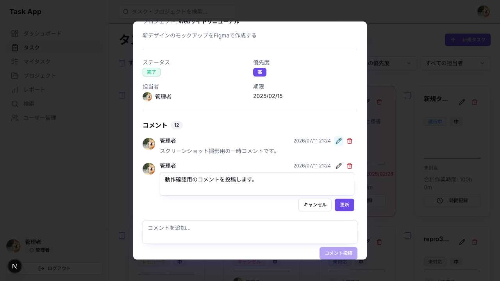
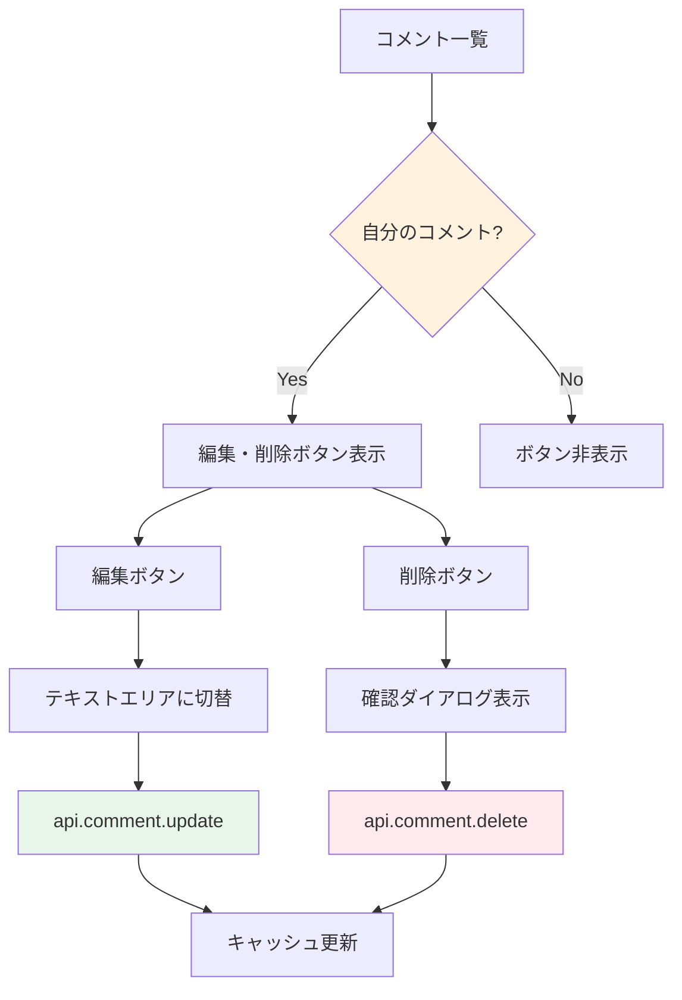

# Day 19: コメント編集・削除を実装しよう

## 🔙 前回の振り返り

Day 18 ではタスク詳細ダイアログのコメント一覧表示と新規投稿の仕組みを読み解きました。コメントの投稿ができるようになったので、今日は投稿済みコメントの編集・削除と権限チェックに取り組みます。

---

## 🎯 今日のゴール

投稿済みのコメントを編集・削除できる仕組みを
理解します。自分が書いたコメントだけを操作できる
権限チェックの実装も確認します。

📸 スクリーンショット: コメント編集モードの画面


## 🤔 なぜこれを作るのか？

誤字の修正や情報の更新に必要な機能です。

> 💡 **例え話**: コメント編集は「ノートの修正」
> です。鉛筆で書いたメモは消しゴムで消して
> 書き直せますが、他人のノートは書き換え不可で
> 「自分のものだけ」という制限が大切です。

### 📐 編集・削除のフロー



### やること / やらないこと

| やること | やらないこと |
|---------|-------------|
| コメント編集 | コメントへの返信 |
| コメント削除 | 一括削除 |
| 本人チェック | 管理者による編集 |
| 確認ダイアログ | 編集履歴 |

### 🆕 新しく学ぶ概念

| 概念 | 読み方 | 役割 | 例え |
|------|--------|------|------|
| editingCommentId | — | 編集中のコメント ID | 開いているノートのページ番号 |
| comment.update | — | コメントを更新する API | ノートの書き直し |
| comment.delete | — | コメントを削除する API | ノートのページを破る |
| DeleteConfirmDialog | — | 削除確認ダイアログ | 「本当に消す？」の確認 |

## 📊 実装ステップ一覧

| ステップ | 作業内容 | 所要時間 |
|---------|---------|---------|
| Step 1 | 編集・削除 API を理解する | 3分 |
| Step 2 | 編集用 state を確認する | 3分 |
| Step 3 | 本人チェックでボタンを表示 | 5分 |
| Step 4 | 編集モードの切り替えを確認 | 5分 |
| Step 5 | 編集 API の呼び出しを確認 | 5分 |
| Step 6 | 削除処理を確認する | 5分 |
| Step 7 | 動作確認 | 3分 |

**合計時間**: 約29分

---

### Step 1: 編集・削除 API を理解する（3分）

🎯 **ゴール**: comment ルーターの
update / delete メソッドを把握します。

VS Code で `src/server/api/routers/comment.ts`
を開いて、`update` と `delete` の定義を
確認しましょう。

💻 **実装**:

```typescript
// filepath: src/server/api/routers/comment.ts
// コメント編集用のバリデーションスキーマ
const commentUpdateSchema = z.object({
  id: z.string().cuid(),
  content: z.string().trim().min(1,
    'コメント内容は必須です'),
});
```

✅ **確認ポイント**:
- 編集時も投稿と同じバリデーションが適用される
- `id` でどのコメントを更新するか指定する

#### comment.update の入力パラメータ

| パラメータ | 型 | バリデーション | 説明 |
|-----------|-----|--------------|------|
| `id` | string (CUID) | `.cuid()` | コメント ID |
| `content` | string | `trim().min(1)` | 新しいコメント本文 |

#### comment.delete の入力パラメータ

| パラメータ | 型 | バリデーション | 説明 |
|-----------|-----|--------------|------|
| `id` | string (CUID) | `.cuid()` | コメント ID |

> 💡 サーバー側では `findCommentAndAssertOwnership`
> で「コメントの作者か」を検証しています。
> 他人のコメントを操作しようとすると FORBIDDEN
> エラーが返ります。

#### サーバー側の権限チェック

| チェック | 失敗時のエラー | 意味 |
|---------|--------------|------|
| コメント存在確認 | NOT_FOUND | コメントが見つからない |
| プロジェクトメンバー確認 | FORBIDDEN | メンバーでない |
| コメント作者確認 | FORBIDDEN | 自分のコメントでない |

✅ **確認ポイント**:
- update と delete のパラメータを把握した
- サーバー側に 3 段階の権限チェックがある

---

### Step 2: 編集用 state を確認する（3分）

🎯 **ゴール**: 「どのコメントを編集中か」を
管理する state を確認します。

💻 **実装**:

```typescript
// filepath: src/component/task/task-detail-dialog.tsx
// 編集・削除用の state と useForm
const [editingCommentId, setEditingCommentId]
  = useState<string | null>(null);
const [deleteCommentDialogOpen,
  setDeleteCommentDialogOpen]
  = useState(false);
const [deleteCommentTargetId,
  setDeleteCommentTargetId]
  = useState<string | null>(null);
```

```typescript
// filepath: src/component/task/task-detail-dialog.tsx
// コメント編集用の react-hook-form
const editCommentForm =
  useForm<EditCommentFormValues>({
    resolver:
      zodResolver(editCommentSchema),
  });
```

✅ **確認ポイント**:
- 3つの state + editCommentForm が定義されている
- ファイルを開いて該当箇所を見つけた

> 💡 `editingCommentId` が `null` なら
> 通常表示、値があれば編集モードです。
> Day 15 で学んだ「モード切替」パターンを
> コメントにも活用しています。

#### state の役割

| state | 型 | 役割 |
|-------|-----|------|
| `editingCommentId` | string \| null | 編集中のコメント ID |
| `editCommentForm` | useForm | 編集中テキストの管理（react-hook-form） |
| `deleteCommentDialogOpen` | boolean | 削除ダイアログの表示 |
| `deleteCommentTargetId` | string \| null | 削除対象の ID |

---

### Step 3: 本人チェックでボタンを表示（5分）

🎯 **ゴール**: 自分のコメントにだけ
編集・削除ボタンを表示する仕組みを確認します。

まずセッション情報の取得を確認しましょう。
`api.auth.getSession` でログインユーザーの ID を
取得しています。

💻 **実装**:

```typescript
// filepath: src/component/task/task-detail-dialog.tsx
// セッション情報の取得（既存コード）
const { data: session } =
  api.auth.getSession.useQuery();
```

✅ **確認ポイント**:
- session からユーザー ID を取得できる

取得した `session?.user?.id` を使って、
各コメントの作者と一致するときだけ
編集・削除ボタンを表示します。

```typescript
// filepath: src/component/task/task-detail-dialog.tsx
// 本人チェックで編集・削除ボタンを表示
{comment.userId === session?.user?.id && (
  <div className="flex gap-1">
    <Button variant="ghost" size="icon"
      className="h-6 w-6"
      onClick={() =>
        handleStartEdit(comment)}>
      <Pencil className="h-3 w-3" />
    </Button>
    <Button variant="ghost" size="icon"
      className="h-6 w-6 text-destructive
        hover:text-destructive"
      onClick={() =>
        handleDeleteComment(comment.id)}>
      <Trash2 className="h-3 w-3" />
    </Button>
  </div>
)}
```

✅ **確認ポイント**:
- 自分のコメントにのみボタンが表示される
- 他人のコメントにはボタンがない

📸 スクリーンショット: 本人コメントに編集・削除ボタンが表示されている


> 💡 `comment.userId` は Day 18 Step 2 の
> 構造テーブルで確認したフィールドです。
> Prisma のリレーションで取得されます。

---

### Step 4: 編集モードの切り替えを確認する（5分）

🎯 **ゴール**: 編集ボタンクリックで
テキストエリアに切り替わる仕組みを確認します。

💻 **実装**:

```typescript
// filepath: src/component/task/task-detail-dialog.tsx
// 編集開始・キャンセルハンドラー
const handleStartEdit = (comment: {
  id: string; content: string;
}) => {
  setEditingCommentId(comment.id);
  editCommentForm.setValue(
    'content', comment.content
  );
};

const handleCancelEdit = () => {
  setEditingCommentId(null);
  editCommentForm.reset();
};
```

✅ **確認ポイント**:
- 編集開始時に既存テキストがセットされる
- キャンセルで state がクリアされる

三項演算子で「編集中のコメントか」を判定し、
編集中はテキストエリアとボタン、通常時はテキストを
表示します。`? (` から `)}` までが 1 つの式です。

```typescript
// filepath: src/component/task/task-detail-dialog.tsx
{editingCommentId === comment.id ? (
  <div className="space-y-2">
    <Textarea
      {...editCommentForm.register('content')}
      className="resize-none" rows={2} />
    <div className="flex gap-2 justify-end">
      <Button variant="outline" size="sm"
        onClick={handleCancelEdit}>
        キャンセル
      </Button>
      <Button size="sm"
        onClick={() => handleSaveEdit(comment.id)}
        disabled={
          !editCommentForm.watch('content').trim()
          || updateCommentMutation.isPending}>
        {updateCommentMutation.isPending
          ? '更新中...' : '更新'}
      </Button>
    </div>
  </div>
) : (
  <p className="text-muted-foreground">
    {comment.content}</p>
)}
```

✅ **確認ポイント**:
- キャンセルで元に戻る
- 更新中はボタンが無効になる

📸 スクリーンショット: 編集モードでテキストエリアが表示されている


> 💡 三項演算子 `? :` で、編集中のコメントだけ
> テキストエリアに切り替えます。
> Day 15 の編集モードと同じパターンです。

---

### Step 5: 編集 API の呼び出しを確認する（5分）

🎯 **ゴール**: コメントの内容を
サーバーに保存する mutation を確認します。

💻 **実装**:

```typescript
// filepath: src/component/task/task-detail-dialog.tsx
// 編集 mutation（既存コード）
const updateCommentMutation =
  api.comment.update.useMutation({
    onSuccess: () => {
      if (taskId) {
        utils.task.getById.invalidate(
          { id: taskId },
        );
      }
      setEditingCommentId(null);
      editCommentForm.reset();
    },
  });
```

✅ **確認ポイント**:
- mutation が定義されている
- `onSuccess` でキャッシュ更新と state クリアを実行

```typescript
// filepath: src/component/task/task-detail-dialog.tsx
// 保存ハンドラー
const handleSaveEdit =
  (commentId: string) => {
    const content = editCommentForm
      .getValues('content').trim();
    if (!content) return;
    updateCommentMutation.mutate({
      id: commentId, content,
    });
  };
```

✅ **確認ポイント**:
- 空白のみの更新を防いでいる
- `trim()` で前後の空白を除去して送信

> 💡 Day 18 のコメント投稿時と同じく
> `task.getById` を invalidate します。
> タスク詳細に含まれるコメントが再取得されます。

#### 編集の処理フロー

| 順番 | 処理 | 目的 |
|------|------|------|
| 1 | 編集ボタンクリック | 既存テキストをセット |
| 2 | テキストエリアで修正 | 内容を変更 |
| 3 | 更新ボタンクリック | サーバーへ送信 |
| 4 | `onSuccess` → `invalidate` | 一覧を再取得 |
| 5 | state クリア | 編集モード終了 |

---

### Step 6: 削除処理を確認する（5分）

🎯 **ゴール**: 確認ダイアログ付きの
削除処理を確認します。

💻 **実装**:

```typescript
// filepath: src/component/task/task-detail-dialog.tsx
// 削除 mutation（既存コード）
const deleteCommentMutation =
  api.comment.delete.useMutation({
    onSuccess: () => {
      if (taskId) {
        utils.task.getById.invalidate(
          { id: taskId },
        );
      }
    },
  });
```

✅ **確認ポイント**:
- 削除成功後にキャッシュが更新される

削除ボタンのクリックで、まず確認ダイアログを
表示します。いきなり削除しません。

```typescript
// filepath: src/component/task/task-detail-dialog.tsx
// 削除ボタンのクリックハンドラー
const handleDeleteComment =
  (commentId: string) => {
    setDeleteCommentTargetId(commentId);
    setDeleteCommentDialogOpen(true);
  };
```

✅ **確認ポイント**:
- 削除ボタンで確認ダイアログが表示される

`DeleteConfirmDialog` は Day 11 で
タスク削除にも使った再利用コンポーネントです。

```typescript
// filepath: src/component/task/task-detail-dialog.tsx
// JSX 内に DeleteConfirmDialog を配置
<DeleteConfirmDialog
  open={deleteCommentDialogOpen}
  onOpenChange={setDeleteCommentDialogOpen}
  onConfirm={() => {
    if (deleteCommentTargetId) {
      deleteCommentMutation.mutate(
        { id: deleteCommentTargetId });
    }
  }}
  isPending={
    deleteCommentMutation.isPending}
  title="コメントを削除しますか？"
/>
```

✅ **確認ポイント**:
- 確認ダイアログが表示される
- OK でコメントが削除される

📸 スクリーンショット: タスク詳細ダイアログのコメントセクション完成画面


> 💡 `DeleteConfirmDialog` は
> `title` prop で確認メッセージを指定できます。
> 取り消せない操作には専用の確認 UI を使いましょう。

#### ダイアログを閉じるタイミング

| タイミング | 処理 |
|-----------|------|
| キャンセル | `onOpenChange` で false |
| 削除成功 | `onOpenChange` で false |
| ダイアログ外クリック | `onOpenChange` で false |

---

### Step 7: 動作確認（3分）

🎯 **ゴール**: 編集・削除の全体を確認します。

1. タスク詳細を開く
2. 自分のコメントに編集・削除ボタンがある
3. 他人のコメントにはボタンがない
4. 編集ボタンでテキストエリア表示
5. 内容を変更して「更新」
6. 更新中は「更新中...」と表示される
7. 更新されたコメントが表示される
8. 削除ボタンで確認ダイアログ表示
9. 確認後にコメントが削除される

```bash
# filepath: ターミナル
# 開発サーバーを起動して動作確認
PORT=3001 npm run dev
```

✅ **確認ポイント**:
- 自分のコメントだけ操作できる
- 編集後に内容が更新される
- 削除後にコメントが消える
- `http://localhost:3001` でアプリが表示される

---


---

### 💡 Pro パターンで書こう — コメント著者チェックを Optional chaining で書く

ここまでで動くコードは書けた。でもプロの現場ではもう一段上の書き方をする。
なぜ上の書き方をするのか、**Before/After** で見比べてみよう。

#### ❌ Before（動くけど、プロは書かない）

```typescript
import { Pencil, Trash2 } from 'lucide-react';
import { Button } from '@/component/ui/button';

type Session = {
  user?: {
    id?: string | null;
  } | null;
} | null;

type CommentItem = {
  id: string;
  userId: string;
  content: string;
};

function canEditComment(
  comment: CommentItem,
  session: Session,
): boolean {
  if (session === null) {
    return false;
  }
  if (session.user === null
    || session.user === undefined) {
    return false;
  }
  if (session.user.id === null
    || session.user.id === undefined) {
    return false;
  }
  return comment.userId === session.user.id;
}

export function CommentActions({
  comment,
  session,
  onEdit,
  onDelete,
}: {
  comment: CommentItem;
  session: Session;
  onEdit: (comment: CommentItem) => void;
  onDelete: (commentId: string) => void;
}) {
  if (!canEditComment(comment, session)) {
    return null;
  }

  return (
    <div className="flex gap-1">
      <Button variant="ghost" size="icon"
        onClick={() => onEdit(comment)}>
        <Pencil className="h-3 w-3" />
      </Button>
      <Button variant="ghost" size="icon"
        onClick={() => onDelete(comment.id)}>
        <Trash2 className="h-3 w-3" />
      </Button>
    </div>
  );
}
```

**このコードの問題点**:

- `session` → `user` → `id` の null チェックが縦に長く、本人チェックの本質が埋もれる
- `null` と `undefined` を毎回手で分けており、同じ形のコードが増えやすい
- 実際に知りたいことは「コメントの `userId` とログインユーザー ID が同じか」だけなのに遠回りしている

#### ✅ After（プロが書くコード）

```typescript
import { Pencil, Trash2 } from 'lucide-react';
import { Button } from '@/component/ui/button';

type Session = {
  user?: {
    id?: string | null;
  } | null;
} | null;

type CommentItem = {
  id: string;
  userId: string;
  content: string;
};

function canEditComment(
  comment: CommentItem,
  session: Session,
): boolean {
  return comment.userId === session?.user?.id;
}

export function CommentActions({
  comment,
  session,
  onEdit,
  onDelete,
}: {
  comment: CommentItem;
  session: Session;
  onEdit: (comment: CommentItem) => void;
  onDelete: (commentId: string) => void;
}) {
  if (!canEditComment(comment, session)) {
    return null;
  }

  return (
    <div className="flex gap-1">
      <Button variant="ghost" size="icon"
        onClick={() => onEdit(comment)}>
        <Pencil className="h-3 w-3" />
      </Button>
      <Button variant="ghost" size="icon"
        onClick={() => onDelete(comment.id)}>
        <Trash2 className="h-3 w-3" />
      </Button>
    </div>
  );
}
```

**このコードの強み**:

- `session?.user?.id` で未ログインや未取得の状態をまとめて安全に扱える
- 本人チェックの条件が1行になり、レビュー時に意図を確認しやすい
- `CommentActions` 側は「編集できなければ何も出さない」という表示ルールだけに集中できる

#### 🎓 覚えておきたいエッセンス

多段の null チェックは Optional chaining で短くできる。
「途中がなければ false でよい」本人確認には、`session?.user?.id` の形がよく合う。

## 📋 今日のまとめ

- [ ] 本人チェックで操作を制限できた
- [ ] `api.comment.update` で編集できた
- [ ] `api.comment.delete` で削除できた
- [ ] 確認ダイアログを表示できた

## ⚠️ つまずきポイント

| エラー / 問題 | 原因 | 解決方法 |
|--------------|------|---------|
| 他人のコメントも編集できる | userId 比較の漏れ | session.user.id 確認 |
| 編集後に更新されない | invalidate 忘れ | task.getById.invalidate |
| キャンセル後に文字が残る | state クリア漏れ | handleCancelEdit で空に |
| 空白で保存できる | trim() チェック漏れ | if (!content.trim()) |
| 削除確認が出ない | DeleteConfirmDialog 未配置 | JSX に追加する |

## 📝 今日学んだ用語

| 用語 | 意味 |
|------|------|
| editingCommentId | 編集中のコメントを特定する state |
| comment.update | コメント内容を更新する API |
| comment.delete | コメントを削除する API |
| DeleteConfirmDialog | 削除確認ダイアログ |
| isPending | mutation 実行中のフラグ |

## 🔜 次回予告

Day 20 では、タスクの検索機能を実装します。
キーワードや複数の条件でタスクを素早く
見つけられるようになります。
