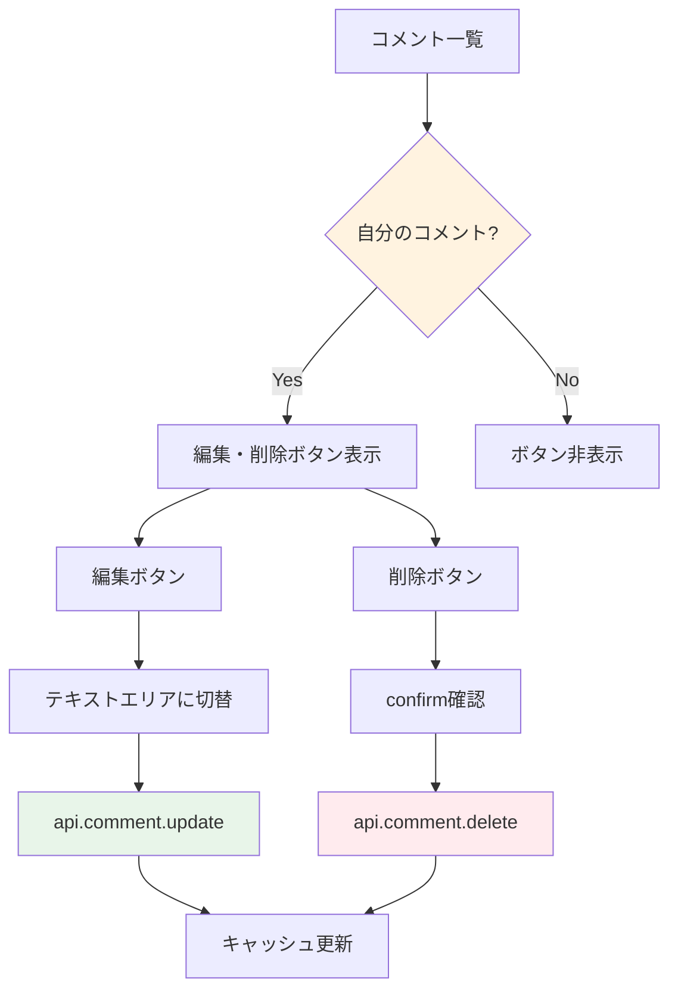

# Day 19: コメント編集・削除を実装しよう

## 🔙 前回の振り返り

Day 18 ではタスク詳細ダイアログにコメント一覧の表示と新規コメント投稿機能を実装しました。コメントの投稿ができるようになったので、今日は投稿済みコメントの編集・削除と権限チェックに取り組みます。

---

## 🎯 今日のゴール

投稿済みのコメントを編集・削除できるようにします。
自分が書いたコメントだけを操作できるように、
権限チェックも実装します。


## 🤔 なぜこれを作るのか？

誤字の修正や情報の更新に必要な機能です。

> 💡 **例え話**: コメント編集は「ノートの修正」
> です。鉛筆で書いたメモは消しゴムで消して
> 書き直せますが、他人のノートは書き換え不可で
> 「自分のものだけ」という制限が大切です。

### 📐 編集・削除のフロー



### やること / やらないこと

| やること | やらないこと |
|---------|-------------|
| コメント編集 | コメントへの返信 |
| コメント削除 | 一括削除 |
| 本人チェック | 管理者による編集 |
| 確認ダイアログ | 編集履歴 |

### 🆕 新しく学ぶ概念

| 概念 | 読み方 | 役割 | 例え |
|------|--------|------|------|
| editingId | — | 編集中のコメントID | 開いているノートのページ番号 |
| comment.update | — | コメントを更新 | ノートの書き直し |
| comment.delete | — | コメントを削除 | ノートのページを破る |

## 📊 実装ステップ一覧

| ステップ | 作業内容 | 所要時間 |
|---------|---------|---------|
| Step 1 | 編集・削除APIを理解する | 3分 |
| Step 2 | 編集用stateを追加する | 3分 |
| Step 3 | 本人チェックでボタンを表示 | 5分 |
| Step 4 | 編集モードに切り替える | 5分 |
| Step 5 | 編集APIを呼び出す | 5分 |
| Step 6 | 削除処理を実装する | 5分 |
| Step 7 | 動作確認 | 3分 |

**合計時間**: 約29分

---

### Step 1: 編集・削除APIを理解する（3分）

🎯 **ゴール**: comment ルーターの
update/delete メソッドを把握します。

```bash
# filepath: ターミナル
# comment ルーターのupdate/deleteを確認する
cat src/server/api/routers/comment.ts | grep -A5 "update\|delete"
```

✅ **確認ポイント**:
- update と delete のパラメータを把握した
#### comment.update の入力パラメータ

| パラメータ | 型 | 必須 | 説明 |
|-----------|-----|------|------|
| `id` | string | ○ | コメントID |
| `content` | string | ○ | 新しいコメント本文 |

#### comment.delete の入力パラメータ

| パラメータ | 型 | 必須 | 説明 |
|-----------|-----|------|------|
| `id` | string | ○ | コメントID |

> 💡 `update` は `id` と新しい `content` だけ
> 渡します。サーバー側で `trim()` と
> `min(1)` のバリデーションが行われます。

✅ **確認ポイント**:
- update と delete のパラメータを把握した

---

### Step 2: 編集用stateを追加する（3分）

🎯 **ゴール**: 「どのコメントを編集中か」を
管理する state を追加します。

💻 **実装**:

```typescript
// filepath: src/app/task/page.tsx
// TaskPageContent内に追加
const [editingCommentId, setEditingCommentId]
  = useState<string | null>(null);
const [editingCommentContent, setEditingCommentContent]
  = useState('');
```

✅ **確認ポイント**:
- 2つの state が追加された

> 💡 `editingCommentId` が `null` なら
> 通常表示、値があれば編集モードです。
> Day 15 で学んだ「モード切替」パターンと
> 同じ考え方です。

#### state の役割

| state | 型 | 役割 |
|-------|-----|------|
| `editingCommentId` | string/null | 編集中のコメントID |
| `editingCommentContent` | string | 編集中のテキスト |

✅ **確認ポイント**:
- 2つの state が追加された

---

### Step 3: 本人チェックでボタンを表示（5分）

🎯 **ゴール**: 自分のコメントにだけ
編集・削除ボタンを表示します。

💻 **実装**:

```typescript
// filepath: src/app/task/page.tsx
// コメント一覧内のアバター横に追加
import { Pencil, Trash2 } from 'lucide-react';
```

```typescript
// filepath: src/app/task/page.tsx
// コメント一覧の各コメントに権限チェック追加
{comment.userId
  === session?.user?.id && (
  <div className="flex gap-1 ml-auto">
    <Button variant="ghost"
      size="icon" className="h-7 w-7"
      onClick={() =>
        handleStartEdit(comment)}>
      <Pencil className="h-3 w-3" />
    </Button>
    <Button variant="ghost"
      size="icon"
      className="h-7 w-7
        text-destructive"
      onClick={() =>
        handleDeleteComment(
          comment.id)}>
      <Trash2 className="h-3 w-3" />
    </Button>
  </div>
)}
```

> 💡 `comment.userId === session?.user?.id`
> で「自分が書いたコメントか」を判定します。
> 他人のコメントにはボタンが表示されません。

✅ **確認ポイント**:
- 自分のコメントにのみボタンが表示される
- 他人のコメントにはボタンがない


---

### Step 4: 編集モードに切り替える（5分）

🎯 **ゴール**: 編集ボタンクリックで
テキストエリアに切り替えます。

💻 **実装**:

```typescript
// filepath: src/app/task/page.tsx
// 編集開始ハンドラー
const handleStartEdit = (comment: {
  id: string; content: string;
}) => {
  setEditingCommentId(comment.id);
  setEditingCommentContent(comment.content);
};

const handleCancelEdit = () => {
  setEditingCommentId(null);
  setEditingCommentContent('');
};
```

```typescript
// filepath: src/app/task/page.tsx
// 編集中: テキストエリアと更新/キャンセルボタン
{editingCommentId === comment.id ? (
  <div className="space-y-2">
    <Textarea
      value={editingCommentContent}
      onChange={(e) =>
        setEditingCommentContent(
          e.target.value)}
      rows={2} />
    <div className="flex gap-2">
      <Button size="sm"
        onClick={() =>
          handleSaveEdit(comment.id)}>
        更新
      </Button>
```

編集中でなければ、通常のコメント本文を表示します。

```typescript
// filepath: src/app/task/page.tsx
// 編集中のキャンセル + 通常表示モード
      <Button size="sm"
        variant="outline"
        onClick={handleCancelEdit}>
        キャンセル
      </Button>
    </div>
  </div>
) : (
  <p className="text-sm mt-1">
    {comment.content}
  </p>
)}
```

> 💡 三項演算子 `? :` で、編集中のコメントだけ
> テキストエリアに切り替えます。
> Day 15 の編集モードと同じパターンです。

✅ **確認ポイント**:
- 編集ボタンでテキストエリアに変わる
- Cancel で元に戻る


---

### Step 5: 編集APIを呼び出す（5分）

🎯 **ゴール**: コメントの内容を
サーバーに保存します。

💻 **実装**:

```typescript
// filepath: src/app/task/page.tsx
// 編集mutationを追加
const updateCommentMutation =
  api.comment.update.useMutation({
    onSuccess: () => {
      if (selectedTask) {
        utils.task.getById.invalidate(
          { id: selectedTask });
      }
      setEditingCommentId(null);
      setEditingCommentContent('');
    },
  });
```

```typescript
// filepath: src/app/task/page.tsx
// 保存ハンドラー
const handleSaveEdit =
  (commentId: string) => {
    if (!editingCommentContent.trim()) return;
    updateCommentMutation.mutate({
      id: commentId,
      content: editingCommentContent,
    });
  };
```

> 💡 Day 18 と同じく `task.getById` を
> invalidate します。タスク詳細に含まれる
> コメントが再取得されて表示が更新されます。

✅ **確認ポイント**:
- 編集内容が保存される
- テキストエリアが閉じる

---

### Step 6: 削除処理を実装する（5分）

🎯 **ゴール**: 確認後にコメントを削除します。

💻 **実装**:

```typescript
// filepath: src/app/task/page.tsx
// 削除mutationを追加
const deleteCommentMutation =
  api.comment.delete.useMutation({
    onSuccess: () => {
      if (selectedTask) {
        utils.task.getById.invalidate(
          { id: selectedTask });
      }
    },
  });
```

```typescript
// filepath: src/app/task/page.tsx
// 削除ハンドラー
const handleDeleteComment =
  (commentId: string) => {
    if (confirm(
      'このコメントを削除しますか？')) {
      deleteCommentMutation.mutate(
        { id: commentId });
    }
  };
```

> 💡 Day 15 で学んだ `confirm()` パターンを
> 再利用しています。取り消せない操作には
> 必ず確認ダイアログを入れましょう。

✅ **確認ポイント**:
- 確認ダイアログが表示される
- OKでコメントが削除される


---

### Step 7: 動作確認（3分）

🎯 **ゴール**: 編集・削除の全体を確認します。

1. タスク詳細を開く
2. 自分のコメントに編集・削除ボタンがある
3. 他人のコメントにはボタンがない
4. 編集ボタンでテキストエリア表示
5. 内容を変更して「更新」
6. 更新されたコメントが表示される
7. 削除ボタンで確認→削除される

✅ **確認ポイント**:
- 自分のコメントだけ操作できる
- 編集後に内容が更新される
- 削除後にコメントが消える

---

```bash
# filepath: ターミナル
# 開発サーバーを起動して動作確認
npm run dev
```

## 📋 今日のまとめ

- [ ] 本人チェックで操作を制限できた
- [ ] `api.comment.update` で編集できた
- [ ] `api.comment.delete` で削除できた
- [ ] 確認ダイアログを表示できた

## ⚠️ つまずきポイント

| エラー / 問題 | 原因 | 解決方法 |
|--------------|------|---------|
| 他人のコメントも編集できる | userId比較の漏れ | session.user.id確認 |
| 編集後に更新されない | invalidate忘れ | task.getById.invalidate |
| キャンセル後に文字が残る | stateクリア漏れ | handleCancelEditで空に |
| 空白で保存できる | trim()チェック漏れ | if (!content.trim()) |

## 📝 今日学んだ用語

| 用語 | 意味 |
|------|------|
| editingCommentId | 編集中のコメントを特定するstate |
| comment.update | コメント内容を更新するAPI |
| comment.delete | コメントを削除するAPI |
| 三項演算子 | 条件で表示を切り替える構文 |

## 🔜 次回予告

Day 20 では、タスクの検索機能を実装します。
キーワードや複数の条件でタスクを素早く
見つけられるようになります。
