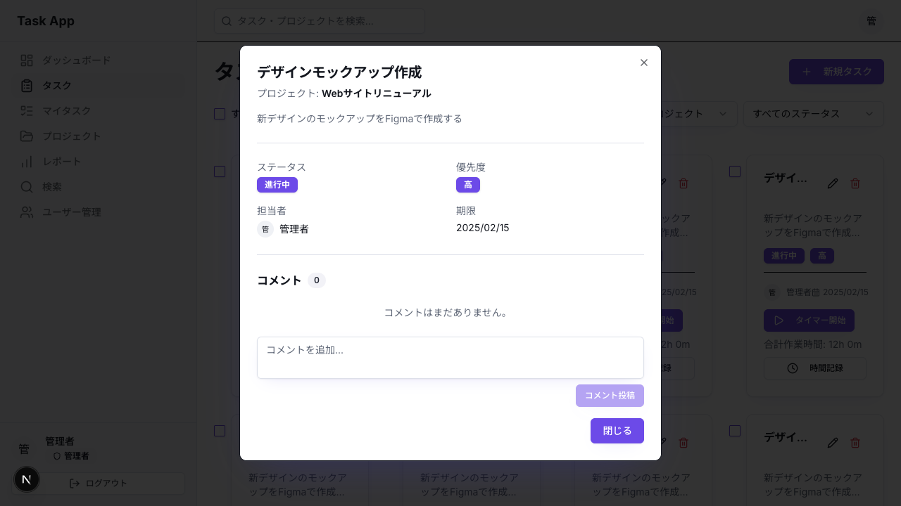
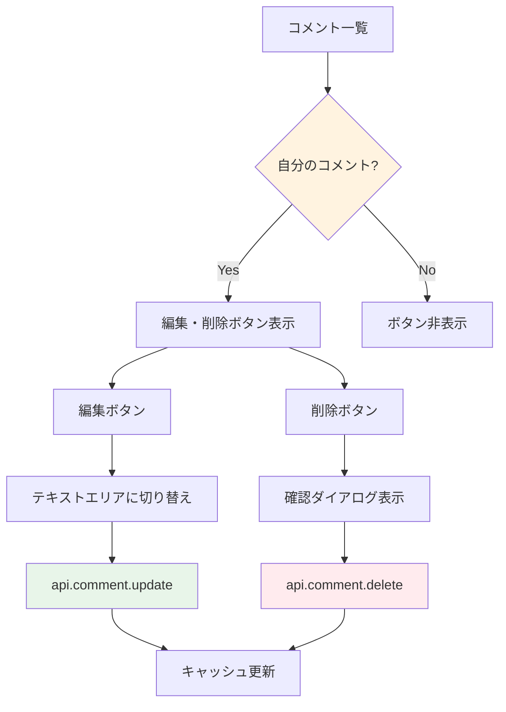

# Day 19: コメント編集・削除を実装しよう

## 前回の振り返り

Day 18 でコメント一覧表示と新規投稿を実装しました。コメントの投稿ができるようになったので、今日は投稿済みコメントの編集・削除と権限チェックを作ります。

---

## 今日のゴール

投稿済みのコメントを編集・削除できる仕組みを
理解します。自分が書いたコメントだけを操作できる
権限チェックの実装も確認します。

スクリーンショット: コメント編集モードの表示を確認してください。


## なぜこれを作るのか

コメントは、書いたあとで直したくなるものです。あとから誤字に気づいたり、状況が変わって内容を変更したくなったりします。投稿したコメントを、本人だけが編集・削除できるようにします。

> **例え話**: コメント編集は「ノートの修正」
> です。鉛筆で書いたメモは消しゴムで消して
> 書き直せますが、他人のノートは書き換え不可で
> 「自分のものだけ」という制限が大切です。

### 編集・削除のフロー


```mermaid
flowchart TD
    A[コメント一覧] --> B{自分のコメント?}
    B -->|Yes| C[編集・削除ボタン表示]
    B -->|No| D[ボタン非表示]
    C --> E[編集ボタン]
    C --> F[削除ボタン]
    E --> G[テキストエリアに切り替え]
    G --> H[api.comment.update]
    F --> I[確認ダイアログ表示]
    I --> J[api.comment.delete]
    H --> K[キャッシュ更新]
    J --> K

    style B fill:#fff3e0
    style H fill:#e8f5e9
    style J fill:#ffebee
```

図の分かれ道（ひし形）は「そのコメントを書いたのが自分かどうか」の判定です。
自分のものなら編集ボタンと削除ボタンを出し、他人のものなら何も出しません。
ただしここで決まるのはボタンを描くかどうかだけで、権限そのものではありません。
ボタンが無くても、リクエストを直接送りつける手段は残るからです。
実際に操作を止めているのは右側の `api.comment.update` と `api.comment.delete` で、
どちらも呼ばれた時点でサーバーがもう一度作者を確かめます。

矢印の合流点も見てください。編集ルートと削除ルートは途中まで別々ですが、
最後は同じ「キャッシュ更新」に着きます。
コメントを投稿したあと一覧がすぐ増えたのと同じ流れです。
編集と削除のどちらでも一覧を取り直すため、画面の表示と保存済みの内容がずれません。

### やること / やらないこと

| やること | やらないこと |
|---------|-------------|
| コメント編集 | コメントへの返信 |
| コメント削除 | 一括削除 |
| 本人チェック | 管理者による編集 |
| 確認ダイアログ | 編集履歴 |

### 新しく学ぶ概念

| 概念 | 読み方 | 役割 | 例え |
|------|--------|------|------|
| editingCommentId | — | 編集中のコメント ID | 開いているノートのページ番号 |
| comment.update | — | コメントを更新する API | ノートの書き直し |
| comment.delete | — | コメントを削除する API | ノートのページを破る |
| DeleteConfirmDialog（Day 15 の復習） | — | 削除確認ダイアログ | 「本当に消すか」の確認 |

## 実装ステップ一覧

| ステップ | 作業内容 | 所要時間 |
|---------|---------|---------|
| Step 1 | 編集・削除 API を理解する | 3分 |
| Step 2 | 編集用 state を確認する | 3分 |
| Step 3 | 本人チェックでボタンを表示 | 5分 |
| Step 4 | 編集モードの切り替えを確認 | 5分 |
| Step 5 | 編集 API の呼び出しを確認 | 5分 |
| Step 6 | 削除処理を確認する | 5分 |
| Step 7 | 動作確認 | 3分 |

**合計時間**: 約29分です。

この時間はコードを読んで理解する目安です。写経して打ち込む時間、詰まって調べる時間は別に見てください。

---

### Step 1: 編集・削除 API を理解する（3分）

**ゴール**: comment ルーターの
update / delete メソッドを把握します。

Day 18 で作った
`src/server/api/routers/comment.ts` に
`update` と `delete` メソッドを追加します。
投稿できるようになったコメントへ、編集と削除の入口を足します。
今日の追記まで終わると、`comment.ts` の編集・削除手続きが完成します。

**実装**:

```typescript
// filepath: src/server/api/routers/comment.ts
// コメント編集用のバリデーションスキーマ
const commentUpdateSchema = z.object({
  id: z.string().cuid(),
  content: z.string().trim().min(1,
    'コメント内容は必須です'),
});
```

**確認ポイント**:
- 編集時も投稿と同じバリデーションが適用される
- `id` でどのコメントを更新するか指定する

次に、コメントの作者かどうかを確かめるヘルパー関数を、Day 18 で書いた `findTaskAndAssertMembership` の下に追加します。

```typescript
// filepath: src/server/api/routers/comment.ts
// findTaskAndAssertMembership の下に追加
const findCommentAndAssertOwnership = async (
  commentId: string,
  userId: string,
  permission?: PermissionKey,
) => {
  const comment = await prisma.comment.findUnique({
    where: { id: commentId },
    select: {
      userId: true,
      task: {
        include: {
          project: {
            include: { members: { where: { userId } } },
          },
        },
      },
    },
  });
```

コメントに紐づくタスク、そのプロジェクト、さらに自分がメンバーかどうかまでを一度に引き当てます。いちばん外側の `select` はコメント自身の項目を `userId` だけに絞っていますが、内側の `include` はタスクとプロジェクトの列をすべて取ってきます。判定に使うのはその一部なので、通信量を詰めたければ内側も `select` に置き換える余地があります。

判定に必要な材料は3つあります。コメントの作者、コメントの置き場所であるプロジェクト、
そしてその人がプロジェクトのメンバーかどうかです。
3回に分けて問い合わせると、その間に別の人がメンバーから外れるような食い違いが起きます。
1回でまとめて取れば、判定に使う材料はすべて同じ瞬間のものになります。

`members: { where: { userId } }` の書き方にも意味があります。
メンバー全員ではなく、自分の分だけを取り出しています。
自分がメンバーなら要素を1つ持つ配列、メンバーでなければ空の配列になります。
このあとの判定は「配列が空かどうか」を見るだけで済みます。

```typescript
// filepath: src/server/api/routers/comment.ts（続き）
  if (!comment) {
    throw new TRPCError({
      code: 'NOT_FOUND',
      message: 'コメントが見つかりません',
    });
  }

  assertMemberPermission(
    comment.task.project.members, permission,
  );

  if (comment.userId !== userId) {
    throw new TRPCError({
      code: 'FORBIDDEN',
      message: '自分のコメントのみ編集・削除できます',
    });
  }

  return comment;
};
```

チェックは2段階です。まずプロジェクトのメンバーかを確かめ、次に「そのコメントの作者本人か」を確かめます。メンバーでも他人のコメントは編集・削除できないよう、`comment.userId !== userId` で弾きます。

続いて、Day 18 で書いた `commentRouter` の中（`create` の後、閉じる `});` の前）に `update` と `delete` を追加します。

```typescript
// filepath: src/server/api/routers/comment.ts
// commentRouter の create の後、}); の前に追加
  update: protectedProcedure
    .input(commentUpdateSchema)
    .mutation(async ({ ctx, input }) => {
      const { id, ...data } = input;
      await findCommentAndAssertOwnership(id, ctx.session.userId, 'canEdit');
      return await prisma.comment.update({
        where: { id },
        data,
        include: { user: { select: USER_SELECT } },
      });
    }),
  delete: protectedProcedure
    .input(z.object({ id: z.string().cuid() }))
    .mutation(async ({ ctx, input }) => {
      await findCommentAndAssertOwnership(
        input.id, ctx.session.userId, 'canEdit',
      );
      await prisma.comment.delete({
        where: { id: input.id },
      });
      return { success: true };
    }),
```

`update` は本文だけを書き換え、`delete` はコメントごと消します。権限の判定は `src/server/api/routers/comment.ts` の `findCommentAndAssertOwnership` が担います。どちらも「メンバーかつ作者本人か」を確かめてから実行するので、他人のコメントは操作できません。

#### comment.update の入力パラメータ

| パラメータ | 型 | バリデーション | 説明 |
|-----------|-----|--------------|------|
| `id` | string (CUID) | `.cuid()` | コメント ID |
| `content` | string | `trim().min(1)` | 新しいコメント本文 |

#### comment.delete の入力パラメータ

| パラメータ | 型 | バリデーション | 説明 |
|-----------|-----|--------------|------|
| `id` | string (CUID) | `.cuid()` | コメント ID |

> サーバー側では `findCommentAndAssertOwnership`
> で「コメントの作者か」を検証しています。
> 他人のコメントを操作しようとすると FORBIDDEN
> エラーが返ります。

#### サーバー側の権限チェック

| チェック | 失敗時のエラー | 意味 |
|---------|--------------|------|
| コメント存在確認 | NOT_FOUND | コメントが見つからない |
| プロジェクトメンバー確認 | FORBIDDEN | メンバーでない |
| コメント作者確認 | FORBIDDEN | 自分のコメントでない |

**確認ポイント**:
- update と delete のパラメータを把握した
- サーバー側に 3 段階の権限チェックがある

---

### Step 2: 編集用 state を追加する（3分）

**ゴール**: 「どのコメントを編集中か」を
管理する state とフォームを追加します。

まず、編集ボタン、削除ボタン、確認ダイアログ、
state に必要なインポートを追加します。

```typescript
// filepath: src/component/task/task-detail-dialog.tsx
// コメント編集・削除で使うインポート
import { Pencil, Trash2 } from 'lucide-react';
import { useState } from 'react';
import { DeleteConfirmDialog }
  from '@/component/ui/delete-confirm-dialog';
```

`Pencil` と `Trash2` は lucide-react のアイコンです。
鉛筆が編集、ゴミ箱が削除を表します。
「編集」「削除」と文字で並べるとコメント1件あたりの高さが増えて、
本文よりボタンのほうが目立ってしまうため、小さなアイコンボタンにしています。
`useState` は「いまどのコメントを編集中か」をコンポーネントへ覚えさせるために使います。
`DeleteConfirmDialog` はタスク削除で使ったのと同じ確認ダイアログで、
Day 11 で作ったものをそのまま読み込みます。
削除は取り消せない操作なので、確認を挟む部品は作り直さず共有します。

Day 18 の `commentSchema` の下に、
編集フォーム用のスキーマと型を追加します。

```typescript
// filepath: src/component/task/task-detail-dialog.tsx
// コメント編集用 zod スキーマ定義
const editCommentSchema = z.object({
  content: z.string().trim()
    .min(1, 'コメントを入力してください'),
});
type EditCommentFormValues =
  z.infer<typeof editCommentSchema>;
```

名前の付け方には決まりがあります。サーバー側の入力ルールは `commentCreateSchema` のように「対象 + 操作 + Schema」、画面側のフォーム用は `editCommentSchema` のように「操作 + 対象 + Schema」にしています。同じ形にすると、どちらのファイルの話をしているのか読み分けられなくなるためです。

Step 1 の `commentUpdateSchema` とよく似ていますが、こちらは画面側の担当です。
テキストエリアが空のまま更新ボタンを押しても送信させず、
その場で「コメントを入力してください」と出すために使います。
`id` が入っていないのは、どのコメントを更新するかを
保存ボタンのハンドラーが引数で渡すからです。

サーバー側のチェックと二重になっているように見えますが、
片方を消してよいという意味ではありません。
ブラウザ側の検証は開発者ツールから回避できるため、
空の本文がサーバーへ届く可能性は残ります。
それを最後に止めるのが Step 1 の `commentUpdateSchema` です。
画面側は入力中の人へ早く知らせるため、サーバー側は不正な保存を防ぐためにあります。

**実装**:

```typescript
// filepath: src/component/task/task-detail-dialog.tsx
// 編集・削除用の state と useForm
const [editingCommentId, setEditingCommentId]
  = useState<string | null>(null);
const [deleteCommentDialogOpen,
  setDeleteCommentDialogOpen]
  = useState(false);
const [deleteCommentTargetId,
  setDeleteCommentTargetId]
  = useState<string | null>(null);
```

state を3つに分けたのには理由があります。
`editingCommentId` が指すのは編集中の1件、
`deleteCommentTargetId` が指すのは削除しようとしている1件で、
同じコメントとは限りません。
削除の確認ダイアログを出しているあいだ、別のコメントを編集中でも構わないからです。

開閉フラグと対象 ID を分けている点も大事です。
もしフラグだけにすると、ダイアログの「削除する」を押した瞬間に
どのコメントを消すのかが分かりません。
押してから対象を探すのでは遅いので、削除ボタンを押した時点で ID を控えておきます。
`null` は「まだ対象が決まっていない」という意味で、初期値に置いています。

```typescript
// filepath: src/component/task/task-detail-dialog.tsx
// コメント編集用の react-hook-form
const editCommentForm =
  useForm<EditCommentFormValues>({
    resolver:
      zodResolver(editCommentSchema),
  });
```

**確認ポイント**:
- 3つの state + editCommentForm が定義されている
- コードを追加できた

> `editingCommentId` が `null` なら
> 通常表示、値があれば編集モードです。
> Day 15 で学んだ「モード切り替え」パターンを
> コメントにも活用しています。

#### state の役割

| state | 型 | 役割 |
|-------|-----|------|
| `editingCommentId` | string \| null | 編集中のコメント ID |
| `editCommentForm` | useForm | 編集中テキストの管理（react-hook-form） |
| `deleteCommentDialogOpen` | boolean | 削除ダイアログの表示 |
| `deleteCommentTargetId` | string \| null | 削除対象の ID |

---

### Step 3: 本人チェックでボタンを表示（5分）

**ゴール**: 自分のコメントにだけ
編集・削除ボタンを表示する仕組みを確認します。

まずセッション情報の取得を確認しましょう。
`api.auth.getSession` でログインユーザーの ID を
取得します。

**実装**:

```typescript
// filepath: src/component/task/task-detail-dialog.tsx
// セッション情報の取得を追加
const { data: session } =
  api.auth.getSession.useQuery();
```

ログイン中の人が誰かは、ブラウザ側では分かりません。
`api.auth.getSession` でサーバーへ問い合わせて、はじめて自分の ID が手に入ります。
この ID とコメントの `userId` を突き合わせるのが、本人判定の中身です。

編集・削除できるのは、そのコメントを書いた本人だけです。
同じプロジェクトのメンバーでも、他人のコメントには触れません。
そして本人判定は、ここで1回、サーバーでもう1回、合計2回行われます。
ここでの判定はボタンを描くかどうかを決めるだけで、守りの役目は持っていません。
ブラウザで動くコードは書き換えられるので、
`comment.userId === session?.user?.id` の行を消せばボタンは出せてしまいます。
それでも他人のコメントは変えられません。
Step 1 の `findCommentAndAssertOwnership` が、届いたリクエストごとに作者を確かめ、
一致しなければ FORBIDDEN を返して処理を止めるからです。

**確認ポイント**:
- session からユーザー ID を取得できる

取得した `session?.user?.id` を使って、
各コメントの作者と一致するときだけ
編集・削除ボタンを表示します。

先に、Day 18 で書いた日時の `<span>` を
`<div className="flex items-center gap-2">` で
包んでください。この箱が無いと、外側の
`justify-between` が日時とボタンを画面の両端へ
引き離します。次のコードは、その箱の中、
日時の下へ貼ります。

```typescript
{/* filepath: src/component/task/task-detail-dialog.tsx */}
{/* 本人チェックで編集・削除ボタンを表示 */}
{comment.userId === session?.user?.id && (
  <div className="flex gap-1">
    <Button variant="ghost" size="icon"
      className="h-6 w-6"
      aria-label="自分のコメントを編集"
      onClick={() =>
        handleStartEdit(comment)}>
      <Pencil className="h-3 w-3" />
    </Button>
    <Button variant="ghost" size="icon"
      className="h-6 w-6 text-destructive
        hover:text-destructive"
      aria-label="自分のコメントを削除"
      onClick={() =>
        handleDeleteComment(comment.id)}>
      <Trash2 className="h-3 w-3" />
    </Button>
  </div>
)}
```

2つのボタンはアイコンだけなので、`aria-label` で名前を付けています。コメントが並ぶと名前の無いボタンが2個ずつ続き、押す前にどちらが削除か分かりません。削除は取り消せません。

ここで使っている `handleStartEdit` と `handleDeleteComment` は、
このあとの Step で定義します。定義するまでこの画面は表示できません。

2つのハンドラーを書いたあとで、次の2点を確かめます。

**確認ポイント**:
- 自分のコメントにのみボタンが表示される
- 他人のコメントにはボタンがない

スクリーンショット: 本人のコメントにだけ編集・削除ボタンが並ぶ表示を確認してください。


画像はコメントが1件も無いときの姿です。自分の書いたコメントがあれば、
その行の右側にペンとゴミ箱のアイコンが並びます。
> `comment.userId` は Day 18 Step 1 の
> 構造テーブルで確認したフィールドです。
> Prisma のリレーションで取得されます。

---

### Step 4: 編集モードの切り替えを確認する（5分）

**ゴール**: 編集ボタンクリックで
テキストエリアに切り替わる仕組みを確認します。

**実装**:

```typescript
// filepath: src/component/task/task-detail-dialog.tsx
// 編集開始・キャンセルハンドラー
const handleStartEdit = (comment: {
  id: string; content: string;
}) => {
  setEditingCommentId(comment.id);
  editCommentForm.setValue(
    'content', comment.content
  );
};

const handleCancelEdit = () => {
  setEditingCommentId(null);
  editCommentForm.reset();
};
```

**確認ポイント**:
- 編集開始時に既存テキストがセットされる
- キャンセルで state がクリアされる

三項演算子で「編集中のコメントか」を判定し、
編集中はテキストエリアとボタン、通常時はテキストを
表示します。`? (` から `)}` までが 1 つの式です。

```typescript
{/* filepath: src/component/task/task-detail-dialog.tsx */}
{editingCommentId === comment.id ? (
  <div className="space-y-2">
    <Textarea
      {...editCommentForm.register('content')}
      className="resize-none" rows={2} />
    <div className="flex gap-2 justify-end">
      <Button variant="outline" size="sm"
        onClick={handleCancelEdit}>
        キャンセル
      </Button>
      <Button size="sm"
        onClick={() => handleSaveEdit(comment.id)}
        disabled={
          !editCommentForm.watch('content').trim()
          || updateCommentMutation.isPending}>
        {updateCommentMutation.isPending
          ? '更新中...' : '更新'}
      </Button>
    </div>
  </div>
) : (
  <p className="text-muted-foreground">
    {comment.content}</p>
)}
```

ここで使っている `handleSaveEdit` と `updateCommentMutation` は、
Step 5 で定義します。定義するまでこの画面は表示できません。

**確認ポイント**:
- 保存ボタンの `disabled` に `updateCommentMutation.isPending` を入れた
- 更新中のラベルを `'更新中...'` へ切り替える形にした

キャンセルで元に戻る動きは、Step 5 で定義を足してから確かめます。
更新中のボタンが無効になる動きも同じです。
編集モードの画面を目で見るのも Step 5 のあとになります。

> 三項演算子 `? :` で、編集中のコメントだけ
> テキストエリアに切り替えます。
> Day 15 の編集モードと同じパターンです。

---

### Step 5: 編集 API の呼び出しを確認する（5分）

**ゴール**: コメントの内容を
サーバーに保存する mutation を確認します。

**実装**:

```typescript
// filepath: src/component/task/task-detail-dialog.tsx
// 編集 mutation を追加
const updateCommentMutation =
  api.comment.update.useMutation({
    onSuccess: () => {
      if (taskId) {
        utils.task.getById.invalidate(
          { id: taskId },
        );
      }
      setEditingCommentId(null);
      editCommentForm.reset();
    },
  });
```

`onSuccess` が動くのは、サーバーが更新を受け付けて返事をしたあとだけです。
そこで2つのことをしています。
`invalidate` は「手元に持っているタスク詳細のデータはもう古い」という印を付ける命令で、
印が付くと tRPC が `task.getById` を取り直し、保存後の本文でコメント一覧を描き直します。
コメントはタスク詳細の一部として届くので、コメント専用の再取得は要りません。

`invalidate` を書き忘れると、保存自体は成功しているのに画面の文字が変わりません。
読者からは「更新ボタンが効いていない」ように見えますが、
ページを再読み込みすると新しい本文が出てきます。
この見え方をしたら、疑うのは保存処理ではなく再取得の呼び出しです。

続く2行で編集モードを閉じています。
`setEditingCommentId(null)` でテキストエリアを通常表示へ戻し、
`editCommentForm.reset()` で入力内容を捨てます。
この2行が無いと、保存後もテキストエリアが開いたまま残ります。

**確認ポイント**:
- mutation が定義されている
- `onSuccess` でキャッシュ更新と state クリアを実行

```typescript
// filepath: src/component/task/task-detail-dialog.tsx
// 保存ハンドラー
const handleSaveEdit =
  (commentId: string) => {
    const content = editCommentForm
      .getValues('content').trim();
    if (!content) return;
    updateCommentMutation.mutate({
      id: commentId, content,
    });
  };
```

**確認ポイント**:
- 空白のみの更新を防いでいる
- `trim()` で前後の空白を除去して送信

Step 4 で書いた編集モードが、ここでようやく動きます。タスク詳細を開いて自分のコメントの編集ボタンを押すと、その行だけテキストエリアに変わります。キャンセルを押せば元の表示へ戻ります。


> Day 18 のコメント投稿時と同じく
> `task.getById` を invalidate します。
> タスク詳細に含まれるコメントが再取得されます。

#### 編集の処理フロー

| 順番 | 処理 | 目的 |
|------|------|------|
| 1 | 編集ボタンクリック | 既存テキストをセット |
| 2 | テキストエリアで修正 | 内容を変更 |
| 3 | 更新ボタンクリック | サーバーへ送信 |
| 4 | `onSuccess` → `invalidate` | 一覧を再取得 |
| 5 | state クリア | 編集モード終了 |

---

### Step 6: 削除処理を確認する（5分）

**ゴール**: 確認ダイアログ付きの
削除処理を確認します。

**実装**:

```typescript
// filepath: src/component/task/task-detail-dialog.tsx
// 削除 mutation を追加
const deleteCommentMutation =
  api.comment.delete.useMutation({
    onSuccess: () => {
      if (taskId) {
        utils.task.getById.invalidate(
          { id: taskId },
        );
      }
    },
  });
```

削除後にやることは編集と同じ `invalidate` ひとつです。
編集では state のクリアも必要でしたが、削除では編集モードに入っていないので要りません。
消えたコメントはサーバーから返ってこなくなるため、取り直した一覧から自然に姿を消します。

ここで `invalidate` を落とすと、消したはずのコメントが画面に残り続けます。
残った行の編集ボタンを押して更新すると、
サーバーは元のコメントを見つけられず NOT_FOUND を返します。
Step 1 で `findCommentAndAssertOwnership` に存在確認を入れたのは、この場面のためです。

**確認ポイント**:
- 削除成功後にキャッシュが更新される

削除ボタンのクリックで、まず確認ダイアログを
表示します。いきなり削除しません。

```typescript
// filepath: src/component/task/task-detail-dialog.tsx
// 削除ボタンのクリックハンドラー
const handleDeleteComment =
  (commentId: string) => {
    setDeleteCommentTargetId(commentId);
    setDeleteCommentDialogOpen(true);
  };
```

**確認ポイント**:
- 削除ボタンで確認ダイアログが表示される

`DeleteConfirmDialog` は Day 11 で
タスク削除にも使った再利用コンポーネントです。

その前に、ダイアログを閉じる処理を1か所にまとめます。

```typescript
// filepath: src/component/task/task-detail-dialog.tsx
const handleClose = () => {
  commentForm.reset();
  editCommentForm.reset();
  setEditingCommentId(null);
  setDeleteCommentDialogOpen(false);
  setDeleteCommentTargetId(null);
  onClose();
};
```

`onClose` だけを呼ぶと、書きかけのコメントと編集中のコメント ID が残ったままになります。
次に同じタスクを開いたとき、前回の下書きとテキストエリアがそのまま現れ、読者は今どの操作の途中なのか分からなくなります。
片付けを `onClose` の手前へ集めておけば、閉じ方が増えても同じ初期状態へ戻せます。

タスク詳細と削除確認の2つのダイアログを並べるため、
`return` 直後の既存コードを次の形に変えます。
`<>` と `</>` は、複数の要素をまとめる Fragment です。

```typescript
// filepath: src/component/task/task-detail-dialog.tsx
return (
  <>
    <Dialog open={open}
      onOpenChange={(isOpen) =>
        !isOpen && handleClose()}>
```

`onOpenChange` は、背景をクリックしたときや Esc キーを押したときにも呼ばれます。ここを `onClose` のままにすると、閉じ方によって片付けが行われたり行われなかったりします。同じ理由で、`閉じる` ボタンも `handleClose` に差し替えます。

```typescript
{/* filepath: src/component/task/task-detail-dialog.tsx */}
<DialogFooter>
  <Button onClick={handleClose}>
    閉じる
  </Button>
</DialogFooter>
```

コンポーネントが `return` で返せる要素は1つだけ、というルールがあります。
タスク詳細の `Dialog` と削除確認のダイアログを並べて返そうとすると、
返す要素が2つになってしまい、保存した瞬間にエラーで画面が真っ白になります。
`<>` で包むと2つをまとめて1つとして返せます。
`div` で包んでも同じ効果は得られますが、`<>` なら画面に余計な入れ物を1つも増やしません。

既存のタスク詳細ダイアログを閉じる `</Dialog>` の直後、
`</>` の前に削除確認ダイアログを配置します。

```typescript
{/* filepath: src/component/task/task-detail-dialog.tsx */}
{/* 既存の </Dialog> の直後に配置 */}
    <DeleteConfirmDialog
      open={deleteCommentDialogOpen}
      onOpenChange={setDeleteCommentDialogOpen}
      onConfirm={() => {
        if (deleteCommentTargetId) {
          deleteCommentMutation.mutate(
            { id: deleteCommentTargetId });
        }
      }}
      isPending={
        deleteCommentMutation.isPending}
      title="コメントを削除しますか？"
    />
  </>
```

**確認ポイント**:
- 確認ダイアログが表示される
- OK でコメントが削除される
- `Dialog` と `DeleteConfirmDialog` が Fragment 内で並ぶ

スクリーンショット: タスク詳細ダイアログのコメントセクション完成の表示を確認してください。


> `DeleteConfirmDialog` は
> `title` prop で確認メッセージを指定できます。
> 取り消せない操作には専用の確認 UI を使いましょう。

#### ダイアログを閉じるタイミング

| タイミング | 処理 |
|-----------|------|
| キャンセル | `onOpenChange` で false |
| 削除成功 | `onOpenChange` で false |
| ダイアログ外クリック | `onOpenChange` で false |

---

### Step 7: 動作確認（3分）

**ゴール**: 編集・削除の全体を確認します。

1. タスク詳細を開く
2. 自分のコメントに編集・削除ボタンがある
3. 他人のコメントにはボタンがない
4. 編集ボタンでテキストエリア表示
5. 内容を変更して「更新」
6. 更新中は「更新中...」と表示される
7. 更新されたコメントが表示される
8. 削除ボタンで確認ダイアログ表示
9. 確認後にコメントが削除される

```bash
# filepath: ターミナル
# 開発サーバーを起動して動作確認
PORT=3001 npm run dev
```

初期データの「データベース設計」タスクには、別のユーザーの書いたコメントが1件入っています。そのタスクを開くと、自分の行にだけアイコンが2つ並び、相手の行には何も出ません。
他人のコメントにボタンが出ないことを目で確かめたい場合は、
Day 12 で同じプロジェクトに追加したメンバーのアカウントでコメントを1件残し、
自分のアカウントに戻ってから一覧を開いてください。
自分の行にはアイコンが2つ並び、相手の行には何も並びません。

サーバー側の防御まで確かめたくなったら、
`comment.userId === session?.user?.id` を一時的に `true` に書き換えてみてください。
他人のコメントにもボタンが出ますが、更新を押しても本文は変わりません。
画面にエラーは出ません。サーバーが黙って拒否しているためです。
止めているのは Step 1 で書いた作者チェックです。
確認が終わったら、書き換えた行は必ず元に戻してください。

**確認ポイント**:
- 自分のコメントだけ操作できる
- 編集後に内容が更新される
- 削除後にコメントが消える
- `http://localhost:3001` でアプリが表示される
- 一時的に `true` へ書き換えた `comment.userId === session?.user?.id` を元の式に戻した

---

### Pro パターンで書こう（コメント著者チェックを Optional chaining で書く）

本人のコメントか確認するときは、
`session`、`user`、`id` が未取得の可能性を考えます。
`session?.user?.id` と書くと、未ログイン時も安全に比較できます。

| 書き方 | 意味 |
|--------|------|
| `session.user.id` | session が必ずある前提 |
| `session?.user?.id` | 途中がなければ `undefined` |

**覚えておきたいこと**: 途中がないかもしれない値には `?.` を使います。

## 完成コード全体

今日は2つのファイルを触りました。Step 1 でサーバー側へ編集と削除の手続きを足し、Step 2 から Step 6 でタスク詳細ダイアログへ本人チェックと編集モードを組み込んでいます。断片を貼り重ねる作業が続いたので、途中でどこへ貼ったか分からなくなった場合は、以下のコードを上から順に貼り付けて、各ファイルを置き換えてください。1つのファイルが複数のブロックに分かれている場合は、そのファイルの見出しの下にあるブロックを、出てくる順につなげたものが全文です。上から順に読めば、書いた断片が1つのファイルへどう収まったかを確かめられます。

| ファイル | 役割 | 対応する Step |
|---------|------|--------------|
| `src/server/api/routers/comment.ts` | コメントの取得・投稿・編集・削除の手続き | Step 1 |
| `src/component/task/task-detail-dialog.tsx` | タスク詳細とコメント欄 | Step 2 から Step 6 |

どちらも Day 18 で書いたものへ足す形なので、Day 18 の分もあわせた全文を載せます。

### `src/server/api/routers/comment.ts`

**インポートと2つの入力スキーマ**:

```typescript
// filepath: src/server/api/routers/comment.ts
// 完成版: インポートと2つの入力スキーマ
import { TRPCError } from '@trpc/server';
import { z } from 'zod';
import type { PermissionKey } from '@/lib/constant/roles';
import { prisma } from '@/lib/prisma';
import { createTRPCRouter, protectedProcedure } from '../trpc';
import { assertMemberPermission } from './_helpers/permission';
import { USER_SELECT } from './_helpers/select';

const commentCreateSchema = z.object({
  content: z.string().trim().min(1, 'コメント内容は必須です'),
  taskId: z.string().cuid(),
});

const commentUpdateSchema = z.object({
  id: z.string().cuid(),
  content: z.string().trim().min(1, 'コメント内容は必須です'),
});
```

2つのスキーマの違いは、`taskId` を持つか `id` を持つかだけです。投稿はどのタスクへぶら下げるかを決める必要があり、編集はどのコメントを書き換えるかを決める必要があります。`content` のルールをそろえてあるので、投稿では通るのに編集では弾かれる、という食い違いは起きません。

**タスクと自分のメンバー行の取得**:

```typescript
// filepath: src/server/api/routers/comment.ts（同じファイルの続き）
// 完成版: タスクと自分のメンバー行の取得
const findTaskAndAssertMembership = async (
  taskId: string,
  userId: string,
  permission?: PermissionKey,
) => {
  const task = await prisma.task.findUnique({
    where: { id: taskId },
    include: {
      project: {
        include: {
          members: { where: { userId } },
        },
      },
    },
  });

  if (!task) {
    throw new TRPCError({
      code: 'NOT_FOUND',
      message: 'タスクが見つかりません',
    });
  }
```

Day 18 で書いた関数をそのまま残します。今日足す `update` と `delete` はコメントの ID を受け取るため、この関数ではなく次の関数を使います。同じ役割の関数を2つ並べているように見えますが、入口が task か comment かで探す対象が違います。先に `task` の `null` を弾くのは、続く行で `task.project` を読むためです。

**メンバー確認の締めくくり**:

```typescript
// filepath: src/server/api/routers/comment.ts（同じファイルの続き）
// 完成版: メンバー確認の締めくくり
  assertMemberPermission(task.project.members, permission);

  return task;
};
```

`assertMemberPermission` が見ているのは、1つ前のブロックで本人分だけに絞った `members` の1件目です。本人がメンバーでなければ配列は空になり、1件目は `undefined` になるため `FORBIDDEN` を投げます。確認を通ったタスクをそのまま返すので、呼び出し側は1行書くだけで存在と権限の両方を済ませられます。

**コメントと作者情報の取得**:

```typescript
// filepath: src/server/api/routers/comment.ts（同じファイルの続き）
// 完成版: コメントと作者情報の取得
const findCommentAndAssertOwnership = async (
  commentId: string,
  userId: string,
  permission?: PermissionKey,
) => {
  const comment = await prisma.comment.findUnique({
    where: { id: commentId },
    select: {
      userId: true,
      task: {
        include: {
          project: {
            include: {
              members: { where: { userId } },
            },
          },
        },
      },
    },
  });
```

判定に必要な材料は、コメントの作者、置き場所のプロジェクト、そして自分がそこのメンバーかどうかの3つです。3回に分けて問い合わせると、その合間に誰かがメンバーから外れるような食い違いが起きます。1回でまとめて取れば、判定に使う材料はすべて同じ瞬間のものになります。外側の `select` でコメント自身の列を `userId` だけに絞っているのは、本文の中身を判定に使わないためです。

**存在確認と作者確認**:

```typescript
// filepath: src/server/api/routers/comment.ts（同じファイルの続き）
// 完成版: 存在確認と作者確認
  if (!comment) {
    throw new TRPCError({
      code: 'NOT_FOUND',
      message: 'コメントが見つかりません',
    });
  }

  assertMemberPermission(comment.task.project.members, permission);

  if (comment.userId !== userId) {
    throw new TRPCError({
      code: 'FORBIDDEN',
      message: '自分のコメントのみ編集・削除できます',
    });
  }

  return comment;
};
```

確認は3段です。コメントが存在するか、その人がプロジェクトのメンバーか、そのコメントの作者本人か、の順で見ます。メンバー確認だけで済ませると、同じプロジェクトの別の人が他人のコメントを書き換えられてしまいます。逆に作者確認だけにすると、プロジェクトから外れた人が過去の自分のコメントを操作できてしまいます。2つは別のことを守っているため、片方だけでは足りません。

**getByTaskId によるコメント一覧**:

```typescript
// filepath: src/server/api/routers/comment.ts（同じファイルの続き）
// 完成版: getByTaskId によるコメント一覧
export const commentRouter = createTRPCRouter({
  getByTaskId: protectedProcedure
    .input(z.object({ taskId: z.string().cuid() }))
    .query(async ({ ctx, input }) => {
      await findTaskAndAssertMembership(input.taskId, ctx.session.userId);

      return await prisma.comment.findMany({
        where: { taskId: input.taskId },
        include: {
          user: {
            select: USER_SELECT,
          },
        },
        orderBy: { createdAt: 'desc' },
      });
    }),
```

読み取りだけの手続きなので、権限キーを渡していません。参加者であれば誰でもコメントを読めます。編集権限まで求めると、閲覧だけを任されたメンバーがやりとりの経緯を追えなくなります。守りの強さは手続きごとに変えるもので、いちばん厳しい設定を全部へ当てはめると使えない画面ができあがります。

**create によるコメントの保存**:

```typescript
// filepath: src/server/api/routers/comment.ts（同じファイルの続き）
// 完成版: create によるコメントの保存
  create: protectedProcedure.input(commentCreateSchema).mutation(async ({ ctx, input }) => {
    await findTaskAndAssertMembership(input.taskId, ctx.session.userId, 'canEdit');

    return await prisma.comment.create({
      data: {
        content: input.content,
        taskId: input.taskId,
        userId: ctx.session.userId,
      },
      include: {
        user: {
          select: USER_SELECT,
        },
      },
    });
  }),
```

投稿者を `ctx.session.userId` から取るのは、フォーム経由で他人の ID を送られても信用しないためです。入力スキーマに `userId` が無いので、ブラウザ側から投稿者を指定する手段そのものがありません。この1行が、今日書いた作者チェックの土台になります。作者が信用できる値で保存されていなければ、あとから本人かどうかを確かめても意味がありません。

**update による本文の書き換え**:

```typescript
// filepath: src/server/api/routers/comment.ts（同じファイルの続き）
// 完成版: update による本文の書き換え
  update: protectedProcedure.input(commentUpdateSchema).mutation(async ({ ctx, input }) => {
    const { id, ...data } = input;
    await findCommentAndAssertOwnership(id, ctx.session.userId, 'canEdit');

    return await prisma.comment.update({
      where: { id },
      data,
      include: {
        user: {
          select: USER_SELECT,
        },
      },
    });
  }),
```

`const { id, ...data } = input;` で `id` だけを取り出し、残りを `data` にまとめています。`where` には探すための `id`、`data` には書き換える中身が入るので、2つは行き先が違います。この書き方にしておくと、あとで編集できる項目が増えたときも `data` の中身が自動で追随します。1つずつ書き写すと、項目を足すたびにこの行を直す必要が出てきます。

**delete によるコメントの削除**:

```typescript
// filepath: src/server/api/routers/comment.ts（同じファイルの続き）
// 完成版: delete によるコメントの削除
  delete: protectedProcedure
    .input(z.object({ id: z.string().cuid() }))
    .mutation(async ({ ctx, input }) => {
      await findCommentAndAssertOwnership(input.id, ctx.session.userId, 'canEdit');

      await prisma.comment.delete({
        where: { id: input.id },
      });
      return { success: true };
    }),
});
```

削除は消したものを返せないので、`{ success: true }` という短い返事だけを返します。返り値なしの書き方もできますが、画面側が「返事が来た」と「通信が終わっていない」を見分けにくくなります。`update` と同じ作者チェックを通しているため、他人のコメントは削除できません。ボタンを隠すだけでは守りになりません。ここで止めています。

### `src/component/task/task-detail-dialog.tsx`

**ブラウザ側で動かす宣言と外部ライブラリ**:

```typescript
// filepath: src/component/task/task-detail-dialog.tsx
// 完成版: ブラウザ側で動かす宣言と外部ライブラリ
'use client';

import { zodResolver } from '@hookform/resolvers/zod';
import { format } from 'date-fns';
import { ja } from 'date-fns/locale';
import { Pencil, Trash2 } from 'lucide-react';
import { useState } from 'react';
import { useForm } from 'react-hook-form';
import { z } from 'zod';
```

今日足したのは `Pencil`・`Trash2`・`useState` の3つです。アイコン2つはボタンの見た目、`useState` は「いまどのコメントを編集中か」を部品へ覚えさせるために使います。この3つが揃わないと、Step 2 で書いた state とボタンが型エラーになります。

**プロジェクト内の部品の取り込み**:

```typescript
// filepath: src/component/task/task-detail-dialog.tsx（同じファイルの続き）
// 完成版: プロジェクト内の部品の取り込み
import { Avatar, AvatarFallback, AvatarImage } from '@/component/ui/avatar';
import { Badge } from '@/component/ui/badge';
import { Button } from '@/component/ui/button';
import { DeleteConfirmDialog } from '@/component/ui/delete-confirm-dialog';
import {
  Dialog,
  DialogContent,
  DialogDescription,
  DialogFooter,
  DialogHeader,
  DialogTitle,
} from '@/component/ui/dialog';
import { Separator } from '@/component/ui/separator';
import { Textarea } from '@/component/ui/textarea';
import { getPriorityBadgeVariant } from '@/lib/badge-variant';
import { TASK_PRIORITY_LABELS } from '@/lib/constant/priority';
import { formatDateOnly } from '@/lib/date';
import { api } from '@/trpc/react';
import { StatusBadge } from './status-badge';
```

今日足したのは `DeleteConfirmDialog` の1行だけです。タスク削除で使ったものをそのまま読み込んでいます。削除は取り消せない操作なので、確認を挟む部品は作り直さず共有します。同じ見た目と同じ操作感になり、読者は初めて押すボタンでも次に何が起きるかを予測できます。

**props の型と2つのスキーマ**:

```typescript
// filepath: src/component/task/task-detail-dialog.tsx（同じファイルの続き）
// 完成版: props の型と2つのスキーマ
type TaskDetailDialogProps = {
  open: boolean;
  taskId: string | null;
  onClose: () => void;
  canEditProject: (projectId: string) => boolean;
};

const commentSchema = z.object({
  content: z.string().trim().min(1, 'コメントを入力してください'),
});
type CommentFormValues = z.infer<typeof commentSchema>;

const editCommentSchema = z.object({
  content: z.string().trim().min(1, 'コメントを入力してください'),
});
type EditCommentFormValues = z.infer<typeof editCommentSchema>;
```

中身の同じスキーマを2つ並べているのは、投稿と編集のルールが将来別々に変わる余地を残すためです。編集にだけ文字数の上限を足したくなったとき、片方を直せば済みます。1つにまとめてしまうと、どちらへの変更なのかを毎回考える必要が出てきます。名前の付け方も揃えてあり、画面側のフォーム用は「操作 + 対象 + Schema」の順です。

**編集と削除の state**:

```typescript
// filepath: src/component/task/task-detail-dialog.tsx（同じファイルの続き）
// 完成版: 編集と削除の state
export function TaskDetailDialog({
  open,
  taskId,
  onClose,
  canEditProject,
}: TaskDetailDialogProps) {
  const [editingCommentId, setEditingCommentId] = useState<string | null>(null);
  const [deleteCommentDialogOpen, setDeleteCommentDialogOpen] = useState(false);
  const [deleteCommentTargetId, setDeleteCommentTargetId] = useState<string | null>(null);
```

3つに分けた理由があります。編集中の1件が、削除しようとしている1件に一致するとは限りません。削除の確認ダイアログを出しているあいだ、別のコメントを編集中でも構わないからです。開閉フラグと対象 ID を分けているのも同じ考え方で、まとめてしまうと「削除する」を押した瞬間にどれを消すのか分からなくなります。

**2つのフォームとキャッシュ操作盤**:

```typescript
// filepath: src/component/task/task-detail-dialog.tsx（同じファイルの続き）
// 完成版: 2つのフォームとキャッシュ操作盤
  const commentForm = useForm<CommentFormValues>({
    resolver: zodResolver(commentSchema),
    defaultValues: { content: '' },
  });

  const editCommentForm = useForm<EditCommentFormValues>({
    resolver: zodResolver(editCommentSchema),
  });

  const utils = api.useUtils();
```

フォームも2つに分けています。1つにすると、編集中のテキストを書き換えた瞬間に下の投稿欄まで同じ文字へ変わります。`editCommentForm` に `defaultValues` が無いのは、編集を始めるときに `setValue` で既存の本文を入れるためです。`utils` は tRPC が裏で持っているキャッシュの操作盤で、投稿・編集・削除の3か所から呼びます。

**セッションとタスク詳細の取得**:

```typescript
// filepath: src/component/task/task-detail-dialog.tsx（同じファイルの続き）
// 完成版: セッションとタスク詳細の取得
  const { data: session } = api.auth.getSession.useQuery();
  const { data: taskDetail } = api.task.getById.useQuery(
    { id: taskId ?? '' },
    { enabled: !!taskId },
  );
```

ログイン中の人が誰かは、ブラウザ側だけでは分かりません。`api.auth.getSession` でサーバーへ問い合わせて、はじめて自分の ID が手に入ります。この ID とコメントの `userId` を突き合わせるのが本人判定の中身です。`enabled: !!taskId` はタスク詳細だけに付いていて、セッションの問い合わせはダイアログを開く前から動きます。

**投稿の mutation**:

```typescript
// filepath: src/component/task/task-detail-dialog.tsx（同じファイルの続き）
// 完成版: 投稿の mutation
  const createCommentMutation = api.comment.create.useMutation({
    onSuccess: () => {
      if (taskId) {
        utils.task.getById.invalidate({ id: taskId });
      }
      commentForm.reset();
    },
  });
```

Day 18 で書いたものをそのまま残します。`onSuccess` の中で `invalidate` を呼び、続いて入力欄を空へ戻します。この2つを成功時にだけ動かしているので、通信に失敗したときは入力した文章が残ります。書き直しをやり直させないための置き場所です。

**編集の mutation**:

```typescript
// filepath: src/component/task/task-detail-dialog.tsx（同じファイルの続き）
// 完成版: 編集の mutation
  const updateCommentMutation = api.comment.update.useMutation({
    onSuccess: () => {
      if (taskId) {
        utils.task.getById.invalidate({ id: taskId });
      }
      setEditingCommentId(null);
      editCommentForm.reset();
    },
  });
```

`invalidate` は「手元に持っているタスク詳細はもう古い」という印を付ける命令です。印が付くと tRPC が `task.getById` を取り直し、保存後の本文で一覧を描き直します。この行を落とすと、保存自体は成功しているのに画面の文字が変わりません。続く2行で編集モードを閉じており、無ければ保存後もテキストエリアが開いたまま残ります。

**削除の mutation**:

```typescript
// filepath: src/component/task/task-detail-dialog.tsx（同じファイルの続き）
// 完成版: 削除の mutation
  const deleteCommentMutation = api.comment.delete.useMutation({
    onSuccess: () => {
      if (taskId) {
        utils.task.getById.invalidate({ id: taskId });
      }
    },
  });
```

削除後にやることは `invalidate` ひとつです。編集では state のクリアも必要でしたが、削除では編集モードに入っていないので要りません。消えたコメントはサーバーから返ってこなくなるため、取り直した一覧から自然に姿を消します。ここで `invalidate` を落とすと、消したはずのコメントが画面に残り続けます。

**投稿と編集開始のハンドラー**:

```typescript
// filepath: src/component/task/task-detail-dialog.tsx（同じファイルの続き）
// 完成版: 投稿と編集開始のハンドラー
  const handleCommentSubmit = (values: CommentFormValues) => {
    if (!taskId) return;
    createCommentMutation.mutate({
      content: values.content,
      taskId,
    });
  };

  const handleStartEdit = (comment: { id: string; content: string }) => {
    setEditingCommentId(comment.id);
    editCommentForm.setValue('content', comment.content);
  };

  const handleCancelEdit = () => {
    setEditingCommentId(null);
    editCommentForm.reset();
  };
```

`handleStartEdit` の引数の型を `{ id: string; content: string }` と直接書いているのは、コメント全体の型を持ち込まずに済ませるためです。この関数が使うのは2つの項目だけなので、必要な形だけを求めています。`setValue` で既存の本文を入れておかないと、編集を始めた瞬間に空のテキストエリアが出て、読者は元の文章を打ち直すことになります。

**閉じるときの片付け**:

```typescript
// filepath: src/component/task/task-detail-dialog.tsx（同じファイルの続き）
// 完成版: 閉じるときの片付け
  const handleClose = () => {
    commentForm.reset();
    editCommentForm.reset();
    setEditingCommentId(null);
    setDeleteCommentDialogOpen(false);
    setDeleteCommentTargetId(null);
    onClose();
  };
```

片付けてから `onClose` を呼ぶのは、書きかけのコメントと編集中の ID を残したまま閉じると、次に同じタスクを開いたときに前回の途中の状態が現れるためです。閉じ方は背景クリック、Esc キー、`閉じる` ボタンの3通りありますが、どれもこの1つの関数を通ります。

**保存と削除のハンドラー**:

```typescript
// filepath: src/component/task/task-detail-dialog.tsx（同じファイルの続き）
// 完成版: 保存と削除のハンドラー
  const handleSaveEdit = (commentId: string) => {
    const content = editCommentForm.getValues('content').trim();
    if (!content) return;
    updateCommentMutation.mutate({
      id: commentId,
      content,
    });
  };

  const handleDeleteComment = (commentId: string) => {
    setDeleteCommentTargetId(commentId);
    setDeleteCommentDialogOpen(true);
  };
```

`handleSaveEdit` は `handleSubmit` を通らないので、空白だけの入力を自分で弾きます。投稿フォームでこの判定が要らなかったのは、`handleSubmit` が zod の検査に落ちた入力を関数まで届けないからです。`handleDeleteComment` が押された時点で ID を控えるのも同じ考え方で、押してから対象を探すのでは遅すぎます。

**ダイアログの外枠と見出し**:

```typescript
// filepath: src/component/task/task-detail-dialog.tsx（同じファイルの続き）
// 完成版: ダイアログの外枠と見出し
  return (
    <>
      <Dialog open={open} onOpenChange={(isOpen) => !isOpen && handleClose()}>
        <DialogContent className="sm:max-w-[600px] max-h-[85vh] overflow-y-auto">
          <DialogHeader>
            <DialogTitle className="text-xl break-words">
              {taskDetail?.title || 'タスク詳細'}
            </DialogTitle>
            <DialogDescription>
              プロジェクト:{' '}
              <span className="font-semibold text-foreground">{taskDetail?.project.name}</span>
            </DialogDescription>
          </DialogHeader>
```

`return` の直後が `<>` に変わりました。部品が返せる要素は1つだけというルールがあるため、タスク詳細と削除確認の2つを並べるには包む必要があります。`div` で包んでも同じ効果は得られますが、`<>` なら画面に余計な入れ物を増やしません。この変更で、以下の行はすべて字下げが1段深くなります。

**説明とタスク情報の前半**:

```typescript
          {/* filepath: src/component/task/task-detail-dialog.tsx（同じファイルの続き） */}
          {/* 完成版: 説明とタスク情報の前半 */}
          {taskDetail && (
            <div className="space-y-6">
              <div>
                <p className="text-sm text-muted-foreground whitespace-pre-wrap">
                  {taskDetail.description || '説明はありません。'}
                </p>
              </div>

              <Separator />

              <div className="grid grid-cols-2 gap-4 text-sm">
                <div>
                  <span className="text-muted-foreground block mb-1">ステータス</span>
                  <StatusBadge status={taskDetail.status} />
                </div>
                <div>
                  <span className="text-muted-foreground block mb-1">優先度</span>
                  <Badge variant={getPriorityBadgeVariant(taskDetail.priority)}>
                    {TASK_PRIORITY_LABELS[taskDetail.priority] ?? taskDetail.priority}
                  </Badge>
                </div>
```

ここは Day 18 から中身が変わっていません。今日の変更は字下げが1段深くなったところだけです。`{taskDetail && (` で全体を包んでいるおかげで、この中では `?.` を使わずに `taskDetail.status` と書けます。データが届くまで、この中身は1行も描かれません。

**担当者の表示**:

```typescript
                {/* filepath: src/component/task/task-detail-dialog.tsx（同じファイルの続き） */}
                {/* 完成版: 担当者の表示 */}
                <div>
                  <span className="text-muted-foreground block mb-1">担当者</span>
                  <div className="flex items-center gap-2">
                    <Avatar className="h-6 w-6">
                      {taskDetail.assignee?.avatar && (
                        <AvatarImage src={taskDetail.assignee.avatar} alt="" />
                      )}
                      <AvatarFallback className="text-[10px]">
                        {(taskDetail.assignee?.name ||
                          taskDetail.assignee?.email ||
                          '?')[0]?.toUpperCase()}
                      </AvatarFallback>
                    </Avatar>
                    <span>
                      {taskDetail.assignee?.name || taskDetail.assignee?.email || '未割当'}
                    </span>
                  </div>
                </div>
```

担当者は未割当のこともあるため、`assignee` そのものに `?.` が付いています。頭文字と表示名で `||` のたどる順番をそろえてあるので、アイコンの文字と名前が別人になることはありません。コメントの投稿者と同じ書き方に揃えてあり、片方の書き方を覚えれば両方読めます。

**期限とコメント欄の見出し**:

```typescript
                {/* filepath: src/component/task/task-detail-dialog.tsx（同じファイルの続き） */}
                {/* 完成版: 期限とコメント欄の見出し */}
                <div>
                  <span className="text-muted-foreground block mb-1">期限</span>
                  <span>
                    {taskDetail.dueDate ? formatDateOnly(taskDetail.dueDate) : '期限なし'}
                  </span>
                </div>
              </div>

              <Separator />

              <div>
                <div className="flex items-center gap-2 mb-4">
                  <h3 className="font-semibold">コメント</h3>
                  <Badge variant="secondary" className="rounded-full px-2">
                    {taskDetail.comments?.length ?? 0}
                  </Badge>
                </div>
```

件数の表示は、コメントを削除したときにも効いてきます。削除が成功して一覧が取り直されると、この数字も一緒に減ります。数字だけ古いまま残ると、読者は削除が本当に済んだのか判断できません。同じ問い合わせの結果を見ているので、一覧と件数がずれることはありません。

**コメント一覧の枠と0件の案内**:

```typescript
                {/* filepath: src/component/task/task-detail-dialog.tsx（同じファイルの続き） */}
                {/* 完成版: コメント一覧の枠と0件の案内 */}
                <div className="space-y-4 mb-4 max-h-[200px] overflow-y-auto pr-2">
                  {taskDetail.comments?.length === 0 && (
                    <p className="text-sm text-muted-foreground text-center py-2">
                      コメントはまだありません。
                    </p>
                  )}
```

最後の1件を削除すると、この案内が自動で出ます。削除の分岐をここへ書き足す必要はありません。件数が `0` になったかどうかだけを見ているので、コメントが減った理由を知らなくても正しく切り替わります。条件を1つの値に集めておくと、機能を足しても分岐が増えません。

**1件ごとのアバター**:

```typescript
                  {/* filepath: src/component/task/task-detail-dialog.tsx（同じファイルの続き） */}
                  {/* 完成版: 1件ごとのアバター */}
                  {taskDetail.comments?.map((comment) => (
                    <div key={comment.id} className="flex gap-3 text-sm">
                      <Avatar className="h-8 w-8 mt-1">
                        {comment.user.avatar && <AvatarImage src={comment.user.avatar} alt="" />}
                        <AvatarFallback>
                          {(comment.user.name || comment.user.email || '?')[0]?.toUpperCase()}
                        </AvatarFallback>
                      </Avatar>
```

`key={comment.id}` は、React が並び替えや削除を追いかけるための目印です。ここを配列の番号にすると、1件消したときに残りの行がずれて別物として描き直されます。編集中のテキストエリアが別のコメントへ移って見える、という分かりにくい不具合の原因になります。ID を使えばその心配はありません。

**名前と日時**:

```typescript
                      {/* filepath: src/component/task/task-detail-dialog.tsx（同じファイルの続き） */}
                      {/* 完成版: 名前と日時 */}
                      <div className="flex-1 space-y-1">
                        <div className="flex items-center justify-between">
                          <span className="font-medium">
                            {comment.user.name || comment.user.email || '?'}
                          </span>
                          <div className="flex items-center gap-2">
                            <span className="text-xs text-muted-foreground">
                              {format(new Date(comment.createdAt), 'yyyy/MM/dd HH:mm', {
                                locale: ja,
                              })}
                            </span>
```

Day 18 では日時が右端に1つ置かれていました。今日はその右へボタンが2つ並ぶため、日時とボタンをまとめる箱を1つ増やしています。`gap-2` で間隔を空けているので、日時とアイコンがくっついて読みにくくなることはありません。この箱が無いと、`justify-between` が日時とボタンを画面の両端へ引き離します。

**編集と削除のボタン**:

```typescript
                            {/* filepath: src/component/task/task-detail-dialog.tsx（同じファイルの続き） */}
                            {/* 完成版: 編集と削除のボタン */}
                            {comment.userId === session?.user?.id && (
                              <div className="flex gap-1">
                                <Button
                                  variant="ghost"
                                  size="icon"
                                  className="h-6 w-6"
                                  aria-label="自分のコメントを編集"
                                  onClick={() => handleStartEdit(comment)}
                                >
                                  <Pencil className="h-3 w-3" />
                                </Button>
```

`session?.user?.id` に `?.` を2つ重ねているのは、問い合わせの返事が届く前とログアウト後の両方で `undefined` になるためです。`comment.userId` が `undefined` と一致することはないので、判定は自然に「表示しない」へ倒れます。`aria-label` を付けているのは、アイコンだけのボタンに名前が無いためです。コメントが並ぶと名前の無いボタンが2個ずつ続き、押す前にどちらが削除か分かりません。

**削除ボタンと本人判定の終端**:

```typescript
                                {/* filepath: src/component/task/task-detail-dialog.tsx（同じファイルの続き） */}
                                {/* 完成版: 削除ボタンと本人判定の終端 */}
                                <Button
                                  variant="ghost"
                                  size="icon"
                                  className="h-6 w-6 text-destructive hover:text-destructive"
                                  aria-label="自分のコメントを削除"
                                  onClick={() => handleDeleteComment(comment.id)}
                                >
                                  <Trash2 className="h-3 w-3" />
                                </Button>
                              </div>
                            )}
                          </div>
                        </div>
```

削除ボタンにだけ `text-destructive` を付けて赤くしています。取り消せない操作を、押す前に色で知らせるためです。この判定はボタンを描くかどうかを決めるだけで、守りの役目は持っていません。ブラウザで動くコードは書き換えられるので、この行を消せばボタンは出せてしまいます。それでも他人のコメントを変えられないのは、サーバー側の作者チェックが止めるからです。

**編集モードと本文の切り替え**:

```typescript
                        {/* filepath: src/component/task/task-detail-dialog.tsx（同じファイルの続き） */}
                        {/* 完成版: 編集モードと本文の切り替え */}
                        {editingCommentId === comment.id ? (
                          <div className="space-y-2">
                            <Textarea
                              {...editCommentForm.register('content')}
                              className="resize-none"
                              rows={2}
                            />
                            <div className="flex gap-2 justify-end">
                              <Button variant="outline" size="sm" onClick={handleCancelEdit}>
                                キャンセル
                              </Button>
```

`editingCommentId === comment.id` で比べているのは、編集中の1件だけをテキストエリアへ切り替えるためです。真偽値1つで管理すると、編集ボタンを押した瞬間に全部のコメントがテキストエリアへ変わります。どのコメントかを ID で覚えておくのが要点です。

**更新ボタンと通常表示**:

```typescript
                              {/* filepath: src/component/task/task-detail-dialog.tsx（同じファイルの続き） */}
                              {/* 完成版: 更新ボタンと通常表示 */}
                              <Button
                                size="sm"
                                onClick={() => handleSaveEdit(comment.id)}
                                disabled={
                                  !editCommentForm.watch('content').trim() ||
                                  updateCommentMutation.isPending
                                }
                              >
                                {updateCommentMutation.isPending ? '更新中...' : '更新'}
                              </Button>
                            </div>
                          </div>
                        ) : (
                          <p className="text-muted-foreground">{comment.content}</p>
                        )}
                      </div>
                    </div>
                  ))}
                </div>
```

`? (` から `)}` までが1つの式です。編集中なら上のテキストエリア、そうでなければ下の本文が描かれます。`disabled` に条件を2つ並べているのは、空欄での更新と送信中の二重送信を同じ1か所で止めるためです。`isPending` を文字とボタンの状態の両方に使っているので、押せない理由が画面にも出ます。

**コメント投稿フォーム**:

```typescript
                {/* filepath: src/component/task/task-detail-dialog.tsx（同じファイルの続き） */}
                {/* 完成版: コメント投稿フォーム */}
                {canEditProject(taskDetail.projectId) && (
                <form
                  onSubmit={commentForm.handleSubmit(handleCommentSubmit)}
                  className="space-y-2"
                >
                  <Textarea
                    placeholder="コメントを追加..."
                    aria-label="コメント本文"
                    {...commentForm.register('content')}
                    className="resize-none"
                    rows={2}
                  />
```

フォーム全体を `canEditProject` で囲ってあるのは、閲覧者が押しても必ずサーバーに弾かれる操作を、そもそも画面へ出さないためです。

**投稿ボタン**:

```typescript
                  {/* filepath: src/component/task/task-detail-dialog.tsx（同じファイルの続き） */}
                  {/* 完成版: 投稿ボタン */}
                  <div className="flex justify-end">
                    <Button
                      type="submit"
                      size="sm"
                      disabled={
                        !commentForm.watch('content').trim() || createCommentMutation.isPending
                      }
                    >
                      {createCommentMutation.isPending ? '投稿中...' : 'コメント投稿'}
                    </Button>
                  </div>
                </form>
                )}
```

Day 18 のまま残しています。投稿フォームは一覧の外に1つだけあり、編集用のテキストエリアはコメント1件ごとに現れます。置き場所を分けてあるので、編集中でも新しいコメントを書き始められます。1つの入力欄を使い回すと、どちらの操作をしているのか読者が見失います。

**末尾の閉じるボタン**:

```typescript
              {/* filepath: src/component/task/task-detail-dialog.tsx（同じファイルの続き） */}
              {/* 完成版: 末尾の閉じるボタン */}
              </div>
            </div>
          )}

          <DialogFooter>
            <Button onClick={handleClose}>閉じる</Button>
          </DialogFooter>
        </DialogContent>
      </Dialog>
```

`DialogFooter` を `{taskDetail && (` の外側へ置いてあるのが要点です。中へ入れると、データが届くまで閉じるボタンが描かれません。通信が遅い環境や失敗したときに、読者はダイアログから抜け出せなくなります。`</Dialog>` で閉じたあとも `<>` は開いたままで、次のブロックの確認ダイアログがその中へ並びます。

**削除確認ダイアログ**:

```typescript
      {/* filepath: src/component/task/task-detail-dialog.tsx（同じファイルの続き） */}
      {/* 完成版: 削除確認ダイアログ */}
      <DeleteConfirmDialog
        open={deleteCommentDialogOpen}
        onOpenChange={setDeleteCommentDialogOpen}
        onConfirm={() => {
          if (deleteCommentTargetId) {
            deleteCommentMutation.mutate({ id: deleteCommentTargetId });
          }
        }}
        isPending={deleteCommentMutation.isPending}
        title="コメントを削除しますか？"
      />
    </>
  );
}
```

`DeleteConfirmDialog` を `</Dialog>` の外へ置いてあるのが要点です。タスク詳細の内側に入れると、詳細ダイアログを閉じた瞬間に確認ダイアログまで消えます。`onConfirm` の中で `if (deleteCommentTargetId)` を確かめているのは、対象が決まっていない状態で確定を押されても壊れないようにするためです。`onOpenChange` へ `setDeleteCommentDialogOpen` をそのまま渡しているので、キャンセルと外側のクリックのどちらでも閉じます。

## 今日のまとめ

- [ ] 本人チェックで操作を制限できた
- [ ] `api.comment.update` で編集できた
- [ ] `api.comment.delete` で削除できた
- [ ] 確認ダイアログを表示できた

## つまずきポイント

| エラー / 問題 | 原因 | 解決方法 |
|--------------|------|---------|
| 他人のコメントも編集できる | userId 比較の漏れ | session.user.id 確認 |
| 編集後に更新されない | invalidate 忘れ | task.getById.invalidate |
| キャンセル後に文字が残る | state クリア漏れ | handleCancelEdit で空に |
| 空白で保存できる | `trim()` チェック漏れ | `if (!content.trim())` |
| 削除確認が出ない | DeleteConfirmDialog 未配置 | JSX に追加する |

## 今日学んだ用語

| 用語 | 意味 |
|------|------|
| editingCommentId | 編集中のコメントを特定する state |
| comment.update | コメント内容を更新する API |
| comment.delete | コメントを削除する API |
| DeleteConfirmDialog | 削除確認ダイアログ |
| isPending | mutation 実行中のフラグ |

## 次回予告

Day 20 では、タスクの検索機能を実装します。
キーワードや複数の条件でタスクを素早く
見つけられるようになります。

---

## 次に読むもの

- 前の日: [Day 18](./day18_コメント投稿.md)
- 次の日: [Day 20](./day20_タスク検索機能.md)
- 全体の地図: [学びのロードマップ](./00-1_学びのロードマップ.md)
- 目次: [カリキュラム目次](./00_カリキュラム目次.md)
- 詰まったとき: [トラブルシューティング](./appendix_トラブルシューティング.md)
- 言葉の意味: [用語集](./appendix_用語集.md)
