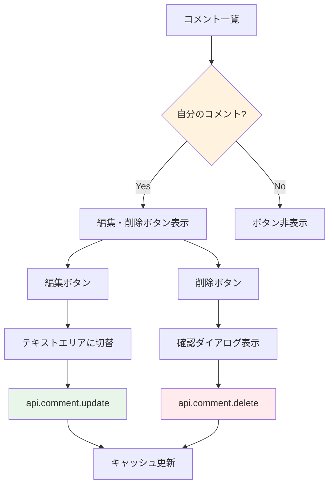

# Day 19: コメント編集・削除を実装しよう

## 前回の振り返り

Day 18 でコメント一覧表示と新規投稿を実装しました。コメントの投稿ができるようになったので、今日は投稿済みコメントの編集・削除と権限チェックを作ります。

---

## 今日のゴール

投稿済みのコメントを編集・削除できる仕組みを
理解します。自分が書いたコメントだけを操作できる
権限チェックの実装も確認します。

スクリーンショット: コメント編集モードの表示を確認してください。


## なぜこれを作るのか

コメントは、書いたあとで直したくなるものです。あとから誤字に気づいたり、状況が変わって内容を変更したくなったりします。投稿したコメントを、本人だけが編集・削除できるようにします。

> **例え話**: コメント編集は「ノートの修正」
> です。鉛筆で書いたメモは消しゴムで消して
> 書き直せますが、他人のノートは書き換え不可で
> 「自分のものだけ」という制限が大切です。

### 編集・削除のフロー


```mermaid
flowchart TD
    A[コメント一覧] --> B{自分のコメント?}
    B -->|Yes| C[編集・削除ボタン表示]
    B -->|No| D[ボタン非表示]
    C --> E[編集ボタン]
    C --> F[削除ボタン]
    E --> G[テキストエリアに切替]
    G --> H[api.comment.update]
    F --> I[確認ダイアログ表示]
    I --> J[api.comment.delete]
    H --> K[キャッシュ更新]
    J --> K

    style B fill:#fff3e0
    style H fill:#e8f5e9
    style J fill:#ffebee
```

図の分かれ道（ひし形）は「そのコメントを書いたのが自分かどうか」の判定です。
自分のものなら編集ボタンと削除ボタンを出し、他人のものなら何も出しません。
ただしここで決まるのはボタンを描くかどうかだけで、権限そのものではありません。
ボタンが無くても、リクエストを直接送りつける手段は残るからです。
実際に操作を止めているのは右側の `api.comment.update` と `api.comment.delete` で、
どちらも呼ばれた時点でサーバーがもう一度作者を確かめます。

矢印の合流点も見てください。編集ルートと削除ルートは途中まで別々ですが、
最後は同じ「キャッシュ更新」に着きます。
コメントを投稿したあと一覧がすぐ増えたのと同じ流れです。
編集と削除のどちらでも一覧を取り直すため、画面の表示と保存済みの内容がずれません。

### やること / やらないこと

| やること | やらないこと |
|---------|-------------|
| コメント編集 | コメントへの返信 |
| コメント削除 | 一括削除 |
| 本人チェック | 管理者による編集 |
| 確認ダイアログ | 編集履歴 |

### 新しく学ぶ概念

| 概念 | 読み方 | 役割 | 例え |
|------|--------|------|------|
| editingCommentId | — | 編集中のコメント ID | 開いているノートのページ番号 |
| comment.update | — | コメントを更新する API | ノートの書き直し |
| comment.delete | — | コメントを削除する API | ノートのページを破る |
| DeleteConfirmDialog（Day 15 の復習） | — | 削除確認ダイアログ | 「本当に消すか」の確認 |

## 実装ステップ一覧

| ステップ | 作業内容 | 所要時間 |
|---------|---------|---------|
| Step 1 | 編集・削除 API を理解する | 3分 |
| Step 2 | 編集用 state を確認する | 3分 |
| Step 3 | 本人チェックでボタンを表示 | 5分 |
| Step 4 | 編集モードの切り替えを確認 | 5分 |
| Step 5 | 編集 API の呼び出しを確認 | 5分 |
| Step 6 | 削除処理を確認する | 5分 |
| Step 7 | 動作確認 | 3分 |

**合計時間**: 約29分です。

---

### Step 1: 編集・削除 API を理解する（3分）

**ゴール**: comment ルーターの
update / delete メソッドを把握します。

Day 18 で作った
`src/server/api/routers/comment.ts` に
`update` と `delete` メソッドを追加します。
投稿できるようになったコメントへ、編集と削除の入口を足します。
今日の追記まで終わると、`comment.ts` の編集・削除手続きが完成します。

**実装**:

```typescript
// filepath: src/server/api/routers/comment.ts
// コメント編集用のバリデーションスキーマ
const commentUpdateSchema = z.object({
  id: z.string().cuid(),
  content: z.string().trim().min(1,
    'コメント内容は必須です'),
});
```

**確認ポイント**:
- 編集時も投稿と同じバリデーションが適用される
- `id` でどのコメントを更新するか指定する

次に、コメントの作者かどうかを確かめるヘルパー関数を、Day 18 で書いた `findTaskAndAssertMembership` の下に追加します。

```typescript
// filepath: src/server/api/routers/comment.ts
// findTaskAndAssertMembership の下に追加
const findCommentAndAssertOwnership = async (
  commentId: string,
  userId: string,
  permission?: PermissionKey,
) => {
  const comment = await prisma.comment.findUnique({
    where: { id: commentId },
    select: {
      userId: true,
      task: {
        include: {
          project: {
            include: { members: { where: { userId } } },
          },
        },
      },
    },
  });
```

コメントに紐づくタスク、そのプロジェクト、さらに自分がメンバーかどうかまでを一度に引き当てます。いちばん外側の `select` はコメント自身の項目を `userId` だけに絞っていますが、内側の `include` はタスクとプロジェクトの列をすべて取ってきます。判定に使うのはその一部なので、通信量を詰めたければ内側も `select` に置き換える余地があります。

判定に必要な材料は3つあります。コメントの作者、コメントの置き場所であるプロジェクト、
そしてその人がプロジェクトのメンバーかどうかです。
3回に分けて問い合わせると、その間に別の人がメンバーから外れるような食い違いが起きます。
1回でまとめて取れば、判定に使う材料はすべて同じ瞬間のものになります。

`members: { where: { userId } }` の書き方にも意味があります。
メンバー全員ではなく、自分の分だけを取り出しています。
自分がメンバーなら要素を1つ持つ配列、メンバーでなければ空の配列になります。
このあとの判定は「配列が空かどうか」を見るだけで済みます。

```typescript
// filepath: src/server/api/routers/comment.ts（続き）
  if (!comment) {
    throw new TRPCError({
      code: 'NOT_FOUND',
      message: 'コメントが見つかりません',
    });
  }

  assertMemberPermission(
    comment.task.project.members, permission,
  );

  if (comment.userId !== userId) {
    throw new TRPCError({
      code: 'FORBIDDEN',
      message: '自分のコメントのみ編集・削除できます',
    });
  }

  return comment;
};
```

チェックは2段階です。まずプロジェクトのメンバーかを確かめ、次に「そのコメントの作者本人か」を確かめます。メンバーでも他人のコメントは編集・削除できないよう、`comment.userId !== userId` で弾きます。

続いて、Day 18 で書いた `commentRouter` の中（`create` の後、閉じる `});` の前）に `update` と `delete` を追加します。

```typescript
// filepath: src/server/api/routers/comment.ts
// commentRouter の create の後、}); の前に追加
  update: protectedProcedure
    .input(commentUpdateSchema)
    .mutation(async ({ ctx, input }) => {
      const { id, ...data } = input;
      await findCommentAndAssertOwnership(id, ctx.session.userId, 'canEdit');
      return await prisma.comment.update({
        where: { id },
        data,
        include: { user: { select: USER_SELECT } },
      });
    }),
  delete: protectedProcedure
    .input(z.object({ id: z.string().cuid() }))
    .mutation(async ({ ctx, input }) => {
      await findCommentAndAssertOwnership(
        input.id, ctx.session.userId, 'canEdit',
      );
      await prisma.comment.delete({
        where: { id: input.id },
      });
      return { success: true };
    }),
```

`update` は本文だけを書き換え、`delete` はコメントごと消します。どちらも先ほどの `findCommentAndAssertOwnership` で「メンバーかつ作者本人か」を確かめてから実行するので、他人のコメントは操作できません。

#### comment.update の入力パラメータ

| パラメータ | 型 | バリデーション | 説明 |
|-----------|-----|--------------|------|
| `id` | string (CUID) | `.cuid()` | コメント ID |
| `content` | string | `trim().min(1)` | 新しいコメント本文 |

#### comment.delete の入力パラメータ

| パラメータ | 型 | バリデーション | 説明 |
|-----------|-----|--------------|------|
| `id` | string (CUID) | `.cuid()` | コメント ID |

> サーバー側では `findCommentAndAssertOwnership`
> で「コメントの作者か」を検証しています。
> 他人のコメントを操作しようとすると FORBIDDEN
> エラーが返ります。

#### サーバー側の権限チェック

| チェック | 失敗時のエラー | 意味 |
|---------|--------------|------|
| コメント存在確認 | NOT_FOUND | コメントが見つからない |
| プロジェクトメンバー確認 | FORBIDDEN | メンバーでない |
| コメント作者確認 | FORBIDDEN | 自分のコメントでない |

**確認ポイント**:
- update と delete のパラメータを把握した
- サーバー側に 3 段階の権限チェックがある

---

### Step 2: 編集用 state を追加する（3分）

**ゴール**: 「どのコメントを編集中か」を
管理する state とフォームを追加します。

まず、編集ボタン、削除ボタン、確認ダイアログ、
state に必要なインポートを追加します。

```typescript
// filepath: src/component/task/task-detail-dialog.tsx
// コメント編集・削除で使うインポート
import { Pencil, Trash2 } from 'lucide-react';
import { useState } from 'react';
import { DeleteConfirmDialog }
  from '@/component/ui/delete-confirm-dialog';
```

`Pencil` と `Trash2` は lucide-react のアイコンです。
鉛筆が編集、ゴミ箱が削除を表します。
「編集」「削除」と文字で並べるとコメント1件あたりの高さが増えて、
本文よりボタンのほうが目立ってしまうため、小さなアイコンボタンにしています。
`useState` は「いまどのコメントを編集中か」をコンポーネントへ覚えさせるために使います。
`DeleteConfirmDialog` はタスク削除で使ったのと同じ確認ダイアログで、
Day 11 で作ったものをそのまま読み込みます。
削除は取り消せない操作なので、確認を挟む部品は作り直さず共有します。

Day 18 の `commentSchema` の下に、
編集フォーム用のスキーマと型を追加します。

```typescript
// filepath: src/component/task/task-detail-dialog.tsx
// コメント編集用 zod スキーマ定義
const editCommentSchema = z.object({
  content: z.string().trim()
    .min(1, 'コメントを入力してください'),
});
type EditCommentFormValues =
  z.infer<typeof editCommentSchema>;
```

Step 1 の `commentUpdateSchema` とよく似ていますが、こちらは画面側の担当です。
テキストエリアが空のまま更新ボタンを押しても送信させず、
その場で「コメントを入力してください」と出すために使います。
`id` が入っていないのは、どのコメントを更新するかを
保存ボタンのハンドラーが引数で渡すからです。

サーバー側のチェックと二重になっているように見えますが、
片方を消してよいという意味ではありません。
ブラウザ側の検証は開発者ツールから回避できるため、
空の本文がサーバーへ届く可能性は残ります。
それを最後に止めるのが Step 1 の `commentUpdateSchema` です。
画面側は入力中の人へ早く知らせるため、サーバー側は不正な保存を防ぐためにあります。

**実装**:

```typescript
// filepath: src/component/task/task-detail-dialog.tsx
// 編集・削除用の state と useForm
const [editingCommentId, setEditingCommentId]
  = useState<string | null>(null);
const [deleteCommentDialogOpen,
  setDeleteCommentDialogOpen]
  = useState(false);
const [deleteCommentTargetId,
  setDeleteCommentTargetId]
  = useState<string | null>(null);
```

state を3つに分けたのには理由があります。
`editingCommentId` が指すのは編集中の1件、
`deleteCommentTargetId` が指すのは削除しようとしている1件で、
同じコメントとは限りません。
削除の確認ダイアログを出しているあいだ、別のコメントを編集中でも構わないからです。

開閉フラグと対象 ID を分けている点も大事です。
もしフラグだけにすると、ダイアログの「削除する」を押した瞬間に
どのコメントを消すのかが分かりません。
押してから対象を探すのでは遅いので、削除ボタンを押した時点で ID を控えておきます。
`null` は「まだ対象が決まっていない」という意味で、初期値に置いています。

```typescript
// filepath: src/component/task/task-detail-dialog.tsx
// コメント編集用の react-hook-form
const editCommentForm =
  useForm<EditCommentFormValues>({
    resolver:
      zodResolver(editCommentSchema),
  });
```

**確認ポイント**:
- 3つの state + editCommentForm が定義されている
- コードを追加できた

> `editingCommentId` が `null` なら
> 通常表示、値があれば編集モードです。
> Day 15 で学んだ「モード切替」パターンを
> コメントにも活用しています。

#### state の役割

| state | 型 | 役割 |
|-------|-----|------|
| `editingCommentId` | string \| null | 編集中のコメント ID |
| `editCommentForm` | useForm | 編集中テキストの管理（react-hook-form） |
| `deleteCommentDialogOpen` | boolean | 削除ダイアログの表示 |
| `deleteCommentTargetId` | string \| null | 削除対象の ID |

---

### Step 3: 本人チェックでボタンを表示（5分）

**ゴール**: 自分のコメントにだけ
編集・削除ボタンを表示する仕組みを確認します。

まずセッション情報の取得を確認しましょう。
`api.auth.getSession` でログインユーザーの ID を
取得します。

**実装**:

```typescript
// filepath: src/component/task/task-detail-dialog.tsx
// セッション情報の取得を追加
const { data: session } =
  api.auth.getSession.useQuery();
```

ログイン中の人が誰かは、ブラウザ側では分かりません。
`api.auth.getSession` でサーバーへ問い合わせて、はじめて自分の ID が手に入ります。
この ID とコメントの `userId` を突き合わせるのが、本人判定の中身です。

編集・削除できるのは、そのコメントを書いた本人だけです。
同じプロジェクトのメンバーでも、他人のコメントには触れません。
そして本人判定は、ここで1回、サーバーでもう1回、合計2回行われます。
ここでの判定はボタンを描くかどうかを決めるだけで、守りの役目は持っていません。
ブラウザで動くコードは書き換えられるので、
`comment.userId === session?.user?.id` の行を消せばボタンは出せてしまいます。
それでも他人のコメントは変えられません。
Step 1 の `findCommentAndAssertOwnership` が、届いたリクエストごとに作者を確かめ、
一致しなければ FORBIDDEN を返して処理を止めるからです。

**確認ポイント**:
- session からユーザー ID を取得できる

取得した `session?.user?.id` を使って、
各コメントの作者と一致するときだけ
編集・削除ボタンを表示します。

```typescript
// filepath: src/component/task/task-detail-dialog.tsx
// 本人チェックで編集・削除ボタンを表示
{comment.userId === session?.user?.id && (
  <div className="flex gap-1">
    <Button variant="ghost" size="icon"
      className="h-6 w-6"
      onClick={() =>
        handleStartEdit(comment)}>
      <Pencil className="h-3 w-3" />
    </Button>
    <Button variant="ghost" size="icon"
      className="h-6 w-6 text-destructive
        hover:text-destructive"
      onClick={() =>
        handleDeleteComment(comment.id)}>
      <Trash2 className="h-3 w-3" />
    </Button>
  </div>
)}
```

ここで使っている `handleStartEdit` と `handleDeleteComment` は、
このあとの Step で定義します。定義するまでこの画面は表示できません。

2つのハンドラーを書いたあとで、次の2点を確かめます。

**確認ポイント**:
- 自分のコメントにのみボタンが表示される
- 他人のコメントにはボタンがない

スクリーンショット: 本人のコメントにだけ編集・削除ボタンが並ぶ表示を確認してください。


画像はコメントが1件も無いときの姿です。自分の書いたコメントがあれば、
その行の右側にペンとゴミ箱のアイコンが並びます。
> `comment.userId` は Day 18 Step 1 の
> 構造テーブルで確認したフィールドです。
> Prisma のリレーションで取得されます。

---

### Step 4: 編集モードの切り替えを確認する（5分）

**ゴール**: 編集ボタンクリックで
テキストエリアに切り替わる仕組みを確認します。

**実装**:

```typescript
// filepath: src/component/task/task-detail-dialog.tsx
// 編集開始・キャンセルハンドラー
const handleStartEdit = (comment: {
  id: string; content: string;
}) => {
  setEditingCommentId(comment.id);
  editCommentForm.setValue(
    'content', comment.content
  );
};

const handleCancelEdit = () => {
  setEditingCommentId(null);
  editCommentForm.reset();
};
```

**確認ポイント**:
- 編集開始時に既存テキストがセットされる
- キャンセルで state がクリアされる

三項演算子で「編集中のコメントか」を判定し、
編集中はテキストエリアとボタン、通常時はテキストを
表示します。`? (` から `)}` までが 1 つの式です。

```typescript
// filepath: src/component/task/task-detail-dialog.tsx
{editingCommentId === comment.id ? (
  <div className="space-y-2">
    <Textarea
      {...editCommentForm.register('content')}
      className="resize-none" rows={2} />
    <div className="flex gap-2 justify-end">
      <Button variant="outline" size="sm"
        onClick={handleCancelEdit}>
        キャンセル
      </Button>
      <Button size="sm"
        onClick={() => handleSaveEdit(comment.id)}
        disabled={
          !editCommentForm.watch('content').trim()
          || updateCommentMutation.isPending}>
        {updateCommentMutation.isPending
          ? '更新中...' : '更新'}
      </Button>
    </div>
  </div>
) : (
  <p className="text-muted-foreground">
    {comment.content}</p>
)}
```

**確認ポイント**:
- キャンセルで元に戻る
- 更新中はボタンが無効になる

スクリーンショット: 編集モードでテキストエリアに切り替わった表示を確認してください。


> 三項演算子 `? :` で、編集中のコメントだけ
> テキストエリアに切り替えます。
> Day 15 の編集モードと同じパターンです。

---

### Step 5: 編集 API の呼び出しを確認する（5分）

**ゴール**: コメントの内容を
サーバーに保存する mutation を確認します。

**実装**:

```typescript
// filepath: src/component/task/task-detail-dialog.tsx
// 編集 mutation を追加
const updateCommentMutation =
  api.comment.update.useMutation({
    onSuccess: () => {
      if (taskId) {
        utils.task.getById.invalidate(
          { id: taskId },
        );
      }
      setEditingCommentId(null);
      editCommentForm.reset();
    },
  });
```

`onSuccess` が動くのは、サーバーが更新を受け付けて返事をしたあとだけです。
そこで2つのことをしています。
`invalidate` は「手元に持っているタスク詳細のデータはもう古い」という印を付ける命令で、
印が付くと tRPC が `task.getById` を取り直し、保存後の本文でコメント一覧を描き直します。
コメントはタスク詳細の一部として届くので、コメント専用の再取得は要りません。

`invalidate` を書き忘れると、保存自体は成功しているのに画面の文字が変わりません。
読者からは「更新ボタンが効いていない」ように見えますが、
ページを再読み込みすると新しい本文が出てきます。
この見え方をしたら、疑うのは保存処理ではなく再取得の呼び出しです。

続く2行で編集モードを閉じています。
`setEditingCommentId(null)` でテキストエリアを通常表示へ戻し、
`editCommentForm.reset()` で入力内容を捨てます。
この2行が無いと、保存後もテキストエリアが開いたまま残ります。

**確認ポイント**:
- mutation が定義されている
- `onSuccess` でキャッシュ更新と state クリアを実行

```typescript
// filepath: src/component/task/task-detail-dialog.tsx
// 保存ハンドラー
const handleSaveEdit =
  (commentId: string) => {
    const content = editCommentForm
      .getValues('content').trim();
    if (!content) return;
    updateCommentMutation.mutate({
      id: commentId, content,
    });
  };
```

**確認ポイント**:
- 空白のみの更新を防いでいる
- `trim()` で前後の空白を除去して送信

> Day 18 のコメント投稿時と同じく
> `task.getById` を invalidate します。
> タスク詳細に含まれるコメントが再取得されます。

#### 編集の処理フロー

| 順番 | 処理 | 目的 |
|------|------|------|
| 1 | 編集ボタンクリック | 既存テキストをセット |
| 2 | テキストエリアで修正 | 内容を変更 |
| 3 | 更新ボタンクリック | サーバーへ送信 |
| 4 | `onSuccess` → `invalidate` | 一覧を再取得 |
| 5 | state クリア | 編集モード終了 |

---

### Step 6: 削除処理を確認する（5分）

**ゴール**: 確認ダイアログ付きの
削除処理を確認します。

**実装**:

```typescript
// filepath: src/component/task/task-detail-dialog.tsx
// 削除 mutation を追加
const deleteCommentMutation =
  api.comment.delete.useMutation({
    onSuccess: () => {
      if (taskId) {
        utils.task.getById.invalidate(
          { id: taskId },
        );
      }
    },
  });
```

削除後にやることは編集と同じ `invalidate` ひとつです。
編集では state のクリアも必要でしたが、削除では編集モードに入っていないので要りません。
消えたコメントはサーバーから返ってこなくなるため、取り直した一覧から自然に姿を消します。

ここで `invalidate` を落とすと、消したはずのコメントが画面に残り続けます。
残った行の編集ボタンを押して更新すると、
サーバーは元のコメントを見つけられず NOT_FOUND を返します。
Step 1 で `findCommentAndAssertOwnership` に存在確認を入れたのは、この場面のためです。

**確認ポイント**:
- 削除成功後にキャッシュが更新される

削除ボタンのクリックで、まず確認ダイアログを
表示します。いきなり削除しません。

```typescript
// filepath: src/component/task/task-detail-dialog.tsx
// 削除ボタンのクリックハンドラー
const handleDeleteComment =
  (commentId: string) => {
    setDeleteCommentTargetId(commentId);
    setDeleteCommentDialogOpen(true);
  };
```

**確認ポイント**:
- 削除ボタンで確認ダイアログが表示される

`DeleteConfirmDialog` は Day 11 で
タスク削除にも使った再利用コンポーネントです。

タスク詳細と削除確認の2つのダイアログを並べるため、
まず `return` 直後の既存コードを次の形に変えます。
`<>` と `</>` は、複数の要素をまとめる Fragment です。

```typescript
// filepath: src/component/task/task-detail-dialog.tsx
return (
  <>
    <Dialog open={open}
      onOpenChange={(isOpen) => !isOpen && onClose()}>
```

コンポーネントが `return` で返せる要素は1つだけ、というルールがあります。
タスク詳細の `Dialog` と削除確認のダイアログを並べて返そうとすると、
返す要素が2つになってしまい、保存した瞬間にエラーで画面が真っ白になります。
`<>` で包むと2つをまとめて1つとして返せます。
`div` で包んでも同じ効果は得られますが、`<>` なら画面に余計な入れ物を1つも増やしません。

既存のタスク詳細ダイアログを閉じる `</Dialog>` の直後、
`</>` の前に削除確認ダイアログを配置します。

```typescript
// filepath: src/component/task/task-detail-dialog.tsx
// 既存の </Dialog> の直後に配置
    <DeleteConfirmDialog
      open={deleteCommentDialogOpen}
      onOpenChange={setDeleteCommentDialogOpen}
      onConfirm={() => {
        if (deleteCommentTargetId) {
          deleteCommentMutation.mutate(
            { id: deleteCommentTargetId });
        }
      }}
      isPending={
        deleteCommentMutation.isPending}
      title="コメントを削除しますか？"
    />
  </>
```

**確認ポイント**:
- 確認ダイアログが表示される
- OK でコメントが削除される
- `Dialog` と `DeleteConfirmDialog` が Fragment 内で並ぶ

スクリーンショット: タスク詳細ダイアログのコメントセクション完成の表示を確認してください。


> `DeleteConfirmDialog` は
> `title` prop で確認メッセージを指定できます。
> 取り消せない操作には専用の確認 UI を使いましょう。

#### ダイアログを閉じるタイミング

| タイミング | 処理 |
|-----------|------|
| キャンセル | `onOpenChange` で false |
| 削除成功 | `onOpenChange` で false |
| ダイアログ外クリック | `onOpenChange` で false |

---

### Step 7: 動作確認（3分）

**ゴール**: 編集・削除の全体を確認します。

1. タスク詳細を開く
2. 自分のコメントに編集・削除ボタンがある
3. 他人のコメントにはボタンがない
4. 編集ボタンでテキストエリア表示
5. 内容を変更して「更新」
6. 更新中は「更新中...」と表示される
7. 更新されたコメントが表示される
8. 削除ボタンで確認ダイアログ表示
9. 確認後にコメントが削除される

```bash
# filepath: ターミナル
# 開発サーバーを起動して動作確認
PORT=3001 npm run dev
```

初期データの「データベース設計」タスクには、別のユーザーの書いたコメントが1件入っています。そのタスクを開くと、自分の行にだけアイコンが2つ並び、相手の行には何も出ません。
他人のコメントにボタンが出ないことを目で確かめたい場合は、
Day 12 で同じプロジェクトに追加したメンバーのアカウントでコメントを1件残し、
自分のアカウントに戻ってから一覧を開いてください。
自分の行にはアイコンが2つ並び、相手の行には何も並びません。

サーバー側の防御まで確かめたくなったら、
`comment.userId === session?.user?.id` を一時的に `true` に書き換えてみてください。
他人のコメントにもボタンが出ますが、更新を押しても本文は変わりません。
画面にエラーは出ません。サーバーが黙って拒否しているためです。
止めているのは Step 1 で書いた作者チェックです。
確認が終わったら、書き換えた行は必ず元に戻してください。

**確認ポイント**:
- 自分のコメントだけ操作できる
- 編集後に内容が更新される
- 削除後にコメントが消える
- `http://localhost:3001` でアプリが表示される
- 一時的に `true` へ書き換えた `comment.userId === session?.user?.id` を元の式に戻した

---


---

### Pro パターンで書こう（コメント著者チェックを Optional chaining で書く）

本人のコメントか確認するときは、
`session`、`user`、`id` が未取得の可能性を考えます。
`session?.user?.id` と書くと、未ログイン時も安全に比較できます。

| 書き方 | 意味 |
|--------|------|
| `session.user.id` | session が必ずある前提 |
| `session?.user?.id` | 途中がなければ `undefined` |

**覚えておきたいこと**: 途中がないかもしれない値には `?.` を使います。

## 今日のまとめ

- [ ] 本人チェックで操作を制限できた
- [ ] `api.comment.update` で編集できた
- [ ] `api.comment.delete` で削除できた
- [ ] 確認ダイアログを表示できた

## つまずきポイント

| エラー / 問題 | 原因 | 解決方法 |
|--------------|------|---------|
| 他人のコメントも編集できる | userId 比較の漏れ | session.user.id 確認 |
| 編集後に更新されない | invalidate 忘れ | task.getById.invalidate |
| キャンセル後に文字が残る | state クリア漏れ | handleCancelEdit で空に |
| 空白で保存できる | `trim()` チェック漏れ | `if (!content.trim())` |
| 削除確認が出ない | DeleteConfirmDialog 未配置 | JSX に追加する |

## 今日学んだ用語

| 用語 | 意味 |
|------|------|
| editingCommentId | 編集中のコメントを特定する state |
| comment.update | コメント内容を更新する API |
| comment.delete | コメントを削除する API |
| DeleteConfirmDialog | 削除確認ダイアログ |
| isPending | mutation 実行中のフラグ |

## 次回予告

Day 20 では、タスクの検索機能を実装します。
キーワードや複数の条件でタスクを素早く
見つけられるようになります。
