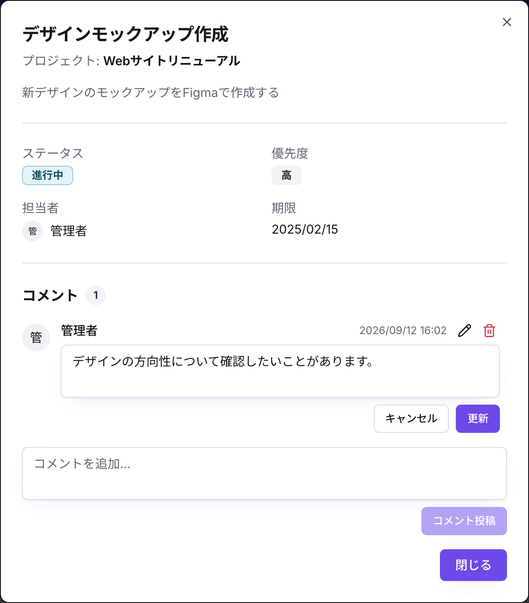
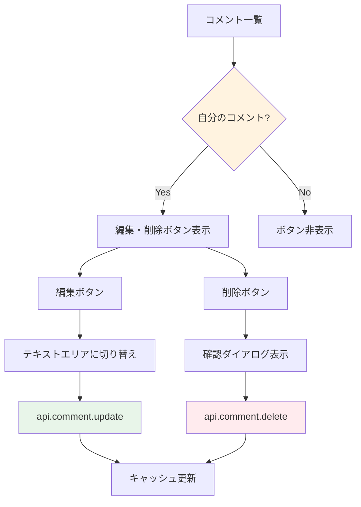
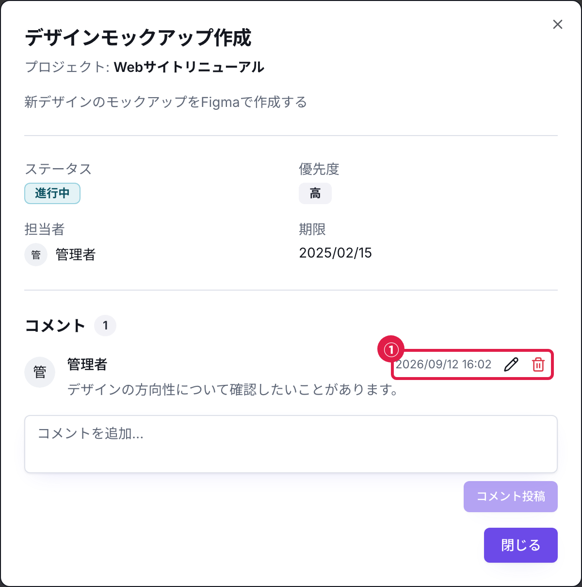
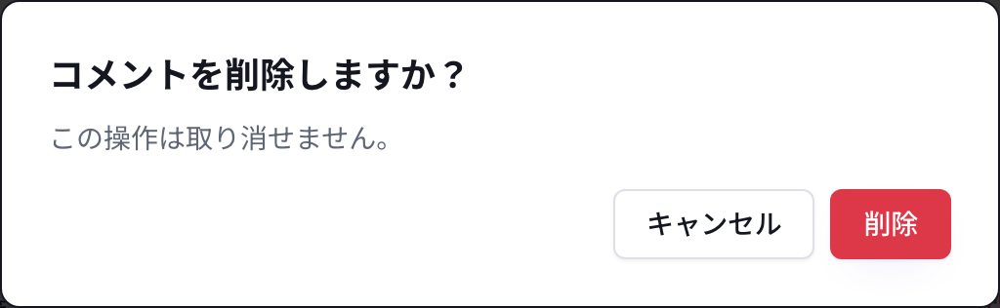

# Day 19: コメント編集・削除を実装しよう

## 前回の振り返り

Day 18 でコメント一覧表示と新規投稿を実装しました。コメントの投稿ができるようになったので今日は投稿済みコメントの編集・削除と権限チェックを作ります。

---

## 今日のゴール

投稿済みのコメントを編集・削除できる仕組みを
理解します。自分が書いたコメントだけを操作できる
権限チェックの実装も確認します。Day 18 に続き、TypeScript（JavaScript に型を加えた言語）で書きます。

スクリーンショット: 今日を終えたコメント欄です。自分のコメントの編集ボタンを押すとその行だけがテキストエリアに変わります。



## なぜこれを作るのか

コメントは書いたあとで直したくなるものです。あとから誤字に気づいたり、状況が変わって内容を変更したくなったりします。投稿したコメントを、本人だけが編集・削除できるようにします。

> **例え話**: コメント編集は「ノートの修正」
> です。鉛筆で書いたメモは消しゴムで消して
> 書き直せますが他人のノートは書き換え不可で
> 「自分のものだけ」という制限が大切です。

### 編集・削除のフロー


```mermaid
flowchart TD
    A[コメント一覧] --> B{自分のコメント?}
    B -->|Yes| C[編集・削除ボタン表示]
    B -->|No| D[ボタン非表示]
    C --> E[編集ボタン]
    C --> F[削除ボタン]
    E --> G[テキストエリアに切り替え]
    G --> H[api.comment.update]
    F --> I[確認ダイアログ表示]
    I --> J[api.comment.delete]
    H --> K[キャッシュ更新]
    J --> K

    style B fill:#fff3e0
    style H fill:#e8f5e9
    style J fill:#ffebee
```

図の分かれ道（ひし形）は「そのコメントを書いたのが自分かどうか」の判定です。
自分のものなら編集ボタンと削除ボタンを出し、他人のものなら何も出しません。
ただしここで決まるのはボタンを描くかどうかだけで、権限そのものではありません。
ボタンが無くてもリクエストを直接送りつける手段は残るからです。
実際に操作を止めているのは右側の `api.comment.update` と `api.comment.delete` で、
どちらも呼ばれた時点でサーバーがもう一度作者を確かめます。

矢印の合流点も見てください。編集ルートと削除ルートは途中まで別々ですが
最後は同じ「キャッシュ更新」に着きます。
コメントを投稿したあと一覧がすぐ増えたのと同じ流れです。
編集と削除のどちらでも一覧を取り直すため画面の表示と保存済みの内容がずれません。

### やること / やらないこと

| やること | やらないこと |
|---------|-------------|
| コメント編集 | コメントへの返信 |
| コメント削除 | 一括削除 |
| 本人チェック | 管理者による編集 |
| 確認ダイアログ | 編集履歴 |

### 新しく学ぶ概念

| 概念 | 読み方 | 役割 | 例え |
|------|--------|------|------|
| editingCommentId | — | 編集中のコメント ID | 開いているノートのページ番号 |
| comment.update | — | コメントを更新する API | ノートの書き直し |
| comment.delete | — | コメントを削除する API | ノートのページを破る |
| DeleteConfirmDialog（配布済み） | — | 削除確認ダイアログ | 「本当に消すか」の確認 |

開発サーバーは前の Day から動かしたまま使います。止めてあるときは `npm run dev` で起動してから `http://localhost:3000` を開きます。

## 実装ステップ一覧

| ステップ | 作業内容 | 読む時間の目安 |
|---------|---------|---------|
| Step 1 | 編集・削除 API を実装する | 15分 |
| Step 2 | 編集と削除の送信 context を追加する | 8分 |
| Step 3 | 現在の役割と作者でボタンを制限する | 5分 |
| Step 4 | 3つの mutation を同期 lock で守る | 10分 |
| Step 5 | 編集・削除ハンドラーを書く | 8分 |
| Step 6 | 作者だけに操作 UI を表示する | 8分 |
| Step 7 | 動作確認 | 5分 |

**読む時間の合計（仮）**: 約59分です。

表と各 Step に記した時間は、説明とコードを読む時間の仮の目安です。実測した値ではありません。コードの入力、動作確認、ダウンロードや起動の待ち時間、調べものには別に時間を取ってください。

---

### Step 1: 編集・削除 API を実装する（読む目安: 15分）

**ゴール**: Day 18 の project lock を update/delete にも適用し、現在のメンバー権限と作者を確認したうえで書き込みます。

API（画面と server をつなぐ呼び出し口）の DB 操作には、Day 18 と同じ Prisma（TypeScript から DB を操作する道具）を使います。

編集入力と、コメントから project・作者をたどる helper を追加します。

```typescript
// filepath: src/server/api/routers/comment.ts
const commentUpdateSchema = z.object({
  id: z.string().cuid(),
  content: z.string().trim().min(1, 'コメント内容は必須です'),
});
```

`commentUpdateSchema` は、更新対象のコメントID（cuid形式）と、編集後の本文を受け取るバリデーションスキーマです。`trim().min(1)` で前後の空白を除去したうえで最低1文字を要求するため、空白だけの送信や空文字の更新リクエストをAPIの入り口で弾きます。不正な形式のIDや空の本文がデータベースまで届くのを防ぐために必要です。

Day 18 で書いた `lockCommentProject` と `findTaskAndAssertMembership` は残します。その下へ、作者確認の helper を追加します。

```typescript
// filepath: src/server/api/routers/comment.ts
/**
 * update/deleteの両方で同一の「コメント取得→メンバー確認→作者確認」パターンが必要なため集約。
 */
const findCommentAndAssertOwnership = async (
  commentId: string,
  userId: string,
  permission?: PermissionKey,
  db: Pick<Prisma.TransactionClient, 'comment'> = prisma,
) => {
  const comment = await db.comment.findUnique({
    where: { id: commentId },
    select: {
      userId: true,
      task: {
        include: {
          project: {
            include: {
              members: { where: { userId } },
            },
          },
        },
      },
    },
```

`findCommentAndAssertOwnership` は、コメントの所有者確認を担う共通関数です。`db.comment.findUnique` で、作者 ID と所属プロジェクトのメンバー情報を一度に取得します。存在・権限・所有者の判定に同じ取得結果を使うためです。更新直前には、トランザクション内でもう一度この関数を呼びます。

```typescript
// filepath: src/server/api/routers/comment.ts（同じファイルの続き）
  });

  if (!comment) {
    throw new TRPCError({
      code: 'NOT_FOUND',
      message: 'コメントが見つかりません',
    });
  }

  assertMemberPermission(comment.task.project.members, permission);

  if (comment.userId !== userId) {
    throw new TRPCError({
      code: 'FORBIDDEN',
      message: '自分のコメントのみ編集・削除できます',
    });
  }

  return comment;
};
```

現在の member role を確認したうえで作者 ID も照合し、本人の comment だけを返します。member であることだけを条件にすると、同じ project の他人の comment を更新・削除できます。

`db` を省略した最初の確認では通常の Prisma client を使い、lock 後の確認では `tx` を使います。作者判定は画面のボタン表示だけに任せません。直接 API を呼ばれても server が拒否します。

Day 18 の `create` の後へ update/delete を追加します。

```typescript
// filepath: src/server/api/routers/comment.ts
  update: protectedProcedure.input(commentUpdateSchema).mutation(async ({ ctx, input }) => {
    const { id, ...data } = input;
    const comment = await findCommentAndAssertOwnership(id, ctx.session.userId, 'canEdit');

    try {
      return await prisma.$transaction(async (tx) => {
        if (!(await lockCommentProject(tx, comment.task.projectId))) {
          throw new TRPCError({
            code: 'CONFLICT',
            message: 'コメントの内容が更新されています。最新の内容を再読み込みしてください',
          });
        }

        const currentComment = await findCommentAndAssertOwnership(
          id,
          ctx.session.userId,
          'canEdit',
          tx,
        );
        if (currentComment.task.projectId !== comment.task.projectId) {
          throw new TRPCError({
            code: 'CONFLICT',
            message: 'コメントの内容が更新されています。最新の内容を再読み込みしてください',
```

プロジェクト行をロックした後、同じ `tx` で `findCommentAndAssertOwnership` を再実行します。事前確認からロック取得までにタスク移動や権限変更が完了していれば、古い確認結果では更新しません。所属プロジェクト ID が変わっていた場合は `CONFLICT` を返します。

```typescript
// filepath: src/server/api/routers/comment.ts（同じファイルの続き）
          });
        }

        return await tx.comment.update({
          where: {
            id,
            taskId: currentComment.task.id,
            userId: ctx.session.userId,
          },
          data,
          include: {
            user: {
              select: USER_SELECT,
            },
          },
        });
      });
    } catch (err) {
      if (err instanceof Prisma.PrismaClientKnownRequestError && err.code === 'P2025') {
        throw new TRPCError({ code: 'NOT_FOUND', message: 'コメントが見つかりません' });
      }
      throw err;
    }
```

更新した comment と投稿者の表示名・メール・画像を transaction の結果として返します。現在の画面はこの戻り値を一覧へ直接加えず、成功後に送信対象の task query を取り直して comment 一覧を更新します。

```typescript
// filepath: src/server/api/routers/comment.ts（同じファイルの続き）
  }),

  delete: protectedProcedure
    .input(z.object({ id: z.string().cuid() }))
    .mutation(async ({ ctx, input }) => {
      const comment = await findCommentAndAssertOwnership(input.id, ctx.session.userId, 'canEdit');

      try {
        return await prisma.$transaction(async (tx) => {
          if (!(await lockCommentProject(tx, comment.task.projectId))) {
            throw new TRPCError({
              code: 'CONFLICT',
              message: 'コメントの内容が更新されています。最新の内容を再読み込みしてください',
            });
          }

          const currentComment = await findCommentAndAssertOwnership(
            input.id,
            ctx.session.userId,
            'canEdit',
            tx,
          );
          if (currentComment.task.projectId !== comment.task.projectId) {
```

削除でも、プロジェクト行をロックした後に同じ `tx` で権限と所有者を再確認します。事前確認からロック取得までに権限変更やタスク移動が完了していても、古い確認結果では削除しないためです。所属プロジェクト ID が変わっていれば `CONFLICT` を返します。

```typescript
// filepath: src/server/api/routers/comment.ts（同じファイルの続き）
            throw new TRPCError({
              code: 'CONFLICT',
              message: 'コメントの内容が更新されています。最新の内容を再読み込みしてください',
            });
          }

          await tx.comment.delete({
            where: {
              id: input.id,
              taskId: currentComment.task.id,
              userId: ctx.session.userId,
            },
          });
          return { success: true };
        });
      } catch (err) {
        if (err instanceof Prisma.PrismaClientKnownRequestError && err.code === 'P2025') {
          throw new TRPCError({ code: 'NOT_FOUND', message: 'コメントが見つかりません' });
        }
        throw err;
      }
    }),
});
```

現在の task ID・作者 ID・comment ID を同じ delete predicate へ入れ、対象消失は NOT_FOUND として返します。comment ID だけで削除すると、確認後に所有関係が変わった対象を消すおそれがあります。

処理順は create と同じです。

1. 対象 comment と元の project を確認します
2. transaction で元 project をロックします
3. 現在の comment、member role、作者を読み直します
4. comment が別 project へ移っていないことを確かめます
5. `id`、現在の `taskId`、session の `userId` を同じ write predicate へ入れます

最後の predicate は、確認後に対象が消えたり作者が変わったりした場合の防波堤です。Prisma の `P2025` は教材で扱う `NOT_FOUND` へ変換します。

**確認ポイント**:
- `findCommentAndAssertOwnership` が transaction client を受け取ります
- lock 後に現在の member role と作者を確認します
- update/delete の WHERE に `id`、`taskId`、`userId` があります
- 事前確認から lock 取得までに project が移動すると `CONFLICT`、消失は `NOT_FOUND` になります

### Step 2: 編集と削除の送信 context を追加する（読む目安: 8分）

Day 18 の完成コードを出発点にします。新規投稿の状態は残し、編集と削除の送信情報を分けます。ここで使う context（送信した対象と入力をまとめた情報）に、操作の区分を加えます。

編集と削除に使う部品を先に読み込みます。既存の `import { ja } from 'date-fns/locale';` の直後へ、次の1行を追加してください。

```typescript
// filepath: src/component/task/task-detail-dialog.tsx
import { Pencil, Trash2 } from 'lucide-react';
```

`Pencil` と `Trash2` は操作ボタンのアイコンです。ボタンの中に名前を書く前に、この import で読み込みます。

既存の `import { Button } from '@/component/ui/button';` の直後へ、次の1行を追加します。

```typescript
// filepath: src/component/task/task-detail-dialog.tsx
import { DeleteConfirmDialog } from '@/component/ui/delete-confirm-dialog';
```

`DeleteConfirmDialog` は配布済みの削除確認部品です。Step 6 で表示するため、ここで読み込みます。

`task-write-error` から `classifyTaskWriteError` を読み込んでいる既存の import の1行を、次の1行に置き換えます。

```typescript
// filepath: src/component/task/task-detail-dialog.tsx
import { classifyTaskWriteError, type TaskWriteOperation } from '@/lib/task-write-error';
```

`TaskWriteOperation` は書き込み操作名を表す型です。次の `Extract`（型の候補から指定したものを選ぶ機能）で、コメント操作の3種類だけを選びます。

既存の `type CommentSubmission = {` から、その型を閉じる `};` までを、次の2ブロックに置き換えます。直前の `commentSchema` と `CommentFormValues` は残してください。

```typescript
// filepath: src/component/task/task-detail-dialog.tsx
const editCommentSchema = z.object({
  content: z.string().trim().min(1, 'コメントを入力してください'),
});
type EditCommentFormValues = z.infer<typeof editCommentSchema>;

type CommentSubmission = {
  taskId: string;
  scope: 'create' | 'editor';
  generation: number;
  formRevision: number;
  content?: string;
  commentId?: string;
};

type CommentWriteOperation = Extract<
  TaskWriteOperation,
```

`editCommentSchema` は、編集フォームのコメント本文を検証する Zod スキーマです。前後の空白を除去して1文字以上あることを確かめ、空のまま送信されるのを画面側で防ぎます。続く `CommentSubmission` 型は、送信開始時のタスク ID、操作種別、世代番号などを記録します。非同期通信の完了時に、どの操作への応答かを画面の状態と照合するためです。

```typescript
// filepath: src/component/task/task-detail-dialog.tsx（同じファイルの続き）
  'createComment' | 'updateComment' | 'deleteComment'
>;

const staleFailurePrefixes: Record<CommentWriteOperation, string> = {
  createComment: '先ほど送信したコメントの投稿に失敗しました。',
  updateComment: '先ほど送信したコメントの更新に失敗しました。',
  deleteComment: '先ほど送信したコメントの削除に失敗しました。',
};
```

`staleFailurePrefixes` は、別のタスクへ移った後に届く失敗通知の接頭辞です。投稿・更新・削除のどれが失敗したかをトーストに残し、現在の画面のエラーと取り違えないようにします。

create と editor は別の generation を持ちます。投稿の完了が編集画面を閉じたり、削除の完了が投稿欄を消したりしないためです。

Day 18 の関数の先頭を、次の2ブロックに置き換えます。置き換える範囲は次のとおりです。

- 開始: `export function TaskDetailDialog(` で始まる、既存のコンポーネント宣言の行です
- 終了: 新規投稿用の `const commentForm = useForm<CommentFormValues>({` を閉じる `});` です
後ろの `const utils = api.useUtils();` は残してください。既存の state（描画用の値）と ref（描画を待たずに参照する値）も含めた置き換えなので、同じ名前を2回宣言しません。

```typescript
// filepath: src/component/task/task-detail-dialog.tsx
export function TaskDetailDialog({ open, taskId, onClose, onAuthExpired }: TaskDetailDialogProps) {
  const [authExpired, setAuthExpired] = useState(false);
  const [editingCommentId, setEditingCommentId] = useState<string | null>(null);
  const [deleteCommentDialogOpen, setDeleteCommentDialogOpen] = useState(false);
  const [deleteCommentTargetId, setDeleteCommentTargetId] = useState<string | null>(null);
  const [commentWriteError, setCommentWriteError] = useState<string | null>(null);
  const createGenerationRef = useRef(0);
  const editorGenerationRef = useRef(0);
  const createRevisionRef = useRef(0);
  const editRevisionRef = useRef(0);
  const openRef = useRef(open);
  const taskIdRef = useRef(taskId);
  const editingCommentIdRef = useRef<string | null>(null);
  const deleteCommentTargetIdRef = useRef<string | null>(null);
  const writeLockedRef = useRef(false);
  const mountedRef = useRef(false);
  const authExpiredRef = useRef(false);
  const createSubmissionRef = useRef<CommentSubmission | null>(null);
  const updateSubmissionRef = useRef<CommentSubmission | null>(null);
  const deleteSubmissionRef = useRef<CommentSubmission | null>(null);

  const commentForm = useForm<CommentFormValues>({
```

`TaskDetailDialog` の内部では、表示状態や編集・削除対象のコメント ID を管理する React state と、非同期通信のコールバックが即座に参照する ref を初期化します。世代と送信情報は、新規投稿用と編集・削除用に分けます。新規投稿の完了処理が、編集中のフォームをリセットしないようにするためです。

```typescript
// filepath: src/component/task/task-detail-dialog.tsx（同じファイルの続き）
    resolver: zodResolver(commentSchema),
    defaultValues: { content: '' },
  });

  const editCommentForm = useForm<EditCommentFormValues>({
    resolver: zodResolver(editCommentSchema),
    defaultValues: { content: '' },
  });
```

新規投稿用の `commentForm` に加え、編集専用の `editCommentForm` を別の `useForm` として作成します。それぞれに `zodResolver` と空の初期値を設定し、入力状態を分離します。新規投稿欄の本文や検証エラーが、編集欄へ混ざらないようにするためです。

Day 18 で追加した `commentForm.watch` の `useEffect` の直後へ、編集フォームの監視も追加します。

```typescript
// filepath: src/component/task/task-detail-dialog.tsx
  useEffect(() => {
    const subscription = editCommentForm.watch((_values, { name }) => {
      if (name) editRevisionRef.current += 1;
    });
    return () => subscription.unsubscribe();
  }, [editCommentForm]);
```


Day 18 のリセット用 `useEffect` も更新します。`openRef.current = open;` を含む `useEffect(() => {` から、末尾の `}, [commentForm, open, taskId]);` までを、次のコードに置き換えてください。

```typescript
// filepath: src/component/task/task-detail-dialog.tsx
  useEffect(() => {
    openRef.current = open;
    taskIdRef.current = taskId;
    createGenerationRef.current += 1;
    editorGenerationRef.current += 1;
    editingCommentIdRef.current = null;
    deleteCommentTargetIdRef.current = null;
    commentForm.reset();
    editCommentForm.reset();
    setEditingCommentId(null);
    setDeleteCommentDialogOpen(false);
    setDeleteCommentTargetId(null);
    setCommentWriteError(null);
  }, [commentForm, editCommentForm, open, taskId]);
```

タスクを切り替えたとき、前のタスクの編集欄や削除対象が残らないようにするためです。投稿と編集の世代番号も進め、切り替え前に送った通信の完了を識別します。

`editRevisionRef` は、送信後に編集欄へ入力された文字を成功処理で消さないための版番号です。入力が変わるたびに増やします。現在の送信であることを確かめたうえで、送信時の番号と現在の番号が同じ場合だけフォームを閉じます。

`editingCommentIdRef` と `deleteCommentTargetIdRef` は、非同期 callback が現在の対象を確認する値です。state は描画用、ref は同じイベントループ内での同期判定用です。

**確認ポイント**:
- create と editor が別の generation を持ちます
- state と ref を同じ開始・取消処理で更新します
- タスク変更用の effect に編集・削除対象の初期化があります
- 途中で使う関数は Step 4 と Step 5 で書きます。画面の確認は Step 6 のタグを閉じてから行います

### Step 3: 現在の役割と作者でボタンを制限する（読む目安: 5分）

Day 18 で追加した `const permissionSession = ...` から `}, [open, canEditComments]);` までを、次のコードに置き換えます。

```typescript
// filepath: src/component/task/task-detail-dialog.tsx
  const permissionSession = sessionReadFailed ? undefined : session;
  const memberRole = taskDetail?.project.members.find(
    (member) => member.userId === permissionSession?.user?.id,
  )?.role;
  const canEditComments = isProjectMemberRole(memberRole) && hasPermission(memberRole, 'canEdit');
  const canModifyComment = (commentId: string) =>
    canEditComments &&
    taskDetail?.comments.some(
      (comment) => comment.id === commentId && comment.userId === permissionSession?.user?.id,
    );

  useEffect(() => {
    if (!open || !canEditComments) {
      createGenerationRef.current += 1;
      editorGenerationRef.current += 1;
      editingCommentIdRef.current = null;
      deleteCommentTargetIdRef.current = null;
      setEditingCommentId(null);
      setDeleteCommentDialogOpen(false);
      setDeleteCommentTargetId(null);
      editCommentForm.reset();
    }
  }, [open, canEditComments, editCommentForm]);
```

`permissionSession`（権限判定に使えるセッション）がある場合だけ、プロジェクト所属ロールから `canEditComments` を求めます。セッション取得が失敗した場合は、キャッシュに MEMBER 情報が残っていても投稿・編集・削除を止めます。ダイアログを閉じた場合や権限を失った場合は世代番号を進め、編集・削除対象の state と ref、編集フォームをリセットします。古い入力欄や確認画面から更新・削除を送らないためです。

`canModifyComment` による判定は操作ミスを防ぐ画面側の表示制御です。最終的な認可チェックは Step 1 で実装したサーバー側が必ず検証します。

スクリーンショット: 他人のコメントには操作ボタンがなく、自分の行だけに表示されます。



**確認ポイント**:
- `canModifyComment` が現在の role と作者 ID を確認します
- 権限を失うと編集・削除 UI を閉じます

### Step 4: 3つの mutation を1本の書き込み lock で守る（読む目安: 10分）

Day 18 の共通処理を、この Step のコードで置き換えます。

- 開始: `const isCurrentSubmission =` の行です
- 終了: `const createCommentMutation` で始まる mutation 宣言の末尾の `});` です
次の `const handleClose = () => {` は Step 5 まで残します。古い helper（共通処理をまとめた関数）や create mutation（データを書き込む通信処理）へ追記すると、同じ名前の宣言が重なるためです。

この範囲には、送信結果の確認、再取得、エラー処理、3つの mutation と共通の通信中判定を入れます。ブロックの間の説明を読みながら、コードを上から順につなげてください。

```typescript
// filepath: src/component/task/task-detail-dialog.tsx
  const isCurrentSubmission = (submission: CommentSubmission | null | undefined) =>
    !!submission &&
    open &&
    taskId === submission.taskId &&
    openRef.current &&
    taskIdRef.current === submission.taskId &&
    (submission.scope === 'create' ? createGenerationRef : editorGenerationRef).current ===
      submission.generation;

  const handleRefreshFailure = (
    error: unknown,
    submission: CommentSubmission,
    writeCompleted: boolean,
  ) => {
    if (!mountedRef.current || authExpiredRef.current) return;
    if (isAuthError(error)) {
      authExpiredRef.current = true;
      setAuthExpired(true);
      onAuthExpired?.();
      return;
    }
    const currentSubmission = isCurrentSubmission(submission);
    const message = writeCompleted
```

`isCurrentSubmission` は、非同期の送信結果が、いま開いているダイアログの操作に対応するかを判定します。コメント本文は比較しません。開閉状態、タスク ID、操作に応じた世代番号が送信開始時と一致するかを確かめます。閉じて開き直した後に古い通知が届いても、別のタスクや新しい画面を書き換えません。

```typescript
// filepath: src/component/task/task-detail-dialog.tsx（同じファイルの続き）
      ? currentSubmission
        ? ('コメントの操作は完了しましたが、' +
          '最新のコメントを取得できませんでした。' +
          '画面を閉じて開き直してください。')
        : ('先ほど送信したコメントの操作は' +
          '完了しましたが、' +
          '最新のコメントを取得できませんでした。' +
          '画面を閉じて開き直してください。')
      : currentSubmission
        ? '最新のコメントを取得できませんでした。画面を閉じて開き直してください。'
        : ('先ほど送信したコメントの対象について、' +
          '最新のコメントを取得できませんでした。' +
          '画面を閉じて開き直してください。');
    if (writeCompleted && currentSubmission) {
      setCommentWriteError(message);
    } else {
      toast.error(message);
    }
  };
```

ここまでで再取得失敗を現在の操作と過去の操作に分けて表示します。次の `invalidateSubmittedTask` は作成・更新・削除で共通の送信先タスクだけを再取得し、保存結果との混同を防ぎます。

```typescript
// filepath: src/component/task/task-detail-dialog.tsx（同じファイルの続き）

  const invalidateSubmittedTask = (submission: CommentSubmission | null | undefined) => {
    if (!submission || !mountedRef.current || authExpiredRef.current) return;
    void Promise.resolve(
      utils.task.getById.invalidate({ id: submission.taskId }, undefined, { throwOnError: true }),
    ).catch((error: unknown) => handleRefreshFailure(error, submission, true));
  };

  const refreshAfterWriteError = (
    submission: CommentSubmission | null | undefined,
    withoutRefetch: boolean,
```

`invalidateSubmittedTask` は、送信開始時の `submission.taskId` を指定してタスクキャッシュを再取得（invalidate）します。完了時に表示中のタスク ID を使うと、送信中に別のタスクへ移った場合、書き込み先の一覧を更新できません。そのため、送信時に保存した ID を使います。

```typescript
// filepath: src/component/task/task-detail-dialog.tsx（同じファイルの続き）
  ) => {
    if (!submission || !mountedRef.current || (authExpiredRef.current && !withoutRefetch)) return;
    void Promise.resolve(
      utils.task.getById.invalidate(
        { id: submission.taskId },
        withoutRefetch ? { refetchType: 'none' } : undefined,
        { throwOnError: true },
      ),
    ).catch((error: unknown) => handleRefreshFailure(error, submission, false));
  };

  const handleWriteError = (
    error: unknown,
    operation: CommentWriteOperation,
    submission: CommentSubmission | null | undefined,
  ) => {
    if (!mountedRef.current || authExpiredRef.current) return;
    const classified = classifyTaskWriteError(error, operation);
    if (classified.kind === 'auth') {
      authExpiredRef.current = true;
      refreshAfterWriteError(submission, true);
      setAuthExpired(true);
      onAuthExpired?.();
```

`handleWriteError` は、作成・更新・削除の失敗を `classifyTaskWriteError` で分類します。認証切れなら失効状態を親へ通知し、ほかの失敗なら送信対象を再取得します。現在の操作には画面内で、古い操作にはトーストでエラーを伝えます。

```typescript
// filepath: src/component/task/task-detail-dialog.tsx（同じファイルの続き）
      return;
    } else {
      refreshAfterWriteError(submission, false);
    }
    if (isCurrentSubmission(submission)) {
      setCommentWriteError(classified.message);
    } else {
      toast.error(`${staleFailurePrefixes[operation]}${classified.message}`);
    }
  };

  const releaseWriteLock = () => {
    writeLockedRef.current = false;
  };

  const createCommentMutation = api.comment.create.useMutation({
    retry: false,
    onMutate: () => createSubmissionRef.current,
    onSuccess: (_data, _variables, submission) => {
      if (!mountedRef.current || authExpiredRef.current) return;
      const currentSubmission = isCurrentSubmission(submission);
      toast.success(
        currentSubmission ? 'コメントを投稿しました。' : '先ほど送信したコメントを投稿しました。',
```

`releaseWriteLock` は、二重送信を防ぐ `writeLockedRef` をリセットします。作成・更新・削除の各ミューテーションが `onSettled` から同じ関数を呼ぶため、成功と失敗のどちらでも次の操作を受け付けられます。

```typescript
// filepath: src/component/task/task-detail-dialog.tsx（同じファイルの続き）
      );
      invalidateSubmittedTask(submission);
      if (
        !currentSubmission &&
        submission &&
        open &&
        openRef.current &&
        taskId === submission.taskId &&
        taskIdRef.current === submission.taskId &&
        commentForm.getValues('content').trim() === submission.content
      ) {
        toast(
          ('先ほどの投稿は完了しています。' +
            '残った入力をこのまま投稿すると' +
            '重複する可能性があります。'),
        );
      }
```

古い投稿結果が届いた時は、現在の入力と送信済み本文が同じ場合だけ重複の注意を出します。次は現在の投稿だけを後始末し、送信後に書き換えた下書きを残します。

```typescript
// filepath: src/component/task/task-detail-dialog.tsx（同じファイルの続き）
      if (!currentSubmission) return;
      if (createRevisionRef.current === submission?.formRevision) {
        commentForm.reset();
      } else {
        toast(
          ('送信後の変更は保存されていません。' +
            'このまま投稿すると、' +
            '同じ内容が重複する可能性があります。'),
        );
      }
```

成功した投稿と現在の入力版が同じ時だけフォームを空にし、変わっていれば重複注意とともに下書きを残します。保存成功だけを条件に reset すると、送信後に書かれた次の comment を失います。

```typescript
// filepath: src/component/task/task-detail-dialog.tsx（同じファイルの続き）
    },
    onError: (error, _variables, submission) =>
      handleWriteError(error, 'createComment', submission),
    onSettled: releaseWriteLock,
  });

  const updateCommentMutation = api.comment.update.useMutation({
    retry: false,
    onMutate: () => updateSubmissionRef.current,
    onSuccess: (_data, _variables, submission) => {
      if (!mountedRef.current || authExpiredRef.current) return;
      const currentSubmission = isCurrentSubmission(submission);
      toast.success(
        currentSubmission ? 'コメントを更新しました。' : '先ほど送信したコメントを更新しました。',
      );
      invalidateSubmittedTask(submission);
```

更新が完了したら、今開いているタスクと操作の世代を送信時の値と比べ、通知文を変えます。保存完了を先に知らせてから、送信したタスクのコメントを再取得します。再取得だけに失敗したとき、保存まで失敗したと誤解させないためです。

入力が送信時から変わっていなければ、編集を終了します。変わっていた場合は、未保存の入力があることを伝えます。次のブロックを、同じファイルの直前のコードに続けて貼り付けてください。

```typescript
// filepath: src/component/task/task-detail-dialog.tsx（同じファイルの続き）
      if (!currentSubmission || editingCommentIdRef.current !== submission?.commentId) return;
      if (editRevisionRef.current === submission.formRevision) {
        editingCommentIdRef.current = null;
        setEditingCommentId(null);
        editCommentForm.reset();
      } else {
        toast(
          '送信後に入力した変更は保存されていません。' +
            '入力内容を別の場所にコピーしてから' +
            '「キャンセル」を押し、コメントをもう一度' +
            '編集して保存してください。',
        );
```

保存成功だけを条件に編集欄を閉じると、送信後に書き加えた変更を失います。そのため、送信時の入力版と現在の入力版を照合します。

```typescript
// filepath: src/component/task/task-detail-dialog.tsx（同じファイルの続き）
      }
    },
    onError: (error, _variables, submission) =>
      handleWriteError(error, 'updateComment', submission),
    onSettled: releaseWriteLock,
  });

  const deleteCommentMutation = api.comment.delete.useMutation({
    retry: false,
    onMutate: () => deleteSubmissionRef.current,
    onSuccess: (_data, _variables, submission) => {
      if (!mountedRef.current || authExpiredRef.current) return;
      const currentSubmission = isCurrentSubmission(submission);
      toast.success(
        currentSubmission ? 'コメントを削除しました。' : '先ほど送信したコメントを削除しました。',
      );
      invalidateSubmittedTask(submission);
      if (currentSubmission && deleteCommentTargetIdRef.current === submission?.commentId) {
        deleteCommentTargetIdRef.current = null;
```

削除が完了したら、今開いているタスクと操作の世代を送信時の値と比べ、通知文を変えます。削除完了を先に知らせてから、送信したタスクのコメントを再取得します。再取得だけに失敗したとき、削除まで失敗したと誤解させないためです。

```typescript
// filepath: src/component/task/task-detail-dialog.tsx（同じファイルの続き）
        setDeleteCommentDialogOpen(false);
        setDeleteCommentTargetId(null);
      }
    },
    onError: (error, _variables, submission) =>
      handleWriteError(error, 'deleteComment', submission),
    onSettled: releaseWriteLock,
  });
```

削除したコメントの確認ダイアログを今も開いている場合だけ閉じます。失敗した場合は、Step 4 で定義した `handleWriteError` に処理を渡します。この関数は、401・403・404・409などの応答に応じて入力や認証状態を扱います。


3つの mutation の直後へ、通信中の判定を続けて書きます。

```typescript
// filepath: src/component/task/task-detail-dialog.tsx
  const commentWritePending =
    createCommentMutation.isPending ||
    updateCommentMutation.isPending ||
    deleteCommentMutation.isPending;
```

投稿・更新・削除のどれかが通信中なら `true` になります。Step 6 の更新・削除ボタンと投稿ボタンで使い、別の書き込みを重ねないようにします。

create、update、delete は同じ `writeLockedRef` を使います。更新中に削除、削除中に投稿という組み合わせも止めるためです。`retry: false` は、結果が不明な書き込みを自動で重ねない指定です。

成功時も送信 context を見ます。update は同じ comment を編集中で、かつ送信後に本文が変わっていない場合だけ編集欄を閉じます。delete は同じ削除確認を開いている場合だけ閉じます。

**確認ポイント**:
- 3 mutation が `retry: false` と同じ write lock を使います
- `commentWritePending` が3種類の `isPending` をまとめています
- update の新しい下書きは成功後も残ります
- stale delete success が現在の editor を閉じません

### Step 5: 編集・削除ハンドラーを書く（読む目安: 8分）

既存の `const handleClose = () => {` から、`const handleCommentSubmitEvent =` の末尾の `};` までを、この Step のコードに置き換えます。その直後の `return (` は残してください。投稿用のハンドラー（イベントを受け取る関数）を保ちながら、閉じる処理へ編集・削除の初期化を加えます。編集開始・取消・保存・削除確認の4つの関数も、`return (` の直前に配置します。

```typescript
// filepath: src/component/task/task-detail-dialog.tsx
  const handleClose = () => {
    createGenerationRef.current += 1;
    editorGenerationRef.current += 1;
    openRef.current = false;
    commentForm.reset();
    editCommentForm.reset();
    setEditingCommentId(null);
    editingCommentIdRef.current = null;
    setDeleteCommentDialogOpen(false);
    setDeleteCommentTargetId(null);
    deleteCommentTargetIdRef.current = null;
    setCommentWriteError(null);
    onClose();
  };

  const handleCommentSubmit = (
    _values: CommentFormValues,
    submission: CommentSubmission | null,
  ) => {
    if (
      !submission ||
      submission.content === undefined ||
      !canEditComments ||
```

`handleClose` は、ダイアログを閉じる際に内部状態を初期化します。新規作成と編集・削除の世代番号を進め、両方のフォーム、編集・削除対象のコメント ID、エラー表示を消してから `onClose` を呼びます。通信中に閉じても、遅れて届くコールバックを古い操作として無効にするためです。

```typescript
// filepath: src/component/task/task-detail-dialog.tsx（同じファイルの続き）
      writeLockedRef.current
    )
      return;
    writeLockedRef.current = true;
    setCommentWriteError(null);
    createSubmissionRef.current = submission;
    createCommentMutation.mutate({
      content: submission.content,
      taskId: submission.taskId,
    });
  };

  const handleCommentSubmitEvent = (event: FormEvent<HTMLFormElement>) => {
    const submittedTaskId = taskIdRef.current;
    const submission = submittedTaskId
      ? {
          taskId: submittedTaskId,
          scope: 'create' as const,
          generation: createGenerationRef.current,
          formRevision: createRevisionRef.current,
          content: commentForm.getValues('content').trim(),
        }
      : null;
```

`handleCommentSubmitEvent` は、新規コメントフォームの送信イベントを受け取ります。入力を検証する前に、その時点のタスク ID、世代番号、フォームのリビジョン、トリムした本文を `submission` に保存します。検証中にタスクが切り替わっても、送信先と本文を取り違えないためです。

```typescript
// filepath: src/component/task/task-detail-dialog.tsx（同じファイルの続き）
    void commentForm.handleSubmit((values) => handleCommentSubmit(values, submission))(event);
  };

  const handleStartEdit = (comment: { id: string; content: string }) => {
    if (!canModifyComment(comment.id)) return;
    editorGenerationRef.current += 1;
    editingCommentIdRef.current = comment.id;
    setEditingCommentId(comment.id);
    editCommentForm.setValue('content', comment.content);
  };

  const handleCancelEdit = () => {
    editorGenerationRef.current += 1;
    editingCommentIdRef.current = null;
    setEditingCommentId(null);
    editCommentForm.reset();
  };

  const handleSaveEdit = (commentId: string) => {
    const content = editCommentForm.getValues('content').trim();
    const submittedTaskId = taskIdRef.current;
    if (!content || !submittedTaskId || !canModifyComment(commentId) || writeLockedRef.current)
      return;
```

`handleStartEdit` は、指定したコメントのインライン編集を始めます。`canModifyComment` で権限を確かめ、編集用の世代番号を進めます。編集対象のコメント ID は、表示用の state と同期判定用の ref の両方へ設定し、フォームには現在の本文を入れます。過去の通信結果が、別のコメントの編集状態を変えないようにするためです。

```typescript
// filepath: src/component/task/task-detail-dialog.tsx（同じファイルの続き）
    writeLockedRef.current = true;
    setCommentWriteError(null);
    updateSubmissionRef.current = {
      taskId: submittedTaskId,
      scope: 'editor',
      generation: editorGenerationRef.current,
      formRevision: editRevisionRef.current,
      commentId,
    };
    updateCommentMutation.mutate({
      id: commentId,
      content,
    });
  };

  const handleDeleteComment = (commentId: string) => {
    if (!canModifyComment(commentId) || writeLockedRef.current) return;
    editorGenerationRef.current += 1;
    setCommentWriteError(null);
    deleteCommentTargetIdRef.current = commentId;
    setDeleteCommentTargetId(commentId);
    setDeleteCommentDialogOpen(true);
  };
```

`handleDeleteComment` は、削除確認ダイアログを開きます。対象を変更する権限があり、ほかの書き込み中でないことを確かめ、`editorGenerationRef` を進めます。その後、削除対象のコメント ID を ref と state に保存します。確認中に別のコメントを選んでも、削除対象を取り違えないためです。

更新対象は `editingCommentIdRef` と generation で固定します。削除確認を開いた後に権限を失った場合、`canModifyComment` が false になり確認ダイアログも閉じます。

**確認ポイント**:
- 編集開始・取消で editor generation を進めます
- 保存対象の comment ID と task ID を context に固定します
- pending 中の別書き込みを同期 ref で止めます

### Step 6: 作者だけに操作 UI を表示する（読む目安: 8分）

Day 18 のコメント行の中で、次の範囲を4ブロックのコードに置き換えます。

- 開始: `<div className="flex items-center justify-between">` の行です
- 終了: `comment.content` を中身に持つ、コメント本文の `<p>` の行です
直前の `<div className="flex-1 space-y-1">` と、本文の後ろでその箱を閉じる `</div>` は残してください。

投稿者名は左に置き、日時と操作ボタンは右側の箱へまとめます。日時だけが入っていた場所に箱を1つ加えるため、箱を閉じるタグも1つ増えます。

```typescript
{/* filepath: src/component/task/task-detail-dialog.tsx */}
                        <div className="flex items-center justify-between">
                          <span className="font-medium">
                            {comment.user.name || comment.user.email}
                          </span>
                          <div className="flex items-center gap-2">
                            <span className="text-xs text-muted-foreground">
                              {format(new Date(comment.createdAt), 'yyyy/MM/dd HH:mm', {
                                locale: ja,
                              })}
                            </span>
```

ここで開いた右側の `<div>` の中へ、次の操作ボタンを続けます。投稿者名と日時の表示は維持し、右側に編集・削除ボタンを並べるためです。

```typescript
{/* filepath: src/component/task/task-detail-dialog.tsx */}
                            {canModifyComment(comment.id) && (
                              <div className="flex gap-1">
                                <Button
                                  variant="ghost"
                                  size="icon"
                                  className="h-6 w-6"
                                  aria-label="コメントを編集"
                                  onClick={() => handleStartEdit(comment)}
                                >
                                  <Pencil className="h-3 w-3" />
                                </Button>
                                <Button
                                  variant="ghost"
                                  size="icon"
                                  className="h-6 w-6 text-destructive hover:text-destructive"
                                  aria-label="コメントを削除"
                                  onClick={() => handleDeleteComment(comment.id)}
                                  disabled={commentWritePending}
                                >
                                  <Trash2 className="h-3 w-3" />
                                </Button>
                              </div>
                            )}
```

編集ボタン（`Pencil`）と削除ボタン（`Trash2`）は、自分のコメントで、プロジェクトの編集権限を持つ場合だけ表示します。各 `onClick` には、その行のコメントを直接渡します。画面側の非表示は誤操作を減らすためで、最終的な認可はサーバー側でも行います。

```typescript
{/* filepath: src/component/task/task-detail-dialog.tsx（同じファイルの続き） */}
                          </div>
                        </div>
                        {editingCommentId === comment.id && canModifyComment(comment.id) ? (
                          <div className="space-y-2">
                            <Textarea
                              {...editCommentForm.register('content')}
                              className="resize-none"
                              rows={2}
                            />
                            <div className="flex gap-2 justify-end">
                              <Button variant="outline" size="sm" onClick={handleCancelEdit}>
                                キャンセル
                              </Button>
                              <Button
                                size="sm"
                                onClick={() => handleSaveEdit(comment.id)}
                                disabled={
                                  !editCommentForm.watch('content').trim() || commentWritePending
                                }
```

編集中の行では、`editingCommentId === comment.id` の条件により通常の本文テキストがインラインの `Textarea` 入力欄へと切り替わります。入力欄のすぐ下には「キャンセル」と「更新」のボタンを並べ、未入力・空白のみの場合や書き込み処理中は更新ボタンを `disabled` にします。対象のコメント行の中だけで編集と送信が完結するため、一覧内のどのコメントを編集しているのかを一目で把握できます。

```typescript
                              >
                                {/* filepath: src/component/task/task-detail-dialog.tsx（同じファイルの続き） */}
                                {updateCommentMutation.isPending ? '更新中...' : '更新'}
                              </Button>
                            </div>
                          </div>
                        ) : (
                          <p className="text-muted-foreground whitespace-pre-wrap">{comment.content}</p>
                        )}
```

編集中でない行は、`<p>` でコメント本文を表示します。更新中はボタンの文言を「更新中...」へ変えます。`editingCommentId` が対象の ID と一致する行だけを編集欄へ切り替えます。

投稿ボタンの `disabled` も、3種類の通信中判定に変更します。`<form onSubmit={handleCommentSubmitEvent}` の中にある `type="submit"` の Button を探し、既存の `disabled={` から対応する `}` までを次の指定に置き換えてください。

```typescript
                        disabled={
                          // filepath: src/component/task/task-detail-dialog.tsx
                          !commentForm.watch('content').trim() || commentWritePending
                        }
```

更新や削除が完了するまで投稿ボタンも無効にするためです。ボタンに表示する `createCommentMutation.isPending ? '投稿中...' : 'コメント投稿'` はそのまま残します。

タスク詳細と削除確認の2つの部品を返すため、JSX fragment（画面に余分な箱を作らず、複数の部品をまとめる記法）で包みます。関数末尾の `return (` の直後、既存の `<Dialog open={open}` の前へ、次の開始タグを1行追加します。

```typescript
    <>
      {/* filepath: src/component/task/task-detail-dialog.tsx */}
```

既存の `<Dialog>` は残します。その終了タグ `</Dialog>` と、`return` を閉じる `);` の間に、次の削除確認部品を追加してください。タスク詳細の中へ入れると、2つのダイアログの開閉を分けられないためです。

削除確認は `closeOnConfirm={false}` にします。API が失敗した場合に確認を閉じず、案内を読めるようにするためです。キャンセルは pending 中でも可能です。閉じた後に古い成功が届いても generation が違うので、新しい editor を閉じません。

```typescript
{/* filepath: src/component/task/task-detail-dialog.tsx */}
      <DeleteConfirmDialog
        open={
          open &&
          deleteCommentDialogOpen &&
          !!deleteCommentTargetId &&
          !!canModifyComment(deleteCommentTargetId)
        }
        onOpenChange={(isOpen) => {
          if (isOpen && writeLockedRef.current) return;
          if (!isOpen) {
            editorGenerationRef.current += 1;
            deleteCommentTargetIdRef.current = null;
            setDeleteCommentTargetId(null);
          }
          setDeleteCommentDialogOpen(isOpen);
        }}
        onConfirm={() => {
          if (
            taskId &&
            deleteCommentTargetId &&
            canModifyComment(deleteCommentTargetId) &&
            !writeLockedRef.current
          ) {
```

`DeleteConfirmDialog` は、コメントを削除する前に確認を求めます。閉じた際は `editorGenerationRef` を進め、削除対象の ID を state と ref の両方から消します。古い API 応答が届いても、現在の確認画面を閉じる処理へ反映しません。古い成功は「先ほど送信したコメント」の通知として表示されます。

```typescript
{/* filepath: src/component/task/task-detail-dialog.tsx（同じファイルの続き） */}
            writeLockedRef.current = true;
            setCommentWriteError(null);
            deleteSubmissionRef.current = {
              taskId,
              scope: 'editor',
              generation: editorGenerationRef.current,
              formRevision: 0,
              commentId: deleteCommentTargetId,
            };
            deleteCommentMutation.mutate({ id: deleteCommentTargetId });
          }
        }}
        isPending={deleteCommentMutation.isPending}
        closeOnConfirm={false}
        title="コメントを削除しますか？"
        description={commentWriteError ?? 'この操作は取り消せません。'}
      />
```

削除確認部品の `/>` の直後、既存の `);` の前へ、fragment の終了タグを追加します。2つの部品を包んだ範囲を閉じるためです。

```typescript
{/* filepath: src/component/task/task-detail-dialog.tsx */}
    </>
```

`<>` と `</>` の間に、タスク詳細、削除確認を置きます。これで2つの部品が1つの戻り値になり、JSX の構文を最後まで閉じられます。

この断片の confirm を押しても確認画面は閉じません。利用者が開いたまま待てば、削除成功時は callback が閉じ、失敗時は同じ対象と error を残します。pending 中もキャンセルは可能です。自分で閉じた後に古い成功が届いても、世代が違うため新しい確認画面には作用しません。

スクリーンショット: 削除ボタンを押すと対象を確認するダイアログが開きます。



**確認ポイント**:
- 作者本人だけに編集・削除ボタンが出ます
- 削除失敗では確認ダイアログを自動で閉じません
- JSX の最外周が `<>` と `</>` で閉じ、保存時にタグや未定義の変数のエラーが出ません

### Step 7: 動作確認（読む目安: 5分）

1. 自分のコメントだけに編集・削除ボタンが出ます
2. 他人の comment ID を直接送ると `FORBIDDEN` になります
3. 編集送信後に本文を変えると、その新しい下書きが残ります
4. 削除中に確認を閉じて別コメントを編集しても、古い完了が編集を閉じません
5. 降格・除名後の update/delete が拒否されます
6. 事前確認の直後から lock 取得までに task を別 project へ移動すると `CONFLICT` になります

開発サーバーが動いていればそのまま使います。止めてあるときだけ次のコマンドで起動します。

```bash
# filepath: ターミナル
# 停止している場合だけ起動する
npm run dev
```

### Pro パターンで書こう（コメント著者チェックを Optional chaining で書く）

本人のコメントか確認するときは
`session`、`user`、`id` が未取得の可能性を考えます。
`session?.user?.id` と書くと未ログイン時も安全に比較できます。

| 書き方 | 意味 |
|--------|------|
| `session.user.id` | session が必ずある前提 |
| `session?.user?.id` | 途中がなければ `undefined` |

**覚えておきたいこと**: 途中がないかもしれない値には `?.` を使います。

## 完成コード全体

Day 18 の read/create 基盤へ update/delete を足した最終形です。次の各ブロックを上から順につなぐとファイル全文になります。

### `src/server/api/routers/comment.ts`

```typescript
// filepath: src/server/api/routers/comment.ts
// 完成版: Day 19 comment router 1/15
import { Prisma } from '@prisma/client';
import { TRPCError } from '@trpc/server';
import { z } from 'zod';
import type { PermissionKey } from '@/lib/constant/roles';
import { prisma } from '@/lib/prisma';
import { createTRPCRouter, protectedProcedure } from '../trpc';
import { assertMemberPermission } from './_helpers/permission';
import { USER_SELECT } from './_helpers/select';
```

必要なライブラリを読み込みました。入力の検証と行ロックの処理を追加するため、続けて同じファイルに次のコードをつなぎます。

```typescript
// filepath: src/server/api/routers/comment.ts（同じファイルの続き）
// 完成版: Day 19 comment router 2/15

const commentCreateSchema = z.object({
  content: z.string().trim().min(1, 'コメント内容は必須です'),
  taskId: z.string().cuid(),
});

const commentUpdateSchema = z.object({
  id: z.string().cuid(),
  content: z.string().trim().min(1, 'コメント内容は必須です'),
});

const lockCommentProject = async (tx: Prisma.TransactionClient, projectId: string) => {
  const rows = await tx.$queryRaw<Array<{ id: string }>>(
    Prisma.sql`SELECT "id" FROM "projects" WHERE "id" = ${projectId} FOR UPDATE`,
  );
```

`commentCreateSchema` と `commentUpdateSchema` で、タスク ID、コメント ID、トリム済み本文を検証します。続く `lockCommentProject` は、対象プロジェクトの行ロック（`FOR UPDATE`）を取ります。入力不正をサーバーの入り口で止め、並行する書き込みの順番を決めるためです。

```typescript
// filepath: src/server/api/routers/comment.ts（同じファイルの続き）
// 完成版: Day 19 comment router 3/15
  return rows.length > 0;
};

/**
 * getByTaskId/createの両方で同一のタスク存在確認+メンバー権限検証が必要なため集約。
 * findTaskWithPermission（_helpers）はtask routerに特化しているためcomment独自で定義。
 */
const findTaskAndAssertMembership = async (
  taskId: string,
  userId: string,
  permission?: PermissionKey,
  db: Pick<Prisma.TransactionClient, 'task'> = prisma,
) => {
  const task = await db.task.findUnique({
    where: { id: taskId },
    include: {
      project: {
        include: {
          members: { where: { userId } },
        },
      },
    },
```

`findTaskAndAssertMembership` は、タスクの存在とユーザーのプロジェクト参加権限をまとめて確かめます。ロック後の再確認では `db` に `tx` を渡し、`lockCommentProject` が行ロックを保持するトランザクション内で現在の状態を読み直します。

```typescript
// filepath: src/server/api/routers/comment.ts（同じファイルの続き）
// 完成版: Day 19 comment router 4/15
  });

  if (!task) {
    throw new TRPCError({
      code: 'NOT_FOUND',
      message: 'タスクが見つかりません',
    });
  }

  assertMemberPermission(task.project.members, permission);

  return task;
};

/**
 * update/deleteの両方で同一の「コメント取得→メンバー確認→作者確認」パターンが必要なため集約。
 */
const findCommentAndAssertOwnership = async (
  commentId: string,
  userId: string,
  permission?: PermissionKey,
  db: Pick<Prisma.TransactionClient, 'comment'> = prisma,
) => {
```

`findCommentAndAssertOwnership` は、対象コメントの存在、投稿者本人であること、プロジェクト権限をまとめて確かめます。第1引数にはコメント ID、第2引数には実行ユーザー ID を渡します。`db` を引数で受け取るため、更新・削除と同じトランザクションで検証できます。

```typescript
// filepath: src/server/api/routers/comment.ts（同じファイルの続き）
// 完成版: Day 19 comment router 5/15
  const comment = await db.comment.findUnique({
    where: { id: commentId },
    select: {
      userId: true,
      task: {
        include: {
          project: {
            include: {
              members: { where: { userId } },
            },
          },
        },
      },
    },
  });

  if (!comment) {
    throw new TRPCError({
      code: 'NOT_FOUND',
      message: 'コメントが見つかりません',
    });
```

取得したコメントが無ければ `NOT_FOUND` を返します。次に `assertMemberPermission` でプロジェクトの権限を確かめ、最後に `comment.userId === userId` で投稿者本人かを確認します。不一致なら `FORBIDDEN` となり、他人のコメントは更新・削除できません。

```typescript
// filepath: src/server/api/routers/comment.ts（同じファイルの続き）
// 完成版: Day 19 comment router 6/15
  }

  assertMemberPermission(comment.task.project.members, permission);

  if (comment.userId !== userId) {
    throw new TRPCError({
      code: 'FORBIDDEN',
      message: '自分のコメントのみ編集・削除できます',
    });
  }

  return comment;
};
```

ここまででコメント単体の権限確認が完成しました。続いて、一覧取得と投稿の手続きを持つ `commentRouter` を定義します。

```typescript
// filepath: src/server/api/routers/comment.ts（同じファイルの続き）
// 完成版: Day 19 comment router 7/15
export const commentRouter = createTRPCRouter({
  getByTaskId: protectedProcedure
    .input(z.object({ taskId: z.string().cuid() }))
    .query(async ({ ctx, input }) => {
      const comments = await prisma.comment.findMany({
        where: {
          taskId: input.taskId,
          task: {
            project: {
              members: { some: { userId: ctx.session.userId } },
            },
          },
        },
        include: {
```

`getByTaskId` は、指定されたタスクのコメント一覧を取得します。コメント取得の `where` に現在のプロジェクト所属も含めるため、所属確認後にメンバーから外れたユーザーへコメントを返しません。0件だった場合は `findTaskAndAssertMembership` で、空の一覧・存在しないタスク・権限不足を区別します。

```typescript
// filepath: src/server/api/routers/comment.ts（同じファイルの続き）
// 完成版: Day 19 comment router 8/15
          user: {
            select: USER_SELECT,
          },
        },
        orderBy: { createdAt: 'desc' },
      });

      if (comments.length === 0) {
        await findTaskAndAssertMembership(input.taskId, ctx.session.userId);
      }

      return comments;
    }),
```

一覧取得では、コメントがある場合も0件の場合も、現在の所属を基準に結果が決まります。次は書き込み権限を確認して投稿する `create` です。

```typescript
// filepath: src/server/api/routers/comment.ts（同じファイルの続き）
// 完成版: Day 19 comment router 9/15
  create: protectedProcedure.input(commentCreateSchema).mutation(async ({ ctx, input }) => {
    const task = await findTaskAndAssertMembership(input.taskId, ctx.session.userId, 'canEdit');

    return await prisma.$transaction(async (tx) => {
      if (!(await lockCommentProject(tx, task.projectId))) {
        throw new TRPCError({
          code: 'CONFLICT',
          message: 'タスクの内容が更新されています。最新の内容を再読み込みしてください',
        });
      }

      const currentTask = await findTaskAndAssertMembership(
        input.taskId,
        ctx.session.userId,
        'canEdit',
```

`create` では、トランザクション内でプロジェクト行をロックした後、タスクとメンバー権限を `currentTask` として再取得します。事前確認からロック取得までにタスク移動や権限変更が完了していれば、`CONFLICT` または認可エラーで止めます。

```typescript
// filepath: src/server/api/routers/comment.ts（同じファイルの続き）
// 完成版: Day 19 comment router 10/15
        tx,
      );
      if (currentTask.projectId !== task.projectId) {
        throw new TRPCError({
          code: 'CONFLICT',
          message: 'タスクの内容が更新されています。最新の内容を再読み込みしてください',
        });
      }

      return await tx.comment.create({
        data: {
          content: input.content,
          taskId: currentTask.id,
          userId: ctx.session.userId,
        },
        include: {
          user: {
            select: USER_SELECT,
          },
        },
      });
    });
```

lock 後に task と `canEdit` を読み直し、project ID が変わっていない同じ task へ session user の投稿を保存します。移動前の project 権限を使ったままでは、所属しない移動先 project の task へ書き込めます。

```typescript
// filepath: src/server/api/routers/comment.ts（同じファイルの続き）
// 完成版: Day 19 comment router 11/15
  }),

  update: protectedProcedure.input(commentUpdateSchema).mutation(async ({ ctx, input }) => {
    const { id, ...data } = input;
    const comment = await findCommentAndAssertOwnership(id, ctx.session.userId, 'canEdit');

    try {
      return await prisma.$transaction(async (tx) => {
        if (!(await lockCommentProject(tx, comment.task.projectId))) {
          throw new TRPCError({
            code: 'CONFLICT',
            message: 'コメントの内容が更新されています。最新の内容を再読み込みしてください',
          });
        }

        const currentComment = await findCommentAndAssertOwnership(
          id,
          ctx.session.userId,
          'canEdit',
          tx,
        );
        if (currentComment.task.projectId !== comment.task.projectId) {
          throw new TRPCError({
```

`update` では、行ロックの取得後に `currentComment` を再取得し、所属プロジェクト ID が事前確認時と一致するかを検証します。その後、`id`、`taskId`、`userId` を条件に `tx.comment.update` を呼びます。対象と投稿者を更新条件にも残すためです。

```typescript
// filepath: src/server/api/routers/comment.ts（同じファイルの続き）
// 完成版: Day 19 comment router 12/15
            code: 'CONFLICT',
            message: 'コメントの内容が更新されています。最新の内容を再読み込みしてください',
          });
        }

        return await tx.comment.update({
          where: {
            id,
            taskId: currentComment.task.id,
            userId: ctx.session.userId,
          },
          data,
          include: {
            user: {
              select: USER_SELECT,
            },
          },
        });
      });
    } catch (err) {
      if (err instanceof Prisma.PrismaClientKnownRequestError && err.code === 'P2025') {
        throw new TRPCError({ code: 'NOT_FOUND', message: 'コメントが見つかりません' });
      }
```

更新した comment と投稿者の表示名・メール・画像を transaction の結果として返します。現在の画面はこの戻り値を一覧へ直接加えず、成功後に送信対象の task query を取り直して comment 一覧を更新します。

```typescript
// filepath: src/server/api/routers/comment.ts（同じファイルの続き）
// 完成版: Day 19 comment router 13/15
      throw err;
    }
  }),

  delete: protectedProcedure
    .input(z.object({ id: z.string().cuid() }))
    .mutation(async ({ ctx, input }) => {
      const comment = await findCommentAndAssertOwnership(input.id, ctx.session.userId, 'canEdit');

      try {
        return await prisma.$transaction(async (tx) => {
          if (!(await lockCommentProject(tx, comment.task.projectId))) {
            throw new TRPCError({
              code: 'CONFLICT',
              message: 'コメントの内容が更新されています。最新の内容を再読み込みしてください',
            });
          }

          const currentComment = await findCommentAndAssertOwnership(
            input.id,
            ctx.session.userId,
            'canEdit',
            tx,
```

`delete` でも、行ロック取得後に `findCommentAndAssertOwnership` を再実行します。権限変更や別プロジェクトへの移動があれば削除しません。`id`、`taskId`、`userId` を削除条件に指定し、完了時に `{ success: true }` を返します。

```typescript
// filepath: src/server/api/routers/comment.ts（同じファイルの続き）
// 完成版: Day 19 comment router 14/15
          );
          if (currentComment.task.projectId !== comment.task.projectId) {
            throw new TRPCError({
              code: 'CONFLICT',
              message: 'コメントの内容が更新されています。最新の内容を再読み込みしてください',
            });
          }

          await tx.comment.delete({
            where: {
              id: input.id,
              taskId: currentComment.task.id,
              userId: ctx.session.userId,
            },
          });
          return { success: true };
        });
```

lock 後も同じ project に属する現在の comment だけを、comment ID・task ID・session user ID の一致で削除します。project 移動か作者変更があれば predicate が一致せず、移動前の権限で削除することを防げます。

```typescript
// filepath: src/server/api/routers/comment.ts（同じファイルの続き）
// 完成版: Day 19 comment router 15/15
      } catch (err) {
        if (err instanceof Prisma.PrismaClientKnownRequestError && err.code === 'P2025') {
          throw new TRPCError({ code: 'NOT_FOUND', message: 'コメントが見つかりません' });
        }
        throw err;
      }
    }),
});
```

確認後に対象が消えた Prisma の P2025 を、利用者が扱える NOT_FOUND へ変換します。DB 固有エラーのまま返すと画面が失敗理由を分類できず、入力を残すべきか判断できません。

### `src/component/task/task-detail-dialog.tsx`

```typescript
// filepath: src/component/task/task-detail-dialog.tsx
// 完成版: Day 19 task detail dialog 1/36
'use client';

import { zodResolver } from '@hookform/resolvers/zod';
import { format } from 'date-fns';
import { ja } from 'date-fns/locale';
import { Pencil, Trash2 } from 'lucide-react';
import Link from 'next/link';
import { type FormEvent, useEffect, useRef, useState } from 'react';
import { useForm } from 'react-hook-form';
import toast from 'react-hot-toast';
import { z } from 'zod';
import { StatusBadge } from '@/component/task/status-badge';
import { Avatar, AvatarFallback, AvatarImage } from '@/component/ui/avatar';
import { Badge } from '@/component/ui/badge';
import { Button } from '@/component/ui/button';
import { DeleteConfirmDialog } from '@/component/ui/delete-confirm-dialog';
import {
  Dialog,
  DialogContent,
  DialogDescription,
  DialogFooter,
  DialogHeader,
  DialogTitle,
```

タスク詳細ダイアログで使うフォーム、UI 部品、権限判定、エラー分類を読み込みます。編集・削除でも Day 18 と同じエラー契約を使うため、`classifyTaskWriteError` もここで読み込みます。

```typescript
// filepath: src/component/task/task-detail-dialog.tsx（同じファイルの続き）
// 完成版: Day 19 task detail dialog 2/36
} from '@/component/ui/dialog';
import { Separator } from '@/component/ui/separator';
import { Textarea } from '@/component/ui/textarea';
import { getPriorityBadgeVariant } from '@/lib/badge-variant';
import { TASK_PRIORITY_LABELS } from '@/lib/constant/priority';
import { hasPermission, isProjectMemberRole } from '@/lib/constant/roles';
import { formatDateOnly } from '@/lib/date';
import { httpStatusOf, isAuthError, isForbiddenError, shouldRetryQuery } from '@/lib/query-error';
import { classifyTaskWriteError, type TaskWriteOperation } from '@/lib/task-write-error';
import { api } from '@/trpc/react';

type TaskDetailDialogProps = {
  open: boolean;
  taskId: string | null;
  onClose: () => void;
  onAuthExpired?: () => void;
};

const commentSchema = z.object({
  content: z.string().trim().min(1, 'コメントを入力してください'),
});
```

新規投稿用の `commentSchema` に加え、編集用の `editCommentSchema` と `EditCommentFormValues` を定義します。`CommentSubmission` は、非同期通信の世代と送信時の値をまとめる型です。

```typescript
// filepath: src/component/task/task-detail-dialog.tsx（同じファイルの続き）
// 完成版: Day 19 task detail dialog 3/36
type CommentFormValues = z.infer<typeof commentSchema>;

const editCommentSchema = z.object({
  content: z.string().trim().min(1, 'コメントを入力してください'),
});
type EditCommentFormValues = z.infer<typeof editCommentSchema>;

type CommentSubmission = {
  taskId: string;
  scope: 'create' | 'editor';
  generation: number;
  formRevision: number;
  content?: string;
  commentId?: string;
};

type CommentWriteOperation = Extract<
  TaskWriteOperation,
  'createComment' | 'updateComment' | 'deleteComment'
>;

const staleFailurePrefixes: Record<CommentWriteOperation, string> = {
  createComment: '先ほど送信したコメントの投稿に失敗しました。',
```

`staleFailurePrefixes` の先頭に投稿失敗の文言を定義します。残りの更新・削除用文言と `TaskDetailDialog` 本体は、次のコードへ続きます。

```typescript
// filepath: src/component/task/task-detail-dialog.tsx（同じファイルの続き）
// 完成版: Day 19 task detail dialog 4/36
  updateComment: '先ほど送信したコメントの更新に失敗しました。',
  deleteComment: '先ほど送信したコメントの削除に失敗しました。',
};

export function TaskDetailDialog({ open, taskId, onClose, onAuthExpired }: TaskDetailDialogProps) {
  const [authExpired, setAuthExpired] = useState(false);
  const [editingCommentId, setEditingCommentId] = useState<string | null>(null);
  const [deleteCommentDialogOpen, setDeleteCommentDialogOpen] = useState(false);
  const [deleteCommentTargetId, setDeleteCommentTargetId] = useState<string | null>(null);
  const [commentWriteError, setCommentWriteError] = useState<string | null>(null);
  const createGenerationRef = useRef(0);
  const editorGenerationRef = useRef(0);
  const createRevisionRef = useRef(0);
  const editRevisionRef = useRef(0);
  const openRef = useRef(open);
  const taskIdRef = useRef(taskId);
  const editingCommentIdRef = useRef<string | null>(null);
  const deleteCommentTargetIdRef = useRef<string | null>(null);
  const writeLockedRef = useRef(false);
  const mountedRef = useRef(false);
  const authExpiredRef = useRef(false);
  const createSubmissionRef = useRef<CommentSubmission | null>(null);
  const updateSubmissionRef = useRef<CommentSubmission | null>(null);
```

画面に表示する state と、非同期処理が参照する ref を分けて宣言します。作成・更新・削除には別々の submission ref を使い、ある操作の完了値を別の操作へ流用しません。残る削除用 ref と2つのフォームは、次のコードで初期化します。

```typescript
// filepath: src/component/task/task-detail-dialog.tsx（同じファイルの続き）
// 完成版: Day 19 task detail dialog 5/36
  const deleteSubmissionRef = useRef<CommentSubmission | null>(null);

  const commentForm = useForm<CommentFormValues>({
    resolver: zodResolver(commentSchema),
    defaultValues: { content: '' },
  });

  const editCommentForm = useForm<EditCommentFormValues>({
    resolver: zodResolver(editCommentSchema),
    defaultValues: { content: '' },
  });

  const utils = api.useUtils();

  useEffect(() => {
    mountedRef.current = true;
    return () => {
      mountedRef.current = false;
    };
  }, []);

  useEffect(() => {
    const subscription = commentForm.watch((_values, { name }) => {
```

新規投稿フォームの変更監視を始めます。入力が変わるたびに `createRevisionRef` を増やし、送信後の追記を成功コールバックが消さないようにします。編集フォームの監視は次のコードへ続きます。

```typescript
// filepath: src/component/task/task-detail-dialog.tsx（同じファイルの続き）
// 完成版: Day 19 task detail dialog 6/36
      if (name) createRevisionRef.current += 1;
    });
    return () => subscription.unsubscribe();
  }, [commentForm]);

  useEffect(() => {
    const subscription = editCommentForm.watch((_values, { name }) => {
      if (name) editRevisionRef.current += 1;
    });
    return () => subscription.unsubscribe();
  }, [editCommentForm]);

  useEffect(() => {
    openRef.current = open;
    taskIdRef.current = taskId;
    createGenerationRef.current += 1;
    editorGenerationRef.current += 1;
    editingCommentIdRef.current = null;
    deleteCommentTargetIdRef.current = null;
    commentForm.reset();
    editCommentForm.reset();
    setEditingCommentId(null);
    setDeleteCommentDialogOpen(false);
```

ダイアログの開閉または対象タスクの変更時に、2つの世代番号を進め、フォームと編集・削除対象を初期化します。残りのエラー初期化までを次のコードに続け、その後でセッションを取得します。古い応答を新しいタスクへ反映しないためです。

```typescript
// filepath: src/component/task/task-detail-dialog.tsx（同じファイルの続き）
// 完成版: Day 19 task detail dialog 7/36
    setDeleteCommentTargetId(null);
    setCommentWriteError(null);
  }, [commentForm, editCommentForm, open, taskId]);

  const {
    data: session,
    isSuccess: sessionLoaded,
    error: sessionError,
    failureReason: sessionFailure,
    isFetching: sessionFetching,
    refetch: refetchSession,
  } = api.auth.getSession.useQuery(undefined, {
    enabled: open && !authExpired,
    retry: shouldRetryQuery,
  });
```

セッション取得とタスク取得を分けると、権限情報の再試行でタスク詳細を読み直さずに済みます。`refetchSession` はセッションだけを再取得し、`sessionFetching` はその通信中の連打を止める判定に使います。

```typescript
// filepath: src/component/task/task-detail-dialog.tsx（同じファイルの続き）
// 完成版: Day 19 task detail dialog 8/36
  const {
    data: cachedTask,
    error: taskError,
    failureReason: taskFailure,
    isFetching,
    refetch,
  } = api.task.getById.useQuery(
    { id: taskId ?? '' },
    {
      enabled: open && !!taskId && !authExpired,
```

`api.task.getById.useQuery` では、404（存在しないタスク）の場合に再試行しない条件を設けます。セッション取得からは、セッションだけを再取得する `refetchSession` と取得中を示す `sessionFetching` も受け取ります。タスク取得とセッション取得のエラーを分けて案内するためです。

```typescript
// filepath: src/component/task/task-detail-dialog.tsx（同じファイルの続き）
// 完成版: Day 19 task detail dialog 9/36
      retry: (count, error) => httpStatusOf(error) !== 404 && shouldRetryQuery(count, error),
    },
  );
  const readError = taskError ?? taskFailure;
  const queryAuthFailed =
    [taskError, taskFailure, sessionError, sessionFailure].some(isAuthError) ||
    (sessionLoaded && session === null);
  const needsLogin = authExpired || queryAuthFailed;
  const forbidden = [taskError, taskFailure].some(isForbiddenError);
  const notFound = [taskError, taskFailure].some((error) => httpStatusOf(error) === 404);
  const taskDetail = needsLogin || forbidden || notFound ? undefined : cachedTask;
  const sessionReadFailed = !!sessionError && !isAuthError(sessionError);

  useEffect(() => {
    if (!queryAuthFailed) return;
    authExpiredRef.current = true;
    if (!mountedRef.current) return;
    setAuthExpired(true);
    onAuthExpired?.();
  }, [queryAuthFailed, onAuthExpired]);
```

認証切れを処理した後で、コメント操作に使えるセッションを絞り込みます。401以外の取得失敗では、前回取得した MEMBER 情報が残っていても投稿権限を確定できません。その間はコメント操作を止め、読めるタスク詳細は残します。

```typescript
// filepath: src/component/task/task-detail-dialog.tsx（同じファイルの続き）
// 完成版: Day 19 task detail dialog 10/36
  const permissionSession = sessionReadFailed ? undefined : session;
  const memberRole = taskDetail?.project.members.find(
    (member) => member.userId === permissionSession?.user?.id,
  )?.role;
```

セッション取得が成功した場合だけ `permissionSession` からプロジェクトロールを取り出し、`canEditComments` と `canModifyComment` を定義します。コメントを変更できるのは、権限を確認でき、`comment.userId` がログイン中ユーザーの ID と一致する場合だけです。

```typescript
// filepath: src/component/task/task-detail-dialog.tsx（同じファイルの続き）
// 完成版: Day 19 task detail dialog 11/36
  const canEditComments = isProjectMemberRole(memberRole) && hasPermission(memberRole, 'canEdit');
  const canModifyComment = (commentId: string) =>
    canEditComments &&
    taskDetail?.comments.some(
      (comment) => comment.id === commentId && comment.userId === permissionSession?.user?.id,
    );

  useEffect(() => {
    if (!open || !canEditComments) {
      createGenerationRef.current += 1;
      editorGenerationRef.current += 1;
      editingCommentIdRef.current = null;
      deleteCommentTargetIdRef.current = null;
      setEditingCommentId(null);
      setDeleteCommentDialogOpen(false);
      setDeleteCommentTargetId(null);
      editCommentForm.reset();
    }
  }, [open, canEditComments, editCommentForm]);

  const isCurrentSubmission = (submission: CommentSubmission | null | undefined) =>
    !!submission &&
    open &&
```

`isCurrentSubmission` は、非同期の書き込みレスポンスが「現在開いているダイアログ」「現在のタスクID」「リクエスト開始時の世代番号」と一致しているかを判定する述語関数です。ダイアログの開閉やタスクの切り替え、編集のキャンセルなどを挟んで遅れて届いた古いリクエスト結果を識別し、無関係な画面への反映を排除します。

```typescript
// filepath: src/component/task/task-detail-dialog.tsx（同じファイルの続き）
// 完成版: Day 19 task detail dialog 12/36
    taskId === submission.taskId &&
    openRef.current &&
    taskIdRef.current === submission.taskId &&
    (submission.scope === 'create' ? createGenerationRef : editorGenerationRef).current ===
      submission.generation;

```

`isCurrentSubmission` はタスクIDだけでなく、作成用と編集用の世代を使い分けます。次の `handleRefreshFailure` は、この判定を使って古い編集結果から現在のコメント欄を書き換えないようにします。

```typescript
// filepath: src/component/task/task-detail-dialog.tsx（同じファイルの続き）
  const handleRefreshFailure = (
    error: unknown,
    submission: CommentSubmission,
    writeCompleted: boolean,
  ) => {
    if (!mountedRef.current || authExpiredRef.current) return;
    if (isAuthError(error)) {
      authExpiredRef.current = true;
      setAuthExpired(true);
      onAuthExpired?.();
      return;
    }
    const currentSubmission = isCurrentSubmission(submission);
    const message = writeCompleted
      ? currentSubmission
        ? ('コメントの操作は完了しましたが、' +
          '最新のコメントを取得できませんでした。' +
          '画面を閉じて開き直してください。')
        : ('先ほど送信したコメントの操作は' +
          '完了しましたが、' +
          '最新のコメントを取得できませんでした。' +
          '画面を閉じて開き直してください。')
```

`handleRefreshFailure` は、書き込み成功後の再取得失敗（`writeCompleted` が true）と、書き込み失敗後の再取得失敗（false）を分けて通知します。前者は操作の完了を明示し、画面の更新失敗を操作の失敗と取り違えて同じ操作を再送しないようにします。

```typescript
// filepath: src/component/task/task-detail-dialog.tsx（同じファイルの続き）
// 完成版: Day 19 task detail dialog 13/36
      : currentSubmission
        ? '最新のコメントを取得できませんでした。画面を閉じて開き直してください。'
        : ('先ほど送信したコメントの対象について、' +
          '最新のコメントを取得できませんでした。' +
          '画面を閉じて開き直してください。');
    if (writeCompleted && currentSubmission) {
      setCommentWriteError(message);
    } else {
      toast.error(message);
    }
  };
```

ここまでで再取得失敗を現在の操作と過去の操作に分け、保存済みなら再送を促さない文面を選びます。次は送信時のタスクだけを再取得し、その失敗を同じ分類処理へ戻します。

```typescript
// filepath: src/component/task/task-detail-dialog.tsx（同じファイルの続き）

  const invalidateSubmittedTask = (submission: CommentSubmission | null | undefined) => {
    if (!submission || !mountedRef.current || authExpiredRef.current) return;
    void Promise.resolve(
      utils.task.getById.invalidate({ id: submission.taskId }, undefined, { throwOnError: true }),
    ).catch((error: unknown) => handleRefreshFailure(error, submission, true));
  };

  const refreshAfterWriteError = (
    submission: CommentSubmission | null | undefined,
    withoutRefetch: boolean,
  ) => {
    if (!submission || !mountedRef.current || (authExpiredRef.current && !withoutRefetch)) return;
    void Promise.resolve(
```

`refreshAfterWriteError` は、書き込みエラー時に送信対象タスクのキャッシュを無効化（`invalidate`）します。`withoutRefetch` が true の場合は再取得せず、キャッシュだけを破棄します。再取得に失敗した場合は `handleRefreshFailure` に処理を渡します。

```typescript
// filepath: src/component/task/task-detail-dialog.tsx（同じファイルの続き）
// 完成版: Day 19 task detail dialog 14/36
      utils.task.getById.invalidate(
        { id: submission.taskId },
        withoutRefetch ? { refetchType: 'none' } : undefined,
        { throwOnError: true },
      ),
    ).catch((error: unknown) => handleRefreshFailure(error, submission, false));
  };

  const handleWriteError = (
    error: unknown,
    operation: CommentWriteOperation,
    submission: CommentSubmission | null | undefined,
  ) => {
    if (!mountedRef.current || authExpiredRef.current) return;
    const classified = classifyTaskWriteError(error, operation);
    if (classified.kind === 'auth') {
      authExpiredRef.current = true;
      refreshAfterWriteError(submission, true);
      setAuthExpired(true);
      onAuthExpired?.();
      return;
    } else {
      refreshAfterWriteError(submission, false);
```

エラーハンドラーの後半では、`isCurrentSubmission` の判定に応じて通知先を切り替えます。現在のタスクと世代への応答なら、画面内の `commentWriteError` に設定します。別の操作へ移った後の応答なら、`staleFailurePrefixes` を付けて `toast.error` で知らせます。

```typescript
// filepath: src/component/task/task-detail-dialog.tsx（同じファイルの続き）
// 完成版: Day 19 task detail dialog 15/36
    }
    if (isCurrentSubmission(submission)) {
      setCommentWriteError(classified.message);
    } else {
      toast.error(`${staleFailurePrefixes[operation]}${classified.message}`);
    }
  };

  const releaseWriteLock = () => {
    writeLockedRef.current = false;
  };

  const createCommentMutation = api.comment.create.useMutation({
    retry: false,
    onMutate: () => createSubmissionRef.current,
    onSuccess: (_data, _variables, submission) => {
      if (!mountedRef.current || authExpiredRef.current) return;
      const currentSubmission = isCurrentSubmission(submission);
      toast.success(
        currentSubmission ? 'コメントを投稿しました。' : '先ほど送信したコメントを投稿しました。',
      );
      invalidateSubmittedTask(submission);
      if (
```

`createCommentMutation.onSuccess` では、送信対象タスクのキャッシュを無効化（`invalidateSubmittedTask`）したあと、遅れて届いたレスポンスに対する二重投稿防止の警告判定を行います。ダイアログは開いているものの世代が進んでおり、かつフォームに送信時と同一の本文が残っている場合には、二重送信の可能性をトーストで警告します。

```typescript
// filepath: src/component/task/task-detail-dialog.tsx（同じファイルの続き）
// 完成版: Day 19 task detail dialog 16/36
        !currentSubmission &&
        submission &&
        open &&
        openRef.current &&
        taskId === submission.taskId &&
        taskIdRef.current === submission.taskId &&
        commentForm.getValues('content').trim() === submission.content
      ) {
        toast(
          ('先ほどの投稿は完了しています。' +
            '残った入力をこのまま投稿すると' +
            '重複する可能性があります。'),
        );
      }
```

古い投稿の本文が現在の入力にも残っていれば、重複投稿を避ける注意を出します。次は現在の投稿だけを後始末し、送信後に加えた変更があれば下書きを残します。

```typescript
// filepath: src/component/task/task-detail-dialog.tsx（同じファイルの続き）
      if (!currentSubmission) return;
      if (createRevisionRef.current === submission?.formRevision) {
        commentForm.reset();
      } else {
        toast(
          ('送信後の変更は保存されていません。' +
            'このまま投稿すると、' +
            '同じ内容が重複する可能性があります。'),
        );
      }
    },
    onError: (error, _variables, submission) =>
      handleWriteError(error, 'createComment', submission),
```

成功した投稿と現在の入力版が同じ時だけフォームを空にし、変わっていれば重複注意とともに下書きを残します。保存成功だけを条件に reset すると、送信後に書かれた次の comment を失います。

```typescript
// filepath: src/component/task/task-detail-dialog.tsx（同じファイルの続き）
// 完成版: Day 19 task detail dialog 17/36
    onSettled: releaseWriteLock,
  });

  const updateCommentMutation = api.comment.update.useMutation({
    retry: false,
    onMutate: () => updateSubmissionRef.current,
    onSuccess: (_data, _variables, submission) => {
      if (!mountedRef.current || authExpiredRef.current) return;
      const currentSubmission = isCurrentSubmission(submission);
      toast.success(
        currentSubmission ? 'コメントを更新しました。' : '先ほど送信したコメントを更新しました。',
      );
      invalidateSubmittedTask(submission);
```

更新が完了したら、今開いているタスクと操作の世代を送信時の値と比べ、通知文を変えます。保存完了を先に知らせてから、送信したタスクのコメントを再取得します。再取得だけに失敗したとき、保存まで失敗したと誤解させないためです。

入力が送信時から変わっていなければ、編集を終了します。変わっていた場合は、未保存の入力があることを伝えます。次のブロックを、同じファイルの直前のコードに続けて貼り付けてください。

```typescript
// filepath: src/component/task/task-detail-dialog.tsx（同じファイルの続き）
      if (!currentSubmission || editingCommentIdRef.current !== submission?.commentId) return;
      if (editRevisionRef.current === submission.formRevision) {
        editingCommentIdRef.current = null;
        setEditingCommentId(null);
        editCommentForm.reset();
      } else {
        toast(
          '送信後に入力した変更は保存されていません。' +
            '入力内容を別の場所にコピーしてから' +
            '「キャンセル」を押し、コメントをもう一度' +
            '編集して保存してください。',
        );
      }
    },
    onError: (error, _variables, submission) =>
```

保存成功だけを条件に編集欄を閉じると、送信後に書き加えた変更を失います。そのため、送信時の入力版と現在の入力版を照合します。

```typescript
// filepath: src/component/task/task-detail-dialog.tsx（同じファイルの続き）
// 完成版: Day 19 task detail dialog 18/36
      handleWriteError(error, 'updateComment', submission),
    onSettled: releaseWriteLock,
  });

  const deleteCommentMutation = api.comment.delete.useMutation({
    retry: false,
    onMutate: () => deleteSubmissionRef.current,
    onSuccess: (_data, _variables, submission) => {
      if (!mountedRef.current || authExpiredRef.current) return;
      const currentSubmission = isCurrentSubmission(submission);
      toast.success(
        currentSubmission ? 'コメントを削除しました。' : '先ほど送信したコメントを削除しました。',
      );
      invalidateSubmittedTask(submission);
      if (currentSubmission && deleteCommentTargetIdRef.current === submission?.commentId) {
        deleteCommentTargetIdRef.current = null;
        setDeleteCommentDialogOpen(false);
        setDeleteCommentTargetId(null);
      }
    },
    onError: (error, _variables, submission) =>
      handleWriteError(error, 'deleteComment', submission),
    onSettled: releaseWriteLock,
```

削除が完了したら、今開いているタスクと操作の世代を送信時の値と比べ、通知文を変えます。削除完了を先に知らせてから、送信したタスクのコメントを再取得します。再取得だけに失敗したとき、削除まで失敗したと誤解させないためです。

```typescript
// filepath: src/component/task/task-detail-dialog.tsx（同じファイルの続き）
// 完成版: Day 19 task detail dialog 19/36
  });

  const commentWritePending =
    createCommentMutation.isPending ||
    updateCommentMutation.isPending ||
    deleteCommentMutation.isPending;

  const handleClose = () => {
    createGenerationRef.current += 1;
    editorGenerationRef.current += 1;
    openRef.current = false;
    commentForm.reset();
    editCommentForm.reset();
    setEditingCommentId(null);
    editingCommentIdRef.current = null;
    setDeleteCommentDialogOpen(false);
    setDeleteCommentTargetId(null);
    deleteCommentTargetIdRef.current = null;
    setCommentWriteError(null);
    onClose();
  };

  const handleCommentSubmit = (
```

`handleCommentSubmit` は、新規コメントの入力検証に通った後で呼ばれます。`submission` があり、編集権限を持ち、書き込みロック中でない場合だけロックを取得して `createCommentMutation.mutate` を呼びます。

```typescript
// filepath: src/component/task/task-detail-dialog.tsx（同じファイルの続き）
// 完成版: Day 19 task detail dialog 20/36
    _values: CommentFormValues,
    submission: CommentSubmission | null,
  ) => {
    if (
      !submission ||
      submission.content === undefined ||
      !canEditComments ||
      writeLockedRef.current
    )
      return;
    writeLockedRef.current = true;
    setCommentWriteError(null);
    createSubmissionRef.current = submission;
    createCommentMutation.mutate({
      content: submission.content,
      taskId: submission.taskId,
    });
  };

  const handleCommentSubmitEvent = (event: FormEvent<HTMLFormElement>) => {
    const submittedTaskId = taskIdRef.current;
    const submission = submittedTaskId
      ? {
```

`handleCommentSubmitEvent` は、送信時点のタスク ID、世代、入力リビジョン、本文を `submission` に保存し、`commentForm.handleSubmit` へ渡します。入力検証中にタスクが切り替わっても、送信先と本文を取り違えないためです。

```typescript
// filepath: src/component/task/task-detail-dialog.tsx（同じファイルの続き）
// 完成版: Day 19 task detail dialog 21/36
          taskId: submittedTaskId,
          scope: 'create' as const,
          generation: createGenerationRef.current,
          formRevision: createRevisionRef.current,
          content: commentForm.getValues('content').trim(),
        }
      : null;
    void commentForm.handleSubmit((values) => handleCommentSubmit(values, submission))(event);
  };

  const handleStartEdit = (comment: { id: string; content: string }) => {
    if (!canModifyComment(comment.id)) return;
    editorGenerationRef.current += 1;
    editingCommentIdRef.current = comment.id;
    setEditingCommentId(comment.id);
    editCommentForm.setValue('content', comment.content);
  };

  const handleCancelEdit = () => {
    editorGenerationRef.current += 1;
    editingCommentIdRef.current = null;
    setEditingCommentId(null);
    editCommentForm.reset();
```

`handleStartEdit` と `handleCancelEdit` は、インライン編集の開始および取り消しを制御します。編集の開始時とキャンセル時の両方で `editorGenerationRef` を進めることで、先行して走っていた古い通信結果が現在の編集領域に干渉しないように制御します。

```typescript
// filepath: src/component/task/task-detail-dialog.tsx（同じファイルの続き）
// 完成版: Day 19 task detail dialog 22/36
  };

  const handleSaveEdit = (commentId: string) => {
    const content = editCommentForm.getValues('content').trim();
    const submittedTaskId = taskIdRef.current;
    if (!content || !submittedTaskId || !canModifyComment(commentId) || writeLockedRef.current)
      return;
    writeLockedRef.current = true;
    setCommentWriteError(null);
    updateSubmissionRef.current = {
      taskId: submittedTaskId,
      scope: 'editor',
      generation: editorGenerationRef.current,
      formRevision: editRevisionRef.current,
      commentId,
    };
    updateCommentMutation.mutate({
      id: commentId,
      content,
    });
  };

  const handleDeleteComment = (commentId: string) => {
```

`handleSaveEdit` は編集したコメントの保存、`handleDeleteComment` は削除確認ダイアログの表示を担います。いずれも `canModifyComment` で権限を確かめたうえで、編集世代番号や対象IDを確定させてから非同期リクエストや確認ダイアログの起動に移ります。

```typescript
// filepath: src/component/task/task-detail-dialog.tsx（同じファイルの続き）
// 完成版: Day 19 task detail dialog 23/36
    if (!canModifyComment(commentId) || writeLockedRef.current) return;
    editorGenerationRef.current += 1;
    setCommentWriteError(null);
    deleteCommentTargetIdRef.current = commentId;
    setDeleteCommentTargetId(commentId);
    setDeleteCommentDialogOpen(true);
  };

  return (
    <>
      <Dialog open={open} onOpenChange={(isOpen) => !isOpen && handleClose()}>
        <DialogContent className="sm:max-w-[600px] max-h-[85vh] overflow-y-auto">
          <DialogHeader>
            <DialogTitle className="text-xl break-words">
              {taskDetail?.title || 'タスク詳細'}
            </DialogTitle>
            <DialogDescription>
              プロジェクト:{' '}
              <span className="font-semibold text-foreground">{taskDetail?.project.name}</span>
            </DialogDescription>
          </DialogHeader>

          {needsLogin ? (
```

ダイアログ本文の最上部では、認証状態とエラー状態に応じて表示を分けます。セッション切れ（`needsLogin`）ではログイン画面へのリンクを示します。権限不足（`forbidden`）とタスク不在（`notFound`）では、それぞれの警告を優先して表示します。

```typescript
            <div role="alert" className="space-y-3">
              {/* filepath: src/component/task/task-detail-dialog.tsx（同じファイルの続き） */}
              {/* 完成版: Day 19 task detail dialog 24/36 */}
              <p>ログインの有効期限が切れました。もう一度ログインしてください。</p>
              <Button asChild>
                <Link href="/login">ログイン画面へ</Link>
              </Button>
            </div>
          ) : forbidden ? (
            <p role="alert">このタスクを表示する権限がありません。</p>
          ) : notFound ? (
            <p role="alert">タスクが見つかりません。削除された可能性があります。</p>
          ) : readError ? (
            <div role="alert" className="space-y-3">
              <p>
                {taskDetail
                  ? '最新のタスク情報を取得できませんでした。前回の内容を表示しています。'
                  : 'タスク情報を取得できませんでした。'}
              </p>
              <Button variant="outline" disabled={isFetching} onClick={() => void refetch()}>
                {isFetching ? '再取得中...' : '再試行'}
              </Button>
            </div>
          ) : !taskDetail ? (
            <p role="status">タスク情報を読み込んでいます...</p>
```

データ取得エラー（`readError`）の処理では、直前のキャッシュが残っているかどうかに応じて文面を切り替え、手動で再試行できる「再試行」ボタンを表示します。また、読み込み中（`!taskDetail`）の場合は代替テキストを出力します。

```typescript
          ) : null}

          {taskDetail && (
            <div className="space-y-6">
              {/* filepath: src/component/task/task-detail-dialog.tsx（同じファイルの続き） */}
              {/* 完成版: Day 19 task detail dialog 25/36 */}
              <div>
                <p className="text-sm text-muted-foreground whitespace-pre-wrap">
                  {taskDetail.description || '説明はありません。'}
                </p>
              </div>

              <Separator />

              <div className="grid grid-cols-2 gap-4 text-sm">
                <div>
                  <span className="text-muted-foreground block mb-1">ステータス</span>
                  <StatusBadge status={taskDetail.status} />
                </div>
                <div>
                  <span className="text-muted-foreground block mb-1">優先度</span>
                  <Badge variant={getPriorityBadgeVariant(taskDetail.priority)}>
                    {TASK_PRIORITY_LABELS[taskDetail.priority] ?? taskDetail.priority}
                  </Badge>
                </div>
```

`taskDetail` がある場合だけ、説明、ステータス、優先度を表示します。取得に失敗した値を空のタスクとして見せないように、上のエラー分岐を通過したデータだけを使います。

```typescript
{/* filepath: src/component/task/task-detail-dialog.tsx（同じファイルの続き） */}
{/* 完成版: Day 19 task detail dialog 26/36 */}
                <div>
                  <span className="text-muted-foreground block mb-1">担当者</span>
                  <div className="flex items-center gap-2">
                    <Avatar className="h-6 w-6">
                      {taskDetail.assignee?.avatar && (
                        <AvatarImage src={taskDetail.assignee.avatar} alt="" />
                      )}
                      <AvatarFallback className="text-[10px]">
                        {(taskDetail.assignee?.name ||
                          taskDetail.assignee?.email ||
                          '?')[0]?.toUpperCase()}
                      </AvatarFallback>
                    </Avatar>
                    <span>
                      {taskDetail.assignee?.name || taskDetail.assignee?.email || '未割当'}
                    </span>
                  </div>
                </div>
                <div>
                  <span className="text-muted-foreground block mb-1">期限</span>
                  <span>
                    {taskDetail.dueDate ? formatDateOnly(taskDetail.dueDate) : '期限なし'}
                  </span>
```

担当者がいればアバターを表示し、画像が無い場合は名前かメールアドレスの先頭文字を使います。期限は `formatDateOnly` で日付だけにそろえ、未設定なら「期限なし」と表示します。

```typescript
{/* filepath: src/component/task/task-detail-dialog.tsx（同じファイルの続き） */}
{/* 完成版: Day 19 task detail dialog 27/36 */}
                </div>
              </div>

              <Separator />

              <div>
                <div className="flex items-center gap-2 mb-4">
                  <h3 className="font-semibold">コメント</h3>
                  <Badge variant="secondary" className="rounded-full px-2">
                    {taskDetail.comments?.length ?? 0}
                  </Badge>
                </div>
```

コメント見出しと件数を表示した後に、セッション取得失敗の案内を置きます。VIEWER の閲覧専用表示と、権限を確認できない状態を区別するためです。コメント一覧は残し、失敗したセッション取得だけをやり直せるボタンを置きます。

```typescript
{/* filepath: src/component/task/task-detail-dialog.tsx（同じファイルの続き） */}
{/* 完成版: Day 19 task detail dialog 28/36 */}
                {sessionReadFailed && (
                  <div role="alert" className="mb-4 rounded-md border border-destructive p-3">
                    <p className="text-sm">
                      {'コメントの権限情報を' +
                        '取得できませんでした。' +
                        '権限を確認できるまで' +
                        '投稿や編集は利用できません。'}
                    </p>
                    <Button
                      type="button"
                      variant="outline"
                      size="sm"
                      className="mt-2"
                      aria-label="コメント権限を再試行"
                      disabled={sessionFetching}
                      onClick={() => void refetchSession()}
                    >
                      {sessionFetching ? '再取得中...' : '再試行'}
                    </Button>
                  </div>
                )}
```

セッション取得失敗は VIEWER と判定できた状態ではありません。タスク詳細とコメント一覧は表示し、権限を確認できるまで投稿・編集・削除を止めます。再試行はセッションだけを取得するため、表示中のタスクを読み直しません。

```typescript
{/* filepath: src/component/task/task-detail-dialog.tsx（同じファイルの続き） */}
{/* 完成版: Day 19 task detail dialog 29/36 */}
                {commentWriteError && <p role="alert">{commentWriteError}</p>}

                <div className="space-y-4 mb-4 max-h-[200px] overflow-y-auto pr-2">
                  {taskDetail.comments?.length === 0 && (
                    <p className="text-sm text-muted-foreground text-center py-2">
                      コメントはまだありません。
                    </p>
                  )}
                  {taskDetail.comments?.map((comment) => (
                    <div key={comment.id} className="flex gap-3 text-sm">
```

コメントが0件なら「コメントはまだありません。」と表示します。1件以上あれば `taskDetail.comments` を順に描画し、空の一覧と読み込み失敗を同じ表示にしません。

```typescript
{/* filepath: src/component/task/task-detail-dialog.tsx（同じファイルの続き） */}
{/* 完成版: Day 19 task detail dialog 30/36 */}
                      <Avatar className="h-8 w-8 mt-1">
                        {comment.user.avatar && <AvatarImage src={comment.user.avatar} alt="" />}
                        <AvatarFallback>
                          {(comment.user.name || comment.user.email || '?')[0]?.toUpperCase()}
                        </AvatarFallback>
                      </Avatar>
                      <div className="flex-1 space-y-1">
                        <div className="flex items-center justify-between">
                          <span className="font-medium">
                            {comment.user.name || comment.user.email}
                          </span>
                          <div className="flex items-center gap-2">
                            <span className="text-xs text-muted-foreground">
                              {format(new Date(comment.createdAt), 'yyyy/MM/dd HH:mm', {
                                locale: ja,
                              })}
                            </span>
                            {canModifyComment(comment.id) && (
                              <div className="flex gap-1">
                                <Button
                                  variant="ghost"
                                  size="icon"
                                  className="h-6 w-6"
```

各コメント行には投稿者、投稿日時、本文を表示します。`canModifyComment(comment.id)` が true の行だけ編集・削除ボタンを出し、他人のコメントを操作する導線は見せません。

```typescript
                                  aria-label="コメントを編集"
                                  onClick={() => handleStartEdit(comment)}
                                >
                                  {/* filepath: src/component/task/task-detail-dialog.tsx（同じファイルの続き） */}
                                  {/* 完成版: Day 19 task detail dialog 31/36 */}
                                  <Pencil className="h-3 w-3" />
                                </Button>
                                <Button
                                  variant="ghost"
                                  size="icon"
                                  className="h-6 w-6 text-destructive hover:text-destructive"
                                  aria-label="コメントを削除"
                                  onClick={() => handleDeleteComment(comment.id)}
                                  disabled={commentWritePending}
                                >
                                  <Trash2 className="h-3 w-3" />
                                </Button>
                              </div>
                            )}
                          </div>
                        </div>
                        {editingCommentId === comment.id && canModifyComment(comment.id) ? (
                          <div className="space-y-2">
                            <Textarea
                              {...editCommentForm.register('content')}
```

編集ボタンは `handleStartEdit`、削除ボタンは `handleDeleteComment` を呼びます。`editingCommentId` がその行の ID と一致する間だけ、本文を `Textarea` へ切り替えます。

```typescript
                              className="resize-none"
                              rows={2}
                            />
                            {/* filepath: src/component/task/task-detail-dialog.tsx（同じファイルの続き） */}
                            {/* 完成版: Day 19 task detail dialog 32/36 */}
                            <div className="flex gap-2 justify-end">
                              <Button variant="outline" size="sm" onClick={handleCancelEdit}>
                                キャンセル
                              </Button>
                              <Button
                                size="sm"
                                onClick={() => handleSaveEdit(comment.id)}
                                disabled={
                                  !editCommentForm.watch('content').trim() || commentWritePending
                                }
                              >
                                {updateCommentMutation.isPending ? '更新中...' : '更新'}
                              </Button>
                            </div>
                          </div>
                        ) : (
                          <p className="text-muted-foreground whitespace-pre-wrap">{comment.content}</p>
                        )}
                      </div>
```

編集欄には「キャンセル」と「更新」を置きます。本文が空白だけの場合と書き込み中は更新できません。編集中でない行は、保存済みの本文を `<p>` で表示します。

```typescript
{/* filepath: src/component/task/task-detail-dialog.tsx（同じファイルの続き） */}
{/* 完成版: Day 19 task detail dialog 33/36 */}
                    </div>
                  ))}
                </div>

                {canEditComments && (
                  <form onSubmit={handleCommentSubmitEvent} className="space-y-2">
                    <Textarea
                      placeholder="コメントを追加..."
                      aria-label="コメント本文"
                      {...commentForm.register('content')}
                      className="resize-none"
                      rows={2}
                    />
                    <div className="flex justify-end">
                      <Button
                        type="submit"
                        size="sm"
                        disabled={!commentForm.watch('content').trim() || commentWritePending}
                      >
                        {createCommentMutation.isPending ? '投稿中...' : 'コメント投稿'}
                      </Button>
                    </div>
```

新規コメントフォームは `canEditComments` が true の場合だけ表示します。フッターの「閉じる」は `handleClose` を呼び、入力・編集対象・削除対象を初期化してから画面を閉じます。

```typescript
                  </form>
                )}
                {/* filepath: src/component/task/task-detail-dialog.tsx（同じファイルの続き） */}
                {/* 完成版: Day 19 task detail dialog 34/36 */}
              </div>
            </div>
          )}

          <DialogFooter>
            <Button onClick={handleClose}>閉じる</Button>
          </DialogFooter>
        </DialogContent>
      </Dialog>

      <DeleteConfirmDialog
        open={
          open &&
          deleteCommentDialogOpen &&
          !!deleteCommentTargetId &&
          !!canModifyComment(deleteCommentTargetId)
        }
        onOpenChange={(isOpen) => {
          if (isOpen && writeLockedRef.current) return;
          if (!isOpen) {
            editorGenerationRef.current += 1;
```

`DeleteConfirmDialog` を閉じるときは編集世代を進め、削除対象の ID を state と ref の両方から消します。キャンセル後に古い削除結果が届いても、次の確認画面へ作用させないためです。

```typescript
{/* filepath: src/component/task/task-detail-dialog.tsx（同じファイルの続き） */}
{/* 完成版: Day 19 task detail dialog 35/36 */}
            deleteCommentTargetIdRef.current = null;
            setDeleteCommentTargetId(null);
          }
          setDeleteCommentDialogOpen(isOpen);
        }}
        onConfirm={() => {
          if (
            taskId &&
            deleteCommentTargetId &&
            canModifyComment(deleteCommentTargetId) &&
            !writeLockedRef.current
          ) {
            writeLockedRef.current = true;
            setCommentWriteError(null);
            deleteSubmissionRef.current = {
              taskId,
              scope: 'editor',
              generation: editorGenerationRef.current,
              formRevision: 0,
              commentId: deleteCommentTargetId,
            };
            deleteCommentMutation.mutate({ id: deleteCommentTargetId });
          }
```

削除確定時にも、タスク ID、削除対象、権限、書き込みロックを再確認します。条件を満たす場合だけ削除用 `submission` を保存し、`deleteCommentMutation.mutate` を呼びます。確認画面を開いた後の権限変更を画面側でも止めるためです。

```typescript
        }}
        isPending={deleteCommentMutation.isPending}
        closeOnConfirm={false}
        title="コメントを削除しますか？"
        description={commentWriteError ?? 'この操作は取り消せません。'}
      />
      {/* filepath: src/component/task/task-detail-dialog.tsx（同じファイルの続き） */}
      {/* 完成版: Day 19 task detail dialog 36/36 */}
    </>
  );
}
```

この断片の confirm を押しても確認画面は閉じません。利用者が開いたまま待てば、削除成功時は callback が閉じ、失敗時は同じ対象と error を残します。pending 中もキャンセルは可能です。自分で閉じた後に古い成功が届いても、世代が違うため新しい確認画面には作用しません。


## 今日のまとめ

- [ ] project lock 後に現在の権限と作者を読み直しました
- [ ] update/delete の WHERE を現在の task と session user に結び付けました
- [ ] 自分のコメントだけに操作ボタンを表示しました
- [ ] create/update/delete を同じ同期 lock で直列化しました
- [ ] 古い完了が現在の editor や下書きを閉じませんでした

## つまずきポイント

| 症状 | 確認する場所 |
|------|--------------|
| 他人のコメントを変更できる | server の ownership check と write predicate |
| 移動後の task に書ける | lock 後の projectId 比較 |
| 更新失敗で下書きが消える | error 時に form を reset していないか |
| 削除失敗でも確認が閉じる | `closeOnConfirm={false}` と current submission 判定 |
| 401 後に成功通知が出る | `authExpiredRef` を callback 冒頭で見ているか |

## 理解チェック

**Q1. 画面で本人のボタンだけを出しても、server の作者確認が必要なのはなぜですか。**

A. API は画面を通さず直接呼べるためです。表示条件は誤操作を減らし、server の確認がデータを守ります。

**Q2. update/delete の WHERE に `taskId` と `userId` も入れるのはなぜですか。**

A. lock 後の確認と実際の書き込みを同じ対象へ結び付けるためです。確認後に対象が消えた場合は P2025 になり、NOT_FOUND として扱えます。

**Q3. delete の成功時に常に確認ダイアログを閉じないのはなぜですか。**

A. 完了待ちの間に利用者が閉じて別の操作を始める場合があるためです。同じ generation と comment ID の確認だけを閉じます。

## 次回予告

Day 20 ではタスクの検索機能を実装します。
キーワードや複数の条件でタスクを素早く
見つけられるようになります。

---

## 次に読むもの

- 前の日: [Day 18](./day18_コメント投稿.md)
- 次の日: [Day 20](./day20_タスク検索機能.md)
- 全体の地図: [学びのロードマップ](./00-1_学びのロードマップ.md)
- 目次: [カリキュラム目次](./00_カリキュラム目次.md)
- 詰まったとき: [トラブルシューティング](./appendix_トラブルシューティング.md)
- 言葉の意味: [用語集](./appendix_用語集.md)

<!-- textlint-disable ja-technical-writing/ja-no-mixed-period, ja-technical-writing/no-doubled-conjunction, ja-technical-writing/no-exclamation-question-mark -->

---

## 奥付

| | |
|---|---|
| タイトル | Day 19: コメント編集・削除を実装しよう |
| 著者 | 磯貝光佑 |
| 版 | 第1版（2026年9月19日） |

© 2026 磯貝光佑

本書は購入者個人の利用に限ります。本書に掲載されたコードの写経、および自分のプロジェクトへの転用・改変は自由です。本書（PDF・Markdown）および付属コードの再配布・転売・第三者との共有は、形態を問わず禁止します。

<!-- textlint-enable ja-technical-writing/ja-no-mixed-period, ja-technical-writing/no-doubled-conjunction, ja-technical-writing/no-exclamation-question-mark -->
