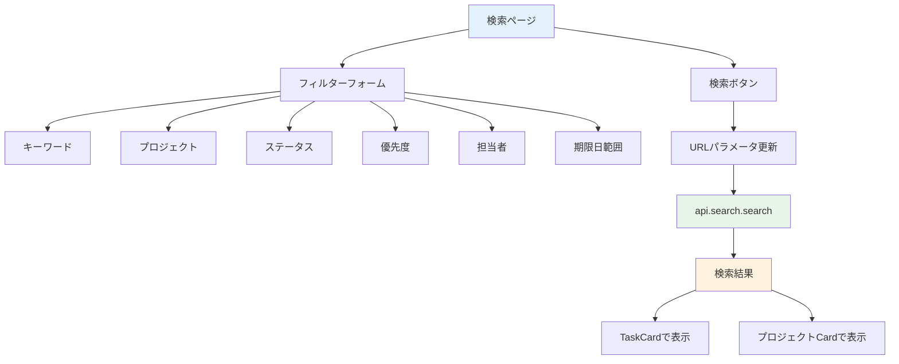

# Day 20: タスク検索機能を実装しよう

## 🎯 今日のゴール

キーワードや複数のフィルター条件でタスクを
検索できるページを作ります。検索条件は
URLパラメータに保存し、共有可能にします。


## 🤔 なぜこれを作るのか？

タスクが増えると目的のものが見つけにくくなります。

> 💡 **例え話**: 検索機能は「図書館の検索端末」
> です。タイトル、ジャンル、著者といった
> 複数の条件を組み合わせて、膨大な蔵書から
> 目的の本をすぐに見つけられます。

### 📐 検索機能の構成



### やること / やらないこと

| やること | やらないこと |
|---------|-------------|
| 複数条件でフィルター | リアルタイム検索 |
| URLパラメータ保存 | 検索結果の並び替え |
| TaskCard で結果表示 | ページネーション |
| プロジェクト結果表示 | 検索履歴 |

### 🆕 新しく学ぶ概念

| 概念 | 読み方 | 役割 | 例え |
|------|--------|------|------|
| search.search | — | 検索API | 図書館の蔵書検索 |
| URLSearchParams | — | URL条件管理 | 検索条件の付箋 |
| shouldSearch | — | 検索実行フラグ | 検索ボタンを押したか |

## 📊 実装ステップ一覧

| ステップ | 作業内容 | 所要時間 |
|---------|---------|---------|
| Step 1 | 検索APIを理解する | 3分 |
| Step 2 | ページの土台を作る | 3分 |
| Step 3 | フィルターフォームを作る | 7分 |
| Step 4 | URLパラメータと連動させる | 5分 |
| Step 5 | 検索APIを呼び出す | 5分 |
| Step 6 | 検索結果を表示する | 5分 |
| Step 7 | 動作確認 | 3分 |

**合計時間**: 約31分

---

### Step 1: 検索APIを理解する（3分）

🎯 **ゴール**: search ルーターの構成を
把握します。

#### search ルーターの全メソッド

| メソッド | 種別 | 説明 |
|---------|------|------|
| `search` | query | 検索実行（メイン） |
| `quickSearch` | query | クイック検索 |
| `getUserProjects` | query | ユーザーのプロジェクト |
| `getProjectMembers` | query | プロジェクトメンバー |

#### search メソッドのパラメータ

| パラメータ | 型 | 必須 | 説明 |
|-----------|-----|------|------|
| `keyword` | string? | — | キーワード |
| `projectId` | string? | — | プロジェクト |
| `status` | string? | — | ステータス |
| `priority` | string? | — | 優先度 |
| `assignedTo` | string? | — | 担当者 |
| `dateFrom` | string? | — | 期限開始 |
| `dateTo` | string? | — | 期限終了 |

> 💡 全てのパラメータが任意です。
> 条件を指定した分だけ絞り込まれます。

✅ **確認ポイント**:
- 7つのフィルターを把握した

---

### Step 2: ページの土台を作る（3分）

🎯 **ゴール**: 検索ページの基本構造を
作ります。

💻 **実装**:

```typescript
// filepath: src/app/search/page.tsx
'use client';

import { AppLayout }
  from '@/component/layout/app-layout';
import { api } from '@/trpc/react';
import { Suspense, useState } from 'react';
import {
  useRouter, useSearchParams,
} from 'next/navigation';

function SearchPageContent() {
  const router = useRouter();
  const searchParams = useSearchParams();
  const utils = api.useUtils();

  return (
    <AppLayout>
      <div className="space-y-6">
        <h1 className="text-3xl font-bold
          tracking-tight">検索</h1>
      </div>
    </AppLayout>
  );
}
```

> 💡 `useSearchParams` でURLの検索条件を
> 読み取ります。`useRouter` で条件変更時に
> URLを更新します。

✅ **確認ポイント**:
- `/search` にアクセスして表示される

---

### Step 3: フィルターフォームを作る（7分）

🎯 **ゴール**: 7つのフィルター条件の
UIを構築します。

💻 **実装**:

```typescript
// filepath: src/app/search/page.tsx
import { Input } from '@/component/ui/input';
import { Label } from '@/component/ui/label';
import { Button } from '@/component/ui/button';
import {
  Select, SelectContent, SelectItem,
  SelectTrigger, SelectValue,
} from '@/component/ui/select';
import { Search } from 'lucide-react';
```

```typescript
// filepath: src/app/search/page.tsx
// SearchPageContent内のstate
const [keyword, setKeyword] =
  useState(searchParams.get('keyword')
    || '');
const [projectId, setProjectId] =
  useState(searchParams.get('projectId')
    || '');
const [status, setStatus] =
  useState(searchParams.get('status')
    || 'all');
const [priority, setPriority] =
  useState(searchParams.get('priority')
    || 'all');
```

```typescript
// filepath: src/app/search/page.tsx
// キーワード入力フィールド
<div className="grid gap-2">
  <Label htmlFor="keyword">
    キーワード
  </Label>
  <div className="relative">
    <Search className="absolute left-2
      top-3 h-4 w-4
      text-muted-foreground" />
    <Input id="keyword"
      placeholder="タスク名、説明で検索..."
      className="pl-8"
      value={keyword}
      onChange={(e) =>
        setKeyword(e.target.value)}
      onKeyDown={(e) => {
        if (e.key === 'Enter')
          handleSearch();
      }} />
  </div>
</div>
```

> 💡 `onKeyDown` で Enter キーを検知し、
> 検索を実行します。Search アイコンは
> `absolute` で入力欄の左に配置します。

✅ **確認ポイント**:
- キーワード入力欄が表示される
- Select でフィルターが選べる


---

### Step 4: URLパラメータと連動させる（5分）

🎯 **ゴール**: 検索条件をURLに保存し、
ブラウザの「戻る」や共有に対応します。

💻 **実装**:

```typescript
// filepath: src/app/search/page.tsx
// 検索実行ハンドラー
const handleSearch = () => {
  const params = new URLSearchParams();
  if (keyword)
    params.set('keyword', keyword);
  if (projectId)
    params.set('projectId', projectId);
  if (status !== 'all')
    params.set('status', status);
  if (priority !== 'all')
    params.set('priority', priority);
  router.push(
    `/search?${params.toString()}`);
};
```

```typescript
// filepath: src/app/search/page.tsx
// クリアハンドラー
const handleClear = () => {
  setKeyword('');
  setProjectId('');
  setStatus('all');
  setPriority('all');
  router.push('/search');
};
```

> 💡 `URLSearchParams` はURLの `?key=value`
> 部分を手軽に操作できるブラウザ標準APIです。
> 検索条件がURLに残るので、ページを
> リロードしても条件が維持されます。

✅ **確認ポイント**:
- 検索後にURLが `?keyword=xxx` になる
- クリアでURLが `/search` に戻る

---

### Step 5: 検索APIを呼び出す（5分）

🎯 **ゴール**: フィルター条件で
`api.search.search` を呼びます。

💻 **実装**:

```typescript
// filepath: src/app/search/page.tsx
// 検索条件が1つでもあるかチェック
const shouldSearch =
  !!keyword || !!projectId
  || status !== 'all'
  || priority !== 'all';
```

```typescript
// filepath: src/app/search/page.tsx
// 検索API呼び出し
const { data: searchResults, isLoading }
  = api.search.search.useQuery(
  {
    keyword: keyword || undefined,
    projectId: projectId || undefined,
    status: status,
    priority: priority,
  },
  {
    enabled: shouldSearch,
    refetchOnWindowFocus: false,
  },
);
```

> 💡 `enabled: shouldSearch` で条件が
> 空のときはAPIを呼びません。
> Day 12 で学んだパターンと同じです。

✅ **確認ポイント**:
- 条件を入力すると検索結果が返る

---

### Step 6: 検索結果を表示する（5分）

🎯 **ゴール**: 検索結果をTaskCardで表示します。

💻 **実装**:

```typescript
// filepath: src/app/search/page.tsx
import { TaskCard }
  from '@/component/task/task-card';
import { Loader2 } from 'lucide-react';

// ナビゲーションハンドラー
const handleTaskClick =
  (taskId: string) => {
    router.push(`/task?taskId=${taskId}`);
  };
```

```typescript
// filepath: src/app/search/page.tsx
// 検索結果の表示
{searchResults
  && searchResults.tasks.length > 0 && (
  <div className="grid gap-6
    sm:grid-cols-2 lg:grid-cols-3">
    {searchResults.tasks.map((task) => (
      <TaskCard key={task.id}
        id={task.id}
        title={task.title}
        description={task.description}
        status={task.status}
        priority={task.priority}
        dueDate={task.dueDate}
        assignee={task.assignee}
        onClick={handleTaskClick} />
    ))}
  </div>
)}
```

> 💡 `searchResults.tasks` にタスク、
> `searchResults.projects` にプロジェクトが
> 含まれます。Day 13 の TaskCard を
> そのまま再利用できます。

✅ **確認ポイント**:
- 検索結果がカード表示される
- カードクリックでタスク詳細に遷移


---

### Step 7: 動作確認（3分）

🎯 **ゴール**: 検索機能の全体を確認します。

1. `/search` にアクセス
2. キーワードを入力して検索
3. プロジェクトで絞り込み
4. ステータスで絞り込み
5. 「クリア」で条件リセット
6. 検索結果のカードをクリック
7. URLに検索条件が含まれる

✅ **確認ポイント**:
- 複数の条件で絞り込める
- URLをコピーして共有できる
- カードクリックで詳細に遷移


---

## 📋 今日のまとめ

- [ ] 検索フォームを作成できた
- [ ] `api.search.search` で検索できた
- [ ] URLパラメータと連動させた
- [ ] 検索結果をTaskCardで表示できた

## ⚠️ つまずきポイント

| エラー / 問題 | 原因 | 解決方法 |
|--------------|------|---------|
| 毎回APIが呼ばれる | enabled条件が不適切 | shouldSearchでガード |
| URLが更新されない | router.push忘れ | handleSearchに追加 |
| 結果が0件表示 | パラメータ形式が違う | undefined vs 空文字 |
| Enter検索が効かない | onKeyDown未設定 | Enterでhandlesearch |

## 📝 今日学んだ用語

| 用語 | 意味 |
|------|------|
| URLSearchParams | URLのクエリパラメータ操作API |
| shouldSearch | 検索実行の判定フラグ |
| enabled | useQueryの実行条件制御 |
| refetchOnWindowFocus | ウィンドウ復帰時の再取得設定 |

## 🔜 次回予告

Day 21 では、レポートページに統計カードを
表示します。タスクデータをローカルで集計して
ダッシュボードを作ります。
