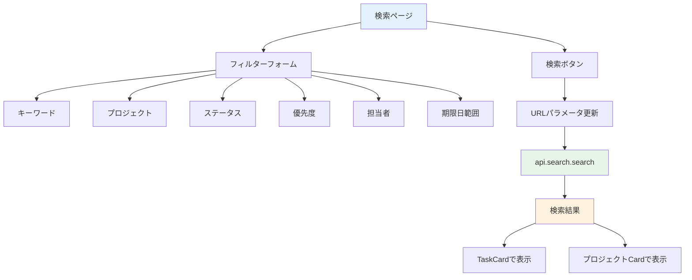

# Day 20: タスク検索機能を実装しよう

## 前回の振り返り

Day 19 ではコメントの編集・削除機能を実装し、自分が書いたコメントだけを操作できる権限チェックも加えました。今日はキーワードとフィルターでタスクを検索する機能に取り組みます。

---

## 今日のゴール

キーワードや複数のフィルター条件でタスクを検索できるページを作ります。検索条件はURLパラメータに保存し、共有可能にします。

スクリーンショット: 検索画面とフィルタリングされた結果。


> **今日のゴールライン**: 検索フォームの条件をURLに反映し、絞り込んだタスクとプロジェクト結果を共有できる形で表示できればOK。

## なぜこれを作るのか

タスクが増えると目的のものが見つけにくくなります。たとえばプロジェクトに50件のタスクがあるとき、「優先度：高」で絞り込むと数件だけ表示されます。

> **例え話**: 検索機能は「図書館の検索端末」です。タイトル・ジャンル・著者といった複数の条件を組み合わせて、膨大な蔵書から目的の本をすぐに見つけられます。

### 検索機能の構成



### やること / やらないこと

| やること | やらないこと |
|---------|-------------|
| 複数条件でフィルター | リアルタイム検索 |
| URLパラメータ保存 | 検索結果の並び替え |
| TaskCard で結果表示 | ページネーション |
| プロジェクト結果表示 | 検索履歴 |

### 今日作成・編集するファイル

| ファイル | 役割 |
|---------|------|
| `src/server/api/routers/search.ts` | search ルーターの残り3手続きを追記し、完成版の並びに揃える |
| `src/app/search/page.tsx` | 検索ページ本体（新規作成） |
| `src/app/search/loading.tsx` | ローディング画面（既存） |

### 新しく学ぶ概念

| 概念 | 読み方 | 役割 | 例え |
|------|--------|------|------|
| search.search | — | 検索API | 図書館の蔵書検索 |
| URLSearchParams | ユーアールエルサーチパラムズ | URLの検索条件を操作するブラウザ標準API | 検索条件の付箋 |
| shouldSearch | シュッドサーチ | 1つでも条件があるか判定するフラグ | 検索ボタンを押す前の確認 |
| useForm（復習） | ユーズフォーム | フォーム状態管理（Day 14 参照） | 検索条件の管理係 |
| watch | ウォッチ | フォームの値をリアクティブに監視 | 入力が変わるたびに条件を更新 |

## 実装ステップ一覧

| ステップ | 作業内容 | 所要時間 |
|---------|---------|---------|
| Step 0 | search ルーターの残り3手続きを自分で書く | 22分 |
| Step 1 | 検索画面から使うAPIを確認する | 3分 |
| Step 2 | ページの土台を作る | 5分 |
| Step 3 | zodスキーマとuseFormを設定する | 5分 |
| Step 4 | キーワード入力とプロジェクトフィルター | 5分 |
| Step 5 | ステータス・優先度・担当者・期限フィルター | 7分 |
| Step 6 | handleSearchとhandleClearを定義する | 5分 |
| Step 7 | URL同期と検索API呼び出し | 5分 |
| Step 8 | タスク検索結果を表示する | 5分 |
| Step 9 | プロジェクト結果と削除機能を追加する | 5分 |
| Step 10 | 動作確認 | 3分 |

**合計時間**: 約70分。

---

### Step 0: search ルーターの残り3手続きを自分で書く（22分）

**ゴール**: Day 14 で作った `src/server/api/routers/search.ts` に、
残っている `search`・`quickSearch`・`getUserProjects` を追記します。
最後に、この Step で示す5手続きの順序と確認ポイントを使って自己点検します。

Day 14 では担当者候補を取る 2 手続きだけを先に作りました。今日はその続きです。検索画面は `api.search.search` と `api.search.getUserProjects` を使います。さらに `quickSearch` は画面から直接は呼ばれませんが、完成版 source とテストでは使うので、ここで一緒に仕上げます。

大事なのは、**今日の作業で `search.ts` を完成版 source と同じ並びに揃える**ことです。Day 14 の時点では `getProjectMembers` と `getMembersByProject` だけを先に書きましたが、完成版ではその前に `search`・`quickSearch`・`getUserProjects` が入ります。ここで順番を整えておくと、以降の Day と差分を見比べやすくなります。

#### 0-1. まず足りない import と定数を追加する

Day 14 で書いた import に、今日初めて必要になるものだけを足します。
`Prisma` は検索条件の型に使います。
`taskStatusSchema` と `taskPrioritySchema` は検索フォーム入力の検証に使います。
`getUserProjectIds` は「自分が参加しているプロジェクトだけを検索対象にする」ために使います。

```typescript
// filepath: src/server/api/routers/search.ts（既存 import に追記）
import type { Prisma } from '@prisma/client';
import { taskPrioritySchema, taskStatusSchema } from '@/lib/constant/query';
import { getUserProjectIds } from './_helpers/permission';
```

続けて、Day 14 の `import` 群の下に検索件数の上限を置きます。

```typescript
// filepath: src/server/api/routers/search.ts（import の下に追加）
const SEARCH_TASK_LIMIT = 100;
const SEARCH_PROJECT_LIMIT = 20;
const QUICK_SEARCH_TASK_LIMIT = 20;
const QUICK_SEARCH_PROJECT_LIMIT = 10;
```

`LIMIT` を定数にしておくと、あとから「検索結果を20件までにしよう」と変えたいときも、数字を探し回らずに済みます。最初に名前を付けておくと、処理本体を読むときも「これは検索件数の上限だな」と一目で分かります。

#### 0-2. 検索入力スキーマを追加する

次に、`search` と `quickSearch` が受け取る入力を zod で定義します。Day 14 の `searchRouter` 宣言の前に、次の 2 つを追加してください。

```typescript
// filepath: src/server/api/routers/search.ts（searchRouter の前に追加）
const searchInputSchema = z.object({
  keyword: z.string().optional(),
  projectId: z.string().cuid().optional(),
  status: z
    .union([z.literal('all'), taskStatusSchema])
    .optional()
    .default('all'),
  priority: z
    .union([z.literal('all'), taskPrioritySchema])
    .optional()
    .default('all'),
  assignedTo: z.string().cuid().optional(),
  dateFrom: z.string().datetime().optional(),
  dateTo: z.string().datetime().optional(),
});
```

`status` と `priority` が `z.union([z.literal('all'), ...])` になっているのは、「特定の値で絞り込む」だけでなく「絞り込みなし」も受け取りたいからです。検索フォーム側では「すべて」を `'all'` で送るので、サーバー側もその値を受け取れる形にしておきます。

```typescript
// filepath: src/server/api/routers/search.ts（続き）
const quickSearchInputSchema = z.object({
  keyword: z.string().min(1, 'キーワードは必須です'),
});
```

`quickSearch` は検索窓に文字を入れてすぐ使う用途なので、空文字は受け付けません。ここで `.min(1, ...)` を付けておくと、「検索語なしで呼ばれる」事故を入口で止められます。

#### 0-3. 動的な検索条件を組み立てる部品を作る

複数条件検索は、最初から `.findMany({ where: ... })` を一気に書くと見通しが悪くなります。そこで、完成版 source では「条件を小さな部品に分けてから最後に合体する」形にしています。Day 14 の `searchRouter` の前へ、次を上から順に追加します。

```typescript
// filepath: src/server/api/routers/search.ts（続き）
type FilterConfig = {
  key: keyof Prisma.TaskWhereInput;
  value: string | undefined;
  transform?: (value: string) => Prisma.TaskWhereInput[keyof Prisma.TaskWhereInput];
};
```

`FilterConfig` は「どの列に」「どの値を」「必要ならどう変換して」入れるかを表す設計図です。後で `projectId`・`status`・`priority`・`assigneeId` を同じパターンで処理できるように、この形を先に決めています。

```typescript
// filepath: src/server/api/routers/search.ts（続き）
const buildDynamicWhere = (filters: FilterConfig[]): Partial<Prisma.TaskWhereInput> => {
  const result: Partial<Prisma.TaskWhereInput> = {};
  for (const f of filters) {
    if (f.value !== undefined && f.value !== 'all') {
      Object.assign(result, { [f.key]: f.transform ? f.transform(f.value) : f.value });
    }
  }
  return result;
};
```

ここで大事なのは `f.value !== 'all'` の判定です。検索フォームでは「すべて」を `'all'` で送りますが、そのまま `where` に入れると `status = 'all'` のような存在しない条件になってしまいます。だから `'all'` は「条件を足さない」という意味で捨てます。

```typescript
// filepath: src/server/api/routers/search.ts（続き）
const buildKeywordFilter = (keyword: string, fields: string[]) =>
  fields.map((field) => ({
    [field]: { contains: keyword, mode: 'insensitive' satisfies Prisma.QueryMode },
  }));
```

`mode: 'insensitive'` は大文字・小文字を区別しない検索です。`Task` と `task` を別物扱いしないので、ユーザーが入力の細かい表記を意識せずに済みます。

```typescript
// filepath: src/server/api/routers/search.ts（続き）
const buildDateRangeFilter = (dateFrom?: string, dateTo?: string) => {
  const dateFilter: Partial<{ gte: Date; lte: Date }> = {};
  if (dateFrom) {
    dateFilter.gte = new Date(dateFrom);
  }
  if (dateTo) {
    dateFilter.lte = new Date(dateTo);
  }
  return Object.keys(dateFilter).length > 0 ? dateFilter : undefined;
};
```

`gte` は「この日以降」、`lte` は「この日以前」です。両方そろっていなくても動くように、開始日だけ・終了日だけでも条件を作れる形にしています。

#### 0-4. 既存の 2 手続きを下へ移し、search を先頭に入れる

ここからが本体です。Day 14 で書いた `getProjectMembers` と
`getMembersByProject` は、いったんそのまま残してよいです。
ただし最終的には、その前に `search`・`quickSearch`・`getUserProjects`
が並ぶ形にしてください。
完成形の `export const searchRouter = createTRPCRouter({ ... })` の先頭は、
まず `search:` から始まります。

まず `search` を追加します。`export const searchRouter = createTRPCRouter({` の直後へ、次の 4 ブロックを順に入れてください。

```typescript
// filepath: src/server/api/routers/search.ts（searchRouter の先頭に追加）
  search: protectedProcedure.input(searchInputSchema).query(async ({ input, ctx }) => {
    const userId = ctx.session.userId;
    const keyword = input.keyword?.trim();

    const baseFilters: FilterConfig[] = [
      { key: 'projectId', value: input.projectId },
      { key: 'status', value: input.status },
      { key: 'priority', value: input.priority },
      { key: 'assigneeId', value: input.assignedTo },
    ];
```

`keyword?.trim()` の `?.` は「値があるときだけ `.trim()` する」です。
前後の空白だけで検索したときに、空白を条件として持ち込まないためです。
そのため最初に整えています。

```typescript
// filepath: src/server/api/routers/search.ts（続き）
    const dueDateFilter = buildDateRangeFilter(input.dateFrom, input.dateTo);

    const projectIds = await getUserProjectIds(userId);

    const andConditions: Prisma.TaskWhereInput[] = [
      { projectId: { in: projectIds } },
      buildDynamicWhere(baseFilters),
    ];
    if (dueDateFilter) {
      andConditions.push({ dueDate: dueDateFilter });
    }
```

`getUserProjectIds(userId)` が重要です。これで「自分が所属しているプロジェクト id の一覧」を先に取り、`projectId: { in: projectIds }` で検索対象を絞ります。これを入れないと、キーワードさえ合えば他人のプロジェクトのタスクまで検索できてしまいます。

```typescript
// filepath: src/server/api/routers/search.ts（続き）
    if (keyword) {
      andConditions.push({ OR: buildKeywordFilter(keyword, ['title', 'description']) });
    }

    const taskWhere: Prisma.TaskWhereInput = { AND: andConditions };

    const tasks = await prisma.task.findMany({
      where: taskWhere,
      include: {
        project: true,
        createdBy: {
          select: USER_SELECT,
        },
```

検索条件を `AND` の配列で積み上げているのは、「参加中プロジェクトであること」「指定したフィルターに合うこと」「キーワードが合うこと」を全部同時に満たさせたいからです。条件が増えても、配列に 1 個ずつ足していけば読みやすさを保てます。

```typescript
// filepath: src/server/api/routers/search.ts（続き）
        assignee: {
          select: USER_SELECT,
        },
      },
      orderBy: { updatedAt: 'desc' },
      take: SEARCH_TASK_LIMIT,
    });

    const projects = !keyword
      ? []
      : await prisma.project.findMany({
          where: {
            members: {
              some: { userId },
            },
```

プロジェクト検索は `!keyword ? []` で分岐しています。プロジェクト名検索はキーワードがあって初めて意味があるので、空検索のときは無理に DB を読まず、空配列を返します。

```typescript
// filepath: src/server/api/routers/search.ts（続き）
            OR: buildKeywordFilter(keyword, ['name', 'description']),
          },
          include: {
            members: {
              include: {
                user: {
                  select: USER_SELECT,
                },
              },
            },
            _count: {
              select: { tasks: true },
            },
```

```typescript
// filepath: src/server/api/routers/search.ts（続き）
          },
          orderBy: { updatedAt: 'desc' },
          take: SEARCH_PROJECT_LIMIT,
        });

    return {
      tasks,
      projects,
      totalCount: tasks.length + projects.length,
    };
  }),
```

`totalCount` をサーバー側で返しておくと、フロントエンドは `tasks.length + projects.length` を毎回書かずに済みます。検索結果の件数表示にそのまま使えるので、画面側の責務が軽くなります。

#### 0-5. quickSearch をその次に追加する

続けて `search` の直後に `quickSearch` を追加します。これは検索ページ本体ではまだ使いませんが、完成版 source とテストで必要です。

```typescript
// filepath: src/server/api/routers/search.ts（search の直後に追加）
  quickSearch: protectedProcedure.input(quickSearchInputSchema).query(async ({ input, ctx }) => {
    const userId = ctx.session.userId;
    const keyword = input.keyword.trim();

    const projectIds = await getUserProjectIds(userId);

    const [tasks, projects] = await Promise.all([
      prisma.task.findMany({
        where: {
          projectId: { in: projectIds },
          OR: buildKeywordFilter(keyword, ['title', 'description']),
        },
```

`Promise.all([...])` にしているのは、タスク検索とプロジェクト検索に
互いを待つ必要がないからです。
順番に 2 回待つより、同時実行のほうが検索体験は軽くなります。

```typescript
// filepath: src/server/api/routers/search.ts（続き）
        include: {
          project: true,
          createdBy: { select: USER_SELECT },
          assignee: { select: USER_SELECT },
        },
        orderBy: { updatedAt: 'desc' },
        take: QUICK_SEARCH_TASK_LIMIT,
      }),
      prisma.project.findMany({
        where: {
          members: { some: { userId } },
          OR: buildKeywordFilter(keyword, ['name', 'description']),
        },
```

```typescript
// filepath: src/server/api/routers/search.ts（続き）
        include: {
          members: {
            include: { user: { select: USER_SELECT } },
          },
          _count: { select: { tasks: true } },
        },
        orderBy: { updatedAt: 'desc' },
        take: QUICK_SEARCH_PROJECT_LIMIT,
      }),
    ]);
```

```typescript
// filepath: src/server/api/routers/search.ts（続き）
    return {
      tasks,
      projects,
      totalCount: tasks.length + projects.length,
    };
  }),
```

`quickSearch` は `search` より件数上限が小さく、絞り込み条件もキーワードだけです。つまり「しっかり探す」より「さっと候補を見る」用に薄く作っています。同じ検索でも、用途が違えば上限や入力を変えると使い勝手が良くなります。

#### 0-6. getUserProjects を追加する

検索フォームのプロジェクト Select では、参加中のプロジェクト一覧が必要です。そのための `getUserProjects` を、`quickSearch` の直後に追加します。

```typescript
// filepath: src/server/api/routers/search.ts（quickSearch の直後に追加）
  getUserProjects: protectedProcedure.query(async ({ ctx }) => {
    const userId = ctx.session.userId;

    const projects = await prisma.project.findMany({
      where: {
        members: {
          some: {
            userId,
          },
        },
      },
```

```typescript
// filepath: src/server/api/routers/search.ts（続き）
      include: {
        _count: {
          select: { tasks: true },
        },
      },
      orderBy: { name: 'asc' },
    });

    return projects;
  }),
```

ここでは `members.some.userId` で「自分が入っているプロジェクトだけ」を取り、`orderBy: { name: 'asc' }` で名前順に並べています。検索フォームの Select は毎回同じ順で並んだほうが探しやすいので、更新順ではなく名前順にしています。

#### 0-7. 既存の 2 手続きはそのまま下へ続ける

この時点で `search.ts` の並びは、上から次の順になります。

1. `search`
2. `quickSearch`
3. `getUserProjects`
4. `getProjectMembers`
5. `getMembersByProject`

Day 14 で書いた `getProjectMembers` と `getMembersByProject` のコード自体は変えません。位置だけが後ろへ下がるイメージです。`root.ts` は Day 18 までに `auth → project → task → search → comment` の時系列順で登録済みなので、今日は追加で触らなくて大丈夫です。`report` と `user` は、それぞれ Day 21 と Day 24 で初めて追加します。

#### 0-8. 最後に完成形を自己点検する

`src/server/api/routers/search.ts` を先頭から読み直し、次の確認ポイントと照らし合わせてください。販売用 ZIP には完成済み router を入れていないため、この教材内のコードと順序が正本です。

**確認ポイント**:
- `search.ts` の手続き順が `search → quickSearch → getUserProjects → getProjectMembers → getMembersByProject` になっている
- `searchInputSchema` / `quickSearchInputSchema` / `FilterConfig` / 3つの helper が `searchRouter` の前にある
- `root.ts` は Day 18 のまま、`search: searchRouter` が `task` と `comment` の間にある
- `npm run dev` で型エラーが出ていない

---

### Step 1: 検索画面から使うAPIを確認する（3分）

**ゴール**: 今書いた `search` ルーターのうち、検索画面がどの手続きを呼ぶのかを整理します。

Day 20 の画面が直接使うのは、主に `search.search` と `search.getUserProjects` です。担当者フィルターには Day 14 で作った `search.getProjectMembers` も使います。まず `src/server/api/routers/search.ts` を開き、`searchInputSchema` と `getUserProjects` を確認しましょう。

```typescript
// filepath: src/server/api/routers/search.ts
// 検索パラメータのバリデーション定義
const searchInputSchema = z.object({
  keyword: z.string().optional(),
  projectId: z.string().cuid().optional(),
  status: z.union([
    z.literal('all'),
    taskStatusSchema,
  ]).optional().default('all'),
  priority: z.union([
    z.literal('all'),
    taskPrioritySchema,
  ]).optional().default('all'),
  assignedTo:
    z.string().cuid().optional(),
  dateFrom:
    z.string().datetime().optional(),
  dateTo:
    z.string().datetime().optional(),
});
```

**確認ポイント**:
- 7つのフィルターパラメータを把握した
- `status` と `priority` が union 型である

#### search ルーターの全メソッド

| メソッド | 種別 | 説明 |
|---------|------|------|
| `search` | query | 検索実行（メイン） |
| `quickSearch` | query | クイック検索 |
| `getUserProjects` | query | ユーザーのプロジェクト取得 |
| `getProjectMembers` | query | 参加中プロジェクトを横断した、担当者候補の取得 |
| `getMembersByProject` | query | 選択中プロジェクトだけの、担当者候補の取得 |

#### search メソッドのパラメータ

| パラメータ | 型 | 必須 | 説明 |
|-----------|-----|------|------|
| `keyword` | `string?` | — | キーワード |
| `projectId` | `string (cuid)?` | — | プロジェクト |
| `status` | `'all'` \| TaskStatus | — | ステータス（デフォルト `'all'`） |
| `priority` | `'all'` \| TaskPriority | — | 優先度（デフォルト `'all'`） |
| `assignedTo` | `string (cuid)?` | — | 担当者 |
| `dateFrom` | `string (ISO日付)?` | — | 期限開始 |
| `dateTo` | `string (ISO日付)?` | — | 期限終了 |

> `search` は「複数条件検索」、`quickSearch` は「キーワードだけの軽い検索」、`getUserProjects` は「検索フォームの選択肢取得」と役割が分かれています。使い道が違うので、似た名前でも1本に詰め込まず分けています。

> **`dateFrom` / `dateTo` は date-only 入力です。**
> 完成版 source では生の Date 変換をそのまま使わず、
> `dateOnlyToUtcStartIso` /
> `dateOnlyToUtcEndIso` で日付境界を UTC に変換してから
> API に渡します。これを省くとタイムゾーンによって
> 「4/17 のつもりが 4/16 扱いになる」ずれが起きます。

---

### Step 2: ページの土台を作る（5分）

**ゴール**: 検索ページの基本構造と export default を完成させます。

`src/app/search/page.tsx` を新規作成します。まずインポートを記述します。

```typescript
// filepath: src/app/search/page.tsx
'use client';

import { zodResolver }
  from '@hookform/resolvers/zod';
import { Search } from 'lucide-react';
import {
  useRouter, useSearchParams,
} from 'next/navigation';
import {
  Suspense, useCallback, useEffect,
  useMemo, useState,
} from 'react';
import { useForm } from 'react-hook-form';
import toast from 'react-hot-toast';
import { z } from 'zod';
```

**確認ポイント**:
- `useForm`, `zodResolver`, `z` がインポートされている

続いてローカルモジュールのインポートです。

```typescript
// filepath: src/app/search/page.tsx
import { AppLayout }
  from '@/component/layout/app-layout';
import { TaskCard }
  from '@/component/task/task-card';
import { Button }
  from '@/component/ui/button';
import {
  Card, CardContent,
} from '@/component/ui/card';
import { DeleteConfirmDialog }
  from '@/component/ui/delete-confirm-dialog';
import { Input }
  from '@/component/ui/input';
import { Label }
  from '@/component/ui/label';
```

**確認ポイント**:
- レイアウト・UIコンポーネントが揃っている

```typescript
// filepath: src/app/search/page.tsx
import { PageLoadingSpinner }
  from '@/component/ui/loading-spinner';
import {
  Select, SelectContent, SelectItem,
  SelectTrigger, SelectValue,
} from '@/component/ui/select';
import { Separator }
  from '@/component/ui/separator';
import {
  isTaskPriority,
  TASK_PRIORITY_LABELS,
} from '@/lib/constant/priority';
```

続けて、ロール判定用と検索条件用のインポートを追加します。

```typescript
// filepath: src/app/search/page.tsx
import {
  hasPermission, isProjectMemberRole,
  type ProjectMemberRole,
} from '@/lib/constant/roles';
import {
  isTaskStatus,
  TASK_STATUS_LABELS,
} from '@/lib/constant/status';
import {
  dateOnlyToUtcEndIso,
  dateOnlyToUtcStartIso,
} from '@/lib/date';
import { api } from '@/trpc/react';
```

**確認ポイント**:
- `PageLoadingSpinner` のパスが `@/component/ui/loading-spinner`
- 型ガード `isTaskStatus` / `isTaskPriority` がインポートされている

`SearchPageContent` の外枠と `export default` を書きます。`useSearchParams` は Suspense 境界が必要です。

```typescript
// filepath: src/app/search/page.tsx
// コンポーネント本体の外枠
function SearchPageContent() {
  const router = useRouter();
  const searchParams = useSearchParams();
  const utils = api.useUtils();

  return (
    <AppLayout>
      <div className="space-y-6">
        <div>
          <h1 className="text-3xl font-bold
            tracking-tight">検索</h1>
          <p className="text-muted-foreground">
            タスクやプロジェクトを検索します
          </p>
        </div>
        {/* Step 4-5: フィルターフォーム */}
        {/* Step 8-9: 検索結果 */}
      </div>
    </AppLayout>
  );
}
```

**確認ポイント**:
- `utils` は検索結果の再取得（削除後）に使う
- コメントでフォームと結果の挿入位置を示している

> `useSearchParams` はURL のクエリ文字列を読み取る Next.js のフックです。`useRouter` はプログラムからURL遷移するために使います。

```typescript
// filepath: src/app/search/page.tsx
// Suspenseでラップしてexport
export default function SearchPage() {
  return (
    <Suspense
      fallback={<PageLoadingSpinner />}>
      <SearchPageContent />
    </Suspense>
  );
}
```

**確認ポイント**:
- `/search` にアクセスして画面が表示される
- `PageLoadingSpinner` で読み込み中が表示される

> Next.js App Router では `useSearchParams` を使うコンポーネントを `Suspense` で囲む必要があります。囲まないとビルド時にエラーになります。

---

### Step 3: zodスキーマとuseFormを設定する（5分）

**ゴール**: 7つのフィルター条件を zod スキーマと useForm で一括管理します。

`SearchPageContent` の外側（関数の上）にスキーマを定義します。サーバー側の `searchInputSchema` と型を合わせます。

```typescript
// filepath: src/app/search/page.tsx
// ステータス・優先度の値定義
const TASK_STATUS_VALUES = [
  'TODO', 'IN_PROGRESS', 'IN_REVIEW',
  'DONE', 'CANCELLED',
] as const;
const TASK_PRIORITY_VALUES = [
  'LOW', 'MEDIUM', 'HIGH', 'URGENT',
] as const;
```

**確認ポイント**:
- サーバー側の `taskStatusSchema` / `taskPrioritySchema` と値が一致している

```typescript
// filepath: src/app/search/page.tsx
// 検索フォームの zodスキーマ
const searchFormSchema = z.object({
  keyword: z.string(),
  projectId: z.string(),
  status: z.enum([
    'all', ...TASK_STATUS_VALUES,
  ]),
  priority: z.enum([
    'all', ...TASK_PRIORITY_VALUES,
  ]),
  assignedTo: z.string(),
  dateFrom: z.string(),
  dateTo: z.string(),
});
type SearchFormValues =
  z.infer<typeof searchFormSchema>;
```

**確認ポイント**:
- `status` / `priority` が `'all'` + 実際の値の union になっている
- サーバー側と型が合っている（`z.string()` ではなく `z.enum`）

`SearchPageContent` 内に `useForm` を追加します。URLパラメータから初期値を型安全に設定します。

```typescript
// filepath: src/app/search/page.tsx
// SearchPageContent内: 初期値の準備
const initialStatus =
  searchParams.get('status') ?? 'all';
const initialPriority =
  searchParams.get('priority') ?? 'all';

const form = useForm<SearchFormValues>({
  resolver: zodResolver(searchFormSchema),
  defaultValues: {
    keyword:
      searchParams.get('keyword') ?? '',
    projectId:
      searchParams.get('projectId')
        ?? 'all',
    status: isTaskStatus(initialStatus)
      ? initialStatus : 'all',
```

**確認ポイント**:
- `??` を使って初期値を設定している（`||` ではない）

```typescript
// filepath: src/app/search/page.tsx
// defaultValues の続き
    priority:
      isTaskPriority(initialPriority)
        ? initialPriority : 'all',
    assignedTo:
      searchParams.get('assignedTo')
        ?? 'all',
    dateFrom:
      searchParams.get('dateFrom') ?? '',
    dateTo:
      searchParams.get('dateTo') ?? '',
  },
});
```

**確認ポイント**:
- `isTaskStatus` / `isTaskPriority` で型安全にバリデーションしている
- 7つのフィールドが1つの `useForm` で管理されている

`watch` でフォームの現在値を取得し、プルダウン用データを取得します。

```typescript
// filepath: src/app/search/page.tsx
// フォームの現在値を監視
const formValues = form.watch();

const { data: projects } =
  api.search.getUserProjects.useQuery();
const { data: users } =
  api.search.getProjectMembers.useQuery();
```

**確認ポイント**:
- `watch()` でフォームの値をリアクティブに取得している

> Day 14 では `register` と `Controller` で各入力を管理しました。検索フォームでは `setValue` と `watch` の組み合わせで Select コンポーネントの値も管理できます。

検索結果の TaskCard にも編集・削除ボタンの表示可否が必要です。Day 13 と同じロール判定を、ログインユーザーとメンバー所属プロジェクトから求めます。`projects`（Selectの選択肢用）とは別に、ロール情報つきのプロジェクト一覧を取得します。

```typescript
// filepath: src/app/search/page.tsx
// ログインユーザーの情報とロール判定用のプロジェクト一覧
const { data: session } =
  api.auth.getSession.useQuery();
const { data: memberProjects } =
  api.project.getAll.useQuery();

// プロジェクトごとのログインユーザー自身のロールを引けるようにする
const myRoleByProject = useMemo(() => {
  const map = new Map<string, ProjectMemberRole>();
  const userId = session?.user?.id;
  if (!userId || !memberProjects) {
    return map;
  }
  for (const project of memberProjects) {
    const me = project.members?.find(
      (member) => member.userId === userId,
    );
    if (me && isProjectMemberRole(me.role)) {
      map.set(project.id, me.role);
    }
  }
  return map;
}, [memberProjects, session?.user?.id]);
```

> `projects`（`getUserProjects`）はSelectの選択肢専用で、メンバーのロール情報を含みません。ロール判定には `api.project.getAll` が返す `memberProjects`（`members` 配列つき）を使います。

続けて、そのロールから編集・削除の権限を判定する関数を追加します。

```typescript
// filepath: src/app/search/page.tsx
// ロールから編集・削除の権限を判定する
const canEditProject = useCallback(
  (projectId: string) => {
    const role = myRoleByProject.get(projectId);
    return role ? hasPermission(role, 'canEdit') : false;
  },
  [myRoleByProject],
);

const canDeleteProject = useCallback(
  (projectId: string) => {
    const role = myRoleByProject.get(projectId);
    return role ? hasPermission(role, 'canDelete') : false;
  },
  [myRoleByProject],
);
```

> `canEditProject` / `canDeleteProject` の考え方はDay 13のタスク一覧ページと同じです。

**確認ポイント**:
- `myRoleByProject` / `canEditProject` / `canDeleteProject` が定義できた
- `npm run dev` でエラーが出ていない

---

### Step 4: キーワード入力とプロジェクトフィルター（5分）

**ゴール**: Card 内にキーワード入力とプロジェクトSelectを配置します。

Step 2 の `{/* Step 4-5: フィルターフォーム */}` を以下のコードに置き換えます。

```typescript
// filepath: src/app/search/page.tsx
// フィルターフォーム開始
<Card>
  <CardContent className="pt-6">
    <div className="grid gap-4">
      <div className="grid gap-2">
        <Label htmlFor="keyword">
          キーワード
        </Label>
        <div className="relative">
          <Search className="absolute
            left-2 top-3 h-4 w-4
            text-muted-foreground" />
          <Input id="keyword"
            placeholder=
              "タスク名、説明で検索..."
            className="pl-8"
            {...form.register('keyword')}
            onKeyDown={(e) => {
              if (e.key === 'Enter')
                handleSearch();
            }} />
        </div>
      </div>
```

**確認ポイント**:
- `register('keyword')` でフォームに登録している
- Enter キーで検索が実行される

> `Search` アイコンを `absolute` で左に配置し、Input の `pl-8` で左パディングを確保します。これでアイコン付き入力欄になります。

6つのフィルターを Grid レイアウトで配置します。まずプロジェクトです。

```typescript
// filepath: src/app/search/page.tsx
// 6列グリッド開始 + プロジェクトSelect
<div className="grid grid-cols-1
  md:grid-cols-2 lg:grid-cols-3 gap-4">
  <div className="grid gap-2">
    <Label>プロジェクト</Label>
    <Select
      value={formValues.projectId}
      onValueChange={(v) =>
        form.setValue('projectId', v)}>
      <SelectTrigger>
        <SelectValue
          placeholder="すべて" />
      </SelectTrigger>
```

**確認ポイント**:
- `form.setValue` で Select の値をフォームに反映している

```typescript
// filepath: src/app/search/page.tsx
// プロジェクト SelectContent
      <SelectContent>
        <SelectItem value="all">
          すべてのプロジェクト
        </SelectItem>
        {projects?.map((p) => (
          <SelectItem key={p.id}
            value={p.id}>
            {p.name}
          </SelectItem>))}
      </SelectContent>
    </Select>
  </div>
```

**確認ポイント**:
- `value="all"` が初期選択肢になっている

---

### Step 5: ステータス・優先度・担当者・期限フィルター（7分）

**ゴール**: 残り5つのフィルターを Grid 内に追加します。

ステータスフィルターです。型ガードで不正な値を防ぎます。

```typescript
// filepath: src/app/search/page.tsx
// ステータスフィルター（型ガード付き）
  <div className="grid gap-2">
    <Label>ステータス</Label>
    <Select value={formValues.status}
      onValueChange={(v) => {
        if (isTaskStatus(v)
          || v === 'all')
          form.setValue('status', v);
      }}>
      <SelectTrigger>
        <SelectValue /></SelectTrigger>
      <SelectContent>
        <SelectItem value="all">
          すべて</SelectItem>
        {Object.entries(
          TASK_STATUS_LABELS
        ).map(([v, label]) => (
          <SelectItem key={v}
            value={v}>{label}
          </SelectItem>))}
      </SelectContent>
    </Select>
  </div>
```

**確認ポイント**:
- `isTaskStatus(v)` で値をバリデーションしている
- `TASK_STATUS_LABELS` から日本語ラベルを取得している

優先度もステータスと同じパターンです。

```typescript
// filepath: src/app/search/page.tsx
// 優先度フィルター（型ガード付き）
  <div className="grid gap-2">
    <Label>優先度</Label>
    <Select value={formValues.priority}
      onValueChange={(v) => {
        if (isTaskPriority(v)
          || v === 'all')
          form.setValue('priority', v);
      }}>
      <SelectTrigger>
        <SelectValue /></SelectTrigger>
      <SelectContent>
        <SelectItem value="all">
          すべて</SelectItem>
        {Object.entries(
          TASK_PRIORITY_LABELS
        ).map(([v, label]) => (
          <SelectItem key={v}
            value={v}>{label}
          </SelectItem>))}
      </SelectContent>
    </Select>
  </div>
```

**確認ポイント**:
- 優先度もステータスと同じパターンで動作する

担当者フィルターを追加します。

```typescript
// filepath: src/app/search/page.tsx
// 担当者フィルター
  <div className="grid gap-2">
    <Label htmlFor="assignedTo">
      担当者
    </Label>
    <Select
      value={formValues.assignedTo}
      onValueChange={(v) =>
        form.setValue('assignedTo', v)}>
      <SelectTrigger id="assignedTo">
        <SelectValue
          placeholder="すべての担当者" />
      </SelectTrigger>
```

**確認ポイント**:
- 担当者も `form.setValue` で管理している

```typescript
// filepath: src/app/search/page.tsx
// 担当者 SelectContent
      <SelectContent>
        <SelectItem value="all">
          すべての担当者
        </SelectItem>
        {users?.map((user) => (
          <SelectItem key={user.id}
            value={user.id}>
            {user.name ?? user.email}
          </SelectItem>))}
      </SelectContent>
    </Select>
  </div>
```

**確認ポイント**:
- `user.name ?? user.email` で名前がない場合はメールを表示

期限範囲フィルターと検索ボタンを追加します。

```typescript
// filepath: src/app/search/page.tsx
// 期限範囲 + 検索ボタン
  <div className="grid gap-2">
    <Label htmlFor="dateFrom">
      期限：開始日</Label>
    <Input id="dateFrom" type="date"
      {...form.register('dateFrom')} />
  </div>
  <div className="grid gap-2">
    <Label htmlFor="dateTo">
      期限：終了日</Label>
    <Input id="dateTo" type="date"
      {...form.register('dateTo')} />
  </div>
</div>{/* grid終了 */}
```

**確認ポイント**:
- 日付入力欄が `type="date"` で表示される

```typescript
// filepath: src/app/search/page.tsx
// 検索・クリアボタン
      <div className="flex
        justify-end gap-2 pt-2">
        <Button variant="outline"
          onClick={handleClear}>
          クリア
        </Button>
        <Button onClick={handleSearch}>
          <Search className="mr-2
            h-4 w-4" />
          検索
        </Button>
      </div>
    </div>{/* grid gap-4終了 */}
  </CardContent>
</Card>
```

**確認ポイント**:
- 検索ボタンとクリアボタンが表示される
- フォーム全体が Card 内にまとまっている

スクリーンショット: フィルターフォームの全体像。


---

### Step 6: handleSearch と handleClear を定義する（5分）

**ゴール**: 検索実行とクリアのハンドラーを定義します。フォームの値をURLパラメータに変換します。

`SearchPageContent` 内、return 文より前に追加します。

```typescript
// filepath: src/app/search/page.tsx
// 検索実行ハンドラー
const handleSearch = () => {
  const values = form.getValues();
  const paramList = [
    { key: 'keyword',
      value: values.keyword },
    { key: 'projectId',
      value: values.projectId,
      exclude: 'all' },
    { key: 'status',
      value: values.status,
      exclude: 'all' },
    { key: 'priority',
      value: values.priority,
      exclude: 'all' },
    { key: 'assignedTo',
      value: values.assignedTo,
      exclude: 'all' },
    { key: 'dateFrom',
      value: values.dateFrom },
    { key: 'dateTo',
      value: values.dateTo },
  ];
```

**確認ポイント**:
- `form.getValues()` で全フィールドの値を一括取得している
- `exclude: 'all'` で「すべて」選択時はURLに含めない

```typescript
// filepath: src/app/search/page.tsx
// URLパラメータを構築して遷移
  const params = new URLSearchParams();
  const filtered = paramList.filter(
    (p) =>
      p.value && p.value !== p.exclude,
  );
  for (const p of filtered) {
    params.set(p.key, p.value);
  }
  router.push(
    `/search?${params.toString()}`);
};
```

**確認ポイント**:
- `URLSearchParams` で条件をURL文字列に変換している
- `router.push` でURLを更新している

> `URLSearchParams` はブラウザ標準のAPIです。`params.set('key', 'value')` でキーと値を追加し、`params.toString()` で `key=value&key2=value2` 形式の文字列を生成します。

```typescript
// filepath: src/app/search/page.tsx
// クリアハンドラー（form.reset版）
const handleClear = () => {
  form.reset({
    keyword: '',
    projectId: 'all',
    status: 'all',
    priority: 'all',
    assignedTo: 'all',
    dateFrom: '',
    dateTo: '',
  });
  router.push('/search');
};
```

**確認ポイント**:
- `form.reset()` で7つのフィールドを一括クリアしている
- `router.push('/search')` でURLもリセットしている

> `form.getValues()` で全フィールドの値を一括取得し、`form.reset()` で一括クリアできます。`useState` を7個並べるより管理しやすくなります。

---

### Step 7: URL同期と検索API呼び出し（5分）

**ゴール**: URLパラメータの変更をフォームに同期し、条件付きで検索APIを呼びます。

ブラウザの「戻る」ボタンや共有リンクに対応するため、URLパラメータが変わったときにフォームの値を同期します。

```typescript
// filepath: src/app/search/page.tsx
// URL→form 同期（useEffect）
useEffect(() => {
  const paramMap: Array<{
    key: keyof SearchFormValues;
    transform?: (v: string) => string;
  }> = [
    { key: 'keyword' },
    { key: 'projectId' },
    { key: 'status',
      transform: (v) =>
        isTaskStatus(v) ? v
        : v === 'all' ? 'all'
        : form.getValues('status') },
    { key: 'priority',
      transform: (v) =>
        isTaskPriority(v) ? v
        : v === 'all' ? 'all'
        : form.getValues('priority') },
    { key: 'assignedTo' },
    { key: 'dateFrom' },
    { key: 'dateTo' },
  ];
```

**確認ポイント**:
- `status` / `priority` は型ガードで不正な値を防いでいる

```typescript
// filepath: src/app/search/page.tsx
// paramMap ループ処理
  for (const { key, transform }
    of paramMap) {
    const value =
      searchParams.get(key);
    if (value) {
      const transformed = transform
        ? transform(value) : value;
      form.setValue(key, transformed);
    }
  }
}, [searchParams, form]);
```

**確認ポイント**:
- 依存配列に `searchParams` と `form` を指定している
- URLのパラメータをループでフォームに反映している

検索条件が1つでもあるか判定するフラグを定義します。

```typescript
// filepath: src/app/search/page.tsx
// 検索実行フラグ
const shouldSearch =
  !!formValues.keyword
  || formValues.projectId !== 'all'
  || formValues.status !== 'all'
  || formValues.priority !== 'all'
  || formValues.assignedTo !== 'all'
  || !!formValues.dateFrom
  || !!formValues.dateTo;
```

**確認ポイント**:
- すべてのフィルター条件を OR で評価している
- 条件が1つもなければ API を呼ばない

検索APIを呼び出します。`enabled: shouldSearch` で条件が空のときはリクエストを送りません。

```typescript
// filepath: src/app/search/page.tsx
// 検索API呼び出し
const {
  data: searchResults,
  isLoading,
} = api.search.search.useQuery(
  {
    keyword:
      formValues.keyword || undefined,
    projectId:
      formValues.projectId !== 'all'
        ? formValues.projectId
        : undefined,
    status: formValues.status,
    priority: formValues.priority,
    assignedTo:
      formValues.assignedTo !== 'all'
        ? formValues.assignedTo
        : undefined,
```

**確認ポイント**:
- `formValues.keyword || undefined` で空文字を undefined に変換している

> ここで `|| undefined` を使うのは、「空文字なら検索条件なしとして扱いたい」からです。今回は **空文字も未入力扱いにしたい** ので `??` ではなく `||` を使っています。

```typescript
// filepath: src/app/search/page.tsx
// useQuery パラメータ続き
    dateFrom: formValues.dateFrom
      ? dateOnlyToUtcStartIso(
          formValues.dateFrom
        )
      : undefined,
    dateTo: formValues.dateTo
      ? dateOnlyToUtcEndIso(
          formValues.dateTo
        )
      : undefined,
  },
  {
    enabled: shouldSearch,
    refetchOnWindowFocus: false,
  },
);
```

**確認ポイント**:
- `enabled: shouldSearch` で条件なしのときはAPIを呼ばない
- 日付を ISO 文字列に変換している

> `enabled: shouldSearch` は Day 12 で学んだ `enabled` 制御と同じパターンです。条件が揃うまで API リクエストを送りません。

---

### Step 8: タスク検索結果を表示する（5分）

**ゴール**: 検索結果を TaskCard で表示し、タスクの操作（クリック・編集・削除）に対応します。

ナビゲーションのハンドラーを追加します。

```typescript
// filepath: src/app/search/page.tsx
// ナビゲーションハンドラー
const handleTaskClick =
  (taskId: string) => {
    router.push(
      `/task?taskId=${taskId}`);
  };
const handleTaskEdit =
  (taskId: string) => {
    router.push(
      `/task?taskId=${taskId}&edit=true`);
  };
const handleProjectClick =
  (projectId: string) => {
    router.push(
      `/project?projectId=${projectId}`);
  };
```

**確認ポイント**:
- タスククリックで詳細画面に遷移する
- 編集ボタンを押すと編集モードで開く

Step 2 の `{/* Step 8-9: 検索結果 */}` を以下に置き換えます。ローディング表示と結果件数です。

```typescript
// filepath: src/app/search/page.tsx
// ローディング・結果件数・タスク見出し
{isLoading ? (
  <PageLoadingSpinner />
) : shouldSearch && searchResults ? (
  <div className="space-y-6">
    <h2 className="text-xl font-semibold
      flex items-center gap-2">
      検索結果:
      {searchResults.totalCount}件
      {searchResults.tasks.length > 0
        && (
        <span className="text-sm
          font-normal
          text-muted-foreground">
          （タスク:
          {searchResults.tasks.length}件
          {searchResults.projects
            .length > 0
            && `, プロジェクト: ${
              searchResults.projects
                .length}件`}）
        </span>)}
    </h2>
```

**確認ポイント**:
- 件数がタスクとプロジェクト別に表示される

タスク結果をカード形式で表示します。

```typescript
// filepath: src/app/search/page.tsx
// タスク結果セクション
    {searchResults.tasks.length > 0
      && (
      <div className="space-y-4">
        <div className="flex
          items-center gap-2">
          <h3 className="text-lg
            font-semibold">
            タスク
            ({searchResults.tasks.length})
          </h3>
          <Separator
            className="flex-1" />
        </div>
```

**確認ポイント**:
- セクション見出しに件数が表示される

```typescript
// filepath: src/app/search/page.tsx
// タスクカード一覧
        <div className="grid gap-6
          sm:grid-cols-2 lg:grid-cols-3
          xl:grid-cols-4">
          {searchResults.tasks
            .map((task) => (
            <TaskCard key={task.id}
              id={task.id}
              title={task.title}
              description={
                task.description}
              status={task.status}
              priority={task.priority}
              dueDate={task.dueDate}
              assignee={task.assignee}
              onEdit={handleTaskEdit}
              onDelete={handleTaskDelete}
              onClick={
                handleTaskClick} />
          ))}
        </div>
      </div>
    )}
```

TaskCardに `canEdit` / `canDelete` を渡します。上の `<TaskCard key={task.id} ... />` を以下に**置き換えて**ください。

```typescript
// filepath: src/app/search/page.tsx
// TaskCardに権限フラグを追加
<TaskCard key={task.id}
  id={task.id}
  title={task.title}
  description={
    task.description}
  status={task.status}
  priority={task.priority}
  dueDate={task.dueDate}
  assignee={task.assignee}
  onEdit={handleTaskEdit}
  onDelete={handleTaskDelete}
  onClick={
    handleTaskClick}
  canEdit={canEditProject(
    task.projectId)}
  canDelete={canDeleteProject(
    task.projectId)} />
```

> `canEdit` / `canDelete` を渡さないと、TaskCard側のデフォルト値（`true`）が使われ、閲覧者（VIEWER）にも編集・削除ボタンが見えてしまいます。検索結果は複数プロジェクトのタスクが混ざるため、`task.projectId` ごとに個別に権限を判定します。

**確認ポイント**:
- Day 13 で作った `TaskCard` をそのまま再利用している
- カードクリック・編集・削除の3操作が使える
- 閲覧者（VIEWER）ロールのプロジェクトのタスクでは編集・削除ボタンが表示されない

スクリーンショット: 検索結果がカード形式で表示されている画面。


---

### Step 9: プロジェクト結果と削除機能を追加する（5分）

**ゴール**: プロジェクト検索結果の表示と、タスク削除機能を完成させます。

プロジェクト検索結果を表示します。キーワード検索時にプロジェクト名もヒットします。

```typescript
// filepath: src/app/search/page.tsx
// プロジェクト結果セクション
    {searchResults.projects.length
      > 0 && (
      <div className="space-y-4">
        <div className="flex
          items-center gap-2">
          <h3 className="text-lg
            font-semibold">
            プロジェクト
            ({searchResults
              .projects.length})
          </h3>
          <Separator
            className="flex-1" />
        </div>
```

**確認ポイント**:
- プロジェクト件数が見出しに表示される

```typescript
// filepath: src/app/search/page.tsx
// プロジェクトカード一覧（グリッド）
        <div className="grid gap-6
          sm:grid-cols-2 lg:grid-cols-3
          xl:grid-cols-4">
          {searchResults.projects
            .map((project) => (
            <Card key={project.id}
              className="cursor-pointer
                hover:shadow-md"
              onClick={() =>
                handleProjectClick(
                  project.id)}>
```

**確認ポイント**:
- カードクリックで `handleProjectClick` が呼ばれる

```typescript
// filepath: src/app/search/page.tsx
// プロジェクトカード内容
              <CardContent
                className="pt-6">
                <h4 className=
                  "font-semibold mb-2">
                  {project.name}</h4>
                <p className="text-sm
                  text-muted-foreground
                  line-clamp-2">
                  {project.description
                    ?? '説明なし'}</p>
              </CardContent>
            </Card>))}
        </div></div>)}
```

**確認ポイント**:
- プロジェクトもカード形式で表示される
- クリックでプロジェクト詳細に遷移する

結果0件と条件未入力時の表示を追加します。

```typescript
// filepath: src/app/search/page.tsx
// 0件メッセージと未入力案内
    {searchResults.totalCount === 0 && (
      <div className="text-center py-12
        text-muted-foreground">
        <p>検索結果が見つかりません</p>
      </div>)}
  </div>
) : (
  <div className="text-center py-12
    text-muted-foreground">
    <p>検索条件を入力してください</p>
  </div>
)}
```

**確認ポイント**:
- 結果0件時と未入力時で異なるメッセージが表示される

タスク削除機能を追加します。削除確認ダイアログの state と mutation を定義します。

```typescript
// filepath: src/app/search/page.tsx
// 削除確認state
const [deleteTaskConfirm,
  setDeleteTaskConfirm] = useState<{
    open: boolean;
    taskId: string | null;
  }>({ open: false, taskId: null });

const deleteMutation =
  api.task.delete.useMutation({
    onSuccess: () => {
      utils.search.search.invalidate();
    },
    onError: (error) => {
      toast.error(error.message
        ?? 'タスクの削除に失敗しました');
    },
  });

const handleTaskDelete =
  (taskId: string) => {
    setDeleteTaskConfirm(
      { open: true, taskId });
  };
```

**確認ポイント**:
- 削除成功時に検索結果を再取得する（`invalidate`）
- エラー時に `toast.error` で通知される

削除確認ダイアログのJSXです。検索結果の下に配置します。

```typescript
// filepath: src/app/search/page.tsx
// 削除確認ダイアログ
<DeleteConfirmDialog
  open={deleteTaskConfirm.open}
  onOpenChange={(open) =>
    !open && setDeleteTaskConfirm(
      { open: false, taskId: null })}
  onConfirm={() => {
    if (deleteTaskConfirm.taskId) {
      deleteMutation.mutate({
        id: deleteTaskConfirm.taskId,
      });
      setDeleteTaskConfirm(
        { open: false, taskId: null });
    }
  }}
  isPending={
    deleteMutation.isPending} />
```

**確認ポイント**:
- 削除ボタンで確認ダイアログが表示される
- 確認後にAPIで削除が実行される

---

### Step 10: 動作確認（3分）

**ゴール**: 検索機能の全体を確認します。

```bash
# filepath: ターミナル
# 開発サーバーを起動して動作確認
PORT=3001 npm run dev
```

**確認ポイント**:
- `http://localhost:3001/search` でアプリが表示される

以下の操作を順に試します。

| 操作 | 期待する動作 |
|------|-------------|
| `/search` にアクセス | フォームが表示される |
| キーワードを入力して検索 | 結果がカードで表示される |
| プロジェクトで絞り込み | 対象プロジェクトのタスクだけ表示 |
| ステータスで絞り込み | 選択したステータスだけ表示 |
| 「クリア」ボタン | 条件リセット・URLが `/search` に戻る |
| カードをクリック | タスク詳細に遷移 |
| URLに検索条件が含まれる | ブラウザの戻るで復元される |

**確認ポイント**:
- 複数の条件で絞り込める
- URLをコピーして共有できる
- カードクリックで詳細に遷移する

スクリーンショット: 検索結果一覧の完成画面。


---


---

### Pro パターンで書こう（検索データの取得）

### Before（改善前のコード）

```typescript
// filepath: src/app/search/page.tsx（参考）
const [results, setResults] = useState([]);
const [loading, setLoading] = useState(false);

useEffect(() => {
  if (!keyword) return;
  setLoading(true);
  fetch(`/api/tasks/search?q=${keyword}`)
    .then((res) => res.json())
    .then(setResults)
    .finally(() => setLoading(false));
}, [keyword]);
```

**このコードの問題点**:

- `keyword` が変わるたびに fetch が発火し、入力中に大量リクエストが飛ぶ
- キャンセル処理がないので、古いリクエストの結果が新しい結果を上書きする可能性
- エラーハンドリングが抜けている

### After（プロが書くコード）

```typescript
// filepath: src/app/search/page.tsx（参考）
const { data: results, isLoading } = api.search.search.useQuery(
  { keyword, status, priority },
  { enabled: keyword.length > 0 }
);
```

**このコードの強み**:

- `enabled` で空検索を防止。不要なリクエストが飛ばない
- TanStack Query が自動でリクエストの重複排除・キャンセルを処理
- キャッシュが効くので、同じ検索語を入れ直しても即表示

#### 覚えておきたいエッセンス

検索のように「条件が変わるたびにデータ取得」するパターンは、`useEffect` + `fetch` より `useQuery` + `enabled` のほうが安全で効率的です。

## 今日のまとめ

- [ ] 検索フォームを作成できた
- [ ] `api.search.search` で検索できた
- [ ] URLパラメータと連動させた
- [ ] 検索結果をTaskCardで表示できた

## つまずきポイント

| エラー / 問題 | 原因 | 解決方法 |
|--------------|------|---------|
| 毎回APIが呼ばれる | enabled条件が不適切 | shouldSearchでガード |
| URLが更新されない | router.push忘れ | handleSearchに追加 |
| 結果が0件表示 | projectId初期値が間違い | `'all'`で初期化する |
| Enter検索が効かない | onKeyDown未設定 | EnterでhandleSearch |
| フィルタがリセットされない | handleClearに項目漏れ | 全stateを'all'/''に |

## 今日学んだ用語

| 用語 | 意味 |
|------|------|
| URLSearchParams | URLのクエリパラメータを操作するブラウザ標準API |
| shouldSearch | 検索実行の判定フラグ（全条件をORで評価） |
| enabled | useQueryの実行条件制御 |
| refetchOnWindowFocus | ウィンドウ復帰時の再取得設定 |
| form.watch() | フォームの値をリアクティブに監視する関数 |
| form.setValue() | フォームの値をプログラムから更新する関数 |
| form.getValues() | フォームの全フィールドの値を一括取得する関数 |

## 次回予告

Day 21 では、レポートページに統計カードを表示します。タスクデータをローカルで集計してダッシュボードを作ります。
