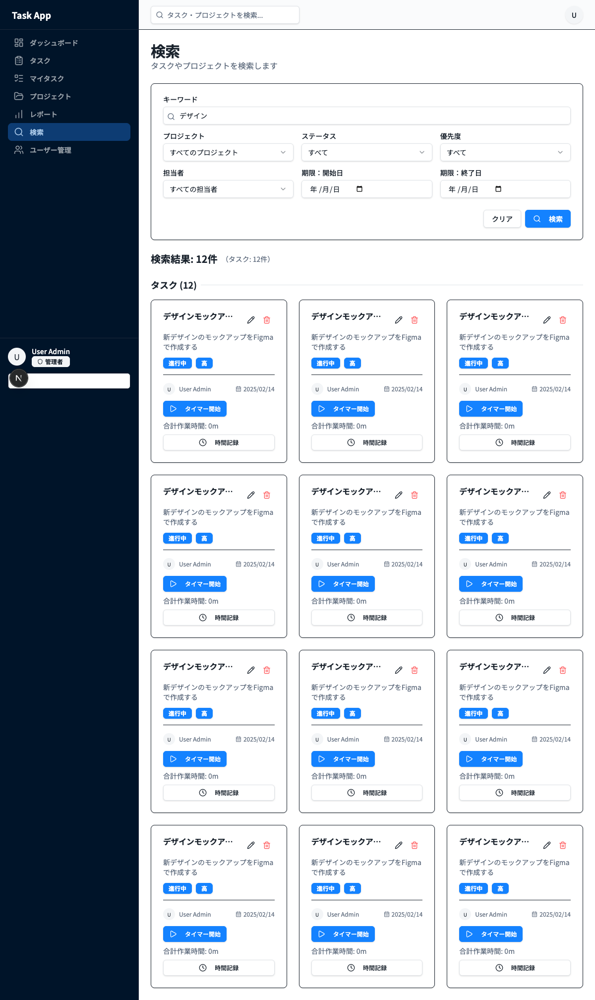
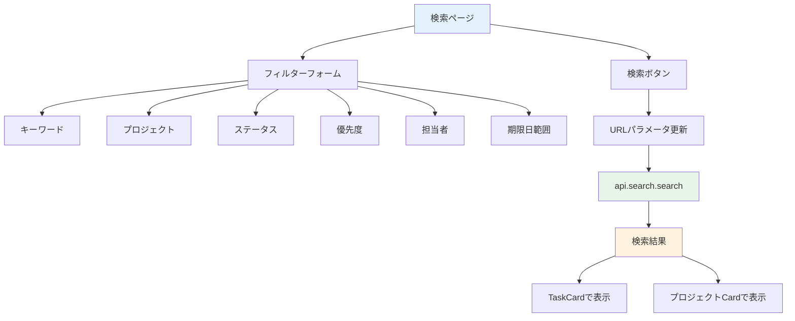
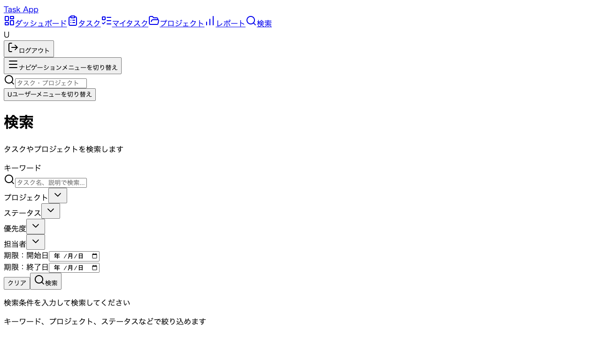

# Day 20: タスク検索機能を実装しよう

## 🎯 今日のゴール

キーワードや複数のフィルター条件でタスクを
検索できるページを作ります。検索条件は
URLパラメータに保存し、共有可能にします。



## 🤔 なぜこれを作るのか？

タスクが増えると目的のものが見つけにくくなります。

> 💡 **例え話**: 検索機能は「図書館の検索端末」
> です。タイトル、ジャンル、著者といった
> 複数の条件を組み合わせて、膨大な蔵書から
> 目的の本をすぐに見つけられます。

### 📐 検索機能の構成



### やること / やらないこと

| やること | やらないこと |
|---------|-------------|
| 複数条件でフィルター | リアルタイム検索 |
| URLパラメータ保存 | 検索結果の並び替え |
| TaskCard で結果表示 | ページネーション |
| プロジェクト結果表示 | 検索履歴 |

### 🆕 新しく学ぶ概念

| 概念 | 読み方 | 役割 | 例え |
|------|--------|------|------|
| search.search | — | 検索API | 図書館の蔵書検索 |
| URLSearchParams | — | URL条件管理 | 検索条件の付箋 |
| shouldSearch | — | 検索実行フラグ | 検索ボタンを押したか |

## 📊 実装ステップ一覧

| ステップ | 作業内容 | 所要時間 |
|---------|---------|---------|
| Step 1 | 検索APIを理解する | 3分 |
| Step 2 | ページの土台を作る | 3分 |
| Step 3 | フィルターフォームを作る | 7分 |
| Step 4 | URLパラメータと連動させる | 5分 |
| Step 5 | 検索APIを呼び出す | 5分 |
| Step 6 | 検索結果を表示する | 5分 |
| Step 7 | 動作確認 | 3分 |

**合計時間**: 約31分

---

### Step 1: 検索APIを理解する（3分）

🎯 **ゴール**: search ルーターの構成を
把握します。

```bash
# filepath: ターミナル
# search ルーターのAPIを確認する
cat src/server/api/routers/search.ts | head -50
```

✅ **確認ポイント**:
- 7つのフィルターを把握した
#### search ルーターの全メソッド

| メソッド | 種別 | 説明 |
|---------|------|------|
| `search` | query | 検索実行（メイン） |
| `quickSearch` | query | クイック検索 |
| `getUserProjects` | query | ユーザーのプロジェクト |
| `getProjectMembers` | query | プロジェクトメンバー |

#### search ルーターの全メソッド

| メソッド | 種別 | 説明 |
|---------|------|------|
| `search` | query | 検索実行（メイン） |
| `quickSearch` | query | クイック検索 |
| `getUserProjects` | query | ユーザーのプロジェクト取得 |
| `getProjectMembers` | query | プロジェクトメンバー取得 |

#### search メソッドのパラメータ

| パラメータ | 型 | 必須 | 説明 |
|-----------|-----|------|------|
| `keyword` | string? | — | キーワード |
| `projectId` | string? | — | プロジェクト |
| `status` | string? | — | ステータス |
| `priority` | string? | — | 優先度 |
| `assignedTo` | string? | — | 担当者 |
| `dateFrom` | string? | — | 期限開始 |
| `dateTo` | string? | — | 期限終了 |

> 💡 全てのパラメータが任意です。
> 条件を指定した分だけ絞り込まれます。

✅ **確認ポイント**:
- 7つのフィルターを把握した

---

### Step 2: ページの土台を作る（3分）

🎯 **ゴール**: 検索ページの基本構造を
作ります。

💻 **実装**:

```typescript
// filepath: src/app/search/page.tsx
'use client';

import type { TaskPriority, TaskStatus }
  from '@prisma/client';
import { AppLayout }
  from '@/component/layout/app-layout';
import { api } from '@/trpc/react';
import { Suspense, useEffect, useState }
  from 'react';
import {
  useRouter, useSearchParams,
} from 'next/navigation';
```

続いて、コンポーネント本体を定義します。

```typescript
// filepath: src/app/search/page.tsx
function SearchPageContent() {
  const router = useRouter();
  const searchParams = useSearchParams();
  const utils = api.useUtils();

  return (
    <AppLayout>
      <div className="space-y-6">
        <h1 className="text-3xl font-bold
          tracking-tight">検索</h1>
      </div>
    </AppLayout>
  );
}
```

> 💡 `useSearchParams` でURLの検索条件を
> 読み取ります。`useRouter` で条件変更時に
> URLを更新します。

✅ **確認ポイント**:
- `/search` にアクセスして表示される

---

### Step 3: フィルターフォームを作る（7分）

🎯 **ゴール**: 7つのフィルター条件の
UIを構築します。

💻 **実装**:

```typescript
// filepath: src/app/search/page.tsx
import { Input } from '@/component/ui/input';
import { Label } from '@/component/ui/label';
import { Button } from '@/component/ui/button';
import {
  Select, SelectContent, SelectItem,
  SelectTrigger, SelectValue,
} from '@/component/ui/select';
import { Search } from 'lucide-react';
import { Card, CardContent }
  from '@/component/ui/card';
```

```typescript
// filepath: src/app/search/page.tsx
// SearchPageContent内のstate（テキスト系）
const [keyword, setKeyword] =
  useState(searchParams.get('keyword')
    || '');
const [projectId, setProjectId] =
  useState(searchParams.get('projectId')
    || 'all');
const [status, setStatus] =
  useState<'all' | TaskStatus>(
    (searchParams.get('status')
      as 'all' | TaskStatus) || 'all');
const [priority, setPriority] =
  useState<'all' | TaskPriority>(
    (searchParams.get('priority')
      as 'all' | TaskPriority) || 'all');
```

残りの state と API 呼び出しを追加します。

```typescript
// filepath: src/app/search/page.tsx
// SearchPageContent内のstate（担当者・日付）
const [assignedTo, setAssignedTo] =
  useState(searchParams.get('assignedTo')
    || 'all');
const [dateFrom, setDateFrom] =
  useState(searchParams.get('dateFrom')
    || '');
const [dateTo, setDateTo] =
  useState(searchParams.get('dateTo')
    || '');

// プロジェクト一覧（検索ページ専用API）
const { data: projects } =
  api.search.getUserProjects.useQuery();

// ユーザー一覧（担当者フィルター用）
const { data: users } =
  api.search.getProjectMembers.useQuery();
```

```typescript
// filepath: src/app/search/page.tsx
// キーワード入力フィールド
<div className="grid gap-2">
  <Label htmlFor="keyword">
    キーワード
  </Label>
  <div className="relative">
    <Search className="absolute left-2
      top-3 h-4 w-4
      text-muted-foreground" />
    <Input id="keyword"
      placeholder="タスク名、説明で検索..."
      className="pl-8"
      value={keyword}
      onChange={(e) =>
        setKeyword(e.target.value)}
      onKeyDown={(e) => {
        if (e.key === 'Enter')
          handleSearch();
      }} />
  </div>
</div>
```

担当者フィルターと期限範囲フィルターも追加します。

```typescript
// filepath: src/app/search/page.tsx
// 担当者フィルター
<div className="grid gap-2">
  <Label htmlFor="assignedTo">
    担当者
  </Label>
  <Select value={assignedTo}
    onValueChange={setAssignedTo}>
    <SelectTrigger id="assignedTo">
      <SelectValue
        placeholder="すべての担当者" />
    </SelectTrigger>
    <SelectContent>
      <SelectItem value="all">
        すべての担当者
      </SelectItem>
      {users?.map((user) => (
        <SelectItem
          key={user.id} value={user.id}>
          {user.name || user.email}
        </SelectItem>
      ))}
    </SelectContent>
  </Select>
</div>
```

```typescript
// filepath: src/app/search/page.tsx
// 期限範囲フィルター（開始日・終了日）
<div className="grid gap-2">
  <Label htmlFor="dateFrom">
    期限：開始日
  </Label>
  <Input id="dateFrom" type="date"
    value={dateFrom}
    onChange={(e) =>
      setDateFrom(e.target.value)} />
</div>
<div className="grid gap-2">
  <Label htmlFor="dateTo">
    期限：終了日
  </Label>
  <Input id="dateTo" type="date"
    value={dateTo}
    onChange={(e) =>
      setDateTo(e.target.value)} />
</div>
```

> 💡 `onKeyDown` で Enter キーを検知し、
> 検索を実行します。Search アイコンは
> `absolute` で入力欄の左に配置します。

✅ **確認ポイント**:
- キーワード入力欄が表示される
- Select でフィルターが選べる
- 担当者・期限でも絞り込みできる



---

### Step 4: URLパラメータと連動させる（5分）

🎯 **ゴール**: 検索条件をURLに保存し、
ブラウザの「戻る」や共有に対応します。

💻 **実装**:

```typescript
// filepath: src/app/search/page.tsx
// URLパラメータが変わった時にstateを同期する
useEffect(() => {
  const sync = [
    { key: 'keyword',
      setter: setKeyword },
    { key: 'projectId',
      setter: setProjectId },
    { key: 'assignedTo',
      setter: setAssignedTo },
    { key: 'dateFrom',
      setter: setDateFrom },
    { key: 'dateTo',
      setter: setDateTo },
  ];
  for (const { key, setter } of sync) {
    const value = searchParams.get(key);
    if (value) setter(value);
  }
}, [searchParams]);
```

```typescript
// filepath: src/app/search/page.tsx
// 検索実行ハンドラー
const handleSearch = () => {
  const paramList = [
    { key: 'keyword', value: keyword },
    { key: 'projectId',
      value: projectId, exclude: 'all' },
    { key: 'status',
      value: status, exclude: 'all' },
    { key: 'priority',
      value: priority, exclude: 'all' },
    { key: 'assignedTo',
      value: assignedTo, exclude: 'all' },
    { key: 'dateFrom', value: dateFrom },
    { key: 'dateTo', value: dateTo },
  ];
  const params = new URLSearchParams();
  for (const p of paramList) {
    if (p.value && p.value !== p.exclude)
      params.set(p.key, p.value);
  }
  router.push(
    `/search?${params.toString()}`);
};
```

```typescript
// filepath: src/app/search/page.tsx
// クリアハンドラー
const handleClear = () => {
  setKeyword('');
  setProjectId('all');
  setStatus('all');
  setPriority('all');
  setAssignedTo('all');
  setDateFrom('');
  setDateTo('');
  router.push('/search');
};
```

> 💡 `URLSearchParams` はURLの `?key=value`
> 部分を手軽に操作できるブラウザ標準APIです。
> 検索条件がURLに残るので、ページを
> リロードしても条件が維持されます。

✅ **確認ポイント**:
- 検索後にURLが `?keyword=xxx` になる
- クリアでURLが `/search` に戻る

---

### Step 5: 検索APIを呼び出す（5分）

🎯 **ゴール**: フィルター条件で
`api.search.search` を呼びます。

💻 **実装**:

```typescript
// filepath: src/app/search/page.tsx
// 検索条件が1つでもあるかチェック
const shouldSearch =
  !!keyword
  || projectId !== 'all'
  || status !== 'all'
  || priority !== 'all'
  || assignedTo !== 'all'
  || !!dateFrom
  || !!dateTo;
```

```typescript
// filepath: src/app/search/page.tsx
// 検索API呼び出し
const { data: searchResults, isLoading }
  = api.search.search.useQuery(
  {
    keyword: keyword || undefined,
    projectId: projectId !== 'all'
      ? projectId : undefined,
    status: status,
    priority: priority,
    assignedTo: assignedTo !== 'all'
      ? assignedTo : undefined,
    dateFrom: dateFrom
      ? new Date(dateFrom).toISOString()
      : undefined,
    dateTo: dateTo
      ? new Date(dateTo).toISOString()
      : undefined,
  },
  {
    enabled: shouldSearch,
    refetchOnWindowFocus: false,
  },
);
```

> 💡 `enabled: shouldSearch` で条件が
> 空のときはAPIを呼びません。
> Day 12 で学んだパターンと同じです。

✅ **確認ポイント**:
- 条件を入力すると検索結果が返る

---

### Step 6: 検索結果を表示する（5分）

🎯 **ゴール**: 検索結果をTaskCardで表示します。

💻 **実装**:

```typescript
// filepath: src/app/search/page.tsx
import { TaskCard }
  from '@/component/task/task-card';
import { Loader2 } from 'lucide-react';

// ナビゲーションハンドラー
const handleTaskClick =
  (taskId: string) => {
    router.push(`/task?taskId=${taskId}`);
  };

const handleTaskEdit =
  (taskId: string) => {
    router.push(
      `/task?taskId=${taskId}&edit=true`);
  };
```

削除のミューテーションとハンドラーを追加します。

```typescript
// filepath: src/app/search/page.tsx
const deleteMutation =
  api.task.delete.useMutation({
    onSuccess: () => {
      utils.search.search.invalidate();
    },
  });

const handleTaskDelete =
  (taskId: string) => {
    if (confirm(
      'このタスクを削除してもよろしいですか？'
    )) {
      deleteMutation.mutate({ id: taskId });
    }
  };
```

```typescript
// filepath: src/app/search/page.tsx
// 検索結果の表示（タスク）
{searchResults
  && searchResults.tasks.length > 0 && (
  <div className="space-y-4">
    <h3 className="text-lg font-semibold">
      タスク ({searchResults.tasks.length})
    </h3>
    <div className="grid gap-6
      sm:grid-cols-2 lg:grid-cols-3
      xl:grid-cols-4">
```

各タスクをカードで表示します。

```typescript
// filepath: src/app/search/page.tsx
      {searchResults.tasks.map((task) => (
        <TaskCard key={task.id}
          id={task.id}
          title={task.title}
          description={task.description}
          status={task.status}
          priority={task.priority}
          dueDate={task.dueDate}
          assignee={task.assignee}
          onEdit={handleTaskEdit}
          onDelete={handleTaskDelete}
          onClick={handleTaskClick} />
      ))}
    </div>
  </div>
)}
```

> 💡 `searchResults.tasks` にタスク、
> `searchResults.projects` にプロジェクトが
> 含まれます。Day 13 の TaskCard を
> そのまま再利用できます。

✅ **確認ポイント**:
- 検索結果がカード表示される
- カードクリックでタスク詳細に遷移


---

### Step 7: 動作確認（3分）

🎯 **ゴール**: 検索機能の全体を確認します。

1. `/search` にアクセス
2. キーワードを入力して検索
3. プロジェクトで絞り込み
4. ステータスで絞り込み
5. 「クリア」で条件リセット
6. 検索結果のカードをクリック
7. URLに検索条件が含まれる

✅ **確認ポイント**:
- 複数の条件で絞り込める
- URLをコピーして共有できる
- カードクリックで詳細に遷移


---

```bash
# filepath: ターミナル
# 開発サーバーを起動して動作確認
npm run dev
```

## 📋 今日のまとめ

- [ ] 検索フォームを作成できた
- [ ] `api.search.search` で検索できた
- [ ] URLパラメータと連動させた
- [ ] 検索結果をTaskCardで表示できた

## ⚠️ つまずきポイント

| エラー / 問題 | 原因 | 解決方法 |
|--------------|------|---------|
| 毎回APIが呼ばれる | enabled条件が不適切 | shouldSearchでガード |
| URLが更新されない | router.push忘れ | handleSearchに追加 |
| 結果が0件表示 | projectId初期値が間違い | `'all'`で初期化する |
| Enter検索が効かない | onKeyDown未設定 | EnterでhandleSearch |
| フィルタがリセットされない | handleClearに項目漏れ | 全stateを'all'/''に |

## 📝 今日学んだ用語

| 用語 | 意味 |
|------|------|
| URLSearchParams | URLのクエリパラメータ操作API |
| shouldSearch | 検索実行の判定フラグ（全条件をORで評価） |
| enabled | useQueryの実行条件制御 |
| refetchOnWindowFocus | ウィンドウ復帰時の再取得設定 |
| getUserProjects | ユーザーが参加するプロジェクト取得API |
| getProjectMembers | プロジェクトメンバー一覧取得API |

## 🔜 次回予告

Day 21 では、レポートページに統計カードを
表示します。タスクデータをローカルで集計して
ダッシュボードを作ります。
