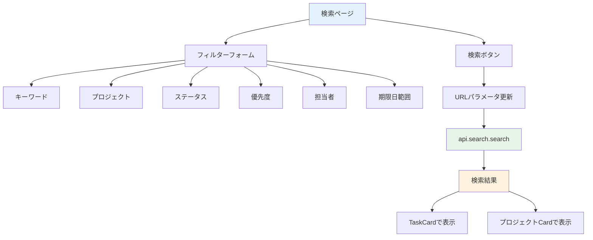

# Day 20: タスク検索機能を実装しよう

## 🔙 前回の振り返り

Day 19 ではコメントの編集・削除機能を実装し、自分が書いたコメントだけを操作できる権限チェックも加えました。タスクのコミュニケーション機能が完成したので、今日はキーワードとフィルターでタスクを検索する機能に取り組みます。

---

## 🎯 今日のゴール

キーワードや複数のフィルター条件でタスクを
検索できるページを作ります。検索条件は
URLパラメータに保存し、共有可能にします。

📸 スクリーンショット: 検索画面とフィルタリングされた結果

## 🤔 なぜこれを作るのか？

タスクが増えると目的のものが見つけにくくなります。
たとえばプロジェクトに50件のタスクがあるとき、
「優先度：高」で絞り込むと数件だけ表示されます。

> 💡 **例え話**: 検索機能は「図書館の検索端末」
> です。タイトル、ジャンル、著者といった
> 複数の条件を組み合わせて、膨大な蔵書から
> 目的の本をすぐに見つけられます。

### 📐 検索機能の構成



### やること / やらないこと

| やること | やらないこと |
|---------|-------------|
| 複数条件でフィルター | リアルタイム検索 |
| URLパラメータ保存 | 検索結果の並び替え |
| TaskCard で結果表示 | ページネーション |
| プロジェクト結果表示 | 検索履歴 |

### 🆕 新しく学ぶ概念

| 概念 | 読み方 | 役割 | 例え |
|------|--------|------|------|
| search.search | — | 検索API | 図書館の蔵書検索 |
| URLSearchParams | — | URL条件管理 | 検索条件の付箋 |
| shouldSearch | — | 検索実行フラグ | 検索ボタンを押したか |
| useForm（復習） | ユーズフォーム | フォーム状態管理（Day 14 参照） | 検索条件の管理係 |
| watch | ウォッチ | フォームの値をリアクティブに監視 | 入力が変わるたびに条件を更新 |

## 📊 実装ステップ一覧

| ステップ | 作業内容 | 所要時間 |
|---------|---------|---------|
| Step 1 | 検索APIを理解する | 3分 |
| Step 2 | ページの土台を作る | 3分 |
| Step 3 | フィルターのインポートとstate | 4分 |
| Step 4 | フィルターUIを配置する | 7分 |
| Step 5 | URLパラメータと連動させる | 5分 |
| Step 6 | 検索APIを呼び出す | 5分 |
| Step 7 | 検索結果を表示する | 7分 |
| Step 8 | 動作確認 | 3分 |

**合計時間**: 約37分

---

### Step 1: 検索APIを理解する（3分）

🎯 **ゴール**: search ルーターの構成を
把握します。

VS Code で `src/server/api/routers/search.ts` を開いて、検索APIの構造を確認しましょう。
`Ctrl+F` で `searchInputSchema` を検索します。

```typescript
// filepath: src/server/api/routers/search.ts
// 検索パラメータのバリデーション定義
const searchInputSchema = z.object({
  keyword: z.string().optional(),
  projectId: z.string().cuid().optional(),
  status: z.union([
    z.literal('all'),
    taskStatusSchema,
  ]).optional().default('all'),
  priority: z.union([
    z.literal('all'),
    taskPrioritySchema,
  ]).optional().default('all'),
  assignedTo:
    z.string().cuid().optional(),
  dateFrom:
    z.string().datetime().optional(),
  dateTo:
    z.string().datetime().optional(),
});
```

✅ **確認ポイント**:
- 7つのフィルターパラメータを把握した
- `status` と `priority` が union 型である

#### search ルーターの全メソッド

| メソッド | 種別 | 説明 |
|---------|------|------|
| `search` | query | 検索実行（メイン） |
| `quickSearch` | query | クイック検索 |
| `getUserProjects` | query | ユーザーのプロジェクト取得 |
| `getProjectMembers` | query | プロジェクトメンバー取得 |

#### search メソッドのパラメータ

| パラメータ | 型 | 必須 | 説明 |
|-----------|-----|------|------|
| `keyword` | string? | — | キーワード |
| `projectId` | string (cuid)? | — | プロジェクト |
| `status` | `'all'` \| TaskStatus | — | ステータス（デフォルト `'all'`） |
| `priority` | `'all'` \| TaskPriority | — | 優先度（デフォルト `'all'`） |
| `assignedTo` | string (cuid)? | — | 担当者 |
| `dateFrom` | string (ISO日付)? | — | 期限開始 |
| `dateTo` | string (ISO日付)? | — | 期限終了 |

> 💡 全てのパラメータが任意です。
> `status` と `priority` は `'all'` を渡すと
> 絞り込みなしとしてサーバー側で処理されます。


---

### Step 2: ページの土台を作る（3分）

🎯 **ゴール**: 検索ページの基本構造を
作ります。

💻 **実装**:

```typescript
// filepath: src/app/search/page.tsx
'use client';

import { zodResolver }
  from '@hookform/resolvers/zod';
import { Suspense, useEffect }
  from 'react';
import { useForm } from 'react-hook-form';
import {
  useRouter, useSearchParams,
} from 'next/navigation';
import { z } from 'zod';
import { AppLayout }
  from '@/component/layout/app-layout';
import { api } from '@/trpc/react';
```

✅ **確認ポイント**:
- `useForm`, `zodResolver`, `z` がインポートされている

続いて、コンポーネント本体を定義します。
`utils` は検索結果の再取得（削除後）に使います。

```typescript
// filepath: src/app/search/page.tsx
function SearchPageContent() {
  const router = useRouter();
  const searchParams = useSearchParams();
  const utils = api.useUtils();

  return (
    <AppLayout>
      <div className="space-y-6">
        <h1 className="text-3xl font-bold
          tracking-tight">検索</h1>
        {/* Step 3: フィルターフォーム */}
        {/* Step 6: 検索結果 */}
        {/* Step 6: 削除ダイアログ */}
      </div>
    </AppLayout>
  );
}
```

> 💡 `useSearchParams` でURLの検索条件を
> 読み取ります。`useForm` でフォーム状態を
> 一括管理し、`useRouter` で条件変更時に
> URLを更新します。

✅ **確認ポイント**:
- `/search` にアクセスして表示される

---

### Step 3: zodスキーマとuseFormを追加する（4分）

🎯 **ゴール**: 7つのフィルター条件を
zod スキーマと useForm で一括管理します。

💻 **実装**:

```typescript
// filepath: src/app/search/page.tsx
import { Search } from 'lucide-react';
import { Button } from '@/component/ui/button';
import {
  Card, CardContent,
} from '@/component/ui/card';
import { Input } from '@/component/ui/input';
import { Label } from '@/component/ui/label';
import {
  Select, SelectContent, SelectItem,
  SelectTrigger, SelectValue,
} from '@/component/ui/select';
```

✅ **確認ポイント**:
- UIコンポーネントのインポートが追加された

型ガード関数とラベル定数もインポートします。

```typescript
// filepath: src/app/search/page.tsx
import {
  isTaskPriority,
  TASK_PRIORITY_LABELS,
  type TaskPriority,
} from '@/lib/constant/priority';
import {
  isTaskStatus,
  TASK_STATUS_LABELS,
  type TaskStatus,
} from '@/lib/constant/status';
```

✅ **確認ポイント**:
- `isTaskStatus` / `isTaskPriority` が追加された

検索フォーム用の zod スキーマを定義します。
全フィールドをひとつのオブジェクトで管理します。

```typescript
// filepath: src/app/search/page.tsx
// 検索フォームの zodスキーマ
const searchFormSchema = z.object({
  keyword: z.string(),
  projectId: z.string(),
  status: z.string(),
  priority: z.string(),
  assignedTo: z.string(),
  dateFrom: z.string(),
  dateTo: z.string(),
});
type SearchFormValues =
  z.infer<typeof searchFormSchema>;
```

✅ **確認ポイント**:
- 7つのフィールドが1つのスキーマに集約された

URLパラメータから初期値を型安全に設定し、
`useForm` で管理します。

```typescript
// filepath: src/app/search/page.tsx
// SearchPageContent内: useFormで一括管理
const initStatus =
  searchParams.get('status') ?? 'all';
const initPriority =
  searchParams.get('priority') ?? 'all';

const form = useForm<SearchFormValues>({
  resolver: zodResolver(searchFormSchema),
  defaultValues: {
    keyword:
      searchParams.get('keyword') ?? '',
    projectId:
      searchParams.get('projectId')
        ?? 'all',
    status: isTaskStatus(initStatus)
      ? initStatus : 'all',
```

```typescript
// filepath: src/app/search/page.tsx
// defaultValues の続き
    priority:
      isTaskPriority(initPriority)
        ? initPriority : 'all',
    assignedTo:
      searchParams.get('assignedTo')
        ?? 'all',
    dateFrom:
      searchParams.get('dateFrom') ?? '',
    dateTo:
      searchParams.get('dateTo') ?? '',
  },
});
```

✅ **確認ポイント**:
- `useForm` で7つのフィールドを一括管理している
- URLパラメータから `??` で初期値を設定している

`watch` でフォームの現在値を取得し、
API呼び出し用データを用意します。

```typescript
// filepath: src/app/search/page.tsx
// フォームの現在値を監視
const formValues = form.watch();

const { data: projects } =
  api.search.getUserProjects.useQuery();
const { data: users } =
  api.search.getProjectMembers.useQuery();
```

✅ **確認ポイント**:
- `watch()` でフォームの値をリアクティブに取得

> 💡 Day 14 では `register` と `Controller` で
> 各入力を管理しました。検索フォームでは
> `setValue` と `watch` の組み合わせで
> Select コンポーネントの値も管理できます。

---

### Step 4: フィルターUIを配置する（7分）

🎯 **ゴール**: Card内にフィルターフォームの
JSXを配置します。

💻 **実装**:

Step 2で `{/* Step 3: フィルターフォーム */}`
と書いた場所を以下に置き換えます。
まずキーワード入力です。

```typescript
// filepath: src/app/search/page.tsx
// Card > CardContent > grid の中
<Card>
  <CardContent className="pt-6">
    <div className="grid gap-4">
      <div className="grid gap-2">
        <Label htmlFor="keyword">
          キーワード
        </Label>
        <div className="relative">
          <Search className="absolute
            left-2 top-3 h-4 w-4
            text-muted-foreground" />
          <Input id="keyword"
            placeholder="タスク名で検索..."
            className="pl-8"
            {...form.register('keyword')}
            onKeyDown={(e) => {
              if (e.key === 'Enter')
                handleSearch();
            }} />
        </div>
      </div>
```

✅ **確認ポイント**:
- `register('keyword')` でフォームに登録している

6つのフィルターをgridで配置します。
プロジェクト・ステータス・優先度です。

```typescript
// filepath: src/app/search/page.tsx
// 6列グリッドの開始
<div className="grid grid-cols-1
  md:grid-cols-2 lg:grid-cols-3
  gap-4">
```

```typescript
// filepath: src/app/search/page.tsx
// プロジェクトSelect
  <div className="grid gap-2">
    <Label>プロジェクト</Label>
    <Select value={formValues.projectId}
      onValueChange={(v) =>
        form.setValue('projectId', v)}>
      <SelectTrigger>
        <SelectValue
          placeholder="すべて" />
      </SelectTrigger>
      <SelectContent>
        <SelectItem value="all">
          すべてのプロジェクト
        </SelectItem>
        {projects?.map((p) => (
          <SelectItem key={p.id}
            value={p.id}>
            {p.name}
          </SelectItem>))}
      </SelectContent>
    </Select>
  </div>
```

✅ **確認ポイント**:
- `form.setValue` でSelect値をフォームに反映

```typescript
// filepath: src/app/search/page.tsx
// ステータスフィルター（型ガード付き）
  <div className="grid gap-2">
    <Label>ステータス</Label>
    <Select value={formValues.status}
      onValueChange={(v) => {
        if (isTaskStatus(v)
          || v === 'all')
          form.setValue('status', v);
      }}>
      <SelectTrigger>
        <SelectValue /></SelectTrigger>
      <SelectContent>
        <SelectItem value="all">
          すべて</SelectItem>
        {Object.entries(
          TASK_STATUS_LABELS
        ).map(([v, label]) => (
          <SelectItem key={v}
            value={v}>{label}
          </SelectItem>))}
      </SelectContent>
    </Select>
  </div>
```

✅ **確認ポイント**:
- 型ガード付きで `form.setValue` している

優先度もステータスと同じパターンです。

```typescript
// filepath: src/app/search/page.tsx
// 優先度フィルター（型ガード付き）
  <div className="grid gap-2">
    <Label>優先度</Label>
    <Select value={formValues.priority}
      onValueChange={(v) => {
        if (isTaskPriority(v)
          || v === 'all')
          form.setValue('priority', v);
      }}>
      <SelectTrigger>
        <SelectValue /></SelectTrigger>
      <SelectContent>
        <SelectItem value="all">
          すべて</SelectItem>
        {Object.entries(
          TASK_PRIORITY_LABELS
        ).map(([v, label]) => (
          <SelectItem key={v}
            value={v}>{label}
          </SelectItem>))}
      </SelectContent>
    </Select>
  </div>
```

✅ **確認ポイント**:
- 優先度もステータスと同じパターンで動作する

担当者と期限フィルターを追加します。

```typescript
// filepath: src/app/search/page.tsx
// 担当者フィルター
  <div className="grid gap-2">
    <Label htmlFor="assignedTo">
      担当者
    </Label>
    <Select value={formValues.assignedTo}
      onValueChange={(v) =>
        form.setValue('assignedTo', v)}>
      <SelectTrigger id="assignedTo">
        <SelectValue
          placeholder="すべての担当者" />
      </SelectTrigger>
      <SelectContent>
        <SelectItem value="all">
          すべての担当者
        </SelectItem>
```

```typescript
// filepath: src/app/search/page.tsx
// 担当者リスト（SelectContent続き）
        {users?.map((user) => (
          <SelectItem key={user.id}
            value={user.id}>
            {user.name ?? user.email}
          </SelectItem>
        ))}
      </SelectContent>
    </Select>
  </div>
```

✅ **確認ポイント**:
- 担当者も `form.setValue` で管理している

```typescript
// filepath: src/app/search/page.tsx
// 期限範囲フィルター
  <div className="grid gap-2">
    <Label htmlFor="dateFrom">
      期限：開始日
    </Label>
    <Input id="dateFrom" type="date"
      {...form.register('dateFrom')} />
  </div>
  <div className="grid gap-2">
    <Label htmlFor="dateTo">
      期限：終了日
    </Label>
    <Input id="dateTo" type="date"
      {...form.register('dateTo')} />
  </div>
</div>{/* grid終了 */}
```

✅ **確認ポイント**:
- 日付入力欄が表示される

検索ボタンとクリアボタンを追加します。

```typescript
// filepath: src/app/search/page.tsx
// 検索・クリアボタン
      <div className="flex
        justify-end gap-2 pt-2">
        <Button variant="outline"
          onClick={handleClear}>
          クリア
        </Button>
        <Button onClick={handleSearch}>
          <Search className="mr-2
            h-4 w-4" />
          検索
        </Button>
      </div>
    </div>{/* grid gap-4終了 */}
  </CardContent>
</Card>
```

> 💡 `onKeyDown` で Enter キーを検知し、
> 検索を実行します。Search アイコンは
> `absolute` で入力欄の左に配置します。

✅ **確認ポイント**:
- 検索ボタンとクリアボタンが表示される
- フォーム全体がCard内にまとまっている

📸 スクリーンショット: フィルターフォームの全体像

---

### Step 5: URLパラメータと連動させる（5分）

🎯 **ゴール**: 検索条件をURLに保存し、
ブラウザの「戻る」や共有に対応します。

💻 **実装**:

URLパラメータが変わったときに
`useForm` の値を同期します。

```typescript
// filepath: src/app/search/page.tsx
// URL→form 同期（useEffect）
const SEARCH_FIELDS = [
  'keyword', 'projectId', 'status',
  'priority', 'assignedTo',
  'dateFrom', 'dateTo',
] as const;

useEffect(() => {
  for (const key of SEARCH_FIELDS) {
    const value =
      searchParams.get(key);
    if (value)
      form.setValue(key, value);
  }
}, [searchParams, form]);
```

✅ **確認ポイント**:
- `form.setValue` で URL→フォームに同期している

```typescript
// filepath: src/app/search/page.tsx
// 検索実行ハンドラー（useForm版）
const handleSearch = () => {
  const values = form.getValues();
  const paramList = [
    { key: 'keyword',
      value: values.keyword },
    { key: 'projectId',
      value: values.projectId,
      exclude: 'all' },
    { key: 'status',
      value: values.status,
      exclude: 'all' },
    { key: 'priority',
      value: values.priority,
      exclude: 'all' },
```

```typescript
// filepath: src/app/search/page.tsx
// paramList 続き + URL更新
    { key: 'assignedTo',
      value: values.assignedTo,
      exclude: 'all' },
    { key: 'dateFrom',
      value: values.dateFrom },
    { key: 'dateTo',
      value: values.dateTo },
  ];
  const params = new URLSearchParams();
  for (const p of paramList) {
    if (p.value && p.value !== p.exclude)
      params.set(p.key, p.value);
  }
  router.push(
    `/search?${params.toString()}`);
};
```

```typescript
// filepath: src/app/search/page.tsx
// クリアハンドラー（form.reset版）
const handleClear = () => {
  form.reset({
    keyword: '',
    projectId: 'all',
    status: 'all',
    priority: 'all',
    assignedTo: 'all',
    dateFrom: '',
    dateTo: '',
  });
  router.push('/search');
};
```

> 💡 `form.getValues()` で全フィールドの値を
> 一括取得し、`form.reset()` で一括クリアできます。
> `useState` を7個並べるより管理しやすくなります。

✅ **確認ポイント**:
- 検索後にURLが `?keyword=xxx` になる
- クリアでURLが `/search` に戻る

---

### Step 6: 検索APIを呼び出す（5分）

🎯 **ゴール**: フィルター条件で
`api.search.search` を呼びます。

💻 **実装**:

```typescript
// filepath: src/app/search/page.tsx
// 検索条件が1つでもあるかチェック
const shouldSearch =
  !!formValues.keyword
  || formValues.projectId !== 'all'
  || formValues.status !== 'all'
  || formValues.priority !== 'all'
  || formValues.assignedTo !== 'all'
  || !!formValues.dateFrom
  || !!formValues.dateTo;
```

```typescript
// filepath: src/app/search/page.tsx
// 検索API呼び出し（formValues を使用）
const { data: searchResults, isLoading }
  = api.search.search.useQuery(
  {
    keyword:
      formValues.keyword || undefined,
    projectId:
      formValues.projectId !== 'all'
        ? formValues.projectId
        : undefined,
    status: formValues.status,
    priority: formValues.priority,
```

```typescript
// filepath: src/app/search/page.tsx
// useQuery パラメータ続き
    assignedTo:
      formValues.assignedTo !== 'all'
        ? formValues.assignedTo
        : undefined,
    dateFrom: formValues.dateFrom
      ? new Date(formValues.dateFrom)
        .toISOString()
      : undefined,
    dateTo: formValues.dateTo
      ? new Date(formValues.dateTo)
        .toISOString()
      : undefined,
  },
  {
    enabled: shouldSearch,
    refetchOnWindowFocus: false,
  },
);
```

> 💡 `enabled: shouldSearch` で条件が
> 空のときはAPIを呼びません。
> Day 12 で学んだ `enabled` 制御と
> 共通するパターンです。

✅ **確認ポイント**:
- 条件を入力すると検索結果が返る

---

### Step 7: 検索結果を表示する（7分）

🎯 **ゴール**: 検索結果をTaskCardと
プロジェクトCardで表示します。
検索結果から直接タスクを操作できると便利なので、
削除処理も追加します。

💻 **実装**:

```typescript
// filepath: src/app/search/page.tsx
import toast from 'react-hot-toast';
import { TaskCard }
  from '@/component/task/task-card';
import {
  DeleteConfirmDialog,
} from
  '@/component/ui/delete-confirm-dialog';
import { PageLoadingSpinner }
  from '@/component/ui/loading-spinner';
import { Separator }
  from '@/component/ui/separator';
```

✅ **確認ポイント**:
- 結果表示に必要なインポートが追加された

ナビゲーションと削除のハンドラーを追加します。

```typescript
// filepath: src/app/search/page.tsx
// ナビゲーションハンドラー
const handleTaskClick =
  (taskId: string) => {
    router.push(`/task?taskId=${taskId}`);
  };
const handleTaskEdit =
  (taskId: string) => {
    router.push(
      `/task?taskId=${taskId}&edit=true`);
  };
const handleProjectClick =
  (projectId: string) => {
    router.push(
      `/project?projectId=${projectId}`);
  };
```

✅ **確認ポイント**:
- クリック時の遷移先が正しい

```typescript
// filepath: src/app/search/page.tsx
// 削除確認state（1つのオブジェクトで管理）
const [deleteTaskConfirm,
  setDeleteTaskConfirm] = useState<{
    open: boolean;
    taskId: string | null;
  }>({ open: false, taskId: null });

const deleteMutation =
  api.task.delete.useMutation({
    onSuccess: () => {
      utils.search.search.invalidate();
    },
    onError: (error) => {
      toast.error(error.message
        ?? 'タスクの削除に失敗しました');
    },
  });

const handleTaskDelete =
  (taskId: string) => {
    setDeleteTaskConfirm(
      { open: true, taskId });
  };
```

✅ **確認ポイント**:
- 削除stateがオブジェクト1つで管理されている
- エラー時にtoastで通知される

タスク検索結果の表示JSXです。
Step 2の `{/* Step 6: 検索結果 */}` を
以下に置き換えます。

```typescript
// filepath: src/app/search/page.tsx
// 検索結果の表示部分
{isLoading ? (
  <PageLoadingSpinner />
) : shouldSearch && searchResults ? (
  <div className="space-y-6">
    <h2 className="text-xl font-semibold">
      検索結果:
      {searchResults.totalCount}件
    </h2>
```

✅ **確認ポイント**:
- 件数が表示される

```typescript
// filepath: src/app/search/page.tsx
// タスク結果セクション（見出し部分）
    {searchResults.tasks.length > 0 && (
      <div className="space-y-4">
        <div className="flex
          items-center gap-2">
          <h3 className="text-lg
            font-semibold">
            タスク
            ({searchResults.tasks.length})
          </h3>
          <Separator
            className="flex-1" />
        </div>
```

✅ **確認ポイント**:
- セクション見出しが表示される

```typescript
// filepath: src/app/search/page.tsx
// タスク結果セクション（カード部分）
        <div className="grid gap-6
          sm:grid-cols-2 lg:grid-cols-3
          xl:grid-cols-4">
          {searchResults.tasks
            .map((task) => (
            <TaskCard key={task.id}
              id={task.id}
              title={task.title}
              description={
                task.description}
              status={task.status}
              priority={task.priority}
              dueDate={task.dueDate}
              assignee={task.assignee}
              onEdit={handleTaskEdit}
              onDelete={handleTaskDelete}
              onClick={
                handleTaskClick} />
          ))}
        </div>
      </div>
    )}
```

✅ **確認ポイント**:
- タスクがカード形式で表示される

プロジェクト検索結果も表示します。
キーワード検索時にプロジェクト名もヒットします。

```typescript
// filepath: src/app/search/page.tsx
// プロジェクト結果（見出し部分）
    {searchResults.projects.length
      > 0 && (
      <div className="space-y-4">
        <div className="flex
          items-center gap-2">
          <h3 className="text-lg
            font-semibold">
            プロジェクト
            ({searchResults
              .projects.length})
          </h3>
          <Separator
            className="flex-1" />
        </div>
```

✅ **確認ポイント**:
- プロジェクト見出しが表示される

```typescript
// filepath: src/app/search/page.tsx
// プロジェクト結果（カード部分）
        <div className="grid gap-6
          sm:grid-cols-2 lg:grid-cols-3
          xl:grid-cols-4">
          {searchResults.projects
            .map((project) => (
            <Card key={project.id}
              className="cursor-pointer
                hover:shadow-md"
              onClick={() =>
                handleProjectClick(
                  project.id)}>
              <CardContent className="pt-6">
                <h4 className=
                  "font-semibold mb-2">
                  {project.name}</h4>
                <p className="text-sm
                  text-muted-foreground
                  line-clamp-2">
                  {project.description
                    ?? '説明なし'}</p>
              </CardContent>
            </Card>))}
        </div></div>)}
```

✅ **確認ポイント**:
- プロジェクトもカード形式で表示される

結果が0件のときのメッセージと条件未入力時の案内、
削除ダイアログを追加します。

```typescript
// filepath: src/app/search/page.tsx
// 0件メッセージと未入力案内
    {searchResults.totalCount === 0 && (
      <div className="text-center py-12
        text-muted-foreground">
        <p>検索結果が見つかりません</p>
      </div>
    )}
  </div>
) : (
  <div className="text-center py-12
    text-muted-foreground">
    <p>検索条件を入力してください</p>
  </div>
)}
```

✅ **確認ポイント**:
- 結果0件時にメッセージが表示される

Step 2の `{/* Step 6: 削除ダイアログ */}` を
以下に置き換えます。

```typescript
// filepath: src/app/search/page.tsx
// 削除確認ダイアログ
<DeleteConfirmDialog
  open={deleteTaskConfirm.open}
  onOpenChange={(open) =>
    !open && setDeleteTaskConfirm(
      { open: false, taskId: null })}
  onConfirm={() => {
    if (deleteTaskConfirm.taskId) {
      deleteMutation.mutate({
        id: deleteTaskConfirm.taskId,
      });
      setDeleteTaskConfirm(
        { open: false, taskId: null });
    }
  }}
  isPending={
    deleteMutation.isPending} />
```

> 💡 `searchResults.tasks` にタスク、
> `searchResults.projects` にプロジェクトが
> 含まれます。Day 13 の TaskCard を
> そのまま再利用できます。

✅ **確認ポイント**:
- 検索結果がカード表示される
- カードクリックでタスク詳細に遷移
- 削除ボタンで確認ダイアログが表示される

📸 スクリーンショット: 検索結果がカード形式で表示されている画面

最後に、ページのエクスポートを追加します。
`useSearchParams` は Suspense 境界が必要です。

```typescript
// filepath: src/app/search/page.tsx
// Suspenseでラップしてexport
export default function SearchPage() {
  return (
    <Suspense
      fallback={<PageLoadingSpinner />}>
      <SearchPageContent />
    </Suspense>
  );
}
```

✅ **確認ポイント**:
- `PageLoadingSpinner` で読み込み中表示される
- ファイルを保存してエラーがない

> 💡 Next.js App Router では `useSearchParams`
> を使うコンポーネントは `Suspense` で囲む
> 必要があります。ビルド時にエラーになるため
> 忘れずに追加しましょう。

---

### Step 8: 動作確認（3分）

🎯 **ゴール**: 検索機能の全体を確認します。

1. `/search` にアクセス
2. キーワードを入力して検索
3. プロジェクトで絞り込み
4. ステータスで絞り込み
5. 「クリア」で条件リセット
6. 検索結果のカードをクリック
7. URLに検索条件が含まれる

✅ **確認ポイント**:
- 複数の条件で絞り込める
- URLをコピーして共有できる
- カードクリックで詳細に遷移

📸 スクリーンショット: 検索結果一覧の完成画面

---

```bash
# filepath: ターミナル
# 開発サーバーを起動して動作確認
npm run dev
```

✅ **確認ポイント**:
- `http://localhost:3000/search` でアプリが表示される
- 検索フォームと結果表示が動作する

## 📋 今日のまとめ

- [ ] 検索フォームを作成できた
- [ ] `api.search.search` で検索できた
- [ ] URLパラメータと連動させた
- [ ] 検索結果をTaskCardで表示できた

## ⚠️ つまずきポイント

| エラー / 問題 | 原因 | 解決方法 |
|--------------|------|---------|
| 毎回APIが呼ばれる | enabled条件が不適切 | shouldSearchでガード |
| URLが更新されない | router.push忘れ | handleSearchに追加 |
| 結果が0件表示 | projectId初期値が間違い | `'all'`で初期化する |
| Enter検索が効かない | onKeyDown未設定 | EnterでhandleSearch |
| フィルタがリセットされない | handleClearに項目漏れ | 全stateを'all'/''に |

## 📝 今日学んだ用語

| 用語 | 意味 |
|------|------|
| URLSearchParams | URLのクエリパラメータ操作API |
| shouldSearch | 検索実行の判定フラグ（全条件をORで評価） |
| enabled | useQueryの実行条件制御 |
| refetchOnWindowFocus | ウィンドウ復帰時の再取得設定 |
| form.watch() | フォームの値をリアクティブに監視する関数 |
| form.setValue() | フォームの値をプログラムから更新する関数 |
| form.getValues() | フォームの全フィールドの値を一括取得する関数 |

## 🔜 次回予告

Day 21 では、レポートページに統計カードを
表示します。タスクデータをローカルで集計して
ダッシュボードを作ります。
