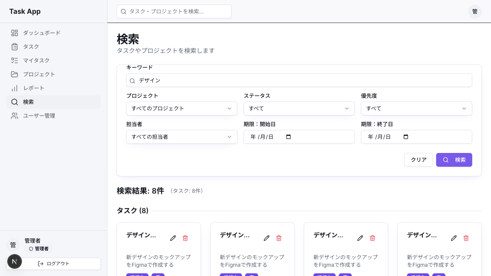
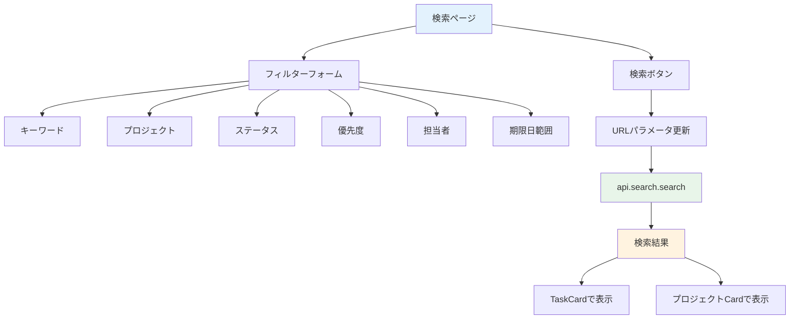
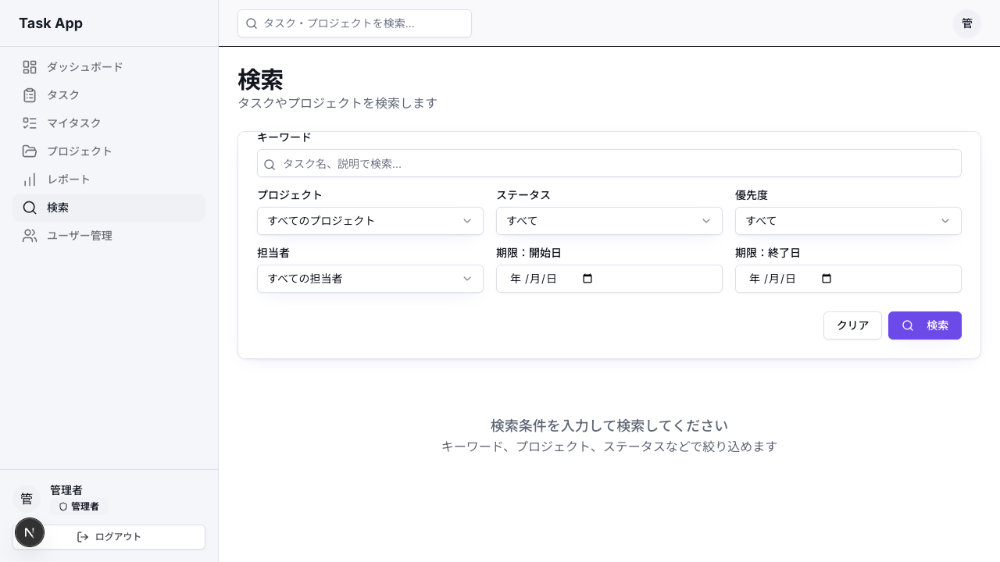

# Day 20: タスク検索機能を実装しよう

## 前回の振り返り

Day 19 ではコメントの編集・削除機能を実装し、自分が書いたコメントだけを操作できる権限チェックも加えました。今日はキーワードとフィルターでタスクを検索する機能に取り組みます。

---

## 今日のゴール

キーワードや複数のフィルター条件でタスクを検索できるページを作ります。検索条件はURLパラメータに保存し、共有可能にします。

この日は、まずサーバー側の search ルーターの残り3手続きを自分で書きます。そのあと画面をつなぎます。

スクリーンショット: 今日つくる検索画面です。キーワード欄と6つの絞り込み欄が並びます。



条件を入れる前は、画面の下側に案内文が出るだけです。
結果のカードが並ぶのは、条件を入れて検索したあとです。
なお画像の案内文は完成版のもので、今日書くコードでは「検索条件を入力してください」になります。

> **今日のゴールライン**: 検索フォームの条件をURLに反映し、絞り込んだタスクとプロジェクト結果を共有できる形で表示できれば完了です。

## なぜこれを作るのか

タスクが増えると目的のものが見つけにくくなります。たとえばプロジェクトに50件のタスクがあるとき、「優先度：高」で絞り込むと数件だけ表示されます。

> **例え話**: 検索機能は「図書館の検索端末」です。タイトル・ジャンル・著者といった複数の条件を組み合わせて、膨大な蔵書から目的の本をすぐに見つけられます。

### 検索機能の構成


```mermaid
flowchart TD
    A[検索ページ] --> B[フィルターフォーム]
    B --> C[キーワード]
    B --> D[プロジェクト]
    B --> E[ステータス]
    B --> F[優先度]
    B --> G[担当者]
    B --> H[期限日範囲]

    A --> I[検索ボタン]
    I --> J[URLパラメータ更新]
    J --> K[api.search.search]
    K --> L[検索結果]
    L --> M[TaskCardで表示]
    L --> N[プロジェクトCardで表示]

    style A fill:#e3f2fd
    style K fill:#e8f5e9
    style L fill:#fff3e0
```

この図で見てほしいのは、検索ボタンがAPIを直接呼んでいないところです。ボタンがするのはURLパラメータの書き換えだけで、そのURLが変わったのを受けて `api.search.search` が動きます。検索条件がURLという1か所に集まるので、同じURLを開けば同じ検索条件をそのまま再現できます。ただし、並ぶ結果まで同じになるわけではありません。`search` は `ctx.session.userId` から参加中のプロジェクトを調べ、その範囲だけを対象にします。同じURLでも、開いた人が見てよいタスクだけが並びます。結果はタスクとプロジェクトの2種類に分かれて返り、それぞれ別のカードで並べます。

### やること / やらないこと

| やること | やらないこと |
|---------|-------------|
| 複数条件でフィルター | リアルタイム検索 |
| URLパラメータ保存 | 検索結果の並び替え |
| TaskCard で結果表示 | ページネーション |
| プロジェクト結果表示 | 検索履歴 |

### 今日作成・編集するファイル

| ファイル | 役割 |
|---------|------|
| `src/server/api/routers/search.ts` | search ルーターの残り3手続きを追記し、完成版の並びに揃える |
| `src/app/search/page.tsx` | 検索ページ本体（新規作成） |
| `src/app/search/loading.tsx` | ローディング画面（新規作成） |
| `src/component/layout/app-layout.tsx` | サイドバーへ検索の導線を足す |
| `src/app/task/page.tsx` | 検索からの編集リンクを受け取る |

### 新しく学ぶ概念

| 概念 | 読み方 | 役割 | 例え |
|------|--------|------|------|
| search.search | — | 検索API | 図書館の蔵書検索 |
| URLSearchParams | ユーアールエルサーチパラムズ | URLの検索条件を操作するブラウザ標準API | 検索条件の付箋 |
| shouldSearch | シュッドサーチ | 1つでも条件があるか判定するフラグ | 検索ボタンを押す前の確認 |
| useForm（復習） | ユーズフォーム | フォーム状態管理（Day 14 参照） | 検索条件の管理係 |
| watch | ウォッチ | フォームの値をリアクティブに監視 | 入力が変わるたびに条件を更新 |

## 実装ステップ一覧

| ステップ | 作業内容 | 所要時間 |
|---------|---------|---------|
| Step 0 | search ルーターの残り3手続きを自分で書く | 22分 |
| Step 1 | 検索画面から使うAPIを確認する | 3分 |
| Step 2 | ページの土台を作る | 5分 |
| Step 3 | zodスキーマとuseFormを設定する | 5分 |
| Step 4 | キーワード入力とプロジェクトフィルター | 5分 |
| Step 5 | ステータス・優先度・担当者・期限フィルター | 7分 |
| Step 6 | handleSearchとhandleClearを定義する | 5分 |
| Step 7 | URL同期と検索API呼び出し | 5分 |
| Step 8 | タスク検索結果を表示する | 5分 |
| Step 9 | プロジェクト結果と削除機能を追加する | 5分 |
| Step 10 | 動作確認 | 3分 |

**合計時間**: 約70分です。

この時間はコードを読んで理解する目安です。写経して打ち込む時間、詰まって調べる時間は別に見てください。

---

### Step 0: search ルーターの残り3手続きを自分で書く（22分）

**ゴール**: Day 14 で作った `src/server/api/routers/search.ts` に、
残っている `search`・`quickSearch`・`getUserProjects` を追記します。
最後に、この Step で示す5手続きの順序と確認ポイントを使って自己点検します。

Day 14 では担当者候補を取る 2 手続きだけを先に作りました。今日はその続きです。検索画面は `api.search.search` と `api.search.getUserProjects` を使います。さらに `quickSearch` は画面から直接は呼ばれませんが、完成版のコード とテストでは使うので、ここで一緒に仕上げます。

大事なのは、**今日の作業で `search.ts` を完成版のコード と同じ並びに揃える**ことです。Day 14 の時点では `getProjectMembers` と `getMembersByProject` だけを先に書きましたが、完成版ではその前に `search`・`quickSearch`・`getUserProjects` が入ります。ここで順番を整えておくと、以降の Day と差分を見比べやすくなります。

#### 0-1. まず足りない import と定数を追加する

Day 14 で書いた import に、今日初めて必要になるものだけを足します。
`Prisma` は検索条件の型に使います。
`taskStatusSchema` と `taskPrioritySchema` は検索フォーム入力の検証に使います。
`getUserProjectIds` は「自分が参加しているプロジェクトだけを検索対象にする」ために使います。

```typescript
// filepath: src/server/api/routers/search.ts（既存 import に追記）
import type { Prisma } from '@prisma/client';
import { taskPrioritySchema, taskStatusSchema } from '@/lib/constant/query';
import { getUserProjectIds } from './_helpers/permission';
```

3つとも、今日の検索処理でしか使いません。`Prisma` は型だけを取り込んでいて、`Prisma.TaskWhereInput` のような検索条件の型注釈に使います。`taskStatusSchema` と `taskPrioritySchema` は Day 13 で決めたステータスと優先度の値をそのまま持っているので、画面から届いた文字列が正しい値かどうかを入口で確かめられます。`getUserProjectIds` は、そのユーザーが参加しているプロジェクトの id だけを返す関数です。これを取り込んでおかないと、あとで検索範囲を自分のプロジェクトへ絞れません。

続けて、Day 14 の `import` 群の下に検索件数の上限を置きます。

```typescript
// filepath: src/server/api/routers/search.ts（import の下に追加）
const SEARCH_TASK_LIMIT = 100;
const SEARCH_PROJECT_LIMIT = 20;
const QUICK_SEARCH_TASK_LIMIT = 20;
const QUICK_SEARCH_PROJECT_LIMIT = 10;
```

`LIMIT` を定数にしておくと、あとから「検索結果を20件までにしよう」と変えたいときも、数字を探し回らずに済みます。最初に名前を付けておくと、処理本体を読むときも「これは検索件数の上限だな」と一目で分かります。

上限そのものが要る理由も押さえておきましょう。検索は条件しだいで何千件でも一致します。上限を付けずに `findMany` を呼ぶと、その全部を DB から運び、ブラウザは全部を描画しようとして固まります。ここで100件と20件に切っておけば、いちばん重いときでも読み込む量が決まります。

#### 0-2. 検索入力スキーマを追加する

次に、`search` と `quickSearch` が受け取る入力を zod で定義します。Day 14 の `searchRouter` 宣言の前に、次の 2 つを追加してください。

```typescript
// filepath: src/server/api/routers/search.ts（searchRouter の前に追加）
const searchInputSchema = z.object({
  keyword: z.string().optional(),
  projectId: z.string().cuid().optional(),
  status: z
    .union([z.literal('all'), taskStatusSchema])
    .optional()
    .default('all'),
  priority: z
    .union([z.literal('all'), taskPrioritySchema])
    .optional()
    .default('all'),
  assignedTo: z.string().cuid().optional(),
  dateFrom: z.string().datetime().optional(),
  dateTo: z.string().datetime().optional(),
});
```

`status` と `priority` が `z.union([z.literal('all'), ...])` になっているのは、「特定の値で絞り込む」だけでなく「絞り込みなし」も受け取りたいからです。検索フォーム側では「すべて」を `'all'` で送るので、サーバー側もその値を受け取れる形にしておきます。

`projectId` と `assignedTo` に `.cuid()` が付いているのは、id の形をした文字列しか通さないためです。選択肢から外れた値が混ざっても、DB へ問い合わせる前に弾けます。`.default('all')` があるので、画面が `status` を送らなかったときもサーバー側では「絞り込みなし」として扱われます。7つのうち必須はひとつもありません。キーワードだけ、ステータスだけ、という検索も成り立たせたいからです。

```typescript
// filepath: src/server/api/routers/search.ts（続き）
const quickSearchInputSchema = z.object({
  keyword: z.string().trim().min(1, 'キーワードは必須です'),
});
```

`quickSearch` は検索窓に文字を入れてすぐ使う用途なので、空文字は受け付けません。ここで `.min(1, ...)` を付けておくと、「検索語なしで呼ばれる」事故を入口で止められます。

順番にも意味があります。`.trim()` が先に来るので、空白を落としてから長さを数えます。スペースだけを入れて呼ばれた場合も `.min(1)` に引っかかって止まります。この一行が無いと、キーワード無しの `quickSearch` が参加プロジェクトのタスクを丸ごと引いてしまいます。

#### 0-3. 動的な検索条件を組み立てる部品を作る

複数条件検索は、最初から `.findMany({ where: ... })` を一気に書くと見通しが悪くなります。そこで、完成版のコード では「条件を小さな部品に分けてから最後に合体する」形にしています。Day 14 の `searchRouter` の前へ、次を上から順に追加します。

```typescript
// filepath: src/server/api/routers/search.ts（続き）
type FilterConfig = {
  key: keyof Prisma.TaskWhereInput;
  value: string | undefined;
  transform?: (value: string) => Prisma.TaskWhereInput[keyof Prisma.TaskWhereInput];
};
```

`FilterConfig` は「どの列に」「どの値を」「必要ならどう変換して」入れるかを表す設計図です。後で `projectId`・`status`・`priority`・`assigneeId` を同じパターンで処理できるように、この形を先に決めています。

`transform` にだけ `?` が付いているのは、ほとんどの列が値をそのまま入れるだけで済むからです。日付のように `{ gte: ... }` という形へ変える必要がある列だけ、変換の関数を添えます。`key` の型を `keyof Prisma.TaskWhereInput` にしてあるので、`Task` に存在しない列名を書いた時点で型エラーになります。

```typescript
// filepath: src/server/api/routers/search.ts（続き）
const buildDynamicWhere = (filters: FilterConfig[]): Partial<Prisma.TaskWhereInput> => {
  const result: Partial<Prisma.TaskWhereInput> = {};
  for (const f of filters) {
    if (f.value !== undefined && f.value !== 'all') {
      Object.assign(result, { [f.key]: f.transform ? f.transform(f.value) : f.value });
    }
  }
  return result;
};
```

ここで大事なのは `f.value !== 'all'` の判定です。検索フォームでは「すべて」を `'all'` で送りますが、そのまま `where` に入れると `status = 'all'` のような存在しない条件になってしまいます。だから `'all'` は「条件を足さない」という意味で捨てます。

`Object.assign` で1件ずつ足していくので、指定されなかった列は `result` に現れません。Prisma は `where` に書かれていない列を条件として扱わないため、未指定はそのまま「絞り込まない」になります。この判定を外すと、ステータスで「すべて」を選んだとたん検索が失敗します。`status` は `TODO` や `DONE` だけを取る列なので、`'all'` を条件として渡された Prisma は、検索せずにエラーを投げます。0件が返るのではなく、画面にエラーが出ます。

```typescript
// filepath: src/server/api/routers/search.ts（続き）
const buildKeywordFilter = (keyword: string, fields: string[]) =>
  fields.map((field) => ({
    [field]: { contains: keyword, mode: 'insensitive' satisfies Prisma.QueryMode },
  }));
```

`mode: 'insensitive'` は大文字・小文字を区別しない検索です。`Task` と `task` を別物扱いしないので、ユーザーが入力の細かい表記を意識せずに済みます。

返しているのは配列で、`fields` に `['title', 'description']` を渡せば2件並びます。これを呼び出し側で `OR` に入れるため、タイトルか説明のどちらかが一致すればヒットします。`contains` は部分一致なので、「ログ」と入れれば「ログイン画面の修正」も拾えます。検索する列を引数で受け取る形にしてあるのは、タスクとプロジェクトで対象の列名が違うからです。

```typescript
// filepath: src/server/api/routers/search.ts（続き）
const buildDateRangeFilter = (dateFrom?: string, dateTo?: string) => {
  const dateFilter: Partial<{ gte: Date; lte: Date }> = {};
  if (dateFrom) {
    dateFilter.gte = new Date(dateFrom);
  }
  if (dateTo) {
    dateFilter.lte = new Date(dateTo);
  }
  return Object.keys(dateFilter).length > 0 ? dateFilter : undefined;
};
```

`gte` は「この日以降」、`lte` は「この日以前」です。両方そろっていなくても動くように、開始日だけ・終了日だけでも条件を作れる形にしています。

最後の行で、キーが1つも入らなかったときに `undefined` を返しているところが要点です。空の `{}` を `dueDate` に渡すと、Prisma は「中身の無い条件」を受け取ることになり、期限が未設定のタスクの扱いが読めなくなります。`undefined` を返しておけば、呼び出し側は返り値があるかどうかだけを見て、条件を足すかどうかを決められます。

#### 0-4. 既存の 2 手続きを下へ移し、search を先頭に入れる

ここからが本体です。Day 14 で書いた `getProjectMembers` と
`getMembersByProject` は、いったんそのまま残してよいです。
ただし最終的には、その前に `search`・`quickSearch`・`getUserProjects`
が並ぶ形にしてください。
完成形の `export const searchRouter = createTRPCRouter({ ... })` の先頭は、
まず `search:` から始まります。

まず `search` を追加します。`export const searchRouter = createTRPCRouter({` の直後へ、次の 4 ブロックを順に入れてください。

```typescript
// filepath: src/server/api/routers/search.ts（searchRouter の先頭に追加）
  search: protectedProcedure.input(searchInputSchema).query(async ({ input, ctx }) => {
    const userId = ctx.session.userId;
    const keyword = input.keyword?.trim();

    const baseFilters: FilterConfig[] = [
      { key: 'projectId', value: input.projectId },
      { key: 'status', value: input.status },
      { key: 'priority', value: input.priority },
      { key: 'assigneeId', value: input.assignedTo },
    ];
```

`keyword?.trim()` の `?.` は「値があるときだけ `.trim()` する」です。
前後の空白だけで検索したときに、空白を条件として持ち込まないためです。
そのため最初に整えています。

`baseFilters` に4件並べたのは、プロジェクト・ステータス・優先度・担当者が「列に値を1つ入れるだけ」で表せる条件だからです。同じ形なので、あとから絞り込み項目が増えても配列に1行足すだけで済みます。キーワードと期限だけは、複数の列をまたいだり範囲を持ったりするので、この配列には入れずに別で組み立てます。

```typescript
// filepath: src/server/api/routers/search.ts（続き）
    const dueDateFilter = buildDateRangeFilter(input.dateFrom, input.dateTo);

    const projectIds = await getUserProjectIds(userId);

    const andConditions: Prisma.TaskWhereInput[] = [
      { projectId: { in: projectIds } },
      buildDynamicWhere(baseFilters),
    ];
    if (dueDateFilter) {
      andConditions.push({ dueDate: dueDateFilter });
    }
```

`getUserProjectIds(userId)` が重要です。これで「自分が所属しているプロジェクト id の一覧」を先に取り、`projectId: { in: projectIds }` で検索対象を絞ります。これを入れないと、キーワードさえ合えば他人のプロジェクトのタスクまで検索できてしまいます。

この1行は、検索機能でいちばん壊してはいけない場所です。試すなら、自分が参加していないプロジェクトのタスク名で検索してみてください。この条件があるうちは0件になり、外すと他人のタスクが並びます。しかも画面側で隠しても手遅れです。サーバーが返した時点で、通信の中身には残っています。だから絞り込みは必ずここで済ませます。`andConditions` の配列の先頭へ置いてあるのも、あとから条件を足す人がいちばん先に目を通す場所だからです。

```typescript
// filepath: src/server/api/routers/search.ts（続き）
    if (keyword) {
      andConditions.push({ OR: buildKeywordFilter(keyword, ['title', 'description']) });
    }

    const taskWhere: Prisma.TaskWhereInput = { AND: andConditions };

    const tasks = await prisma.task.findMany({
      where: taskWhere,
      include: {
        project: true,
        createdBy: {
          select: USER_SELECT,
        },
```

検索条件を `AND` の配列で積み上げているのは、「参加中プロジェクトであること」「指定したフィルターに合うこと」「キーワードが合うこと」を全部同時に満たさせたいからです。条件が増えても、配列に 1 個ずつ足していけば読みやすさを保てます。

`buildDynamicWhere` の返り値をそのまま配列へ入れられるのは、返す形が `where` と同じだからです。キーワードだけ `push` で後から足しているのは、入力が空のときに `OR` ごと省きたいからです。空の配列を `OR` に渡すと、どの行も一致しなくなり、他の条件が合っていても結果は0件になります。

```typescript
// filepath: src/server/api/routers/search.ts（続き）
        assignee: {
          select: USER_SELECT,
        },
      },
      orderBy: { updatedAt: 'desc' },
      take: SEARCH_TASK_LIMIT,
    });

    const projects = !keyword
      ? []
      : await prisma.project.findMany({
          where: {
            members: {
              some: { userId },
            },
```

プロジェクト検索は `!keyword ? []` で分岐しています。プロジェクト名検索はキーワードがあって初めて意味があるので、空検索のときは無理に DB を読まず、空配列を返します。

プロジェクト側の見える範囲は `members: { some: { userId } }` で守ります。タスク側の `projectId: { in: projectIds }` と役割は同じで、「自分がメンバーのものだけ」という条件です。名前が一致しても、参加していないプロジェクトはここで落ちます。手続きの中に検索が2本ある以上、絞り込みも2本とも書きます。

```typescript
// filepath: src/server/api/routers/search.ts（続き）
            OR: buildKeywordFilter(keyword, ['name', 'description']),
          },
          include: {
            members: {
              include: {
                user: {
                  select: USER_SELECT,
                },
              },
            },
            _count: {
              select: { tasks: true },
            },
```

`include` でメンバーとその先のユーザーまでたどっているのは、検索結果のカードに誰が参加しているかを出せるようにするためです。`_count: { select: { tasks: true } }` は、タスクの中身ではなく件数だけを数えて返す書き方です。タスクを全部取ってから `length` で数えると、表示に使わないデータまで運ぶことになります。数えるのは DB に任せたほうが軽く済みます。

```typescript
// filepath: src/server/api/routers/search.ts（続き）
          },
          orderBy: { updatedAt: 'desc' },
          take: SEARCH_PROJECT_LIMIT,
        });

    return {
      tasks,
      projects,
      totalCount: tasks.length + projects.length,
    };
  }),
```

`totalCount` をサーバー側で返しておくと、フロントエンドは `tasks.length + projects.length` を毎回書かずに済みます。ただし、ここで数えているのは `take` で切ったあとに返した行数です。条件に一致した全体の件数ではありません。タスクが上限の100件に達したら、実際にもっとあっても `totalCount` は100のままです。画面には「いま表示している件数」として出します。

`take: SEARCH_PROJECT_LIMIT` で20件に切ってあるので、名前が広く一致しても返る量は決まります。

#### 0-5. quickSearch をその次に追加する

続けて `search` の直後に `quickSearch` を追加します。これは検索ページ本体ではまだ使いませんが、完成版のコード とテストで必要です。

```typescript
// filepath: src/server/api/routers/search.ts（search の直後に追加）
  quickSearch: protectedProcedure.input(quickSearchInputSchema).query(async ({ input, ctx }) => {
    const userId = ctx.session.userId;
    const keyword = input.keyword.trim();

    const projectIds = await getUserProjectIds(userId);

    const [tasks, projects] = await Promise.all([
      prisma.task.findMany({
        where: {
          projectId: { in: projectIds },
          OR: buildKeywordFilter(keyword, ['title', 'description']),
        },
```

`Promise.all([...])` にしているのは、タスク検索とプロジェクト検索に
互いを待つ必要がないからです。
順番に 2 回待つより、同時実行のほうが検索体験は軽くなります。

`Promise.all` は渡した処理を同時に始めて、全部が終わったところで結果を配列で返します。`[tasks, projects]` と書いて受け取ると、渡した順番のまま値が入ります。片方が失敗したときは全体が失敗になるので、タスクだけ届いた中途半端な結果が画面に出る心配もありません。ここでも `projectIds` を先に取り、`search` と同じ絞り込みを掛けています。

```typescript
// filepath: src/server/api/routers/search.ts（続き）
        include: {
          project: true,
          createdBy: { select: USER_SELECT },
          assignee: { select: USER_SELECT },
        },
        orderBy: { updatedAt: 'desc' },
        take: QUICK_SEARCH_TASK_LIMIT,
      }),
      prisma.project.findMany({
        where: {
          members: { some: { userId } },
          OR: buildKeywordFilter(keyword, ['name', 'description']),
        },
```

ここでも `projectId: { in: projectIds }` と `members: { some: { userId } }` が並んでいます。`quickSearch` は入力がキーワード1つだけで条件は薄いのですが、見える範囲の制限だけは `search` と同じに保ちます。手続きごとに書く決まりなので忘れやすく、1か所抜けるとそこだけが抜け道になります。新しい検索の手続きを足すときは、まずこの2つを書いてから中身を考えると安全です。

```typescript
// filepath: src/server/api/routers/search.ts（続き）
        include: {
          members: {
            include: { user: { select: USER_SELECT } },
          },
          _count: { select: { tasks: true } },
        },
        orderBy: { updatedAt: 'desc' },
        take: QUICK_SEARCH_PROJECT_LIMIT,
      }),
    ]);
```

上限を `QUICK_SEARCH_TASK_LIMIT`（20件）と `QUICK_SEARCH_PROJECT_LIMIT`（10件）まで下げているのは、`quickSearch` が入力しながら候補を出す用途だからです。待たせないことを優先し、絞り込みもキーワード1つに限っています。

```typescript
// filepath: src/server/api/routers/search.ts（続き）
    return {
      tasks,
      projects,
      totalCount: tasks.length + projects.length,
    };
  }),
```

#### 0-6. getUserProjects を追加する

検索フォームのプロジェクト Select では、参加中のプロジェクト一覧が必要です。そのための `getUserProjects` を、`quickSearch` の直後に追加します。

```typescript
// filepath: src/server/api/routers/search.ts（quickSearch の直後に追加）
  getUserProjects: protectedProcedure.query(async ({ ctx }) => {
    const userId = ctx.session.userId;

    const projects = await prisma.project.findMany({
      where: {
        members: {
          some: {
            userId,
          },
        },
      },
```

この手続きに `.input(...)` が無いのは、画面から受け取るものが何も無いからです。誰のプロジェクトを返すかは `ctx.session.userId` だけで決まります。もし「見たいユーザーの id」を引数で受け取る形にすると、他人の id を書き込んで呼ばれる余地が生まれます。送らせない作りにしておけば、その心配は最初から起きません。

```typescript
// filepath: src/server/api/routers/search.ts（続き）
      include: {
        _count: {
          select: { tasks: true },
        },
      },
      orderBy: { name: 'asc' },
    });

    return projects;
  }),
```

ここでは `members.some.userId` で「自分が入っているプロジェクトだけ」を取り、`orderBy: { name: 'asc' }` で名前順に並べています。検索フォームの Select は毎回同じ順で並んだほうが探しやすいので、更新順ではなく名前順にしています。

`_count` でタスク件数も一緒に返しているのは、選択肢の横に件数を出したくなったときに通信を増やさずに済ませるためです。この一覧はそのまま検索フォームの選択肢になります。ここに他人のプロジェクトが混ざらない点は、画面の安全へ直結します。

#### 0-7. 既存の 2 手続きはそのまま下へ続ける

この時点で `search.ts` の並びは、上から次の順になります。

1. `search`
2. `quickSearch`
3. `getUserProjects`
4. `getProjectMembers`
5. `getMembersByProject`

Day 14 で書いた `getProjectMembers` と `getMembersByProject` のコード自体は変えません。位置だけが後ろへ下がるイメージです。`root.ts` は Day 18 までに `auth → project → task → search → comment` の時系列順で登録済みなので、今日は追加で触らなくて大丈夫です。`report` と `user` は、それぞれ Day 21 と Day 24 で初めて追加します。

#### 0-8. 最後に完成形を自己点検する

`src/server/api/routers/search.ts` を先頭から読み直し、次の確認ポイントと照らし合わせてください。販売用 ZIP には完成済み router を入れていないため、この教材内のコードと順序が正本です。

**確認ポイント**:
- `search.ts` の手続き順が `search → quickSearch → getUserProjects → getProjectMembers → getMembersByProject` になっている
- `searchInputSchema` / `quickSearchInputSchema` / `FilterConfig` / 3つの helper が `searchRouter` の前にある
- `root.ts` は Day 18 のまま、`search: searchRouter` が `task` と `comment` の間にある
- `npm run dev` で型エラーが出ていない

---

完成版は同じ4行を dashboard・my-task・project・report・task の各フォルダにも置いています。今日は検索ページの1枚だけ作ります。ほかの画面にも同じ表示を出したくなったら、同じ内容のファイルをそのフォルダへ置いてください。

`src/app/search/loading.tsx` を新規作成します。ページと同じフォルダに `loading.tsx` を置くと、Next.js はそのページの読み込み中に自動でこれを表示します。

```tsx
// filepath: src/app/search/loading.tsx
import { PageSkeleton }
  from '@/component/ui/page-skeleton';

export default function Loading() {
  return <PageSkeleton />;
}
```

これが出るのはページへ移動したときだけです。検索結果そのものの読み込み表示は、Step 8 で `isLoading` を見て切り替えます。役割が分かれている点に注意してください。中身は配布済みの `PageSkeleton` をそのまま返すだけです。この部品を使うのは今日がはじめてです。

### Step 1: 検索画面から使うAPIを確認する（3分）

**ゴール**: 今書いた `search` ルーターのうち、検索画面がどの手続きを呼ぶのかを整理します。

Day 20 の画面が直接使うのは、主に `search.search` と `search.getUserProjects` です。担当者フィルターには Day 14 で作った `search.getProjectMembers` も使います。まず `src/server/api/routers/search.ts` を開き、`searchInputSchema` と `getUserProjects` を確認しましょう。

```typescript
// filepath: src/server/api/routers/search.ts
// 検索パラメータのバリデーション定義
const searchInputSchema = z.object({
  keyword: z.string().optional(),
  projectId: z.string().cuid().optional(),
  status: z.union([
    z.literal('all'),
    taskStatusSchema,
  ]).optional().default('all'),
  priority: z.union([
    z.literal('all'),
    taskPrioritySchema,
  ]).optional().default('all'),
  assignedTo:
    z.string().cuid().optional(),
  dateFrom:
    z.string().datetime().optional(),
  dateTo:
    z.string().datetime().optional(),
});
```

同じ定義をもう一度載せたのは、これから作る画面のフォームが、この7項目とそのまま1対1で対応するからです。キーワード欄が `keyword`、プロジェクトの選択が `projectId`、というように、入力欄を1つ足すたびにこのスキーマへ戻ってくることになります。逆に言うと、ここに無い項目は画面から送っても届きません。zod は定義に無いキーを黙って捨てます。絞り込みが効かないときは、まずこのスキーマを疑ってください。

**確認ポイント**:
- 7つのフィルターパラメータを把握した
- `status` と `priority` が union 型である

#### search ルーターの全メソッド

| メソッド | 種別 | 説明 |
|---------|------|------|
| `search` | query | 検索実行（メイン） |
| `quickSearch` | query | クイック検索。呼び出す画面はこのカリキュラムでは作りません |
| `getUserProjects` | query | ユーザーのプロジェクト取得 |
| `getProjectMembers` | query | 参加中プロジェクトを横断した、担当者候補の取得 |
| `getMembersByProject` | query | 選択中プロジェクトだけの、担当者候補の取得 |

#### search メソッドのパラメータ

| パラメータ | 型 | 必須 | 説明 |
|-----------|-----|------|------|
| `keyword` | `string?` | — | キーワード |
| `projectId` | `string (cuid)?` | — | プロジェクト |
| `status` | `'all'` \| TaskStatus | — | ステータス（デフォルト `'all'`） |
| `priority` | `'all'` \| TaskPriority | — | 優先度（デフォルト `'all'`） |
| `assignedTo` | `string (cuid)?` | — | 担当者 |
| `dateFrom` | `string (ISO日付)?` | — | 期限開始 |
| `dateTo` | `string (ISO日付)?` | — | 期限終了 |

> `search` は「複数条件検索」、`quickSearch` は「キーワードだけの軽い検索」、`getUserProjects` は「検索フォームの選択肢取得」と役割が分かれています。使い道が違うので、似た名前でも1本に詰め込まず分けています。

> **`dateFrom` / `dateTo` は date-only 入力です。**
> 完成版のコード では生の Date 変換をそのまま使わず、
> `dateOnlyToUtcStartIso` /
> `dateOnlyToUtcEndIso` で日付境界を UTC に変換してから
> API に渡します。これを省くとタイムゾーンによって
> 「4/17 のつもりが 4/16 扱いになる」ずれが起きます。

---

### Step 2: ページの土台を作る（5分）

**ゴール**: 検索ページの基本構造と export default を完成させます。

Day 13 までのサイドバーへ検索導線を追加します。
`lucide-react` の既存 import に `Search` を
加えてください。

```typescript
// filepath: src/component/layout/app-layout.tsx
import {
  ClipboardList,
  FolderOpen,
  LayoutDashboard,
  ListTodo,
  LogOut,
  Search,
} from 'lucide-react';
```

足すのは `Search` の1行だけです。`lucide-react` からアイコンをまとめて取り込んでいるので、すでにある4つを消さずに並びへ追加します。アルファベット順に入れてあるのは、import の並べ替えを Biome に任せているからで、順番を崩すと保存のたびに差分が出ます。

`menuItems` の閉じかっこ直前へ
検索項目を追加します。

```typescript
// filepath: src/component/layout/app-layout.tsx
{
  text: '検索',
  icon: <Search className="h-5 w-5" />,
  path: '/search',
},
```

`path: '/search'` が、このあと作る `src/app/search/page.tsx` と対応します。Next.js はフォルダの位置がそのままURLになるので、リンク先を別に登録する作業は要りません。ページを作る前でも項目は追加できますが、その状態で押すと404の画面になります。順番としては先にサイドバーへ入口を作り、次にページ本体を作ります。

**確認ポイント**:
- 既存の4項目を残した
- サイドバーの「検索」から `/search` を開ける

`src/app/search/page.tsx` を新規作成します。まずインポートを記述します。

```typescript
// filepath: src/app/search/page.tsx
'use client';

import { zodResolver }
  from '@hookform/resolvers/zod';
import { Search } from 'lucide-react';
import {
  useRouter, useSearchParams,
} from 'next/navigation';
import {
  Suspense, useCallback, useEffect,
  useMemo, useState,
} from 'react';
import { useForm } from 'react-hook-form';
import toast from 'react-hot-toast';
import { z } from 'zod';
```

今日の主役は `useSearchParams` と `useRouter` です。前者はURLに付いた検索条件を読み、後者は条件をURLへ書き戻します。`useForm` と `zodResolver` は Day 14 のタスクフォームと同じ組み合わせで、`Suspense` は Day 09 のプロジェクト一覧で使ったものと同じ役割です。新しく覚えるのは実質2つだけで、残りは今まで書いてきた道具の組み替えになります。

**確認ポイント**:
- `useForm`, `zodResolver`, `z` がインポートされている

続いてローカルモジュールのインポートです。

```typescript
// filepath: src/app/search/page.tsx
import { AppLayout }
  from '@/component/layout/app-layout';
import { TaskCard }
  from '@/component/task/task-card';
import { Button }
  from '@/component/ui/button';
import {
  Card, CardContent,
} from '@/component/ui/card';
import { DeleteConfirmDialog }
  from '@/component/ui/delete-confirm-dialog';
import { Input }
  from '@/component/ui/input';
import { Label }
  from '@/component/ui/label';
```

ここで取り込む部品は、すべて Day 09 から Day 19 までに使ってきたものです。`TaskCard` は Day 13 のタスク一覧で、`DeleteConfirmDialog` は Day 11 の削除確認で初めて呼び出した、用意済みの共通部品です。どちらも中身を自分で書いたことはありません。検索画面でも表示用の部品を新しく作らず、すでにあるカードとダイアログを並べ替えて使います。見た目がタスク一覧とそろうので、読者にとっても「検索したあとの操作は今まで通り」になります。

**確認ポイント**:
- レイアウト・UIコンポーネントが揃っている

```typescript
// filepath: src/app/search/page.tsx
import { PageLoadingSpinner }
  from '@/component/ui/loading-spinner';
import {
  Select, SelectContent, SelectItem,
  SelectTrigger, SelectValue,
} from '@/component/ui/select';
import { Separator }
  from '@/component/ui/separator';
import {
  isTaskPriority,
  TASK_PRIORITY_LABELS,
} from '@/lib/constant/priority';
```

`Select` は shadcn/ui の部品で、4つがそろって1つのプルダウンになります。`SelectTrigger` が閉じているときのボタン、`SelectContent` が開いたときの一覧、`SelectItem` が選択肢1つ分、`SelectValue` が今選ばれている値の表示です。`TASK_PRIORITY_LABELS` は `HIGH` のような内部の値を「高」という日本語へ変える対応表で、Day 13 で作ったものを使い回します。`isTaskPriority` は、受け取った文字列がその4つのどれかに当たるかを確かめる関数です。

続けて、ロール判定用と検索条件用のインポートを追加します。

```typescript
// filepath: src/app/search/page.tsx
import {
  hasPermission, isProjectMemberRole,
  type ProjectMemberRole,
} from '@/lib/constant/roles';
import {
  isTaskStatus,
  TASK_STATUS_LABELS,
} from '@/lib/constant/status';
import {
  dateOnlyToUtcEndIso,
  dateOnlyToUtcStartIso,
} from '@/lib/date';
import { api } from '@/trpc/react';
```

`dateOnlyToUtcStartIso` と `dateOnlyToUtcEndIso` は、日付だけの文字列を時刻付きに直す関数です。`type="date"` の入力欄からは `2026-04-17` のような値が届くので、その日の始まりと終わりへ直してからサーバーへ渡します。`hasPermission` と `isProjectMemberRole` は Day 13 で使ったロール判定の道具で、検索結果のカードに編集ボタンを出してよいかを決めます。

**確認ポイント**:
- `PageLoadingSpinner` のパスが `@/component/ui/loading-spinner`
- 型ガード `isTaskStatus` / `isTaskPriority` がインポートされている

`SearchPageContent` の外枠と `export default` を書きます。`useSearchParams` は Suspense 境界が必要です。

```typescript
// filepath: src/app/search/page.tsx
// コンポーネント本体の外枠
function SearchPageContent() {
  const router = useRouter();
  const searchParams = useSearchParams();
  const utils = api.useUtils();

  return (
    <AppLayout>
      <div className="space-y-6">
        <div>
          <h1 className="text-3xl font-bold
            tracking-tight">検索</h1>
          <p className="text-muted-foreground">
            タスクやプロジェクトを検索します
          </p>
        </div>
        {/* Step 4-5: フィルターフォーム */}
        {/* Step 8-9: 検索結果 */}
      </div>
    </AppLayout>
  );
}
```

中身はまだ見出しと説明文だけで、フォームと結果はコメントの位置へ順に足していきます。先に外枠を置いておくと、次のステップから貼り付ける場所に迷いません。`utils` は `api.useUtils()` で取り出す道具で、タスクを削除したあとに検索結果を取り直させるために使います。今の時点では使い道が見えませんが、Step 9 の削除処理でここへ戻ってきます。

**確認ポイント**:
- `utils` は検索結果の再取得（削除後）に使う
- コメントでフォームと結果の挿入位置を示している

> `useSearchParams` はURL のクエリ文字列を読み取る Next.js のフックです。`useRouter` はプログラムからURL遷移するために使います。

```typescript
// filepath: src/app/search/page.tsx
// Suspenseでラップしてexport
export default function SearchPage() {
  return (
    <Suspense
      fallback={<PageLoadingSpinner />}>
      <SearchPageContent />
    </Suspense>
  );
}
```

ページを `SearchPageContent` と `SearchPage` の2つに分けたのは、`Suspense` の外側に本体を置けないからです。外側の `SearchPage` が待ち受け役、内側が本体という分担で、Day 09 のプロジェクト一覧ページと同じ形になっています。`fallback` に渡した `PageLoadingSpinner` は、URLが決まるまでの間だけ表示されます。

**確認ポイント**:
- `/search` にアクセスして画面が表示される
- `PageLoadingSpinner` で読み込み中が表示される

> Next.js App Router では `useSearchParams` を使うコンポーネントを `Suspense` で囲む必要があります。囲まないとビルド時にエラーになります。

---

### Step 3: zodスキーマとuseFormを設定する（5分）

**ゴール**: 7つのフィルター条件を zod スキーマと useForm で一括管理します。

`SearchPageContent` の外側（関数の上）にスキーマを定義します。サーバー側の `searchInputSchema` と型を合わせます。

```typescript
// filepath: src/app/search/page.tsx
// ステータス・優先度の値定義
const TASK_STATUS_VALUES = [
  'TODO', 'IN_PROGRESS', 'IN_REVIEW',
  'DONE', 'CANCELLED',
] as const;
const TASK_PRIORITY_VALUES = [
  'LOW', 'MEDIUM', 'HIGH', 'URGENT',
] as const;
```

`as const` を付けると、この配列の中身が「ただの文字列の並び」ではなく `'TODO'` などの値そのものとして扱われます。だから次に書く `z.enum([...])` へ渡したとき、5つの値だけを許す型が組み上がります。ここを外すと `z.enum` が受け取るのは `string` になり、`'todo'` のような打ち間違いを型で止められなくなります。値の並びをサーバー側の `taskStatusSchema` とそろえておくのも大事です。片方だけ増やすと、画面では選べるのにサーバーで弾かれる項目ができます。

**確認ポイント**:
- サーバー側の `taskStatusSchema` / `taskPrioritySchema` と値が一致している

```typescript
// filepath: src/app/search/page.tsx
// 検索フォームの zodスキーマ
const searchFormSchema = z.object({
  keyword: z.string(),
  projectId: z.string(),
  status: z.enum([
    'all', ...TASK_STATUS_VALUES,
  ]),
  priority: z.enum([
    'all', ...TASK_PRIORITY_VALUES,
  ]),
  assignedTo: z.string(),
  dateFrom: z.string(),
  dateTo: z.string(),
});
type SearchFormValues =
  z.infer<typeof searchFormSchema>;
```

`'all'` を配列の先頭へ置いたのは、絞り込みなしもフォームの正式な値として扱うためです。サーバー側の `searchInputSchema` が `z.union([z.literal('all'), taskStatusSchema])` だったのと同じ考え方で、画面とサーバーで受け取れる値をそろえています。最後の `z.infer` は、書いたスキーマから型を組み立てる書き方です。型を別に手で書かないので、スキーマを直せば型も一緒に変わります。この `SearchFormValues` が、次に `useForm` へ渡す型になります。

**確認ポイント**:
- `status` / `priority` が `'all'` + 実際の値の union になっている
- サーバー側と型が合っている（`z.string()` ではなく `z.enum`）

`SearchPageContent` 内に `useForm` を追加します。URLパラメータから初期値を型安全に設定します。

```typescript
// filepath: src/app/search/page.tsx
// SearchPageContent内: 初期値の準備
const initialStatus =
  searchParams.get('status') ?? 'all';
const initialPriority =
  searchParams.get('priority') ?? 'all';

const form = useForm<SearchFormValues>({
  resolver: zodResolver(searchFormSchema),
  defaultValues: {
    keyword:
      searchParams.get('keyword') ?? '',
    projectId:
      searchParams.get('projectId')
        ?? 'all',
    status: isTaskStatus(initialStatus)
      ? initialStatus : 'all',
```

初期値をURLから読んでいるところが、今日いちばん大事な設計です。`searchParams.get('keyword')` は、`/search?keyword=修正` というURLで開かれたときに「修正」を返します。パラメータが無ければ `null` なので、`?? ''` で空文字に置き換えます。条件を `useState` の初期値として書いてしまうと、共有されたURLで開いても入力欄は空のままになり、URLと画面が食い違います。

`status` だけ `isTaskStatus` を通してから入れているのは、URLが誰でも手で書き換えられるからです。`?status=ABC` のような値をそのままフォームへ入れると、Select に無い値が選ばれた状態になり、表示が空欄のまま固まります。

**確認ポイント**:
- `??` を使って初期値を設定している（`||` ではない）

```typescript
// filepath: src/app/search/page.tsx
// defaultValues の続き
    priority:
      isTaskPriority(initialPriority)
        ? initialPriority : 'all',
    assignedTo:
      searchParams.get('assignedTo')
        ?? 'all',
    dateFrom:
      searchParams.get('dateFrom') ?? '',
    dateTo:
      searchParams.get('dateTo') ?? '',
  },
});
```

未指定のときの値が項目ごとに違う点を見てください。`assignedTo` は `'all'`、日付は空文字です。Select は必ず何かが選ばれている状態なので「すべて」を表す `'all'` が必要で、日付欄は空欄のままを許すので空文字になります。ここで型がそろっていないと、`useForm` に渡した時点で型エラーになります。7つの条件を1つの `useForm` にまとめているので、あとで値をまとめて読むのもまとめて消すのも1行で済みます。

**確認ポイント**:
- `isTaskStatus` / `isTaskPriority` で型安全にバリデーションしている
- 7つのフィールドが1つの `useForm` で管理されている

`watch` でフォームの現在値を取得し、プルダウン用データを取得します。

```typescript
// filepath: src/app/search/page.tsx
// フォームの現在値を監視
const formValues = form.watch();

const { data: projects } =
  api.search.getUserProjects.useQuery();
const { data: users } =
  api.search.getProjectMembers.useQuery();
```

**確認ポイント**:
- `watch()` でフォームの値をリアクティブに取得している

> Day 14 では `register` と `Controller` で各入力を管理しました。検索フォームでは `setValue` と `watch` の組み合わせで Select コンポーネントの値も管理できます。

検索結果の TaskCard にも編集・削除ボタンの表示可否が必要です。Day 13 と同じロール判定を、ログインユーザーとメンバー所属プロジェクトから求めます。`projects`（Selectの選択肢用）とは別に、ロール情報つきのプロジェクト一覧を取得します。

```typescript
// filepath: src/app/search/page.tsx
// ログインユーザーの情報とロール判定用のプロジェクト一覧
const { data: session } =
  api.auth.getSession.useQuery();
const { data: memberProjects } =
  api.project.getAll.useQuery();

// プロジェクトごとのログインユーザー自身のロールを引けるようにする
const myRoleByProject = useMemo(() => {
  const map = new Map<string, ProjectMemberRole>();
  const userId = session?.user?.id;
  if (!userId || !memberProjects) {
    return map;
  }
  for (const project of memberProjects) {
    const me = project.members?.find(
      (member) => member.userId === userId,
    );
    if (me && isProjectMemberRole(me.role)) {
      map.set(project.id, me.role);
    }
  }
  return map;
}, [memberProjects, session?.user?.id]);
```

`useMemo`（計算した結果を覚えておいて、もとにした値が変わるまで作り直さないReactの機能）で包んでいます。この対応表を作り直したいのは、`memberProjects` かログインユーザーが変わったときだけだからです。検索結果には複数のプロジェクトのタスクが混ざるので、カードを1枚描くたびに配列を端から探し直すと、件数の分だけ同じ処理が走ります。`Map` に一度まとめておけば、あとは id で1回引くだけで済みます。

> `projects`（`getUserProjects`）はSelectの選択肢専用で、メンバーのロール情報を含みません。ロール判定には `api.project.getAll` が返す `memberProjects`（`members` 配列つき）を使います。

続けて、そのロールから編集・削除の権限を判定する関数を追加します。

```typescript
// filepath: src/app/search/page.tsx
// ロールから編集・削除の権限を判定する
const canEditProject = useCallback(
  (projectId: string) => {
    const role = myRoleByProject.get(projectId);
    return role ? hasPermission(role, 'canEdit') : false;
  },
  [myRoleByProject],
);

const canDeleteProject = useCallback(
  (projectId: string) => {
    const role = myRoleByProject.get(projectId);
    return role ? hasPermission(role, 'canDelete') : false;
  },
  [myRoleByProject],
);
```

ロールが見つからないときに `false` を返しているのが、安全側に倒した作りです。プロジェクト一覧がまだ届いていない一瞬の間も、`myRoleByProject` は空なので `false` になります。ここを `true` にしてしまうと、権限のない人にも編集ボタンや削除ボタンが一瞬だけ見える時間ができます。判断がつかないうちは出さない、というのが権限まわりの基本です。

> `canEditProject` / `canDeleteProject` の考え方はDay 13のタスク一覧ページと同じです。

**確認ポイント**:
- `myRoleByProject` / `canEditProject` / `canDeleteProject` が定義できた
- `npm run dev` でエラーが出ていない

---

### Step 4: キーワード入力とプロジェクトフィルター（5分）

**ゴール**: Card 内にキーワード入力とプロジェクトSelectを配置します。

Step 2 の `{/* Step 4-5: フィルターフォーム */}` を以下のコードに置き換えます。

```typescript
// filepath: src/app/search/page.tsx
// フィルターフォーム開始
<Card>
  <CardContent className="pt-6">
    <div className="grid gap-4">
      <div className="grid gap-2">
        <Label htmlFor="keyword">
          キーワード
        </Label>
        <div className="relative">
          <Search className="absolute
            left-2 top-3 h-4 w-4
            text-muted-foreground" />
          <Input id="keyword"
            placeholder=
              "タスク名、説明で検索..."
            className="pl-8"
            {...form.register('keyword')}
            onKeyDown={(e) => {
              if (e.key === 'Enter')
                handleSearch();
            }} />
        </div>
      </div>
```

`{...form.register('keyword')}` は、この入力欄をフォームの `keyword` へ結び付ける書き方です。Day 14 と同じで、入力された値の保持も変更の受け取りも react-hook-form の側が引き受けます。`onKeyDown` を別に足したのは、Enter を押したときにボタンと同じ `handleSearch` を呼びたいからです。この行が無いと、キーワードを打ってEnterを押しても何も起きず、読者は「検索が壊れている」と感じます。

ここで呼んでいる `handleSearch` は、あとの Step 6 で定義します。
定義するまでこの画面は表示できないので、Enter キーの動きを確かめるのは Step 6 のあとです。

**確認ポイント**:
- `register('keyword')` でフォームに登録している
- `onKeyDown` の中で `handleSearch()` を呼ぶ行を書けた

> `Search` アイコンを `absolute` で左に配置し、Input の `pl-8` で左パディングを確保します。これでアイコン付き入力欄になります。

6つのフィルターを Grid レイアウトで配置します。まずプロジェクトです。

```typescript
// filepath: src/app/search/page.tsx
// 6列グリッド開始 + プロジェクトSelect
<div className="grid grid-cols-1
  md:grid-cols-2 lg:grid-cols-3 gap-4">
  <div className="grid gap-2">
    <Label htmlFor="project">プロジェクト</Label>
    <Select
      value={formValues.projectId}
      onValueChange={(v) =>
        form.setValue('projectId', v)}>
      <SelectTrigger id="project">
        <SelectValue
          placeholder="すべて" />
      </SelectTrigger>
```

`Label` の `htmlFor` と `SelectTrigger` の `id` に同じ文字を入れているのは、ラベルとプルダウンを結び付けるためです。こうするとラベルの文字を押しても開き、読み上げソフトも「何の絞り込みか」を伝えられます。

Select は `<input>` と違って `register` では結び付けられません。値の表示は `value={formValues.projectId}`、変更の受け取りは `onValueChange` から `form.setValue` を呼ぶ、という2本立てにして自分の手でつなぎます。`formValues` は `form.watch()` の結果なので、`setValue` で書き込むと表示側もすぐ追いつきます。この2つのどちらかを書き忘れると、選んだ項目が画面に反映されない、あるいは選んでも検索条件に入らない、という食い違いが起きます。

**確認ポイント**:
- `form.setValue` で Select の値をフォームに反映している

```typescript
// filepath: src/app/search/page.tsx
// プロジェクト SelectContent
      <SelectContent>
        <SelectItem value="all">
          すべてのプロジェクト
        </SelectItem>
        {projects?.map((p) => (
          <SelectItem key={p.id}
            value={p.id}>
            {p.name}
          </SelectItem>))}
      </SelectContent>
    </Select>
  </div>
```

この `projects` は Step 0 で書いた `getUserProjects` の結果なので、ここに他人のプロジェクトは現れません。選択肢の時点で範囲が閉じているから、フォーム側で改めて確かめる必要もありません。

**確認ポイント**:
- `value="all"` が初期選択肢になっている

---

### Step 5: ステータス・優先度・担当者・期限フィルター（7分）

**ゴール**: 残り5つのフィルターを Grid 内に追加します。

ステータスフィルターです。型ガードで不正な値を防ぎます。

```typescript
// filepath: src/app/search/page.tsx
// ステータスフィルター（型ガード付き）
  <div className="grid gap-2">
    <Label htmlFor="status">ステータス</Label>
    <Select value={formValues.status}
      onValueChange={(v) => {
        if (isTaskStatus(v)
          || v === 'all')
          form.setValue('status', v);
      }}>
      <SelectTrigger id="status">
        <SelectValue /></SelectTrigger>
      <SelectContent>
        <SelectItem value="all">
          すべて</SelectItem>
        {Object.entries(
          TASK_STATUS_LABELS
        ).map(([v, label]) => (
          <SelectItem key={v}
            value={v}>{label}
          </SelectItem>))}
      </SelectContent>
    </Select>
  </div>
```

`onValueChange` の中で `isTaskStatus(v) || v === 'all'` を確かめてから `setValue` しているのは、フォームが受け取れる値だけを通すためです。選択肢を自分で並べているので、普段なら外れた値は来ません。ただし `v` の型が `string` である以上、型の上では何でも渡せてしまいます。ここで一段はさむと、`SearchFormValues` の型と実際に入る値がずれません。`Object.entries(TASK_STATUS_LABELS)` は、`['TODO', '未対応']` のような値とラベルの組を一度に取り出す書き方です。選択肢を手で5行書かずに済むうえ、ステータスが増えたときも定数を直すだけで画面に出ます。

**確認ポイント**:
- `isTaskStatus(v)` で値をバリデーションしている
- `TASK_STATUS_LABELS` から日本語ラベルを取得している

優先度もステータスと同じパターンです。

```typescript
// filepath: src/app/search/page.tsx
// 優先度フィルター（型ガード付き）
  <div className="grid gap-2">
    <Label htmlFor="priority">優先度</Label>
    <Select value={formValues.priority}
      onValueChange={(v) => {
        if (isTaskPriority(v)
          || v === 'all')
          form.setValue('priority', v);
      }}>
      <SelectTrigger id="priority">
        <SelectValue /></SelectTrigger>
      <SelectContent>
        <SelectItem value="all">
          すべて</SelectItem>
        {Object.entries(
          TASK_PRIORITY_LABELS
        ).map(([v, label]) => (
          <SelectItem key={v}
            value={v}>{label}
          </SelectItem>))}
      </SelectContent>
    </Select>
  </div>
```

似た形の絞り込みを1つの部品にまとめる手もありますが、ここでは並べたままにしています。選択肢の作り方が項目ごとに変わりやすく、まとめると分岐だらけの部品になるからです。書き写す量は増えますが、あとで1項目だけ直したいときに他の項目を壊さずに済みます。

**確認ポイント**:
- 優先度もステータスと同じパターンで動作する

担当者フィルターを追加します。

```typescript
// filepath: src/app/search/page.tsx
// 担当者フィルター
  <div className="grid gap-2">
    <Label htmlFor="assignedTo">
      担当者
    </Label>
    <Select
      value={formValues.assignedTo}
      onValueChange={(v) =>
        form.setValue('assignedTo', v)}>
      <SelectTrigger id="assignedTo">
        <SelectValue
          placeholder="すべての担当者" />
      </SelectTrigger>
```

担当者は値が id なので、ステータスのような型ガードは使いません。選択肢が `getProjectMembers` の返す一覧から作られていて、そこに無い id はそもそも選べないからです。サーバー側でも `assignedTo` に `.cuid()` が付いているので、形の違う値は入口で落ちます。`SelectTrigger` に `id="assignedTo"` を付けたのは、上の `<Label htmlFor="assignedTo">` と結び付けるためです。ラベルの文字を押してもプルダウンが開くようになり、押せる範囲が広がります。

**確認ポイント**:
- 担当者も `form.setValue` で管理している

```typescript
// filepath: src/app/search/page.tsx
// 担当者 SelectContent
      <SelectContent>
        <SelectItem value="all">
          すべての担当者
        </SelectItem>
        {users?.map((user) => (
          <SelectItem key={user.id}
            value={user.id}>
            {user.name ?? user.email}
          </SelectItem>))}
      </SelectContent>
    </Select>
  </div>
```

`users` は Day 14 で作った `getProjectMembers` の結果で、自分が参加しているプロジェクトのメンバーだけが入ります。関係のない利用者の名前は候補に出てこないので、担当者で絞り込んでも見える範囲は広がりません。`user.name ?? user.email` は、名前を登録していないメンバーを空欄で並べないための書き分けです。空欄の選択肢が並ぶと、どれを選んだのか分からなくなります。

**確認ポイント**:
- `user.name ?? user.email` で名前がない場合はメールを表示

期限範囲フィルターと検索ボタンを追加します。

```typescript
// filepath: src/app/search/page.tsx
// 期限範囲 + 検索ボタン
  <div className="grid gap-2">
    <Label htmlFor="dateFrom">
      期限：開始日</Label>
    <Input id="dateFrom" type="date"
      {...form.register('dateFrom')} />
  </div>
  <div className="grid gap-2">
    <Label htmlFor="dateTo">
      期限：終了日</Label>
    <Input id="dateTo" type="date"
      {...form.register('dateTo')} />
  </div>
</div>{/* grid終了 */}
```

日付の2つは Select と違うので `register` で結び付けられます。`type="date"` にすると、ブラウザが用意しているカレンダーの入力欄になり、値は `2026-04-17` のような文字列で届きます。この形のまま送ると時刻が付いていないので、Step 7 で `dateOnlyToUtcStartIso` を通してから API へ渡します。開始日と終了日を分けているのは、サーバー側の `buildDateRangeFilter` が `gte` と `lte` を別々に受け取る作りだからです。片方だけ入れた検索も成り立ちます。

**確認ポイント**:
- 日付入力欄が `type="date"` で表示される

```typescript
// filepath: src/app/search/page.tsx
// 検索・クリアボタン
      <div className="flex
        justify-end gap-2 pt-2">
        <Button variant="outline"
          onClick={handleClear}>
          クリア
        </Button>
        <Button onClick={handleSearch}>
          <Search className="mr-2
            h-4 w-4" />
          検索
        </Button>
      </div>
    </div>{/* grid gap-4終了 */}
  </CardContent>
</Card>
```

2つのボタンは `<form>` の送信ではなく `onClick` で動かします。この画面が値を送る先はサーバーではなくURLだからです。フォームの送信を使うとページ全体が読み直され、せっかく持っている入力の状態が消えます。`variant="outline"` のクリアボタンは押しても検索を走らせず、条件だけを初期状態へ戻します。ここまでで入力欄が7つそろい、フォーム全体が1枚の `Card` に収まりました。

2つのボタンが呼んでいる `handleSearch` と `handleClear` は、次の Step 6 で定義します。
定義するまでこの画面は表示できないので、見た目の確認は Step 6 のあとに行います。

**確認ポイント**:
- ボタンを2つ書けた
- フォーム全体が Card 内にまとまっている

スクリーンショット: 入力欄が7つそろったフォームです。



この画像には「クリア」しか写っていませんが、いま書いたコードでは
その右隣に「検索」ボタンも並びます。2つ出ていれば正しい状態です。

---

### Step 6: handleSearch と handleClear を定義する（5分）

**ゴール**: 検索実行とクリアのハンドラーを定義します。フォームの値をURLパラメータに変換します。

`SearchPageContent` 内、return 文より前に追加します。

```typescript
// filepath: src/app/search/page.tsx
// 検索実行ハンドラー
const handleSearch = () => {
  const values = form.getValues();
  const paramList = [
    { key: 'keyword',
      value: values.keyword },
    { key: 'projectId',
      value: values.projectId,
      exclude: 'all' },
    { key: 'status',
      value: values.status,
      exclude: 'all' },
    { key: 'priority',
      value: values.priority,
      exclude: 'all' },
    { key: 'assignedTo',
      value: values.assignedTo,
      exclude: 'all' },
    { key: 'dateFrom',
      value: values.dateFrom },
    { key: 'dateTo',
      value: values.dateTo },
  ];
```

`paramList` を配列にしたのは、7つの項目を同じ手順で処理したいからです。項目ごとに `if` を7個並べる書き方もできますが、条件を1つ足すたびに書き足す場所が増えて漏れやすくなります。`exclude: 'all'` が付いている4つは「すべて」を選んだときにURLへ書かないという指定です。キーワードと日付に付いていないのは、この2つの未入力が空文字で、次のブロックの `p.value` の判定だけで落ちるからです。

**確認ポイント**:
- `form.getValues()` で全フィールドの値を一括取得している
- `exclude: 'all'` で「すべて」選択時はURLに含めない

```typescript
// filepath: src/app/search/page.tsx
// URLパラメータを構築して遷移
  const params = new URLSearchParams();
  const filtered = paramList.filter(
    (p) =>
      p.value && p.value !== p.exclude,
  );
  for (const p of filtered) {
    params.set(p.key, p.value);
  }
  router.push(
    `/search?${params.toString()}`);
};
```

**確認ポイント**:
- `URLSearchParams` で条件をURL文字列に変換している
- `router.push` でURLを更新している

未入力の条件をURLから外しているのは、共有したときのURLを読める長さに保つためです。7項目を全部書くと `?keyword=&projectId=all&status=all...` という並びになり、何で絞り込んだのかが見て分かりません。`router.push` を使うとブラウザの履歴に1件積まれるので、条件を変えて検索したあとに「戻る」を押すと前の条件へ戻ります。

> `URLSearchParams` はブラウザ標準のAPIです。`params.set('key', 'value')` でキーと値を追加し、`params.toString()` で `key=value&key2=value2` 形式の文字列を生成します。

```typescript
// filepath: src/app/search/page.tsx
// クリアハンドラー（form.reset版）
const handleClear = () => {
  form.reset({
    keyword: '',
    projectId: 'all',
    status: 'all',
    priority: 'all',
    assignedTo: 'all',
    dateFrom: '',
    dateTo: '',
  });
  router.push('/search');
};
```

`form.reset` でフォームを空にするだけでは足りません。URLには前の条件が残ったままだからです。残っていると、このあと Step 7 で書くURL同期がすぐに値を書き戻し、クリアしたはずの条件が復活します。だから `router.push('/search')` でURLも同時に空へ戻します。フォームとURLのどちらか片方だけを直すと必ず食い違うので、この2行は必ずセットで書きます。

**確認ポイント**:
- `form.reset()` で7つのフィールドを一括クリアしている
- `router.push('/search')` でURLもリセットしている

> `form.getValues()` で全フィールドの値を一括取得し、`form.reset()` で一括クリアできます。`useState` を7個並べるより管理しやすくなります。

---

### Step 7: URL同期と検索API呼び出し（5分）

**ゴール**: URLパラメータの変更をフォームに同期し、条件付きで検索APIを呼びます。

ブラウザの「戻る」ボタンや共有リンクに対応するため、URLパラメータが変わったときにフォームの値を同期します。

```typescript
// filepath: src/app/search/page.tsx
// URL→form 同期（useEffect）
useEffect(() => {
  const paramMap: Array<{
    key: keyof SearchFormValues;
    empty: string;
    transform?: (v: string) => string;
  }> = [
    { key: 'keyword', empty: '' },
    { key: 'projectId', empty: 'all' },
    { key: 'status', empty: 'all',
      transform: (v) =>
        isTaskStatus(v) ? v : 'all' },
    { key: 'priority', empty: 'all',
      transform: (v) =>
        isTaskPriority(v) ? v : 'all' },
    { key: 'assignedTo', empty: 'all' },
    { key: 'dateFrom', empty: '' },
    { key: 'dateTo', empty: '' },
  ];
```

ここが「条件をURLに置く」設計の見返りです。ブラウザの戻る、リンクの共有、再読み込みのどれで来ても、フォームの値はURLから組み直されます。条件を `useState` だけで持っていると、戻るを押してもURLが変わるだけで画面の入力欄はそのまま、という食い違いが起きます。URLを正、フォームを写しと決めておけば、どちらを見て直せばよいのかで迷いません。

`empty` は、そのパラメータがURLに載っていなかったときに入れる値です。キーワードと日付は空文字、4つの Select は `'all'` が「絞り込みなし」を表します。

`transform` を持たせたのは、`status` と `priority` だけ値の正しさを確かめてから入れたいためです。URLを手で書き換えるなどしておかしな値が来たときは `'all'` に戻し、絞り込みなしとして扱います。

**確認ポイント**:
- `status` / `priority` は型ガードで不正な値を防いでいる

```typescript
// filepath: src/app/search/page.tsx
// paramMap ループ処理
  for (const { key, empty, transform }
    of paramMap) {
    const value =
      searchParams.get(key);
    const next = value
      ? transform
        ? transform(value)
        : value
      : empty;
    form.setValue(key, next);
  }
}, [searchParams, form]);
```

7つの項目すべてを毎回書き込みます。URLに載っていない項目は `empty` に戻るので、`?status=TODO` の画面から `status` の付いていないURLへ戻れば、フォームの `status` も `'all'` に戻ります。URLに書いてあることが画面のすべて、と言い切れる状態です。書き込む項目をURLに載っているものだけに絞ると、消えた条件が画面に残り、表示と検索結果が食い違います。

依存配列に `searchParams` を入れてあるため、この処理はURLが変わるたびに走ります。`handleSearch` でURLを書き換えると、その変化を受けてここが動き、フォームの値がURLに追いつく、という一方向の流れになります。

**確認ポイント**:
- 依存配列に `searchParams` と `form` を指定している
- 7つの項目すべてに `form.setValue` を呼んでいる

検索条件が1つでもあるか判定するフラグを定義します。

```typescript
// filepath: src/app/search/page.tsx
// 検索実行フラグ
const shouldSearch =
  !!formValues.keyword
  || formValues.projectId !== 'all'
  || formValues.status !== 'all'
  || formValues.priority !== 'all'
  || formValues.assignedTo !== 'all'
  || !!formValues.dateFrom
  || !!formValues.dateTo;
```

`!!` は、値が入っているかどうかを true と false に変える書き方です。キーワードは空文字なら false、4つの Select は `'all'` なら false になり、7つ全部が false のときだけ `shouldSearch` が false になります。この判定が無いと、`/search` を開いた瞬間に条件なしの検索が走ります。参加しているプロジェクトのタスクを上限の100件まで読み込むので、まだ何も入力していない読者に大量の結果が並びます。条件がそろうまで待たせるための、たった1つの変数です。

**確認ポイント**:
- すべてのフィルター条件を OR で評価している
- 条件が1つもなければ API を呼ばない

検索APIを呼び出します。`enabled: shouldSearch` で条件が空のときはリクエストを送りません。

```typescript
// filepath: src/app/search/page.tsx
// 検索API呼び出し
const {
  data: searchResults,
  isLoading,
} = api.search.search.useQuery(
  {
    keyword:
      formValues.keyword || undefined,
    projectId:
      formValues.projectId !== 'all'
        ? formValues.projectId
        : undefined,
    status: formValues.status,
    priority: formValues.priority,
    assignedTo:
      formValues.assignedTo !== 'all'
        ? formValues.assignedTo
        : undefined,
```

`projectId` と `assignedTo` で `'all'` を `undefined` に置き換えているのは、サーバーへ渡す前に条件を落としておくためです。`status` と `priority` は `'all'` のまま送っています。サーバー側の `buildDynamicWhere` が `'all'` を捨てる作りだったので、どちらの形でも同じ結果になります。渡す値が `formValues` から作られているところにも注目してください。`form.watch()` の結果なので、入力が変わるたびに新しい条件で `useQuery` が走ります。

**確認ポイント**:
- `formValues.keyword || undefined` で空文字を undefined に変換している

> ここで `|| undefined` を使うのは、「空文字なら検索条件なしとして扱いたい」からです。今回は **空文字も未入力扱いにしたい** ので `??` ではなく `||` を使っています。

```typescript
// filepath: src/app/search/page.tsx
// useQuery パラメータ続き
    dateFrom: formValues.dateFrom
      ? dateOnlyToUtcStartIso(
          formValues.dateFrom
        )
      : undefined,
    dateTo: formValues.dateTo
      ? dateOnlyToUtcEndIso(
          formValues.dateTo
        )
      : undefined,
  },
  {
    enabled: shouldSearch,
    refetchOnWindowFocus: false,
  },
);
```

日付を変換関数に通してから渡しているのは、`2026-04-17` のような日付だけの文字列をそのまま `new Date()` に渡すと、動かす環境のタイムゾーンによって前日として扱われる場合があるからです。開始日はその日の始まり、終了日はその日の終わりに合わせてから送ると、「4月17日まで」で17日のタスクが漏れる事故を防げます。`refetchOnWindowFocus: false` は、別のタブから戻ってきたときに検索をやり直さない指定です。検索は条件を変えたときだけ走ってほしいので、タブを切り替えるたびに結果が入れ替わる動きを止めています。

**確認ポイント**:
- `enabled: shouldSearch` で条件なしのときはAPIを呼ばない
- 日付を ISO 文字列に変換している

> `enabled: shouldSearch` は Day 12 で学んだ `enabled` 制御と同じパターンです。条件が揃うまで API リクエストを送りません。

---

### Step 8: タスク検索結果を表示する（5分）

この Step で書くコードは `handleTaskDelete` を参照しますが、その中身を書くのは Step 9 です。
それまでは「`handleTaskDelete` が見つからない」という型エラーが出たままになります。

**ゴール**: 検索結果を TaskCard で表示し、タスクの操作（クリック・編集・削除）に対応します。

ナビゲーションのハンドラーを追加します。

```typescript
// filepath: src/app/search/page.tsx
// ナビゲーションハンドラー
const handleTaskClick =
  (taskId: string) => {
    router.push(
      `/task?taskId=${taskId}`);
  };
const handleTaskEdit =
  (taskId: string) => {
    router.push(
      `/task?taskId=${taskId}&edit=true`);
  };
const handleProjectClick =
  (projectId: string) => {
    router.push(
      `/project?projectId=${projectId}`);
  };
```

3つとも `router.push` でURLを組み立てるだけで、遷移先の画面が何を表示するかまでは決めていません。タスク一覧のページが `taskId` を読んで詳細を開き、`edit=true` が付いていれば編集ダイアログを開きます。検索画面から渡すのはURLだけ、という分担にしておくと、遷移先の作りが変わってもこちらは触らずに済みます。ここでもURLが画面どうしの受け渡し役になっています。

**確認ポイント**:
- タスククリックで詳細画面に遷移する
- 編集ボタンを押すと編集モードで開く

検索画面の編集ボタンは `edit=true` を付けるため、
タスク一覧ページ側でもこの値を受け取ります。
`src/app/task/page.tsx` にある既存の
`taskIdParam` と詳細ダイアログ用 `useEffect` を、
次の形へ置き換えてください。

```typescript
// filepath: src/app/task/page.tsx
const taskIdParam = searchParams.get('taskId');
const isEditLink =
  searchParams.get('edit') === 'true';
const { data: linkedTask } =
  api.task.getById.useQuery(
    { id: taskIdParam ?? '' },
    { enabled: !!taskIdParam && isEditLink },
  );

useEffect(() => {
  if (taskIdParam && !isEditLink) {
    setSelectedTask(taskIdParam);
    setDetailOpen(true);
  }
}, [isEditLink, taskIdParam]);
```

置き換えるのは Day 13 で書いた `taskIdParam` のまわりです。`edit=true` が付いているときだけ詳細を取りたいので、`enabled` に `!!taskIdParam && isEditLink` を渡します。下の `useEffect` へ `!isEditLink` を足したのは、編集リンクで来たときに詳細ダイアログまで開くと、ダイアログが2枚重なってしまうからです。編集で来たときは詳細を飛ばして編集画面へ、という振り分けをこの1行で決めています。

検索から編集用データを取得できたら、
Day 15 の `TaskDialog` を編集モードで開きます。

```typescript
// filepath: src/app/task/page.tsx（続き）
useEffect(() => {
  if (!isEditLink || !linkedTask) return;
  setEditingTask(
    taskToFormData(linkedTask),
  );
  setDetailOpen(false);
  setDialogOpen(true);
}, [isEditLink, linkedTask]);
```

`linkedTask` が届くまで、この処理は何もしません。先頭の `if` で `linkedTask` が無いときに戻しているからです。取得が終わってから `taskToFormData` で入力用の形へ変え、詳細ダイアログを閉じてから編集ダイアログを開きます。`setDetailOpen` と `setDialogOpen` は別々の値なので、この2行は順番を入れ替えても結果は変わりません。

ダイアログを閉じたあとに再び開かないよう、
URL の編集指定も取り除きます。この関数を
`createMutation` / `updateMutation` より前へ追加します。

```typescript
// filepath: src/app/task/page.tsx（続き）
const closeTaskDialog = () => {
  setDialogOpen(false);
  setEditingTask(undefined);
  if (!isEditLink) return;

  const params = new URLSearchParams(
    searchParams.toString(),
  );
  params.delete('taskId');
  params.delete('edit');
  const query = params.toString();
  router.replace(
    query ? `/task?${query}` : '/task',
  );
};
```

`createMutation` と `updateMutation` の成功時にある
`setDialogOpen(false)` は、`closeTaskDialog()` へ
置き換えます。`TaskDialog` の
`onClose={() => setDialogOpen(false)}` も、
`onClose={closeTaskDialog}` へ置き換えてください。

**確認ポイント**:
- `/task?taskId=...&edit=true` で編集ダイアログが開く
- ダイアログを閉じると URL から `taskId` と `edit` が消える

Step 2 の `{/* Step 8-9: 検索結果 */}` を以下に置き換えます。ローディング表示と結果件数です。

```typescript
// filepath: src/app/search/page.tsx
// ローディング・結果件数・タスク見出し
{isLoading ? (
  <PageLoadingSpinner />
) : shouldSearch && searchResults ? (
  <div className="space-y-6">
    <h2 className="text-xl font-semibold
      flex items-center gap-2">
      検索結果:
      {searchResults.totalCount}件
      {searchResults.tasks.length > 0
        && (
        <span className="text-sm
          font-normal
          text-muted-foreground">
          （タスク:
          {searchResults.tasks.length}件
          {searchResults.projects
            .length > 0
            && `, プロジェクト: ${
              searchResults.projects
                .length}件`}）
        </span>)}
    </h2>
```

表示は3つに分かれます。読み込み中はスピナー、条件があって結果が届いていれば一覧、どちらでもなければ案内文です。`shouldSearch && searchResults` の両方を確かめているのは、条件を消したあとも `searchResults` に前回の結果が残っている場合があるからです。片方だけの判定にすると、クリアしたのに古い結果が並んだままになります。件数はサーバーが返した `totalCount` をそのまま出し、タスクとプロジェクトの内訳だけを画面側で組み立てています。

**確認ポイント**:
- 件数がタスクとプロジェクト別に表示される

タスク結果をカード形式で表示します。

```typescript
// filepath: src/app/search/page.tsx
// タスク結果セクション
    {searchResults.tasks.length > 0
      && (
      <div className="space-y-4">
        <div className="flex
          items-center gap-2">
          <h3 className="text-lg
            font-semibold">
            タスク
            ({searchResults.tasks.length})
          </h3>
          <Separator
            className="flex-1" />
        </div>
```

`searchResults.tasks.length > 0 &&` で囲っているので、タスクが0件のときはこのかたまりごと消えます。見出しだけが残って中身が空、という見え方を避けられます。`Separator` に `flex-1` を付けたのは、見出しの右側の余白いっぱいまで線を伸ばすためです。タスクとプロジェクトが両方並ぶときも、どこまでが同じ種類の結果かが線で分かれます。

**確認ポイント**:
- セクション見出しに件数が表示される

```typescript
// filepath: src/app/search/page.tsx
// タスクカード一覧
        <div className="grid gap-6
          sm:grid-cols-2 lg:grid-cols-3
          xl:grid-cols-4">
          {searchResults.tasks
            .map((task) => (
            <TaskCard key={task.id}
              id={task.id}
              title={task.title}
              description={
                task.description}
              status={task.status}
              priority={task.priority}
              dueDate={task.dueDate}
              assignee={task.assignee}
              onEdit={handleTaskEdit}
              onDelete={handleTaskDelete}
              onClick={
                handleTaskClick} />
          ))}
        </div>
      </div>
    )}
```

検索結果でも `TaskCard` をそのまま使い回しているのは、タスク一覧と見た目をそろえるためです。カードを別々に作ると、片方だけ表示が古いまま取り残されます。

TaskCardに権限フラグと作業時間を渡します。上の `<TaskCard key={task.id} ... />` を以下に**置き換えて**ください。

```typescript
// filepath: src/app/search/page.tsx
// TaskCardに権限フラグと作業時間を追加
<TaskCard key={task.id}
  id={task.id}
  title={task.title}
  description={
    task.description}
  status={task.status}
  priority={task.priority}
  dueDate={task.dueDate}
  assignee={task.assignee}
  timeSpentMinutes={
    task.timeSpentMinutes}
  onEdit={handleTaskEdit}
  onDelete={handleTaskDelete}
  onClick={
    handleTaskClick}
  onTimeLogSuccess={() =>
    utils.search.search
      .invalidate()}
  canEdit={canEditProject(
    task.projectId)}
  canDelete={canDeleteProject(
    task.projectId)} />
```

> `canEdit` / `canDelete` を渡さないと、TaskCard側のデフォルト値（`true`）が使われ、閲覧者（VIEWER）にも編集・削除ボタンが見えてしまいます。検索結果は複数プロジェクトのタスクが混ざるため、`task.projectId` ごとに個別に権限を判定します。

`timeSpentMinutes` と `onTimeLogSuccess` は Day 16 で `TaskCard` に足した2つです。前者を渡さないと既定値の 0 が使われ、すでに時間を記録したタスクでも `0m` と出ます。後者を渡さないと、この画面から時間を記録しても検索結果に古いという印が付きません。合計は前の数字のまま止まります。

**確認ポイント**:
- Day 13 で作った `TaskCard` をそのまま再利用している
- `handleTaskDelete` が未定義という型エラーが出る（Step 9 で書くので、この時点では正常）
- 3つの操作が動くかどうかは Step 9 を終えてから確かめる

キーワードを打つと、その下に一致したタスクとプロジェクトがカードで並びます。
一致するものが無いときは「該当する結果が見つかりませんでした」に変わります。

---

### Step 9: プロジェクト結果と削除機能を追加する（5分）

**ゴール**: プロジェクト検索結果の表示と、タスク削除機能を完成させます。

プロジェクト検索結果を表示します。キーワード検索時にプロジェクト名もヒットします。

```typescript
// filepath: src/app/search/page.tsx
// プロジェクト結果セクション
    {searchResults.projects.length
      > 0 && (
      <div className="space-y-4">
        <div className="flex
          items-center gap-2">
          <h3 className="text-lg
            font-semibold">
            プロジェクト
            ({searchResults
              .projects.length})
          </h3>
          <Separator
            className="flex-1" />
        </div>
```

タスクと同じ形で、プロジェクト結果も0件のときは丸ごと非表示にします。ここが並ぶのはキーワードを入れて検索したときだけです。Step 0 で書いた `search` が `!keyword ? []` で分岐していたので、ステータスだけで絞り込んだ検索ではプロジェクトの配列は常に空になります。サーバー側の分岐が、そのまま画面の見え方につながっている例です。

**確認ポイント**:
- プロジェクト件数が見出しに表示される

```typescript
// filepath: src/app/search/page.tsx
// プロジェクトカード一覧（グリッド）
        <div className="grid gap-6
          sm:grid-cols-2 lg:grid-cols-3
          xl:grid-cols-4">
          {searchResults.projects
            .map((project) => (
            <Card key={project.id}
              className="cursor-pointer
                hover:shadow-md"
              onClick={() =>
                handleProjectClick(
                  project.id)}>
```

プロジェクトの結果には専用のカード部品を作らず、`Card` をそのまま並べています。ここで見せたいのは名前と説明の2つだけで、Day 09 の `ProjectCard` が持つ進捗やメンバー数までは要らないからです。押せる場所だと分かるように、カード全体を `onClick` の対象にしています。

**確認ポイント**:
- カードクリックで `handleProjectClick` が呼ばれる

```typescript
// filepath: src/app/search/page.tsx
// プロジェクトカード内容
              <CardContent
                className="pt-6">
                <h4 className=
                  "font-semibold mb-2">
                  {project.name}</h4>
                <p className="text-sm
                  text-muted-foreground
                  line-clamp-2">
                  {project.description
                    ?? '説明なし'}</p>
              </CardContent>
            </Card>))}
        </div></div>)}
```

`line-clamp-2` は説明文を2行で切り、はみ出た部分を「…」にするクラスです。説明の長さがプロジェクトごとに違っても、並んだカードの高さがそろいます。`?? '説明なし'` は、説明が未入力のプロジェクトで下半分が空白のカードになるのを防ぎます。

**確認ポイント**:
- プロジェクトもカード形式で表示される
- クリックでプロジェクト詳細に遷移する

結果0件と条件未入力時の表示を追加します。

```typescript
// filepath: src/app/search/page.tsx
// 0件メッセージと未入力案内
    {searchResults.totalCount === 0 && (
      <div className="text-center py-12
        text-muted-foreground">
        <p>検索結果が見つかりません</p>
      </div>)}
  </div>
) : (
  <div className="text-center py-12
    text-muted-foreground">
    <p>検索条件を入力してください</p>
  </div>
)}
```

メッセージを2つに分けたのは、読者に伝えたいことが違うからです。「検索結果が見つかりません」は条件に合うものが無かったとき、「検索条件を入力してください」はまだ何も入れていないときに出ます。両方を同じ文にすると、何も入力していない人が「0件だった」と受け取ります。前者は条件を緩める合図、後者は入力を促す合図なので、言葉を分けたほうが次の行動が決まります。

**確認ポイント**:
- 結果0件時と未入力時で異なるメッセージが表示される

タスク削除機能を追加します。削除確認ダイアログの state と mutation を定義します。

```typescript
// filepath: src/app/search/page.tsx
// 削除確認state
const [deleteTaskConfirm,
  setDeleteTaskConfirm] = useState<{
    open: boolean;
    taskId: string | null;
  }>({ open: false, taskId: null });

const deleteMutation =
  api.task.delete.useMutation({
    onSuccess: () => {
      utils.search.search.invalidate();
    },
    onError: (error) => {
      toast.error(error.message
        ?? 'タスクの削除に失敗しました');
    },
  });

const handleTaskDelete =
  (taskId: string) => {
    setDeleteTaskConfirm(
      { open: true, taskId });
  };
```

`utils.search.search.invalidate()` は、覚えてある検索結果に古い印を付けて取り直させる呼び出しです。Step 2 で用意した `utils` をここで使います。この行が無いと、削除したタスクのカードが画面へ残ったままになり、読者は削除できなかったと思います。`deleteTaskConfirm` を `{ open, taskId }` という1つの状態にまとめたのは、開いているかどうかと対象の id が必ず一緒に変わるからです。2つの `useState` に分けると、閉じたのに id だけが残る状態を作れてしまいます。

**確認ポイント**:
- 削除成功時に検索結果を再取得する（`invalidate`）
- エラー時に `toast.error` で通知される

削除確認ダイアログのJSXです。検索結果の下に配置します。

```typescript
// filepath: src/app/search/page.tsx
// 削除確認ダイアログ
<DeleteConfirmDialog
  open={deleteTaskConfirm.open}
  onOpenChange={(open) =>
    !open && setDeleteTaskConfirm(
      { open: false, taskId: null })}
  onConfirm={() => {
    if (deleteTaskConfirm.taskId) {
      deleteMutation.mutate({
        id: deleteTaskConfirm.taskId,
      });
      setDeleteTaskConfirm(
        { open: false, taskId: null });
    }
  }}
  isPending={
    deleteMutation.isPending} />
```

削除そのものは `handleTaskDelete` では走りません。あの関数がするのは確認ダイアログを開くところまでで、実際に消すのは `onConfirm` の中の `mutate` です。押し間違いで消える事故を防ぐため、Day 11 の削除確認でも使った共通部品 `DeleteConfirmDialog` をここでも挟みます。`isPending` を渡しておくと通信中はボタンが押せない状態になり、二重に削除リクエストが飛びません。これで検索・表示・削除がひととおりつながりました。

**確認ポイント**:
- 削除ボタンで確認ダイアログが表示される
- 確認後にAPIで削除が実行される

---

### Step 10: 動作確認（3分）

**ゴール**: 検索機能の全体を確認します。

```bash
# filepath: ターミナル
# 開発サーバーを起動して動作確認
PORT=3001 npm run dev
```

**確認ポイント**:
- `http://localhost:3001/search` でアプリが表示される

以下の操作を順に試します。

| 操作 | 期待する動作 |
|------|-------------|
| `/search` にアクセス | フォームが表示される |
| キーワードに「設計」と入力して検索 | 「データベース設計」のカードが表示される |
| プロジェクトで絞り込み | 対象プロジェクトのタスクだけ表示（初期データでは参加プロジェクトが1つなので件数は変わらない） |
| ステータスで絞り込み | 選択したステータスだけ表示 |
| 「クリア」ボタン | 条件リセット・URLが `/search` に戻る |
| カードをクリック | タスク詳細に遷移 |
| URLに検索条件が含まれる | ブラウザの戻るで復元される |

**確認ポイント**:
- 複数の条件で絞り込める
- URLをコピーして共有できる
- カードクリックで詳細に遷移する

スクリーンショット: 完成した検索ページです。条件を入れる前の状態が写っています。


キーワードを入れると、この空きスペースに結果のカードが並びます。

---

### Pro パターンで書こう（検索データの取得）

### Before（改善前のコード）

```typescript
// filepath: 読み比べ用サンプル（参考・実ファイルには対応しません）
const [results, setResults] = useState([]);
const [loading, setLoading] = useState(false);

useEffect(() => {
  if (!keyword) return;
  setLoading(true);
  fetch(`/api/tasks/search?q=${keyword}`)
    .then((res) => res.json())
    .then(setResults)
    .finally(() => setLoading(false));
}, [keyword]);
```

これは検索を `useEffect` と `fetch` で自作した形です。動くには動きますが、キーワードを1文字打つたびに通信が飛びます。しかも通信が返る順番は決まっていないので、「ログ」の結果が「ログイン」の結果より後に届くと、新しい入力に古い結果が並びます。

**このコードの問題点**:

- `keyword` が変わるたびに fetch が発火し、入力中に大量リクエストが飛ぶ
- キャンセル処理がないので、古いリクエストの結果が新しい結果を上書きする可能性
- エラーハンドリングが抜けている

### After（プロが書くコード）

```typescript
// filepath: 読み比べ用サンプル（参考・実ファイルには対応しません）
const { data: results, isLoading } = api.search.search.useQuery(
  { keyword, status, priority },
  { enabled: keyword.length > 0 }
);
```

同じ処理を `useQuery` に任せると、書く量は数行に減ります。渡すのは検索条件と、走らせてよい条件の2つだけです。読み込み中かどうかも `isLoading` として一緒に返るので、状態を表す変数を自分で並べる必要がありません。

**このコードの強み**:

- `enabled` で空検索を防止。条件が空のあいだは問い合わせが飛ばない
- TanStack Query が自動でリクエストの重複排除・キャンセルを処理
- キャッシュが効くので、同じ検索語を入れ直しても即表示

**残っている弱点**: この形でも、キーワードは1文字打つたびにサーバーへ飛びます。`enabled` が止めるのは条件が空のときだけだからです。完成版はキーワードだけを 300 ミリ秒遅らせてから条件に渡し、打ち終わってから1回だけ問い合わせるようにしています。`src/app/search/page.tsx` の `debouncedKeyword` がその部分です。今日は作りませんが、公開するアプリでは足す価値のある工夫です。

#### 覚えておきたいエッセンス

検索のように「条件が変わるたびにデータ取得」するパターンは、`useEffect` + `fetch` より `useQuery` + `enabled` のほうが安全で効率的です。

## 完成コード全体

今日は5つのファイルを触りました。断片を貼り重ねる作業が続いたので、途中でどこへ貼ったか分からなくなった場合は、以下のコードを上から順に貼り付けて、各ファイルを置き換えてください。1つのファイルが複数のブロックに分かれている場合は、そのファイルの見出しの下にあるブロックを、出てくる順につなげたものが全文です。上から順に読めば、Step 0 から Step 9 で書いたものがどう1つのファイルになったかを確かめられます。

| ファイル | 役割 | 対応する Step |
|---------|------|--------------|
| `src/server/api/routers/search.ts` | 検索・簡易検索・プロジェクト一覧を返す手続き | Step 0 |
| `src/app/search/loading.tsx` | 検索ページへ移動している間の仮表示 | Step 0 |
| `src/app/search/page.tsx` | 検索フォームと検索結果の画面 | Step 2〜Step 9 |
| `src/component/layout/app-layout.tsx` | サイドバーの検索導線 | Step 2 |
| `src/app/task/page.tsx` | 検索からの編集リンクの受け取り | Step 8 |

`app-layout.tsx` と `task/page.tsx` は今日の分だけを載せます。それ以外の部分に今日は触っていないので、手元のファイルをそのまま残してください。

### `src/server/api/routers/search.ts`

**インポートと件数の上限**:

```typescript
// filepath: src/server/api/routers/search.ts
// 完成版: インポートと件数の上限
import type { Prisma } from '@prisma/client';
import { TRPCError } from '@trpc/server';
import { z } from 'zod';
import { taskPrioritySchema, taskStatusSchema } from '@/lib/constant/query';
import { prisma } from '@/lib/prisma';
import { createTRPCRouter, protectedProcedure } from '../trpc';
import { getUserProjectIds } from './_helpers/permission';
import { USER_SELECT } from './_helpers/select';

const SEARCH_TASK_LIMIT = 100;
const SEARCH_PROJECT_LIMIT = 20;
const QUICK_SEARCH_TASK_LIMIT = 20;
const QUICK_SEARCH_PROJECT_LIMIT = 10;
```

Day 14 で書いた import に、今日の3行が混ざった状態です。並び順が入れ替わって見えるのは、`npm run fix` を実行すると Biome がアルファベット順に整えるからです。手で並べ直す必要はありません。

件数の上限を4つとも定数にしてあるのは、あとで数を変えたくなったときに触る場所を1か所にするためです。`take: 100` と直接書くと、値の意味が読む人に伝わらず、増やすときに書き換え漏れが起きます。

**検索条件の入力スキーマ**:

```typescript
// filepath: src/server/api/routers/search.ts
// 完成版: 検索条件の入力スキーマ
const searchInputSchema = z.object({
  keyword: z.string().optional(),
  projectId: z.string().cuid().optional(),
  status: z
    .union([z.literal('all'), taskStatusSchema])
    .optional()
    .default('all'),
  priority: z
    .union([z.literal('all'), taskPrioritySchema])
    .optional()
    .default('all'),
  assignedTo: z.string().cuid().optional(),
  dateFrom: z.string().datetime().optional(),
  dateTo: z.string().datetime().optional(),
});
```

`status` と `priority` だけ `z.union()` になっているのは、画面から `'all'` という「絞り込まない」を表す値も届くからです。`taskStatusSchema` だけでは `'all'` が弾かれ、初期状態の検索が通りません。`.default('all')` を付けてあるので、画面が値を送らなかった場合もサーバー側で `'all'` として扱われます。

`projectId` と `assignedTo` に `.cuid()` を付けているのは、id の形をしていない文字列をデータベースまで運ばないためです。入口で止めれば、無駄な問い合わせが減ります。

**簡易検索の入力と条件の型**:

```typescript
// filepath: src/server/api/routers/search.ts
// 完成版: 簡易検索の入力と条件の型
const quickSearchInputSchema = z.object({
  keyword: z.string().trim().min(1, 'キーワードは必須です'),
});

type FilterConfig = {
  key: keyof Prisma.TaskWhereInput;
  value: string | undefined;
  transform?: (value: string) => Prisma.TaskWhereInput[keyof Prisma.TaskWhereInput];
};
```

`quickSearchInputSchema` でキーワードを必須にしているのは、簡易検索が候補を出すための入口で、空欄で呼ばれる意味が無いからです。`.trim()` を先に置くと、空白だけの入力も `.min(1)` で弾けます。

`FilterConfig` の `key` を `keyof Prisma.TaskWhereInput` にしてあるので、存在しない列名を書くと編集中に赤い波線が出ます。文字列のまま扱うと、打ち間違いは動かしてみるまで分かりません。

**条件を組み立てる部品**:

```typescript
// filepath: src/server/api/routers/search.ts
// 完成版: 条件を組み立てる部品
const buildDynamicWhere = (filters: FilterConfig[]): Partial<Prisma.TaskWhereInput> => {
  const result: Partial<Prisma.TaskWhereInput> = {};
  for (const f of filters) {
    if (f.value !== undefined && f.value !== 'all') {
      Object.assign(result, { [f.key]: f.transform ? f.transform(f.value) : f.value });
    }
  }
  return result;
};

const buildKeywordFilter = (keyword: string, fields: string[]) =>
  fields.map((field) => ({
    [field]: { contains: keyword, mode: 'insensitive' satisfies Prisma.QueryMode },
  }));
```

`buildDynamicWhere` が `undefined` と `'all'` の2つを飛ばしているのは、どちらも「この条件では絞らない」という意味だからです。`'all'` をそのまま条件へ入れると、`status` が `'all'` という文字列のタスクを探すことになり、結果は必ず0件になります。

`buildKeywordFilter` が配列を返すのは、呼ぶ側が `OR` へそのまま渡せる形にするためです。探す列だけを引数で変えられるので、タスクなら `title` と `description`、プロジェクトなら `name` と `description` を指定します。

**期限の範囲を組み立てる部品**:

```typescript
// filepath: src/server/api/routers/search.ts
// 完成版: 期限の範囲を組み立てる部品
const buildDateRangeFilter = (dateFrom?: string, dateTo?: string) => {
  const dateFilter: Partial<{ gte: Date; lte: Date }> = {};
  if (dateFrom) {
    dateFilter.gte = new Date(dateFrom);
  }
  if (dateTo) {
    dateFilter.lte = new Date(dateTo);
  }
  return Object.keys(dateFilter).length > 0 ? dateFilter : undefined;
};
```

最後に `undefined` を返す分岐があるのは、開始日と終了日がどちらも空のときに `dueDate: {}` という空の条件を作らないためです。空の条件を渡すと、Prisma は「期限のある行だけ」を選ぶ動きになり、期限を入れていないタスクが結果から消えます。呼ぶ側は戻り値が `undefined` かどうかだけを見れば済みます。

**search — 入口と条件の材料**:

```typescript
// filepath: src/server/api/routers/search.ts
// 完成版: search — 入口と条件の材料
export const searchRouter = createTRPCRouter({
  search: protectedProcedure.input(searchInputSchema).query(async ({ input, ctx }) => {
    const userId = ctx.session.userId;
    const keyword = input.keyword?.trim();

    const baseFilters: FilterConfig[] = [
      { key: 'projectId', value: input.projectId },
      { key: 'status', value: input.status },
      { key: 'priority', value: input.priority },
      { key: 'assigneeId', value: input.assignedTo },
    ];
```

`protectedProcedure` を使っているので、ログインしていない相手はここへ届きません。`ctx.session.userId` は画面から送られた値ではなくサーバーが Cookie から取り出した値なので、他人になりすまして検索する道が塞がっています。

`assignedTo` という画面側の名前が、`assigneeId` というデータベース側の列名へ入れ替わっているのはこの行です。画面の言葉とテーブルの言葉が違うとき、対応表をこの1か所に集めておくと、後で列名が変わっても直す場所が増えません。

**search — 検索条件の組み立て**:

```typescript
// filepath: src/server/api/routers/search.ts（同じファイルの続き）
// 完成版: search — 検索条件の組み立て
    const dueDateFilter = buildDateRangeFilter(input.dateFrom, input.dateTo);

    const projectIds = await getUserProjectIds(userId);

    const andConditions: Prisma.TaskWhereInput[] = [
      { projectId: { in: projectIds } },
      buildDynamicWhere(baseFilters),
    ];
    if (dueDateFilter) {
      andConditions.push({ dueDate: dueDateFilter });
    }
```

`andConditions` の1つ目に `projectId: { in: projectIds }` を必ず置いているところが、この手続きの安全の要です。画面から届く条件がどうであれ、自分が参加しているプロジェクトの外は最初から候補に入りません。ここを2つ目以降へ回したり、条件が空のときだけ付けたりすると、他人のタスクが検索結果へ出ます。

**search — キーワードとタスクの取得**:

```typescript
// filepath: src/server/api/routers/search.ts（同じファイルの続き）
// 完成版: search — キーワードとタスクの取得
    if (keyword) {
      andConditions.push({ OR: buildKeywordFilter(keyword, ['title', 'description']) });
    }

    const taskWhere: Prisma.TaskWhereInput = { AND: andConditions };

    const tasks = await prisma.task.findMany({
      where: taskWhere,
      include: {
        project: true,
        createdBy: {
          select: USER_SELECT,
        },
        assignee: {
          select: USER_SELECT,
        },
      },
      orderBy: { updatedAt: 'desc' },
      take: SEARCH_TASK_LIMIT,
    });
```

キーワードの条件だけ `OR` で包み、それを `AND` の1要素として押し込んでいます。`OR` を `AND` の外へ出すと、「タイトルに一致する」という条件がプロジェクトの絞り込みと並んでしまい、他人のタスクでもタイトルが一致すれば返ります。入れ子の位置が結果を変えます。

`createdBy` と `assignee` に `USER_SELECT` を使っているのは、ユーザーの行をまるごと返さないためです。パスワードのハッシュを含む列が画面まで流れる事故を、この1つの定数で止めています。

**search — プロジェクトの取得と戻り値**:

```typescript
// filepath: src/server/api/routers/search.ts（同じファイルの続き）
// 完成版: search — プロジェクトの検索条件
    const projects = !keyword
      ? []
      : await prisma.project.findMany({
          where: {
            members: {
              some: { userId },
            },
            OR: buildKeywordFilter(keyword, ['name', 'description']),
          },
```

キーワードが空のときにプロジェクト検索そのものを飛ばしているのは、条件がステータスや優先度だけの場合、プロジェクト側に当てはめられる条件が無いからです。飛ばさずに呼ぶと、参加している全プロジェクトが毎回返り、タスクの検索結果が押し流されます。

```typescript
// filepath: src/server/api/routers/search.ts（同じファイルの続き）
// 完成版: search — プロジェクトの取得と戻り値
          include: {
            members: {
              include: {
                user: {
                  select: USER_SELECT,
                },
              },
            },
            _count: {
              select: { tasks: true },
            },
          },
          orderBy: { updatedAt: 'desc' },
          take: SEARCH_PROJECT_LIMIT,
        });

    return {
      tasks,
      projects,
      totalCount: tasks.length + projects.length,
    };
  }),
```

`totalCount` をサーバー側で足してから返しているのは、画面の見出しが「検索結果◯件」という1つの数字を必要とするからです。画面で `tasks.length + projects.length` を書いても同じ値になりますが、数え方を変えたくなったときに直す場所が2か所へ分かれます。

**quickSearch — タスク側**:

```typescript
// filepath: src/server/api/routers/search.ts（同じファイルの続き）
// 完成版: quickSearch — タスク側
  quickSearch: protectedProcedure.input(quickSearchInputSchema).query(async ({ input, ctx }) => {
    const userId = ctx.session.userId;
    const keyword = input.keyword.trim();

    const projectIds = await getUserProjectIds(userId);

    const [tasks, projects] = await Promise.all([
      prisma.task.findMany({
        where: {
          projectId: { in: projectIds },
          OR: buildKeywordFilter(keyword, ['title', 'description']),
        },
        include: {
          project: true,
          createdBy: { select: USER_SELECT },
          assignee: { select: USER_SELECT },
        },
        orderBy: { updatedAt: 'desc' },
        take: QUICK_SEARCH_TASK_LIMIT,
      }),
```

`Promise.all` でタスクとプロジェクトを同時に取りに行っています。順番に `await` すると、片方が終わるまでもう片方が始まりません。簡易検索は入力の途中で呼ばれる想定なので、待ち時間の差がそのまま体感に出ます。

**quickSearch — プロジェクト側と戻り値**:

```typescript
// filepath: src/server/api/routers/search.ts（同じファイルの続き）
// 完成版: quickSearch — プロジェクト側と戻り値
      prisma.project.findMany({
        where: {
          members: { some: { userId } },
          OR: buildKeywordFilter(keyword, ['name', 'description']),
        },
        include: {
          members: {
            include: { user: { select: USER_SELECT } },
          },
          _count: { select: { tasks: true } },
        },
        orderBy: { updatedAt: 'desc' },
        take: QUICK_SEARCH_PROJECT_LIMIT,
      }),
    ]);

    return {
      tasks,
      projects,
      totalCount: tasks.length + projects.length,
    };
  }),
```

上限が `search` より小さい20件と10件になっているのは、簡易検索が候補の一覧を出すためのものだからです。候補が100件並んでも読者は選べません。戻り値の形を `search` とそろえてあるので、表示側の書き方を変えずに差し替えられます。

**getUserProjects**:

```typescript
// filepath: src/server/api/routers/search.ts（同じファイルの続き）
// 完成版: getUserProjects
  getUserProjects: protectedProcedure.query(async ({ ctx }) => {
    const userId = ctx.session.userId;

    const projects = await prisma.project.findMany({
      where: {
        members: {
          some: {
            userId,
          },
        },
      },
      include: {
        _count: {
          select: { tasks: true },
        },
      },
      orderBy: { name: 'asc' },
    });

    return projects;
  }),
```

並び順だけ `name: 'asc'` になっていて、他の手続きの `updatedAt: 'desc'` と違います。この一覧は検索フォームの選択肢になるため、毎回同じ位置で探せるほうが選びやすいからです。更新順にすると、昨日と今日で同じプロジェクトが別の場所に現れます。

**getProjectMembers — 検索条件**:

```typescript
// filepath: src/server/api/routers/search.ts（同じファイルの続き）
// 完成版: getProjectMembers — 検索条件
  getProjectMembers: protectedProcedure.query(async ({ ctx }) => {
    const userId = ctx.session.userId;

    const projectMembers = await prisma.projectMember.findMany({
      where: {
        project: {
          members: {
            some: {
              userId,
            },
          },
        },
      },
```

Day 14 で書いた手続きが、位置だけ下がってここに来ています。中身は1文字も変えていません。今日追加した3つが上に入ったので、`search.ts` の並びは `search → quickSearch → getUserProjects → getProjectMembers → getMembersByProject` になります。

**getProjectMembers — 取得と戻り値**:

```typescript
// filepath: src/server/api/routers/search.ts（同じファイルの続き）
// 完成版: getProjectMembers — 取得と戻り値
      select: {
        user: {
          select: USER_SELECT,
        },
      },
      distinct: ['userId'],
      orderBy: {
        user: {
          name: 'asc',
        },
      },
    });

    return projectMembers.map((member) => member.user);
  }),
```

`distinct: ['userId']` は、1人が複数のプロジェクトに入っている場合に同じ人が何度も返るのを防ぎます。担当者フィルターの選択肢に同じ名前が並ぶと、読者はどちらを選べばよいか判断できません。

**getMembersByProject — 所属の確認**:

```typescript
// filepath: src/server/api/routers/search.ts（同じファイルの続き）
// 完成版: getMembersByProject — 所属の確認
  getMembersByProject: protectedProcedure
    .input(z.object({ projectId: z.string().cuid() }))
    .query(async ({ ctx, input }) => {
      const callerMembership = await prisma.projectMember.findUnique({
        where: {
          userId_projectId: {
            userId: ctx.session.userId,
            projectId: input.projectId,
          },
        },
        select: { id: true },
      });

      if (!callerMembership) {
        throw new TRPCError({
          code: 'FORBIDDEN',
          message: 'このプロジェクトのメンバーではありません',
        });
      }
```

`projectId` は画面から届く値なので、書き換えれば他人のプロジェクトを指せます。取得の前に所属を確かめて `FORBIDDEN` で止めているのは、その場合にメンバーの名前とメールアドレスが手に入るのを防ぐためです。

**getMembersByProject — 取得と戻り値**:

```typescript
// filepath: src/server/api/routers/search.ts（同じファイルの続き）
// 完成版: getMembersByProject — 取得と戻り値
      const members = await prisma.projectMember.findMany({
        where: { projectId: input.projectId },
        select: {
          user: {
            select: USER_SELECT,
          },
        },
        orderBy: {
          user: {
            name: 'asc',
          },
        },
      });

      return members.map((member) => member.user);
    }),
});
```

最後の `});` で `searchRouter` が閉じます。ここまでで5つの手続きが1つのファイルに入りました。閉じ括弧の数が合わないときは、5つそれぞれの末尾が `}),` で終わっているかを上から数えてください。

### `src/app/search/loading.tsx`

**ページ移動中の仮表示**:

```tsx
// filepath: src/app/search/loading.tsx
// 完成版: ページ移動中の仮表示
import { PageSkeleton }
  from '@/component/ui/page-skeleton';

export default function Loading() {
  return <PageSkeleton />;
}
```

ファイル名が `loading.tsx` であることに意味があります。Next.js はページと同じフォルダにこの名前のファイルを見つけると、ページの読み込み中に自動で表示します。自分で呼び出す行はどこにもありません。名前を `Loading.tsx` や `loader.tsx` にすると、この仕組みは動かず、画面は白いまま止まります。

### `src/app/search/page.tsx`

**外部ライブラリの import**:

```typescript
// filepath: src/app/search/page.tsx
// 完成版: import部分（外部ライブラリ）
'use client';

import { zodResolver }
  from '@hookform/resolvers/zod';
import { Search } from 'lucide-react';
import {
  useRouter, useSearchParams,
} from 'next/navigation';
import {
  Suspense, useCallback, useEffect,
  useMemo, useState,
} from 'react';
import { useForm } from 'react-hook-form';
import toast from 'react-hot-toast';
import { z } from 'zod';
```

1行目の `'use client'` が、このファイルをブラウザで動く部品にします。`useState` や `useSearchParams` はブラウザの状態を触るので、この宣言が無いとサーバー側で実行されてエラーになります。ファイルの先頭に置く必要があり、import の下へ移すと効きません。

**画面の部品の import**:

```typescript
// filepath: src/app/search/page.tsx（同じファイルの続き）
// 完成版: import部分（画面の部品）
import { AppLayout }
  from '@/component/layout/app-layout';
import { TaskCard }
  from '@/component/task/task-card';
import { Button }
  from '@/component/ui/button';
import {
  Card, CardContent,
} from '@/component/ui/card';
import { DeleteConfirmDialog }
  from '@/component/ui/delete-confirm-dialog';
import { Input }
  from '@/component/ui/input';
import { Label }
  from '@/component/ui/label';
import { PageLoadingSpinner }
  from '@/component/ui/loading-spinner';
import {
  Select, SelectContent, SelectItem,
  SelectTrigger, SelectValue,
} from '@/component/ui/select';
import { Separator }
  from '@/component/ui/separator';
```

`TaskCard` と `DeleteConfirmDialog` を取り込んでいるのが、今日の作業を短くしている部分です。カードの見た目と削除の確認画面はすでに作ってあるので、検索結果の表示は「渡す値を決めるだけ」で終わります。`@/component/ui/...` が単数形になっている点は、これまでの Day と同じです。

**定数と日付の道具の import**:

```typescript
// filepath: src/app/search/page.tsx（同じファイルの続き）
// 完成版: import部分（定数と日付の道具）
import {
  isTaskPriority,
  TASK_PRIORITY_LABELS,
} from '@/lib/constant/priority';
import {
  hasPermission, isProjectMemberRole,
  type ProjectMemberRole,
} from '@/lib/constant/roles';
import {
  isTaskStatus,
  TASK_STATUS_LABELS,
} from '@/lib/constant/status';
import {
  dateOnlyToUtcEndIso,
  dateOnlyToUtcStartIso,
} from '@/lib/date';
import { api } from '@/trpc/react';
```

`isTaskStatus` と `isTaskPriority` は、文字列がステータスや優先度として正しい値かを判定する関数です。Select から返る値は `string` として届くので、この判定を通さないと `form.setValue` へ渡すときに型が合いません。`as` で押し込む書き方を避けるための道具です。

`dateOnlyToUtcStartIso` と `dateOnlyToUtcEndIso` は、`2026-07-28` のような日付だけの文字列を、その日の始まりと終わりの時刻へ変換します。サーバー側の `dateFrom` と `dateTo` が `datetime` を求めているので、この変換が必要です。

**ステータス・優先度の値とフォームのスキーマ**:

```typescript
// filepath: src/app/search/page.tsx（同じファイルの続き）
// 完成版: 値の一覧とフォームのスキーマ
const TASK_STATUS_VALUES = [
  'TODO', 'IN_PROGRESS', 'IN_REVIEW',
  'DONE', 'CANCELLED',
] as const;
const TASK_PRIORITY_VALUES = [
  'LOW', 'MEDIUM', 'HIGH', 'URGENT',
] as const;

const searchFormSchema = z.object({
  keyword: z.string(),
  projectId: z.string(),
  status: z.enum([
    'all', ...TASK_STATUS_VALUES,
  ]),
  priority: z.enum([
    'all', ...TASK_PRIORITY_VALUES,
  ]),
  assignedTo: z.string(),
  dateFrom: z.string(),
  dateTo: z.string(),
});
type SearchFormValues =
  z.infer<typeof searchFormSchema>;
```

`as const` を付けてあるので、配列の中身は `string[]` ではなく5つの決まった文字列として扱われます。これが無いと `z.enum()` へ渡せません。`z.enum(['all', ...])` の先頭に `'all'` を入れているのは、画面では「すべて」を選べる必要があるからです。サーバー側の `searchInputSchema` が `'all'` を受け付ける形になっているのと対になっています。

このスキーマをコンポーネント関数の外に置いてあるのは、画面が描き直されるたびに作り直さないためです。

**関数の入口と useForm の初期値**:

```typescript
// filepath: src/app/search/page.tsx（同じファイルの続き）
// 完成版: 関数の入口と useForm の初期値
function SearchPageContent() {
  const router = useRouter();
  const searchParams = useSearchParams();
  const utils = api.useUtils();

  const initialStatus =
    searchParams.get('status') ?? 'all';
  const initialPriority =
    searchParams.get('priority') ?? 'all';

  const form = useForm<SearchFormValues>({
    resolver: zodResolver(searchFormSchema),
    defaultValues: {
      keyword:
        searchParams.get('keyword') ?? '',
      projectId:
        searchParams.get('projectId')
          ?? 'all',
      status: isTaskStatus(initialStatus)
        ? initialStatus : 'all',
```

`defaultValues` を URL から組み立てているのが、この画面の性格を決めています。検索条件を含んだリンクを開いた人が、そのまま同じ結果を見られます。ここを固定値にすると、リンクを共有しても相手には空のフォームが出ます。

`initialStatus` をいったん変数に取り出しているのは、`isTaskStatus()` の判定と代入で同じ値を2回読まないためです。

**useForm の初期値の残り**:

```typescript
// filepath: src/app/search/page.tsx（同じファイルの続き）
// 完成版: useForm の初期値の残り
      priority:
        isTaskPriority(initialPriority)
          ? initialPriority : 'all',
      assignedTo:
        searchParams.get('assignedTo')
          ?? 'all',
      dateFrom:
        searchParams.get('dateFrom') ?? '',
      dateTo:
        searchParams.get('dateTo') ?? '',
    },
  });

  const formValues = form.watch();

  const { data: projects } =
    api.search.getUserProjects.useQuery();
  const { data: users } =
    api.search.getProjectMembers.useQuery();
```

`keyword` と日付の初期値が `''` で、`projectId` などが `'all'` になっている違いに注目してください。入力欄は空文字が「未入力」を表し、Select は `'all'` が「すべて」の選択肢を指します。ここを取り違えると、Select が何も選ばれていない見た目になります。

`form.watch()` は、入力が変わるたびに新しい値を返します。この後の検索条件がすべて `formValues` を見ているので、入力を変えた瞬間に条件が更新されます。

**ロールの対応表**:

```typescript
// filepath: src/app/search/page.tsx（同じファイルの続き）
// 完成版: ロールの対応表を作る
  const { data: session } =
    api.auth.getSession.useQuery();
  const { data: memberProjects } =
    api.project.getAll.useQuery();

  const myRoleByProject = useMemo(() => {
    const map = new Map<string, ProjectMemberRole>();
    const userId = session?.user?.id;
    if (!userId || !memberProjects) {
      return map;
    }
    for (const project of memberProjects) {
      const me = project.members?.find(
        (member) => member.userId === userId,
      );
      if (me && isProjectMemberRole(me.role)) {
        map.set(project.id, me.role);
      }
    }
    return map;
  }, [memberProjects, session?.user?.id]);
```

`Map` に組み替えているのは、カード1枚ごとに配列を探し直さないためです。検索結果が100件並ぶ場合、配列の `find` を100回走らせると、そのたびに全プロジェクトを先頭から見ます。`Map` なら id を渡せば一発で引けます。

`useMemo` で包んでいるので、この組み替えは `memberProjects` かログインユーザーが変わったときだけ走ります。包まないと、キーワードを1文字打つたびに作り直されます。

**権限を判定する関数**:

```typescript
// filepath: src/app/search/page.tsx（同じファイルの続き）
// 完成版: 権限を判定する関数
  const canEditProject = useCallback(
    (projectId: string) => {
      const role = myRoleByProject.get(projectId);
      return role ? hasPermission(role, 'canEdit') : false;
    },
    [myRoleByProject],
  );

  const canDeleteProject = useCallback(
    (projectId: string) => {
      const role = myRoleByProject.get(projectId);
      return role ? hasPermission(role, 'canDelete') : false;
    },
    [myRoleByProject],
  );
```

ロールが引けなかったときに `false` を返しているのは、判断できない相手へ編集ボタンを見せないためです。`true` を初期値にすると、読み込みが終わる前の一瞬だけボタンが出て、押せてしまいます。

この2つが判定するのは見た目だけです。実際に編集や削除を止めているのはサーバー側で、画面の判定はボタンを出すか出さないかを決めているにすぎません。

**handleSearch — URL へ載せる条件の一覧**:

```typescript
// filepath: src/app/search/page.tsx（同じファイルの続き）
// 完成版: handleSearch — URL へ載せる条件を並べる
  const handleSearch = () => {
    const values = form.getValues();
    const paramList = [
      { key: 'keyword',
        value: values.keyword },
      { key: 'projectId',
        value: values.projectId,
        exclude: 'all' },
      { key: 'status',
        value: values.status,
        exclude: 'all' },
      { key: 'priority',
        value: values.priority,
        exclude: 'all' },
      { key: 'assignedTo',
        value: values.assignedTo,
        exclude: 'all' },
      { key: 'dateFrom',
        value: values.dateFrom },
      { key: 'dateTo',
        value: values.dateTo },
    ];
```

7つの条件を配列にしてあるので、URL へ載せる処理は次のブロックの数行で終わります。`if` を7本並べる書き方でも動きますが、条件を1つ増やすたびに `if` も1本増え、書き漏らしても動いてしまいます。

`exclude: 'all'` が付いているのは Select の3つだけです。入力欄と日付は空文字が未入力を表すので、除外する値を指定する必要がありません。

**handleSearch — URL の組み立てと移動**:

```typescript
// filepath: src/app/search/page.tsx（同じファイルの続き）
// 完成版: handleSearch — URL を組み立てて移動する
    const params = new URLSearchParams();
    const filtered = paramList.filter(
      (p) =>
        p.value && p.value !== p.exclude,
    );
    for (const p of filtered) {
      params.set(p.key, p.value);
    }
    router.push(
      `/search?${params.toString()}`);
  };
```

`p.value &&` で空文字を落とし、`p.value !== p.exclude` で `'all'` を落としています。この2つを通した条件だけが URL に載るので、絞り込んでいない項目はアドレス欄に現れません。全部載せる形にすると、`?keyword=&status=all&priority=all` のような読みにくいリンクになります。

`router.push` を使っているので、ブラウザの戻るボタンで前の検索条件へ戻れます。`replace` にすると履歴が残らず、戻ると検索ページの外へ出ます。

**handleClear**:

```typescript
// filepath: src/app/search/page.tsx（同じファイルの続き）
// 完成版: handleClear
  const handleClear = () => {
    form.reset({
      keyword: '',
      projectId: 'all',
      status: 'all',
      priority: 'all',
      assignedTo: 'all',
      dateFrom: '',
      dateTo: '',
    });
    router.push('/search');
  };
```

`form.reset()` に7項目すべてを渡しています。引数なしで呼ぶと `defaultValues` へ戻るため、URL 付きで開いた画面ではクリアしたつもりの条件が復活します。ここで空の状態を明示的に書いておくと、どの入り方をしても同じ結果になります。

`router.push('/search')` で URL の条件も落としています。フォームだけ空にすると、アドレス欄には古い条件が残り、再読み込みで戻ってきます。

**URL からフォームへの復元・前半**:

```typescript
// filepath: src/app/search/page.tsx（同じファイルの続き）
// 完成版: URL からフォームへ戻す（前半）
  useEffect(() => {
    const paramMap: Array<{
      key: keyof SearchFormValues;
      empty: string;
      transform?: (v: string) => string;
    }> = [
      { key: 'keyword', empty: '' },
      { key: 'projectId', empty: 'all' },
      { key: 'status', empty: 'all',
        transform: (v) =>
          isTaskStatus(v) ? v : 'all' },
      { key: 'priority', empty: 'all',
        transform: (v) =>
          isTaskPriority(v) ? v : 'all' },
      { key: 'assignedTo', empty: 'all' },
      { key: 'dateFrom', empty: '' },
      { key: 'dateTo', empty: '' },
    ];
```

`empty` は「URL にその条件が無かったときに入れる値」です。`handleSearch` の `exclude` と対になっていて、書き出すときに落とした値を、読み戻すときに補い直しています。

`transform` が `status` と `priority` にだけ付いているのは、URL は誰でも手で書き換えられるからです。`?status=BANANA` のような値が届いた場合、そのまま `form.setValue` へ渡すと型が合いません。判定して `'all'` へ落とせば、画面は壊れずに「すべて」の状態で開きます。

**URL からフォームへの復元・後半**:

```typescript
// filepath: src/app/search/page.tsx（同じファイルの続き）
// 完成版: URL からフォームへ戻す（後半）
    for (const { key, empty, transform }
      of paramMap) {
      const value =
        searchParams.get(key);
      const next = value
        ? transform
          ? transform(value)
          : value
        : empty;
      form.setValue(key, next);
    }
  }, [searchParams, form]);
```

依存配列に `searchParams` が入っているので、この処理はアドレスが変わるたびに走ります。ブラウザの戻る・進むでもフォームの中身が追いつくのは、この1点のおかげです。ここを空配列にすると、最初の1回しか動かず、戻ったときに画面とアドレスがずれます。

**検索するかどうかの判定**:

```typescript
// filepath: src/app/search/page.tsx（同じファイルの続き）
// 完成版: 検索を実行するかどうかの判定
  const shouldSearch =
    !!formValues.keyword
    || formValues.projectId !== 'all'
    || formValues.status !== 'all'
    || formValues.priority !== 'all'
    || formValues.assignedTo !== 'all'
    || !!formValues.dateFrom
    || !!formValues.dateTo;
```

7つのどれか1つでも条件が入っていれば `true` になります。この判定が無いと、検索ページを開いた瞬間に条件ゼロで問い合わせが飛び、参加している全タスクが返ります。件数が増えたときに最も重くなるのがこの1回です。

`!!` を付けているのは、空文字と入力済みの文字列を真偽値へそろえるためです。

**検索 API の呼び出し・前半**:

```typescript
// filepath: src/app/search/page.tsx（同じファイルの続き）
// 完成版: 検索 API の呼び出し（前半）
  const {
    data: searchResults,
    isLoading,
  } = api.search.search.useQuery(
    {
      keyword:
        formValues.keyword || undefined,
      projectId:
        formValues.projectId !== 'all'
          ? formValues.projectId
          : undefined,
      status: formValues.status,
      priority: formValues.priority,
      assignedTo:
        formValues.assignedTo !== 'all'
          ? formValues.assignedTo
          : undefined,
```

空文字や `'all'` を `undefined` へ置き換えてから渡しています。サーバー側の `searchInputSchema` は `.optional()` なので、`undefined` は「この条件は使わない」として扱われます。空文字をそのまま送ると、`keyword` に空文字が入った検索として組み立てられます。

`status` と `priority` だけ変換していないのは、サーバー側がこの2つに限って `'all'` を受け付ける形になっているからです。

**検索 API の呼び出し・後半**:

```typescript
// filepath: src/app/search/page.tsx（同じファイルの続き）
// 完成版: 検索 API の呼び出し（後半）
      dateFrom: formValues.dateFrom
        ? dateOnlyToUtcStartIso(
            formValues.dateFrom
          )
        : undefined,
      dateTo: formValues.dateTo
        ? dateOnlyToUtcEndIso(
            formValues.dateTo
          )
        : undefined,
    },
    {
      enabled: shouldSearch,
      refetchOnWindowFocus: false,
    },
  );
```

開始日に `Start`、終了日に `End` を使い分けているのが要点です。同じ日を両方に入れた場合、開始はその日の 0 時、終了はその日の終わりになります。どちらも `Start` にすると、その日が期限のタスクが1件も入りません。

`refetchOnWindowFocus: false` を付けているので、他のタブから戻ってきただけでは問い合わせが飛びません。読んでいる最中に検索結果が勝手に入れ替わらないほうが追いやすいからです。

**画面の移動を扱う関数**:

```typescript
// filepath: src/app/search/page.tsx（同じファイルの続き）
// 完成版: 画面の移動を扱う関数
  const handleTaskClick =
    (taskId: string) => {
      router.push(
        `/task?taskId=${taskId}`);
    };
  const handleTaskEdit =
    (taskId: string) => {
      router.push(
        `/task?taskId=${taskId}&edit=true`);
    };
  const handleProjectClick =
    (projectId: string) => {
      router.push(
        `/project?projectId=${projectId}`);
    };
```

3つとも URL を組み立てて移動するだけです。検索結果の中に詳細画面を作り込まず、すでにあるページへ渡しているので、タスクの見せ方を直したいときに触る場所が1か所で済みます。

`edit=true` が付いているかどうかで、移動先が詳細を開くか編集を開くかを決めます。この判定は移動先の `src/app/task/page.tsx` 側にあり、Step 8 で足したとおりです。

**削除の状態と処理**:

```typescript
// filepath: src/app/search/page.tsx（同じファイルの続き）
// 完成版: 削除の状態と処理
  const [deleteTaskConfirm,
    setDeleteTaskConfirm] = useState<{
      open: boolean;
      taskId: string | null;
    }>({ open: false, taskId: null });

  const deleteMutation =
    api.task.delete.useMutation({
      onSuccess: () => {
        utils.search.search.invalidate();
      },
      onError: (error) => {
        toast.error(error.message
          ?? 'タスクの削除に失敗しました');
      },
    });

  const handleTaskDelete =
    (taskId: string) => {
      setDeleteTaskConfirm(
        { open: true, taskId });
    };
```

`open` と `taskId` を1つの状態にまとめてあるので、「開いているのに対象が空」という組み合わせが起きません。2つの `useState` に分けると、片方だけ更新した瞬間にその状態が生まれます。

`onSuccess` の `invalidate()` が、削除したタスクを一覧から消しています。これを書かないと、通信は成功しているのに画面には消えたはずのカードが残り、読者は削除が失敗したと受け取ります。

**JSX — 画面の外枠と見出し**:

```typescript
// filepath: src/app/search/page.tsx（同じファイルの続き）
// 完成版: JSX — 画面の外枠と見出し
  return (
    <AppLayout>
      <div className="space-y-6">
        <div>
          <h1 className="text-3xl font-bold
            tracking-tight">検索</h1>
          <p className="text-muted-foreground">
            タスクやプロジェクトを検索します
          </p>
        </div>
```

`<AppLayout>` で包んでいるので、左のメニューとヘッダーをこのファイルへ書かずに済みます。Step 2 でメニューへ検索の項目を足したのは、この共通部分の側です。

`space-y-6` は縦に並ぶ子要素の間隔をまとめて空けます。要素ごとに `margin` を書くと、間隔が場所によってずれます。

**JSX — キーワード入力**:

```typescript
// filepath: src/app/search/page.tsx（同じファイルの続き）
// 完成版: JSX — キーワード入力
        <Card>
          <CardContent className="pt-6">
            <div className="grid gap-4">
              <div className="grid gap-2">
                <Label htmlFor="keyword">
                  キーワード
                </Label>
                <div className="relative">
                  <Search className="absolute
                    left-2 top-3 h-4 w-4
                    text-muted-foreground" />
                  <Input id="keyword"
                    placeholder=
                      "タスク名、説明で検索..."
                    className="pl-8"
                    {...form.register('keyword')}
                    onKeyDown={(e) => {
                      if (e.key === 'Enter')
                        handleSearch();
                    }} />
                </div>
              </div>
```

虫めがねアイコンを入力欄の中へ重ねるために、外側の `<div>` に `relative`、アイコンに `absolute` を付けています。入力欄の `pl-8` は左に余白を作る指定で、これが無いと打った文字がアイコンの下へ隠れます。

`onKeyDown` で Enter を拾っているので、入力してすぐ検索できます。この行が無いと、キーワードを打った読者はマウスでボタンを探すことになります。

**JSX — プロジェクトの選択・前半**:

```typescript
// filepath: src/app/search/page.tsx（同じファイルの続き）
// 完成版: JSX — プロジェクトの選択（前半）
              <div className="grid grid-cols-1
                md:grid-cols-2 lg:grid-cols-3
                gap-4">
                <div className="grid gap-2">
                  <Label htmlFor="project">
                    プロジェクト</Label>
                  <Select
                    value={formValues.projectId}
                    onValueChange={(v) =>
                      form.setValue('projectId', v)}>
                    <SelectTrigger id="project">
                      <SelectValue
                        placeholder="すべて" />
                    </SelectTrigger>
```

`grid-cols-1` から `lg:grid-cols-3` まで3段の指定があるので、画面幅に応じて1列・2列・3列へ切り替わります。スマートフォンで3列にすると、Select の文字が読めない幅まで縮みます。

`value` と `onValueChange` を組にしているのは、shadcn/ui の Select が入力欄と違って `form.register()` を使えないからです。値の受け渡しを自分で書く必要があります。

**JSX — プロジェクトの選択・後半**:

```typescript
// filepath: src/app/search/page.tsx（同じファイルの続き）
// 完成版: JSX — プロジェクトの選択（後半）
                    <SelectContent>
                      <SelectItem value="all">
                        すべてのプロジェクト
                      </SelectItem>
                      {projects?.map((p) => (
                        <SelectItem key={p.id}
                          value={p.id}>
                          {p.name}
                        </SelectItem>))}
                    </SelectContent>
                  </Select>
                </div>
```

`projects?.` の `?.` が、まだ読み込みが終わっていない場合を受け止めています。`undefined` に `.map()` を呼ぶと画面が落ちるので、この1文字が無いと初回の表示で赤いエラーになります。

`value="all"` の選択肢を先頭に固定しているので、絞り込みを外す操作が常に同じ位置にあります。

**JSX — ステータスの選択**:

```typescript
// filepath: src/app/search/page.tsx（同じファイルの続き）
// 完成版: JSX — ステータスの選択
                <div className="grid gap-2">
                  <Label htmlFor="status">
                    ステータス</Label>
                  <Select value={formValues.status}
                    onValueChange={(v) => {
                      if (isTaskStatus(v)
                        || v === 'all')
                        form.setValue('status', v);
                    }}>
                    <SelectTrigger id="status">
                      <SelectValue /></SelectTrigger>
                    <SelectContent>
                      <SelectItem value="all">
                        すべて</SelectItem>
                      {Object.entries(
                        TASK_STATUS_LABELS
                      ).map(([v, label]) => (
                        <SelectItem key={v}
                          value={v}>{label}
                        </SelectItem>))}
                    </SelectContent>
                  </Select>
                </div>
```

`onValueChange` の中で `isTaskStatus(v) || v === 'all'` を確かめてから代入しています。Select が返す値の型は `string` なので、判定を挟まないと `form.setValue('status', v)` で型が合いません。`as` で押し込む代わりに、判定で型を絞る書き方です。

`Object.entries(TASK_STATUS_LABELS)` から選択肢を作っているので、ステータスを増やしたときにこのファイルを触らずに済みます。値と表示名の対応は定数の側が持っています。

**JSX — 優先度の選択**:

```typescript
// filepath: src/app/search/page.tsx（同じファイルの続き）
// 完成版: JSX — 優先度の選択
                <div className="grid gap-2">
                  <Label htmlFor="priority">
                    優先度</Label>
                  <Select value={formValues.priority}
                    onValueChange={(v) => {
                      if (isTaskPriority(v)
                        || v === 'all')
                        form.setValue('priority', v);
                    }}>
                    <SelectTrigger id="priority">
                      <SelectValue /></SelectTrigger>
                    <SelectContent>
                      <SelectItem value="all">
                        すべて</SelectItem>
                      {Object.entries(
                        TASK_PRIORITY_LABELS
                      ).map(([v, label]) => (
                        <SelectItem key={v}
                          value={v}>{label}
                        </SelectItem>))}
                    </SelectContent>
                  </Select>
                </div>
```

判定に使う関数と定数がステータスの側と対になっています。`isTaskPriority` と `TASK_PRIORITY_LABELS`、`isTaskStatus` と `TASK_STATUS_LABELS` のように、必ず同じ組で使います。片方だけ入れ替えると、優先度の欄にステータスの選択肢が並びます。

**JSX — 担当者の選択・前半**:

```typescript
// filepath: src/app/search/page.tsx（同じファイルの続き）
// 完成版: JSX — 担当者の選択（前半）
                <div className="grid gap-2">
                  <Label htmlFor="assignedTo">
                    担当者
                  </Label>
                  <Select
                    value={formValues.assignedTo}
                    onValueChange={(v) =>
                      form.setValue('assignedTo', v)}>
                    <SelectTrigger id="assignedTo">
                      <SelectValue
                        placeholder="すべての担当者" />
                    </SelectTrigger>
```

担当者には型を判定する処理がありません。値がユーザーの id という自由な文字列で、決まった候補の一覧が無いからです。正しい id かどうかはサーバー側の `.cuid()` が確かめます。

**JSX — 担当者の選択・後半**:

```typescript
// filepath: src/app/search/page.tsx（同じファイルの続き）
// 完成版: JSX — 担当者の選択（後半）
                    <SelectContent>
                      <SelectItem value="all">
                        すべての担当者
                      </SelectItem>
                      {users?.map((user) => (
                        <SelectItem key={user.id}
                          value={user.id}>
                          {user.name ?? user.email}
                        </SelectItem>))}
                    </SelectContent>
                  </Select>
                </div>
```

`user.name ?? user.email` と書いてあるのは、名前を登録していない人がいるからです。`name` だけを表示すると、その人の選択肢は空欄になり、選べる項目に見えません。

**JSX — 期限の範囲**:

```typescript
// filepath: src/app/search/page.tsx（同じファイルの続き）
// 完成版: JSX — 期限の範囲
                <div className="grid gap-2">
                  <Label htmlFor="dateFrom">
                    期限：開始日</Label>
                  <Input id="dateFrom" type="date"
                    {...form.register('dateFrom')} />
                </div>
                <div className="grid gap-2">
                  <Label htmlFor="dateTo">
                    期限：終了日</Label>
                  <Input id="dateTo" type="date"
                    {...form.register('dateTo')} />
                </div>
              </div>
```

日付だけは Select と違って `form.register()` が使えます。`type="date"` の入力欄はブラウザ標準の部品で、値が文字列として素直に届くからです。自分でカレンダーを作らずに済みます。

最後の `</div>` が、プロジェクトから始まった6つの並びを囲む枠を閉じています。

**JSX — 検索とクリアのボタン**:

```typescript
// filepath: src/app/search/page.tsx（同じファイルの続き）
// 完成版: JSX — 検索とクリアのボタン
              <div className="flex
                justify-end gap-2 pt-2">
                <Button variant="outline"
                  onClick={handleClear}>
                  クリア
                </Button>
                <Button onClick={handleSearch}>
                  <Search className="mr-2
                    h-4 w-4" />
                  検索
                </Button>
              </div>
            </div>
          </CardContent>
        </Card>
```

クリアを `variant="outline"` にして、検索を既定の見た目にしてあります。押してほしいほうが目に留まる形です。2つとも同じ見た目にすると、読者はどちらが主な操作か判断できません。

`justify-end` で右へ寄せているのは、入力欄を上から下へ読んだ視線の終わりにボタンが来るようにするためです。

**JSX — 結果の見出しと件数**:

```typescript
// filepath: src/app/search/page.tsx（同じファイルの続き）
// 完成版: JSX — 結果の見出しと件数
        {isLoading ? (
          <PageLoadingSpinner />
        ) : shouldSearch && searchResults ? (
          <div className="space-y-6">
            <h2 className="text-xl font-semibold
              flex items-center gap-2">
              検索結果:
              {searchResults.totalCount}件
              {searchResults.tasks.length > 0
                && (
                <span className="text-sm
                  font-normal
                  text-muted-foreground">
                  （タスク:
                  {searchResults.tasks.length}件
                  {searchResults.projects
                    .length > 0
                    && `, プロジェクト: ${
                      searchResults.projects
                        .length}件`}）
                </span>)}
            </h2>
```

枝分かれが3つあります。読み込み中はスピナー、条件があって結果が届いていれば一覧、それ以外は案内文です。`shouldSearch && searchResults` の両方を確かめているため、条件を入れる前の状態でも「0件」とは出ません。まだ検索していない状態と、検索して0件だった状態は、読者にとって別の意味です。

**JSX — タスク結果の見出し**:

```typescript
// filepath: src/app/search/page.tsx（同じファイルの続き）
// 完成版: JSX — タスク結果の見出し
            {searchResults.tasks.length > 0
              && (
              <div className="space-y-4">
                <div className="flex
                  items-center gap-2">
                  <h3 className="text-lg
                    font-semibold">
                    タスク
                    ({searchResults.tasks.length})
                  </h3>
                  <Separator
                    className="flex-1" />
                </div>
```

件数が0のときは見出しごと出しません。「タスク (0)」という見出しだけが残ると、読者は結果が隠れているのかと探します。

`<Separator className="flex-1" />` は、見出しの右側の余った幅を線で埋めます。`flex-1` が無いと線の幅が0になり、何も見えません。

**JSX — タスクカードの一覧**:

```typescript
// filepath: src/app/search/page.tsx（同じファイルの続き）
// 完成版: JSX — タスクカードの一覧（表示する値）
                <div className="grid gap-6
                  sm:grid-cols-2 lg:grid-cols-3
                  xl:grid-cols-4">
                  {searchResults.tasks.map((task) => (
                    <TaskCard key={task.id}
                      id={task.id}
                      title={task.title}
                      description={task.description}
                      status={task.status}
                      priority={task.priority}
                      dueDate={task.dueDate}
                      assignee={task.assignee}
                      timeSpentMinutes={task.timeSpentMinutes}
```

ここまでがカードに映す値です。`key={task.id}` は React が並び替えを追うための目印で、配列の番号を使うと削除したあとにカードの中身が1つずれます。`timeSpentMinutes` は Day 16 で足した口で、渡さないと既定値の 0 が使われ、時間を記録済みのタスクでも `0m` と出ます。

**JSX — タスクカードの操作と権限の props**:

```typescript
// filepath: src/app/search/page.tsx（同じファイルの続き）
// 完成版: JSX — タスクカードの操作と権限の props
                      onEdit={handleTaskEdit}
                      onDelete={handleTaskDelete}
                      onClick={handleTaskClick}
                      onTimeLogSuccess={() =>
                        utils.search.search.invalidate()}
                      canEdit={canEditProject(
                        task.projectId)}
                      canDelete={canDeleteProject(
                        task.projectId)} />
                  ))}
                </div>
              </div>
            )}
```

`canEdit` と `canDelete` に渡しているのが `task.projectId` である点を確かめてください。権限はタスクごとではなくプロジェクトごとに決まるので、ここに `task.id` を渡すと対応表から何も引けず、すべてのボタンが消えます。

`onTimeLogSuccess` で渡しているのは、削除のときと同じ `utils.search.search.invalidate()` です。時間を記録すると DB の合計は増えますが、画面が持っている検索結果は古いままです。ここで印を付けておくと取り直しが走り、カードの合計作業時間が新しい値に置き換わります。

**JSX — プロジェクト結果の見出し**:

```typescript
// filepath: src/app/search/page.tsx（同じファイルの続き）
// 完成版: JSX — プロジェクト結果の見出し
            {searchResults.projects.length
              > 0 && (
              <div className="space-y-4">
                <div className="flex
                  items-center gap-2">
                  <h3 className="text-lg
                    font-semibold">
                    プロジェクト
                    ({searchResults
                      .projects.length})
                  </h3>
                  <Separator
                    className="flex-1" />
                </div>
```

タスクの側と作りをそろえてあります。見出しの形が揃っていると、読者は2つの区切りを同じ種類のものとして読めます。片方だけ線を外したり文字の大きさを変えると、上下の関係が別のものに見えます。

**JSX — プロジェクトカードの一覧**:

```typescript
// filepath: src/app/search/page.tsx（同じファイルの続き）
// 完成版: JSX — プロジェクトカードの一覧
                <div className="grid gap-6
                  sm:grid-cols-2 lg:grid-cols-3
                  xl:grid-cols-4">
                  {searchResults.projects
                    .map((project) => (
                    <Card key={project.id}
                      className="cursor-pointer
                        hover:shadow-md"
                      onClick={() =>
                        handleProjectClick(
                          project.id)}>
                      <CardContent className="pt-6">
                        <h4 className=
                          "font-semibold mb-2">
                          {project.name}</h4>
                        <p className="text-sm
                          text-muted-foreground
                          line-clamp-2">
                          {project.description
                            ?? '説明なし'}</p>
                      </CardContent>
                    </Card>))}
                </div></div>)}
```

タスクは `TaskCard` を呼ぶのに、プロジェクトはここで `<Card>` を組み立てています。プロジェクト用のカード部品を作っていないからです。同じ見た目を他の画面でも使いたくなった時点で、部品として切り出す判断になります。

`cursor-pointer` を付けているのは、押せることをマウスの形で伝えるためです。見た目が変わらないと、読者はカードをクリックできると気づきません。`line-clamp-2` は説明文を2行で打ち切り、カードの高さをそろえます。

**JSX — 0件と未入力の案内**:

```typescript
// filepath: src/app/search/page.tsx（同じファイルの続き）
// 完成版: JSX — 0件と未入力の案内
            {searchResults.totalCount === 0 && (
              <div className="text-center py-12
                text-muted-foreground">
                <p>検索結果が見つかりません</p>
              </div>)}
          </div>
        ) : (
          <div className="text-center py-12
            text-muted-foreground">
            <p>検索条件を入力してください</p>
          </div>
        )}
```

2つの案内文が別の場所にあるのは、伝えたい内容が違うからです。上は「探したが無かった」、下は「まだ探していない」です。同じ文言にすると、読者は条件を入れたのに無視されたと受け取ります。

**JSX — 削除の確認画面と閉じタグ**:

```typescript
// filepath: src/app/search/page.tsx（同じファイルの続き）
// 完成版: JSX — 削除の確認画面と閉じタグ
        <DeleteConfirmDialog
          open={deleteTaskConfirm.open}
          onOpenChange={(open) =>
            !open && setDeleteTaskConfirm(
              { open: false, taskId: null })}
          onConfirm={() => {
            if (deleteTaskConfirm.taskId) {
              deleteMutation.mutate({
                id: deleteTaskConfirm.taskId,
              });
              setDeleteTaskConfirm(
                { open: false, taskId: null });
            }
          }}
          isPending={
            deleteMutation.isPending} />
      </div>
    </AppLayout>
  );
}
```

`onConfirm` の中で `if (deleteTaskConfirm.taskId)` を確かめているのは、対象が決まっていない状態で削除を送らないためです。この判定が無いと、id が `null` のまま通信が飛びます。

`isPending` を渡しているので、通信中はボタンが押せません。渡さないと、反応が無いと感じた読者が何度も押し、同じ削除が複数回送られます。閉じタグは `</div>`、`</AppLayout>`、`);`、`}` の順で、開いた順の逆になっています。

**Suspense で包む形**:

```typescript
// filepath: src/app/search/page.tsx（同じファイルの続き）
// 完成版: Suspense で包んで公開する
export default function SearchPage() {
  return (
    <Suspense
      fallback={<PageLoadingSpinner />}>
      <SearchPageContent />
    </Suspense>
  );
}
```

`useSearchParams()` を使う部品は `<Suspense>` で包む必要があります。包まずにビルドすると、Next.js が「この部品は事前に組み立てられない」というエラーを出して止まります。`fallback` は、包まれた中身が用意できるまで表示する内容です。

`SearchPageContent` を別の関数へ分けているのは、この決まりを守るためです。1つの関数に全部書くと、包む相手がいなくなります。

> **完成形の参考コード**: 完成版には `src/app/search/page.tsx` と `src/server/api/routers/search.ts` があります。ただし今日書いたコードと1文字まで同じではありません。画面側の違いは3つです。1つ目は、完成版が検索ボタンを持たず、条件を変えた時点で検索が走る形になっている点です。2つ目は、キーワードだけ 300 ミリ秒待ってから条件に渡す `debouncedKeyword` がある点です。3つ目は、URL とフォームの行き来を `src/lib/search-filters.ts` の関数へ切り出している点です。ルーター側は今日のコードと同じ並びで、違いはありません。この3か所は違って当たり前だと思って読んでください。（販売用 ZIP に完成版の `src/` は入っていません。ここに挙げた違いは、完成版がどう書かれているかの説明として読んでください）。

### `src/component/layout/app-layout.tsx`

**アイコンのインポート**:

```typescript
// filepath: src/component/layout/app-layout.tsx
// 完成版: アイコンのインポート
import {
  ClipboardList,
  FolderOpen,
  LayoutDashboard,
  ListTodo,
  LogOut,
  Search,
} from 'lucide-react';
```

今日足したのは `Search` の1行です。Day 13 までに入れた4つのアイコンはそのまま残します。

**サイドバーのメニュー項目**:

```typescript
// filepath: src/component/layout/app-layout.tsx
// 完成版: サイドバーのメニュー項目
const menuItems: MenuItem[] = [
  {
    text: 'ダッシュボード',
    icon: <LayoutDashboard className="h-5 w-5" />,
    path: '/dashboard',
  },
  {
    text: 'プロジェクト',
    icon: <FolderOpen className="h-5 w-5" />,
    path: '/project',
  },
  {
    text: 'マイタスク',
    icon: <ListTodo className="h-5 w-5" />,
    path: '/my-task',
  },
  {
    text: 'タスク',
    icon: <ClipboardList className="h-5 w-5" />,
    path: '/task',
  },
```

ここまでの4項目は Day 13 までに書いたものです。今日は1文字も変えないので、手元のコードをそのまま残してください。

```typescript
// filepath: src/component/layout/app-layout.tsx（同じ配列の続き）
// 完成版: 今日足したメニュー項目
  {
    text: '検索',
    icon: <Search className="h-5 w-5" />,
    path: '/search',
  },
];
```

今日足したのは末尾の「検索」だけです。`path: '/search'` が `src/app/search/page.tsx` の置き場所と対応します。

### `src/app/task/page.tsx`

**編集リンクの読み取り**:

```typescript
// filepath: src/app/task/page.tsx
// 完成版: 編集リンクの読み取り
const taskIdParam = searchParams.get('taskId');
const isEditLink =
  searchParams.get('edit') === 'true';
const { data: linkedTask } =
  api.task.getById.useQuery(
    { id: taskIdParam ?? '' },
    { enabled: !!taskIdParam && isEditLink },
  );

useEffect(() => {
  if (taskIdParam && !isEditLink) {
    setSelectedTask(taskIdParam);
    setDetailOpen(true);
  }
}, [isEditLink, taskIdParam]);
```

Day 13 で書いた `taskIdParam` とその下の `useEffect` を、今日この形へ置き換えました。

**編集ダイアログを開く処理**:

```typescript
// filepath: src/app/task/page.tsx（同じファイルの続き）
// 完成版: 編集ダイアログを開く処理
useEffect(() => {
  if (!isEditLink || !linkedTask) return;
  setEditingTask(
    taskToFormData(linkedTask),
  );
  setDetailOpen(false);
  setDialogOpen(true);
}, [isEditLink, linkedTask]);
```

上の `useEffect` の下へ今日足したものです。編集リンクで来たときだけ、詳細を閉じて編集を開きます。

**ダイアログを閉じる処理**:

```typescript
// filepath: src/app/task/page.tsx（同じファイルの続き）
// 完成版: ダイアログを閉じる処理
const closeTaskDialog = () => {
  setDialogOpen(false);
  setEditingTask(undefined);
  if (!isEditLink) return;

  const params = new URLSearchParams(
    searchParams.toString(),
  );
  params.delete('taskId');
  params.delete('edit');
  const query = params.toString();
  router.replace(
    query ? `/task?${query}` : '/task',
  );
};
```

`createMutation` / `updateMutation` より前へ今日足した関数です。

**呼び出し側の差し替え**:

```typescript
// filepath: src/app/task/page.tsx（同じファイルの続き）
// 完成版: 呼び出し側の差し替え
const createMutation =
  api.task.create.useMutation({
    onSuccess: () => {
      utils.task.getAll.invalidate();
      closeTaskDialog();
    },
  });
```

保存できたあとの後片付けを `closeTaskDialog` の1か所へ寄せたので、閉じ方が増えても直す場所は1つで済みます。

```typescript
// filepath: src/app/task/page.tsx（同じファイルの続き）
// 完成版: 編集ダイアログの onClose
<TaskDialog
  open={dialogOpen}
  onClose={closeTaskDialog}
  onSubmit={handleSubmit}
  initialData={editingTask}
  projects={projects ?? []}
/>
```

Day 15 で書いた `setDialogOpen(false)` を `closeTaskDialog()` へ替えた箇所です。`updateMutation` の `onSuccess` にある `setDialogOpen(false)` も `closeTaskDialog()` へ替えます。

## 今日のまとめ

- [ ] 検索フォームを作成できた
- [ ] `api.search.search` で検索できた
- [ ] URLパラメータと連動させた
- [ ] 検索結果をTaskCardで表示できた

## つまずきポイント

| エラー / 問題 | 原因 | 解決方法 |
|--------------|------|---------|
| 毎回APIが呼ばれる | enabled条件が不適切 | shouldSearchでガード |
| URLが更新されない | router.push忘れ | handleSearchに追加 |
| 結果が0件表示 | projectId初期値が間違い | `'all'`で初期化する |
| Enter検索が効かない | onKeyDown未設定 | EnterでhandleSearch |
| フィルターがリセットされない | handleClearに項目漏れ | 全stateを'all'/''に |

## 今日学んだ用語

| 用語 | 意味 |
|------|------|
| URLSearchParams | URLのクエリパラメータを操作するブラウザ標準API |
| shouldSearch | 検索実行の判定フラグ（全条件をORで評価） |
| enabled | useQueryの実行条件制御 |
| refetchOnWindowFocus | ウィンドウ復帰時の再取得設定 |
| form.watch() | フォームの値をリアクティブに監視する関数 |
| form.setValue() | フォームの値をプログラムから更新する関数 |
| form.getValues() | フォームの全フィールドの値を一括取得する関数 |

## 次回予告

Day 21 では、レポートページに統計カードを表示します。集計はサーバー側の `getOverview` に任せ、画面は受け取った数値を並べるだけにします。

---

## 次に読むもの

- 前の日: [Day 19](./day19_コメント編集・削除.md)
- 次の日: [Day 21](./day21_統計カードを表示.md)
- 全体の地図: [学びのロードマップ](./00-1_学びのロードマップ.md)
- 目次: [カリキュラム目次](./00_カリキュラム目次.md)
- 詰まったとき: [トラブルシューティング](./appendix_トラブルシューティング.md)
- 言葉の意味: [用語集](./appendix_用語集.md)
