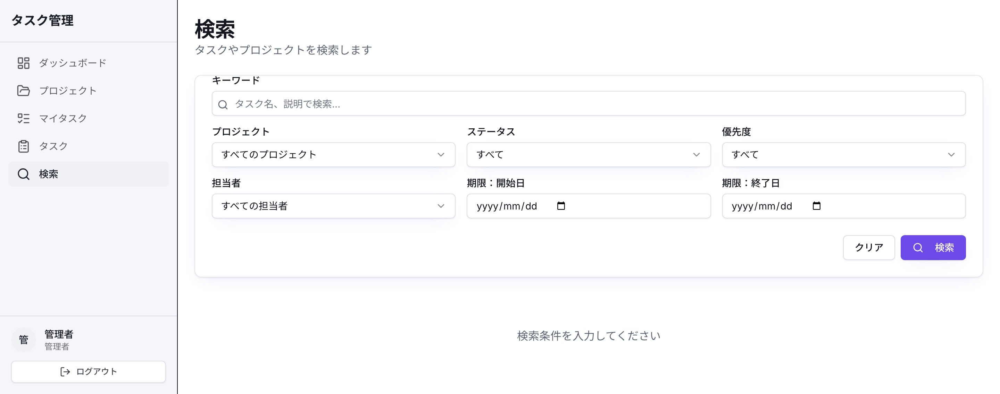
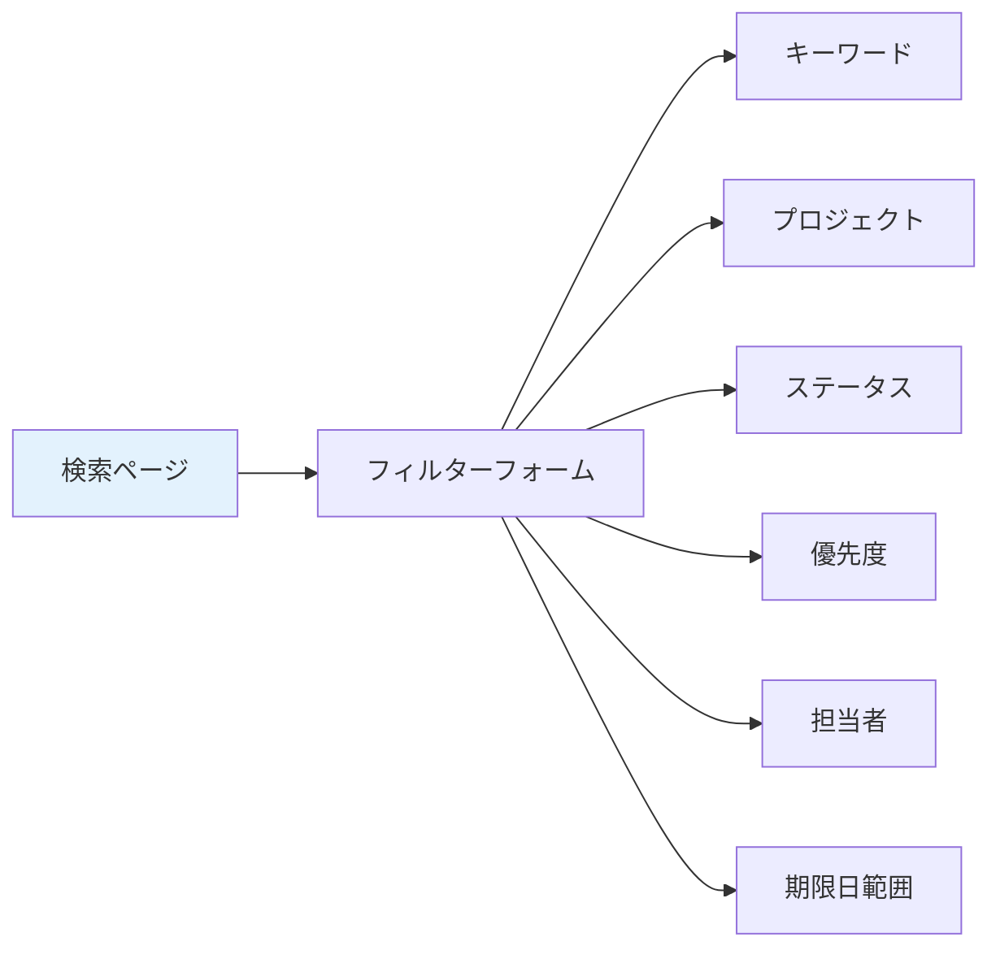
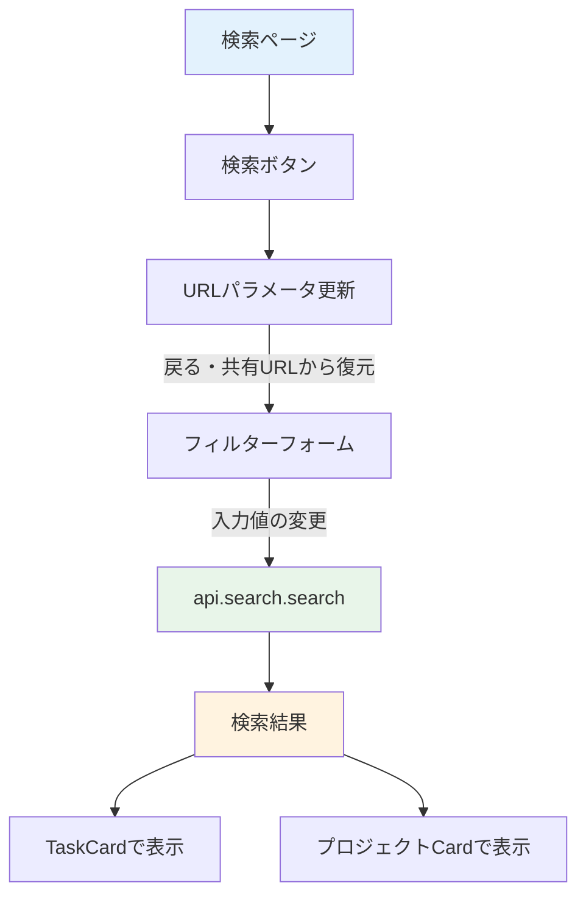
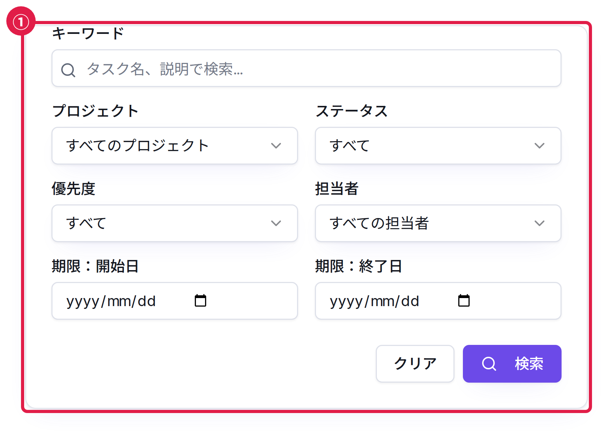
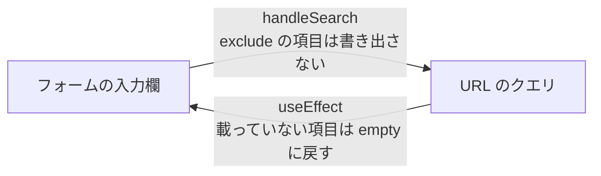
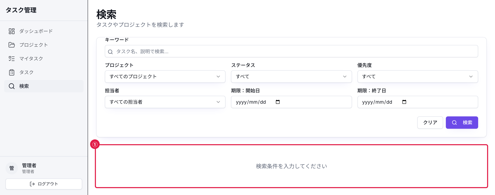
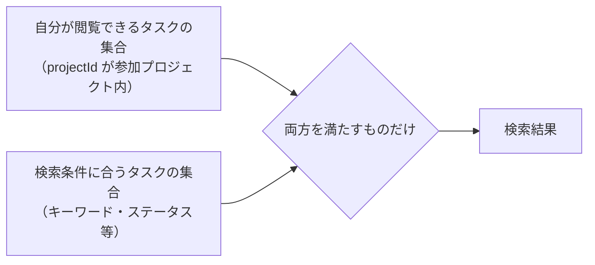

# Day 20: タスク検索機能を実装しよう

## 前回の振り返り

Day 19 ではコメントの編集・削除機能を実装し、自分が書いたコメントだけを操作できる権限チェックも加えました。今日はキーワードとフィルターでタスクを検索する機能に取り組みます。

---

## 今日のゴール

キーワードや複数のフィルター条件でタスクを検索できるページを作ります。検索条件はURLパラメータに保存し、共有可能にします。

この日はまずサーバー側の search ルーターの残り3手続きを自分で書きます。そのあと画面をつなぎます。

スクリーンショット: 今日つくる検索画面です。キーワード欄と6つの絞り込み欄が並びます。



条件を入れる前は画面の下側に案内文が出るだけです。
結果のカードが並ぶのは条件を入れて検索したあとです。

> **今日のゴールライン**: 検索フォームの条件をURLに反映し、絞り込んだタスクとプロジェクト結果を共有できる形で表示できれば完了です。

## なぜこれを作るのか

タスクが増えると目的のものが見つけにくくなります。たとえばプロジェクトに50件のタスクがあるとき「優先度：高」で絞り込むと数件だけ表示されます。

> **例え話**: 検索機能は「図書館の検索端末」です。タイトル・ジャンル・著者といった複数の条件を組み合わせて膨大な蔵書から目的の本をすぐに見つけられます。

### 検索機能の構成


```mermaid
flowchart LR
    A[検索ページ] --> B[フィルターフォーム]
    B --> C[キーワード]
    B --> D[プロジェクト]
    B --> E[ステータス]
    B --> F[優先度]
    B --> G[担当者]
    B --> H[期限日範囲]

    style A fill:#e3f2fd
```

入力欄の値は検索に使い、検索ボタンを押すと URL に保存します。次の図は検索と URL からの復元を表しています。


```mermaid
flowchart TD
    A[検索ページ] --> I[検索ボタン]
    I --> J[URLパラメータ更新]
    B[フィルターフォーム] -->|入力値の変更| K[api.search.search]
    J -->|戻る・共有URLから復元| B
    K --> L[検索結果]
    L --> M[TaskCardで表示]
    L --> N[プロジェクトCardで表示]

    style A fill:#e3f2fd
    style K fill:#e8f5e9
    style L fill:#fff3e0
```

フォームの入力値を `watch` で監視し、条件が変わるたびに検索します。検索ボタンは現在の条件を URL に保存するためのものです。共有 URL を開いたときや「戻る」を押したときはURL からフォームを復元します。同じ URL でも検索結果は開いた人の権限に応じて変わります。サーバーが参加中のプロジェクトを調べ、見てよいタスクとプロジェクトだけを返すためです。

### やること / やらないこと

| やること | やらないこと |
|---------|-------------|
| 入力変更に応じた複数条件の検索 | 入力待ち時間による通信の間引き |
| URLパラメータ保存 | 検索結果の並び替え |
| TaskCard で結果表示 | 検索結果のページネーション |
| プロジェクト結果表示 | 検索履歴 |

### 今日作成・編集するファイル

| ファイル | 役割 |
|---------|------|
| `src/server/api/routers/search.ts` | search ルーターの残り3手続きを追記し、完成版の並びに揃える |
| `src/app/search/page.tsx` | 検索ページ本体（新規作成） |
| `src/app/search/loading.tsx` | ローディング画面（新規作成） |
| `src/component/layout/app-layout.tsx` | サイドバーへ検索の導線を足す |
| `src/app/task/page.tsx` | 検索からの編集リンクを受け取り、一覧の絞り込みをURLへ保存する |
| `src/lib/task-filter-query.ts` | タスク一覧のURL条件を読み書きするhelper（新規作成） |

### 新しく学ぶ概念

| 概念 | 読み方 | 役割 | 例え |
|------|--------|------|------|
| search.search | — | 検索API | 図書館の蔵書検索 |
| URLSearchParams | ユーアールエルサーチパラムズ | URLの検索条件を操作するブラウザ標準API | 検索条件の付箋 |
| shouldSearch | シュッドサーチ | 1つでも条件があるか判定するフラグ | APIを呼び出すかの判定 |
| useForm（復習） | ユーズフォーム | フォーム状態管理（Day 14 参照） | 検索条件の管理係 |
| watch | ウォッチ | フォームの値をリアクティブに監視 | 入力が変わるたびに条件を更新 |

開発サーバーは前の Day から動かしたまま使います。止めてあるときは `npm run dev` で起動してから `http://localhost:3000` を開きます。

## 実装ステップ一覧

| ステップ | 作業内容 | 読む時間の目安 |
|---------|---------|---------|
| Step 0 | search の残り3手続きと読み込み画面を作る | 22分 |
| Step 1 | 検索画面から使うAPIを確認する | 3分 |
| Step 2 | ページの土台を作る | 5分 |
| Step 3 | zodスキーマとuseFormを設定する | 5分 |
| Step 4 | キーワード入力とプロジェクトフィルター | 5分 |
| Step 5 | ステータス・優先度・担当者・期限フィルター | 7分 |
| Step 6 | handleSearchとhandleClearを定義する | 5分 |
| Step 7 | URL同期と検索API呼び出し | 5分 |
| Step 8 | タスク検索結果を表示する | 10分 |
| Step 8.5 | タスク一覧の絞り込みをURLへ残す | 18分（仮） |
| Step 9 | プロジェクト結果と削除機能を追加する | 7分 |
| Step 10 | 動作確認 | 3分 |

**読む時間の合計（仮）**: 約95分です。

表と各 Step に記した時間は、説明とコードを読む時間の仮の目安です。実測した値ではありません。コードの入力、動作確認、ダウンロードや起動の待ち時間、調べものには別に時間を取ってください。

---

### Step 0: search の残り3手続きと読み込み画面を作る（読む目安: 22分）

**ゴール**: Day 14 で作った `src/server/api/routers/search.ts` に、
残っている `search`・`quickSearch`・`getUserProjects` を追記します。
読み込み中に表示する `src/app/search/loading.tsx` も作成します。
最後にこの Step で示す5手続きの順序と確認ポイントを使って自己点検します。

Day 14 では担当者候補を取る 2 手続きだけを先に作りました。今日はその続きです。検索画面は `api.search.search` と `api.search.getUserProjects` を使います。さらに `quickSearch` は画面から直接は呼ばれませんが完成版のコードとテストでは使うのでここで一緒に仕上げます。

大事なのは**今日の作業で `search.ts` を完成版のコードと同じ並びに揃える**ことです。Day 14 の時点では `getProjectMembers` と `getMembersByProject` だけを先に書きましたが完成版ではその前に `search`・`quickSearch`・`getUserProjects` が入ります。ここで順番を整えておくと以降の Day と差分を見比べやすくなります。

#### 0-1. まず足りない import と定数を追加する

Day 14 で書いた import に、今日初めて必要になるものだけを足します。
`Prisma` は検索条件の型に使います。
`taskStatusSchema` と `taskPrioritySchema` は検索フォーム入力の検証に使います。
タスクを読むクエリには、現在のプロジェクトメンバーだけを対象にする条件を直接入れます。

```typescript
// filepath: src/server/api/routers/search.ts（既存 import に追記）
import type { Prisma } from '@prisma/client';
import { taskPrioritySchema, taskStatusSchema } from '@/lib/constant/query';
```

3つとも、今日の検索処理でしか使いません。`Prisma` は型だけを取り込んでいて`Prisma.TaskWhereInput` のような検索条件の型注釈に使います。`taskStatusSchema` と `taskPrioritySchema` は Day 13 で決めたステータスと優先度の値をそのまま持っているので、画面から届いた文字列が正しい値かどうかを入口で確かめられます。検索範囲は、タスクを読む `where` へ現在のプロジェクト所属を直接書いて絞ります。

続けてDay 14 の `import` 群の下に検索件数の上限を置きます。

```typescript
// filepath: src/server/api/routers/search.ts（import の下に追加）
const SEARCH_TASK_LIMIT = 100;
const SEARCH_PROJECT_LIMIT = 20;
const QUICK_SEARCH_TASK_LIMIT = 20;
const QUICK_SEARCH_PROJECT_LIMIT = 10;
```

`LIMIT` を定数にしておくとあとから「検索結果を20件までにしよう」と変えたいときも、数字を探し回らずに済みます。最初に名前を付けておくと処理本体を読むときも「これは検索件数の上限だな」と一目で分かります。

上限そのものが要る理由も押さえておきましょう。検索は条件しだいで何千件でも一致します。上限を付けずに `findMany` を呼ぶとその全部を DB から運び、ブラウザは全部を描画しようとして固まります。ここで100件と20件に切っておけばいちばん重いときでも読み込む量が決まります。

#### 0-2. 検索入力スキーマを追加する

次に`search` と `quickSearch` が受け取る入力を zod で定義します。Day 14 の `searchRouter` 宣言の前に、次の 2 つを追加してください。

```typescript
// filepath: src/server/api/routers/search.ts（searchRouter の前に追加）
const searchInputSchema = z.object({
  keyword: z.string().optional(),
  projectId: z.string().cuid().optional(),
  status: z
    .union([z.literal('all'), taskStatusSchema])
    .optional()
    .default('all'),
  priority: z
    .union([z.literal('all'), taskPrioritySchema])
    .optional()
    .default('all'),
  assignedTo: z.string().cuid().optional(),
  dateFrom: z.string().datetime().optional(),
  dateTo: z.string().datetime().optional(),
});
```

`status` と `priority` が `z.union([z.literal('all'), ...])` になっているのは「特定の値で絞り込む」だけでなく「絞り込みなし」も受け取りたいからです。検索フォーム側では「すべて」を `'all'` で送るのでサーバー側もその値を受け取れる形にしておきます。

`projectId` と `assignedTo` に `.cuid()` が付いているのはid の形をした文字列しか通さないためです。選択肢から外れた値が混ざってもDB へ問い合わせる前に弾けます。`.default('all')` があるので画面が `status` を送らなかったときもサーバー側では「絞り込みなし」として扱われます。7つのうち必須はひとつもありません。キーワードだけ、ステータスだけ、という検索も成り立たせたいからです。

```typescript
// filepath: src/server/api/routers/search.ts（続き）
const quickSearchInputSchema = z.object({
  keyword: z.string().trim().min(1, 'キーワードは必須です'),
});
```

`quickSearch` は検索窓に文字を入れてすぐ使う用途なので空文字は受け付けません。ここで `.min(1, ...)` を付けておくと「検索語なしで呼ばれる」事故を入口で止められます。

順番にも意味があります。`.trim()` が先に来るので空白を落としてから長さを数えます。スペースだけを入れて呼ばれた場合も `.min(1)` に引っかかって止まります。この一行が無いとキーワード無しの `quickSearch` が参加プロジェクトのタスクを丸ごと引いてしまいます。

#### 0-3. 動的な検索条件を組み立てる部品を作る

複数条件検索は最初から `.findMany({ where: ... })` を一気に書くと見通しが悪くなります。そこで完成版のコードでは「条件を小さな部品に分けてから最後に合体する」形にしています。Day 14 の `searchRouter` の前へ、次を上から順に追加します。

```typescript
// filepath: src/server/api/routers/search.ts（続き）
type FilterConfig = {
  key: keyof Prisma.TaskWhereInput;
  value: string | undefined;
  transform?: (value: string) => Prisma.TaskWhereInput[keyof Prisma.TaskWhereInput];
};
```

`FilterConfig` は「どの列に」「どの値を」「必要ならどう変換して」入れるかを表す設計図です。後で `projectId`・`status`・`priority`・`assigneeId` を同じパターンで処理できるようにこの形を先に決めています。

`transform` にだけ `?` が付いているのはほとんどの列が値をそのまま入れるだけで済むからです。今日の `baseFilters` では変換の関数は使いません。日付は別の `buildDateRangeFilter` で扱います。`transform` は今後、値の変換が必要な列を追加する場合に使う項目です。`key` の型を `keyof Prisma.TaskWhereInput` にしてあるので`Task` に存在しない列名を書いた時点で型エラーになります。

```typescript
// filepath: src/server/api/routers/search.ts（続き）
const buildDynamicWhere = (filters: FilterConfig[]): Partial<Prisma.TaskWhereInput> => {
  const result: Partial<Prisma.TaskWhereInput> = {};
  for (const f of filters) {
    if (f.value !== undefined && f.value !== 'all') {
      Object.assign(result, { [f.key]: f.transform ? f.transform(f.value) : f.value });
    }
  }
  return result;
};
```

ここで大事なのは `f.value !== 'all'` の判定です。検索フォームでは「すべて」を `'all'` で送りますがそのまま `where` に入れると `status = 'all'` のような存在しない条件になってしまいます。だから `'all'` は「条件を足さない」という意味で捨てます。

`Object.assign` で1件ずつ足していくので指定されなかった列は `result` に現れません。Prisma は `where` に書かれていない列を条件として扱わないため未指定はそのまま「絞り込まない」になります。この判定を外すとステータスで「すべて」を選んだとたん検索が失敗します。`status` は `TODO` や `DONE` だけを取る列なので`'all'` を条件として渡された Prisma は検索せずにエラーを投げます。0件が返るのではなく、画面にエラーが出ます。

```typescript
// filepath: src/server/api/routers/search.ts（続き）
const buildKeywordFilter = (keyword: string, fields: string[]) =>
  fields.map((field) => ({
    [field]: { contains: keyword, mode: 'insensitive' satisfies Prisma.QueryMode },
  }));
```

`mode: 'insensitive'` は大文字・小文字を区別しない検索です。`Task` と `task` を別物扱いしないのでユーザーが入力の細かい表記を意識せずに済みます。

返しているのは配列で、`fields` に `['title', 'description']` を渡せば2件並びます。これを呼び出し側で `OR` に入れるためタイトルか説明のどちらかが一致すればヒットします。`contains` は部分一致なので「ログ」と入れれば「ログイン画面の修正」も拾えます。検索する列を引数で受け取る形にしてあるのはタスクとプロジェクトで対象の列名が違うからです。

```typescript
// filepath: src/server/api/routers/search.ts（続き）
const buildDateRangeFilter = (dateFrom?: string, dateTo?: string) => {
  const dateFilter: Partial<{ gte: Date; lte: Date }> = {};
  if (dateFrom) {
    dateFilter.gte = new Date(dateFrom);
  }
  if (dateTo) {
    dateFilter.lte = new Date(dateTo);
  }
  return Object.keys(dateFilter).length > 0 ? dateFilter : undefined;
};
```

`gte` は「この日以降」、`lte` は「この日以前」です。両方そろっていなくても動くように開始日だけ・終了日だけでも条件を作れる形にしています。

最後の行で、キーが1つも入らなかったときに `undefined` を返しているところが要点です。期限を指定しない場合は、日付の条件自体を加える必要がありません。`undefined` を返しておけば呼び出し側は返り値があるかどうかだけを見て条件を足すかどうかを決められます。

#### 0-4. 既存の 2 手続きを下へ移し、search を先頭に入れる

ここからが本体です。Day 14 で書いた `getProjectMembers` と
`getMembersByProject` はそのまま残します。Day 14で、所属条件をメンバー取得と同じ `findMany` に含めました。所属確認だけを先に別の問い合わせへ分けないでください。
ただし最終的にはその前に `search`・`quickSearch`・`getUserProjects`
が並ぶ形にしてください。
完成形の `export const searchRouter = createTRPCRouter({ ... })` の先頭は
まず `search:` から始まります。

まず `search` を追加します。`export const searchRouter = createTRPCRouter({` の直後へ、次のブロックを順に入れてください。

```typescript
// filepath: src/server/api/routers/search.ts（searchRouter の先頭に追加）
  search: protectedProcedure.input(searchInputSchema).query(async ({ input, ctx }) => {
    const userId = ctx.session.userId;
    const keyword = input.keyword?.trim();

    const baseFilters: FilterConfig[] = [
      { key: 'projectId', value: input.projectId },
      { key: 'status', value: input.status },
      { key: 'priority', value: input.priority },
      { key: 'assigneeId', value: input.assignedTo },
    ];
```

`keyword?.trim()` の `?.` は「値があるときだけ `.trim()` する」です。
前後の空白だけで検索したときに空白を条件として持ち込まないためです。
そのため最初に整えています。

`baseFilters` に4件並べたのはプロジェクト・ステータス・優先度・担当者が「列に値を1つ入れるだけ」で表せる条件だからです。同じ形なのであとから絞り込み項目が増えても配列に1行足すだけで済みます。キーワードと期限だけは複数の列をまたいだり範囲を持ったりするのでこの配列には入れずに別で組み立てます。

```typescript
// filepath: src/server/api/routers/search.ts（続き）
    const dueDateFilter = buildDateRangeFilter(input.dateFrom, input.dateTo);

    const andConditions: Prisma.TaskWhereInput[] = [
      { project: { members: { some: { userId } } } },
      buildDynamicWhere(baseFilters),
    ];
    if (dueDateFilter) {
      andConditions.push({ dueDate: dueDateFilter });
    }
```

`project: { members: { some: { userId } } }` が重要です。タスクを取得する時点のプロジェクト所属で検索対象を絞ります。この条件がないと、キーワードさえ合えば他人のプロジェクトのタスクまで検索できてしまいます。

この1行は検索機能でいちばん壊してはいけない場所です。試すなら自分が参加していないプロジェクトのタスク名で検索してみてください。この条件があるうちは0件になり、外すと他人のタスクが並びます。しかも画面側で隠しても手遅れです。サーバーが返した時点で、通信の中身には残っています。だから絞り込みは必ずここで済ませます。`andConditions` の配列の先頭へ置いてあるのも、あとから条件を足す人がいちばん先に目を通す場所だからです。

```typescript
// filepath: src/server/api/routers/search.ts（続き）
    if (keyword) {
      andConditions.push({ OR: buildKeywordFilter(keyword, ['title', 'description']) });
    }

    const taskWhere: Prisma.TaskWhereInput = { AND: andConditions };

    const tasks = await prisma.task.findMany({
      where: taskWhere,
      include: {
        project: true,
        createdBy: {
          select: USER_SELECT,
        },
```

検索条件を `AND` の配列で積み上げているのは「参加中プロジェクトであること」「指定したフィルターに合うこと」「キーワードが合うこと」を全部同時に満たさせたいからです。条件が増えても配列に 1 個ずつ足していけば読みやすさを保てます。

`buildDynamicWhere` の返り値をそのまま配列へ入れられるのは返す形が `where` と同じだからです。キーワードだけ `push` で後から足しているのは入力が空のときに `OR` ごと省きたいからです。空の配列を `OR` に渡すとどの行も一致しなくなり、他の条件が合っていても結果は0件になります。

```typescript
// filepath: src/server/api/routers/search.ts（続き）
        assignee: {
          select: USER_SELECT,
        },
      },
      orderBy: { updatedAt: 'desc' },
      take: SEARCH_TASK_LIMIT,
    });

    const projects = !keyword
      ? []
      : await prisma.project.findMany({
          where: {
            members: {
              some: { userId },
            },
```

プロジェクト検索は `!keyword ? []` で分岐しています。プロジェクト名検索はキーワードがあって初めて意味があるので空検索のときは無理に DB を読まず空配列を返します。

プロジェクト側とタスク側の両方で、`members: { some: { userId } }` により見える範囲を守ります。名前が一致しても参加していないプロジェクトのデータはここで落ちます。手続きの中に検索が2本ある以上、絞り込みも2本とも書きます。

```typescript
// filepath: src/server/api/routers/search.ts（続き）
            OR: buildKeywordFilter(keyword, ['name', 'description']),
          },
          include: {
            members: {
              include: {
                user: {
                  select: USER_SELECT,
                },
              },
            },
            _count: {
              select: { tasks: true },
            },
```

`include` でメンバーとその先のユーザーまで取得しています。今日のプロジェクトカードは名前と説明だけを表示するので、このメンバー情報は使いません。ここでは本体と取得するデータの形をそろえています。`_count: { select: { tasks: true } }` はタスクの中身ではなく件数だけを数えて返す書き方です。タスクを全部取ってから `length` で数えると表示に使わないデータまで運ぶことになります。数えるのは DB に任せたほうが軽く済みます。

```typescript
// filepath: src/server/api/routers/search.ts（続き）
          },
          orderBy: { updatedAt: 'desc' },
          take: SEARCH_PROJECT_LIMIT,
        });

    return {
      tasks,
      projects,
      totalCount: tasks.length + projects.length,
    };
  }),
```

`totalCount` をサーバー側で返しておくとフロントエンドは `tasks.length + projects.length` を毎回書かずに済みます。ただしここで数えているのは `take` で切ったあとに返した行数です。条件に一致した全体の件数ではありません。タスクが上限の100件に達したら実際にもっとあっても `totalCount` は100のままです。画面には「いま表示している件数」として出します。

`take: SEARCH_PROJECT_LIMIT` で20件に切ってあるので名前が広く一致しても返る量は決まります。

#### 0-5. quickSearch をその次に追加する

続けて `search` の直後に `quickSearch` を追加します。これは検索ページ本体ではまだ使いませんが完成版のコードとテストで必要です。

```typescript
// filepath: src/server/api/routers/search.ts（search の直後に追加）
  quickSearch: protectedProcedure.input(quickSearchInputSchema).query(async ({ input, ctx }) => {
    const userId = ctx.session.userId;
    const keyword = input.keyword.trim();

    const [tasks, projects] = await Promise.all([
      prisma.task.findMany({
        where: {
          project: { members: { some: { userId } } },
          OR: buildKeywordFilter(keyword, ['title', 'description']),
        },
```

`Promise.all([...])` にしているのはタスク検索とプロジェクト検索に
互いを待つ必要がないからです。
順番に 2 回待つより同時実行のほうが検索体験は軽くなります。

`Promise.all` は渡した処理を同時に始めて全部が終わったところで結果を配列で返します。`[tasks, projects]` と書いて受け取ると渡した順番のまま値が入ります。片方が失敗したときは全体が失敗になるので、タスクだけ届いた中途半端な結果が画面に出る心配もありません。ここでも各クエリへ `search` と同じ現在の所属条件を掛けています。

```typescript
// filepath: src/server/api/routers/search.ts（続き）
        include: {
          project: true,
          createdBy: { select: USER_SELECT },
          assignee: { select: USER_SELECT },
        },
        orderBy: { updatedAt: 'desc' },
        take: QUICK_SEARCH_TASK_LIMIT,
      }),
      prisma.project.findMany({
        where: {
          members: { some: { userId } },
          OR: buildKeywordFilter(keyword, ['name', 'description']),
        },
```

ここでもタスク側とプロジェクト側の両方に `members: { some: { userId } }` が並んでいます。`quickSearch` は入力がキーワード1つだけで条件は薄いのですが見える範囲の制限だけは `search` と同じに保ちます。手続きごとに書く決まりなので忘れやすく、1か所抜けるとそこだけが抜け道になります。新しい検索の手続きを足すときはまずこの2つを書いてから中身を考えると安全です。

```typescript
// filepath: src/server/api/routers/search.ts（続き）
        include: {
          members: {
            include: { user: { select: USER_SELECT } },
          },
          _count: { select: { tasks: true } },
        },
        orderBy: { updatedAt: 'desc' },
        take: QUICK_SEARCH_PROJECT_LIMIT,
      }),
    ]);
```

上限を `QUICK_SEARCH_TASK_LIMIT`（20件）と `QUICK_SEARCH_PROJECT_LIMIT`（10件）まで下げているのは`quickSearch` が入力しながら候補を出す用途だからです。待たせないことを優先し、絞り込みもキーワード1つに限っています。

```typescript
// filepath: src/server/api/routers/search.ts（続き）
    return {
      tasks,
      projects,
      totalCount: tasks.length + projects.length,
    };
  }),
```

#### 0-6. getUserProjects を追加する

検索フォームのプロジェクト Select では参加中のプロジェクト一覧が必要です。そのための `getUserProjects` を、`quickSearch` の直後に追加します。

```typescript
// filepath: src/server/api/routers/search.ts（quickSearch の直後に追加）
  getUserProjects: protectedProcedure.query(async ({ ctx }) => {
    const userId = ctx.session.userId;

    const projects = await prisma.project.findMany({
      where: {
        members: {
          some: {
            userId,
          },
        },
      },
```

この手続きに `.input(...)` が無いのは画面から受け取るものが何も無いからです。誰のプロジェクトを返すかは `ctx.session.userId` だけで決まります。もし「見たいユーザーの id」を引数で受け取る形にすると他人の id を書き込んで呼ばれる余地が生まれます。送らせない作りにしておけばその心配は最初から起きません。

```typescript
// filepath: src/server/api/routers/search.ts（続き）
      include: {
        _count: {
          select: { tasks: true },
        },
      },
      orderBy: { name: 'asc' },
    });

    return projects;
  }),
```

ここでは `members.some.userId` で「自分が入っているプロジェクトだけ」を取り、`orderBy: { name: 'asc' }` で名前順に並べています。検索フォームの Select は毎回同じ順で並んだほうが探しやすいので更新順ではなく名前順にしています。

`_count` でタスク件数も一緒に返しているのは選択肢の横に件数を出したくなったときに通信を増やさずに済ませるためです。この一覧はそのまま検索フォームの選択肢になります。ここに他人のプロジェクトが混ざらない点は画面の安全へ直結します。

#### 0-7. 既存の 2 手続きはそのまま下へ続ける

この時点で `search.ts` の並びは上から次の順になります。

1. `search`
2. `quickSearch`
3. `getUserProjects`
4. `getProjectMembers`
5. `getMembersByProject`

Day 14 で書いた `getProjectMembers` と `getMembersByProject` のコード自体は変えません。位置だけが後ろへ下がるイメージです。`root.ts` は Day 18 までに `auth → project → task → search → comment` の時系列順で登録済みなので今日は追加で触らなくて大丈夫です。`report` と `user` はそれぞれ Day 21 と Day 24 で初めて追加します。

#### 0-8. 最後に完成形を自己点検する

`src/server/api/routers/search.ts` を先頭から読み直し、次の確認ポイントと照らし合わせてください。販売用 ZIP には完成済み router を入れていないためこの教材内のコードと順序が正本です。

**確認ポイント**:
- `search.ts` の手続き順が `search → quickSearch → getUserProjects → getProjectMembers → getMembersByProject` になっています
- `searchInputSchema` / `quickSearchInputSchema` / `FilterConfig` / 3つの helper が `searchRouter` の前にあります
- `root.ts` は Day 18 のまま、`search: searchRouter` が `task` と `comment` の間にあります
- `npx tsc --noEmit` を実行し、型エラーが出ていません

---

#### 0-9. 検索ページの読み込み表示を作る

`src/app/search/loading.tsx` を新規作成します。ページと同じフォルダに `loading.tsx` を置くとNext.js はそのページの読み込み中に自動でこれを表示します。

```tsx
// filepath: src/app/search/loading.tsx
import { PageSkeleton }
  from '@/component/ui/page-skeleton';

export default function Loading() {
  return <PageSkeleton />;
}
```

これが出るのはページへ移動したときだけです。検索結果そのものの読み込み表示はStep 8 で `isLoading` を見て切り替えます。役割が分かれている点に注意してください。中身は配布済みの `PageSkeleton` をそのまま返すだけです。この部品を使うのは今日がはじめてです。完成版は同じ4行を dashboard・my-task・project・report・task の各フォルダにも置いています。今日は検索ページの1枚だけ作ります。ほかの画面にも同じ表示を出したくなったら同じ内容のファイルをそのフォルダへ置いてください。

### Step 1: 検索画面から使うAPIを確認する（読む目安: 3分）

**ゴール**: 今書いた `search` ルーターのうち、検索画面がどの手続きを呼ぶのかを整理します。

Day 20 の画面が直接使うのは主に `search.search` と `search.getUserProjects` です。担当者フィルターには Day 14 で作った `search.getProjectMembers` も使います。まず `src/server/api/routers/search.ts` を開き、`searchInputSchema` と `getUserProjects` を確認しましょう。

```typescript
// filepath: src/server/api/routers/search.ts
// 検索パラメータのバリデーション定義
const searchInputSchema = z.object({
  keyword: z.string().optional(),
  projectId: z.string().cuid().optional(),
  status: z.union([
    z.literal('all'),
    taskStatusSchema,
  ]).optional().default('all'),
  priority: z.union([
    z.literal('all'),
    taskPrioritySchema,
  ]).optional().default('all'),
  assignedTo:
    z.string().cuid().optional(),
  dateFrom:
    z.string().datetime().optional(),
  dateTo:
    z.string().datetime().optional(),
});
```

同じ定義をもう一度載せたのはこれから作る画面のフォームがこの7項目とそのまま1対1で対応するからです。キーワード欄が `keyword`、プロジェクトの選択が `projectId`、というように入力欄を1つ足すたびにこのスキーマへ戻ってくることになります。逆に言うとここに無い項目は画面から送っても届きません。zod は定義に無いキーを黙って捨てます。絞り込みが効かないときはまずこのスキーマを疑ってください。

**確認ポイント**:
- 7つのフィルターパラメータを把握しました
- `status` と `priority` が union 型です

#### search ルーターの全メソッド

| メソッド | 種別 | 説明 |
|---------|------|------|
| `search` | query | 検索実行（メイン） |
| `quickSearch` | query | クイック検索。呼び出す画面はこのカリキュラムでは作りません |
| `getUserProjects` | query | ユーザーのプロジェクト取得 |
| `getProjectMembers` | query | 参加中プロジェクトを横断した、担当者候補の取得 |
| `getMembersByProject` | query | 選択中プロジェクトだけの、担当者候補の取得 |

#### search メソッドのパラメータ

| パラメータ | 型 | 必須 | 説明 |
|-----------|-----|------|------|
| `keyword` | `string?` | — | キーワード |
| `projectId` | `string (cuid)?` | — | プロジェクト |
| `status` | `'all'` \| TaskStatus | — | ステータス（デフォルト `'all'`） |
| `priority` | `'all'` \| TaskPriority | — | 優先度（デフォルト `'all'`） |
| `assignedTo` | `string (cuid)?` | — | 担当者 |
| `dateFrom` | `string (ISO日付)?` | — | 期限開始 |
| `dateTo` | `string (ISO日付)?` | — | 期限終了 |

> `search` は「複数条件検索」、`quickSearch` は「キーワードだけの軽い検索」、`getUserProjects` は「検索フォームの選択肢取得」と役割が分かれています。使い道が違うので似た名前でも1本に詰め込まず分けています。

> **`dateFrom` / `dateTo` は date-only 入力です。**
> 完成版のコードでは生の Date 変換をそのまま使わず、
> `dateOnlyToUtcStartIso` /
> `dateOnlyToUtcEndIso` で日付境界を UTC に変換してから
> API に渡します。これを省くとタイムゾーンによって
> 「4/17 のつもりが 4/16 扱いになる」ずれが起きます。

---

### Step 2: ページの土台を作る（読む目安: 5分）

**ゴール**: 検索ページの基本構造と export default を完成させます。


`src/app/search/page.tsx` を新規作成します。まずインポートを記述します。

```typescript
// filepath: src/app/search/page.tsx
'use client';

import { zodResolver }
  from '@hookform/resolvers/zod';
import { Search } from 'lucide-react';
import Link from 'next/link';
import {
  useRouter, useSearchParams,
} from 'next/navigation';
import {
  Suspense, useCallback, useEffect,
  useMemo, useRef, useState,
} from 'react';
import { useForm } from 'react-hook-form';
import toast from 'react-hot-toast';
import { z } from 'zod';
```

今日の主役は `useSearchParams` と `useRouter` です。前者はURLに付いた検索条件を読み、後者は条件をURLへ書き戻します。`useForm` と `zodResolver` は Day 14 のタスクフォームと同じ組み合わせで、`Suspense` は Day 09 のプロジェクト一覧で使ったものと同じ役割です。`useRef` は Day 15 の送信記録と同じ使い方で、Step 9で削除の連続送信を防ぎます。

**確認ポイント**:
- `useForm`, `zodResolver`, `z` がインポートされています

続いてローカルモジュールのインポートです。

```typescript
// filepath: src/app/search/page.tsx
import { AppLayout }
  from '@/component/layout/app-layout';
import { TaskCard }
  from '@/component/task/task-card';
import { Button }
  from '@/component/ui/button';
import {
  Card, CardContent,
} from '@/component/ui/card';
import { DeleteConfirmDialog }
  from '@/component/ui/delete-confirm-dialog';
import { Input }
  from '@/component/ui/input';
import { Label }
  from '@/component/ui/label';
```

ここで取り込む部品はすべて Day 09 から Day 19 までに使ってきたものです。`TaskCard` は Day 13 のタスク一覧で、`DeleteConfirmDialog` は Day 11 の削除確認で初めて呼び出した、用意済みの共通部品です。どちらも中身を自分で書いたことはありません。検索画面でも表示用の部品を新しく作らず、すでにあるカードとダイアログを並べ替えて使います。見た目がタスク一覧とそろうので読者にとっても「検索したあとの操作は今まで通り」になります。

**確認ポイント**:
- レイアウト・UIコンポーネントが揃っています

```typescript
// filepath: src/app/search/page.tsx
import { PageLoadingSpinner }
  from '@/component/ui/loading-spinner';
import {
  Select, SelectContent, SelectItem,
  SelectTrigger, SelectValue,
} from '@/component/ui/select';
import { Separator }
  from '@/component/ui/separator';
import {
  isTaskPriority,
  TASK_PRIORITY_LABELS,
} from '@/lib/constant/priority';
```

`Select` は shadcn/ui の部品で、4つがそろって1つのプルダウンになります。`SelectTrigger` が閉じているときのボタン、`SelectContent` が開いたときの一覧、`SelectItem` が選択肢1つ分、`SelectValue` が今選ばれている値の表示です。`TASK_PRIORITY_LABELS` は `HIGH` のような内部の値を「高」という日本語へ変える対応表で、Day 13 で作ったものを使い回します。`isTaskPriority` は受け取った文字列がその4つのどれかに当たるかを確かめる関数です。

続けてロール判定用と検索条件用のインポートを追加します。

```typescript
// filepath: src/app/search/page.tsx
import {
  hasPermission, isProjectMemberRole,
  type ProjectMemberRole,
} from '@/lib/constant/roles';
import {
  isTaskStatus,
  TASK_STATUS_LABELS,
} from '@/lib/constant/status';
import {
  dateOnlyToUtcEndIso,
  dateOnlyToUtcStartIso,
} from '@/lib/date';
import {
  isAuthError, isForbiddenError,
  shouldRetryQuery,
} from '@/lib/query-error';
import { classifyTaskWriteError } from '@/lib/task-write-error';
import { api } from '@/trpc/react';
```

`dateOnlyToUtcStartIso` と `dateOnlyToUtcEndIso` は日付だけの文字列を時刻付きに直す関数です。`type="date"` の入力欄からは `2026-04-17` のような値が届くので、その日の始まりと終わりへ直してからサーバーへ渡します。`hasPermission` と `isProjectMemberRole` は Day 13 で使ったロール判定の道具で、検索結果のカードに編集ボタンを出してよいかを決めます。`query-error` の3つは、通信失敗と認証・認可の拒否を分けるために使います。`classifyTaskWriteError` は、Day 14で導入し、Day 15の削除でも使った書き込みエラーの分類関数です。削除時の401をログイン切れとして扱い、権限不足や結果不明の場合には次の操作を伝える文を返します。

**確認ポイント**:
- `PageLoadingSpinner` のパスが `@/component/ui/loading-spinner`
- 型ガード `isTaskStatus` / `isTaskPriority` がインポートされています

`SearchPageContent` の外枠と `export default` を書きます。`useSearchParams` は Suspense 境界が必要です。

```typescript
// filepath: src/app/search/page.tsx
// コンポーネント本体の外枠
function SearchPageContent() {
  const router = useRouter();
  const searchParams = useSearchParams();
  const utils = api.useUtils();

  return (
    <AppLayout>
      <div className="space-y-6">
        <div>
          <h1 className="text-3xl font-bold
            tracking-tight">検索</h1>
          <p className="text-muted-foreground">
            タスクやプロジェクトを検索します
          </p>
        </div>
        {/* Step 4-5: フィルターフォーム */}
        {/* Step 8-9: 検索結果 */}
      </div>
    </AppLayout>
  );
}
```

中身はまだ見出しと説明文だけで、フォームと結果はコメントの位置へ順に足していきます。先に外枠を置いておくと次のステップから貼り付ける場所に迷いません。`utils` は `api.useUtils()` で取り出す道具で、タスクを削除したあとに検索結果を取り直させるために使います。今の時点では使い道が見えませんがStep 9 の削除処理でここへ戻ってきます。

削除の応答が401でも、検索結果の読み取りはまだ成功時の値を持っている場合があります。書き込みで分かったログイン切れを保存するため、`SearchPageContent` 内の `const utils = api.useUtils();` の直後へ次を追加します。

```typescript
// filepath: src/app/search/page.tsx（utils の直後に追加）
const [authExpired, setAuthExpired] = useState(false);
const authExpiredRef = useRef(false);
const markAuthExpired = () => {
  authExpiredRef.current = true;
  setAuthExpired(true);
};
```

stateはログイン切れの案内を表示するために使います。refは代入した直後から読めるため、Reactの再描画より先に次の編集・削除を止めます。`markAuthExpired` は両方を更新する関数です。この画面では期限切れを解除せず、ログイン画面へ進んで認証し直します。

**確認ポイント**:
- `utils` は検索結果の再取得（削除後）に使います
- コメントでフォームと結果の挿入位置を示しています
- `markAuthExpired` がstateとrefの両方を更新し、表示を切り替え、再描画前の編集・削除を止めます

> `useSearchParams` はURL のクエリ文字列を読み取る Next.js のフックです。`useRouter` はプログラムからURL遷移するために使います。

```typescript
// filepath: src/app/search/page.tsx
// Suspenseでラップしてexport
export default function SearchPage() {
  return (
    <Suspense
      fallback={<PageLoadingSpinner />}>
      <SearchPageContent />
    </Suspense>
  );
}
```

ページを `SearchPageContent` と `SearchPage` の2つに分けたのは`Suspense` の外側に本体を置けないからです。外側の `SearchPage` が待ち受け役、内側が本体という分担で、Day 09 のプロジェクト一覧ページと同じ形になっています。`fallback` に渡した `PageLoadingSpinner` はURLが決まるまでの間だけ表示されます。

**確認ポイント**:
- `/search` にアクセスして画面が表示されます
- `PageLoadingSpinner` で読み込み中が表示されます

検索ページが表示できたので、Day 17 までのサイドバーへ検索導線を追加します。
`lucide-react` の既存 import に `Search` を
加えてください。

```typescript
// filepath: src/component/layout/app-layout.tsx
import {
  ClipboardList,
  FolderOpen,
  LayoutDashboard,
  ListTodo,
  LogOut,
  Search,
} from 'lucide-react';
```

足すのは `Search` の1行だけです。`lucide-react` からアイコンをまとめて取り込んでいるので既存のアイコンを消さずに並びへ追加します。アルファベット順に入れてあるのはimport の並べ替えを Biome に任せているからで、順番を崩すと保存のたびに差分が出ます。

`menuItems` の閉じかっこ直前へ
検索項目を追加します。

```typescript
// filepath: src/component/layout/app-layout.tsx
{
  text: '検索',
  icon: <Search className="h-5 w-5" />,
  path: '/search',
},
```

`path: '/search'` は、先ほど作った `src/app/search/page.tsx` と対応します。Next.js はフォルダの位置がそのままURLになるのでリンク先を別に登録する作業は要りません。ページが表示できることを確かめてから入口を足したので、この時点で検索項目を押しても404にはなりません。

**確認ポイント**:
- 既存の4項目を残しました
- サイドバーの「検索」から `/search` を開けます

> Next.js App Router では `useSearchParams` を使うコンポーネントを `Suspense` で囲む必要があります。囲まないとビルド時にエラーになります。

---

### Step 3: zodスキーマとuseFormを設定する（読む目安: 5分）

**ゴール**: 7つのフィルター条件を zod スキーマと useForm で一括管理します。

`SearchPageContent` の外側（関数の上）にスキーマを定義します。サーバー側の `searchInputSchema` と型を合わせます。

```typescript
// filepath: src/app/search/page.tsx
// ステータス・優先度の値定義
const TASK_STATUS_VALUES = [
  'TODO', 'IN_PROGRESS', 'IN_REVIEW',
  'DONE', 'CANCELLED',
] as const;
const TASK_PRIORITY_VALUES = [
  'LOW', 'MEDIUM', 'HIGH', 'URGENT',
] as const;
```

`as const` を付けると配列を要素数と順番が決まった読み取り専用の型として扱えます。次の `z.enum([...])` はこの値の一覧から選択肢を作ります。サーバー側の `taskStatusSchema` と値をそろえておきましょう。片方だけ増やすと画面では選べるのにサーバーで弾かれる項目ができます。

**確認ポイント**:
- サーバー側の `taskStatusSchema` / `taskPrioritySchema` と値が一致しています

```typescript
// filepath: src/app/search/page.tsx
// 検索フォームの zodスキーマ
const searchFormSchema = z.object({
  keyword: z.string(),
  projectId: z.string(),
  status: z.enum([
    'all', ...TASK_STATUS_VALUES,
  ]),
  priority: z.enum([
    'all', ...TASK_PRIORITY_VALUES,
  ]),
  assignedTo: z.string(),
  dateFrom: z.string(),
  dateTo: z.string(),
});
type SearchFormValues =
  z.infer<typeof searchFormSchema>;
```

`'all'` を配列の先頭へ置いたのは絞り込みなしもフォームの正式な値として扱うためです。サーバー側の `searchInputSchema` が `z.union([z.literal('all'), taskStatusSchema])` だったのと同じ考え方で、画面とサーバーで受け取れる値をそろえています。最後の `z.infer` は書いたスキーマから型を組み立てる書き方です。型を別に手で書かないのでスキーマを直せば型も一緒に変わります。この `SearchFormValues` が次に `useForm` へ渡す型になります。

**確認ポイント**:
- `status` / `priority` が `'all'` + 実際の値の union になっています
- サーバー側と型が合っている（`z.string()` ではなく `z.enum`）

支援クエリ（検索条件や操作権限を支える問い合わせ）が失敗した場合は、空の選択肢に見せず警告を表示します。4つの問い合わせで同じ見た目と再試行条件を使うため、警告用の props と部品を定義します。次の2ブロックを順番につなげて、`type SearchFormValues = z.infer<typeof searchFormSchema>;` の直後へ追加します。`SearchPageContent` 関数の外へ両方のブロックを書いてから保存してください。

```typescript
// filepath: src/app/search/page.tsx
type SupportQueryWarningProps = {
  ariaLabel: string;
  message: string;
  retryLabel: string;
  hasCachedData: boolean;
  isFetching: boolean;
  onRetry: () => void;
};

function SupportQueryWarning({
  ariaLabel, message, retryLabel,
  hasCachedData, isFetching, onRetry,
}: SupportQueryWarningProps) {
  return (
    <div role="alert" aria-label={ariaLabel}>
      <span>{message}{hasCachedData
        ? '前回取得時の内容を表示しています。'
        : '選択肢や操作権限は利用できません。'}</span>
```

初回失敗と再取得失敗で文を分けるのは、手元に表示できるキャッシュがあるかを読者へ伝えるためです。取得中は同じ問い合わせを重ねないよう、ボタンを無効にします。

```typescript
{/* filepath: src/app/search/page.tsx（同じファイルの続き） */}
      <Button type="button" variant="outline"
        size="sm" onClick={onRetry}
        disabled={isFetching}>
        {retryLabel}
      </Button>
    </div>
  );
}
```

URLのプロジェクトID・担当者ID・日付はフォームへ入れる前に確かめます。`SearchPageContent` の外に次の関数を追加してください。

```typescript
// filepath: src/app/search/page.tsx
const normalizeId = (value: string): string =>
  z.string().cuid().safeParse(value).success ? value : 'all';

const normalizeDate = (value: string): string => {
  if (!/^\d{4}-\d{2}-\d{2}$/.test(value)) return '';
  const date = new Date(`${value}T00:00:00.000Z`);
  return !Number.isNaN(date.getTime()) &&
    date.toISOString().slice(0, 10) === value
    ? value : '';
};
```

IDはサーバーと同じ `cuid()` で検査し、不正なら絞り込みなしの `all` に戻します。日付は形式と実在する日付の両方を検査します。`2026-02-30` は Date が3月へ補正するため変換後の日付とも比較します。不正な値は空文字に戻します。こうしておけば`?dateFrom=bad` を開いても検索前の日付変換で画面がエラーになりません。

`SearchPageContent` 内に `useForm` を追加します。URLパラメータから初期値を型安全に設定します。

```typescript
// filepath: src/app/search/page.tsx
// SearchPageContent内: 初期値の準備
const initialStatus =
  searchParams.get('status') ?? 'all';
const initialPriority =
  searchParams.get('priority') ?? 'all';

const form = useForm<SearchFormValues>({
  resolver: zodResolver(searchFormSchema),
  defaultValues: {
    keyword:
      searchParams.get('keyword') ?? '',
    projectId:
      normalizeId(searchParams.get('projectId') ?? ''),
    status: isTaskStatus(initialStatus)
      ? initialStatus : 'all',
```

初期値をURLから読んでいるところが今日いちばん大事な設計です。`searchParams.get('keyword')` は`/search?keyword=修正` というURLで開かれたときに「修正」を返します。パラメータが無ければ `null` なので`?? ''` で空文字に置き換えます。条件を `useState` の初期値として書いてしまうと共有されたURLで開いても入力欄は空のままになり、URLと画面が食い違います。

`status` だけ `isTaskStatus` を通してから入れているのはURLが誰でも手で書き換えられるからです。`?status=ABC` のような値をそのままフォームへ入れるとSelect に無い値が選ばれた状態になり、表示が空欄のまま固まります。

**確認ポイント**:
- `??` を使って初期値を設定しています（`||` ではありません）

```typescript
// filepath: src/app/search/page.tsx
// defaultValues の続き
    priority:
      isTaskPriority(initialPriority)
        ? initialPriority : 'all',
    assignedTo:
      normalizeId(searchParams.get('assignedTo') ?? ''),
    dateFrom:
      normalizeDate(searchParams.get('dateFrom') ?? ''),
    dateTo:
      normalizeDate(searchParams.get('dateTo') ?? ''),
  },
});
```

未指定のときの値が項目ごとに違う点を見てください。`assignedTo` は `'all'`、日付は空文字です。Select は必ず何かが選ばれている状態なので「すべて」を表す `'all'` が必要で、日付欄は空欄のままを許すので空文字になります。ここで型がそろっていないと`useForm` に渡した時点で型エラーになります。7つの条件を1つの `useForm` にまとめているのであとで値をまとめて読むのもまとめて消すのも1行で済みます。

**確認ポイント**:
- `isTaskStatus` / `isTaskPriority` で型安全にバリデーションしています
- 7つのフィールドが1つの `useForm` で管理されています

`watch` でフォームの現在値を取得し、プルダウン用データを取得します。

```typescript
// filepath: src/app/search/page.tsx
// フォームの現在値を監視
const formValues = form.watch();

const {
  data: projects,
  isError: projectOptionsErrorPresent,
  isFetching: projectOptionsFetching,
  error: projectOptionsError,
  failureReason: projectOptionsFailure,
  refetch: refetchProjectOptions,
} = api.search.getUserProjects.useQuery(
  undefined, { retry: shouldRetryQuery });
const {
  data: users,
  isError: assigneeOptionsErrorPresent,
  isFetching: assigneeOptionsFetching,
  error: assigneeOptionsError,
  failureReason: assigneeOptionsFailure,
  refetch: refetchAssigneeOptions,
} = api.search.getProjectMembers.useQuery(
  undefined, { retry: shouldRetryQuery });
```

**確認ポイント**:
- `watch()` でフォームの値をリアクティブに取得しています
- 選択肢の取得結果と一緒に、失敗・再取得中・再試行の状態も受け取っています

> Day 14 では `register` と `Controller` で各入力を管理しました。検索フォームでは `setValue` と `watch` の組み合わせで Select コンポーネントの値も管理できます。

検索結果の TaskCard にも編集・削除ボタンの表示可否が必要です。Day 13 と同じロール判定を、ログインユーザーとメンバー所属プロジェクトから求めます。`projects`（Selectの選択肢用）とは別に、ロール情報つきのプロジェクト一覧を取得します。

```typescript
// filepath: src/app/search/page.tsx
// ログインユーザーの情報とロール判定用のプロジェクト一覧
const {
  data: session,
  isError: sessionErrorPresent,
  error: sessionError,
  failureReason: sessionFailure,
  isFetching: sessionFetching,
  refetch: refetchSession,
} = api.auth.getSession.useQuery(
  undefined, { retry: shouldRetryQuery });
const {
  data: memberProjects,
  isError: memberProjectsErrorPresent,
  error: memberProjectsError,
  failureReason: memberProjectsFailure,
  isFetching: memberProjectsFetching,
  refetch: refetchMemberProjects,
} = api.project.getAll.useQuery(
  undefined, { retry: shouldRetryQuery });
```

401と403は再試行しても同じ要求のままでは解決しないため、`shouldRetryQuery` が自動再試行を止めます。ただし再試行中に401へ変わった場合も保護情報を隠せるよう、次の判定では `failureReason`（再試行中に起きたエラー）も確認します。

```typescript
// filepath: src/app/search/page.tsx（同じファイルの続き）
const supportAuthFailed = authExpired || session === null || [
  sessionError, sessionFailure,
  projectOptionsError, projectOptionsFailure,
  memberProjectsError, memberProjectsFailure,
  assigneeOptionsError, assigneeOptionsFailure,
].some(isAuthError);
const supportForbidden = [
  sessionError, sessionFailure,
  projectOptionsError, projectOptionsFailure,
  memberProjectsError, memberProjectsFailure,
  assigneeOptionsError, assigneeOptionsFailure,
].some(isForbiddenError);
const projectOptionsProtected =
  [projectOptionsError, projectOptionsFailure]
    .some((e) => isAuthError(e) || isForbiddenError(e));
const assigneeOptionsProtected =
  [assigneeOptionsError, assigneeOptionsFailure]
    .some((e) => isAuthError(e) || isForbiddenError(e));
const permissionDataUnavailable = sessionErrorPresent
  || memberProjectsErrorPresent || supportForbidden;
const supportWriteBlocked =
  supportAuthFailed || permissionDataUnavailable;
```

一時的な500は `isError` が真になった時点で警告を出します。再試行中の500を最終失敗と決めつけず、401と403だけは `failureReason` の段階でも表示と操作を保護します。`supportWriteBlocked` はログイン状態か操作権限を確認できない間の書き込みを止めます。`supportAuthFailed` に書き込みで判明した `authExpired` も含めるので、削除の401でも以前の検索結果を隠してログインを案内します。選択肢だけの500は権限を失った意味ではないため、この値には含めません。

```typescript
// filepath: src/app/search/page.tsx（同じファイルの続き）
// プロジェクトごとのログインユーザー自身のロールを引けるようにする
const myRoleByProject = useMemo(() => {
  const map = new Map<string, ProjectMemberRole>();
  const userId = session?.user?.id;
  if (!userId || !memberProjects
    || permissionDataUnavailable) {
    return map;
  }
  for (const project of memberProjects) {
    const me = project.members?.find(
      (member) => member.userId === userId,
    );
    if (me && isProjectMemberRole(me.role)) {
      map.set(project.id, me.role);
    }
  }
  return map;
}, [memberProjects, permissionDataUnavailable,
  session?.user?.id]);
```

`useMemo`（計算した結果を覚えておいてもとにした値が変わるまで作り直さないReactの機能）で包んでいます。プロジェクト一覧、ログインユーザー、権限情報の取得状態が変わったら、対応表を作り直します。検索結果には複数のプロジェクトのタスクが混ざるのでカードを1枚描くたびに配列を端から探し直すと件数の分だけ同じ処理が走ります。`Map` に一度まとめておけばあとは id で1回引くだけで済みます。

> `projects`（`getUserProjects`）はSelectの選択肢専用で、メンバーのロール情報を含みません。ロール判定には `api.project.getAll` が返す `memberProjects`（`members` 配列つき）を使います。

`permissionDataUnavailable` が真の間は、前回取得したデータが残っていても対応表を空にします。権限情報が更新できなかった時点で、古いロールを使って編集・削除ボタンを出す根拠がなくなるためです。画面は操作を閉じたうえで、あとで追加する警告から失敗した問い合わせだけを再試行できます。

続けてそのロールから編集・削除の権限を判定する関数を追加します。

```typescript
// filepath: src/app/search/page.tsx
// ロールから編集・削除の権限を判定する
const canEditProject = useCallback(
  (projectId: string) => {
    const role = myRoleByProject.get(projectId);
    return role ? hasPermission(role, 'canEdit') : false;
  },
  [myRoleByProject],
);

const canDeleteProject = useCallback(
  (projectId: string) => {
    const role = myRoleByProject.get(projectId);
    return role ? hasPermission(role, 'canDelete') : false;
  },
  [myRoleByProject],
);
```

ロールが見つからないときに `false` を返しているのが安全側に倒した作りです。プロジェクト一覧がまだ届いていない一瞬の間も、`myRoleByProject` は空なので `false` になります。ここを `true` にしてしまうと権限のない人にも編集ボタンや削除ボタンが一瞬だけ見える時間ができます。判断がつかないうちは出さない、というのが権限まわりの基本です。

> `canEditProject` / `canDeleteProject` の考え方はDay 13のタスク一覧ページと同じです。

**確認ポイント**:
- `myRoleByProject` / `canEditProject` / `canDeleteProject` が定義できました
- `npm run dev` でエラーが出ていません

---

### Step 4: キーワード入力とプロジェクトフィルター（読む目安: 5分）

**ゴール**: Card 内にキーワード入力とプロジェクトSelectを配置します。

Step 2 の `{/* Step 4-5: フィルターフォーム */}` を以下のコードに置き換えます。

```typescript
{/* filepath: src/app/search/page.tsx */}
{/* フィルターフォーム開始 */}
<Card>
  <CardContent className="pt-6">
    <div className="grid gap-4">
      <div className="grid gap-2">
        <Label htmlFor="keyword">
          キーワード
        </Label>
        <div className="relative">
          <Search className="absolute
            left-2 top-3 h-4 w-4
            text-muted-foreground" />
          <Input id="keyword"
            placeholder=
              "タスク名、説明で検索..."
            className="pl-8"
            {...form.register('keyword')}
            onKeyDown={(e) => {
              if (e.key === 'Enter' && !e.nativeEvent.isComposing)
                handleSearch();
            }} />
        </div>
      </div>
```

`{...form.register('keyword')}` はこの入力欄をフォームの `keyword` へ結び付ける書き方です。Day 14 と同じで、入力された値の保持も変更の受け取りも react-hook-form の側が引き受けます。`onKeyDown` を別に足したのはEnter を押したときにボタンと同じ `handleSearch` を呼びたいからです。この行が無いとキーワードを打ってEnterを押しても何も起きず、読者は「検索が壊れている」と感じます。

ここで呼んでいる `handleSearch` はあとの Step 6 で定義します。
定義するまでこの画面は表示できないのでEnter キーの動きを確かめるのは Step 6 のあとです。

**確認ポイント**:
- `register('keyword')` でフォームに登録しています
- `onKeyDown` の中で `handleSearch()` を呼ぶ行を書けました

> `Search` アイコンを `absolute` で左に配置し、Input の `pl-8` で左パディングを確保します。これでアイコン付き入力欄になります。

6つのフィルターを Grid レイアウトで配置します。まずプロジェクトです。

```typescript
{/* filepath: src/app/search/page.tsx */}
{/* 6列グリッド開始 + プロジェクトSelect */}
<div className="grid grid-cols-1
  md:grid-cols-2 lg:grid-cols-3 gap-4">
  <div className="grid gap-2">
    <Label htmlFor="project">プロジェクト</Label>
    <Select
      value={formValues.projectId}
      onValueChange={(v) =>
        form.setValue('projectId', v)}
      disabled={supportAuthFailed || supportForbidden
        || (projectOptionsErrorPresent && !projects)}>
      <SelectTrigger id="project">
        <SelectValue
          placeholder="すべて" />
      </SelectTrigger>
```

`Label` の `htmlFor` と `SelectTrigger` の `id` に同じ文字を入れているのはラベルとプルダウンを結び付けるためです。こうするとラベルの文字を押しても開き、読み上げソフトも「何の絞り込みか」を伝えられます。

Select は `<input>` と違って `register` では結び付けられません。値の表示は `value={formValues.projectId}`、変更の受け取りは `onValueChange` から `form.setValue` を呼ぶ、という2本立てにして自分の手でつなぎます。`formValues` は `form.watch()` の結果なので`setValue` で書き込むと表示側もすぐ追いつきます。この2つのどちらかを書き忘れると選んだ項目が画面に反映されない、あるいは選んでも検索条件に入らない、という食い違いが起きます。

**確認ポイント**:
- `form.setValue` で Select の値をフォームに反映しています

```typescript
{/* filepath: src/app/search/page.tsx */}
{/* プロジェクト SelectContent */}
      <SelectContent>
        <SelectItem value="all">
          すべてのプロジェクト
        </SelectItem>
        {!supportAuthFailed && !supportForbidden
          && !projectOptionsProtected && projects?.map((p) => (
          <SelectItem key={p.id}
            value={p.id}>
            {p.name}
          </SelectItem>))}
      </SelectContent>
    </Select>
  </div>
```

この `projects` は Step 0 で書いた `getUserProjects` の結果なのでここに他人のプロジェクトは現れません。選択肢の時点で範囲が閉じているからフォーム側で改めて確かめる必要もありません。

**確認ポイント**:
- `value="all"` が初期選択肢になっています

---

### Step 5: ステータス・優先度・担当者・期限フィルター（読む目安: 7分）

**ゴール**: 残り5つのフィルターを Grid 内に追加します。

ステータスフィルターです。型ガードで不正な値を防ぎます。

```typescript
{/* filepath: src/app/search/page.tsx */}
{/* ステータスフィルター（型ガード付き） */}
  <div className="grid gap-2">
    <Label htmlFor="status">ステータス</Label>
    <Select value={formValues.status}
      onValueChange={(v) => {
        if (isTaskStatus(v)
          || v === 'all')
          form.setValue('status', v);
      }}>
      <SelectTrigger id="status">
        <SelectValue /></SelectTrigger>
      <SelectContent>
        <SelectItem value="all">
          すべて</SelectItem>
        {Object.entries(
          TASK_STATUS_LABELS
        ).map(([v, label]) => (
          <SelectItem key={v}
            value={v}>{label}
          </SelectItem>))}
      </SelectContent>
    </Select>
  </div>
```

`onValueChange` の中で `isTaskStatus(v) || v === 'all'` を確かめてから `setValue` しているのはフォームが受け取れる値だけを通すためです。選択肢を自分で並べているので普段なら外れた値は来ません。ただし `v` の型が `string` である以上、型の上では何でも渡せてしまいます。ここで一段はさむと`SearchFormValues` の型と実際に入る値がずれません。`Object.entries(TASK_STATUS_LABELS)` は`['TODO', '未対応']` のような値とラベルの組を一度に取り出す書き方です。選択肢を手で5行書かずに済むうえ、ステータスが増えたときも定数を直すだけで画面に出ます。

**確認ポイント**:
- `isTaskStatus(v)` で値をバリデーションしています
- `TASK_STATUS_LABELS` から日本語ラベルを取得しています

優先度もステータスと同じパターンです。

```typescript
{/* filepath: src/app/search/page.tsx */}
{/* 優先度フィルター（型ガード付き） */}
  <div className="grid gap-2">
    <Label htmlFor="priority">優先度</Label>
    <Select value={formValues.priority}
      onValueChange={(v) => {
        if (isTaskPriority(v)
          || v === 'all')
          form.setValue('priority', v);
      }}>
      <SelectTrigger id="priority">
        <SelectValue /></SelectTrigger>
      <SelectContent>
        <SelectItem value="all">
          すべて</SelectItem>
        {Object.entries(
          TASK_PRIORITY_LABELS
        ).map(([v, label]) => (
          <SelectItem key={v}
            value={v}>{label}
          </SelectItem>))}
      </SelectContent>
    </Select>
  </div>
```

似た形の絞り込みを1つの部品にまとめる手もありますがここでは並べたままにしています。選択肢の作り方が項目ごとに変わりやすく、まとめると分岐だらけの部品になるからです。書き写す量は増えますがあとで1項目だけ直したいときに他の項目を壊さずに済みます。

**確認ポイント**:
- 優先度もステータスと同じパターンで動作します

担当者フィルターを追加します。

```typescript
{/* filepath: src/app/search/page.tsx */}
{/* 担当者フィルター */}
  <div className="grid gap-2">
    <Label htmlFor="assignedTo">
      担当者
    </Label>
    <Select
      value={formValues.assignedTo}
      onValueChange={(v) =>
        form.setValue('assignedTo', v)}
      disabled={supportAuthFailed || supportForbidden
        || (assigneeOptionsErrorPresent && !users)}>
      <SelectTrigger id="assignedTo">
        <SelectValue
          placeholder="すべての担当者" />
      </SelectTrigger>
```

担当者は値が id なのでステータスのような型ガードは使いません。選択肢が `getProjectMembers` の返す一覧から作られていてそこに無い id はそもそも選べないからです。サーバー側でも `assignedTo` に `.cuid()` が付いているので形の違う値は入口で落ちます。`SelectTrigger` に `id="assignedTo"` を付けたのは上の `<Label htmlFor="assignedTo">` と結び付けるためです。ラベルの文字を押してもプルダウンが開くようになり、押せる範囲が広がります。

**確認ポイント**:
- 担当者も `form.setValue` で管理しています

```typescript
{/* filepath: src/app/search/page.tsx */}
{/* 担当者 SelectContent */}
      <SelectContent>
        <SelectItem value="all">
          すべての担当者
        </SelectItem>
        {!supportAuthFailed && !supportForbidden
          && !assigneeOptionsProtected && users?.map((user) => (
          <SelectItem key={user.id}
            value={user.id}>
            {user.name ?? user.email}
          </SelectItem>))}
      </SelectContent>
    </Select>
  </div>
```

`users` は Day 14 で作った `getProjectMembers` の結果で、自分が参加しているプロジェクトのメンバーだけが入ります。関係のない利用者の名前は候補に出てこないので担当者で絞り込んでも見える範囲は広がりません。`user.name ?? user.email` は名前を登録していないメンバーを空欄で並べないための書き分けです。空欄の選択肢が並ぶとどれを選んだのか分からなくなります。

**確認ポイント**:
- `user.name ?? user.email` で名前がない場合はメールを表示

期限範囲フィルターと検索ボタンを追加します。

```typescript
{/* filepath: src/app/search/page.tsx */}
{/* 期限範囲 + 検索ボタン */}
  <div className="grid gap-2">
    <Label htmlFor="dateFrom">
      期限：開始日</Label>
    <Input id="dateFrom" type="date"
      {...form.register('dateFrom')} />
  </div>
  <div className="grid gap-2">
    <Label htmlFor="dateTo">
      期限：終了日</Label>
    <Input id="dateTo" type="date"
      {...form.register('dateTo')} />
  </div>
</div>{/* grid終了 */}
```

日付の2つは Select と違うので `register` で結び付けられます。`type="date"` にするとブラウザが用意しているカレンダーの入力欄になり、値は `2026-04-17` のような文字列で届きます。この形のまま送ると時刻が付いていないのでStep 7 で `dateOnlyToUtcStartIso` を通してから API へ渡します。開始日と終了日を分けているのはサーバー側の `buildDateRangeFilter` が `gte` と `lte` を別々に受け取る作りだからです。片方だけ入れた検索も成り立ちます。

**確認ポイント**:
- 日付入力欄が `type="date"` で表示されます

```typescript
{/* filepath: src/app/search/page.tsx */}
{/* 検索・クリアボタン */}
      <div className="flex
        justify-end gap-2 pt-2">
        <Button variant="outline"
          onClick={handleClear}>
          クリア
        </Button>
        <Button onClick={handleSearch}>
          <Search className="mr-2
            h-4 w-4" />
          検索
        </Button>
      </div>
    </div>{/* grid gap-4終了 */}
  </CardContent>
</Card>
```

2つのボタンは `<form>` の送信ではなく `onClick` で動かします。この画面が値を送る先はサーバーではなくURLだからです。フォームの送信を使うとページ全体が読み直され、せっかく持っている入力の状態が消えます。`variant="outline"` のクリアボタンは押しても検索を走らせず、条件だけを初期状態へ戻します。ここまでで入力欄が7つそろい、フォーム全体が1枚の `Card` に収まりました。

2つのボタンが呼んでいる `handleSearch` と `handleClear` は次の Step 6 で定義します。
定義するまでこの画面は表示できないので見た目の確認は Step 6 のあとに行います。

**確認ポイント**:
- ボタンを2つ書けました
- フォーム全体が Card 内にまとまっています

スクリーンショット: 下の画像は Step 6 まで書き終えた完成後の画面です。入力欄が7つそろい、右下に「クリア」と「検索」の2つのボタンが並びます。押したときの処理は Step 6 で書きます。まだ関数が未定義なので画面の確認も Step 6 の後に行います。



---

### Step 6: handleSearch と handleClear を定義する（読む目安: 5分）

**ゴール**: 検索実行とクリアのハンドラーを定義します。フォームの値をURLパラメータに変換します。

`SearchPageContent` 内、return 文より前に追加します。

```typescript
// filepath: src/app/search/page.tsx
// 検索実行ハンドラー
const handleSearch = () => {
  const values = form.getValues();
  const paramList = [
    { key: 'keyword',
      value: values.keyword },
    { key: 'projectId',
      value: values.projectId,
      exclude: 'all' },
    { key: 'status',
      value: values.status,
      exclude: 'all' },
    { key: 'priority',
      value: values.priority,
      exclude: 'all' },
    { key: 'assignedTo',
      value: values.assignedTo,
      exclude: 'all' },
    { key: 'dateFrom',
      value: values.dateFrom },
    { key: 'dateTo',
      value: values.dateTo },
  ];
```

`paramList` を配列にしたのは7つの項目を同じ手順で処理したいからです。項目ごとに `if` を7個並べる書き方もできますが条件を1つ足すたびに書き足す場所が増えて漏れやすくなります。`exclude: 'all'` が付いている4つは「すべて」を選んだときにURLへ書かないという指定です。キーワードと日付に付いていないのはこの2つの未入力が空文字で、次のブロックの `p.value` の判定だけで落ちるからです。

**確認ポイント**:
- `form.getValues()` で全フィールドの値を一括取得しています
- `exclude: 'all'` で「すべて」選択時はURLに含めません

```typescript
// filepath: src/app/search/page.tsx
// URLパラメータを構築して遷移
  const params = new URLSearchParams();
  const filtered = paramList.filter(
    (p) =>
      p.value && p.value !== p.exclude,
  );
  for (const p of filtered) {
    params.set(p.key, p.value);
  }
  router.push(
    `/search?${params.toString()}`);
};
```

**確認ポイント**:
- `URLSearchParams` で条件をURL文字列に変換しています
- `router.push` でURLを更新しています

未入力の条件をURLから外しているのは共有したときのURLを読める長さに保つためです。7項目を全部書くと `?keyword=&projectId=all&status=all...` という並びになり、何で絞り込んだのかが見て分かりません。`router.push` を使うとブラウザの履歴に1件積まれるので条件を変えて検索したあとに「戻る」を押すと前の条件へ戻ります。

> `URLSearchParams` はブラウザ標準のAPIです。`params.set('key', 'value')` でキーと値を追加し、`params.toString()` で `key=value&key2=value2` 形式の文字列を生成します。

```typescript
// filepath: src/app/search/page.tsx
// クリアハンドラー（form.reset版）
const handleClear = () => {
  form.reset({
    keyword: '',
    projectId: 'all',
    status: 'all',
    priority: 'all',
    assignedTo: 'all',
    dateFrom: '',
    dateTo: '',
  });
  router.push('/search');
};
```

`form.reset` でフォームを空にするだけでは足りません。URLには前の条件が残ったままだからです。残っているとこのあと Step 7 で書くURL同期がすぐに値を書き戻し、クリアしたはずの条件が復活します。だから `router.push('/search')` でURLも同時に空へ戻します。フォームとURLのどちらか片方だけを直すと必ず食い違うのでこの2行は必ずセットで書きます。

**確認ポイント**:
- `form.reset()` で7つのフィールドを一括クリアしています
- `router.push('/search')` でURLもリセットしています

> `form.getValues()` で全フィールドの値を一括取得し、`form.reset()` で一括クリアできます。`useState` を7個並べるより管理しやすくなります。

---

### Step 7: URL同期と検索API呼び出し（読む目安: 5分）

**ゴール**: URLパラメータの変更をフォームに同期し、条件付きで検索APIを呼びます。

ブラウザの「戻る」ボタンや共有リンクに対応するためURLパラメータが変わったときにフォームの値を同期します。

```typescript
// filepath: src/app/search/page.tsx
// URL→form 同期（useEffect）
useEffect(() => {
  const paramMap: Array<{
    key: keyof SearchFormValues;
    empty: string;
    transform?: (v: string) => string;
  }> = [
    { key: 'keyword', empty: '' },
    { key: 'projectId', empty: 'all', transform: normalizeId },
    { key: 'status', empty: 'all',
      transform: (v) =>
        isTaskStatus(v) ? v : 'all' },
    { key: 'priority', empty: 'all',
      transform: (v) =>
        isTaskPriority(v) ? v : 'all' },
    { key: 'assignedTo', empty: 'all', transform: normalizeId },
    { key: 'dateFrom', empty: '', transform: normalizeDate },
    { key: 'dateTo', empty: '', transform: normalizeDate },
  ];
```

ここが「条件をURLに置く」設計の見返りです。ブラウザの戻る、リンクの共有、再読み込みのどれで来てもフォームの値はURLから組み直されます。条件を `useState` だけで持っていると戻るを押してもURLが変わるだけで画面の入力欄はそのまま、という食い違いが起きます。URLを正、フォームを写しと決めておけばどちらを見て直せばよいのかで迷いません。

`empty` はそのパラメータがURLに載っていなかったときに入れる値です。キーワードと日付は空文字、4つの Select は `'all'` が「絞り込みなし」を表します。

`transform` は URL の値を検査してからフォームへ入れるための関数です。不正なID・ステータス・優先度は `'all'` に、不正な日付は空文字に戻します。

**確認ポイント**:
- `status` / `priority` は型ガードで不正な値を防いでいます

```typescript
// filepath: src/app/search/page.tsx
// paramMap ループ処理
  for (const { key, empty, transform }
    of paramMap) {
    const value =
      searchParams.get(key);
    const next = value
      ? transform
        ? transform(value)
        : value
      : empty;
    form.setValue(key, next);
  }
}, [searchParams, form]);
```

7つの項目すべてを毎回書き込みます。URLに載っていない項目は `empty` に戻るので`?status=TODO` の画面から `status` の付いていないURLへ戻ればフォームの `status` も `'all'` に戻ります。URLに書いてあることが画面のすべてと言い切れる状態です。書き込む項目をURLに載っているものだけに絞ると消えた条件が画面に残り、表示と検索結果が食い違います。

依存配列に `searchParams` を入れてあるためこの処理はURLが変わるたびに走ります。`handleSearch` でURLを書き換えるとその変化を受けてここが動き、フォームの値がURLに追いつく、という一方向の流れになります。


```mermaid
flowchart LR
    F["フォームの入力欄"] -->|"handleSearch<br/>exclude の項目は書き出さない"| U["URL のクエリ"]
    U -->|"useEffect<br/>載っていない項目は empty に戻す"| F
```

書き出しと読み戻しは同じ輪の上にあり、`exclude` と `empty` が対になっています。`status` を「すべて」にすると `exclude` でURLから消え、次に読み戻すときは載っていないので `empty` の `'all'` が入ります。片方だけ直すと消したはずの条件が画面に残ります。

**確認ポイント**:
- 依存配列に `searchParams` と `form` を指定しています
- 7つの項目すべてに `form.setValue` を呼んでいます

検索条件が1つでもあるか判定するフラグを定義します。

```typescript
// filepath: src/app/search/page.tsx
// 検索実行フラグ
const shouldSearch =
  !!formValues.keyword
  || formValues.projectId !== 'all'
  || formValues.status !== 'all'
  || formValues.priority !== 'all'
  || formValues.assignedTo !== 'all'
  || !!formValues.dateFrom
  || !!formValues.dateTo;
```

`!!` は値が入っているかどうかを true と false に変える書き方です。キーワードは空文字なら false、4つの Select は `'all'` なら false になり、7つ全部が false のときだけ `shouldSearch` が false になります。この判定が無いと`/search` を開いた瞬間に条件なしの検索が走ります。参加しているプロジェクトのタスクを上限の100件まで読み込むのでまだ何も入力していない読者に大量の結果が並びます。条件がそろうまで待たせるための、たった1つの変数です。

**確認ポイント**:
- すべてのフィルター条件を OR で評価しています
- 条件が1つもなければ API を呼びません

検索APIを呼び出します。`enabled: shouldSearch` で条件が空のときはリクエストを送りません。

```typescript
// filepath: src/app/search/page.tsx
// 検索API呼び出し
const {
  data: searchResults,
  isLoading,
  isError: searchErrorPresent,
  isFetching: searchFetching,
  error: searchError,
  refetch: refetchSearch,
} = api.search.search.useQuery(
  {
    keyword:
      formValues.keyword || undefined,
    projectId:
      formValues.projectId !== 'all'
        ? formValues.projectId
        : undefined,
    status: formValues.status,
    priority: formValues.priority,
    assignedTo:
      formValues.assignedTo !== 'all'
        ? formValues.assignedTo
        : undefined,
```

`projectId` と `assignedTo` で `'all'` を `undefined` に置き換えているのはサーバーへ渡す前に条件を落としておくためです。`status` と `priority` は `'all'` のまま送っています。サーバー側の `buildDynamicWhere` が `'all'` を捨てる作りだったのでどちらの形でも同じ結果になります。渡す値が `formValues` から作られているところにも注目してください。`form.watch()` の結果なので入力が変わるたびに新しい条件で `useQuery` が走ります。

**確認ポイント**:
- `formValues.keyword || undefined` で空文字を undefined に変換しています

> ここで `|| undefined` を使うのは「空文字なら検索条件なしとして扱いたい」からです。今回は **空文字も未入力扱いにしたい** ので `??` ではなく `||` を使っています。

```typescript
// filepath: src/app/search/page.tsx
// useQuery パラメータ続き
    dateFrom: formValues.dateFrom
      ? dateOnlyToUtcStartIso(
          formValues.dateFrom
        )
      : undefined,
    dateTo: formValues.dateTo
      ? dateOnlyToUtcEndIso(
          formValues.dateTo
        )
      : undefined,
  },
  {
    enabled: shouldSearch,
    refetchOnWindowFocus: false,
    retry: shouldRetryQuery,
  },
);
```

日付を変換関数に通してから渡しているのは`2026-04-17` のような日付だけの文字列をそのまま `new Date()` に渡すと動かす環境のタイムゾーンによって前日として扱われる場合があるからです。開始日はその日の始まり、終了日はその日の終わりに合わせてから送ると「4月17日まで」で17日のタスクが漏れる事故を防げます。`refetchOnWindowFocus: false` は別のタブから戻ってきたときに検索をやり直さない指定です。`retry` は一時的な失敗だけを再試行し、同じ要求では解決しない401と403を繰り返しません。

取得エラーの種類を表示用の値へ変えます。

```typescript
// filepath: src/app/search/page.tsx
const authFailed = isAuthError(searchError);
const forbidden = isForbiddenError(searchError);
const protectedSearchError =
  searchErrorPresent && (authFailed || forbidden);
const queryWriteBlocked =
  supportWriteBlocked || protectedSearchError;
```

検索API自身が401または403を返した場合も、画面の外に残っている確認操作から書き込ませません。次に、現在の検索結果とロールを使って対象タスクの権限を調べます。

```typescript
// filepath: src/app/search/page.tsx（同じファイルの続き）
const canDeleteTask = useCallback(
  (taskId: string) => {
    const task = searchResults?.tasks.find(
      (item) => item.id === taskId);
    return task ? canDeleteProject(task.projectId) : false;
  },
  [canDeleteProject, searchResults?.tasks],
);
const canEditTask = useCallback(
  (taskId: string) => {
    const task = searchResults?.tasks.find(
      (item) => item.id === taskId);
    return task ? canEditProject(task.projectId) : false;
  },
  [canEditProject, searchResults?.tasks],
);
```

タスクIDからプロジェクトIDを引き、更新後のロールで編集・削除を判定します。確認画面を開いたあとにOWNERからVIEWERへ変わった場合も、古いロールを使いません。

```typescript
// filepath: src/app/search/page.tsx（同じファイルの続き）
const queryWriteBlockedRef = useRef(queryWriteBlocked);
const canDeleteTaskRef = useRef(canDeleteTask);
const canEditTaskRef = useRef(canEditTask);
queryWriteBlockedRef.current = queryWriteBlocked;
canDeleteTaskRef.current = canDeleteTask;
canEditTaskRef.current = canEditTask;

const handleSearchErrorAction = () => {
  if (authFailed) {
    router.push('/login');
    return;
  }
  if (forbidden) {
    handleClear();
    return;
  }
  void refetchSearch();
};
```

参照へ毎回最新の判定を入れるのは、確認画面が保持していた古いコールバックから呼ばれた場合にも現在の権限を読むためです。401はログインし直す必要があり、403はその検索結果を見る権限がありません。どちらも以前取得したデータを残すと、現在は見てはいけない情報が画面へ出続けます。一時的な通信失敗では以前の結果を残し、警告と再試行ボタンを添えます。

**確認ポイント**:
- `enabled: shouldSearch` で条件なしのときはAPIを呼びません
- 日付を ISO 文字列に変換しています

> `enabled: shouldSearch` は Day 12 で学んだ `enabled` 制御と同じパターンです。条件が揃うまで API リクエストを送りません。

---

### Step 8: タスク検索結果を表示する（読む目安: 10分）

この Step で書くコードは `handleTaskDelete` を参照しますがその中身を書くのは Step 9 です。
それまでは「`handleTaskDelete` が見つからない」という型エラーが出たままになります。

**ゴール**: 検索結果を TaskCard で表示し、タスクの操作（クリック・編集・削除）に対応します。

ナビゲーションのハンドラーを追加します。

```typescript
// filepath: src/app/search/page.tsx
// ナビゲーションハンドラー
const handleTaskClick =
  (taskId: string) => {
    router.push(
      `/task?taskId=${taskId}`);
  };
const handleTaskEdit =
  (taskId: string) => {
    if (authExpiredRef.current
      || queryWriteBlockedRef.current
      || !canEditTaskRef.current(taskId)) return;
    router.push(
      `/task?taskId=${taskId}&edit=true`);
  };
```

詳細表示は `router.push` でURLを組み立てます。編集は移動前にログイン切れのref、最新の問い合わせ状態、ロールを確かめます。削除が401を返した直後に編集ボタンを押しても、再描画を待たずに移動を止めます。タスク一覧のページが `taskId` を読んで詳細を開き、`edit=true` が付いていれば編集ダイアログを開きます。検索画面から渡すのはURLだけ、という分担にしておくと遷移先の作りが変わってもこちらは触らずに済みます。ここでもURLが画面どうしの受け渡し役になっています。プロジェクトの結果は、このあと `Link`（ページを移動するための部品）で詳細ページへのリンクを作ります。

**確認ポイント**:
- 2つのハンドラーを `search/page.tsx` へ書きました
- どれも `router.push` を呼ぶだけの中身になっています

実際の動きを確かめるのはこのあとです。検索結果が画面に出てStep 9 で `handleTaskDelete` を書き終えてから押します。

検索画面の編集ボタンは `edit=true` を付けて `/task` へ移動します。この Step ではリンクを作るところまで進め、`src/app/task/page.tsx` はまだ変更しません。Day 15 の `useRouter`、`searchParams`、`closeTaskDialog`、フォームgenerationをそのまま残してください。リンクを受け取る側は、検索結果の表示を完成させた後の Step 8.5 でまとめて接続します。

Step 2 の `{/* Step 8-9: 検索結果 */}` を以下に置き換えます。ローディング表示と結果件数です。

```typescript
{/* filepath: src/app/search/page.tsx */}
{/* ローディング・結果件数・タスク見出し */}
{!supportAuthFailed && !supportForbidden
  && projectOptionsErrorPresent ? (
  <SupportQueryWarning ariaLabel="プロジェクトの選択肢を取得できませんでした"
    message="プロジェクトの選択肢を取得できませんでした。"
    retryLabel="プロジェクト選択肢を再試行"
    hasCachedData={projects !== undefined}
    isFetching={projectOptionsFetching}
    onRetry={() => void refetchProjectOptions()} />
) : null}
{!supportAuthFailed && !supportForbidden
  && assigneeOptionsErrorPresent ? (
  <SupportQueryWarning ariaLabel="担当者の選択肢を取得できませんでした"
    message="担当者の選択肢を取得できませんでした。"
    retryLabel="担当者選択肢を再試行"
    hasCachedData={users !== undefined}
    isFetching={assigneeOptionsFetching}
    onRetry={() => void refetchAssigneeOptions()} />
) : null}
```

選択肢の警告は失敗した問い合わせごとに再試行します。プロジェクトだけ失敗したときに担当者まで取り直すと、成功済みの通信を増やし、どの復旧を待っているのか分かりにくくなるためです。

```typescript
{/* filepath: src/app/search/page.tsx（同じファイルの続き） */}
{!supportAuthFailed && !supportForbidden
  && sessionErrorPresent ? (
  <SupportQueryWarning ariaLabel="操作権限を確認できませんでした"
    message="ログインユーザーの操作権限を確認できませんでした。"
    retryLabel="ログインユーザーを再試行"
    hasCachedData={session !== undefined}
    isFetching={sessionFetching}
    onRetry={() => void refetchSession()} />
) : null}
{!supportAuthFailed && !supportForbidden
  && memberProjectsErrorPresent ? (
  <SupportQueryWarning ariaLabel="操作権限を確認できませんでした"
    message="プロジェクトの操作権限を確認できませんでした。"
    retryLabel="プロジェクト権限を再試行"
    hasCachedData={memberProjects !== undefined}
    isFetching={memberProjectsFetching}
    onRetry={() => void refetchMemberProjects()} />
) : null}
```

セッションまたはロール一覧の取得失敗では、検索結果を残して編集・削除だけを止めます。401はキャッシュ済み結果を隠してログインへ進み、403は検索結果を残しながら選択肢と操作権限を利用不可として示します。

```typescript
{/* filepath: src/app/search/page.tsx（同じファイルの続き） */}
{!supportAuthFailed && supportForbidden ? (
  <div role="alert">
    <p>検索条件に必要な情報を見る権限がありません</p>
    <p>選択肢やタスクの操作権限は利用できません。</p>
  </div>
) : null}
```

支援クエリの401では、成功時に取得済みだった検索結果も表示しません。ログイン状態を確認できないまま保護情報を残さず、ログイン画面への導線だけを表示するためです。

```typescript
{/* filepath: src/app/search/page.tsx（同じファイルの続き） */}
{supportAuthFailed ? (
  <div className="space-y-4 text-center">
    <p>ログインの有効期限が切れました</p>
    <Button onClick={() => router.push('/login')}>
      ログイン画面へ
    </Button>
  </div>
) : isLoading ? (
  <PageLoadingSpinner />
) : shouldSearch && searchErrorPresent
  && (!searchResults || protectedSearchError) ? (
  <div className="space-y-4 rounded-lg border
    border-destructive/40 p-6 text-center">
```

支援クエリが正常なら、ここから既存の検索APIの失敗表示へ戻ります。検索APIの401と403は従来どおり結果を隠し、500だけが再試行できる分岐を使います。

```typescript
{/* filepath: src/app/search/page.tsx（同じファイルの続き） */}
    <p className="font-medium">
      {authFailed
        ? 'ログインの有効期限が切れました'
        : forbidden
          ? 'この検索結果を見る権限がありません'
          : '検索に失敗しました'}
    </p>
    <Button type="button" variant="outline"
      onClick={handleSearchErrorAction}
      disabled={searchFetching}>
      {authFailed ? 'ログイン画面へ'
        : forbidden ? '検索条件をクリア' : '再試行'}
    </Button>
  </div>
```

401と403は以前の結果も隠し、押すべきボタンを1つだけ表示します。続けて、一時的な失敗で以前の結果が残っている場合の警告を書きます。

```typescript
) : shouldSearch && searchResults ? (
  <div className="space-y-6">
    {/* filepath: src/app/search/page.tsx（同じファイルの続き） */}
    {searchErrorPresent ? (
      <div role="alert" className="flex items-center
        justify-between gap-4 rounded-lg border
        border-amber-300/60 bg-amber-50 px-4 py-3">
        <span>取得できませんでした。前回の検索結果です。</span>
        <Button type="button" variant="outline" size="sm"
          onClick={() => void refetchSearch()}
          disabled={searchFetching}>再試行</Button>
      </div>
    ) : null}
```

警告は結果一覧の先頭へ置きます。カードを見たあとでは古い結果だと気づくのが遅れるためです。その直後へ、取得できた件数を表示します。

```typescript
{/* filepath: src/app/search/page.tsx（同じファイルの続き） */}
    <h2 className="text-xl font-semibold
      flex items-center gap-2">
      検索結果:
      {searchResults.totalCount}件
      {searchResults.tasks.length > 0
        && (
        <span className="text-sm
          font-normal
          text-muted-foreground">
          （タスク:
          {searchResults.tasks.length}件
          {searchResults.projects
            .length > 0
            && `, プロジェクト: ${
              searchResults.projects
                .length}件`}）
        </span>)}
    </h2>
```

表示は読み込み、取得エラー、取得済み、未入力に分かれます。初回取得に失敗したときは未入力の案内へ戻さず、失敗したことと次の操作を示します。401ならログイン画面へ進み、403なら条件を消します。一時的な失敗で以前の結果が残っている場合は、結果と警告を一緒に表示します。件数はサーバーが返した `totalCount` をそのまま出し、タスクとプロジェクトの内訳だけを画面側で組み立てています。

**確認ポイント**:
- 件数がタスクとプロジェクト別に表示されます

タスク結果をカード形式で表示します。

```typescript
{/* filepath: src/app/search/page.tsx */}
{/* タスク結果セクション */}
    {searchResults.tasks.length > 0
      && (
      <div className="space-y-4">
        <div className="flex
          items-center gap-2">
          <h3 className="text-lg
            font-semibold">
            タスク
            ({searchResults.tasks.length})
          </h3>
          <Separator
            className="flex-1" />
        </div>
```

`searchResults.tasks.length > 0 &&` で囲っているのでタスクが0件のときはこのかたまりごと消えます。見出しだけが残って中身が空、という見え方を避けられます。`Separator` に `flex-1` を付けたのは見出しの右側の余白いっぱいまで線を伸ばすためです。タスクとプロジェクトが両方並ぶときも、どこまでが同じ種類の結果かが線で分かれます。

**確認ポイント**:
- セクション見出しに件数が表示されます

```typescript
{/* filepath: src/app/search/page.tsx */}
{/* タスクカード一覧 */}
        <div className="grid gap-6
          sm:grid-cols-2 lg:grid-cols-3
          xl:grid-cols-4">
          {searchResults.tasks
            .map((task) => (
            <TaskCard key={task.id}
              id={task.id}
              title={task.title}
              description={
                task.description}
              status={task.status}
              priority={task.priority}
              dueDate={task.dueDate}
              assignee={task.assignee}
              onEdit={handleTaskEdit}
              onDelete={handleTaskDelete}
              onClick={
                handleTaskClick} />
          ))}
        </div>
      </div>
    )}
```

検索結果でも `TaskCard` をそのまま使い回しているのはタスク一覧と見た目をそろえるためです。カードを別々に作ると片方だけ表示が古いまま取り残されます。

TaskCardに権限フラグと作業時間を渡します。上の `<TaskCard key={task.id} ... />` を以下に**置き換えて**ください。

```typescript
<TaskCard key={task.id}
  // filepath: src/app/search/page.tsx
  // TaskCardに権限フラグと作業時間を追加
  id={task.id}
  title={task.title}
  description={
    task.description}
  status={task.status}
  priority={task.priority}
  dueDate={task.dueDate}
  assignee={task.assignee}
  timeSpentMinutes={
    task.timeSpentMinutes}
  onEdit={handleTaskEdit}
  onDelete={handleTaskDelete}
  onClick={
    handleTaskClick}
  onTimeLogSuccess={() =>
    utils.search.search
      .invalidate()}
  canEdit={canEditProject(
    task.projectId)}
  canDelete={canDeleteProject(
    task.projectId)} />
```

> `canEdit` / `canDelete` を省くと既定値の `false` が使われ、編集・削除ボタンは表示されません。編集できる利用者にはボタンを表示するため、判定した値を毎回渡します。検索結果は複数プロジェクトのタスクが混ざるため `task.projectId` ごとに個別に権限を判定します。

`timeSpentMinutes` と `onTimeLogSuccess` は Day 16 で `TaskCard` に足した2つです。前者を渡さないと既定値の 0 が使われ、すでに時間を記録したタスクでも `0m` と出ます。後者を渡さないとこの画面から時間を記録しても検索結果に古いという印が付きません。合計は前の数字のまま止まります。

**確認ポイント**:
- Day 13 で作った `TaskCard` をそのまま再利用しています
- `handleTaskDelete` が未定義という型エラーが出る（Step 9 で書くのでこの時点では正常）
- 3つの操作が動くかどうかは Step 9 を終えてから確かめます

キーワードを打つとその下に一致したタスクとプロジェクトがカードで並びます。
一致するものが無いときは「該当する結果が見つかりませんでした」に変わります。

### Step 8.5: タスク一覧の絞り込みをURLへ残す（読む目安: 18分・仮）

**ゴール**: `/task` のプロジェクトとステータスをURLへ保存し、共有URLの初回表示とブラウザの「戻る」「進む」で同じ条件を復元します。

Step 7 の `/search` は7つの検索条件を扱います。ここから変更するのは `/task` です。Day 15 のプロジェクトとステータスだけをURLへ接続し、優先度・担当者と一括操作は Day 28 まで追加しません。

#### 8.5-1. URLと一覧の値を変換するhelperを作る

`src/lib/task-filter-query.ts` を新しく作り、次の全文を貼り付けます。

<!-- code-block-length-exception: complete-copy-unit -->
```typescript
// filepath: src/lib/task-filter-query.ts
import { z } from 'zod';
import { isTaskStatus, type TaskStatus } from '@/lib/constant/status';

export type TaskFilters = {
  project: string;
  status: TaskStatus | 'all';
};

export const DEFAULT_TASK_FILTERS: TaskFilters = {
  project: 'all',
  status: 'all',
};

const cuidSchema = z.string().cuid();

const normalizeProjectFilter = (value: string): string =>
  value === DEFAULT_TASK_FILTERS.project || cuidSchema.safeParse(value).success
    ? value
    : DEFAULT_TASK_FILTERS.project;

export const parseTaskFiltersFromSearchParams = (searchParams: URLSearchParams): TaskFilters => {
  const project = normalizeProjectFilter(
    searchParams.get('project') ?? DEFAULT_TASK_FILTERS.project,
  );
  const rawStatus = searchParams.get('status') ?? DEFAULT_TASK_FILTERS.status;

  return {
    project,
    status:
      rawStatus === 'all' || isTaskStatus(rawStatus) ? rawStatus : DEFAULT_TASK_FILTERS.status,
  };
};

export const buildTaskFiltersQueryString = (filters: TaskFilters): string => {
  const params = new URLSearchParams();
  const project = normalizeProjectFilter(filters.project);

  if (project !== DEFAULT_TASK_FILTERS.project) {
    params.set('project', project);
  }

  if (filters.status !== DEFAULT_TASK_FILTERS.status) {
    params.set('status', filters.status);
  }

  return params.toString();
};
```

URLに無い条件は `'all'` として読みます。不正なステータスも `'all'` へ戻します。プロジェクトはサーバー入力と同じZodのCUID形式で検査し、空文字や壊れた値を `'all'` へ戻します。書き出すときも同じ検査を通すので、不正な値をAPIへ送り直しません。

この検査が保証するのはIDの形だけです。有効な形でも、ログイン中の利用者が所属していないプロジェクトかもしれません。所属と権限はサーバーが現在のDBを見て判定し、クライアントの形式検査で代用しません。絞り込みなしのURLは `/task?project=all&status=all` ではなく `/task` になります。

#### 8.5-2. Day 15 の宣言を重ねずに置き換える

`src/app/task/page.tsx` のnavigation importを**置き換えます**。Day 15 の `useRouter` と `useSearchParams` は残し、同じ行へ `usePathname` を加えます。importをもう1行追加しません。

```typescript
// filepath: src/app/task/page.tsx（既存importを置き換える）
import {
  usePathname, useRouter, useSearchParams,
} from 'next/navigation';
```

`isAuthError` を読むimportの直後へhelperのimportを追加します。URLの読み取りと書き出しを同じ変換規則へそろえ、片方だけ直して条件がずれるのを防ぐためです。

```typescript
// filepath: src/app/task/page.tsx
import {
  buildTaskFiltersQueryString,
  parseTaskFiltersFromSearchParams,
} from '@/lib/task-filter-query';
```

`TaskPageContent` の先頭にある2つのフィルターstateを、次の5行へ**置き換えます**。古い `useState('all')` の2行は残しません。

```typescript
// filepath: src/app/task/page.tsx（既存の2つのstateを置き換える）
const searchParams = useSearchParams();
const urlFilters =
  parseTaskFiltersFromSearchParams(searchParams);
const [filterProject, setFilterProject] =
  useState<string>(urlFilters.project);
const [filterStatus, setFilterStatus] =
  useState<TaskStatus | 'all'>(urlFilters.status);
```

初期値をURLから作るため、最初だけ `'all'` で問い合わせてから取り直す二重取得を防げます。

`authExpiredRef` の直後へ3つのrefを追加します。

```typescript
// filepath: src/app/task/page.tsx
const linkedFormTarget = useRef<string | null>(null);
const dismissedDetailTaskId = useRef<string | null>(null);
const desiredUrlFilterContext = useRef(
  `${urlFilters.project}\u0000${urlFilters.status}`,
);
```

`\u0000` はヌル文字（Unicode U+0000）です。Day 13 の `pageContext` で使ったものと同じ区切り文字で、通常のIDやステータスには含まれません。2条件を1本の比較用キーへ安全につなぐために使います。`dismissedDetailTaskId` は、詳細を閉じた直後に古いURLが一度描画されても同じ詳細を開き直さないための記録です。

次に、Day 15 の後半にある古い `const leavePageContext = () => {` から対応する `};` までを削除します。あとで `useCallback` 版を前方へ置くため、2つを残しません。

Day 15 の次の範囲もまとめて**置き換えます**。ここで探すのは、いま先頭へ追加したものではありません。`authExpiredRef` と、直前に追加した2つのrefより後ろに残っている古い `searchParams` です。

- 開始: 後ろに残っている2つ目の `const searchParams = useSearchParams();`
- 終了: 古い詳細表示effectの `}, [taskIdParam]);`
- 範囲内の `router`、`taskIdParam`、`utils` も一度消します

この範囲へ、次のブロックを上から順に貼ります。最初はnavigation値とページ境界です。

```typescript
// filepath: src/app/task/page.tsx
const router = useRouter();
const pathname = usePathname();
const taskIdParam = searchParams.get('taskId');
const isEditLink = searchParams.get('edit') === 'true';

const leavePageContext = useCallback(() => {
  formGeneration.current += 1;
  setDeleteDialogOpen(false);
  setDeleteTargetId(null);
  setDialogOpen(false);
  setEditingTask(undefined);
  setSelectedTask(null);
  setDetailOpen(false);
}, []);
```

Day 15 のダイアログ初期化とgenerationを削らず、URLやページが変わったときにも同じ関数を呼べる位置へ移し、古い保存結果が現在の画面を閉じない判定を保ちます。

編集リンクの対象が変わったら、前のリンク用データを使わないようにします。上のブロックへ続けて貼ります。前の取得結果が遅れて届いても、新しい編集フォームへ混ざらないようにするためです。

```typescript
// filepath: src/app/task/page.tsx（同じ置換範囲の続き）
useEffect(() => {
  formGeneration.current += 1;
  linkedFormTarget.current = null;
}, [taskIdParam, isEditLink]);

const {
  data: linkedTask, error: linkedTaskError,
  isFetching: linkedTaskFetching,
  refetch: refetchLinkedTask,
} = api.task.getById.useQuery(
    { id: taskIdParam ?? '' },
    {
      enabled: !authExpired && !!taskIdParam && isEditLink,
      retry: shouldRetryQuery,
    },
  );
```

詳細リンクと編集リンクを分けます。編集用データを同じリンクへ一度反映したら、再取得でフォームを開き直しません。取得中に別のタスクへ移った場合も、前のタスクの内容を新しいフォームへ入れないためです。

```typescript
// filepath: src/app/task/page.tsx（同じ置換範囲の続き）
useEffect(() => {
  if (!taskIdParam || isEditLink ||
    dismissedDetailTaskId.current !== taskIdParam) {
    dismissedDetailTaskId.current = null;
  }
  if (taskIdParam && !isEditLink &&
    dismissedDetailTaskId.current !== taskIdParam) {
    setSelectedTask(taskIdParam);
    setDetailOpen(true);
  }
}, [isEditLink, taskIdParam]);
```

閉じた詳細と同じIDだけを一時的に止めます。別のIDへ移動した場合や編集リンクへ切り替えた場合は記録を解除するので、新しい遷移まで止めません。

```typescript
// filepath: src/app/task/page.tsx（同じ置換範囲の続き）
useEffect(() => {
  if (!isEditLink) {
    linkedFormTarget.current = null;
    return;
  }
  if (!linkedTask ||
    linkedFormTarget.current === linkedTask.id) return;
  linkedFormTarget.current = linkedTask.id;
  formGeneration.current += 1;
  setEditingTask(taskToFormData(linkedTask));
  setDetailOpen(false);
  setDialogOpen(true);
}, [isEditLink, linkedTask]);
```

Day 15 の `if (taskIdParam)` だけのeffectは置換範囲ごと消えています。残すと編集リンクで詳細と編集の2画面を開こうとします。

#### 8.5-3. URLを読むeffectを先に置く

編集リンクの2つのeffectの**直後**へ、URLから画面へ読むeffectを貼ります。

```typescript
// filepath: src/app/task/page.tsx（編集リンクeffectの直後）
useEffect(() => {
  const nextUrlFilterContext =
    `${urlFilters.project}\u0000${urlFilters.status}`;
  if (desiredUrlFilterContext.current
    !== nextUrlFilterContext) {
    leavePageContext();
    setPagination({ context: '', index: 0 });
  }
  desiredUrlFilterContext.current = nextUrlFilterContext;
  setFilterProject(urlFilters.project);
  setFilterStatus(urlFilters.status);
}, [leavePageContext,
  urlFilters.project, urlFilters.status]);
```

ブラウザ操作でURLの条件が変わった場合だけ、前のページのフォームや詳細を閉じて1ページ目へ戻します。画面自身が書いた同じ条件では閉じません。

#### 8.5-4. 読むeffectの直後にURLを書くeffectを置く

次のeffectは、必ず8.5-3の読むeffectの**直後**へ置きます。Reactはeffectを宣言順に実行します。読む側が先なら、戻る操作で変わったURLをrefへ記録し、書く側は古いstateとの不一致を見て止まります。逆順にすると、書く側が古い条件でURLを上書きし、「戻る」を打ち消します。

前半を貼ります。

```typescript
// filepath: src/app/task/page.tsx（読むeffectの直後）
useEffect(() => {
  const renderedUrlFilterContext =
    `${filterProject}\u0000${filterStatus}`;
  if (renderedUrlFilterContext
    !== desiredUrlFilterContext.current) return;
  const params =
    new URLSearchParams(searchParams.toString());
  params.delete('project');
  params.delete('status');
  if (dismissedDetailTaskId.current === taskIdParam &&
    !isEditLink) {
    params.delete('taskId');
  }

  const filterQuery = buildTaskFiltersQueryString({
    project: filterProject,
    status: filterStatus,
  });
```

最初にフィルター2項目だけを消すので、`taskId` と `edit` は残ります。続きは同じeffectの閉じ括弧までです。

```typescript
// filepath: src/app/task/page.tsx（同じeffectの続き）
  if (filterQuery) {
    const filterParams = new URLSearchParams(filterQuery);
    for (const [key, value] of filterParams.entries()) {
      params.set(key, value);
    }
  }
  const nextQuery = params.toString();
  const currentQuery = searchParams.toString();
  if (nextQuery !== currentQuery) {
    router.replace(
      nextQuery ? `${pathname}?${nextQuery}` : pathname,
      { scroll: false },
    );
  }
}, [filterProject, filterStatus, isEditLink,
  pathname, router, searchParams, taskIdParam]);

const utils = api.useUtils();
```

`router.replace` はフィルターを変えるたびに履歴を増やしません。だから、画面のSelectを変えただけでは前の条件へ「戻る」ことはできません。別のURLから `/task` へ移動した履歴を使って確認します。

JSXのタスク一覧上部にあるフィルター行から、プロジェクト用とステータス用の2つのSelectを探します。開始タグから `>` までをそれぞれ置き換えます。既存の同値判定と型guardを残したまま、stateを変える前に次の条件をrefへ記録します。

```tsx
{/* filepath: src/app/task/page.tsx（プロジェクトSelect開始タグを置換） */}
<Select
  value={filterProject}
  onValueChange={(value) => {
    if (value === filterProject) return;
    desiredUrlFilterContext.current =
      `${value}\u0000${filterStatus}`;
    resetPageForFilter();
    setFilterProject(value);
  }}
>
```

プロジェクト値が同じなら何もしません。値が変わる場合だけページと開いている画面を初期化し、次に書くURLの条件をrefへ先に記録します。

```tsx
{/* filepath: src/app/task/page.tsx（ステータスSelect開始タグを置換） */}
<Select
  value={filterStatus}
  onValueChange={(value) => {
    if ((value === 'all' || isTaskStatus(value)) &&
      value !== filterStatus) {
      desiredUrlFilterContext.current =
        `${filterProject}\u0000${value}`;
      resetPageForFilter();
      setFilterStatus(value);
    }
  }}
>
```

この順序ならフィルター変更で古いフォームを閉じたあと、URL反映の通知を外部操作と取り違えません。不正なステータスをstateへ入れないguardも残ります。

詳細ダイアログを閉じる関数も置き換えます。`taskId` だけを消し、プロジェクトとステータスは残します。

```typescript
// filepath: src/app/task/page.tsx（既存関数全体を置き換える）
const handleDetailClose = () => {
  setDetailOpen(false);
  setSelectedTask(null);
  if (taskIdParam && !isEditLink) {
    dismissedDetailTaskId.current = taskIdParam;
    const params =
      new URLSearchParams(searchParams.toString());
    params.delete('taskId');
    const nextQuery = params.toString();
    router.replace(nextQuery
      ? `${pathname}?${nextQuery}` : pathname,
      { scroll: false });
  }
};
```

`router.replace` の反映を待つ間は、古い `taskId` のまま描画される場合もあります。先にdismissed IDを記録します。URLを書くeffectでも同じ `taskId` を落とすため、閉じた詳細を一瞬だけ開き直す競合を防げます。別IDへの移動、編集リンクへの移動、URLから `taskId` が消えた通知では記録を解除します。

#### 8.5-5. 1件操作の寿命をページとURLで照合する

`TaskSubmission` を次の全文へ置き換えます。

```typescript
// filepath: src/app/task/page.tsx（既存型を置き換える）
type TaskSubmission = {
  generation: number;
  pageIndex: number;
  routeTaskId: string | null;
  editLink: boolean;
  isCurrent: () => boolean;
};
```

`handleSubmit` と1件削除確認で `singleSubmission.current` を作る既存オブジェクトを探します。既存の `pageIndex,` 行のすぐ後ろへ、次の2行**だけ**を追加します。続く `isCurrent` は削らず、同じ位置に残してください。

```typescript
// filepath: src/app/task/page.tsx（pageIndex の直後へ2行だけ追加）
routeTaskId: taskIdParam,
editLink: isEditLink,
```

1件削除側では後ろにある `isCurrent: () => false,` をそのまま残します。作成・更新側では `isCurrent,` を残します。どちらも新しく書き足しません。

`finishSubmittedForm` の中にある `canClose` の代入式全体を、次の7行へ**置き換えます**。既存の式へ条件だけを継ぎ足しません。世代とページ番号に加え、送信開始時のURLも照合するためです。

```typescript
// filepath: src/app/task/page.tsx（canClose の代入式を置き換える）
const canClose =
  !authExpiredRef.current &&
  submitted?.generation === formGeneration.current &&
  submitted.pageIndex === pageIndex &&
  submitted.routeTaskId === taskIdParam &&
  submitted.editLink === isEditLink &&
  submitted.isCurrent();
```

Day 15 の `closeTaskDialog` 全体を次へ**置き換えます**。古い関数を残したまま追加しません。先頭のgeneration更新も残します。

```typescript
// filepath: src/app/task/page.tsx（既存関数全体を置き換える）
const closeTaskDialog = useCallback(() => {
  formGeneration.current += 1;
  setDialogOpen(false);
  setEditingTask(undefined);

  if (isEditLink) {
    const params =
      new URLSearchParams(searchParams.toString());
    params.delete('taskId');
    params.delete('edit');
    const nextQuery = params.toString();
    router.replace(
      nextQuery ? `${pathname}?${nextQuery}` : pathname,
      { scroll: false },
    );
  }
}, [isEditLink, pathname, router, searchParams]);
```

`queryAuthFailed` の配列へ `linkedTaskError` を加えます。編集リンクの取得が401でも、一覧と同じログイン切れ表示へ進めるためです。

```typescript
// filepath: src/app/task/page.tsx
const queryAuthFailed =
  (sessionLoaded && session === null) ||
  [sessionError, tasksError, projectsError,
    linkedTaskError].some(isAuthError);
const queryForbidden =
  [sessionError, tasksError, projectsError,
    linkedTaskError].some(isForbiddenError);
```

編集リンクの取得が403になった場合も、以前表示した保護データを残しません。401ではログイン案内、403では権限不足の案内へ進み、どちらも自動再試行しない契約を保ちます。500などの一時的な失敗は編集画面が黙って閉じたように見せず、取得失敗と再試行を表示します。

編集対象の取得失敗を一覧の警告へつなぎます。`const myRoleByProject = useMemo(` の直前へ次の3つの変数を追加してください。401と403は上の分岐が処理するため、この判定は一時的な取得失敗だけを扱います。

```typescript
// filepath: src/app/task/page.tsx
const linkedTaskReadFailed = !!linkedTaskError
  && !isAuthError(linkedTaskError)
  && !isForbiddenError(linkedTaskError);
const linkedTaskReadFailedInitially =
  linkedTaskReadFailed && linkedTask === undefined;
const linkedTaskReadDataIsStale =
  linkedTaskReadFailed && linkedTask !== undefined;
```

Day 14 の `{sessionReadDataIsStale && (` から始まる警告を探し、その閉じる `)}` の直後へ次の表示を追加します。編集対象を取得できていない場合と、前回の値が残っている場合を分けて伝えます。再試行は編集対象だけを取得し、一覧や入力中のフォームを初期化しません。

```tsx
{/* filepath: src/app/task/page.tsx */}
{(linkedTaskReadFailedInitially || linkedTaskReadDataIsStale) && (
  <div className="flex flex-col gap-3 rounded-md border border-destructive/50 p-4"
    role="alert">
    <span>{linkedTaskReadDataIsStale
      ? '最新の編集対象タスクを取得できませんでした。前回取得時の内容です。'
      : '編集するタスクを取得できませんでした。'}</span>
    <Button type="button" variant="outline" size="sm"
      onClick={() => void refetchLinkedTask()}
      disabled={linkedTaskFetching}>再試行</Button>
  </div>
)}
```

Day 15 の `singleMutationOptions`、`createMutation`、`updateMutation` は構造を変えません。二重送信防止、古い応答の判定、認証切れ、再取得失敗の案内を残し、上で広げた `TaskSubmission` と `finishSubmittedForm` をそのまま通します。

`handleCreate` と `handleEdit` の先頭には、次の同期guardを残します。

```typescript
// filepath: src/app/task/page.tsx
const handleCreate = () => {
  if (authExpiredRef.current) return;
  formGeneration.current += 1;
```

作成ボタンは入力対象を持たないため、認証切れrefを確認してから新しいフォーム世代へ進みます。stateの反映を待たず、同じイベント周期のクリックも止めます。

```typescript
// filepath: src/app/task/page.tsx
const handleEdit = (taskId: string) => {
  if (authExpiredRef.current) return;
  const task = tasks?.find((item) => item.id === taskId);
```

401を受けた直後は、stateを再描画する前に古いクリック処理が動く場合もあります。refを先頭で読む2行は、その短い間に作成・編集フォームを開かないために必要です。後続のフォーム初期化は既存のまま残します。

Day 16 で `TaskCard` へ追加した合計作業時間も残します。URL同期ではカードの表示値を変更しないため、一覧の `<TaskCard>` 全体は次の形を保ってください。

```tsx
{/* filepath: src/app/task/page.tsx（既存のTaskCardを保持） */}
<TaskCard
  key={task.id}
  id={task.id}
  title={task.title}
  description={task.description}
  status={task.status}
  priority={task.priority}
  dueDate={task.dueDate}
  assignee={task.assignee}
  timeSpentMinutes={task.timeSpentMinutes}
  onEdit={handleEdit}
  onDelete={handleDelete}
  onClick={handleTaskClick}
  canEdit={canEditProject(task.projectId)}
  canDelete={canDeleteProject(task.projectId)}
/>
```

`timeSpentMinutes` を省くと `TaskCard` の既定値0が使われ、Day 16 で記録した合計が `0m` に戻ります。時間記録後の一覧再取得は `TimeLogDialog` が行うため、親ページへ `onTimeLogSuccess` は追加しません。Day 16 の契約どおり、親から同じ一覧を二重に再取得しないためです。

#### 8.5-6. 貼り付け順と動きを確認する

`src/app/task/page.tsx` を上から見て、次の順番になっていることを確認します。

1. URLから初期値を作るstate
2. navigation値と `leavePageContext`
3. 編集リンク用effect
4. URLを読むeffect
5. URLを書くeffect
6. `const utils = api.useUtils();`

同じ名前の `searchParams`、`router`、`taskIdParam`、`closeTaskDialog` が2つずつ残っていないことも確認します。

ブラウザの履歴は次の手順で試します。

1. `/task?status=DONE` を直接開きます
2. サイドバーの「タスク」を押して、条件なしの `/task` へ移動します
3. ブラウザの「戻る」で `DONE` と1ページ目が復元されることを確認します
4. 「進む」で条件なしへ戻ることを確認します

Selectの変更は `replace` なので、それ自体では履歴が増えません。この手順ではページ遷移で作った履歴を使います。

**確認ポイント**:
- `/task?project=...&status=...` の初回表示で、その条件の1ページ目を取得します
- 不正な `status` は `'all'` として扱い、URLから取り除きます
- 「戻る」「進む」でフィルターと1ページ目を復元します
- 画面でフィルターを変えるとURLも変わります
- 開いている詳細の `taskId` と編集用の `edit` は、閉じるまでフィルター変更で残します
- 詳細を閉じると `taskId` だけを消し、編集を閉じると `taskId` と `edit` を消します
- どちらを閉じても `project` と `status` は残します
- 古いページや古いURLの保存結果が現在のフォームを閉じません
- 作成・更新の共通送信処理とページ送りが残っています

---

### Step 9: プロジェクト結果と削除機能を追加する（読む目安: 7分）

**ゴール**: プロジェクト検索結果の表示と、タスク削除機能を完成させます。

プロジェクト検索結果を表示します。キーワード検索時にプロジェクト名もヒットします。

```typescript
{/* filepath: src/app/search/page.tsx */}
{/* プロジェクト結果セクション */}
    {searchResults.projects.length
      > 0 && (
      <div className="space-y-4">
        <div className="flex
          items-center gap-2">
          <h3 className="text-lg
            font-semibold">
            プロジェクト
            ({searchResults
              .projects.length})
          </h3>
          <Separator
            className="flex-1" />
        </div>
```

タスクと同じ形で、プロジェクト結果も0件のときは丸ごと非表示にします。ここが並ぶのはキーワードを入れて検索したときだけです。Step 0 で書いた `search` が `!keyword ? []` で分岐していたのでステータスだけで絞り込んだ検索ではプロジェクトの配列は常に空になります。サーバー側の分岐がそのまま画面の見え方につながっている例です。

**確認ポイント**:
- プロジェクト件数が見出しに表示されます

```typescript
{/* filepath: src/app/search/page.tsx */}
{/* プロジェクトカード一覧（グリッド） */}
        <div className="grid gap-6
          sm:grid-cols-2 lg:grid-cols-3
          xl:grid-cols-4">
          {searchResults.projects
            .map((project) => (
            <Link key={project.id}
              href={`/project?projectId=${project.id}`}
              className="block rounded-lg
                focus-visible:outline-none
                focus-visible:ring-2
                focus-visible:ring-ring
                focus-visible:ring-offset-2">
            <Card className="hover:shadow-md">
```

プロジェクトの結果には専用のカード部品を作らず、`Card` をそのまま並べています。ここで見せたいのは名前と説明の2つだけで、Day 09 の `ProjectCard` が持つ進捗やメンバー数までは要らないからです。カード全体を `Link` で囲むと、マウスで押すほかに Tab キーで移動して Enter キーで開けます。`href` に詳細ページのURLを書きます。

**確認ポイント**:
- Tab キーでプロジェクトのカードへ移動すると枠が付き、Enter キーで詳細ページが開きます

```typescript
{/* filepath: src/app/search/page.tsx */}
{/* プロジェクトカード内容 */}
              <CardContent
                className="pt-6">
                <h4 className=
                  "font-semibold mb-2">
                  {project.name}</h4>
                <p className="text-sm
                  text-muted-foreground
                  line-clamp-2">
                  {project.description
                    ?? '説明なし'}</p>
              </CardContent>
            </Card></Link>))}
        </div></div>)}
```

`line-clamp-2` は説明文を2行で切り、はみ出た部分を「…」にするクラスです。説明の長さがプロジェクトごとに違っても並んだカードの高さがそろいます。`?? '説明なし'` は説明が未入力のプロジェクトで下半分が空白のカードになるのを防ぎます。

**確認ポイント**:
- プロジェクトもカード形式で表示されます
- クリックでプロジェクト詳細に遷移します

結果0件と条件未入力時の表示を追加します。

```typescript
{/* filepath: src/app/search/page.tsx */}
{/* 0件メッセージと未入力案内 */}
    {searchResults.totalCount === 0 && (
      <div className="text-center py-12
        text-muted-foreground">
        <p>検索結果が見つかりません</p>
      </div>)}
  </div>
) : (
  <div className="text-center py-12
    text-muted-foreground">
    <p>検索条件を入力してください</p>
  </div>
)}
```

メッセージを2つに分けたのは読者に伝えたいことが違うからです。「検索結果が見つかりません」は条件に合うものが無かったとき「検索条件を入力してください」はまだ何も入れていないときに出ます。両方を同じ文にすると何も入力していない人が「0件だった」と受け取ります。前者は条件を緩める合図、後者は入力を促す合図なので言葉を分けたほうが次の行動が決まります。

**確認ポイント**:
- 結果0件時と未入力時で異なるメッセージが表示されます

タスク削除機能を追加します。Step 2で追加した `useRef` を使い、確認画面の状態と送信記録を分けて保存します。以下の5区切りは、`SearchPageContent` 内の `return` より前へ順に追加します。

**削除確認の状態と送信記録**:

```typescript
// filepath: src/app/search/page.tsx
// 削除確認の状態と送信記録
const [deleteTaskConfirm, setDeleteTaskConfirm] = useState<{
  open: boolean;
  taskId: string | null;
}>({ open: false, taskId: null });
const deleteSubmission = useRef<{ taskId: string } | null>(null);
```

`deleteTaskConfirm` は確認画面の開閉と対象IDを一緒に保存します。`deleteSubmission` は送信中の対象を保存する参照です。`useRef` の `.current` は代入直後に変わるので、Reactが画面を描き直す前の連続した確認にも使えます。`null` はまだ削除を送っていない状態です。

**削除と送信記録の片付け**:

```typescript
// filepath: src/app/search/page.tsx
// 削除と送信記録の片付け
const deleteMutation = api.task.delete.useMutation({
  retry: false,
  onMutate: () => deleteSubmission.current,
  onSuccess: (_data, variables, submitted) => {
    if (submitted && submitted.taskId === variables.id) {
      setDeleteTaskConfirm((current) =>
        current.taskId === variables.id
          ? { open: false, taskId: null } : current,
      );
    }
    void utils.search.search.invalidate();
  },
```

成功した削除の対象IDと現在の確認対象IDが一致する場合だけ、確認画面を閉じます。送信後にキャンセルして閉じた場合は、確認対象IDが `null` になっているため、遅れた成功応答で確認画面の状態を書き換えません。成功時には一覧も再取得します。

```typescript
// filepath: src/app/search/page.tsx（同じ削除Mutationの続き）
  onError: (error) => {
    const failure = classifyTaskWriteError(error, 'delete');
    if (failure.kind === 'auth') {
      markAuthExpired();
      return;
    }
    toast.error(failure.message);
    void utils.search.search.invalidate();
  },
  onSettled: (_data, _error, _variables, submitted) => {
    if (deleteSubmission.current === submitted) {
      deleteSubmission.current = null;
    }
  },
});
```

`retry: false` は失敗した削除を自動で送り直さない設定です。`onMutate` は通信前に呼ばれる関数で、送信時の参照を返します。その値が `onSettled` の `submitted` に渡ります。`onSettled` は成功・失敗のどちらでも呼ばれますが、参照が一致する送信だけを片付けます。別の送信の終了通知で、今の送信記録を消さないためです。

401は `markAuthExpired` でログイン切れを記録します。それ以外の失敗は分類した通知を出し、確認画面を保持して一覧を再取得します。通信が切れると、削除がサーバーで済んだか分からない場合があります。`invalidate()` はその結果を確認するための再取得を促します。再取得の完了まで待つ呼び出しではありません。検索結果を取り直している間は、削除を押し直さずに待ちます。権限不足の通知が出た場合、検索結果を再取得するだけではロール一覧を更新できません。権限が変更された後は画面を読み込み直し、権限の問い合わせが成功したことを確かめます。

**権限が変わった確認画面を閉じる処理**:

```typescript
// filepath: src/app/search/page.tsx
// 権限を確認できない間は送信中の確認画面も表示しないため
useEffect(() => {
  if (
    deleteTaskConfirm.open &&
    (queryWriteBlocked || !deleteTaskConfirm.taskId || !canDeleteTask(deleteTaskConfirm.taskId))
  ) {
    setDeleteTaskConfirm({ open: false, taskId: null });
  }
}, [canDeleteTask, deleteTaskConfirm, queryWriteBlocked]);
```

権限を確認できなくなった確認画面を閉じます。送信済みの削除がある場合も、`deleteSubmission` とMutationのコールバックは消しません。画面を閉じても、すでに送った削除は取り消せないためです。

**削除確認を開く関数**:

```typescript
// filepath: src/app/search/page.tsx
// 削除確認を開く関数
const handleTaskDelete = (taskId: string) => {
  if (authExpiredRef.current
    || queryWriteBlockedRef.current
    || !canDeleteTaskRef.current(taskId)
    || deleteSubmission.current
    || deleteMutation.isPending) return;
  setDeleteTaskConfirm({ open: true, taskId });
};
```

現在の問い合わせ状態かロールが削除を許可しない場合は確認画面を開きません。送信記録か通信中の表示状態がある場合も、別のタスクの確認画面を開きません。この関数は画面を開くだけです。削除を送るのは次の `onConfirm` です。

削除確認ダイアログを検索結果の下へ配置します。

**削除確認ダイアログ**:

```typescript
{/* filepath: src/app/search/page.tsx */}
{/* 削除確認ダイアログ */}
<DeleteConfirmDialog
  open={deleteTaskConfirm.open}
  onOpenChange={(open) =>
    !open && setDeleteTaskConfirm({ open: false, taskId: null })}
  onConfirm={() => {
    if (
      deleteTaskConfirm.taskId &&
      !authExpiredRef.current &&
      !queryWriteBlockedRef.current &&
      canDeleteTaskRef.current(deleteTaskConfirm.taskId) &&
      !deleteSubmission.current &&
      !deleteMutation.isPending
    ) {
      deleteSubmission.current = { taskId: deleteTaskConfirm.taskId };
      deleteMutation.mutate({ id: deleteTaskConfirm.taskId });
    }
  }}
  isPending={deleteMutation.isPending}
  closeOnConfirm={false}
/>
```

対象ID、ログイン切れのref、現在の問い合わせ状態、削除権限を確認してから削除を送ります。権限を確認できない間は、保持されていた確認操作からも書き込みません。`mutate` より先に `.current` を設定するので、描き直し前に同じ確認処理が続いても2件目を送りません。

`closeOnConfirm={false}` は、共通部品が確認を押した直後に画面を閉じる動作を止める指定です。削除が成功した場合は、上の `onSuccess` が対象を確かめて閉じます。失敗時には確認内容を残し、送信記録だけを `onSettled` で片付けます。`isPending` は通信中の削除ボタンを無効にします。キャンセルで画面を閉じても、送信済みの削除は取り消せません。

**確認ポイント**:
- 削除成功後に検索結果が再取得されます
- 通信中は別のタスクの削除確認を開きません
- 失敗時は確認画面を保持し、結果不明の通知が出たら再取得後の検索結果で削除対象が残っているか確認します
- 削除が401を返した場合は、結果を隠してログイン画面へのボタンを表示します

通信が切れた場合は、通知が出ても削除がサーバーで済んでいることがあります。結果不明の通知が出たら、確認画面の「キャンセル」で閉じてから再取得後の検索結果を確認します。キャンセルしても、すでに送った削除は取り消せません。再取得の結果が出るまでは削除を押し直しません。自動の再取得が終わり、対象が見つからなければ、すぐに削除を送り直さずプロジェクトのタスク一覧でも確認します。再取得が失敗した場合は警告の「再試行」を押します。最新の結果を取得できない間は、削除の成否を判断できません。対象が残っていることを確認できたら、必要な場合だけ削除を送り直します。

---

### Step 10: 動作確認（読む目安: 3分）

**ゴール**: 検索機能の全体を確認します。

開発サーバーが動いていればそのまま使います。止めてあるときだけ次のコマンドで起動します。

```bash
# filepath: ターミナル
# 停止している場合だけ起動する
npm run dev
```

**確認ポイント**:
- `http://localhost:3000/search` でアプリが表示されます

以下の操作を順に試します。

| 操作 | 期待する動作 |
|------|-------------|
| `/search` にアクセス | フォームが表示される |
| キーワードに「設計」と入力して検索 | 「データベース設計」のカードが表示される（Day 15 でこのタスクを消していれば0件。その場合は残っているタスクの名前で試す） |
| プロジェクトで絞り込み | 対象プロジェクトのタスクだけ表示（初期データでは参加プロジェクトが1つなので件数は変わらない） |
| ステータスで絞り込み | 選択したステータスだけ表示 |
| 「クリア」ボタン | 条件リセット・URLが `/search` に戻る |
| カードをクリック | タスク詳細に遷移 |
| URLに検索条件が含まれる | ブラウザの戻るで復元される |

**確認ポイント**:
- 複数の条件で絞り込めます
- URLをコピーして共有できます
- カードクリックで詳細に遷移します

スクリーンショット: 完成した検索ページです。条件を入れる前の状態が写っています。



キーワードを入れると赤枠の場所に結果のカードが並びます。

---

### Pro パターンで書こう（検索データの取得）

### Before（改善前のコード）

```typescript
// filepath: 読み比べ用サンプル（参考・実ファイルには対応しません）
const [results, setResults] = useState([]);
const [loading, setLoading] = useState(false);

useEffect(() => {
  if (!keyword) return;
  setLoading(true);
  fetch(`/api/tasks/search?q=${keyword}`)
    .then((res) => res.json())
    .then(setResults)
    .finally(() => setLoading(false));
}, [keyword]);
```

これは検索を `useEffect` と `fetch` で自作した形です。動くには動きますがキーワードを1文字打つたびに通信が飛びます。しかも通信が返る順番は決まっていないので「ログ」の結果が「ログイン」の結果より後に届くと新しい入力に古い結果が並びます。

**このコードの問題点**:

- `keyword` が変わるたびに fetch が発火し、入力中に大量リクエストが飛びます
- キャンセル処理がないので古いリクエストの結果が新しい結果を上書きする可能性
- エラーハンドリングが抜けています

### After（プロが書くコード）

```typescript
// filepath: 読み比べ用サンプル（参考・実ファイルには対応しません）
const { data: results, isLoading } = api.search.search.useQuery(
  { keyword, status, priority },
  { enabled: keyword.length > 0 }
);
```

同じ処理を `useQuery` に任せると書く量は数行に減ります。渡すのは検索条件と、走らせてよい条件の2つだけです。読み込み中かどうかも `isLoading` として一緒に返るので状態を表す変数を自分で並べる必要がありません。

**このコードの強み**:

- `enabled` で空検索を防止。条件が空のあいだは問い合わせが飛びません
- TanStack Query が検索条件ごとに結果を管理し、同じ条件の通信をまとめる。通信のキャンセルには別途設定が必要
- キャッシュが効くので同じ検索語を入れ直しても即表示

**残っている弱点**: この形でも、キーワードは1文字打つたびにサーバーへ飛びます。`enabled` が止めるのは条件が空のときだけだからです。この教材の完成版はキーワードだけを 300 ミリ秒遅らせてから条件に渡し、打ち終わってから1回だけ問い合わせるようにしています。その値を `debouncedKeyword` と呼びます。今日書く `src/app/search/page.tsx` には入れないので自分のファイルを探しても見つかりません。この日のまとめで、完成版との違いをまとめて説明します。

#### 覚えておきたいエッセンス

検索のように「条件が変わるたびにデータ取得」するパターンは`useEffect` + `fetch` より `useQuery` + `enabled` のほうが安全で効率的です。

## 完成コード全体

今日は6つのファイルを触りました。断片を貼り重ねる作業が続いたので途中でどこへ貼ったか分からなくなった場合は以下のコードを上から順に貼り付けて各ファイルを置き換えてください。1つのファイルが複数のブロックに分かれている場合はそのファイルの見出しの下にあるブロックを、出てくる順につなげたものが全文です。上から順に読めばStep 0 から Step 9 で書いたものがどう1つのファイルになったかを確かめられます。

| ファイル | 役割 | 対応する Step |
|---------|------|--------------|
| `src/server/api/routers/search.ts` | 検索・簡易検索・プロジェクト一覧を返す手続き | Step 0 |
| `src/app/search/loading.tsx` | 検索ページへ移動している間の仮表示 | Step 0 |
| `src/app/search/page.tsx` | 検索フォームと検索結果の画面 | Step 2〜Step 9 |
| `src/component/layout/app-layout.tsx` | サイドバーの検索導線 | Step 2 |
| `src/app/task/page.tsx` | 編集リンク、一覧のURL絞り込み、ページ送り、単一書き込み | Step 8〜Step 8.5 |
| `src/lib/task-filter-query.ts` | タスク一覧のURL条件を読み書きするhelper | Step 8.5 |

`app-layout.tsx` は今日の変更部分だけを載せます。`task/page.tsx` と `task-filter-query.ts` は、Day 15 までのページ送りと送信境界を落とさないよう全文を載せます。

### `src/server/api/routers/search.ts`

**インポートと件数の上限**:

```typescript
// filepath: src/server/api/routers/search.ts
// 完成版: インポートと件数の上限
import type { Prisma } from '@prisma/client';
import { TRPCError } from '@trpc/server';
import { z } from 'zod';
import { taskPrioritySchema, taskStatusSchema } from '@/lib/constant/query';
import { prisma } from '@/lib/prisma';
import { createTRPCRouter, protectedProcedure } from '../trpc';
import { USER_SELECT } from './_helpers/select';

const SEARCH_TASK_LIMIT = 100;
const SEARCH_PROJECT_LIMIT = 20;
const QUICK_SEARCH_TASK_LIMIT = 20;
const QUICK_SEARCH_PROJECT_LIMIT = 10;
```

Day 14 で書いた import に、今日の3行が混ざった状態です。並び順が入れ替わって見えるのは`npm run fix` を実行すると Biome がアルファベット順に整えるからです。手で並べ直す必要はありません。

件数の上限を4つとも定数にしてあるのはあとで数を変えたくなったときに触る場所を1か所にするためです。`take: 100` と直接書くと値の意味が読む人に伝わらず、増やすときに書き換え漏れが起きます。

**検索条件の入力スキーマ**:

```typescript
// filepath: src/server/api/routers/search.ts
// 完成版: 検索条件の入力スキーマ
const searchInputSchema = z.object({
  keyword: z.string().optional(),
  projectId: z.string().cuid().optional(),
  status: z
    .union([z.literal('all'), taskStatusSchema])
    .optional()
    .default('all'),
  priority: z
    .union([z.literal('all'), taskPrioritySchema])
    .optional()
    .default('all'),
  assignedTo: z.string().cuid().optional(),
  dateFrom: z.string().datetime().optional(),
  dateTo: z.string().datetime().optional(),
});
```

`status` と `priority` だけ `z.union()` になっているのは画面から `'all'` という「絞り込まない」を表す値も届くからです。`taskStatusSchema` だけでは `'all'` が弾かれ、初期状態の検索が通りません。`.default('all')` を付けてあるので画面が値を送らなかった場合もサーバー側で `'all'` として扱われます。

`projectId` と `assignedTo` に `.cuid()` を付けているのはid の形をしていない文字列をデータベースまで運ばないためです。入口で止めれば無駄な問い合わせが減ります。

**簡易検索の入力と条件の型**:

```typescript
// filepath: src/server/api/routers/search.ts
// 完成版: 簡易検索の入力と条件の型
const quickSearchInputSchema = z.object({
  keyword: z.string().trim().min(1, 'キーワードは必須です'),
});

type FilterConfig = {
  key: keyof Prisma.TaskWhereInput;
  value: string | undefined;
  transform?: (value: string) => Prisma.TaskWhereInput[keyof Prisma.TaskWhereInput];
};
```

`quickSearchInputSchema` でキーワードを必須にしているのは簡易検索が候補を出すための入口で、空欄で呼ばれる意味が無いからです。`.trim()` を先に置くと空白だけの入力も `.min(1)` で弾けます。

`FilterConfig` の `key` を `keyof Prisma.TaskWhereInput` にしてあるので存在しない列名を書くと編集中に赤い波線が出ます。文字列のまま扱うと打ち間違いは動かしてみるまで分かりません。

**条件を組み立てる部品**:

```typescript
// filepath: src/server/api/routers/search.ts
// 完成版: 条件を組み立てる部品
const buildDynamicWhere = (filters: FilterConfig[]): Partial<Prisma.TaskWhereInput> => {
  const result: Partial<Prisma.TaskWhereInput> = {};
  for (const f of filters) {
    if (f.value !== undefined && f.value !== 'all') {
      Object.assign(result, { [f.key]: f.transform ? f.transform(f.value) : f.value });
    }
  }
  return result;
};

const buildKeywordFilter = (keyword: string, fields: string[]) =>
  fields.map((field) => ({
    [field]: { contains: keyword, mode: 'insensitive' satisfies Prisma.QueryMode },
  }));
```

`buildDynamicWhere` が `undefined` と `'all'` の2つを飛ばしているのはどちらも「この条件では絞らない」という意味だからです。`'all'` は検索 API の入力では許可されていますが、Prisma の `status` 列が受け取れる値ではありません。そのまま条件へ入れると0件になるのではなく、検索がエラーになります。

`buildKeywordFilter` が配列を返すのは呼ぶ側が `OR` へそのまま渡せる形にするためです。探す列だけを引数で変えられるのでタスクなら `title` と `description`、プロジェクトなら `name` と `description` を指定します。

**期限の範囲を組み立てる部品**:

```typescript
// filepath: src/server/api/routers/search.ts
// 完成版: 期限の範囲を組み立てる部品
const buildDateRangeFilter = (dateFrom?: string, dateTo?: string) => {
  const dateFilter: Partial<{ gte: Date; lte: Date }> = {};
  if (dateFrom) {
    dateFilter.gte = new Date(dateFrom);
  }
  if (dateTo) {
    dateFilter.lte = new Date(dateTo);
  }
  return Object.keys(dateFilter).length > 0 ? dateFilter : undefined;
};
```

日付を指定しなかった場合は `undefined` を返します。呼び出し側で日付条件を追加するか判断できるようにするためです。期限のないタスクも、他の条件に合えば検索対象になります。

**search — 入口と条件の材料**:

```typescript
// filepath: src/server/api/routers/search.ts
// 完成版: search — 入口と条件の材料
export const searchRouter = createTRPCRouter({
  search: protectedProcedure.input(searchInputSchema).query(async ({ input, ctx }) => {
    const userId = ctx.session.userId;
    const keyword = input.keyword?.trim();

    const baseFilters: FilterConfig[] = [
      { key: 'projectId', value: input.projectId },
      { key: 'status', value: input.status },
      { key: 'priority', value: input.priority },
      { key: 'assigneeId', value: input.assignedTo },
    ];
```

`protectedProcedure` を使っているのでログインしていない相手はここへ届きません。`ctx.session.userId` は画面から送られた値ではなくサーバーが Cookie から取り出した値なので他人になりすまして検索する道が塞がっています。

`assignedTo` という画面側の名前が`assigneeId` というデータベース側の列名へ入れ替わっているのはこの行です。画面の言葉とテーブルの言葉が違うとき対応表をこの1か所に集めておくと後で列名が変わっても直す場所が増えません。

**search — 検索条件の組み立て**:

```typescript
// filepath: src/server/api/routers/search.ts（同じファイルの続き）
// 完成版: search — 検索条件の組み立て
    const dueDateFilter = buildDateRangeFilter(input.dateFrom, input.dateTo);

    const andConditions: Prisma.TaskWhereInput[] = [
      { project: { members: { some: { userId } } } },
      buildDynamicWhere(baseFilters),
    ];
    if (dueDateFilter) {
      andConditions.push({ dueDate: dueDateFilter });
    }
```

検索結果に含めるのは、「このユーザーが閲覧できるタスク」と「検索条件に合うタスク」の両方を満たすものです。AND で結ぶ条件の並び順を変えてもこの条件は変わりません。


```mermaid
flowchart LR
    A["自分が閲覧できるタスクの集合<br/>（projectId が参加プロジェクト内）"]
    B["検索条件に合うタスクの集合<br/>（キーワード・ステータス等）"]
    A --> M{"両方を満たすものだけ"}
    B --> M
    M --> R["検索結果"]
```

`project: { members: { some: { userId } } }` を必ず AND 条件へ含めるのは、画面から届く絞り込みにかかわらず取得時点で自分が参加しているプロジェクトだけを対象にするためです。大事なのは、権限条件を省いたり検索条件と OR で結んだりしないことです。キーワードの OR は所属条件の内側ではなく、別の AND 要素として `{ OR: [...] }` の形で並べます（この次のコードで出てきます）。

**search — キーワードとタスクの取得**:

```typescript
// filepath: src/server/api/routers/search.ts（同じファイルの続き）
// 完成版: search — キーワードとタスクの取得
    if (keyword) {
      andConditions.push({ OR: buildKeywordFilter(keyword, ['title', 'description']) });
    }

    const taskWhere: Prisma.TaskWhereInput = { AND: andConditions };

    const tasks = await prisma.task.findMany({
      where: taskWhere,
      include: {
        project: true,
        createdBy: {
          select: USER_SELECT,
        },
        assignee: {
          select: USER_SELECT,
        },
      },
      orderBy: { updatedAt: 'desc' },
      take: SEARCH_TASK_LIMIT,
    });
```

タイトルと説明のどちらかに一致させるためキーワード条件を `OR` で包みます。その条件と所属プロジェクトの条件を AND で組み合わせます。`OR` をトップレベルの `AND` と並べて書いても意味は変わりません。所属条件とキーワード条件を同じ OR の候補にするとどちらか一方だけで通るので危険です。

`createdBy` と `assignee` に `USER_SELECT` を使っているのはユーザーの行をまるごと返さないためです。パスワードのハッシュを含む列が画面まで流れる事故を、この1つの定数で止めています。

**search — プロジェクトの取得と戻り値**:

```typescript
// filepath: src/server/api/routers/search.ts（同じファイルの続き）
// 完成版: search — プロジェクトの検索条件
    const projects = !keyword
      ? []
      : await prisma.project.findMany({
          where: {
            members: {
              some: { userId },
            },
            OR: buildKeywordFilter(keyword, ['name', 'description']),
          },
```

キーワードが空のときにプロジェクト検索そのものを飛ばしているのは条件がステータスや優先度だけの場合プロジェクト側に当てはめられる条件が無いからです。飛ばさずに呼ぶと参加している全プロジェクトが毎回返り、タスクの検索結果が押し流されます。

```typescript
// filepath: src/server/api/routers/search.ts（同じファイルの続き）
// 完成版: search — プロジェクトの取得と戻り値
          include: {
            members: {
              include: {
                user: {
                  select: USER_SELECT,
                },
              },
            },
            _count: {
              select: { tasks: true },
            },
          },
          orderBy: { updatedAt: 'desc' },
          take: SEARCH_PROJECT_LIMIT,
        });

    return {
      tasks,
      projects,
      totalCount: tasks.length + projects.length,
    };
  }),
```

`totalCount` をサーバー側で足してから返しているのは画面の見出しが「検索結果◯件」という1つの数字を必要とするからです。画面で `tasks.length + projects.length` を書いても同じ値になりますが数え方を変えたくなったときに直す場所が2か所へ分かれます。

**quickSearch — タスク側**:

```typescript
// filepath: src/server/api/routers/search.ts（同じファイルの続き）
// 完成版: quickSearch — タスク側
  quickSearch: protectedProcedure.input(quickSearchInputSchema).query(async ({ input, ctx }) => {
    const userId = ctx.session.userId;
    const keyword = input.keyword.trim();

    const [tasks, projects] = await Promise.all([
      prisma.task.findMany({
        where: {
          project: { members: { some: { userId } } },
          OR: buildKeywordFilter(keyword, ['title', 'description']),
        },
        include: {
          project: true,
          createdBy: { select: USER_SELECT },
          assignee: { select: USER_SELECT },
        },
        orderBy: { updatedAt: 'desc' },
        take: QUICK_SEARCH_TASK_LIMIT,
      }),
```

`Promise.all` でタスクとプロジェクトを同時に取りに行っています。順番に `await` すると片方が終わるまでもう片方が始まりません。簡易検索は入力の途中で呼ばれる想定なので待ち時間の差がそのまま体感に出ます。

**quickSearch — プロジェクト側と戻り値**:

```typescript
// filepath: src/server/api/routers/search.ts（同じファイルの続き）
// 完成版: quickSearch — プロジェクト側と戻り値
      prisma.project.findMany({
        where: {
          members: { some: { userId } },
          OR: buildKeywordFilter(keyword, ['name', 'description']),
        },
        include: {
          members: {
            include: { user: { select: USER_SELECT } },
          },
          _count: { select: { tasks: true } },
        },
        orderBy: { updatedAt: 'desc' },
        take: QUICK_SEARCH_PROJECT_LIMIT,
      }),
    ]);

    return {
      tasks,
      projects,
      totalCount: tasks.length + projects.length,
    };
  }),
```

上限が `search` より小さい20件と10件になっているのは簡易検索が候補の一覧を出すためのものだからです。候補が100件並んでも読者は選べません。戻り値の形を `search` とそろえてあるので表示側の書き方を変えずに差し替えられます。

**getUserProjects**:

```typescript
// filepath: src/server/api/routers/search.ts（同じファイルの続き）
// 完成版: getUserProjects
  getUserProjects: protectedProcedure.query(async ({ ctx }) => {
    const userId = ctx.session.userId;

    const projects = await prisma.project.findMany({
      where: {
        members: {
          some: {
            userId,
          },
        },
      },
      include: {
        _count: {
          select: { tasks: true },
        },
      },
      orderBy: { name: 'asc' },
    });

    return projects;
  }),
```

並び順だけ `name: 'asc'` になっていて他の手続きの `updatedAt: 'desc'` と違います。この一覧は検索フォームの選択肢になるため毎回同じ位置で探せるほうが選びやすいからです。更新順にすると昨日と今日で同じプロジェクトが別の場所に現れます。

**getProjectMembers — 検索条件**:

```typescript
// filepath: src/server/api/routers/search.ts（同じファイルの続き）
// 完成版: getProjectMembers — 検索条件
  getProjectMembers: protectedProcedure.query(async ({ ctx }) => {
    const userId = ctx.session.userId;

    const projectMembers = await prisma.projectMember.findMany({
      where: {
        project: {
          members: {
            some: {
              userId,
            },
          },
        },
      },
```

Day 14 で書いた手続きが位置だけ下がってここに来ています。中身は1文字も変えていません。今日追加した3つが上に入ったので`search.ts` の並びは `search → quickSearch → getUserProjects → getProjectMembers → getMembersByProject` になります。

**getProjectMembers — 取得と戻り値**:

```typescript
// filepath: src/server/api/routers/search.ts（同じファイルの続き）
// 完成版: getProjectMembers — 取得と戻り値
      select: {
        user: {
          select: USER_SELECT,
        },
      },
      distinct: ['userId'],
      orderBy: {
        user: {
          name: 'asc',
        },
      },
    });

    return projectMembers.map((member) => member.user);
  }),
```

`distinct: ['userId']` は1人が複数のプロジェクトに入っている場合に同じ人が何度も返るのを防ぎます。担当者フィルターの選択肢に同じ名前が並ぶと読者はどちらを選べばよいか判断できません。

**getMembersByProject — 所属を含む取得条件**:

```typescript
// filepath: src/server/api/routers/search.ts（同じファイルの続き）
// 完成版: getMembersByProject — 所属を含む取得条件
  getMembersByProject: protectedProcedure
    .input(z.object({ projectId: z.string().cuid() }))
    .query(async ({ ctx, input }) => {
      const members = await prisma.projectMember.findMany({
        where: {
          projectId: input.projectId,
          project: {
            members: {
              some: { userId: ctx.session.userId },
            },
          },
        },
        select: {
          user: {
            select: USER_SELECT,
          },
        },
```

`projectId` は画面から届くため、別のプロジェクトの id に書き換えられます。`project.members.some` を取得条件に含め、ログイン中の人が所属しているプロジェクトに限ってメンバーを返します。所属だけを先に別の問い合わせで調べないため、確認と取得の間へ削除が割り込む隙間を作りません。

**getMembersByProject — 並び順と拒否**:

```typescript
// filepath: src/server/api/routers/search.ts（同じファイルの続き）
// 完成版: getMembersByProject — 並び順と拒否
        orderBy: {
          user: {
            name: 'asc',
          },
        },
      });

      if (members.length === 0) {
        throw new TRPCError({
          code: 'FORBIDDEN',
          message: 'このプロジェクトのメンバーではありません',
        });
      }

      return members.map((member) => member.user);
    }),
});
```

取得結果が空なら `FORBIDDEN` にするのは、所属している人自身のメンバー行が必ず1件は含まれるからです。`distinct` が無いのは1つのプロジェクトの中で同じ人が2行に現れないためです。`getProjectMembers` と返す形をそろえてあるので、画面側はどちらも `user.id` と `user.name` で読めます。

### `src/app/search/loading.tsx`

**ページ移動中の仮表示**:

```tsx
// filepath: src/app/search/loading.tsx
// 完成版: ページ移動中の仮表示
import { PageSkeleton }
  from '@/component/ui/page-skeleton';

export default function Loading() {
  return <PageSkeleton />;
}
```

ファイル名が `loading.tsx` であることに意味があります。Next.js はページと同じフォルダにこの名前のファイルを見つけるとページの読み込み中に自動で表示します。自分で呼び出す行はどこにもありません。名前を `Loading.tsx` や `loader.tsx` にするとこの仕組みは動かず、画面は白いまま止まります。

### `src/app/search/page.tsx`

**外部ライブラリの import**:

```typescript
// filepath: src/app/search/page.tsx
// 完成版: import部分（外部ライブラリ）
'use client';

import { zodResolver }
  from '@hookform/resolvers/zod';
import { Search } from 'lucide-react';
import Link from 'next/link';
import {
  useRouter, useSearchParams,
} from 'next/navigation';
import {
  Suspense, useCallback, useEffect,
  useMemo, useRef, useState,
} from 'react';
import { useForm } from 'react-hook-form';
import toast from 'react-hot-toast';
import { z } from 'zod';
```

1行目の `'use client'` がこのファイルをブラウザで動く部品にします。`useState` や `useSearchParams` はブラウザの状態を触るのでこの宣言が無いとサーバー側で実行されてエラーになります。ファイルの先頭に置く必要があり、import の下へ移すと効きません。

**画面の部品の import**:

```typescript
// filepath: src/app/search/page.tsx（同じファイルの続き）
// 完成版: import部分（画面の部品）
import { AppLayout }
  from '@/component/layout/app-layout';
import { TaskCard }
  from '@/component/task/task-card';
import { Button }
  from '@/component/ui/button';
import {
  Card, CardContent,
} from '@/component/ui/card';
import { DeleteConfirmDialog }
  from '@/component/ui/delete-confirm-dialog';
import { Input }
  from '@/component/ui/input';
import { Label }
  from '@/component/ui/label';
import { PageLoadingSpinner }
  from '@/component/ui/loading-spinner';
import {
  Select, SelectContent, SelectItem,
  SelectTrigger, SelectValue,
} from '@/component/ui/select';
import { Separator }
  from '@/component/ui/separator';
```

`TaskCard` と `DeleteConfirmDialog` を取り込んでいるのが今日の作業を短くしている部分です。カードの見た目と削除の確認画面はすでに作ってあるので検索結果の表示は「渡す値を決めるだけ」で終わります。`@/component/ui/...` が単数形になっている点はこれまでの Day と同じです。

**定数と日付の道具の import**:

```typescript
// filepath: src/app/search/page.tsx（同じファイルの続き）
// 完成版: import部分（定数と日付の道具）
import {
  isTaskPriority,
  TASK_PRIORITY_LABELS,
} from '@/lib/constant/priority';
import {
  hasPermission, isProjectMemberRole,
  type ProjectMemberRole,
} from '@/lib/constant/roles';
import {
  isTaskStatus,
  TASK_STATUS_LABELS,
} from '@/lib/constant/status';
import {
  dateOnlyToUtcEndIso,
  dateOnlyToUtcStartIso,
} from '@/lib/date';
import {
  isAuthError, isForbiddenError,
  shouldRetryQuery,
} from '@/lib/query-error';
import { classifyTaskWriteError } from '@/lib/task-write-error';
import { api } from '@/trpc/react';
```

`isTaskStatus` と `isTaskPriority` は文字列がステータスや優先度として正しい値かを判定する関数です。Select から返る値は `string` として届くのでこの判定を通さないと `form.setValue` へ渡すときに型が合いません。`as` で押し込む書き方を避けるための道具です。

`dateOnlyToUtcStartIso` と `dateOnlyToUtcEndIso` は`2026-07-28` のような日付だけの文字列を、その日の始まりと終わりの時刻へ変換します。サーバー側の `dateFrom` と `dateTo` が `datetime` を求めているのでこの変換が必要です。

**ステータス・優先度の値とフォームのスキーマ**:

```typescript
// filepath: src/app/search/page.tsx（同じファイルの続き）
// 完成版: 値の一覧とフォームのスキーマ
const TASK_STATUS_VALUES = [
  'TODO', 'IN_PROGRESS', 'IN_REVIEW',
  'DONE', 'CANCELLED',
] as const;
const TASK_PRIORITY_VALUES = [
  'LOW', 'MEDIUM', 'HIGH', 'URGENT',
] as const;

const searchFormSchema = z.object({
  keyword: z.string(),
  projectId: z.string(),
  status: z.enum([
    'all', ...TASK_STATUS_VALUES,
  ]),
  priority: z.enum([
    'all', ...TASK_PRIORITY_VALUES,
  ]),
  assignedTo: z.string(),
  dateFrom: z.string(),
  dateTo: z.string(),
});
type SearchFormValues =
  z.infer<typeof searchFormSchema>;
```

`as const` で、選択肢の配列を要素数と順番が決まった読み取り専用の型にしています。`z.enum(['all', ...])` の先頭に `'all'` を入れるのは画面では「すべて」を選べる必要があるからです。サーバー側も `'all'` を受け付ける形になっています。

このスキーマをコンポーネント関数の外に置いてあるのは画面が描き直されるたびに作り直さないためです。

**支援クエリの警告**:

```typescript
// filepath: src/app/search/page.tsx（同じファイルの続き）
// 完成版: 支援クエリ警告の props
type SupportQueryWarningProps = {
  ariaLabel: string;
  message: string;
  retryLabel: string;
  hasCachedData: boolean;
  isFetching: boolean;
  onRetry: () => void;
};

function SupportQueryWarning({
  ariaLabel, message, retryLabel,
  hasCachedData, isFetching, onRetry,
}: SupportQueryWarningProps) {
  return (
    <div role="alert" aria-label={ariaLabel}>
      <span>{message}{hasCachedData
        ? '前回取得時の内容を表示しています。'
```

キャッシュがあっても最新とは限らないため、前回取得時の内容だと明示します。初回失敗では選択肢や権限が利用できないことを表示し、空のデータと区別します。

```typescript
// filepath: src/app/search/page.tsx（同じファイルの続き）
// 完成版: 支援クエリ警告の再試行
        : '選択肢や操作権限は利用できません。'}</span>
      <Button type="button" variant="outline"
        size="sm" onClick={onRetry}
        disabled={isFetching}>
        {retryLabel}
      </Button>
    </div>
  );
}
```

再試行ボタンは対象クエリの `refetch` だけを呼びます。取得中はボタンを無効にします。同じ問い合わせの連打によって復旧結果の到着順が入れ替わるのを防ぐためです。

**URL の日付検査**:

```typescript
// filepath: src/app/search/page.tsx（同じファイルの続き）
const normalizeId = (value: string): string =>
  z.string().cuid().safeParse(value).success ? value : 'all';

const normalizeDate = (value: string): string => {
  if (!/^\d{4}-\d{2}-\d{2}$/.test(value)) return '';
  const date = new Date(`${value}T00:00:00.000Z`);
  return !Number.isNaN(date.getTime()) &&
    date.toISOString().slice(0, 10) === value
    ? value : '';
};
```

IDはサーバーと同じ `cuid()` で検査し、不正なら絞り込みなしの `all` に戻します。日付は形式と実在する日付の両方を検査します。`2026-02-30` は Date が3月へ補正するため変換後の日付とも比較します。不正な値は空文字に戻します。こうしておけば`?dateFrom=bad` を開いても検索前の日付変換で画面がエラーになりません。

**関数の入口と useForm の初期値**:

```typescript
// filepath: src/app/search/page.tsx（同じファイルの続き）
// 完成版: 関数の入口と useForm の初期値
function SearchPageContent() {
  const router = useRouter();
  const searchParams = useSearchParams();
  const utils = api.useUtils();

  const [authExpired, setAuthExpired] = useState(false);
  const authExpiredRef = useRef(false);
  const markAuthExpired = () => {
    authExpiredRef.current = true;
    setAuthExpired(true);
  };
```

書き込みが401になった場合はstateとrefへ同時に記録します。stateは表示を切り替え、refは再描画前の編集・削除を止めます。続けて同じ関数内へフォームの初期値を書きます。

```typescript
// filepath: src/app/search/page.tsx（同じファイルの続き）
  const initialStatus =
    searchParams.get('status') ?? 'all';
  const initialPriority =
    searchParams.get('priority') ?? 'all';

  const form = useForm<SearchFormValues>({
    resolver: zodResolver(searchFormSchema),
    defaultValues: {
      keyword:
        searchParams.get('keyword') ?? '',
      projectId:
        normalizeId(searchParams.get('projectId') ?? ''),
      status: isTaskStatus(initialStatus)
        ? initialStatus : 'all',
```

`defaultValues` を URL から組み立てているのがこの画面の性格を決めています。検索条件を含んだリンクを開いた人が同じ条件を復元できます。結果はその人の権限と保存済みデータによって変わります。ここを固定値にするとリンクを共有しても相手には空のフォームが出ます。

`initialStatus` をいったん変数に取り出しているのは`isTaskStatus()` の判定と代入で同じ値を2回読まないためです。

**useForm の初期値の残り**:

```typescript
// filepath: src/app/search/page.tsx（同じファイルの続き）
// 完成版: useForm の初期値の残り
      priority:
        isTaskPriority(initialPriority)
          ? initialPriority : 'all',
      assignedTo:
        normalizeId(searchParams.get('assignedTo') ?? ''),
      dateFrom:
        normalizeDate(searchParams.get('dateFrom') ?? ''),
      dateTo:
        normalizeDate(searchParams.get('dateTo') ?? ''),
    },
  });

  const formValues = form.watch();
```

フォームの初期化が終わった後に、プロジェクトと担当者の選択肢を取得します。取得結果と失敗状態を同じクエリから受け取るため、空配列と通信失敗を区別できます。

```typescript
// filepath: src/app/search/page.tsx（同じファイルの続き）
// 完成版: 選択肢を支えるクエリ
  const {
    data: projects,
    isError: projectOptionsErrorPresent,
    isFetching: projectOptionsFetching,
    error: projectOptionsError,
    failureReason: projectOptionsFailure,
    refetch: refetchProjectOptions,
  } = api.search.getUserProjects.useQuery(
    undefined, { retry: shouldRetryQuery });
  const {
    data: users,
    isError: assigneeOptionsErrorPresent,
    isFetching: assigneeOptionsFetching,
    error: assigneeOptionsError,
    failureReason: assigneeOptionsFailure,
    refetch: refetchAssigneeOptions,
  } = api.search.getProjectMembers.useQuery(
    undefined, { retry: shouldRetryQuery });
```

`keyword` と日付の初期値が `''` で、`projectId` などが `'all'` になっている違いに注目してください。入力欄は空文字が「未入力」を表し、Select は `'all'` が「すべて」の選択肢を指します。ここを取り違えるとSelect が何も選ばれていない見た目になります。

`form.watch()` は入力が変わるたびに新しい値を返します。この後の検索条件がすべて `formValues` を見ているので入力を変えた瞬間に条件が更新されます。

**ロールの対応表**:

```typescript
// filepath: src/app/search/page.tsx（同じファイルの続き）
// 完成版: ロールの対応表を作る
  const {
    data: session, isError: sessionErrorPresent,
    isFetching: sessionFetching, error: sessionError,
    failureReason: sessionFailure, refetch: refetchSession,
  } = api.auth.getSession.useQuery(
    undefined, { retry: shouldRetryQuery });
  const {
    data: memberProjects, isError: memberProjectsErrorPresent,
    isFetching: memberProjectsFetching, error: memberProjectsError,
    failureReason: memberProjectsFailure, refetch: refetchMemberProjects,
  } = api.project.getAll.useQuery(
    undefined, { retry: shouldRetryQuery });
```

完成版でも認証とロールの問い合わせを分け、片方だけ失敗した場合にその問い合わせだけ再試行します。`failureReason` は再試行中に401または403へ変わった場合の保護判定に使います。

```typescript
// filepath: src/app/search/page.tsx（同じファイルの続き）
// 完成版: 支援クエリの保護エラー分類
  const supportAuthFailed = authExpired || session === null || [
    sessionError, sessionFailure,
    projectOptionsError, projectOptionsFailure,
    memberProjectsError, memberProjectsFailure,
    assigneeOptionsError, assigneeOptionsFailure,
  ].some(isAuthError);
  const supportForbidden = [
    sessionError, sessionFailure, projectOptionsError, projectOptionsFailure,
    memberProjectsError, memberProjectsFailure,
    assigneeOptionsError, assigneeOptionsFailure,
  ].some(isForbiddenError);
  const projectOptionsProtected =
    [projectOptionsError, projectOptionsFailure]
      .some((e) => isAuthError(e) || isForbiddenError(e));
  const assigneeOptionsProtected =
    [assigneeOptionsError, assigneeOptionsFailure]
      .some((e) => isAuthError(e) || isForbiddenError(e));
  const permissionDataUnavailable = sessionErrorPresent
    || memberProjectsErrorPresent || supportForbidden;
  const supportWriteBlocked =
    supportAuthFailed || permissionDataUnavailable;
```

権限の500が最終失敗になった場合と403の場合は、キャッシュ済みロールを使いません。`supportWriteBlocked` はログイン状態か操作権限を読めない間の書き込みを止めます。選択肢だけの500では、確認済みのロールまで無効にしません。

```typescript
// filepath: src/app/search/page.tsx（同じファイルの続き）
// 完成版: ロールの対応表を作る
  const myRoleByProject = useMemo(() => {
    const map = new Map<string, ProjectMemberRole>();
    const userId = session?.user?.id;
    if (!userId || !memberProjects || permissionDataUnavailable) {
      return map;
    }
    for (const project of memberProjects) {
      const me = project.members?.find(
        (member) => member.userId === userId,
      );
      if (me && isProjectMemberRole(me.role)) {
        map.set(project.id, me.role);
      }
    }
    return map;
  }, [memberProjects, permissionDataUnavailable, session?.user?.id]);
```

`Map` に組み替えているのはカード1枚ごとに配列を探し直さないためです。検索結果が100件並ぶ場合配列の `find` を100回走らせるとそのたびに全プロジェクトを先頭から見ます。`Map` なら id を渡せば一発で引けます。

`useMemo` の依存配列には、`memberProjects`、`permissionDataUnavailable`、ログインユーザーのIDを入れています。プロジェクト一覧、権限情報の取得状態、ログインユーザーのIDが変わると対応表を作り直します。キーワードだけを変更したときは、前の対応表を使います。

**権限を判定する関数**:

```typescript
// filepath: src/app/search/page.tsx（同じファイルの続き）
// 完成版: 権限を判定する関数
  const canEditProject = useCallback(
    (projectId: string) => {
      const role = myRoleByProject.get(projectId);
      return role ? hasPermission(role, 'canEdit') : false;
    },
    [myRoleByProject],
  );

  const canDeleteProject = useCallback(
    (projectId: string) => {
      const role = myRoleByProject.get(projectId);
      return role ? hasPermission(role, 'canDelete') : false;
    },
    [myRoleByProject],
  );
```

ロールが引けなかったときに `false` を返しているのは判断できない相手へ編集ボタンを見せないためです。`true` を初期値にすると読み込みが終わる前の一瞬だけボタンが出て押せてしまいます。

この2つが判定するのは見た目だけです。実際に編集や削除を止めているのはサーバー側で、画面の判定はボタンを出すか出さないかを決めているにすぎません。

**handleSearch — URL へ載せる条件の一覧**:

```typescript
// filepath: src/app/search/page.tsx（同じファイルの続き）
// 完成版: handleSearch — URL へ載せる条件を並べる
  const handleSearch = () => {
    const values = form.getValues();
    const paramList = [
      { key: 'keyword',
        value: values.keyword },
      { key: 'projectId',
        value: values.projectId,
        exclude: 'all' },
      { key: 'status',
        value: values.status,
        exclude: 'all' },
      { key: 'priority',
        value: values.priority,
        exclude: 'all' },
      { key: 'assignedTo',
        value: values.assignedTo,
        exclude: 'all' },
      { key: 'dateFrom',
        value: values.dateFrom },
      { key: 'dateTo',
        value: values.dateTo },
    ];
```

7つの条件を配列にしてあるのでURL へ載せる処理は次のブロックの数行で終わります。`if` を7本並べる書き方でも動きますが条件を1つ増やすたびに `if` も1本増え、書き漏らしても動いてしまいます。

`exclude: 'all'` が付いているのは `projectId` `status` `priority` `assignedTo` の4つで、どれも Select で選ぶ項目です。キーワードと日付の3つには付いていません。入力欄と日付は空文字が未入力を表すので除外する値を指定する必要がありません。

**handleSearch — URL の組み立てと移動**:

```typescript
// filepath: src/app/search/page.tsx（同じファイルの続き）
// 完成版: handleSearch — URL を組み立てて移動する
    const params = new URLSearchParams();
    const filtered = paramList.filter(
      (p) =>
        p.value && p.value !== p.exclude,
    );
    for (const p of filtered) {
      params.set(p.key, p.value);
    }
    router.push(
      `/search?${params.toString()}`);
  };
```

`p.value &&` で空文字を落とし、`p.value !== p.exclude` で `'all'` を落としています。この2つを通した条件だけが URL に載るので絞り込んでいない項目はアドレス欄に現れません。全部載せる形にすると`?keyword=&status=all&priority=all` のような読みにくいリンクになります。

`router.push` を使っているのでブラウザの戻るボタンで前の検索条件へ戻れます。`replace` にすると履歴が残らず、戻ると検索ページの外へ出ます。

**handleClear**:

```typescript
// filepath: src/app/search/page.tsx（同じファイルの続き）
// 完成版: handleClear
  const handleClear = () => {
    form.reset({
      keyword: '',
      projectId: 'all',
      status: 'all',
      priority: 'all',
      assignedTo: 'all',
      dateFrom: '',
      dateTo: '',
    });
    router.push('/search');
  };
```

`form.reset()` に7項目すべてを渡しています。引数なしで呼ぶと `defaultValues` へ戻るためURL 付きで開いた画面ではクリアしたつもりの条件が復活します。ここで空の状態を明示的に書いておくとどの入り方をしても同じ結果になります。

`router.push('/search')` で URL の条件も落としています。フォームだけ空にするとアドレス欄には古い条件が残り、再読み込みで戻ってきます。

**URL からフォームへの復元・前半**:

```typescript
// filepath: src/app/search/page.tsx（同じファイルの続き）
// 完成版: URL からフォームへ戻す（前半）
  useEffect(() => {
    const paramMap: Array<{
      key: keyof SearchFormValues;
      empty: string;
      transform?: (v: string) => string;
    }> = [
      { key: 'keyword', empty: '' },
      { key: 'projectId', empty: 'all', transform: normalizeId },
      { key: 'status', empty: 'all',
        transform: (v) =>
          isTaskStatus(v) ? v : 'all' },
      { key: 'priority', empty: 'all',
        transform: (v) =>
          isTaskPriority(v) ? v : 'all' },
      { key: 'assignedTo', empty: 'all', transform: normalizeId },
      { key: 'dateFrom', empty: '', transform: normalizeDate },
      { key: 'dateTo', empty: '', transform: normalizeDate },
    ];
```

`empty` は「URL にその条件が無かったときに入れる値」です。`handleSearch` の `exclude` と対になっていて書き出すときに落とした値を、読み戻すときに補い直しています。

`transform` はステータス・優先度・日付の検査に使います。URL は手で書き換えられるため不正な値は絞り込みなしへ戻してから `form.setValue` へ渡します。

**URL からフォームへの復元・後半**:

```typescript
// filepath: src/app/search/page.tsx（同じファイルの続き）
// 完成版: URL からフォームへ戻す（後半）
    for (const { key, empty, transform }
      of paramMap) {
      const value =
        searchParams.get(key);
      const next = value
        ? transform
          ? transform(value)
          : value
        : empty;
      form.setValue(key, next);
    }
  }, [searchParams, form]);
```

依存配列に `searchParams` が入っているのでこの処理はアドレスが変わるたびに走ります。ブラウザの戻る・進むでもフォームの中身が追いつくのはこの1点のおかげです。ここを空配列にすると最初の1回しか動かず、戻ったときに画面とアドレスがずれます。

**検索するかどうかの判定**:

```typescript
// filepath: src/app/search/page.tsx（同じファイルの続き）
// 完成版: 検索を実行するかどうかの判定
  const shouldSearch =
    !!formValues.keyword
    || formValues.projectId !== 'all'
    || formValues.status !== 'all'
    || formValues.priority !== 'all'
    || formValues.assignedTo !== 'all'
    || !!formValues.dateFrom
    || !!formValues.dateTo;
```

7つのどれか1つでも条件が入っていれば `true` になります。この判定が無いと検索ページを開いた瞬間に条件ゼロで問い合わせが飛び、参加している全タスクが返ります。件数が増えたときに最も重くなるのがこの1回です。

`!!` を付けているのは空文字と入力済みの文字列を真偽値へそろえるためです。

**検索 API の呼び出し・前半**:

```typescript
// filepath: src/app/search/page.tsx（同じファイルの続き）
// 完成版: 検索 API の呼び出し（前半）
const {
    data: searchResults,
    isLoading,
    isError: searchErrorPresent,
    isFetching: searchFetching,
    error: searchError,
    refetch: refetchSearch,
  } = api.search.search.useQuery(
    {
      keyword:
        formValues.keyword || undefined,
      projectId:
        formValues.projectId !== 'all'
          ? formValues.projectId
          : undefined,
      status: formValues.status,
      priority: formValues.priority,
      assignedTo:
        formValues.assignedTo !== 'all'
          ? formValues.assignedTo
          : undefined,
```

空文字や `'all'` を `undefined` へ置き換えてから渡しています。サーバー側の `searchInputSchema` は `.optional()` なので、`undefined` は「この条件は使わない」として扱われます。空文字をそのまま送ると`keyword` に空文字が入った検索として組み立てられます。

`status` と `priority` だけ変換していないのはサーバー側がこの2つに限って `'all'` を受け付ける形になっているからです。

**検索 API の呼び出し・後半**:

```typescript
// filepath: src/app/search/page.tsx（同じファイルの続き）
// 完成版: 検索 API の呼び出し（後半）
      dateFrom: formValues.dateFrom
        ? dateOnlyToUtcStartIso(
            formValues.dateFrom
          )
        : undefined,
      dateTo: formValues.dateTo
        ? dateOnlyToUtcEndIso(
            formValues.dateTo
          )
        : undefined,
    },
    {
      enabled: shouldSearch,
      refetchOnWindowFocus: false,
      retry: shouldRetryQuery,
    },
  );
```

開始日に `Start`、終了日に `End` を使い分けているのが要点です。同じ日を両方に入れた場合開始はその日の 0 時、終了はその日の終わりになります。どちらも `Start` にすると0時ちょうどの期限だけが一致します。教材のフォームは期限を0時で保存しますが時刻を含むデータもその日全体で検索できるよう、終了には `End` を使います。

`refetchOnWindowFocus: false` を付けているので他のタブから戻ってきただけでは問い合わせが飛びません。読んでいる最中に検索結果が勝手に入れ替わらないほうが追いやすいからです。`retry` は401と403を再試行せず、一時的な取得失敗だけを3回まで試します。

**取得エラーの分類**:

```typescript
// filepath: src/app/search/page.tsx（同じファイルの続き）
// 完成版: 取得エラーの分類
  const authFailed = isAuthError(searchError);
  const forbidden = isForbiddenError(searchError);
  const protectedSearchError =
    searchErrorPresent && (authFailed || forbidden);
  const queryWriteBlocked = supportWriteBlocked || protectedSearchError;
```

支援クエリに加え、検索API自身の401と403でも書き込みを止めます。続けて現在の検索結果から対象タスクのプロジェクトを引き、最新のロールを確かめます。

```typescript
// filepath: src/app/search/page.tsx（同じファイルの続き）
// 完成版: タスクごとの最新権限を判定する
  const canDeleteTask = useCallback(
    (taskId: string) => {
      const task = searchResults?.tasks.find((item) => item.id === taskId);
      return task ? canDeleteProject(task.projectId) : false;
    },
    [canDeleteProject, searchResults?.tasks],
  );
  const canEditTask = useCallback(
    (taskId: string) => {
      const task = searchResults?.tasks.find((item) => item.id === taskId);
      return task ? canEditProject(task.projectId) : false;
    },
    [canEditProject, searchResults?.tasks],
  );
```

タスクIDとプロジェクトIDを取り違えないよう、検索結果から対応するタスクを見つけてからプロジェクト権限を渡します。ロールがOWNERからVIEWERへ変われば、ここで編集と削除が偽になります。

```typescript
// filepath: src/app/search/page.tsx（同じファイルの続き）
// 完成版: 保持済みコールバックへ最新判定を渡す
  const queryWriteBlockedRef = useRef(queryWriteBlocked);
  const canDeleteTaskRef = useRef(canDeleteTask);
  const canEditTaskRef = useRef(canEditTask);
  queryWriteBlockedRef.current = queryWriteBlocked;
  canDeleteTaskRef.current = canDeleteTask;
  canEditTaskRef.current = canEditTask;

  const handleSearchErrorAction = () => {
    if (authFailed) {
      router.push('/login');
      return;
    }
    if (forbidden) {
      handleClear();
      return;
    }
    void refetchSearch();
  };
```

参照の `.current` は描画のたびに最新値へ替わります。確認画面が前の描画で受け取った関数を保持していても、実行時には現在の問い合わせ状態とロールを読めます。401と403では、キャッシュに以前の検索結果があっても表示しません。500やネットワーク切断では以前の結果を残し、古い内容だと分かる警告を表示します。

**画面の移動を扱う関数**:

```typescript
// filepath: src/app/search/page.tsx（同じファイルの続き）
// 完成版: 画面の移動を扱う関数
  const handleTaskClick =
    (taskId: string) => {
      router.push(
        `/task?taskId=${taskId}`);
    };
  const handleTaskEdit =
    (taskId: string) => {
      if (authExpiredRef.current
        || queryWriteBlockedRef.current
        || !canEditTaskRef.current(taskId)) return;
      router.push(
        `/task?taskId=${taskId}&edit=true`);
    };
```

詳細表示はURLを組み立てて移動します。編集はログイン切れのref、最新の問い合わせ状態、ロールを確かめてから移動します。検索結果の中に詳細画面を作り込まずすでにあるページへ渡しているのでタスクの見せ方を直したいときに触る場所が1か所で済みます。

`edit=true` が付いているかどうかで、移動先が詳細を開くか編集を開くかを決めます。この判定は移動先の `src/app/task/page.tsx` 側にあり、Step 8 で足したとおりです。

**削除確認の状態と送信記録**:

```typescript
// filepath: src/app/search/page.tsx
// 完成版: 削除確認の状態と送信記録
const [deleteTaskConfirm, setDeleteTaskConfirm] = useState<{
  open: boolean;
  taskId: string | null;
}>({ open: false, taskId: null });
const deleteSubmission = useRef<{ taskId: string } | null>(null);
```

`deleteTaskConfirm` は確認画面の開閉と対象IDを一緒に保存します。`deleteSubmission` は送信中の対象を保存する参照です。`useRef` の `.current` は代入直後に変わるので、Reactが画面を描き直す前の連続した確認にも使えます。`null` はまだ削除を送っていない状態です。

**削除と送信記録の片付け**:

```typescript
// filepath: src/app/search/page.tsx
// 完成版: 削除と送信記録の片付け
const deleteMutation = api.task.delete.useMutation({
  retry: false,
  onMutate: () => deleteSubmission.current,
  onSuccess: (_data, variables, submitted) => {
    if (submitted && submitted.taskId === variables.id) {
      setDeleteTaskConfirm((current) =>
        current.taskId === variables.id
          ? { open: false, taskId: null } : current,
      );
    }
    void utils.search.search.invalidate();
  },
```

成功した削除の対象IDと現在の確認対象IDが一致する場合だけ、確認画面を閉じます。送信後にキャンセルして閉じた場合は、確認対象IDが `null` になっているため、遅れた成功応答で確認画面の状態を書き換えません。成功時には一覧も再取得します。

```typescript
// filepath: src/app/search/page.tsx（同じ削除Mutationの続き）
  onError: (error) => {
    const failure = classifyTaskWriteError(error, 'delete');
    if (failure.kind === 'auth') {
      markAuthExpired();
      return;
    }
    toast.error(failure.message);
    void utils.search.search.invalidate();
  },
  onSettled: (_data, _error, _variables, submitted) => {
    if (deleteSubmission.current === submitted) {
      deleteSubmission.current = null;
    }
  },
});
```

`retry: false` は失敗した削除を自動で送り直さない設定です。`onMutate` は通信前に呼ばれる関数で、送信時の参照を返します。その値が `onSettled` の `submitted` に渡ります。`onSettled` は成功・失敗のどちらでも呼ばれますが、参照が一致する送信だけを片付けます。別の送信の終了通知で、今の送信記録を消さないためです。

401は `markAuthExpired` でログイン切れを記録します。それ以外の失敗は分類した通知を出し、確認画面を保持して一覧を再取得します。通信が切れると、削除がサーバーで済んだか分からない場合があります。`invalidate()` はその結果を確認するための再取得を促します。再取得の完了まで待つ呼び出しではありません。検索結果を取り直している間は、削除を押し直さずに待ちます。権限不足の通知が出た場合、検索結果を再取得するだけではロール一覧を更新できません。権限が変更された後は画面を読み込み直し、権限の問い合わせが成功したことを確かめます。

**権限が変わった確認画面を閉じる処理**:

```typescript
// filepath: src/app/search/page.tsx
// 権限を確認できない間は送信中の確認画面も表示しないため
useEffect(() => {
  if (
    deleteTaskConfirm.open &&
    (queryWriteBlocked || !deleteTaskConfirm.taskId || !canDeleteTask(deleteTaskConfirm.taskId))
  ) {
    setDeleteTaskConfirm({ open: false, taskId: null });
  }
}, [canDeleteTask, deleteTaskConfirm, queryWriteBlocked]);
```

問い合わせかロールが変わり、現在の対象を削除できなくなった場合は確認画面を閉じます。送信済みの処理は `deleteSubmission` とMutationのコールバックへ残すため、画面を閉じても通信結果は処理できます。

**削除確認を開く関数**:

```typescript
// filepath: src/app/search/page.tsx
// 完成版: 削除確認を開く関数
const handleTaskDelete = (taskId: string) => {
  if (authExpiredRef.current
    || queryWriteBlockedRef.current
    || !canDeleteTaskRef.current(taskId)
    || deleteSubmission.current
    || deleteMutation.isPending) return;
  setDeleteTaskConfirm({ open: true, taskId });
};
```

現在の問い合わせ状態かロールが削除を許可しない場合は確認画面を開きません。送信記録か通信中の表示状態がある場合も、別のタスクの確認画面を開きません。削除を送るのは次の `onConfirm` です。

**JSX — 画面の外枠と見出し**:

```typescript
// filepath: src/app/search/page.tsx（同じファイルの続き）
// 完成版: JSX — 画面の外枠と見出し
  return (
    <AppLayout>
      <div className="space-y-6">
        <div>
          <h1 className="text-3xl font-bold
            tracking-tight">検索</h1>
          <p className="text-muted-foreground">
            タスクやプロジェクトを検索します
          </p>
        </div>
```

`<AppLayout>` で包んでいるので左のメニューとヘッダーをこのファイルへ書かずに済みます。Step 2 でメニューへ検索の項目を足したのはこの共通部分の側です。

`space-y-6` は縦に並ぶ子要素の間隔をまとめて空けます。要素ごとに `margin` を書くと間隔が場所によってずれます。

**JSX — キーワード入力**:

```typescript
        {/* filepath: src/app/search/page.tsx（同じファイルの続き） */}
        {/* 完成版: JSX — キーワード入力 */}
        <Card>
          <CardContent className="pt-6">
            <div className="grid gap-4">
              <div className="grid gap-2">
                <Label htmlFor="keyword">
                  キーワード
                </Label>
                <div className="relative">
                  <Search className="absolute
                    left-2 top-3 h-4 w-4
                    text-muted-foreground" />
                  <Input id="keyword"
                    placeholder=
                      "タスク名、説明で検索..."
                    className="pl-8"
                    {...form.register('keyword')}
                    onKeyDown={(e) => {
                      if (e.key === 'Enter' && !e.nativeEvent.isComposing)
                        handleSearch();
                    }} />
                </div>
              </div>
```

虫めがねアイコンを入力欄の中へ重ねるために、外側の `<div>` に `relative`、アイコンに `absolute` を付けています。入力欄の `pl-8` は左に余白を作る指定で、これが無いと打った文字がアイコンの下へ隠れます。

`onKeyDown` で Enter を拾っているので入力してすぐ検索できます。`isComposing` が真の間は、日本語入力の変換を確定するEnterなので検索しません。この行が無いとキーワードを打った読者はマウスでボタンを探すことになります。

**JSX — プロジェクトの選択・前半**:

```typescript
              {/* filepath: src/app/search/page.tsx（同じファイルの続き） */}
              {/* 完成版: JSX — プロジェクトの選択（前半） */}
              <div className="grid grid-cols-1
                md:grid-cols-2 lg:grid-cols-3
                gap-4">
                <div className="grid gap-2">
                  <Label htmlFor="project">
                    プロジェクト</Label>
                  <Select
                    value={formValues.projectId}
                    onValueChange={(v) =>
                      form.setValue('projectId', v)}
                    disabled={supportAuthFailed || supportForbidden
        || (projectOptionsErrorPresent && !projects)}>
                    <SelectTrigger id="project">
                      <SelectValue
                        placeholder="すべて" />
                    </SelectTrigger>
```

`grid-cols-1` から `lg:grid-cols-3` まで3段の指定があるので画面幅に応じて1列・2列・3列へ切り替わります。スマートフォンで3列にするとSelect の文字が読めない幅まで縮みます。

`value` と `onValueChange` を組にしているのはshadcn/ui の Select が入力欄と違って `form.register()` を使えないからです。値の受け渡しを自分で書く必要があります。

**JSX — プロジェクトの選択・後半**:

```typescript
                    {/* filepath: src/app/search/page.tsx（同じファイルの続き） */}
                    {/* 完成版: JSX — プロジェクトの選択（後半） */}
                    <SelectContent>
                      <SelectItem value="all">
                        すべてのプロジェクト
                      </SelectItem>
                      {!supportAuthFailed && !supportForbidden
          && !projectOptionsProtected && projects?.map((p) => (
                        <SelectItem key={p.id}
                          value={p.id}>
                          {p.name}
                        </SelectItem>))}
                    </SelectContent>
                  </Select>
                </div>
```

`projects?.` の `?.` がまだ読み込みが終わっていない場合を受け止めています。`undefined` に `.map()` を呼ぶと画面が落ちるのでこの1文字が無いと初回の表示で赤いエラーになります。

`value="all"` の選択肢を先頭に固定しているので絞り込みを外す操作が常に同じ位置にあります。

**JSX — ステータスの選択**:

```typescript
                {/* filepath: src/app/search/page.tsx（同じファイルの続き） */}
                {/* 完成版: JSX — ステータスの選択 */}
                <div className="grid gap-2">
                  <Label htmlFor="status">
                    ステータス</Label>
                  <Select value={formValues.status}
                    onValueChange={(v) => {
                      if (isTaskStatus(v)
                        || v === 'all')
                        form.setValue('status', v);
                    }}>
                    <SelectTrigger id="status">
                      <SelectValue /></SelectTrigger>
                    <SelectContent>
                      <SelectItem value="all">
                        すべて</SelectItem>
                      {Object.entries(
                        TASK_STATUS_LABELS
                      ).map(([v, label]) => (
                        <SelectItem key={v}
                          value={v}>{label}
                        </SelectItem>))}
                    </SelectContent>
                  </Select>
                </div>
```

`onValueChange` の中で `isTaskStatus(v) || v === 'all'` を確かめてから代入しています。Select が返す値の型は `string` なので判定を挟まないと `form.setValue('status', v)` で型が合いません。`as` で押し込む代わりに、判定で型を絞る書き方です。

`Object.entries(TASK_STATUS_LABELS)` から選択肢を作っているのでステータスを増やしたときにこのファイルを触らずに済みます。値と表示名の対応は定数の側が持っています。

**JSX — 優先度の選択**:

```typescript
                {/* filepath: src/app/search/page.tsx（同じファイルの続き） */}
                {/* 完成版: JSX — 優先度の選択 */}
                <div className="grid gap-2">
                  <Label htmlFor="priority">
                    優先度</Label>
                  <Select value={formValues.priority}
                    onValueChange={(v) => {
                      if (isTaskPriority(v)
                        || v === 'all')
                        form.setValue('priority', v);
                    }}>
                    <SelectTrigger id="priority">
                      <SelectValue /></SelectTrigger>
                    <SelectContent>
                      <SelectItem value="all">
                        すべて</SelectItem>
                      {Object.entries(
                        TASK_PRIORITY_LABELS
                      ).map(([v, label]) => (
                        <SelectItem key={v}
                          value={v}>{label}
                        </SelectItem>))}
                    </SelectContent>
                  </Select>
                </div>
```

判定に使う関数と定数がステータスの側と対になっています。`isTaskPriority` と `TASK_PRIORITY_LABELS`、`isTaskStatus` と `TASK_STATUS_LABELS` のように必ず同じ組で使います。片方だけ入れ替えると優先度の欄にステータスの選択肢が並びます。

**JSX — 担当者の選択・前半**:

```typescript
                {/* filepath: src/app/search/page.tsx（同じファイルの続き） */}
                {/* 完成版: JSX — 担当者の選択（前半） */}
                <div className="grid gap-2">
                  <Label htmlFor="assignedTo">
                    担当者
                  </Label>
                  <Select
                    value={formValues.assignedTo}
                    onValueChange={(v) =>
                      form.setValue('assignedTo', v)}
                    disabled={supportAuthFailed || supportForbidden
        || (assigneeOptionsErrorPresent && !users)}>
                    <SelectTrigger id="assignedTo">
                      <SelectValue
                        placeholder="すべての担当者" />
                    </SelectTrigger>
```

担当者には型を判定する処理がありません。値がユーザーの id という自由な文字列で、決まった候補の一覧が無いからです。正しい id かどうかはサーバー側の `.cuid()` が確かめます。

**JSX — 担当者の選択・後半**:

```typescript
                    {/* filepath: src/app/search/page.tsx（同じファイルの続き） */}
                    {/* 完成版: JSX — 担当者の選択（後半） */}
                    <SelectContent>
                      <SelectItem value="all">
                        すべての担当者
                      </SelectItem>
                      {!supportAuthFailed && !supportForbidden
          && !assigneeOptionsProtected && users?.map((user) => (
                        <SelectItem key={user.id}
                          value={user.id}>
                          {user.name ?? user.email}
                        </SelectItem>))}
                    </SelectContent>
                  </Select>
                </div>
```

`user.name ?? user.email` と書いてあるのは名前を登録していない人がいるからです。`name` だけを表示するとその人の選択肢は空欄になり、選べる項目に見えません。

**JSX — 期限の範囲**:

```typescript
                {/* filepath: src/app/search/page.tsx（同じファイルの続き） */}
                {/* 完成版: JSX — 期限の範囲 */}
                <div className="grid gap-2">
                  <Label htmlFor="dateFrom">
                    期限：開始日</Label>
                  <Input id="dateFrom" type="date"
                    {...form.register('dateFrom')} />
                </div>
                <div className="grid gap-2">
                  <Label htmlFor="dateTo">
                    期限：終了日</Label>
                  <Input id="dateTo" type="date"
                    {...form.register('dateTo')} />
                </div>
              </div>
```

日付だけは Select と違って `form.register()` が使えます。`type="date"` の入力欄はブラウザ標準の部品で、値が文字列として素直に届くからです。自分でカレンダーを作らずに済みます。

最後の `</div>` がプロジェクトから始まった6つの並びを囲む枠を閉じています。

**JSX — 検索とクリアのボタン**:

```typescript
              {/* filepath: src/app/search/page.tsx（同じファイルの続き） */}
              {/* 完成版: JSX — 検索とクリアのボタン */}
              <div className="flex
                justify-end gap-2 pt-2">
                <Button variant="outline"
                  onClick={handleClear}>
                  クリア
                </Button>
                <Button onClick={handleSearch}>
                  <Search className="mr-2
                    h-4 w-4" />
                  検索
                </Button>
              </div>
            </div>
          </CardContent>
        </Card>
```

クリアを `variant="outline"` にして検索を既定の見た目にしてあります。押してほしいほうが目に留まる形です。2つとも同じ見た目にすると読者はどちらが主な操作か判断できません。

`justify-end` で右へ寄せているのは入力欄を上から下へ読んだ視線の終わりにボタンが来るようにするためです。

**JSX — 結果の見出しと件数**:

```typescript
        {/* filepath: src/app/search/page.tsx（同じファイルの続き） */}
        {/* 完成版: JSX — 支援クエリの警告（選択肢） */}
        {!supportAuthFailed && !supportForbidden
          && projectOptionsErrorPresent ? (
          <SupportQueryWarning
            ariaLabel="プロジェクトの選択肢を取得できませんでした"
            message="プロジェクトの選択肢を取得できませんでした。"
            retryLabel="プロジェクト選択肢を再試行"
            hasCachedData={projects !== undefined}
            isFetching={projectOptionsFetching}
            onRetry={() => void refetchProjectOptions()} />
        ) : null}
        {!supportAuthFailed && !supportForbidden
          && assigneeOptionsErrorPresent ? (
          <SupportQueryWarning
            ariaLabel="担当者の選択肢を取得できませんでした"
            message="担当者の選択肢を取得できませんでした。"
            retryLabel="担当者選択肢を再試行"
            hasCachedData={users !== undefined}
            isFetching={assigneeOptionsFetching}
            onRetry={() => void refetchAssigneeOptions()} />
        ) : null}
```

選択肢を取得できない場合は、失敗した欄を空の一覧として扱いません。初回失敗では Select を無効にし、キャッシュがある再取得失敗では古い内容だと警告します。

```typescript
        {/* filepath: src/app/search/page.tsx（同じファイルの続き） */}
        {/* 完成版: JSX — 支援クエリの警告（権限） */}
        {!supportAuthFailed && !supportForbidden
          && sessionErrorPresent ? (
          <SupportQueryWarning ariaLabel="操作権限を確認できませんでした"
            message="ログインユーザーの操作権限を確認できませんでした。"
            retryLabel="ログインユーザーを再試行"
            hasCachedData={session !== undefined}
            isFetching={sessionFetching}
            onRetry={() => void refetchSession()} />
        ) : null}
        {!supportAuthFailed && !supportForbidden
          && memberProjectsErrorPresent ? (
          <SupportQueryWarning ariaLabel="操作権限を確認できませんでした"
            message="プロジェクトの操作権限を確認できませんでした。"
            retryLabel="プロジェクト権限を再試行"
            hasCachedData={memberProjects !== undefined}
            isFetching={memberProjectsFetching}
            onRetry={() => void refetchMemberProjects()} />
        ) : null}
```

権限情報の一時的な取得失敗では検索結果を残し、編集・削除ボタンを隠します。403も検索結果を残しますが、再試行ボタンは出さず、選択肢と操作権限が利用できないことを明示します。

```typescript
        {/* filepath: src/app/search/page.tsx（同じファイルの続き） */}
        {/* 完成版: JSX — 支援クエリの保護エラー */}
        {!supportAuthFailed && supportForbidden ? (
          <div role="alert">
            <p>検索条件に必要な情報を見る権限がありません</p>
            <p>選択肢やタスクの操作権限は利用できません。</p>
          </div>
        ) : null}
```

403では検索結果を残しますが、権限を確認できない操作と選択肢は利用できません。手動の再試行ボタンを出さないため、拒否された同じ問い合わせを利用者が繰り返しません。

```typescript
        {/* filepath: src/app/search/page.tsx（同じファイルの続き） */}
        {/* 完成版: JSX — 支援クエリの401 */}
        {supportAuthFailed ? (
          <div className="space-y-4 text-center">
            <p>ログインの有効期限が切れました</p>
            <Button onClick={() => router.push('/login')}>
              ログイン画面へ
            </Button>
          </div>
        ) : isLoading ? (
          <PageLoadingSpinner />
        ) : shouldSearch && searchErrorPresent
          && (!searchResults || protectedSearchError) ? (
          <div className="space-y-4 rounded-lg border
            border-destructive/40 p-6 text-center">
```

401の支援情報では検索結果を隠してログインへ進めます。支援情報が安全に読める場合だけ、次のブロックで検索API自身の失敗と検索結果を表示します。

```typescript
          {/* filepath: src/app/search/page.tsx（同じファイルの続き） */}
          {/* 完成版: JSX — 検索APIの失敗 */}
            <p className="font-medium">
              {authFailed
                ? 'ログインの有効期限が切れました'
                : forbidden
                  ? 'この検索結果を見る権限がありません'
                  : '検索に失敗しました'}
            </p>
            <Button type="button" variant="outline"
              onClick={handleSearchErrorAction}
              disabled={searchFetching}>
              {authFailed ? 'ログイン画面へ'
                : forbidden ? '検索条件をクリア' : '再試行'}
            </Button>
          </div>
```

401と403では以前の結果も隠し、現在の状態に合う操作だけを表示します。次は、一時的な失敗で以前の結果が残っている場合の警告です。

```typescript
        ) : shouldSearch && searchResults ? (
          <div className="space-y-6">
            {/* filepath: src/app/search/page.tsx（同じファイルの続き） */}
            {searchErrorPresent ? (
              <div role="alert" className="flex items-center
                justify-between gap-4 rounded-lg border
                border-amber-300/60 bg-amber-50 px-4 py-3">
                <span>取得できませんでした。前回の検索結果です。</span>
                <Button type="button" variant="outline" size="sm"
                  onClick={() => void refetchSearch()}
                  disabled={searchFetching}>再試行</Button>
              </div>
            ) : null}
```

警告は結果一覧の先頭へ置きます。カードを読む前に古い結果だと分かるためです。その直後へ、取得できた検索結果の件数を表示します。

```typescript
            {/* filepath: src/app/search/page.tsx（同じファイルの続き） */}
            <h2 className="text-xl font-semibold
              flex items-center gap-2">
              検索結果:
              {searchResults.totalCount}件
              {searchResults.tasks.length > 0
                && (
                <span className="text-sm
                  font-normal
                  text-muted-foreground">
                  （タスク:
                  {searchResults.tasks.length}件
                  {searchResults.projects
                    .length > 0
                    && `, プロジェクト: ${
                      searchResults.projects
                        .length}件`}）
                </span>)}
            </h2>
```

初回取得に失敗したときはエラー表示へ進みます。401ではログイン画面、403では条件のクリア、それ以外では再試行が次の操作です。以前の結果を持ったまま一時的な失敗が起きた場合は、結果を残して警告を表示します。認証・認可の拒否では以前の結果も隠すため、現在は見られない情報が残りません。

**JSX — タスク結果の見出し**:

```typescript
            {/* filepath: src/app/search/page.tsx（同じファイルの続き） */}
            {/* 完成版: JSX — タスク結果の見出し */}
            {searchResults.tasks.length > 0
              && (
              <div className="space-y-4">
                <div className="flex
                  items-center gap-2">
                  <h3 className="text-lg
                    font-semibold">
                    タスク
                    ({searchResults.tasks.length})
                  </h3>
                  <Separator
                    className="flex-1" />
                </div>
```

件数が0のときは見出しごと出しません。「タスク (0)」という見出しだけが残ると読者は結果が隠れているのかと探します。

`<Separator className="flex-1" />` は見出しの右側の余った幅を線で埋めます。`flex-1` が無いと線の幅が0になり、何も見えません。

**JSX — タスクカードの一覧**:

```typescript
                {/* filepath: src/app/search/page.tsx（同じファイルの続き） */}
                {/* 完成版: JSX — タスクカードの一覧（表示する値） */}
                <div className="grid gap-6
                  sm:grid-cols-2 lg:grid-cols-3
                  xl:grid-cols-4">
                  {searchResults.tasks.map((task) => (
                    <TaskCard key={task.id}
                      id={task.id}
                      title={task.title}
                      description={task.description}
                      status={task.status}
                      priority={task.priority}
                      dueDate={task.dueDate}
                      assignee={task.assignee}
                      timeSpentMinutes={task.timeSpentMinutes}
```

ここまでがカードに映す値です。`key={task.id}` は React が並び替えを追うための目印で、配列の番号を使うと削除したあとにカードの中身が1つずれます。`timeSpentMinutes` は Day 16 で足した口で、渡さないと既定値の 0 が使われ、時間を記録済みのタスクでも `0m` と出ます。

**JSX — タスクカードの操作と権限の props**:

```typescript
// filepath: src/app/search/page.tsx（同じファイルの続き）
// 完成版: JSX — タスクカードの操作と権限の props
                      onEdit={handleTaskEdit}
                      onDelete={handleTaskDelete}
                      onClick={handleTaskClick}
                      onTimeLogSuccess={() =>
                        utils.search.search.invalidate()}
                      canEdit={canEditProject(
                        task.projectId)}
                      canDelete={canDeleteProject(
                        task.projectId)} />
                  ))}
                </div>
              </div>
            )}
```

`canEdit` と `canDelete` に渡しているのが `task.projectId` である点を確かめてください。権限はタスクごとではなくプロジェクトごとに決まるのでここに `task.id` を渡すと対応表から何も引けず、すべてのボタンが消えます。

`onTimeLogSuccess` で渡しているのは削除のときと同じ `utils.search.search.invalidate()` です。時間を記録すると DB の合計は増えますが画面が持っている検索結果は古いままです。ここで印を付けておくと取り直しが走り、カードの合計作業時間が新しい値に置き換わります。

**JSX — プロジェクト結果の見出し**:

```typescript
            {/* filepath: src/app/search/page.tsx（同じファイルの続き） */}
            {/* 完成版: JSX — プロジェクト結果の見出し */}
            {searchResults.projects.length
              > 0 && (
              <div className="space-y-4">
                <div className="flex
                  items-center gap-2">
                  <h3 className="text-lg
                    font-semibold">
                    プロジェクト
                    ({searchResults
                      .projects.length})
                  </h3>
                  <Separator
                    className="flex-1" />
                </div>
```

タスクの側と作りをそろえてあります。見出しの形が揃っていると読者は2つの区切りを同じ種類のものとして読めます。片方だけ線を外したり文字の大きさを変えると上下の関係が別のものに見えます。

**JSX — プロジェクトカードの一覧**:

```typescript
                {/* filepath: src/app/search/page.tsx（同じファイルの続き） */}
                {/* 完成版: JSX — プロジェクトカードの一覧 */}
                <div className="grid gap-6
                  sm:grid-cols-2 lg:grid-cols-3
                  xl:grid-cols-4">
                  {searchResults.projects
                    .map((project) => (
                    <Link key={project.id}
                      href={`/project?projectId=${project.id}`}
                      className="block rounded-lg
                        focus-visible:outline-none
                        focus-visible:ring-2
                        focus-visible:ring-ring
                        focus-visible:ring-offset-2">
                    <Card className="hover:shadow-md">
```

`Link` と `Card` の開始タグは、まだ閉じていません。次のブロックを続けて書き、カードの内容と終了タグを追加します。

```typescript
                      {/* filepath: src/app/search/page.tsx（同じファイルの続き） */}
                      {/* 完成版: JSX — プロジェクトカードの内容と終了タグ */}
                      <CardContent className="pt-6">
                        <h4 className=
                          "font-semibold mb-2">
                          {project.name}</h4>
                        <p className="text-sm
                          text-muted-foreground
                          line-clamp-2">
                          {project.description
                            ?? '説明なし'}</p>
                      </CardContent>
                    </Card></Link>))}
                </div></div>)}
```

タスクは `TaskCard` を呼ぶのにプロジェクトはここで `<Card>` を組み立てています。プロジェクト用のカード部品を作っていないからです。同じ見た目を他の画面でも使いたくなった時点で、部品として切り出す判断になります。

`Link` はリンクとしてキーボードから操作できます。`focus-visible:ring-2` は Tab キーでカードへ移動したときに枠を出すクラスです。いまどのカードを開けるかが分かります。`line-clamp-2` は説明文を2行で打ち切り、カードの高さをそろえます。

**JSX — 0件と未入力の案内**:

```typescript
            {/* filepath: src/app/search/page.tsx（同じファイルの続き） */}
            {/* 完成版: JSX — 0件と未入力の案内 */}
            {searchResults.totalCount === 0 && (
              <div className="text-center py-12
                text-muted-foreground">
                <p>検索結果が見つかりません</p>
              </div>)}
          </div>
        ) : (
          <div className="text-center py-12
            text-muted-foreground">
            <p>検索条件を入力してください</p>
          </div>
        )}
```

2つの案内文が別の場所にあるのは伝えたい内容が違うからです。上は「探したが無かった」、下は「まだ探していない」です。同じ文言にすると読者は条件を入れたのに無視されたと受け取ります。

**JSX — 削除確認と送信の制限**:

```typescript
{/* filepath: src/app/search/page.tsx */}
{/* 完成版: JSX — 削除確認と送信の制限 */}
<DeleteConfirmDialog
  open={deleteTaskConfirm.open}
  onOpenChange={(open) =>
    !open && setDeleteTaskConfirm({ open: false, taskId: null })}
  onConfirm={() => {
    if (
      deleteTaskConfirm.taskId &&
      !authExpiredRef.current &&
      !queryWriteBlockedRef.current &&
      canDeleteTaskRef.current(deleteTaskConfirm.taskId) &&
      !deleteSubmission.current &&
      !deleteMutation.isPending
    ) {
      deleteSubmission.current = { taskId: deleteTaskConfirm.taskId };
      deleteMutation.mutate({ id: deleteTaskConfirm.taskId });
    }
  }}
  isPending={deleteMutation.isPending}
  closeOnConfirm={false}
/>
```

対象ID、ログイン切れのref、現在の問い合わせ状態、削除権限を確認してから削除を送ります。権限を確認できない間は、保持されていた確認操作からも書き込みません。`mutate` より先に `.current` を設定するので、描き直し前に同じ確認処理が続いても2件目を送りません。

`closeOnConfirm={false}` は、共通部品が確認を押した直後に画面を閉じる動作を止める指定です。削除が成功した場合は、上の `onSuccess` が対象を確かめて閉じます。失敗時には確認内容を残し、送信記録だけを `onSettled` で片付けます。`isPending` は通信中の削除ボタンを無効にします。キャンセルで画面を閉じても、送信済みの削除は取り消せません。

**JSX — 画面の閉じタグ**:

```typescript
{/* filepath: src/app/search/page.tsx */}
{/* 完成版: JSX — 画面の閉じタグ */}
      </div>
    </AppLayout>
  );
}
```

ここで検索ページの外枠を閉じ、`SearchPageContent` を終えます。次の区切りは、この関数の外に書きます。

**Suspense で包む形**:

```typescript
// filepath: src/app/search/page.tsx（同じファイルの続き）
// 完成版: Suspense で包んで公開する
export default function SearchPage() {
  return (
    <Suspense
      fallback={<PageLoadingSpinner />}>
      <SearchPageContent />
    </Suspense>
  );
}
```

`useSearchParams()` を使う部品は `<Suspense>` で包む必要があります。包まずにビルドするとNext.js が「この部品は事前に組み立てられない」というエラーを出して止まります。`fallback` は包まれた中身が用意できるまで表示する内容です。

`SearchPageContent` を別の関数へ分けているのはこの決まりを守るためです。1つの関数に全部書くと包む相手がいなくなります。

> **完成形の参考コード**: 完成版には `src/app/search/page.tsx` と `src/server/api/routers/search.ts` があります。ただし今日書いたコードと1文字まで同じではありません。画面側の主な違いは次の3つです。1つ目は完成版が検索ボタンを持たず、条件を変えた時点で検索が走る形になっている点です。2つ目はキーワードだけ 300 ミリ秒待ってから条件に渡す `debouncedKeyword` がある点です。3つ目はURL とフォームの行き来を `src/lib/search-filters.ts` の関数へ切り出している点です。画面の文言やカードの装飾にも差があります。また、教材では Day 16で追加した `TaskCard` の `timeSpentMinutes` と `onTimeLogSuccess` を残しているため、作業時間の表示と保存後の再取得も確かめられます。ルーター側は手続きの順序と取得条件をそろえています。`getMembersByProject` は Day 14の所属条件を含む1回の取得を保ちます。コメントや改行まで同じという意味ではありません。（販売用 ZIP に完成版の `src/` は入っていません。ここに挙げた違いは完成版がどう書かれているかの説明として読んでください）。

### `src/component/layout/app-layout.tsx`

**アイコンのインポート**:

```typescript
// filepath: src/component/layout/app-layout.tsx
// 完成版: アイコンのインポート
import {
  ClipboardList,
  FolderOpen,
  LayoutDashboard,
  ListTodo,
  LogOut,
  Search,
} from 'lucide-react';
```

今日足したのは `Search` の1行です。Day 17 までに入れた4つのアイコンはそのまま残します。

**サイドバーのメニュー項目**:

```typescript
// filepath: src/component/layout/app-layout.tsx
// 完成版: サイドバーのメニュー項目
const menuItems: MenuItem[] = [
  {
    text: 'ダッシュボード',
    icon: <LayoutDashboard className="h-5 w-5" />,
    path: '/dashboard',
  },
  {
    text: 'プロジェクト',
    icon: <FolderOpen className="h-5 w-5" />,
    path: '/project',
  },
  {
    text: 'マイタスク',
    icon: <ListTodo className="h-5 w-5" />,
    path: '/my-task',
  },
  {
    text: 'タスク',
    icon: <ClipboardList className="h-5 w-5" />,
    path: '/task',
  },
```

ここまでの4項目は Day 17 までに書いたものです。今日は1文字も変えないので手元のコードをそのまま残してください。

```typescript
// filepath: src/component/layout/app-layout.tsx（同じ配列の続き）
// 完成版: 今日足したメニュー項目
  {
    text: '検索',
    icon: <Search className="h-5 w-5" />,
    path: '/search',
  },
];
```

今日足したのは末尾の「検索」だけです。`path: '/search'` が `src/app/search/page.tsx` の置き場所と対応します。

### `src/lib/task-filter-query.ts`

URLの読み取りと書き出しを1か所へまとめた完成形です。プロジェクトIDはサーバー入力と同じCUID形式で検査します。タスク一覧だけが使う2条件に限定し、優先度と担当者はまだ追加しません。

<!-- code-block-length-exception: complete-copy-unit -->
```typescript
// filepath: src/lib/task-filter-query.ts
import { z } from 'zod';
import { isTaskStatus, type TaskStatus } from '@/lib/constant/status';

export type TaskFilters = {
  project: string;
  status: TaskStatus | 'all';
};

export const DEFAULT_TASK_FILTERS: TaskFilters = {
  project: 'all',
  status: 'all',
};

const cuidSchema = z.string().cuid();

const normalizeProjectFilter = (value: string): string =>
  value === DEFAULT_TASK_FILTERS.project || cuidSchema.safeParse(value).success
    ? value
    : DEFAULT_TASK_FILTERS.project;

export const parseTaskFiltersFromSearchParams = (searchParams: URLSearchParams): TaskFilters => {
  const project = normalizeProjectFilter(
    searchParams.get('project') ?? DEFAULT_TASK_FILTERS.project,
  );
  const rawStatus = searchParams.get('status') ?? DEFAULT_TASK_FILTERS.status;

  return {
    project,
    status:
      rawStatus === 'all' || isTaskStatus(rawStatus) ? rawStatus : DEFAULT_TASK_FILTERS.status,
  };
};

export const buildTaskFiltersQueryString = (filters: TaskFilters): string => {
  const params = new URLSearchParams();
  const project = normalizeProjectFilter(filters.project);

  if (project !== DEFAULT_TASK_FILTERS.project) {
    params.set('project', project);
  }

  if (filters.status !== DEFAULT_TASK_FILTERS.status) {
    params.set('status', filters.status);
  }

  return params.toString();
};
```

### `src/app/task/page.tsx`

Day 16 の合計作業時間、Day 15 の作成・更新・削除、100件ずつのページ送り、送信generationを残し、Day 20 の編集リンク、詳細を閉じたURL、2つのURLフィルターを加えた完成形です。Day 28 の優先度・担当者フィルター、選択チェックボックス、一括操作はまだ入りません。

<!-- code-block-length-exception: complete-copy-unit -->
```tsx
'use client';
// filepath: src/app/task/page.tsx

import { Plus } from 'lucide-react';
import { usePathname, useRouter, useSearchParams } from 'next/navigation';
import { Suspense, useCallback, useEffect, useMemo, useRef, useState } from 'react';
import toast from 'react-hot-toast';
import { AppLayout } from '@/component/layout/app-layout';
import { TaskCard } from '@/component/task/task-card';
import { TaskDetailDialog } from '@/component/task/task-detail-dialog';
import { TaskDialog, type TaskFormData } from '@/component/task/task-dialog';
import { Button } from '@/component/ui/button';
import { DeleteConfirmDialog } from '@/component/ui/delete-confirm-dialog';
import { PageLoadingSpinner } from '@/component/ui/loading-spinner';
import {
  Select,
  SelectContent,
  SelectItem,
  SelectTrigger,
  SelectValue,
} from '@/component/ui/select';
import { hasPermission, isProjectMemberRole, type ProjectMemberRole } from '@/lib/constant/roles';
import { isTaskStatus, TASK_STATUS_LABELS, type TaskStatus } from '@/lib/constant/status';
import { dateOnlyToUtcStartIso } from '@/lib/date';
import { isAuthError, isForbiddenError, shouldRetryQuery } from '@/lib/query-error';
import {
  buildTaskFiltersQueryString,
  parseTaskFiltersFromSearchParams,
} from '@/lib/task-filter-query';
import { taskToFormData } from '@/lib/task-form';
import { classifyTaskWriteError } from '@/lib/task-write-error';
import { api } from '@/trpc/react';

const PAGE_SIZE = 100;

type TaskSubmission = {
  generation: number;
  pageIndex: number;
  routeTaskId: string | null;
  editLink: boolean;
  isCurrent: () => boolean;
};

function TaskPageContent() {
  const searchParams = useSearchParams();
  const urlFilters = parseTaskFiltersFromSearchParams(searchParams);
  const [filterProject, setFilterProject] = useState<string>(urlFilters.project);
  const [filterStatus, setFilterStatus] = useState<TaskStatus | 'all'>(urlFilters.status);
  const pageContext = `${filterProject}\u0000${filterStatus}`;
  const [pagination, setPagination] = useState({ context: pageContext, index: 0 });
  const pageIndex = pagination.context === pageContext ? pagination.index : 0;
  const [selectedTask, setSelectedTask] = useState<string | null>(null);
  const [detailOpen, setDetailOpen] = useState(false);
  const [dialogOpen, setDialogOpen] = useState(false);
  const [editingTask, setEditingTask] = useState<TaskFormData | undefined>();
  const [authExpired, setAuthExpired] = useState(false);
  const [deleteDialogOpen, setDeleteDialogOpen] = useState(false);
  const [deleteTargetId, setDeleteTargetId] = useState<string | null>(null);
  const singleSubmission = useRef<TaskSubmission | null>(null);
  const formGeneration = useRef(0);
  const authExpiredRef = useRef(false);
  const linkedFormTarget = useRef<string | null>(null);
  const dismissedDetailTaskId = useRef<string | null>(null);
  const desiredUrlFilterContext = useRef(`${urlFilters.project}\u0000${urlFilters.status}`);

  const router = useRouter();
  const pathname = usePathname();
  const taskIdParam = searchParams.get('taskId');
  const isEditLink = searchParams.get('edit') === 'true';

  const leavePageContext = useCallback(() => {
    formGeneration.current += 1;
    setDeleteDialogOpen(false);
    setDeleteTargetId(null);
    setDialogOpen(false);
    setEditingTask(undefined);
    setSelectedTask(null);
    setDetailOpen(false);
  }, []);

  useEffect(() => {
    formGeneration.current += 1;
    linkedFormTarget.current = null;
  }, [taskIdParam, isEditLink]);

  const {
    data: linkedTask,
    error: linkedTaskError,
    isFetching: linkedTaskFetching,
    refetch: refetchLinkedTask,
  } = api.task.getById.useQuery(
    { id: taskIdParam ?? '' },
    { enabled: !authExpired && !!taskIdParam && isEditLink, retry: shouldRetryQuery },
  );

  useEffect(() => {
    if (!taskIdParam || isEditLink || dismissedDetailTaskId.current !== taskIdParam) {
      dismissedDetailTaskId.current = null;
    }
    if (taskIdParam && !isEditLink && dismissedDetailTaskId.current !== taskIdParam) {
      setSelectedTask(taskIdParam);
      setDetailOpen(true);
    }
  }, [isEditLink, taskIdParam]);

  useEffect(() => {
    if (!isEditLink) {
      linkedFormTarget.current = null;
      return;
    }
    if (!linkedTask || linkedFormTarget.current === linkedTask.id) return;
    linkedFormTarget.current = linkedTask.id;
    formGeneration.current += 1;
    setEditingTask(taskToFormData(linkedTask));
    setDetailOpen(false);
    setDialogOpen(true);
  }, [isEditLink, linkedTask]);

  useEffect(() => {
    const nextUrlFilterContext = `${urlFilters.project}\u0000${urlFilters.status}`;
    if (desiredUrlFilterContext.current !== nextUrlFilterContext) {
      leavePageContext();
      setPagination({ context: '', index: 0 });
    }
    desiredUrlFilterContext.current = nextUrlFilterContext;
    setFilterProject(urlFilters.project);
    setFilterStatus(urlFilters.status);
  }, [leavePageContext, urlFilters.project, urlFilters.status]);

  useEffect(() => {
    const renderedUrlFilterContext = `${filterProject}\u0000${filterStatus}`;
    if (renderedUrlFilterContext !== desiredUrlFilterContext.current) return;
    const params = new URLSearchParams(searchParams.toString());
    params.delete('project');
    params.delete('status');
    if (dismissedDetailTaskId.current === taskIdParam && !isEditLink) {
      params.delete('taskId');
    }

    const filterQuery = buildTaskFiltersQueryString({
      project: filterProject,
      status: filterStatus,
    });
    if (filterQuery) {
      const filterParams = new URLSearchParams(filterQuery);
      for (const [key, value] of filterParams.entries()) params.set(key, value);
    }

    const nextQuery = params.toString();
    const currentQuery = searchParams.toString();
    if (nextQuery !== currentQuery) {
      router.replace(nextQuery ? `${pathname}?${nextQuery}` : pathname, { scroll: false });
    }
  }, [filterProject, filterStatus, isEditLink, pathname, router, searchParams, taskIdParam]);

  const utils = api.useUtils();

  const {
    data: session,
    error: sessionError,
    isSuccess: sessionLoaded,
    isFetching: sessionFetching,
    refetch: refetchSession,
  } = api.auth.getSession.useQuery(undefined, {
    enabled: !authExpired,
    retry: shouldRetryQuery,
  });
  const {
    data: tasks,
    isLoading: tasksLoading,
    isFetching: tasksFetching,
    error: tasksError,
    refetch: refetchTasks,
  } = api.task.getAll.useQuery(
    {
      projectId: filterProject === 'all' ? undefined : filterProject,
      status: filterStatus === 'all' ? undefined : filterStatus,
      limit: PAGE_SIZE,
      offset: pageIndex * PAGE_SIZE,
    },
    { enabled: !authExpired, retry: shouldRetryQuery, refetchOnWindowFocus: false },
  );
  const {
    data: projects,
    error: projectsError,
    isFetching: projectsFetching,
    refetch: refetchProjects,
  } = api.project.getAll.useQuery(undefined, {
    enabled: !authExpired,
    retry: shouldRetryQuery,
  });

  const queryAuthFailed =
    (sessionLoaded && session === null) ||
    [sessionError, tasksError, projectsError, linkedTaskError].some(isAuthError);
  const queryForbidden = [sessionError, tasksError, projectsError, linkedTaskError].some(
    isForbiddenError,
  );
  useEffect(() => {
    if (!queryAuthFailed) return;
    authExpiredRef.current = true;
    setAuthExpired(true);
  }, [queryAuthFailed]);

  const taskReadFailed = !!tasksError && !isAuthError(tasksError) && !isForbiddenError(tasksError);
  const projectReadFailed =
    !!projectsError && !isAuthError(projectsError) && !isForbiddenError(projectsError);
  const sessionReadFailed =
    !!sessionError && !isAuthError(sessionError) && !isForbiddenError(sessionError);
  const linkedTaskReadFailed =
    !!linkedTaskError && !isAuthError(linkedTaskError) && !isForbiddenError(linkedTaskError);
  const taskReadFailedInitially = taskReadFailed && tasks === undefined;
  const projectReadFailedInitially = projectReadFailed && projects === undefined;
  const sessionReadFailedInitially = sessionReadFailed && session === undefined;
  const sessionReadDataIsStale = sessionReadFailed && session !== undefined;
  const linkedTaskReadFailedInitially = linkedTaskReadFailed && linkedTask === undefined;
  const linkedTaskReadDataIsStale = linkedTaskReadFailed && linkedTask !== undefined;
  const requiredReadFailedInitially = taskReadFailedInitially || projectReadFailedInitially;
  const requiredReadDataIsStale =
    (taskReadFailed && tasks !== undefined) || (projectReadFailed && projects !== undefined);
  const requiredReadRetrying =
    (taskReadFailed && tasksFetching) || (projectReadFailed && projectsFetching);
  const retryRequiredReads = () => {
    const retries: Promise<unknown>[] = [];
    if (taskReadFailed) retries.push(refetchTasks());
    if (projectReadFailed) retries.push(refetchProjects());
    void Promise.all(retries);
  };
  const initialReadErrorMessage =
    taskReadFailedInitially && projectReadFailedInitially
      ? 'タスクとプロジェクトを取得できませんでした。'
      : taskReadFailedInitially
        ? 'タスクを取得できませんでした。'
        : 'プロジェクトを取得できませんでした。';
  const staleReadErrorMessage =
    taskReadFailed && projectReadFailed
      ? '最新のタスクとプロジェクトを取得できませんでした。前回取得時の内容です。'
      : taskReadFailed
        ? '最新のタスクを取得できませんでした。前回取得時の内容です。'
        : '最新のプロジェクトを取得できませんでした。前回取得時の内容です。';

  const myRoleByProject = useMemo(() => {
    const map = new Map<string, ProjectMemberRole>();
    const userId = session?.user?.id;
    if (!userId || !projects) return map;
    for (const project of projects) {
      const me = project.members?.find((member) => member.userId === userId);
      if (me && isProjectMemberRole(me.role)) map.set(project.id, me.role);
    }
    return map;
  }, [projects, session?.user?.id]);

  const canEditProject = useCallback(
    (projectId: string) => {
      const role = myRoleByProject.get(projectId);
      return role ? hasPermission(role, 'canEdit') : false;
    },
    [myRoleByProject],
  );

  const canDeleteProject = useCallback(
    (projectId: string) => {
      const role = myRoleByProject.get(projectId);
      return role ? hasPermission(role, 'canDelete') : false;
    },
    [myRoleByProject],
  );

  const editableProjects = useMemo(
    () => projects?.filter((project) => canEditProject(project.id)) ?? [],
    [projects, canEditProject],
  );

  const closeTaskDialog = useCallback(() => {
    formGeneration.current += 1;
    setDialogOpen(false);
    setEditingTask(undefined);

    if (isEditLink) {
      const params = new URLSearchParams(searchParams.toString());
      params.delete('taskId');
      params.delete('edit');
      const nextQuery = params.toString();
      router.replace(nextQuery ? `${pathname}?${nextQuery}` : pathname, { scroll: false });
    }
  }, [isEditLink, pathname, router, searchParams]);

  const refreshTaskTargets = async (
    ids: string[],
    refreshPermissions: boolean,
    reportDetailFailure = false,
  ) => {
    const filters = {
      refetchType: authExpiredRef.current ? ('none' as const) : ('active' as const),
    };
    try {
      const updates = [
        utils.task.getAll.invalidate(undefined, filters, { throwOnError: true }),
        ...ids.map((id) =>
          utils.task.getById.invalidate({ id }, filters, { throwOnError: reportDetailFailure }),
        ),
      ];
      if (refreshPermissions) {
        updates.push(utils.project.getAll.invalidate(undefined, filters, { throwOnError: true }));
      }
      await Promise.all(updates);
    } catch (error) {
      if (isAuthError(error)) {
        authExpiredRef.current = true;
        setAuthExpired(true);
        return;
      }
      console.error('操作後の表示更新に失敗しました。', error);
      if (!authExpiredRef.current) {
        toast.error(
          '最新の表示を取得できませんでした。' + '再表示して' + '操作結果を確認してください。',
        );
      }
    }
  };

  const finishSubmittedForm = (
    submitted: TaskSubmission | null,
    operation: 'create' | 'update',
    target: { id: string; title: string | undefined },
  ) => {
    const canClose =
      !authExpiredRef.current &&
      submitted?.generation === formGeneration.current &&
      submitted.pageIndex === pageIndex &&
      submitted.routeTaskId === taskIdParam &&
      submitted.editLink === isEditLink &&
      submitted.isCurrent();
    if (canClose) closeTaskDialog();
    if (authExpiredRef.current) return;
    const name = target.title ? `「${target.title}」` : '先ほど送信したタスク';
    toast.success(`${name}を${operation === 'create' ? '作成' : '更新'}しました。`);
    if (canClose || !dialogOpen) return;
    if (operation === 'create' && !editingTask?.id) {
      toast(
        '送信後に入力した内容は' +
          'まだ保存されていません。' +
          'このまま作成すると' +
          '別のタスクになります。',
      );
    } else if (operation === 'update' && editingTask?.id === target.id) {
      toast(
        '送信後に入力した内容は' +
          'まだ保存されていません。' +
          '続けて更新する前に入力を控え、' +
          '閉じて開き直してください。',
      );
    }
  };

  const handleSingleError = async (
    error: unknown,
    operation: 'create' | 'update' | 'delete',
    ids: string[],
  ) => {
    const failure = classifyTaskWriteError(error, operation);
    if (failure.kind === 'auth') {
      authExpiredRef.current = true;
      setAuthExpired(true);
      return;
    }
    toast.error(failure.message);
    await refreshTaskTargets(ids, true, true);
  };

  const singleMutationOptions = {
    retry: false as const,
    onMutate: () => singleSubmission.current,
    onSettled: (
      _data: unknown,
      _error: unknown,
      _variables: unknown,
      submitted: TaskSubmission | null | undefined,
    ) => {
      if (singleSubmission.current === submitted) singleSubmission.current = null;
    },
  };

  const createMutation = api.task.create.useMutation({
    ...singleMutationOptions,
    onSuccess: async (data, variables, submitted) => {
      finishSubmittedForm(submitted, 'create', { id: data.id, title: variables.title });
      await refreshTaskTargets([data.id], false, true);
    },
    onError: (error) => handleSingleError(error, 'create', []),
  });
  const updateMutation = api.task.update.useMutation({
    ...singleMutationOptions,
    onSuccess: async (_data, variables, submitted) => {
      finishSubmittedForm(submitted, 'update', { id: variables.id, title: variables.title });
      await refreshTaskTargets([variables.id], false, true);
    },
    onError: (error, variables) => handleSingleError(error, 'update', [variables.id]),
  });

  const deleteMutation = api.task.delete.useMutation({
    ...singleMutationOptions,
    onSuccess: async (_data, variables) => {
      setDeleteDialogOpen(false);
      setDeleteTargetId(null);
      setSelectedTask((current) => (current === variables.id ? null : current));
      await refreshTaskTargets([variables.id], false);
    },
    onError: (error, variables) => handleSingleError(error, 'delete', [variables.id]),
  });
  const singlePending =
    createMutation.isPending || updateMutation.isPending || deleteMutation.isPending;

  const handleCreate = () => {
    if (authExpiredRef.current) return;
    formGeneration.current += 1;
    setEditingTask(undefined);
    setDialogOpen(true);
  };

  const handleEdit = (taskId: string) => {
    if (authExpiredRef.current) return;
    const task = tasks?.find((item) => item.id === taskId);
    if (!task) return;
    formGeneration.current += 1;
    setEditingTask(taskToFormData(task));
    setDialogOpen(true);
  };
  const handleDelete = (taskId: string) => {
    if (singleSubmission.current || singlePending || authExpiredRef.current) return;
    setDeleteTargetId(taskId);
    setDeleteDialogOpen(true);
  };

  const handleSubmit = (data: TaskFormData, isCurrent: () => boolean = () => true) => {
    if (
      singleSubmission.current ||
      singlePending ||
      authExpiredRef.current ||
      !dialogOpen ||
      !isCurrent()
    ) {
      return;
    }
    if (!data.id && !session?.user?.id) {
      authExpiredRef.current = true;
      setAuthExpired(true);
      return;
    }
    singleSubmission.current = {
      generation: formGeneration.current,
      pageIndex,
      routeTaskId: taskIdParam,
      editLink: isEditLink,
      isCurrent,
    };
    if (data.id) {
      updateMutation.mutate({
        id: data.id,
        title: data.title,
        description: data.description || null,
        status: data.status,
        priority: data.priority,
        dueDate: data.dueDate ? dateOnlyToUtcStartIso(data.dueDate) : null,
        estimatedHours: data.estimatedHours ?? null,
        projectId: data.projectId,
        assigneeId: data.assigneeId || null,
        ...(data.expectedUpdatedAt !== undefined && {
          expectedUpdatedAt: data.expectedUpdatedAt,
        }),
      });
      return;
    }
    createMutation.mutate({
      title: data.title,
      description: data.description,
      status: data.status,
      priority: data.priority,
      dueDate: data.dueDate ? dateOnlyToUtcStartIso(data.dueDate) : undefined,
      estimatedHours: data.estimatedHours,
      projectId: data.projectId,
      assigneeId: data.assigneeId || undefined,
    });
  };

  const handleTaskClick = (taskId: string) => {
    setSelectedTask(taskId);
    setDetailOpen(true);
  };

  const handleDetailClose = () => {
    setDetailOpen(false);
    setSelectedTask(null);
    if (taskIdParam && !isEditLink) {
      dismissedDetailTaskId.current = taskIdParam;
      const params = new URLSearchParams(searchParams.toString());
      params.delete('taskId');
      const nextQuery = params.toString();
      router.replace(nextQuery ? `${pathname}?${nextQuery}` : pathname, { scroll: false });
    }
  };

  const moveToPage = (nextPage: number) => {
    if (tasksFetching || nextPage < 0 || nextPage === pageIndex) return;
    leavePageContext();
    setPagination({ context: pageContext, index: nextPage });
  };

  const resetPageForFilter = () => {
    leavePageContext();
    setPagination({ context: '', index: 0 });
  };
  if (authExpired || queryAuthFailed) {
    return (
      <AppLayout>
        <div className="py-24 text-center">
          <p role="alert">ログインの有効期限が切れました。もう一度ログインしてください。</p>
          <Button onClick={() => router.push('/login')}>ログイン画面へ</Button>
        </div>
      </AppLayout>
    );
  }

  if (queryForbidden) {
    return (
      <AppLayout>
        <div className="py-24 text-center">
          <p role="alert">タスク情報を表示する権限がありません。</p>
        </div>
      </AppLayout>
    );
  }

  if (sessionReadFailedInitially) {
    return (
      <AppLayout>
        <div className="flex flex-col items-center gap-4 py-24 text-center">
          <p role="alert">ログイン情報を取得できませんでした。</p>
          <Button type="button" onClick={() => void refetchSession()} disabled={sessionFetching}>
            再試行
          </Button>
        </div>
      </AppLayout>
    );
  }

  if (requiredReadFailedInitially) {
    return (
      <AppLayout>
        <div className="flex flex-col items-center gap-4 py-24 text-center">
          <p role="alert">{initialReadErrorMessage}</p>
          <Button type="button" onClick={retryRequiredReads} disabled={requiredReadRetrying}>
            再試行
          </Button>
        </div>
      </AppLayout>
    );
  }

  if (tasksLoading) {
    return (
      <AppLayout>
        <PageLoadingSpinner />
      </AppLayout>
    );
  }

  return (
    <AppLayout>
      <div className="flex flex-col gap-6">
        <h1 className="text-3xl font-bold tracking-tight">タスク</h1>
        {requiredReadDataIsStale && (
          <div
            className="flex flex-col gap-3 rounded-md border border-destructive/50 p-4 sm:flex-row sm:items-center sm:justify-between"
            role="alert"
          >
            <span>{staleReadErrorMessage}</span>
            <Button
              type="button"
              variant="outline"
              size="sm"
              onClick={retryRequiredReads}
              disabled={requiredReadRetrying}
            >
              再試行
            </Button>
          </div>
        )}
        {sessionReadDataIsStale && (
          <div
            className="flex flex-col gap-3 rounded-md border border-destructive/50 p-4 sm:flex-row sm:items-center sm:justify-between"
            role="alert"
          >
            <span>
              最新のログイン情報を取得できませんでした。前回取得時の権限で表示しています。
            </span>
            <Button
              type="button"
              variant="outline"
              size="sm"
              onClick={() => void refetchSession()}
              disabled={sessionFetching}
            >
              再試行
            </Button>
          </div>
        )}
        {(linkedTaskReadFailedInitially || linkedTaskReadDataIsStale) && (
          <div
            className="flex flex-col gap-3 rounded-md border border-destructive/50 p-4 sm:flex-row sm:items-center sm:justify-between"
            role="alert"
          >
            <span>
              {linkedTaskReadDataIsStale
                ? '最新の編集対象タスクを取得できませんでした。前回取得時の内容です。'
                : '編集するタスクを取得できませんでした。'}
            </span>
            <Button
              type="button"
              variant="outline"
              size="sm"
              onClick={() => void refetchLinkedTask()}
              disabled={linkedTaskFetching}
            >
              再試行
            </Button>
          </div>
        )}
        <Button size="sm" className="w-full sm:w-auto" onClick={handleCreate}>
          <Plus className="mr-2 h-4 w-4" />
          新規タスク
        </Button>

        <div className="flex gap-2 w-full sm:w-auto ml-auto">
          <div className="w-[200px]">
            <Select
              value={filterProject}
              onValueChange={(value) => {
                if (value === filterProject) return;
                desiredUrlFilterContext.current = `${value}\u0000${filterStatus}`;
                resetPageForFilter();
                setFilterProject(value);
              }}
            >
              <SelectTrigger aria-label="プロジェクトで絞り込み">
                <SelectValue placeholder="すべてのプロジェクト" />
              </SelectTrigger>
              <SelectContent>
                <SelectItem value="all">すべてのプロジェクト</SelectItem>
                {projects?.map((project) => (
                  <SelectItem key={project.id} value={project.id}>
                    {project.name}
                  </SelectItem>
                ))}
              </SelectContent>
            </Select>
          </div>
          <div className="w-[200px]">
            <Select
              value={filterStatus}
              onValueChange={(value) => {
                if ((value === 'all' || isTaskStatus(value)) && value !== filterStatus) {
                  desiredUrlFilterContext.current = `${filterProject}\u0000${value}`;
                  resetPageForFilter();
                  setFilterStatus(value);
                }
              }}
            >
              <SelectTrigger aria-label="ステータスで絞り込み">
                <SelectValue placeholder="すべてのステータス" />
              </SelectTrigger>
              <SelectContent>
                <SelectItem value="all">すべてのステータス</SelectItem>
                {Object.entries(TASK_STATUS_LABELS).map(([value, label]) => (
                  <SelectItem key={value} value={value}>
                    {label}
                  </SelectItem>
                ))}
              </SelectContent>
            </Select>
          </div>
        </div>

        <div className="grid gap-6 sm:grid-cols-2 lg:grid-cols-3 xl:grid-cols-4">
          {tasks && tasks.length > 0 ? (
            tasks.map((task) => (
              <TaskCard
                key={task.id}
                id={task.id}
                title={task.title}
                description={task.description}
                status={task.status}
                priority={task.priority}
                dueDate={task.dueDate}
                assignee={task.assignee}
                timeSpentMinutes={task.timeSpentMinutes}
                onEdit={handleEdit}
                onDelete={handleDelete}
                onClick={handleTaskClick}
                canEdit={canEditProject(task.projectId)}
                canDelete={canDeleteProject(task.projectId)}
              />
            ))
          ) : pageIndex > 0 ? (
            <div className="col-span-full flex flex-col items-center justify-center py-12 text-center text-muted-foreground">
              <p>このページにはタスクがありません。</p>
              <p>前のページへ戻ってください。</p>
            </div>
          ) : (
            <div className="col-span-full flex flex-col items-center justify-center py-12 text-center text-muted-foreground">
              <p>タスクが見つかりません。</p>
              {filterProject === 'all' && filterStatus === 'all' && (
                <p>最初のタスクを作成しましょう！</p>
              )}
            </div>
          )}
        </div>

        {(pageIndex > 0 || (tasks?.length ?? 0) === PAGE_SIZE) && (
          <nav
            className="flex items-center justify-center gap-3"
            aria-label="タスク一覧のページ移動"
          >
            <Button
              variant="outline"
              disabled={tasksFetching || pageIndex === 0}
              onClick={() => moveToPage(pageIndex - 1)}
            >
              前へ
            </Button>
            <span className="text-sm text-muted-foreground">{pageIndex + 1}ページ目</span>
            <Button
              variant="outline"
              disabled={tasksFetching || (tasks?.length ?? 0) < PAGE_SIZE}
              onClick={() => moveToPage(pageIndex + 1)}
            >
              次へ
            </Button>
          </nav>
        )}

        <TaskDetailDialog open={detailOpen} taskId={selectedTask} onClose={handleDetailClose} />

        <TaskDialog
          open={dialogOpen}
          onClose={closeTaskDialog}
          onSubmit={handleSubmit}
          isPending={singlePending}
          initialData={editingTask}
          projects={editableProjects}
        />

        <DeleteConfirmDialog
          open={deleteDialogOpen}
          onOpenChange={setDeleteDialogOpen}
          onConfirm={() => {
            if (
              deleteTargetId &&
              !singleSubmission.current &&
              !singlePending &&
              !authExpiredRef.current
            ) {
              singleSubmission.current = {
                generation: formGeneration.current,
                pageIndex,
                routeTaskId: taskIdParam,
                editLink: isEditLink,
                isCurrent: () => false,
              };
              deleteMutation.mutate({ id: deleteTargetId });
            }
          }}
          isPending={singlePending}
          closeOnConfirm={false}
        />
      </div>
    </AppLayout>
  );
}

export default function TaskPage() {
  return (
    <Suspense fallback={<PageLoadingSpinner />}>
      <TaskPageContent />
    </Suspense>
  );
}
```

URLの外部変更ではページとダイアログを初期化します。画面自身がURLへ書いた同じ条件では初期化しません。作成と更新は共通の送信contextを通るため、Day 15 の競合対策も残ります。

## 今日のまとめ

- [ ] 検索フォームを作成できました
- [ ] `api.search.search` で検索できました
- [ ] URLパラメータと連動させました
- [ ] 検索結果をTaskCardで表示できました
- [ ] `/task` のプロジェクトとステータスをURLから復元できました
- [ ] ブラウザの「戻る」「進む」で一覧条件と1ページ目を復元できました

## つまずきポイント

| エラー / 問題 | 原因 | 解決方法 |
|--------------|------|---------|
| 毎回APIが呼ばれる | enabled条件が不適切 | shouldSearchでガード |
| URLが更新されない | router.push忘れ | handleSearchに追加 |
| 結果が0件表示 | projectId初期値が間違い | `'all'`で初期化する |
| Enter検索が効かない | onKeyDown未設定 | EnterでhandleSearch |
| フィルターがリセットされない | handleClearに項目漏れ | 全stateを'all'/''に |
| 「戻る」で一覧条件が復元されない | URLを書くeffectが読むeffectより前 | 読むeffect、書くeffectの順に置く |
| `/task` で重複宣言の型エラー | Day 15 の宣言へ追加している | 指定範囲を置き換え、古い宣言を残さない |

## 今日学んだ用語

| 用語 | 意味 |
|------|------|
| URLSearchParams | URLのクエリパラメータを操作するブラウザ標準API |
| shouldSearch | 検索実行の判定フラグ（全条件をORで評価） |
| enabled | useQueryの実行条件制御 |
| refetchOnWindowFocus | ウィンドウ復帰時の再取得設定 |
| form.watch() | フォームの値をリアクティブに監視する関数 |
| form.setValue() | フォームの値をプログラムから更新する関数 |
| form.getValues() | フォームの全フィールドの値を一括取得する関数 |

## 理解チェック

今日書いたコードを見ながら答えてみてください。答えは各問のすぐ下にあります。

**Q1. `useQuery` に渡している `enabled: shouldSearch` は何を止めていますか。**

A. 検索条件が1つも入っていないあいだ、検索の問い合わせを送らせません。止めないと `/search` を開いただけで全件が返り、待たされたうえに探していない結果が並びます。条件が1つでも入った時点で `shouldSearch` が真になり、そこから問い合わせが始まります。

**Q2. URL からフォームへ書き戻すループを、URL に載っている項目だけに絞ると何が起きますか。**

A. 消したはずの条件が画面に残ります。`?status=TODO` の画面から `status` の付いていない URL へ戻ったときフォームの `status` が `'TODO'` のままになるためです。7つ全部を毎回書き込み、載っていない項目を `empty` へ戻す形にするとURL に書いてあることが画面のすべてになります。

**Q3. `projectId` や `status` には `exclude: 'all'` を付け、キーワードと日付には付けていないのはなぜですか。**

A. 未入力を表す値が違うためです。Select は「すべて」を選んだときに `'all'` という文字列を持つのでそのままだと `?status=all` が URL へ載ります。キーワードと日付は未入力が空文字なので値があるかどうかの判定だけで落ちます。`exclude` は「この値なら書かない」という指定です。

## 追加課題：検索条件を別のタブで再現する

理解チェック Q2 の URL 同期を応用します。検索したタブを閉じても URL から同じ条件を再現できることを確かめましょう。

前提は今日の検索画面が使えることです。自分が見られるタスクを1件選び、タイトルの一部とステータスを控えてください。

検索画面で、控えたキーワードとステータスを指定して検索します。対象タスクが結果に出たらアドレス欄の URL をコピーします。

同じブラウザの新しいタブへ URL を貼り付けて開きます。キーワードとステータスがフォームへ戻り、対象タスクも出れば成功です。

新しいタブで「クリア」を押し、URL が `/search` に戻ったことを確認します。ブラウザの戻るボタンで、先ほどの2条件が再び表示されるか確かめてください。

条件が残る場合は `src/app/search/page.tsx` の URL 同期処理が未指定の項目も初期値へ戻しているか確認します。確認後は両方のタブで「クリア」を押してください。DB とコードは変更しません。

## 次回予告

Day 21 ではレポートページに統計カードを表示します。集計はサーバー側の `getOverview` に任せ、画面は受け取った数値を並べるだけにします。

---

## 次に読むもの

- 前の日: [Day 19](./day19_コメント編集・削除.md)
- 次の日: [Day 21](./day21_統計カードを表示.md)
- 全体の地図: [学びのロードマップ](./00-1_学びのロードマップ.md)
- 目次: [カリキュラム目次](./00_カリキュラム目次.md)
- 詰まったとき: [トラブルシューティング](./appendix_トラブルシューティング.md)
- 言葉の意味: [用語集](./appendix_用語集.md)

<!-- textlint-disable ja-technical-writing/ja-no-mixed-period, ja-technical-writing/no-doubled-conjunction, ja-technical-writing/no-exclamation-question-mark -->

---

## 奥付

| | |
|---|---|
| タイトル | Day 20: タスク検索機能を実装しよう |
| 著者 | 磯貝光佑 |
| 版 | 第1版（2026年9月19日） |

© 2026 磯貝光佑

本書は購入者個人の利用に限ります。本書に掲載されたコードの写経、および自分のプロジェクトへの転用・改変は自由です。本書（PDF・Markdown）および付属コードの再配布・転売・第三者との共有は、形態を問わず禁止します。

<!-- textlint-enable ja-technical-writing/ja-no-mixed-period, ja-technical-writing/no-doubled-conjunction, ja-technical-writing/no-exclamation-question-mark -->
