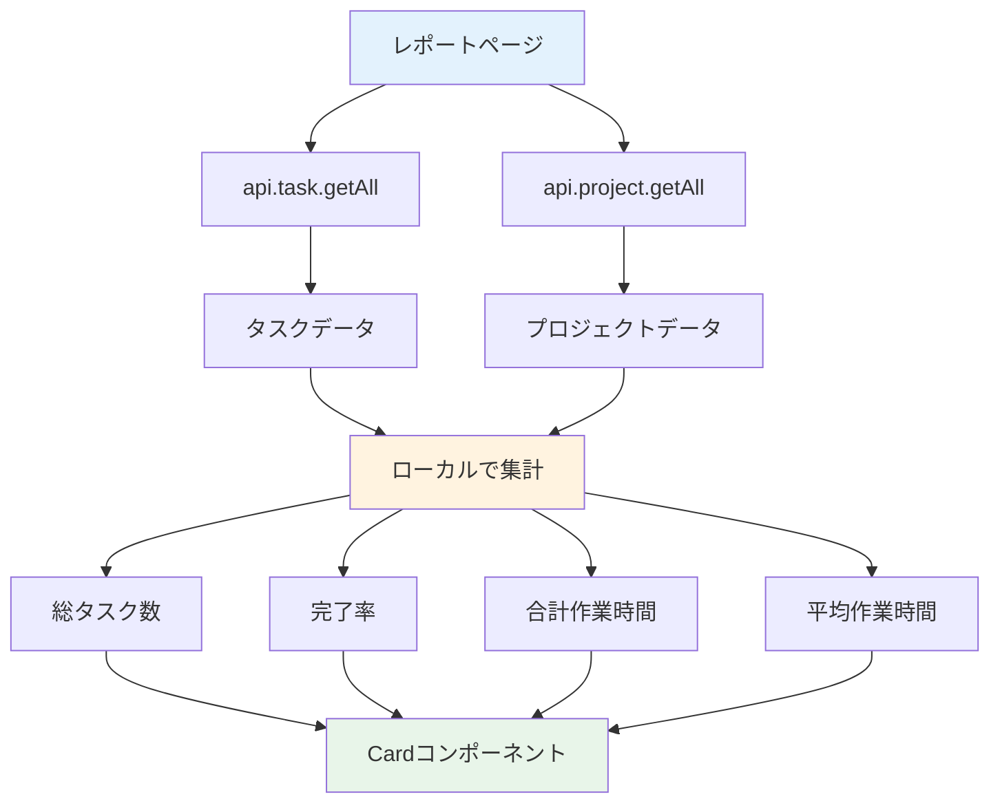

# Day 21: 統計カードを表示しよう

## 🎯 今日のゴール

レポートページに統計カードを表示します。
タスクとプロジェクトのデータをローカルで
集計し、4枚のカードで概要を表示します。

【スクリーンショット: 統計カード4枚】

## 🤔 なぜこれを作るのか？

プロジェクトの状況を一目で把握するための
ダッシュボード機能です。

> 💡 **例え話**: 統計カードは「車のメーター」
> です。速度計、燃料計、走行距離計を見れば
> 車の状態がすぐわかります。
> タスク数や完了率を見れば、プロジェクトの
> 進捗が一目で把握できます。

### 📐 レポートページのデータフロー



### やること / やらないこと

| やること | やらないこと |
|---------|-------------|
| タスク総数の表示 | 専用の統計API作成 |
| 完了率の計算 | グラフ表示（Day 22） |
| 作業時間の集計 | 週次レポート（Day 23） |
| Cardコンポーネント使用 | 専用コンポーネント作成 |

### 🆕 新しく学ぶ概念

| 概念 | 読み方 | 役割 | 例え |
|------|--------|------|------|
| ローカル集計 | — | フロントで計算 | 自分で電卓を叩く |
| reduce | リデュース | 配列を1つの値に | 合計金額の計算 |
| toFixed | トゥフィクスド | 小数点の桁数指定 | 四捨五入 |

## 📊 実装ステップ一覧

| ステップ | 作業内容 | 所要時間 |
|---------|---------|---------|
| Step 1 | ローカル集計の考え方 | 3分 |
| Step 2 | ページの土台を作る | 3分 |
| Step 3 | データを取得する | 3分 |
| Step 4 | 統計値を計算する | 5分 |
| Step 5 | 統計カードを表示する | 5分 |
| Step 6 | レスポンシブ対応 | 3分 |
| Step 7 | 動作確認 | 3分 |

**合計時間**: 約25分

---

### Step 1: ローカル集計の考え方（3分）

🎯 **ゴール**: なぜ専用APIを使わず
ローカルで計算するのかを理解します。

#### 2つの集計方法の比較

| 方法 | 仕組み | メリット | デメリット |
|------|--------|---------|-----------|
| サーバー集計 | APIが計算済み値を返す | 通信量が少ない | API追加が必要 |
| ローカル集計 | 生データから計算 | APIの追加不要 | データ量が多いと重い |

> 💡 このアプリでは `api.task.getAll` と
> `api.project.getAll` のデータから
> JavaScript の `filter` と `reduce` で
> 統計値を計算します。

✅ **確認ポイント**:
- ローカル集計の仕組みを理解した

---

### Step 2: ページの土台を作る（3分）

🎯 **ゴール**: レポートページの基本構造を
作ります。

💻 **実装**:

```typescript
// filepath: src/app/report/page.tsx
'use client';

import { AppLayout }
  from '@/component/layout/app-layout';
import {
  Card, CardContent,
} from '@/component/ui/card';
import { api } from '@/trpc/react';
import { Loader2 } from 'lucide-react';

export default function ReportPage() {
  return (
    <AppLayout>
      <div className="space-y-6">
        <h1 className="text-3xl font-bold
          tracking-tight">
          Reports & Statistics
        </h1>
      </div>
    </AppLayout>
  );
}
```

✅ **確認ポイント**:
- `/report` にアクセスして表示される

---

### Step 3: データを取得する（3分）

🎯 **ゴール**: タスクとプロジェクトの
データを取得します。

💻 **実装**:

```typescript
// filepath: src/app/report/page.tsx
// ReportPage内に追加
const { data: tasks,
  isLoading: tasksLoading }
  = api.task.getAll.useQuery();
const { data: projects,
  isLoading: projectsLoading }
  = api.project.getAll.useQuery();

if (tasksLoading || projectsLoading) {
  return (
    <AppLayout>
      <div className="flex justify-center
        items-center h-[60vh]">
        <Loader2 className="w-8 h-8
          animate-spin text-primary" />
      </div>
    </AppLayout>
  );
}
```

> 💡 2つのAPIを同時に呼びます。
> どちらかがロード中ならスピナーを
> 表示します。

✅ **確認ポイント**:
- ローディング中にスピナーが表示される

【スクリーンショット: ローディング状態】

---

### Step 4: 統計値を計算する（5分）

🎯 **ゴール**: タスクデータから統計値を
JavaScript で計算します。

💻 **実装**:

```typescript
// filepath: src/app/report/page.tsx
// 合計作業時間（分）
const totalTimeSpent =
  tasks?.reduce(
    (acc, task) =>
      acc + task.timeSpentMinutes, 0
  ) || 0;

// タスクあたり平均時間（分）
const averageTimePerTask =
  tasks && tasks.length > 0
    ? totalTimeSpent / tasks.length
    : 0;
```

```typescript
// filepath: src/app/report/page.tsx
// 完了率を計算
const completionRate =
  tasks && tasks.length > 0
    ? ((tasks.filter(
        (t) => t.status === 'DONE'
      ).length / tasks.length) * 100
    ).toFixed(1)
    : '0';
```

#### 各統計値の計算ロジック

| 統計値 | 計算方法 | コード |
|--------|---------|--------|
| 総タスク数 | `tasks.length` | 配列の長さ |
| 完了率 | DONE数 / 全数 × 100 | `filter + length` |
| 合計時間 | 全タスクの時間を合算 | `reduce` |
| 平均時間 | 合計時間 / タスク数 | 割り算 |

> 💡 `reduce` は配列の全要素を1つの値に
> まとめる関数です。`acc`（累積値）に
> 各要素の値を足していきます。

✅ **確認ポイント**:
- 4つの統計値が計算される

---

### Step 5: 統計カードを表示する（5分）

🎯 **ゴール**: 4枚のカードで統計を表示します。

💻 **実装**:

```typescript
// filepath: src/app/report/page.tsx
// 統計カード4枚
<div className="grid grid-cols-1
  sm:grid-cols-2 lg:grid-cols-4
  gap-4">
  <Card>
    <CardContent className="pt-6">
      <p className="text-sm
        text-muted-foreground mb-1">
        Total Tasks
      </p>
      <p className="text-3xl font-bold">
        {tasks?.length || 0}
      </p>
    </CardContent>
  </Card>
```

```typescript
// filepath: src/app/report/page.tsx
// 2枚目: 完了率カード
  <Card>
    <CardContent className="pt-6">
      <p className="text-sm
        text-muted-foreground mb-1">
        Completion Rate
      </p>
      <p className="text-3xl font-bold">
        {completionRate}%
      </p>
    </CardContent>
  </Card>
```

続けて、合計作業時間と平均作業時間のカードを追加します。

```typescript
// filepath: src/app/report/page.tsx
// 3枚目: 合計作業時間カード
  <Card>
    <CardContent className="pt-6">
      <p className="text-sm
        text-muted-foreground mb-1">
        Total Time Spent
      </p>
      <p className="text-3xl font-bold">
        {(totalTimeSpent / 60)
          .toFixed(1)}h
      </p>
    </CardContent>
  </Card>
```

> 💡 専用の StatsCard コンポーネントは
> 作りません。shadcn/ui の `Card` を
> そのまま使うシンプルな構成です。
> `toFixed(1)` で小数点1桁に丸めます。

✅ **確認ポイント**:
- 4枚のカードが表示される
- 正しい数値が表示される

【スクリーンショット: 統計カード4枚の表示】

---

### Step 6: レスポンシブ対応（3分）

🎯 **ゴール**: 画面幅に応じてカードの
列数を自動調整します。

#### グリッドのブレークポイント

| 画面サイズ | クラス | 列数 |
|-----------|--------|------|
| モバイル | `grid-cols-1` | 1列 |
| タブレット | `sm:grid-cols-2` | 2列 |
| PC | `lg:grid-cols-4` | 4列 |

> 💡 Day 09 のプロジェクト一覧や
> Day 13 のタスク一覧と同じ
> レスポンシブグリッドパターンです。

✅ **確認ポイント**:
- ブラウザ幅を変えると列数が変わる

---

### Step 7: 動作確認（3分）

🎯 **ゴール**: 統計カードの表示を確認します。

1. `/report` にアクセス
2. 4枚のカードが表示される
3. 総タスク数がタスク件数と一致
4. 完了率が正しく計算されている
5. 作業時間が時間（h）で表示される
6. ブラウザ幅を変えてレスポンシブ確認

✅ **確認ポイント**:
- 数値がシードデータと一致する
- カードが正しくグリッド表示される

【スクリーンショット: レスポンシブ表示】

---

## 📋 今日のまとめ

- [ ] ローカル集計の仕組みを理解した
- [ ] `reduce` でデータを集計できた
- [ ] 4枚の統計カードを表示できた
- [ ] レスポンシブグリッドを適用できた

## ⚠️ つまずきポイント

| エラー / 問題 | 原因 | 解決方法 |
|--------------|------|---------|
| NaN が表示される | tasks が undefined | `\|\| 0` でフォールバック |
| 完了率が整数になる | toFixed未使用 | `.toFixed(1)` で小数1桁 |
| 時間が分で表示 | 60で割り忘れ | `/ 60` で時間に変換 |
| カードが縦並び | グリッドクラス不足 | sm/lg ブレークポイント |

## 📝 今日学んだ用語

| 用語 | 意味 |
|------|------|
| reduce | 配列を1つの値にまとめる関数 |
| toFixed(1) | 小数点以下1桁に丸める |
| ローカル集計 | APIでなくフロントで計算する方法 |
| text-muted-foreground | 控えめな色のテキスト |

## 🔗 次回予告

Day 22 では、レポートページにグラフを追加
します。Recharts で円グラフを表示し、
タスクの分布を可視化します。
